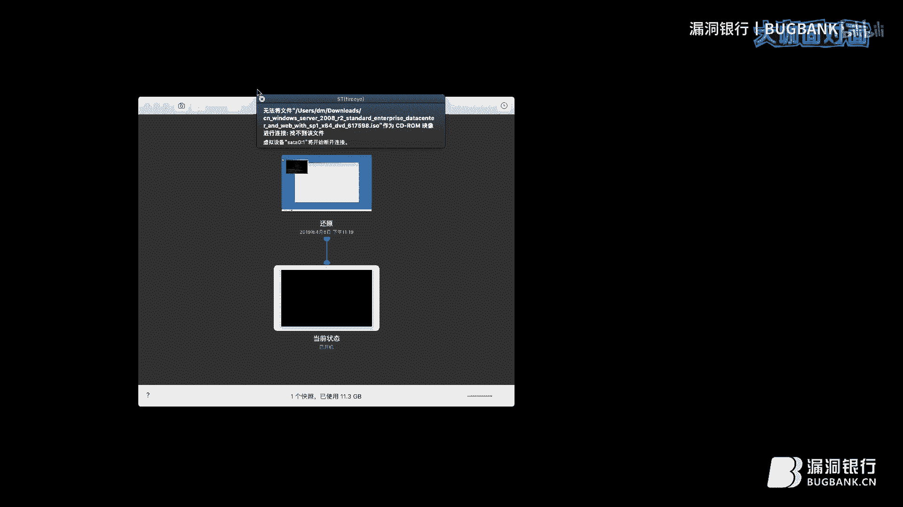

# 内网渗透实战指南（第91期）🚀

在本教程中，我们将跟随DM大咖的分享，系统性地学习内网渗透的完整流程。从获取初始入口点开始，到信息收集、权限提升、横向移动，再到持久化与痕迹清理，我们将一步步拆解每个环节的核心概念与操作要点。内容力求简单直白，适合初学者入门。

---

## 概述 📋

本节课我们将学习内网渗透的七个核心步骤。无论你拿到的是一个Web Shell、一个个人机的Beacon会话，还是其他形式的初始访问权限，本教程都将为你提供一个清晰的行动路线图。

---

## 第一步：入口点分析 🎯

上一节我们概述了课程内容，本节中我们来看看渗透测试的起点——入口点。

在实战中，我们获取的初始访问权限（即入口点）通常分为以下几种类型：
*   **Web Shell**：通过Web应用漏洞获取的服务器权限。
*   **个人机会话**：通过钓鱼邮件等方式，在目标个人电脑上获得的Cobalt Strike或Metasploit会话。
*   **浏览器控制**：通过水坑攻击配合BeEF等工具，控制了目标的浏览器。
*   **网络设备权限**：获取了目标边界路由器、防火墙或VPN设备的权限。
*   **物理渗透**：通过物理方式接触目标设备或网络，例如潜入机房、破解Wi-Fi等。

我们今天重点讨论的是，当获取到一台个人电脑的会话后，如何开始内网渗透。

---

## 第二步：判断环境与建立代理 🔄

在拿到入口点后，首要任务是判断当前所处环境，并建立稳定的代理通道，以便深入内网。

我们需要从三个维度进行评估：
1.  **网络区域**：判断主机位于外网、DMZ区、办公网、生产网还是运维网。不同区域的网络隔离策略不同。
2.  **主机角色**：判断当前主机的使用者身份（如HR、财务、开发、运维）。不同角色的主机上存储的敏感信息（如员工数据、源代码、密码表、网络拓扑图）不同，这决定了我们后续信息收集的主攻方向。
3.  **网络联通性**：测试当前主机能否将流量回传到我们的控制服务器。由于企业边界防护严格，传统的TCP/UDP协议可能被拦截。目前更常用且隐蔽的回连方式是HTTP/HTTPS、DNS和ICMP协议。

建立代理的常用方法有以下几种，建议优先使用目标系统自带的工具以减少被查杀的风险：
*   **反弹Shell**：例如使用`nc`监听，让目标机连接回来。
*   **端口转发**：使用Windows的`netsh`或Linux的`iptables`、`SSH`将内网端口转发到公网。
*   **建立Socks代理**：将整个目标机的网络流量代理出来，便于我们访问其内网。

---

## 第三步：信息收集 🕵️

上一节我们讨论了如何站稳脚跟，本节中我们来看看如何系统地收集目标信息。信息收集是渗透测试的本质，其深度和广度直接决定后续行动的成败。

信息收集可分为两大场景：

**1. 工作组环境 vs. 域环境**
*   **工作组**：针对单台Windows主机进行常规信息收集，需要关注当前权限（User、Administrators或System）。
*   **域环境**：需要收集整个活动目录（AD）的信息。如果权限足够，可以转储域控上的`NTDS.dit`数据库（包含所有域用户哈希值）。

**2. 域管理员 vs. 非域管理员**
*   **非域管理员**：可以利用LDAP协议查询域内信息，如用户、计算机、组策略等。
*   **域管理员**：拥有最高权限，可以直接转储并分析`NTDS.dit`数据库。

以下是常规的信息收集命令和关注点：
*   **系统信息**：`ipconfig /all`（IP地址），`whoami /priv`（当前权限），`systeminfo`（系统补丁）。
*   **网络信息**：`netstat -ano`（网络连接），`arp -a`（ARP表）。
*   **进程与服务**：`tasklist`（进程列表），`sc query`（服务列表），用于分析杀毒软件。
*   **敏感文件**：重点关注浏览器历史记录与保存的密码、数据库配置文件、共享文件、源代码、密码本、网络拓扑图等。

---

## 第四步：权限提升 ⬆️

在信息收集后，我们可能发现当前权限不足。本节我们将探讨几种常见的提权方法。

权限提升主要分为以下几类：
*   **内核漏洞提权（EXP）**：利用如MS16-032、MS17-010等系统内核漏洞。公式可表示为：`存在漏洞的系统 + 利用程序 = System权限`。**风险**：可能导致系统蓝屏，使用时需谨慎。
*   **活动目录特性提权**：
    *   利用组策略首选项（GPP）中遗留的加密密码。
    *   利用MS14-068等漏洞将域用户权限提升至域管理员。
*   **Windows非EXP提权**：
    *   **DLL劫持**：劫持系统或软件启动时加载的DLL。
    *   **服务路径劫持**：利用服务路径未被引号包裹的漏洞。
    *   **第三方服务提权**：利用以高权限运行的服务（如数据库、某些应用）的配置漏洞。

**UAC（用户账户控制）**：在Windows Vista及之后版本中，即使用户在Administrators组，执行特权操作时也会弹出UAC确认框。我们需要绕过UAC才能获得完整的“高级别”令牌，进而提升至System权限。

---

## 第五步：横向渗透 ↔️

获得足够权限后，我们就可以在内网中横向移动，控制更多机器。本节我们将学习几种主流的横向渗透技术。

横向渗透技术多样，主要包括：
*   **哈希传递（PTH）**：无需破解密码明文，直接使用用户的NTLM哈希进行身份验证。命令示例：`mimikatz “privilege::debug” “sekurlsa::pth /user:Administrator /domain:test.com /ntlm:<hash>”`
*   **票据传递（PTT）**：使用Kerberos票据进行身份验证。
*   **密码喷射/爆破**：针对内网中的常见服务（如SMB、RDP、MySQL）进行密码尝试。
*   **利用软件分发系统**：如果内网部署了EDR（端点检测响应）或软件分发系统，且我们控制了其后台，可以直接将木马分发给目标机器。
*   **利用Web漏洞**：内网中常存在安全性较低的测试服务器，可通过常规Web渗透手段获取权限。

---

## 第六步：凭证获取与持久化 💾

控制更多主机后，我们需要获取凭证并建立持久化后门，以保证长期控制。

**凭证获取主要有两种方式：**
1.  **在线读取**：直接在目标机器上运行Mimikatz等工具从内存中抓取密码哈希或明文。**优点**：方便快捷。**缺点**：容易被杀毒软件拦截。
2.  **离线转储**：将存储凭证的关键文件（如`SAM`、`SYSTEM`）或进程内存镜像（如`lsass.exe`）转储到本地进行分析。
    *   **示例（转储lsass进程）**：使用微软官方工具`procdump`：`procdump.exe -ma lsass.exe lsass.dmp`
    *   然后将`lsass.dmp`文件拖回本地，使用Mimikatz加载分析：`mimikatz “sekurlsa::minidump lsass.dmp” “sekurlsa::logonPasswords full”`

**持久化后门**的目的是在系统重启或会话中断后，仍能保持访问。常用方法包括：
*   **计划任务**：`schtasks /create` 创建定时任务。
*   **服务**：`sc create` 创建自启动服务。
*   **注册表启动项**：`HKLM\Software\Microsoft\Windows\CurrentVersion\Run`
*   **WMI事件订阅**：非常隐蔽的持久化方式。
*   **域环境持久化**：如黄金票据、白银票据、DSRM密码同步等。

---

## 第七步：痕迹清理 🧹

在渗透行动的最后，清理操作痕迹至关重要，以避免被防守方发现。

需要清理的日志主要包括：
*   **系统日志**：清除`Security`、`System`、`Application`日志中与渗透相关的条目（如事件ID 4624登录、4625失败登录、4688进程创建等）。
*   **Web访问日志**：清除访问Web Shell或后门时产生的GET/POST请求记录。
*   **第三方服务日志**：清除如数据库、应用程序等服务的相关日志。
*   **文件痕迹**：删除上传到目标机器的工具二进制文件。
*   **网络会话**：清理使用`net use`等命令建立的连接会话。

**注意**：在企业环境中，日志常被集中发送到日志服务器（SIEM），本地删除可能无效。因此，操作应尽可能隐蔽，减少日志产生。

---

## 总结 🎓

本节课我们一起学习了内网渗透的完整闭环流程：
1.  **入口点分析**：识别初始访问类型。
2.  **环境判断与代理建立**：评估网络位置并建立稳定通道。
3.  **信息收集**：全面收集系统、网络和域信息。
4.  **权限提升**：利用漏洞或配置问题获取更高权限。
5.  **横向渗透**：利用凭证或漏洞在内网中移动。
6.  **凭证获取与持久化**：抓取密码哈希并建立后门。
7.  **痕迹清理**：清除日志，掩盖行踪。

记住，内网渗透是一个系统性的工程，需要对操作系统、网络协议和安全工具有深入的理解。希望本教程能为你打开内网安全学习的大门。