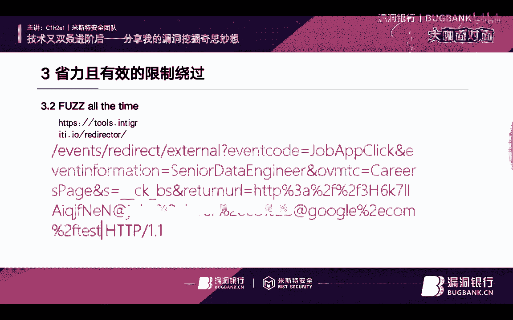
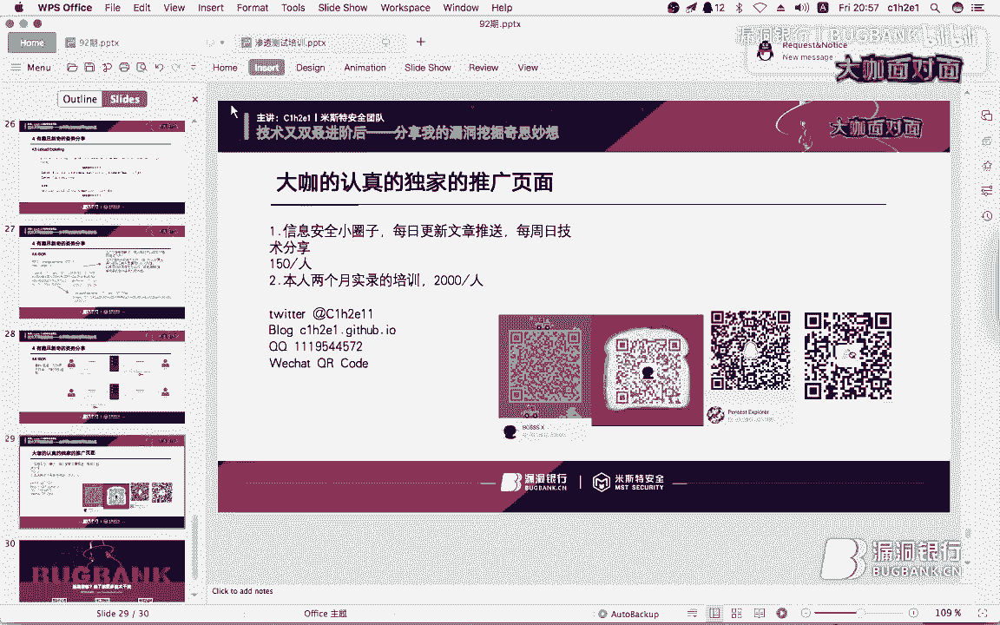

# P1：92期衬衫录屏_x264 - 漏洞银行BUGBANK - BV1qx411d7fW

Yeah。Yeah。为知识而存，因技术而生，各位小伙伴们，大家晚上好，欢迎参加第92期漏洞银行安全技术直播大咖面对面。我是今晚的主持人年念。今天晚上我们邀请到的大咖是来自米斯特安全团队的新活力衬衫。

认真说起来，这是衬衫大咖作为正式的演讲者三刷直播间。给之前的分享问简上传s之后，这次衬衫大咖给大家带来的技术内容是分享他的漏洞挖掘奇思妙想。衬衫大咖风趣的演讲风格，再加上诚意满满的干货内容。

相信本期内容一定非常精彩。感兴趣的小伙伴们可要听到最后哦。同时欢迎各位小伙伴们登录直播间，在聊天区进行互动讨论，随时提出问题。在直播演讲完毕后，大咖会在行长问答环节为大家解答。并且在赠书福利环节。

衬衫大咖会挑出最认真听讲的观众。选出他挑选的书籍外部安全攻防渗透测试实战指南。那么下面我们就有请衬衫大咖开始今天的直。播分享吧。🎼ok小伙伴们，大家准备好了吗？嗯，现在就开始吧。大家好。

我是CAHREE是衬衫，也是bossS嗯。😊，🎼今天在这里给大家分享的一题是关于我的漏洞挖掘的一些奇奇妙想。那么我是先介绍一下我自己吧，我是来自河北省秦皇岛市的一名嗯在读学生。嗯。

我是一个热爱技术的年轻人，身上于漏洞挖掘，对深酮测试有独到的见解。🎼其实也都是瞎扯的，就就喜欢玩嘛啊，所以才这样的，那么对生活和学习之路有自己的追求和理想，那就是瞎玩嗯。😊。

🎼我是来自米斯安全的新生力量，也感谢T师傅和各位师傅对我提出无脑问题的耐心解答，也呃也帮我一起去。😊，🎼怎么说呢？帮我一起去。🎼嗯追求我的女朋友啊，这个这个就不多说了。那么嗯就不拉巴拉一的堆。

那我们就开始今天内容。🎼嗯，第一点是我们的目录，在目录下面我列出了四个排比句。第一个我们就是快速且全面的信息收集。第二个是准静准精准且极巧的漏洞挖掘，省力且有效的现阶绕过。

然后最后一个是有趣且新奇的知识分享。在这段时间里面，我。🎼在学习过程中的话，找收集了很多大案例，也希望就是比较比较有意思给大家分享一下。那么我们话不多说就开始吧。🎼嗯，在过去的我啊。

就是每一天啊沉迷在看书和看视频。那虽然那些培训啊，这就到涉涉及到一个培训的问题了。其他人的培训呢，他们的培训特别特别老。🎼hello， everybody，我没不那个嗯我不看先不看弹幕了啊。

那嗯这个过去的我沉迷在这种学习学习的一个方法里面的时候嗯。😊，🎼有一些局限性，就是说那些视频很老，对不对？所以这个培训的问题我们后面再说，好吧。嗯，那么我们在学习到这个信息收集方法里面。

传统的话一共是下面的几类。第一个是。😊，🎼嗯，ho意的一个信息。第二个子域名，第三个IP段，第四个端口探测，第五个是目录扫描。嗯，其实大家也都知道一个就是所谓的渗透测试的一个三字经嗯。

🎼就是禁谷哥找入入，没入入就旁住，没没旁住，用零备，没领被猜目录，没目录报就就秀探报报账户，找后台传小码，放大码，拿权限挂页面，方案恋清数据，对吧？其实就是这样的一个东西。

在过去的话也是引导了我的所有的东西。但现在的话。🎼一切都做了一个改变啊，我们先先讲一下原来我所做的一个收集方法啊，第一个是who is who is的那个嗯呃收集。首先我我是用了那个那个。

然后他那个就就就是一个通终端嘛，然后linux终端的话，然后 is然后加那个域名，这样的话就可以获得到一些呃比较有意义的信息。虽然这样的信息啊，可以说是心理安慰，也可以说是瞎扯。

因为我从来不靠那个东西去收集一些真正有用的东西，就是说嗯怎么说呢？就是说你要弄的话，你必须得去是吧？你就安慰一下自己，所以我每一次都会做ho is。然后呢，第二个是子域名。

子域名是我在整个漏洞挖掘过程中的话，会用最多的东西做信息收集。在过去很早之前，我记得有一次呃浪子表哥给我一个漏洞，但是那个漏洞的话是微访问，然后。😊，🎼呃，他告诉我要做信息收集，而那个时候的。

我真的是特别就就是。😡，🎼倒不行啊，那个时候我根本就不懂什么信息收集，我就直接拿电脑就就完了呗。那你你还等什么呢？那就赶紧把漏洞给我吧。然后呢，那个时候啊我就什么也没不管，我上来就直接干，直接干之后呢。

我发现什么都没有，那怎么办呢？然后我突然然后呢浪子表哥告诉我，你要去测试一下子域名。这个时候我突然想到啊，我每一天我都说子域名子域名呢，我怎么从来没做过子域名呢？然后就恍然大明白，这个时候。😡。

🎼我就做了一个子域名的爆破。这关于这个紫域名爆破的话，有layyar的子域铭挖掘机和sabbert。这个工具的话也是啊我相信大家都很很有意思的，这都很都用过很多次的对吧？嗯，这就不太不太就就不太细讲了。

那么。😊，我们在。Sorry。在这样的那个呃这样的一个方法下吧，然后我发现这个子域名啊，这个子域名是testAPI点。🎼叉叉叉叉叉叉叉点com嗯，我一想完了，那肯定拿到钱了。然后我就一下我打开。

我兴奋打开，然后呢，突然发现一个齿轮，就是一个啊那样的齿轮，大家能理解吗？就是说这个页面是正常的。😊，🎼那唉你不说好都有钱吗？你不给我钱，你什么毛病？然后呢，浪子表哥我就把页面发给浪子表哥，浪子表哥。

你是不是骗我，你怎么这样呢？然后呢他告诉我，不是这样的，你还要再做信息收集。这个时候我就涉及到了第四个就是端口探测。他告诉我，哎，你扫一下端口试试。然后我就想啊这样的我就用按m杠P杠。😡，一看哇。

发现了94端口未授权访问啊，是非。🎼为什么94端购到现在还背的？就因为我觉得这个东西给我记忆很深，就因为他我才走到就1。1点才到这样。所以我啊非常感谢浪子表哥，你什么时候跟我说了，我有聊天记录啊。

你怎么不信呢？啊，就是1。1点的去引导我，他是一个好人啊，是个狠人。然后呢，子云的话，后面我还用到了gogle doc。虽然那个时候我从来不FQ啊，大家懂什么意思？然后呢，所以我都使用百度doc。

能理解吗？😊，🎼百度语法啊，sit叉叉叉叉叉点comM啊。🎼嗯，然后呢我们会进行一个目录扫描。那个时候啊目录扫描用什么呢？有一个非常好的东西叫。😊，🎼遇见我第一次啊上上一次技术分享的时候，我也说过遇见。

就是说我第一个第一次做梦做那个渗透测试的时候，刚刚开始的时候，我在网上找了一套某某大侠某某工具包，然后呢把那工具包解下来，我就发现哇，好厉害，什么各种各样的黑夜呀，哇啦哇啦。😊，🎼乌漆麻黑的黑。

那那都吓得我都立马我都对这个一下就感兴趣了。然后一直学就是这个东西。😡，🎼啊，然后我就看到了一个这个那那里面叫遇见的时候，然后呢，我就打开了那个工具，那也是我第一次使用它，也是我爱上目录扫描的嗯。

🎼那么这个google到的话，不sorry这个目这个目录扫描的话，其实嗯在遇见的方法和这个W发其实那个DR search啊，DRbuer啊gogo booster基本上都是一样的那都啥玩意儿。

你就随便一弄就行了。其实。😊，🎼这就是目录扫描。关于目录扫描的话，我相信大家就是一定要有。一定要去做吧。嗯，在我的培训之中。🎼嗯我毫不毫毫不犹豫的告诉大家啊，我心里毫无过来啊。

那个在我的培训之中有一个学员，然后呢，某一个学员在ha客 one挖到了P，哎，不是在把 crowd，sorry在把 crowd挖到了P0logo。那个学员泄露了整站的信息，和整站的日志文件。

还有整站的敏感数据，还有整站的订单啊。😊，开心。😊，🎼浪子，你不要看我这样的，我很开心，你知道当当时他挖到的时候。😊，我立马冲进了星巴克，点了一杯星名乐。嗯。🎼这个东西嗯怎么说呢？

就就是就是看他长大了嘛，就是然后呢我不知道楼蚁表哥在没在这个在没在里面啊，他确实非常的用心啊。😊，🎼嗯，在P零动洞之中的话。🎼应该是拿到了不少的钱，不知道那个红包什么时候才能安排给我，我没有在暗示你。

我只是想说这个对吧？晚啊，那么这个目录扫描的话，我相信大家已经很有这个思想体会了，就是它的一个作用，包括我自己的啊一些绝缘们，他们也在这个东西。😊，里面也是经常的使用这个目录扫描拿到。🎼钱对吧？

那么我们的过去信息收集其实就是这样的，很娱乐。所以。😊，到现在的话。就下一个好吧。🎼那么在过去的一段时间。🎼我没有暗示，我认明说啊啊优缺点啊，第一个优点爆破类依赖于次典。

疑问强大的字典也可以发现许多有意义的资产。这个事情我相信大家也是。🎼心领神会啊，在爆破类的时候，为什么会有这种啊fa dB啊啊叉叉叉DICT呀某某某字典呢啊什么什么啊，你买了我就是大家能理解吧。

那字典乌拉乌拉一大堆是吧？你就比如说我的giub，我至少克隆了得有十几分字典放着放在我的那个电脑里，但是这些字典真的就是一份强大的字典可以发现许多有意义的资产，这句话真不白瞎啊，真不白说。

上一次呢我挖到一个漏洞啊，上面那个域名子域名非常有意思叫SB杠AAUTH啊，这个SB可能不是我们理所理解的SB，但是它那个确实有这个意思啊，而在这里面我获得到了啊敏感信息的泄露。

在某一个UL也是加了目录爆破之后，也非常感谢这位字典的提供者，因为你的SB所以我也导致我赚钱之后十分的SB。😊，🎼谢谢你啊，那么嗯这就是第一个优点，然后第二个优点就是。🎼啊。

可以发现多级域名在多级域名里面，我们可以可以多次使用爆破，对吧？地归嘛，但是是吧？它有一定的缺点。第一，子域名遇到泛解析吧？有泛解析，还有各种各样的什么，你这个第三方的各种各样的乌拉乌拉策略。

你一看这策略的时候，脑瓜人技疼啊，我一点都不想整了，我你我就好不容易挖个洞西，使这老爷策略，你啥意思呀？我干点容易，我干点这玩意儿容易，我是学都不上，我给你整这玩意儿来是不不容易是吧？

那么这个东西就很伤脑筋。然后第二个就是我们的时间消耗很大，大家知道嗯。😊，我们的那个。嗯。🎼放到服务器里跑啊，放到什么东西跑，它需要一定的时间，对不对？所以开销耗时间很长。对于我这种急性的人来说。

那我就是脱了裤子这样干，那不可能就直接让我对吧？所以我们这样磨蹭，那我不喜欢，所以我立马就跳过了。啊，这就是我过去的信息收集。那我们快速且全快速且全面的信息收集的话。😡，怎么办呢？

🎼就要使用下面的我的啊学起来啊，我就简单列了4个，在我脚本里还有很多，大家顺便可以关注一下我的gatet up啊，CEHRE1啊。😊，🎼先我相信大家都知道了是吧嗯。😊，🎼那第一个子域名收集子名搜集。

关于子名搜集的话，我现在做了下面如下的几个。第一个我比较喜欢的就是郑州反茶嗯，郑州版茶还有CRTSH，还有CSIO嗯CCENIYS点IO啊，然后呢，郑书反查的话网上有很多很多，对吧？

然后我相信这个东西大家就。😊，🎼啊，随便的一搜一下就找到了，对不对？那么这个啊是一个，那么还有一个是什么呢？我们还可以做一个爆破，对吧？你光用这一个证书反查，有很多查不出来的。比如说SB杠UTH对不对？

那这找不到怎么办？那你就完了嘛，对吧？然后呢，还有我还会用一个doc就是google doc呀、百度doc呀，da go啊等等各种各样的。虽然我只是在吹啊，我只用google doc什么大，我听不懂啊。

然后呢 total这个很好的一个东西，对吧？大家知道。😊，🎼这个是一个病毒的分析嘛，这个东西也是非常有意义。然后呢，DNSper。🎼贼厉害啊，就是也能找到一些。然后呢嗯可能需要付一点费啊。

这个反正我你要钱打死我算了，你不可能怎么可能花钱呢，对不对？嗯，然后呢在里面有很多的名暴露出来。比如说你可以搜一个一域名对吧？比如说叉叉叉点然后就可能叉叉点叉叉叉叉点com你再搜叉叉点叉叉叉点啊。

技住加引号啊，然后就可能出来叉叉叉点叉叉叉点叉叉叉点O这是这样的一个意思，在ub里面啊，然后呢，第二个断口扫描，在过去的时候我是杠P杠对不对？啊，那玩意什么东西？

我现在使用这个杠S大S杠A杠PN杠P杠杠杠等于HDBtit。😊，🎼然后呢。🎼scan me点 bro啊等等。各种各样的这个扫描策略。大家可以去看一下，呃，很多这样的ch sheet都有这样的文章啊。

就是各种各样的文章，什么NN呀，最佳扫描策略，你都最佳了，那我肯定也得使你，对不对？那。😊，🎼我相信大家都知道是吧？然后呢GS文件嗯GS文件我也是在这段时间之内特别喜欢它。

因为我确实给他挖到过一些比较有用的漏洞。比如说某某网站的某某任用户啊，某某就没有某某了某某网站的任用户登录，对吧？我就通过一个GS找到一个point在这个里面啊在GS的时候，我们可以使用s加话。

后面我们会提啊的话，大家可以去找下脚本。而这里面啊sab和的一个结合的话，它是需要一个脚本的啊，大家如果找不到原来那个脚本的话，顺便可以关注一下我的github啊，我的giub是CEHRE啊。😊，OK。

啊，这个找到大家是可以找到。但是如果大家想快速找到的话，可以关注一下我的那个对吧？😊，🎼那么GS文件的话啊，sGS就够了啊。第4个and point用这个。🎼端点的搜集的话，我是深有心得。

因为在过去一段时间里面，我用端点发现过好几个比较那样的漏洞。比如说URL跳转，对吧？你想一下你跳转的点。🎼哎，sorry啊，就是说你这个跳转直从GS里提取说啊，你这个GS里面提取under point。

😡，🎼啊，CEHRE也没毛病啊，你怎么这么这么说呢？兄弟，这个在GS里面啊。🎼提取它是非常简便快速的，而有一些是找不到的对吧？就你呃我一直跟培训的学员他们说，你们啊挖的时候一个一个页面的看，对吧？

那有的时候那我就是懒。😡，🎼对不对？比如说你好，同学，他每一次挖完洞之后都会睡一个觉，这个这个毛病就必须要改。所以呢有一个comman crew。😡，🎼这个东西是一个公益组织。

他们会每个月去定期的去爬那个全网的那个东西。那这个东西就可以去帮我们找到这一些是吧，找到一些端点。我们在这个。🎼啊，大家可以百度一下com crew啊，也可以啊在我gethub的脚本里面找到它啊。

我getthub地址是CEHRE1啊，感谢大家的收看。嗯，这就是我现在做收集信息收集。那么点点点啊，我们接下一步 back machine在back machine里面的话。

我也是第一次看到我是在某一个白帽子课程里面看到了这个东西也是特别有意思啊。点 OG然后呢这个是一个比较有意思的，就是最新的。😊，🎼大概是在昨天还是前天的时候，在twitter上看到了一个表格。

它有一个啊更新是这个，然后还有一个wordl word world list，但那个东西我感觉是。🎼用没有，就是他那个东西特别。对吧根本就是。🎼所以我就不用那个。

我就用coer杠SHTTP点Yach点ORGCDS searchCDS search置CDS问号URL。🎼这个百度点com可以忽略啊，斜杠星，我们可以把它做成脚本。

把百度点com设置为do一啊out food test FL original嗯URLK这个时候我们就可以提取出来它的基本上就是过去的端点会有乌拉一下一大堆啊，大家尽量直接输出到文件里面，对吧？🎼啊。

然后一个一个看这样很方便。然后呢common crew也是一样的，它也会输出乌拉一大堆。然后我们可以输出到文件里面1。1点去看啊，要细致才能拿到一些比较有定的东西。然后呢，外b有点ORG。

它就是一个过就是说它为什么叫网站时光机啊，它就是说很长一段时间，就一段时间之内他会给你的网页做截屏，而这个截屏不是说我们像那个啊百度啊他们的快照一样。而这个东西是把功能点什么GS都给你截下来，对不对？

给我们一个方式。你看这里面是不是百度的GS，对吧？所以。😊，能理解吗？而有很多GS里面就有很多端点，很多端点。就比如说啊这业务可能死了，端点没下架，对不对？这个东西我也深有体会。

在某一次在我的某一次培训之中啊，我也是用这个东西挖到了某一个厂商的SSF漏洞啊。😊，🎼好，不多说啊。虽然那那段那段没有录起来啊，直接给删掉了。我相信大家还是能理解的啊，那么我的脚本。😊，🎼啊。

大家可以把coer杠S127。0。0。11212333给去掉。这个就是我那个SSR啊。那么这里面我用了科man crew点OG，然后我用了DNS buffer over嗯，还有一个。

🎼CRTSH用这三个东西去收集子域名，这样的话会呃第一个是underpoint啊，用这两个后面两个东西收集子呃子域名，这样的话会有很多的呃那个能理解吧？很多的子域名。然后呢，underpoint的话。

我会跑一遍sabGS嗯，关于这个sabGS的话，它写作者非常的那个所以我们大家尽量在服务器上运行它，能理解吗？🎼然后呢，我用的因为他这个啊直接输出jason，而我可以用JQ，但我没用JQ，因为我比较菜。

我又喜欢用grave啊，我直接正则匹配一下就可以了嗯。🎼AGBS点新点GS啊，然后杠O直接输出到这个GS点TSD，然后去虫。🎼这个时候啊你看link finder点SH这个东西怎么找是吧？

大家可以打开github搜索一下CEH2E1就可以找到它啊。好，不多广告了啊，我是一个不不爱打广告的人。😊，啊。🎼第二个我们要讲的是啊，下面就就进入我们第二个大标题啊，精确且机巧的漏洞挖掘啊。

GS寻找Npoint这个有一个bp的呃一个。🎼呃，插件这个bb插件的话是bb GSlink finder在那个inter root里面，这个这个这个人有啊，但我不愿意给他打广告，大家直接搜搜好了啊。

搜bb GS link finder啊，这就是通过GS里面找，然后还有1个GS这个里面。啊，我的那个。🎼我在服务器上搭了一个非常好用啊，越用越爽。就是说你。🎼一就一下就能直接找到，所以嗯就非常舒服。

那第二个就是针对业务寻找重点。其实针针对业务，我想说的是寻找的是端点和参数，这样的话我们才能去做一个做一个利用。那么这个东西的话啊嗯其实也就是收集参数和那个什么。🎼然后这个参数提取的话。

上一期我也有讲过啊，上一期的那个发子里面有讲过，有些插件可以去提取参数，也是非常有意思啊。然后呢尝试别人没有测试的参数，这也是非常有意义的。然后就是盲测啊，用大脑去思考，这就是我。🎼投额非常少的原因。

那么还有一个过去漏洞再利用，这个可以SM17啊，我们的小圈子里面的一位表哥啊分享过自己的一个经历。他说嗯。这个东西。🎼他要去通过过去过去漏动的话，然后去再做一个绕过，然后成功利用，对吧？啊。

这个小圈子里的SM17能理解吧？啊。Sorry。🎼调调哪了啊，第二个盲测啊。🎼Clloud out everywhere。🎼这个东西好用啊。大家可以去自己去。🎼看一下那个那个能理解吗？

可以去在那个github上呃，找一下，或者是在那个呃bb上直接安装。嗯，虽然这个东西不是盲测出来啊，这个东西确实是有一些有一点盲测的感觉啊。这边大家不知道能不能看清，我这边也看不清。

就是EN斜杠P点PHP。🎼嗯，这个是这样的，我把配套给它打出来啊。嗯。这就是一个啊co injection啊，然后呢这里面大家可以看到。查slinkIP。插入UIP。Forword里的。Contact。

🎼trues IsIs IP，这里面每一个都有一个cloud order的那个对吧？所以这就是为什么会有那个cloud everywhere非常好的一个东西啊，他在做盲特的时候。🎼呃，十分有用。

那么我们在测试的时候也不妨使用它一下，对吧？也不太麻烦，就是往里面注入host。啊。啊，第二个。🎼2。2，我们要寻找别人用不到的参数。🎼别人用不到参数这个案例，很感谢我们培训的某一位学员啊。😊，激动。

你好，同学，在hager万有八道的高危啊。😊，低调啊低调低调。他告诉我一定要低调嗯。🎼这个漏洞的话还在定机中没定场进啊。SSRF漏洞某一处SSRF啊，这里面用到了imsURL，实际上它只有这个目录。

没有这个参数啊，这个位置稍打个问号，sorry，这个地方对吧？😊，🎼HTBSgoogle点com对吧？然后呢。🎼这个参数就是对吧？你别人没有找到这个参数，它是做了一个发子啊，ADB这个是。

🎼这个是那个啊爆破那个get和po参数的，能理解吧？然后呢。🎼the king of duck鸭王的表格的发自字典里面有一个。🎼专门的参数字典，这里面确实很有意思。那么。大家要知道啊。

🎼这个东西其实也就是你发现和没发现的区别，能理解吧？你看这个。🎼啊，你好，同学就发现了，很多人就没发现，对不对？这就是差别。🤧学习啊要学习。😊，🎼然后三点一我们要讲省力且有效的兼制照顾。

在我们的bypass过程中的话是吧啊，各种各样的什么，你这拆封又又这拆方又这那玩意儿的。🎼我懂这个吗？我本来就是吧就笨，那我上个学我挺不容易的，你只让我学这玩意儿能行，我不学，我就使用fas。😡。

🎼是吧我就用一些其他的骚招，是不是啊？这个图啊不是我画的，是呃my name上的一位同学画的，因为我画图啊不是那么好看。嗯，大家也可以在我的博客上看到我的图片。😊，🎼啊，CEHR1点github点L啊。

那么在字典里面有s list payload all the thing啊in the payload然后啊fa d B啊fasDICT啊，就是那个tion然后等等等等。

我这里面就选了比较就就我随便来弄俩啊，这里面的话。😊，🎼非常有意思啊。🎼嗯，在配套的准备这过程中的话，大家尽量是多弄几个配料的字典，哪怕是换着来，哪怕是做一个整合，然后再去虫也是比那样的一个强，对不对？

那么发骚 time嗯，这个时候要介绍一款工具啊，这也是。

我能退出PPT是吗？🎼OK嗯，这也是昨天刚刚啊在推特上更新一款工具。🎼这是一款非常容易的工具，对吧？我们可以reate from是吧？red to我们test点com。透面ネーム。🎼提交。嗯。看吗？

能理解吗？🎼因为它是b也好友好型，所以我们其实这样的话也是没什么，就是因为它这边有发子到这个，其实也就是后面的这个配套的做变化。然后呢，那个参数是没有变化的，前面这段东西基本上都一样的。

而实际上其实变化的唯一的东西就是这个东西。な了吗？🎼啊，这个大家知道这个东西是可以做一个就假装做一个白名单，能理解吧？然后再用它去找也是很有意思。但是呢啊这个东西其实。

🎼可以直接用那个发案字典去字典去那个。🎼就是直接用发字典去那个呃代替它啊，然后这个时候也要讲我ha客万的一个漏洞啊，这个漏洞是redt。🎼外部然后等等各种各样的东西。

这个时候是coman crew的那个。🎼用com crew寻找到了这个端点，然后有个return URLRL，我立马一看啊，这个地方我要不测URL跳转来，我都给自己一个嘴巴子，那立马就测上来就测是吧？

google点com一跳哎，跳回主站，那什么毛病，然后我再设设设置成白名单的一看哎成功兄弟，那是不是这是不是w list啊，那立马就跑发子跑了一堆乌泱乌泱那请求看的我这是直脑心。😊，对吧。

🎼然后最后成功的跑出来这样的一个东西，然后跳转了。然后。🎼就钱嘛啊。🎼都懂了啊，这就是为什么要发的 time。在这个时候，我们在船都绕过的时候，都可以使用如同的如下就就是同样的方法去做这样的方式。

就比如说是吧你同你去弄一堆那个啊字典的，然后在那个 inder去跑也是一样的效果啊，SSF呀，查SS啊都是一样的啊。CSF。🎼嗯，我写过专门的一篇CSRF的bypass文章，虽然写的不好啊。

我知道我我很菜，但是大家那个随便讲一下啊，就是我们为什么要去做CSRF的bypass。😊，🎼第一个啊就是先知道谁拦住我们啊。😡，🎼第一个啊screen head这个底噪是我这电脑运行的时候。

就是旁边那台电脑。🎼就这样子啊，scred header啊，关于这个screened headder的话，我相信大家都都都能知道是吧？嗯，就是那个。🎼比如说。啊，token啊等等。

我另外一台那个那个那个。那个公班图的这个。啊，然后呢set headder啊就是各种各样的那个比如说CSRF token呢，就是头部嘛。然后呢，第二个就是token。这个token的话是我们遇到最多的。

所以我们要重点讲它，然后refer在refer里面其实也就是一个无无非就是一个点，就是你的那个。🎼嗯，就就就就是你那个正则的绕过嘛。

然正则的话可以大家去找一下啊regular expression的那个bypass在网上有很多这样的文章啊，你就绕这个正则，要绕那个正则怎么绕怎么绕都可以啊。然后呢删除CSRF token。

关于这个删除CSF token的话，啊，就就是我们找到了这个啊就是限制我们三个的限制我们CSF的三个东西，那立马就使用了。呃这个。嗯。🎼这个rogo方法，然后呢我们就盘它。第一个删除CSF token。

这个东西也是非常有意义的。我们在。🎼把那个直接token给删掉是吧？就是把那个hider啊，或者怎么样里面的token给删掉它，就把那个整个东西都删掉。然后呢，第二个是智空token参数。

也就是把token的Y6给删掉。🎼然后呢，修改的修改请求的那个呃修改请方法，这也是非常有意思的嗯。我们在那个。🎼就是在很多测试里面的时候，会有一些嗯w up。

大家可以看一下那个各种各样的w up里面就会有一些那个。嗯。🎼呃，关于这个修改方法的，比如说那个啊post改成ge，然后或者其他这样的那种。

然后呢呃put呀等等各种各样的方法都有去改这种启动方法去做byha，这是非常有效的一种方法。然后就是与token相同长度的字符串去替换token啊，这也就是就是foFOO，然后呢。这样的话去做替换。

然后就是固定token。啊，工定操感的话也是十分。🎼有意思，就比如说用户A它token可以给用户B用，能理解吗？啊，这就是我们的CSF web pass，然后3。4啊就是我们的省力且有效的限制要货啊。

编码呃，sorry这个3。4大概头是编码啊。🎼编码的话就是嗯这有这个网站啊，这个这个是应该大家直接杠直接打开的话，好像打不开。嗯，但是这这个东西大家可以从网上找一下。

直接找一下unic扣的那个嗯这个网站的话嗯。🎼它是整一就是1个PPT嗯，也没太大意义。但是我给他放过来，其实就是因为它这个。比较特殊的一个东西嗯。🎼我们来讲一下啊，127。0。0。

1translate to0。0117。0。0。01。其实也就是啊编码啊，然后呢这个ATTB呃不ATTTB也就是编码，然后等等各种各样的。

然后我们这边的叉S payload也是编码wa by pass sheet这里面也有大量的编码，就比如说。🎼那个基本上大家用的unicode什么的，各种各样的都比较多。

有的时候吧我们的这个东西就那天有一个有一个人问了一个问题，就是说他问我这个。怎么才能那个。🎼就问我为什么我博客这叉SS配的不是每一个都能弹窗。我说有些东西它不是为了弹窗用的，它是用来bypass的。

能理解吧？就是说它有些东西可能就是嗯就把把那个就变成另外一个东西了，能理解吗？就比如说啊兼括号是吧？你可能URL编码之后，那你你传传过去。但是他那边解释成了兼括号了，那就成功的绕过了，但是你直接执行。

它可能执行不了，能理解什么意思吗？这就是为什么要编码啊。😡，然后你们我这个笑哭这个表情，我相信大家很多人都在用，对不对？我可以。给大家发一下这个普通校哭。就这个表情啊。啊，在这个表情里面。🎼嗯。

大家就大家就能理解啊，他能去做一个bypass啊，还有锌啊、雪花其就这各种各样的东西，你在这里面放上都可以做一个bypass，能理解吧？嗯，这也是一个比较有意思的，它也属于是编码里面的一个啊。然后3。

5就是。🎼啊，漏洞组合关于漏洞组合的话也是一个限制的一个绕过。然后叉SS加CSFSSF加oper叉S加然后oper它是一个非常寓意的漏洞。在很多时候我们都可以用它去做组合啊。

🎼我先把这边这个把这边电脑这个关了，我先不看弹幕了，好吧。嗯，第一个叉SS加CSF啊，这个东西老生常谈的问题就没有意义再讲了嘛，就是嗯用加这加Y加YYGS招打CSFose refer啊。

各种各样东西都都比较有意义。然后呢。🎼SSRF加oppo有袋上嗯。🎼啊，白名单呢或者怎么样的都可以用它去找。然后呢，self拆S加一道啊，就是月就是你自己的那个self拆SS加一个越权。

比如说改着改别人的信息之类的。这个时候。🎼一两个东西组合就可能导致成那种。广泛的那种对吧？ETC就是各种各样的其他的就漏洞组合的东西太多了，对吧？嗯，COOS bypas嗯。

🎼这个COOS by pass是在我们第四个里面，就是有趣且新奇的资质分享。在这个里面的话，我相信大家也有看过博客或者看过其他东西的，都能明白这个这个东西啊嗯。🎼这个也是上周在小圈子里面。

我进行了这样的一个啊上上周在小圈子里面，因为我每周日的话会在小圈子里做一个技术分享嘛，然后COS bypas是上周上上周的议题。那这个COOS bypass的话嗯，使用这样的一个方法啊。

🎼这个是这个大家看可以看到啊，每一个浏览器支持的这个特殊字符串是不一样的对吧？比如说啊chrome它支持杠是吧？支持下划线，下划线是每一个浏览器都支持了。而你比如说fire它也支持下划线。

这个EDGE它就不支持，对吧？IE也支持下划线。那这些特殊字符，你可以看到所有的特殊特殊字符都被这个suff所支持，它嗯，这也就导致一看到导致一个东西，就是说比如说我们一些啊。

🎼在COS的时候嗯做利用你这个正则你可能被某些东西所截断，对吧？ta给点com，然后特殊字符串又多点com来绕我指示字符来来绕我这种那个正则，首先理解啊点com是咱们可以控制域名。

我们只需要去注册这个嘴域名就可以了，能理解吧？就是这个比如说我们low出在test点他给点com。然后我们可以用这种特殊字符是吧？🎼往你们跑一遍发子之后，往里面加一个特殊字符点那个Ibo点comM。

然后你这个时候再往上面去上传你的COOSPOC然后。🎼再一次去执行。🎼就有可能呃就是首先先用那个bb去爆破之后，然后我们再注册子名。

再上成CSLOPOC就可以了啊COOSPOC然后就可能去用这个东西去break up那一个正则。这也是非常有意思的一个东西嗯。🎼它不只是两位，可能三位、4位都有可能。因为你这个东西是可以组合的嘛，对吧？

因为它支持这个对吧？所以大家都要就是在测试的时候，尽量用ser啊，也有那个在线的那种浏览器的那个对吧嗯。🎼然后我们第4。2RPO这个相对路径覆盖这个的话有两页PPT也比较有意思。我们下面给大家分解。

那么这个漏的话是在google的to点I这有一个页面是how to点ML在这里面的话是吧？它有一个解析特点，就是说我们在解析的时候会把这个相请求路径的内容进行一个编码，也就是说这里面看到2F对吧？

把它会解析成斜杠斜杠，对吧？能理解吗？然后这个时候吧就有一个偏差，就是说服务器这么想，服务器给你请求到这个how toATML了，但是你的浏览器会响。🎼这个2F它是这个文件名，就是API2F啊。

how to get点HTHTML这是一个文件名，能理解吧？然后它这边可以看到点点斜杠tyle点CSS也就是说。我们会跳两级相机目录，而它上级目录正常应该是啊到这个to bar，而这个时候点点斜杠。

因为把它把这个API这个how to get点ML当一个文件之后，就会跳转到tos能理解吗？啊，然后这个时候再去执行的话就不一样了。然后呢，我们这个时候可以往里面是吧？添加一个假目录。

这个就是fake之后。我们点点斜杠之后你就就是先点点斜杠是么？就是说返回上级目录，能理解吧？这个时候我们就发现这个还是可以去访问到how to guide。

而且还可以呃让浏览器认为自己在t fake这样的一个目录下面，这也就是说我们的浏览器。🎼可以任意加载任就是可以加载任意的一个啊ts点ts这个目录下面的这个Ct点CSS。🎼就是心。那么我们进入下一个利用。

🎼在这个时候呢，就要寻找一个敏感landpoint，这个时候正好发现了这样的一个端点啊，to by buttons glory在这里面你你访问它就会跳转到这里。🎼就是说刚刚好符合我们的利用条件。

在托尔斯目录下面，对吧？然后这个时候你可以看到这个端点里面有一个非常有意思的参数，也就是Q参数啊，Q参数的话，我们访问这个的时候。

它会做一个reflection就是比如说对吧bygroundread这个时候你可以看到所有内容都会返回反射到这个里面，然后呢，就是可以一个反射点。那怎么把这两两个点所组合呢？🎼这里他就再再去做一个测试。

就是说如果因为我访问这个东西就会自动跳转嘛，那如果我们带参数去访问的，这时候就发现，如果我们在glory这个位置with号Q等于是吧？这个时候跳转的时候也会带着Q这个参数，这一点能理解吧？sorry。

然后呢，也就是说我们就可以用这个东西。🎼去做一个测去做一个呃嗯那个CSS的一个介实。然后后面这个还升及到叉SS了，那就后面就不多说了。然后我们to图吧 buttons边就是。

🎼做了这几个绕过做了就这边都是编码这个这个东西的内容。然后呢嗯点点斜杠APPS，然后用这个东西去成功的去引用了它这样一个这个点。虽然这样的一个漏洞挖起来的过程非常非常复杂。

比如说你你可能先要去研究服务器解析规则，然后。🎼啊，行行这这边忘了关那个交易提醒了啊，就这边我们可能先要去研究那个解析规则，然后再要去研究。🎼啊，各种反正这些东西研究的比较多。

你比如说先要去找后反射来那point，还要去带参数去访问他，对吧？这就是比较麻烦的一个东西。那这个东西的话也就是相对来说特别费时间，大家能理解吧？啊，那所以就是。

🎼这样的一个劳文话也就是帮着一个有趣特别新奇的姿势去做给大家做一个分享。就是说给大家打开一个什么思路，就是点点斜杠和2F这样的一个东西啊。嗯，3。4。

3 account take over这是 one最新的一个案例。在这个这样的一个东西啊，数据包啊，然后呢，post数据上面，我们正常的应该是email啊，然后呢 me，然后这个东西对吧？然后呢。

你这个时候把这个数组里面再添加一个点com。这个时候你重置密码的邮件，就会发送给他和他同时能理解什么意思吗？因为它传了一个多传来了一个东西。🎼能理解了吧？O我们4。

4啊SSRF加oper red这个微梦那力的话嗯。🎼在小蜜圈讲过一遍，在培训的时候也讲过一遍，嗯，讲了好多好多遍。我感觉这个案例的话一点都就是就是一特别特别喜欢他，为什么呢？🎼就是。

🎼因为他用了一个录组合，所以我们可以看看这里啊，在这个playgrounddevelop点微mo点com。首先我们要知道啊它这个东西去访问的是API点微M能理解吗？你看这边访问的是API点微M。

也就是说。🎼我们在测试的过程中的话嗯，这里面有个URL对吧？我们的URL是在API点vi的这个这个路径之下，也就是说我们可以访问API点的一个任意路径。

然后这个时候我们在测试测试的时候就发现一个下面的东西us112vi这个这个就是做一个就是说就下下填，然后呢点点斜杠点点斜杠点斜杠也就成功的访回到了我们的那个啊根目录。

就是AP点 game目录到这个能理解吧？因为它这个点不太好那个。🎼就是这个点不能不能删这个东西，你上去之后它就不能是不能成功那什么了。所以他用了电源斜杠，还是用这个东西去做一个绕过。

然后访问到了这个根目录。然后在根目录的时候，也就是说我们能能访访问API微的任意页面了。就是这是SSRF了吗？不是然后呢这个时候我们再找在子的时候发现了M这个目录。

也就是说我们M目录下的任何东西都会301到这个微mo点com的someing。就比如说M somethingthing就会到主站的微mo点comsomeing这个目录下面能理解吧。🎼然后呢，这样之后。

🎼啊，我看这个时候我们就再去挖，再去就是已经可以到这个vivo点com了，对吧？那我们还要怎么去利用呢？这个时候就想到一个方法去用一个open red，对吧？因为你不能去访问内网啊。

所以它就用了一个open red，找到了vimo主站的一个漏洞，就是任意任意的URL跳转，能理解吧。😡，然后呢，在这个URL跳转之中啊，跳转到这个ottiger点com成功了。而且这是1个SSI漏洞。

那么。🎼成功的利用之后，他就尝试访问啊，google的那个内网的这个这个这个东西大家测试的时候也可以去用。🎼就尽量多去多去放一点，就是测试的时候尝试去弄一个这个嗯。

在国外很多基本上每个企业都用这个东西啊，google的内网，然后去访问那个。🎼他那个啊SS的那个keySSH那个key，然后就直接可以那个嗯那个登录他那服务器RCE。🎼这个vivo案例也非常有意思。

然后我们4。5 uploadload is plotting嗯。🎼这个漏洞的话也是比较有意思。在我们漏洞利用过程中的话，它发现了一个呃，sorry，在漏洞挖掘过程中的话，发现了一个上传点啊。

上传点的时候。🎼你比如说GPGGBEG啊，就是说它在这个上传的过程中的话，先上传了那个ATML，但是不行，对吧？然后呢，它就是尝试去发子到底能上传什么东西。

然后发现啊啊GPGGPEGPNGJIF然后这里面啊switchNserv就是说它那个这边会有那个IP会有一个限制，所以没办法只能用这种方法去给它做一个。🎼呃呃，就就是换换那个连接VPN换个IP。

然后就就再再自己发，这些也没有必要说的。那么这个东西的话嗯就想啊能不能去做一个绕括，就是说在这个文件名前面可能用那个00阶段等等各种各样的对吧？然后呢跑了一遍发之后。

他发现有一个 file点双引号GIF被接收了，然后成功的被上传了。那么。🎼这时候他想能不能是不点什么什么，然后双引号点GGIF在这里失败了。

就是说你这个东西不可能就是就是他意思就是你拿你那个所谓的上传那些HML啊什么都不可能了。然后这边就这边就发现在上传的时候就是呃这个GIF嘛，然后成功上传到这个目录upload的的，然后这个这的点。

🎼分号呃双引号GIF对吧？🎼成功上传到这个目录。然后呢，这个时候就要结合IE的一个那个呃解析特性。它这个解析的时候吧。🎼啊，和那个补sorry和补充那个是不一样的，能理解吧？呃，和不通浏览器不一样。

就是说浏览器可能根据头部根据这个文件的头部，对吧？根据其他东西去解析它能理解吗？🎼然后这里面他没有根据这些东西解析，而是根据了这个。怎么说嗯。🎼嗯，跟就他就是说你只要这个文件名不是点呃。

不是点GIF就不按你GIGIF去解析。而这个时候他就尝试利用这个就利用这个就是特性嘛，不能算漏洞，对吧？啊， file点双引号GIF上传之后，他他把这个ATML这个代码上传上去。

然后再去访问这个就成功的完成一次叉SS攻击，能理解什么意思吗？🎼就是说我们要用让要用这个双引号去把它从1个GIF变成1个ATRL页面，让它去解析成那样的页面，能理解吧？

🎼你看这个GIF8其实就为了表达演示，就是说它跟这个hider是没有关系的。你无论什么的清入头部，只要你不是点GIF就就是那个。能理解是吧啊。4。6I道尔关于这个I道尔的乐拳，我相信大家也都。

大家看过是吧嗯。20K的那个。抢进这个啊，我我以为你说那个案例，sorry嗯。这个。🎼L道尔的话是什么呢？是先先先开始讲啊，有这样的一个点。🎼趁着user name修改用户名，他给点IO。

然后pos型用包是这样的。大家看到这个时候，你看usC IDDT啊，这个太T肯定代表是test，对吧？V这个参数不太能理解，但是是一个数字，对不对？12356789E是一个值。大家看如果大家利用的话。

是不是肯定会去尝试解密这个东西。但是一直哎后面再说啊，这username还有个T test也是肯定就是type那个 tape，对吧？type，然后sorry，然后这个V你看是这个什么，你看T这个V的话。

🎼修改用户名，那肯定就是Y6了，能理解吧？😡，🎼这就是那个内容的值。然后呢，这个点其实也是不能利用的话不能利用的。而在这个测试的过程中的话，如果是我的话，我第一个测这个V，对吧？你把这个V修改之后。

发现这个V一点用没有。那那怎么办呢？然后就有这样的一个思考，说也许一直被忽略了。我们修改V尝试修并测试一个月旋，但发现并没有。那也许意是前端生成的，我们可以对算法进行面工程，并签署我们自己的值。那发现。

也并没有。那那那没有办法，那如果我们改变类型或者删除E值系统会返回回退给这个未加密的值吗？这样的案例的话，大家可以看到很多，就是说啊把这个制空，然后会返回看能不能返回相应的加密值，对吧？

那那其实实际上这个也没有成功，那么使用了到下面一个，我们要找是吧？因为这个E它是一个加密的字符串，我们可以看到这个返回的，你看。它是不一样的对吧？每一个东西它都是不一样的那怎么办呢？

就想它是一个加密字符串，它不能存在一个月权，对吧？因为它就只是随便的一个东西。那这个时候在趁user name的时候，尝试提交了一个对吧？name12341。就是说这个是1个ID啊。

12341是1个ID啊，这个时候就想如果能够通过一个接口去把这个加密之后的一直拿取到，然后再找一个接口呃，再找一个underpoint去去把这个去把那个Y6和这个一直对应上，这样的话。

我们就有可能完成一次月权，对不对？然后这个时候他找到了就从刚刚那个趁着user name这个地方找到了这个name12341，然后po上去之后，看到返回了相应的这个。的内容也也就是这个月权。

然后这个月权的话，你把它。🎼呃，给提交上去，因为这个东西这里面所有东西都是一致的了。然后我们构造它发送过去，这个端点肯定要寻找的。然后这边这边是这个这个图这后面还有一个绕过，这边就没有没有必要讲了。

就是说这个思路大家能理解吗？🎼啊，就是这个思路啊，这然后继续完成了一次幼权。然后我们今天的正式演讲内容基本上就差不多了。然后后面我们会有广告。嗯。您先等一下您先等一下啊。嗯，第一个。🎼呃。

是我们的信息安全小圈子，就是我的独家推广时间啊。第一是我们的信息安全小圈子。我们每一天晚上会更新文章推送，每周日会进行周日的呃每周日会进行一次技术分享是有PPT嗯。

然后就是说150元让你更尊重这里面的内容啊，为什么这么说，嗯，你就是在我们这样在我们这样的一个时间之内，大家可大家可能会。😊，🎼原来我有一个penpl，原来是不收费的。但是在过去的时间里面。

我们的技术分享每周日会进行一次，而每一次的技技术分享来的人仅仅还不到群成员的3分之1，能理解吗？所以我们150元每个人让你更尊重这个培训。不sorry。那你更尊重这个技术分享，更尊重我的劳动成果。

我没有别的意思啊，然后呢。😡，🎼我们每天都会有技术交流，还有在群里先啊本人的表情包分享，然后别的人的表情包分享，然后各种各样的交流啊，文章推送啊，技术交流什么都在这里面啊。然后呢，第二。

本人两个月实入的培训啊，这个培训不亏，为什么我们说过，因为我说过，说我想我要带每一个人去回本，我要把想工作的同学们送上工作岗位。🎼嗯，这也就是为什么我会去做这样的事情原因啊，在过去的培训过程中的话。

我们我们有很多hacker one和呃b crowd的一个严重漏洞和高危漏洞，还有一些低V，还有一些各种各样的漏洞都有。我们挖我们讲了很多奇葩的思路嗯，培训的目录的话嗯，内容的话。

我相信大家就内容就不用多说了。嗯。🎼大家先慢点加慢点加，别着急啊，还有别的呢别别这样了啊，这个这个培训的话其实。🎼做了几百页PPT吧，100100页不到吧。然后后面还有因为我这个用的是文章讲的多一点。

然后我们把各种各样技术不能说讲到极致吧，我们就尽量的给大家每一个人去讲一遍，讲到最好。然后我们针对每一个人有不一就是。

对呀，就是那个花钱了，你才会尊重嘛。然后就是呃我们针对每一个人，我们每一就是催着你去挖，催着你去说嗯，我们抢我抢了很多人的饭碗。

🎼能理解什么意思？我想了很多人的饭碗，所以嗯我知道我晓得你看我不爽，但你也要跟到唱。🎼22000块钱的话，买不了吃亏，买不了上当。然后我们真的会。🎼真的会那个嗯真每一个人我们真的会带到那个带到毕业啊。

然后我的twitterCEHRE1github啊blog。然后呢，如果真的想参加培训的同学们，请锁定这个面包的二维码，加在加到我的微信，然后直接在微信上聊。然后QQ上的话是想加小蜜圈的同学好吗？呃。

我们的群里有。🎼有很多啊某方某方公司的某方某方人员，某方某方同学，各种各样的人都在我们这里面，然后有威胁猎人，有各种各样的漏洞场劫猎人。啊，我们说过。🎼这个东西就要就要艾特你好同学了。2000块钱。

他就是基本上有个同学一个漏洞就一个漏洞就回来了。大家如果想加想要培训的话，可以直接去这个我的微信的二维码。然后那个想要看一下那个。😊，🎼这个加我QQ的话，可以借这个二维码。

然后这个是我们那个朋友的公众号，大家可以关注一下，每天会发一些那个分享啊。🎼然后我们现在要去。🎼呃，现在要进入一个那个好对好好好，我的一波广告太爽了，你的一波呃大咖的一波独家的推广。啊。

就是小伙伴们感兴趣的话，或者尊重一下大咖的一些技术内容。大咖的一些心事吧。小伙伴们感兴趣就可以关注一下。啊。现在我们准备进入到我们的行长问答环节，就是听完大咖的本期直播内容。

相信你已经学到了不少新奇的蛙洞姿势了吧。那我们现在就进行行长问答环节。大咖会在此环节呢回答大家的疑问。小伙伴们如果有什么问题要问大咖的话，现在就可以提出来哦。稍后有一个还有一个福利的赠书环节。

大咖也会根据聊天区的交流情况选出一位幸运观众，所以大家抓紧机会开始提问吧。🎼那衬衫可以看一下直播间大家的一个提问，然后选择问题回答一下。okK啊。

第一个CES8来自ID88332的一个同学IP值怎么弄呢？这个大家可以去百度一下I那个IP值，然后去买一个付费的那个9。8块1天不贵，而且它的那个就是很多人用那个免费那个东西。然后呢，也不也不快。

也不咋地的，就是9。8块。🎼那是啥的呀？你行马克，你买一半都合不上的不要差，不要省点钱，对不对？那个9。8块也不贵啊，然后呢，一扫就封IP就可以用IP值了。这两个你两个同一个问题嘛。

然后学习协议和内网知识嗯。😡，🎼学习协议和内网知识的话，我建议大家看那个cht sheetet和那个呃github上的那些，你就是看书嘛，书书比较重要一点，然后就是多看一些twitter。

在Twitter上面确实有很多这样的人去发这样的东西。因为我可能只是关注一个bug帮体，所以这些东西我一直都是嗯。🎼很少去做做做做学习。那么啊what得 stand point就是啊sorry这边。

🎼刚刚那个是我很丑，但我不温柔，6717117，还有一个是带头大哥的小弟啊，然后呢，life no loop就是生命无循环。那这个这个同学说的是所所以遇到范解析怎么办？放弃那个嘴名嘛？

范解析也是有区别的。🎼就是你这个范解析的话，能理解吗？就是说真实的域名和范解析是有区别的。😡，🎼你不就是很多的那个子域名扫描都是可以去绕过的。比如说它它泛解析的话就是200嘛，呃200的响应头。

你就可以去过滤那个过滤长度和内容之类的，能理解吧？然后嗯现在说的是。🎼接管哪个账户是前者嘛？是of tiger呃。

sorry那个ad me at brand brand cubebe那个那个那个点com啊，这个recount兄弟说的881611166啊，所有参数地方都不能放过我们。🎼不是有参数，他没有参数。

你也别放过他，能理解吧？啊，那个清风兄弟870808嗯。🎼嗯，下一个啊USISSASCS这个点啊用加密的值确跃权是这样的，就是说你先要去找加密接口获取加密值，然后再用加密值确跃权，就是这样的。

然后培训的目录郑某人兄弟说的培训的目录看一下，刚刚那已经看过了是吧？关于浏览器知识特殊字符具体怎样支持的知识会知持发会是发生什么。就是你比如说在在这个浏览器这输入URL。

对吧你可能输入一个啊刀符或者是杠啊，它这个比如说呃百度呃bug点CN然后前面域名是杠什么什么一点com就有可它就他就是能支持能访问它能理解吧。然后为什么挖F30扩大危害。然后如果可以的话。

换个平台啊思这个是IC这个不认识883300，然后even70075006刚刚那个问题啊，然后师我用SI我没有结果回显怎么去长且而且没有发现另外IP情况下怎么样利用这个配套常用的配套进行测试。

这个没有回显的话，可以用那个ten basis就是基于时间的。🎼然后就是你要去利用这种概念性流动的话，真的特别难。就是因为你不知道确能不能有那什么。然后我现在把这个只看问题的给勾掉，然后。然后米色加油。

谢谢。😊，🎼证书发资产还有哪些比较好用的coman crew这个资产的话，还有那个就就是那个。🎼啊，爆破基本上基本上就那几种方法。然后哎等一下啊，还有还有几个问题，那个okK就一套渗透流程打完。

还是挖不到漏洞表哥不要打流程要细一点嘛，真的就是特别细一点嗯。🎼嗯，能理解吗？and point的问题我回答来就是一个端点嘛，API嗯，比就就就是比如说刚刚我们那个呃趁着user name就改变密码。

就改密码那个点就可能是一个andpoint。嗯。这个资产收集有什么有空击比较高效啊，MSS。啊，等等各种各样的都有。然后呢。🎼这个要关注一下Twitter啊。那个。🎼讲过字典如何加数据库命中率识别。

可以看到比率如何实现是用b plus电吗？不是，这应该是用那个。🎼贝没有这你可以写一个，因为它这个它这个bb可以直持拍on嘛，然后你可以用那个哎。🎼啊，忘了那个这个东西的话。

你可以去用那个就是把那个东西导出来嘛，然后再加东西能理解吗？🎼就是你自这个东西得要靠自己写，你知道吧？😡，嗯。🎼这个大家那个呃培要想想要去了解培训的话，就加加一下我微信吧。好的。那我看。

大家还有没有什么想问的？就今晚的。问答环节的时间。也差不多了。非常感谢衬衫大咖的耐心解答。啊，由于时间有限呢，大家如果后续还有问题的话，可以私下交流，或者是到群里跟衬衫大咖交大咖继续交流。😊。

那么下面就是今天晚上的赠书福利环节。城像大咖亲自挑选了书籍外部安全攻防渗透测试实战指南要送给大家。究竟是哪一位幸运的小伙伴要被城像大咖抓住了呢？那丞衫大咖你可以看一下顺眼的。

或者你喜欢特别认真听讲的小伙伴。嗯。我找一下啊，我先说一下嗯，浪子不可能有女朋友。嗯。这个recount刚刚我看他提提问了好多那个recount。好，如你可以在他的那个名字旁边。点击设为幸运。

还是我来啊，我弄完了。哎，好，衬衫大咖眼疾手快，可以是那个recom88166的。对对吧。好，恭喜这位直播间ID为recount的小伙伴，你即将获得这本大咖亲自挑选的书籍，请你根据直播间的提示。

在相应的区域留下正确的收货信息，或者在直播之后私聊我，我们会尽快把书给你寄出去哦。

那。今晚到这里，直播就。快要结束了，身上大咖还有没有什么想跟大家说说的？然后就是今天嗓子有点有点长，嗯，然后就是多多睡觉，天天开心。😊，好。然后祝学业安全的小伙伴早日早找到女朋友，对不对？

要多来关注漏洞银行，关注小姐姐，或许就会有女朋友了呢。对。😊，没有问题。那再次感谢衬衫大咖用心准备和精彩的演讲，希望本期知识内容大家都能学有所得，有所启发。如果想回顾本期直播，我们将在下周发布录屏。

敬请关注官网更新或者群里的通知。大家今后也可以多多关注我们的衬衫大咖和米斯克安全团队。嗯，感兴趣的小伙伴也可以关注衬衫大咖独家。😊，推荐的小圈子有它的技术内容，欢迎大家跟他一起交流成长学习。😊。

🎼最后感谢直播间所有观众伙伴的守候和一直以来对咖面的支持。如果你也想像大咖一样直播分享，欢迎来找我报名。大咖面对面是一个展示白毛风采和传播技术的舞台。不具年龄不为资立，只要你有才华感分享，我们都欢迎。

如果想进行交流的话，可以在页面底部找到群号。本直播间地址固定，大家可以收藏到浏览器哦。那么今天晚上的直播就要到这里，跟大家说再见啦，感谢各位小伙伴们的踊跃参与哦。大咖面对面，周五8点见，我们下次再约吧。

下面是听歌时间，这三跟小伙伴们。😊，说个晚安。晚安，同学们。好。期待衬衫大咖的下一次技术的成长。耶拜拜耶好，衬衫可以断一下推流了。好的。😊，When I was young。

 I felt in love。 You the old ans man。 that was enough。

🎼Let we you up started the kiss on the back of the。🎼your daddy didn't like me much。

 You didn't even leave me when I see you with the。🎼She found a way out we noticed girl she me me。

🎼心里为的伤感。🎼It's not that you know that way， rather than back speed of。🎼错了你。🎼那。🎼唯公的。🎼你为红衣火捉。🎼那么病。🎼你不来。🎼。

🎼Take。🎼有什么能味？🎼这可不。🎼ます。🎼把你在第。🎼你只baby。🎼17 got a dream I have a family house everything then suddenly2 got for seriously got dead got pay about friends and enemies back when I was young back the day when I was falling He used to me on side in the city。

🎼Everyappy day and we'll eat right just back streets。🎼Ba， you know， I just wantna live tonight。

 We can go anywhere where we won't drive down to the coast， jump in the sea。😊，いま？🎼我了 me鲜眼。🎼你活的保。🎼你快来。

🎼就是给的。🎼我开在一个飞。ありつち。🎼。🎼回应该。🎼为来。🎼里你有没下雨。🎼即生命必要内伤。🎼He used me me on the side。🎼しみに有ない山し 산のせ。🎼沙。🎼し我的算のせ。

🎼さのせ。Yeah。

