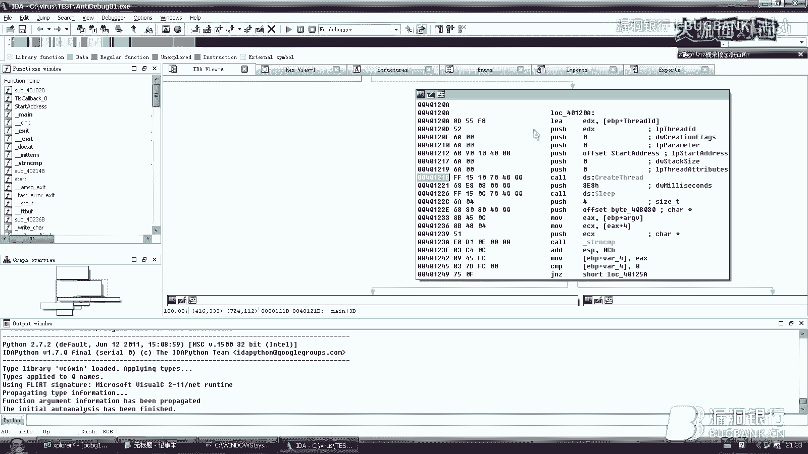

# P1：94期录屏-恶意代码对抗技术_x264 - 漏洞银行BUGBANK - BV1nt41137gh

为知识而存，因技术而生，小朋友晚上好，欢迎参加第94期漏洞银行安全技术直播。大咖面对面，我是主持人秋秋。那今晚进行直播分享的是来自绿门科技的安抚工程师团长。他擅长病毒分析，自称工作中要进行各种花式填坑。

那或许是因为这个才有了被样本反调戏经历吧。那好汉不吃当年亏。大咖经过一定的技术探索研究，终于实现了稳妥的调戏样本了。所以今天呢他为我们来分享恶意代码对抗技术，帮助我们在样本分析的路上好好找回自信。

那今晚内容难度为四颗星。大家如果听讲过程中有遇到不懂的地方，记得及时在聊天区发出提问。大咖会在演讲完毕后挑选高质量问题进行集中答疑。当然大咖还有准备丰富的案例讲解来帮助你全面理解。总之。

今晚内容充实精彩，大家感兴趣一定要跳到最后。那在团长大咖演讲和答疑之后呢，还会有大咖的赠书福利环节。团长会在聊天区选择一名幸运观众，送出他亲自挑选书籍、恶意代码分析实战。所以如果想要获得这本书的话。

也要多发弹幕讨论交流哟。那下面我们就请团长开今天的直播分享吧，我们一起欢迎。大家晚上好啊。呃，先自我介绍一下啊，我是来自绿盟科技的一个安全工程师啊，现在呢主要是负责安全预警的一块业务。呃。

右下角这里先打个广告啊，这是我们的一个公众号，大家可以呃来关注一下，我们会不定期的去发送一些最新的一安一些漏洞的一些资讯，包括解决方案啊什么的。😊，啊，包包括今天就今天就刚发了一篇。

大家有兴趣可以呃关注看一下。😊，好，刚才这个。那就直奔主题吧，我不再多说了。

啊，今天主要讲的题目呢就是这恶意代码的一些对抗的技术。然后主要会分两大部分，一个是对抗反回归返回边，还有一个就是对抗这个反调试。嗯，先来介绍几个基本概念。嗯，什么是汇编语言呢？汇编语言呢？

就是实际上我们CPU在执行这个指令的时候，它都是识别的是这种0101的这种二进制序列。我们称之为机器码。但是我们如果去分析一个嗯CPU执行的机器码呢会非常的困难。因为嗯这些0101的这些序列。

我们很难记忆。所以为了方便记忆呢呃汇编语言就诞生了。他呢是采用一些助记符来代替一些复杂的指令操作码。啊，这个。大家应该我相信大家应该都知道什么是汇编演，然后什么是反汇编呢？😊。

返汇编呢就是当我们把一些嗯拿到一些嗯可执行程序的时候，我们通过返回编这个技术，把它的0101序列的这个指令码给它翻译成汇编代码的一个过程。然后呢，因为有了反回边。

所以后面慢慢的衍生了一些对抗反回边的一些技术。嗯，就通过通过这些对抗反馈边的技术呢嗯。在返回编的过程中，让这个返回编工具产生一些不正确的汇编代码。好，下面看一下，这就是一个简单的一个一个逻一个流程。

一个逻辑。啊，这就是我们用C语言写的一个程序。然后经过编译器呢会编译成呃这种。0101的这个字节码啊，这里是十六进制闪示的。然后呢，我们通过返回编呢，再把它。编译成这个。会编语，这就是像这样的话。

我们就能比较清晰的去理解这个嗯。CPU执行的一些功能。因为我们去离记记忆这些55什么8B啊，这些我啊简直是不可能的啊，所以返回编汇编语言呢，就是帮助我们辅助分析这些机器的CPU执行的一些操作。好。

下面介绍两种算法，先介绍第一个线性返回编算法，就是我们一个返回编器，它是如何进行对嗯文件进行反回编呢？首先一个最简单的一个算法呢，就是一个线性返返回编算算法。

当这个返回编器拿到一个样本二进制的序列之后呢，它就是从头到尾依次进行便历，然后依次遍历的过程中，依次把这些我们再回到上一篇这个看它会把这些。这些指令给它翻译成对应的这个汇编的语言。然后网上呢有一个库。

这个叫lab dis assembly。这个库呢嗯可以方便的快速的帮我们实现一些返回编的功能。右边呢就是我一个简单的一个示例代码。其实嗯我我们写一个反变返回编工具也非常简单嗯。我们只要把。

我们只要利用这个现成的库就可以了。这个代码大家不知道能不能看得懂啊，我简单说一下这个。这个bffer呢就是我们要返回编的这二进制序列，然后这个呢是一个偏移量。然后呢，在一个循环中，我们只要这个。

小于它的这个大小，当偏移，小于它的大小位置呃，进行这个在这个循环里去进行循环的反馈边。这里呢是初始化一个结构体。然后这个数据结构，然后它会传到这个函数中，就是这个INSN传到这个函数中。

这个函数的作用呢就是。八。把这个结构底进行填充，填充之后呢，它会返回一个长度，长度就是代表我返回返回编了几个字节。假如说如果等于零，说明反应变失败，然后又加加下跳到下一个位置上。如果反如果它不等于0呢。

然后这个它是定义一个字符串，这个字符串用来接收嗯返回编的这个指令的一个指令的一个结果。然后再通过这个函数把我们刚才结构底传进来，然后再把这个字符串传进来。只要通过这个函数一执行。

那么这个返回编的结果就输出出来了。其实很简单。大家有兴趣，下面可以自己去亲手试一下。然后反回边算法是一个比较简单的一个线性返回边算法是比较简单的一个算法。所以呢。嗯，他就嗯不可避免的会存在很多问题。

我们可以看一下左右两边这个这个图。左边的这个大家有经验的话，就是很很应该很容易就能看出来这个靠指令实际上是一个有问题的一个指令。它调用了一个像这个15FF21712A71的这个地址。

实际上这是一个非常在内存中是一个很。大的一个偏移地址，这是非常不正常的一个一个调用。所以呢我们有理由怀疑这可能是一个反编译错误的结果。那么右边呢我们再看一下，右边呢这是一个正常反编译的结果。

这样看起来嗯至少看起来不是有那么明显的，我们认为有异常的地方。嗯。后面呢会讲解为什么会造成这样。好，我们接着往下看啊。然后。另一个返回编算法呢是面向代码流的返回编算法。嗯，这种呢就是比线性的。

更更先进一些，然后返回变器呢不会盲目的去。返回编整个的文件。那他在返回编的过程会逐一检查每一条指令。然后在检查的同时，他会建立一个需要返回编的地址列表。像我们常见的这个idda呢。

就是典型的利用的就是面向代码流的返回编算法。好，下面我们对比一下对于同样的同样的代码，看一下线性返馈汇编返馈返回编的结果和这个代码流的结果。我们看一下左边这个这个是线性返回编的一个结果。嗯。

我们还是可以看到在这里嗯。这个地方我们发现这里有一个非常奇怪的一个。这个乘法运算。呃，当然这个我们可能不仔细看，还还看还看不太看不出来这个这个。嗯。但是我们再看一下右面的这个图。

这个右面这个图呢就嗯它这个那个代码的逻辑结构就非常清晰了。这就是两个算法的一个区别。好，下面再介绍一下这个面向代码流的返回变算法。实际上这种算法呢也是有缺陷的。啊。下面就划重点了啊。

这里要大要要这个这一页PPT讲的这个一定要记住后面好多分析就是基于这个理论的。这个恶意代码它实现返回对抗返回边的技术呢，主要就是通过呃利用返回边器的这个选择算法和假设算法的漏洞。然后解释一下。

比如说这个我们当我们遇到了嗯条件分支，比如说像if这类的条件分支，它要要向两个呃两个分支去跳转的时候，那么我们的返回编器默认呢。会从t或者fose两个分支，其中一个进行优先返回编。那么大多数的。

面向代码流的反馈编器呢，都会优先处理false分支。大家要记住这个。然后呢，还有一个假设就是大多数返回编器呢会首先返回编紧随靠调用的字节，其次呢是靠调用字节调用位置的字节。是不是很拗口啊？嗯。好。

下面我们看一下案例，可能就方便理解一下。好，这就是一个。典型的一个。面向代码流的一个返回边的对对抗技术。我们看一下这个代码。还是我们突然我们这里发现了一个靠，它去调用一个非常大的一个地址啊。

这个就非常有问题。所以我们往上分析一下啊。还记不记得刚才说的嗯，当我们返回编辑遇到条件分支的时候，就遇到跳转的时候，它会优先处理false分支。😊，那么我们看一下这个靠上面的这个两个跳转。

然后这里有1个JZ，就是条件等于零的时候跳跳到什么位置呢？跳到这个4011C4加1的地方，就是11C5。然后呢，这个里又是当条件不等于零的时候，就JNZ是不等于零的时候，那么它也是跳到这个LC5的位置。

所以呢嗯。这就会产生一个问题，就是我这个条件无论是等于0还是不等于0，它永远跳到11C5的位置。那么11C4的这个位置呃，实际上是不会执行的，是吧？但是我们的。返回编器它没有那么智能，它识别不到这一点。

所以呢而且它又优先处理false分制的内容。所以它嗯无论如何都会返回编这个C4的这个地址。本来这个C4地址嗯，它是一个无效的代码无效的一个数据。但是呢它返回编器呢就会因为这个算法的漏洞。

它就会把它误翻译成质量，所以才有的下面这个靠一个很大的一个地址处。啊，这一个小图大家可以方便大家理解。实际上这个JZ还有JNZ无论嗯无论到底条件是是是处或者是false。

它永远都会跳到这个这个58这个位置。我们看一下这个这个字节啊，它这个是11C4，E8是11C4，然后58呢是11C5，它永远都会跳到这个58的位置，而越过这个这个E8。

实际上这个但是我们返回编器会误把这个E8当成指令去翻译。好，下面看一下这张图才是一个正确的返回编的结果。我们需要把这个这一行，我们看到这里这有个E8，我们需要把这个E8呢把它翻译成数据字检。

也就是说翻译成一个呃不让它作为代码去反编译。那么越过这个E8呢，后面才是我们看到的一个正常的返回编的结果。然后再看下一个案例，这是一个固定跳转的固定条件跳转的一个质量。我们看一下这个同样的道理。

这是一个帐篷呢，是一个跳转指令。他呢也是我们看到非常跳到一个非常奇怪的一个位置啊，这个地址呢也非常非常大，就是非常这当我们分析的时候，如果发现有类似这样的一些非常大的地址调用，那么一定是有问题。😊，好。

那我们看一下是什么原因造成的，往上找找，上面呢同样也是一个跳转。这个JZ呢就是当条件嗯跳转条件等于零的时候，然后代码会跳转到11C4加1的位置，就11C5。嗯。所以我们再看一下啊。

再往上找再往上看一下这个上面这一行呢是。把ES和ES进行抑或操作。抑或操作呢大家都知道自己抑或自己，那么这个结果就会变成0。那么通过了这个异货操作之后呢。他就会把这个条件跳转条件永远的置为0。

也就是说嗯这一行。跳转指令呢永远都会跳到1OC5的位置，而不会执行。理论上是不会执行1OC4。所以但是同样的问题嗯，我们返回编辑也会优先处理false分支。也就是说。嗯，当这个。条件嗯不成立的时候呢。

它会如果条件成立的话，它会跳到C5。但是不成立的话，它会它会直接直接执行C4的位置。也就是说嗯，它会他如果返回编辑优先处理了forse分支，那么他就会把这个要C4，也就是这说19这个字节呢。

当成质令去返回编。也就造成了一个错误的结果。好，我们再看一下这个建图。好，上面呢这个330C33C0呢就是这个易货。然后这个抑惑的操作呢，后面紧跟了一个跳转。这个跳转呢它是跳转到这个58。

但理论上它是越过了这个E9。那E9呢实际上是并没有在内存中并没有被执行。也就是说，它并不是呃指令代码。啊，如果你正确返回边的时候，就应该从58这个位置开始返回边。但是我们的反馈编器会。

因为有一个条件分支的一个一个漏洞嘛。他会把它作为作为一个代码也去进行返回编，所以就造成了这个错误的结果。好，看一下这张图，这张图呢才是一个正确的一个结果。其实和刚才那个案例是类似的。

它里面其实上也是因为有一个嗯。有一个这个我们称之为垃圾字节，把它只要把它作为数据，那么后面呢就会正常的进行翻译了。好，现在介绍了一下，把这个理论知识介绍好了，这样完了。

然后下面呢我们如何对抗这种反反回变技术呢？啊。首先呢其实我们刚刚介绍的这几种方法，都是因为代代码里面存在这个流氓字节导致了返回编辑产生了不正确的返回编的结果。我们所要做的呢就是只要把这个流氓字也找到。

然后把它从指令代码变成数据代码。那么就可以只成功的去绕过这种。对抗技术。然后在艾da中可以用C和D两个快捷键去快速的进行。指令和数据的转换C呢就是数据C呢就是把数据变成代码就code的。

然后D呢就是把代码变成数据，就是data简称。好，现在。先中断一下啊，我们可以。可以来一波操作了。我们先看一个案例。我们把这个样本呢用放到I达中打开。啊，这个代码很少，但是我们看到。非常奇怪。

如果做过有做过逆向的同学，应该就会发现啊，这里其实标红的地方就是没有就是出问题的地方，它没有返回编成功。嗯，还我们大家还记不记得刚才讲的那个案例，这里靠到一个非常大的一个地址，所以这又是嗯。

我们需要分析一下，看那是不是有地方分那个它反馈变错误了。我们先调整一下，通过修改一些配置，把这个字节码给它展示出来，我们给他一个8的长度就够了。好，这里有问题。那么我们。就往上找。哪里出问题。

我们就从问题点往上找。嗯，我们看到上面这里是个跳转，然后跳转呢是跳到。1401010加1的位置，就是1011。然后再跳转上面再一行呢，就是这个易货操作，就是和刚就是刚才大家给大家讲的那个案例。

这里呢把一个条件它永远制零，导致这个跳转永远跳转，永远会向下跳。也就是说它越过了111010的这个字节，它直接去执行了1011。但是呢我们看101，但是呢这个艾达呢就把10110的这个字节。

就这个18这个字节也当做了一个数也当做了指令去返回边，所以导致了返回边的错误。好，下面还记不记得刚才讲到两个快捷键啊。一个是D，一个是C，我们需要把指令转换成数据，再再点到这里这个1010的这个位置上。

我们摁一下D，把这一行转换成数据。他问你是否要转换成数据，也是好，下面这个这行指令都变成数据代码了。所以我们看一下这个跳转，它就直接跳显示成了跳转到1011的位置。所以呢我们在1011的这一行。

再摁一下C，把它变成再变成代码。啊，下面也嗯依次的NC转换成数据。对。依次NC。好，这才是一个正常的返回变的结果。我们看到我们把1010的这个呃流氓字节把它跳跃过去了。他呢。就不具备任何的意义。

只是在这里插入在这里，只是迷惑反馈编的这个结果。啊，我们再往下看，这里相同的道理啊，这里标红的地方也是一个跳转到一个非常大的一个地址处。啊，道理都一样了，这也是通过抑惑把这个条件永远置零。

导致跳转永远跳。然后呢，这个导致了1023位置的这个。字节呢被当做了指令去翻译。所以相同的操作。把它摁一下D转成数据。是，然后呢再把1023这个位置跳过去，从1024这个位置开始NC。把它转成代码。好。

下面也是依次转成代码。🎼因为我们调整过，因为我们把代码结构调整过，所以嗯在转翻译成代码翻译成这个把指令，把数据翻译制成指令的过程中，可能会遇到各种各样的这个。呃，问题啊，所以这里我们就一直选示就可以。

好，这个现在这一段翻译成功了。然后呢，下面又出问题了，我们再往上找。啊，还是同样的操作是吧？Home。我们再复习一下，我们点到这里，把它变成数据。然后再呢依次变成指令。好，这一段也也翻译成功了。嗯。

我们看到下面还有两个啊，胜利再忘了。啊，还是同样的是吧？通过抑货，然后跳转。然后我们接着把它进行翻译。好，这一段也完成了。啊，还剩下最后一个这个问题。我们看到上面还是同样的操作。好，我们还是回到这里。

回到这个call的指令，把它变成数据。然后呢，再把它依次翻译成代码。好，到此为止，这个样本呢。就整整个都翻译完了，其实代码也并不复杂，大家大家可以有兴趣可以简可以看一下啊。嗯。

这里它会输出一个good job，还有一个是呃这是非常非常遗憾是吧？这应该就是一个很简单的一个tck me的一个小小程序。其实这个小程序呢，它的嗯它的技术点主要就是在于这个静态返回边这个点。

它会加入了很多对抗调试，对抗你嗯进行反对抗返回边的一些技术。所以就是呃。增加一些分分析难度。实际上代码结构并不复杂。好，这个案例讲完了。好，下面呢。还有一个案例。嗯，我们看一下，先进到。主函数中。哦。

找到我们先找到me函数。嗯，我们发现这里同样是这个魅函数中同。嗯，我们看到这个结构。也不是很正常。大家如果经经常进行那个调试的时候，应该嗯会如果这一个样本能正常返回边的话。

它会默认的会会跳出一个流状的结构图是吧？而且NF5也可以看到伪代码，像这里我我去摁F5，它是失败，因为现在它没有识别成一个函数。所以我们找问题出在哪儿呢？我们往下看往下看，然后发现有一个标红的地方。

这里有问题了。然后呢，这个跳转有问题的地方是一个跳转，然后跳转呢同样也是跳到一个非常大的一个地址处。然后嗯这个挨打无法识别这个地址，所以就标红了。我们再往下看，就是一大段数据。

就是没有成功翻译的一段数据。好，同样的思路，我们在这一行哪里有问题，就往就往上面找，看看是什么原因造成的。我们看一下上面这里同样是一个跳转。跳转到。115E加1的就是115F的地方。然后再往上看呢。

这个跳转上面有一个test的一个操作，它进行它这是在嗯探测这个ESP是不是零。嗯，我们经常分析这个样本的同学应该都清楚这个ESP呢，它是代表的是一个站顶的指针。就站顶指针呢，它呢永远。

他那永远都不能是灵是吧？要不我们的站就站如果变成零了，那这程序就崩溃了。所以在这个他在测试这里的时候，这个条件呢永远是永远是假，就永远不等于0。然后呢，下面是一个跳转呢，如果不等于0呢，就往下跳。

也就是说这个跳转永远会向下跳，它会越过115E的这个字节而跳到115F。好，现在我们了解了，这是因为那个条件分支的一个分支假设造成的一个漏洞。所以嗯这里我们刚才忘了改了，把这里。0子页调出来。好。

我们就还是同样的操作。我只要出问题的点呢，在140115E的这个点，这个点呢应该是一个数据字节。我们只要找到这个15E，我们把它变成数据，按下D。然后呢，在115F的这个地方摁一下C，把它转成代码。好。

这一下就清楚多了，是吧？这一段刚才那一段一大段数据也都被翻译成了这个指令。我们看到这是他在读取打开1个UIL，然后去远程读取一个文件。好，我们再往下找，这里还有一个标红的地方。嗯。

同样的道理要往往上看啊。啊，这个套路用的就是和刚才那个样例案例是一样的，是吧？通过一个易货操作啊，把标志为置0。然后后面紧跟一个跳转。啊，这个后面我就不演示了，好吧。啊。

基本上这就是一个这就是典型的一个病毒程序了。其实上它的一个功能就是从远程读取一个文件。嗯。好，这个案例也就先讲到这儿。好，我们回到课件中啊。然后这个对抗返回边呢还没说完。然后还有一种呢是。

无效的返回编指令。就刚才我们介绍的这两种方法呢，都是因为有流氓字节导致了分析存在错误。啊，因为这个字流氓字节呢，它不属于程序的一部分。也就是说这个字节它没有任何的意义，只要把它跳过去就可以。

它也不影响程序的执行。但是呢你静态返回边的时候，它会影响你的返回编结果。但是有一种还有一种还有一种那个对抗技术呢，是这个流氓字节我们不能忽略。也就是说他这个字节呢。它会同时属于多个质令。

而而且有的字节在执行的同时呢，他有的字节在执行同时呢，他可能会同时的呃在2到多个指指令中都发挥作用。现现在呢针对这个问题呢呃目前还没有一个。反回编器能很好的解决这个问题。所以呢当我们遇到这种情况。

就需要我们嗯火眼金睛去识别它。好，下面先简单讲一个简单的案例啊。我还是看一下，就右面这四个字节很简单啊。这个EBFF它什么意思呢？这两个指这两个呃指令合在一起呢，它是ju篷负一的一个作用。

就往前跳一个位置。往前跳一个位置，也就是说现在指针指到EB1FF往前跳一个位置呢，跳到了这里，跳到FF前面。然后呢，FFC0呢。它是NNCES就是ES中的值加一。然后后面这个48呢，它又是ES减1。嗯。

不知道大家有没有看出问题啊。我们先看前前两个质量。首先呢通过这个jump负一这个这个指令，我们看到这个EBFF呢，它通过这个指现在指针指向在这里，然后向前跳一个。然后然后呢，下一个指令呢是ES加1。

是FFC0。这个时候这个FF它既属于前面这个ja目负1，又属于这个INCES。也就是说这一个它一个字节同时属于了两个指令。那么这种这种情况呢，我们就没有办法不能把这个指令忽略了。

但是如果我们在程序中分析的时候，遇到了这种序列怎么办呢？我们不妨先分析一下它的一个过程啊，我们看一下，它先往前跳一个是一个跳转。这个跳转呢不会影响任何寄存器或者对栈的值。然后后面呢。这个ES加一。

它会把ESEAX中的值加一，然后再看后面它会把EX中的值减1。也就是说把ESENS加一之后又减1。也就是说这个它没有改，也同时也没有改变EAENX的值。我们再把这四个指令连起来看。

实际上这个四个指令它就相当于什么？相当于是一个复杂的note序列，也就是说我什么也不干这个质量。大家知道note note这个指令吗？就是代表什么也不做的意思。所以呢。但是有一就有问题又来了。虽然说。

这段代码这四个字节呢什么也不也不做，什么作用也不起。但是如果把这四个字节，我假如说我要插入到。这个文件中的任意一个位置。他也不会改变这个程序的功能是吧？因为它毕竟什么也不做嘛。

它虽然不虽然没有不会改变这个程序的功能，但是呢。这四个字节会打乱整个反汇编期的一个反汇编结果。所以假如说我们在分析的时候，遇到了这样的一个字字那个指令序列。我们这个时候就不能把FF把它翻译成数据了。

这时候我们需要做的是把这四个字节全部翻译成数据。是吧因为它本身什么也不做，对吧？然后就把这四个节字节全部翻译成字数据。然后呢，后面的后面的这个部分呢，再把它翻译成代码。那么这样的话就可以解决这个问题。

好，这个入门案例讲完了，下面来一个进阶的案例。这个呢就稍微复杂一些了，我们看一下啊。嗯，别着急，还是一个一个来。我们看一下，首先先看一下这个前四个字节，前四个字节组合到一起呢。

它的作用呢是目呃05EB这个数据到AX中。就是把X中的值复成这个051B。然后这时候这时候指针指到这里了。然后后面呢在后面这两个字节，它是XOESES。就把ES制0。就是我们刚给X赋完值，再把AX治零。

然后再后面面两个字节呢，它是JZ减6，就是向如果等于零的话，向前跳转6个字节，哎，就跳到这里了。啊，这个时候呢这个EB05呢是ju篷5，再往后跳5个哎，跳到这里。

这个过程不知道大不知道大家理理那个有没有理解啊，我再说一遍啊，这这里首先它先给X制0前四个字节给S制0。然后呢，后两个呢把X呃前四字节给S负值，然后后两个字节呢给EX制0，制零之后呢再向前跳再向后跳。

这个时候我们分析一下。当我前四个字节。这个EB05，它属于这个目S这个005EB这个指令。然后当程序执行到这里之后呢，以这个JZ减6它是向前跳6个字节又跳回来了。

然后又发现这时候这个EB05呢又属于这个帐破5。也就是说，现在是两个字节。有两个字节是既属于前一个指令，又属于后一个指令。所以呢。这个时候。嗯，哦还没完这个向后跳。再跳5个字键。

然后我们发现又发现一个问题啊。这个E8这个字节被实际上被跳过去了。也就是说这个E8这个字节呢。如果如果这样的一个指令序列放到了放到了一个返回边的，比如说放到Ida中。

那么这个E8字节很有可能就会被翻译成一个指令代码。好，这种。啊，特别是像这种复杂的指用序列啊，其实我们还是通可以通过这个呃艾打中的一些标红的位置去识别。好，我们先看一下，这就是一个简单的案例。我们看。

这个66B8什么这个这个1B05，就这个就这段。就是这一段指令训练，我们看一下，翻译出来就是这个样子的。然后这里靠呢就会发现同样是靠到靠到了一个非常大的一个地址处，就是这里就是非常嗯有异常的地方。

然后正确的返回编的结果呢应该是这个样子。我，然后我们分析一下啊，我们是如何把这段代码还原成正确的结果的。我们还是遇到这种这种情况，我们就不能只单纯的去把一个某一个流氓字节进行进行数据化。

这个时候我们就要分析这个指令指令串的一个结果执行的结果。我们看一下。首先他把EIX付了一个值是吧？这里是改变了计算器的值，所以我们先记录一下。但是呢我们发现后面两个后面这两个字节呢。

它实际上又把ES制零了。置零之后嗯，它的结果呢就导致前面这个。指令无论负什么值都无效是吧？然后呢，通过这个抑或操作，他就把这X值制零，也就是说相当于把X值进行了负值。然后这里是一个跳转，向前跳。

再向后跳。实际上这个这两个跳转不会改变任何计算器的值。也就是说，这个复杂的指令序列最终的结果只有XORESES这个。这个这个代码会对整个程序产生影响，因为只有它改变了寄存器的。计算器的这个状态。

也也就是说我们当我们发现有了类似这样的一个嗯错误的返回编序列，我们要嗯。静下心来慢慢分析它的功能，然后去去分析它哪些功能是会影响这个寄存器啊，包括计存器，还有呃一些标志位啊。

还有一些像对战啊这一类的很重要的一些这些呃这些位置的这些值。如果假如说发现有有修改的一些操作。那么这些操作是我们是不能把它数据化的。也就是说这个指令我们是要保留的。好。啊，下面就是介绍反调试了。

静态的部分就讲完了。基本上我们先我们可以先总结一下吧，主要就是嗯两种，一种是基于面向代码流的一个。返回边的一个一个对抗技术，这个也非常简单，随随便便的。比如说像嗯像两个跳转。

比如说跳JZ和JNZ连续的这种。就可以很简单的去嗯把反馈编器去调细了。然后还有一些就像我们上上面说的这种复杂的一些序列。当然我们。遇到这种静态的一些反回变对抗技术，我们分析的时候也很简单。

只要把一些无效的字节给它。变成数据就可以了。当然我们在前提是要进行对嗯代码进行分析。我们要识别能识别得到哪些是有效的字节，有哪些是无效的字节。好，下面就介绍一些动态反调试了。

然后反调试技术呢就是我们的恶意代码，它可能会在自己的嗯代码里去检测自己是否是在被调试。假如说我他一个病毒文件，它检测到自己在被调试了。嗯，他呃通常会改变自己的一些执行路径。比如说比如让自己程序崩溃啊。

啊，或者是让程序退出啊，或者是反正就是会他会隐藏自己真正想要执行的一些操作。啊，从而就增加一些呃分析人员的调试的一个时那个时间和一些复杂度。呃，先看一个。利用windows API。进行一些检测。

其实我们的windows操作系统。它自带了一些API，可以识别自己当时这个当前这个进程是否被调试。啊，第一个呢就是is第bu个 present。它呢这个函数的功能呢是。检查这个当前进程的这个进程环境块。

进入环境公号中呢有一个is第bu个这个标志。如果这个标志呢。如果当前进程被调试呢，它返回零。如果啊没被调试呢，返回零调试呢就返回非零值。啊，关于这个新争环境块，后面会详细介绍。

这是一个非常重要的一个数据结构。嗯，在反调试中经常会用到。我们看下一个API就check remoteote第八个present。这个函数呢与is第八个就与上面这个类似。但是区别呢它功能更强大一些。

它除了可以检测自己当前这个进程。它还同时还可以检测其他进程是否被调试。然后下一个函数啊，这NT query information process这个函数呢。

但我们想这个函数会返回一个进程的一些相关的一些运行的信息。呃，我们第一个参数呢是一个进程聚柄啊，第二个参数呢是一些信息类型。如果呢这个第二个信息类型这个参数。

我们设置成process第bu个port这个标志，也就是如果是也就是16进制这个07。如果这个第二参数设置成07的话，那么这个函数执行结果就会返回这个进程是否被调试。啊，这个是一个内核集的一个函数。

然后下面呢这个是一个比较简单的一个检测方法，就检测程序窗口名。举个例子，比如说我在用奥bug去调试一个函数，调试一个样本。那么这个奥利第bug的窗窗口名字那么那么就叫奥利Dbug是吧？假如说我们。

检测到了这个窗口名，包含奥利奥利Dbug。那么是不是就能证明我当前有调试器存在是吧？好，下面这是一个稍微复杂点的一个综合利用。

然后还可以利用这个output debug debug string这个函数它呢功能呢是在调试器中显示一个字符串。那，如果当前我这个进程在调试中，那么这个函数呢就是会执行成功。

并且在调试器中输出一个字符串。如果当前这个进程如果没有再调试呢，那这个进程它这个函数执行之后呢，就会报错。所以利用它这个特性，我可以我们可以组合看一下右面这个代码，我可以组合一下来一个小的一个。

组合检测相当于是。嗯，首先呢我们看一下，我们先设置一个错误值，把这个错误值呢随便我们自己可以随意定义啊。这里写成12345。然后呢，把这个错误我们set这个。

设置一个把这个凑误值设置成当前系统的一个凑误值。然后调用一下这个函数。调用一下这个函数，假如说这个函数如果调用失败了，那么这个系统错误值呢会被操作系统去重置。也就是说它的值就不是我们设置的12345了。

然后通过这个特点呢，我们可以判断当前这个进程是否在调试状态中。只要只要我们调用一下它，然后获取一下系统错误，然后再和我们之前设置的这个值呢进行比较，啊就可以判断就可以进行简单的判断。好。

这是API的介绍完了。😊，然后下面还有一个比较简单的，就是通过注票注车表检测。啊。这个注册表。它的默认情况下默认情况下，它会是这个dodoctor wson这个。这个值。大家对这个对这个有没有印象？

比如说我程序崩溃了，一个程序崩溃了，然后这个进程就会自动蹦出来。大家在分析分析一些什么样本的时候，应该我不知道有没有遇到过这个。但是如果你这个注册表被修改成了欧利第bu第bug。

那么这个当恶意样板检测到这个制作表是改成别的了，不是这个是默认值了。那么很有可能这个呃调试项就被修改过，也就是说能证明有反调试器，有调试器的存在。那么恶A代码就会认认为它正在被调试。好，下面要划重点了。

今天的一个难点来了，先介绍一下这个进城环境块。啊，简称是PEB。啊，windows呢为每一个正在运行的进程呢，都会维护1个PB的一个结构。那这个结构呢呃其中包含了这个当前进程的所有的用户态的参数。

其中呢就包括这个进程是否在调试状态中。呃，大家有兴趣可以看一下这个看雪的一篇帖子，这里就介绍的非常详细了。😊，然后我这里呢只是简单的给大家讲解一下，我们看一下右面这个图。

因面这个图呢就是这个PEB的一个结构，它实际上是一个结构体。我们看前两位是一个是一个。是是一个其中的一个属性后然后第二个属性呢，我们看到第二个属性就是begin begin那个being debug。

这个这个字段就来标识了这个进程是否被调试。我们还记不记得刚才有一个系统API啊。is第八个 present那个函数。我返回去看一下。就这个函数，它实际上检测的就是这个标志位。当然。

我们可以利用windows APII去识别，我们也可以手动的去识别。当这个程序运行的时候啊，这个FS30的这个偏移偏移这个计算器的位置呢，它指向的就是PEB的机制。然后呢。

我们假如说先我们先获取到这个PEB的机制，就是获取这个FS30这位置的值。获取完之后呢，我们再。把这个获取的值呢偏移加2加二的位置就获取到这里了。啊，这个时候呢我们获取到这里的值。

我们可以判断它是不是零，然后也可以判断当前的这个进程是否在被调试。啊，我们看一下下面这两个。短的代码，这就是一个很典型的一个反调试。其实非常简单啊，就四行。首先他把FS30的这个值赋值给ENX，然后呢。

EX加2加二之后偏移，它就是获取了这个比 beingdebug的这个标志。然后获取这个标志呢，把它给了EBX，然后再判断EBX是不是0。然后从从而判断自己是否在被检测被调试。

然后右面这个是另一种实现方式。他首先呢把这个FS30入站进行铺署操作入站，然后又泡泡出来，泡泡到EDX中。实际上这个操作呢就是相当于把EDX负值，把这个FS30的值付给了EDX。

然后同样它直接用comparere指令去比较这个EDX加2是否等于一。当然这里也可以写是否等于0。啊，用来判断这个当前的进程是否在调试状态。这是其中一种检测的方法。然后后面还有。

然后检测这个process hip的标志。这个标志位呢是在PEB中是一个微软没有公开的一个属性。当然也有大佬进行了一番研究啊，发现这个属性。呃，其实也是可以检测用来检测这个当前进程是否在被调试状态。

我们看一下这个这个属性呢，在这个结构体的偏移18的位知数。然后偏移18找到这个位置之后呢。他呢这个属性还同。包含了。一个focus flag组属性，也就是说这个属性又包含了另一个属性。

然后实际上是这个属性呢。标志了当前的调试状态。但是有一个有一个问题啊，这个属性在不同的操作系统下的偏移量是不一样的。在叉P中的偏移量是10，在win7的偏移量就是44。嗯，下面也是简单的四行代码。

我看一下，先也首先也是先获取这个FY30这个EBP的机制。然后通过机制呢，我们首先加18。驾驶8获取这个。Pside hip。然后把它呢再复制给EX。然后同时然后后面呢再把ES再加10。再加10。

也就是他是在判断当前这个是否在叉P下在调试。这里大家能能理解吗？嗯，这里其实我要注意的是什么啊？大家只要需要注意两个数字就可以了。一个是18，一个是10，或者是这个44。当然最重要的是要记住这个18。

我们假如说我们看到嗯有有程序，首先获取这个FS30EBP机制，然后呢又加了18偏移。那么很有可能这就是在进行反调试检测。啊，我们看到其实反调试就这么简简单单四行代码。其实。嗯，也没有什么神秘的是吧？

大家如果了解之后，就发现实际上嗯也挺简单的。下面下次以后我们再进行分析的时候，遇到了类似的这种代码，就可以很轻松的去识别它。啊，然后还没完。在EBP中呢。还有一个标志。由于这个调由于这个进程呢。

在调试器中启动和在正常模式下启动，它的进程上还是有很多区别的。特别是它这个在创建内存堆的方式上是不同的。然后有一个标志呢，就是NTgbal flag。这个标志呢也是一个微软未公开的一个标志。

当然也是感谢一些前辈们的一些分析啊，这都是一些大佬们分析出来分享的。然后这个标志呢在EDP偏移68的位置上。😊，但是比较奇怪，比较有特点的是，这个值假如说它如果是70。它就不是零或者一了。

假如说这个值是70，那么它才代表这个。进程是在被调试状态。啊，这个就更简单了。三行。首先也是先获取FX30到EAX中，然后EX中直接加68。找到这个加68这个NTg flag这个偏移量。

然后直接compare和其良心比较。啊，如果如果它等于70，那么证明现在我的这个进程在被调试。嗯，其实我们我看了这么多，其实我们也有一个思路了。假如说在分析样本的时候。

如果我们在样本的代码中看到了有获取FS30的这个操作，是不是我们就有理由怀疑它是在进行反调试啊？是不是？就这个因为它指向的是一个1个PEB的一个机制。这里面有很多的属性都可以标示当前进程的状态。

所以说我们在分析的时候，如果看到有获取FI30。那么一定要警惕了。首先。找这个FS30的标志。然后后面呢我们如何判断它是在进行反调试的检测，然后的重点就是在检测它的一个偏移量。我们再翻回去看一下啊。

再复习一下，这里的确有一些乱。首先呢是偏移量二的位置。是吧偏量二的位置。可以检测这个就很直接，可以检测这个当前进程是否被调试。然后下一个呢。是18。这个偏一量要记住。

当然这个在叉P和win7上是有区别的。但是这个18这个位置，如果我们看到他要取这个地方的值了，那么证明嗯这里也有调试检测的一个嫌疑。一个偏移量2，一个偏移量18。然后下面这个呢是偏移辆68。

但是这个68呢比较有特有特点，它检测的并不是0，而是70。好，这几个偏移大家要记住啊，后面案例中会遇到。然后呢，还有一种检测调试器的一个方法呢，也是它是一个使用TL回调函数的一个方法。这回到函数呢。

它的作用呢是呃在它可以在调试器。中断执行之前执行什么意思？就是我们正常正常的调试一个样本。我们其实默认的都是从这个样本的第一行代码处开始调试，对吧？但是有一个例外情况。

假如说这个样本使用了TMS这个回调函数。那么在这个调试器。中断在调试器执行第一行代码的之前，它会执行这个TL函数中的内容。所以很多。恶意程序他利用了这个特色特性，他就把一些。

调试器检测的代码写到了TL函数中。也就是说我在。调试器启动之前，它就检测到你有调试器了。这种情况我不知道大家有没有遇到过，比如说把一个样本拖到OOD里面，哎，怎么回事？突然OD退出了是吧？

大家有没有遇到过这样的样本啊？实际上很有可能就是使用了这个TRS函数回调函数。这个呢我们在调器中其实可以设置，通过设置来。来对抗这种技术。

我们在这个设置调试调试debug那个options这个调试选项中，我们找到这个一疑问的事件。然后把这个。make个 firstrspa就是。第一次中断的位置，把它设置成系统中断就可以了。

他默认应该是在这个win may函数中，就是说我们这个OD它默认是在ma函数的第一行代码。呃，中断。这样的话，这个T就会在这个它中断之前去执行。所以这里我们要给它修改成这个系统函数，那么就可以去。嗯。

防止这个TS执行，我们就可以在TIL函数中进行调试，去发现它到底哪里使用了反调试技术。从而可以绕过他。嗯，下面说完反调试，那么就说一下怎么对抗反调试。当然我们不能总被恶意代码去调戏，是吧？我们也得。

使用一些手段去回击。不过幸运的是啊，现在呃也感谢很多大佬的默默无闻的付出，然后把一些嗯这些对抗的技术都帮我们嗯。已经分析的很透彻了，而且OD中也有有了很多成熟的一些插件去对抗这些粉调式。

我们其实现在大部分我不知道你们用的是哪个版本的OD啊，其实现在很多人都在用那无I破解上的一个一个版本。实际上那个OD就已经非常强大了它。基本上刚才上面讲的这些反调试的一些手段，它基本上都可以。

都可以去屏蔽掉。嗯其实现在工具的强大嗯，给我们带来了很多方便。嗯，带来方便的同时呢也。嗯。帮我们帮助我们隐藏了很多细节是吧？我们假如说我们在一些在技术上的学习，可能就嗯理解不到这些这些点。

当然还有很多高级的反调试技巧，这个需要我们自己耐心的去分析。嗯。找到这一个关键的检测点，我们需需要手动的去修改第代码去跳过这个反调式的检测。啊，举个例子，这里我没写啊，其实还有很多范调试检测。

比如说像一些利用OD的漏洞。听说过吗？就OOD本身有一些漏洞，它在加载一些特殊构造的这个。但那个样本的时候，OD会崩溃。还有还有一些像时间检测。如果正常的话，一个程序执行在CPU中执行是。呃。

他真是甚至是毫秒或者是微秒级的级别的执行，就非常快。但是你要架到把这个样本架到一个调试系中是去调。那么你可能这一个样本复杂一些，可能几天都几个小时调试几天都有可能。那么这个时间上肯定是也有差异的。

有一些嗯有一些恶意代码，实际上它就会通过一些时间的检测去判断你是否在被调试状态。还有一些像完整性检测，它会检测这个代码的。呃，你你在调试过程中是否被修改。假如说我们。嗯，修改过某些字节。

那么这个它会检测到，如果它会自己设定一个哈希值，然后进行进行匹配。假如说匹跟哈希值匹配不上了，那说明这个样本被改过。嗯。就很有可能是被被人调试过是吧？啊，还有很多很多这种骚操作。

还有一些利用一些PE漏洞。我们知道一些在像windows下执行的这个。呃，可执行文件都是它要遵循1个PE结构。这个OD呢在解析PE结构的时候会有一些缺陷。因为在P结构中有一些字段，呃，比如说你修改它。

并不会影响实际的这个进程的执行。但是假如假如你修改了某些字节，把它放到OD中，那么OD就识别不出来了。啊，这种。Yeah。还有很多这种反调式技巧啊，这里我就不细说了。

如果呃实际上这个反调式这个技术呃可以讲很多很多。我这里只是抛个专引个浴吧，大家在后面后面的这个学习或者工作中，嗯，还需要自己的这一双慧眼去发现更多的一些。反调试技术啊。好。下面。我就看一个案例吧。

先看一个反调式的拉点。稍等啊，分析有点慢。好。啊，我的习惯啊就分项呗，首先把这个前缀勾上，这个前缀是什么呢？就是前面这个地址，然后呢，在这里再把它改成8，这个是什么呢？

这个就是显示这个当前指令的这个字节码。好点确定。好，我们发现这个地址也出来了，前面的这个字节码也出来了。啊，这是我的一个习惯啊。😊，我们看一下啊这个函数我们先先简单看一下这个结构。嗯，我发现有很多。

一开始这个函数有很多跳转到这个401000的这个位置。也就是说这个程序刚一执行就执行到这里，而且后面这个执行了这个靠操作之后，后面他没有再继续执行其他操作了。也就是说这函数运行到这里。就终止了，是不是？

那这是为什么呢？他一开始就把函数终止了，而且我看有好多好多这样的地方。啊，这里也有对吧？有很多很多这里也有有很多很多这样的函数。我们这要分析一下。这个时候我们就要点点进去分析一下，看看这个函数的功能。

我们简单看一下啊。调用了几个API这个呢是获取函数的执行路径。这个呢是获取这函数的这个文件名。啊，这个函数就是获取这个当前这个文件名。然后啊这里还有一个参数是吧，杠CDL。

这里有个CMD这里呢这个这个API呢是执行这个。执行命令。也就是说我们综合一下，看起来看一下这个函数，它的功能实际上就是调用CMD。去执行删除操作，删除谁呢？删除他自己。奇不奇怪啊，大家遇到这样的函数。

这样的样本。在程序我们返回来啊，在程序一开始。他就要把自己删掉，这是为什么他什么都还没执行呢？好，我们这时候带着疑问，其实跟刚才。的分析一样啊，我们从这个问题点往上回溯。这个代码也比较短。

我们就从头看啊，我们看找到这里，我们发现是不是发现了1个FS30啊。他在干什么？他在获取这个EBB的机制是吧？把它的值放到了EAX中。然后呢。EAX加2，这是什么？他在检测这个一思。第一。

第bug这个标志位是吧？然后他把这个bug标志位的值赋值了给了BL，然后又把BL呢赋值给了这个变量，然后呢再把这个变量赋值给了EX啊，这么一大串操作实际上。到这里，他就相当于是把。这个FS。30。

加二的这个位置，也就是说这个is debug是吧，它是不是is debug这个位置？复制给了这个EAX。然后呢，再判断EX是不是0。然后再跳转，这就是一个很典型的一个粉调试，是不是？然后这个函嗯。

我们再往下看啊，看看下这里。这里我们发现又1个FF30，这里检测的什么？这里检测的是18这个偏宜。大家还记不记得这个18便宜？是那process he是吧？然后这个偏移有一个特点。

它在叉P下和win7下的值是偏移量是不一样的。这里呢它只检测了偏移10的位置，偏移10的位置是叉P的。再复习一下啊，偏移10。这是叉P的。然后偏移44呢是win7的。好。

他现在这里是在检测这个偏移十的这个位置，然后把这个这个值呢赋制给了EX。然后呢，再把ENX复制给了一个变量。然后再把这个变量呢和零进行比较。也就是说这里它执行的操作实际上是什么？他在比较FS。30。啊。

加加18再加。啊。其实不应该这么想。就示意一下啊，大家应该能理解我的意思。加18，然后再加10是吧？把它和谁比呢？和零进行比较。然后通过这个方法呢，他去判断这个进程是否在被调试。好，看到这里。

这里还有一个分支。我们再看一下这个上面的分析，这里是也是获取了它，然后把它把这个机纸呢复制给了EX。然后这里是一个挨打的一个分析错误啊，他把。他把这个9A这个地址的一个这个3亿的这个。

他误认为当成了一个数据。但实际上呢我们再看下面这个9A这个3亿呢，它又当成了一个又把它变成了一个指令去翻译了。啊，这也也算是一个挨打的一个bug。好，先再回到这个反调式里。呃。

首先这里他把EP的地址复制给了ES，然后ES又加了68，还记不记得这个偏移量？那个NTgbal flag是吧？我们再复习一下啊，这它获取的是FFS。30加68。这个是什么？N贴。克格罗 flag。

这个标志位有一个特点是什么？它是和他如果这个值等于70。才证明自己被调试。他这里用的一个方法比较奇特啊，他把这个ES值和70相减。假如说减的结果等于零的话呢。那么是不是就证明这个值等于70啊？

这里用了一个小技巧，就是把这个值和70相减，相减完，结果放到ES中。然后ES呢又把它放到了一个变量中，然后再把这个变量和零相比较。然后通过这个方法呢，再判断自己是否被调试。如果被调试呢，跳到这个分支。

把自己删掉。好，拜拜了，是吧？这个呢。我就是从静态的角度去分析了一下这个样本。嗯，这个样本我就不给大家演示了。这个原理呢它基本上都是通去检测这个。检测这个EBP结构。

好，下面分析一下这个样本。我们先运行一下，看一下这个。01。看一下这个先运行，看一下它提示什么啊。他说你需要4个字节的密码，这是一个简单的tck me的小程序。我们要给他输入一个密码。

它提既示提示你给四个字节，我们随便给一个。哎，提示你这个密码不对是吧？请再尝试。好。下面呢我们就要分析它了啊，这这里有个OD打开它。我们。open载入。载入这个文件。给他一个参数。

好。很奇怪，是不是为什么程序一开始就就终止了？我们看一下右下角啊。右下角这里是teritate，是终止了是吧？大家看过终结者吗？就是这个词终结的意思。这个怎么一开始这个程序就就停了。为什么呀？

我调试器还没什么都还没干呢，怎么就退出了？还记不记得刚才讲了1个TL回调函数啊？它优先于调试器之前去执行了一个函数。我们还是先通过挨打去静态的分析一下它的一些大概的一个层序结构。啊，这里顺便说一下。

当我们分析样本的时候，通常嗯都是动态静态结合的进行分析。啊，通过挨打进行静态的分析一个程序的结构。然后呢，再通过这个OD去分析它的一些具体的细节中的值。呃，这是呃一般分析的一个套路。嗯。

我们判断是否有TS也很简单啊，点这个导出函数。哎，我们看到这里有个TL call back这TS回调函数。这里有一个这个函数，点进去看一下它功能。这里呢首先这个函数先检测这个R4，它先判断。

先判断你这个函数，先判断你这个。呃，他给了一个函数，这个是是你的参数的个数，他要判断是不是一。然后呢。就跳转了跳转到这里。这里有一个检测窗口的一个函数，我们看一下它给的参数是什么。欧利Dbug是吧？😊。

所以呢他在检测你当前这个。桌面的窗口是否有OEDbug的这个名字？假如说有有的话，就跳到这里函数退出。现在这个执行流程我们看明白了，但实际上这里就是一个反调试，是不是？我们所以我们嗯要分析这个。

我们需要做什么操作呀？要把这个跳转给它改掉，对吧？让它不往。不让他往这边跳，是不是？好，我们再回到这个。OD中。打开。好，现在程序因为有TS回到函数终止了。还记不记得怎么对抗这种这种这种骚操作呢？

在调试选项中，事件里面把它选成系统断点。OK好，重新载入。哎，我们再看右下角，这里就变成暂停了状态了。也就是说我们按F8，我们是可以分析了。好。我们找到这个。函数的地址。

让让直接让这个让OD直接跳到这个很这个地址处，我们按一下F2F2下一个断点，F9执行。好，这时候就断在这里了。我们看到啊字有点小，不知道大家能不能看清楚啊，这里就是这个函数。嗯，再回到这里。

我们这时候要需要做的呢是。把跳这个跳转改掉是吧，让它永远都检测不到这个Dbug，所以他就不会执行这个退出操作了。也就是说让他这个。让这个函数呢永远向这个方向跳转。好，我们回到这里。找到刚才那个地址在哪？

诶。哦，忘了复制了是吧，这个地址。啊，这一行下个断点。好，这时候我们要做的是什么？我们双击它把这个JNE改成什么，把这个GE改成什么，改成JNE。好，这代表什么？就把条件制反了是吧？也就是说我检测到。

假如说我检测到有调试器，那么。我就向这个方向跳，就把这个条件反转了。也就是说它永远不会执行到。当我们在用调试器进行调试的时候，它不会执行这个。不会往这个方向去跳是吧？其实我们再分析一下啊。

我们其实是可以从这个跳转处进行修改。也就是说我们在这个跳转修改之话，它连这个调试器检测的过程都跳过去了。嗯，这样吧，我们在这个地方进行修改。嗯，他是跳转到这里。从67这个地址跳转到了这个81的位置。

也就是说我们把这个条件跳转转成无条件跳转。我们看一下。这里我就不改了呃。这里。我们看一下这样改。把这个JNZ改成帐篷。就是他无论如何都会跳。好，编译一下。是不是假如说我们把这里改成账篷。

它无论如何都会往这里跳是吧？然后这个分支就作作废了。好，我们修改完之后呢，我们把这个程序保存一份。

67我们看一下这里六七的位置。改成帐法。对，然后我们把它。保存到文件啊，我找一下这里对s five。啊，加个一。好，这就是我们修改的一个进程了。修海的一个程序了，我们关掉。

这时候我们加载我们修改过的这个程序。

好，我们还在这个地方下个下个断点啊。好，到这里F9运行到这儿。好，这个时候发现这永远都跳，哎，跳过去了。这个时候这个TL函TL这个函数就失效了，对吧？对我们来说就失效了。

然后我们怎么回到函数主主函数中呢？我们在这个。返回一下，我们在媚函数这下一个端点。拷贝一下。跳到这里。你在这里下一个断点。好，至有F9。好，这时候我们就成功的运行到了这个函数主合那个正确的入口点。

不妨标记一下啊。OEP这就是正确的一个入口点。好，这个时候我们刚刚刚把只是把反调式的TL反调式的部分绕过去了。然后我们才再分析一下这函数，这时候我们可以正那个正式分析这个函数的功能了。

我们先简单看一下啊，这个其实也非常简单的这个流程。这里有两个字符串，这是。大家能看得懂吗？英语都还不错吧，应该。他说。你输入了一个正确的密码。这里呢是面码不对，然后请再尝试。啊。

所以他实际上是在这个跳转进行了一个判断，来判断你这个密码到底对不对。我们再往上找啊，这个跳转是通过什么条件判断的呢？这里有一个字符串比较函数。他比较两个字符串。然后点一下push。然后这个标黄的位置呢。

就是都是push指令。我们看一下这三个push，实际上是在给这个字符串比较函数传参。第一个函这是第一个参数。这个ECX是什么？就是我们输入的密码。第二个参数是什么呢？这是我要比较的密码。

这个ba408030的位置就是。真正的密码，我们点进去看一下。我发现是四个字节的一个这个数据啊。它不是一个可见数据，说明什么？说明这个程序会对这四个字节进行一些计算，是吧？他要进行一些一系列的解密。好。

我们再返回。嗯，再看第三个参数，第三个函数是4，这代表什么呀？就是我这个函数只比较两个字符串前四字减。我啊我们把这个重重命名一下，把它定义成数组，我们看着就方便一些。点一下这个艾瑞。把这变成一个4。

长度是4的。🎼Hao。这时候呢他就变成了一个数组，四字叶长的数组了。那么好，下面。我们是不是在动态分析的时候，只要在这里下断点，就可以拿到这个函数的真正密码呀。好，我们在这里尝试一下。这里下个断点啊。

我们F9运行。哎，我现在是。哦，这是这是那个什么，这是。入口点是吧，F9。哦，这是TRS函数，我这些断点都还没去掉呢，我把它去掉。影响分析。啊，这时候跳到了这个函数比较的这个地方了。我们看一下这个对战。

啊，其实看这里也能看到。这是这个呢就是。这个进程它计算出来的一个结果。我们看一下这个对栈，大家能看清吗？字有点小。那四个一是我输的，然后这个呢是含这个程序计算出来的一个值。然后因为只比较前四个字节。

所以后四个字节是它这个就不用我们不用考虑了，我们记录一下啊。他是。BZQR是吧。好。我们那么我们。我们看一下这个到底是不是呢？我们运行一下看啊。BZQ2。哦。

因为这个函数大家记不记得有有那个调器检测的功能是吧？所以我们要关掉它再测。哎，怎么回事，怎么还是不对啊？为什么不对啊？好，下面问题来了，我们再接着分析。我们直接F9。好，跑到OEP的位置上。先断在这里。

我们这时候我们要先静态的分析一下这个函数的结构。我们看首先上面它有一个这里有一个进线程是吧，起了一个线程，我们点进来看一下这线程到底执行哪些操作。哇，这里有大量的这个计算啊。

大家还记不记得这个这个这个变量，我重命名一下啊，这个是这就是我们要看的一个密码，这个password吧。他把这个密码进行了大量的计算。算最后算出来呢，就是我们刚才看到这个看到的这个BZQ2。

我们这个时候。新戏的同学有没有发现异常？哎，大家有没有注意这个FS30啊？是吧这里是不是他还在进行调试检测？假如说检测到他先获取这个IY30，然后复制给了EBS。然后这里呢EBX又加了2是吧？

就是在检测那个调试位。把这个值付给BL，然后再看BL。这里他又把BL和这个pass word偏移二的位置相加。也就是说。他在给这个。值的偏移量是二的，这是偏1012。也就是说这个Q这个地方。

他加一操作是吧？这一加一可那这一加可好，那么这个整个密码值都变了。所以我们现在呢。在这个地方下断点。然后如果运行到这里，我们中断把这个它假如说如果不它没有再调试的值，它是值就会零，会是会为0。

如果是在调试呢，就是一。我们调试线程也是。嗯，需要进行一些设置。我们在县城这个地方我们要。把主函数的。点一下这个T就是线程，我们要把主函数的线程优先级调到最低。然后呢，我们在。在这个县城内部。

下一个断点，这样才能断下来。这是也是一些调试的小技巧。好，这里我们标记一下。现场好F9。我们断在这里了。我们再看一下这个FS30的位置在哪，在这里，然后他通过EBX到了这个地址处。再在这里下断点。好。

在F9。好，我们看一下运行完之后，我们关注这个EBX啊，在哪在哪在哪里，字有点小，在这里。它这个BL是什么？就是BL呢，它就指的就是EBX这个最后这个两位。我们运行一下，如果现在再被调试状态。

那么这个值应该会被置为一。F8运行，我们看现这个值被置为一了，是吧？这时候呢我们人工的去给它改一个值，把它改成0。Hao。我们在。F9让它断到。字算比较的这个代码处。哎，我们发现这现在。是不是密码变了。

变成BZ22了。BZR其实我们通过静态分析能分析出来这个结果，它就在这里进行了加一操作，是吧？我们只要再把它。把它减一是不是就可以了？然后这第三个偏移减一是什么？是不是就是R啊？好。

我们验证一下这个结果。嗯，BZRR是吧。好，见证奇迹的时刻来了。哎，为什么怎么又不对啊？是不是还有还是有问题啊，这个样本是不是还有隐藏的坑，我没发现啊。好吧，再回到这个。主程序中进行分析啊。

我们现在分析下这个魅函数。前面就是一些基础操作。这个申请空那个进程空间呃。其实它主要的这个分析的代代码都在这里。这里面我们再看一下，实际上它这里起了一个线程，实际上真正的。起作用的这个代码呢。

在这个线程函数里，我们再点进来看一下。哎，这个地方大家有没有注意这个地方？我们刚才只是分析了下面是吧？然后上面这里还有一个全局变量，我们点击我们看一下这个全局变量，右边这个它是它的值是0。

他把这个平均变量的值付给了BL。好，下面我们就看一下这个全局变量。这个BL因为在这个。密码计算中看这里也可以进行相相加的操作。它在这个密码计算中也起到了很重要的作用。

所以我们看一下这个全聚变量的值是不是。它默认分配的值是0，我们摁一下X交叉参考。看一下这个操作，我们发现在这个地方是不是有对这个群局变量赋值的操作呀，他把这个CL赋值给了它。

所以假如说如果这个时候CL的值不是零怎么办？是不是就会把这个全聚变量值覆盖啊，覆盖之后是不是全变量值发生了变化？那么这里计算之后，它的密码是不是也就发生了变化呀？好，赶紧进来看一下。

看一下这是怎么操作的。我们它在这里进行了复值，然后呢，我们看一下这个CL是怎么复值的。他把这个。值赋值给了CL，然后呢把全局变量的值复制了个CL，然后再把CL进行了加一操作，然后再把这个CL又还回去了。

也就是说这三行代码的作用是什么？他在进行这个。全局变量的一个加一操作是吧？他把自己加了一。但是呢我再往上找，这里有个跳转。他加他如果走到了这个跳转，他如果跳过了这个跳转呢。

那么这个全球变量就值就不会加一是吧？我们再看一下这个跳转是怎么引起的。啊，这里我们是不是看到这个output debs啊？大家想有还有没有印象？先设置了一个他先设置了这里设置了一个错误码，3039。

然后把这个错误码呢赋制给了系统错误码。然后再调用这个函数，判断自己当前这个函数是否调用出错，然后再和再利用这compare。去和我设置的这个系统错误码进比较，看这个错误码是否进行了修改。

就是这就是典型的利用output debug string这函数进行的一份调试。所以说。其实我们通过静态分析也能分析出来。这个时候。假如说如果当前这个进程在调试状态中，那么它这个全局变量会复为负值为一。

假如说没有被调试状态，它就不会被负值，那么就是原始值是0。好，我们回去。返回。好，这里现在是0。或尔一对吧？他把它给了BL，然后BL呢，这里又给pass word加一的位置。我看爱的。也就是说。

偏password接偏一的这个位置加了一个一。便宜的是位置是哪里啊？是不是这个Z呀？它进行轻加操作。如果它加了一个E呢，如果如果函数在被调试状态中就加一，如果不被调试呢。是不是就减一啊，就不加这个一了。

所以。Z减一前面那个数是什么呀？😡，XYZ是吧，Y是不是？😊，在前面。所以这个时候。我们通过静态分析，就把这个。密码分析出来了。好，我们再测一下看文的结果对不对。BY22。哇，终于不容易，是不是终于。

奇迹才见证了是吧？你输入的是一个正确的密码。好，这个虽然说很简单的一个样本啊，不过里面细分析里面坑还是挺多的。好，这个案例就讲解完了。那么今天呢这个分享呢也结束了。啊。秋秋我这边讲好了。嗯嗯，好的，嗯。

感谢团长大咖的分享。最后我们在一个案例的收尾中也结束今天的内容。大咖辛苦了，经过大咖的讲解，大家是否有更进一步了解到反汇编反调试、混淆代码等多种分析技巧呢。如果你在听讲过程中存在疑惑的话。

下面我们将进入到行场问答环节，大家可以在聊天区里面发出和本次议题有关的提问。那辛苦团长大咖来打开直播间给大家做一个嗯集中的答疑。那大家可以趁现在把问题呃发到直播间聊天区里面。

稍后我们的特书环节分许大家的提问。然后大家要选出吸观众。那如果现在没有问题的话呢，小伙伴也可以来填一下我们的调研问卷。我们会根据大家填写内容来优化我们之后的大咖内容。😊。

那团长大家可以先看一下问题，然后我们看有没有什么新的问题一起来解答一下。好，现在看了一下问题，先回答第一个这个E9怎么被加进去的，这个E9是什么？它这个E9的嗯，它实际上是靠代码的第一个第一个指令字节。

我们再回到我们随便随便打开一个看一下啊。

其实所有的靠代码，它的第一个字节都是19。😊，因为这个这个E9有它的特殊性，所以嗯。我们在进行反回编的时候。哎，稍微等一下，在返回边的时候，如果带了这个特殊的这个。带了这个特殊的这个字节。

呢也很有可能就会把它翻译成一个代码。但实际上本来是一个我们看哦错了错了，E8是靠E9呢是一个跳转。是JJNZ的跳转吧，没记错的话。啊，这N这也不是。一哦是丈夫跳转吧，丈夫跳转。对，是帐幅跳转。

一9是帐篷跳转。他跳转的话，他就会把这个代码。

分析那个把它误那个物翻译成一个指，把这个指令。把本来本身它是一个数据字节是吧？然后他就把这个嗯它实际上是通过一个跳转。嗯，再看一下这个PPT里面。

就是类似这种多重的跳转，然后把实际上是越过了这个在代码执行的过程中，实际上越过了这个。流氓自己。但是实际上在调试器中呢，它识别不出来这么复杂的一个行为。所以他还是把它。翻译成了这个质量。

实际上这个是他被加进去，为什么被加进去？是因为。它这个指令嗯是调试器的一个呃它的一个算法的一个漏洞，就是面向代码流的一个算法的漏洞导致的。呃，win10。啊，这个。

win7实际上我没有这个还没有进行过研究啊，但是我在叉P和win7下进行过比较是一样的，偏异。我看看问题多不多。嗯。啊，当然IDA也可以动态调试。这里因为呃习惯了用OD比较用比较顺手。啊。

这个我们接着看啊，这里是沪可住调试事件。这种的倒是没遇到过，一般ho客见的最多的是hook克一个呃windows的一个消息机制。用来他用来获取键盘记录的。这种用法是比较多的。哦，EIP位置怎么统一哦。

这这里刚才有操作比较快，我们在。艾大里的这个位置，实际上在放到OD里的这个地址基本上也都是一样的。我看一下啊，比如说这个地址我当经程去，如果放到OD中去调试呢，它这个地址呃运行到这里的话，也是这行代码。

在OD里面的快捷键是ctl加G。然后输入这个地址呢，就可以直接跳到这个这个地址位置上。

啊，叉64Dbug差不多，跟OD差不多嗯。嗯，再看一下。恶意加进去还是编译些记的加进去的哦，这个是恶意加进去的。我们在写嗯大家写在写C程序的时候啊。可以用那个ASM这个标标记去往这个程序中添加添加汇编。

这个这这个。嗯。大家知道吗？我我找一个找一个案例啊，我。其实可以推荐大家看一个是不是。阿尔法。这个天容心阿尔法实验室，他们有一篇嗯有一篇反调试的一个汇总。大家有兴趣可以自己研究一下。哎，就是这一片。

这里他。呃，找一个案例，他这是用C写的代码，但是它C写的代码加了1个AM，然后这里呢它就可以往里嵌一些汇编的指令了，是吧？比如说刚才那个那个那个加一些E819啊这种的特殊的特殊的这个翻译成就是帐篷。

把这里把这里改成这些帐篷。那么返回编出来的结果呢，就是。😊，就是就是刚才我们看到的那种，它就会影响这个返回编的结果。然后这个天容信这个它有一个呃对，有一个它一些测试代码都放到gethub上了。

有兴趣的大家可以看一下它这个代码具体是怎么实现的。啊，就这里我就不细说了，它这个非常多啊。😊，哦，顺便说一下这个。他这个项目有一个坑是什么？它是在VS2005下按按2015下编译的。你要是用2017。

可能还有还会报错。然后再看一下下面的问题。如果把动态过程的指令抠出来分析，是不是就能处理掉垃圾代码之类的，反面带来麻烦。对我们要分析这些嗯在遇到这种复杂的这种。返回编的这个这个呃。混淆。

那么我们就需要分析它的这个具体的这个混淆代码的执行功能。就然后我们就只保留它有用的部分，把无无效的地方都把它变成数据就可以了。啊，这个就是跟刚才的问题一样，就我们在分析我们在写写程序的时候。

只要加入一段汇编就可以了。好，问题解答完了，大家看看还有什么问题吗？好的，嗯，感谢大咖。那大家还有没有想要提问的？😊，可以再给大家几分钟时间，然后抓紧提一下问题。如果没有的话，我们就进入下一个环节啦。

那大咖你可以先把勾去掉，然后看一下，因为刚有些问题我们没有选，因为可能他不是技术项目。好，你看要不要回答一下，就想问问实习呀什么的。哦，你病毒分析嗯。实际上就是分析病毒嘛，是吧？没有没有什么。嗯。

特殊的。对了，再打个广告啊，然后大家有兴趣可以关注一下我们的公众号。这个公众号。上面对，上面有一些最新的预警信息，大家可以实时关注一些行业动态。对，大家可以扫码关注一下嗯大咖所在公司绿门的这个公众号。

绿门科技安全预警。嗯，然后里面会呃日常推送一些重大的预警信息啊，还有一些技术干货，大家都可以从里面有很多学习。嗯，扫描公众号有惊喜啊。啊，有惊喜。对，有惊喜，大家自己去看吧嗯。😊，嗯，有入全金血。

是跟我们嗯直播有关系，是本身就有彩蛋的啊，我们自己的自己跟直播没关嗯，入群的惊喜，大家扫码公众号可以有机会进入这个我们绿蒙科技安全预警的一个群微信群。QQ群嗯。对，可以，那可以结识更多大佬了。

大家不要错过这个机会。好，那看大家暂时没有什么新的问题了。呃，我们这个后续还有题话可以继续交流。那下面我们就嗯进入到我们的赠书福利环节。嗯，团长大咖亲自挑选了书籍恶意代码分析实战，要赠送给观众伙伴。

那团长能不能再说一下今天为什么训为什么送这一本书给大家呢？啊，这本书实际上。他从浅到深讲解了这个病毒分析的一个。很系统的讲解了这个病毒分析的一个流程。嗯，像这次讲的很多反反汇编的一些技术啊。

那个那个对抗的技术，实际上那本书里好多都有介绍。啊，而且这个书最一一个大亮点呢是什么？它是它有一有一很多案例去学习，你可以在学习的同时，还有可以进行一个实验操作。嗯嗯。

所以大家这本书拿的时候对大家去经进这个。立向的技术也会很有帮助。嗯，特别是跟今天一起可能是非常契合的一本书。那嗯下面我们就请大咖来看一下聊天区域，来看想送给哪位新的小伙伴吧。好。那我随便选一个啊。嗯。

你可以看演员，或者说看谁觉得发言比较质量都可以。这样吧。我从提问的同学里选一个可以吗？可以呀可以。好。就看谁，那我就选这个佩奇同学吧。好，他的ID叫什么？佩奇吗？我叫佩奇啊，我叫佩奇是吗？好。

那请大咖点击一下呃那个选微幸运这一个这个按钮，嗯，选了。那嗯好的，那恭喜这位直播间ID为我叫佩奇的观众啊，不是我叫收小本叫佩奇啊，你将获得恶意代码分析实战这本大咖赠书。

那请你根据直播间的提示留下联系方式，也看到直播后私聊我进行兑奖。那这里就是因为之前我也问过那个团长您的意愿嘛，我可以把你的联系方式发到直播间里吗？啊，这样吧，大家扫码吧，扫码扫码加观众公众号。

公众号里会有会有微信号和入群方式。😊。

然后加小伙伴会拉你入群的。好吧好好，嗯，那那个大家如果后续还有问题，因为看到有人刚刚在问绿蒙招不招人啊什么的。大家后续如果想要跟大咖再交流的话，可以就直接扫这个公众号的二维码。然后关注之后呃。

会有一些提示入群，也可以给公众号留言，一定会有小伙朋伴答复你，对吧？好嗯，绿蒙常年招人，欢迎大家来啊。嗯，好的，也提供很多实习机会。嗯嗯嗯，也希望大家今后多多多多多关注绿蒙科技吧。

那我们今天直播就来到尾声了。那团长大咖有没有什么想跟大家再说两句啊什么的。呃，时间也不早了。那个大家也感谢大家花那么多时间替我在这白活啊，是吧？啊，没有没有，就我刚看到小伴们说感觉讲的很好。

在我们群里面有人说讲的很细，然后也很那个充实所以非常感谢大咖今天分享。好，谢谢谢谢。那这边就再次感谢大咖。那希望今天的内容对大家有所帮助。如果你想回顾今天内容的话，可以在下周五关注我们发出的录屏。

那今后也请大家多关注大咖本人和绿蒙科技，现在看到更多的精彩分享。😊，当然我们也感谢所有观众伙伴的参与。如果你也想像大咖一样来直播分享的话，可以随时找我们报名。

大咖们对面是一个展示白貌风采和传播技术的舞台，不具年龄不畏资历，只要你有才华，敢分享，都可以来登台展示。那如果小伙伴想进一步技术交流，或者说关注我们的直播的话，可以在我们这个直播页面的底部看到一些群号。

就是漏洞银行的一些群。那我们这个直播间的这个地址也是固定的，大家可以收藏一下。那今晚的直播内容我们就要到此结束啦，最后还是想邀请大家来填一下我们的这个嗯调研问卷问卷。大家可以对我们直播提出一些建议。

我们会之后采纳，然后做一些优化。那感谢大家积极参与。嗯，大咖面对面，周午8点见，我们下周再约吧。那团长大咖辛苦啦，你这边可以断这个推流了。嗯，好的，好，大家再见啊。嗯，好，小伙伴再见。

🎼You I me。A part of it like anat。🎼丢怕了没？🎼You're pulling in like your gravityev。

🎼Im not To is for taking your for beautiful phones that I know。🎼这个 on。🎼却 can来歌说。🎼，🎼我说。🎼幸福一。🎼Ba。

Everything， anything that I could dream。🎼At least that what it seems。Could it be， I don't know what。

🎼I'm not Toious for taking your for beautifuls that hot low。🎼想个你。🎼加个那哥说话。🎼我不全。🎼你去。🎼say me。🎼我你。

🎼I'm seeking faster and faster star。🎼你最。🎼天下。🎼Sorry， let me you feel。🎼はくでね。🎼。🎼有心中。🎼Ba。

