# 恶意代码对抗技术教程（第94期）📚

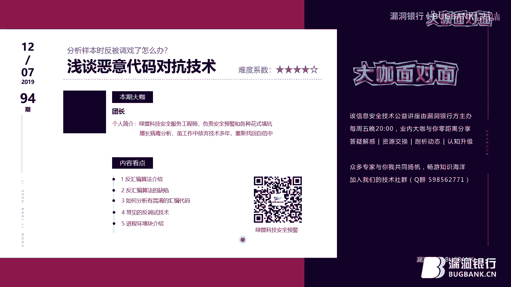

在本教程中，我们将学习恶意代码分析中的两项核心技术：**对抗反汇编**与**对抗反调试**。我们将从基本概念入手，通过理论讲解和实际案例分析，帮助你理解恶意代码如何干扰分析工具，并掌握相应的应对策略。

## 汇编与反汇编基础 💻

上一节我们介绍了课程概述，本节中我们来看看恶意代码分析的基础知识。

**汇编语言**是CPU指令的助记符表示。CPU执行的是二进制机器码（如 `0101`），但直接分析二进制序列非常困难。汇编语言使用助记符（如 `MOV`, `JMP`）代替复杂的操作码，便于人类理解和记忆。

**反汇编**是将可执行程序的二进制机器码翻译回汇编代码的过程。这是分析程序逻辑的关键步骤。然而，恶意代码会利用反汇编工具的算法漏洞，使其产生错误的汇编代码，从而干扰分析人员。

## 反汇编算法及其对抗技术 🔍

上一节我们介绍了汇编与反汇编的基本概念，本节中我们来看看反汇编器的工作原理以及恶意代码如何对抗它。

反汇编器主要有两种算法：

1.  **线性扫描反汇编算法**：从文件开头到结尾，按顺序将每个字节翻译为指令。
    *   **公式/代码示例**：一个简单的线性反汇编流程可以用伪代码表示：
        ```python
        offset = 0
        while offset < buffer_size:
            instruction = disassemble(buffer[offset])
            print(instruction)
            offset += instruction.length
        ```
    *   **缺点**：无法区分代码与数据，遇到嵌入数据的代码时会产生错误的反汇编结果。

2.  **面向代码流的反汇编算法**：更智能的算法。反汇编器跟踪程序的执行流程（如跳转、调用），只反汇编可能被执行到的代码，并维护一个待反汇编的地址列表。IDA Pro等高级工具采用此算法。
    *   **优点**：能更好地区分代码与数据。
    *   **缺点**：其算法假设可能被恶意代码利用。

恶意代码对抗反汇编的核心，就是利用反汇编器（尤其是面向代码流型）的**算法假设漏洞**。以下是两个关键假设：

*   **假设一**：遇到条件分支（如 `if`）时，大多数反汇编器会优先处理 `false` 分支。
*   **假设二**：大多数反汇编器会先反汇编紧跟在 `CALL` 指令后的字节，然后再处理 `CALL` 所调用位置的代码。

### 案例分析：利用条件分支干扰反汇编

以下是恶意代码常用的两种干扰技术：

1.  **恒等跳转**：构造一个无论条件如何都跳转到同一地址的代码序列。
    *   **原理**：例如，连续使用 `JZ`（为零则跳转）和 `JNZ`（不为零则跳转）指向同一个目标地址。无论标志位如何，执行流都会跳过中间的一些字节。但反汇编器优先处理 `false` 分支，会错误地将这些被跳过的“垃圾字节”当作指令反汇编，常产生一个调用巨大地址的 `CALL` 指令（如 `CALL 0xFFFFFFFF`），这显然是异常的。
2.  **固定条件跳转**：通过运算将条件标志位固定，使得跳转总是发生。
    *   **原理**：例如，`XOR EAX, EAX` 将 `EAX` 清零，同时将零标志位 `ZF` 置1。紧随其后的 `JZ` 指令条件永远为真，必然发生跳转。被跳过的字节同样会被反汇编器误判。

**对抗方法**：识别并修正这些干扰。关键在于找到导致反汇编出异常指令（如到大地址的 `CALL`）的源头，将那些实际不会被执行到的“垃圾字节”从**代码（Code）** 转换为**数据（Data）**。在IDA中，可以使用 `D` 键将代码转数据，`C` 键将数据转代码。

让我们通过一个实际样本来演练。在IDA中打开样本，我们看到一个 `CALL` 指令指向一个非法的大地址。

*   **步骤**：向上查看代码，发现通过 `XOR` 和 `JZ` 构造的固定跳转。被跳过的字节（如 `0xE8`, `0xE9`）就是垃圾字节。
*   **操作**：在垃圾字节的起始地址按 `D` 键将其转为数据。然后从跳转目标地址开始，按 `C` 键将后续字节转为代码。重复此过程，即可得到正确的反汇编结果。

## 无效的反汇编指令序列 🧩

上一节我们学习了如何处理简单的垃圾字节，本节中我们来看看一种更复杂的对抗技术。

有些指令序列中的字节**不能简单地被忽略或转为数据**，因为它们同时属于多个指令，且在执行中起到作用。反汇编器目前难以自动处理这种情况。

**简单案例**：序列 `EB FF C0 48`。
*   `EB FF` 是 `JMP -1`，向前跳转1字节，指向 `FF`。
*   `FF C0` 是 `INC EAX`，`EAX` 寄存器加1。
*   `48` 是 `DEC EAX`，`EAX` 寄存器减1。
*   **分析**：`FF` 这个字节同时属于 `JMP -1` 和 `INC EAX` 两条指令。执行结果是 `EAX` 先加1后减1，等于没变。整个序列功能上等同于 `NOP`（空操作），但会扰乱反汇编流程。
*   **对抗方法**：识别出此类序列后，需要将其**整体**作为无意义的数据块处理（在IDA中转为数据），然后从其后开始正常反汇编。

**进阶案例**：涉及更复杂的跳转和寄存器操作，原理类似。核心是**分析指令序列的实际效果**：哪些指令会改变程序状态（寄存器、内存、标志位）？哪些不会？保留有实际作用的指令，将无作用的复杂混淆序列整体标记为数据。

## 反调试技术 🛡️

上一节我们结束了静态反汇编对抗的学习，本节中我们进入动态分析环节，看看恶意代码如何检测和对抗调试器。

反调试技术是指恶意代码在运行时检测自身是否处于调试状态，如果发现被调试，则改变行为（如崩溃、退出、执行错误路径）以增加分析难度。

### 利用Windows API检测

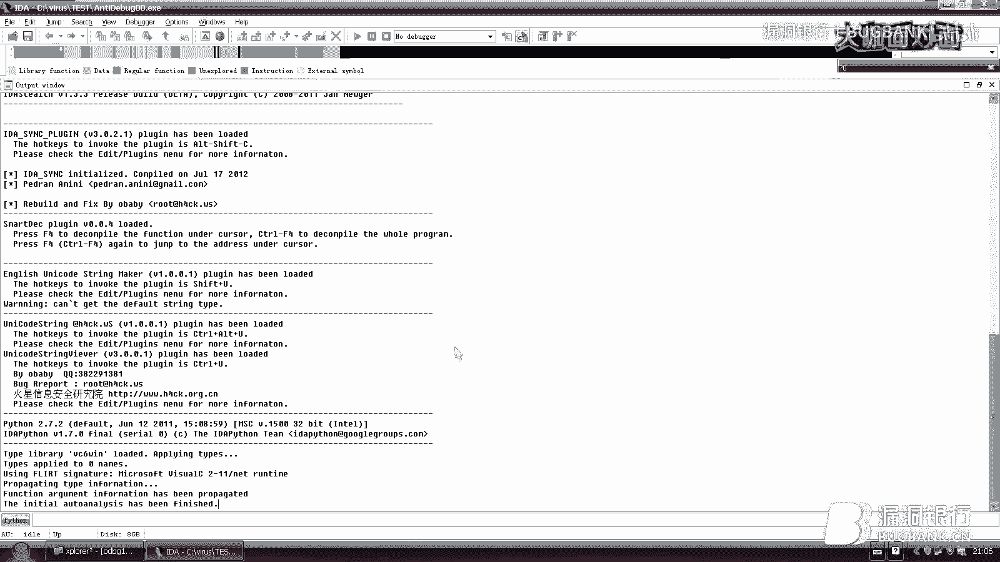

以下是几个常用的检测API：

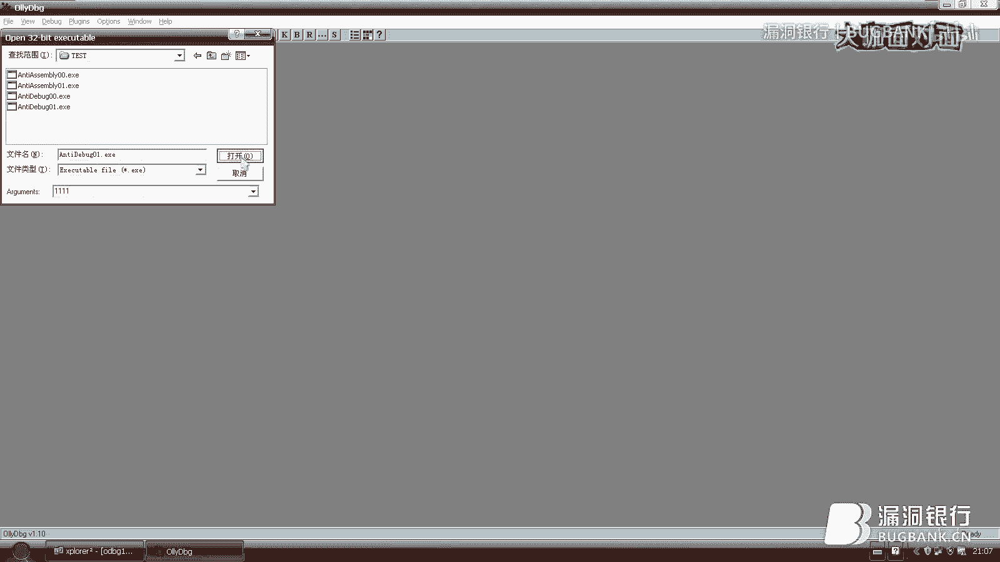

*   **`IsDebuggerPresent()`**：检查当前进程的**进程环境块（PEB）** 中的 `BeingDebugged` 标志。
*   **`CheckRemoteDebuggerPresent()`**：功能更强，可检测指定进程是否被调试。
*   **`NtQueryInformationProcess()`**：内核级函数，传入特定参数（如 `ProcessDebugPort`, `0x07`）可查询调试状态。
*   **`OutputDebugString()`**：利用该函数在调试和非调试状态下行为的差异进行检测。例如，先设置一个错误码，调用该函数后检查错误码是否被系统修改。

### 直接检测PEB结构

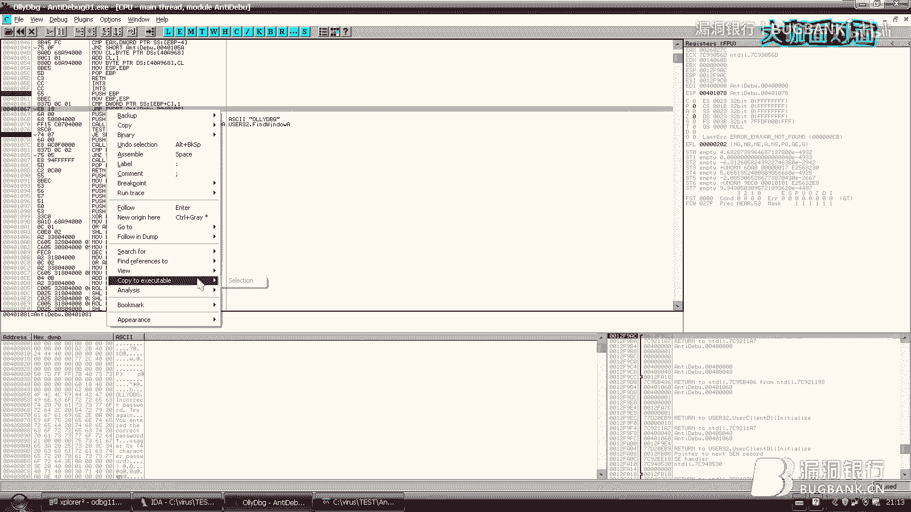

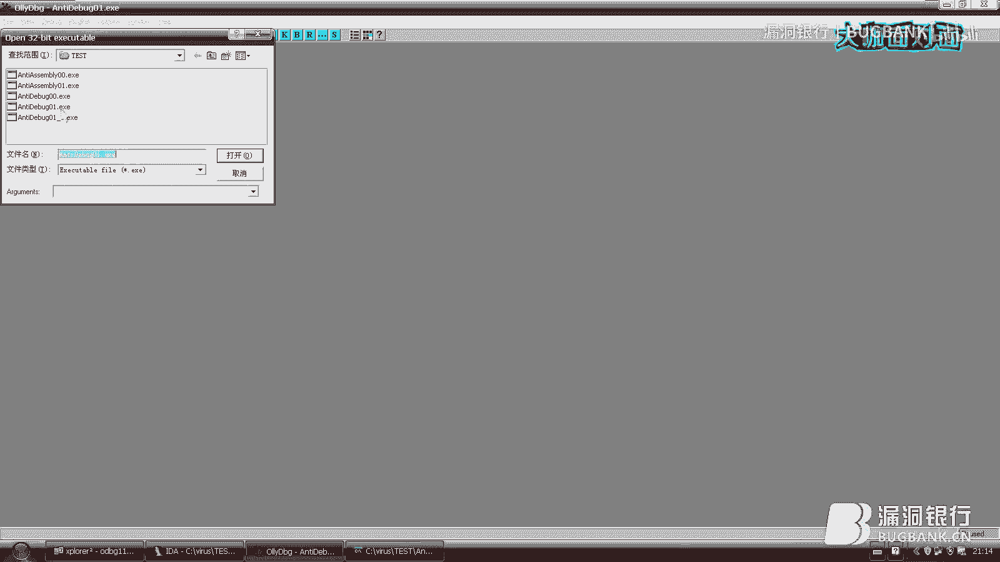

**进程环境块（PEB）** 是Windows为每个进程维护的数据结构，包含用户态参数，其中多个字段可指示调试状态。通过汇编指令直接读取PEB是常见的反调试手段。

*   **关键寄存器**：`FS:[0x30]` 指向当前进程的PEB基址。
*   **检测点1 - BeingDebugged**：偏移 `+0x2`。`IsDebuggerPresent()` API就是检查这里。
    *   **代码示例**：
        ```assembly
        MOV EAX, DWORD PTR FS:[0x30] ; 获取PEB基址
        MOVZX EAX, BYTE PTR [EAX+2]  ; 读取BeingDebugged标志
        TEST EAX, EAX                ; 检查是否为0
        JNZ DebuggerDetected         ; 非零则跳转到检测处理代码
        ```
*   **检测点2 - ProcessHeap**：偏移 `+0x18` 处的 `ProcessHeap` 字段，其内部 `Flags` 属性（在XP偏移 `+0x10`，Win7偏移 `+0x44`）可检测调试。
*   **检测点3 - NtGlobalFlag**：偏移 `+0x68`。若值为 `0x70`，通常表示进程在调试器中创建。

**识别技巧**：在分析样本时，如果看到读取 `FS:[0x30]` 的指令，就应警惕后续可能在进行反调试检测，重点关注对特定偏移（如 `+2`, `+0x18`, `+0x68`）的访问和判断。

### TLS回调函数反调试

**TLS（线程局部存储）回调函数** 会在调试器中断主程序之前（甚至在 `main` 函数之前）执行。恶意代码将反调试代码放在这里，可能导致调试器一加载样本就崩溃退出。

**对抗方法**：在调试器（如OD）的设置中，将**系统断点**作为初始暂停位置，这样可以在TLS回调函数执行时中断并进行调试分析。


## 对抗反调试实践 🛠️

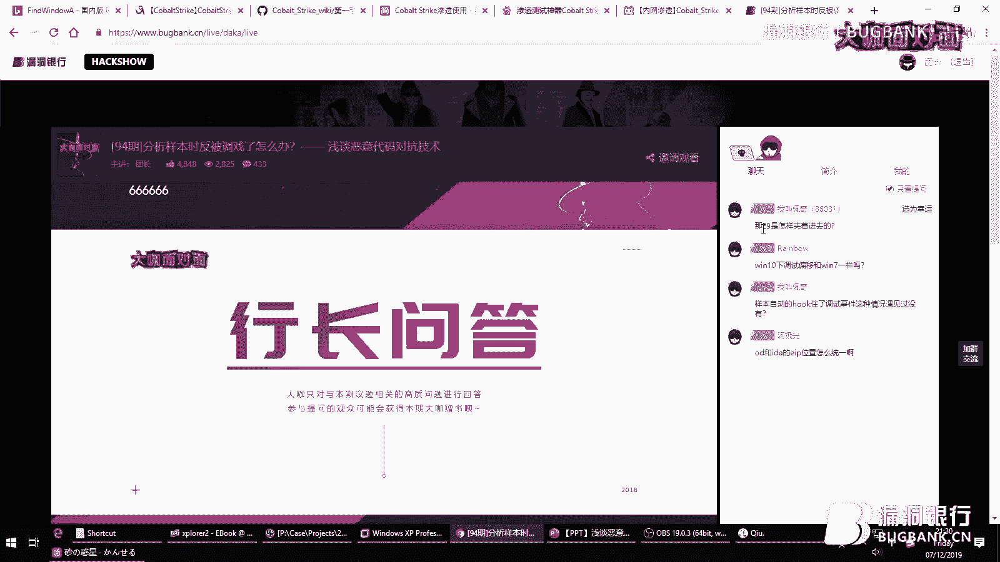

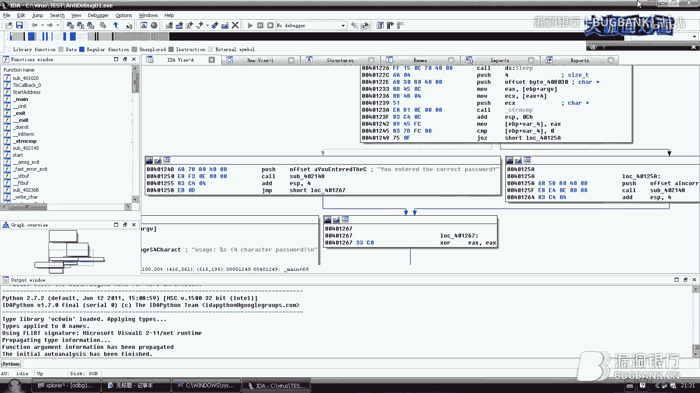

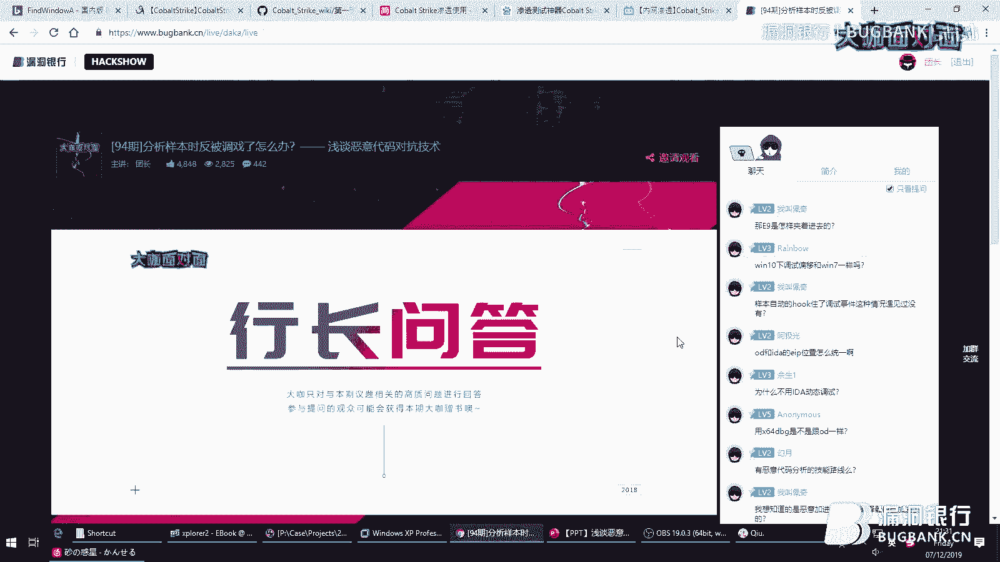

上一节我们介绍了多种反调试技术，本节中我们通过一个案例来实践如何绕过它们。

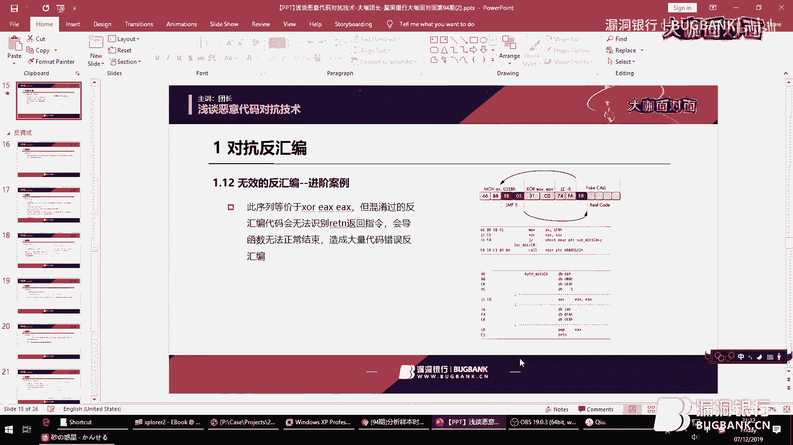

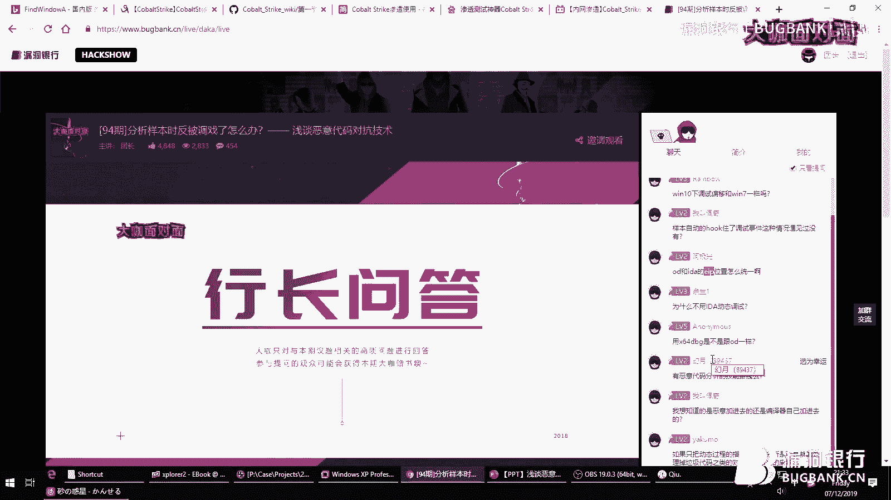

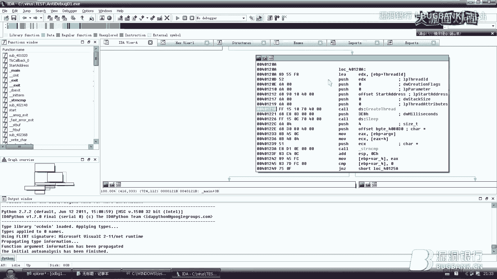

我们分析一个简单的“CrackMe”程序，它要求输入4字节密码。直接调试会发现程序异常终止。

1.  **对抗TLS回调反调试**：在IDA的导出表中发现 `TlsCallback` 函数。静态分析发现其通过 `FindWindow` 查找调试器窗口。在OD中，将调试选项的“首次暂停于”设置为“系统断点”，然后加载程序。在TLS回调函数中修改关键跳转指令（如将 `JNZ` 改为 `JMP`），使其绕过检测逻辑，保存修改后的程序。
2.  **分析主逻辑与动态调试**：用OD加载修改后的程序，在主函数入口点断下。分析发现程序调用 `lstrcmp` 比较用户输入与一个4字节数组（`BZQR`）。然而，直接输入该密码并不正确。
3.  **识别并绕过运行时反调试**：进一步分析发现，程序创建了一个线程，在线程函数中存在两处动态修改密码的反调试：
    *   **检测1**：读取PEB的 `BeingDebugged` 标志（`FS:[0x30]+2`），若为1（被调试），则给密码的第三个字节（偏移+2）加1（`BZQR` -> `BZRR`）。
    *   **检测2**：利用 `OutputDebugString` 技术。若检测到调试，则将一个全局变量置1，该变量会导致给密码的第二个字节（偏移+1）加1（`BZRR` -> `BYRR`）。
4.  **获取正确密码**：在OD中动态调试时，在检测点将相关标志位手动修改为0（模拟非调试环境），或静态推导出密码的原始值。最终得到正确密码 `BYRR`，输入验证通过。

## 总结 📝


本节课中我们一起学习了恶意代码分析中的核心对抗技术。

*   **对抗反汇编**：我们理解了线性扫描和面向代码流两种反汇编算法的原理与局限。恶意代码通过插入**垃圾字节**、构造**恒等跳转**和**固定条件跳转**来利用反汇编器的算法假设，产生错误结果。我们学会了在IDA中使用 `C`/`D` 键识别和修正这些干扰，对于复杂的**无效指令序列**，则需分析其实际功能后整体处理。
*   **对抗反调试**：我们学习了恶意代码如何检测调试环境，包括使用 **Windows API**（如 `IsDebuggerPresent`）、直接检测 **PEB 结构**中的关键标志位（`BeingDebugged`, `NtGlobalFlag`），以及利用 **TLS回调函数** 提前检测。我们掌握了通过修改调试器设置、动态修补关键跳转和标志位来绕过这些检测的实践方法。


掌握这些技术能显著提升分析混淆和受保护的恶意代码的能力。记住，静态分析与动态调试相结合，耐心追踪程序流程，是破解这些对抗手段的关键。