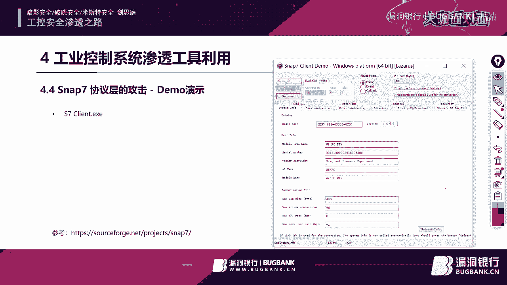
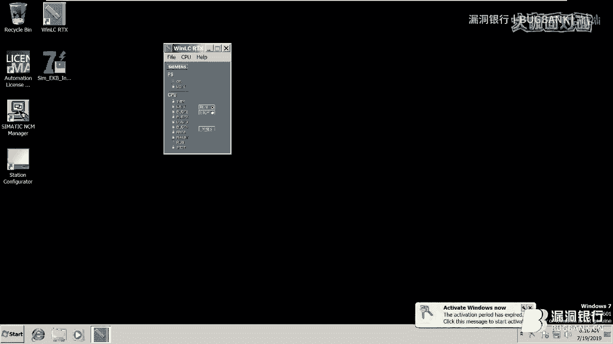
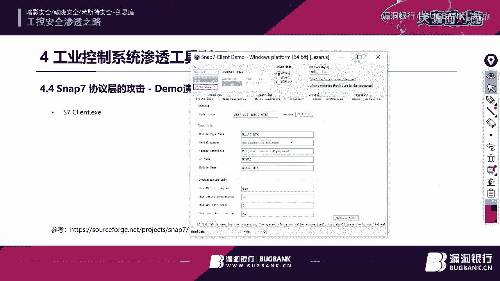
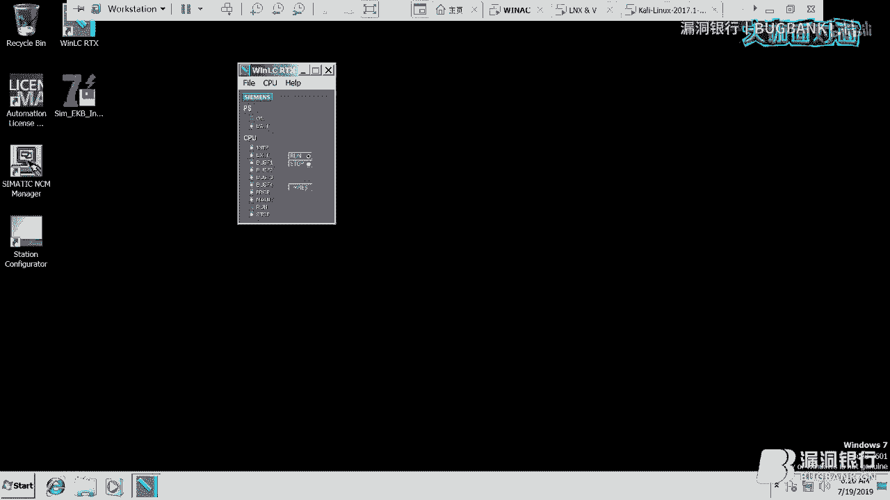
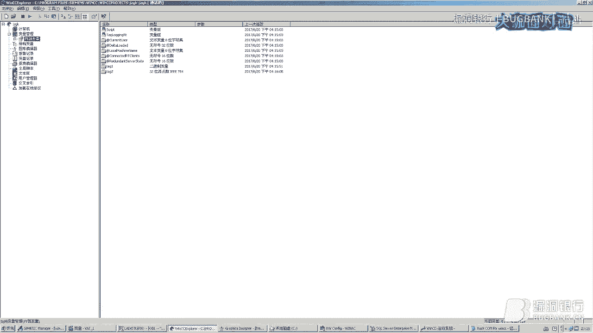
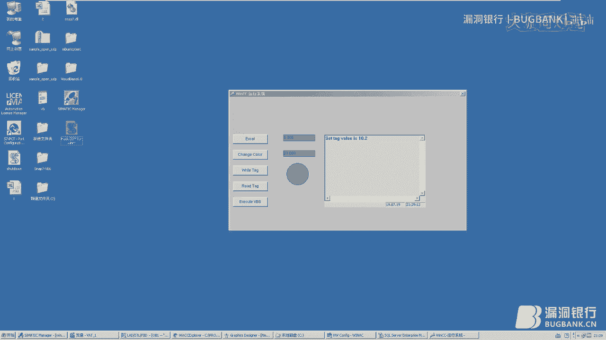
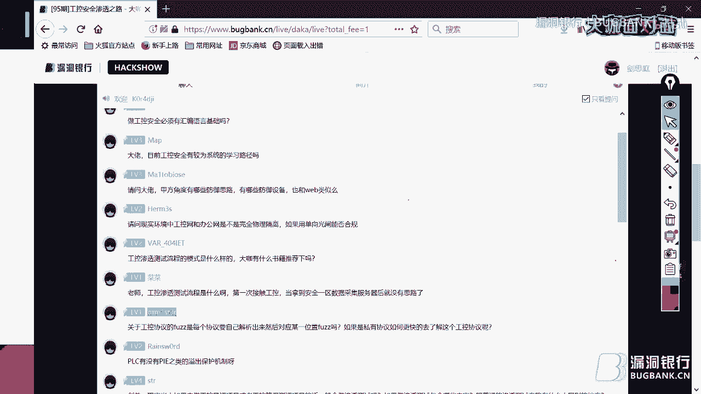

# 工控安全渗透之路 - 第95期大咖面对面教程 🏭🔐


## 概述

在本教程中，我们将跟随漏洞银行第95期大咖面对面直播的内容，系统性地学习工业控制系统（工控系统）安全渗透的基础知识。我们将从工控系统的结构、典型厂商产品、常见脆弱性、渗透工具演示，一直讲到纵深防御体系的构建。本教程旨在为初学者揭开工控安全的神秘面纱，降低学习门槛。

---

## 第一部分：工业控制系统结构与场景 🏭

上一节我们概述了课程内容，本节中我们来看看工业控制系统的基本面貌。

工业控制系统主要应用于制造业工厂，例如啤酒厂。一个典型的工厂布局包括生产区、控制室、办公区和值班区。工控系统在其中扮演着核心角色，它通过自动化设备代替人工，控制生产流程，例如啤酒的混合、发酵、灌装和包装。

在工厂中，工控系统存在于多个位置：
*   **总控室**：设有监控计算机和服务器，用于远程监控生产线状态。
*   **工业控制机柜**：内部装有可编程逻辑控制器（PLC），负责执行现场控制逻辑。
*   **现场产线**：自动化工程师通过笔记本电脑在现场对设备进行诊断和维护。

总的来说，工业控制系统通过与机械和工艺配合，执行预先编程的指令，实现生产自动化。需要明确的是，**工控安全与物联网（IoT）安全是两个不同的领域**，工控系统更侧重于连续、可靠的工业过程控制。

---

## 第二部分：工业控制系统的组成与分类 ⚙️

上一节我们介绍了工控系统的应用场景，本节中我们来深入了解其内部组成。

一个传统的工业控制系统通常由以下四层组成，这四层是必不可少的：

1.  **传感器与执行器（第0层）**：这是系统的“手脚”和“感官”。例如，液位计、温度计是传感器；阀门、电机是执行器。它们负责采集物理信号并执行动作。
2.  **可编程逻辑控制器（第1层）**：这是系统的“大脑”，即PLC。它是一台工业计算机，接收传感器信号，运行控制逻辑程序，并向执行器发送指令。**PLC与IoT设备的本质区别在于，PLC需要人工编程来定义其行为**，而出厂时其功能是空白的。
3.  **工业网络与现场总线（第1.5层）**：这是系统的“神经网络”。早期使用RS-232/485等专用总线，现在普遍采用工业以太网。以太网的普及带来了便利，也引入了安全风险，因为其协议多为明文，且网络易于接入和监听。
4.  **工业计算机与监控软件（第2层）**：这是系统的“监控中心”。包括服务器和监控客户端（HMI），用于数据存储、处理和图形化展示，使操作员能直观了解生产状态。

此外，工控系统按应用可分为两大类：
*   **过程自动化**：如石油化工、制药、冶金、水处理。特点是**连续24小时不间断生产**，通常使用集散控制系统（DCS）或大型PLC，点数（I/O通道）常超过2000点。
    *   **公式示例**：`控制系统类型 = DCS 或 大型PLC`
*   **工厂自动化**：如汽车制造、港口、烟草。特点是**离散、间歇性生产**，通常使用中小型PLC与设备捆绑，点数常少于2000点。
    *   **公式示例**：`控制系统类型 = 中小型PLC`

---

## 第三部分：主流工控厂商与产品 🏢

上一节我们了解了工控系统的组成，本节中我们聚焦于两家代表性的主流厂商及其产品。

以下是两家全球领先的工控厂商：

### 西门子（德国）

西门子提供广泛的PLC产品家族：
*   **SIMATIC S7-1500**：新一代中大型控制系统。
*   **SIMATIC S7-1200**：小型控制系统。
*   **SIMATIC S7-300/400**：经典的上一代产品，生命周期长达25年，在工控领域很常见。
*   **WinAC**：基于PC的软PLC，多用于教育和研发。

其核心软件包括：
*   **TIA Portal（博图） / STEP 7**：PLC编程组态软件。
*   **WinCC**：上位机监控画面组态软件。
*   **S7-PLCSIM**：PLC程序模拟仿真软件。

**S7协议**是西门子的私有协议，通讯端口为**102/TCP**。该协议缺乏加密和强认证。

### 罗克韦尔自动化（美国）

罗克韦尔的主要PLC产品包括：
*   **ControlLogix**：模块化的大型控制系统。
*   **CompactLogix**：一体化的中型控制系统。
*   **MicroLogix**：小型控制系统。
*   **SoftLogix**：基于PC的软PLC。

其核心软件包括：
*   **RSLogix 5000 / Studio 5000**：PLC编程软件，支持多种语言（梯形图、结构化文本等）。
*   **FactoryTalk View SE**：上位机监控画面组态软件。
*   **RSLogix Emulate**：PLC程序模拟仿真软件。

**EtherNet/IP协议**是罗克韦尔使用的公开协议，采用**双端口通讯**：`44818/TCP`用于常规数据交换，`2222/TCP`用于消息传递。

---

## 第四部分：工控系统的常见脆弱性 🐛

上一节我们认识了主流厂商的产品，本节中我们来剖析工控系统普遍存在的安全弱点。

工控系统的脆弱性主要体现在以下几个层面：

### 1. 协议漏洞
由于历史原因，工控协议设计之初以可靠性和实时性为首要目标，普遍缺乏安全考虑：
*   **缺乏身份认证**：任何设备都可接入网络。
*   **缺乏授权机制**：无法区分不同用户的操作权限。
*   **缺乏加密保护**：通讯数据多为明文传输，易被窃听和篡改。
    *   **代码示例（伪代码）**：`数据包 = 明文(功能码 + 地址 + 数据)`

以西门子S7协议为例，通过Wireshark抓包可以清晰看到建立连接、读写数据的全过程，所有指令和操作地址均暴露无遗。

### 2. PLC代码漏洞
PLC程序本身也可能存在缺陷：
*   **计算逻辑漏洞**：如除零错误、无效数学运算（对负数开方）。
*   **看门狗超时**：PLC程序单循环执行，若某段代码执行时间过长，超过看门狗定时器，会导致PLC停机。
    *   **公式示例**：`if (单次扫描时间 > 看门狗超时设定) { PLC进入故障状态; }`
*   **缓冲区溢出**：向固定长度的内存区域写入超长数据。

### 3. 工业网络漏洞
工控网络多为二层网络，攻击面较大：
*   **MAC地址泛洪**：攻击交换机MAC地址表，使其变为集线器模式，从而嗅探全网流量。
*   **ARP中间人攻击**：欺骗PLC和上位机，截获或篡改通信数据。
*   **STP攻击**：攻击生成树协议，制造网络环路，引发广播风暴。
*   **VLAN跳跃攻击**：通过Trunk端口访问非授权VLAN。
*   **交换机Web管理界面漏洞**：工控交换机Web界面可能存在的SQL注入、XSS等漏洞。

### 4. 上位机（HMI/SCADA）漏洞
上位机通常是Windows系统，且出于兼容性考虑，安全配置往往很弱：
*   **关闭防火墙和杀毒软件**：这是工控软件厂商常见的安装要求。
*   **系统漏洞**：未修补的Windows漏洞（如SMB、RDP）。
*   **组态软件漏洞**：软件本身的缓冲区溢出、未授权访问等。
    *   **示例**：西门子WinCC的COM组件在未授权情况下可被外部脚本调用并篡改数据。
        *   **代码示例（VBS）**：
        ```vbscript
        Set objHMI = CreateObject("CCHMIRuntime.HMIRuntime")
        objHMI.Tags("TagName").Write 100
        Set objHMI = Nothing
        ```

### 5. 物理安全漏洞
工控设备部署环境的安全防护往往不足：
*   控制柜未上锁或钥匙插在门上。
*   网络设备端口未做物理加固。
*   供电系统和接地系统不符合安全规范，可能遭受破坏。

---

## 第五部分：工控渗透工具演示 🛠️





上一节我们分析了系统的脆弱性，本节中我们通过演示来了解攻击者可能利用的工具。



演示在一个模拟环境中进行，包含Kali Linux攻击机、编程站、西门子PLC模拟机和罗克韦尔PLC模拟机。

以下是几种常用工具的演示：




### 1. 资产发现与指纹识别
使用Nmap扫描工控设备特定端口，并加载专用脚本识别设备信息。
*   **命令示例**：
    ```bash
    nmap -sV -p 44818 --script enip-info 10.1.1.50
    ```
    此命令可识别出罗克韦尔PLC的型号、版本等详细信息。

### 2. 二层网络攻击工具 - Yersinia
Yersinia是一款针对二层协议（如STP、CDP、DTP）的攻击工具，可造成网络瘫痪。
*   **攻击原理**：通过发送伪造的STP协议数据包，不断变更网络中的根桥，导致交换机端口状态持续震荡，形成网络风暴。

### 3. 西门子S7协议攻击工具 - s7scan
`s7scan`等工具可以直接与西门子PLC通信，进行信息读取和值篡改。
*   **功能**：连接PLC，读取系统信息，并能够对PLC内存中的数据进行读写操作。


### 4. 工控专用渗透框架 - ISF（Industrial Exploitation Framework）
ISF是一个类似Metasploit的工控漏洞利用框架，集成了多种PLC的漏洞利用模块。
*   **演示**：使用ISF框架中的西门子S7-300/400漏洞模块，可以远程发送`STOP`和`START`命令，控制PLC的运行与停止。
    *   **命令流程示例**：
    ```bash
    use exploits/siemens/s7_300_400_stop_plc
    set RHOST 10.1.1.49
    exploit
    ```






### 5. 上位机软件漏洞利用演示
以西门子WinCC为例，演示通过其暴露的COM接口进行未授权数据篡改。
*   **过程**：编写一个简单的VBS脚本，创建WinCC运行时对象，直接调用其写值方法，修改监控画面中的关键变量，而无需通过正常操作界面。

---

## 第六部分：工控系统纵深防御体系 🛡️

上一节我们看到了攻击的威力，本节中我们探讨如何构建有效的防御体系。

防御需要从多个层面构建纵深防线：

1.  **边界防御**：
    *   清晰划分OT（操作技术）网络与IT（信息技术）网络、以及OT内部不同区域的边界。
    *   在边界部署工业防火墙、网闸等设备，严格过滤访问流量。

2.  **网络安全**：
    *   交换机上禁用未使用的端口。
    *   修改默认VLAN ID，禁用CDP/LLDP等发现协议。
    *   启用端口安全功能（如802.1x认证），将交换机端口与特定设备MAC地址绑定。
    *   在网络层部署入侵检测/防御系统（IDS/IPS）。

3.  **主机安全**：
    *   在保证兼容性的前提下，尽可能为上位机安装杀毒软件并开启防火墙。
    *   实施严格的补丁管理策略。
    *   禁用不必要的USB端口，实施外设管控。
    *   部署应用白名单，只允许授权程序运行。

4.  **控制器安全**：
    *   如果PLC支持，启用其自带的用户认证功能。
    *   对于不支持加密的PLC，可以在其网络出口处部署终端IPsec加密设备，实现传输加密。
    *   对PLC程序进行代码安全审计，避免逻辑漏洞。

5.  **物理安全**：
    *   控制柜、机房必须上锁，严格管理人员进出。
    *   确保供电系统采用双路冗余。
    *   接地系统必须符合规范，定期检测。

---

## 总结



在本教程中，我们一起学习了工业控制系统安全渗透的完整路径。我们从工控系统的基本概念、结构分类入手，了解了西门子和罗克韦尔两家主流厂商的产品与协议。随后，我们深入分析了工控系统在协议、代码、网络、主机和物理层面的多重脆弱性，并通过工具演示直观感受了攻击手法。最后，我们探讨了如何从边界、网络、主机、控制器和物理五个层面构建纵深防御体系，以保护关键基础设施的安全。


工控安全是国家关键信息基础设施安全的重要组成部分，其重要性日益凸显。希望本教程能帮助你建立起对工控安全的基本认识，为后续更深入的学习和研究打下基础。


---
*注：本教程内容基于漏洞银行第95期大咖面对面直播整理，旨在进行技术研究与安全知识普及。所有技术内容仅用于合法授权的安全测试与学习，请勿用于非法用途。*