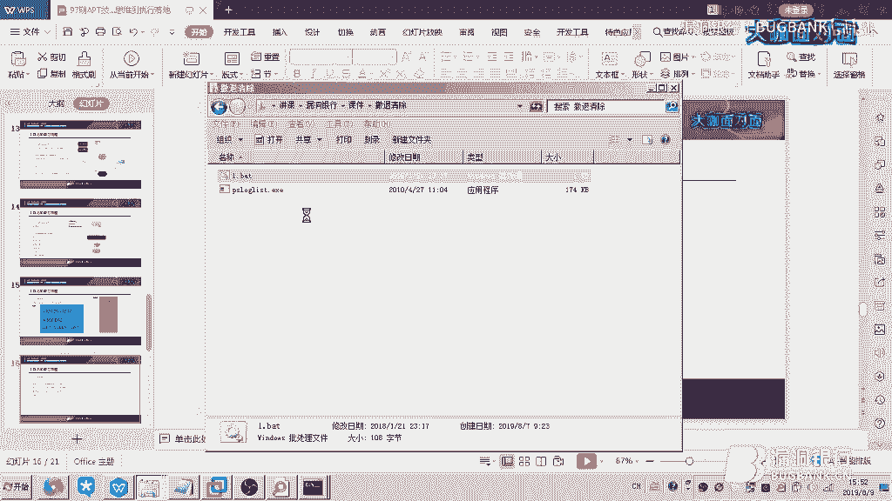
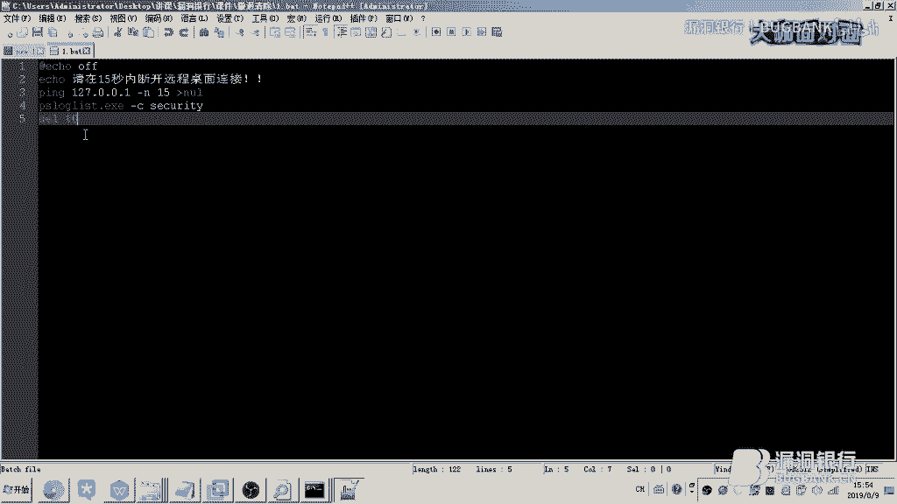
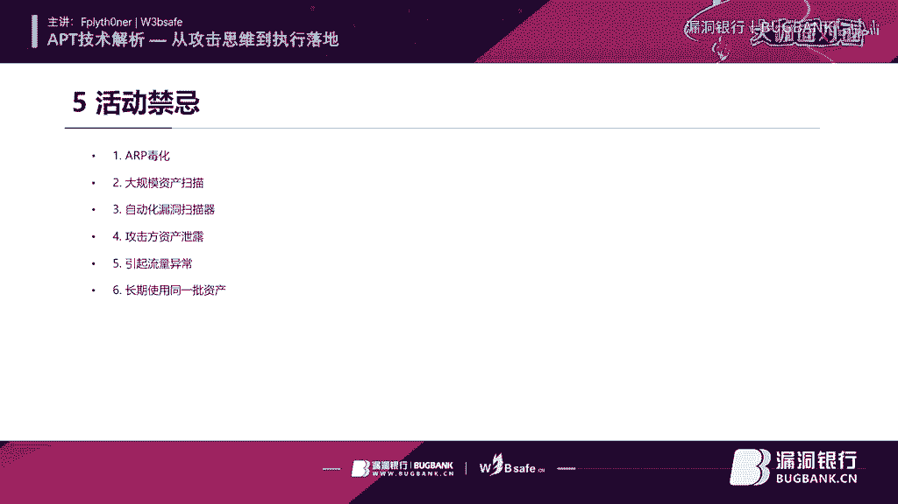

# 课程 P1：APT攻击基础解析 🎯

在本节课中，我们将要学习高级持续性威胁攻击的基础知识。我们将从APT的定义开始，探讨其与常规渗透测试和漏洞挖掘的思维差异，并深入了解攻击的实战流程、工具、技术以及实际案例分析。最后，我们将总结在实施此类攻击时应该注意和避免的事项。

## 什么是APT？🤔

上一节我们介绍了课程概述，本节中我们来看看APT的核心定义。

APT攻击即高级可持续性威胁攻击，也称为定向威胁攻击。它指某组织对特定对象展开的持续有效的攻击活动。

这种攻击活动具有极强的隐蔽性和针对性。通常会使用受感染的各种介质、供应链攻击和社会工程学等多种手段，实施先进的、持久的且有效的威胁和攻击。

定向攻击与一般攻击行为不同。一般攻击行为可能只是为了破坏系统或图钱财。定向攻击则对目标系统内部的资料或网络上的敏感数据更感兴趣。

APT攻击与渗透测试也有区别。渗透测试可能只关注获取系统的操作权限。而APT攻击中使用的恶意漏洞利用，其生命周期可能处于零日漏洞状态。攻击者使用一次后可能就不会再轻易使用，以避免被发现和披露。

## APT与SRC漏洞挖掘的思维和侧重点 🔄

理解了APT的基本概念后，我们来看看它与常规安全研究的思维差异。

做渗透测试或漏洞挖掘时，我们可能用几周或几天时间整理资产并寻找漏洞。例如寻找XSS、SQL注入、RCE或组件安全问题，发现后即提交。

高级攻击则不同。攻击者可能用几个月甚至几年的时间持续搜集目标资产并挖掘漏洞。他们会更加注意隐蔽自己的行踪，其行为可能被伪装成正常的网站检测活动。

对于能进入内部网络的漏洞，一旦发现，攻击者就会开始策划如何入侵并获取更深层的网络权限。

以下是两者侧重点的对比列表：
*   **常规漏洞挖掘**：快速发现并提交漏洞，以获得奖励。
*   **高级攻击**：积累漏洞，策划大规模攻击，任何小问题都可能成为攻击焦点。
*   **权限目标**：漏洞挖掘关注单个系统的权限；高级攻击则致力于提升并维持系统及网络权限，实现长时间不被发现的监视。
*   **安全意识差异**：国内外厂商对安全问题的重视程度和奖励标准不同，这影响了攻击者的策略。

## 攻击阶段与实战流程 🛠️

上一节我们对比了不同思维模式，本节中我们将深入APT攻击的具体执行阶段。

攻击流程是一个动态调整的过程。首先对目标进行信息搜集，这不仅是资产搜集，还包括用户信息、邮箱、账号、供应商信息等。掌握目标的业务环境有助于模拟真实网络进行测试。

之后会制定攻击方案，进行权限提升和维持，并应用反溯源技术，最终实现攻击目的。信息搜集贯穿整个攻击活动，需要根据变化动态调整方案。

攻击结束后，需要清理痕迹，包括应用访问日志、流量日志、登录日志和操作日志。了解日志位置依赖于前期的信息搜集。

整个流程可能耗费数年时间，核心在于周密思考、谨慎行动，避免打草惊蛇。

以下是信息搜集的关键方面：
*   **资产信息**：使用工具如`fscan`、`Ladon`、`SubdomainBrute`、`ZoomEye`、`Shodan`、`RouterScan`、`S扫描器`、`Masscan`、`Nmap`。
*   **目标用户信息**：包括真实信息（姓名、电话等）和虚拟活动范围（常用论坛、社交软件），可用于社会工程学攻击或密码爆破。
*   **邮箱信息**：通过社工库、搜索引擎、官网、邮件列表进行搜集。
*   **账号信息**：搜集常用账号和密码。
*   **供应商信息**：了解服务提供者、合作厂商、招标信息、软硬件资产来源，用于模拟环境或供应链攻击。
*   **目标业务环境**：通过XSS探针、链接图片等方式搜集操作系统、浏览器、服务、在线时段、端口开放情况等信息。

## 方案制定与权限提升 🚀

在完成广泛的信息搜集后，我们需要制定具体的攻击方案。

方案应该是可随机应变且动机明确的。前期方案可能将获取网络权限放在首位，因此更关注资产的入口点、攻击路径和网络拓扑。

例如，在一次实战中，通过获取路由器权限，发现了内部网络。攻击重点随即从初始入口转向对域控服务器的横向和纵向渗透，最终通过控制域控服务器实现了对整个网络的控制。

权限提升是渗透测试的核心目标。以下是不同层面的权限提升方法：

**资产权限提升：**
*   **弱口令/默认密码**：最隐蔽的方式之一。
*   **常见Web漏洞**：`SQL注入`、`XSS`、`CSRF`、`XXE`、`RCE`、文件上传/读取/包含。
*   **特定漏洞**：Java中间件漏洞、源代码漏洞、系统级RCE、零日漏洞。
*   **利用平台**：`CVE`平台、自研框架、`Seebug`等社区。

**本地权限提升：**
*   利用系统内核漏洞，例如从`ExploitDB`或`GitHub`获取的`Windows/Linux Kernel Exploit`。
*   对于现代系统如`Win10`，更多依赖于零日漏洞、弱口令或绕过`UAC`等技术。

**网络权限提升：**
*   **技术/工具**：`SSRF`、`reGeorg`、`EarthWorm`、`Neo-reGeorg`、`lcx`、`htran`、`socks`隧道（如`Cobalt Strike`的`Socks5`代理）、`Proxifier`、`SocksCap64`。

权限提升的实践可以借助自动化工具。例如，将目标的系统补丁信息提交到`提权辅助网页`，该工具会列出可用的本地提权漏洞。

## 权限维持与反溯源 🕵️♂️

成功提升权限后，为了持久控制且不被发现，需要进行权限维持和反溯源。

这一切都是为了实现更持久化的控制，避免被立刻察觉。可行的方案包括使用自制的免杀木马、修改指纹后的`Cobalt Strike`、`Metasploit`、`Empire`或`DoublePulsar`等工具。

在通信方面，可以使用`HTTPS`或对`HTTP`传输的数据进行加密。更隐蔽的方式包括`DNS`隧道、`ICMP`隧道，而`TCP`直连则速度更快。

一个构思的`C2`网络示例如下：攻击者使用伪造身份购买物联网卡，注册`CDN`、购买`C2`服务器、搭建`SSR/V2Ray`隧道。通过这套系统，利用公共`CDN`隐藏真实`IP`，再通过境外隧道控制目标主机，从而有效隐藏行踪。

在系统层面，端口复用技术是有效的权限维持和反溯源手段。它利用系统已开放的端口安装后门，可以绕过防火墙、安全策略和杀软监控。工具如`reGeorg`、`V2M`、`DoublePulsar`可以实现此技术。

例如，基于`IIS`的端口复用，攻击者通过公网映射的`80`端口即可控制目标，非常隐蔽。

## 目的实现与痕迹清理 🧹

在持久控制目标后，最终需要实现攻击目的并清理痕迹。

实现目的的方法多种多样。例如，传输数据时，可以拆分字节并间歇性发送，虽然缓慢但能避免流量异常和被监测工具发现。清除目标时，也需保证当前阶段不会被溯源。

痕迹清理至关重要，需要在攻击前就摸清各类日志的位置。以下是要清理的主要痕迹类型：
*   **应用程序日志**：应用自带的日志文件。
*   **登录日志**：`Windows`事件查看器、`Linux`的登录记录。
*   **操作痕迹**：`Windows`事件查看器、`Linux`命令行历史（可清空`~/.bash_history`）。
*   **流量日志**：`IIS`、`Apache`、`Nginx`、`Tomcat`等服务的访问日志。

一个常用的清理思路是延时清理。例如，在使用`微软的psloglist工具`清理安全日志时，设定在退出远程桌面连接`15秒后`再执行删除操作。这样可以避免在退出时产生新的日志条目，从而暴露清理行为本身。之后，再通过命令行删除用户，完成简单的反溯源。

## 实际案例分析 📊

前面我们学习了理论和技术，现在通过实际案例来加深理解。

**案例一：币安被盗事件**
攻击者对币安进行了长时间的信息搜集，包括制作仿冒网站窃取用户凭证。他们发现币安开放了一个`API`，可以在用户二次验证后保留`Cookie`。攻击者利用已窃取的凭证和该`API`，控制了大量用户账号。他们最初尝试提币但被平台察觉并冻结。随后转为抛售数字货币，引发市场下跌，并在其他市场通过做空获利。

**案例二：驱动人生供应链攻击**
攻击者通过多层跳板进入目标网络，实现了长达一个半月的远程控制。他们精心策划，在驱动人生公司员工外出的时机，对其软件更新链进行投毒。受感染的软件分发到大量用户计算机，形成了广泛的攻击辐射。此攻击者同样未被成功溯源。

这些案例表明，深入的信息搜集、耐心的等待时机以及周密的攻击策划，是APT攻击成功的关键。

## 应该做什么与不应该做什么 ⚖️

本节课的最后，我们来总结在APT攻击中需要注意的原则。

**不应该做的事情（避免暴露）：**
*   **制造过大动静**：例如进行`ARP`欺骗、大规模`SYN`扫描（易造成网络堵塞），这些行为极易触发警报。
*   **使用自动化漏洞扫描器**：虽然效率高，但产生的流量和请求模式非常明显，不适合隐蔽的长期攻击。
*   **资产泄露**：避免使用已被标记的`IOC`资产。不要直接用自己的真实`IP`访问目标，所有操作都应通过代理。
*   **引起流量异常**：长时间或大流量的数据传输容易被发现。
*   **长期使用同一批资产**：一旦某个资产被关联，应果断弃用，否则风险极高。

**应该做的事情（保持隐蔽）：**
*   **耐心与细致**：将信息搜集贯穿始终，动态调整方案。
*   **模拟环境**：尽可能模拟目标业务环境进行测试。
*   **注重权限维持**：使用免杀技术、隐蔽信道和反溯源手段。
*   **周密策划**：每一次行动前都应评估可能产生的影响和痕迹。
*   **彻底清理痕迹**：在撤离前，根据前期搜集的信息，彻底清理各类日志。

---

**本节课总结**

在本节课中，我们一起学习了APT攻击的基础知识。我们从APT的定义和特点出发，对比了其与常规漏洞挖掘的思维差异。我们深入探讨了APT攻击的完整流程，包括信息搜集、方案制定、权限提升与维持、反溯源技术、目的实现以及痕迹清理。通过币安被盗和驱动人生供应链攻击两个实际案例，我们看到了理论在实战中的应用。最后，我们明确了在实施此类攻击时应遵循的隐蔽原则和应避免的危险行为。希望这门课程能帮助你建立起对APT攻击的基本认知框架。