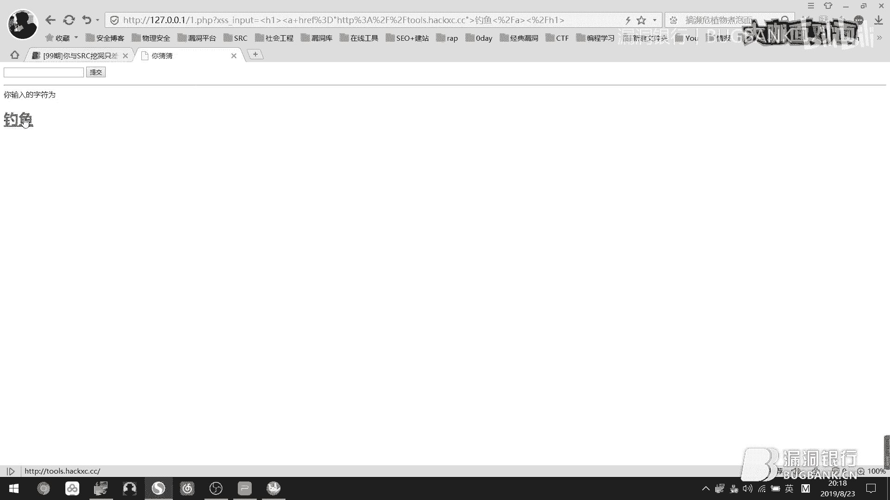
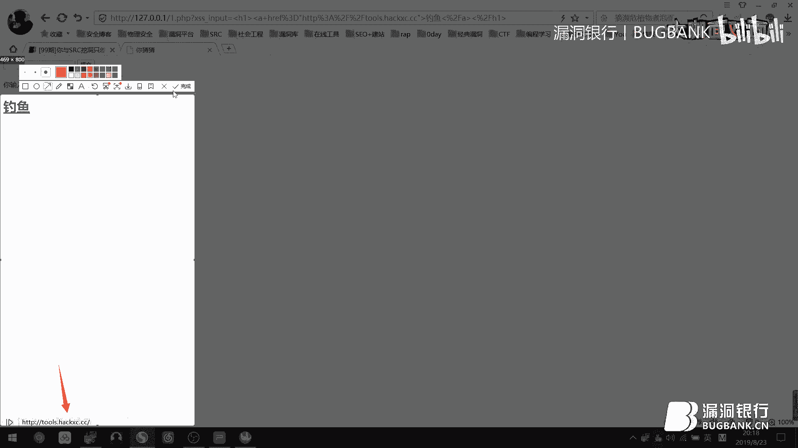
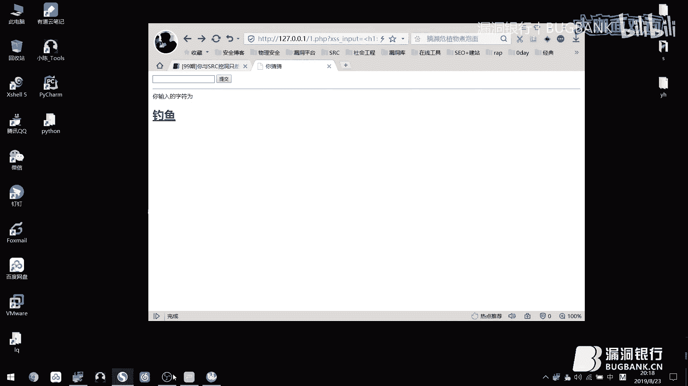
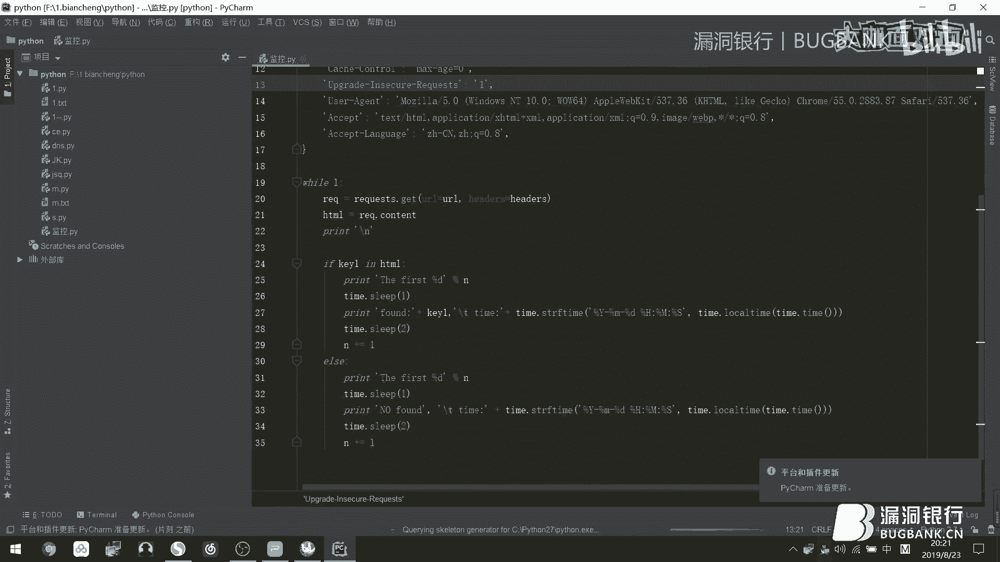
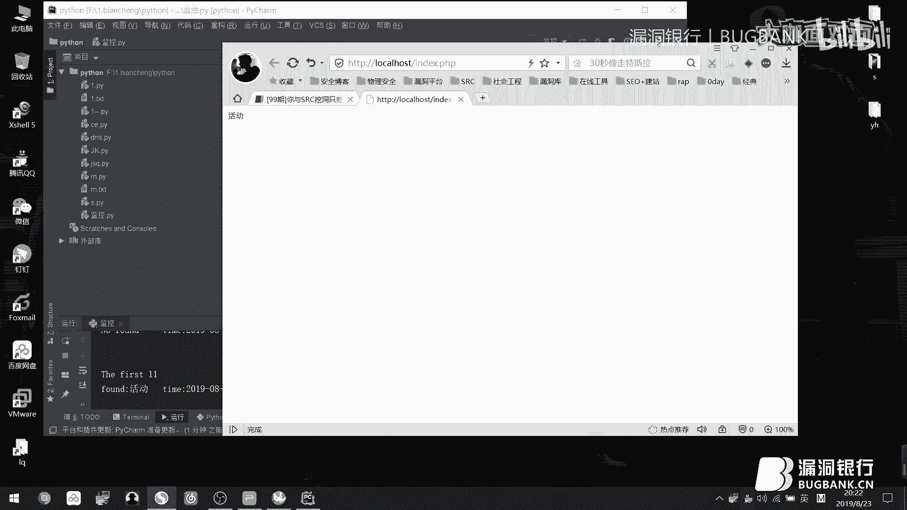
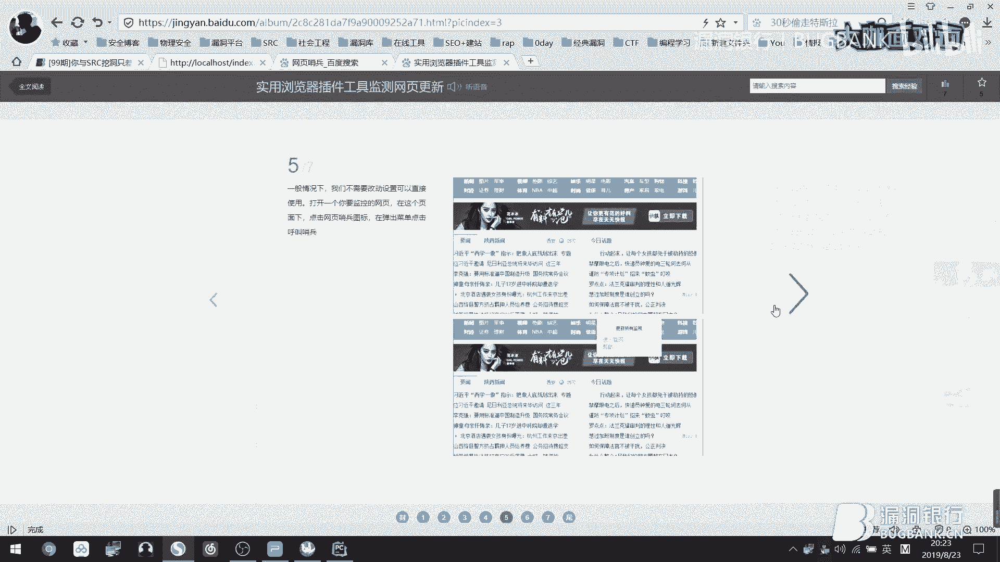
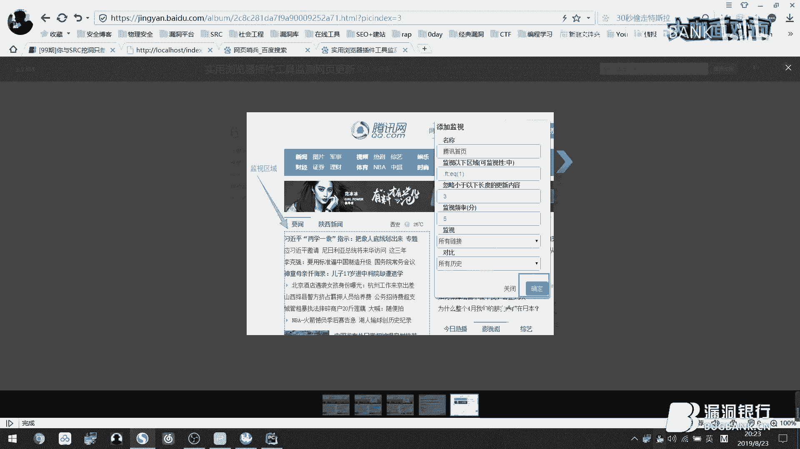

# 课程 P1：SRC漏洞挖掘入门攻略 🎯


在本节课中，我们将学习如何高效地进行SRC（安全应急响应中心）漏洞挖掘。课程内容将SRC挖洞比喻为一场游戏，从理解规则、定位目标、掌握技巧到扩展思维，并结合实际案例进行讲解，旨在帮助初学者快速入门。

---

## 一、 理解游戏规则：SRC是什么？🎮

上一节我们介绍了课程概述，本节中我们来看看SRC挖洞的基本规则。SRC是厂商设立的漏洞收集平台，安全研究者可以提交漏洞并获得奖励。参与这场“游戏”，首先需要遵守其评分规则。

每个SRC平台都有其漏洞评分标准，通常包含**漏洞等级**和**业务系数**。最终的奖励（安全币）由两者相乘得出。

以下是某SRC平台的评分示例：

*   **低位漏洞**（如反射型XSS）：安全币系数为 **2**
*   **高位漏洞**（如任意文件读取）：安全币系数为 **5**
*   **边缘业务**：业务系数为 **5**
*   **核心业务**：业务系数为 **10**

**计算公式**：`最终安全币 = 漏洞等级系数 × 业务系数`

例如，在边缘业务中挖到一个反射型XSS，可获得 `2 × 5 = 10` 个安全币。若平台兑换比例为1:10，则相当于100元奖励。

**如何在游戏中升级？**
1.  **遵守规则**：仔细阅读目标SRC的公告，了解其具体的评分标准。
2.  **观察差异**：不同平台对同一漏洞的评级可能不同，选择奖励更优的平台。
3.  **瞄准核心**：核心业务的业务系数更高，收益更大。
4.  **夯实基础**：必须扎实掌握各种漏洞的原理与利用方法，否则会与漏洞“擦肩而过”。

---



## 二、 知己知彼：如何进行有效定位？🔍






理解了游戏规则后，我们需要学习如何寻找目标。俗话说“知己知彼，百战不殆”，漏洞挖掘也是如此。我们需要了解目标厂商的业务，并推断其可能存在的缺陷。

以**电商平台**为例，看到其功能点，应立即联想可能存在的漏洞。





以下是电商平台常见功能点及联想漏洞：





*   **注册/登录处**：爆破、任意用户注册、修改返回包绕过验证。
*   **收货地址处**：越权访问、存储型XSS。
*   **订单信息处**：ID遍历导致信息泄露。
*   **支付/充值处**：逻辑漏洞（如1元购买高价商品）。
*   **头像上传处**：文件上传Getshell、SSRF、上传HTML导致存储XSS。
*   **账户信息修改处**：CSRF、越权、XSS。
*   **商品评价处**：XSS、越权删除评价、CSRF。




**核心思路**：看到任何功能点，都要在脑海中快速过一遍它可能存在的缺陷，然后逐一测试验证。


---

## 三、 漏洞挖掘的核心技巧与思维 🛠️

掌握了目标定位方法，本节我们来看看一些实用的挖掘技巧和扩展思维。

### 1. 关注新增业务
新上线的功能或子域名往往防御薄弱，是挖掘漏洞的黄金时机。我们可以通过自动化手段进行监控。

*   **Python监控脚本示例**：监控网页特定关键词（如“活动”）是否出现。
    ```python
    import requests
    import time

    def monitor_website(url, keyword):
        response = requests.get(url)
        if keyword in response.text:
            print(f"[+] 发现关键词 '{keyword}'！")
            # 触发告警或进行下一步测试
        else:
            print(f"[-] 未发现关键词")

    # 使用示例
    while True:
        monitor_website("https://target.com", "活动")
        time.sleep(60) # 每分钟检查一次
    ```
*   **浏览器插件**：如“网页哨兵”、Distill Web Monitor等，可可视化设置监控区域和关键词。

### 2. 尝试不同权限角色
不要只以普通用户身份测试。尝试申请或注册不同权限的账号（如商家、骑手、管理员），测试其专属功能，往往能发现新漏洞。

### 3. 回顾与再测试
以前没挖出洞的功能，在学习新知识后可以重新测试，可能会有新发现。即使漏洞已被人提交，这个过程也能证明你技术的提升。

### 4. 理解漏洞本质
漏洞是对系统能造成**非预期影响**的缺陷。只要能够影响业务正常运行，就可能构成漏洞。

**漏洞挖掘三要素**：
1.  **广度**：信息收集能力，资产范围要广。
2.  **深度**：对每个功能点进行深入、多权限的测试。
3.  **认知**：扎实的漏洞原理知识，能识别各种漏洞形态。

---

## 四、 实战案例与经验分享 💡

理论结合实践才能融会贯通。本节我们将分享几个真实的漏洞案例，以扩展大家的挖掘思维。

### 案例一：垂直越权
在请求参数中发现`session`和`user`字段，测试发现`user`值代表权限等级（1=管理员，2=VIP，3=普通用户）。将普通用户的`user`值修改为`1`，成功垂直越权获得管理员权限。

**漏洞点**：服务端仅依赖前端传入的参数判断用户权限，未在服务端进行二次校验。

### 案例二：并发请求逻辑漏洞
在“领取手机红包”功能处，输入手机号点击领取。利用Burp Suite的**Turbo Intruder**或**Repeater**的并发功能，同时发送大量领取请求，导致可以重复领取多个红包。


**漏洞点**：服务端未对领取请求做并发限制或幂等性校验。

### 案例三：整数溢出漏洞
某游戏内购买道具，单价为2游戏币。程序使用`int`类型存储数量，其最大值为 **2,147,483,647**。尝试购买数量为 `1,073,741,824` 的道具，总价 `2 * 1,073,741,824 = 2,147,483,648`，超过了`int`最大值，发生溢出，最终实际扣款为负数或极小值，反而增加了游戏币。

**漏洞点**：支付计算时使用了有符号整数，且未对计算结果进行上限校验。
**关键值**：`INT_MAX = 2,147,483,647`

### 案例四：坚持不懈的回报
访问一个站点返回403禁止访问。通过目录扫描发现一个隐藏地址`/api/data`，访问后报错“参数错误”。使用FUZZ技术对参数进行模糊测试，最终通过添加参数`id=1'`触发了SQL报错，成功发现SQL注入漏洞。

**经验**：对`GET`、`POST`、`Cookie`中的每一个参数进行增、删、改、查的反复测试，并利用自动化工具辅助发现隐藏参数。

---

## 五、 补充知识与其他技巧 📚

除了主要技巧，还有一些细节知识能帮助你更顺利地进行SRC挖洞。

### 验证码绕过姿势
1.  **重复使用**：验证码不刷新，可重复使用。
2.  **万能验证码**：如`0000`、`8888`，常用于测试环境。
3.  **空值绕过**：提交空验证码。
4.  **验证码可识别**：使用OCR工具识别简单验证码。
5.  **校验位置绕过**：系统只验证了密码和验证码，未校验用户名，可爆破用户名。

### 短信轰炸绕过姿势
1.  **无任何限制**：直接持续调用发送接口。
2.  **绕过前端验证**：直接向后端接口发送请求。
3.  **添加区号**：在手机号前加`+86`可能绕过限制。
4.  **输入邮箱**：在手机号字段输入邮箱地址，可能导致向该邮箱无限发送验证邮件。

### 实用建议
1.  **关注活动**：在SRC平台有翻倍奖励、节假日活动时挖掘，收益更高。
2.  **保留积分**：平时积累积分，用于兑换节日限定礼品。
3.  **合理沟通**：对漏洞评级有异议时，可礼貌联系运营人员协商。
4.  **威胁情报**：如果不擅长挖洞，可以关注并提交对厂商有威胁的情报（如GitHub泄露、论坛讨论的0day等），也能获得奖励。
5.  **法律边界**：测试时以证明漏洞存在为目的，不要窃取、篡改用户数据。测试完成后应删除测试产生的数据。

---


## 课程总结 🎉

本节课中我们一起学习了SRC漏洞挖掘的完整攻略。

我们从**理解SRC的游戏规则**开始，明确了评分机制是收益的基础。接着学习了如何**定位目标**，通过分析业务功能来联想潜在漏洞。然后，我们掌握了多项**核心技巧**，包括监控新业务、切换权限视角和培养挖掘思维。通过**实战案例**，我们看到了越权、逻辑漏洞、整数溢出等多种漏洞的挖掘过程。最后，补充了验证码绕过、短信轰炸等**细节知识**和实用建议。


记住，漏洞挖掘是一场需要**耐心**、**细心**和**持续学习**的游戏。夯实基础，大胆尝试，细心验证，你与第一个SRC漏洞的距离就会越来越近。