# P1：发布 - 漏洞银行BUGBANK - BV1KP4y1j7Ei

Yeah。

为知识而成，因技术而生。各位小伙伴们，大家晚上好，欢迎参加第122期漏洞银行安全技术直播大咖面对面，我是今晚的主持人fancy。今晚要给大家做技术分享的大咖是来自于NSDA安全团队成员的LSF大咖。

今天我们有幸邀请到大家来开面做客。这次他分享的议题是潜析模板注入漏洞。感兴趣的小伙伴可要做好笔记，听到最后哦。任何疑问可以随时在聊天区提出待演讲完毕后，大咖会在行长问答环节集中解答小伙伴的疑问，同时。

今晚的听讲福利也将在问答环节结束后，挑选一位幸运观众送出由LSF大咖亲自挑选的书籍，网络安全攻防技术实战。那下面就让我们有请LSF大咖开始今天的直播分享吧。嗯，好呃，大家好，各位搞个好啊。

我是这期的大咖SSSF。是来自那个ADA安全团队，现在是主要是。就研究这个代码审计学习。相关的方面是吧，有也是。就平常就打打CDF。Yeah。比赛中也获得了一些名次吧。然后这期呢我带来一个议题。

就是浅息模板注入漏洞。相信大家就是平常听说那些什么circle注入什么叉SS注入，这些都是很常见的。大家都。已经非常了解，但是这个模板猪漏洞的话，现在应该没了解，应该比较少。

但这个模板猪漏洞是在15年在那个黑猫大会上。有那个有个安全团队分享了一个新的手法。然后这期我就主要来讲一下这个模板处漏洞。然后。今天就分为三份。第一部分就是注入漏洞的原理。

然后第二部分就检测这个模板猪入漏洞。第三部分就是主要就是利用漏洞进行攻击啊。优先来看第一部分。那个什么是模板猪肉洞，要了解这个模板猪肉洞呢，先要了解什么是模板。有现在很多程序都是用了一个什么NVC框架。

而这个NVC框架中也大量使用了一个模板的技术。模板呢就是一种提供给程序来解析一种语法，就是模板是。用于将数据。又到这个。主要实现这个HTNL代码。从数据转变到HTM代码这项工作。

有模板引擎就是将这个模板和数据结合起来，最终生成1个HTL文档，然呈现给用户。这使这个业务代码和这个逻辑代码分离。大大提高了开发的效率。有。这个模板渲染的方式呢有两种，一种是在前端。

用户用户这个客户端这边确认。由浏览器从服务器中得到一些信息，像jason字符串或者HTML支符串，由将浏览器将这些信息。组合成这个HTML。最终解析给呈现给用户。

由这项工作主要是在那个客户端的浏览器上完成的，所以服务端那个压力就比较小。然后还一种就后端渲染。然后是后端接收的这个数据。然渲染成HTML，然后返回给服务客户端。浏览器只需要呈现HTML给用户即可。

然后这种好处就是后端的压力小吧。然后这两种渲染方式呢会。有两种漏洞。就是有这个。客户端那个模板猪肉洞CSTI还有服务端的模板猪肉洞SSTI。然后客户端的这个无法做漏洞呢。

就经常是造成一些叉SS类似的效果。由后端的这个危害就比较大，就可以造成这个命令执行或者泄露这些敏行数据。服务端的配置信息或者文件。然后呢。什么是模板猪肉洞？刚知道这个模板是一种程序解析的语法。

那那个模板猪肉洞。就是在那个。程序接收的用户的输入的话，没有对这个数据进行一些正确的过滤，直接将这个用户输入拼接到模板当中。你又拿给这个模板侵确了，这就会造成一个用户完全可可以控制这个模板语句。

以后用会只需要去学习一些这个模板模板语言或者一些就是或者还有就是他那个语言的那些基本语法。就可以。就是最终可以达到控制服务器的这个目的啊。就现是演示一下这个租的这个案例。就是这是一个f小程序吧，这应用。

然后呢。他这个是先从这个get请求中获得一name参数。有默认只是这个。这个客客户。然后呢，他就拿去炫了。看完这他是直接将这个。那个用户的输入直接拼接，以后拿去。这个后端进行确认。有。直接返回的话。

这就可以就像平常那个叉SS路洞一样，我们可以插入那个叉SS路洞的语句。然后呢，还有另一种危害更大的就是。可以下那个服务端插一些那个。那个语句可以最终控制这个服务器嘛，像我这里就是执行了一个呼MI。

然后他会打印出了一个命令执行后的结果。走。这个模板猪肉洞。就是刚刚讲的就是有分两种，一种是前端段后端。后端就可以泄露信息。还有就是代码执行。命令执行。有模板注入漏洞检测的话。因为这个。如果是纯黑盒的话。

这个是不太容易发现的。因为他是一。可能会被单做成一个叉SS的漏洞。你有。有要检测这个漏洞的话。他要用一些发饰。就是现在扫描器也会有检测。就是就插入这些模板这个语句，但是不给他完全闭合。

他就会进行一些报错信息的显示。因为如果。有这个报错危险的话，就可以知道这个。服务器使用了哪种这个模板引擎。要我就可以去学习这个模板语句。就最终就可以造成这个模板注入。漏洞。然后呢。

要使用这个就是你判断他有这个漏洞，你还要知道他用的是什么5法引擎。要知道他是什么模案引擎呢，可以通过就是。一些模板的这个。特征嘛。有的模板它的定界幅是不一样的。就比如你输入这个两个花括号7乘7。

它会返回1个49，那就有可能是这两种这个木板引擎。然后再根据各个模板型，他会对这个数据处理备案。比如在这个。金价二中。7乘以一个字符串7，他会打印7个这个字符串。但是在这个PHP的这个模板中。

他会直接进行一个类型转换，还是会打印这个19。所以这可以用来区分这个这两个模板也擎。知到这个驻点，还有我们。讲一下这个模板注入漏洞，先演示一下刚刚这个模板注漏洞的这个。就是。不知道他模板的。

使用的时候话，你请一下我是。怎么利用的。其。就是这是一个。这个。BP的这个公司这个靶场？有。直接开一下这个环境，他是不知道这个模板引擎。然后他是叫你去执行一个代码，然后删除一个目录下的文件。

进来是一个这个像是一个三层一样的东西。就就这些。这些按钮。请问点一个的话，它会有一个信息返回说。非常不幸这个产品已经卖完了。有后你看这个URL时会发现他这个信息是通过一个。get参数。进行输出。

那我就可以改一下这常数。它可以进输出任意的东西。然后他就是有这个插线的漏洞。然后如果你。就是想。测试这个他有没有这模板做肉的话，就是用那个fas。就让他报错或者。进行。这个。让他报出来判断这个模板已经。

这个东了457瓦。然我直接输出输入这些，就是常见的这些定界服务。就没有给他闭合，就输了一边。然后他。会进行没有闭合的话，他会这个模板就是错误的，他会爆出一些信息。就比如这个是一个。

这个的模板还使用了这个模板，那我们可以。去搜一下这个模板。那，注漏洞的利用啊。那我这里有一个就有一个开源的一个。H上有这个。有手机被漏的地方。那我直接来这边找。就直接搜这个模板引经。他会有一个。

直接有这个语句啊。给我。这夫子。它是执行了一个LS的命令。他这个UI叫在get传上的话，你要先进行1个UIL编码。我先把它密码一下。嗯。

我将网络打开。打开这个BP的这个的电脑。

对。😔，等一下。然后。给他进行一个U编码。我这个。这这你打印下。他会做最终执行这个模板语句吧。最终它是执行了1个LS的命令。然后他下面有一个。TST文件。

刚刚他描述里面是叫我们删除这个文件就可以完成这个de。Oh。改一下这个语句。改成删除。删除这个文件。哦。就直接复制过来吧。他就执行结果的就把这个文件删除，它会显示这个。这个盖培已经完成了。然后这就是。

通过fas来让这个模板引擎报错，报出他这个使用的模板引擎的信息。有。去寻找这个猪肉洞。这配肉的。就直接打就行了。然后。讲一下，就是还有一些模板注入漏洞，导致那个信息泄露。就是系统配这个就像现在这个。

应用它会有一些。就是这个用的是一个。是这个吗？😔，就是对。就有些这个应用，它就用那个它那个缓存下选缓存的话。他就他在本地缓存的话有点慢，他又加那个下程信息就直接在客户端那边存。有后他这个。

会用到用那个服务端，它有一个CQK。就是用来加密那个那个筛选的那个信息啊。这不是加密，就是对他签名嘛。如果你可以去解密看到那个他的那个对WT他去解密他那个内容，但是你改不了。但是那个攻击者的话。

如果他可以拿到这个CQK。他就可以伪造这些session。就可以达到一些。权限绕过。就可以直接拿到这。高权限的用户网。嗯然后。这里它是一个。这是么模把。看一下他这里用的是。这，好像是。个张gle。

然后他这个7个K是存在一个。夏天这个。自器。嗯，是这样。看一下。这不是。😔，这好像是大。是。Said。😔，那没错。我在看看看。quiay，我的字打错。😔，这。直接复制过来。有了一个T。😔。

就是如果泄露了这个CQK的话，攻击者可以伪造这个session。就是可以低权限修改那个用户的。佢 could jackson的先。然后。就下一个。我把猪肉冻。现在就是。呃。

主要是讲一下这个flash模板。他这个漏洞的利用flash模板注入。在这个CTF中是也经常出现这类型的题目。然后这个flash框架是用了一个金甲的模板引擎，金甲to。然后呢。它是设计来源于专口模板引擎。

但是他这个fush这个金甲2，它会有内置的一个沙盒环境。就算有这个。我把猪漏洞的话。也不能随便执行这个python，它那个代码。以后我们要绕这个它内置的这沙盒嘛。

然后它主要用利用了这个python中的一个继承链，就类似那个。呃，java中它不是那个法系列化用的，它也会有一个那个ge卷链嘛。然后这个是他用人的类继承关系。先主要现在介绍一个python的那个语法。

他是有。下面这这几种。这class呢是返回这个对象所属的类。有被实施返回自主创新是返回一个类，直接集成的这个类就是返回它的复。最终的负累。由这是返以原组的形式返回一个类所直接集成的类。

这个ARO就是这个方法调用顺序。然后这也是与这个。列表形式返回。然后他最后一个，因为它是所有的类都直接或间接的继承这个object类。所以它最后一个就是一个object。所以我们可以达到它这个机肋。

有global是获得当前空间下可使用的模块方法以及所有的变量返回的是一个字典的形式返回。有这个或s class就是获得这个类的所有子类。这个init。就是。返回这个。它只是一个魔术方法。

用于初始那个那个类对初始化时候的方法。又主要是配合这个global来获取它当前空间下的所有这个变量。或者方法。然后还有就是这个python中，它有一个内建的名称空间。就是拍thon解释器启动的时候。

我们没有导入任何的类，但是我们也可以用的那个函数的话，所以它导入了一个内置的这个运营空间。有。Importantport。是用于两个斜杠这个。适用于这个动态加载类的时候，因为有时候这些类会经常修改。

但我们要使用一个类的话，就直接动态加载进来又使用。就。在。先演示一下，就是他因为python中所有的。这个所有都是东西都是一个对象。有用这个对象，我们获取他的内。就是用这个class模入方法获取它的内。

那我们用这个。类方法的话。是返回它这个机肋。它直接集成的类。都。这些其他的。还要介绍一下这个。H8O就是它的调用顺序。它返回是一个原组的形式。就是。他那个继承关系他会直很直观的显示出来。

然后他最后一个到时最后一个的话，它是直接。这就是他的鸡肋。因为所有的这个类都是继承这个object，所以最后一个都是这个object，所以我们可以通过它拿到一个。最后一个渠道，一个OK。

有Glogo的话是获取当前空间下可使用的模块。我先释一下。哦。拿到欧爵类的话。先获取他的所有鸡累。然后他会返回一个。

就是获得他的object的所有子类。就会返回就是所有的这些。他的此类。然后而觉我们就是主要是就是通过这个任意的对象拿到一个积类，就从这个积肋拿到所有的子类，然后去寻找这些子类中可以利用的方法。然后。

会发现有一个。就是我们找到它全局的变量。然后他这里面会有一个。bu in着内置的运营空间。然后这里面会有Evoe函数的话，我们可以执行任意的ion代码。如我们拿到这个函数的话，就可以进行动态加载一个类。

我们可以直接打入这个OS模块，不用这个PU款。嗯好。然后资金命令。

因为这Pop返回的是一个。返回的是一个这个fry的对象。如果我要要他有回选的话，我们要调用这个read方法就读取他的回显信息。有。就是。How。就是现在主要是python的这些积累到。

然后现在讲主要现在就讲到一个金甲flash，回到这是flash这边，flash用了一个金甲二的模板引擎。又先要了解一下这个。真假的模板语句。就有三种。一种就是这个。

大括号包裹了这个就是直接将这个表达式执行并且输出。又有这个百分号，发括号和百分号的话，就是用来有那些就是定义变量或者是。用于条件语句或者循环语句。有。我放大吧。然后这个。发括号，还有这个注释符的话。

就是注释嘛，他就直接用于在这个模板，我把那里加一个注释，它并不会输出到这个页面中。有。金甲的他是删除在他这个。我把你其他有个。他执行你一句的时候，他是删除了一些敏感函数的。就相当于构建了一个沙河的环境。

有但是一些这些内置函数的话，我们还是可以使用的。和flash这个模板出模档模板出来，就是利用这些内置的函数属性。组件就达到这个调用一些危险函数。从而绕过这些沙河。第一步就是通过正义的对象。寻找它的鸡类。

通过有找到鸡类的话，就获得它所有子类，在子类中寻找所有可以利用的微险函数。然后这里有几种推到的。有命令执行，还有涂写文件的。有。点就我有。在这个。有1个SS plus SSSTI的。这个。

这个打卡来演示一下，其实是。是吧什么板输入。就是先获取它的积累。获取他的对象的类，以后拿到它的积肋。或者鸡类就获得它这个鸡肋下面所有的子类。然后寻找可以利用的个类，然后最终是找到。一个。这样子累。

就有的类它是没有重载它这个it方法这个。就他没有写的话，他是会返回一个这种。这个东西。这个就我们要寻找的，主要是找他那个重载过的。就是他会返回一个方法。然后。就我们就可以获得它下面的这个全局变量。

这边会有一个U硬的内置云空间。然我拿到一个诱方法。就跟刚刚也是的一样，不过现在是在这个。那个金甲，他那个模板以前在上面。就是导入他这个。OS模块执行P open open方法。最终他返回是个f的对象。

要我们通过调用read的方法。都可以读取他这个命令执行的结果。有就是。这就是模板注漏洞利用。有这个。模板猪肉洞实战实战2也有，之前我有挖过一个CMS的洞。就是。找一下，就是有一个。这个实验它是。

通过后台，有些CMS，它后台会有提供一些那个编辑模板的功能，它就允许这个用户随便改他的模板。因后你知道他这个模板的话。你就可以插一些。这个模板注这个语句嘛。嗯。你看他描述。他后台提供了一个。

就是编辑模板的话。哎，啊不是这个。知道吗？我找一下。找不到那个。就是反正就是。有1个CMS。啊。就是后台编辑这个模板的这个功能中。他会有这个模板注落到。有的模板它会有限制，你那个出入这个模板已去的。

但是有的它是没有限制，你可以随便改，所以你可以插那个配漏。就是。之前那个黑猫大会上那个也是也示在后台插这模板，就是有一个。警察这个笑吧。就你很难发现他这里写了一个笑，他是用了这个模板语句。

有在CDF中也是参考。这个过滤绕过过滤的话。有他有这几种过滤方式，一种是过滤一些关键字，还有过滤这些特殊符号。有过滤这些关键字就是刚我用的这个glas什么。global这些。他过滤的话。我要到过的话。

就有。几种方式就是字符创拼接。ち。我还是来这里这里。就是。就是像这样，它就是直接过滤的什么class呀G。这些。这些的话这个。plus它有它重写了它里面一个。方法就是ATTR。就是像我们python中。

它是。

他不能用这中括号。还大心这个点了。但是这个。我把引擎它是重写了。然后我们可以通过用。

中括号这样子的形式来。要用class。然后它过滤的class呢，我们可以。通过中间这样子做串拼接的形式。那过他这个政策。然后还有就是转小写或者。倒过来反转。还有它是这是这个十六进制和八进制编码。

unicode编码。就是。六进这边嘛也是经常用的到货的方式。我见这这个这个。搜一下这个转支付支付串转十六进制。要演示一下。我장 쓸만한。就是比如他过滤了这个glass。你就可以把它转成。저。

这个十六进制拿出。这这这这这转的有点奇怪啊。What的。这。手动给他加一下。Okay可。就是。通过16进字符串这样子可以绕过它这个变制。给我看一下，还有八进制和unicode编码都是类似的。就不演示。

然后就是。这个也是可以直接。用class。嗯。然。还有就是用这些。这个模板它里面有一些内置的过滤器。就。Replaceed。替换还有reverse过滤器。就是像。一般class被禁的话，我就。

把S改成IU中。Replay。通过换它这个I换成。S。有。就可以绕过他这个政策。然后还有一种就是用这个CHR，就是将这个16进制转化为字符串。还有就是用。streamam字幅话有拼接。

但时间有点够讲快一点，还有。格式化字符串的话。开审中他是有这个。这样子。S%占位以后。然后就是将这个支付。这。我清就啊。可以直接用这个拔草。这个BP这个把彩。但好像厨房猪肉那种还是挺少见的。然后。

主要再讲一下这些过滤，但是我讲一下那个SSTI的那个靶场。可以先看一下，就是。过滤的引号和下划线的话。他也是用这个自动换拼接，然后有一个金甲，有一个request内置的对象。我们可以从这个URL中。

或者从这个post body提中这个渠道这个数据。然后。就可以绕过他这个线政策匹配了。然后还有过滤的这个点的话，我们就是。用ATR这个。过滤器。就是像这样子。就是大致这个点。也是一样。达到一样的效果。

还有就是刚刚说用的那个通括号，通括号，因为他重写了它这个方法，我们可以。用中国话来代替这个点。然后过滤数字的话，我们有。通过int过滤器，还有nnce过滤器，还有这些这些这个这些的过滤器。

还有就是用这个index方法来获取这个数字。还有一种就是无危险的这个模板处。一。中华猪肉的，我们用通过这个外带攻击，还有这个EPS反弹效。还有用可以用这个index忙住。等等可以演示一下这个盘助。

然后过滤关键字的话，我们会有一个。字符串要获得这字符串的话，我们可以通过这个字典。就用这个专用这个过滤器，把它这个支点的这个键。给它拼起来。就是相当于这个是一个变量嘛。然后它等于A的话，A是存在的。

所以这个PO它是等于个unified它的作用是将它这个键拼起来，最后拼起来就是1个POP。拼成一个字符串。因我们就可以拿到这个置物串，就可以到这个也可以到这个。然后过滤下划线的话，这个。

这个这这PPT有点。有点错，就是下划线的话。可以。刚刚也示啊刚也示那个这个链会有点长，然后我。

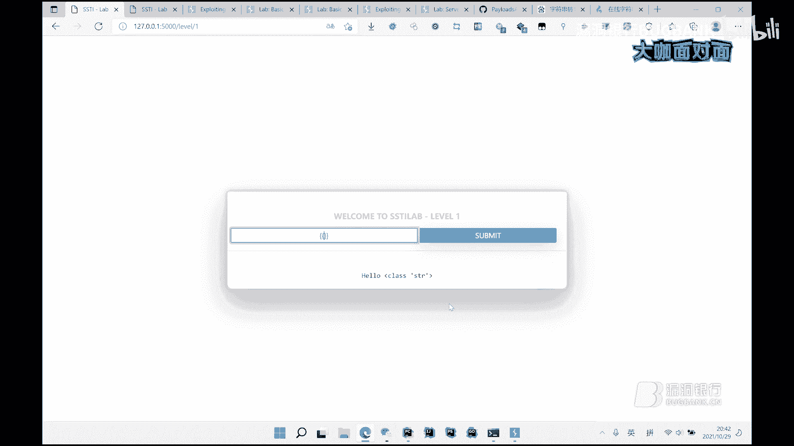

可以找这个金甲，它有类似的一些方法。

可以直接使用的，就是。他会。

他初始化的时候会初始化一些全局的这个变量。就是我们看一下他整个。왜래 왜。Glogo。到。嗯。No。打印下。看一下转成字点。他会初始化，这些都是他定界服务。

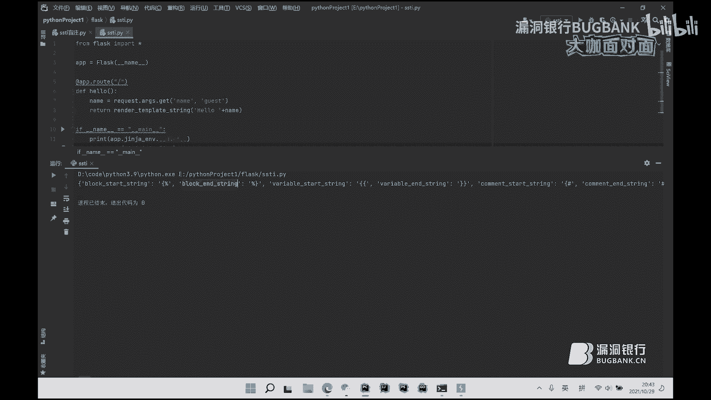

这。

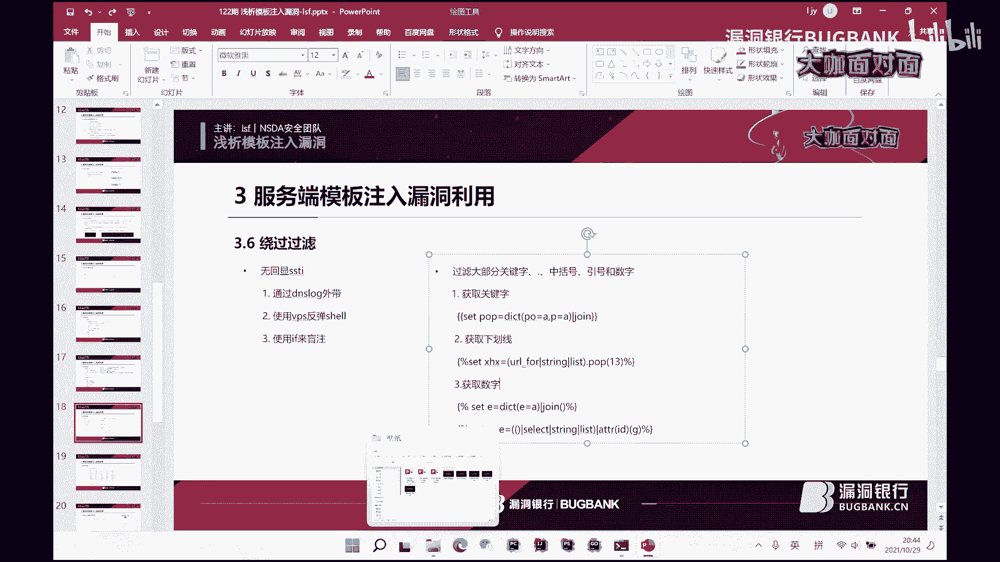

好。然后他这里面是有一个。Global。他会猝死了，他就是。那模板会出示一些变量。嗯，你猜。这个。找一下。知道吧。Gobos。你这里他会出使了一些。一些累，还有一些方法。然后我可以直接使用它这个。

初实化的这个类这些方法，然后它全局空间里面会有一个。

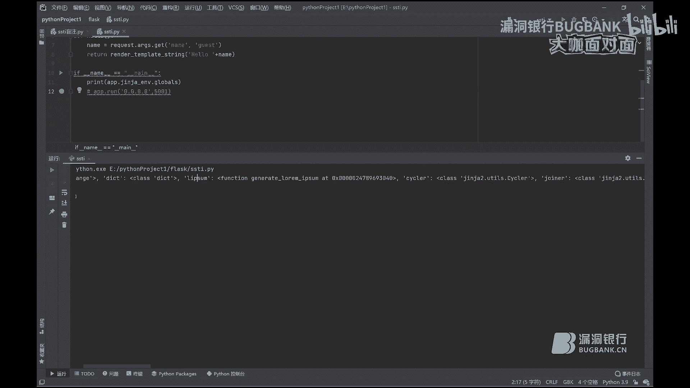

就我们可以直接看他会。导入了1个OS。我们可以直接用它全局空间里面的。用方法OS。O份。最终执行。对这个链就比较短了，就是我们用了它精讲内置初始化的这些方法。然后获取下划线的话，是有用利用那个。

就是你打印这个方法的话，他会。返回这这样一个字符串。我们转一下支付串。然后我们再把它转为列表。我们就可以取它里面的任意的一个值。让我co几个。18它第18个就是一个下划线。要不这样就拿到一个下划线。

然获取数字的话，就是通过也是一样的，用1个ID index都行。就是像。我过ch了一个这个列表的话。通过index。寻找他这个。F所在的位置就是它返回了一个数字一。

就是主要就是利用这巧用这些金甲内置的这些过滤器。哦，其实。嗯，往下走吧。就是。今天主要是讲一下这个lastSSTI。他这个la本。第一关的话是刚演也演示过了，就。先看下面的吧。然后这个第二关。

它是过滤了这个发括号。发括号就是我们用了输出表达式的值，但我们还有其他这个。用于设置变量这个这个它可以调一个print常数。直接将这个内容输出出来，效果也是一样的。就获取资料要。还是用就简单那条吧。

就获OS模块哟。掉他的标本。然后他返回来是一个字节，不这个文件。那个流然后我们通过调用read的方法要读。有第三方的话，他是没有这个过滤，但是他没有回显，他只会回显你这个局例执行是否正确。

就比如他就只会回一个。如果你这个语句没拔出，它，就回一个正确。如你这边有输错误的话。就是你的一句。执行不成功的话，他会返回。这个失败了。然后。就可以通过间。如果这这次没回显的话，就可以通过这个外带。

但是还有另一种话就是通过这个。蛮住的方法。满住的话是用这个index函数。inddesex3是寻找那个。一个。字符串在列表中的位置吗？那我现在这个9点不一样。就LS瑞。他这返回是没有回线的。

然后我把它给转成通过stream这个。过滤器给它转成一个字符串，然后我通过index。找他是不是。在地点。的第一位的。这个这动位置。exex他就这个就是第一位是。一第一位是这个字符串的话。

它就返回一个正确。如果不对的话，它会返回一个错误，就跟那个ci口注入那个蛮住差不多。然后我们就可以写一个蛮助的脚本。

就类似这样。转为字符串以后用index。判断。然后运行的话，他会。就跟那个这个蛇口猪入的蛮住差不多了。可以看一下。看一下这个代码。

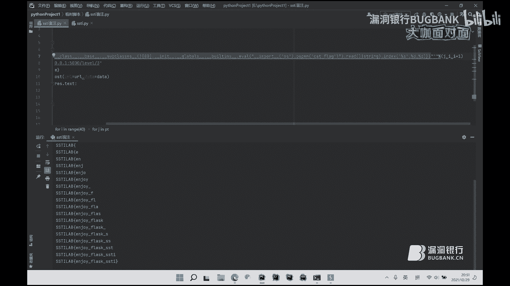

又直接。😔，各汝中国好。中括号的话，我们取值取这个字典的词的话会用到中括号。我们会。就是。用被最终调用。就获取他的子类。嗯。我们这个取这个列表的话，我们要用中括号来取嘛。

刚才有一个魔术方法就是get item。有这个和这个中号差不多，就是可以用来代替。呢个通啊。然后。可以看一下第五关的话是。过了一个顶好。允浩的话。没有引号的话，我们那个。就是OS。

Pop最终它不是调用Pop的话，会叫你输入那个执行的命令。然后引号的话我们。就。先先拿到这个。robot就是OS点标款嘛。这里边会用这个LS，它会这个语句，它就是用到这个引号，没有引号的话，可以用这个。

增讲面内置的一个request方法。通过这个还的。Iice里面拿这个A这个变量。Okay。呃我这里面设置了这个IA的话，它是cafl。嗯。等一下。错。😔，对系的。要读这个文件的哟。啊。这。这个。😔。

错啊。😔，这出外。就request从A这个变量这个 hide带中获取这个值。四罐第五关。没问题。真的难。😔，啊，先跳过。这关先看其他的。但我即就是讲。😔，这些我有讲过，就是下划线的话。

跟那个过滤字母串差不多，可以用这个十六定制烙。然后。😔，点的话是用这个ATPR过滤器。

就什讲过。

就就就就就。主要讲一下这个获取这个数字吧。要获取数字的话。有几种方法，就是用那几种过滤器。还有就是通过。这个index。确s。把它转成列表之后。通过index。达到一个F中的位置。

F是在这个列表中第一个从零开始的第一个。然后获获得一个数字。就我们用这个。And。告白算。就设置了这个one这个变量，它就是一个数字一。然后我们的配漏的话。就。嗯。看的有点错。😔。

就他说就这样子拿这个数字。因为我们就是s class那边会有用到这个数字。然后我们数字可以通过加减乘除来获得其他的，就我们获得了一个one的话。我们还可以通过这源存储或者其他的数字。就是一加一嘛。

这是出等于这个。😔，就我们又获得了一个数字2。有啊。嗯。就是这样就可以获得数字，可以通过替换我们刚刚那个配漏里面的。用了数字的部分。哪里用到。就是通过s class，然后取他那个值。我们可以。找到巴士。

系就三三面个。然后主要是看下面这三个蓝色的。它是过滤了这个引号，还有request，我们就不能通过request来绕这个引号，然后还过滤了这个点。中括好。1我们这个。这怎么搞？过滤然后还有。

引号还有request，包我们不能从它内置的这个request。然后从其他地方获得这个参数这个变量。我们就只能通过拼接字符串。就是。这个。就我们要获得这个泡泡的话，我们。就假设要获得这个基算，我们就。

字典的电池。再见。这个过滤器。然后他就获得了这个将这个字符串复值给了这个变量。最终通写我就直接写这个配录。通过拼接字符串。然后下划线的话是通过。就是转字符串，以后再转列表，通过取这个列表中的值。

就第18位是一个下划线。然后OS的话也是拼接字符串就。就。就是通过拼接自种创造形式。有空格的话是也是通过。pop列表泡一个词出来。最终拼这个字符串拼接起来的话，就成了一个这样的配漏。

有字符串拼接plus拼接字符串的话，它有几种方法，有加号，还有这个。这个。这个符号就是拼接这不串下划线。反正这个这这。就是包括。通过这个。波浪线吧。就将这字符串拼切成一个字符串。

然后通过调用getOS来取得它这面的值。最终执行这个 pop。最终。资金这命令。就是。直接来。😔，演示下日备喽。他就执行了这个ca flag。就是通过字符串拼接的形式来构造配漏。

然后下面这个它是多进用了一个数字。数字的话。我们当也讲数字，用这个index。这这这这这这配友也是很阴间。就是。拼接字符串来获得这个通过字点拼接来获得字符串以后。错的这个数字的话，通过index。

ID就是拼接出来的index就不算。又取得他这个。这不算数。就是在的位置来获得这个数字。然后我就通过加减乘除。还拿到他这个。我想要的数字，比如八的话就是。这是99的话就是2乘2乘2乘2，再加一个1。

然后我替换刚配肉里面诱到的数字。用提换这个数字。就类似。然后最终肉也是。这啊。主要这个这光和刚刚的区别就是过滤的数字。数字的话，通过index取这个列表中的词。但时间。😔，10点。最后一关的话。

跟这个十1关是一样的。他是进了一些字付串。一些。但是我们这个西瓜这没用到，所以可以直接用西瓜了。99，那我。这个这个披套。可以看得懂吗？就是主要是通过这个字典的。建拼接这个字符串。然后下划线的话。

啊对这这这这 배咯。就是。通过字典拼这个键子取这个字符串。然后空格的话是通过将这个列表的值。喺咯。啊，猪肉洞的话，你要利用。要利用的话，你要走两点。你要熟悉他这个模板语句，你还要有这个。

他那个语言的基础嘛，就是py flashpythonpython的模板起嘛，然后你要有python的那个语法那个基础，还要要有一点这个精甲精甲模板。金假的他这个。yan。😔，这个模板也也要了解。

可以讲一下，就是之前有有一个。就是刚刚问了一个现实中他用的那个模板做漏洞的话。就是之前有搞过1个CMS的动。嗯。初？退常。😔。

这我开了啥东西。关一下这个这个。

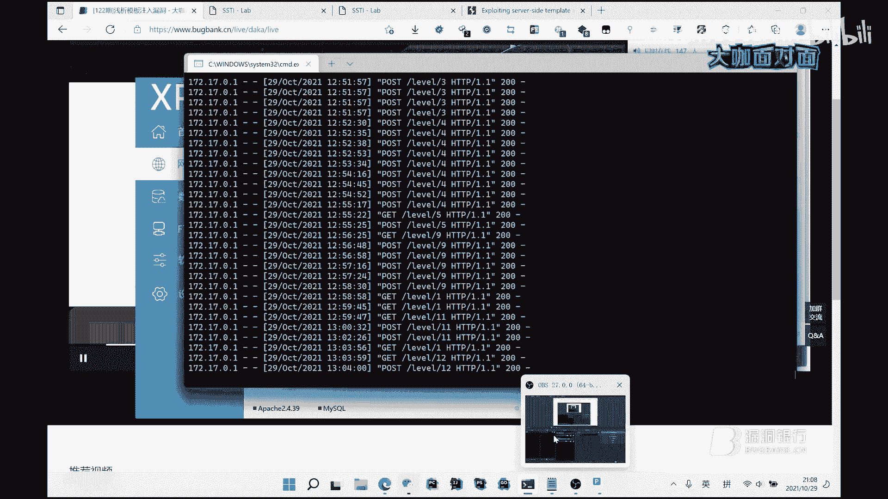

啥看就讲一下吧，就是有些CMS它后台会有一个模板编辑的地方。然后你修改这个模板的话，如果你知道他用的模板引器，你可以。呵。你知道他用的模板琴的话，你可以插入他那个。这个我帮你记。

就是借今天主要讲这个金甲三个绕过。好的好的，那个我们我们我感觉到这个重难点其实已经讲过了，我们把那个PPT放到最后一页。那里是我们大咖的那个二维码联系方式，就是PPT的最后一页。

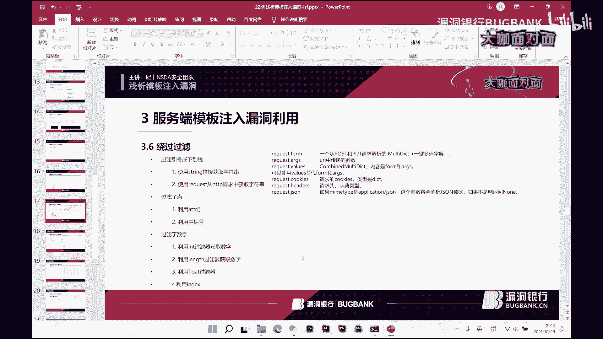

嗯。对，最后最后的这个我们联系方式。对你把它翻回去，停留个10秒钟，让大家扫一扫。呃，左边它明显是大咖的一个个人联系的一个方式，右边呢是团队二维码，欢迎关注。😊，好，感我们感谢LSF大咖的精彩分享。

听完了LS呃这个哎我们叫老师傅吧，我觉你这个手头有点绕不过来啊。听完老师傅大咖的分享，相信大家已经学到了不少的干货，记住了。那么我们因为现在时间啊已经哎有点有一丢丢都晚了。

我们就接下来进行行长问答环节好不好？然后呢，现在现在仍然可以继续提问。然后我们的老师傅大咖会给大家继嗯一起解答疑问。现在对只看提问，ok今天其实讲的我我感觉就是然后聊天区的表哥们都说讲的很细很稳。

其实我相信表哥们都很多都听懂了，所以说所以说对，然后就O开始。😊，解答疑问吧，嗯，就是靶场的这个名字，我说一下，就是SSDI live。就是这个。是这个问的是这个。要不把网址发到那个聊天区里面嗯。

把这个网址。把漏洞环境。是这个靶叉。No。😔，好像刚讲过这个实战的话是不太多的。但。这也是很难发现，主要是通过这个白合审计。就比较好发泄一点。如果黑盒的话。也很少见吧。然后。环境怎么搭？

只是这个靶场的环境吗？晚上的环境我有一个。Docker。我是用这个都可搭的。就有这个都可以进向。你可以复续下来，复下来1212。就这个镜像哎。啊，对。呃，路动环境。这这刚刚这也算吧，80吧。

就。通过用这个没有闭合这个模板语句。

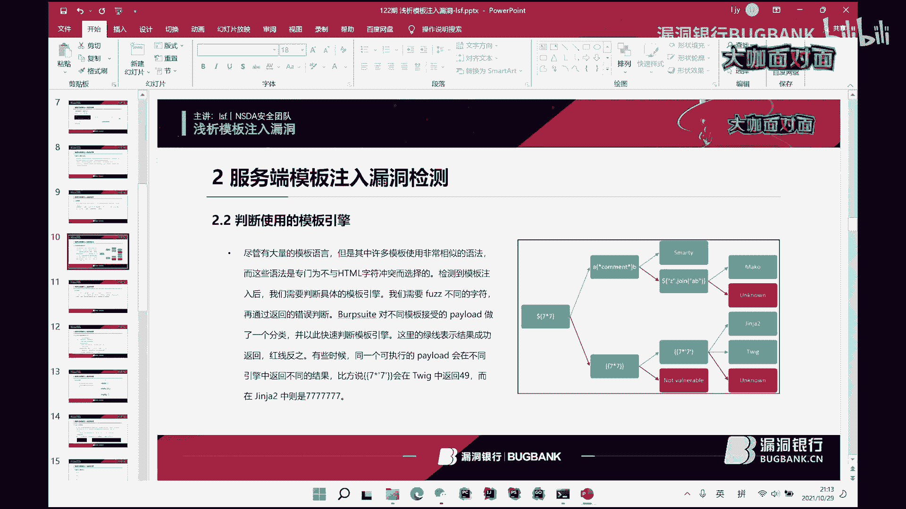

然后你可以输进去，他会进行报错。所以他会爆出他使用的模板已经。就有这个都可以进向。你可以复续下来复下来1212。就这个镜像哎。呃，路动环境。

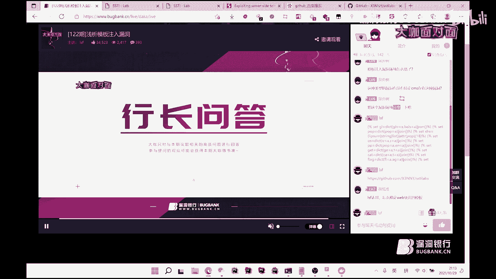

这这刚刚这也算吧，通过用这个没有闭合这个模板语句。

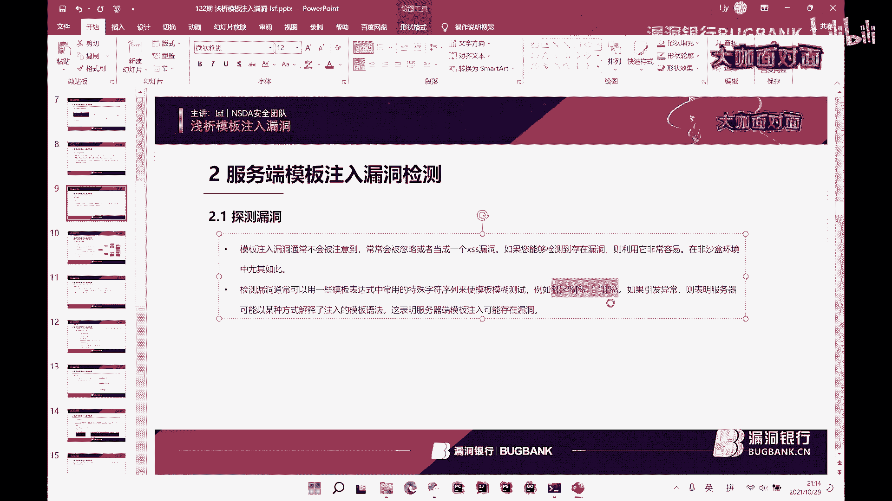

然后你可以输进去，他会进行报错。所以他会爆出他使用的模板已经。啊，好的好的，稍微等一下哦。OK现在网络是非常的顺利了。好，我觉得今天晚上的提问情况也差不多了，感谢我们LSF老师傅大咖的耐心解答。

由于时间有限，大家如果后续还有问题可以到技术社群里继续交流。那接下来就是今晚的福利放送环节了。LSF大咖亲自挑选的书籍，网络安全攻防技术实战将要送出大咖，你可以说一下，为什么想要赠送这本书呢？

因为这本书他就是讲的比较好，他全都是那些实战的。就他那个方面讲的也挺全的，现在实战的话。他就有具体的例子了。就比较。就现在网络安全就是也要多实战了才行。好的，这本书肯定是非常实用啊。

那这一份幸运的礼物将要落到哪一位表哥的手上呢？好，现在在聊天区的表哥，请扣出LSF或者老师傅，我们开始啊。然后然后我们大咖。对，LSF。好，那大咖现在来挑选一下幸运观众吧。😊，对这对这。那是认。好。

表哥们稍微等一下，我这边来。请后台运营小姐姐确认一下哦，稍微等一下，我们要因为大家刷屏哦，刷的是非常非常的。快OK对我看到了那个我们后台看到了幸运观众，这个名字是一串数字。

032521032521ID为118900ID为118900啊，这位表哥非常的幸运。恭喜这位表哥啊，非常幸运将获得我们这本证书，需要你在直播间的获奖呃，根据获奖提示呢，在相应的区域留下正确的联系方式。

或在直播后私聊我fancy嗯，兑奖哦，我们会尽快将书籍给你寄出。希望表哥耐心等待。好，今晚的直播到这里就要结束了。好，那再次感谢LSF大咖的用心准备和精彩演讲，希望本期知识内容大家都能学有所得。

有所启发。我想回顾本期直播，我们将在下周五的时间发布录屏，敬请关注官网的更新或者群类录屏更新通知。今后大家也可以多多关注NSDA安全团队的LSF大咖，最后感谢所有观众朋友们的守候。

还有对咖面的支持和喜爱。如果你也想像大咖一样直播分享，欢迎找我报名。大咖面对面是有展示白毛风采和传播技术的舞台，不惧年龄不畏滋历。只要你有才华感分享，我们都欢迎。如果想进行交流的话呢。

嗯可以在页面底部找到群号，本直播间地址固定。大家可以收藏到浏览器哦。今晚的直播到这里就要结束了，感谢各位小伙伴的。😊，积极参与大咖面对面周五8点见，我们下次再约吧，下面是听歌时间，嗯。

小伙伴们表哥们早点休息。嗯，大咖也可以跟大家说声再见哦。好，大家再见。

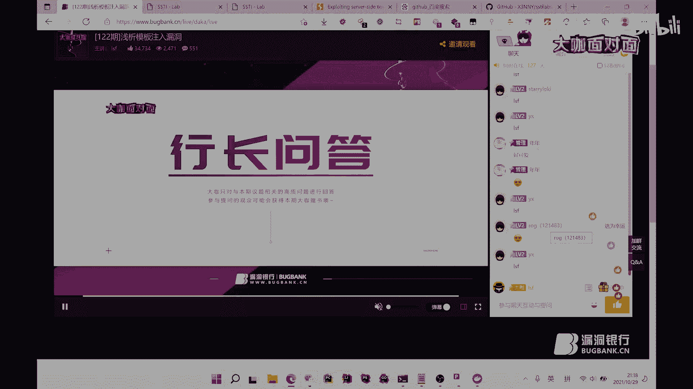

Yeah。