# 课程 P1：浅析模板注入漏洞 (SSTI) 🔍


在本节课中，我们将学习模板注入漏洞（SSTI）的基本原理、检测方法以及利用技巧。模板注入是一种相对较新但危害巨大的安全漏洞，理解它对于Web安全至关重要。

## 概述 📖

模板注入漏洞（SSTI）于2015年在黑帽大会上被首次提出。与常见的SQL注入、XSS注入不同，它针对的是Web应用中的模板引擎。当用户输入被未经处理地拼接到模板中并渲染时，攻击者就可能控制模板语句，进而实现命令执行、信息泄露等高危操作。

## 第一部分：注入漏洞原理 ⚙️

要理解模板注入漏洞，首先需要了解什么是模板。

### 什么是模板？

在现代Web开发中，许多程序使用MVC框架，这些框架大量采用了模板技术。模板是一种供程序解析的语法，用于将数据转换为HTML代码。模板引擎负责将模板和数据结合，最终生成HTML文档呈现给用户。这种方式实现了业务逻辑与展示代码的分离，提高了开发效率。

### 模板渲染的两种方式

模板渲染主要有两种方式：

*   **客户端渲染**：浏览器从服务器获取数据（如JSON或HTML片段），然后在客户端将其组合并解析为完整的HTML呈现给用户。这种方式减轻了服务器端的压力。
*   **服务器端渲染**：服务器接收数据，在后台渲染成完整的HTML，然后返回给客户端浏览器。浏览器只需直接呈现HTML即可。这种方式减轻了客户端的压力。

### 什么是模板注入漏洞？

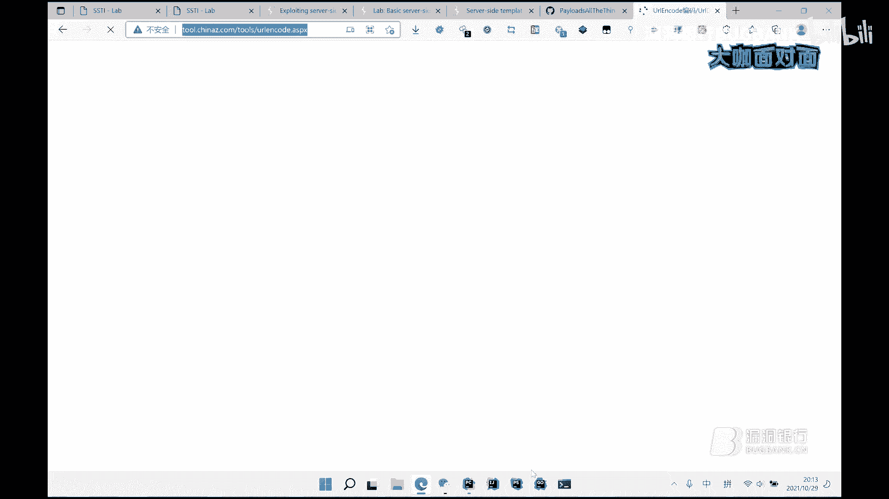

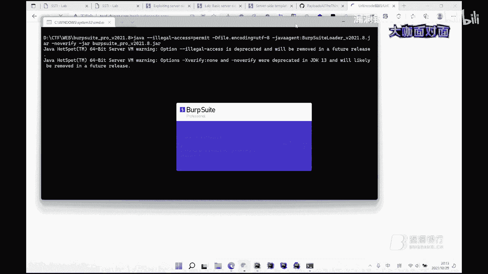

模板是程序解析的一种语法。模板注入漏洞发生在程序接收用户输入后，未进行正确过滤，直接将输入拼接到模板中并交给模板引擎渲染。这使得攻击者可以完全控制模板语句。

攻击者只需学习目标模板语言的基本语法，就可能最终达到控制服务器的目的。

### 漏洞演示

以下是一个简单的Flask应用示例：

```python
from flask import Flask, request, render_template_string
app = Flask(__name__)

@app.route(‘/‘)
def hello():
    name = request.args.get(‘name‘, ‘Guest‘) # 从GET请求获取name参数，默认值为‘Guest‘
    template = f‘<h1>Hello, {name}!</h1>‘ # 将用户输入直接拼接到模板字符串中
    return render_template_string(template) # 渲染并返回模板
```

这段代码直接将用户输入的 `name` 参数拼接到模板字符串中。这可能导致两种危害：

1.  **类似XSS的攻击**：用户可以插入XSS攻击语句。
2.  **更严重的服务器端攻击**：用户可以插入服务器端模板语句，尝试执行命令。例如，输入 `{{7*7}}` 可能被计算为 `49` 并输出，这证明了模板引擎的存在。更进一步，可以构造 payload 执行系统命令。

模板注入漏洞主要分为两种：
*   **客户端模板注入 (CSTI)**：常造成类似XSS的效果。
*   **服务器端模板注入 (SSTI)**：危害更大，可导致命令执行、泄露敏感数据、服务器配置信息或文件。

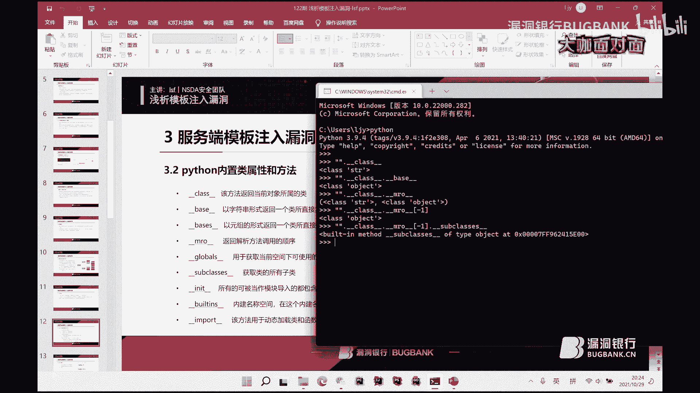

## 第二部分：漏洞检测方法 🔎

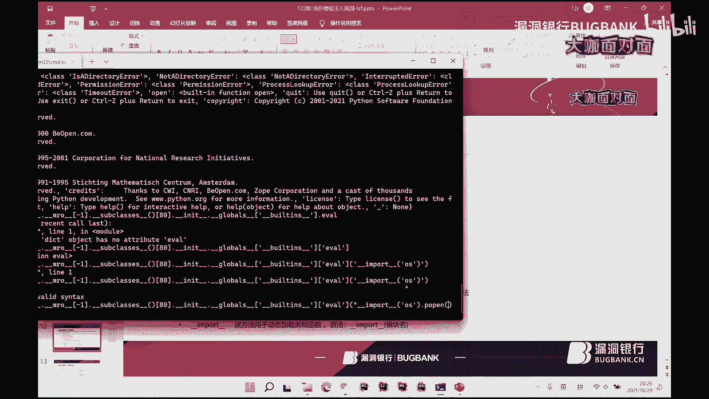

纯黑盒测试不太容易发现SSTI漏洞，因为它可能被误报为普通的XSS。检测此漏洞需要使用一些技巧。

### 检测思路

当前一些扫描器会尝试插入特定的模板语句（不进行完全闭合），通过观察服务器的响应（如报错信息）来判断是否使用了模板引擎以及具体是哪种引擎。

### 识别模板引擎

判断出存在漏洞后，还需确定具体的模板引擎。不同模板引擎有其特征。

例如，输入 `{{7*7}}`：
*   如果返回 `49`，则可能使用了某些特定引擎（如Jinja2, Twig）。
*   进一步区分：在Jinja2中，`7*‘7‘` 会返回 `7777777`（字符串重复）；而在某些PHP模板中，会进行类型转换，返回 `49`。

## 第三部分：漏洞利用与攻击 🛠️

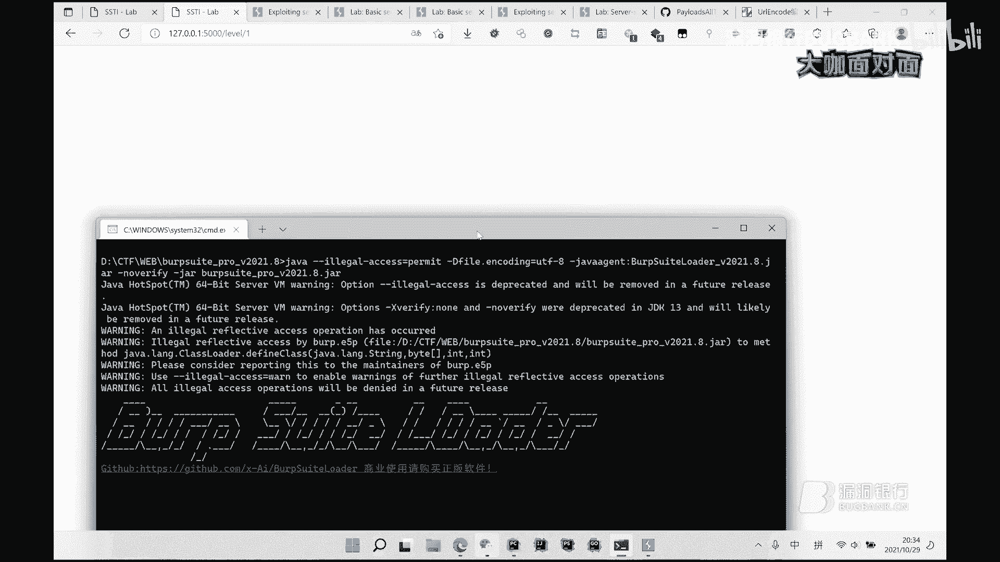

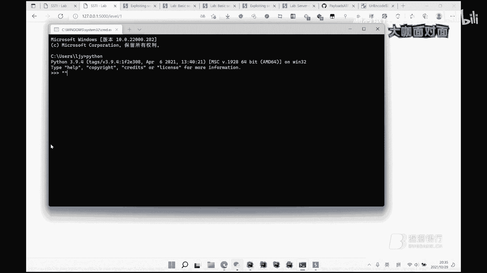

上一节我们介绍了如何检测漏洞，本节我们来看看如何利用漏洞进行攻击。

### 利用流程演示

假设我们通过fuzz测试发现一个页面存在SSTI，并报错显示使用了 `Jinja2` 模板引擎。

1.  **信息收集**：我们可以搜索公开的Jinja2 SSTI利用payload。
2.  **构造Payload**：例如，一个执行 `ls` 命令的payload可能形如：`{{ config.__class__.__init__.__globals__[‘os‘].popen(‘ls‘).read() }}`。在GET传参时，需要对payload进行URL编码。
3.  **执行攻击**：将编码后的payload发送给服务器，如果成功，会返回命令 `ls` 的执行结果（如文件列表）。
4.  **达成目标**：根据目标（如删除特定文件），修改payload中的命令部分并执行。

### 漏洞的其他危害：信息泄露

SSTI还可能造成信息泄露。例如，某些应用使用服务端Session，并用密钥（如Flask的 `SECRET_KEY`）对Session进行签名。如果攻击者通过SSTI泄露了 `SECRET_KEY`，就可以伪造高权限用户的Session，实现权限绕过。

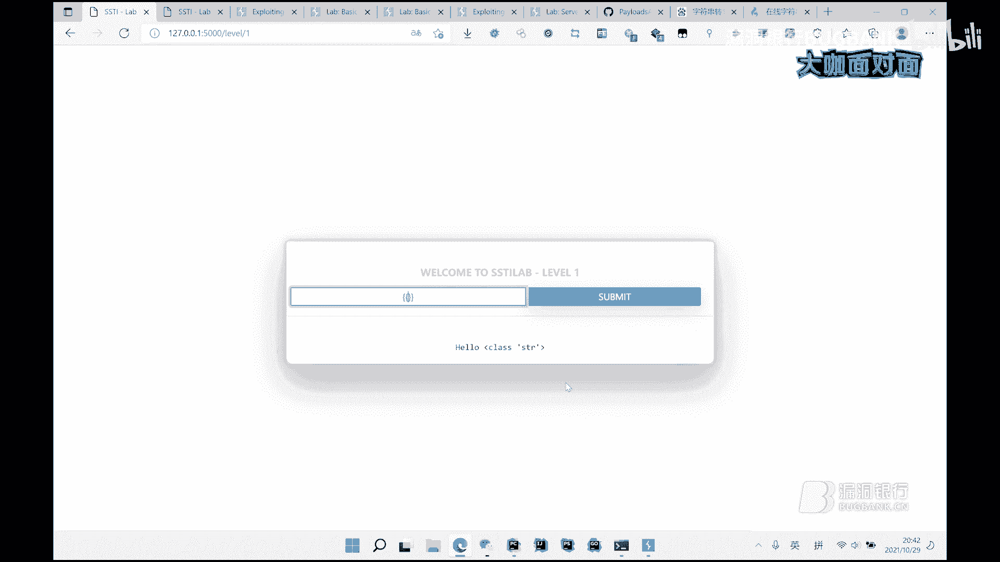

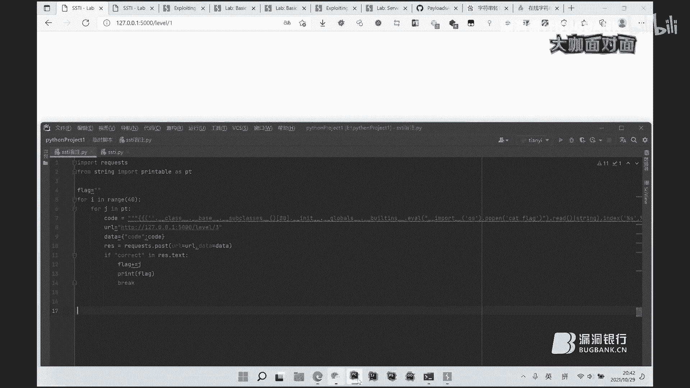

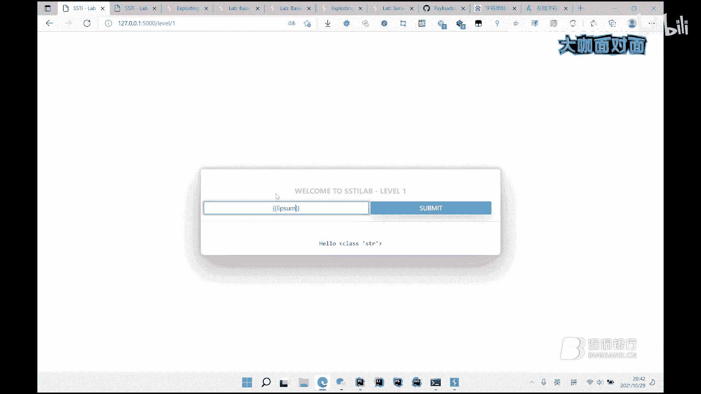

### Flask/Jinja2 SSTI 深入利用

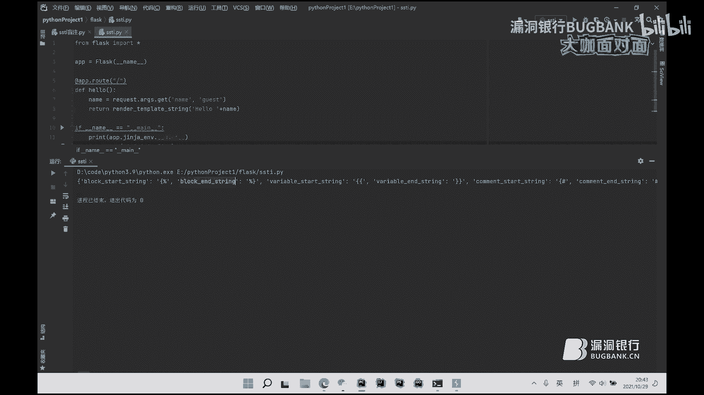

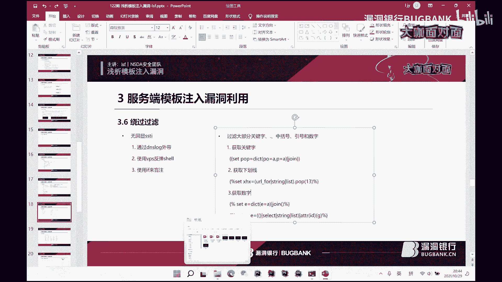

Flask框架使用Jinja2作为模板引擎。Jinja2设计上有一个沙盒环境，限制了直接执行任意Python代码。因此，利用需要绕过沙盒。

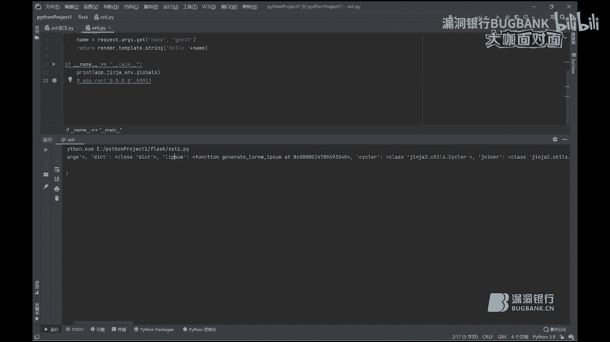

#### Python 相关语法基础

利用链依赖于Python的类继承关系。以下是关键的内置函数和属性：

*   `__class__`：返回对象所属的类。
*   `__base__`：返回类的直接父类（基类）。
*   `__mro__`：返回类的方法解析顺序（继承链），是一个元组。
*   `__subclasses__()`：返回类的所有直接子类列表。
*   `__globals__`：返回函数所在全局命名空间下的所有变量、函数等，以字典形式。
*   `__init__`：类的初始化方法。
*   `__builtins__`：内建名称空间，包含Python解释器启动即加载的函数（如 `eval`, `exec`）。
*   `__import__()`：动态加载模块。

#### 利用链构造思路

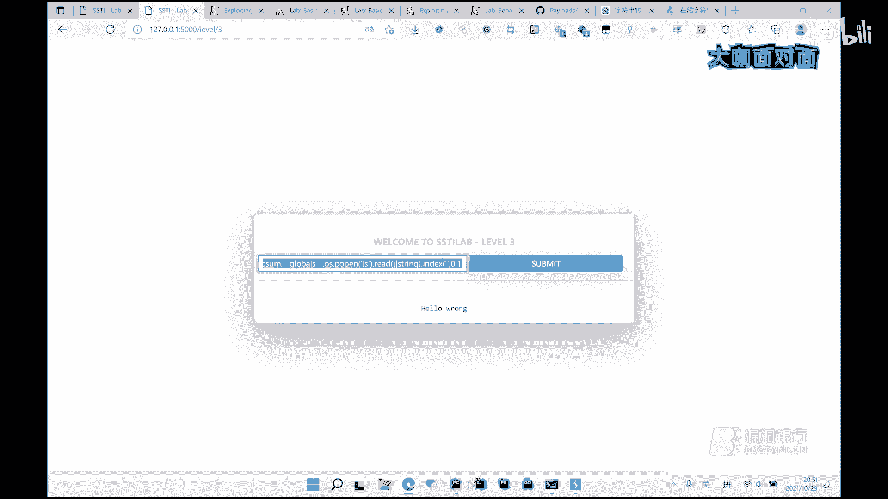

在Python中，一切皆对象。我们可以从一个已知对象（如数字、字符串、甚至模板中的 `config` 对象）开始：

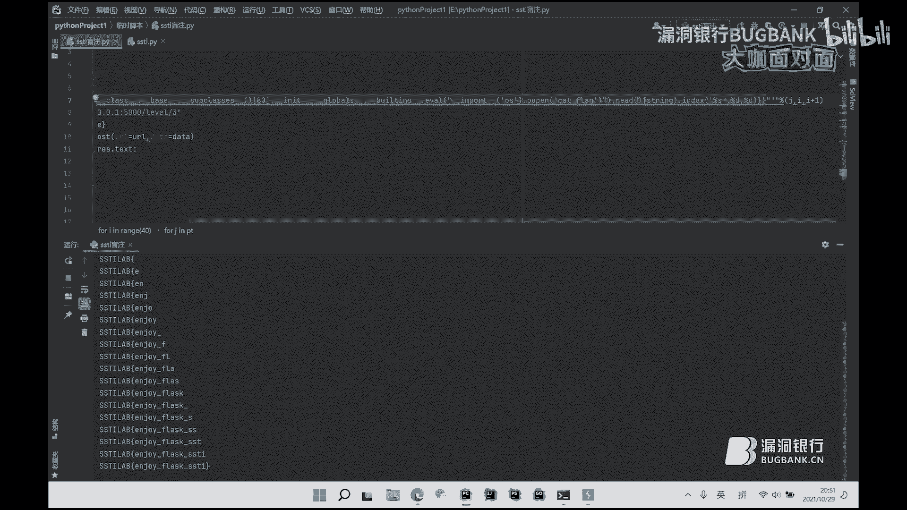

1.  通过 `__class__` 获取其类。
2.  通过 `__base__` 或 `__mro__[-1]` 获取基类（通常是 `object`）。
3.  通过 `__subclasses__()` 获取 `object` 的所有子类。
4.  在这些子类中寻找可利用的方法。目标是找到包含 `__globals__` 的函数或方法，从而访问全局命名空间。
5.  在 `__globals__` 中寻找 `__builtins__` 或已导入的危险模块（如 `os`）。
6.  最终调用如 `os.popen(‘command‘).read()` 来执行命令并读取回显。

#### Jinja2 模板语法简介

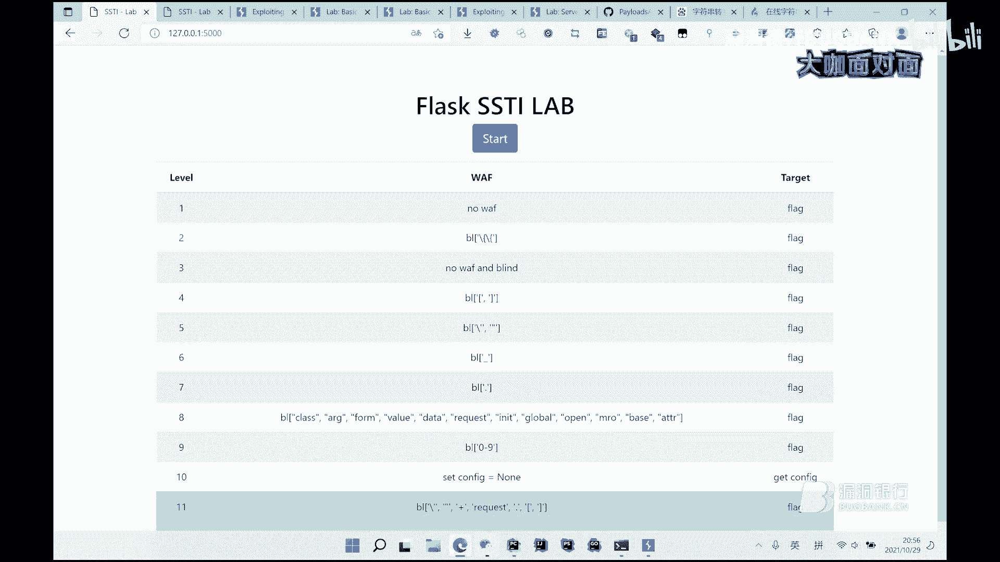

*   `{{ ... }}`：计算表达式并输出结果。
*   ``：用于声明变量、控制语句（如if、for）。
*   `{# ... #}`：注释。

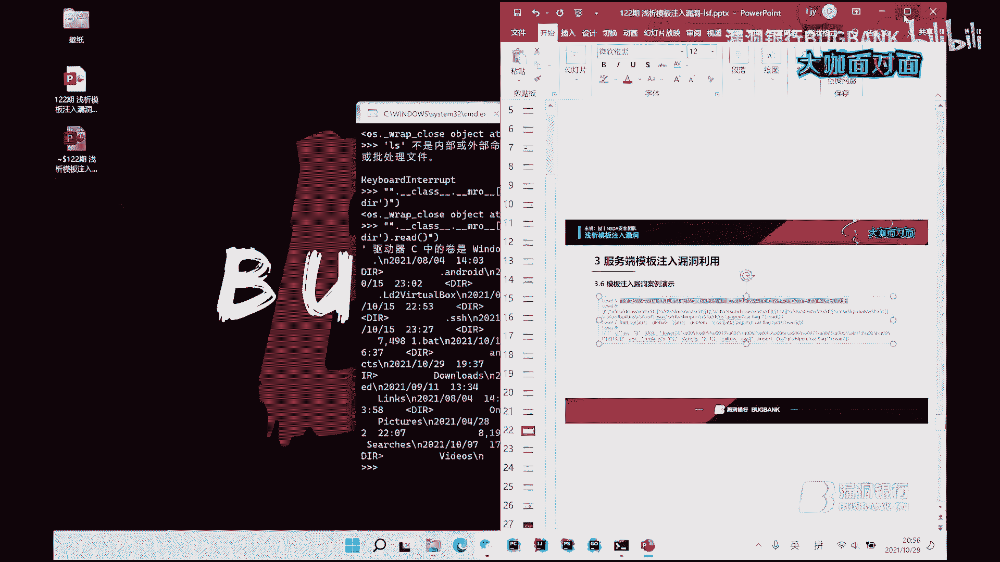

Jinja2沙盒会过滤一些敏感函数，但许多内置属性和方法仍可使用。Flask SSTI就是利用这些内置属性构造调用链来绕过沙盒。

### 绕过过滤技巧

在实际漏洞利用中，经常会遇到各种过滤。以下是一些常见的绕过方法：

以下是针对不同过滤的绕过技巧：

*   **过滤关键字（如 `class`, `globals`）**：
    *   **字符串拼接**：`‘cl‘+‘ass‘`, `‘__gl‘+‘obals__‘`。
    *   **大小写变换/反转**：`__CLASS__`, `__SSALC__`（需引擎支持）。
    *   **十六进制/八进制/Unicode编码**：`__cla\x73\x73__`。
    *   **使用 `attr()` 过滤器**（Jinja2特有）：`|attr(‘__class__‘)`。
    *   **使用 `replace()` 过滤器**：`‘__clAss__‘|replace(‘A‘, ‘a‘)`。

*   **过滤引号**：
    *   使用 `request` 对象从请求参数中获取值：`{{ request.args.a }}`，然后URL传入 `?a=whoami`。
    *   使用 `chr()` 函数配合数字拼接出字符串。

*   **过滤点 `.`**：
    *   使用 `|attr()` 过滤器：`a|attr(‘__class__‘)` 等价于 `a.__class__`。
    *   使用中括号 `[]`：`a[“__class__“]`。

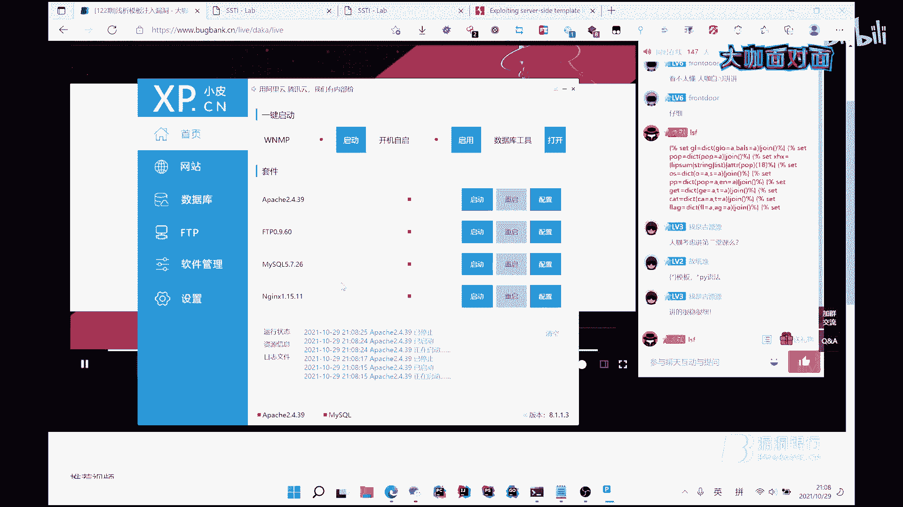

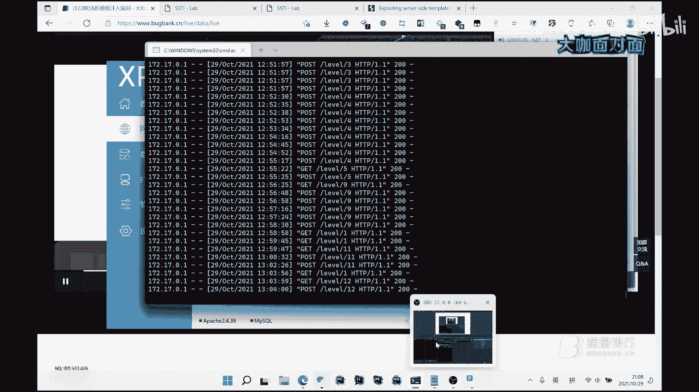

*   **过滤中括号 `[]`**：
    *   使用 `__getitem__()` 方法：`a.__getitem__(‘__class__‘)`。

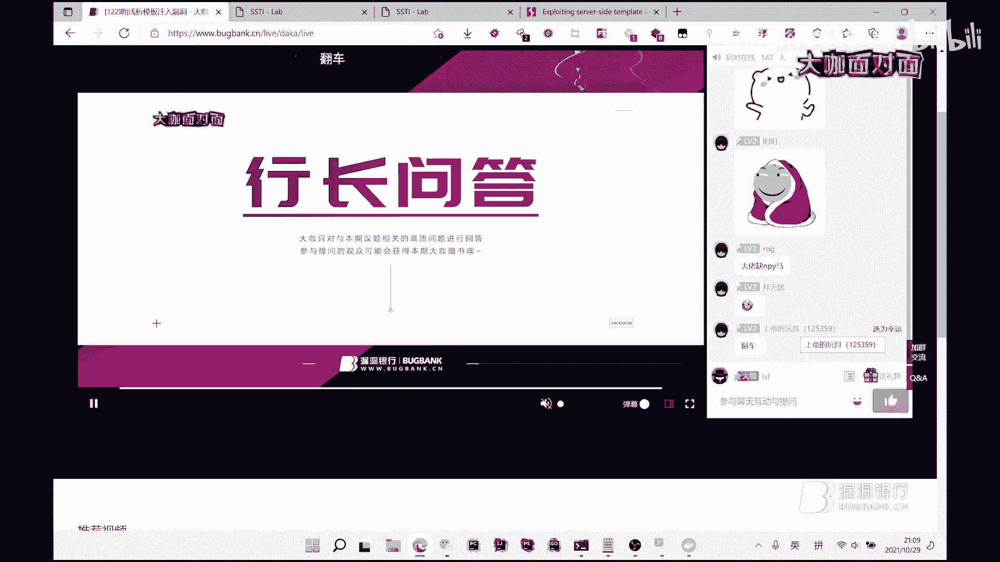

*   **过滤数字**：
    *   使用 `|int` 过滤器：`‘1‘|int`。
    *   使用 `|length` 过滤器。
    *   利用列表的 `index()` 方法：`[‘a‘,‘b‘].index(‘b‘)` 返回 `1`。
    *   进行数学运算：`(1|int)+(1|int)` 得到 `2`。

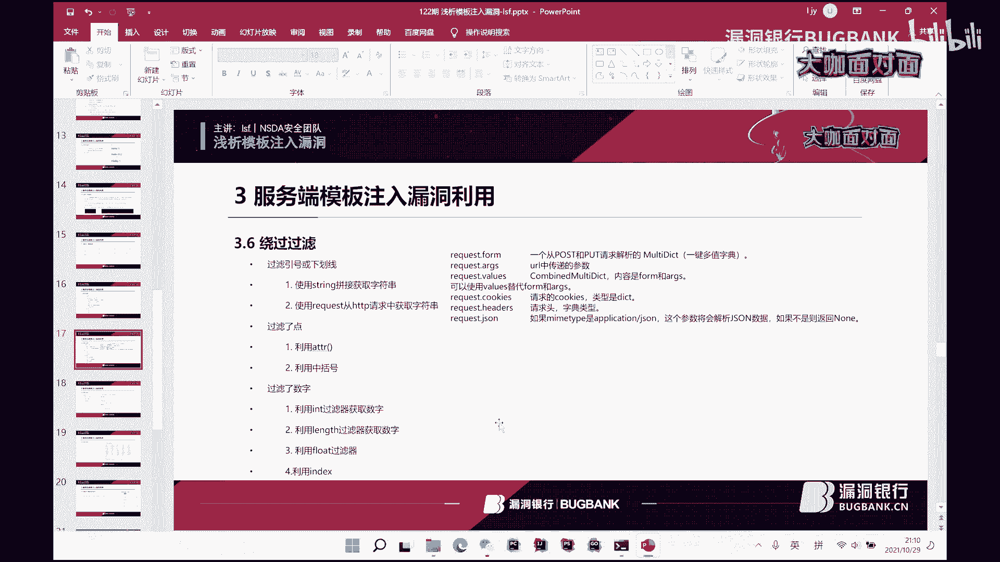

*   **过滤下划线 `_`**：
    *   利用字符串转换和列表索引：Jinja2中，`‘__‘` 是一个字符串。可以将其转为列表 `[‘_‘, ‘_‘]`，然后取索引 `[0]` 得到单个下划线。更复杂的方法是利用 `|string|list` 和 `index` 从长字符串中定位下划线。

*   **无回显的利用**：
    *   **盲注**：利用条件判断进行布尔盲注。例如：`{{ ‘‘ if (命令执行成功条件) else ‘a‘ }}`，通过页面差异判断结果。
    *   **外带数据 (OOB)**：执行能发起网络请求的命令，将结果带到自己的服务器。
    *   **使用 `|string|index` 进行盲注**：将命令执行结果转为字符串，用 `index()` 判断特定字符是否存在。

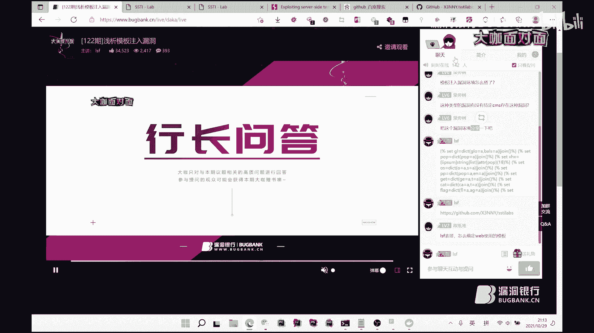

### 实战案例与靶场

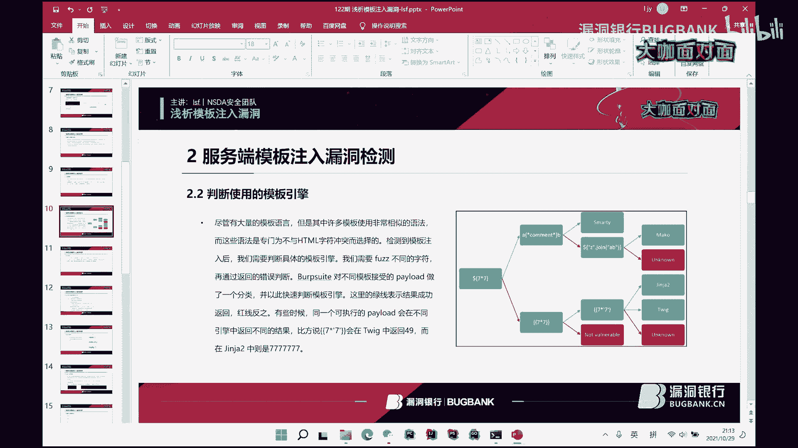

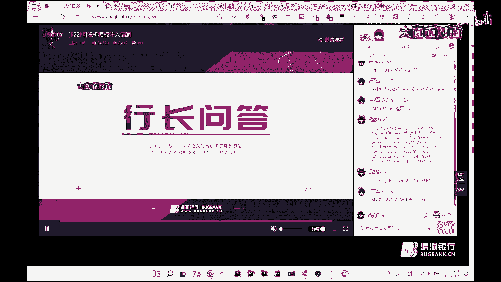

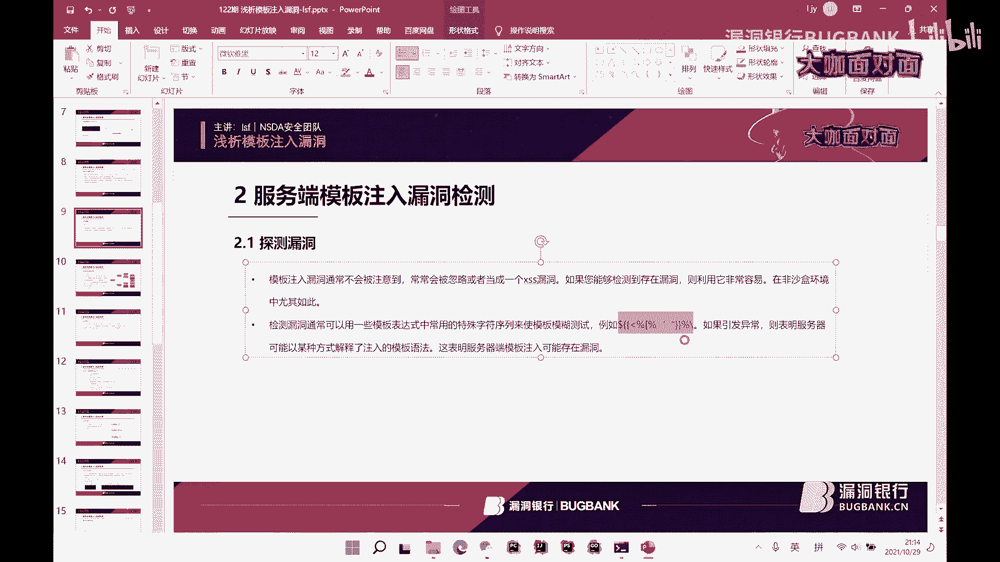

在CTF比赛和实际渗透测试中，SSTI漏洞均有出现。一些内容管理系统（CMS）的后台提供模板编辑功能，如果未对用户输入的模板内容进行严格过滤，就可能存在SSTI。

建议在 `SSTI Labs`、`Flask SSTI` 等靶场环境中进行练习，从简单过滤到复杂过滤逐步深入，以掌握各种绕过技巧。

## 总结 📝

本节课我们一起学习了模板注入漏洞（SSTI）的核心知识：

1.  **原理**：理解了模板引擎的工作方式，以及当用户输入被不安全地拼接渲染时，如何产生SSTI漏洞。我们区分了客户端（CSTI）和服务器端（SSTI）注入，并认识到SSTI的危害更大。
2.  **检测**：学习了通过插入特殊语法（如未闭合的定界符）引发报错，从而探测和识别模板引擎的方法。
3.  **利用**：深入探讨了SSTI的利用，特别是针对Flask/Jinja2的利用链构造。我们回顾了关键的Python魔术方法（如 `__class__`, `__globals__`），并学习了如何从任意对象开始，最终执行系统命令。
4.  **绕过**：掌握了应对各种过滤（如关键字、符号、数字）的实用绕过技巧，包括字符串拼接、编码、使用Jinja2过滤器（`attr`, `replace`, `string` 等）以及盲注手法。

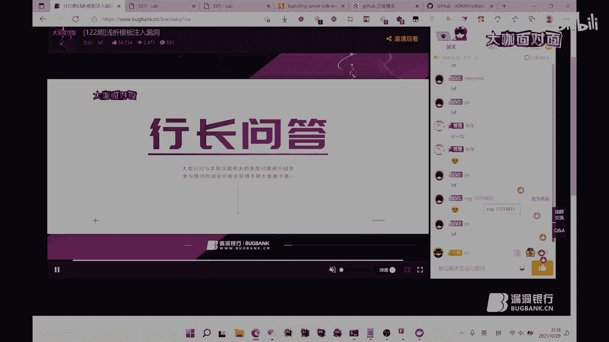


要成功利用SSTI漏洞，需要两点：熟悉目标模板引擎的语法，以及具备对应后端语言（如Python）的基础知识。虽然实战中SSTI不如SQL注入或XSS常见，但通过白盒代码审计更容易发现，其危害性极高，是Web安全中不可或缺的一环。