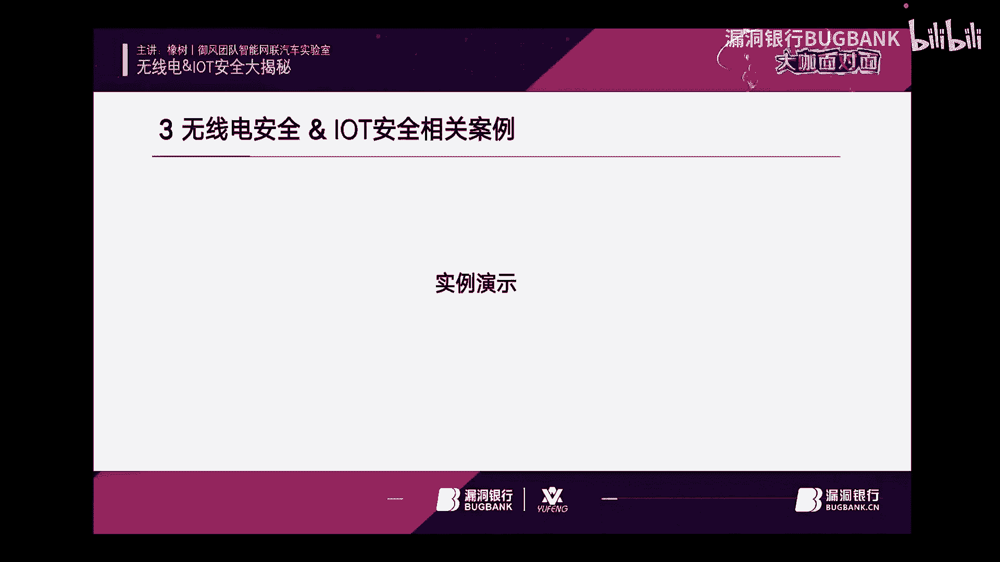

# P1：发布2_x264 - 漏洞银行BUGBANK - BV1GF411h7SN

<该字幕由算法自动生成> 嗯。

为知识而纯，引起主人生，各位小伙伴们，大家晚上好，欢迎参加第一一百23期漏洞银行安全技术直播大咖面对面，我是今晚的主持人，今晚要给大家做技术分享的大咖是来自于御风团队，智能网联汽车实验室的像素打卡。

今天呢我们把他邀请到来，他们来做客，这次他分享的议题是无线电荷i o t安全大揭秘，感兴趣的表哥们可要做好笔记，听到最后哦，同时欢迎各位表哥登录直播间，在聊天区进行交流互动。

听讲过程中有任何疑问可以随时在聊天区里提出，在演讲完毕后，大咖会在行长问答环节集中解答小伙伴的疑问，同时今晚的听讲福利也将在问答环节结束后，挑选一名幸运观众，送出由像素大咖亲自挑选的书籍。

加密与解密第四版，那下面就让我们有请上树大咖开始今天的直播分享吧，嗯好的，那么我们现在就正式开始吧，额首先呢就是非常抱歉，就是我这两天在参加这个全国大学生的这个电子设计竞赛。

所以我今天呢等于说是我抽出竞赛的时间呢，呃给大家来做这样的一个分享啊，因为是提前跟洛洛银行约好的嘛，肯定也不能就是呃嗯放大家鸽子嘛，所以就是我今天呢就是呃准备的也非常匆忙，就是我刚刚可能7。40的时候。

我才刚下高速赶回学校，然后给大家就是来进行今天的这期分享啊，那么今天的这个分享的主题呢，叫做无线电和这个物联网安全的这个大揭秘啊，本来呢我是还想再讲一些这个就是关于这个无人车方向的一些东西。

但是啊具体视情况而定吧，如果就是后边有一些时间的话，我可以去讲一些我们在做的一些无人车的一些案例呃，如果时间不够的话，我就具体的去把这个无线电和io t安全的一些基础的一些东西，可以给大家进行一些分享。

这是我们今天演讲的一个主题叫无线电和lt安全的一个大揭秘，呃，首先呢是我的一个个人介绍哦，我叫像素，然后目前呢是一个提倡安全和物联网安全的一个研究员，呃，我目前呢在兼任这个爱春秋的这个硬件版版主。

和华为云社区的影响专家，另外的话呢，我在学校有专门一直针对这个无人车线控底盘开发的一个团队，叫做玉峰团队，呃，我们呃有非常丰富的一个无人车开发的一个经验啊。

那么现在呢我们主要我个人呢是主要专注于这个车联网，安全和这个无线安全领域哦，那么在大学期间呢我参与过就是一些无人车的一些开发啊，那么这个呢是我进2年时间吧，获得了一些奖项啊，当然这个一直是在持续更新。

这两天也在持续更新啊，那么今天的一个目录呢就是主要去分享三个方面，就是首先呢第一个呢是深入浅出的了解软件无线电，然后第二个呢就是就是先引出这个无线电安全的这个概念，无线电的概念。

然后无线电安全是什么东西啊，我们应该如何去学习，如何应该去做一些无线电安全的一些分析啊，那么第二个呢就是常见的一些无线电设备的一个介绍和使用啊，我可能介绍的这个东西在咱们安全上来讲的话。

可能没有多少人会去用到呃，比较偏的一些东西，但是这个东西其实很实用，嗯，嗯跟这个黑客f差不了多少，但是嗯但是还是有一定的这个研究的一些东西，就是我们常规的在学这个软件。

无线电可能很多人刚上手上来用这个黑和f2 啊，学一段时间，或者用那个金牛radio去做一些流程图之后，他就觉得没有什么意思，没有什么继续下去的想法。

那么其实呢今天呢我可以给大家去介绍一些就是呃更加好的一些软件，无线电平台，或者说不是更加好吧，这个东西没有更好，都是无线电的，但是呃这个东西呢就是我们了解学习了之后呢，就是会有更多的兴趣往下去学。

以及就是如何去把这些东西跟我们大学里边所学到的一些通信原理啊，我们学的这个matlab进行一些结合，然后把这些东西就是它如何在matlab里面去运行，如何在金牛radio里面去运行。

嗯就是结合我们大学学的一些课程，我们应该如何去学习它，而不是说我们单纯的啊举个简单的例子，我们去学同放去学这个呃无线信号的拦截干扰对吧，我们去学这些东西。

我们可能就是在常规的我说的常规的国内的这个交流的这个环境，就是直接给你把流程图写好，或者或者好一点的给你把流程图如何搭给你，把流通如何搭给你给你讲清楚，然后你就照着这个由头去抄。

但是背后的原理其实没有多少人了解，也没有多少人去深入，但是但是当你真正的潜下心去学这个东西的时候，你就会发现它其实还是蛮有意思的，那么最后呢就是无限定安全的一个和物联网安全的一些分，享的一些案例啊。

其实都是一些比较常见的东西，大家等会可以看一下，呃，这个呢也是我在网上学习的，我我经常逛各种各种论坛，逛各种贴吧，然后我会去复现一些东西，然后做出来的话，做出来的话我也会给大家进行一个分享，呃。

那么深入浅出了解软件无线电呃，首先呢我们第一个就来看这个话题，就是什么叫做软件无线为软件无线电嗯，这一段话就是通俗一点来讲，就是在20年前或者30年前，乃至于44 50年前。

以前哦做无线电的时候其实是非常困难的一个呃，这个无线电技术呢其实之前的话一直是保留在军方，或者说一直保留着一些科科研院所，就是比较高等的科研院所里边，为什么，因为它比较贵，他这个东西非常贵。

呃之前的话就是包括现在做一些高精尖的一些研究，包括做一些深空通信，它其实都需要耗很大很大的资金去做这个东西，那么软件无线电的出现呢，其实它就是给我们一些业余无线电爱好者带来了一个辅音。

带来的就是非常好的一个平台，我们可以在这个非常廉价的平台上去实现，我们想要做的一些通信的一些设备呃的一些运行，这个就是我们所今天要在这所说的就是软件无线电是个什么东西，其实更多更多来讲就是就是它的诞生。

给我们个个人的这个兴趣爱好者其实带来了很好的一个空间，很好的一个想象空间和发展空间，为什么呢，因为在以前的时候，这个东西是非常贵的，就是说他是富贵人家的东西，他跟我们普通的这个学生。

或者跟我们普通的一些研究员确实没有任何关系的，那么随着软件无线电的它这个发展，软件无线电的发展，那肯定软件软件他肯定离不开一个软件吗，叫什么，那叫针灸jiu radio，它是一个开源的人家无线电平台。

其实他是他的诞生，还有那个usp这些的诞生，这这是硬件硬件的诞生，加上软件的诞生，其实更多的是把这个东西的成本，研究成本降到了一个最低，这也就是人家无限定的一个优点，然后右边这个图的话。

其实就是我在百度上找的有关于这个df co上面有人在做的一个图像，图像就是通过这个呃收音机或者不是收音机吧，叫做rtl sdr吧，就是电视棒或者说通过hr f one去接收一些无线电的一些图片。

它呃人家无线电它有什么优点，就是它有很强的一个灵活性，然后它上面呢可以去做很多很多的模块，包括我们后边如果有人就是如果有人用过matlab和这个plus to sdr的话，可能会更清晰。

就是你用这个matlab加上sdr呢，你可以搭出你各种各样想要的一个环境，或者说乃至于是软件，乃至于是软件，就是搭出来这个东西，就是你的它具有很强的一个开放性，开放性的话就是它使用了一个标准化呃。

模块化的一个结构，它们就是呃不停的在更新嘛，软件更新，硬件也一直在更新，然后就是呃保证了它这个软件，无线电本身呢是有一个很长的一个生命周期的，呃就是自从这个2000年大概是2000年左右吧。

就是软件无线电在国内开始呃，国际上开始就是慢慢的流传流通，开了之后，乃至于就是现在在这个业余无线电方向，业余无线电呃，可能好多人没有听过业余无线电是什么呢，就是一些业余无线电爱好者嘛。

就是他们就是呃在家里或者在一些呃比较偏僻的一些地方，他们用这个无线电进行收发通信，然后交流啊学习学习交流学习这样子的一些爱好者，他们呢就是呃他们呢也为这个软件无线电带来了许多许多的一些更新。

就是他们在自己使用的过程中，其实也有很多大佬嘛，他们也伴随着这个一直在成长，呃就是发展至今呢其实还是非常好的，就是这是一个软件无限量的一个呃来源以及介绍，那么常见的这个软件无线电的一个设备和介绍呢。

其实呃最常见的就是非常适合大家的，其实就是这个rtl sdr，就是我们俗称的这个电视棒，他是一个低廉的家用消费档次的这个接收口，他这个东西只能去接收，它只是一个半双工的一个产品，也不能说半双工吗。

就是只能去接受，只能去接受他半双工可能都算不上哦，呃对它只能算是一个接收器，就是它主要是呃用这个东西呢，它是来做这个接收使用的，就是最早的时候是用的电视机，电视机上我们电视机上插了个天线嘛对吧。

接收卫星信号，然后电视机就有信号了，有台了啊，那么为什么就是有有些人会就是看电视的时候，我们可能就是小时候嘛经常见家里人啊，那个电视频道不太好了，敲一下，把电视机拍一下对吧。

那样的其实呢他就是其实最主要的不是说拍拍电视机能收到信号，你把那个其实我们当时都小嘛，其实家里人也不懂这个东西，其实把那个天线稍微转一转哦，对种往上往上对一对，就可能会信号会稍微好一些。

这个呢就是电视放的一个由来，那么现在我们用电视主要是用它做一些这个信号的一些解码和分析，因为它上面的还是其实呃国外的一些研究员呢，其实比我们其实铺了很多的路，我们也没有必要在他们这个铺的路上。

去做这个重新造轮子嘛，他们铺的这个路呢，其实呃就像这个t2 杠433，这个这个get up上一个这个东西，大家有兴趣的可以去看一下，呃，我前段时间呢是通过通过这个r t l sdr。

然后加上这个m q tt通信，m q tt可能大家都了解过，就是这个物联网的一种通信设备，呃我做到了什么呢，我在本地用这个树莓派，我搭了一个这样的一个物联网的一个家居环境，也不能说家居环境嘛。

就是搭了一个物联网平台，那么我用这个r t l呢去接收我自己所发出的一个遥控信号，然后我再把这个遥控信号通过r t l呃433解码之后，通过这个程序解码之后，我再通过m q tt的这种协议。

然后把这个呃数据发到我的物联网平台上，在我远我在远端的时候就可以查收到这个信号，那么国外人用这个做什么呢，这个东西其实呢也是一个逆向的过程，我我把这个东西用到了安全上，它就是一个安全的一个工具。

那么在r t l433 的这个官网呢，其实他有写到国外用这个国外人用这个东西，用m q t t加r t l433 这个程序，他们用这个东西做什么呢。

他们用这个东西做了一个这个叫做好像是一个室外的一个环境检测吧，他那个环境检测到的数据可以通过这个rtl杠433这个程序，开源程序去进行一个解密，解密完了之后再把这个开源程序挂到这个物联网平台上去。

然后你在物联网平台上就可以看到它是这么一个一个用途，那么到了安全的角度去想呢，其实我想的更多的呢就是我们一般出去的时候，我们不可能就是说带这个黑客f y，我们不可能每次出去的时候都带黑客f y嘛对吧。

那么这个时候呢我们其实就只需要带一个这个，sdr，或者说是我们只需要去带一些就是接收设备，只需要把这个信号接收到就可以了，然后接收到这个设备之后，他会把我接收到的这个固定码的这个数据。

或者把接收到这个码的这个数据解码之后，它会上传到我的m c g d服务器上去，传到这个m c g d服务器上去之后呢，他就可以呃，因为马已经解了嘛，我就可以在远端就可以看到这个码其实是什么东西。

其实呃其实跟这个360独角兽团队他们之前做的这个黑客q宝吧，差不了多少，差不多少，他们那个刚刚确实是讲的知识，有点多，可能讲的内容有点多，可能会有一点迷惑，哈哈啊，有些人可能会听的有一点迷。

那么我现在呢就稍微讲慢一点吧，因为我刚刚也有可能讲的比较快，嗯刚也有可能长得比较快，好，那么现在呢我就来讲一下这个，第二个就是我们刚刚介绍的这个t l s d r嘛。

然后我讲到了就是我我因为我大家可能有注意到，就是我讲一个设备的时候，我不是说是照着ppt这样，就是我直接把这个设备啊读一遍，然后给大家说啊，他他是做什么用的，其实在我讲这个设备的时候。

我已经用这个设备已经实现了，就是很多很多研究员或者说安全研究员，他们并没有去尝试做过的一些东西，其实我已经做过了啊，所以就是我可能会讲的内容呢稍微稍微的会扩充一点，会会会往外扩。

一点是这样的一个情况对嗯，那么刚讲到r t l s d r呢，其实我是用它呢就是呃连到了这个rt 233就是在乌班图里边，我搭了一个有m q tt的一个通信的这样的一个服务器，然后用它呢就是实现了。

就是呃把这个原来的这个无线电信号转化成我们最终的一个数字信号，最后再转成我们的物联网，物联网的这个m q t的这个通信协议的这个信号，然后再转到我们的手机上，是实现了这样的一个过程。

其实有兴趣的呢就是喜欢折腾的同学呢，其实哦可以去尝试一下，可以去尝试一下，那么接下来呢就是这个photo sdr，photo sdr呃，我讲到普罗to sdr呢。

其实我在这里要讲的呢就是就是我最开始给大家说的这个，我今天想要给大家介绍的这个设备，其实最主要的核心还是我想给大家介绍loto sdr呃，我最早的是一个从黑客iphone的一个爱好者，真的是这样。

也是一个找个小子可以这样去讲，就是呃可能在2年以前吧，或者3年以前吧，是是这样子的哦，我可以毫不避讳的说是这样子的呃，因为目前圈内的这个研究的这个风气其实一直就是这样，就是就是有些人在写文章的时候。

他不会把这个文章里边东西描述的很清晰，他只会给你说我是用这个软件实现的，然后我做好的这个流图在哪，你直接拿去用就行了，其实很多人在学习的时候都会遇到这个问题，就是拿着别人的笼子直接就去用了。

直接就去做了，但是回过头来我想就是问一下直播间的，有这个黑客f one的这个朋友，你们除了会重放，除了会干扰信号，除了会做一些呃，就就说白了就是除了不重放，除了会干扰信号。

你们还会用f one去做一些什么东西，你们有没有试过，前段时间在b站上比较火的圈圈大佬出的中英远距离通信，你们有没有试过，就是呃用这个东西去连到这个呃一个卫星上，就是业余的一个卫星。

全球好像就只有那么一个业余的卫星上进行一些通信，其实好多人都是没有进行研究过的，就是好多做安全的人，他就真的很局限，他就只会去用这个东西去做一些同放黑黑客的一些，重放黑客的一些东西，那么其实换句话来讲。

其实好多东西它都是正向来的，所以我今天要给大家介绍的另一个模块呢，其实是这个bloto s d r，他a d i公司做的这个ad 9363的这个芯片做的这个呃，普通sdr其实他是一个主动学习的一个模块。

现在好多高校里边其实他们都有用这个东西去做这个通信，通信通信原理的讲解，或者做一些这个呃信号分析之类的，他们都会去用这个sdr去给这些学生去讲，普通sdr呢它能够使学生更好的呢去了解他们周围的这个射频。

还有就是它适用于所有级别，所有背景的一个学生，不管你是本科生，研究生还是博士生，都用得到这个东西，其实它精髓还是比较比较多的，呃就目前我吸收的这些东西，其实我我跟多多来讲，我可能还就是一个入门级别，对。

是这样的啊，那么blue s d r呢它常用的这个平台是有两个，一个是在这个呃金牛radio下，就是目前的话已经更新的挺挺好的，我现在目前用的是金牛radio的这个3。83。830。8版本。

装这个blue的话其实也是一个坑，大家有兴趣的话可以去踩一下呃，另外的话呢就是呃还可以在mt上去使用这个普通sdr，就我刚刚说的，你如果想做一些无线通信的一些设备，要做一些无线通信的一些原理呢。

其实你还可以就是在matlab上通过这个po to sdr呢，去呃做一些这个你自己想要的一些无线通信的一些软件，其实还是蛮好用的哦，有兴趣的也可以去做一下，这个呢，其实我觉得就是安全研究并不能局限于。

就是真正的就是只去做安全研究，就真的跟个黑客一样，每天就是跑着想去攻击这个想去攻击，那其实更多的我觉得更多的还是研究，因为毕竟上有国法，下有道德对吧，起码就是说我们要坚定住内心的一个信信念。

这是在这个matlab里边的一些呃，这个这个插件它它按道理来说应该是一个模块吧，就是一个模块啊，大家有兴趣的就是有matlab等可以去尝试一下，然后这个呢是啊，在这个金牛radio下。

这个我用的这个版本是3。7，这个是我当时在学习那个外国人在做的这个无线通信的，这个这个就是黑客黑客那个作者他在做的这个视频里边，我在学的一些东西呃，当时截的图，那么最后呢就是要讲这个黑客fi嘛。

黑客f呢其实它也是一个常见的一个人家无线电的一个设备，它是一个全开源的一个设备，它主要就是提供了一个廉价的这个sdr的一个解决方案，就是它相比这个proto sdr来讲呢。

pto sdr在去年最贵的时候可能卖过1300块钱一块，然后hf 2呢去年最贵的时候可能就卖过600左右吧，可能就去年的价格可能是600左右呃，他呢就是现在现在来讲，就是国内国内就是淘宝上那几家店铺嘛。

他们做的那个外置的那个拓展拓展模块其实还是比较好的，呃，但是话说回来，就我刚说那个话，你用了这些拓展模块，或者说你直接用了黑暗f，就是很多东西都是别人集成好造好的笼子啊，其实你就被局限了。

我想说的就是你用了别人造好的轮子，你就被局限了，你就永远都会永远的认为这个东西我会了，我我就用这个程序我就可以跑，但其实不一样，呃真正的做这个软件无线电的开发和呃就是做一些开发方面的，安全开发方面的。

和你真正的就是用光用别人的程序，其实差距还是蛮大的啊，这个呢就是我要介绍的一些平台吧，就是对于初学者来讲呢，我觉得就是这三款平台足够你入门，足够你去学很多很多东西呃，这个坑呢可能也得采标半年左右。

就是你学的快的话，可能两三个月，慢的话也就半年左右，你可能会把所有的坑踩完，然后可以就是熟练地运用它们呃，那么第三个方向呢就是这个无线电安全，就是我们所说的这个哦，还有这个物联网安全。

物联网安全的我不会就是上好多大佬一样，上来就给你先像二进制一下，先给你挨打一下嗯，我可能会讲的结合一些现实中的一些案例吧，去做一些分析的一些研究啊，那么这一块这个呢就是大家可以看到啊。

这个呢图中显示的这个呢是一个遥控，门铃啊，无线门铃呃，左边这个东西是暗的，这个东西是暗的，这个东西呃，这个东西是按的，这个东西是想的，就是它有一个暗的，有一个小的，按了之后它会响。

然后他的这个功耗呢是小于0。25瓦，然后供电呢是这个一一或者ac 1111110或者220伏呃，然后它的射频频段频率这个其实是最重要的一个地方，就是四三十三兆赫兹的这个评论。

然后有兴趣的可以去淘宝上随便花个20多块钱买一个可以拿回来，自己做研究，自己玩哦，那么如何去研究它呢，就是刚开始我们我们现在介绍的就是拿到这个无线门铃之后，我们如何去如何去接触它，如何去分析它呢。

其实我这边用到了一个软件叫做呃u i h，有兴趣的可以去看一下，当然你不用u r h也可以，前两天q大佬给我讲了一种就是另外一种方式。

就是你接到的这个信号，其实是这样的一个信号，就是你接到接到的一个信号，其实是啊这样的一个信号，就是这样的一个文件，我可以把它打开，大家可以看一下这个我我我在我电脑上是打不开的。

因为它里边的信息是特别多的，可以给大家看一下，就这样，这个是我通过r t l抓到的一个无线信号。

其实这个信号呢它哦这种信号抓到抓到手里之后，你还是需要进行一定的分析的，当然我抓的这个信号它也是需要一定的分析的，就是说是这个软件它可以帮我们更快的去解决出来这个信号啊。

那么如果你用就是就是前两天km大佬给我讲的那种方式的话，可能你得一节一节一帧一帧的慢慢自己去找，这种方式呢就是比较慢一点，但是还是我前面说的那句话，就是你要先了解原理，然后你才能去做啊。

拿着别人吃完的瓜去吃啊，永远都是学不到任何东西的，然后这块呢就是我当时抓到这个无限能源的信号，抓到之后呢啊，他可以看到他这边那有一些比较粗，有一些比较比较窄，有一些比较粗，有一些比较窄。

那么这种呢其实就是一些信号，那么我们通过去啊更改它的一些啊，包括这块还有一个sk，还有fs k啊，这种这种方式呢去啊慢慢的一点一点把它解调出来，然后呢最后呢就是我们所需要的这个无线门铃的一些信号嗯。

那么最后呢如何就是如何去验证你分析出来的这个信号是对的呢，其实你可以把这个东西啊用用这个c41101 ，或者你用一些其他的这个板子，当然我刚提到的这个这个r t l s d r，它是这个只能收吗。

我刚刚说了，他这个设备只能接收信号，那么我们如果要把它放出去了，可以用这个可以用这个sdr，就我刚提到的这个sdr，然后也可以用像f一啊去进行一个信号的一个重放。

然后去验证你所分析的这个型号是不是正确的一个型号，我觉得这个方向才是就是这个整个流程，才是一个真正的安全研究员所应该做的一个流程，而不是说我们刚上来先抓信号，然后抓到之后直接重放。

直接把你抓到那个信号直接放出去，我觉得这个过程是一个非常愚蠢的过程，因为你现在抓到的这个信号，如果是固定码的信号还好，你这样放出去还好，如果是广东码的信号，你又不该如何去做这个。

其实很多人我不知道有没有思考过这个问题，就是把这个信号如何抓到和如何放出去，并不是你去做研究的关键，因为这个东西随便找一个人，找个大一的学生，找个高三的学生来做都可以来做，但是你要把这个信号解调出来。

或者你要把这个信号改掉啊，里边的一些数据你要改成你自己想要的想要的一个触发方式，那这个时候就不一定说是你找一个随便找一个大学生，或者随便找一个高中生，就在就可以来能够解决的这个问题。

其实这个还是我更多想说的，然后这个呢我直接是拿着ko大佬的图，我也就时间原因嘛，我就没有自己去做这个东西，我直接拿的是q q导航的图，然后我们可以看到这块呢是有一个这个呃，在这块它是有一个这个信号嘛。

就是真心硬化嘛，然后这个这块用这个sdr sharp或者j q x呀，都可以放出来，那么接下来呢就是我想要去分享的一些实例演示，我把这个实例演示完了之后呢。

我好像会去跟大家去聊一些就是比较贴近现实生活的一些案例吧。

哦可以这样去讲，嗯，首先呢我们先来看一个就是关于一个无线电瓶车的一个型号，当然这个电瓶车是任意一个牌子，大家不要去猜这个牌子，就是我并没有就是想要去把这个牌子介绍出来呃。

当然可能也看不到这个牌子是啥牌子呃，另外的话呢就是呃这个实验呢是我直接用我老师的车哦，进行电瓶车进行投放的，所以就是啊也就放出来供大家图个乐子，我也没有没有去讲如何去正好把你的去做。

它只是说我们在做的一些研究，其实还是比较好玩的，就是通过正向的一些学习呢，其实还是比较好玩的，可以先来看一下这个视频好，我们现在来看一下，这是一款钥匙，然后这个是一个呃，首先我们先上看一下它。

它是正常响应的，我们来看一下他的这个频段，看一下它的频段，我们看到这声音好，我这块儿稍微重放往前放一点，就是我们探探测它的信号，评论一个一个信号段，现在用这个重放一下它信号好，我现在什么都没有。

挖钥匙卡，在这证明我没有动钥匙，然后我按一下好，同花成功，因为这个电瓶车的这个无线钥匙信号上做了一个哦简单的一个分析，然后把它呢就是当然我我手里拿的这个就是我说的那个页面。

就大家可以想象成就是之前的360度小说，他们做的这个还有cube，但其实我用的是呃国外的一个大佬做的，它是用两块4t201 的板子，一块板子呢是一块4c01 c c101 呢是负责去接收这个信号。

然后另外一块这个c101 呢是负责去发射这个型号吗，然后当然我在这里我想说的是，我发射的那个信号是我已经解决过的，然后转化成16进制，然后再把它放进去，然后再把它重放出来，是这样的一个过程。

并不是说我直接进行了充分呃，我实际拿到的这个数据是我已经解密的数据啊，当然一些具体的一些细节我肯定是没有进行展示的啊，那么还有一个还有一个我想展示啊，我直接打开看吧。

好我们现在把大家先往回放一点，就是这个呢其实就是我当时讲的就是我用这个rtl sdr，就是我们俗称的这个电视棒哦，去接收到这个无线信号，然后再把无线信号通过m q tt。

就是m q t t这个协议发送到我们的m q t d服务器上去，然后再在m q g d服务器上，把这个信号发给我们自己本地的这个物联网设备，然后我们在手机里面就可以看到就是物联网平台嘛。

我们自己也搭了一个物联网平台，把这个数据通过m q g t发到，发给物联网平台之后，我们直接在物联网平台上去看我们的数据在哪，我们的数据解密了之后是多少，然后这个是我具体的一个过程。

然后在这块呢我们主要是监听这个啊t233 这样的一个topic，然后呢这一块呢我开始按我开始去解解锁这个无线门铃，开始去让它有一个响应好，然后在这块呢我们监听到呢，它就是其实是已经就是进行解密了。

我们可以看到这个code呢是824902，我们把它进行静置转换就可以看到呃，实际呢是我们这个无线钥匙所放出的这个情况。

好这个呢是一个视频呃，那么还有一个还有一个是我模仿那个kk大佬做的，看一下，这个呢是我们可以看到我们拿一个这样的一个橘子去玩一下，这个儿童锁，然后他就可以正常的去放开，哦可能声音有点小。

我把声音开最大吧，最后是有一点声音，最后的那个声音其实是最关键的，就是验证我们成功了，哦验证成功，但其实嗯怎么讲呢，就是这个学生他是大二的学生，但是我们学校去年因为疫情的一些原因呢，并没有给大二的学生。

去把这个人脸信息传到我们的这个学校的这个门禁里边去，所以呢就是也不存在，就是说大家看到就是他他在这块儿啊，这个圈子先套到他的脸上，然后紧接着又套到了这个橘子上呃。

就是有人可能会说就是这个是这个学生自己的脸把门开了，其实并不是我们可以看到最后他在这块套的时候，是实际套到了这个橘子上，然后这个验证成功对，而且出来的这个人像当时也不是他自己，这个是物联网。

像我们做的一些比较好玩的东西，当然这个是我看q大佬他们做的比较好玩嘛，所以我就啊也就学习了一下啊，把这个东西啊等于说是这个东西说是一个复现嘛，呃另外的话呢。

就是我们最近其实还在做一个无线充电的一个车行道的一个研究啊，也是安全方面的吧，好我找见了，我现在发到我的微信上啊，可以给大家看一下，好的应该是发过来了。

我们来直接打开看一下，这个呢是我们最近在做的呃，我这个呢也是我朋友最近在做，他现在已经做的差不多了，所以我才敢把这东西放出来呃，呃等于说这个东西呢是我朋友他现在在做的，然后这个是他给我说的一些原理。

然后我们自己搭的板子，自己搭的环境，然后把这个东西等于说是负向的出来吧，可以这样去讲，然后这个页面可以看到是漏洞银行的一个页面，它的主要功能是什么呢，就是我们可以通过我们的呃手机在无线充电的时候啊。

可以去获取到我们所浏览的一个网址的一个电流图，然后再把这个电流图加到这个机器学习里边儿去，通过机器学习的有这种方式进行归类，然后就可以大致的就是啊分析出我们正在访问的一个网页，基本原理就是这嗯。

好现在可以看到手机已经充上电了，手机已经充上电了，但是当时我的手机的电量其实不是不是很满，其实他这个实验要求是电量越满，其实是越越稳定的下，现在无线充电已经上了，然后我们电流正在将它电流。

然后我们现在要去把这个网页进行一个刷新，我们可以看到我们在访问这个网页的时候呢，其实是会出现一个哦不一样的这个电流图呢，其实这个呢就是呃关于一些手机无线充电的一些特性。

道的一些分析和研究啊，当然这个呢目前呢我们还在做啊，有兴趣的或者说有复现过的大佬呢，其实大家是可以交流沟通的，嗯然后上面呢就是我大概的去讲解了一些无线电的一些，就是无线电安全方面的一些。

就是这个案例和这个物联网安全方面的一些案例，就是怎么讲呢，就是由这个东西我再引申一下，就是就是我们把这个我们把这个人脸识别，或者说更多的来讲就是人脸识别它这个东西都可以被欺骗，都可以。

就是门禁系统就是已经做成了产品，它都可以被欺骗到，那么我想问的是，我想说的是，就是在汽车领域，在智能汽车领域是否也会存在这样的问题，这个有待于大家去进行验证和研究啊，在物联网安全方面呢。

就是在物联网安全和这个无线电安全方面呢，其实更多的呢是我们带着兴趣去学习，去做一些比较好玩的一些东西，而不是以黑客的角度，以黑客的思维去黑掉一些东西，我觉得这个是没有必要的哦。

就像我们目前在大街上随处可见的这个这个终端机一样，我们不可能说是我们随便找一个终端机就可以把人家的，我们明知道终端机是可以跳漏洞的，但是我们不能去做漏洞，为什么，因为法律有规定。

我们在没有得到人家授权的情况下，是没有办法去不能够去做黑豆人家终端机的，是不是，所以呃更多的呢是上游，就还是我说的那句话，上有法律，下有道德，就是我们在做一些研究的时候，应该去遵从遵从这一个方向。

才能够去做更好更多的一些研究和学习，还有就是要提的就是在之前做互联网安全的时候，可能有些人就是做一个什么特斯拉线圈是吧，直接去把人家那个白家那个智能门锁直接屏啊，人家一下黑掉一下，一下就是烧掉啊。

然后触发它的那个自动重启装置，然后把门打开，我觉得这一点就就让人很不能理解，就是你在研究的过程中，其实对于他已经造成了一个不可挽回的一个破破坏，我觉得这种研究是可以有，但是但是发到网上来再做这些东西。

我觉得真的真的就是有一点点过分，是这样子的呃，然后另外的话就是我的今天的分享呢就大概到这，然后以下是我的一个联系方式，画的好的，咱们把这个联系方式放在公屏上十秒钟，然后让表哥们哎扫一扫。

然后或者截个图留一下哈，因为这个ppt下周五才能在群社群内公布，所以说大家现在哎咱们赶紧把它扫起来好，我们首先感谢一下像素大咖的精彩分享，嗯，先休息一下，先休息一下，大家可以先消化一下，可以消化一下。

哈哈哈哈，诶等一下哦，诶对你把那个首先请到他，把那个页面诶对问黄长问答环节全屏，然后到期看请问，然后请先请大咖先浏览一下提问，然后准备一下我呢我呢来说说说一段话，给我们的表哥进步下啊。

现在首先第一点在现在还是可以向销售大咖提出问题的，继续提，我们他一定会给嗯所有的时候呃，兄弟姐妹们表根本进行解答疑问，然后在稍后的福利证书环节会根据聊天区的交流情况，选择一名幸运观众。

所以大家还是要抓紧机会提问的啊，我们也有请啊，我们打我们直播间打开了，然后呢只看提问，勾选一下，在那个页面的右上角，就是那个我的那个下面这样子我们就是能立马能看到的所有的提问。

但他现在想看一下聊天区聊天的盛况是吧，对对对，我一直在看，我看到有好多人在聊天，好嗯对对对，大家都很欢乐，来来来，我们打那个就我们兄弟姐妹还在等着那个解答疑问的对。

所以说把那个嗯在聊天区的那个右上角有个只看，请问勾选一下好的好的好的嗯，卧槽呃，我一个一个回答一下吗，可以吗，哎对对对，我一个回答一下这个写的书的教材呃，我们写的这个书呢。

可能更多的是应用于这个物联网和这个通信方面的，这个这个这个教学的这个书籍吧，可以说是教材吧，呃可能会在我们学校一直长期的用下去，但是目前的这个事只是一个暂时只是提出来了，我们现在甚至连大纲大纲都没有练。

只是我们准备去做这个事儿，呃如果大家就是有兴趣，大家可以加个好友，等我们到时候1年半载之后出了之后可以给大家呃，就是可以给大家分享上的，基本这个是没有任何问题的，呃然后越智能越安全吗。

还是越智能越不安全，其实这个这个话本身就是一个比较矛盾的一个点，因为你在伴随着智能的时候，按道理来说是越来越安全的，因为你本来越来越智能了，所以你应该是越来越安全的，但是为什么现在就是智能网联汽车也好。

或者说是其他的一些呃智能终端也好，为什么就是说这些东西越来越不安全了，就是因为他本来就是接了东西多了，所以它那个东西接口多了，所以就不安全了，我个人觉得是是这样子的，那么嗯我个人觉得是越来越智能的话。

其实是越来越安全的，就是只需要你把一些a p i接口呀，或者一些其他的什么东西堵住，其实问题还是不大的，问题不是把恒大的是这样子的，然后对电子对抗呃，电子对抗的话我其实了解的不是很多，但是我我有个朋友。

现在目前主要是做电子对抗的啊，然后军工用的这个无线电和普通无线电有什么不同啊，这个我可以我可以给你介绍一下，你可以直接去看一本书，叫做业余无线电通信呃，也就是你要考业余无线电的这个证书的话。

你可以去买这本书，在闲鱼上可以可以买哦，十几块钱一本，我之前也买，了一本专门去准备准备准备准备去学习啊，如果条件允许的话，还是建议大家啊支持正版，支持正版，可以去通一下，就是绿色的一本书。

然后它里边其实讲解的还是蛮蛮详细的，然后智能汽车使用的无线电是什么协议或无线硬件类型呃，智能汽车上现在我了解到的有这个币啊，也有m q d t其实还是很多的啊，你有兴趣的话可以去深入的一些了解。

然后说明派家啊，t l s d r可以攻击哪些场景呃，不能说是攻击吧，我只能给你这样说，就是树莓派家啊，t l s d r其实可以做很多事情，一个负责接一个负责发，我只能这样去讲，树莓派可以发。

你知道吗，有兴趣的话可以去看一下啊，就是这个这两个东西加一起就是一个全双工诶，不是全双工，全程攻这个概念不能用在这啊，就是技能收益又能发哦，这样子呃自己开发板子嘛，我们现在在做电赛的话。

肯定是要做一些板子啊哈呃这个多久的学习一段时间吧，用不了多长时间，但是还是得看你个人的一个兴趣和爱好，另外的话就是开锁命令，这个不能讲啊，不能讲哈哈，开头命令不能讲啊，这个涉及到一些攻击性的东西。

不能讲，我做我把这个视频放上来，其实是想告诉大家学到这个东西其实是有很多用处的，对于你个人来讲，并不是说是呃学的这个东西去教授大家，就是去黑掉别人的电瓶车或者什么什么意思。

我这个电瓶车我拿来的时候是我老师交给我的，他是允许的情况下让我对于他的电瓶车进行测试的对吧，不是说是我偷来的电瓶车，也不是说我从哪借来的电瓶车，在老师不知情的情况下去开开锁啊，这样子的。

这个其实呃开锁命令这个不能讲，你有兴趣的话可以自己去研究，但是还是我说那句话，上有法律，下有下有这个道德，就就这样子吧，然后看一下大家还有什么要提问的问题都可以提问一下啊。

张翰你现在可能需要就是刷新一下，因为你的确有新的问题，好好好，我刷新要刷新一下爱的嗯，好的嗯，切，哦对讲机信号可以截获，这个我不能讲，你可以自己去自己去尝试一下，自己去尝试一下，嗯还是我说那个话。

如果对于软件我现在有很强的兴趣的话，你可以去买那本绿宝书看一下呃，还是挺好的嗯，好的好的，我觉得今天晚上这个体温的情况也差不多了，嗯由于时间有限，大家喜欢表哥们，如果后续还有问题的话。

可以到基础社群里继续交流，那现在就是我们的激动人心的，今天晚上的福利放送环节，像素大概亲自挑选的书籍加密与解密，第四版，我们就在这个环节送出了像苏达卡，你可以说一下为什么想要赠送这本书呢，嗯怎么讲呢。

就是你在学习完这些基础的资料之后，我觉得更多的你可以去就是就是尤其是在车联网方向嘛，你学计划无线电之后，入了入门了之后，你再去学一些看学一些令线看线的这些基础的一些协议。

然后你再看一下o p d啊什么啊接口，或者再看一下这个ec u啊什么的这种这种东西，看完之后，其实我觉得如果要分析固件的话，其实更多的还是用到了二进制，还是用到二进制。

所以我觉得就是二进制始终是逃不掉的一个东西吧，因为我现在也在学，就是嗯讲个最简单的吧，就是我当年在学外国安全的时候，我就想哎二二进制太难了，我看不懂，因为全部是英文吗，我看不懂，我就我就想着哎那算了。

那我就不学了吧，但是我最后又学了无线电学的软件安全哦，不是不是呃，就是这个智能汽车安全之后，我就突然发现，其实二进制始终是躲不去躲不过去的一个坑，多久都得学，只要你想在安全里面发展，你肯定得学二进制。

这个是我个人的一个想法，始终逃不掉的一个，这个话真的是由衷的非常由衷的一个就是感悟对，对对始终是逃不掉的，始终逃不掉的，对对对，始终逃不掉的，好的好的，那聊天区的表哥们，我现在要发布口令了啊。

我们来在聊天区里输入像素yy ds好不好，或者yy ds吧，这样简单一些，ods哎尽到了，兄弟姐妹们，表哥们，然后就开始吧，开始行动起来，y y d s，然后嗯像素打开可以开一下。

可以可以在聊天区你看一下就选出幸运观众哦，呃我觉得就这个，嗯你先选回去，然后我们的玉米小姐姐会在后台来看一下，现在微信用的表哥，就这个吧，我感觉他提问是最多的，呵呵好吧。

哇哇这个这位这位表哥真的是非常非常的熟悉了，好的，稍微等一下啊，我但是我韩信我们还是要确认一下的啊，相当熟悉，是不是我们的刚才你是选的是不是全帮他全防速啊，对这是东西全放松。

然后嗯我们需要你还是要按照它继续干扰我们的这个流程走啊，根据直播间的获奖提示，在相应的区域内留下正确的联系方式，然后再嗯直接私聊我也行啊，我们会尽快将书籍给你送出，希望我们全盘诉啊，表哥的耐心等待好。

今晚的直播到这里就要结束了，然后最后我们的像像素大咖还有什么想跟大家说的吗，嗯怎么讲呢，就是我我我之前讲的就是只有一个一个方向，就是只要你想学这个东西，我觉得学得非常快。

就是你有兴趣去学习一个方向的时候，其实是学的非常快，因为我在学校也有带团队嘛，呃我们今年招收到了大一的一些学生，我觉得他们真的非常不错，就是他们学习东西是非常非常快的，为什么呢，就因为他有兴趣。

他兴趣非常广，就是我给他抛一个东西，他过两天自己实现了，他就会给我发消息，他说哎我实现了，你赶紧给我给一些其他的东西，我想学，我觉得就是带着兴趣去学习东西，其实是最好的，就是不要强迫自己去学。

不要强迫自己去学，就是只要有兴趣去学这个东西就没有任何问题，你不管学什么东西都很快，但是如果你没有兴趣去学，那当然我们团队里面也有，就是两天打鱼，三天晒网这种，就是你一问他，他说哎我学着呢。

我会不会我学着呢，但实际上啥都不会，这种人很多很多，所以对，所以说还是是最后就是一个经典的老话嘛，兴趣是最大的老师，是不是，对对对对对，他是这样的，嗯，嗯好好，那感谢上次大他的那个真的非常用心的准备啊。

希望希望以后嗯咱们有更深的合作，然后呢这希望这期本期知识内容，我们的表哥们，我们的观众们都能学有所得，有所启发，如果想回顾本期直播的话，我们将在下周五的时间发布录屏。

敬请关注官网的更新或者群内录屏更新通知，今后呢也希望表哥们可以继续观众，裕丰团队智能网联汽车实验室的像素大咖，最后感谢所有表哥们，的观众朋友们的守候，还有对他们的支持和喜爱，如果你也想像开奖直播分享。

欢迎找我报名，大咖面对面是一个展示白毛风采和传播技术的舞台，不去园林，我为资历，只要你有才华感分享，我们都欢迎，如果想进群交流的话，可以在页面底部找到群号，本直播间地址固定，欢迎大家收藏的浏览器哦。

那么今天晚上的直播到这里就结束了，感谢各位表哥的积极参与，大方面对面，周五八点见。

