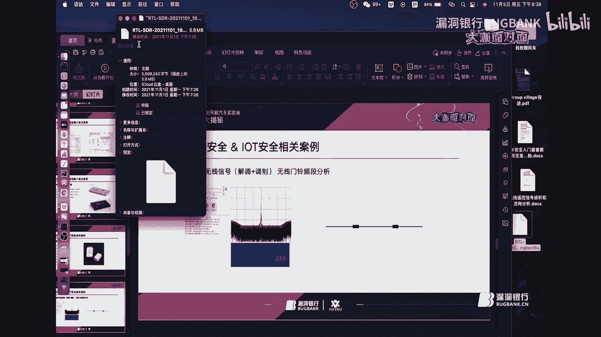
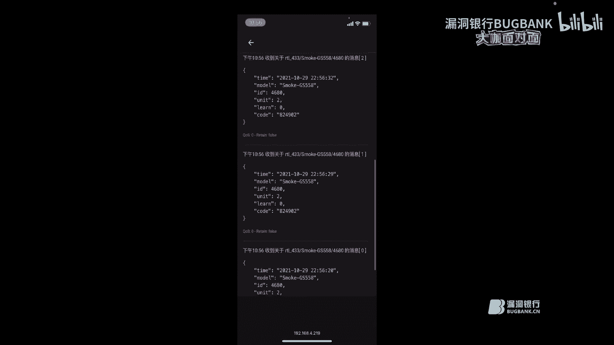
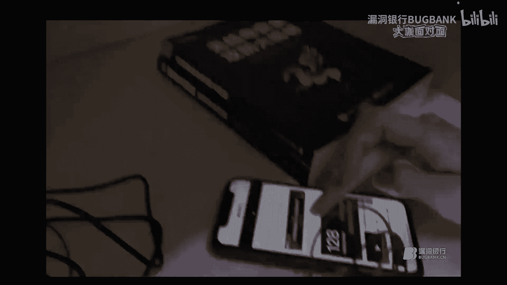
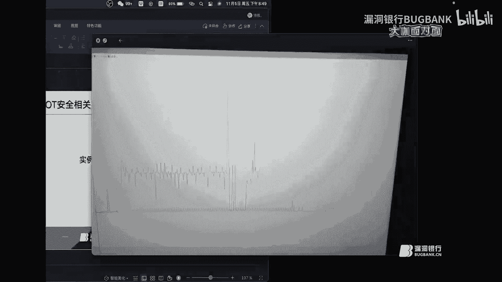
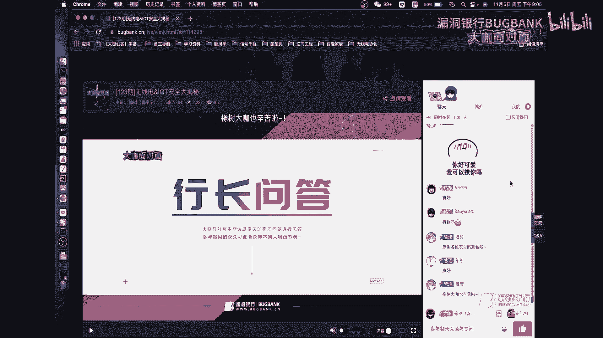

# 课程 P1：无线电与物联网安全大揭秘 🛰️🔐

在本节课中，我们将要学习软件无线电的基础知识、常见设备的使用方法，以及无线电与物联网安全领域的一些实际案例。课程内容将从概念入手，逐步深入到具体工具和实践，旨在为初学者提供一个清晰、全面的入门指南。

## 深入浅出了解软件无线电

上一节我们介绍了课程的整体框架，本节中我们来看看什么是软件无线电。

软件无线电是一种技术，它允许通过软件来定义和实现无线电通信功能，而无需依赖专用的硬件电路。在几十年前，无线电技术主要掌握在军方或高级科研机构手中，因为相关设备非常昂贵。软件无线电的出现，特别是像 **GNU Radio** 这样的开源平台和 **USRP** 等硬件的普及，极大地降低了研究和学习的门槛，为业余爱好者和学生提供了探索射频世界的可能。

软件无线电的核心优势在于其**灵活性**和**开放性**。它采用标准化、模块化的结构，用户可以通过软件自由组合各种功能模块，构建自己所需的通信系统。这使得它具有很长的生命周期，并随着社区的发展不断更新。

## 常见软件无线电设备介绍与使用

了解了软件无线电的概念后，本节中我们来认识几种常见的设备，并探讨如何学习它们。

以下是三种适合初学者入门的软件无线电设备：

1.  **RTL-SDR（电视棒）**
    *   **描述**：这是一种非常廉价、只能接收信号的设备（半双工都算不上，是纯接收器）。它最初设计用于接收电视信号。
    *   **应用与学习**：常被用于信号解码和分析。例如，结合 `rtl_433` 等开源程序，可以解码433MHz频段的物联网设备信号（如无线门铃、温湿度传感器），并将数据通过 **MQTT** 协议上传到物联网平台。这不仅是正向的数据收集应用，从安全角度看，也是一个信号分析与逆向的起点。学习它可以帮助理解基础的信号接收与解码流程。

2.  **PlutoSDR**
    *   **描述**：这是一款功能更强大的主动学习模块，基于ADI的AD9363芯片，既能接收也能发射信号（全双工）。
    *   **应用与学习**：它非常适合用于深入理解通信原理。你可以在 **GNU Radio** 中搭建更复杂的流图，也可以在 **MATLAB** 中结合其硬件支持包进行通信系统仿真和算法验证。学习 PlutoSDR 能让你摆脱“只会用现成工具”的局限，真正理解信号生成、调制、解调背后的原理。

3.  **HackRF One**
    *   **描述**：一款著名的全开源软件无线电设备，提供了廉价的收发解决方案。
    *   **应用与学习**：在安全社区非常流行，常被用于信号重放、干扰等测试。然而，如果只停留在使用别人写好的工具进行重放，学习深度会受限。建议在掌握基础后，尝试理解其工作原理，甚至参与开源项目，以获得更全面的能力。

对于初学者，建议从 RTL-SDR 入手，熟悉信号接收和环境；然后尝试用 PlutoSDR 或 HackRF One 进行更深入的原理性学习和简单的发射实验。这个过程大约需要3到6个月来踩遍主要的“坑”。

## 无线电与物联网安全案例分析

上一节我们介绍了核心工具，本节中我们通过几个案例来看看这些技术如何应用于安全研究。

以下是几个将无线电技术应用于安全分析的实例：

*   **无线门铃信号分析**
    *   **过程**：使用 RTL-SDR 抓取一个433MHz无线门铃的遥控信号。原始信号是一段波形，需要利用如 `URH` 等软件或手动分析，识别其编码方式（如ASK/FSK），并进行解调，最终得到表示按键信息的数字码。
    *   **关键**：研究的核心不在于抓取和重放信号，而在于**解调和解码**。只有分析出信号的编码规律，才能进行伪造或篡改，这才是安全研究的价值所在。验证时，可以使用 PlutoSDR 或 HackRF 发射解码后（或修改后）的信号。

*   **电动车钥匙研究**
    *   **过程**：对一款电动车钥匙信号进行捕获与分析。与门铃案例类似，需要先分析出其通信协议和编码。之后，可以将解码出的有效指令，通过编程写入到例如 **CC1101** 射频模块中，制作成一个可模拟原钥匙的装置。
    *   **强调**：此类研究必须在**合法授权**的前提下进行（例如测试自己的或获得明确许可的设备）。目的是理解其安全机制，而非实施攻击。

*   **物联网数据中继**
    *   **过程**：综合应用案例。使用 RTL-SDR 接收传感器信号，通过 `rtl_433` 程序解码，然后将数据通过 **MQTT** 协议发送到自建的物联网服务器（如基于树莓派）。这样可以在远端网页或手机APP上查看解密后的数据。
    *   **意义**：展示了从射频信号到互联网数据的完整转换链条，体现了物联网与无线电安全的紧密结合。

*   **其他趣味实验**
    *   **人脸识别门禁绕过**：展示了使用照片等非活体信息可能欺骗某些人脸识别系统，从而引发对智能终端（如智能汽车）生物识别安全性的思考。
    *   **无线充电隐私泄露**：演示了通过监测手机无线充电时的细微电流波动，结合机器学习，可能推测出用户正在浏览的网页。这属于侧信道攻击的范畴。

> **重要提示**：安全研究应遵循“**上有法律，下有道德**”的原则。所有技术都应在合法合规、获得授权的前提下进行学习和测试，旨在提升防御能力、发现并修复漏洞，而非进行破坏。

## 总结与问答环节回顾

本节课中我们一起学习了软件无线电的基础概念、三种主要硬件设备（RTL-SDR, PlutoSDR, HackRF One）的特点与学习路径，以及多个无线电与物联网安全的实际案例分析。

在最后的问答环节中，分享者进一步强调了：
1.  **兴趣驱动**：兴趣是最好的老师，能让你在学习中保持动力并快速进步。
2.  **基础的重要性**：无论专注于哪个安全领域（如车联网），**二进制安全**和底层协议分析等基础技能最终都无法绕过，是深入发展的基石。
3.  **合法合规**：反复重申所有研究和测试必须在法律和道德框架内进行。

希望本教程能为你打开无线电与物联网安全研究的大门。记住，从理解原理开始，用兴趣引领，在合法的道路上不断探索和实践。