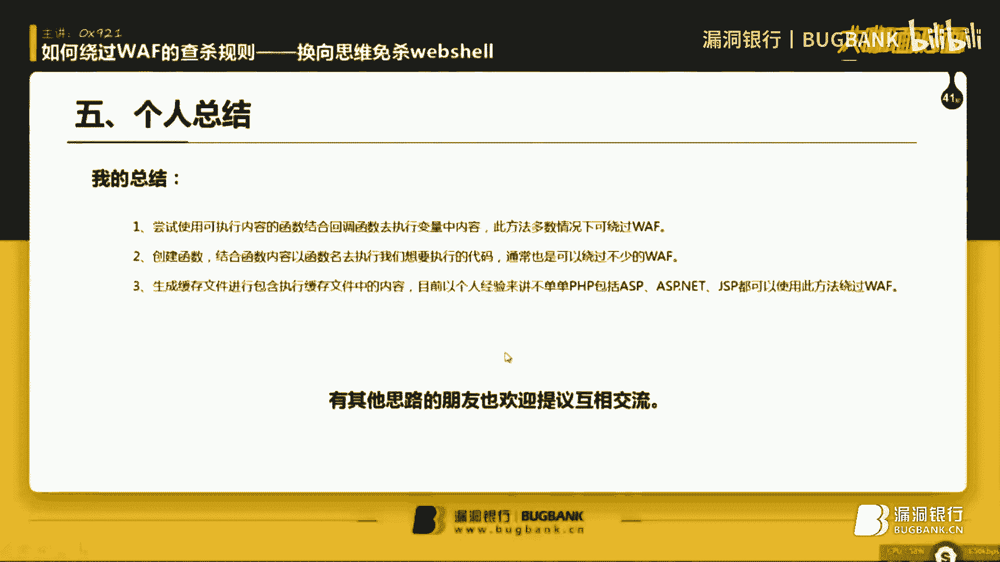

# P1：录屏丨如何绕过WAF的查杀规则-换向思维免杀webshell丨大咖0x921.mp4 - 漏洞银行BUGBANK - BV1Vi4y1P7ep

还呦。

，大家好，今天很高兴被漏动银行邀请到这个大咖面对面啊，先做个自我介绍，我叫0X921啊，可能有很多朋友可能之前啊没有听说过我，也没有接触过我是吧？今天就是通过这个平台跟大家做一个呃初步的认识。

后面就是希望能跟大家就是一起互相交流，互想探讨。今天是一个特别的日子啊，我是相当的高兴。啊，今天是国家十九大会议召开啊，这个是虽然说啊可能就是跟我没太大关系，但是我还是很高兴证明我是爱国的。啊啊。

后面咱们进入这问题。首先呢。今天讲的主要一些内容就是就是呃大概的目录，在这边可以就已经列出来了。首先要就是做一个基础的准备。然后第二章就是去了解一些啊GHP的一些就是今天咱们要使用到的一些函数。

它这个函数的啊是什么意思是吧？然后啊接下来就是。啊，第三点就是web share的一个工作原理。当了解完工web share的一个工作原理之后，其实进行秒杀。那个时候就其实相当相对来讲就比较容易一些了。

然后最后啊个人做一个总结，也希望就是今天就是大家听讲的各位朋友也希望就是说同样做一个总结。然后啊后面有什么。不懂的没有理解的是吧？可以提出问题，然后大家一起互相交流一下，探讨一下。好。

下面就呃进入下嗯进入正题吧。

哦。这次的主题主题内容就是呃幻象思维秒杀外b射。首先什么叫做幻象思维呢？在我们传统的在传统的这个外b设秒杀上面可能大家见的比较常常见的就是以就是啊内容内容加密内容编码加密之类的进行去秒杀。这种秒杀效果。

其实啊也是有一定的效果，但是就是有一点缺缺陷，就是它这个秒杀加密方式啊容易被就是啊waf软件给。就是识别出来，当waff软件识别出来，你这个是什么加密，或者说有的waff软件。

他根本就不去识别你是什么加密。只要觉得你这个加密内容很可疑，他就他就他他也不不就是查杀的时候，他也不。他它不爆出你这个呃是一个webshop，或者说是一个呃木马之类的，它就会提示一个啊可能就是可疑文件。

或者说是未知是吧？这个时候它就会上传到云端进行查杀。云端的话啊，一般现在现在可能大部分都是用人工智能。像以前的话，说实话，云端都是他们那些啊万福公司的那些啊比较高级的那些工作人员。

那些啊研究实验室啊之类的。他们是真正的就是人工去手动的去啊一一段一段的看你的代码去翻译你的代码，完了之后才能确认你这个是个木马，还不是木马。他就是通过这样的一一个方式进行查杀。现在的话万福就比较高级了。

万福现在基本上都有它的一个查杀规则。查沙规则的话啊，每个万福查沙规则可能都不一样，但是。其实本身都是大同小异啊，换汤不要换，他换汤不不换药啊。下面嗯再往下深度一下。这边是目录，刚刚已经讲过了啊。

直接进入第一节做一些基础准备。呃，基础准备主要就是这三点。第一点就是啊下面讲的一些知识，可能就是需要需要一些朋友，就是必须要去了解一些PHP编程语言的基础知识。如果没去了解的话。

我就是因为考虑到后面可能就是有一些内容讲的，我怕到时候我讲的不太不太明白，就是有一些朋友可能就到时候就啊没那么容易理解什么的。所以这个一定要有一定的基础知识。然后第二点就是啊准备一个中国菜刀。

中国菜刀当时是啊是个人建议是用2016版的。因为后面的话啊除了免校外部设。大家可能到现在为止，有很多朋友可能不知道外b需其实是有两方面免杀，一方面是客户端免杀，一方面是服务端免杀。

这个到时候后面的话会跟大家啊具体是具体的深入一个去解说一下。然后第三点的话，就是外部需环啊，它外部环境外部环境的话，PHP环境是必备的。然后至于啊HTP它那个嗯协议是吧？随便是什么阿帕奇。

或者说NG或者说IS或者其他的都都可以的。啊，现在啊基础准备大家就是先准备好一下，然后继续再往下深度。继下第一集。第二节讲的就是PHP一些函数的估及，其实就是本期内容要用到的函数。

其他的可能跟本期不太相关的。不过就是呃就是大致的粗略讲一下，因为我今天这些我讲的函数到后面都会用上。没有一个会不用上的啊。然后首先看第一个函数啊。他这个英文单词不会念。

这就是读书时候没有认真读的一个原因。要有的有的朋友还在还在学校，还在学校上学的。一定要以我。以我这种人做做做权利啊，千万千万不要就是。上学时候不好好上啊。呃，第一个函数它这个它这个函数虽然我不知道单词。

但是也是非常常见的。很多朋友应该不陌生。它这个函数的作用就是屏蔽PHP文件中的错误。但是它屏蔽错误，它不包括PHP的致命错误。如果说PHP出现致命错误的话，这个函数是屏蔽不了的，而是直接。

除了这个函数以外，包括其他的全部就已经就是整个PHP文件就崩溃了。所以说它这个函数就不能顺利的执行。啊，然后下一个facease64decode这个函数大家也相相对来讲应该不陌生啊，那这个就是将。

将该函数里面的内容是吧，内容是以就是。它这个函数主要的工作就是用于解密贝64编码后的字符串内容。至于贝64。编码是吧啊。我相信大家应该都知道是吧？我相信大家应该都知道。

所以说就是这边的话就不不去深入的去讲它这个bs64，因为没什么意义。如果说有需需要的话，就是后面后面在课后是吧，可以一起讨论一下，然后风函数就是创建一个新的函数。

但是它创建的一个新的函数不可以与PHP内置的函数出现冲突啊，这这是一点，就是啊除了PHP内置的函数，比如说你创建一个啊你不可以创建，就是和PHP函函数里面一样的名字的。

比如说它有一个bs64decode，这个是原原本它内置里面的函数。如果说你再建一个b64decode这样就不行了。或者说你bs64，然后大写decode也是不可以的PHP里面是不不区分大小写啊。

这个希望就是大家要注意一下。然后这个AR麦克它这个的函数的话，就是作用于回调回调一个数组。回调数组内容就是里面的啊怎么状。回调到THP脚本里面去，这个是今天的重点重点一个啊。

然后就有一个ki function函数，它的它的作用于和这个function其实是相差不到哪里去。但是function是必须就是说创建一个新的函数，它必须有一个函数名。但是ki function的话。

它可以创建一个。匿名函数？什么是匿名函数？比如说你创建一个函数之后，它那个函数是没有名字的，就直接呃把函数的内容复制给变量，然后用变量去执行。这种的话啊也通常就是有两种说法，一种是就是叫匿名函数。

一种叫变量函数，其实都是一样的啊。主要我们就是啊把它理解为逆面函数就可以了。这个函数今天也是一个重点，然后AI它这个函数的话其实就是定义一个数组内容，这个其实不难啊。然后看下一页。嗯。

temp man它这个函数的话是创建一个创建一个，就是跟你当前这个比如说你在指定某某个目录里面创建一个缓存文件。这个缓冲文件它就不会跟那个跟当前目录里面的其他文件就是啊发现名字一样的那种冲突。

它就是创建一个。不重名的缓存文件。所谓的缓馈文件就是点timpTTMP文件啊。然后。啊，再看下一个函数，s get temp点R它这个函数的话就是打开环境变量中的temp目录，其实也就是缓存目录啊。

缓存目录这个的话啊，大家应该也都不陌生。因为平时大家可能就是有做一些执情的时候是吧？比如说上传文件啊，传不进去是吧？就写在缓存目录里面，通常都是可以写的啊。然后再看下一个。这个函数。啊，单词也不会念。

然后它的它的作用其实就是写入写入某个文件。就是说呃就是写入一个，比如说你要你要嗯呃指定它的内容为123是吧，你把123写入到某个指定的文件里面去。然后下一个函业数F open。

这个函数的话就是打开某个指点文件，或者是URL，它这个是啊有两个功能的啊，大家。哎就是不懂的，可以到那个哦THP点net他那个官方手册上面去去具体了解啊，它这个是既可以打开一。

这某个文件比如是说你打开一点天T，比如说开啊3W点百度。是吧。然后UN link这个函数的话就是删除某个文件啊，这后面其实少了一个注释，可能就是它还有一个当时我是没没去具体做过实验。

就是据说它不仅仅可以删除某个文件，还可以就是说关闭某个URO就是在它这个先讲F open吧。它这个打开URO是在内存里面打开的。而不是说在浏览器打开的。你是就是说执行之后，你是不可能看到。

比如说弹出一个浏览器上面出现一个百度点com，那是不可能的啊。啊，它这个包括这个它如如果说呃我具体是没去做过实验。因为它就算是真的存在关闭ULO这么一个功能的话，它也是在内存里面执行的。这个的话啊。

如果说想深入研究的话，需要去了解一些汇编知识。具体的就不扯那么远了啊，跟今天主题没太大关系，讲一下就好了。然后啊这个。VARdump这个函数就是不型判断，然后进行输出输出判定里面的内容。

比如说你啊VRd啊，什么什么。啊，到了A等于是呃，算了算了，不讲不讲不讲，这个到时候后面就是啊具体要去研究的，就是啊自己去做一些实验，自己去研究一下。因为跟今天主题不太相关，我就啊不去讲那么多了。

然后这个。这个函数也是单词不会。面啊，它其实就是啊其实是在。查找它的它的作用于就是查找。啊，我指定某个目录，让他去查找某个文件是否存在。他会就是说啊做一个判断叉叉文件在不在叉叉点T4T在不在？好哦。

再看下一页。嗯，现在是第三节了。然后呃现在的话就是给大家先。分析一下一句话外不需要的工作原理，这个呃应该可能就是很多朋友应该都知道，但是有也有很多朋友不知道啊，很多朋友可能只知道这是个一句话木马。

但是它的怎么一个工作原理，大家还是需要去了解一下的。嗯。首先就是拿一个最最经典点的一句话给大家看他首先啊。在开头嘛，开头结尾这个标签我就不说了是吧？这个大家应该都知道，就是JHP的标签啊。

然后在这中间的这一段代码evo dollar post pass，它这里面定义了一个变量，定义了一个变量以声明以以post提交的pas变量。也就是说它posts的传一个paspass之后。

它的pass的值会会被eual函数。所执行啊，这个大家需要去，就是一些呃还没有了了解过一句话，外包需要工作原理的人。就是那些朋友同学需要去就是啊。呃。

HHP点net上面去看一下eual函数或者asseist函数，还有很多函数，它都可以用来做一句话，就是必须要去了解一下它这个函数内容是什么。得啦。啊，后面也会讲到，不过大家还是要去一些要做一些深入了解。

毕竟这个是对后期无论说你是要免杀we shell，还是说自己制作web shell都都是必须要了解的。如果说你连一句话web share工作原理都不知道的话，那你。我可以很肯定的说。

你是做不出来一句话我也不需要的。啊，后面咱我们再继续往下看当 passs的。变量当pass变量的值成为某个THP函数。会是什么结果啊，看一下啊。

当pas的值等于PHP infoPHP info是个PHP的内置函数，这个大家应该不陌生。它其实就是显示出当前这个啊。系统一些信息，包括PHP版本啊，包括环境变量啊，包括路径啊这些啊算了，不说不说了。

大家后面自己。去看啊，然后。啊，当然是该。该函数会被当前的KHP脚本执行是吧？咱们做一个实验样，做一个实验。打开我的这个这个这个这个。不见啊。延是起了。然后到到这个目录下面。

我是用这个PHP study这个集成环境啊，大家习惯不一样，就不要就是说啊有的人喜欢用这个，有的人喜欢用那个，所以就没必要去搞那些7788的啊。在这里面新建了一道。先把这一段注释掉。是。Yeah。

Okay。Yeah。烦死。好。Yeah。哦，我本地有有。我是当时不知道怎么回事，是吧，是关不掉了啊。他一些我不知道他他这个防护是怎么做的，反正我是不知道。是不是我我哪里弄错了？这样看一下能不能啊。

这样就可以。哦，可能就是大家看到我这里写的是两行代码，其实道理是一样的。只是我把这个呃post指向到了这个pass上面去。然后pass再传到E我其实是一样的。看到他这个报错。

其实你不用去管他这个报错就是他的意思就是这个pass变量没有被负值。当我给pass变量出一个值之后，它就不会出现这个错误了。可以看到它这个THP info就这个函数就被执行了。那么咱们再回到这里面来。

咱们再回到。是。是的。啊。答案当然是就是他这个。这一批用付会被执行是吧，大家也看到了，那么。如果pass值成为这么一段代码呢。这么一段代码是什么意思？首先这个DIRname。然后这里面一个fi。

它这个也是。我当时也去也是没有去具体了解它是属于一个呃函数，还是属于一个运算符。我具体没去了解，但是有兴趣的同学可以去了解一下他这个当它成为这一段代码是什么意思呢？这个DIR name。

然后fiil他这个意思就是输出icle是输出。然后这个当前。当前的文件路径。这这个是锁定文件当文件哦，这个是当前文件的路径。OK那么咱们再看一下，如果说是这个样子吧，它是不是会输出一个路径给我们。分号。

可以看到这个当前这个呃web share的这个物理路径就被输出了。那么咱当咱们知道他这个是可以任意执行，就是PHP语言的代码的时候，大家其实就已经知道差不多了。他的工作原理就在于当前PHP。

脚本文件会去读取并执行变量中的内容。这个需要大家就是。啊，具体的大家要多做实验啊，这个不是说一下两下就能解决的。感兴趣的还是就是建议各位同学去啊抓菜刀的。那个呃叉叉菜刀啊。

这里这里就不说是什么什么菜刀啊，叉叉菜刀的这个。他去抓叉叉的刀的一个包，然后里面有pos的内容，里面就是他这个菜刀的，就是这些传输的这些剖析代码，然后全部剖析出来，然后就是自己去做研究啊。然后继续往下。

如何让市面上的waf软件检测不到我们的web shell？这一点就是今天最主要的一点了啊，如何上让市面上的waf软件检测不到我们的wifi线呢？首先我们要知道我也不需要软件的查杀规则。查查规则是什么呢？

是吧？查查规则你只能一个个去试。刚刚刚刚大家看到了。刚刚他大家看到了就是。他这个。我如果说把这个。post这个声明直接放入到E里面去，它就会查杀。如果说我不把post。我我我把它指向另外一个变量。

然后以变量再传入进来的话，它就不产生不难减。它这是一个什么样的工作原理呢？其实这就是一个规则，这是规则上的问题。可能啊。有的同学可能就怀疑我这个我这个叉叉狗是不是最新版本给大家看一下啊。

当前是使用最新版本，两个都看一下。把这个总房护再开起啊。嗯。检查一下，看是不是最新版本。当前是使用最新版本。4。0。1啊。好。他这个可能有的同学就觉得这明明啊可能在自己平时认知当中。

这个这两张代码是不会杀。这个具体你要去了解他查杀的一个规则。一个规则是。上传文件的时候，内容被查杀，这个是posts里面的内容，这个是它的传输数据内容。然后另外一个是在服务在在服务端创建文件。

然后代码被查杀，这又是另外一个规则。大家要把这两个规则分化开啊。这两个规则必须要分化开。一个是上传文件的时候，有一个pos的数据，pos的数据里面带有敏感信息，OK给你咔嚓掉是吧？

还有一个是创建文件的时候，里面有这个文件里面有敏感信息，O也给你咔嚓掉。还有一点就是。当你外部需要进行连接的时候。呃，某某菜刀发送数据的时候。他那个数据包里面带有敏感的信息，OK再给你咔嚓掉。

他其实总共拦截思路就是这么几个。可能还有其他的我没有去注意过，后面有同学有注意的可以提出来是吧？然后现在的话啊，我今我就先给大家做一个简单的一个。吃范。嗯。刚刚大家可以看到。我写了这么一个。

这么一个外部设，这么一个简单的一个。THP一句话是吧，没有拦截。然后我尝试一下。尝试一下，拿这个某某狗进行。进行查杀啊。使用猫某狗杀毒看一下。把这个原来的这个删掉。没有。好。

就查查当前这个这个码的这个目录。做咩啊。可以看到他直接就报出。THP1句话木马。那么今天我要给大家就是啊告诉大家一个新的思路。其实也是我之前其实在在呃某司论坛啊，这边不说出是某个论坛，反正大家知道就行。

是某司论坛发表过了。啊，目前来讲还是过这个某某狗还是没有问题的。我用的方法是什么？我先给大家写出代码，然后再告诉大家我用的是什么方法。先定义一个变量。叫做pass。

然后将postpas的值传入到这个pass里面去，将这个的值传到这这里面去。大家呃要理解一下PHP的执行过程啊啊，是从从后往前执行。它是啊先就是我刚刚说的。

他把这个的值复制给他PUP代码是从后往前执行啊。然后我这边。大家可以看到，如果我刚刚直接用用eva函数的话是吧，它就提示这是个木马。如果说我啊我不用eva函数呢，不用其他的。

我今天刚刚刚跟大家说过的t function创建一个匿名函数，可以试一下这个看一下会会是什么样一个结果。是吧。开头。方式，然后K function里面要定义一个值，这个值无论是什么，只要是呃随便是什么。

可以是空啊。然后。将pass的值传入到ke function。如果说你这样去执行的话，我可以我我可以很明白的告诉你。代码会出错，代码为什么会出错呢？反正代码就是会出错。后面再跟大家说为什么会出错。

pass的职位定也。反正他就是没有执行，是不是？因为他只是目前来讲，对他而言，他只是创建了一个匿名函数，但是并没有执行某个匿名函数。然后我再把这个匿名函数的值放入到。刀了A变量，然后以刀了A。

变量去变成一个函数去进行执行。简单的说就是变量函数保存一下。这样就执行了是吧？当咱们知道他这个ki function的这个一个啊。一个这个这个这个这个这个使用的方法是吧？之后。大家就可以就是去。

尝试看一下，如果说这样情况下会不会被伤。我也没试过，我可以这么很明确的跟大家说，我也没试过。啊，他一共他这个某某狗一共有两个啊，两个都都尝试。先拿这个深蓝色的看一下插上。啊，他其实这个样子。

这就直接绕过去摸摸狗了啊。这其实对我来讲的话，有点就是说太太太。太那个啥了，他。反正我自己我现在就是对他这个这个某某狗就是很不太满意了。因为我觉得这个代码是非常简单的。没办法形容。

然后再看看这个这个这个某某主机位置。某某主机卫士。嗯，开起来看一下。啊，依然先看一下他这个这个这个这个这个这个是不是最新版本，是最新版本啊，这个是没毛病的。然后。啊，点这个后门插上。

我估计这这这这这这某某主机卫视也是查不出来了，看他这一副样子就知道了。大家注意啊，大家查杀的时候千万不要学我啊，我这个是联网查杀，大家在做实验的时候一定要注意要断网查杀，不要联网查杀。

因为他他无论他在扫描每个文件，只要是他不认识的文件，在本地库里面不认识了，他都会传到云端去。只是我自己。比较比较有自信啊比较有自信。所以我就我就不不在乎他传不传云端，反正我有我有办法绕他。

也是没有查出来，再看一下这个这个某某盾啊，后面这个让他们漏洞银行这边的这个运营妹子帮忙就是把这些全部打码一下，避免一些不必要的麻烦事情啊。因为这个毕竟不可以直接啊公开某某软件的一些什么包括什么的。

这个是不行的啊，这个是说白了，其实相当于是公开人家的程序漏洞，这个是属于违法行为的啊。这个大家不要千万千万不要就是说。哦，拿去干嘛干嘛干嘛啊，可以看到这三个这三个啊某某狗是吧？某某狗两两个两个一个什么。

啊，网站某某狗一个一个是服务器某某狗显示不出来啊，这两个包括这个某某主机卫士，他都没有查出来啊。但是但是这个某某段查出来了，它。咱们来看一下他问他查出来的是什么说明啊，看一下说明。

可以看到do了 a函数指向kit function函数。kit function里面的参数是post pass。是吧就他就。啊，不单单是他认为，包括我也认为这是一个一句话木马啊。不光光他认为。

那么那么那么那咱们知道他这个。他最先查的是什么？到了A函数变量函数是吧，指向是吧？那么如果说咱们按这个变量函数不指向那个地方呢，比如说啊我随便定一个空的，什么到了B是吧？这前面是没有到了B的。

我随便定一个空的，看一下测试一下。他还会不会上传来？诶。😊，到了B函数。变量函数哦，它现在没没有说到了B指向这个t的方。那么咱们先一步一步来，它这个中间一个竖杠啊是一个分开的，先是有一个可疑点。

然后这后面又是一个可疑点啊，咱们先既然它到了B也会出现这个问题。那么咱们到了C再试一下。可以看到到了C，它提示仍然提示变量函数。如果那么咱们现在基本上可以断定变量函数，绝对是百分百会被他。就是说啊。

爆出可言，那么咱们不不使用变量函数，就是说在变量后面不出现括号的情况下，可以看到它这个do了C就。目前就没有这个风险了啊。那么咱们已经知道变量函数会被查杀。下一步是什么？

can function函参数里面就是啊有这个post pass，这这也是一个啊。那么如果说can function里面是没有内容呢，是一个空内容的。嗯，他这个。可以看到ca function里面。

如果没有这些敏感的东西的的话。他就他就报哦零零级风险啊，零级风险正常文件。如果说呃。贴ttle风里面钉一个空的。到了D这个用逗号隔开啊，这个印刷符大家去了解一下。

那么证明他这个查沙的并不是ki function里面有没有存在变量啊，它不是查沙这个规则，它是查沙K function里面这个变量是不是可控的？是吧。现在的话咱们知道他又知道了他一个规则情况下。

下一步要怎么处理？但是咱们必须要让它这个电量是可控的，这个是绝对跑不掉的。如果说。pass是吧，如果我这个pass是一个。是一个字符串的。哦，他大家要先知道，他呃学过PHP的都知道，没学过的。

大家要知道一下，单引号里面是不解析变量的。单引号里面无论你是什么，无论你是变量还是函数，它全部当做字符串来处理。它是不会解析的，不会用PHP语言解析啊。可以看到，如果说它是一个。呃。

它这里面的doll了 pass是一个字不上的话，那么它就不会被拦截。那么咱们再进行下一步测试。是吧。如果说。我。我这我这一整个ca的方向都是一个。字不串，他会不会拦截呢？正常的是吧？

OK那么那么咱们现在知道，如果说他这个是一个让他这个某盾的规则，就是认为他这里面是字符串，而不是函数。那么还有几什么办法呢？单引号它不它不解析，双引号的话啊。双引号代码会出错啊，大家不要想多了。

不要再做梦了啊。那么就算说咱们用单引号或者商引号把它。包含起来之后，咱们是不是要传入到某个地方去？在这里我做一个就是比较大胆的假设啊。如果说我这样执行了。首先。首先我们得看这一段代码能不能正常运行。

我也没做过测试啊。首先咱们要知道这一段代码能不能正常运行。哦，看他这个样子。好像是少那个封号的意思吧，好像也不是。嗯。等下翻重电。他提示。它这个呃未定义的函数tele function。

也就是说它这个函数没有被没有被创建出来，创建匿名函数过程中没有被创建出来。那么OK啊，这个办法是不行的。而且而且咱们刚刚可是测试过变量函数会报汇报到等等这个啊是吧？这个什么东西咱们就不去管它了。

不去管它了。OK那么咱们如果说。做了。定义一个函数啊，我定义为GHHP。挂号。GUP里面传入。到了pas变量的值。是吧。然后这里面是什么？这里面再再按照刚刚的方法是吧，到了A等于。K。Function。

然后啊先传一个空子，然后再传一个。到了怕。是吧。然后在这下面。执行啊，算了算了，执行也没什么用。执行他仍然也会也会也也会报报风险，但是代码是正常的。O啊。然后在这下面去执行PDP这个函数。

咱们新建的这个函数里面付一个值给他到ll了pa。ok。再进行查杀一遍。嗯，好像改错文件了，不是这个文件这个文件啊。啊，一下子回到解放前啊一下回到解放前。这就有点尴尬了是吧？但是。有没有朋友想过就是。

他这个如果说如果说他这个就是啊。他这个无论如何要使用变量函数。如果说不使用变量函数呢，咱们一个一个绕不使用变量函数，还有一个办法。之前跟大家说的一个函数要拿出来用了啊。要拿啥用了？它这个A2麦跑函数。

这个函数是用于回调。刚刚跟大家说过了，但是它回调的话。他只能回到宿组。是吧它只能回到数组，那么它这个cant function里面的值是一个passpas的值又不是数组，该怎么办呢？那怎么办呢？

咱们给他。拼一个速索进去。随便调都行是吧？OK这样的话就OK了。Very good。是吧。好，它现在仍然提示t function里面呃，至少说变量函数咱们已经到过了。是吧。

变量函数指向cate function这一条咱们已经绕过了，只剩下这个cate function。刚刚咱们测试的时候，ke function是一个呃被就是提示提示什么东西来着？提示。哦哦，对对对。

刚刚咱们测试是，如果他是字符串就可以过去。那么咱们就尝试把这一段代码变成字符串。有什么办法呢？有哪个朋友想过没有？有没有朋友想过没有？如果说我变成字符串之后，我要怎么执行。

他大家可能就不太清楚变成字符串这个东西还怎么执行？是吧但是我就是有办法。啊，我就是我就是我就是这么淫荡。首先给大家呃介绍一下这个张哥监国浩。三个左圈括号，它是一个这个这个这个这个这个。这个叫什么？

运算符。啊，当然可也可以用也可以用单引号或者双引号，其实都是一样的，效果是一样的。但是三三个监控号的话，它是它是必须它是必须啊，就是它的效果是跟双引号一样，它这这里面是会变量的。

所以打们需要在这里面进行变量一个转移。其实你用单引号也行，都一样，效果都一样。只不过是我比较喜欢就是。这样看起来代码看起来比较舒服一点。将这些变量。进行转移。那么咱们定义它这个P的值为这个之后。

咱们有没有其他的一些办法，就是说让他这个P的值啊。是吧。执行里面的东西呢。要知道他这里面是有PHP标签的，那么他肯定是不可能在这当前文件里面执行了。是吧怎么办呢？更新的文件。刚刚跟大家说过的。哦，是吧。

嗯。嗯，另一个。电量会太大。OK现在接下来有一些新新的函数要看到了。有呢条进度。是。嗯，这个这是是。这个是第几张啊？是这个吗？temp temp name。他这个是不是这么这么念，我我也不知道啊。

首先呢。创建一个。啊，不不同名的。不同名的一个这个这个这个这个文件是吧？然后指定一下这个文件的目录在哪里，文件目录就写到缓存里面去。当然你也可以直接填到其他的目录，这个你可以随便定义的啊。都可以是吧？

那么创建这个文件之后，他这个是。他这个里面的内容是什么呢？里面内容就是到了P。是吧。就是到了P。创建一个temp之后，咱们先来看一下代码能不能正常运行。不然解释这么多人。外乡是吧？首先。咱们调试一下。

用Ile进行调试。O。看一下代码能不能顺利运行。哦，他报错了。让我有点失望啊。他报错了。Sa， get temp D IR。什么什么什么什么什么错误啊。会睇度。嗯。不给他哦。这里面这里面是打开目录。

不能在打开目录里面这个这个这个复值啊。OK他现在。第二个错误。Temping name。这个是。是没有创建出来的意思吧。是内容吗？嗯。他这个icle怎么保不输出呢？它这个I口技能不输出啊。

有点有有一点点小尴尬，不过没事。虎山大人。其实我也不知道缓存目录在哪里。不过没事，咱们暂时先不管它有没有生成啊，咱们继续往下深入，就假装它生成了。假装。假装生产了。假装他已经成功生产了。嗯。不对呀。

它生成的话，它并没有写入内容。突然间想起这个问题了。好像好像这个这个不是这样写的啊。我可能得翻一下之前的一个代码了，刚刚删掉的那个，我又得把它找。有点尴尬啊，临临时不会写代码了。不过不着急，没事。

让我看一下之前是怎么写的。这会是哪个文件呢啊，不不不。不能是这个吧，这个这么大。啊，果然是这个看一下之前就是哦直接复制一个空的内容给他。复制一个空的内容给他。然后我输出一下icle。哎，你好是吧。

调试一下，看一下他写到哪哪里去。诶。哦。我好。内容没被写入啊。没事。嗯。FO坑，然后打开指定的那文件，文件就是tamp是吧？然后操作为写入W。这个是不许跟大小险都一样啊。写路的内容是什么？

记录的内容是do了P。当个屁是咱们想要协助的内容？现在再来看一下。他一直提示这这个这个有问题啊。那这个有什么问题呢？问题大了去了。问题问题，现在我跟你说的问。惹上大麻烦了。现在。

直接把这一段代码复制掉了。哦。创建一个不不求名的一个文件，然后指定先是打开这个。缓存目录，然后创建一个不重名的t文件。然后写入内容，先打开打开temple。

打开这个这个这个这个不重名的这个temple文件之后，然后写入内容写入内容它的内容就是当前这个doll P里面的这个值写进来。写进来之后，incloode包含包含这个temp文件。

下面这两行代码其实可要可不要啊。好嘅。他现在出现了一个问题。这个是我始料未及的一个问题，我不知道是哪哪个问哪个地方出了问题。哦。先把这些注释掉，我看一下这个缓存目录能不能打开。按理说是没没有太大问题的。

嗯，好啦，就这样。Yeah。哦，改错文件了。难怪我折腾半天，我觉得录制过程中有。有一些有有一些遇到一些挫折，一些困难才觉得有意思，不能不能老是一帆风顺。那就呃继续往下看。就是刚刚刚刚的遇到一个问题。

就是很尴尬，改了半天文件发现。改错了啊，很尴尬。啊，现在现在咱们从从从这行代码开始开始看起啊。从这行代码开始看起。先看一下他。啊，创建了一个这么一个呃CF225这个。attemp文件这创建是C22啊。

咱们先到这个目录里面去。先进来看一下看一下看一下。看一下啊。可以看到有一堆缓存文件。啊，基本上都是。不知道什么时间段啊。啊，现在先不管他，反正他无论怎么创建是吧？

他都不会跟前这个目录里面的任何一个文件发生冲突。他不会就是呢他比如说你这个文件已经存在了，他就OK我知道你存在。O我就我就创建跟你一个不一样的是吧？创建一个不一样的。好，他那么他这个创建的不一样的。

它这个内容是什么呢？重点是这里啊，大家大家要知道一下重点，刚刚那些什么遇到的一些问题啊，这说不是重点，重点是这里。哦，嗯内容还没有被写入，这个有点尴尬。先把它内容写起来。是吧。首先了解一下多端代码。

F open打开temp文件，打开当这个生成的这个temp文件，然后这个还写入内容，写入的内容为doll了P到了P的值就是这段代码。然后呃然后inclo暂时先不要啊，一步一步来一步一个脚印啊。啊。

现在生成一个。2，1555。我实真冇录。在录制视频中呢，就是有遇到一些挫折是吧？啊，我个人是不会感到尴尬的。因为我知道做任何事情都没有那么一帆风顺，所以。出现一些问题，大家需要理解一下，不要就是说呃。

需要理解一下，可以看到他这边就是把咱们do了P里面的人写进来了，写进来之后进行一个。下一步要怎么做？下一步咱们的目的是要把这里面的内容。执行里面的代码是吧？只有里面的代码执行了咱们的外包需要才能执行。

那么下一步就是inclo。包含。将这个timele文件包含进来是吧？包含进来之后，里面的内容是什么？里面内容就是咱们一句话。很简单的是吧？哦，怎们啊。执行一下。可以看到内容已经被包含过了。

他报了一个错误。这个错误之前跟大家说过，他这他的意思就是pass这个变量。pass这个变量没有被定义值，当pass给它传一个值呢。啊，是吧。很好。喂个得。那么咱们就是说以这样一个形式就是。尝试。

因为咱们刚开始呃，咱们遇到的weber share查杀的一块问题是什么？咱们遇到的问题是什么？是吧？遇到的问题就是啊这个I口不要讲。

遇到的问题就是他这个老师就是啊cate function里面有一个可控可控变量是吧？让他以为这是一句话啊，他不是说他以为是这本来就是一句话是吧？那么咱们刚开始测试过，如果说他是一个字符串的话。

他就不会插伤。OK现在再来试一下。一级incclo是吧？Include。Yeah。怎么办？他知道咱们包含了一个文件。是吧我不知道是不是写法问题。但我之前我没遇到过这个问题。是吧。

不过咱们还是可以继续继续往下深活，反正他他就是啊现在报了一级一一级风险inclo。那么。包含了这个文的可以。那么咱们如果说包含完之后。就删掉了。是吧。咱们这个文件包含完之后呃。我就是我我弄完之后。

我就给你删掉是吧？我弄完给你我我弄完之后给你删掉，你总不可能还认为我有问题吧。啊，可以看到他今天是要跟我唱反调了。你看到这个这个某盾今天是要跟我上反调，意思是要跟我上反调是吧？不过没有。这是其实说实话。

遇到的这些就是录制视频中遇到的这些问题，都是在之前就是没有做任何准备的。就是录制视频我就我也不希。不就是把视频做的那么假是吧？只有就是让大家看到我在制作过程中的挫折遇到的一些难题，只有把这些难题攻克掉。

才是真正的就是啊跟大家分享一个整个过程。我希望大家能够理解这一点啊。咱们先看一下一句话是正常执行的。那么inclo的时候，它报了一个错误。如果咱们。不包含的这个删除其实不用管。嗯哼。信唔信。

又改错文件了啊。咱们这个包含怎么就不要掉，然后再看一下它会不会出现问题。嗯。现在是零级，那么就是inclolude的问题。是吧。不过在我知道里面包含。不止一个两个，什么还有一个。还有一个我是忘了，忘。

不过没关系。咱们咱们先用inclo的。先先用着啊。然后。到了嗯。然后。啊，再删除一下。删除当前这个文件删除这个操作其实呃对我个人来讲是非常重要的。因为如果说你不做这一个删除的话，你每次提交一个参数。

你菜刀每做一个动作是吧？它都会生成一个timeble，导致导致这里面生成一堆东西，然后然后呃是吧？就会就会就就就。就是说的在在在。在那个狭一点是吧，就是咱们在比如说在啊测试某个网站的时候是吧。

给某个网站挖掘漏洞的时候，拿下外博时外博设之后是吧？生成一堆一堆缓存文件，管理员看到是不是就先不说他可不可疑，反正是不是会很烦，是吧？当然这个这个大家啊我只是这么一说啊，渗透测试是需要有授权的。

这个必须是有。如果没有授权的话，是属于违法违法的黑客行为啊。啊，先把这一段代码，最终我想要加上来的一段代码先加上来看一下啊。我不知道他这个为什么之前之前就是以这么一段代码执行的时候，他没有拦截。

所以所以我就先把代码加上来，看一下他的查看规则到底是什么OK。是吧。刚刚做了什么操作？再查查一下，现在是零几了。他为什么现在是零解，大家有没有要考虑这个问题。

为什么我明明没有没有没有没有删除掉这段inclo这段代码。他原本是高一级的，为什么变成零级了？我告诉大家，这边还有一个新的被咱们抓住的一个新的规则。包含一个变量是吧，很可疑。

但是但是你如果说包含完了之后删除是吧？这个其实这个删除对他来讲并没有影响啊，这个并没有影响。重点的是什么？判断文件是否存在。是存存在之后是吧？就是。你这个不尔型不尔型就是判断值。不尔型。

大家应该都知道就是返回两个条件，一个真和一个假。当判断文件是否存在之后，然后输出文件是否存在真假是吧？那么。那么就很有意思了。嗯。代码又出错了。啊。真的是想。第十六行代码就错太错。这不科学呀。

这第十六行代码是好好的对呀。删除。删除的时候出现问题了吗？这个大兄弟不能这样子做事啊。啊，暂时先不管它，反正就是呃他既是第十六行代码错误。那么咱们十六行不要掉呢，其实道理是一样的。

只是后面那个删除操作需要再再跟进一下而已。是吧其实还是连结。OK那么咱们得知就是。它inclo包含包含完之后，咱们它其实真正它不是这个函数，可以。你知道吗？它它可疑的不是这个函数，而是可疑的。

你包含一个变量是什么意思？正常程序员要包含哪个文件，通常都直接写成包含哪个文件，包直接什么啊单号是吧？点杠叉叉是吧？正常是这样写的，但是你包含一个变量就非常可疑了。啊，那么咱们包含的同时。

咱们又去判断了一下这个文件是否存在。如果存在的话。会是怎么样？如果不存在的话，会是怎么样是吧？那么他就认为你这个包含可能只是只是一个后续操作，情序还是要判断一下。那么如果说这个文件不存在呢？

你这个包含就是无效的，所以他这个某盾就认为你这个包含可能就是啊包含一个叉叉文件，然后判断一下叉叉文件在不在。可能对他来讲呢可能就这个这么一个意思。具体的大家可以自己去啊自己去跟跟进去了解啊。

可以看到目前目前这个啊不过我还是目前可以说就是啊这个某某盾是吧，已经就是过了临级风险是吧？但是我还是要去跟进一下他这个。UN link这个。他是为什么要跟我唱反调啊？他因为你这个东西不删的话。

后面很麻烦的。后面是相当的麻烦的。是吧是不是括号的问题啊？好像是括号的问题。好像是括号的问题。啊，是刚好的问题。OK给他加一个挂号就过去了。好。那么咱们现在得知。我们现在得知这个。啊，不。

咱们其实这一节啊其实。想一下回想一下是吧，感觉。废话一大堆。重点的。其实。不是很多。啊，不过没事，备换其实也是一件好事情。好，咱们再进行查杀一遍，重新再查杀一遍。这个是。呃，确保今天这个思路是可行的。

不可行的话，那就非常尴尬了啊。ok 。这个这个是是是是网站还是互享哎，这这两兄弟反正都查不出来。然后这个这个这个。不能叫什么狗啊，叫摸摸狗啊。然后这个某某主机卫士再进行查杀一遍。嗯，这个目录查一下。啊。

看他这。一副样子八成又是查不出来了，所以咱们不用管它了。咱们再重新再确认一下，重点是这个某某盾啊，这个某某盾是非常重要的。只要能过这个某某盾，基本上过其他的就不是什么太大问题了。重点就是这个某某段。

某某段已经是过了。它的更新规则库为2017年10月14日啊，这个大家看清楚。这个是绝对是没毛病的啊，而且某某盾运行之前，它它会先检测更新，然后再运行软件。好，可以看到啊这个。这个是某某主机卫士吧。

这个是某某狗。啊，这个也是某某狗，反正都没有查出来。这这市面上就是咱们国内的几个waf软件，现在都已经查不到咱们的we包需了，是吧？OK啊，这一节的分享具体的话就到这里。

那我继续接下去刚刚忘了说的一点就是这个这个呃开头给大家讲的这个。暂时只是。哦，服务端免杀就是在在在呃执行端服务端，我们通常叫为服务端。有啥效果。那么客户端是否能免上呢？这是一个问题。是吧。已开启。

但是但是他怎么他这呃，我看一下能不能出发出他这个条件。如果说呃是正常的话，他会触发出这个条件。简难说不太正常啊。没有触发出，因为他代码报错了，说明代码已经执行了。它这个条件我不知道在哪里开。

不过我可以就是以360为啊，不不不，以那个那个那那个什么那个某某主机卫士为主给大家看一下，就是大家可能连接外部需的时候会出现这么一个情况，或者说是啊某某狗的一个。呃，框框大家可能经常见到。

然后在这边的话啊，我继续要给大家讲解一下。要怎么避免这个情况呢？其实这个是传输层的问题。传输层的问题啊。我先写一个。不让他报错的东西。他如果说这样直接是一个呃直接是一个函数，或者直接是一个代码。

可能就比较敏感。但是咱们进行加密一下。啊，他就是。不会，因为他不认识这个是什么东西了，不在他的规则范围内的，那么这就达到一个客户端免杀。那么这样的话，咱们需要修改一下weber share的代码。

我们就以贝思64编码为。今天以被64的编码为主啊，当然也有其他的编码方式，大家可以自己去弄，都一样的。嗯。对，哦这个是pos提交。Okay。啊，这就OK了是吧？但是大家就好奇奇，这样的话，菜刀肯吗？

当然当然是绝对的，菜刀肯肯定是不可以连连接的。哦哦，菜刀我不说是什么菜刀啊，反正大家心心里有啊。菜刀他这个答案肯定是绝对不可以的啊。啊，他这个不是报我的不是报我的外外包，我还以为报我的外包系了呢。

OK输入密码s。这个肯肯定是行了，是不是肯定是不行了。那么咱们需要修改菜道。修改菜刀。修改是了啊，我这边需要就是是啊可以进行。啊，任意什么找到。就是首先就是啊大家要去了解一下这个老师。

提示不是提示我的外不cha就行了。哦提示我什么工具，我才不管你啊。这个不是重点。点是找咱们现在。菜刀的这个这个这个这个这个这个传输出的什么内容是什？可以是相当的敏感的。这些直接就是铭文传的敏感。

但是它里面有一段B6次加密的内容。这个是菜本身规则里面的这一段大家提取出来，这一段是非常有用的啊。这一段其实才是核心，其他的前面后面。那那都不是重要的东西，那个可有可无，我可以这么说。可以。

我明白的跟大家说可有可无。这一段代码它列出了当前的。啊，目录是吧？因为我这个weber share是包含temple文件，temp文件是在temple文temp目录里面。

只有它的目录是在temp里面OK然后列出了C盘D盘啊，当然这个有有些盘可能不存在，这个不用管，然后啊系操作系统什么处理器权限s线。相当好啊相当的高。那么咱们分析一下这里面代码是什么内容，你code一下。

啊，首先先。嗯。这一段啊。不知道什么意思，没什么用，可以看出来啊，这一段好像是做了一个时间延时的意意思吧。反正也没什么用。然后这边判断了THP的版本信息，说明这一段又是没什么用的。你用的东西太多了。

这一段输出输出这个这个这个这个什么。啊，这个可以不输出是吧？咱们给予重重要的内容。我们。只要重要的内容，不重要的咱们不要啊。欢人达啊。这个R是一个变量，所以这个R跟到这个位置OK。

那就是这个地方是有用的。好，再给他讲励一下。那纯粹的内容纯粹的是咱们想要的内容在这里。那么咱们得知菜刀它这个S64里面是有咱们想要的内容。那么咱们。得知菜刀本身就会对这个内容进行加密。

OK那么咱们要怎么办呢？咱们咱们的目。目的是什么？咱们其实不需要修改太多的东西，把前面这一段是吧，和。和。后面再去掉就可以了。打开菜刀的口费。稿费文件我就是之前强调2016版，就是因为修改简单。

当然后面的话我会再进行分享其他版本菜刀。不过。后面再说啊，我我要啊。留着会这么跟大家说吧。可以看到菜刀的作者一开始就说了。PHP base base参数是百分之S，百分之S在这。那么它的百分之S是什么？

百分之S是什么？咱们可可能不S是什么是吧？咱们也没必要知道。是吧OK那么咱们只需要前面这一段内容内容找出来，前面这一段是在哪里？拆到25行ARm到这个位置，S的单引号是吧？咱们要把它去掉去掉。

包括分之S后面的这这一堆东西。是吧这一堆东西去掉。啊。去掉。封号都不要掉了。OK。保存一下。保存的是哪一个啊？保存的是那个。嗯，保存完之后。再运行一下菜道。我得确认一下是不是修改的。嗯，没毛病啊没毛病。

啊，保存完之后再再这个时候再测试咱们的。So。嗯。密码是pa。添加，然后。刷新一下进程，打开菜刀进程。我要重新截取他的数据。嗯，没有数据更新一下缓算吧。这些都不是重点，重点在这啊。

可以看到他这个时候的参数直接就是be64讲米后的内容了。那么菜刀也就成功的顺利的，相当相当顺利的执行。但是可以看到它跳跳出的并不是外包目录，是t保目录。为什么？因为他执行的咱咱们咱包含temp文件。

temp文件是在t目录下执行的，所以。系啦。列出的目录参本目录。菜刀修改就是啊菜刀就这么简单，就修修改修改那么一行代码，甚至还不到100个字符，可能可能就就几十个字符的样子，二三十个的样子是吧？

就修改完成之前。是在某某论坛发表过，然后有一堆的朋友来追问，就是菜刀怎么修改呀，乱七八糟的是吧？所以今天我就是在。再打一个预防针，就是希望大家以后遇到这种情况，知道该怎么处理就是。

知道咱们说客户端连接外fi需是吧？啊，他某个敏感的东西。团路的时候被拦截掉，然后就是。一般是加密固，然后修改一下下菜刀了。下面的话就是要跟大家做一个总结了。

总结是非常重要的。不管说他这个总结是什么样子是吧，是非常重要的。

首先我先给跟大家说一下我个人的总结。第一点，尝试啊尝试使用各种可执行内轮的函数。这边举个例，如最先讲的普通的一句话，最为最常见的vivo函数或者asses函数。

或者我刚刚用的那个什么cat function，包括还有其他的啊，这边不做具体的去说那么多啊，废话那么多，没什么意思。尝试使用各种可执行函可执行内容的函数，结合回调函数，结合回调函数，这是一个重点啊。

去执行变量中的内容。在我个人。以往的。百part经验来讲。此方板多数情况下可让我瓦啊。第二个创建函数结合函数内容，以函数名去执行我们想要执行的代码。就像我刚刚那个那个那个。

就像我创建一个这个这个这个这个这个创建1个PHP函数，然后以PHP函数去执行咱们想要执行的内容。这个也是我个人。嗯，嗯，反正摆 pass经验这么久以来，通常也是可以绕过勿少的啊。

第三点就是生成缓存文件进行群。包含执行缓存为文件，就是最后我写的这一段一整段是吧？生成哦，不生成在这里，生成缓存文件先先呃。就是说先先定义到位置目标，这个是路径。然后这个是缓存文件的内容，内容为空。

完了之后继续往下，然后就是啊打开打开，然后写入内容啊，这个这然后再包含是吧？包含过来。反正这个以个人就是我目前也是摆怕这么久以来。目前个人经验来讲不担当。不单单PHP脚本啊，包括ASPASP点net。

也就是咱们常见的APX，包括JSP。还有那些什么JSPX，还有很多咱们可能没见过的啊。大多都可以绕过都可以使用此方法绕过wa。当然，还有其他思路的朋友，欢迎起议互相交流，互相学习。啊。

后面的话我希望就是大家在提问环节之前啊，就是希望大家先做一个自我总结。啊，啊，不，这个就放到后面吧。先就是呃提问环节过后，然后大家做一个总结。像像我这样，不管说总结多还是总也少，反正就是。

就啊自己在这就是这一个过程中，在今天这一个视频中学到了什么东西，学到了什么内。内容大家分享一下个人的总结。然后啊也就是大家可以互相看啊，我看你的总结，你看我的总结，这样可以。在这一点上面，我们可以。

说是很学到互相的知识，学习是互相的是吧？好，今天的呃视频就到此结束。

就是感谢各位朋友。三点观看啊，谢谢。

。Yeah。

