# 漏洞银行丨“1000种姿势”绕过软WAF --Python Fuzz脚本编写 —V@1n3R丨咖面33期 - P1：【录屏】“1000中姿势”绕过软WAF——第33期大咖V@13nR - 漏洞银行BUGBANK - BV1Di4y1K72Q

(音樂)。

歡迎大家來到漏洞一行的直播間，漏洞一行的各位行長們大家好，又到了我們每周的大咖面對面的時間，那麼我們本周又來了一位，技術群元老級的人物，來自柯拉實驗室的Winner大咖，大家好。

漏洞一行的各位同學大家好，今天我們要來聊聊，因為我們知道今天給大家講的主題是，1000種姿勢繞過軟WAF，那這個主題有什麼難點，然後大家需要提前做哪些準備，難點呢就是這個，繞過軟WAF其實並不難。

但是1000種姿勢這個可能有點誇大了，這個是比較難實現的，其實只是，這肯定都是小夥伴們在，聽這個議題之前的這種想法，1000種幾乎，就是誇大標題黨吧那種感覺，其實我可以在這裡很負責任的告訴大家。

1000種還算是往少裡說了，這個你要是自己有經驗的話，把這個姿勢是真的學會了的話，那上萬種都是很容易實現的一個。

都是很容易實現的一個目標吧，前段時間不是發了那個預告嗎。

然後預告裡就有今天的題目說，1000種姿勢什麼的，然後就有很多小夥伴在底下評論說，沒有1000種砸死你，還有人用拿小本能記著，對呀，我想說走過路過不要錯過對不對，不聽後悔，這絕對是不聽後悔。

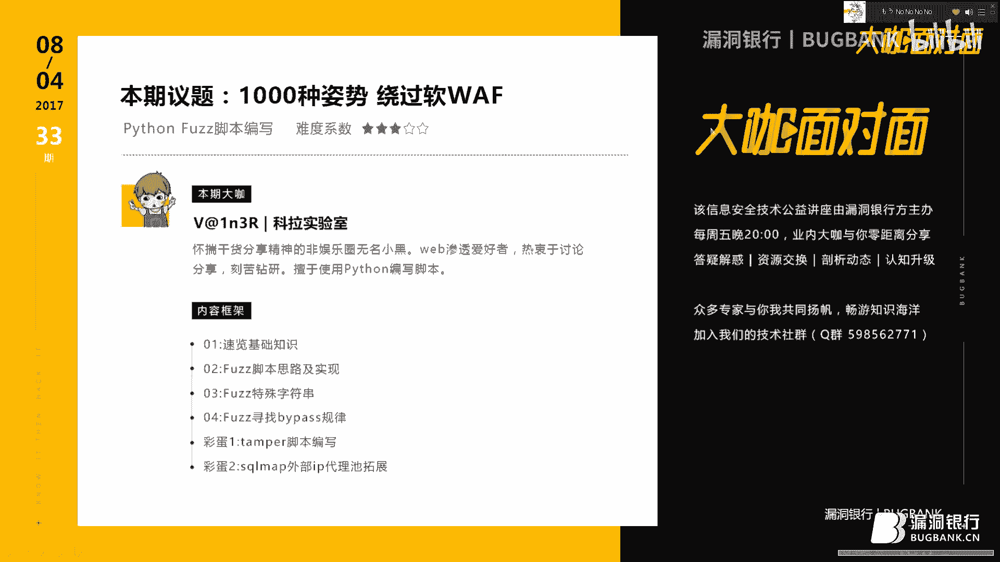

我覺得這可能是有史以來最剛獲的一次吧，然後需要準備的東西呢。

其實就幾個環境需要，準備一下，一個是PHP加MySQL，然後加Apache，加Apache 4。0的版本的那個，Mogul，就需要準備這三四個環境，其實就已經夠了，還有需要Python 2或者3。

只要擁有Request Query就可以了，然後再加上一個善於思考的腦袋，應該聽這次議題是綽綽有餘的，我想問你幾個問題吧，因為我知道你現在還是大學生嘛，我想問你是什麼時候開始接觸到，信息安全這個行業。

要談真正的接觸的話，首先先說一下不是真正接觸這方面的時候，就是差不多第一次接觸，其實是小學畢業那個暑假，實在是嫌得無聊，學畢業，對，然後就開始去刷QB，大家都知道刷QB，現在已經不行了。

回想當年的話還是覺得自己挺厲害的，那個時候就是用些寬帶刷鑽，還有什麼寬帶刷QB這些，我用的就是寬帶的，原理十分簡單，就是用代理軟件代理上別人IP之後，用別人的寬帶來達到消費他的寬帶。

為我的QB充一些業務或者QB之類的，也是這個契機吧，你這樣說這個真的好嗎，沒事沒事沒事，反正已經過去了，就算有訴訟期估計也已經過了吧，這應該也不算黑產吧，我的天哪，完了，黑歷史黑歷史，有小夥伴提問說。

大咖是哪的人說話跟我們那一模一樣，武漢人武漢人，湖北武漢，別社工我別社工我。

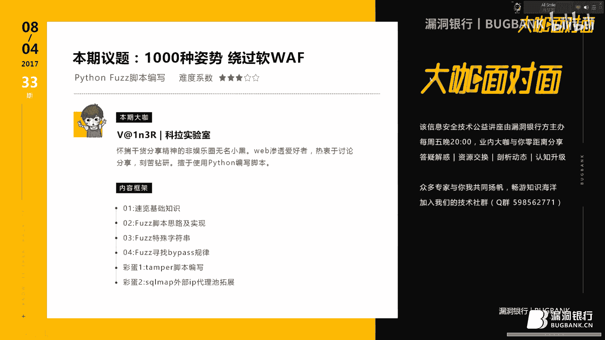

我本人非常害羞的，交朋友可以，你知道在接觸性安全的技術經濟過程中。

肯定是非常辛苦的，嗯，林德大咖你有什麼最痛苦的回憶嗎，最痛苦的回憶，大概就是，花了幾個小時找出來，手工那個時候還不會用工具吧，就是手工，找出來一個注入點，然後往CQMAP裡面一放一扔，一片紅。

雖然你手工檢驗了，他確實有注入漏洞，但是他就是一片紅，這可能是讓我們這種，就這種喜歡用工具的小夥伴們最頭疼的，所以這次的議題也就是，最後會有兩個彩蛋，這兩個彩蛋可以完美解決這個問題。

也就是利用一些小工具，來達到繞過這個IP頻率訪問限制，然後讓CQMAP更加完美地運行的一些小工具，為知識而存，因技術而生，小夥伴們晚上好，歡迎參加每周五的漏洞銀行，信息安全技術講座，大咖面對面第33期。

我是主持人妮妮，今天晚上呢，我們邀請到了一位技術群元老級的人物，克拉實驗室的Winner大咖，他將帶來議題為，1000種姿勢繞過軟WASP，Fast & Fast腳本編寫的技術分享。

那麼也歡迎大家在互動區多刷彈幕，與大咖和聽眾探討和交流，也歡迎你在問答區留下評講時遇到的相關疑問，大咖會在後續的行程問答環節中一一解答，那事不宜遲了，下面就請大咖Winner開始今晚的演講吧，好。

各位漏洞銀行的小夥伴大家好，我是這次議題的演講人Winner，我隸屬於克拉實驗室，這個克拉實驗室大家都知道，分享了很多乾貨，所以這次我也是來給大家，懷揣著一種分享乾貨的精神，來參加這個活動。

把我們發現的一些小知識，小技巧來分享給大家，首先介紹一下我自己吧，我呢就是這個圈子的一個小透明吧，就是一個普通的愛好者，但是喜歡鑽研也喜歡分享，在議題過後，有如果想跟我一起交流學習的同學。

可以QQ聯繫我，首先我來介紹一下，本次議題的一個提綱，也就是一個內容的框架，首先我們是很快的快速瀏覽一下基礎知識，免得照顧所有的同學，以免有知識點大家聽不懂的，然後就是Fast腳本的思路以及實現。

然後後面就是兩個根據結果，根據結果來看過程，後面附帶兩個彩蛋，彩蛋一呢就是Temper，這是SakMap的一個擴展吧，Temper腳本的編寫，然後SakMap的外部IP代理時的擴展。

這兩個相信會在未來的時間裡面，對大家十分有幫助，好話不多說，接下來我們開始今天的議題內容，首先給大家介紹一下Python基礎入門。

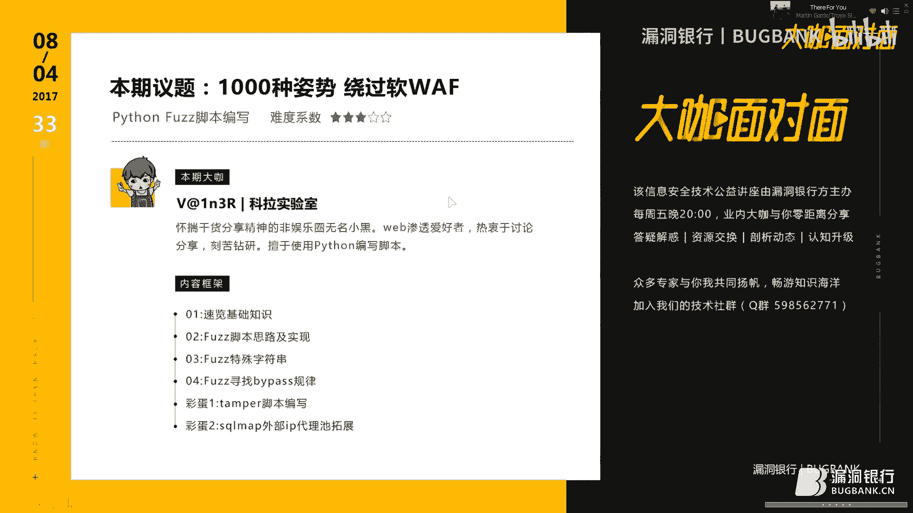

有相關基礎的同學可以稍微休息一會兒，這個過得很快，稍微給那些沒有學過Python的，其他小夥伴介紹一下，首先是變量與輸出字符串，這個十分簡單，因為Python它不是強類型語言，是個動態腳本語言。

所以它這個裡面像這些聲明變量的方法特別簡單，首先就是聲明整形，直接一個數字整形，就直接複製過去了，然後伏點形，加個點就是伏點形了，打上雙引號或者單引號，就是複製字符串形，然後Print。

Print就是打印，不像C++或者Java那些語言，需要一大串的聲明，這個只需要一個單詞Print，後面加上變量名或者字符串，就可以直接在終端打印出來相關內容了，然後加號是拼接符。

這個加號它可以拼接字符串，也可以拼接列表，作用算是比較大的，後面會用到這個拼接符，然後後面就是條件判斷，也就是一符與一句，只要當一符後面的條件為true，或者說為1的時候，它就會執行這個冒號。

大家都知道Python它這個，是按tab這個鍵，就是按照縮進來，劃分結構劃分層次的一門語言，這個就可以拿尺量一下，這只要是前面空白相同的話，那就說明它是一個整體的一部分，是一個層次是一個層。

關於這基礎部分，大家不懂的可以自己在網上去搜索一下，因為本次的主要內容不是這個，條件判斷很簡單，就是只要為一符後面的條件為true的話，就執行後面對應的部分的代碼，接下來就是列表。

這個算是Python裡面比較特殊的一個東西，首先需要聲明，就是list等於中括號，這是聲明一個聲明list為一個列表，這是使用列表的大前提，然後後面就是在裡面填充元素，這是填充了abc三個元素。

然後print list，這個就是打印出這裡面所有的元素，然後後面這個就是拼接符，拼接三個列表，使它成為一個大列表，這個我來給大家稍微演示一下吧。

首先很簡單，聲明，然後往裡面填充三個元素，然後打印，十分簡單，然後還有一種用法呢，就是用它的那個，這是list是一個可迭代對象的，我們就使用for in語句來迭代這個迭代對象，然後輸出其中的元素。

按順序輸出其中元素，可以看到這是按順序打印出了其中的元素。

這過一過很簡單，這迭代也就是遍地列表，將裡面所有的所有的元素給便利輸，便利一遍，太基礎了沒什麼好說的，接下來就是需要爬蟲相關的一些操作，首先這個就是request queue的安裝，以及簡單的使用。

會有爬蟲經驗的，可以使用別的queue或者別的語言來實現，我本人在這裡使用的是request queue，首先安裝，我用的是python3，所以很簡單，PIP是可以直接使用的，所以我們在這裡。

我推薦了三個命令來安裝request queue，這三個命令都可以，正常情況下都可以正常安裝request queue，然後在使用過程中，在腳本編寫的過程中，我們首先需要import request。

就是導入這個queue，這沒什麼好說的，然後我們下面介紹的是幾種request的方法，對進行http請求的幾種方法，我們在這次測試當中，只需要利用request。get，就是get請求。

只需要這一個請求的方法，使用方法很簡單，就是request。get，然後括號把你的url放進去，就可以請求了，就可以執行一次請求，特別簡單，然後首先呢，環境呢。

就需要準備Mysql+PHP+Apache，我在這裡就直接使用PHP study，這個大家可以去安裝一下PHP study，這個網址是官方的，都是官方的，然後本次FAZ測試所需要的pip文件也放在這了。

這前面是個人博客，我直接把它放到博客的根路徑了，這個。

簡單介紹一下這個PHP文件吧，也就是模擬了一個刺客注入測試。

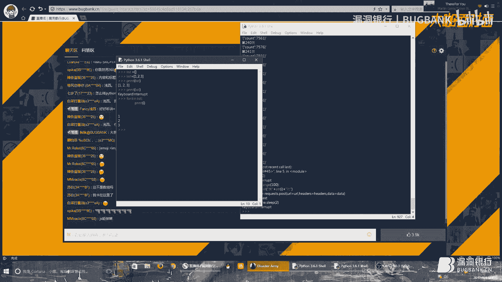

這個是我在網上找的，並非本人自己寫的，這個是我們就將在，將使用這個頁面來判斷，是否有刺客注入，以及繞過軟瓦斯，有需要的同學可以去下一下，我去，大家看一下這個，有需要的話大家可以直接現在直接去下載吧。

url不是特別長，PHP study直接在，直接百度PHP study的官網，在他們官網上下載官方版本就夠了，然後這個FAZ測試的話想跟著我一起做，然後有Python基礎的同學可以來下載一下。

好準備工作也就到這了，後面來講一講FAZ腳本的基本思路吧，首先介紹一下WAF，大家這個應該是經常常見了，簡單來說這是web應用防護系統吧，就是防火牆吧，然後現在這一代的WAF產品，主流差不多都是通過。

政策匹配來匹配客戶端發出的http請求，然後將含有危險字符的請求給攔截掉，然後直接拋掉這些請求達到防護的功能，這怎麼說呢，十分暴力也十分的不智呢，相信未來肯定都是偏向於人工智能，或者機器學習這一方面。

然後bypass思路也十分簡單，他既然用政策來匹配我們的請求，那我們就繞過這個政策，也就是所謂的FAZ爆破，FAZ是爆破的一種，翻譯過來應該叫做模糊匹配測試吧，我們這個FAZ腳本的編寫呢。

首先應該利用環境特性來爆破，例如IIS的環境就有00階段呢，然後常有00階段，然後那個Mythical它就有類聯注釋啊，這種東西，我們就多利用這種，然後以達到payload十分不容易檢測出來。

不容易被匹配到那種結構，過程十分簡單，就是打開web防護軟件，我在這裡用的是比較著名的一款，也就是魔狗，我們怎麼判斷成功繞過呢，十分簡單，我們就看，如果我們一個請求，如果我們的一個請求，被攔截的話。

可以看到是這個界面啊，網站防護牆，它會把你這個請求給攔截，如果沒有被攔截的話，就是一個正常的界面，我們就通過這個，對如果出錯的話，它會提示這個出錯，這個非常方便，我們通過一些關鍵字。

首先我們來查看一下正常查詢的原文件，然後再來看一下這個，報錯的，再來看一下攔截的，因為這後面可以大家可以自己去測試，我在這裡直接告訴大家吧，我在這裡選用關鍵字。

Title1可以看到這個在源碼當中是存在的，然後再來看一下這個出錯，查詢出錯的情況下，是不含有Title1這個關鍵字，然後再來看一下攔截，這應該是更不可能存在Title1了。

我們就可以使用這個Title1，來判斷是否，是否成功的執行了那個查詢的語句，沒有也沒有被攔截，所以整個思路其實就這麼簡單，就是發送一個請求，然後根據他返回的內容來判斷他是否繞過。

然後是否成功執行了相應的動作，關於這些軟WIFI來攔截那些關鍵字的話，大家可以用SKMAP，然後加上這個代理參數，利用這個抓寶工具來查看他的注入請求，查看當中會含有的一些關鍵字，舉個例子。

這個某狗的敏感點，用那個Message數據庫環境，就有這個聯合查詢，這兩個應該是絕對不能出現，一般來說是絕對不能出現的，出現了他是肯定攔截，然後還有一些比較狠的管理員，就自己外帶了一些規則。

自己加了一些規則，攔截了這個查詢表，表名列名這些，這個表吧，怎麼說也說不清，總之就是含有這些相關關鍵字的注入，然後還有一些MySQL內置函數，比如user database這些之類的。

然後更多的關關鍵字，需要自己去發自測試，這可能對以後的繞過極有幫助，接下來就是Fast腳本的基本實現了，Fast也就是模糊匹配，我們在本次議題當中，就利用MySQL的內聯注釋。

可以看到這個是很早很早之前，可以過溝的一個結構，就用這個可以逃逸出證詞匹配，但是現在模糊的證詞庫也日益強大了起來，但是我們依舊可以利用Fast來繞過這個，我說一下為什麼使用內聯注釋，因為這個內聯注釋。

它會使這個查詢語句變得更加複雜，它的結構變得更加複雜，不容易被機械化的證則所匹配到，所以我在這裡使用它，注意一下只有MySQL才有這個特性，接下來我來給大家看一下腳本版。

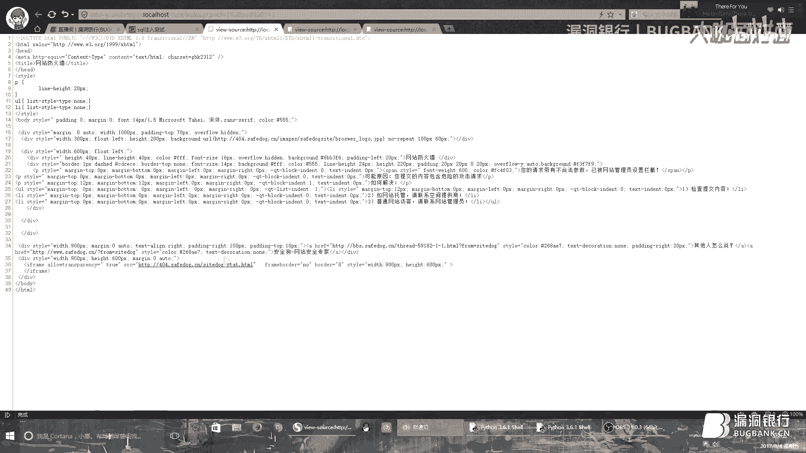

也有些奇蹟陰巧，大家可以自己去利用實現，腳本內容十分簡單，只有短短的30排，如果不算上這些注釋部分，然後這些空的空行的話，那大概30行以內足以，日調這個不是日調，繞過這個魔狗。

可以看到我這個魔狗是4。0版本正式版，規則也是已經更新過了，需要注意的一點就是網站防，哦不對這個資源防護，這個CC攻擊防護一定要關上，不然它會把自己的IP給辦掉，會限制住自己的測試。

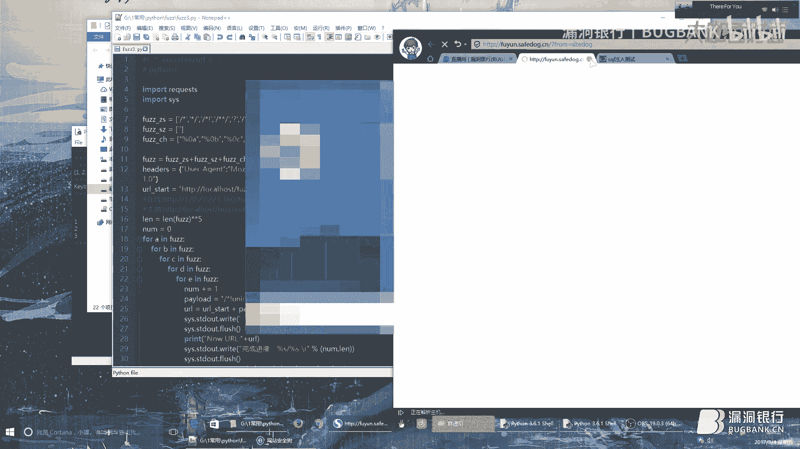

這次測試的IP把它給關掉就行，然後把那個網站防護中的，http安全檢測打開就行，可以看到這裡，對於搜尋輸入的我是全部都打開了，這是腳本內容，有Python基礎的同學可以直接看一看，很簡單，首先需要導入。

多數我先直接把腳本跑起來吧，在跑起來的過程中再給大家解釋一下，(快轉中)，可以看到速度是非常快的，在這裡本人推薦的話呢，是直接在本機上面，也不是說本機，在CPU上面。

在CPU性能較為強勁的機器上面測試吧，可以看到我現在CPU的功率佔比已經非常高了，這怎麼說呢，還是需要CPU稍微好一點的機器，在虛擬機裡面更是不存在的，因為它處理http請求的速度也會非常慢。

在本機上面差不多就是一秒一個請求，可以看到現在結果已經出來了，8。18，處理速度非常快，差不多一秒鐘100個請求了，這個是我精簡版的規則庫，可以看到這裡面都是一些平常，只要帖子看過多。

那些文章看得多的小夥伴，肯定對這些都很熟悉了，這就是一些，怎麼說呢，需要，這上面都是一些特殊的字符串，一些符號吧，下面是一些，這是URL，通過URL解碼之後，會有不同的含義的一些字符，然後十分簡單。

這裡使用這個列表，來連接上這三個列表，其實這就是一個大的字符串庫，然後這是本次測試的URL，然後，這個就是前面之前提到的，便利循環語句，Foreign，這是便利，便利這個裡面的所有元素，然後多層嵌套。

我這裡是嵌套了五層，嵌套了五層，然後在這當中，ABCD1五個元素連起來，差不多這筆的意思呢，就是便利，將這裡面所有字符串的，所有組合全部便利一次，然後這前面連接的是，列點注釋的前半部分，這是它的後綴。

這是它的前綴，然後我們就用這種方法，很簡單粗暴，十分簡單粗暴，所以我個人也喜歡把它叫做爆破，爆破繞過，這個就可以，組成十分十分多的payload，可以看到這裡是有，個十百千萬十萬百萬。

九百多萬將近一千萬的總量，我每次都沒有跑完，因為實在太多了，然後這是URL，這個前半部分和URL的後半部分，連接在一起，形成這種新的URL，然後使用request_query的get方法。

來訪問這個URL，然後只要但凡title1出現在這個res。這個方法呢，其實就是返回的文本吧，明文，只要這個title1出現在這個返回的內容當中的話，就說明我們是已經繞過了goggle。

然後也成功地執行了相應的search語句，達到了繞過，然後後面這半部分呢，就是打開result。exe，然後以添加的方式，utf8的編碼，然後將這個經過我們層層篩選的URL寫在這之中。

可以看到僅僅才過幾分鐘，這裡就已經有26KB的內容了。

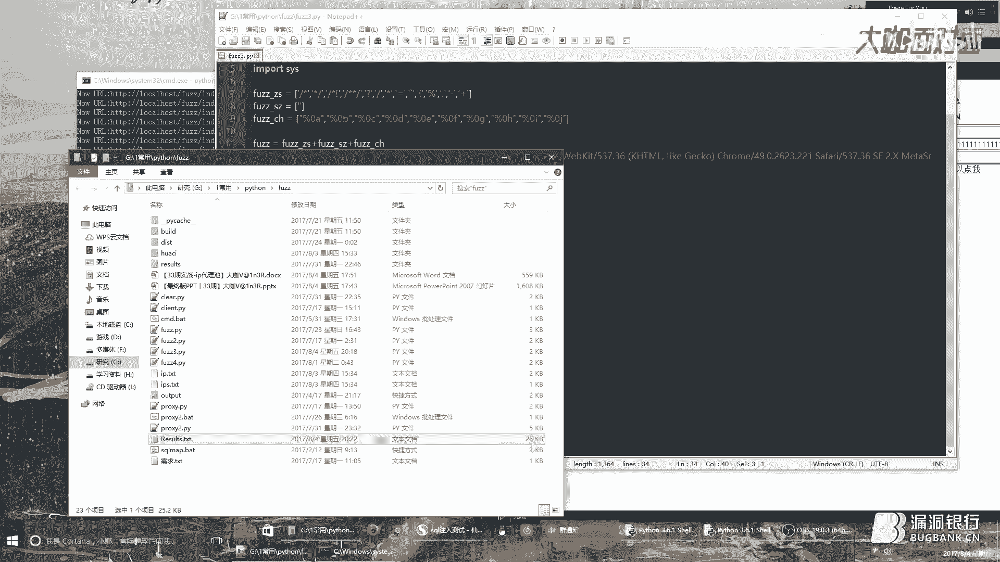

可以看到現在已經有363條URL，是成功地寫進了文件當中，我們來隨便挑一個，首先就挑第一個吧，我在這裡把發子腳本停一下，因為會佔用太多請求，可以看到這是成功查詢到了，為了方便看到我在這裡給大家，不行。

先給大家看一下效果吧，這就是成功執行了search語句並且繞過，這是有開著安全口的，這是開著安全口的，這安全口是會攔截的，但是恰好這一款payload就繞過了。

所以說之前的那一千多種完全就是往小了說，太小了，因為這才跑恨不得1%的內容，準確說1%的內容都沒有到，就已經跑出了三百多條，而且這個字符串列表是被我精簡過的。

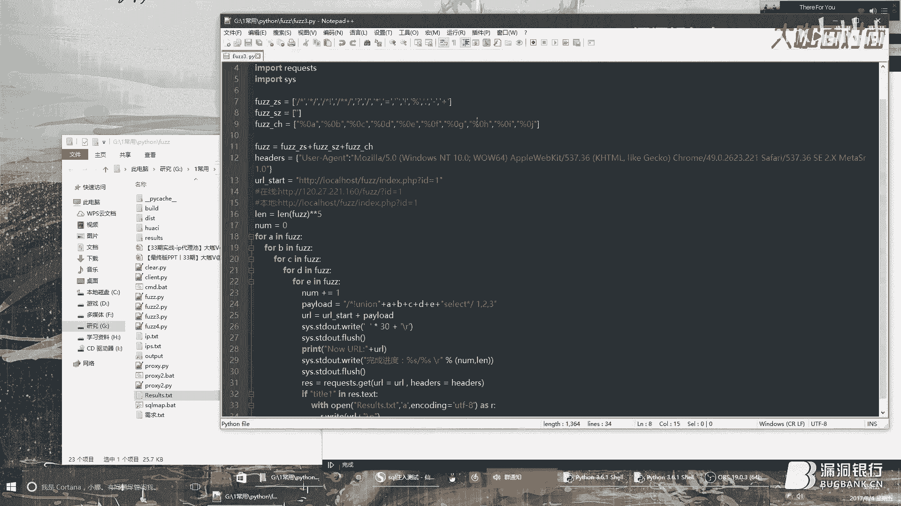

這是我原來的版本，這是幾乎將所有能利用的字符串全部添加進去，可以看到這上十億吧，組合起來上十億，而且我只在這裡嵌套了五層，就上十億了，給大家看一下之前的結果，最多的一次是五百多KB。

可以看到這裡有八千多種，當時只跑了兩百分之一，實在沒有耐心跑下去了，跑了我一晚上，兩百分之一就有八千多種字了，所以說一千多種字純粹就是往小了說，毫不誇張，之前想要拿小本本記下來的趕快記，八千多條。

好不扯淡，接下來我們來為了效果再隨便複製一條，這都是可以成功執行色刻語句，我就利用剛剛爆破出來的，然後我們來分析一下這個，將特例變成通用的，首先我們可以把它分成兩半部分，因為可以看到。

我們將這個色刻語句給複製一下，可以看到是成功執行了。

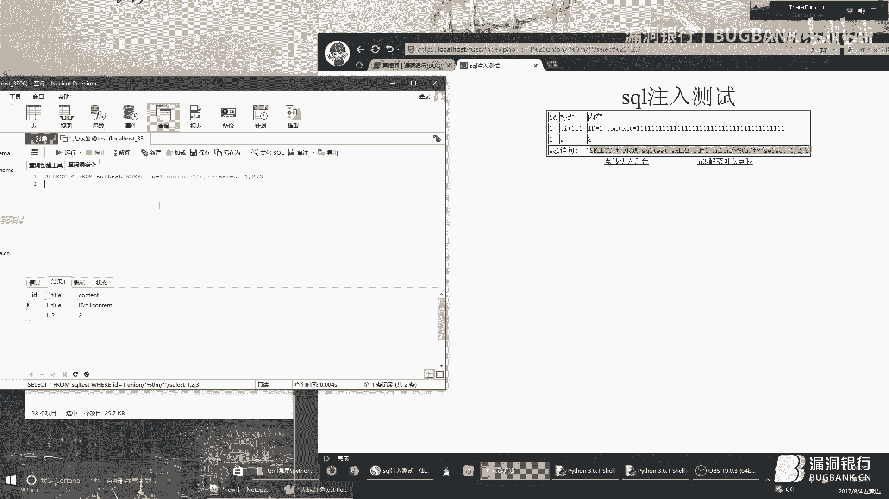

然後可以將這裡的色刻語句，也是成功執行了，通過手工的測試，可以發現這一半部分其實是廢的，中間這一半部分是廢的，我們就來研究一下它的結構吧，通過測試發現，就是這個結構，是可以直接將單個關鍵字給包圍。

然後以達到繞過RunWrath的效果，這個並不是通用的，只是目前測試這一塊RunWrath，這個毫無抵抗力而言。

雖然有的小夥伴可能就會問了，雖然你有了這個姿勢，但是你將這個直接使用的話，其實還是直接使用在手工書還是不行的，因為有時候之前也提到，它會攔截MySQL的內置函數，比如舉個例子，user不出意外。

這個安全口是肯定攔截了，就攔截這個user的相關字符，接下來就要說MySQL另外一個特性了，像這種使用括號包圍的，是可以和前面這個字符串分開的，差不多就是這種效果吧，中間是可以加一些注釋之類的。

另外一個還有比較相似的就是點吧，這個點其實也是可以分開，或者換行，這些操作我說的都是繞口比較好用的吧，可以達到UI的效果，怎麼繞過這個對於這種內置函數的攔截呢，其實也很簡單，舉個例子這是最簡單的例子。

將這個user放在這兒，將這個括號放到後半部分，它直接繞過了，也達到了相同的效果，可以看到這裡顯示了root。local，所以說這個效果是非常顯著的。

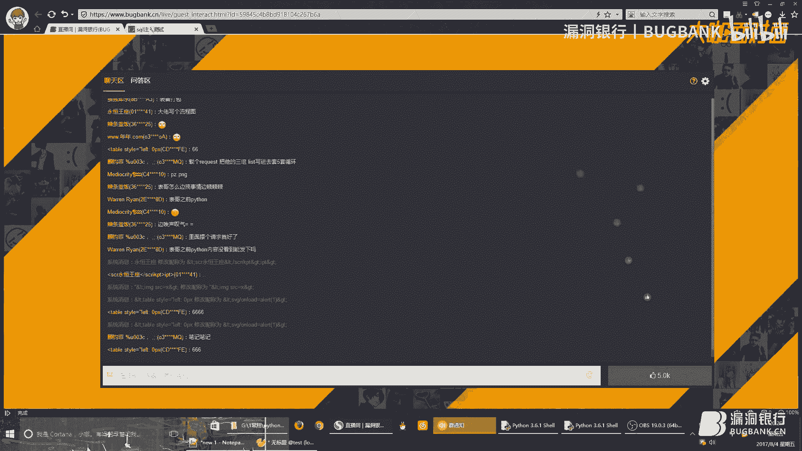

原理其實真的太簡單了，其實前面都算是輔助的吧，我一開始的目的就是發現規律，然後利用這個規律，現在我發現了這樣一個規律，大家可以看到這個結構是十分有規則的，就是關鍵字，前面加兩個類聯注釋的前綴。

後面加一個類聯注釋的後綴，然後這一個繞口的結構其實就已經完成了，接下來就是屬於彩蛋內容，彩蛋1，兩個彩蛋都是圍繞著自動化注入的方法，實現來完成的吧，首先第一個就是temper-jotten。

temper就是注入神器，Circum map當中的一個拓展吧，就是原來提供給大家繞過一些WAF的工具，現在這些WAF也學聰明了，差不多circum map已經繞不過去了，使用FAF也很簡單。

加上兩個槓，然後加一個temper，然後後面加一個temper的名字就可以了，temper中有這個庫當中有不少的腳本，也全部都非常的優秀，我們可以直接造個輪子，也就是直接仿照現成的腳本。

去修改成我們所需要的效果，腳本所在的文件夾就是circum map的根目錄，然後裏面temper，本次的編寫有兩個條件，有兩個環境的條件，一個就是mycirc數據庫。

因為這個類聯注釋是只有mycirc當中才有的特性，另外一個就是apache或者IS的mogul，因為本人只測試了mogul，打開temper，稍微給大家介紹一下temper，這舉個例子。

這都是擁有特定的作用的，完整的介紹在我博客有，在百度上面也有一大堆一大堆，在本次就使用這個versioned keywords，就是栗子數據庫包圍關鍵字，就是這個。

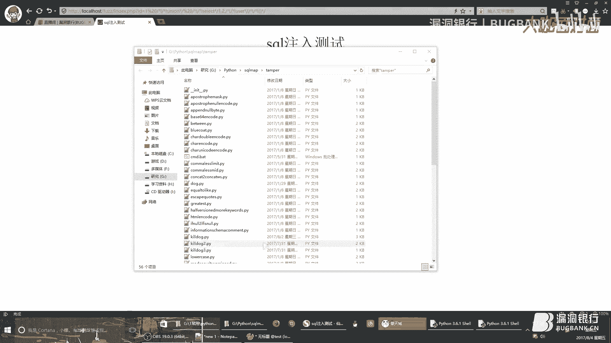

根據它的介紹，這個注釋灰色的部分，我們可以看到，它的作用就是將這個查，這個聯合查詢，就是相關的payload語句的關鍵字，前面加上一個，類聯的前綴後面加上一個後綴。

就這樣子將每一個payload全部都給囊括在其中，然後再進行注入的，這個操作非常簡單，可以看到它這個過程也非常簡短，這大意呢，差不多就是將payload傳進去，然後在其中檢測一些關鍵字。

然後發現只要含有關鍵字的話，就將前面加上這家前後包圍，將用內零注釋，將這個關鍵字給包圍起來，這後半部分就是正字匹配，沒什麼好說的，就算不懂，就算不懂python，你也可以直接用手改，因為這太簡單了。

我給大家直接展示一下修改之後的版本，可以看到這裡我只修改了一點點，將這前面的，前面的單個前綴改成了兩個前綴，後面全都是一次類推，全部都是如此不走啊。

十分簡單，接下來就實驗給大家看一下，是否真的有成效呢，我就直接用本地來測試吧，首先，來一次不加tmp的注入，檢測到有wav，檢測到了深埋測口，然後爆紅，這明顯就是被wav攔截住了，攔截住了部分關鍵請求。

接下來添加我們的tmp小梗，可以看到这里是成功检测到了这个参数ID是有价值的，这里是检测到了4种注入类型，忙注、内习、oz、英语、日语、印、韩语和英语，布尔忙注、包括注入，然后时延时注入以及联合查询。

可以看到这里已经成功地绕过了WAF，而且非常简单，可以直接用CircleMap，并不需要手工注入，接下来演示一下，打开BurbFilt，然后将这个带上代理参数。

我们来查看一下Payload到底经过了怎样的操作，这里需要将拦截给关上，这之前有缓册吗，可以看到这里是Payload，Payload经过URL解码。

可以看到这里面所有的关键字都是被我们刚刚这个规则给包围起来了。

也就直接绕过了狗，当然对于一款优秀十分优秀的产品，这个魔狗就是十分优秀产品之一，它肯定不会让我们这样轻易得逞，所以，它怎么说呢，之前也给大家说明了一下。

它这个资源防护当中的这个CCE攻击防护是自动默认开启的，这个就会限制住我们的IP请求的频率，只要我们请求过快，它直接把我们IP扳掉，就算你有再好的ROG磁石也是与世无骨的。

所以我再接下来就给大家介绍我的第二个小技巧。

也是第二个彩蛋。

因为第二个彩蛋就是一款小工具，并没有什么值得讲的东西，也是用Python来实现的。

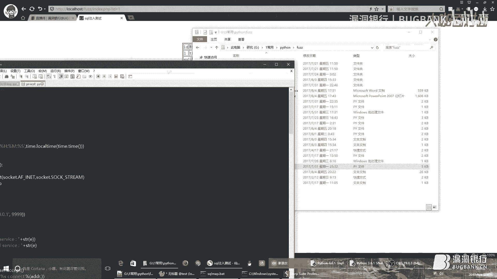

有Python技术的小伙伴们可以稍微瞄一眼。

圆满，这个在本人博客上面有介绍，这个就是CircleMap的拓展，外部IP代理时的实现，这里我已经将这个小工具打包成EXE了，因为是Python编写的，所以它打包成EXE的话，体积会十分大。

有能力的小伙伴同学们，可以使用别的更加底层的源来编写，体积会小很多，这个原理十分简单，首先通过CircleMap来将代理上，把CircleMap代理上本地的999端口，然后代理上之后。

首先应该打开这款工具，然后它属于待机，然后CircleMap的请求全部都会转发到这款工具上面。

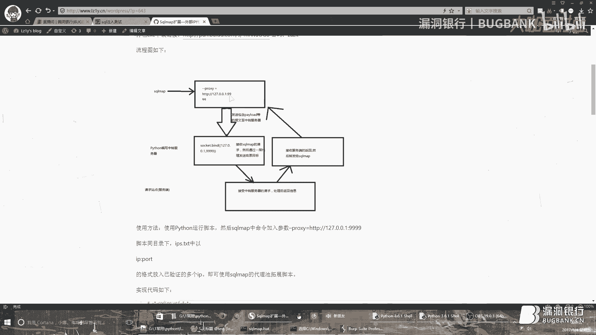

其实这就是相当于管中转流量版，中转服务器。

本机的中转服务器，然后通过这款工具，首先我们可以接收到CircleMap的请求，然后通过工具的一层代理，发送给我们渗透测试的站点，也就是服务端，然后通过，然后我们在本机接收。

然后代理服务器接受我们目标的请求，再返回给我们本机，说起来有点绕口，但是实际上逻辑是十分简单的，接下来测试一下，提示一下，因为这个怎么说呢，是IP代理池，所以这IP需要验证一遍，在这里我之前收藏了一批。

我接下来把这个IP更新一遍，推荐大家在0。1秒以内，不不不，1秒以内的就够了，1秒以内的就够了，太短的话，那就要求太苛刻了，响应时间太长的话，那就十分难受了，还不如直接手工注入，本人以后有时间的话。

会写一款在线的工具，供大家使用，8月4日，这8月4日，之后我经过了两次筛选，两次清洗，这将成功。

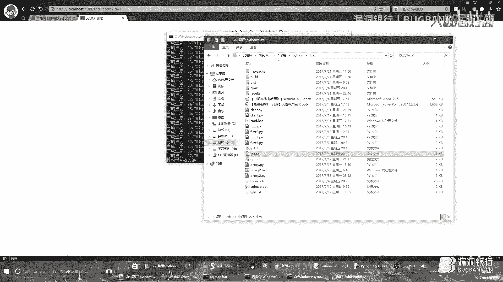

这个clear脚本，很简单，就是访问这个战场之侠。

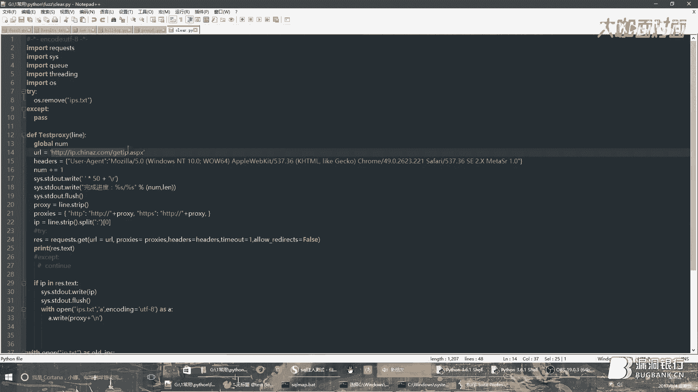

战场，我也不知道叫什么，战场工具，然后它会返回你的IP，我们就通过这个来验证，是否真实有效的，可以使用这个IP来作为我们的HTTP代理，现在我们重开一遍，让它重新加载一遍。

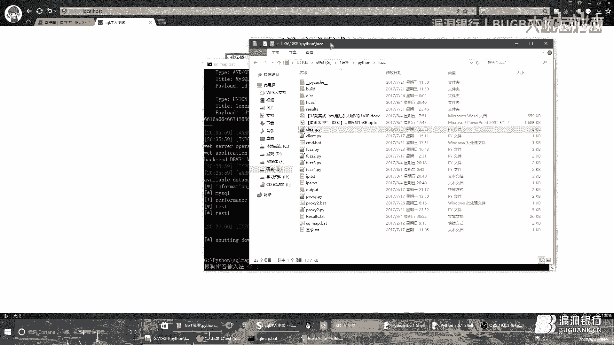

OK，我来简单介绍一下这个IP代理时的过程。

一个站点目标站点，你直接用测试马步直接跑的话，就算它没有防诸入功能，它也会经常出现这种拦截界面，就是你的IP已经被办掉，被加入黑名单，或者访问频率过快之类的，接下来我们使用代理时，IP代理时。

这是打包好的，直接用EXE，就它直接放到DOS里面，直接运行就可以了，然后CMAP的命令很简单，就在后面加一个代理，然后本机的999端口即可，然后接下来就可以看到，这里是成功的输入到了。

这之前IP仍然被拦截，但是接下来已经成功注入了，可以看到这个时差，这是11点41，然后这里是11点36，在我们的成功注入之后的5分钟，我们的IP仍然被办着，接下来就使用一个在线的模拟，模拟实战演练。

感谢漏洞银行提供的这款服务器，是阿里云的，正好所以我不需要在上面再加什么东西了，注入是可以注入的，但是它有一个问题，就是它限制了访问频率，可以看到这里直接连不上了，我再刷新一遍，它应该会抛掉我的请求。

这里是换层，打开另外一个浏览器，可以看到这里是已经连不上了，它已经把我们的IP给办掉了，我清一下换层，可以看到是连不上了，这只是一个假象。

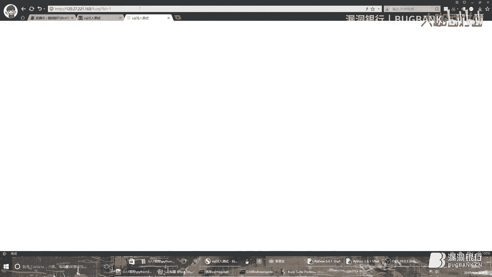

接下来我们使用这个工具，只需要在后面加上代理参数，等于http，打错字了，收藏，代理上，可以看到这里已经起反应了，这就是已经使用上了，看着这每一步都有条顾问的进行着，开始检测到了是MySQL数据库。

这里稍微需要等一会，因为这个是我设置的是一个请求，就更换一次IP，所以它这需要等待代理服务器的响应，怎么都开始玩XSS了。

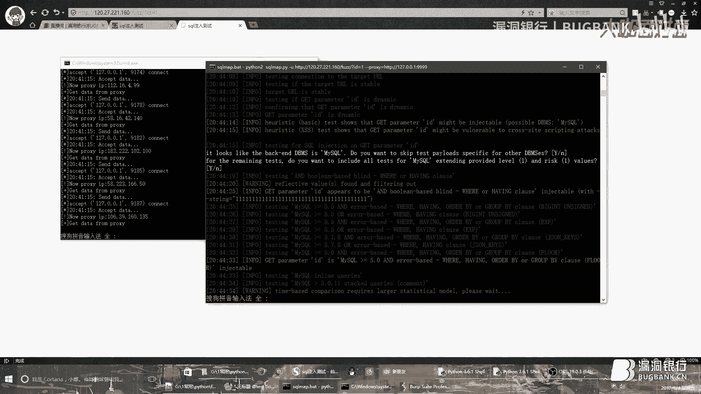

怎么发给自己。

我再来给你们解释一下，反正现在显着也是显着，这个实现其实特别简单，这有张图，这是你的SQLMAP，你代理上之后，其实这个中转工具，其实就是一个本机的一个转发服务器，我也说不清，就是一个中转服务器。

将你的所有流量请求通过代理，然后将你的数据包发送给中转服务器，这个中转服务器将你的数据包，发送给代理服务器，然后从代理服务器那里访问到你的目标，然后站点返回给代理服务器。

代理服务器再返回给你的中转服务器，你的中转服务器再发送给你的SQLMAP，这样你的SQLMAP就像正常使用一样，可以看到现在已经在查这个，列了，没有一个红标目前，之前测试的时候是经常出红标的。

果不其然出来了，这个就是代理服务器不行，不给你，这就是所以我需要一些质量好一点的IP，我之前使用的，我现在使用的都是一些自己爬去的，自己去爬的一些免费IP。

所以质量层次不齐，可以看到现在还是访问不到这个URL。

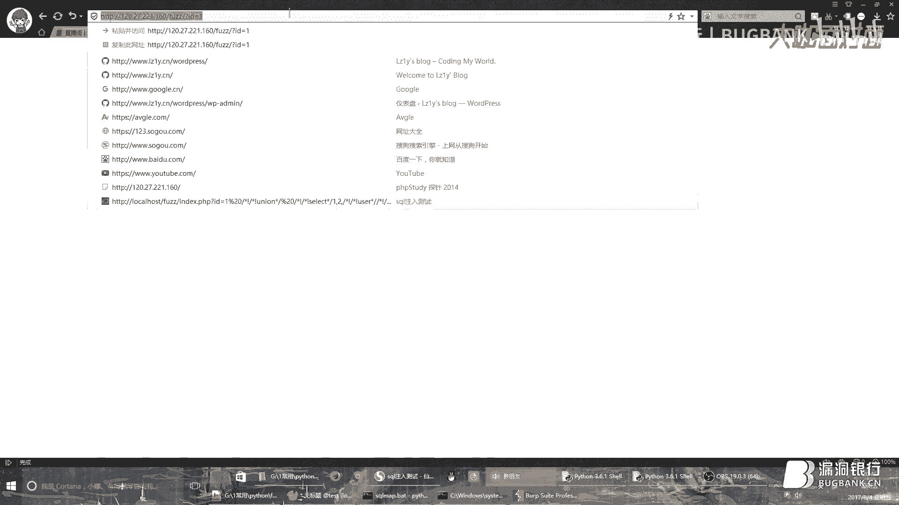

阿里云就是这么安全，这只要稍微等一会。

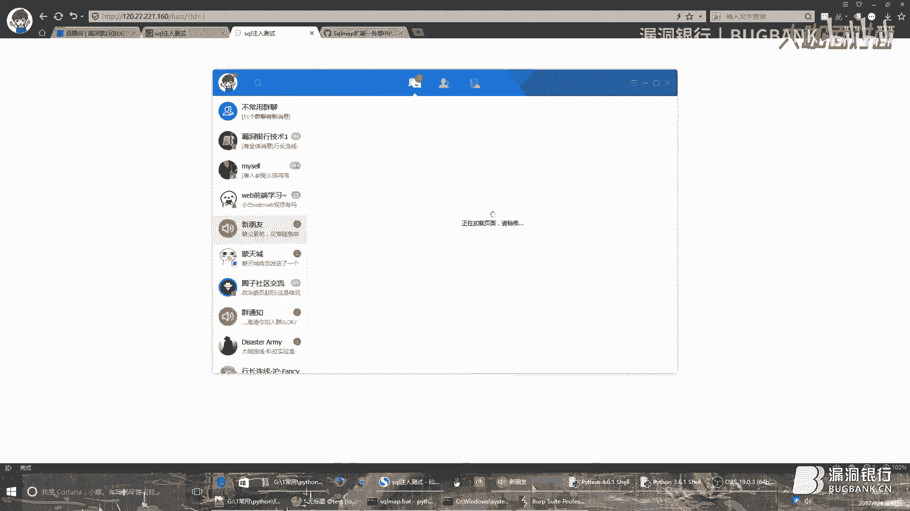

根据我的记忆的话，之前没几次都是这样子，等个几分钟的话，它就会给你弹出可用的助攻方式，再转过头来看一下之前的复制脚本。

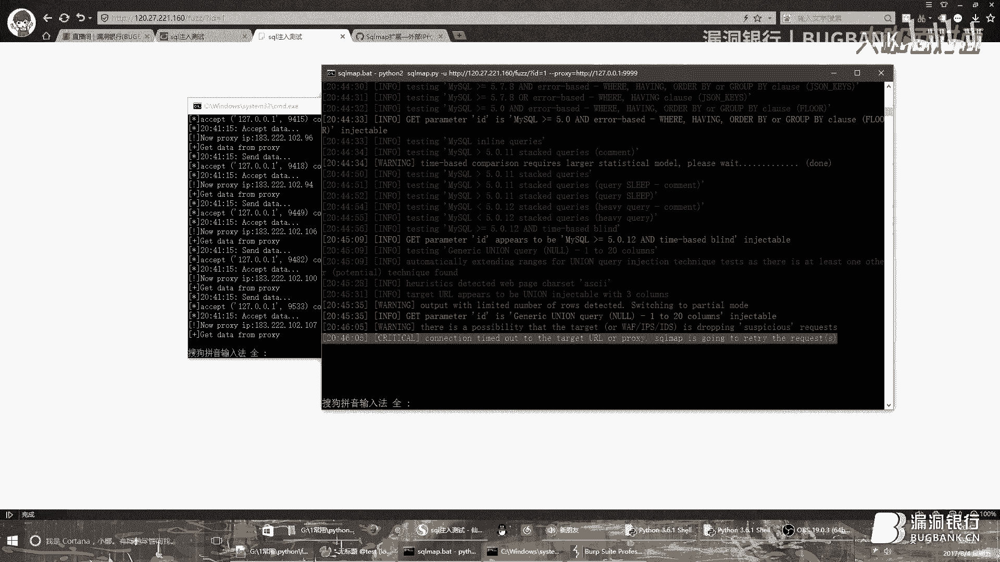

这根据我之前给大家介绍的那些技术知识，其实就已经绝对够用了，就可以已经够我们编写出这样一款，本地FAST的脚本，脚本的方式是十分简单的，这里对这里我要说一下，这里我使用的是5次地规，不是什么5次地规。

这里使用的是5次嵌套循环，在如果有能力的小伙伴可以把它改成地规，就是一次地夹，从嵌套一层到嵌套两层到嵌套三层，一直嵌套到N层，当然那样子也会耗很多时间，但那会不会可以把所谓的可能性全部都给列举出来。

然后还有就是这个FAST的地方，不仅这里可以FAST，你可以把这里的列联给去掉，这就变成FAST括号了，就是检测到什么东西可以替换括号，然后也顺便绕开那个政策，其实这个是十分灵活的一个地方。

这就需要你们自己去想象了。

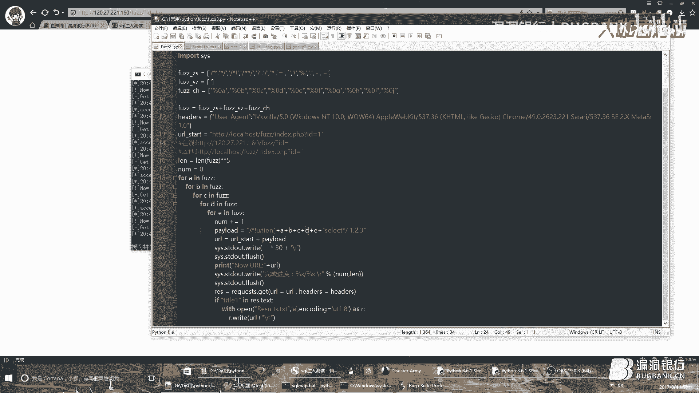

可以看到这里已经是检测出了ID这个参数是有价值的，我们选择NO，可以看到这里同样也是把所谓的可能都给列举出来了，同样也是布尔蒙诸，然后暴走诸，岩石诸和联合差群，这跟本期测试上的效果是一模一样的。

所以实战的话只需要打开这个工具，打开这个代理小工具，也就是服务器的这个，什么服务器，SQLMAP的拓展池，然后再加上TMP，差不多这一句，这一长串命令，就可以无视当前所有开着某软WAP的网站的注入点了。

这就可以通杀，算了不说了，通杀当前某流行的软WAP。

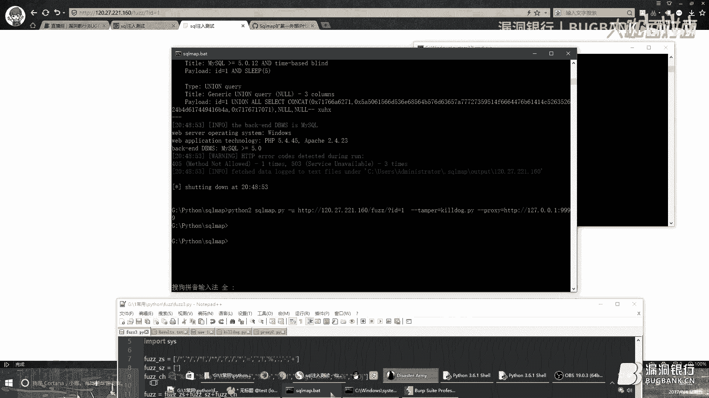

OK，好，本次的议题分享，内容大致就是这么多，感谢各位小伙伴的倾听，谢谢，好勒，我觉得Vimen今天讲的特别旁。

就是干货特别多，然后小伙伴肯定也准备了很多问题在等你。

所以下面就先进我们的网站问答环节，小伙伴们可以将聊天室切换到问答区的板块，然后发出你的问题，我们这个环节大概会持续15分钟左右，大家需要抓紧时间提问，然后也麻烦大家开切到问答区板块。

然后浏览一下大家的提问，现在开始回答问题，我看一下，有问题的小伙伴可以来问一下，虽然这次议题十分简单，但是可扩展的部分还是非常多的，好久没更新，是的，好像是今年4月份，就没有，如果不是的话。

这多的是，你就自己本机测试，测试出了规则之后，再应用到实战当中，并不是让你直接去找别人的站点，然后进行这个发的测试。

这十分不好，也很容易暴露你自己的目的，而这不是一个好选择，应用WASF，这根没有研究过，这个不在调用AEGW，这个并不在本次的，讨论范围当中，怎么说呢，你这个也是可以实现的。

你觉得需要更改AEGW的payload，访问不了，在前面加个3W点就可以访问了，不收图，代理是自己写的，那些代理IP是自己去爬的，PPT有，等一下搞活动弄完之后，小姐姐们会整理完了发送群。

发自过程中如何构造初始的语句，从哪个点开始，这我之前有说过。

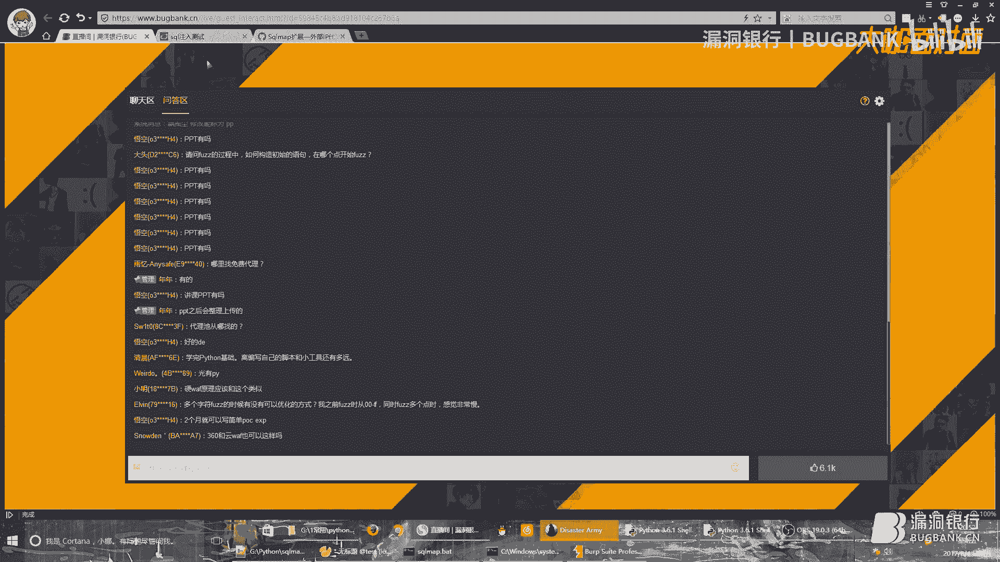

语句你需要先去发自，你对应的防护产品，它有哪些比较敏感的点，然后比如，你看我就算后面不加前面不加任何东西，后面也不加任何东西，只要有这两个单词组合在一起，它会立马给你拦截，这是它的敏感点。

我们就利用敏感点来构造语句。

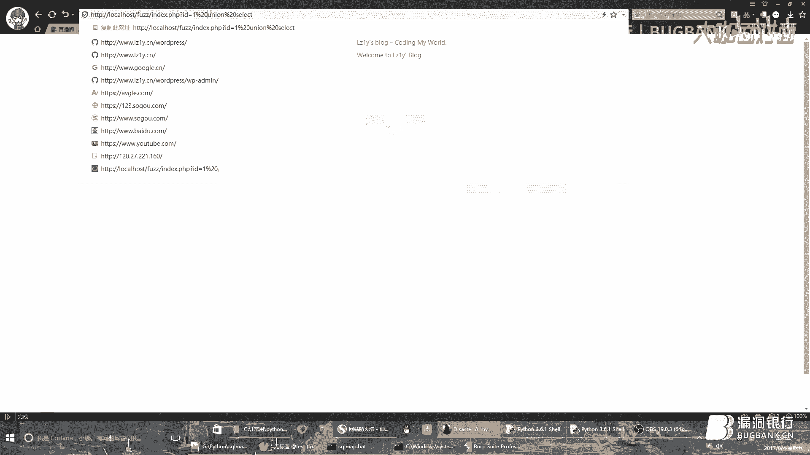

从哪个点开始发，这个就需要靠你自己的想法，我是发自。

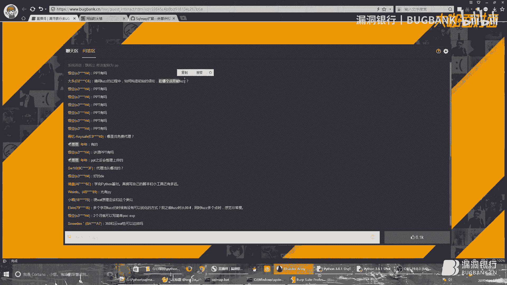

我这个思路其实也是通过网上学起来的，我就是发自内联注释，你其实有一个更暴力的，就是，你直接包括空格其实也可以，就用一些特殊的字符串来替换空格，以达到绕过这个webapp。

学完python基础你自己，一晚上的时间，我python是两个月之前学的，我接触信息安全，我都有点不好意思说自己接触信息安全圈子，我觉得这家是圈外人，也才六七个月，我python总共学完。

学好到现在估计只过了一个月，我在可以看我博客上面记录了。

我这个时间点，我这是在6月份快放暑假之前，我还不会用python的爬虫，但是现在已经差不多掌握了爬虫了。

这个其实也是爬虫的一种，inwaf那就需要自己去测试了，我没有什么我没有遇到，我渗透测试的经验比较少，没有遇到什么inwaf，多个字符发字的时候有没有，这肯定我之前说了，这个就需要根据你的经验来了。

你优化字符串的长度，列表长度的时候，需要靠自己的经验来发，同时发的多个点，你可以利用多线程，python多线程不太好用，你可以使用其他语言来达到效果，就用多线程来实现就可以了。

python这款语言本来就特别慢，对两个月就可以写起来的，poc啥批批量各种东西都可以写了，所以我挺喜欢的，这个呢，这个需要你自己去测试，我也不好说，这个我经过我测试是不行的，代理池的话可以搭建。

这个搭建的话各有各的办法，这环境不同条件不同，需要自己去发展，你可以用工具去，这个文章密码在PPT里面有，我现在告诉大家也可以，就是fuzd，就是那个文章的密码，对这个代理免费的。

你用爬虫去爬一下就行了，但是这里面我之前使用过了，质量是十分堪忧，十分之差，几乎是没什么用的，如何找到看文章，这个只能说是看文章，这个没什么特别好的经验，多去看那些代码审计的，我觉得代码审计那个区域。

算是这个圈子里面最有干货的部分了，因为知道原理才有办法去攻克问题，对啊，fuzz速度是和网站速度有问题，所以建议是在直接在本机，本机上面处理URL速度是肯定是特别快的，你可以看到我刚刚那个，我的。

我CPU是，i5 4590，现在这个时间段来说，这块CPU算是比较老土的，比较垃圾的了，但是还是一秒钟100个请求的处理速度，还是比较快的，API接口，这应该是。

是CircuitMap API还是代理式的，手工识别WARF，这个问题有点尴尬，这还是用工具吧，或者他有一些特殊指纹，学Python之前是有其他语言技术，大学生嘛，C语言肯定是必须的。

但我C语言学得特别烂，还有Java，Java学得还行吧，Q可以加，你看我头像，看我头像知道我是哪个QQ了，补课地址，补课地址。

我这是香港服务器，所以访问起来速度可能有点慢，它比较便宜也比较安全，很希望那些喜欢分享知识，喜欢学习的小伙伴，事后可以加入QQ一起来讨论一下。

带领的工具在我博客上面，自己去翻一下，Post注入多个参数，你这sql注入的基础有点差，你自己去行使一下吧，就多个参数无所谓嘛，这绕不绕过方法也不是一样的吧，你到时候要写发辞脚本的话，你把那个。

request的方法从get改成post就可以了，遇到狗就杀，狗遇到斜杠，这是管理员自己加的规则吧，怎么说的这个规则很单纯很单纯，这管理员，这肯定是会影响到业务的，你想看吗，OK。

没有没有没有总共就两篇有密码，两个都是辞职，因为是从别人那里学来的，所以不好意思发出来，不好意思声明是自己的，只是记录一下而已，这篇文章可以看到里面有游文人地址，这都是之前的前人发现的一些东西。

我只是站在了前人的身上，站在他们努力上，我玩的不多，都是一些很简单小项目，所以不好意思放上去，我也觉得你这拦截这个斜杠是没道理，我觉得是没有道理的，有什么不会的，本次分享时间，本次问答时间只有15分钟。

有什么不会的，之后加QQ可以，讨论一下，如果太过简单的话，希望你们还是自己解决，现在还是有几分钟评论时间，这么好的机会怎么可以放过大家看呢，对不对，想要帮我抓点时间评论，时间延时注入。

这个有一个比较好的字式，就是DNS log，这个具体可以百度一下，也有不少的平台，脚本可以分享学习吗，我博客都有，密码刚刚也发出来了，你可以去我博客看一下了，PPT当中有我博客的URL以及密码。

Oracle这款数据库我遇到的真的比较少，因为这一款大多是那种大项目大工程采用的，也就是内网中遇到比较多，我没见过哪个，总之我在拱网上面遇到Oracle比较少，理论上是可以的，因为可以用这样的方法。

但是不能用同样的语句，因为他们都拦截的方法，那个规则都是不一样的，你自己去测试就行了，遇到的比较少，但这一款很厉害，我本地写webshare都用它的webshare查查工具，来测试。

我觉得应该跟webshare的规则差不多吧，我觉得你可以本期下一个主机位置来测试一下，我试过了，目前没有什么好的解决方法，但是这种方式是很灵活。

很容易变通的，这个靠自己的思路。

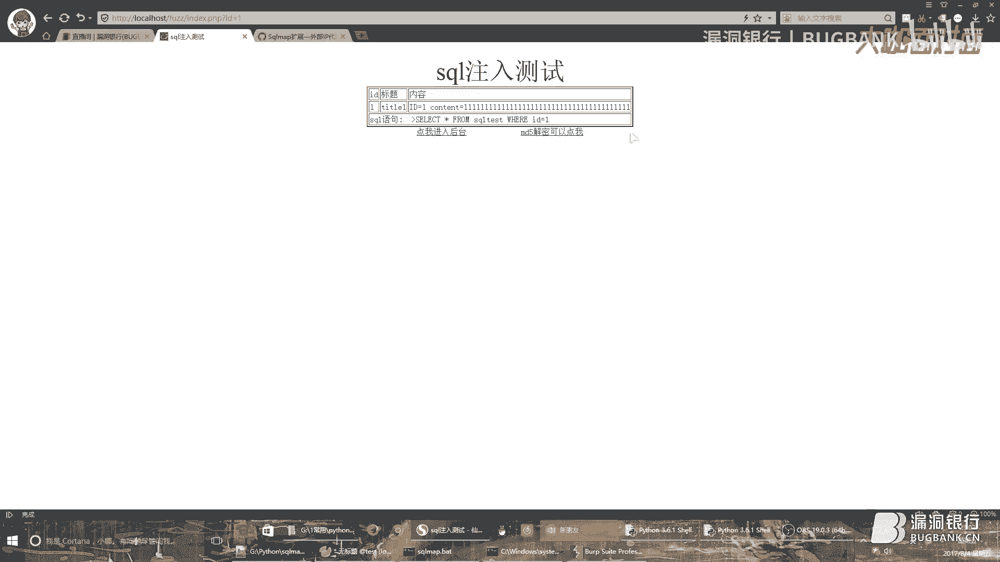

我不靠老鼠怎么实现的。

点这个小角落点一下，它会跳转，跳转到这个页面。

然后你接下来就懂了，不多说，有一个wav改变手动，有一个wav改变手动，改变URL就会，这是个什么操作，手动改URL就会连接，那算是完了，这应该是误会了吧，我觉得应该不存在这种问题，谢谢这位同学分享。

我到时候去看一下，因为最近这个方式也是比较火的，这个fuzz是非常火热的，以后有可能的话，估计以后就是机器对抗机器了，人为的影响是越来越少了，以后的下一代wav产品，肯定是机器学习为主题的。

问答会间还有最后两分钟，再来两分钟时间提问，好如果没有问题的话，我们就提前进入下一个环节，我觉得没问题，肯定是我讲的太清楚了，所以大家都没什么疑问，就是你讲的太清楚了吗，对是的，开玩笑。

因为这个知识很基础，这个知识比较基础，我觉得群里的各位大牛，肯定是看一眼就懂的，就是你讲的好，一点就通还要点，是的，谢谢，感觉大家也没有什么问题了，那我们今天晚上行长问答环节就先到这里。

然后如果还有疑问的话，可以在讲座之后到漏洞银行进入社群，继续探讨和交流，你可以去加一下大家的QQ，那下面就又到了被认真听讲的小伙伴，献上福利的时候了，今晚的大咖赠书是一本Pattern黑帽子。

不知道哪位小伙伴会有幸成为这本书的主人，那有请Lina大咖选出一位你最有远缘的小伙伴，然后告诉我他的ID，我来看一下，这个小伙伴是肯定不能给的，就这一位小伙伴吧，叫做ELVIN。

我喜欢这种这种时间过的小伙伴，看得出来他是肯定有操作过，因为我们今天赠书环节之后，后面还有一个给大家分享干货的一个小环节，所以大家不要先忙着走，我们一会会有满满干货分享，好吧。

那恭喜这位ID为ELVIN的小伙伴成为今晚的幸运观众，将获得由大咖Vinner送出的Pattern黑帽子一本，然后请注意听哦，请你按照推特标记码上发出的格式，然后将信息发送到聊天框内。

然后我们会在后续联系你给你寄书，还要注意一下这个方框号是英文的，那现在就到了给大家放福利的时候了，我是什么呢，来看看这对表姐给大家发出的技术链接，相信会对你的经济成长带来非常不错的帮助。

推特标记给大家分享了，Black Hat 2016最新资料的下载，还有Dapcom最新资料的下载，最后放出的是我们的Skills页面，真的是非常多的干货，大家可以去看一下。

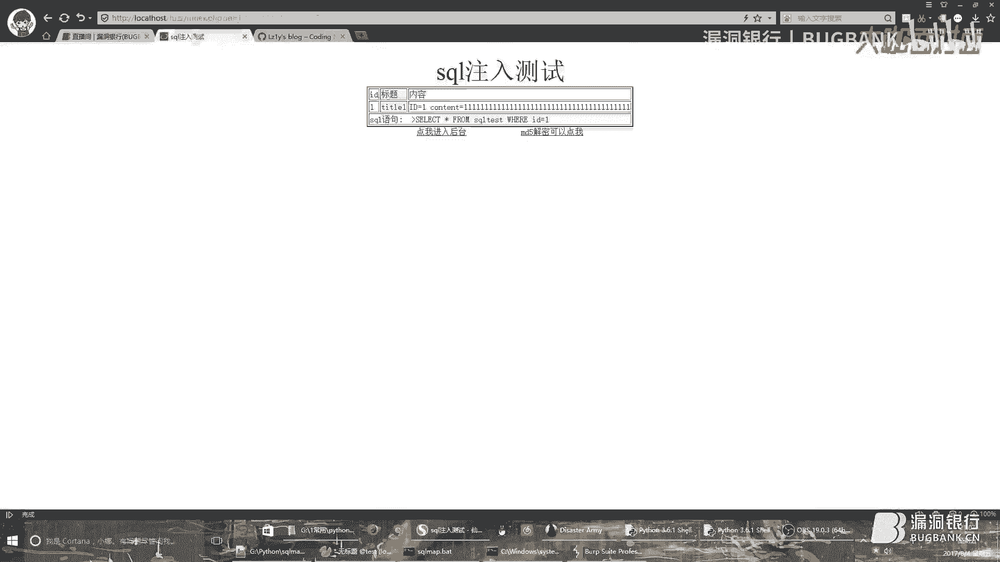

那本期的大方便面就到这里结束啦，非常感谢Vinner的分享，也感谢小伙伴们持续的关注，那活动之后依旧期待大家给我们提出改进的建议，我们会不断的优化提供更好的体验。

大家可以到技术群里面去点击一下我们的问卷链接，给我们提出更多的反馈，也希望大家今晚有所收获，再次预告一下，下一周我会带大家查是车王清玄，同样也是干货满满，我们下周五同一时间。

漏洞银行大方便面的直播间不见不散吧，(字幕：SnoW°笨兔)，(字幕：SnoW°笨兔)，(字幕：SnoW°笨兔)，(字幕：SnoW°笨兔)，(字幕：SnoW°笨兔)，(字幕：SnoW°笨兔)，(字幕：

SnoW°笨兔)，(雷聲)。

* 看视频关铃，也许这里有误会，有人在看视频。