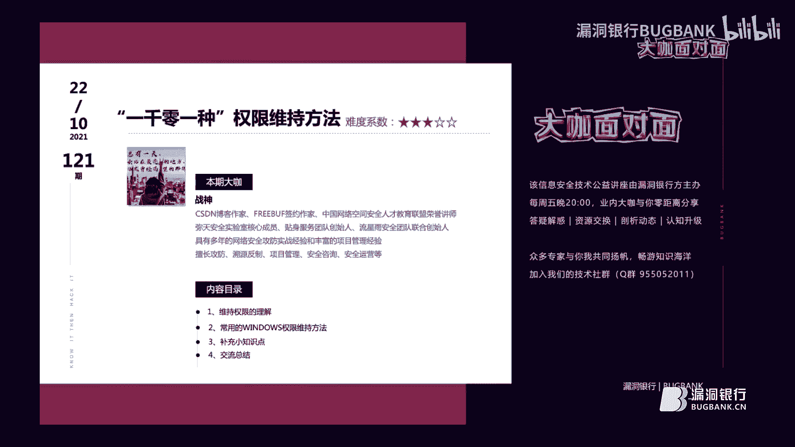
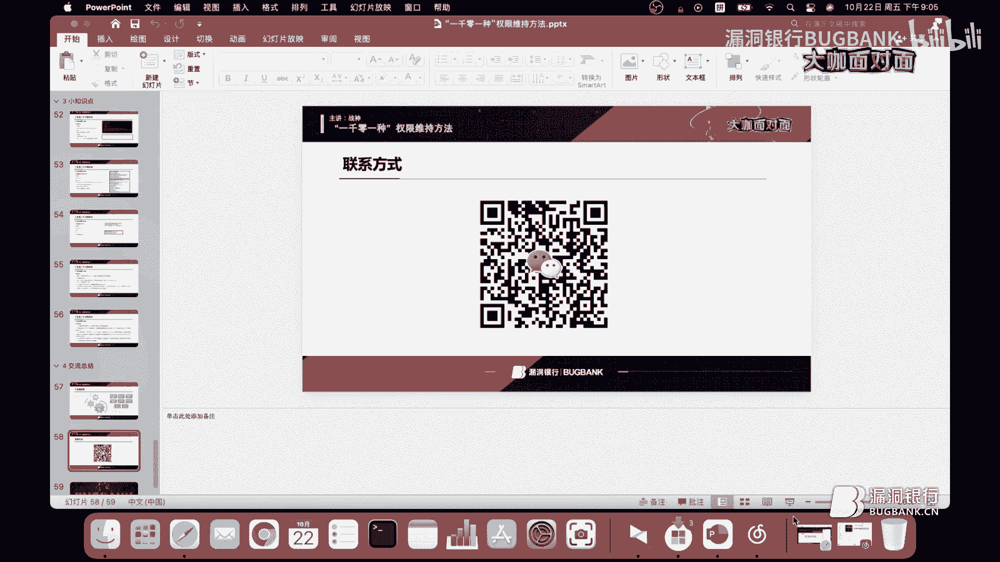
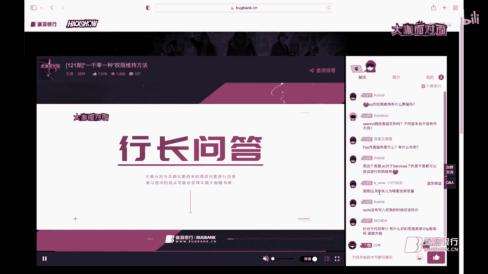

# 漏洞银行丨“一千零一种”权限维持方法-战神丨大咖面对面121期 - P1：【发布】“一千零一种”权限维持方法-战神-大咖面对面121期_x264 - 漏洞银行BUGBANK - BV18u411o7cQ

(電視機中)，為知識而存，應技術而生。

各位小夥伴們，大家晚上好，歡迎參加第121期，漏洞銀行安全技術直播，大咖面對面，我是今晚的主持人BENZIE，今晚要給大家做技術分享的大咖，是來自於明天安全實驗室的核心成員，他又在CSDN。

又是一個非常有名的博客作家，然後他同時又是Fuelbuff的簽約作家，戰神，今天我們有幸邀請到他來咖面做客，這次他分享的議題是，1001種權限維持方法，感興趣的表哥可要做好筆記，聽到最後哦。

同時歡迎各位小夥伴們，登錄直播間在聊天區進行交流互動，聽講過程中有任何疑問，都可以隨時在聊天區裡提出，該演講完畢後，大咖會在行長問答環節，集中接待小夥伴的疑問，同時今晚的聽講福利，也將在問答環節結束後。

挑選一名幸運觀眾，送出由戰神大咖，親自挑選的書籍，數據安全，架構設計與實戰，那下面就有請我們的，戰神大咖開始今天的直播分享吧，好的謝謝，謝謝表姐的介紹，那麼今天呢，由我給大家講。

1001種權限維持的方法，今天的這個題目，這個題目呢涉及到的內容，相對較多一些，我可能講的時間，可能會稍微長一點，請各位表哥，各位小夥伴多擔待，那麼今天非常，感謝呢漏洞銀行表姐邀請，讓我能夠有幸。

來到咱們漏洞銀行進行知識分享，首先呢，我先自我介紹一下，雖然剛才呢，表姐已經進行了自我介紹，但是我還是覺得，我自我介紹一下比較好一點，我是戰神，我之前呢是明天實驗室的，然後來呢也是有自己的CSDN博客。

以及FreeBuff有相應的文章，同時呢和FreeBuff也，進行了簽約，寫了相關的一些文章啊，方便大家這個閱讀，還是一些這個，網絡安全人才教育中心的一個榮譽講師吧，從事了一些比較長時間的。

網絡工坊的一些工作，有一定的這個知識經驗，目前呢，主要工作一些，項目管理啊，工坊一類的一些工作，那麼今天呢，尤其呢今天講的一些內容呢，適合於一些剛入門的小夥伴，或者說有一定基礎的一些小夥伴。

能夠方便大家在日常的滲透過程當中呢，用這些在後滲透階段，尤其是在後滲透階段呢，是非常實用的，那麼下面呢，我將從以下幾個部分。

進行依次介紹，那麼我會從以下幾個方面呢，進行介紹，首先是權限維持方面，那麼權限維持呢，大家可能在很多年前吧，像一些軟件啊，有些某軟件啊，被計算機一些安全專家啊，他可能會發現，為什麼要發現呢。

他是在用戶電腦上，他會設計一些後門啊，那後門一些功能啊，方便那個最所謂的功能，就是所謂的一些驅動程序啊，那麼通過這些驅動程序呢，啊，就變成了實際的後門程序，那麼這樣呢，黑客利用這些程序呢，啊。

驅動後門程序呢，能夠就是任意執行啊，任意木馬啊，去刪可以修改或者是或者說刪除用戶的啊，一些正常文件，那像wordpress啊，博客的一些管理軟件啊，還有就是facebook啊，一些公司的一些後門事件啊。

那麼就是黑客呢，他是就是利用他自己的啊，工具啊，或者寫一些腳本啊，等一些方式呢，去獲取到嗯，一些這個像比如facebook啊，公司啊，的用戶賬戶啊，那上像之前18年之後呢，也是有一些這個後門，不過呢。

不過呢，這個呢，後門就是啊，就後門的第三第三方呢，像這個啊，facebook公司呢，他授權了工作人員啊，像是去然後呢，去管理這些這個用戶信息啊，就是做到了一個控制啊，那麼去做了一個控制啊。

就是因為當時呢，一些嗯，黑客攻擊者呢，他就是，在這上面呢，進行了做了一個後門一些這個操作啊，那去經常呢，根據自己的需要去獲取啊，像一些用戶賬戶信息啊，或者說是一些數據庫類數據庫裡邊一些信息啊。

那麼就是方便他們做一些啊，壞事啊，那麼今天呢，給大家講到這個缺陷維持呢，和這個類似啊，類似就是但是呢，也是嗯，在其中的一種吧，算是其中一種方式，那這我今天講的一些內容呢，像缺陷維持這塊呢，啊。

偏向於windows相對多一些啊，這比較一些常用的一些缺陷維持手法啊，給大家進行講解一下啊，便於呢，大家日後是能夠更加深入的學習，後面呢，會進行補充一個小小的知識點啊，知識點呢。

講到後邊大家會能夠就是知道的，那麼後邊呢，最後呢，就是進行了這個交流一些總結一些，我之前啊，就是講過一些內容啊，進行這個匯總，首先呢，我們在滲透過程當中呢，啊，通過這個漏洞啊，獲取到目標權限主機之後呢。

往往會就是因為服務器管理員發現或者說啊，修補漏洞的時候呢，導致了對服務器的權限丟失，所以呢，我們權限維持的時候呢，就顯得非常的重要了，像比如一些這個做持久化呀，或者說權限維持啊，或者持久化注入呀。

持久化觸發呀等等啊，都需要做權限維持，不管怎樣啊，都要做我們所說的權限維持的，那麼像持久化這個概念呢，是就是在咱們攻擊過程當中的啊，也是比較重要的環節啊，像攻擊者呀，利用各種的技術啊。

確保所以軟件能夠在這個系統上能夠駐留時間比較長啊，就是不會不會發現啊，能夠便於我們實施的啊，就是獲取獲取我們需要輸出的數據呀，或者說用我們獲得獲得的，我們是要獲取我們所需要信息啊，那麼在這個持久化上呢。

他還分為了注入和觸發的這麼兩個部分，有的呢，像嗯有的方法呢，像豬呢，他就是需要植入啊，植入一些惡意的披露的呀，我們常見的有進程注入啊，像EXE的注入以及動態鏈注入啊，就是帶要的注入啊，還有像類似於啊。

腳本注入等等這樣的方式呢，就統稱啊，統稱為一些這個持久化注入，像持久化觸發這塊呢，將類似於啊，可能今天會講到一些這個啊，增加的自啟動啊，自己動向啊，服務啊，計劃任務啊。

等等的統稱為一些持久化觸發的這麼一個方式，不管怎麼說啊，總而言之呢，他其實主要目的就是我們只要目標嗎，沒有發現我們攻擊行為啊，能夠長時間的保持著對目標的控制啊，能夠做到全新的維持，你比如說有啊。

像一些這個惡意的紅軟件啊，他也能就是去做一個惡意的這個軟件傳播，並能夠利用有效的技術啊，去嗯，去通過我們的一個工具手段獲取到我們的這個信息，接下來呢，我我講一個這個用登錄用登錄這塊的一些知識，像在用戶。

我們一般情況下，像我們作為一個攻擊者，我們獲取到我們社交之後呢，啊，先是去判斷當前的用戶啊，獲取他的一些啊，日日內的一些信息啊，如果說存在一些啊，日的日日機器啊，日帳戶啊，等等。

我們去做運那些收集的時候呢，我們去確實需要一定的這個權限維持，那麼在這塊呢，像啊，用戶登錄這塊呢，像我這裡提到的這個用戶登錄的一個促使化後門呢，前提條件呢，必須得啊，因為硬他是一個他呢。

像因為硬碰的是操作系統的一個關鍵進程，在用戶登錄時候呢，進行一個促使化設置，其中呢，像我們提到的文龍跟進程進行執行一定的那個登錄腳本的時候呢，我們需要去修改啊，因為硬的值來加在我們想要執行的程序啊。

我們這樣呢，我們像在現在這個註冊表當中呢，像在註冊表當中呢，他就有文樓跟所對應的這個目錄下邊啊，有相應的去修改的位置，那麼像在溫度溫冷的目錄下呢，他是有兩種方式的啊，這兩種方式呢。

進行用戶登錄登錄後的一個初始化的後門設置啊，一種的是我們現在進行的這個，註冊表修改另一種是拋銷進行的操作，那麼說到第一種方法呢，我們啊需要我們進行這個遠程控制控制的時候呢，我們必須啊，像這塊呢。

必須拿到一個高權限的賬戶，所以我們在正常情況下，我們當我們獲取到我們社交之後呢，肯定基本情況下都是一個比較就是普通賬戶，那我們進行這個遠程控制的時候呢，就是普通賬戶，那我們先對普通賬戶進行提權。

那麼提權之後呢，在高權限賬戶下，然後再進行的遠程的目標主機進行控制，做一個權限維持的處理，那麼這裡呢，以計算機的這麼一個為例啊，加入了添加了這麼一個計算器的路徑，修改後呢，我們重啟登錄到桌面上啊。

可以呢在右邊呢，我們可以看到這個路徑啊，已經錄進圖，然後啊，我這裡呢，截了一個就是溫漆的溫漆的這麼一個，溫氣的這麼一個操作系統上的一個截圖，然後去對他進行控制，然後我們可以看到彈出了計算器啊，如果呢。

我們需要保持木馬文件則會執行呢，我們可以在這個位置進行換成我們已經上傳到已經上傳到這個溫氣的操作系統上啊，然後去執行他像用matter supply，或者說用CS進行遠程控制即可。

那麼還有就是PowerShell啊，剛才說的PowerShell的這個很強大啊，我們可以利用他呢，進行對註冊表修改啊，也是在這裡呢，我是也是需要一個matter provider的這個Shell啊。

需要拿到這麼一個高前線的，然後去通過執行ECO的命令去推推動就是插入我們想要執行的啊，代碼去進行執行，這裡呢，可以看開，可以看到，可以看到相應的這個內容，啊。

這裡解釋一下我們為什麼要使用這個ECO的命令啊，有時候呢，當你在測試的過程中啊，你會發現呢，這個PowerShell在像我們提到的MSF啊，matter supply這種回聯上啊，他是有一定的問題的。

導致了無法使無法能夠PowerShell去執行，看就是無法能執行這個PowerShell的限定命令，那我們呢，只能通過PowerShell。exe啊，這種可執行的文件呢，去加載這個程序程序呢。

去加載這個腳本去執行，那麼最後效果其實呢啊，是一樣的啊，我這裡呢，還提到了一個這個參數啊，這裡呢，提到這個參數，像我們說到的，這個這塊，那這塊像這塊啊，然後。

education policy bypass用於繞過這個權限的這個設置啊，如果呢，我在這個測試啊，或者工作當中呢，他遇到這麼情況啊，你如果是不加這個參數呢，他會可能就是可能呢，就執行失敗，哎。

有的時候呢，嗯，你也沒事，有的時候也沒事具體情況就可以跟就是但是呢，最好是加上吧，加上如果話，就會避免一些很多的又報錯信息啊，也有時候會顯示報錯提示啊，無權執行該腳本啊等一些這個。

接下來像Iron Key文件，這個來見快捷鍵方式的操作，一般情況下，我們就是將，一般呢，就是會放在硬盤上就是方便用戶快速利用啊，該文件呢，所對應的一個程序呢，分為兩種兩種形式，第一種呢。

就是為惡意的進程的創建一個快捷方式加入啟動程序，我們平時呢，像電腦上啊，像windows桌面上設置的，快捷方式啊，便於我們點擊圖片啊，直接到達我們所想要的這個位置。

那還就是利用我們當前用戶現有的一些快捷方式呢，去綁定惡意程序，我們執行的時候呢，他會去執行，其他的程序既能開啟原程序，又能執行惡意程序啊，比如像多年來就像攻擊的一些惡意惡意的。

像之前講的一些紅的一些例子呀，他只執行的就是類似的類似情況，像還有像二一二呀，或者壓縮向壓縮的一些進程呀，或者壓縮一些壓縮包呀，他有也有類似的命令，也有類似的功能啊，也能去你去執行的時候，他也會啊。

雖然說做了一個解壓縮，但是同時也會執行了啊，他綁定的木馬程序，然後進行全線的可知全線的這個持久化一些操作，然後方便黑客呢，及時的做，文件的就及時的做控制啊，或者說及時的獲取你操作系統的一些信息。

在快捷方式當中的還提供了一個比較強大一個工具吧，那麼這個工具呢，它是一款是弄當中的比較常用的一些常用的這個軟件啊，就能夠在溫度的系統中經常使用，由C+語言開發的這麼一款工具，但是這個使用這款工具呢。

有一點壞處，你必須得再按就是添加一個你所想要的，使用這個工具之前呢，必須得有點耐4。0啊，環境啊，就必須你得準備點耐的環境啊，否則呢，無法無法運行的，還有呢，你得去能夠調用的進程啊，然後調調程序啊。

進行這個3M的命令執行啊，然後呢，就是方便又以攻擊生命周期的各個階段一些任務吧啊，去進行操作啊，我這裡呢，去執行了啊，SharePolicyTel啊，然後呢，去執行了他所調用了一個3M的命令，然後呢。

添加了這麼一個路徑，像，計算機的路徑去進行執行的，然後呢，通過我們的執行之後呢，然後生成一個IE的瀏覽器啊，你可以就是IE瀏覽器啊，或者說其他瀏覽器都可以，像谷歌的也行啊，已經還只只要是在啊。

桌面上生成一個啊，你認為可以做到隱蔽的這麼一個瀏覽器啊，或者說快捷方式就行，然後將這些生成的快捷方式呢，放在其他紅目錄下啊，我們這樣的進行設置時候呢，去調用我們所想調用的程序。

了解了快捷方式的一個資助後門的這麼一個原理呢，他其實呢，就是為了，在IE瀏覽器上我們創造一個文件之後呢，加入一個啟動程序，不過呢，在像我們叫我們去那個系統上設置一個cfd命令按鈕啊，這樣呢。

才可能調用這樣的一個程序，這裡呢，我以谷歌為例啊，通過對谷歌瀏覽器呢，進行更改啊，在，C32下的目錄啊，進行這個cfd命令進行替換，這樣呢，我們替換為谷歌瀏覽器的程序所在路徑，這樣這樣呢。

就相當於將木馬啊和人和瀏覽器呢，進行偽裝在一起啊，這樣便於執行啊，做到這個隱蔽處理，還有呢，就是拋銷的一種方式啊，進行偽裝的處理執行，我們剛才所提到一些啊，拋銷一些命令啊，這裡呢。

也提到一個用拋銷的這個命令，然後去加上槓塞啊，然後去執行啊，因為我愛特爾嘛，然後所對應的我們谷歌的路徑啊，去掉再再去調用啊，木馬的一個程序啊，這裡呢，我以這個計算器的這麼一個為例，然後進行了一個操作。

接下來呢，是利用現有的服務維權啊，我們在這個情況下呢，當你獲取到事後之後呢，修改系統上的某些服務項達到一個控制效果，一般情況下呢，空供應者呢，是將A軟件的隱藏在服務器的位置上啊，通過呢。

我們去修改服務器上的某些權限，以達到這個高權限的目的，在我們實際的一個工作當中呢，我們經常會用到權限的維持一些方法，像這裡呢，我舉了三種，第一個呢，像在B路徑下啊，就像二進制的一個路徑下去進行修改啊。

那麼還有像影像路徑啊，以及這個失敗的命令，當然了，還有可能有其他的一些方式，在這裡呢，我講這在現有的服務的維權下有這麼幾種，我今天講這三種吧，第一個呢，是在B路徑下，我們通過啊，將服務器的執行的時候呢。

指向二進制文件的位置，我們這裡呢，可以使用IC的命令，像在控制面板上操作，就是在控制面板的這個操作這個管理上啊，我們這裡邊是像面板裡頭，他提供的一個是管理的工具，管理工具中提到一個服務項，那麼這塊呢。

我們可以通過IC的命令啊，去進行執行啊，去修改的，像這裡呢，他提到了IC的一些機種的功能，那麼機種功能中其中有幾個功能是比較常用的，像IC可以檢索和設置有關的服務的控制信息，執行可以使用IC。exe啊。

執行來執行測試啊，調試啊，服務程序的，那麼還有就是停止或者啟動服務上的某些功能啊，這樣呢，能夠調用我們木馬程序也可以能得到執行，可以創建批處理的文件來調用不同的IC命令啊，這樣的以色的自啟動啊。

或者說關閉服務的一些序列啊，也是能夠做到這麼一款功能的，當然了，像IC的命令，我們也可以在CS程序上面也可以進行一些相關操作，那麼不過呢，我們每次去使用這個B路徑下的，像現在有服務維權啊。

你必須得必須得需要這個bypass UAC啊，拿到C團們先權限，這樣呢，可以在服務器上進行創建，首先呢，就是需要你創建他的路徑，就IC通過，然後創建你所需要這個木馬的路徑，然後呢，對這個目標服務器呢。

開啟服務的進行上線，一般情況下呢，管理員呢，他會巡檢啊，這時呢，我們就是需要去偽造一個不易被察覺的一些名字啊，還要做到一個隱蔽後綴的一些處理啊，像我這裡提到的一個命令，大家也可以去嘗試使用，這樣呢。

我們在做這個隱蔽處理的時候，就是相對於啊，容易些啊，方便一些啊，雖然說啊，就是有可能會遇到這個，啊，有些就是我們可以改成比較相近的啊，相近的一些名字啊，像谷歌啊，我們可以改成谷歌點EXE啊。

或者說谷歌123。EXE，或者說改成只要是相近的，只要不易被發現的，那就行，接下來是傳真服務，我們一般情況下很少會用到傳真服務的這麼一個程序的，一般默認情況下，Windows是不會開啟的啊，如果需要呢。

我們可以自行開啟，這樣這裡呢，我們可以讓Manual Supply生成木馬文件，然後呢，去利用CMB命令讓傳真服務器啟動，在MS就是我們剛才說到的Metasploit，上面進行配置接聽呀。

然後觀察一個上線的一個情況啊，進行看處理一下，看一些這個回聯啊，能夠是否執行成功，但有時候像我這裡設置的，有時候他會出現一些執行失敗啊，這些這個效果啊，可能，可能會有些問題，就需要就是重複的去執行一些。

他就是重複的去執行啊，去重複的執行，這樣呢，我們在MS裡邊呢，就可能可以看到，那麼文件木馬上線之後呢，我們獲取到了系統權限，但是有時候呢，他會過段時間啊，或者說過一兩分鐘啊，或者說一分鐘啊。

你還沒有獲取到相應的信息的時候呢，他就直接啊，迫使你直接就下線了，這樣你在本來你可以拿到一個比較大一點的這個信息，或者說你可以拿到他的一個比較重要的文件的時候，在傳輸的過程過程當中呢，就出現了掉線啊。

對你的這個任務呀，相當的不利啊，對你的這個當前的一個操作也相當的不太好的一個現象，那也可以就是需要加入一些這個像F這樣的一個參數啊，這去做一個啊，穩定穩定處理就是需要去保持穩定的進程啊。

像服務有的時候呢，我們可能會遇到一些像網絡呀，我們就預測不到一些問題啊，那麼有有時候呢，還有需要啊，我們可能是人家被人家已經發現你了，或者說人家已經這個正好做了一個策略的修改啊啊，這樣呢。

你是沒法就獲取到這個補貨到這項相應的信息的啊，到時候我們可以就是具體分析具體的對待吧，之後呢，嗯，設置完馬路徑之後呢，調用本地的一些系統啊，我們就得像啊，我比這樣這樣的，然後去local呀。

localzterm呀，這樣呢，去調用本地的系統，然後我們在這邊呢，可以看到這樣呢，面對就能夠執行成功了，然後在在在我們想要的地方呢，去啊，屬性的地方呢，我們修改描述啊，描述成我們和就是傳真服啊。

一樣的一些啊字，然後做到這個隱蔽的一個處理，這裡呢，還有就是影像影像路徑啊，影像路徑其實啊就是印象劫持在字頭表當中呢，我們通常啊，包含了驅動程序啊，印象文件的一些路徑，使用任意可執行的文件的時候呢。

我們也劫持了相應的密鑰啊，將使用有效負責，這樣呢，可以就是啊，能夠負責有效的在這段時間能夠自動的啟動呀啊，這樣這裡呢，可以劫持像w32times呀，這麼一個服務啊，這樣呢，通過執行字表之中的一些命令。

然後進行調用這裡呢，我也用了這麼一個，MSF呀去進行了一個配置監聽啊，去做反彈失敗啊，這麼一個操作，然後呢，但是呢，在開啟就服務開啟的時候呢，啊，人需要一個高度前線，但是需要一些這個操作命令。

像IC configure w32times呀，這樣去讓他開啟自動化進行調用本地的系統，調用之後呢，我們獲取到是要呢，一樣啊，一樣就是獲取到他一些主機的一些信息呀，或者說服務器的一些信息呀。

然後便於我們之後的信息收集或者說內網內網遷移呀，內網移動啊等等，接下來是一個失敗的命令，那麼失敗命令，我們經常在啊，像執行CMD呀啊，執行CMD命令的時候，我們又就可以看到啊，我們這樣執行某個命令啊。

當沒有權限的時候，他也會報錯，啊，有是有的呢，就是沒有環境啊，依賴包也沒有了，或者說執行的時候出了一些啊，就自服錯誤一些錯誤呀等等，那麼具體來說呢，就是當服務中止的時候呢，可執行命令。

那麼控制註冊表中的一個失敗的命令呢，我們也是去需要去修改其中一些屬性，這裡呢，就是我們去在啊，恢復裡邊呢，去進行更改啊，像window time啊，這裡邊呢，去進行更改其中的屬性。

這樣也也能做到一個處理，做到一個像將木馬程序放在這個位置上，也可能做到一個回聯呀，或者說執行啊，做到隱蔽的一個處理，那麼這裡呢，假設啊，像攻擊者呢，他劫持了w32time啊，這麼一個服務，並且呢。

網絡管理員呢，他還會就是能夠監測到啊，監測到這麼一個服務啊，發現的已經被劫持了，那麼接下來呢，這個服務網絡管理員呢，他將服務呢，可以進程將關掉，那麼那麼為了我們這為了避免避免這樣的情況發生。

那我們就是可以將進程進行轉換轉換到其他其他進程上，其他的就是不易被察覺的一些進程上進行執行和操作就行，這裡呢，我們可以看到一個他能夠成功的執行上線，在ampliter裡邊呢，啊，也有相應的模塊。

我們可以進行這個處理，我們也需要設置監聽的地址啊，去監聽的服務啊，然後做這個，回聯，然後獲取到他的服務器的系統信息，那麼在屏幕保護當中的屏幕保護的一個程序當中呢，也是可以做操作的。

像屏幕的保護程序當中呢，有sr文件，他其實是一個可擴展的可執行文件，那麼通過sr實行程序執行啊，我們在註冊表的桌面目錄裡邊呢，去做一個修改，然後呢，我們在在屏幕保護程序當中呢，啊，屏幕保護程序當中呢。

還選擇對應的木馬木馬文件進行讓他執行啊，因為我們平時的時候一般啊，工作工作之後呢，哎，你要離開你的工位啊，或者說你的座位的時候呢，我們去需要啊，就需要更改嗯。

就是關閉關閉你電腦關閉你的電腦的時候做肯定是啊，你不可能把電腦關了，你肯定得需要啊，就是關關閉屏幕啊，關閉屏幕，我們做啊，就會出現屏幕保護的程序，他會去做執行啊，防止別人呢，去查看你的桌面上一些信息。

或者說操作你的電腦給你帶來一些影響，或者說給你帶來一些偷看你的一些信息的也不好的一個動作呀，那麼我們修改完啊，去修改了這個屏幕保護程序呢，也可以就是當時我剛才說了已經設置到設置一些惡意的程序啊。

修改屏幕保護一些狀態呀，啊，等等等這個時間啊，時間到了，或者說我們可以設置一個出發的時間啊，讓程序的自動能夠運行，然後呢，通過我們去修改註冊表的這個屏保的位置呢，這樣能夠就是觸發，去執行註冊表的命令啊。

我用red red add啊，將命令通過在CFD命令下，或者說你用管理員的這個權限，或者說管理員這個權限要拋銷，裡邊的拋銷裡邊啊，去做這個操作啊，比較容易一些啊，像red red一些命令。

CMD普通用戶一般很少能夠進行成功的，那麼這裡提到年之鑒，年之鑒呢是比較啊，比較常用的已經嗯啊，已經比較特別熟悉吧啊，這樣呢，我比較簡單的講一下這個啊，像年之鑒呢，他那不同版本的系統呢。

他年之鑒的使用他還是不一樣的啊，一般情況下，像在C32下啊，我們去將年之鑒的可知性文件啊，與CMD的這樣的可知性文件，或者說CMD的這個可知性的文件啊，我們進行替換啊，去替換之後呢，再進行一次執行啊。

不同的版本他是不一樣的，然後去按下五次shift啊，這樣我們就可以調出CMD的程序了，那還有就是替換之後呢，可能會發生一些執行不了程序，那麼只能進行的就是管理員的權限去操作了啊，有的呢。

得需要不同的版本呢，得需要將當前用戶呢，添加到管理員的組裡邊，對其進行，執行管理員這個權限去進行操作的，啊，然後再進行相應的命令啊，然後去按下五次shift啊，去進行操作。

然後反彈shell獲取到系統用戶的一些信息，再接下來呢，是影子賬戶的事情，那麼創建影子賬戶的目的呢，是為了持久的使用他啊，不易被管理員發現，也是為了我們後邊啊，也是能夠不停的去登錄呀。

或者說獲取到一些敏感的信息吧，那麼首先呢，也是需要通過命令的方式呢，那CMD命令的方式呢，去創建隱藏賬戶，那麼再讓他加入一些管理員組呀，但是有些人呢，但是有的時候呢，一些管理員組呢，是沒法常看到的。

不過我們在這裡邊，我們可以就是通過啊，用戶賬戶呀，啊，你做運維的時候呢，也就能夠看到你的就是當時啊，那麼做的一個操作啊，或者說張當時填的一個賬戶的一個時間啊，都能看到，但是如果如果我們將他的時間呀。

或者賬戶名呀，賬戶啊就是賬戶名字呀，更改了更改成他原有的啊，這樣我們就能夠做到一個，長時間作留的這麼一個操作，就是長時間的能夠獲取信息啊，以他的方式，以他的名字啊，以他的一個賬戶名啊啊。

能夠登錄到這個業務系統上，或者說操作服務器上進行獲取信息了，那麼需要就是打開自測表呢，進行修改，默認情況下呢，都是遊戲特美啊，管理員啊，才能修改的，所以呢，需要去修改權限啊。

我們還得需要一個比較高一點權限，能夠去執行該操作，然後呢，去進行重啟就可以了，那麼有的時候呢，嗯，還是要為了這個更加深入的隱藏，更加深入的隱藏，那麼我們就需要做權限處理之後呢，再重新啟動註冊表。

繼續查看我們所對應這裡提到一個啊，去查看看啊，F值呀，看根據那麼不同的F值呢，所對應的賬戶還是不一樣的啊，這裡呢，我們像admin的sweeter啊，他所定的賬戶值，他也是不一樣的，像Win7啊。

以及Test啊，以及這個來賓啊，賬戶他們所定的F值是不一樣的，我們根據修改不同的F值呢，去做一個克隆的一個處理，這樣呢，我們可以將啊，我們添加的Test值啊，改成啊，克隆變成Win7啊。

就是當前用戶啊的一個賬戶，那麼有時候有的時候呢，沒有啟動admin的賬戶，或者說啊，admin的sweeter賬戶呢啊，一直處於禁用狀態啊，平時呢，我們都是用Win7啊，或者說我們常用的用戶名啊。

做進行計算機管理，那所以呢，我們需要去複製啊，複製像這個F值啊，看能不能複製，能複製之後呢，然後對選擇合適的賬戶啊，我這裡呢，是以Test賬戶進行這個克隆的，然後呢，但是呢，他不是所有的嗯。

管理員賬戶啊，他都會有這樣的功能啊，所以呢，嗯，希望你就是嗯，一個一個去嘗試啊，嘗試能夠能夠替換，然後去做執行即可，然後呢，我這裡是用Test和Win7啊，Win7當前賬戶，然後進行啊，註冊了一些值啊。

進行更換更換替換之後呢啊，我就變成了，然後再去刪除啊，刪除，啊，去在Net user下，啊，CMD命令下去刪除或刪除我們所對應的這個Test賬戶啊，以及該賬戶的一些信息啊，然後再次將啊。

我們已經替換好的內容呢，進行處理即可，那就是這樣的，就是將註冊表一些值啊，信息替換好之後呢，進行替換之後，再重新導入註冊表當中呢啊，這樣我們就可能夠完成了這個影子賬戶的一個創建，然後再次呢，通過啊。

查看的一種像Net user，剛才我們提到的用賬戶啊，用戶賬戶一個管理啊，去查看到他這個界面裡頭啊，已經可以看到的是沒有該用戶的一些信息了，啊，之後呢，我們再次用使用Test去身份登錄。

會發現已經啊已經不存在該信息了，就是，就該賬戶就算開的賬戶已經消失了，我們當前只顯示我們鎖定的溫區賬戶的一些信息了，啊，這裡呢，又一個提到了個CR的一個啊，截持後門，那麼他呢，也是啊，用於啊。

用於什麼呢，對於這個我們在環境變量時候呢，去用一下，在環境修改環境變量的位置啊，去變，被用一下，他呢，就是運行在這個微軟的視窗操作系統上啊，我也是嗯，需要這個點那些程序啊，啟動那麼需要在註冊時候呢，啊。

為這個在註冊表註冊的時候呢，去設置成這個全局變量啊啊，不然呢，我們去執行的時候，在去執行的時候呢，在當前用戶啊，他只能是啊，在MD窗窗口下，我們執行執行完之後呢啊，你只能在當前用戶的時候使用別的用戶呢。

他不能使用，所以呢，你修改環境變量的時候改成這個全局的啊去全局的處理，這裡呢，也是用到了幾個在我們在三面臨下能夠去執行的一些命令，然後這樣去操作，然後去，做配置環境變量的一個處理，那麼就是在這裡呢。

去修改註冊表路徑就是在CRSID的目錄下啊，然後呢，去調用Dell文件進行操作執行，執行之後呢，我們再次刷新這個註冊表之後，我們就會發現啊，他的這個介質啊，已經存在了，然後呢，就像這裡呢，提到這個嗯。

我們就是設置環境變量的時候呢，啊，去設置1啊，或者說是零呀，不同的零或1啊，之前的更改那麼去向CRSID，然後去聯繫到這個探測器，這樣進行這個更改啊，操作便於我們做這個確定啊，我是否能夠執行成功。

然後呢，我像這裡呢，啊，先先命令像redd啊，然後去添加啊，我們所需要的這個Dell的文件啊，然後去執行啊，執行成功之後呢，就剛才看到的一些這個介質啊，就能存在了，我們在，註冊表當中呢。

就可以看到我們Dell的值啊，已經這個存在在CRSID的目錄下了，那像一般情況下呢，去就是剛才的情況呢，就是相相當於我們以Dell的一個木馬文件，通過MSF去設置成功，創建後門，之後呢。

開啟監聽進行系統啟動時，那麼他會自動去調用NAS的程序，那麼加上加載這個CRR，然後觸發後門在用戶的沒有登錄情況下啊，進行這個拿取獲取前線，這裡呢，你看一下這裡呢。

我提供了兩個一些這個大佬他們寫的一些BAT腳本啊，就是在沒有用戶管理員的權限下進行的，是332啊，64的，像NC呢，也是NC後門呢，比較常見啊，可能也大家也用的也也比較多了啊，像NC後門呢。

他也是在這裡呢，需要一個提前提前之後呢，獲取到一個高潛下啊，然後再去，像這塊在，在下午下呢，然後進行上傳NC，一般就上傳在像windows的話，我們上傳到C32，像Linux下可以上傳到TMP啊。

目錄下啊，這樣呢，方便執行，然後去這裡呢，像這塊32呢，然後去設置監聽啊，開啟端口，然後這樣呢，去調用CMD命令啊，就方便了，啊，我這裡呢，截了一個群眾的一個圖啊，然後去這裡呢。

通過Reddit去設置我們所要設置的，主要返回的一個NC的一個命令，那有些時候呢，他NC呢，並不能用一個高前線的維持啊，那麼那麼啊，有時候呢，我們就是share啊。

他像這個登記單位登錄用戶為share的時候啊，本地啊，或者本地啊，環境啊，預防鏈啊，他是都是有有效的，但是呢，像，預預防鏈呢，你得有預管一些賬號呀，或者說是可以到一個這樣呢。

我們可以得到一個預管的權限啊，但是我們會知道他相應學院他有時候呢，他也是不會，他有時候呢，他也是你得需要看關閉一些這個防護牆呀，防止他這個做策略，最後呢，就是重啟之後就就可以了。

當然還有當然還有像其他劫持像鏡像劫持啊，MSDTCR服務等等，大家可以後面可以自己的進行研究就行，接下來呢，是一個啊，readings方面一個補充的一個小的知識點吧，啊，能夠幫大家這個梳理一下啊。

常見像未受權呀啊，C要登錄呀，公司要這種登錄呀，寫webshare啊，計劃任務呀啊，默認基本情況下都是綁定6379的這麼一個端口，然後如果沒有進行這個先運策略呢，你這個添加防護牆的一些策略啊啊。

我們就像容易出現在未受權訪問啊，這樣呢，像ready服務啊，他會暴露在一公網上，像一般情況下沒有一些密碼啊，一些認證啊，他就會導致一些用戶在訪問目標服務器時候呢，出現未受權的啊。

讀取readies的數據呀，那麼像C要登錄呢，C要登錄呢，你寫入一個公要啊，這樣呢，然後呢，服務器的開放了一個SSH服務呀，同時呢，允許M1登錄啊，你這樣呢，寫入一個公要啊，這樣呢。

直接能夠遠程登錄到服務器，那麼還有就像webshare啊，寫去通過寫入一句話木馬呀，用菜刀啊，一些並接這樣的工具做連接啊，以及以下面提到的計劃任務計劃任務呢，能夠做一個反彈，是要啊。

我們可以通過設定RB batch呀，這樣的通過batch這樣的一個反彈，是要的一個命令啊，去做回聯的處理，這樣呢，能夠在一定時間內，然後做反彈，其實啊，只要是利用一些狂踏的SSK呀，我不需要啊。

這樣呢啊，他都是有一定的這個容錯性啊，那麼再加上狂踏吧，和SSH服務啊啊，可以說是啊，有一定的一個標準服務，那麼，嗯，那麼以前呢，都是通過這樣的一些方式去會到這個該該是要啊，一些方式的，那麼現在呢。

就是隨著一個現在的一個服務器部署啊，一些方式啊，他不斷發展啊，有些可能一些地方啊，一些出現了一些刀客啊，或者說其他一些部署模式啊，一些單一的他就是比較啊，單一的像部署啊。

release的也也也不是那麼常見了，包括SSH啊，狂踏啊，再加上一些像權限的嚴格控制啊啊，只要呢，寫文件的時候就比較很難的，或許的該是要了這種情況下，那麼就需要一些像比比如這個死童復制啊。

這樣的方式要模塊呢啊，去調用這個通過那麼像他release本身就是CBA寫的嗎，支持一些網絡啊，內存啊，基於內存存啊，等一些戒指隊的一個存儲數據庫的啊，那我們當我們在數據存儲一些數據的時候呢。

像一些單個的release的一些實例當中呢，像他的一個讀取內容啊，他比較多啊，這樣呢，我們服務器呢很難承受住他這樣的一個壓力，那麼這裡呢，提供了一個組成的模式，那麼組成模式呢。

就是通過使用release的實例作為一個主機啊，其調用其他的其他實例呢，作為一個備用機，那麼組成機的組成機的他的數據是相同的啊，那麼其中的重機只負責讀而主機呢，負責寫，通過呢，讀寫分離啊，這樣呢。

很大幅度的解決了這樣一個啊，像比如這個流量的一些壓力啊啊，等等啊，能這樣呢，能夠避免一些這個這個壓力的存在啊，這樣這裡呢，是通過一個我們像release啊，他是通過，share of啊。

可以調可以設置一個組成的一個狀態，他只有像是在SSH啊，狂探啊，以及這個webshell啊，無法的無法用的時候啊，我們可以考慮這樣的一個方式，然後去通過用啊。

soft off去設置為這個主要的一個工具啊，工具的一個狀態去進行調配啊，設置即可，還有像這個組成複製當中用到的ISO啊，為了ISO文件啊，去該秀，那麼也是可以去通過寫入C語言啊，C語言。

然後編譯加載惡意的ISO文件，這樣呢，能夠達到一個代碼執行的一個程序啊，那麼像這塊啊，我們提了一個像VBS上邊，我們可以就是搭建那個啊，開啟啊，開啟這個release服務啊，然後提供ISO的一個文件。

那麼經通過遠程加載去調用這個目標啊，目標的這個ISO文件進行命令執行，在右邊我們可以看到這個去做了啊，soft off做這個切斷，組成，然後關閉相應的功能啊，去執行系統命令，像C-Terms啊。

ESTC啊，或MIH去獲取到這個用戶的一些信息，然後一個這樣的一個方式，然後呢，和剛才一樣啊，那麼通過組成複製的一個方法呢，去調用這個shadow啊，去寫入這個shadow文件啊，也是一樣的。

那麼像shadow肯定是在像Linux下，肯定是ETC下的shadow啊，那麼我們進行這個shadow啊，然後設置shadow命令啊，然後用soft off啊。

然後添加我們所需要反彈的一個IP以及這個端口啊，這樣進行修改，這樣就可以做後面呢，做一個反彈shell的一個處理，最後呢，就是一些反序列化的這個這塊呢，像Redis服務器呢。

它也是我們無法寫入了該shell呢，但是我們它也是Redis數據呢，它也符合序列化特徵啊，那麼可以就是通過一些FileJson啊，GDK啊，Redis的反序列化啊，都可以就是通過反序列化的方式呢。

去引起Redis的一些數據啊，對Redis數據呢，做一些反序列化的處理啊，也這樣的一些方式去引起了一些漏洞，基本上好多的場景下呢，Redis裡面都存儲著各種各樣的一些序列化一些對象啊，數據啊等等。

比較常用的兩個這個場景呢，像第一個呢，就是Java的裡面呢，我們將用戶登錄後的一些Session啊，對象啊，那麼緩存起來，第二個呢，就是將一些查詢的數據啊，以序列化的方式序列化的方式呢。

到Redis裡面，Redis呢，它一般就是存儲在Java的一些序列化的對象當中，比較多像FileJson啊，GDK啊，的原生的一些序列化當中，這裡呢，我們像FileJson 1。2。24。

反序列化和Java反序列化呀，這樣呢，它會通過一些把惡意的序列化以自己買的方式呢，存儲進去啊，這樣呢，我們就會觸發了一些反序列化一些漏洞，這裡呢，啊，到這塊兒就基本上講講那種一講講差不多了。

那我們主要呢，是講到一些註冊表呀，啊，上面的一些支持，像因為說到一些Windows嘛，Windows上面的肯定是有一些註冊表的一些知識啊，他可能就是這種，因為講了這麼幾個方面吧，像用戶登錄初始化呀。

快捷方式呀，現有服務的維權呀，以及這個影子賬戶呀，還有，還有剛才比較常見一些年資件呀，以及NC等等，那麼後面呢，也是做了一個啊，補充吧，補充一個常見像Redis的數據庫，他可能涉及到的啊，哪些漏洞啊。

哪些漏洞呢，他有哪些知識點啊，可以我們能夠對其進行利用啊，攻擊啊，以及啊，後面還提到一個啊，反序列化的一些漏洞啊，反序列化呢，是比較，這幾年吧，或者說近幾年也是比較流行和大家比較常用的，像通過反序列化。

我能做到什麼RCE執行啊，或者說是命令執行的這些操作呀，能夠獲取的危害相當危害危害啊，比較比較大一點，啊，那麼通過這樣的一個講解，希望大家能夠了解一些這個常見一些知識啊，能夠為我們後面這個工作呀。

或者學習打下一定的基礎，下面呢，我今天講的內容基本上講完了，然後下面呢，就把話筒交給表姐了，好的好的，但是他還我來了，現在呢，咱們頁面上出現了那個戰神大咖的聯繫方式，咱們的收這個頁面。

搜索停留給大家幾秒鐘的時間，哎，掃一掃，然後添加一下打卡，大概辛苦了，您呢稍作休息一下，哎，喝口水稍微緩一緩，然後呢，表哥們，觀眾們現在還有時間可以繼續提問哦，大家不要錯過跟大咖交流的機會。

現在大家在休息啊，我們我來插播一個就是感恩的話吧，就是這段時間呢，咱們即刻骨杯比賽正在如火如荼的進行中，Fancy呢，還有秋秋，年年不可在這裡感謝各位白貓表哥，積極的報名。

還有很多表哥鼎力的支持轉發那個那個當時的一個宣傳，戰神大咖也也幫我們轉發了，所以說在這裡謝謝希望表哥為參賽的表哥在比賽中呢，發揮自發揮出自己的水平，賽出風格，賽出賽出賽出比賽的那個最高水準好不好。

然後呢，錯過比賽的表哥呢，咱們也沒關係啊，咱們明年見，可能明年還是有的啊，所以說不要明年不行，後年後年不行，大後年都行，好的好的，現在我們哎哎，我看到哎表哥們還在繼續提問，非常非常好。

然後現在請大咖打開直播間啊。

好的，要進入到對行長問答環節了，我看大家現在就是提問可以繼續啊，可以一直再繼續在聊天區裡提出。

戰神大咖將會給大家解答一問，在稍後的福利贈送環節會根據聊天區的交流情況選出一名幸運觀眾，所以大家抓緊機會提問哦，然後我們現在把畫面切回到直播間，啊，我我已經看見我已經看見我這邊能看見。

然後我對您那邊要看見，然後觀眾觀眾們也要看，所以說要把那個直播間切到主屏上，然後最大化就好。

想想想好了，好的好的，對哎。

表哥們，觀眾們趁此機會，現在還有時間繼續提問啊，我們現在稍微等一下，啊，我這邊弄好了，然後我看一下好吧，那您這邊對聊天區對只看幾萬，想想請問還是非常非常非常多的好，那現在請戰神大咖可以開始解答問題哦。

啊，這個我先從第一個吧，我第一看的是SC的權限維持有什麼弊端嗎，這塊呢，像SC的這個這塊先維持呢，他其實也沒有什麼更多的一個弊端，他呢，其實我們像在CMD命令下。

那麼你有一個像我們比如在溫器的一個操作系統下啊，那麼獲取到一個相應的權限呢，現在之後呢，但是前提條件啊，剛才說了以前的條件是你有相應一個高的權限，那麼或者說你在像我們利用CS一個CS的一個神器吧。

我們這樣也可以去在這個CS神器上邊去執行CMD命令啊，去做這個一定的操作，那麼下邊是URIINT就是那個屏幕登錄那塊啊，他那個是路徑是一個固定的，那麼對於不同的版本，你可以就是進行自己研究了。

像像Win2012他也是不一樣的啊，那麼看像Win10的啊，他也有可能不太一樣，你只要這個記錄大概一個路徑啊，然後去找就可以了啊，然後你你當當你獲取到這個權限，那麼比如你登取到這個啊。

Win208或者說Win8啊，當你拿到這個權限之後，你肯定是先獲取到當前服務器的一個權限啊，那麼當前服務器權限之後，你肯定得知道當前服務器是哪個系統啊，你當你知道哪個系統之後，你就肯定知道啊。

我該去所對應的服務器啊，所對應像Win8，那麼我去找Win8的註冊表下啊，像URIINT他在哪個位置上，你就可以使用了，像傳真服務啊，這塊是傳真服務啊，傳真服務呢，他一般情況下做就是做傳真使用的呀。

就沒有一般默認情況下，我們是不太不太使用的，一般情況下，現在傳真傳真服務是之前，2000年之後，或者說剛開始使用的時候，一般人們用那塊，他們說看一下，剛剛那個下邊就是CLR這塊啊，為啥要全局變量啊。

全局變量啊，哎，CLR呢，他他如果你你要是不做全局變量，就是普通一個就是普普通變量的話啊，那麼，那麼你只用只能使用當前啊，你獲取的時候呢，你獲取到了一個，就普通用戶吧，你設置了設置之後呢。

你只能用普通用戶的這麼一個權限，因為他會調用啊，就是NetNet程序啊，那麼那程序呢，他會去做一個執行的，他不會啊，你只能就是對當前用戶做一個那樣的程序，就是說說白了就是你所調用的這麼一個木馬。

他只能在當前用戶的情況下執行執行的時候，他不會啊，做這個更進一步的提升啊，就是相當於是權限提升啊，或者說你反彈之後，你只能是反彈到當前的一個用戶的啊，這麼一個權限啊，是這樣的。

那麼下半是Redis，Redis這塊說沒有啊，沒有這個寫入權限的時候怎麼辦啊，沒有這個權限寫入的權限的之後呢，我們剛才提到的有這麼幾種就是啊，公司要啊，然後WebShare啊，計劃任務這樣呢。

你沒有寫入權限的時候呢，你可以就是利用剛才提到的組成複製啊，或者說去遠程加載一個惡意的文件，然後利用VPS，我們搭載的VPS去做遠程調用啊，也可以嗎。

然後下邊的是針對代碼審計有什麼好思路去審計TP框架啊，TP框架這塊是吧，TP框架這塊呢，我了解也不是不是很多，但是針對於這個代碼審計這塊呢，思路我是這麼的是啊，我之前呢，也做過一些我是這麼支持這樣的啊。

他呢，你是基本上按照這塊一些嗯，我們常見的基本上將給到一段代碼，那我們今天先基本上是先啊，做這個梳理，那麼對整個代碼進行梳理一遍，我們知道當前的框架架構架構是什麼樣的，然後各種代碼啊。

所對應的在執行層面上有沒有些那所對應的一些啊，敏感的或者說危險的一些函數啊，然後通過其進行這個調試啊，這些這個方式啊，然後去做這麼一個處理的，然後像針對內存查殺啊，有什麼免殺啊的思路和建議嗎。

像這個免殺這塊呢，免殺免免免免殺思路這塊啊，我們可以就像內存碼內存碼那塊啊，可以進行這個研究，本來是本來這次想講那個免殺呢，但是由於這個是時間啊，我這塊兒工作比較忙一點，然後也沒有時間準備那個。

然後後邊呢，如果有機會吧，然後去講一下免殺這塊吧啊，然後，像你說一些就是這這塊兒學習的一些建議吧啊，學習的建議呢，我們比較常用的像比較常用的，你要是不想這個去去寫的時候，你要不想用手手寫的時候。

或者說手寫腳本的時候啊，然後你可以像啊，百度呀，或者說給他上面去搜一下這個有人去已經現成寫好一些東西啊，你可以就是拿過來去使用一下啊，那如果呢，你可以就是想自己研究呢，我們像有一些啊火龍呀。

或者三零零呀等等，還有一些啊，像AV呀，一些些長沙工具或者一些這個已經像這個常用的一些地段呀，一些這些一些東西吧啊，你自己寫完呢，然後去對他們一些這個特徵啊，進行這個啊，識別啊。

能識別或者說你自己寫完了去，然後再再能上邊讓他們自己查查一下，看能不能查殺掉啊，然後呢，嗯，然後呢，然後呢，像這個windows這塊，windows無法寫無法的無法的文件什麼，這這個沒看懂，嗯。

後後門就過就過掉後門，然後下邊是後門啊，後門哪種最穩定可靠啊，我覺得你沒有沒有最靠最可靠的，因為因為這個這個管理員啊，他也他有自己的一個想法和思維，然後你也不可能說你做到一個就比較穩定的。

你只能說你儘量做到隱蔽啊，萬事也沒有說是最絕對的啊，還有就是你儘量就是我每次做完後門，哎呀，或者說你操作完了儘量先做這個後門的橫律處理啊，先把自己的一些操作先處理之後，處理完之後你再去做這個後門啊。

這樣呢，哎，你對於你這個威脅性比較小一些吧，我是這麼理解的，然後這塊針對這個預控方面，這這會針對預控這塊方面呢，像全線維持的話，啊，哎，剛才提到的那一種，那還還有就像我們用，嗯，像那個IP，IPC啊。

也可以去IPC dollar啊，這樣的一個方式也可以去使用，還有像預控預控這塊啊，全線維持的話，啊，像域內的啊，委派啊，這樣一些方式啊，那都之前有些大咖已經講過了啊，然後還有就是一些SSH啊。

一些到了到了內網的這個，我們大家去搭建一些域啊，啊，域的一個就是搭建的像啊，域內的一個像啊，隧道啊，像隧道啊，這塊了就說到這些了啊，像LCX等等啊，然後還有SSH啊，剛才提到SSH啊，這種轉發呀，啊。

內網的一個轉發，那麼還有就是提到一個FRP啊，這樣的一個轉發以及一個以及配配上那個其他的一個做一個轉發啊，這個做了一個隧道一個處置了啊，剩下好像沒了吧，就沒了吧，我覺得今天晚上提問情況差不多了。

感謝戰神大咖的耐心解答，由於時間有限，大家如果後續還有問題的話，可以到社群裡繼續交流哦，那接下來就是今晚的福利報紙環節了，戰神大咖親自上線的書籍數據安全架構設計實戰，這個時候就要送出來了。

大家也可以說一下，為什麼想要送到就想要贈送這一本書呢，因為你看像嗯，9月1號我們執行的數據安全法呀，這塊啊，已經出台，然後後續呢，一些我們工作當中啊，或者說我們在學習的時候呢。

也會多多少少的會面臨著一些啊，像數據安全這塊一些問題啊，比如一些數據的隱私呀，洩露呀，等等一些方面的還有一些像，金融啊，運營商啊，等行業啊，比較關注的一些數據安全啊，以及這個等等像車聯網。

物聯網啊等行業啊，他們也都啊，或多或少或者說整個國家目前比較關注一個數據安全啊，個人的一些隱私呀，這塊啊，洩露呀啊，還有我們為什麼要提到這些呢，像目前處於這個疫情階段啊，一些疫情階段，一些個人隱私呀。

像一些行程碼呀，之類的一些啊，信息的洩露啊，那麼非常有必要對數據啊，數據這塊做一個安全的處置或者處理，做一個安全數據安全的建設啊，保障我們數據安全啊，保就保障我們這個數據能夠得到這個安全的規範的治理。

嗯，是出於這樣的一個原因，然後想就是對一些這個，就是出於出於這些的這個原因吧，或者是趨勢啊，給大家啊，就是推薦了這麼一本書吧，相信這本書就是非常的實用好的，那究竟這一份信任禮物要落到哪一位觀眾的手中呢。

今天來還在還在直播間的表哥們，觀眾們現在在聊天區裡面打上戰神兩個字來，讓我們大家看看，這是現在流到現直播間的都是漏洞銀行和戰神大咖的真愛啊，我們不可以哦，我不可以哦，我們扣戰神兩個字好不好，我們扣戰神。

我們不可以愛戰神好的，我們的觀眾朋友們已經聽到了，已經好，讓他們再刷一會兒，刷一會兒看看，好，然後戰神大咖根據直播間這個情況，然後選出信應觀眾吧，嗯，好的好的，然後我把這個吧，就那個等你等一下啊。

他跑太快，我看一下，好嘞，稍等一下，我特特跑太快了，奶茶這個吧，啊，好了，稍微等一下，如果您選好的話，我來搜索一下來確定一下是咋位，我已經弄好了，OK好的，我們後台已經顯示出這位新觀眾了。

這位新觀眾這個英文單字我還不會念，然後我只能拼出來了，啊，A E N I D，然後是128034，128034，這位這位表哥恭喜你獲得了這本幸運之書，好的，然後幸運這本書的書名，我還要再念一表。

數據安全架構設計與實戰，需要這位幸運的表哥根據直播間的獲獎提示，在相應的區域內留下正確的聯繫方式，或者在直播以後私聊我對講哦，我們會盡快將數據給你記住，希望表哥耐心等待哦，OK。

那今晚的直播就到這裡結束了，大家還有什麼想跟觀眾們說的，嗯，大家洗洗睡吧，好的好的，洗洗睡，然後今天那個收穫滿滿，一定會睡得很香，OK，那再次感謝戰神大咖的用心演講，希望本期的知識內容。

大家都能學有所得有所啟發，如果還想回顧本期直播的話，我們將在下周五的時間發布錄屏，敬請關注官網的更新，或者群內的錄屏更新通知，今後呢，也可以多多關注，戰神大咖就是PBT，那個最後那個。

也不知道大家有沒有掃一掃，我們下個周五會把那個PBT和資料，都發到社群裡面，那個時候大家也可以再次的，去聯繫一下我們的戰神大咖，最後感謝所有的觀眾朋友們的守候。

還有對咖面的支持和喜愛，如果你也想像大咖一樣，直播分享歡迎找我報名，大咖面對面是一個展示白貌風采，和傳播技術的舞台，不懼年齡不畏資歷，只要你有才華敢分享，我們都歡迎，如果想進行交流的話。

可以在頁面底部找到群號，本直播間地址固定，大家可以搜尋到瀏覽器，那今晚的直播到這裡就要結束啦，感謝各位小夥伴的積極參與，大咖面對面周五八點見，我們下次再約吧，好下面是聽歌時間，小夥伴們早點休息。

戰神大咖也可以跟大家說聲再見哦，大家以後有任何需要幫助的，比如在學習工作當中需要幫助的，可以來找我，我非常樂於幫大家解決一些這樣的問題，請不吝點贊訂閱轉發打賞支持明鏡與點點欄目，以便可以收到更多消息。

