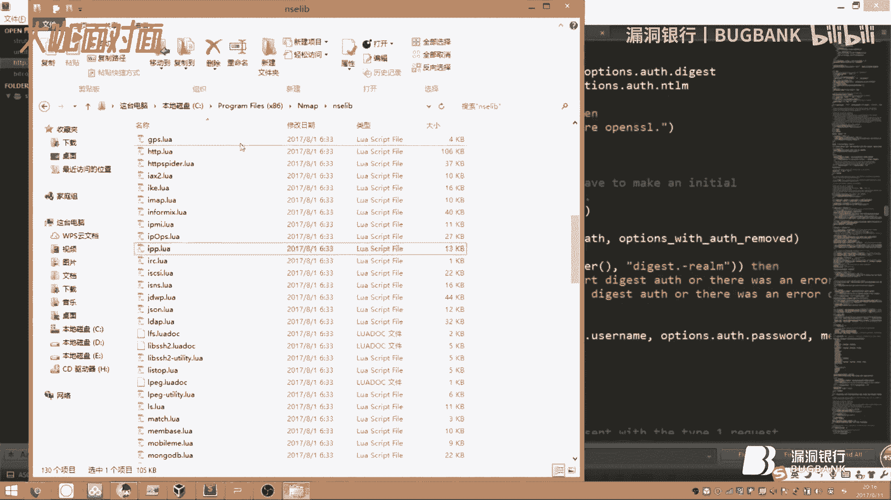
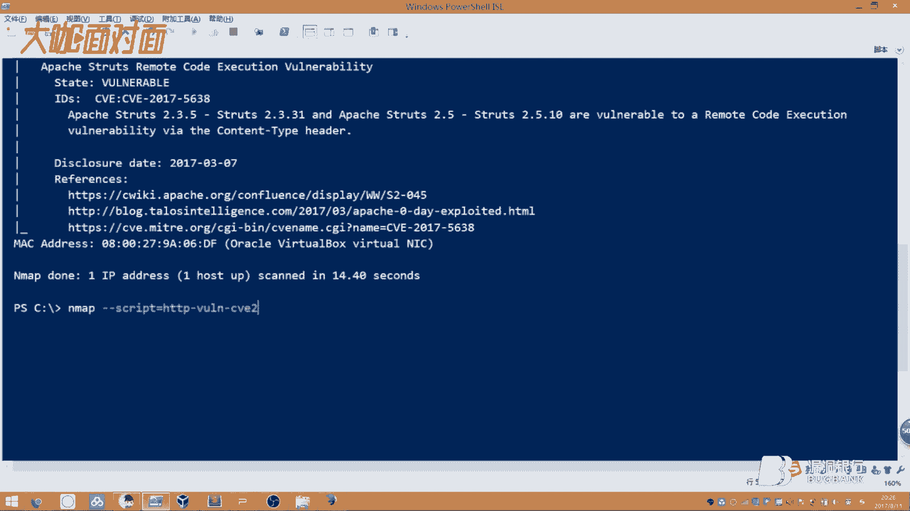
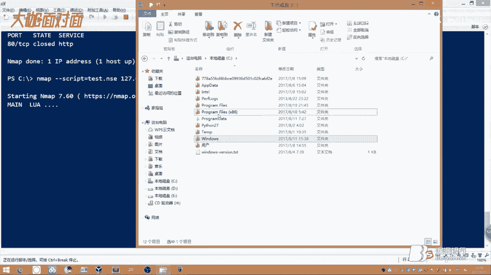
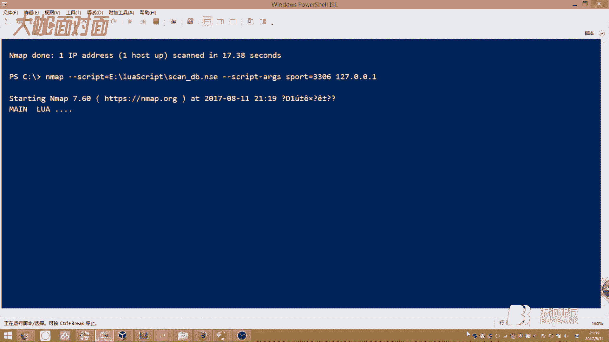

# 漏洞银行丨10秒内能得多少shell？-NMAP正确烹饪及食用方法 —倾旋丨咖面34期 - P1：【录屏】10秒内能得多少shell-NMAP正确烹饪及食用方法——第34期大咖倾旋 - 漏洞银行BUGBANK - BV1BV411Y7dh

(音效)。

為知識而存，因技術而生，是我們大咖念念念第34期，我是主持人年念，相信大家對今天的大咖已經有了更深的了解，沒錯啦，今天的嘉賓就是柯拉實驗室的新選，社王最近對餐飲有研究，他給大家準備一道大菜。

叫做M-MAP的正確烹飪及使用方法，本期直播分成三個環節，首先是清玄的一個主題演講，演講結束後會留10分鐘時間給大家提問，最後就是大咖贈書環節，清玄會選出今晚最認真聽講的觀眾，送出網絡小毛技術揭秘一本。

所以小夥伴們要多多聽講，好好提問，看到我們聊天室了嗎？大家可以發一些彈幕給清玄一點鼓勵，也可以和小夥伴們交流平時使用M-MAP的心得體會，或者留下聽講時遇到的小問題，行程未來環節中清玄會為你們一一解答。

好嘛，規則都和大家說清楚了，那我們就歡迎清玄開始今晚的演講吧，歡迎大家來看我這個10秒內能得到多少share，M-MAP正確烹飪及使用方法，M-MAP這款工具大家已經耳熟能詳了。

畢竟在我們安全圈裡也是比較出名的，我今天列了7個點，跟大家一起共同探討，然後分享我自己收穫的一些知識，首先我們來看第一點。

當然是這個標題了，我們不能這麼快開始，我們這個10秒內能得到多少share，可能大家就是因為這個標題而來了，然後才來捧我的場，然後也給這麼多人，給了我這麼多支持。

但是在此感謝大家一直以來對我們這個克拉實驗室，以及漏洞銀行對我們這個團隊的支持，好的，我們先簡單介紹一下吧，然後再開始我們重頭戲，10秒內get share，首先它肯定是有一些概念的。

概念方面我們再先慢慢理清楚，然後再進行一個操作，首先我們第一個標題，資產掃描，那麼我把資產掃描針對這個對象，使用對象分為兩個，首先就是我們的互聯網上的廠商，那麼廠商利用這個資產掃描。

能查看他們內部網絡裡面的安全性能，就是它這個安全的等級，那麼也能查出一些未修補的漏洞，主要是為了降低辦公網絡的風險，這句話是我自己打的，然後可能描述的不太清楚，主要是這個廠商。

他是用這個資產掃描來有利於他這個網絡的安全，降低風險，降低被入侵的一種可能，但是站在我們這個白帽子這方面，他有利於在這個廠商，這些漏洞沒有修補之前，迅速定位這個測試目標，然後尋找突破點。

我們能挖一些漏洞，針對這個廠商我們可以進行定期的尋檢掃描，這樣子他新上線的一些業務，沒有受保護的這些業務，我們可以及時幫他發現漏洞，然後提交，這樣能增加我們挖洞的經驗，還有就是說自己的能力的鍛煉。

那麼我們怎樣進行一個長期的，就是說你盯住某個廠商，然後專門挖這個廠商的漏洞，那肯定就要定期進行一個尋檢，這個尋檢的過程，大家先看一下，我這邊列了一個流程圖，可能有點枯燥。

但我會就是說完完整整的體現給大家，首先就要針對某個廠商，然後進行一個定期尋檢，這個尋檢肯定是要有一個任務的，我們比如說尋檢多少個目標，或者說一個域名甚至一個IP段，我們可以就是說域名的話。

肯定是要跟這個DNS，然後去收集一些子域名，那麼還有他這個公司的一個網段，然後去掃描，然後去得到一些報告，然後看到這些有哪些脆弱的目標，我可以進一步的去挖掘漏洞，那麼這個掃描的過程。

肯定就是要探測這個端口，然後這套系統，他需要一個底層穩固的掃描框架，這個掃描框架做的是什麼呢，就是一個調度任務的一個處理，然後還有就是，我們這個最後一個存入資料庫，為什麼要用資料庫呢，大家往下看。

等一下我們這個數據庫先給大家聊一下吧，我這邊可能這一頁沒有做，因為我們掃描報告，大部分都呈現了這個文件的格式，就是我們的PDF或者HTML，那麼還有就是一些Word，但是這些呢，這些數據。

不能進一步的去加工，然後進一些存儲操作，這些方方面面的東西，如果就是說你會這些寫程序啊，什麼的你掃描出一些漏洞，但是他只給你的是一個文件，那麼你是不是怎樣去，就是說在這一段短時間內去計算這個廠商。

他你挖出來的多少漏洞，對不對，是不是要進行一個匯總，那麼這個數據只要進到數據庫裡面，我們就可以靈活的進行一些操作，比如說篩選根據一些條件去篩選，比如說我們篩選80端口有哪，就是這個廠商他有哪些漏洞。

就是你掃描出來的，那麼我的數據庫端口他有哪些漏洞，那麼都可以就是說查看出來，這樣呢，最後再導出報告，這是要經歷一個數據庫的一個存儲的一個過程，然後最後再把我們的一些建議啊，結果然後輸出出來對不對。

那麼網上之前在網絡安全法頒布之後，網絡安全法頒布之前肯定就是有在線的這種weibo，weibo頁面的這種漏洞掃描，對吧，有那個出名的一些廠商，對吧，那麼還有一些公司他們做的一些項目。

相信大家也都知道就是體驗過他這些呢，其實最主要一個核心部分就是採用了一個漏洞掃描的一個工具，對不對，然後在這個工具工具的基礎上，還是個框架的基礎上去開發這種插件式的這種掃描。

那現在主要是先介紹這個Nmap，Nmap大家都耳熟能詳，對吧，這塊就是簡單過一下，那麼Nmap呢，他是一個開源的，這個開源的大家知道，就是說這個源代碼是你自己去查看的，並且呢可以做一些修改。

然後自己去編譯，他這個，我們一般都是在，我一般都是在這個Linux裡面運行的，就是他這個掃描速度還是非常快的，就是大家可能感覺他是非常慢的，但是今天你聽了我這些課。

你絕對就是明白他這個掃描速度還是非常快的，至於怎麼快，我們再往下後來再說好吧，那麼他是是用於這個網絡探測，還有這個安全審核的，為什麼是安全審核呢，安全審核這塊是交給誰來做呢，就是我們今天的一個主題。

就是一個NSE腳本引擎去來做的，那這個網絡探測呢，其實他這個和我們的今天這個Lua語言就不太相干了，他是我們的C語言，然後等等一些代碼去寫的這個網絡探測，其實也是向這個目標主機發送一些連接的吧。

然後返回這個一些內容，那麼後面這個簡介先不提太多，我們後面會慢慢介紹，那麼他這個目標設計的是快速的掃描，掃描這個大型網絡，那麼比如說我們有一個網段，或者一個A段B段C段，或者說掃描整個互聯網。

這塊他都沒有問題的，就是說他這個穩定性，他的建裝性是非常強的，然後呢，他的報告也是多樣式的，比如說插面還有普通的文本，就是他掃描的日誌都可以存儲出來，那麼他這個功能是非常強大的，對吧，我們再往下看。

這個介紹的就是簡單提及，相信大家呢，也是因為這個深遠能得到多少Share，然後慕名而來的，對吧，我就這一塊呢，比較基礎的就簡單過一下，那麼大家先看一下這個Nmap的一個目錄結構，首先呢。

第一個文件Nmap。dtd，我這邊列的一個文件結構，是我們Linux下面的，就是他這個目錄裡面是安裝好是這麼多，那我為什麼不介紹這個Windows下呢，其實跟這個是大差不差的，Windows下他這個。

由於就是為了兼容這個Windows的操作系統，他可能就是加了一些其他的一些文件，我們主要是就是研究這個Linux就可以了，第一個文件，他這個是輸出這個插描格式的一個，內部編的一個定義，那麼具體內容。

大家可以自己去打開這個Nmap的文件夾去查看一下，那麼剩下的這一塊，給大家標一下，這一塊我們就是框起來這一塊。

他裡面全是一些指紋，那麼給大家看一下，我這邊是今天是用用的這個Windows。

我們找的這個目錄，我們隨便找一個有指紋的，這個是不可讀的，我們用記事本打開吧，主要是看裡面的內容，簡單看一下。

他的內容有點多，這個是不帶換行的。

大家可以看一些簡單的一些，往下翻，那麼比如說這個174UDP，那麼他這邊有一些特殊的一些字符，發現沒有，特殊的一些字符，那麼就可以，你可以把它當做一個指紋，就說他會連接某個端口。

然後等這個端口返回來這些內容，或者說連接的時間等等等等，他可以判斷一些特徵知道吧，但是呢，他這個Nmap的這個指紋庫，已經就是涵蓋了我們所有的，就是互聯網大部分，所有常用的這些端口。

就是所對應的這些服務，他都有指紋的，我們再找一個典型的，稍等，有一點卡，那麼大家可以看到，這邊呢，就是發現一些，有這些-0-0這種的，16進制啊什麼的，這些代碼，對吧，大家呢就是，可以看到我們這個。

Microsoft Windows，那麼他可能是一個服務的吧，那麼他後面有一些，正則表達式對不對，這些正則表達式匹配的是什麼呢，匹配的就是我們，當前就是掃描到一個端口，然後發送一些垃圾數據。

然後返回的這個數據，他進行這個匹配，我們每個端口，就是因為每個協議，對吧，我們的比如說我們的-80端口，他返回的肯定這些，就是數據段那一塊，返回的肯定是，HTTP的一個報文，對吧，那麼我們就可以去比較。

那麼，看一個典型的例子，我們找到剛才那個FTP的，剛才瞄到了，這個，Welcome to，然後一個FTP server的吧，那麼大家看一下，這邊他有一個，就是正則匹配的吧，這邊有一個正則匹配。

那麼還有一些其他服務，就是相關FTP的，那麼還有微軟的一些FTP，他都有的，可能就是一個端口上，然後架設了某個服務，比如說FTP吧，那麼FTP呢，他對應的軟件有很多，對吧，我們Linux他有。

VS FTP，D是吧，這個軟件，那麼Windows像有IS的這種，他是個FTP，那麼他就根據這個，響應內容，然後去比較的，最後呢，就是根據這些強大的指紋庫，去判斷你這個服務，到底是什麼服務。

然後運行一些。

軟件的版本，他都是可以探測到的，這就是Nmap的一個，一個亮點吧。

就他這個指紋庫是非常珍貴的，那麼我們再往下看，這塊呢，大家可以去簡單的看一下，簡單的看一下，因為網上也有，我們看這個NmapXSL，就是導出這個，XML文件的一個模板，這個就是一些，就是輸出的一些東西。

就簡單帶過，我們這個NSE Lab，這個NSE的就是，腳本引擎。

Nmap的一個腳本引擎，什麼是擴展庫呢，給大家看一下，如果沒有這個擴展庫，我們的這個Nmap，他就相當於，斷了一條腿一樣，是吧，你把他比作一個人，他就相當於斷了一條腿一樣，都走不了路。

我們這個NSE Lab，大家就是找一些常見的，我們找一個HTTP的，翻開看一下，分析一下，我們打開文件夾吧，文件也行，我們找到HTTP，然後大家往下看，就是有一些常見的一些方法，那麼學過Parson的。

他也知道，我們再找，慢慢找，搜索一個Git吧，這是搜索文件內容，我們往下找，他這個庫裡面，有很多一些，封裝好的一些請求方法，可能有點多。

這個膠本，這個general request，對吧，就是普通的這種請求，那麼他的參數就是，主機名，然後端口，他的一個請求方法，這是post的get，還有這些，舉例，然後他這個請求路徑，還有一些設置。

都是在這裡的，那麼可以根據這些，我們就可以看到，這就相當於，他是一個模塊，對吧，就在Parson裡面，他是一個模塊，我們可以去引入他，但是呢，如果NBuff他沒有這些模塊。

那就相當於，他這些所有的擴展膠本，都不能用了，知道吧。

這就是一個擴展庫的重要性，然後呢，我們這個nse慢點錄啊，就是說他的意思是做什麼的，就是在調用這個，我們這個漏洞膠本之前，他會主動調用這個nse慢點錄啊，他進行一個裝載的一個過程。

那麼給大家看一下這個文件。

我還是用這個打開吧，大家往下簡單看一下，我們就是說這邊，他有寫一個方法，那麼後面會介紹，我們現在先執行一個，簡單的一個掃描，簡單的一個掃描，我們在最後面加上我們的一些，我們要寫的一些代碼。

比如說這裡打一個字符串，代表他執行了。

然後呢，我這邊是用了PowerShell，因為用CMD的話，大家可能看不清，nmap對吧，然後呢，我們掃描一個127。0。1，我們把參數加前面吧，比如說我們的default。

就是用一個默認的一些腳本去掃描他，或者說我們調用一個。

隨便找一個吧，script這個目錄，然後裡面有很多腳本，大家可以翻開去看一下，隨便調一個有的沒的吧，盡量找一個是完全能體現出來的，我們調用這個。

取一個httpTitle的，然後呢，我們掃描本地本機，大家看這個看到沒，我能慢點錄啊，他就執行了，就證明我們在所有的掃描之前呢。

他會首先執行這個對不對，就是說有些不知道的東西。

你可以去簡單嘗試，然後就然後得出來這個結論，大家看到我這個計算機上開了很多端口，對吧，然後他這邊都把這個服務識別了。

這些都是經過指紋匹配，然後得到的一些結果，然後呢我們這個script，剛才我翻開找了個腳本，那麼他是用來幹什麼的，他這些就是我們寫好的一些，簡單的一些擴展，對吧，他可以就是用於爆破呀。

還有FTP這種窮舉爆破，對吧，還有我們的http的這些漏洞的，一些利用腳本，那麼還有一些，比如說我們這些帶CVE編號的，對不對，高危漏洞，他都有一些就是利用的腳本，看到沒有他都有這麼多。

那關於這個Nmap腳本的使用呢，大家就是可以去百度上搜一搜，他也有很多這個相關的文章，我們今天呢主要隨便。

比如說隨便找一個吧，weblogic，這個，我們隨便在這邊找一個，還不太好找，我們分析一個FTP的吧，他是一個爆破的，就是我們從這個scribd這個目錄裡面挑出來的一個，那首先他會加壓。

加載一些我們常見的，就是說常用的一些庫，那麼這些庫呢，在Nmap官網上都有這個介紹，不過全是英文的，那麼國內目前沒有就是說，就是把他這個手冊全部翻譯過來的，就是沒有，只是就是說有這種。

類似於我們這個擴展編寫的一些文章，那麼大家看啊，我們這邊找一些主要的，比如說這個連接吧，我們首先呢會建創建一個，就是說一個socket，socket就是套接字，就方便於我們程序員。

就是對這個網絡的一些開發，然後他們封裝起來的，這個概念就叫socket，他是用於連接的，就是端口對端口，目標對目標的這種連接，然後呢這邊他會進行一個連接，對不對連接一個主機名，然後加一個端口號。

對不對這邊加一個超時時間，他會返回出來一些數據，那麼如果就是說他連接不到，他就就是說提示這個，無法連接到目標主機，那麼連接到呢，我們再往下看，這邊呢就是第一次連接到，他會就是說獲取到一些信息。

那麼可以看到，每個協議他都有，每個協議的這種，數據包的一些格式，對吧我們都買cycle，FTP都有，那麼他返回這些字母上，我們去進一個比較匹配，最後呢這邊他會，就是說給你一些提示，那麼還有就是說。

每個協議為了就是區分開來，服務器端和客戶端的一個狀態，就會有一個狀態碼的概念存在，包括我們的http協議，對吧那麼他有的是訪問，網頁正常他會返回200，對吧就是代表當前這個請求是正常的。

那麼這邊我們方便調適，對不對或者說根據這個協議，去做這個響應的一個判斷，就可以進行一個爆破，那麼這邊530證明他這邊密碼錯誤，對吧然後421就是服務器端連接數太多了，對不對那麼最後呢。

他就是說如果就是連接正常了，他會就是說輸出一些信息，對吧那我這塊呢就簡單分析了一下，那麼他這些代碼的一些結構呢，我會寫一個簡單的例子，給大家慢慢介紹，那麼現在呢，大家可能就是聽了這麼多概念。

有點枯燥了，我現在來演示一下我們的這個，10秒get share。

10秒get share，對吧大家一定很好奇，那大家可以看到我這邊是，搭建了一個就是說目標操作系統。

我們訪問一下，那就是這個，這個網站速度還比較快的，然後呢我們我自己寫了一個漏洞一個腳本啊。

我們利用的這個CVE編號是，20175638的一個Stress遠程漏洞，遠程代碼執行，對吧但是NF他官網呢，只有一個就是說只有一個，檢測的，我們先給大家跑一下這個檢測的腳本。

他肯定是能檢測出來的，主要是看這個報告。

我們找到這個漏洞的一個。

腳本名稱，他是20175638，對吧，我們把它拿過來。

然後呢我們就是進行一個掃描，一點多少來著，1。102對吧，那我們這個，先調用了一個慢點錄啊對吧，大家可以看到，這邊我們的80端口是開開的，還有SSH也是開開的，但是他在80端口就是檢測到一個漏洞。

那麼這邊呢，他會輸出一些參考信息對吧，以及詳細信息，就是說你這個CVE編號是多少，然後呢他這個，就是漏洞的一些描述，他的版本對不對，就是影響範圍，這些描述都在這裡，然後這邊是一些參考鏈接。

就是幫助這個檢測人員，就是修復漏洞，或者了解一些漏洞的詳細信息，給出的一些鏈接，那麼這個漏洞是檢測出來了對不對，但是我如果就是說，想直接就是通過Nmap去get shell，該怎麼辦呢，我們就要用一些。

就是自己改一下這個代碼，或者說自己重新寫一個，直接get shell，我這邊呢，這個代碼是就是容錯性比較強的，他首先呢，會檢測是否存在這個漏洞，stress2，大家不知道有沒有了解過。

我們看一下這個代碼，簡單看一下，那麼這邊呢，可以看到他添加了一個響應頭對不對，x-checkstress，然後這邊一個格式化字幕串，就說他返回這個響應頭了，那證明這個漏洞是存在的，對不對。

看我這邊有沒有那個分析的工具，沒有裝，不過沒有關係。

我們可以，嗯，用那個火狐插件吧，我手動付現一下，對吧，把他的配料的拿過來，我們訪問這個網站，然後呢，我這邊有一些經常用的一些插件，因為是我們這個配料的是在這個header頭裡的，對吧。

就是content-type這邊，他可能就是不需要一些，不管是post，get，他都是接收的，都可以驗證的。

我們把這個配料的拿出來，然後呢，我們這個，這個s啊，我們改一下，我們現在提交，大家可以看到這個，如果返回這個響應頭，他就代表這個漏洞存在，對不對，他是這麼驗證的，那麼這個邏輯。

如果大家還不明白，我們再慢慢走，從上往下走，嗯，這塊呢，是一些簡單的一些介紹信息，但是這個呢，這個函數是非常重要的，後面給大家講，我們先講這個開始請求這一塊，首先呢，他聲明這個header對不對。

因為我這個漏洞呢，他要復現的話，就必須在這個header頭裡的，然後他接收的類型對不對，都在這裡，然後呢，這邊就是他發送了一個，常用的一個http請求，對吧，調用的是http模塊。

然後傳我們的這個host，port，然後message，還有pass，就是我們這個請求的路徑，然後主機端口對不對，然後他添加了這個請求頭，這塊呢，我們這邊就是判斷他的響應狀態碼，如果是。

就是當前這個請求返回的是，200這個狀態碼，並且他這個響應頭裡面有這個，我們的xcheckstress這個值的話，並且等於我們這個，之前聲明的一個隨機字符串，這塊有個隨機字符串，大家看到沒有。

隨機字符串是八位長度的，那麼他就會檢測，就是你當前這個是存在這個漏洞的，存在這個漏洞的，那麼這個我是，一個get shell的一個腳本啊，是非常非常簡單的，這個數據包呢，我是從網上的那個工具裡面。

然後通過vrshark，然後抓過來的。

就他這個上傳share的一個header頭，然後我直接寫到這個腳本裡面，大家看一下這個，現在就是演示一下如何，十秒get shell，可以看到我剛才這個掃描，是用了14秒的吧，但是如果是說讓他保持在。

十秒之內get shell，那只能就是說指定端口，不讓他就是說測太多的端口。

我們現在呢，調用一下。

stress的吧，然後02-45，我們這邊傳上一個，我們的web shell的名稱，比如說叫colab。gsp，然後呢，我們這邊呢，後面跟上我的目標對不對，但我在，在此之前我想就是測一下80。

直接測80，2。2的168。1。102的吧，我已經錯過了。

他是應該是沒有找到，可能是單詞打錯了，我們。

在用上面這條命令，struts是吧，這個t打到前面了，十秒get shell，試一下，好像這個十秒過得很快，試一下，那麼這邊呢，就獲取到了一個web shell，其實應該給大家那個什麼。

就先訪問一下，我這個到底有沒有shell，對吧，不能說是欺騙大家，這邊是一個空白對不對，我們呢，現在再來一遍，我這邊就是說。

訪問一個不存在的，ss這種的，然後我們掉這個腳本，名稱就不能一樣了，因為這個文件已經存在了，我們叫什麼呢，八個半顆，對吧，然後呢，我們現在再測試一下。

八個半顆，哎呀，我又沒有給大家，應該是ss。

sorry，因為這個ss已經給大家看過了，4個s對吧，然後等他來執行，其實他具體做的這個流程，大家要明白，那麼大家寫pens呢，應該是很清楚，只是發送了個HDB請求而已嘛，對吧，其實呢。

nmap他能做很多很多事情。

就完全通過這個掃描器，就可以進行一個自動化的一個攻擊，大家看到沒有，是一個web shell對不對，然後我現在呢，他是一個，一個小型的一個木馬，用於寫入文件的，Corel。txt。

那現在是沒有內容的對吧，我這邊傳入一個，Corel。txt，大家應該知道這個，這個木馬的吧，我看一下，我這邊就文件就寫入了，對吧，就相當於一個後門。

那麼當前這個操作就執行完畢了，對吧，這個10秒get shell呢，我看是幾秒，14秒，那也不能為例，對吧，其實主要是給大家講這個，自動化，懂了吧，因為他有這些好的一些工具。

我們就要去研究一下，這種項目做的是非常不錯的，那我們再往下看，就是講一些，他這個內部的一些過程，因為剛才列過了好多問題，對吧，好的，首先呢，nmap就是接收一個目標，他肯定要執行一個主機發現的一個操作。

什麼叫主機發現，因為他要判斷對方目標是否能連接到，對吧，他會比如說進一個進行一個TCP的這種，完整的一個握手，然後去探測，那麼還有ACK，對吧，還有SYN，這些很多方法，去判斷目標主題是否存在。

然後判斷完這個主機發現以後呢，他會進行一個端口掃描，對不對，因為他就是一個端口掃描工具，他就是一個端口掃描工具，他掃描出來，你用哪些方式呢，他掃描出來，你用哪些端口是開放的呢。

然後再進行一個當前這個端口，他運行哪些服務，然後進行一個版本版本偵測，最後呢，才會執行這個系統偵測，那看你就是說，想要不想知道不想知道他這個系統是什麼系統，對吧，但是在滲透測試裡面，信息蒐集。

他是佔了很大一部分，對吧，這些都是必須要知道的，那麼這邊有一個細化的掃描流程，首先呢，也是執行一個主機發現的吧，但是主機發現這塊，我們就要採用一些不同的判斷方式。

因為我們比如說就就拿這個Windows和Linux來講，Windows他返回的這個TTL值和Linux的是不一樣的，對吧，那麼他可以根據這個，就是什麼TTL值，來判斷這個操作系統是什麼，對不對。

這塊一個一個知識點，對吧，那麼還有他可能會根據我們的這個，比如說目標網絡，他返返回這個數據包的一個特徵，對吧，因為Windows和Linux，他也沒有一個特別的標準。

並且他上面運行的這些服務也是不一樣的，比如說我們的SQL Server是裝在Windows裡的，對吧，那麼如果裝在Linux裡，這種情況是非常少的，對吧，就是先比如說IS。

他掃描到一個IS他返回的一個數據包，他不可能就是把這個這個操作系統，就當做是一個Linux，對不對，他這個掃描器還是比較智能的，然後他掃描這個端口呢，端口掃描到了，他會進一個這個指紋比對。

就是我剛才給大家介紹的那些指紋，指紋庫，那些指紋庫呢，就因爲我們TCP IP裡面就是所有大部分的端口，就是0到65535，這個介質之間，每個端口就是說常見的就是端口上面搭建的一些服務，然後這些服務呢。

他返回的一些指紋，就是這些數據包，這些數據包呢，我們再通過Nmap裡面的一些政策匹配，才會識別他當前這個服務是什麼服務，懂了吧，然後呢這個端口偵測就是，版本偵測就是我們那個RPC，他可以知道我們應用層。

就是那個軟件，他返回的是什麼版本的，那麼包括我們這個，大家不知道有沒有了解過Banner，BANNER，我打我寫出來可能有點醜，BANNER，那就是相當一個旗幟一個標誌的一個信息，對吧，我們每個服務呢。

比如說我現在搭建一個FTP，給大家看一下，其實我這邊Nmap也是可以掃描到的，找一下，我們的綜合工具吧，FTP非常簡單的一個，然後我現在開啟，那麼這邊有一個Banner信息，我們現在登錄一下。

FTP，我們的101，對吧，那麼大家看到上面，這塊有個220對不對，220就代表你還沒有登錄，但是這個訪問是正常的，這是FTP的一個狀態，就是方便這個調適的，你看我們這個，賬號對了密碼錯了，對不對。

我們賬號已經輸入了，他反過來是311，331對吧，我們沒有登錄，登錄失敗了，他返回到530，對不對，我們Nmap裡面也是這麼來做判斷的，就幾個常用的狀態碼，但是這塊有一個Welcome To，還有什麼。

誰的FTP服務，他的版本是多少，那麼在這個裡面，有FTP這個字樣，那我們Nmap就可能把它當做一個FTP的一個服務，然後這個Banner信息就給你打印出來在這。

他就是這麼來做的，這是一個端空掃描的一個，算是一個常識吧，一個簡單的一個認知方面的東西，然後系統真的，他的方法也是有的，就是也有我們的系統指紋給大家看一下，我們找到Nmap的這個目錄，然後一個OSDB。

我們盡量在這個編輯器裡面打開吧，我們往下翻，那麼可以看到這邊有Windows，然後還有一些其他網絡設備的一些響應，他都有，他都是有的，我們他這邊都有一個，就是一個標誌，這邊有一個防火牆，對不對。

他響應的一些狀態，都是在這裡的，我們找一個Windows的，這些Windows的，我再往下找，Windows XP的對不對，他也是有指紋的，那麼他是通過這邊，就這些格式，然後去判斷目標操作系統是什麼。

對不對，再可以找，還可以往下找，這邊是應該是Windows Phone的，對吧，Mobile，不知道是什麼版本，我們再往下找，其實還有一些Windows的，是一些Windows手機的，是吧。

應該是裝了Windows系統的，我們再搜一下Linux，看有沒有，看到沒，Linux也有的，對吧，他返還的一些特徵也是有的，他就是記錄在這裡面，那我們每次他掃描都會。

就是說如果要識別目標操作系統的話，他都會就是檢索這個，指紋庫，然後去進行比對，其實都是一些指紋在起作用，對吧，其實他最重要的，Nmap就是經典的有三個點，首先就是他底層的這個掃描引擎，對吧。

然後就是指紋，最後一個就是他的一個擴展，其實就是這三點，那麼最後一個擴展，可以把它當做一個NSE的腳本引擎，我後面給他介紹，好的，到了我們的重頭戲了，NSE，這個腳本引擎，也是稱之為Nmap的腳本引擎。

那麼這個腳本引擎呢，主要用於這個發現的，針對這個發現的主機，然後端口呢，進行不同的操作，這個操作是我們可控的，就是我們可以自己寫這個代碼，然後去對這個工具進行一些加強，那麼還有Fuz測試啊。

漏洞發現漏洞利用都是可以的，但是漏洞利用這塊，Nmap官方並不是說是有給你這個，就是寫特別多的這個代碼，因為主要是用於這個漏洞的一個發現，一個驗證，那麼非常代表性的就是我們那個Stress Tool。

然後遠程代碼執行，他只是添加了一個響應頭，然後去做一個判斷，那Fuzz測試呢，主要是用於這個爆破，對吧，他有爆破的一些庫，還有一些擴展庫都是有的，那麼這邊給大家看一下。

如何就是看這個Nmap官網的這個腳本引擎。

我們打開Nmap。org，我們找一下，Bokeh這裡，這邊是Nmap的書，我們直接訪問那個啥吧，NSE DOC，這個路徑，我們訪問Docs就可以看到，Nmap Bokeh的，他這個是售價是非常高的。

售價是非常高的，給大家看一下，這邊有Libraries，他主要是分為兩層，兩層這邊有個分類，就是我們每個分類下面他有哪些工具，比如說AOTA是這個，他下面有這些有這些插件，那麼還有我們的Exploit。

就論論利用的，他有哪些插件，這邊他都做了一個列表，有一點卡哦，稍等，然後呢，這邊是scripts，就是他寫好的一些，每個腳本他都有就是原代碼，然後及使用方法都在裡面，比如說我們找一個，DNS預傳送漏洞。

大家應該都知道，DNS預傳送漏洞，可以獲取目標DNS服務器上的主機，記錄，就是域名解析記錄，那麼這邊有一個例子，可以看到他調用了一個，DNS預傳送漏洞的腳本，然後傳輸了一些，我們這個。

腳本就是可接收的一些參數，必須要設定一些參數，那麼每個參數呢都在這裡，script arguments，對吧，這邊比如他這個端口，他這個服務，他這個域名都有的，只不過全是這個英文的，那麼給大家。

可以看到他有很多漏洞庫，對吧，就是這個插件，這個插件我們看完之後呢，再看這個libras，其實他最有特色的就是這個libras，你可以看我們，比如說後面要連接這個mySQL數據庫。

比如說要執行這個SQL語句，比如說你在這個內網裡面，就是拿到了目標主機，這個mySQL控制權限，你可以寫一個自己的這個插件，大家看，這邊他主要有，12345678，八個方法八個函數。

然後呢他每個函數都有一個，簡單的一個介紹，就是他的參數以及返回值，他的這個編寫的標準，全部是根據這個Lua語言去編寫的，那麼我後面，我自己也寫了一個，就是執行mySQL語句的一個，擴展庫。

一會給大家看一下，他呢就是全部，就是根據這個Lua的這個腳本，編寫的這個規則，全部就是遵循這個編寫的一個規則，那麼他這些的漏洞的一些擴展插件，對吧，給這個Nmap又增添了一大亮點，所以說他是。

三點重要裡面的，就是最後一點也是最重要的，那麼所以說Nmap呢，不只是一個掃描工具，在黑客手中，在這個黑客手中，他就是一款愛不釋手的這個滲透工具，對吧，那包括我們那個黑客帝國那個電影裡面。

就出現過這款工具，對吧，那麼國內呢，也有很就是很多，就是他這個掃描方式的一些文章，對吧，但是就是這種視頻式的這種講解，應該是很少的，就是講解的這麼深的，對吧，但是國內也有一本書叫Nmap。

Nmap 滲透測試指南，對吧，他對這個腳本引擎這塊，並沒有就是說很深的介紹，那麼你如果想，就是了解的，把Nmap了解的非常深的話，就是要到這個官網看一下，他這邊有幾本書，這是一本對吧，這是一本。

然後他售價是多少美元來著，34。95美元，或者39，對吧，那你可以就是說換算一下，那麼這塊這三本書，有韓國人寫的。

然後美國人寫的，這邊是95了，對吧，95美元已經是很貴了，所以說這些資料是非常少的，就是比較深的一些資料是非常少的，那麼烏雲，以前烏雲也發過這種相似的文章，就類似的文章，也是編寫了一些插頁。

但是沒有做成一個集合，所以就是如果大家有興趣的話，可以和我一起把這個官網的，就他這個官網，這個手冊，就是每個函數，每個擴展庫，每個函數，他的使用方法，就是做一個歷程，然後慢慢就是給國內這個。

Nmap的這個開源，對吧，或者說使用的這個人群呢，就再擴大一下，這款工具是非常不錯的，好的，我們看一下Nmap的這個，NSE引擎，這個腳本引擎執行這個流程，那麼剛才這個NSE慢點錄，這個文件介紹過了。

就是他在我們只要是調這個腳本，他會優先在執行這個慢點錄，就是我們的這個主文件，如果他調完完之後呢，他會進行一些變量的一些裝載，就是常量呀，什麼一些定義好的一些函數呀，都給裝載起來。

那麼當你引入一些其他庫的時候，他會進入那個NSE lab，那個庫去尋找，NSE lab，這個文件夾裡面去尋找，尋找到之後，他再把這個包給引入進來，跟我們的Python是不是很像，那麼引入進來之後呢。

你就可以進行，就是調這個lab裡面的，就是擴展裡面的這些函數，然後進行一些操作，那麼剩下這些過程，跟我們剛才講的，上面那個簡單的一個過程是一樣的，那麼這邊就是把這個變量，然後裝載，然後進行這個動作處理。

動作處理給大家演示一下，就是寫那個腳本，最後把這個結構輸出，他這個函數是非常多的，我們只掌握他這個流程就可以了，那我看重點來了，這塊呢有NSE API的一個介面，就是我剛才打開這個介面，就當年這個介面。

你可以就是翻翻看一些相關的，比如說你感興趣的一些，一些說明，那麼你可以自己寫一個，那麼可能你就是萬事開頭難的吧，我今天就是可以把你，把你就是教會你，怎樣去寫這個Nmap的一個擴展，然後呢這些庫對不對。

你就需要自己去摸索了，他這些庫是非常有用的，因為Nmap你把這個庫，就是學的差不多了，你相當於可以驗證，互聯網上所有的漏洞，真的是所有的，只要就是說，你會寫對吧，就可以驗證互聯網上，所有的這些漏洞。

然後你可以把它集合起來，就形成一個漏洞掃描式的，這種滲透工具，對吧他不只是一個掃描工具了，就可以直接滲透了，那麼Nmap的擴展，他主要由以下幾個變量構成，就是我們這邊的，那麼大家可以看到。

我這邊加了一些括號，然後加了一些參數，他這些參數是幹什麼的呢，我們聽我慢慢道來，這個編碼方式是加了一個括號，就代表他相當於是一個函數的吧，在編程裡面相當於是一個函數，我們每個變量都會綁定一個函數。

然後呢，他這個執行順序，首先是pre-ruler，然後是host-ruler和這個prot-ruler，最後是一個action，就是一個動作處理，最後是這個post-ruler。

那麼這邊有一個非常重要的一點，就是當這個post-ruler和prot-ruler，綁定函數返回true的時候，都會執行一次action的綁定函數，那大家現在肯定很迷很亂的吧，我們把這四個函數寫在一個。

我們自己封裝的一個擴展腳本裡面，我們現在新建了一個，我們把這個語言調成多，方便觀看還有這個高亮，好了我們現在呢，就假設我們現在要開始寫這個插件的吧，因為呢大部分這個相關的。

比如說前面的這些description描述什麼的，沒有給大家講，其實官網上都有，這些都是無所謂的，我們主要是學習這個執行流程，對吧，我們現在呢先寫我們的pre-ruler，它是一個綁定函數。

綁定函數是以這樣的形式來寫的，這一塊是一個函數名對吧，這一塊是不是一個，就不需要傳遞函數名了，因為已經綁定給這個變量了，首先呢它有，它沒有新參的，它沒有新參，我們現在比如說打印。

打印個字幕串叫pre-ruler，然後代表它執行了，然後還有呢我們的port-ruler，port-ruler，然後呢，它這邊呢是有兩個參數的，host和port，就是主機和這個端口，它是兩個對象。

然後呢我們這邊呢打印一下，我們打印這個host的一個ip，就是我們要掃描的一個ip，以及這個，端口號，這是一個字幕串，然後我們打印這個port，打印這個port，然後還有一個host-ruler對吧。

它同樣的也有兩個參數，那我這邊就不打印了，直接就打印個host-ruler就行了，然後呢它還有一個，函數叫post-ruler對吧，它是之後執行的，print我們的post-ruler對吧。

然後我們保存，它這個擴展名必須是nse的，我們搞一個自定義的，比如說要test。nse。

就證明我們寫的第一個nmap擴展插件對吧，然後呢我們現在直接可以調用了。

nmap-script對吧，然後我們test。nse，就是調用我們這個腳本，那麼它是沒有參數的，我們直接可以掃描本機，-p80就行了，哦對沒有action方法。

它是必須要有action方法的，我們隨便在action寫在最後面就行了，你寫在哪都可以，它都是會自動調用的，然後它有兩個參數，host-port，我們比如說打印一個，action，in-host。

in-end，然後我現在調用。

首先執行我們的preruler對吧，但是我們的nse慢點錄，它是優先於我們的preruler的，沒有這個主函數這個主文件，它是下面的代碼是不能運行的，然後呢它就執行了host-ruler對不對。

最後呢執行post-ruler對不對，但是我們這個。

大家也可以看到我們的port-ruler，並沒有執行為什麼呢，因為我的host-ruler，它的優先級大於port-ruler，首先我們每個函數都有一個返回值的，我們返回處，然後兩個都返回處。

都返回處我們再試一下。

好，大家看到我們這個，首先preruler就不講了，它是最優先執行的對吧，就相比這個它是，相比其他方法是最優先執行的，然後是host-ruler，它執行那個action-end對不對，然後呢我們的。

再看一下，post-ruler。

我們的port-ruler並沒有執行，我們把它這個，它可能也有個優先級對吧，host-ruler就是，比這個port-ruler優先級要高一點，但是我們的host-ruler呢。

它首先會就是經過的是一個host，而不是port對不對，就是主機發現的這個動作，然後最後呢傳遞這個函數裡面。

我們再找一下我們的port-ruler。

在linux裡我是測試過的就是，當兩個函數都返回處的時候，它都會調用一次action方法，都會調一次action方法，但是為什麼就是說沒有向下執行呢，因為我們這個。

host-ruler它只操作這個host的這個值，它只操作這個host的這個值，但是它跟這個port是不相干的，但是如果就是，當我們的host-ruler執行完畢之後。

它這個行三還是會交給這個action的，所以到這它是應該會報錯的，可能windows下面它這個容錯性，比較好一點而已，那麼它就會執行這個action，action執行完就相當於。

當前這個腳本就執行完畢了，我們一般呢在哪就是擷取呢，就是擷取這個port-ruler，因為我們就是要做這個端口掃描，所以host-ruler和這個，我們的這個port-ruler，就可以就是說。

直接挑一個就可以直接就用了，並不是說兩個必須要共同存在，那我們的pre-ruler就是做一些預準備的工作，我們也可以不要，對吧，對吧，我們只留這個port-ruler。

然後post-ruler也可以不要，它主要是做最後的一個收尾工作，具體你想讓它做什麼，就是要看你的這個代碼，我們現在執行一下我們這個port-ruler，首先我們會打印這個IP和這個端口號。

(打印)，這邊沒有打印啊。

看一下，host-ip-port-ruler，對著那樣，然後等於host-port。

我們的action也沒有必要用，我們找一個就是說打開狀態的，我們直接掃吧，因為它掃描的端口多一點。

好像我這個envf裡面已經有這個了，看一下這個文件存不存在。

可以看到這邊已經出來了，那麼921這個端口呢，就是打開狀態，然後它執行了一次action，我們的1030又執行了一次action，那麼以至於它就是全部執行完，就是打開狀態的，它會執行這個，對不對。

那麼怎樣去判斷這個當前端口是否打開。

然後進行一些操作呢，我們在這邊啊，在這邊，就是做一些邏輯的一些判斷，比如說，如果我們的port，它的狀態，等於一個open狀態，然後我這邊輸出，輸出我那個端口號，我這一句就不要了。

就是只輸出這個打開端口的這個。

這可能過程有點慢，因為要不斷的調試給大家，就是理解這個東西。

大家就是可能好奇這些port rule。

你怎麼知道有這個變量的值，還有host，那麼帶大家看一下。

就趁閃爆的時間帶大家看一下，我們的這個NSE的這個說明裡面是有的，那麼我們找一下，它有一個rules，看到沒，這些方法都在這裡面列著，然後進行一些說明，然後這邊這些分類啊，還有就是授權啊。

還有這個描述啊，上面都有的，我們找那個，它的這些變量的一個說明，應該是在action的方法，這也沒有，oh，the ruler，the ruler，那麼這一塊呢，大家可以看一些例子。

就是說如果這邊它是一個集合的吧，然後去判斷當前這個主機，它是133端口打開了沒，並且它這個協議是TCP的，如果是打開的話，他就是給一些操作的吧，我們往上這個API這裡看一下，找到了。

這裡是對我們這個狀態，就是host和prose的一個說明，那麼host呢，主要是它是一個在Ruler裡面，它是一個表格的一種形式，然後呢，它這邊host。os是指的當前的操作系統。

就是它指紋比對之後的一個結果，操作系統，然後呢這邊呢，也有一個打印出來的一個表格結構，看到沒有，linux啊，它的名稱對不對，還有它的一個版本號，都在這裡，那麼還有host的IP。

主要是當前掃描主機的一個IP地址，如果你掃描的是多個IP地址。

那麼這個host的IP是一直在變的，當然我們這個proseRuler，也是被循環執行的，你知道吧，一個主機傳進來，它就會執行一次，如果當前方法返回處的話，它就會執行一次action。

所以說它是一個連貫性的一個操作，然後呢這邊也有一些，關於其他的，比如說mark地址啊，這塊，都有一些詳細的信息，那我們再看prose，prose首先就是我們常用到的，prose number就是當前。

目標主機的這個端口，端口號，就是用number來代表，這個協議，比如是tcp啊或者udp，還有這個服務，都可以打印出來，比如說我們現在，這邊應該掃描出來了，應該掃描出來了。

那我可以看到這邊，我們打開的全是，打印的全是打開的一個端口，就開放的端口，但是，有人有沒有想過就是。

我們主要是已經知道，它裡面的一個執行流程，下面該怎麼做呢，就是讓它變得更加強大，變得更加強大，那麼這個stress2的，是不是也可以再，就是說再優化一下，可以看到這邊，它直接就proseRuler。

直接綁定了這個函數，這個函數是用來做什麼呢，大家可以查一下，是擴展庫。

shortput，shortput它主要是用於做這個，端口比較的，我們查一下這個擴展庫，找一下，打開這個列表，然後直接搜索就行了，那麼大家看到，這個函數，這個函數，它直接就把這個，這個變量給綁定了。

然後呢，我們就可以看到，這個變量，這個變量，我們可以看到，這個變量，我們可以看到，這個變量，我們可以看到，這個變量，我們可以看到，這個變量，我們可以看到，這個變量，我們可以看到，這個變量，我們可以看到。

這個變量，我們可以看到，這個變量，我們可以看到，這個變量，我們可以看到，這個變量，我們可以看到，這個變量，我們可以看到，這個變量，我們可以看到，這個變量，我們可以看到，這個變量，我們可以看到，這個變量。

我們可以看到，這個變量，我們可以看到，這個變量，我們可以看到，這個變量，我們可以看到，這個變量，我們可以看到，這個變量，我們可以看到，這個變量，我們可以看到，這個變量，我們可以看到，這個變量。

我們可以看到，這個變量，我們可以看到，這個變量，我們可以看到，這個變量，我們可以看到，這個變量，我們可以看到，這個變量，我們可以看到，這個變量。

我們可以看到，這個變量，我們可以看到，這個變量，我們可以看到，這個變量，我們可以看到，這個變量，我們可以看到，這個變量，我們可以看到，這個變量，我們可以看到，這個變量，我們可以看到。

這個變量，我們可以看到，這個變量，我們可以看到，這個變量，我們可以看到，這個變量，我們可以看到，這個變量，我們可以看到，這個變量，我們可以看到，這個變量，我們可以看到，這個變量，我們可以看到，這個變量。

我們可以看到，這個變量，我們可以看到，這個變量，我們可以看到，這個變量，我們可以看到，這個變量，我們可以看到，這個變量，我們可以看到，這個變量，我們可以看到，這個變量，我們可以看到，這個變量。

我們可以看到，這個變量，我們可以看到，這個變量，我們可以看到，這個變量，我們可以看到，這個變量，我們可以看到，這個變量，我們可以看到，這個變量，我們可以看到，這個變量，我們可以看到，這個變量。

我們可以看到，這個變量，我們可以看到，這個變量，我們可以看到，這個變量，我們可以看到，這個變量，我們可以看到，這個變量，我們可以看到，這個變量，我們可以看到，這個變量，我們可以看到，這個變量。

我們可以看到，這個變量，我們可以看到，這個變量，我們可以看到，這個變量，我們可以看到，這個變量，我們可以看到，這個變量，我們可以看到，這個變量，我們可以看到，這個變量，我們可以看到，這個變量。

我們可以看到，這個變量，我們可以看到，這個變量，我們可以看到，這個變量，我們可以看到，這個變量，我們可以看到，這個變量，我們可以看到，這個變量，我們可以看到，這個變量，我們可以看到，這個變量。

我們可以看到，這個變量，我們可以看到，這個變量，我們可以看到，這個變量，我們可以看到，這個變量。

我們可以看到，這個變量，我們可以看到，這個變量，我們可以看到，這個變量，我們可以看到，這個變量，我們可以看到，這個變量，我們可以看到，這個變量，我們可以看到，這個變量，我們可以看到，這個變量。

我們可以看到，這個變量，我們可以看到，這個變量，我們可以看到，這個變量，我們可以看到，這個變量，我們可以看到，這個變量，我們可以看到，這個變量，我們可以看到，這個變量，我們可以看到，這個變量。

我們可以看到，這個變量，我們可以看到，這個變量，我們可以看到，這個變量，我們可以看到，這個變量，我們可以看到，這個變量，我們可以看到，這個變量，我們可以看到，這個變量，我們可以看到，這個變量。

我們可以看到，這個變量，我們可以看到，這個變量，我們可以看到，這個變量，我們可以看到，這個變量，我們可以看到，這個變量，我們可以看到，這個變量，我們可以看到，這個變量，我們可以看到，這個變量。

我們可以看到，這個變量，我們可以看到，這個變量，我們可以看到，這個變量，我們可以看到，這個變量，我們可以看到，這個變量，我們可以看到，這個變量，我們可以看到，這個變量，我們可以看到，這個變量。

我們可以看到，這個變量，我們可以看到，這個變量，我們可以看到，這個變量，我們可以看到，這個變量，我們可以看到，這個變量，我們可以看到，這個變量，我們可以看到，這個變量，我們可以看到，這個變量。

我們可以看到，這個變量，我們可以看到，這個變量，我們可以看到，這個變量，我們可以看到，這個變量，我們可以看到，這個變量，我們可以看到，這個變量，我們可以看到，這個變量，我們可以看到，這個變量。

我們可以看到，這個變量，我們可以看到，這個變量，我們可以看到，這個變量，我們可以看到，這個變量，我們可以看到，這個變量，我們可以看到，這個變量，我們可以看到，這個變量，我們可以看到，這個變量。

我們可以看到，這個變量，我們可以看到，這個變量，我們可以看到，這個變量，我們可以看到，這個變量，我們可以看到，這個變量，我們可以看到，這個變量，我們可以看到，這個變量，我們可以看到，這個變量。

我們可以看到，這個變量，我們可以看到，這個變量，我們可以看到，這個變量，我們可以看到，這個變量，我們可以看到，這個變量，我們可以看到，這個變量，我們可以看到，這個變量，我們可以看到，這個變量。

我們可以看到，這個變量，我們可以看到，這個變量，我們可以看到。

這個變量，我們可以看到，這個變量，我們可以看到，這個變量，我們可以看到，這個變量，我們可以看到，這個變量，我們可以看到，這個變量，我們可以看到，這個變量，我們可以看到，這個變量。

我們可以看到，這個變量，我們可以看到，這個變量，我們可以看到，這個變量，我們可以看到，這個變量，我們可以看到，這個變量，我們可以看到，這個變量，我們可以看到，這個變量，我們可以看到，這個變量。

我們可以看到，這個變量，我們可以看到，這個變量，我們可以看到，這個變量，我們可以看到，這個變量，我們可以看到，這個變量，我們可以看到，這個變量，我們可以看到，這個變量，我們可以看到，這個變量。

我們可以看到，這個變量，我們可以看到，這個變量，我們可以看到，這個變量，我們可以看到，這個變量。

我們可以看到，這個變量，我們可以看到，這個變量，我們可以看到，這個變量，我們可以看到，這個變量，我們可以看到，這個變量，我們可以看到，這個變量，我們可以看到，這個變量，我們可以看到，這個變量。

我們可以看到，這個變量，我們可以看到，這個變量，我們可以看到，這個變量，我們可以看到，這個變量，我們可以看到，這個變量，我們可以看到，這個變量，我們可以看到，這個變量，我們可以看到，這個變量。

我們可以看到，這個變量，我們可以看到，這個變量，我們可以看到，這個變量，我們可以看到，這個變量，我們可以看到，這個變量，我們可以看到，這個變量，我們可以看到，這個變量，我們可以看到，這個變量。

我們可以看到，這個變量，我們可以看到，這個變量，我們可以看到，這個變量，我們可以看到，這個變量，我們可以看到，這個變量，我們可以看到，這個變量。

我們可以看到，這個變量，我們可以看到，這個變量，我們可以看到，這個變量，我們可以看到，這個變量，我們可以看到，這個變量，我們可以看到，這個變量，我們可以看到，這個變量，我們可以看到，這個變量。

我們可以看到，這個變量，我們可以看到，這個變量，我們可以看到，這個變量，我們可以看到，這個變量，我們可以看到。

這個變量，我們可以看到，這個變量，我們可以看到，這個變量，我們可以看到，這個變量，我們可以看到，這個變量，我們可以看到，這個變量，我們可以看到，這個變量，我們可以看到，這個變量，我們可以看到，這個變量。

我們可以看到，這個變量，我們可以看到，這個變量，我們可以看到，這個變量，我們可以看到，這個變量，我們可以看到，這個變量，我們可以看到，這個變量，我們可以看到。

這個變量，我們可以看到，這個變量，我們可以看到，這個變量，我們可以看到，這個變量，我們可以看到，這個變量，我們可以看到，這個變量，我們可以看到，這個變量，我們可以看到，這個變量。

我們可以看到，這個變量，我們可以看到，這個變量，我們可以看到。

這個變量，我們可以看到，這個變量，我們可以看到，這個變量，我們可以看到，這個變量，我們可以看到，這個變量，我們可以看到，這個變量，我們可以看到，這個變量，我們可以看到，這個變量，我們可以看到，這個變量。

我們可以看到，這個變量，我們可以看到，這個變量，我們可以看到，這個變量，我們可以看到，這個變量，我們可以看到，這個變量，我們可以看到，這個變量，我們可以看到，這個變量，我們可以看到，這個變量。

我們可以看到，這個變量，我們可以看到，這個變量，我們可以看到，這個變量，我們可以看到，這個變量，我們可以看到，這個變量，我們可以看到，這個變量，我們可以看到，這個變量，我們可以看到，這個變量。

我們可以看到，這個變量，我們可以看到，這個變量，我們可以看到，這個變量，我們可以看到，這個變量，我們可以看到，這個變量，我們可以看到，這個變量，我們可以看到，這個變量，我們可以看到，這個變量。

我們可以看到，這個變量，我們可以看到，這個變量，我們可以看到，這個變量，我們可以看到，這個變量，我們可以看到，這個變量，我們可以看到，這個變量，我們可以看到，這個變量，我們可以看到，這個變量。

我們可以看到，這個變量，我們可以看到，這個變量，我們可以看到，這個變量，我們可以看到，這個變量，我們可以看到，這個變量，我們可以看到，這個變量，我們可以看到，這個變量。

我們可以看到，這個變量，我們可以看到，這個變量，我們可以看到，這個變量，我們可以看到，這個變量，我們可以看到，這個變量，我們可以看到，這個變量，我們可以看到，這個變量，我們可以看到，這個變量。

我們可以看到，這個變量，我們可以看到，這個變量，我們可以看到，這個變量，我們可以看到，這個變量，我們可以看到，這個變量，我們可以看到，這個變量，我們可以看到，這個變量，我們可以看到，這個變量。

我們可以看到，這個變量，我們可以看到，這個變量，我們可以看到，這個變量，我們可以看到，這個變量，我們可以看到，這個變量，我們可以看到，這個變量，我們可以看到，這個變量，我們可以看到，這個變量。

我們可以看到，這個變量，我們可以看到，這個變量，我們可以看到，這個變量，我們可以看到，這個變量，我們可以看到，這個變量，我們可以看到，這個變量。

我們可以看到，這個變量，我們可以看到，這個變量，我們可以看到，這個變量，我們可以看到，這個變量，我們可以看到，這個變量，我們可以看到，這個變量，我們可以看到，這個變量，我們可以看到，這個變量。

我們可以看到，這個變量，我們可以看到，這個變量，我們可以看到，這個變量，我們可以看到，這個變量，我們可以看到，這個變量，我們可以看到，這個變量，我們可以看到，這個變量，我們可以看到，這個變量。

我們可以看到，這個變量，我們可以看到，這個變量，我們可以看到，這個變量，我們可以看到，這個變量，我們可以看到，這個變量，我們可以看到，這個變量，我們可以看到，這個變量，我們可以看到，這個變量。

我們可以看到，這個變量，我們可以看到，這個變量，我們可以看到，這個變量，我們可以看到，這個變量，我們可以看到，這個變量，我們可以看到，這個變量。

我們可以看到，這個變量，我們可以看到，這個變量，我們可以看到，這個變量，我們可以看到，這個變量，我們可以看到，這個變量，我們可以看到，這個變量，我們可以看到，這個變量，我們可以看到，這個變量。

我們可以看到，這個變量，我們可以看到，這個變量，我們可以看到，這個變量，我們可以看到，這個變量，我們可以看到，這個變量，我們可以看到，這個變量，我們可以看到，這個變量，我們可以看到，這個變量。

我們可以看到，這個變量，我們可以看到，這個變量，我們可以看到，這個變量，我們可以看到，這個變量，我們可以看到，這個變量，我們可以看到，這個變量，我們可以看到，這個變量，我們可以看到，這個變量。

我們可以看到，這個變量，我們可以看到，這個變量，我們可以看到，這個變量，我們可以看到，這個變量，我們可以看到，這個變量，我們可以看到，這個變量，我們可以看到，這個變量，我們可以看到，這個變量。

我們可以看到。

這個變量，我們可以看到，這個變量，我們可以看到，這個變量，我們可以看到，這個變量，我們可以看到，這個變量，我們可以看到，這個變量，我們可以看到，這個變量，我們可以看到，這個變量，我們可以看到，這個變量。

我們可以看到，這個變量，我們可以看到，這個變量，我們可以看到，這個變量，我們可以看到，這個變量。

我們可以看到，這個變量，我們可以看到，這個變量，我們可以看到，這個變量，我們可以看到，這個變量，我們可以看到，這個變量，我們可以看到，這個變量，我們可以看到，這個變量，我們可以看到，這個變量。

我們可以看到，這個變量，我們可以看到，這個變量，我們可以看到，這個變量，我們可以看到，這個變量，我們可以看到，這個變量，我們可以看到，這個變量，我們可以看到，這個變量，我們可以看到，這個變量。

我們可以看到，這個變量，我們可以看到，這個變量，我們可以看到，這個變量，我們可以看到，這個變量，我們可以看到，這個變量，我們可以看到，這個變量，我們可以看到，這個變量，我們可以看到，這個變量。

我們可以看到，這個變量，我們可以看到，這個變量，我們可以看到，這個變量，我們可以看到，這個變量，我們可以看到，這個變量，我們可以看到，這個變量。

我們可以看到，這個變量，我們可以看到，這個變量，我們可以看到，這個變量，我們可以看到，這個變量，我們可以看到，這個變量，我們可以看到，這個變量，我們可以看到，這個變量，我們可以看到，這個變量。

我們可以看到，這個變量，我們可以看到，這個變量，我們可以看到，這個變量，我們可以看到，這個變量，我們可以看到，這個變量，我們可以看到，這個變量，我們可以看到，這個變量，我們可以看到，這個變量。

我們可以看到，這個變量，我們可以看到。

這個變量，我們可以看到，這個變量，我們可以看到，這個變量，我們可以看到，這個變量，我們可以看到，這個變量，我們可以看到，這個變量，我們可以看到，這個變量，我們可以看到，這個變量。

我們可以看到，這個變量，我們可以看到，這個變量，我們可以看到，這個變量，我們可以看到，這個變量，我們可以看到，這個變量，我們可以看到，這個變量，我們可以看到，這個變量，我們可以看到，這個變量。

我們可以看到，這個變量，我們可以看到，這個變量，我們可以看到，這個變量，我們可以看到，這個變量，我們可以看到，這個變量，我們可以看到，這個變量，我們可以看到，這個變量，我們可以看到，這個變量。

我們可以看到，這個變量，我們可以看到，這個變量，我們可以看到，這個變量，我們可以看到，這個變量，我們可以看到，這個變量，我們可以看到，這個變量，我們可以看到，這個變量，我們可以看到，這個變量。

我們可以看到，這個變量，我們可以看到，這個變量，我們可以看到，這個變量，我們可以看到，這個變量，我們可以看到，這個變量，我們可以看到，這個變量，我們可以看到，這個變量，我們可以看到，這個變量。

我們可以看到，這個變量，我們可以看到，這個變量，我們可以看到，這個變量，我們可以看到，這個變量，我們可以看到，這個變量，我們可以看到，這個變量，我們可以看到，這個變量，我們可以看到，這個變量。

我們可以看到，這個變量，我們可以看到，這個變量，我們可以看到。

這個變量，我們可以看到，這個變量，我們可以看到，這個變量，我們可以看到，這個變量，我們可以看到，這個變量，我們可以看到，這個變量，我們可以看到，這個變量，我們可以看到，這個變量，我們可以看到，這個變量。

我們可以看到，這個變量，我們可以看到，這個變量，我們可以看到，這個變量，我們可以看到，這個變量，我們可以看到，這個變量，我們可以看到，這個變量，我們可以看到，這個變量，我們可以看到，這個變量。

我們可以看到，這個變量。

我們可以看到，這個變量，我們可以看到，這個變量，我們可以看到，這個變量，我們可以看到，這個變量，我們可以看到，這個變量。

我們可以看到，這個變量，我們可以看到，這個變量，我們可以看到。

這個變量，我們可以看到，這個變量，我們可以看到，這個變量。

我們可以看到，這個變量，我們可以看到，這個變量，我們可以看到。

這個變量，我們可以看到，這個變量，我們可以看到，這個變量，我們可以看到，這個變量，我們可以看到，這個變量，我們可以看到。

這個變量，我們可以看到，這個變量，我們可以看到，這個變量，我們可以看到，這個變量，我們可以看到，這個變量，我們可以看到，這個變量，我們可以看到，這個變量，我們可以看到，這個變量，我們可以看到，這個變量。

我們可以看到，這個變量，我們可以看到。

這個變量，我們可以看到，這個變量，我們可以看到，這個變量，我們可以看到，這個變量，我們可以看到，這個變量，我們可以看到。

這個變量，我們可以看到，這個變量，我們可以看到，這個變量。

我們可以看到，這個變量，我們可以看到，這個變量，我們可以看到，這個變量，我們可以看到，這個變量，我們可以看到，這個變量，我們可以看到，這個變量，我們可以看到，這個變量，我們可以看到。

這個變量，我們可以看到，這個變量，我們可以看到，這個變量，我們可以看到，這個變量，我們可以看到，這個變量，我們可以看到，這個變量，我們可以看到，這個變量，我們可以看到，這個變量，我們可以看到，這個變量。

我們可以看到，這個變量，我們可以看到。

這個變量，我們可以看到，這個變量，我們可以看到，這個變量，我們可以看到，這個變量，我們可以看到，這個變量，我們可以看到，這個變量，我們可以看到，這個變量，我們可以看到，這個變量，我們可以看到，這個變量。

我們可以看到，這個變量，我們可以看到，這個變量，我們可以看到，這個變量，我們可以看到，這個變量，我們可以看到，這個變量，我們可以看到，這個變量，我們可以看到，這個變量，我們可以看到，這個變量。

我們可以看到，這個變量，我們可以看到，這個變量，我們可以看到，這個變量，我們可以看到。

這個變量，我們可以看到，這個變量，我們可以看到，這個變量，我們可以看到，這個變量，我們可以看到，這個變量，我們可以看到。

這個變量，我們可以看到，這個變量，我們可以看到，這個變量，我們可以看到，這個變量，我們可以看到，這個變量，我們可以看到，這個變量，我們可以看到，這個變量，我們可以看到，這個變量，我們可以看到，這個變量。

我們可以看到，這個變量，我們可以看到，這個變量，我們可以看到，這個變量，我們可以看到，這個變量，我們可以看到，這個變量，我們可以看到，這個變量，我們可以看到，這個變量，我們可以看到，這個變量。

我們可以看到，這個變量，我們可以看到，這個變量，我們可以看到，這個變量，我們可以看到，這個變量，我們可以看到，這個變量，我們可以看到，這個變量，我們可以看到，這個變量，我們可以看到，這個變量。

我們可以看到。

這個變量，我們可以看到，這個變量，我們可以看到，這個變量，我們可以看到，這個變量，我們可以看到，這個變量，我們可以看到。

這個變量，我們可以看到，這個變量，我們可以看到，這個變量，我們可以看到，這個變量，我們可以看到，這個變量，我們可以看到，這個變量，我們可以看到，這個變量，我們可以看到，這個變量。

我們可以看到，這個變量，我們可以看到，這個變量，我們可以看到，這個變量，我們可以看到，這個變量，我們可以看到，這個變量，我們可以看到，這個變量，我們可以看到，這個變量，我們可以看到。

這個變量，我們可以看到，這個變量，我們可以看到，這個變量，我們可以看到，這個變量，我們可以看到，這個變量，我們可以看到，這個變量，我們可以看到，這個變量，我們可以看到，這個變量，我們可以看到，這個變量。

我們可以看到，這個變量，我們可以看到，這個變量，我們可以看到，這個變量，我們可以看到，這個變量。

我們可以看到，這個變量，我們可以看到，這個變量，我們可以看到。

這個變量，我們可以看到，這個變量，我們可以看到，這個變量，我們可以看到，這個變量，我們可以看到，這個變量，我們可以看到，這個變量，我們可以看到，這個變量，我們可以看到，這個變量，我們可以看到，這個變量。

我們可以看到，這個變量，我們可以看到。

這個變量，我們可以看到，這個變量，我們可以看到，這個變量。

我們可以看到，這個變量，我們可以看到，這個變量，我們可以看到，這個變量，我們可以看到，這個變量，我們可以看到，這個變量。

我們可以看到，這個變量，我們可以看到，這個變量，我們可以看到，這個變量，我們可以看到，這個變量，我們可以看到，這個變量。

我們可以看到，這個變量，我們可以看到，這個變量，我們可以看到。

這個變量，我們可以看到，這個變量，我們可以看到，這個變量，我們可以看到，這個變量，我們可以看到，這個變量，我們可以看到。

這個變量，我們可以看到，這個變量，我們可以看到，這個變量，我們可以看到，這個變量，我們可以看到，這個變量，我們可以看到，這個變量，我們可以看到，這個變量，我們可以看到，這個變量，我們可以看到，這個變量。

我們可以看到，這個變量，我們可以看到。

這個變量，我們可以看到，這個變量，我們可以看到，這個變量。

我們可以看到，這個變量，我們可以看到，這個變量，我們可以看到。

這個變量，我們可以看到，這個變量，我們可以看到，這個變量，我們可以看到，這個變量，我們可以看到，這個變量，我們可以看到，這個變量，我們可以看到，這個變量，我們可以看到，這個變量，我們可以看到，這個變量。

我們可以看到，這個變量，我們可以看到，這個變量，我們可以看到，這個變量，我們可以看到，這個變量，我們可以看到，這個變量，我們可以看到，這個變量，我們可以看到。

這個變量，我們可以看到，這個變量，我們可以看到，這個變量。

我們可以看到，這個變量，我們可以看到，這個變量，我們可以看到，這個變量，我們可以看到，這個變量，我們可以看到，這個變量，我們可以看到，這個變量，我們可以看到，這個變量，我們可以看到，這個變量。

我們可以看到，這個變量，我們可以看到，這個變量，我們可以看到，這個變量，我們可以看到，這個變量，我們可以看到。

這個變量，我們可以看到，這個變量，我們可以看到，這個變量，我們可以看到，這個變量，我們可以看到，這個變量，我們可以看到，這個變量，我們可以看到，這個變量，我們可以看到，這個變量。

我們可以看到，這個變量，我們可以看到，這個變量，我們可以看到，這個變量，我們可以看到，這個變量，我們可以看到，這個變量，我們可以看到，這個變量，我們可以看到，這個變量，我們可以看到，這個變量。

我們可以看到，這個變量，我們可以看到，這個變量。

我們可以看到，這個變量，我們可以看到，這個變量，我們可以看到。

這個變量，我們可以看到，這個變量，我們可以看到，這個變量。

我們可以看到，這個變量，我們可以看到，這個變量，我們可以看到，這個變量，我們可以看到，這個變量，我們可以看到，這個變量，我們可以看到，這個變量，我們可以看到，這個變量，我們可以看到，這個變量。

我們可以看到，這個變量，我們可以看到，這個變量。

我們可以看到，這個變量，我們可以看到，這個變量，我們可以看到，這個變量，我們可以看到，這個變量，我們可以看到，這個變量，我們可以看到，這個變量，我們可以看到，這個變量，我們可以看到，這個變量。

我們可以看到，這個變量，我們可以看到，這個變量，我們可以看到，這個變量，我們可以看到，這個變量，我們可以看到，這個變量，我們可以看到，這個變量，我們可以看到，這個變量，我們可以看到，這個變量。

我們可以看到，這個變量，我們可以看到。

這個變量，我們可以看到，這個變量，我們可以看到，這個變量。

我們可以看到，這個變量，我們可以看到，這個變量，我們可以看到。

這個變量，我們可以看到，這個變量，我們可以看到，這個變量，我們可以看到，這個變量，我們可以看到，這個變量，我們可以看到，這個變量，我們可以看到，這個變量，我們可以看到，這個變量，我們可以看到，這個變量。

我們可以看到，這個變量，我們可以看到，這個變量，我們可以看到，這個變量，我們可以看到，這個變量，我們可以看到，這個變量，我們可以看到，這個變量，我們可以看到，這個變量，我們可以看到，這個變量。

我們可以看到，這個變量，我們可以看到，這個變量，我們可以看到，這個變量，我們可以看到，這個變量，我們可以看到，這個變量，我們可以看到，這個變量，我們可以看到，這個變量，我們可以看到，這個變量。

我們可以看到，這個變量，我們可以看到，這個變量，我們可以看到，這個變量，我們可以看到，這個變量，我們可以看到，這個變量，我們可以看到，這個變量，我們可以看到，這個變量，我們可以看到，這個變量。

我們可以看到，這個變量，我們可以看到，這個變量，我們可以看到，這個變量，我們可以看到，這個變量，我們可以看到，這個變量，我們可以看到，這個變量，我們可以看到，這個變量，我們可以看到，這個變量。

我們可以看到，這個變量，我們可以看到，這個變量，我們可以看到，這個變量，我們可以看到，這個變量，我們可以看到，這個變量，我們可以看到，這個變量，我們可以看到，這個變量，我們可以看到，這個變量。

我們可以看到，這個變量，我們可以看到，這個變量，我們可以看到，這個變量，我們可以看到，這個變量，我們可以看到，這個變量，我們可以看到，這個變量，我們可以看到，這個變量，我們可以看到，這個變量。

我們可以看到，這個變量，我們可以看到，這個變量，我們可以看到，這個變量，我們可以看到，這個變量，我們可以看到，這個變量，我們可以看到，這個變量，我們可以看到，這個變量，我們可以看到，這個變量。

我們可以看到，這個變量，我們可以看到，這個變量，我們可以看到，這個變量。

我們可以看到，這個變量，我們可以看到，這個變量，我們可以看到，這個變量，我們可以看到，這個變量，我們可以看到，這個變量，我們可以看到，這個變量，我們可以看到，這個變量，我們可以看到，這個變量。

我們可以看到，這個變量，我們可以看到，這個變量，我們可以看到，這個變量，我們可以看到，這個變量，我們可以看到，這個變量，我們可以看到，這個變量，我們可以看到，這個變量，我們可以看到，這個變量。

我們可以看到，這個變量，我們可以看到，這個變量，我們可以看到，這個變量，我們可以看到，這個變量，我們可以看到，這個變量，我們可以看到，這個變量，我們可以看到，這個變量，我們可以看到，這個變量。

我們可以看到，這個變量，我們可以看到，這個變量，我們可以看到，這個變量，我們可以看到，這個變量，我們可以看到，這個變量，我們可以看到，這個變量，我們可以看到，這個變量，我們可以看到，這個變量。

我們可以看到，這個變量，我們可以看到，這個變量，我們可以看到，這個變量，我們可以看到，這個變量，我們可以看到，這個變量，我們可以看到，這個變量，我們可以看到，這個變量，我們可以看到，這個變量。

我們可以看到，這個變量，我們可以看到，這個變量，我們可以看到。

這個變量，我們可以看到，這個變量，我們可以看到，這個變量，我們可以看到，這個變量，我們可以看到，這個變量，我們可以看到，這個變量，我們可以看到，這個變量，我們可以看到，這個變量，我們可以看到，這個變量。

我們可以看到，這個變量，我們可以看到，這個變量，我們可以看到，這個變量，我們可以看到，這個變量，我們可以看到，這個變量，我們可以看到，這個變量，我們可以看到，這個變量，我們可以看到，這個變量。

我們可以看到，這個變量，我們可以看到，這個變量，我們可以看到，這個變量，我們可以看到，這個變量，我們可以看到，這個變量，我們可以看到，這個變量，我們可以看到，這個變量，我們可以看到，這個變量。

我們可以看到。

這個變量，我們可以看到，這個變量，我們可以看到，這個變量，我們可以看到，這個變量，我們可以看到，這個變量，我們可以看到，這個變量，我們可以看到，這個變量，我們可以看到，這個變量，我們可以看到，這個變量。

我們可以看到，這個變量，我們可以看到，這個變量，我們可以看到，這個變量，我們可以看到，這個變量。

我們可以看到，這個變量，我們可以看到，這個變量，我們可以看到，這個變量，我們可以看到，這個變量，我們可以看到，這個變量，我們可以看到，這個變量，我們可以看到，這個變量，我們可以看到，這個變量。

我們可以看到，這個變量，我們可以看到，這個變量，我們可以看到，這個變量，我們可以看到，這個變量，我們可以看到，這個變量，我們可以看到，這個變量，我們可以看到，這個變量，我們可以看到，這個變量。

我們可以看到，這個變量，我們可以看到。

這個變量，我們可以看到，這個變量，我們可以看到，這個變量，我們可以看到，這個變量，我們可以看到，這個變量，我們可以看到，這個變量，我們可以看到，這個變量，我們可以看到，這個變量。

我們可以看到，這個變量，我們可以看到，這個變量，我們可以看到，這個變量，我們可以看到，這個變量，我們可以看到，這個變量。

我們可以看到，這個變量，我們可以看到，這個變量，我們可以看到。

這個變量，我們可以看到，這個變量，我們可以看到，這個變量，我們可以看到，這個變量，我們可以看到，這個變量，我們可以看到，這個變量，我們可以看到，這個變量，我們可以看到，這個變量，我們可以看到，這個變量。

我們可以看到，這個變量，我們可以看到，這個變量，我們可以看到，這個變量，我們可以看到，這個變量，我們可以看到，這個變量，我們可以看到，這個變量，我們可以看到，這個變量，我們可以看到，這個變量。

我們可以看到，這個變量。

我們可以看到，這個變量，我們可以看到，這個變量，我們可以看到，這個變量，我們可以看到，這個變量，我們可以看到，這個變量，我們可以看到，這個變量，我們可以看到，這個變量，我們可以看到，這個變量。

我們可以看到，這個變量，我們可以看到，這個變量。

我們可以看到，這個變量，我們可以看到，這個變量，我們可以看到，這個變量，我們可以看到，這個變量，我們可以看到，這個變量，我們可以看到，這個變量，我們可以看到，這個變量，我們可以看到，這個變量。

我們可以看到，這個變量，我們可以看到，這個變量。

我們可以看到，這個變量，我們可以看到，這個變量，我們可以看到，這個變量，我們可以看到，這個變量，我們可以看到，這個變量。

我們可以看到，這個變量，我們插入，插入數據庫，它是沒有響應的，我這邊散表了一個902端口，我這邊散表了一個902端口，我這邊散表了一個902端口，那就入庫了，如果我散表一個，內網的所有主機的話。

如果我散表一個內網的所有主機的話，那可能我的手機也在裡面，那可能我的手機也在裡面，對吧，比如說1。0-24這種的，比如說1。0-24這種的，比如說1。0-24這種的，比如說1。0-24這種的，比如說1。

0-24這種的。

散表整個子網，散表整個子網，然後我這邊的這個端口，肯定是要改了，就這個port入了就要改了，就這個port入了就要改了，就這個port入了就要改了，改什麼呢，就我們剛才這個函數，改什麼呢。

就我們剛才這個函數，只要讓它永遠返回這個真，只要讓它永遠返回這個真，就直接進入Action，就直接入庫了，就很方便，對吧，我們這裡面呢，就給它注釋掉，就很方便對吧，我們這裡面呢，就給它注釋掉。

讓它返回真就行了，讓它返回真就行了，那麼也可以加一個判斷，那麼也可以加一個判斷，加個什麼判斷呢，如果我們的port的狀態，如果我們的port的狀態，等於一個打開狀態，等於一個打開狀態。

open狀態對不對，open狀態對不對，open狀態對不對，open狀態對不對，open狀態對不對，open狀態對不對，然後呢，它這個語句，你要就是說，要寫完整，那麼這邊我們，肯定要返回真對不對。

肯定要返回真對不對，讓它進入這個Action，讓它進入這個Action，入庫這個動作，入庫這個動作，應該是沒問題的對吧，應該是沒問題的對吧，那我們這個，入庫呢，我們就不需要去管了，我們就不需要去管了。

主要是前面的一個，主要是前面的一個，條件篩選，條件篩選，但是你如果就是說，不想改代碼，也可以，那麼你就把這個，上面的接收參數，這個條件寫多一點。

上面的接收參數，這個條件寫多一點，懂了吧，我們看啊，我們現在掃描子網，然後呢，順便呢，把他這個所有的，把他這個所有的，端口號呀，IP地址全部入庫，給大家看一下，給大家看一下，哎呀報錯了，哎呀報錯了。

我們看看是哪個地方，我們看看是哪個地方，Zen，Zen，在return附近，在return附近，在return附近，我們看啊，我們看啊，在，在，在，哦，他後面有個Zen，哦他後面有個Zen。

對他有個Zen，對他有個Zen，編程寫多了，編程寫多了，容易這個。

容易這個，就是語法上面的，會有一些混淆，會有一些混淆，所以說建議大家呢，所以說建議大家呢，多那個什麼，多那個什麼，就是先掌握一門語言，就是先掌握一門語言，就是先掌握一門語言，就是先掌握一門語言。

先掌握一門語言，然後再慢慢去搞，然後再慢慢去搞，然後再慢慢去搞，對。

對，你要是說我要是現在寫PGP的話，你要是說我要是現在寫PGP的話，我肯定就是加花括號那種的。

我肯定就是加花括號那種的，代碼塊對吧，代碼塊對吧，所以說，你寫多了就容易混淆。

你寫多了就容易混淆，那麼，那麼，這邊他已經就是說執行了，這邊他已經就是說執行了，看到沒有，如果你在這個Panason裡面，如果你在這個Panason裡面，如果你在這個Panason裡面，去掉這個。

他是不可能執行這麼快的，他是不可能執行這麼快的，對不對，他會執行一個，所以說這個效率是比。

所以說這個效率是比，Panason掉用Nmap獲取那個結果，Panason掉用Nmap獲取那個結果，Panason掉用Nmap獲取那個結果，然後再入庫。

然後再入庫，這個效率是高很多的，這個效率是高很多的，就是可以打包票的，包括這個掃描的動作。

我們再看這個數據庫裡面返回的東西，我們再看這個數據庫裡面返回的東西，我們再看這個數據庫裡面返回的東西，我們刷新一下，看到沒，看到沒，對不對，對不對，包括每個協議，包括每個協議，然後他的端口號。

然後他的端口號，對應的服務，哪個IP，哪個IP，102也有對不對，102也有對不對，102也有對不對，就全部都有的，就全部都有的。

我們再看PPT，我們再看PPT，這塊都演示完了，然後呢，然後呢，我們連接數據庫呢，主要是用這種Socket的連接方式，我們連接數據庫呢，主要是用這種Socket的連接方式，大家看一下，就是Socket。

那個官方網站也有，那個官方網站也有，那麼這邊呢，那麼這邊呢，又給大家就是講了一個流程，又給大家就是講了一個流程，就是非常重要的流程，就是非常重要的流程，就是先進入這個，就是先進入這個，這個流程。

就是先加載，然後尋找這個腳本，然後尋找這個腳本，主機發現端口掃描這塊先不管，主機發現端口掃描這塊先不管，就是它自動的，然後後面我們就是可控的，然後後面我們就是可控的，可控的就這麼多，可控的就這麼多。

可控的就這麼多，對不對，對不對，就是取決於這個，就是取決於這個，就是取決於這個，這個流程吧，比如說pre-ruler，比如說pre-ruler，它可以加載一些，它可以加載一些，其他的內置變量。

比如說接收的參數，比如說接收的參數，你可以在這個pre-ruler裡面進行，比如說它這個，比如說它這個，用戶名沒有傳入啊，那給它一個，那給它一個，就是返回force，就是將這個腳本呢，就是將這個腳本呢。

直接執行結束，然後返回，你這個用戶名沒有輸入，你這個用戶名沒有輸入，這個參數缺少什麼的，這個參數缺少什麼的，那host-ruler主要是匹配，那host-ruler主要是匹配。

比如說這個IP是內網的外網的，比如說這個IP是內網的外網的，然後進行一些操作，然後進行一些操作，對吧，或者直接對這個，或者直接對這個，有時候你不想掃得太詳細，有時候你不想掃得太詳細，只想掃描這個IP。

那可以進行，在這個host-ruler裡面進行一些操作，那麼port-ruler就是掃描的比較細一點，它host和這個port都可以進行一些操作，它host和這個port都可以進行一些操作。

所以說這個是經常用到的，然後最後post-ruler呢，然後最後post-ruler呢，主要是用於這個，我們最後返回這個輸出對不對，我們最後返回這個輸出對不對，因為我們看到那個漏洞，比如掃描的漏洞。

它會輸出一些詳細信息，比如掃描的漏洞它會輸出一些詳細信息，它有一個vuln這個庫，專門做這個輸出的，這個輸出的庫，我們可以在這個post-ruler裡面調用，然後最後呢，大家是不是可以設想一下。

如果你可以做到一個漏洞掃描的一個平台，實現這種挖洞啊自動化什麼的，因為假設就是說，就好比上次那個stress2，你是用NPAL這種掃描，掃描全球的IP塊呢，就是得到的share多，還是就是說。

自己用Parson寫一個塊呢，我覺得就是說Nmap它在底層方面，它這個掃描方式上，肯定是比你就是說，每一個輸入每個目標，然後這樣來的快，並且它掃描的是非常準確的，它的指紋庫，也是就是說積澱了很久，對吧。

所以說Nmap這個插件，我覺得是有必要去了解一下，可以去了解一下這個工具，沒必要是說你非要把它學會怎麼樣的，我是為了個人這種方便，因為我的工作是深度測試嘛，那有時候可能會涉及到這個掃描機房的這種。

就是機房啊什麼的，這種場景嘛，那我就是要就是搞一些自己這種插件，比如說新的漏洞出來了，我就研究一下怎樣去複現，複現完之後，在這些插件實現，最後就實現一種漏洞檢測這種批量的，解決問題會快一點。

因為這個我也會存儲到數據庫對不對，到時候給用戶報告的，都可以就是從數據庫裡面取這個數據，然後自己自動化這種生成這種報告，都是可以的，然後最後這個實用的這個函數手冊，就是我們的官網，那麼這塊也需要大家去。

就是說總結自己的經驗，然後慢慢幾個人聚到一起，然後聊一聊，他這個這個漏洞庫，我們也可以用Lua底層去實現，但是他這個庫是非常強大的，他有我們各種協議，懂了吧，有各種協議，其實我們的Socket。

Socket，其實就是可以就是，我們的所有的互聯網的這種，TCP/IP這種連接方式，都可以完全用這個Socket實現，它實現就是傳遞這種數據嘛，然後先握手然後傳遞數據，那麼每個協議它有數據格式，對不對。

它的這種，比如說傳遞的數據包都有一個狀態碼，那麼這些還有裡面的傳遞的數據，它要進行一些校驗啊，對不對，如果校驗不成功就要重傳啊，或者說我們登錄的時候驗證一些憑證，那麼它這些數據有的是加密的。

有的是沒有加密的，那麼你就要需要研究這個，每個協議它的這些請求數據，然後反響應數據，它這個數據格式有什麼特徵，那你就可以理解完了之後，你可以自己寫這種，自己的這種基於網絡某個服務的一個。

比如說爆破工具啊爆破腳本對不對，或者說漏洞利用的，都是可以的，你像MySQL它有自己的這種協議，然後登錄啊還有就是查詢的結果呀，它最後返回的是，這個數據，它到底是以什麼樣的形式存在的，那麼前人呢。

他肯定是用Socket，然後接收這種，比如說把這個接收的數據進行16進制，這種格式化，然後最後再慢慢分段，然後把這個數據再輸出出來，那麼它封裝成就封裝成這種擴展庫，我們的Pantheon也是一樣的。

你沒有發現就是Pantheon它有FTP的擴展庫，然後MySQL的擴展庫，然後HTTP的擴展庫，其實它底層全都是這種Socket的這種IP對IP的這種連接，單口對單口這種數據傳輸，它傳遞的數據呢。

就是封裝起來，然後變成這種我們可以調用的這種方法，最後達到這種編程就是非常簡單，就看起來非常簡單，然後最後就是這個代碼規範，代碼規範沒有給大家講得特別詳細，但是那幾個方法就是，它有這個順序。

大家理解就可以了，在哪塊做什麼操作，代碼規範呢，在我們的這個NES這個Document這個裡面就有，這塊有個代碼規範，它裡面先是從這個Description描述開始的，然後就是分類，然後就是作者對不對。

還有它這個授權許可證對吧，就這樣描述的整個插件的一個完整，這是其實你如果把你這個插件，就是貢獻給這個Nmap官網的話，其實你要遵循他們這個代碼規範對吧，不能寫的就是說，只寫個漏洞零用。

但是沒有給這個使用手冊，對不對，沒有這個使用方法，這就很蛋疼了，他就不會要的，那麼共同維護呢，其實就是大家如果就是有好用的插件，可以自己就是互相這種交流嗎，互相分享，那麼這些插件集合起來。

其實當你這個插件足夠強大以後，他其實也可以做這種指紋識別，就是網站的指紋識別啊，或者說我們網絡入侵這方面的，並不是說外部安全，他只是一部分對不對，只是HD預協議這個層次，其實外部安全，其實這個網絡安全。

其實是非常有趣的，他你如果是做出一個平台，就可以驗證很多很多漏洞，其實還是就是非常讓人認可的，但是要規避開一些敏感的一些東西，比如說該的Share這種的，對吧，主要是做出來東西給大家用，那麼最後呢。

遇到一個問題就是有效的這個任務調度，就是比如說你在十點鐘給這個MVIP，就下達一個指令，那麼你採用什麼樣的中間鍵，去給他傳遞這種任務，給他分配任務，那麼我那Panason裡面有個Jungle框架，對吧。

他呢可以結合另外一個中間鍵，可以做這個任務調度，那麼還有我們的這個Linux裡面的一個，定時任務計劃，都可以做這個任務調度，就是說在幾點幾分，執行這個操作執行這個動作，或者說每天進行一次這個巡檢，對吧。

我這個巡檢呢，也可以就是說調用裡面的一些其他的擴展庫，對吧，這些插件可以完全做成一個可視化的，就是說你創建一個任務的時候，可以勾選對不對，勾選哪些插件，然後傳遞哪些參數，就是給他一個默認值，這樣去掃描。

效率是非常非常高的，那麼最後呢，大家還有什麼問題，然後可以跟我一起交流。

現在大家可以活躍起來，因為今天的講的時間有點長了，但是青旋講的很棒，我彷彿看到了觀眾眼中的小星星，那認真聽講的觀眾呢，有機會得到青旋送出的書籍一本，所以想要增速的小夥伴，可以抓緊時間在聊天區提問。

然後青旋可以把我們的聊天室，切換到問答區的板塊，已經有小夥伴提問了，所以開始今天的十分鐘問答環節，這個環境對吧，我這個腳本拷貝給你，拉到Map裡面就可以用的，知道吧，Roland我是一直在用的。

就這個Roland，我是一直在用的，大家有沒有發現，他前面幾個版本是挺好的，那麼後面這個版本就很噁心，為什麼呢，他開始收費了，之前是貢獻，之前可以給他打賞什麼的，後面就變了，他不愛我了。

那麼Strauss腳本，怎麼往服務器端發送HTTP請求，其實他還是調用了這個Lua的底層，然後去發送這個HTTP請求，那麼底層還是我剛才講的那個Socket，他有自己封裝好的這個擴展庫，我慢慢回答。

那麼我什麼編程都不懂，現在想學一門PGP和Panasonic哪一門好，傾向於挖洞來學的，那你就學PGP啊，PGP就是能幫你有效的理解，就是Weibo的一個分層，因為我之前Weibo掃毛公開課。

在漏洞銀行舉辦的，那麼當時也是著重於講了一個，關於漏洞，還有這個Weibo安全方面的，這個分層結構，比如說我們有那個，腳本層呀，靜態層呀，數據層呀，服務層，還有這個系統層，可以去慢慢了解。

那麼你做了一個PGP的這種留言板，什麼的，你就知道怎麼是執行這個，數據庫的語句了，對不對，還有就是XSS呀，怎麼樣預防，對不對，那麼你站在一個開發人員的角度，你肯定就是挖洞的話，會比較就是得心應手一些。

以後會不會有大腦底層語言學呢，這個我不太清楚啊，大腦底層語言學，這個我不太清楚，那麼我們再看下一個吧，怎麼做Panasonic，做Panasonic實時顯示到網頁上，掃描實時顯示到網頁上。

那麼你可以用那種輪詢技術，可以實時，也不是實時，但是它還是有間隔的，那麼目前Weibo，就是你要做在網頁上，它一般都不是實時的，都是有延遲的，為什麼呢，我們的HTTP協議，它是一個無狀態的。

它是無狀態的，因為它每次還是要一來一回的這樣請求，總會有延遲的，怎麼做Panasonic掃描實時顯示到網頁上，是寫一個HTTP，然後用系統命令打開瀏覽器，不就好了，其實我們也有的技術是可以實現。

差不多可以監控這個作業任務的，比如說有個任務調度系統，那麼你當前這個任務正在運行，那麼它有一個，就是顯示任務進度，大家有沒有用過那個Nexus掃描工具，那麼它就可以看到這個掃描任務進度的。

如果有多款同時掃描的話，相比常見的Weibo，你沒有問完呀，有Script腳本的中文解釋嗎，這個在講之前就已經強調了，這個是沒有的，這國內是沒有的，那麼大家可以一起去慢慢完善，然後寫文章什麼的。

你說Socket超節字，TCP是點對點，UDP則不是，是利用Socket插件TCP或者UDP連接而已，對，Socket就是建立這種TCP UDP的這種連接，就是很方便，漏洞散白器效率如何。

它的效率是非常高的，你有沒有發現，就是它比PYMAP起碼高，對吧，你這一點你如果認同了，就沒有什麼問題了，你也可以就是找它這個，比它更好的，你就再來比對一下，那麼一個靜態頁面，查看其他網站。

只是加載頁面內容，URL沒有變，後台不是CMV類的，有網站沒有，網站沒有任何數據輸入的地方，後台也掃不到，還有360主機未試，遇到這種情況該怎麼弄，一個靜態頁面網站，只是加載頁面內容，那麼它就是。

可能你這個走腳本層就是不太現實了，你可能走一些信息蒐集，盡量把信息蒐集好，然後它肯定是有，比如說真的是一個純靜態的話，它不是動態的話，你只能從域名服務器入手了，就是進行一個滲透測試。

那麼如何從理論知識過渡到一個SRC，無論是CTF還是魚旋，倒戈的書，感覺應用到實踐中很難，其實一點也不難的，你可以去看我之前，就是錄製的weibo掃盲公開課，他們裡面每個知識點，那個書裡面全部都有的。

就是每個知識點裡面全部都有的，然後包括就是我也講了，就是漏洞環境如何搭建，那麼你如何去尋找漏洞呢，這就是另外一回事，因為它也需要一定的經驗對不對，比如說你去SRC這種的去，平台上去找一些，就是網站的話。

那麼大部分人他可能就不會去針對一個，看似非常強的一個目標去入手，而是找一些相關的，比如說子域名啊C段啊這種的，或者其他業務的，那麼可以用自己的語言寫一個掃描器，然後載入Nmap的指紋，是不是一樣可以用。

是可以用的，但是你底層需要封裝好，這個底層的話，我覺得你寫出來是耗費很大的精力的，我之前用Nmap掃描的時候，會遇到有攔截，有什麼方法可以繞過呢，你可以去百度搜索一下，有Nmap就是繞過防火牆的這個。

掃描方式，它是絕對有文章的，一開始學的思科，如果想快速入門信仰，先學什麼好，如果是從網絡工程這塊，就是轉過來的話，那麼你可能就是，我一開始也是這個行業的，就是想著做網絡工程師這塊，就是正已經拿到了。

但是我現在那些東西全都忘了，這個思科呢，這個有利於你理解這個，網絡層的這些數據交互，對吧，然後你可以把它，TCIP這塊就是詳細看一看，信息安全這塊，你可以就是先找一個方向，先了解一下有什麼方向。

比如說有這種底層呀，對吧，比如說病毒啊這塊的，病毒木馬是分析的，那麼還有Weibo滲透測試的，那麼還有網絡工房的，還有CTF的，你都可以就是先了解一下，然後再去選，我覺得就是說，你學的這種網絡的這種。

我建議直接就學網絡工房，這塊比較好，Weibo的話就是放的就是，不要放為太主要的，但是也要去了解，因為現在部分，大部分的這種在線系統，都是在HDB這種服務上運行的，能提供一些你常用的插件。

我其實插件不多，大家可以下一下，你不知道大家有沒有發現。

剛才這個NF官網7。6已經出來了。

國內好像沒有報導，對吧，7。6什麼的，大家看到7。6已經出來了，之前那個報導是7。5，對吧，7。6他那個腳本更多了，我這個是新安的，就剛安裝的，那麼運行出錯腳本，如何進行詳細的調試，除槓地之外。

這個槓地他只能用於就是，他有一個擴展庫，可以輸出debug的一些信息內容，如果就是說真正的調試，你還是需要打印那個，變量的一些數據類型，或者說慢慢看就這個意思，那麼散播遇到防火牆。

還有如何判斷是否是密關，當你遇到一個目標的時候，他這個漏洞是非常非常多的，對吧，那麼你發現一個漏洞，又發現一個漏洞，但是你發現一個漏洞之後，後面又發現，就是說可以有很多方式可以利用的。

那你就要警惕起來了，你就是現在就要就是，這個痕跡方面，你就要把控好了，其實密關就是這個意思，就是密關就是用來相當於，一個誘餌知道吧，他要就是要記錄你這個攻擊的，一些一個過程，知道吧。

你要站在部署密關的人的這個思路去考慮，其實真正的這種黑客什麼的，他入侵的話是非常非常謹慎的，對吧，我們平常做測試也就什麼無所謂了，但是平常在現實中見這種黑客的話，一般都是大部分要唱一首。

唱一首鐵窗淚對不對，去監獄裡面走一走，那才是真的黑客，我們這種在信安工作的這種，其實很少就是說能這種什麼都不管，什麼都不顧，然後去做某些自己想做的事情，比如說我挖到一個漏洞，就是已經到了這種。

可以內網漫遊的這種程度，但是我停下了腳步，那麼在網頁上新建個任務，然後就能通過攀陡探測，這種需要涉及哪些知識呢，你需要學會這種，這個攀陡你首先要掌握吧，對吧，等你掌握了呢。

你就要學那個jango那個web框架，或者是學其他的攀，攀陡相關的這個web框架，到時候你就知道了，這個任務調度是一個問題，就是一個難點，那麼這個任務調度完成之後呢，你其他應該什麼問題都沒有了。

如果從理論知識過了，這個是問過了對吧，那麼如果將nmap加pantheon加jango，集成一個漏洞開發平台，有什麼方法可以提高nmap的掃描速度，那就是在他的這個，他有這個快速掃描的這個參數。

他有快速掃描這個參數，然後再者就是在你入庫的時候，就是掃描結果要輸出的時候，你可以採用這種基於內存的這個數據庫，這樣效率會高一點，比如新蜂掃描系統就選了比較快的，對對對他是採用這個。

但是這個MASS看這個，我沒有去過多的去了解，然後他的官網好像也有的吧，GitHub上也有，那麼大家也可以去了解一下，他的速度是非，就是比這個nmap是快很多的，大牛你在滲透測試時。

怎麼判斷是否有CDN，你常採用的技術手段是什麼，你首先要了解就是，比如說A點到B點的吧，B點是服務端，你A點是客戶端，那麼假設有一天他掛了一個CDN在中間，那麼就是你要通過某種手段。

讓這個B點主動連接這個A點，然後你可以就獲取到他這個來源的地址了，這是一點的吧，那還有一點就是他這種有的CDN，他部署的節點是有限的，比如說覆蓋的這種網絡面積是有限的，那麼在美國訪問，在英國訪問。

在中國訪問，他這個每個解析到這個節點是不一樣的，那麼有的地方就沒有解析這個節點，沒有這個節點，他就會直接指向這個網站的內容，那麼可以直接獲取到真實IP，那麼第三種方法就是窮舉。

什麼窮舉呢，我們的C盤對不對，我們的C盤Windows，然後System32，那個driver，應該是driver，就是System裡面，大家知道那個host的文件吧。

host的文件就相當於我們本地的一個，小型的一個DNS服務器，只能進入這種A記錄的這種，然後我找一下etc我們的host，那麼假設就是這個網站，他開啟了這種CDN，但是他這個服務器的IP。

他這服務器的IP肯定是指向某個域名的，對不對，那麼你這個域名先給他寫好，寫好之後，你再就是添加這種相同的記錄，比如說前面是一條這個，那後一條是這個，你就是選取一個IP段，這樣一直去就是這樣去解析。

最後有一個是解析成功的，可以直接訪問這個網站的，就和你掛載CDN當時的網頁內容，和當前就是通過這個IP地址解析到這個域名，訪問的是一樣的，那麼當前這個IP地址肯定就是這個網站的，這個真實IP地址。

對不對，其實他這個號的這個時間是比較長的。

首先你要確定這個IP段，對吧，目標的一個範圍，然後呢，你再慢慢這樣窮舉，然後去訪問，這個只是一個概念，但是這個概念是可行的，這個理論是可行的，使用Nmap的話，有優化的方法嗎。

其實還是要查看他這個參數手冊的，然後去優化你這個常用的一些掃描方式，基本上了解常用的漏洞原理及利用，但是實戰挖洞，比如漏洞銀行的任務，感覺還是無從下手，基本掃一下就完了，關於實戰應該怎麼樣上手。

在哪裡能學到實戰經驗，那麼這些原理理解了和這個利用方法理解了，就是已經就是說，這個路就是說你是基本上有算是有基礎的，而且就是可以遇到一些問題能解決的，如果挖洞的話，他們就是說大部分認識的一些機友。

就是說他們在漏洞銀行經常挖洞，然後他們這些技術都非常不錯的，他們挖洞是有經驗的，那麼這些經驗的你可以就是和別人一起討教，其實大部分經驗就是在這個信息蒐集方面，當你信息蒐集的多了，你這個經驗就來了。

知道吧，剛才沒打全，如果同時掃描多個script的掃描，相比常見的外部漏掃效率如何，你調用這個script你要挑好，首先呢他有這種，HTTP只調用HTTP的這種掃描，我們可以用這種通配服務。

HTTP這種新號的這種去掃描，我這邊是一個問啊，然後呢就可以進行一個HTTP的，相關HTTP的一個掃描，那麼他這個效率也是，就是說只針對HTTP，他這個效率會高一點，網站環境和情況這麼複雜。

NVAP寫出通用的掃描漏洞的腳本嗎，這件事可行嗎，他是可行的呀，因為他的可控參數和我們的Panthon裡面沒什麼兩樣，Panthon能做Lua也能做對不對，這塊你不要去相比這個語言。

語言之間有什麼高低什麼的，但是他每個語言他都能做很多事情的，準備帶我們搞一個NVAP的漢化項目嗎，這個項目只是一個長期的，只能說是我慢慢寫，然後慢慢有經驗，然後慢慢總結。

目前也是了解了一些常常用的一些庫，他這個庫是比較多的，然後Lua的這個語法呢，也是相對來說比較簡單的，但是調適起來就是剛剛開始用了，就比較不太順手，所以需要大家那個感興趣的話可以看一看。

但是今天這節課主要是如果說主要是給大家介紹這個NVAP，對吧，包括我們的文件NVAP裡面的文件結構，他這個腳本的執行流程對吧，他掃描的執行流程，那麼還有就是給大家打開一個腦洞，打開一個新世界。

就是原來NVAP還能做這麼多事情，就是十秒get a shell，它是一個梗，對吧，感謝清玄的耐心解答，小夥伴們讓我們一步最後的福利環節，大咖贈書，那今天晚上大家的表現都超級棒。

現在清玄就要選出最認真的一位小夥伴，送上網絡掃描技術揭秘，我覺得可以考慮一下我，我全程認真聽講好吧，清玄快點選，別有意了，好我選這個墨眉吧，這個墨眉，好那今天的幸運觀眾就是墨眉，你的名稱非常的個性。

恭喜你獲得網絡掃描技術揭秘一本，那需要按照秋秋表姐發出來的格式，將信息發送到我們的聊天框，我們會聯繫你寄書的事項，不要調皮發錯哦，那可能就有點慌張了。

那本期的大咖面對面到這裡，就要和大家說再見了，感謝清玄帶來的很有料的演講，也感謝觀眾朋友們的熱切互動，不哭不鬧，一直堅持到現在你們是好樣的，所以請給你們自己點贊吧，那在這裡還要跟大家說一則通知。

明天呢漏斗銀行會在杭州的，DEF CON GROUP 0571的黑客沙龍和大家見面，參加活動的小夥伴可以來我們的展台，和表哥和表姐面機一搏，還有很多驚喜小禮物在等著大家，另外呢是下週五晚上八點。

漏斗銀行大咖面對面將迎來第35期，明年我已經準備好了喜記裡的問題，就等你們來了，好那今天的直播就到這裡結束了，大家可以退一下直播間，之後的錄屏可以在我們的技術社群裡面。

找到，(字幕製作/時間軸：秋月AutumnMoon)，(字幕製作/時間軸：秋月AutumnMoon)，(字幕製作/時間軸：秋月AutumnMoon)，(字幕製作/時間軸：秋月AutumnMoon)。

(字幕製作/時間軸：秋月AutumnMoon)，(字幕製作/時間軸：秋月AutumnMoon)，謝謝觀看，感谢观看。

