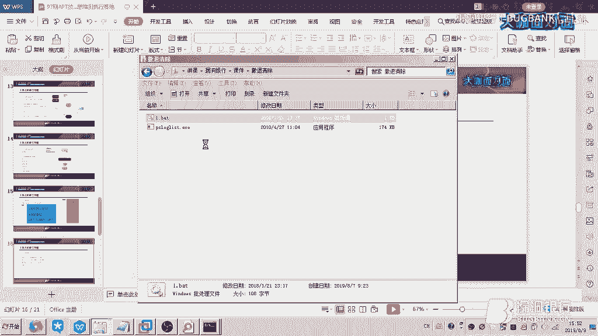

# 漏洞银行丨APT技术解析从攻击思维到执行落地-Fplyth0ner丨咖面97期 - P1：97期 APT降噪_x264 - 漏洞银行BUGBANK - BV1A4411S72o

(音乐)。

为知识而存，因技术而生，各位小伙伴们，大家晚上好，欢迎参加第97期，漏洞银行安全技术直播大咖面对面，我是今晚的主持人年念，本月是我们为大家倾情推出的团队直播月计划，整个八月。

每周五晚上都有Website团队为我们带来精彩的议题内容，那么，今晚我们邀请到的大咖，是来自Website团队的核心成员ForPleasant的大咖，他带来的议题内容是APT技术从攻击思维到执行落地。

想对APT技术内容有更多的了解吗？感兴趣的话，要记得听到最后哦，那么下面就让我们有请ForPleasant的大咖开始今天的直播分享吧，大家好，我是今天的讲师翔龙，是W3B Safe核心成员。

也是这次W3B Safe的月直播的第一节，然后简介就随便看一看吧，那么我们今天讲的这个议题是关于APT基础的解析，我们首先会从什么是APT开始讲起，然后我们简单的说一下。

APT和SRC这个漏洞挖掘的思维和一些侧重点的不同，还有我们第三部分是实战的一个思考环节，和我们要用到的工具，我们用到的技术，还有我们要做的流程，第四部分是要讲一些实际发生在我们身边的案例。

是一些已经被公开的案例，我们会讲述一下这些团队，这些高低持续性威胁组织，他们在做这样的事情是如何策划，并如何攻击的，最后我们讲解一下我们应该做什么，我们不应该做什么，那么什么是APT。

其实我本人理解上的APT，其实和常规的渗透测试区别不是太大，因为在工程方面用到的技术可谓是五花八门，但是就那么一些五花八门的技术，只要我们对操作系统，我们对系统的一些功能和它的一些默认的一些配置。

很熟悉的话，我们就可以熟练的进行操作，那么APT攻击即高级可持续性威胁攻击，也称为定向的威胁攻击，指某组织对特定对象展开的持续有效的攻击活动，这种攻击活动具有极强的隐蔽性和针对性。

通常会用受感染的各种介质，供应链和社会工程学等多种手段，实施先进的持久的既有效的威胁和攻击，那么首先我想说一下关于定向的这个问题，呃，实际上已经很明显的可以看出来，它和一般的攻击行为不太一样。

一般的攻击行为可能只是说对你的系统产生一些破坏，或者说是他只是为了图钱财，但是用定向的可能是对你系统内部的一些资料，对你网络上一些敏感的数据比较感兴趣，当然他和渗透测试区别也其实可以看作这些东西。

比如说渗透测试，他可能只对你系统的权限，对你系统的漏洞操作权操作的一个信号权限，呃，那么我们一般把APT上面使用的一些恶意的exploit，我指的是那些没有被发现的APT组织。

他们他漏洞的生命周期可能是在第一阶段到第五阶段中间，就是说还是处于零类的这种状态，当他们这个漏洞使用之后，他们就不会再轻易的去使用这个漏洞，或者说使用一次即被发现一次被披露一次。

然后在第五阶段到第七阶段，这中间的一些他们其他人用这些漏洞进行攻击的行径，可以说是一种没有目标的行为，或者说只是为了钱而去做的一些事情，或者说纯粹的为了搞破坏，这样的攻击我们不会被称为定向的攻击。

我们现在讲APT和SRC漏洞挖掘思维和侧重点的不同，那么做渗透的可能都会有体会，做SRC漏洞挖掘可能我们用几周或者几天的时间，把它的资产整理一遍，然后到处的去找漏洞。

尤其是一些XSS储存型的反射型的都可以，还有SQL注入RCE和一些组件的一些安全问题，这些只要已经发现就会选择提交，那么高级的攻击呢，他们有可能几个月甚至几年的时间都在持续的对你的资产进行一些搜集。

然后持续不断的去挖掘你的漏洞，而且他们会更加注意隐蔽自己的行踪，或者说他们的行为在一般情况下，会被判定为一些无意间去检测他们网站的人，但是有可能这些人都是在做参与这件事情。

尤其是一些能进入内部网络的一些漏洞，只要发现的话就会开始进行策划如何入侵，如何的去更深一步的再获取你的网络权限，这边的蓝方呢，实际上我可以代表它是一些高级的攻击。

在红方可以说是一些漏洞挖掘摆帽子之类的事情，比如说摆帽子先挖洞，挖完洞之后把漏洞发送给应急响应中心，然后他们对这个漏洞和技术部交流一下，交流一下之后看一下这个漏洞该评估多少，然后再着手进行这个修复。

或者说他们有一套自己的标准，最后再去对你进行一个奖励，那么高级的攻击呢，可能是他们发现漏洞，但是他们不会去洗脚，他们不去洗掉漏洞，他们会把这个漏洞积累，积累到一定程度的时候。

利用他们去策划一场很庞大的攻击，就任何一个小问题都可能成为他们攻击的焦点，例如说在昨天，我听说我们有些人去HackOne提交一些，组件版本这样的一个信息泄露，他们给了20枚刀还是40枚刀，我忘了。

但是在国外的话，他们可能认为这个是一个安全隐患，但是在国内的话，并没有多少厂商会这样认为，甚至入口令的话，他们也不会去收，或者说一些影响范围很大的洞，干脆他们就不会去认为，这个是我们要奖励的对象。

所以说国内和国外的安全意识还是有很大的不同，主要在于管理者，他们如何去看待安全这个问题，那么话说回来，在高级攻击中，他们会积累漏洞，然后策划一场攻击，在策划攻击之后，他们会着手进行权限的提升。

所谓的权限可以是系统权限，也可以是你网络上的权限，在提升之后，他们会想办法去控制，去持续的去控制，目的是尽可能长时间的不被发现，然后并在你的网络里面监视，可以说监视这个词用的比较恰当。

然后之后他们会在这个过程中，继续搜集你的一些信息，最后实现无声无息的这样，去实现他们的目标，那么我们讲第三阶段，攻击的阶段和一些流程，这张图是我认为的一个流程图，也可以说是脑图。

然后也是我在做一些渗透测试的时候，会用到的一个思路，首先我们对目标进行信息搜集，他的信息搜集不只是做资产搜集，这样他可以搜集你的用户信息，你的目标用户是谁，他平时在干嘛，在用什么账号。

经常使用什么聊天软件，经常在哪一个社区活跃，或者说哪一个圈子活跃，这些都是我们掌握的目标，掌握的信息，那么还有邮箱的信息和账号的信息，供应商的信息其实也是非常重要的，例如美国在阵亡病毒传播之前。

他们为了写这个阵亡病毒，实际上是用了很多的，供应商信息的一些搜集，包括伊朗的总统在对有浓缩装置，有浓缩的一个仪器进行宣传的时候，无意间爆出的一些设备，公共设备的一些信息，是被美国方面给掌握了的。

然后他们就利用这些透出来的信息，去搜集一些供应商，最后成功地在他们的实验室，模拟出了和伊朗有浓缩，一些公共设备的完全的模拟，最后通过这套设备，去完成阵亡病毒的一个制作，所以说供应商信息是非常重要的。

然后目标业务的环境，这个像我刚才所说，可以尽可能地模拟目标的网络环境，系统的一些环境，这样去方便我们去对我们最接近，实际情况的这样一个靶场进行渗透测试，进行权限维持，或者说把要考虑的一些事情。

全部纳入到这个靶场中，这样可以一击致命，或者说极大的提升了我们，付出的成功的几率，也减少了我们的代价，比如说时间的成本，那么到后面就是说，我们会进行一些方案的制定，和权限的提升，然后还有权限的一些维持。

和一些反溯源的一些技术，最后我们会实现我们的目的，而且有可能在一次行动中，我们要实现的目的并不是一个，可能我们需要对目标进行更长久的控制，那么信息搜集我这边也是，画了很多条思路在这边。

因为贯穿在整个的这样的攻击阶段，我们的信息搜集都是必不可少的，每做一件事就要去，对当前的变化的这样一个信息，重新制定我们的方案，重新的对目标进行一些评估，最后我们会做痕迹清理。

当我们撤出他的目标系统的时候，我们可能会着重的，对应用的一些访问日志，流量的日志，登录的日志和操作的日志，当然如何去知道我们的日志位置，只需要我们前期的信息搜集，我们可以分析这一块。

他用的工具寻找他日志产生的位置，或者说访问他会在某些地方存在痕迹，我们要着手去关注他，那么这一套下来，可能要耗费几年的时间，或者说是更长的时间，如果说想要非常长久的进行一些控制，那么我们需要的是小心。

但是又谨慎，然后我们进行非常周密的思考，我们每一个举动都是在被监视状态下进行，我们怎样不打草惊蛇，怎么样才能不会有太大的动静，这才是APT需要关注的一些事情，整个的信息搜集的阶段。

是贯穿在整个公益活动中，我们每时每刻都要进行，并列重点的关注的事情，像资产的一些信息搜集，我们可以使用国产的法师的萊尔子云Blob机，或者说现在最常用的一个Subdomain Boot。

Zomai 制造创意公司的一款产品，中规制研和微波情报，RouterSearch，这是一款俄罗斯人搜集的一些路由器的漏洞，在这款工具上可以对它进行扫描利用，而且最看重的功能是扫描一些入口链。

路由器的入口链和网关的入口链，还有它的扫描速度和准确率也是相当的精细，然后还有一款S扫描器，就是我们常看到的以前用来做抓击那种扫描的S扫描器，它的特点是体积小，准确率高。

然后还有它S扫描器是支持Syn方式扫描，也可以自定义一些线程，自定义端口范围，是一个很便携的工具，当然Syflexcan也可以，但是我个人认为它的扫描速率相对较慢，但是它是一个可适化的环境。

对于一些特定的，它适合配置好之后，我们重复的去反复的去使用它会提升我们的效率，不用去定义一些麻烦的参数，还有Nmap，Nmap大家都知道，这个我就不太详细去说，Pulsecan。

我这边指的Pulsecan是Compostrict上面的Pulsecan工具，它一共有三种扫描工具，扫描方法，一种是ARP扫描方式，用ARP的方式去对主机进行发现，还有就是用TCP方式。

就是也是正常的方式，还有一种是Ping命令的方式，然后还有一种它默认的方式，用四种方式，可能是四种吧，然后这是资产收集我们先讲这些思路，可能还会有因为信息的收集是无处不在的。

我们看到的每一帧眼相都是可以利用的信息，那么目标用户的信息，其实无非是在真实生活中，我们看到一个人他的一些信息都可以成为目标的用户信息，比如说他的姓名，性别，电话号，出生日期，工作的类别，QQ，微信。

和一些他在网络空间里面一些虚拟的活动范围，和他物理的活动范围，那么针对前12345前五条就中间从电话号开始到微信，这中间的信息其实都可以作为社会工程学工具的焦点，而且可以用他们身上字典去对表现爆破。

很公众的一个例子就是，被热火链爆破出来那一次，实际上是信息收集的一个完美体现，还有虚拟的活动范围，这指的就是我前面说到的这个人在什么圈子里，这个人经常在哪个地方触摸，就是哪个论坛或者是哪一个网站。

他会登录或者说他经常用什么社交软件，他什么时候会上线上班上线，什么时候下班下线，这都是他的虚拟的一些活动范围，我们可以针对这些去对目标进行一个脆弱式的一个行动，然后还有一些物理的活动范围。

我这里指的物理活动范围是他真正触摸的地方，在一些场合下对他触摸的一些范围，进行BitUSB攻击其实是非常有效的，但是我们不能这样去指定，我们要攻击哪一个目标用户，因为我们的目标是有很多用户的。

这样我们会搜集尽可能多的目标的一个活动范围，我们对他进行BitUSB的投放，可以获得出其不意的效果，那么下面是邮箱收集邮箱信息的收集，这里面施工库是很有用的，在我做过的一些试测测试里面。

施工库其实帮助了我几次直接定位到对方的场合密码，然后泄露的数据也算是在其中，谷歌百度和单位的官网和群发的邮件收件列表，也是可以让我们去搜集关于目标用户信息的很多很多东西，也可以针对这些邮箱进行一次爆破。

说不定就可以拿到一些很有用的信息，账号的信息呢，那就是常用的账号和常用密码，这点就不说了，当然供应商的信息，这要提一下，我们会用提供服务的提供服务者的信息和合作厂商。

招标合作的一些声明和一些软硬件的资产来源，我们用这些东西去实现对目标的业务环境，或生产环境这样一个搭建，以便我们更模拟去做一些实际的攻击，或者说我们可以对他进行一些供链的攻击，那么目标的业务环境呢。

就是我刚才说的一些我们可以在硬件上模拟的事情，但是软件的事情我们就要用这个方法去考虑，比如说我们可以尽可能用一些XSS探针，或者说是link远程夹载图片的方法，去搜集一些目标操作系统信息。

浏览器信息和他安装哪些服务，哪些应用，还有他的在线的时段和他端口开放情况，其实有些时候我们在这一阶段，针对运维的攻击方法，其实比较有效，比如说一些端口开放情况，可能做开发的也都会知道。

他们在做一些服务的一些提升级，或者说是他一些网站的一些更新变动调试，debug都会频繁的开关端口，或者说是端口号的改变，其实我们在一个很长时间范围内，对一个目标的端口的开放情况进行检测。

就是说他端口只要变动了，我们这边会有提示，我们这边有监控软件提示我们，比如说3306端口变成1433，我们其实可以思考一下，他是不是从MySQL的一个数据库，换成了Mocksoft Server。

这其实也是一些很有用的信息，然后还有第二个，我们如何定义这个方案，我们这个方案应该是可随机应变的，而且动机很明确的方案，所谓动机明确是我们知道我们要做什么，不是说像无头苍蝇一样。

那么在我们前期的一个方案制定，我们可能会把网络权限放在首位，那么这样的话，我们其实可以从信息冲突点上，对一些资产的入口点和一些攻击路径，和一些网络拓补，更关注于这些方面上。

因为我们是要先获取他的网络权限，毕竟你是客人，人家是这个IP的主人，那么看右边这个网络拓补图，是我在一次真实的环境遇到的，当时我们很幸运的拿到了Router2。

就是中间这个Router2下面的词语的一个访问，然后我们对它们进行一个测试的时候，我们其实对123456，这六个词语里面都进行了这样的一个测试，但实际上我们发现只有三和四的，这样的一个网络环境。

我们进入了之后发现，他们处于目标的真实的一个内部网络，然后呢，我们的目标就从三和四的上面，转向了12345。duman。cc，这样的一个预控环境里，这样的话我们其实的方案就从三和四。

转向到了12345的横向渗透，和一些和对我们的预控服务器，Main1，Main2，Duman。cc，这样一个横向的这样的一个纵向的一个渗透，就横向和纵向都是这是我们要考虑的一个信息，最后呢。

我们在这个一些配置文件上面和一些它的，业务区的一个接口上面，我们发现了另外一些的段，就是说它的公共区和一些办公区，但是我们去无法访问，这个时候其实我们那边画了一个网络拓补，就是像这个样子，其实很简单。

肯定是Office和Industrial，Control，这两个区域是可以对我们所有的网络进行访问的，但是我们外部的网络是不能访问到内部的网络，所以我们这个时候其实我们的重点，就是可以放在预控服务器上。

因为预控服务器其实有着这整个域的一个统一管理权限，预控服务器是可以对这两个更深入的网络层进行一次访问，我们就用了各种方案，将预控服务器控制之后，再去访问的这个生产区和办公区，然后最后还有他们的路由器。

这样的话我们实现了对整个网络的这样的控制，所以说这个信息搜集也会伴随着我们整个对内网的渗透阶段，也会把方案进行这样的动态调整，第三阶段就是我们权限提升，就是我们渗透测试的一些核心的目标。

我指渗透测试阶段的核心目标，资产的一些权限提升，我们可以侧重于这个入口令，默认密码，在我们没有一些零内容的前提下，这两个其实是比较合法的一种防范方式，它不会触发一些警报，安全的一些问题。

也是最隐蔽的一种方式，虽然说诋毁比较小，但是在没有安全意识的人员上面，这种问题极易容易出现，而且说就算能安全意识好，我们或许可以从信息搜集上面获取到这些口令，那么这个SQL注入漏洞和XSS。

CSFXXE，RC文件上传，任意文件读取文件包含或者JAVA的中间键漏洞，源代码漏洞，或者说是一些系统级的远程命令执行漏洞，或者说是一些零对都可以对我们进行一个资产的一个权限的提升。

我指的权限是防污权限，然后呢如果是本地的权限的一些提升的话，我们可以使用这个，呃，在Hub上上面这个Windows kernel exploit，或者说是这个Linux kernel exploit。

然后一些ExploitDB上面的这个漏洞库，然后其实嗯，这三个其实可以提升大部分的系统，当然这些系统可能是不在微软的这个生命周期里面，对于Win10的系统来说，除了零对利用的话和一些入口令。

或者说是一些呃，桌面远程桌面的一些访问方式，我们可以对它进行bypass UAC这样的方式去实现权限提升的话，其实没有多少的机会，但是Win10一般不会作为服企这样的一个业务的这样的一个需求，嗯。

上面有一点忘了提就是资产的权限提升，呃，其实这个我们可以用，呃，制造创业的一些漏洞组件，就是Cbug平台，然后还有呃，我个人写的一款框架，其实也是收收入了很多漏洞，当然不会太全。

但是我比较喜欢自己用的工具，然后还有呃，少羽的一些Github，他们的少羽的那个也不错，我非常的喜欢，非常nice，嗯，后面最后一个提升一下，说一下网络的权限提升，就是我们可以从这个网络访问到那个网络。

我们可以用的一些方式，比如说SSIF，就是呃，服务请求伪造，这样的一个方式，嗯，他经常会出现一些呃，在内网一些测试上面的地方，呃，或者说是weblock的一些SSIF，嗯，还有regold。

是一款很神奇的流量代理工具，当然现在的沙软都会对它进行一些查杀，但是经过一些加密的一些处理，其实可以让它做到免沙的，还有iterom，修影主管工具，呃，但是现在不太稳定，推荐使用SSIF。

还有nightkit，LCX就是端午转发，https，是http，tunnel，和scos tunnel，啊，这里面那个这个scos隧道呢，呃，我个人偏向使用copperstrix上面的scos5代理。

呃，因为它是无文件落地的形式，嗯，更舒服，当然大家也可以用powershell的，powershell的也可以，python的也是可以的，和profaxer，这是一款客户转的一个软件，连接代理用的。

它的功能，我喜欢两点，一个是，在全局上对人进行代理，呃，也可以是说，做代理链，可以穿透多层的scos5，这样的一个协议，呃，直接打到内部网络，和scoscap64，也是可以实现对应用的这个流量的转发的。

那么这个阶段我属于，呃，我下面举这个例子呢，是刚才我们说的这个曲线提升，左边的就是我们system info，找到一个，呃，这样的一个，嗯，他打多少补丁，这样的信息，这是我自己主机的，然后。

我们把它放到一个软件，放到一个网页里，叫提前辅助提前辅助网页，这个网页上我们只要把我们搜集我们这些呃，系统的这些漏洞，就是补丁漏洞的补丁给复制到提前网页上，就可以他就可以帮我们整理出哪些漏洞。

本地提前的漏洞，是我们可以使用的，嗯，像右面这幅图一样，他说以为你找到以下的一些XP，是可以的，嗯，最后呢，我讲这个，全线维持和反溯源的一个思路，当然这一切都是为了更持久化的控制。

只是为了不被立刻的察觉，嗯，可行方案是我这些可以说是用一些自制的免杀write的系统，呃，或者说是couple streak也是可以的，当然我们要去couple streak的一些指纹，呃，比较老。

但是也是一种方案，MetaPtr是对他进行一些免杀的话，其实是可以舒服的使用，呃，我再推荐一块，Imprime，就M E M P I R E这款工具也是相当于MetaPtr的，可以说也是功能很强。

然后还有脉冲双星，就double pulser，可行的一些技术呢，是一些加密技术，比如说https也可以说是用http进行数据传输，当然会被截获，而且是明文的很不安全，那我们也可以在数据上对他进行加密。

也没问题，DNS是比较隐蔽的一种方式，ICMP的这个这个协议也是可以去藏一些命令，但是相比来说，DNS和ICMP的方式是比较慢的，还有一种就是直接用tcp连接的方式，也是可以速度相比他们要快很多。

我右面讲右面看到这个图片，其实就是我构思的一个C2网络，虽然有些简陋吧，但是他的思路是这个样子的，我们的攻击者首先去购买一些三合大神的身份证和一些专用的银行事件套，然后他们使用物联网卡。

用这两个身份去购买物联网卡，然后就可以用这个伪造的身份去购买我们一系列的节点，比如说，注册公众的CDN购买C2服务器，然后还有SSR、V2、RY这样的一些隧道，最后呢，我们在上面搭建好了所有的东西之后。

去通过这一套系统或者说更引其他代理去控制目标主机之后，我们就可以将它维持在这个网络里，这里攻击者和目标呢，其实是有很多这个反溯源的这些套路的，比如公共CDN，他是将域名解析到一些公共CDN上面。

但是不会查到我们C2服务器的真正IP，而且这些账号物联都是用一些伪造的身份去购买，本身溯源就比较困难，当然如果想溯源是可以的，只不过成本比较大，然后攻击者通过V2、RY和SSR这样两个隧道。

在国外的两个隧道，其实是可以去利用C2服务器，然后通过公共CDN对target，就是我们控制目标这样一个间谍的控制，实际上是可以隐藏我们的行踪的，而且十分隐蔽，再讲一下系统权限维持和反溯源的一些技术。

当然我这边总结的可能不够全面，推荐大家去看天竺信的阿尔法神士，他们在8月8号这个样的一个文章，我这边分享的是端口的附庸技术，我们可以通过三款工具去实现。

例如说reCouch和V2M和DoubleProcessor，我们什么时候需要用到端口的附庸技术呢，就是比如说遇到系统的防火墙，或者是IP的一些安全策略，一些杀毒软件。

或者是我们要从内网端口进行监控的时候，我们可以用到这个技术，我们讲一下什么是端口附庸，就是说原本你一个端口是运行一个进程的，是监听一些数据的，但是呢你可以在这个端口上面，执行去安装你的后门。

而且是利用它的已开放的端口，去达到一个这样的实现，这样的话可以绕过我们的系统防火墙，我们的应用防火墙和一些IP的安全策略，也可以绕过一些杀毒软件，非常隐蔽，然后我们右边这个模式图，也可以很详细看出来。

比如说一个我右边讲解的是IS，基于IS。SOS这样的一个文件的端口附庸技术，可以看这张图上，我们的攻击者通过互联网去访问到SERAL，在公网上去映射的这样的一个巴林端口。

我们直接通过巴林端口就可以达到对目标的控制，当然这个是需要IS服务的，然后呢我们在权限维持和反溯源这方面的思路进行分享之后，再看一下最后的目的实现吧，这里没什么好说的，真的可以说是一万种方法实现目的。

比如说我们要传输数据的话，如何不会让一日制或VRSHACK，这种监听就是数据的一个捕获的一个工具，有关分析工具去监测我们输送的什么内容，其实可以拆分字节去对数据进行传输，比如说传出来1bit数据。

然后就停止一些时间，传出1bit就停止一些时间，虽然这样非常缓慢，但是是可以做到就是我们传输数据的时候，不会被轻易的发现，而且不会引起一些流量的异常，比如说官员这边看到流量突然上传流量涨到一兆米每秒。

肯定会出现肯定会有些察觉，服务器又不会真的进行一些自动的更新，或者说我们要把目标控制它然后干掉怎么办，其实这里也有一些方法，也就不再赘述了，只要我们会保证在当前阶段不会被溯源，下面就是最后的一段。

我刚才说到痕迹清理，其实痕迹清理上Windows提供了一些很好的工具，比如说应用程序自带的日志文件，这个我们也不再赘述了，登录日志可以用Windows的事件管理器，和一些Linux上面也可以有登记痕迹。

可以对它进行一些删除，操作的痕迹也是Windows的话筒上，就是Windows事件管理器，Linux主要是一些命令上面的操作，命令行的操作，我们可以把它黑死水清空，流量日志呢，例如说ice日志。

ice访问日志，apache的一些日志，inject日志，tomcat日志等等，这样的一些日志，我们事先在攻击阶段，攻击之前的信息搜集阶段，都要讲这些了解清楚，他们的日志存合位置。

这里我可以分享一个比较常用的思路，这个就比如我把这个byte打开，我这边是以前写好的一个工具。

用到的是posloglist，微软工具箱里的一款日志清除的工具，我这里清除的是secret安全的日志，这边是延迟15秒之后，然后再删除日志，这样做的好处是什么，就是说你如果在连接软程桌面的时候。

会产生一条日志，连接成功了也会有日志，连接失败也会有日志，那当然你退出的时候也会有日志，很多人其实被思维到的情况可能是，他们在清理日志的时候，是用远程桌面的方式去清理，他们想去做一些预控的一些控制。

预控的一些操作，但是必须得登录远程桌面，才能对控制台进行一些详细的管理，或者说是更直观化的管理，但是呢，他们在退出之前清理的日志，结果退出的时候会在Mail系统留下一条，特别明显的痕迹。

什么日志都没有的情况下，他退出了，那么第一条就是他的日志，直接会被发现，我这边就是我们退出之后，再清除日志，最后再要命令行将用户删除，这样就可以实现反溯源，一个很简单的反溯源，当然不是很高深。

如果有其他思路的话，其实我也是很喜欢学习的。

第四个，我们去分享一些实际的案例，下面我们就是分享一下，这个币安被盗和驱动人生供应链的一些事件，首先呢，币安被盗这个事情是在，我如果没记错的话，就是比特币大跌的一年，就是前两年吧，可能是17年。

和勒索病毒同一年，我很清楚记得，当时勒索病毒将比特币，抬高价格至接近一万人民币以上，一万人民币以上，然后后面经过这样的一个对盗的事故，导致他一路跌盘崩盘，那么首先，这波攻击者呢。

其实对币安网搜集了很长的一段时间，而且在对他们用户信息的搜集上面，是下了很大功夫的，他们是先去做了一个假的币安网，去搜集这些用户，这些大庄他们的用户名和密码，当然他们还是有。

像这些交易平台都是有二次验证的，然后他们一直对这个感觉很头大，但是后面经过他们不懈的努力，终于发现，币安网突然有一天开放了一个API，这引起了他们的注意，这个API可以在用户访问之后。

用户第二次验证之后，可以保留那条cookie，也就是说攻击者就可以利用这条cookie，持久的对这些币安用户的账号进行控制，这样他们就控制，他们在控制了已经掌握一大批的用户名和密码之后。

再利用这个API去获取了很多，很多用户的这样的权限，但是他们并不是立刻就这样做的，他们在得知API之后，在我的思考里面，他们其实是做了一次很详细的攻击策划，比如说他们会想，我拿到这个用户权限之后。

后面怎样去进行一次攻击，那么很可能是我们在提现的时候，可能会引起关注，就是引起一些交易的平台的一些警惕，可能会停止提币，但是在提现，除了提现的其他操作，可能不会被关注，不会受太大影响。

所以他们选择两种方案，第一种提币走人，第二种就是将币子抛售，然后引起整个市场的价格下跌，最后在其他市场实现杠杆的买赔，当然他们在尝试第一条思路的时候，提币的时候，被BN准确发现准确察觉。

然后关闭了这样的一个提现功能，冻结了这些账号，这个提现功能就被这样的kill掉，然后他们转而言，直接转向对这些币子进行抛售，成功实验的，他们在其他地方挂了一些低价空单，成功获取了一大笔资金。

当然他们夺取的是整个这个区块链，这个市场的利益，并不是说针对某一家，只不过BN可能是他们的下手点，在这场攻击中是这样的，然后第二场呢，也是最近发生的一起，新闻人生的贡人链攻击，这个攻击其实说原理上面。

其实不是很难，我也看过他的报告，实话讲，很多攻击的套路，其实都是我们常用的，但是呢，他在信息搜集这方面，做的可谓是炉火纯青，他通过两层跳板，或者更多层跳板，跳到了对方的网络里，而且实现远程控制。

长达一个半月之久，这期间他做了什么呢，他先把自己，他可能是先把自己写好的，这样的一个贡人链攻击的手段，给研究出来了之后，他一直在搜集信息，等待一个时机，这个时机就出现在，这个公司员工全部外出的时间。

这一段时间内，他对这个驱动人生的，所有的驱动下手，在他这些病毒里面，感染了一大批的用户，这些用户的，其他病毒又会去传播下的，传播到其他很多地方的网络，攻击链通过驱动人生，直接辐射到了，n多的计算机用户。

不过这个人，从公开的这样的一个角度来看，也是没有被溯源到的，但是他的攻击行径，已经被溯源的一清二楚，那么这个案例就分享到这里，其实都是一些公共的案例，大家感兴趣，可以上网自行去搜索去思考一下。

有什么能做，有什么不能做的呢，这点其实我之前提到的，一些思路上面也有，就是说你如果在，他对目标的内部网络，或者在目标的环境里面，做了很大的动静，其实会被马上的去发现的，比如说你做ARP读画。

这样管理员不知道也罢，但是一般的网关，在你没有得到网关权限之前，都会被监视的，被报警，即便是网关做了ARP这样的一个防护，没做ARP防护，即便是没做ARP防护，你这样直接去ARP读画，那些用户的计算机。

也会去发出警报，继而通知网络管理员，大规模的自行扫描，这个就不用说了，尤其切记的是，不能使用SYN的方式，进行大规模的扫描，关于SYN方式，其实好多人说，它是黑客的专用的一个扫描方法。

因为它不需要三次握手链接，就可以获得对方目标的开放端口，其实速度是非常快的，但是很容易也会造成一些网络堵塞，影响网络通信，所以说也会对目标的环境产生很大的影响，这样的话，也是不建议在隐蔽的情况下去使用。

还有自动化的漏洞扫描器，这个就不用多说了，如果你真的想用自动化扫描工具的话，我建议还是在搞一些进度测试，或者说是，重测上面可以利用这种方式，因为它确实不会造成一些，太大的危害，但是它的动静是相当大。

不适合长期的去隐蔽，和一些攻击方的资产泄露，比如说一些，漏洞APT的情报，它的一些IOC，或者说是被察觉的一些资产，这个是很切忌的，比如说你没有通过代理直接访问对方的服务器，那么你是有一条记录的。

这个记录很可能成为数源的关键的一个，一般的攻击人员在渗透的时候，他们不会忘了开代理，但是呢，他在渗透之前肯定会对目标访问很长时间，或者是有一条两条或者更多的访问记录。

其实这些记录就可以说是被疑似攻击者的一个IP，也是可以引起警惕的，流量异常这点就不用说了，还有就是长期的使用同一批的资产，这个是针对于说资产泄露怎么办，我们如果还继续使用的话，其实危险系数是非常大的。

那么今天的分享就这样吧，然后还兴趣的，其实可以来私下交流，还有就是我讲的东西可能很基础，可能很多大佬看不上，但是只是一个思路的分享，我觉得在做一些权限维持上面，还是要多费些心思，也希望那些师傅们。

其实不要太恶言相对，因为本身技术上面是没有什么可以被歧视的地方，我们学到了就是对的，可能有些人起步比较早，好吧，就这样，[音乐]，[音乐]，[音乐]，[音乐]，[音乐]，[音乐]，[音乐]，[音乐]。

[音乐]，[音乐]，[音乐]，[音乐]，[音乐]，[音乐]，[音乐]，[音乐]，[音乐]，[音乐]，[音乐]，[音乐]，[音乐]。

