# 漏洞银行丨CISP-PTE认证指南-冷白开丨咖面86期 - P1：86期丨CISP-PTE认证指南-冷白开 - 漏洞银行BUGBANK - BV1Yb411k7do

(音频播放)。

为知识而存，因技术而生，小宝宝上好，2019年新年快乐呀！欢迎参加第86期洛东银行安全技术直播，当卡面的面，我是主持人秋秋。有一段时间没见啦，那有没有想我呢？嘿嘿，那今晚是2019年的第一场卡面直播。

所以在场的，无论你是老朋友还是新朋友，都一定是真爱粉。今晚我们的卡是来自风铃安全团队的白开，他现任安徽航天信息科技有限公司安全工程师。今天将为我们解决一个令人纠结的问题。

CISP PTE认证到底要不要去盘它？那正好是PTE之争的老冷将来解答这个疑惑。欢迎各位观众伙伴登陆直播间，在栏权区自由讨论，也可以随时发出提问。在冷白开大咖演讲完毕后，还有互动问答和福利环节。

大家可以交流探讨。问答结束后，老冷还会选择一名幸运观众，赠予书籍黑客大曝光第七版。那事不宜迟，下面就请冷白开大咖开始今天的分享吧。好的，大家好，我是冷白开，来自于风铃安全团队。

目前呢是在安徽航天信息有限公司做一个甲方，一个人的安全部，就是一个人对整个研发嘛，然后今天给大家来讲到的是这个CSP-PTE的一个认证，整体的从考生的，就是你去考试的一个角度，怎样去考这个诊。

然后我会通过以下这么几个目录来给大家讲解一下，因为现在是一个比较快餐化的一个时间嘛，可能很多人没有兴趣去往下面听一些很详细的东西，所以我是直接一上来就告诉你总结一下。

把所有的东西单点的全部拎出来跟你讲一下三个小点，然后再再会往下面讲CSP-PTE的它的一个简介，以及它的一个认证范围，其他怎样去划分这个分值，最后再给大家一点一点一点的去讲他考试的相关的知识点。好。

现在如果没有兴趣的，现在已经直播结束了，好，跟大家开个玩笑，首先第一点CSP-PTE这个证书它值得考吗？它答案是值得，为什么呢？因为这个证书，至少目前狭义的严格的来说。

它是目前渗透测试方面的唯一的一个国家级的人数。第二个问题，大家可能会觉得这个CSP-PTE它靠不靠谱？我可以告诉大家是靠谱的，为什么后面会讲到它的一个国家级的一个背书？然后就是大家最最关心的一个问题了。

就是CSP-PTE它容易考吗？看完这个PPT之后，你就知道它是非常容易考的。好，提过了，我们来严肃一下。首先，什么是CSP-PTE呢？它这个文档是从那个中国信息安全测评中心那边出来的。

它比较官方的一个讲法是注册信息安全专业人员-渗透测试工程师，英文是后面一长串，简称是CSP-PTE。该证书的持有人员主要是从事信息安全技术领域安全渗透测试工作，具有规划测试方案，编写测试项目测试计划。

编写测试用力和测试报告的基本知识和能力。而前面我说了，它是比较靠谱的，为什么？因为它后面站着的是两个大的组织，第一个组织肯定是中国信息安全方面的一个权威，叫做中国信息安全测评中心，这个牌子是非常硬的。

然后就是它的一个可以说是技术输出吧，是网神，网神信息技术，大家现在也应该知道，网神是被某数字给收购了，对不对？所以它现在也等同于某数字。然后大家可能会经常听到一些就是证书，各种各样的证书。

可能这证书之间大家可能没有办法去详细的把它区分开来，我在这里列举了一些比较听的比较多的证书，第一个是CSP，然后双SP，以及CSP-PPE，首先这三个证，第一个证双SP，这个是最强的一个证。

最强的一个证，为什么呢？因为它属于是国际认证，是认证机构是国际信息系统安全认证协会，然后第二个是我们之前听的比较多的是CISP，它的一个划分是注册新疆圈专业人员之后。

就是我们今天重点要讲的这个PPE证书了，它的中文是注册渗透测试工程师，而这之间的区别是什么呢？CSP跟PPE它的发展机构都是中国新疆圈测评中心，这个是政府背景给做认证背书的。

学员的信息都在中国政府可控的机构手中，为什么就是这个很重要呢？是因为比如说像我们现在这样的企业，领导他们是不管你技术怎么样，或者是说有的人可能觉得比如说我某某SRC刷到了多少多少榜前第一。

某某中策平台我刷到了多少多少榜前第一，那个领导们是不关心的，领导们在乎的是什么？在乎的是有没有官方背景给你的这个机构或者是说你的企业做一个背书，你只要有了官方机构的背书，他们一看。

对的确是可以在官方上面查得到的，然后你比如说你想做政府企业国企以及重点行业，你去从业从从事这种渗透测试工作的话，这个参加一些网络安全项目，这两个证书都是非常重要的。

然后还有一个比较重要的点就是CSP-PTE是目前可以说是中国渗透测试行业当中的唯一的一个官方背书认证书，大家可以去访问一下，访问一下后面这个网站，这个是中国就是国策的网站。

大家可以在上面了解一下相关的信息，然后这个PTE呢，他本身还兼具了一个产生认证认证书，因为他晚生其实现在也等同于说是307安全吗？所以他的持有这个证书的这个人。

你可以去30的一些安抚部门去免技术面试就可以直接进去，但是呢，很奇怪的一个问题就是我也有一些30的朋友吗？部分人知道这个人数，但是也有一部分人他自己也不知道这个人数。

可能是因为这个证书他出来的时间不是太久吧？然后还有一个问题就是其实跟前面这一点是相悖的，为什么相悖呢？因为前面说是唯一吗？其实也有消息，消息说马上会出来一个CSP-PTS。

就是注册渗透测试专家这样的一个证书，但是目前来说还没有多少人能拿到这个人数，他还没有完全的出来，因为大家都知道现在比如说就拿这个PTE来说吧，他出来的时间也其实没有多久，好像是17年年底的时候才出来的。

距今也就一两年，所有信箱人员现在发展起来并不是太长的时间吗？然后这个PTS也是最近有风声才出来的，我最近也在去了解一下相关的那个信息，但是目前包括他考的范围，考的题型，考的深度，其实都没有泄露出来。

所以这个我也会持续关注的，大家有兴趣的话后期也可以找我，然后我估计你们是因为对于这个CSP的这个分类不是太清楚，我从前一开始讲的话，就是如果我讲完了之后，大家拿到这个PPT的话。

也可以去访问一下这个这个链接，这个链接的话，上面有一个公众号，就是CSP官方的一个公众号，你可以在上面去了解很多有关于CSP的一个知识，这里的话简单来讲一下，就是他的一个发展历史吧，他是CSP的话。

他是比较早期的，其实你感觉2012年其实也没有太早，对吧？中国在这方面还是比较薄弱的，或者说发展比较晚的，然后在2012年的时候，我们推出了这种CSP的一个培训体系，或者说认证体系，那个时候只有CSP。

然后只有一个简简单单的一个可以说是新鲜捐赠吧，然后那个CSP的话，主要就我了解的话，因为我没考过，我也不是太详细的知道你们到底是什么样的，但是就我了解的话，CSP属于那种评论一下就是一英里宽。

但是一英寸深，它的范围是非常广的，然后它的深度是比较浅的，就是说你要了解大量的东西，但你每一个东西你都除了了解之外都不需要太深入，比如说精通，那个是不要的。

然后他在往后面发展之后又陆续的推出了大概什么CSP-PTE啊，什么CWASP啊，然后什么CCCSSPR，还有什么CISP-ICSSI，各种各样的，包括现在因为什么云啊，还有一些什么大数据啊之类的东西。

它这个族群是在不断的扩大的，所以说这个CSP从一个单纯的证书变成了一个CSP族群，如果你是想要去从事相关的比较细化行业的话，你可以去考相对应的细化的证，比如说你现在是想从事大数据。

包括我们公司现在也在做一些大数据方面的一个应用吧，然后你就可以去考这个什么CISP-BDSA，这样的一个中文叫做注册大数据安全分析室，所以如果像我现在这样的，我现在这样虽然是甲方。

但是我从事的工作还是比较偏向于生存测试，就是简单来说挖洞洞嘛，所以我个人在思考了一下之后，我决定去考的是这个考的是这个CSP-PTE，就是为了证明我在这方面有挖洞的能力给领导看，知道吗？

其实为什么要去考证书，个人比如说我自己，我为什么要考证书啊，对不对？对于我来说擦屁股都显硬，对不对？但是呢，你要想去证明你自己的能力，因为像在我这样的企业里面，这样的比较古板的企业里面的话。

一张证书比你说再多的话做再多的事都要好，所以这个证还是得去考，包括你以后找工作啊什么的，你都可以去用这个证书作为一个敲门砖，省了你很多话，省了你很多简历上的字了，你只要丢一张证书过去。

或者说丢一个证书编号过去，比你讲再多的话都有用，对不对？然后讲完前面那些东西，大家应该应该对于CSP有一个最简单的了解了吧？然后我们来讲一下这个PTE它适用于哪些人群，就是说哪些人可以去考。

哪些人适合去考？第一个，它是适合学生去考，包括我那期，我那期的培训里面就有一个是即将毕业的一个大学生，他去考，他包括他自己已经考过了那个叫做C3E的一个证书，然后他自己也来考这个PTE。

这样的话他如果一毕业直接去实习的话，找的那个单位是非常好找的，为什么呢？因为他手上已经有不少证书了，对不对？而且还有一个最重要的一个点就是什么呢？这个PTE它是没有工作经验的限制的，包括前面讲的CSP。

它是有限制的，包括它分好像是三档吧，专科你是要将近五年左右，你才能够就五年实际的安全从业经验，你才能够去考那个CSP，本科好像是减一年还是两年，然后研究生好像再减一年还是两年。

具体的太详细的我是没有怎么去了解，但是它是有工作经验限制的，然后因为我个人学历并不是很高嘛，所以我现在还没有满足这个CSP的那个工作经验的条件，所以我思来想去还是去考了这个PTE证书。

然后第二个它是适合去做安福的人去考的，因为我们现在知道现在做安福的公司也非常多嘛，然后这个证书它其实就是360退出来的，可以说它基础来源来源于360，然后它在360企业安全那边。

如果你想要去入职360的话，在那边的话官方的解释是免面试的，但是具体是不是真的免面试那就仁者见仁智者见智了，但是有一个证书总是好一点的，然后就是其他的企事业单位的岗位需求了，就比如说我这样的。

如果去考CSP工作经验又不够，因为我总共算下来也就两三年工作经验也不够，然后呢学历方面也不够，所以如果你的岗位也是比如说挖洞的岗位的话，那么你去考这个证书是非常适合的。

讲到最后其实也是我们领导逼着我去考，没办法，然后就是如何去报考呢，这里是分为两方面，第一方面是最简单最省钱，也是花心思最少的，就是你自己去报名考试，这个地方省钱省在什么地方呢。

你只需要去缴纳你的考试费用五百元，五千元，五千元，总共是考试费用是三千，注册费用是五百，然后年金是一千五，总的下来是五千块钱，但是这个方面麻烦在什么地方呢，就是你自己去报名的话很麻烦。

然后你要去把你的资料什么东西全是你自己统计，你统计完了之后，然后你还得给考试中心去邮过去，现在的考试中心收费是全部由网诚他先行代收的，然后并且开始发票，然后第二种呢是由培训机构代理。

简单来说就是你要去上课，你去上网大概各个培训机构不一样，但是基本都在十天左右，我去的是某年，其实大家也应该知道到底是哪个公司，对吧，我去的某年，然后大概培训了将近十一天吧，然后是十一二天的样子。

然后最后一天去考试的，在这里的话就贵一点了，因为他的培训费是一万四千八，然后注册考试费用是五千块钱，总共差不多两万块钱，如果你是在公司从事这个事业的话，你可以直接找公司报销，对不对。

我是直接由公司走账报销掉了，所以对于我个人来说是没有任何影响的，在目前我知道的是某宁和某安，大家也应该知道到底是哪两个公司，他都设有培训课程，然后关于这个考试费用的话，其实前两天我在群里也看了。

有一些人提出来是不是可以几个三四千块钱啊，或者说比较少的代价能把它搞定的，我现在告诉你，除非你有自己特殊的能力，不然的话，像我们这样的普通老百姓你是干不动的，为什么呢？他现在出了一个红头文件。

红头文件是要求严格的去执行他的收费标准的，是大概18年的年中出来的，所以除非你有挑战红头的能力，不然的话不要去想一些外门邪道，然后相关的一些比如说什么知识体系啊，还有白皮书啊。

还有一些就是我去的那个培训机构，他的培训大纲，我的课后也可以分享给大家，大概就是这样的，这样的几个，包括你去你去报名的时候，如果你真的非要自己去报名的话，你肯定要填的是这个注册申请表。

这里面很多详细的东西都有，然后你要准备的是什么呢？底下有一个自查表，你要准备的是什么东西呢？其实也就那么几个东西，你身份证肯定要复印，然后学历学位的一个证书的一个复印件，比如说还有其他的一些证书。

你也可以复印过去，然后最重要的是你要去拍两张白底的白底的彩色照片，然后把这个简易，不是简易，就申请书的里面的那个电子照给他贴上去，这是你要准备的自己的话，要准备的东西，然后如果你是走培训机构的话。

你还是要准备，然后前面简介讲完了之后，我们来讲一下他的一个就是你到底要考哪些东西，以及他的分纸是怎么划分在你要考的这些知识点上面，我们可以看到这里的话是他官方那个白皮书里面抠出来的，他分为了四个方面。

第一个方面是什么？是web安全技术，第二个方面是中间件，第三个是数据库，第四个是操作系统，其实你整个看下来，他是不是都是基础，所以说这个证书就像我前面讲的，你真正实际去考的时候没有你想象中那么难。

其实挺简单的，然后这四个方面主要考些什么东西呢？比如说，web安全技术，他考的是这么一长串，其实很多东西你都是没有必要去过于纠结或者过于关心的，你关心我标红的这些东西。

你就会发现其实你要掌握的东西非常的少，比如说像什么http协议，这个东西你要说非要精通它吧，其实他也没有多少东西给你精通，对不对？你只要会逼逼抓包就可以了，但是要注意的是注入肯定是必考的。

xss像这些比较流行或者说比较在owsp里面提到的比较多位数排位比较高的，懂肯定是会考的，然后是中间件的一个安全技术，主要包括了apache和IIS，你要注意一下这个IIS。

因为包括我后面讲一个渗透大体的话，他这里面考的。net，然后aspx的环境是非常的非常常见的，然后是数据库，你这里主要关心两个数据库，一个是web的那个sql server，然后是mysql数据库。

后面这两后面的数据库以及其他的数据库其实考的并不是太多，然后关于操作系统的安全基础的话，其实就是什么呢？就是你会不会提前了，然后它的分值占比是什么样的呢？其实那个web安全基础在里面占比是比较大的。

因为整个渗透测试下来，现在目前主流的话还是web渗透测试，所以我们的嘴角可以上扬了，为什么呢？因为我们大家基本上可以说在座的各位搞web的是偏多的，对吧？PTE的它的重点是在web渗透上面。

它的占比达到了将近40%左右，而且基本上都是实操，然后中间件安全基础占20%，操作系统占20%，数据库占20%，这里面有实操，有那个选择题，就是客观题选择题，它的分值划分是这样的。

它的考试题型分为客观题和实操题，客观题是什么呢？就是一些选择题，在那个考试分为不同的那个呈现类型吧，但是现在都是五指画的，你可能需要上去点一点，但是这个我一般不怎么关注它，后面你们就知道了。

然后分为下一部分是实操类型，整个下来80%都是那个手动时间的操作，就是你要上机上机干，跟其他的那种就是填题库啊，就是备题库填题目，然后全部都是笔试的那种考试类型不一样。

PTE的话它比较在于比较重于那种实操，然后选择题跟实操题的两个划分是怎么划分的呢？选择题一共有20道，每一道一分，然后实操题分为两种，第一种是单向的知识点的，比如说一个猪，那那一题就是单向的一个小猪。

跟那个CTF差不多，比如说XSS，那那一题就只考XSS，还有一种是综合的一个渗透，就模拟了一个真实的一个网站，大概就是那样的，然后你去对于这个网站进行攻击，它的分值呢，单向的。

单向知识点的它的题型CTF的题型，它是分为5题，然后一题是10分，综合渗透呢，它里面一共是三个点，这一个点是10分，总共是30分，然后它的总分加起来20+50+30总共是100分。

而它的分值划分是70分以上即会通过，其实后面讲到一些东西的时候，你们就会觉得这个分值划分是比较巧妙的，然后给大家讲到的就是它的考试形式，以及你要注意的坑了，第一个考试形式肯定是五指画扇机操作了嘛。

因为大部分都是实操，然后选择题的话，全部都是放在那个提交的一个页面上面，你直接去上面点就可以了，然后考试时间一般是4个小时，主要主要大部分的都是在上午上，就是8点半开始，然后考到中午12点半。

这里要提醒大家一下，你最好去吃一个早饭，别到时候去考的时候饿晕了，影响你自己的发挥，那个就得不偿失了，然后下午场大概是在1点半到5点半左右，不过下午场不多，大部分都是上午场，最坑的是什么。

最坑的就是不能够使用自己的笔记本，你在考试现场只能够用考试现场提供的笔记本，或者说一些操作机，这个就比较坑了，为什么呢，因为有一些人可能跟我一样，就是离开了自己的笔记本就废一半，我是属于那种人的。

就是不熟悉的笔记本的话，我用一些工具或者说一些操作的话，我自己就很变，所以这个你自己要调整过来，一定要放好心态，然后还有一个是操作系统，它有的是XP系统，有的是Win7，这个要看考试场地的。

比较坑的是什么呢，坑在不管你是XP还是Win7，它都比较坑，有的人甚至反映是，我之前考之前，我就找一些朋友了解了一下，有的人甚至反映他有的XP还会蓝屏，就是不过这个你倒不用担心。

因为时间四个小时来说是比较充足的，所以你到时候如果真的发生了这种问题的话，就是你考着考着，嘣，机器炸了，那你可以当场举手跟监考老师或者说监考人员去，问一下说要不要换个机子之类的东西，那个你都不用太担心。

当然了，你一定要受考试机率，然后就是因为他提供的机器，所以你只能够用他提供的工具，脚本，web shell等等，但是这里面又一个坑点，就是什么坑点呢，工具是非常非常老的工具，脚本也是非常老的脚本。

然后你的web shell也是比较老的web shell，反正你总之你感觉下来就是很老旧就对了，但是这是个坑点，也是个优点，为什么呢，因为你要想比如说像这样的老旧的东西的话。

你也能够把这个考试完成下去的话，那就说明什么，这些题目是相对于简单一点的，然后就是他的选择题是20道的，你可以选择忽略掉，想想多少分过线，为什么呢，大家可以往前面看一下，他的设置是70分嘛。

大家可以想到，比如说如果你后面的实操设置是非常巧妙的，如果你是一个不怎么会的人的话，或者说不怎么精通渗透的人的话，你会发现哪怕你把50分都拿到了，单向选择的50分，单向知识点的50分全部拿到了。

你后面的大题一个都不会做，就是你根本就不知道怎么渗透的话，你会发现如果你前面全部蒙对了，但是这可能性比较小，你比如说你蒙的错那么一两题，你整个加起来是多少，70分以下了，对吧。

所以他这个分值设置是非常好玩的，你可以想到他肯定是要你把大题给做掉的，哪怕你只是做了最开始的一点点，拿到了第一个10分，然后这5道CTF单向知识型的和一套综合大题，它是分布在两个虚拟计算中的。

而5道CTF单向型的题目的话，它是需要换端口打开的，比如说什么81端口82端口83端口，这样5道题往下排的，这是一个虚拟计，然后另外一个综合大渗透，那个就不需要讲了，它是另外一个虚拟计。

但是这里面也要注意一个坑点，就是什么呢，有的考场，它的虚拟计是非常的卡的，甚至它不支持你同时开两个虚拟计，我考试的时候那个虚拟计就不是太顺畅，这个你自己要克服。

因为有的人一看到就是或者感觉到很卡就很着急，然后自己很慌，那个不要慌，因为时间对于我们来说是够的，因为它是4个小时，我当时是一个多小时吧，左右差不多就做完了，然后不太好意思出去，因为我在那个时候温漆嘛。

温漆上面有那个纸牌游戏，我在那玩了两个小时纸牌，其实好不了，然后所有的你的始操题，就是后面的所有的你要动手的题目的话，都是以夺K为得分证明的，一枚K是10分，一枚K是10分。

然后K的它的一个表现形式是八位的数字字母相组合，比如说什么A1B2C3D4这样的一个形式，然后综合渗透的话，它是按你的渗透步骤，比如说你新一泄露啊，或者说其他之类的东西，拿到了新收集的一个K。

然后拿share的一个K，提全的一个K，这样的一个按照渗透步骤的分布的三枚K值，但是你要注意这里面还有个坑点是什么呢，你去做题目的时候，你哪怕拿到K了，你会发现你从那个虚拟机里面，你抠不出来，为什么呢。

它不让你复制粘贴，所以有你千万就是往那个提交页面上面，你去做那个K的时候千万别敲错，我那次培训的时候，我那个培训班有一个人是第二次培训，他是怎么怎么怎么到这第二次培训呢。

就是因为他跟他同组的人做的其实是差不多的，然后水平差不多嘛，然后他把K敲错了，后来他对的时候就发现了自己敲错了一个字母，然后导致了本来应该拿70分的，结果没有拿到70分，所以千万不要敲错你的K。

这样是很无语的，知道吗，其实这些东西的话，就是这些注视，呃，注意事项你是简单看一下就行了，最最重要的是什么，你不要太高调，知道吗，不要太高调，为什么呢，因为单单场会有两个人，至少是两个人，呃。

一个是国策的，一个是310的人，他们会过来监考，呃，我当时听到的是考场几率是如果发现作弊，或者是，呃，扰乱考场几率的话，好像是多少，三年之内吧，三年之内不允许再考这个事，我知道有一些大佬啊。

有一些大佬可能年龄不是很大，但是能力特别强，但是呢，怎么讲呢，个人还是要注意一点，对不对，咱们是出来拿证的，而且这个证说到底，他也是一个国家级的证书，所以不要太过于高调，低调一点，对吧，闷声发大财。

再往后面讲的话，就是我们比较关心的那个出题点，他一般会分为这么一下几个处理点，这个注文件上传，命令执行，日志分析，文件包含登录爆破，快转脚本，然后最后是综合渗透，大家其实可以感觉到这个都是什么。

就是我们日常日常做渗透，或者是说拿占的时候经常遇到的一些操作步骤，对不对，首先第一个来讲一下我们渗透当中的爸爸，这个爸爸级的漏洞，sql入对吧，其实吧不需要讲太多的东西。

因为我碰到的PDE的考试题目的话，基本上你用sqlmap就够了，但是你要注意啊，有一些sqlmap的简单的小命令，你得知道，比如说你要提升他的一个注入等级，默认的话，他的注入等级。

sqlmap的注入等级非常低的，你要把它提升上去，把level提升成5，然后默认的sqlmap你去注入的时候，他的危险等级也是比较低的，他不会用一些比较危险的语句，比如说什么删除，对不对，删除啊。

或者更新这样的语句，他不会用，所以你要把他的语句的那个危险等级给他提上去，一般是3和5，提上去之后，然后你再进行正常的操作，基本上就可以了，然后大家可能会想到我怎么去练手呢，这里给大家推荐一个东西叫做。

sqlmap，这个东西你可以去用docker去搭建，我也现在是非常的去推崇docker，因为docker他这个东西很强，强在什么地方呢，强在他很简单，也很难，难在什么地方呢。

难在我反正认识一些玩docker比较厉害的大佬，玩的是初神入化，但是对于我们这种初学者来说，我们只用他来搭建一些测试环境的话，他也是非常简单的，为什么呢，因为他只是要，简单来说只需要三个步骤。

甚至说两步的，第一步你去搜索一下他，在docker里面去搜索一下他，然后把我们对应找到的这个项目给他下载下来，你如果在docker里面去搜索这个sqlmaps的话，你能够找到，这个是官方的。

acg开头的，它是官方的，然后这个可能是一个中文，中文的一个app改的，然后呢，你再把它plug下来，plug下来之后，等你下载完成之后，一到命令，直接把环境给跑起来。

你不需要像在windows上面安装那么繁琐，还要配数据库啊，配甚至说写数据库啊之类的东西，很麻烦的，我们来现在来看一下，大家稍微等一小小会啊，因为我的屏幕机比较卡。

整个安装下来是非常的简单的。

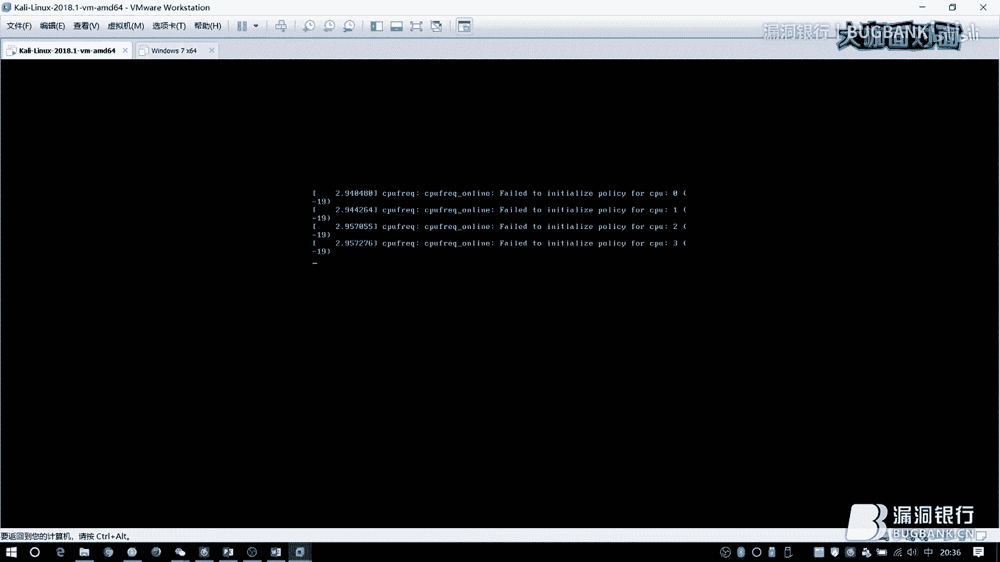

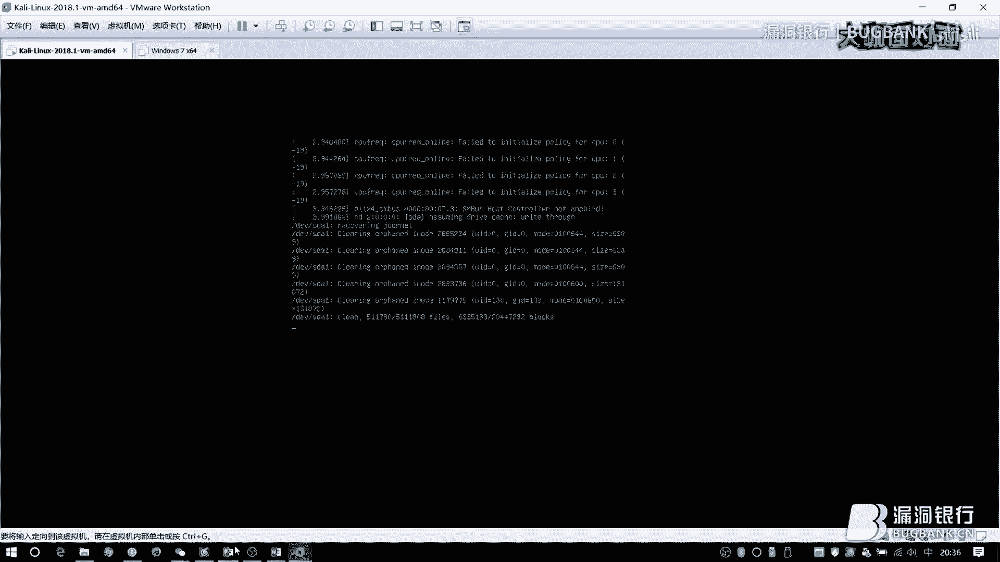

然后这个sqlmaps的话。

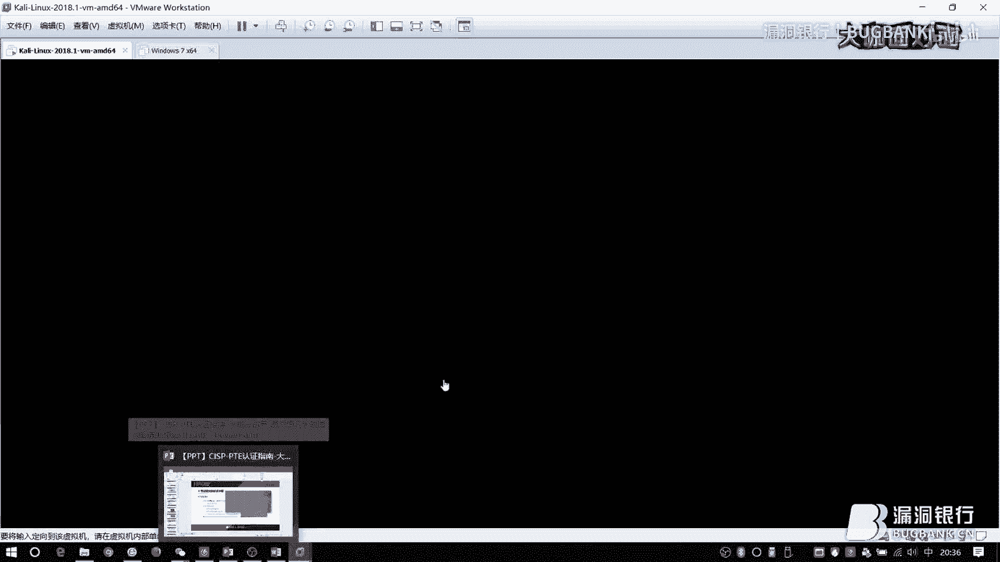

它的题目也是非常多的，你在这里面练手是非常方便的，然后因为今天时间其实并不是很长，我就不给大家讲太多的那个手法了，这个其实网上搜特别多啊，解法是特别多的，我就给大家看一下怎么样去完成它的搭建。

首先我们把docker的服务器。

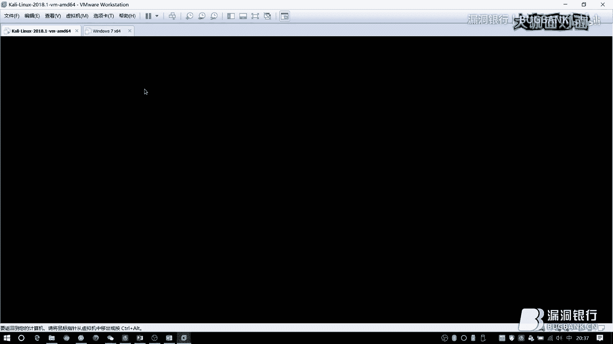

起来之后我们来看一下，因为我我现在毕竟刷的是自己的流量嘛，然后因为我担心下载速度的原因，所以我提前把这个镜像已经下载好了，就在这里已经下载好了，大家认准这个acg开头的就可以了。

然后就是docker的魅力了，你只需要简简单单一步迷你，你就能够把它的环境给搭建好了，大家要注意它刚刚开始，或者说你刚刚运行的时候，它需要它需要去点击一下安装数据，就是这第一步。

要把数据库给它自己安装上去。

然后你再去访问的时候。

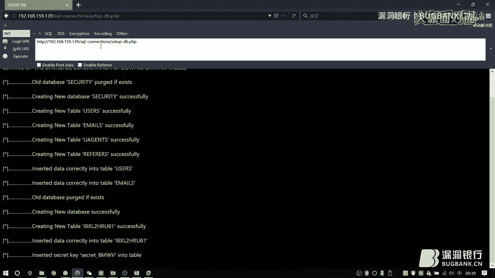

你就能够进来了，这里给它一个参数。

好，可以看到数据被抽出来了，对吧，这是简单的模拟了一个存在漏洞的一个存在注入漏洞的一个链接，然后比如说我们要去使用sqlmap进行注入的话，你在考场上面你什么都不用管，因为这个注入其实比较简单。

什么都不用管，直接给它跑就可以了。

其实如果你想要了解这里面它的注入语句是什么东西的话，你可以在后面加上它的一个显示参数，比如说-v，比如说我想要看它的pilot的话，-v3就可以了，它最高等级可以提到5，提到5的话。

你就能够看到它比如说它整个一个刷包的一个过程。

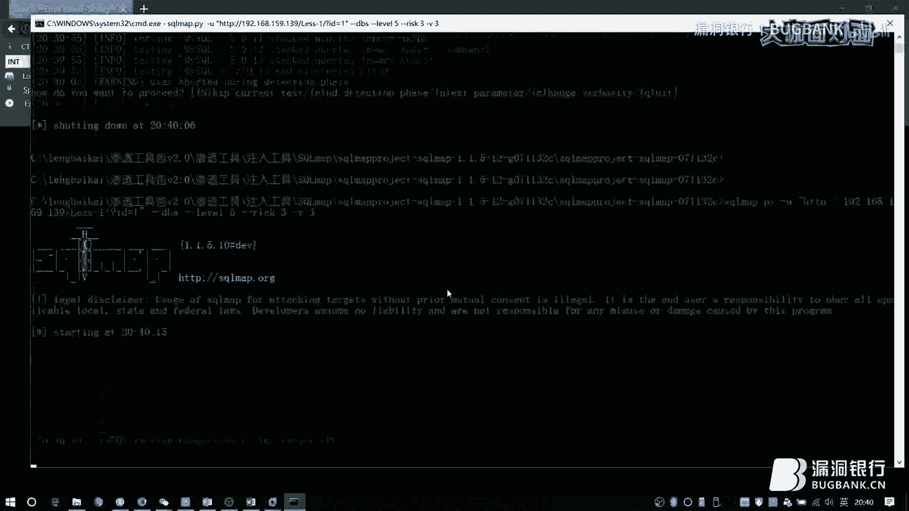

http的一个报文。

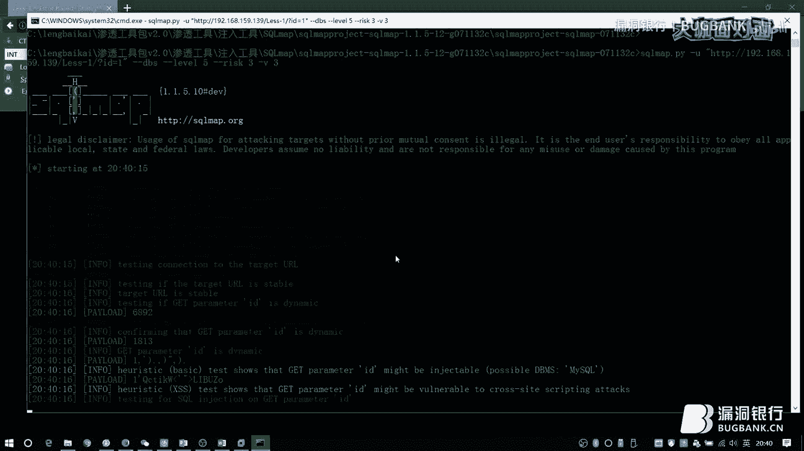

简单听一下，比如说你要想看到它的pilot，这里就可以明显的看出来了，然后你其实如果你就是玩一点滑头的话，你可以想一下，比如说你思考一下，它如果出题的话，它为了比如说简单或者说部署的一个方便。

其实大部分的一个出题者，他会选择去使用php语言和mysock这样的数据库去出题，所以你常规的一个注入步骤的话，手助步骤的话，就是mysock的一个手助，然后这里节省时间的话。

我知道你们都喜欢拿东西对吧，所以我把笔记已经放在这里了，结束的时候我会给大家的，还有就是你去注入的时候，万一碰到了那种比较奇怪的东西，比如说最常见的一个比较奇怪的东西就是什么呢，就是你的宽字节问题。

你去守住的话，其实比较麻烦的，你还要去想办法把那个单一号给它逃出来，那么怎么样去怎么样去用Sigma的tempo去解决这个问题呢，其实Sigma的tempo是非常强大的，而且它也有很多，比如说我在这里。

当然了这个不是我个人写的，是我以前某云还在的时候，我从他的支付室里面抠下来的，你可以看到它的tempo是非常的多的，这个是后面它的注释，用的比较多的是什么呢。

是比如说你想要对所有的Pyload的字符使用112编码，去绕过它的一些比如过滤之类的东西，你就可以使用这个tempo，比如说你想要去把它的宽字节的一个问题给它解决掉。

一个就可以使用这个unmetical的tempo，这个在你的SQL Mark的目录底下都有，因为考试现场的话还有个问题就是你当时是没有外网的，你没有办法去查资料，没有办法去比如说在线破MD5之类的东西。

你只能用它本身内网里面你机器上的东西，所以如果你记不得的话，你就要知道这个tempo它到底在哪，是在SQL Mark的目录底下，它有一个tempo文件夹，当然了如果有一些大牛很厉害。

它能够自己去改tempo，那也是非常棒的，然后我们去找问题，找问题是在哪里去找呢，因为它的那种表现形式或者题目的一个呈现形式的话，它是给你一道单道的类似于CTF的一个题型，所以你可能看到的是什么。

看到的是一个URL，一篇文章，甚至如果再稍微深一点的话，你可能看到的是一个小型的一个登录界面，然后你登录进去之后有一些简单的小页面，然后点来点去，点来点去之类的东西，你这个时候你要注意的是什么。

既然它是靠CircleZoom的题目的话，那么这一题它肯定是有CircleZoom的，这个毋庸置疑，然后你要注意的地方在哪里呢，在一些比如说一些查询，它可能有一个速度框。

或者是说你登录的时候可能会出现一些问题，然后比如说它的文章ID，ID它是比如说ID等于多少多少这样的一个形式的话，它也可能会存在一个CircleZoom，所以你要注意这些地方，查询登录文章ID等等。

它可能会交互的，数据发生交互的，使用Circle的地方。第二个知识点是文件上传，这个地方的话给大家推荐的是Upland，跟那个前面那个CircleLabs差不多，有一个UplandLabs。

这个在GitHub上面都可以下载到，课后拿到这个链接的话，你们可以去自己去下载试一下。这里的话我开一下我的讯件，大家也稍微等一下会儿，然后如果大家现在等着的时间的话，你也可以去看一下这个，其实在先知的。

就是阿里先知的它的社区里面，其实也已经有了它的全部的一个通关手册，你只要访问先知就可以看到了，访问先知的一个页面就可以看到了，像这个东西你用来去练那个文件上传的话，其实是非常好的，它各种各样的情况。

你基本上已经涵盖的差不多了，涵盖的差不多了，它一共分为大概十几二十关的样子。

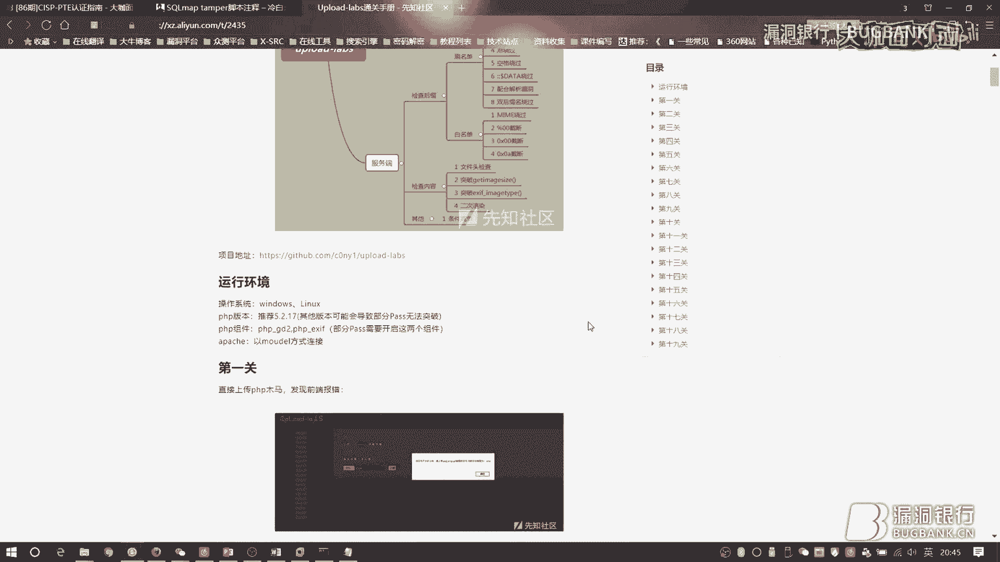

这个UplandLabs搭建也非常的简单。

你只需要把它的文件，文件从Github上面下载下来就可以了，然后直接释放出来就可以了，然后这里我们来看一下，它一共好像后面又更新了一关。

本来是19关的，现在是20关，你可以在这中间发现很多的一个，它的可以说现在日常的比较用的比较多的，防止文件上传的一些方法，比如说现在这里你可以去看一下这个提示，它也有提示的，然后因为我个人嘛。

我个人是处于脚本小子跟脚本老子之间的一个脚本中年，所以我对源码不是很了解，你们如果就是有的一些脚本大佬，或者是说那个研发大佬的话，你们可以去看一看这一个防御的这个代码，它是怎么写的，对不对。

现在这里比如说现在这个JS，JS怎么着，我后面都会讲到一些详细的方法。

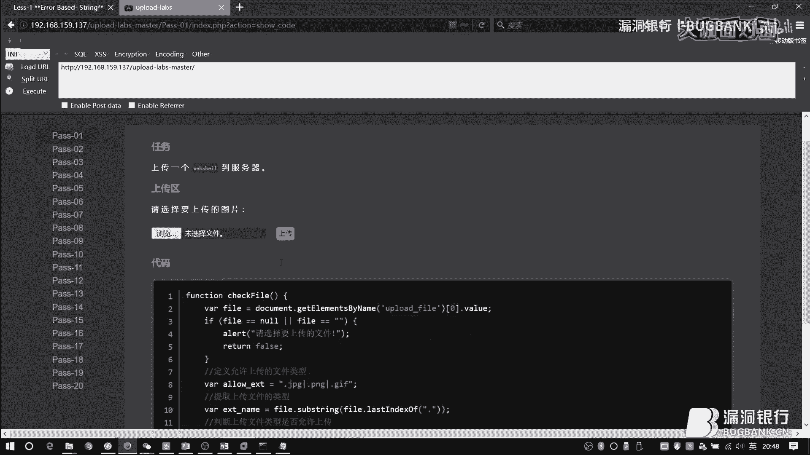

但是我也想给大家讲一个是什么呢，是一个比较皮的方法，怎么比较皮呢，因为它是靠文件上传嘛，所以你可能会觉得你只能在文件上传上面做一些文章，其实不是的，你思路要扩充开来，或者是说比较滑头一点，怎么怎么玩呢。

你可以把文件上传变成一个文件读写，怎么变成文件读写呢，文读文件。

因为你去真实的去到那考场里面的时候，你会有可能会遇到那种那种情况，就是不管你怎么上传，怎么去绕过他的那个对于你文件的名的限制的话，你会发现他有的时候检测的不是你的文件名，检测是你文件的内容。

你的内容里面一旦有一些webshell的，比如说eva那样的字符的话，你全挂了怎么办，你要么去找免杀的嘛，你要么就把只能把这种文件上传滑头一点，变成了一个读文件的操作，比如说像我们这里。

我可以去给他上传一个没有eva那样的危险的函数的。

我只给他一个git，就是传参嘛，传参的一个git过来，那么就可以去直接绕了他的一个防御。

比如说这里，当然因为时间问题我不可能给大家一个一个讲了，我只能讲一些比较皮的方法，稍等我工具打开一下。

比如说在这里，这是个JS研究，所以我在后面给他加了个JPG去绕他的JS研究，但是如果你发现你绕过了JS研究之后，你会发现你的那个文件内容里面有那些敏感的，比如说eva这样的函数的话，他还不让你过。

那么你就可以用我现在这样比较皮的办法，怎么样去做呢，先绕过他的JS，然后比如说他对你文件内容检测了，OK，你们没有那种比较敏感的函数的话，他把你放过去了，那么这个时候你就把你的PHP文件传上去了。

但是这个PHP并不是webshare，而是什么呢，而是一个读文件的一个小东西，在这里的话，其实超越一点，讲到后面的文件包含了，如果当时你执行的时候，他能够让你去用这样的一个违协议的话。

比如说这里我在文件夹底下，比如说把我读这个configo，你会发现这是一个什么样的操作呢，他是把你的文件给他读出来，但并不是直接读出来，因为你是PHP文件，在这样的一个违协议，其实是包含进来了。

所以你会解析掉，那么我们怎么样去看到他的一个文字内容，或者说字符内容呢，你需要把它加密一下，用Bytes64的encoder的一个方法，把它加密出来，这个时候你再去用一些，比如说小葵，或者说当然了。

这个内容比较长，小葵或者其他的一些Bytes64解密的一个功能，因为Bytes64是对称加密，你对称的加密了，然后你再对称的解密回来，所以有的时候并不一定，你做文件上传的题目的时候。

你就一定要把webshell给拿到，我们的关键目的是什么呢，最终目标是什么呢，就是把K给拿到对吧，所以只要能够拿到K，我们不在乎过程，我们只在乎结果，所以就可以像这样的。

在里面给他自己来一个git的一个，比如说F这样的一个参数，然后通过F传参，直接传进来，然后解法就是一下这样常见的，我就不能给大家一个一个的去做了，就给大家简单讲一下，比如说如果你是前端验证。

刚刚我做的那样的东西的话，你要么给他屁股后面来一个JPG，人家要什么你给他什么对不对，要么你就把他的那个JS给他禁用掉，怎么禁用呢，也比较简单，如果你当时过去用的是火狐的话，现场的火狐是插件非常完善的。

你可以直接用插件进，要么你就使用比较手工的方法，比如说about，当然了这样的手工方法，你一定要记得禁用掉JS之后，把它还原回来，就是做完之后还原回来，为什么呢，因为他有的题目。

他那个题目搭建的过程当中，他用到了JS，你要没有JS这个功能的话，你那个题目就做不下去了，在这里我们去搜索JavaScript，然后你把这个选项给双击一下，他就改成first了，你可以看到已修改对吧。

默认的时候是true，如果改成first的话，所以他这个JS就无法运行了，页面当中你就没有办法去检测到，他的一个屁股后面到底是不是你的黑名单当中的东西了。

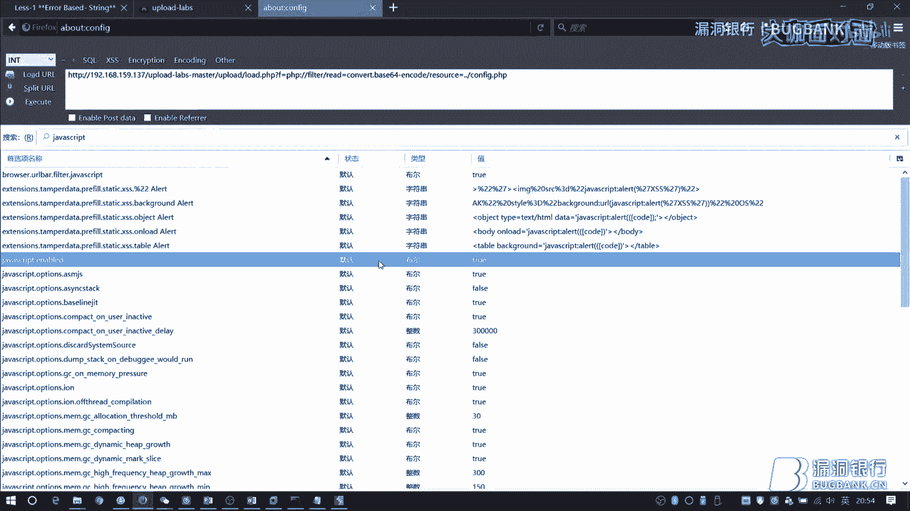

然后还有一些。

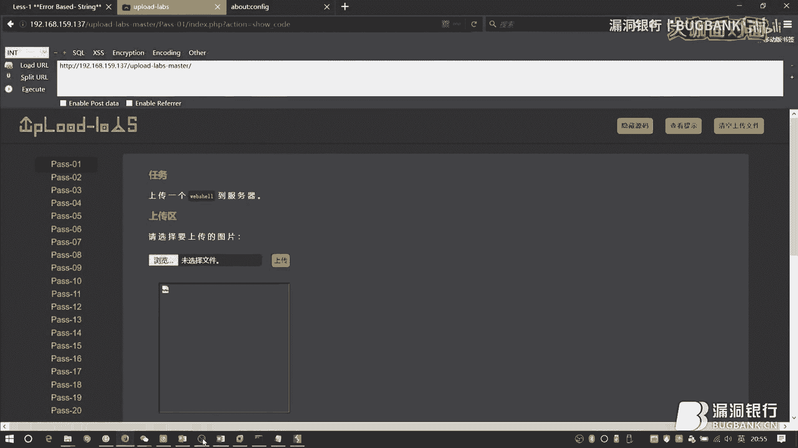

比如说他验证的是你的Ctrl+Tab，然后比如说什么access的一个绕过，这个简单做一下吧，Ctrl+Tab是什么东西呢，比如说我传一个图片上来，他的Ctrl+Tab就是这个，这是什么呢。

imagine，jpg，这个指示的是你在HTTP发送，HTTP报文发送过程当中，他指示了你这里显示你这个属性是一个图片的属性，如果你是直接发HTTP的文件过来的话，他这里应该显示的是一个什么app。

app什么location之类的东西，那个具体单词太长了，我忘了，但是如果你当时看到这里，你就是各种尝试之后发现了，他的一个点是在这里的话，你可以把他的Ctrl+Tab给他写成imagine。

然后比如说gif，这样的一个形式给他发出去，如果他当时那个验证，他只验证了这里的话，你这个PHP文件就直接过去了，还有一个比较比较好玩的是这个，如果你是比较黑名单的一个验证，就是你过来PHP。

有死活不让你过的话，这个access文件可以很好地帮你去解决掉这个问题，我这里我就不传了，因为太长的时间了，我这里其实之前已经做好了一个上传了，做好了一个上传了，比如说我们现在想要去解析掉一个文件。

比如说这个1。txt，我里面写的是PHPinfo，如果我们在一个没有放access文件夹的目录里面，我们去直接从web上面去访问txt的话，我们会看到什么，我们会看到他的文本或者说字符原样输出，对吧。

但是如果我在这里面放了一个，放了一个。access的一个文件的话，比如说我在这里面，这个不是太文件夹，比如说我写XXX，那么有XXX文件名的这样的一个文件，它就会被直接解析掉。

你可以看到如果你是在正常的环境下去访问txt文件的话，它会怎么样，它会把你的字符给丢出来，但是这里就不会了，这里为什么呢，因为他在到了这个目录之后，他会先去找这个目录里面的access文件。

他会发现有这个access文件，他只知道我们什么呢，把带有XXX这样的一个文件名当中包含的这样的一个文件，给他按照什么呢，按照http文件来解析，所以txt这样的txt才会变成http。

这个就很好的去绕过了什么，如果当前是黑名单的这样的一个情况，还有一些比如说像这个，我们怎么去过黑名单呢，还有一个很奇怪的，很好玩的一个东西就是这个文件流，ntfs文件流。

大家知道我们的或者词盘的一个类型吧，有以前是fat32嘛，然后再往后面走是ntfs，他有一个很奇怪的一个特性，叫做文件流特性，你只需要在文件的后面加上冒号冒号，然后data这样的一个字符。

你把文件存入下来之后，他会把后面的给丢弃掉，按照流的方式存入下来之后，把后面的丢弃掉，那么丢弃掉之后是什么呢，就是一点片纸皮了，但是如果你在去过黑名单的时候，黑名单是怎么查找的呢，他从前往后查找。

他会发现，哎，整个字符下来，或者说整个后面后缀下来，他不是片子皮，其实大家不要觉得，嗯，哇夫很聪明，有的时候有的王很蠢的，他并不是去找你们的字符的那种情况下，整个的他去看的话，哎，不是片子皮。

他就让他过去了，所以这个是一种绕过的一个方法，叫做NTFS文件流的一个方法，还有一些很利用系统特性的东西，比如说我们在windows系统上面，我们现在去新建一个文件，对吧，比如说我新建一个1。txt。

如果我在文件名的后面加空格呢，加非常非常多的空格，我们会发现当我们点击其他的地方，让他命名之后，这个文件变成了什么，变成了1。txt，后面的空格呢，被丢弃掉了，对吧。

如果是那种非常卡死后面的后缀名的那种WARF的话，他看到了后面有很多空格不匹配他的过滤规则的情况下，他有可能就放任你过去了，但是他放任你过去的那一瞬间，就等同于我们刚才点击了一下别处，让他重命名了。

所以他最后留下来是什么，是1。txt，类似的情况还有，比如说点，对吧，比如说点，这样的点是不允许你去用的，对不对，不允许你去用的，但是如果他去匹配后面，严格的去匹配后面的后缀名的话。

他看到了后面有很多点去扰乱了他的规则的话，那么他会放任你过去，但是他真正存到系统上面之后，他剩下来那些点会被windows给丢掉，那么剩下来的还是你想要写上去的一个后缀，然后这里的还有一个东西。

就是比如说你去给他后面加上，点点点点点点点洁癖机，让他有一个洁癖机的一个后缀，然后放出去的时候有一个问题在，在于文件名的一个最大长度的一个限制，windows上我是非常记得，没错的是256位左右。

但是Ninix我记得不是太清楚了，好像是4000多位，反正他也有一个位数限制，不过这个方法我不经常用，因为太麻烦了，太长了，他能够保存下来，因为比较少，但是，如果我们写的非常非常的多，你会发现。

这个时候我再去按点按点按点按不下去了，但是你可以在http报文，就是发送请求的，发送那个上传的请求的那个过程过程中，你会发现你在那个BP里面，你去加那个点是没有限制的，对吧，所以他过了Waft之后。

他存下来，存下来的时候，他会把后面的这个给他丢弃掉，因为你中间的点，比如说你打了300多个点，把后面的屁股给撑爆了，剩下来就是什么，剩下来的还是这么多点，在命名的时候，他又变成了TXT了，对吧。

还有一些比较其他的，其他奇怪的方法是什么呢，比如说运用一些解析漏洞，像阿帕奇当中，阿帕奇当中，你可以在你上传的过程当中，给他的后面加上一些奇奇怪怪的字符，奇奇怪怪的字符，这样去绕绕他的黑名单。

他可以看到，Waft在读的时候看到，哎，后面不是我黑名单当中，让你过去吧，但是阿帕奇在去解析这样的一个文件的时候，他从屁股后面往前面读的时候，他看到了一个不认识的，那阿帕奇会怎样去抉择呢。

他会往前面蹦一位，蹦一位找到了，哎，我认识的，那么整个文件我就会按照我认识的这个PHP来解析，这个是阿帕奇的一个解析特性，还有一种NGKOS的一个解析特性，这个是属于什么呢，属于你根本什么东西都不用管。

如果你发现当前的那个文件上传内体，它是一个NGKOS的环境的话，你可以试一试这个漏洞，你传一个里面带有你webshell的一个jpg文件上去之后，直接在屁股后面给它加上杠点PHP。

那么有NGKOS解析漏洞的那道题目就直接会被你拿下来了，还有一些情况，比如说你会发现，哎，我上传之后发现我的屁股后面的PHP三个字没了，那说明什么呢，他把你消除掉了，这个就不是拦截了。

而是直接消除掉的那种过滤，那么怎么办呢，你可以想到如果他不是循环过滤，就一直一直找一直找一直找过滤一次找一次过滤一次找一次那样的循环过滤的话，单次过滤，如果他是单次过滤，你就可以直接在中间加一个了。

加一个PHP，这样如果单次过滤PHP，比如说现在我是WARF，我把PHP干掉了，那么剩下来的还是PHP，对吧，当然这也存在一个问题啊，如果他是从前往后堵的，他没问题，如果他是从后往前堵的。

那么你就变成了一个你自己也不认识的东西了，所以这个还是需要你自己去手动测，再有一个就是在文件上传的时候，你如果发现你的路径路径在你最后访问的时候，这个路径也在里面的话，你可以选择在你上传的时候。

在路径里面给他加上一个百号00，这个我们叫做00阶段，00阶段之后，你的后面的百号00，百号00在那个111里面是属于空吗，就不是0啊，0其实也是一个字符，他的意思是什么，百号00的意思是空的意思。

就是没有东西的意思，所以他后面的东西会被丢弃掉，最终他剩下来的就是1。php了，然后再给大家讲到的是一些比较特殊的后续文明，因为前面也讲过，为了部署的方便，大部分的文件上传的题目，他也是php代码的。

所以你可以去选择一些跟php有关的，比如说他的版本，php4，php5，php6之类的东西，用的比较多的好像就是4和5吧，然后还有一些比较奇怪的，比如说phtml，这个域名，这个后缀名在某一些情况下。

他也是可以解析的，最终要给大家提一点，就是你在文件上传的时候，最好优先去使用图片码，为什么呢，你在去使用图片码的时候，很多东西你都不用去管的，比如说前段介绍的，直接就过去了，你甚至会发现你整个流程下来。

你就是只是把bp里面那个后缀。jpg给删掉了，你会发现什么情况都没有，对不对，还有一些，比如说content type的演示，图片码默认他就是image，你就根本不用管这些东西。

所以图片码是一个比较好的东西，然后第三点就是命令执行，因为在部署上面，大部分都是用docker去模拟的linux环境给你的，但是这里面很可能它会存在一些wav。

这个时候要教大家一些简单的wav的一个方法，它的呈现形式大部分都像dvwa里面一样，给你一个筐，然后筐里面有一个ping的命令，但是大部分都是ping的命令，也不排除有其他的小命令。

反正有一个很小小的一个命令在里面，然后你怎么去扰乱它本身的一个功能，然后实现把你自己的命令给注入进去呢，其实有的时候很简单，比如说现在这里我给它新建了一个文件，然后到它的一个下进步。

我现在想要去读上进步的东西，我可以怎么做呢，给它后面加上一个杠，就是你键盘上enter键的那个上面有一个竖杠，那个竖杠叫做在linux里面叫做管道服务，可以把后面的命令给它执行出来，然后如果你整个下来。

你发现我就是读不到我想要的，比如说当时应该是一个k。php这样的一个文件，我就是读不到php文件怎么办，可以了解一下这个问号，它在linux系统里面，如果当前目录没有其他的干扰的情况下，它可以通配下去。

就是你打一个问号通配下去，然后还有一些比较奇葩的情况，比如说你到时候你发现我去注入命令的时候，有一些空格的命令，比如说你用cut的命令，想要去读一个文件，你会发现你cut空格，比如说k。php。

你发现中间那个空格我敲了一下死活敲不进去，怎么办呢，其实linux里面也有一些比较好玩的东西，比如说这个ifs，然后这个$9是因为有的时候后面是数字字母的时候，不是字符的时候，就是符号的时候。

就这样去读下去，这个时候。

因为我的机子比较卡。

我只能来回切了，关一个开一个，我建了一个小文件夹。

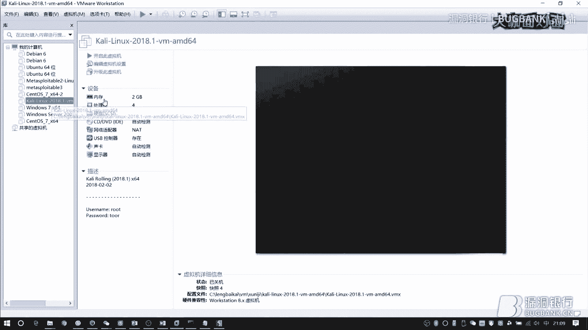

在这个小文件夹里面，我有一个有一个小txt，我在里面随便写了123这几个字符，然后呢，一般来说，你会是在上一层目录才会有你们想要的东西，比如说那个k。php那个文件，所以怎么样去做呢。

你当时在那个框里面肯定是一个ping命令，这样的一个ping命令，然后比如说你ping一下，对吧，这肯定能执行的，然后你怎么把自己的命令给它加进去呢，刚才讲的第一个管道符，对吧，比如说cut上一层目录。

然后一点点，这样我们就能够读到它了，这个是管道符的作用，然后再下一个，比如说我前面讲的，如果当时是在这里模仿的话，就是如果txt这个后备名被过滤掉，或者是说死活不让你用的话，你可以用问号这样的一个方式。

比如说现在我们可以发现，还是读得到的，对吧，如果你的空格，就是这里的空格，这两个字符之间的这个空格被过滤掉了，你可以使用什么，使用这个玩意，ifs，大家要注意啊，你因为你后面。

比如说cut这样的一个字符，在里面，你碰到的是数字字母的话，你就必须加道乐福9，这样才可以，比如说我们现在来试一下，我也懒得瞧了，太费时间，两个杠，你可以看到在这里面就没有任何的空格了，对吧。

没有任何的空格了，其实改到这里基本上就差不多了，但是呢，如果你非要把它改成你亲妈都不认识的话，你就可以这样去写，如果你cut在里面是不准有的话，就是如果cut这个命令被禁掉了怎么办呢。

你可以连接符了解一下，对吧，连接符了解一下，好，如果现在我是挖福，我看到了cut肯定把你卡下来了，但是如果你给我来个连接符呢，就单引号，你会发现，哎，还是能够读得到的，对吧，还是能够读得到的。

而且不仅仅单引号可以，双引号也是可以的，对不对，双引号也是可以的，然后可能还有同学会要问，哎，如果我的管道符都不准在我的气球当中出现，那怎么办呢，两个at了解一下，这个就不行。

如果你的管道符不允许出现的话，两个at了解一下，但是这里会存在一个问题，因为这个是逻辑关系上的，应该说是和吧，所以说它会存在一个前面为真，后面才为真的一个情况，就是前面执行完了，后面才执行的。

但是我们知道ping命令是什么，ping命令在Ninix里面，如果你不加参数的话，它会一直ping下去，所以你会等到死，知道吗，等到死，我们怎么样去拯救一下自己的小灵魂呢，我们可以这样。

所以给它执行一次，限制一下它，让它不要跑太偏，最终它还是会把我们的，想要的数字给它带出来，基本上改到这里，亲妈都不认识了，但是如果你真的死活的都是不回血的话，怎么办呢，其实给大家了解一下。

有一个东西叫cei，这个东西其实也挺好玩的，比如说我在桌面上建了个东西。

对吧，然后呢，我在，我在我的这台机子上开一个监听，如果我这台机子，注意那个，那个机子的区别，如果我这台机子，就是我的咖喱，是那个操作机，也就是你们当时那台电脑，那么如果我这个本机是要攻击的那个环境的话。

就题目的环境的话，我们可以这么做，比如说他给你给你的一个拼音，对吧，然后往后面走，因为我这个windows的话，我就直接写cei了，你可以直接去用cei去访问到。

他的这个地方，我找一下我的ip，黑了。

卡死我了。

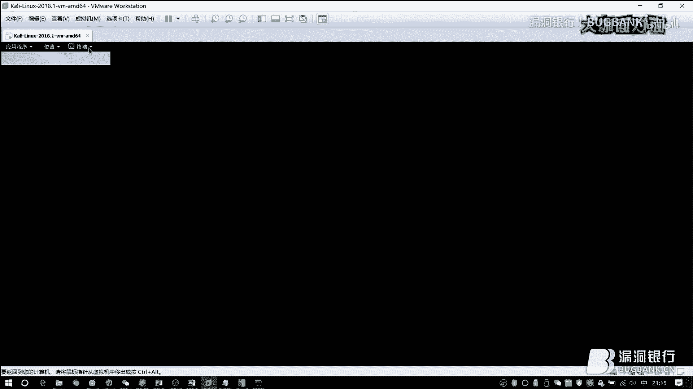

稳住不慌，我们不急，哎，怎么会这么卡呢，没事，我给他重启吧，你其实在这个图里面，在这个图里面，大家也应该可以看得出来，我之前是在桌面上放了一个一个txt文件的，就模拟着那个题目里面。

他的前一个目录和当前目录底下，放着那个存在关键k值的那个文件，然后你可以在他的ping命令后面，直接去加一个通过管道服务去直接加一个cei，因为cei部分linux系统当中基本都有。

然后你就可以直接把他的文件的一个内容，全部通过cei-t的一个命令，全部打到你自己nc监听的那台机器上面，但是你后面得加你当时监听的那个端口，因为不往端口上打，你监听也没有用，对吧。

你监听的就是那个端口，他就会把这个文件内容全部打到你监听的那个端口上面来，最终你可以在你自己的机器上面看到你监听的，那个就是打回来的那个信息，就是文件内容，不过前提是你操作机上面要开nc，然后当然了。

我前面也讲那个文件上传的时候，讲到了你要灵活一点，对吧，不一定非要把文件上传当做拿web shell的步骤，你可以把它当做上传一个文件上去读文件的一个步骤，所以这里比如说命令执行，你如果真的直接看。

你看不了的情况下，你可以怎么做呢，你可以把命令执行变成文件下载，怎么去做呢，比如说你其他的命令都没有办法去做，你可以发现，哎，TRR命令，你如果可以执行的话，那么恭喜你，你就有办法了，为什么呢。

你可以通过TRR命令将当前的，因为你执行命令，你执行命令肯定是在当前的一个web能够访问到的一个地方，你才能够去执行命令，不然你这个题目都没有存在的一个，存在的一个场景。

所以你执行命令的时候肯定是在web目录底下，然后你就可以用TRR命令将他上一集目录，上一集目录的k。pgp这个文件给他打包，打包一个一点TRR这样的一个文件，然后你再把它整个链接拼接一下。

就变成了命令执行转成文件下载了，你直接把它下载下来就可以了，对吧，这是一个很滑头一点的一个思路，然后再往后面走，第四点的话，反正我当时考的时候，那五道题里面没有日志分析，但是不排除属于可能会选考的。

前面的基本上都会考，属于会选考的，然后日志分析呢，其实就比较嘎了，其实没有什么太多的技巧，你就是死看，但是死看的话也有一点小门道，就是你要带目的性去看，比如说通常他会给你一个，给你一个题目要求。

比如说找整个日志下来记录下来的攻击者，他的IP，对吧，然后比如说找到他的一个攻击成功的时间，对吧，然后其实最多的，因为K嘛，K他有格式限制，他必须是个字符，没有办法是攻击IP那样的一个四个。

四个数字的中间一个点那样的一个情况，或者是说时间那样的一个时间格式，他只能是八位的，八位的数字字母，所以他大部分可能的情况下，我在这里加了一个感叹号，大部分可能的一个情况下。

他会存在于某一个题目当中的一个webshell，所以你到最后基本上都是去找，比如说什么某某某某，uplong的，然后一个上传的一个路径，一个webshell上传的一个路径，通过你的日志。

你能够找到他上传的一个路径，找到这个webshell，把他的webshell给他拿下来，找到里面的一个k，但是有一个情况下是什么呢，就是他的webshell存在一个密码的一个情况。

大家都知道我们那个一句话，其实那个密码不是密码，对吧，是参数，你要想连接上那个webshell，猜到连接上那个webshell，你必须把那个参数给他写上去，但是你可能不知道那个参数怎么办呢。

其实也可以用BP去报复那个参数，对不对，报复那个参数，一般很简单，一般就是顶多三位到六位的一个数字，这么不得了，一般来说是三位，然后如果真的你碰到那种奇葩的题目，他不是让你去找webshell的。

而找一些其他的东西，比如说你找攻击者的一个IP的话，常见的思路是什么呢，你在日志当中去搜索，或者说是查找一些相关的攻击关键字，比如说他如果这个日志，他记录的整个人打进去的是怎么打进去的。

是通过注入打进去的，你就写一些比如说什么slide，unit，under，or这样的常见的一个，随便注入的一个关键字，去找到他打的非常多非常多的这样的一个IP，那么你可能找到的就是这个IP。

然后比如说找攻击成功时间，这里面的思路是404，为什么说了思路是404呢，大家可以想到，如果你再去打出去，或者说去渗透一个网站的时候，你常见的是什么，上来先扫一波对吧，扫一波什么呢，比如说扫路径。

你扫路径会出现，比如说你用预见去扫的时候，大量的那个请求，请求还都是不存在的，那么肯定是404对不对，但是如果你在日志里面发现，他一直404一直404一直404404到某一个地方的时候。

发现蹦蹦出来一个200，那么说明他扫到了一个路径，然后你就可以据此稍微缩小一点范围，模糊一点上下上下文字去查找，查找他，哎，在这里面有没有一些攻击的语句，或者说比较可疑的一个地方，然后最终你会发现，哎。

比如说这里有个webshell，他是通过访问到这个webshell，那么哎，这里就是他拿下webshell，拿下这个系统，打进去webshell的一个成功时间，当然这些其实都不是非常多。

是我自己给大家讲扩展了一点，主要的其实大部分都是，如果是日式分析的话，大部分都是在题目底下去找webshell，然后记得爆破一下，第五点是文件包含，这个也是考的算非常多的吧。

通常他会告诉你k文件的一个位置，比如说在当前目录或者说根目录底下，你让你去包含这个k。php去拿出来，然后包含点通常会是这样的一个形式，这样的一个形式，某某php问号。

然后一个file参数给你一个文章页面，或者说一些图片，或者说其他的东西，让你看到一些内容，这里这个点，这个file这个点，它是一个包含点，但是你有的时候会遇到一些出题人，他比较给你皮，那怎么给你皮呢。

你这个包含点是个假包含点，就是他虽然是这种file等于某某某某某文件的一个参数，比如说file等于value。html这样的一个形式，但是他不是包含点，你可能碰到了一个假包含点，你在那里疯狂的浪费时间。

知道吗，所以这个是比较恶心的一个地方，这个时候怎么办呢，一般来说他会在，因为题目是让人做的嘛，知道吗，所以不可能是给你一个，比如说什么几几百位的字符的一个路径，让你永远搞不出来，那个不会的。

他会在里面给你一些路径，但是这个路径可能比较隐秘，你比如说你多右键看看源代码，他会不会有一些参数在里面，或者说一些提醒在里面，或者是你用去用预见去扫描他的路径，整个的去扫一下，看看有没有其他的包含点。

对不对，或者说其他的一个文件，但是如果他给了你文件包含，就是真实的文件包含点，但是没有给你文件的位置的话，你要么自己去猜，对吧，要么自己去猜，要么呢，你可以用present去搭一个，或者说其实。

因为他有一个小关键点，是他五道题目是在一块的，你要么的话就在别的，比如说前面的文件上传的那里，你去自己写一个web需要放在那个文件上传的那题当中，然后把整个路径给他指过来。

通过包含把这一道题目的web需要给他拿下来，如果没有给你文件包含的位置的话，你就可以通过拿web需要的方式，这样两个题目结合起来，你就可以把这一道文件包含的题目的web需要给拿下来。

然后你自己上去翻就可以了，还有一种呢，就是各种协议满天飞了，比如说像我前面讲过的那个协议，通过64的一个encoder，把它整个文件全部给他以字符形式给他呈现出来。

当然你这个时候得通过其他的方式把64解一下，一般来说里面会有小规，但是如果多的情况下，你在黑客办里面也可以做到解解本解解64的这样一个操作，然后还有一些其他情况，比如说比较比较骚操作的就是在这里。

你可以用php，冒号刚刚input这样的一个协议去在里面去直接执行php代码，比如说现在这里，当然这个是用post的一个方式，post的一个方式在黑客办里面完成，你在这里面去写上你自己的php语句。

当然大部分都是写底下这个语句，底下的这个语句去拿web shell，像底下这个语句代码能力比较好的，一般来说一眼就看出来了，通过php的for open打开一个文件，然后写，怎么写呢？

通过for post这样的一个函数，把后面的这一段给它写进去，大家明眼人一看就知道这是什么，这是一句话，直接写进去，你在这里执行的时候就可以直接执行这一条php命令，它会直接执行下来，把shell。

php直接生成在当前的目录底下，你直接替换掉，直接访问就可以了，还有一些是利用这个data，data txt这样一个协议，但是这个协议的话，中间你要注意一点是什么呢？就是大家知道php的标签吗？

左右对吧，肯定是要有的，但是在这个地方你去执行的时候，你后面的这个问号，问号，监控号后缀不能够用，如果你有的话就执行不了，当然了，因为我也没有研究太深，所以具体为什么我没有办法给大家解释，但是你要记住。

你用上来用只能这么用，知道吧，一定要记住，还有一个是什么呢？就是压缩，但是这个比较少，因为一般给你包含的那种文件，或者说那种题目的一个形式的话，它就是一个包含点，没有其他的地方。

所以如果是像这样的一个压缩协议，前提是什么？你有一个上传点，你把你的压缩文件上传上去，你才能够通过这种压缩协议去读那个压缩文件，把它变成一个PHP，这个压缩协议也比较有意思，你是怎么回事呢？

把一个压缩包，这个ZIP压缩包丢上去之后，你这个压缩包是怎么压缩的呢？你里面有一个file。php这样的文件，但是你是通过压缩包上传上去的，所以你整个过滤下来，没有PHP，对不对？没有PHP。

但是PHP躲在哪？躲在这个压缩包里面，你可以用这种ZIP的一个形式，把这个压缩包通过压缩协议给它解开，解开变成一个PHP文件，但是这中间其实还有一个坑点，就是这个警号。

你一定要给它做一个URL的一个encoder，不然的话你这个协议是失败的，当然了，相关于文件包含还有很多其他的内容，大家可以参考一下我找的这个链接，翻一翻这篇文章写得很详细，还有一种是什么呢？

就是登陆爆破这种提醒了，但是这种提醒通常是来说是送分题，就是很简单的那种，你上来直接就秒过的，然后用户名基本都是阿德米，但是如果你真的碰到了，比如说提醒难度加大呀，或者是说处理者他心情不好，他想玩玩你。

对吧？那么怎么办呢？你就只能按照常规的方法先来试一遍，比如说用BP的这样的一个Intruder的一个功能，这个大家用的都非常多了，对吧？如果他稍微加大一点难度，他限制了你登陆来源只能够是本地，对不对？

比如说他给你一个提醒，非本地来源禁止访问，或者说非法请求，那么在请求当中你可以去加一个这个Xforward form，就是Xfs，这个是什么东西呢？这个在浏览器当中，就是说你去使用一些插件的时候。

你就能够看到，比如像现在这样的一个插件，如果我这个时候开启拦截，然后把这个插件也给他开启起来的话，我去访问东西的时候，我接下来的包中间会多一条这个东西，叫Xforward form。

它是指示着在HTTP请求报文当中，它是指示着你从哪里来，就是你的IP是什么，但是有的时候的话，你可以在这里面去注入一些东西，或者是说像我今天就刚刚挖到了一个不算漏洞的，也不算漏洞的一个东西。

就是他就我们公司的有一个系统里面，他是采集这个选项里面的东西，然后显示到页面上来表示你的来源IP，在那个里面你就可以去直接写个Xfs的一个存储配料的，然后如果他真的题目当中去限制了。

你只能够从本地来的话，你就可以用这个Xforward form，直接写到报文里面，然后去绕过他的这种本地限制，当时如果你去考试的话，整个火狐浴缆机会非常的花哨，为什么呢。

因为他所有的基本上你能用到的插件全部都在上，做题就拿那个火狐做，然后还有一个情况就是什么呢，就是他当时会给你字典吗，在那个你的一个工具包当中，我前面也讲了，他不会让你用自己的电脑，但是他会给你工具。

如果他的Admin密码真的不在不在字典当中，你要么就是用BP自己去生成，要么呢，你就换一个死，有可能他不是Admin，或者是说其他的一些账户的话，你怎么办呢，你就可以先用一些弱密码，一些弱密码。

一些字典去放在他的密码处，然后你去捕获他的用户名，这也是一个反向的一个思路，在我挖洞的一些就是提交一些SRC的过程当中，也有遇到过这种情况，就是我去搞他的那个后台管理，或者说登录的时候。

我发现密码真的超级复杂怎么办，然后你就可以想到，哎，还有一些用户他是不在乎安全的，这个在任何系统就稍微大一点的系统都遇到过，就是什么呢，有些用户不在乎安全，或者说不在乎密码的，他就123456。

你怎么办，你拿他没有办法，对不对，你管理员拿他没有办法，然后我们就可以考虑以这些用户为入手，拿到一些比较小权限的账号，但是最起码你能够进到这个系统当中，对不对，所以说如果你真的密码不在字典当中。

你报复不出来的话，你可以试一试把密码设置为123456，然后去报复他的一个用户名，还有一种是什么呢，就是你的密码是在字典当中，但是你在登录的时候，你BP抓包一下，你看一下他是不是做加密了。

比如说常见的MD5加密，Base64加密，这个可以给大家稍微做一下示范，其实也很简单啊，比如说你在登录的时候，这个字段，这个字段，他可能是密码字段，他可能是一个MD5加长的，非常长的。

然后你在报复的时候，如果你没有给他MD5加密的话，你肯定是打不过去的，对不对，他的加密在哪呢，其实在BP的底下有一个这个，对吧，比如说我现在想要给我某一个字段，给他MD5加密，怎么办呢，点一下ADD。

在底下找到Hash，然后这里面有一个MD5，你点击一下OK就加进去了，就加进去了，比如说你还想在MD5的基础上，给他做一个Base64加密，怎么办呢，你可以点到Encoder这里。

他这里有一个Base64 Encoder，这样的话，你再去，当然要注意先后顺序，你再去访问或者是登录报告的时候，你就会把你的密码先做一遍MD5加密，再做一遍Base64加密。

这个时候你点击那个StarTag就可以了，你要知道他出题，他肯定是给人做的，你可能是思路错了，你可以去看一看他的源码，或者是说他做了一个假的一个登录点，然后让你去找他真正的一个，真正的一个登录点。

你要去扫描路径之类的东西，你可能，你可能找到其他的地方了，对不对，你脑洞一定要开，但是还有一些情况是什么呢，比如说他报过归报过，但是他不是登录报过，他可能是路径报过，那个怎么办呢。

你在BP里面自己设置一下路径，对不对，比如说他有一些很奇怪的路径，比如说文章ID之类的东西，你去报过那个文章ID，你会发现当当这个其中有一个比较大的一个字段长度的时候，可能或者比较小字段长的时候。

可能就是你想要的一个东西，这个得按那个出题人的思路走，第七个，快闪脚本，这个东西的话，bug一点的做法就是什么呢，如果他的K，他就是想让你做一个弹簧的话，那很简单，有一个bug一点的做法。

就是直接在你的控制台当中，你直接写个了，他就会直接弹簧出来，如果他是加密混淆写在介绍里面的，写在题目的介绍里面的，你这个什么东西都不用做了，你就直接把他的介绍给他，就是弹簧操作给他做出来了。

如果他是写介绍捕捉你的弹簧操作，然后会在你的弹簧里面直接给他显示出来的话，这就是一个bug做法，但是大家要知道，通常我们去做查一下攻击，或者是说挖掘查一下漏洞的时候，通常会怎么办呢？

一般来说都是盲打管理员，对吧，打后台，打一些其他的地方，所以这个时候你需要去做一些，比如说远程的一个查询，接收平台，这样才才能够去接收到你的cookie，对吧，所以第二种形式其实也是最常见的一个形式。

我那次考试就遇到了最常见的形式，他是你后面后台那边虽然没有人啊，但是他们模拟的是后台管理，一直在登录，然后在一直在刷新，在查看页面的一个情况，那么这个时候你就可以去借助其他的题目的一个webshell。

做一个远程的一个查询平台，其实也很简单啊，这个时候我又要切换我的虚拟器，其实这个我当时就没有做这道题，为什么呢？因为我当时已经拿到70分，然后我去玩那个纸牌了，已经拿到70分了，所以我就不所谓了。

但是后来我想一想，这个题目是可以做出来的，因为当时我们那个考场好像就没有人做出来，我后来想一想，这个题目是可以做出来的，为什么呢？因为我们当时那个考场环境里面没有那个查SS的平台，对不对。

没有查SS的平台，我们一般上手就直接是拿查SS平台去直接到人家的cookie，对不对，但是那个时候没有平台，我们就有点懵，然后就没有做出来，然后刚好70分也够了，所以就没有再去想这个东西。

但是我后来想一想，这个题目其实用一些简单的方法也能做出来。

比如说现在这里我后来去找了一找，你自己去写的话，其实也没有多少语句，OK， 开了，稍微等一下。

你自己去写的话，其实也没有多少语句，对吧，你看，比如说后来去找了一下，找了一下发现，其实加起来总共不超过五句话，你就可以把人家的那个cookie给拿过来，如果后台有的话。

现在这里如果我在这里面开了一个http的服务的话，比如说打开一个新页面，我那天看了一下这个，我打开一个新页面的话，OK，OK，OK，OK，OK，OK，我记得当时打了一个新页面是有cookie的，好吧。

突然就没有cookie了，我也不能找个账户给你们看我的cookie，我怕你们搞我，其实也很简单，直接给大家讲后面的话，你如果搭建好了这样的一个平台的话，或者说查SS远程平台的话。

你就可以直接将这样的pylob去插入进去，插入进去，插入进去之后，按照我们写的代码的这样的一个规则。

写代码这样的一个规则，如果我们通过了一些参数，不管是get还是post过来的一些参数，我们接收到了cookie这个参数里面传来的一个值，我们可以通过for open的这个函数打开一个cookie。

txt，把cookie给它存入进去，存入进去之后关闭文件，其实就等同于什么呢，大家知道那两个那两个script。

其实就是什么呢，就等同于模拟了一下那个JS，JS的一个执行环境嘛，所以我们可以直接去执行一下。

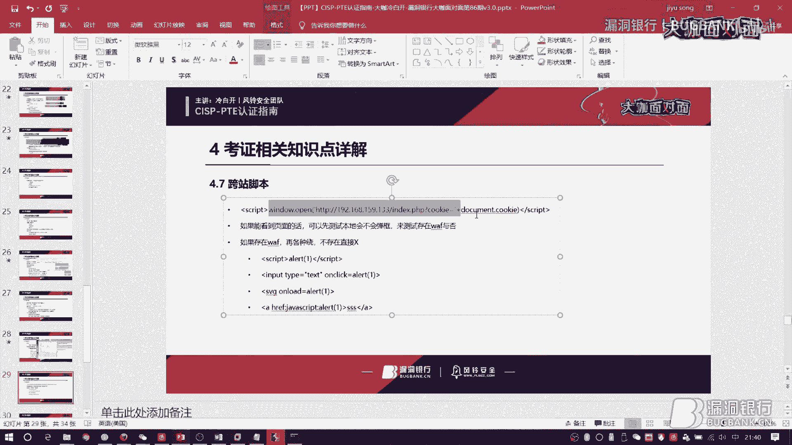

当然我现在也不知道为什么它这里现在没有cookie了，我早上打开的时候还有cookie呢，我这里是设置了阻止拦截，但是那个题目就是JS，如果靠JS那道题的话，它是不会设置阻止拦截的，只要你打到它后台。

它后台是一直处于一个模拟管理登录状态，所以如果你打到后台，真的打到了后台的话，那么它会把你的cookie给传过来，这样给它传过来。

然后前面单向支持点可能考到的一个范围，我就讲的差不多了，然后接下来讲一个大厂，就是那个3到k的，就是3k的一个大的综合渗透，它是属于什么呢，就是你一打开就是一个网站。

或者说你一打开就是一个完整的一个渗透的一个步骤，当然近几次都不是NIMX的系统，都是点net，然后加succer的一个windows2003的环境，可能有的大佬看到2003这几个字就觉得垃圾。

但其实这里面不算特别难吧，也有一点小难度，它3个k是分布在你的攻击步骤当中的，一般来说是你攻击开始，比如说你收集信息，拿信息的时候，有一些信息泄露啊，或者说其他的东西，一些页面上面去写着。

比如说备份文件之类的东西，写着第一个k，然后你拿到share或者说拿到数据库是第二个k，然后你提前下来，把整个服务器拿下来之后是第三个k，常规的做法的话，肯定第一步是翻，你要把这个站给他熟悉一下。

或者说你打开的那个IP，他就没有站点，他上来就是一个4x4，那怎么办呢，这种情况下，通常你要去扫描一下他的端口，通常你要去扫描一下他的端口，他可能不在80端口上面有那个http服务。

可能会在比如说8080啊，或者其他的地方有另外的一个站点，这个你要多找一找，一般来说建议你们就是上来做综合渗透这道题的时候，上来就给他扫端口，因为扫端口需要占用一点时间，如果你想快速的做完的话。

上来就给他扫端口，避免你后面再去等他，然后就是需要去找到一些关键点的一个漏洞，因为那些题目其实并不是非常的难，就是非常的庞大，他可能很简陋，然后页面也就那么几个，因为其实如果让你翻页面。

然后在多数的页面中去找一个页面，其实没多大意思，对不对，这个考试或者说这个认证到最后，他是考你的动手能力，而不是你去耗时间的能力，所以并不会太复杂，找到关键的一个漏洞点，大部分的时候都是注入。

用我前面的SyncMap的那个比较level比较高，然后微型等级比较高的那个命令就可以了，注入下来，要么你这个注入成功的话，你就会拿到第1个K，但是如果你找找找找找找，发现就是从外部没有注入的话。

那么你可能去找一些其他的地方，因为是点net的环境，点net的网站它有一个web。config，这个好多好多题目，包括我做模拟题跟那个实战，就是前几次考试的题目，都有这个东西，然后这里面存的是什么东西。

就是你的数据库账号的密码，但是要注意一点，他可能不是存的SAR，因为是SubSAR，SA的那个账户是上帝权限，但是他可能存的不是SAR，他可能存的是别的账户的，就比如说小权限的一个账户，但是你最最起码。

你在这个这一步的时候，你就可以拿到第一个点，然后你拿到第一个K，就等同于你拿到数据库里面，然后你可以用一下他的后面的一个数据库里面，存的后台账号跟密码，但是这里面也存了一个坑点，坑点是什么呢。

就是比如说他的数据库里面，admi的一个管理账号，他的密码是MD5，但是你破不出来，那怎么办，考试现场又没有外网，你不可能上什么查MD5去找那个，就是用外面的人的力量去帮助你破解这个MD5值的。

没有办法去找彩虹标，那怎么办呢，还有一种方法就是你自己去生产MD5，比如说你写一个123456，在那个工具包里面是有生产MD5的工具的，然后你用自己的MD5值，123456的MD5值往上面一扔。

一般来说你是通过nevercut这样的工具去链接上那个SCR数据库的，然后你往上面一扔，把管理的密码给它替换掉，我今天也是遇到一个相同的一个情况，因为我们内部有一个知识库。

然后那个知识库上面有一个任意文件读取，我读下来了之后，我发现有那个数据库账号跟密码，然后我进去了，搞了一下我们研发的那个知识库，然后发现他的密码是一个很奇怪的加密，我搞不懂。

然后我就去网上找了123456的，就是这种加密方法的123456的密文，然后丢进去了，然后就把它的权限给拿下来了，这是今天遇到的一个比较好玩的一个东西，然后讲回来。

比如说你的第二个可以可能就在后台的这样的一个地方，可能在比如后台首页这样的地方写着的，但是你要注意看，因为有一些人他可能眼睛瞄的太快了，搜一下瞄过去了，然后那个你就比较亏了，还有比如说拿share。

他key可能不在你的后台，然后你要需要把share给拿下来，才能够去拿到第二个key，这个时候怎么办呢？一般来说你去后台找，我前面也说过了，他不会给你一个比较庞大的一个后台的，比如说成千上百个页面。

成千上百个功能不可能，他给你的都是一些比较简陋的一个后台，后台的功能点并不是特别多，比如说你去找一些什么新闻发布，产品发布这样的一个小后台，去找到他的上传点，通常都是上传图片，编辑新闻。

导入文件这样的地方去上传，然后有上传点的情况下，通过前面我讲的上传的办法去拿到web share，这样可以拿到第二个key，但是如果你发现上传的地方都已经是严格过滤，或者说就是impossible。

没有办法去搞的情况下，你可以去找一些其他地方，比如说你扫描目录的时候，发现了有fck编辑器，那就是fck一把缩了，对不对，这个就不需要再讲了，然后你可能会发现有一些，你没有办法去绕过它的防御的情况下。

怎么办呢，你可以先看看正常的上传，然后用我前面讲的文件上传的绕过方法去试一试，如果没有办法试的话，还有一个东西，就是大部分后台的话，存在一个数据库的一个差异配分，你可以先丢一个什么JPG啊什么东西。

或者说这样的一个后缀的木马文件，或者说webshark丢上去，然后通过差异配分的方法，把它整个备份出来，比如说。php，或者说。sbx这样的一个木马，给它备份出来，通过差异配分。

生成它自己要的一个文件后缀，还有一种其实也遇到比较多的，就是生成文件数的一个文件，文件数位的一个限制，文件名的一个数位的一个限制，比如说它后台有一些奇奇怪怪的功能，要求了你的后台文件。

文件名的话只能够是32位，然后你怎么办呢，你给它文件备份的时候，你给它备份，比如说30多位吧，比如说什么37，8位，然后呢，把JPG。JPG放在那个称爆了称爆了的地方，然后前面刚刚好留下来的。aspx。

比如说点其他的木马后缀的话，这样的话你整个的后面称爆了的那个。JPG就被丢掉了，丢掉了之后呢，你剩下来的就是你需要的web shell的一个后缀，这也是一个方法，那需要的一个方法。

然后再讲到的就是你的K3，K3一定是你要提前之后才能拿到的，我记得有一个非常恶心的题目是，你能够通过web shell啊之类的东西，把它整个系统翻来翻去，你都找不到K，然后后来发现你只有提前上去之后。

在他的那个叫做网上邻居还是网上管家，他被改名了，重命名了，然后那个地方你没有办法去读对不对，因为他不是一个文件，你没有办法去读，所以你只能够通过远程命令给他上去，你才能够去拿到那个第三个K。

所以第三个K提前，你一定要提到服务器，你才能才有可能拿到这个K，而提前的话，因为大部分口子都是点赖环境，所以这个时候你要把XP70Shell这个东西拿出来看一下，什么是XP70Shell呢。

是一个叫做存储过程那个东西，你不用太关心它是个具体的一个操作流程什么东西，你只需要知道他的一些命令，以下的这些命令，因为可能会存在XP70Shell被删除，或者说被移除的一个情况。

如果你拿到了一个SAR权限的话，就是SA的一个权限的话，你可以在数据库里面直接把他的XP70Shell从禁用状态给他开启，用下面这一条命令执行一下就可以了。

然后你就可以在XP70的后面去写上你自己想要的一些命令，比如说why my net user增加一个账户之类的东西了，但是可能有的同学会觉得这个命令真的好强，我记不得怎么办，不用记。

因为你会拿到一个工具包，当时你会拿到一个工具包，然后那个工具包里面会有很多的webshell，其中就会有一个这样的一个webshell，这样的一个webshell，我对它印象非常深刻，什么什么2014。

然后呢，你在这个shell里面去搜索XP70Shell，你就不用记这个命令了，为什么呢，因为这个shell里面有很多的webshell，比如说你自己的网站，你自己的网站里面有很多的webshell。

你自己的网站里面有很多的webshell，然后你去搜索这个webshell，然后你会发现，这个webshell里面有很多的webshell，比如说你自己的网站里面有很多的webshell。

然后你去搜索这个webshell，然后你会发现，这个webshell里面有很多的webshell，比如说你自己的网站里面有很多的webshell，然后你去搜索这个webshell，然后你会发现。

这个webshell里面有很多的webshell，然后你会发现，这个webshell里面有很多的webshell，然后你会发现，这个webshell里面有很多的webshell，然后你会发现。

这个webshell里面有很多的webshell，然后你会发现，这个webshell里面有很多的webshell，然后你会发现，这个webshell里面有很多的webshell，然后你会发现。

这个webshell里面有很多的webshell，然后你会发现，这个webshell里面有很多的webshell，然后你会发现，这个webshell里面有很多的webshell，然后你会发现。

这个webshell里面有很多的webshell，然后你会发现，这个webshell里面有很多的webshell，然后你会发现，这个webshell里面有很多的webshell，然后你会发现。

这个webshell里面有很多的webshell，然后你会发现，这个webshell里面有很多的webshell，然后你会发现，这个webshell里面有很多的webshell，然后你会发现。

这个webshell里面有很多的webshell，然后你会发现，这个webshell里面有很多的webshell，然后你会发现，这个webshell里面有很多的webshell，然后你会发现。

这个webshell里面有很多的webshell，然后你会发现，这个webshell里面有很多的webshell，然后你会发现，这个webshell里面有很多的webshell，然后你会发现。

这个webshell里面有很多的webshell，然后你会发现，这个webshell里面有很多的webshell，然后你会发现，这个webshell里面有很多的webshell，然后你会发现。

这个webshell里面有很多的webshell，然后你会发现，这个webshell里面有很多的webshell，然后你会发现，这个webshell里面有很多的webshell，然后你会发现。

这个webshell里面有很多的webshell，然后你会发现，这个webshell里面有很多的webshell，然后你会发现，这个webshell里面有很多的webshell，然后你会发现。

这个webshell里面有很多的webshell，然后你会发现，这个webshell里面有很多的webshell，然后你会发现，这个webshell里面有很多的webshell，然后你会发现。

这个webshell里面有很多的webshell，然后你会发现，这个webshell里面有很多的webshell，然后你会发现，这个webshell里面有很多的webshell，然后你会发现。

这个webshell里面有很多的webshell，然后你会发现，这个webshell里面有很多的webshell，然后你会发现，这个webshell里面有很多的webshell。

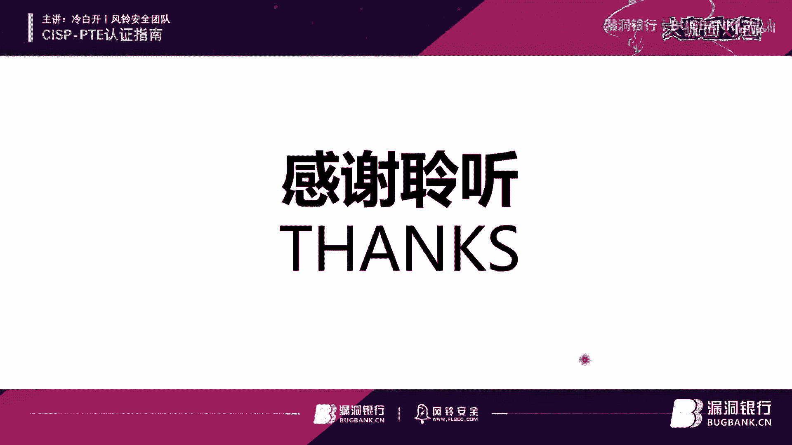

然后你会发现，这个webshell里面有很多的webshell，然后你会发现，这个webshell里面有很多的webshell，然后你会发现，这个webshell里面有很多的webshell。

然后你会发现，这个webshell里面有很多的webshell，然后你会发现，这个webshell里面有很多的webshell，然后你会发现，这个webshell里面有很多的webshell。

然后你会发现，这个webshell里面有很多的webshell，然后你会发现，这个webshell里面有很多的webshell，然后你会发现，这个webshell里面有很多的webshell。

然后你会发现，这个webshell里面有很多的webshell，然后你会发现，这个webshell里面有很多的webshell，然后你会发现，这个webshell里面有很多的webshell。

然后你会发现，这个webshell里面有很多的webshell，然后你会发现，这个webshell里面有很多的webshell，然后你会发现，这个webshell里面有很多的webshell。

然后你会发现，这个webshell里面有很多的webshell，然后你会发现，这个webshell里面有很多的webshell，然后你会发现，这个webshell里面有很多的webshell。

然后你会发现，这个webshell里面有很多的webshell，然后你会发现，这个webshell里面有很多的webshell，然后你会发现，这个webshell里面有很多的webshell。

然后你会发现，这个webshell里面有很多的webshell，然后你会发现，这个webshell里面有很多的webshell，然后你会发现，这个webshell里面有很多的webshell。

然后你会发现，这个webshell里面有很多的webshell，然后你会发现，这个webshell里面有很多的webshell，然后你会发现，这个webshell里面有很多的webshell。

然后你会发现，这个webshell里面有很多的webshell，然后你会发现，这个webshell里面有很多的webshell，然后你会发现，这个webshell里面有很多的webshell。

然后你会发现，这个webshell里面有很多的webshell，然后你会发现，这个webshell里面有很多的webshell，然后你会发现，这个webshell里面有很多的webshell。

然后你会发现，这个webshell里面有很多的webshell，然后你会发现，这个webshell里面有很多的webshell，然后你会发现，这个webshell里面有很多的webshell。

然后你会发现，这个webshell里面有很多的webshell，然后你会发现，这个webshell里面有很多的webshell，然后你会发现，这个webshell里面有很多的webshell。

然后你会发现，这个webshell里面有很多的webshell，然后你会发现，这个webshell里面有很多的webshell，然后你会发现，这个webshell里面有很多的webshell。

然后你会发现，这个webshell里面有很多的webshell，然后你会发现，这个webshell里面有很多的webshell，然后你会发现，这个webshell里面有很多的webshell。

然后你会发现，这个webshell里面有很多的webshell，然后你会发现，这个webshell里面有很多的webshell，然后你会发现，这个webshell里面有很多的webshell。

然后你会发现，这个webshell里面有很多的webshell，然后你会发现，这个webshell里面有很多的webshell，然后你会发现，这个webshell里面有很多的webshell。

然后你会发现，这个webshell里面有很多的webshell，然后你会发现，这个webshell里面有很多的webshell，然后你会发现，这个webshell里面有很多的webshell。

然后你会发现，这个webshell里面有很多的webshell，然后你会发现，这个webshell里面有很多的webshell，然后你会发现，这个webshell里面有很多的webshell。

然后你会发现，这个webshell里面有很多的webshell，然后你会发现，这个webshell里面有很多的webshell，然后你会发现，这个webshell里面有很多的webshell。

然后你会发现，这个webshell里面有很多的webshell，然后你会发现，这个webshell里面有很多的webshell，然后你会发现，这个webshell里面有很多的webshell。

然后你会发现，这个证不是开发证，而是渗透测试证，而是渗透测试证，他说要要你熟悉web安全的话，他说要要你熟悉web安全的话，你没有必要去考这个证，你没有必要去考这个证，这个是攻击的。

他大部分提到的思想是攻击的，他大部分提到的思想是攻击的，我觉得比例简单一点，我觉得比例简单一点，有帮助肯定有帮助的，这么讲吧，比如说像像我们现在我这个比较比较古板一点正统化一点的国企的话。

像我前面也讲过领导是不看你什么SRC这些，其实现在圈子里面有点浮躁，就是什么正排名之类的东西，人家是不看的，领导根本就不在乎这个东西，领导在乎的是什么，在乎的是你拿出来的证书是不是有国家背书。

有国家背书的话，他就扔对不对，然后你拿出来一些什么SRC的排名啊，他听都没有听过的，或者说他不关心的，那么你觉得有用吗，肯定是没有用的，所以你要学这个证对于你以后去找比如安抚啊。

或者说一些甲方的一些甲方的一些安全工作是有帮助的，我刚刚是自己手写的，因为我当时就是因为没有平台，所以我做不出来那道查册的题目，后来我想了一下，其实你自己手写很简单，这个是自己手写的。

尼尼克斯需要掌握什么程度，不需要掌握什么样的程度，因为我我自己尼尼克斯也不是很强，就是简单的命日常的使用，就是用咖喱嘛，用咖喱基本上来说没有太大困难，那种程度就差不多了，啊，打完了是吗？好的，对，行的。

那今天因为就大概讲了比较久了，比较辛苦，那那个大部分的问题刚都有讲到嘛，所以如果还有问题的话，大家也可以之后屏幕上会给冷白开大咖的一个微信号，大家也可以加他沟通聊聊天嘛，对不对？好。

那再次感谢冷白开大咖的一个解答，嗯，下面我们来到今晚的这个开年第一个福利环节吧，我们今天要给还是老样子给大家送书，那今天这么说是冷白开大咖亲自选出的黑客大曝光第七版。

那老冷可以说一下为什么送这本书给大家吗？嗯，因为我最近也在看啊，最近正好在看对了，可以让大家正好这个跟大咖有一个默契的地方，可以拿这本书好吗？那老冷你来选一下想送给谁吧，就送这个聊聊聊妹吧。

聊聊妹是什么？这是那个宰相吗？不是，DMZ聊妹，不是啊，哈哈哈哈哈哈，是吗？好多小伙伴要伤心了，坚持了这么久最后没办法说，好好好，那行，那我们就还是遵从大咖的这个这个决定啊，我们给这位提问题的非常骚的。

问怎么撩妹的小伙伴，对，直播间ID叫胡谢，大家可以点一下，我看一下他那个选为幸运，然后看你没有可以收到那个对角提醒啊，那就像我办之后你可以根据这个提示，直播间提示留下你联系方式。

或者在直播后直接私聊我来进行对讲，那没有拿到小伙伴也不要灰心啊，我们之后机会还有很多。

那好了，来到今晚直播的尾声了，再次感谢冷白开大咖的用心准备和精彩演讲，那希望这期内容呢，给大家能够有所帮助，如果想回顾这期内容的话，我们下周五会发布今晚的直播录屏。

大家可以关注一下官网更新或者群里的通知，那今后大家可以继续关注冷白开大咖，他也许会有更多的精彩的分享哦。

嗯，然后预告一下我们，209年春节前还有一场自由直播，就下周五2月1号会举办的，所以下周我们还会再见面，小伙伴们感谢你们支持，如果觉得大咖的很棒呢，可以来找我来报名一起，像他一样这样来分享。

农农银行大咖的面是个白帽展示棺材的舞台，去年内不畏自利，只要你有好的内容都可以来找我报名，然后如果想要继续交流呢，可以找3C表姐来加我们的群，把农农银行其他的群，好，那今晚直播的内容就到此结束啦。

(音樂)，(音樂)，baby honestly，i love you baby，talk for you baby，cry for you baby。

but tell me what you've done for me，for you baby，only you baby，the things i do baby。

but tell me what you've done for me，i never cheated，deleted everyone，cuz they made you uncomfortable。

no baby no，these accusations，i can't apologize，for something that i didn't do，no oh oh baby no。

i won't beg for your love，won't say please，i won't fall to the ground，on my knees。

you know i've given it，everything baby honestly，honestly，honestly yeah，i love you baby。

talk for you baby，cry for you baby，but tell me what you've done for me，for you baby，only you baby。

the things i do baby，but tell me what you've done for me，oh tell me what you've done for me。

tell me what you've done for me，oh，优优独播剧场——YoYo Television Series Exclusive。

交通事故。