# 漏洞银行丨CSRF与多种漏洞组合-Flx丨咖面62期 - P1：62期录像 - 漏洞银行BUGBANK - BV1Tt411f7rd

(音頻中)。

為知識而存 迎技術而生，小夥伴們大家晚上好，歡迎參加漏洞銀行信息安全技術講座大咖面對面，我是主持人年念，今晚是大咖面對面活動第62期，本期為大家請到了某知名不知的大佬，FLX為大家帶來技術分享。

主題是招招致命，CSRF與多種漏洞的組合出擊，想了解CSRF混搭各型各款的漏洞，會擦出什麼別樣火花嗎，那就仔細聽講吧，演講過程當中隨時都可以提問，演講結束後，FLX大咖會在行長問答環節來為大家答疑解惑。

大咖專屬環節呢，大咖精心挑選的這本增速，XSS快戰腳本的攻擊偷襲防禦在等著大家，話不多說，下面請欣賞大咖FLX為我們帶來的這場狂歡競技秀吧，今天給大家主要帶來的內容，先看一下這個內容框架吧。

就是可能有一些人就是比較基礎吧，先就是講一些基礎的，就比如CSRF的入門，然後它的產生原理，還有POC的編輯，然後就是攻擊方法，然後到中間了，可能就會講一些境界，就比如說什麼CSRF乳蟲的利用。

然後還有可能大家就是經常聽到的什麼XSS與CSRF的組合拳，然後還有一個就是文件上傳與CSRF的組合拳，這個因為中午剛搭的環境，沒往這個PPT上面寫，然後就是CSRF修復建議，然後今天的這個主題呢。

就是CSRF與多種漏洞的組合，這個目錄大家看一下，就是這加上一個就是SERV XSS與G類的CSRF，然後先給大家說一下，就是CSRF的產生，產生就是原理，就是是什麼特點，然後怎麼產生了。

就是什麼是CSRF，說白了就是一句話，跨站請求偽造，然後就是特點，就是不一定是跨站點的請求，然後CSRF，但是請求一定是偽造的，然後這個就是特點，兩個特點，它的產生呢，就是怎麼用怎麼產生。

然後就是被攻擊者的瀏覽器被迫向目標站點，就是發送了偽造請求，這個就是過程中被攻擊者的瀏覽器，就是帶有Cookie或者Session的驗證身份的字段，然後來通過目標站點的身份驗證，完成就是偽造請求。

就是給大家簡單的說一下，就是我們就是構造好就是Payload，然後發送發給那個被攻擊者，然後被攻擊者呢，就是向我們攻擊的目標站點就是發送偽造請求，然後就是這一套流程完成CSRF的攻擊。

然後就是CSRF POC的編寫，然後手工寫POC呢，就是可以用就是HTML JS完成一個請求，這個就是我們平常就是改內容，要弄他什麼東西的話，一般這個請求就是HTML表單了。

一般比如說CSRF什麼圖片啊，這些啊，文件上傳啊，可能就是用JS來完成一個請求，就是放表單，JS發送請求的，這個手工編寫POC的模板，就是看他就是一個放表單，裡面有什麼字段，就input，然後這個字段。

然後改他要改的他V6的值，基本上就是一個這麼個手工的編寫過程，現在的話，就是不推薦大家就是用手工寫吧，可能麻煩的可能用手工改一改就行了，大概就是手工編寫POC，就是一個放表單，然後請求地址。

然後請求方式，然後就是要偽造請求內容，大概就是這麼個東西，就一個放表單，然後說一下就是自動編寫POC，然後我們呢，就是經常做生存測試用到一個工具，就是BOP，然後他已經就是可以實現了自動化生成POC。

然後給大家演示一下這個怎麼自動化生成，我先打開我的滑鼠，就是我們可能檢測到某個點，就是比如說某個發文章的點，存在CSRF漏洞，我們用BOP實現自動編寫POC，然後我們就是簡單的就是掛個代理，然後抓個包。

然後發送內容，抓這個包自動化編寫POC，就是然後右鍵看這有個什麼，CSRF POC，點一下可以自動生成，然後複製到，就是自動化，基本上自動就完成了，BOP，基本上就是這麼一個流程，然後自動化編寫。

然後可能就是自動化編寫的，可能會有些點他不能用，還是需要我們去手工去改，自動化就是寫，基本上也就是BOP能完成，然後就是CSRF的使用方法是什麼，怎麼使用，就是今天主要給大家講就是GET。

GET就是POS的CSRF的使用方法，還有GET的，當然還有一些別的，就是JS還有CSS都可以發送請求，使用方法就是需要將自己編寫好的POC，就是我們先不說什麼上傳至服務器了，就是怎麼利用。

然後我們先看一下怎麼利用大概這個過程，我們就是將這個，生成好的POC，然後複製一下，然後可以把他這個包給抓過掉了，我們就是寫一個html。

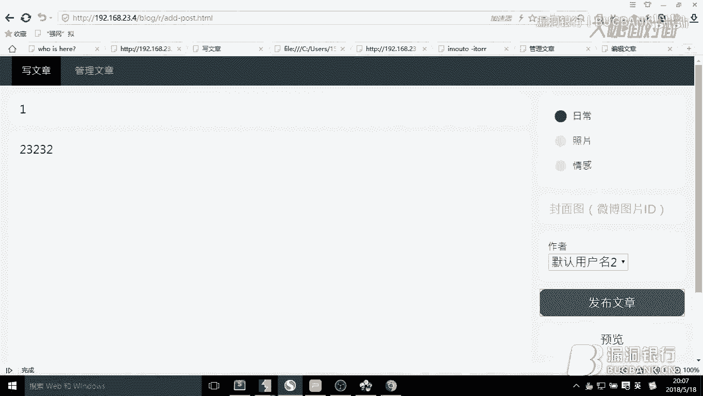

就test1。html。

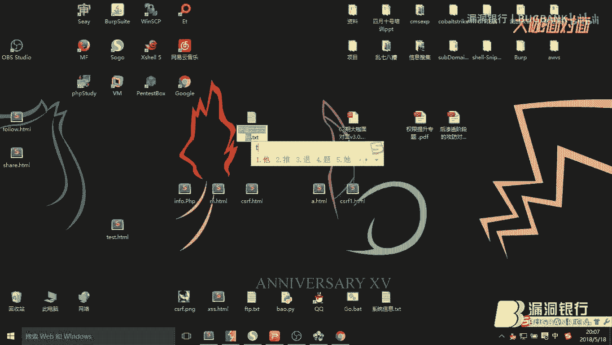

就是我們把要寫好的這個東西，放到這個html這個裡面，然後怎麼去利用。

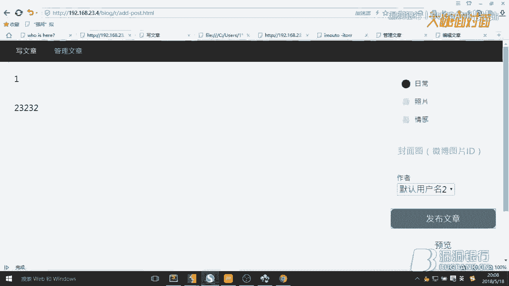

就是你把這個html直接拉到，拉到這個瀏覽器裡就可以，我們先看一下就是怎麼個攻擊過程。

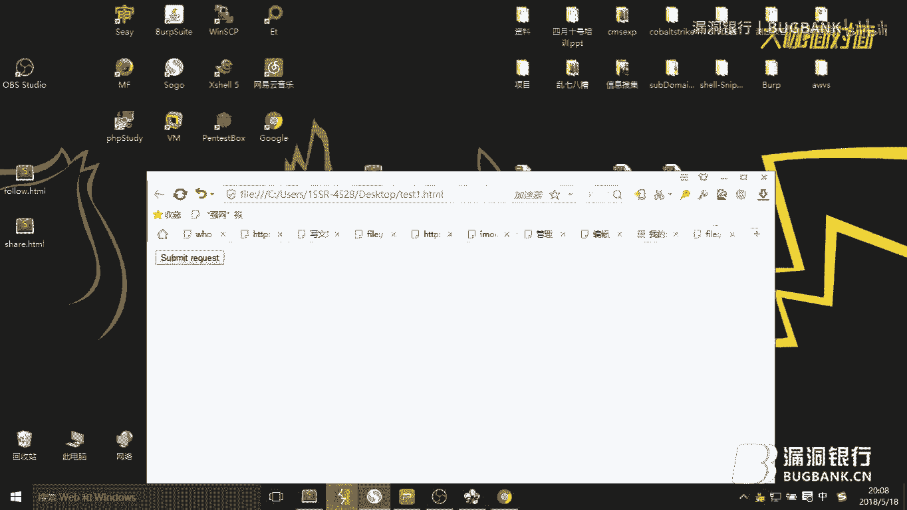

就是怎麼利用的過程，就是我們可以先看我們發文章就直接就是發到了，就是這個主頁，就有一個文章，現在是看這個第一個就是什麼內容，就是這個連接，然後我們看一下就簡單的。

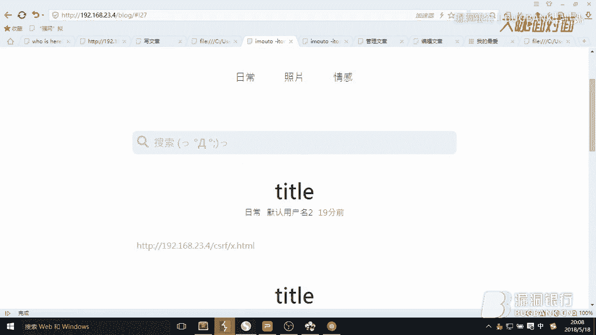

怎麼怎麼就是剛剛構造好的配料的怎麼怎麼用，然後就可以直接就是拉到瀏覽器這。

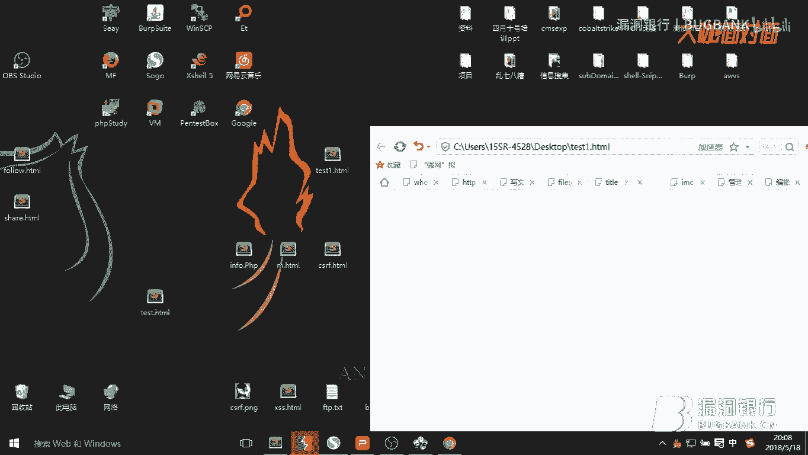

我們再刷新看一下，你可以看到就是我們不用就是去手動去發表文章，就是我們就是將配料的就是放在瀏覽器中，然後執行他自動就會，這麼就是這麼一個攻擊過程，然後一會兒會跟大家說這個這個漏洞是怎麼就是怎麼出現了。

然後網上有些就是什麼靶場，大家可以找一下，就是使用方法就是將自己寫好的puc上傳至就是高端一點的話，就是將自己寫好的puc上傳至服務器，然後將連接呢，發給被攻擊者就是進行一些手段，然後在被攻擊者。

就是就如果說將連接發給攻擊者的話，就是不是在我們就是自己瀏覽器中就是自己操作了，就是我們需要前提是我們需要什麼東西呢，就是用js來實現來就是來實現模擬化點擊，就是點開連接就不用我們不用點。

我們剛剛就是這個按鈕了，不用點我們這個按鈕，就是用js來模擬點擊，然後點開連接即可觸發CSRF攻擊，然後就是構造好puc，然後用js來模擬模擬請求以後，然後將連接發給就是被攻擊者，然後進行一些手段。

就是讓他觸發這個攻擊，在這個攻擊的前提下，被攻擊者的瀏覽器必須就是有的必須就是存有cookie或者session時，然後才可以完成攻擊，另外呢，就是CSRF的puc就是不需要點。

就是剛剛說他那個前提不需要點擊，才能發生請求，可以用js來模擬點擊，就是自動請求的話呢，是怎麼請求，我們我們可以看一下，就是我們加寫一段js代碼，就是document。get什麼獲取這個表單內容。

我們可以就是我來操作一下。

就是怎麼實現就是用js來模擬點擊，然後就是將我們剛剛就是他寫好的一個puc。

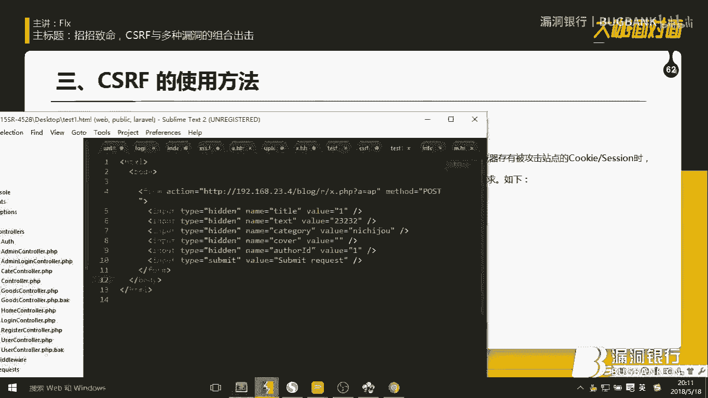

我們就加一行js代碼就可以了，我們給他加一個屬性，然後，id=csrf，document。get。

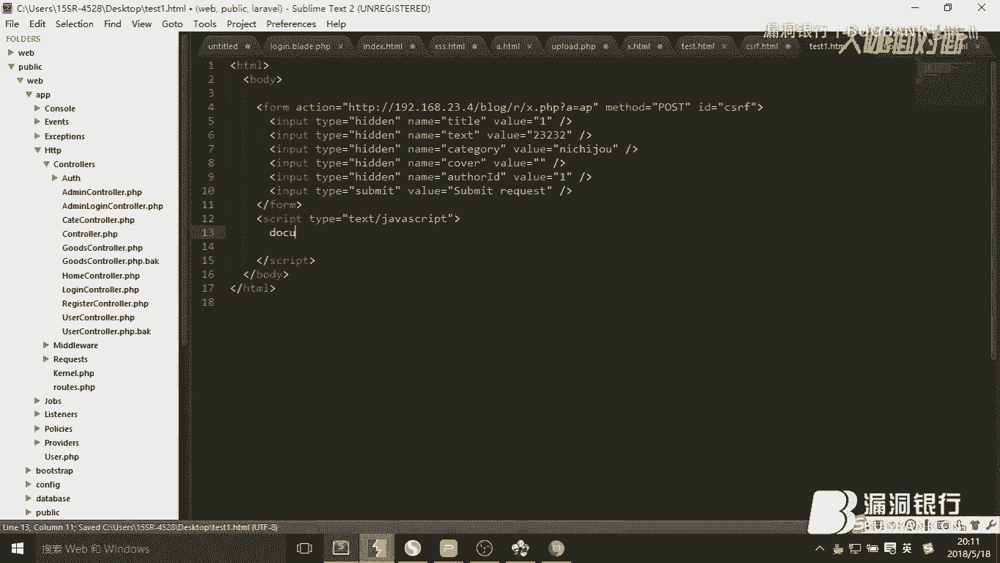

就是我們可以看一下，他就是這個先挖了一個變量，差等於什麼什麼什麼document。get，然後獲取這個表單的就是這個內容，我們呢，就是可以就是不用不用用兩行一行就能實現了。

因為他這個寫的是先獲取這個form表單，然後來觸發這個請求。

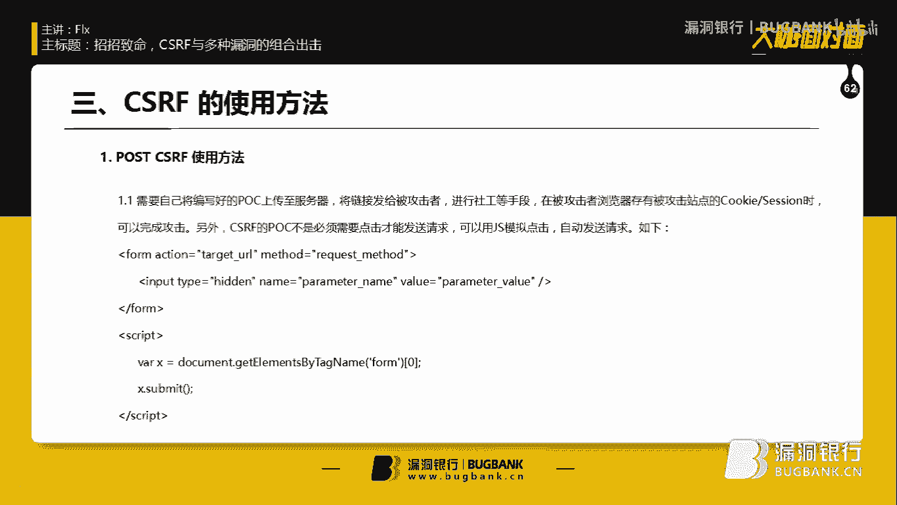

直接複製吧，就是，然後就是就是一行就是代碼就是來觸發這個也沒用，這基本上就是可以實現就是自動化模擬請求。

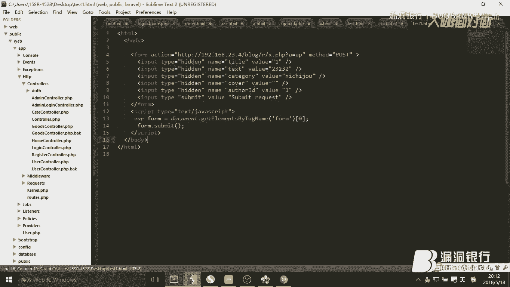

我看一下，我們再刷新直接發行這個內容就行了，剛剛的話可以看我們先把代碼注釋掉。

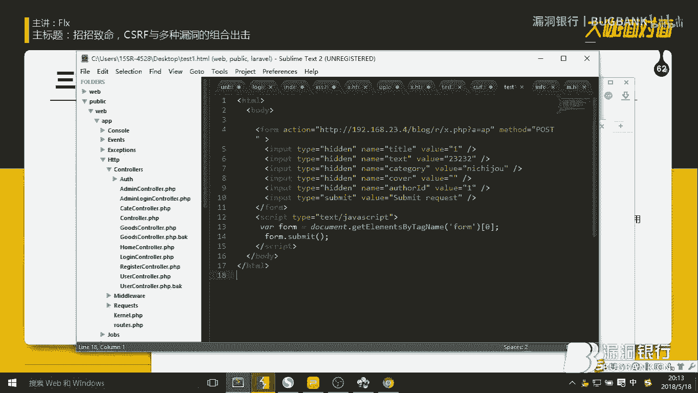

我們再來看一下剛剛那個HTML頁面，就是剛剛寫好那個。

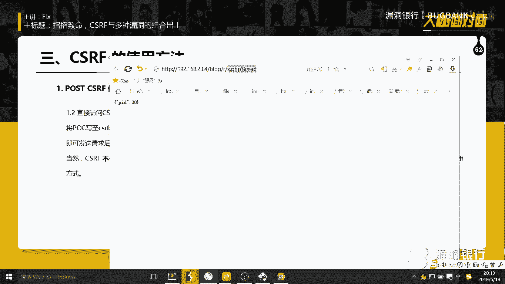

現在的話我們看一下代碼，就是我們把js就是，注釋了，現在是不是就是用js來模擬請求了。

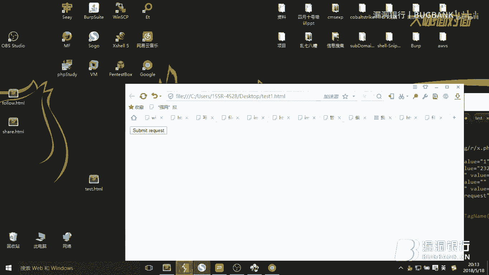

剛剛說我們可以就是在那個google。com。poc，然後點，然後把連接直接發給那個被攻擊者，然後自動用js來觸發模擬請求，我們看一下，現在的話，我已經把代碼打開了，我們刷新一下，然後這樣就觸發成功了。

然後我們看一下這個內容，剛剛我們差不多觸發了三遍，剛剛這個是模擬請求發送了，就是我們就是用js模擬點擊，就大概就是一行代碼可以解決，然後就是直接將那個CFR的poc，就是POC的頁面請求發送到瀏覽器。

然後會跳轉結果地址，然後可能就是會容易被發現攻擊，就是我們給他，給了他一個我們寫好的就是構造好的poc發給他，他就觸發完以後，這個頁面可能跳到這了，他可能會發現我可能被攻擊了。

然後可能怎麼會出現這麼個頁面，然後，這個時候可以用這個這個標籤來進行隱藏，就是將poc這個我們寫好的這個poc，將這個html頁面，鑲到這個標籤裡面，就是直接將我們的攻擊內容寫入到，就是。

寫入到這個標籤，從這個標籤，然後寫入到index中，然後這個發送請求，然後頁面還不進行跳轉，就很大機率降低了就是CSRF攻擊被發現的機率，當然就是CSRF不一定就是靠瀏覽器才能進行攻擊，但是大多數呢。

就是還是要靠瀏覽器進行攻擊的，當然還有一種利用方式，方式就是可以利用就是解壓文件內的JS，然後就是解壓文件裡面的JS，可以觸發這個的話，大家可以去網上找一下，這個我今天就不講了。

最講的就是怎麼從瀏覽器出發，但是給大家提一下有這麼個東西，但是他前提下呢，也是需要本地就是有QK，就是不過就是GET型的CSRF，更有有利於就是這個利用方式，大家可以就是回頭自己去了解一下。

就是這個解壓文件內的JS，然後GET請求方式，CSRF使用方法就是，GET請求就是不一定必須限制放表單，然後JS請求進行提交ematch，然後這些標籤等進行GET請求，下面就是一些部分可以發送的。

就是GET請求的HTML標籤，就是這個，然後這四個是我列出來比較常用的，ematch， link， script，然後這些就是用GET型的，然後可以用JS進行提交，常用的就是我常用的就是四種。

然後這個一會會給大家操作，那個GET型是怎麼操作的，然後還有一個就是CSRF，就是發送就是GET請求的實例，然後就這麼個，就是background，然後url你要請求地址，基本上這個就不跟大家多說了吧。

因為因為今天主題講的不是這個，就是先簡單的給大家分享一下，有這麼個東西，可能有的人也知道，也怎麼會玩，我這講的就是給那些不會的，然後比較基礎的人聽一聽，這個就是也不多做操作，CSRF。

然後我們就開始入床，就開始進階入床了，先給大家說一下就是入床是什麼，大家可以就是可能你們印象中比較深的，就是什麼去年幾月份，七月份還是幾月份，那個時候發就是一個445的勒索，那個就是大規模的就是入床。

然後我今天咱們講的就是，就是CSRF的入床，這個入床到底是什麼意思，就是我們一般就是找到一個漏洞的，比如說CSRF，我們可能就是攻擊單一的用戶，可能就是目標就是想攻擊管理員什麼的。

但是如果說要利用入床的話，你可能攻擊的不是就是單一的用戶了，而是就是大範圍的用戶，就是與就是感染病毒有相似之處，就是那種一傳十，十傳百，就是百傳千那種大規模的就是覆蓋用戶。

然後收到CSRF入床攻擊的用戶，會自動使用就是CSRF攻擊，然後其他用戶就是有一個人觸發了我們的CSRF攻擊，他就會發送另一個CSRF攻擊，然後從而進一步擴大攻擊範圍，也就是我說的剛剛就是一傳十。

十傳百那種，這個實例，我先給大家講一下這個利用的手段或者什麼的，就這個實例呢，我會操作，大家可以就是先簡單的看一下這個這個CSRF入床的實例，我是從網上找了一下，感覺還是比較不錯的文章，就是這篇文章。

就是先給大家看一看這個實例，待會我會給大家操作這個實例怎麼玩，就是他就是先找到了一個就是XSS漏洞，然後就是官方修復了一些，就是修復了一些限制，然後就是XSS就不說了。

然後他把這個XSS就是我們想挖了一個XSS進行放大攻擊，然後緊接著就是他挖了一個CSRF的漏洞，就是入床的話呢，也並不是說XSS和CSRF配合利用才可以，就是單一的CSRF就行。

因為他他發的這個是組合權，然後，這個文章大家自己看吧，我先給大家操作實例，就是這個實例寫在PPT裡，就是你們回頭可以看一下這個連接，我會我現在給大家操作下入床到底是怎麼用的，怎麼玩的。

就是我們可能就是在一些什麼就是發表文章，發表評論的地方，可能會看到一些就是莫名其妙的連接吧，就是我們從這個是我發出來的入床，我先給大家操作一下這個入床，是就是別人怎麼玩的，就是可能就是這個人就是攻擊者。

然後他利用CSRF漏洞，然後發出來一個連接，這個連接就是我們所說的入床，就是我沒看，現在是32分鐘前發送的一個文章，我們現在來點，就點開他發的這個連接，點開比如說點開這個文章看。

然後可以看到已經出發就是入床了，然後他至於剛剛就是說，被攻擊者就是很機率很小的，就是發現我們就是進行CSRF攻擊了，就是我就鑲到了那個什麼，那個標籤裡了，然後他就是做了個跳轉。

直接就是鑲到index裡面了，我們可以看到剛剛發送的就是32分鐘前，現在就是發動就是3點，一這個連接就觸發CSRF攻擊，然後我就是用戶，觸發了這個攻擊者發送的連接，然後我就觸發了這個攻擊。

觸發了攻擊以後呢，我就是在我發送一個攻擊，就是我再點一下，就是他還會再觸發一次，就是我觸發給你，你觸發給他，就是一傳十傳百的這種入床型的，就是大規模的，就是感染吧，現在說一下就是這個CSRF。

就是這個入床是怎麼弄的，首先呢，就是，這裡是一個點，就是發表寫文章那個點，然後我知道這就是有CSRF漏洞，我們現在就是來抓包，現在就是我們現在隨便就是發送，就是寫一篇文章，就亂七八糟的隨便發，然後發表。

然後也就是跟剛剛說的，這直接就是自動生成POC，然後改一下這個東西，然後呢，我們就是。

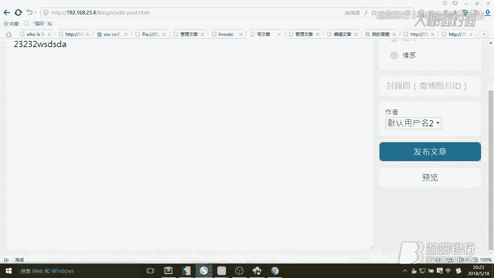

看一下，我們想觸發入床，必須就是改他的代碼，就是必須改他自動生成好的POC，我們就拿HTML1，就是剛剛那個。

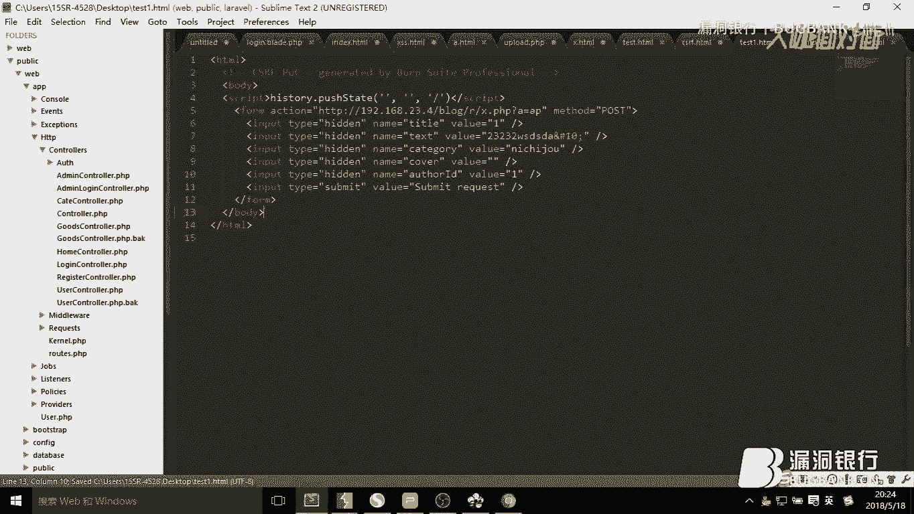

我們就是剛剛看到這個標籤是怎麼來的呢，剛看到標籤是怎麼來的，就是我發送的文章內容就是這個標籤。

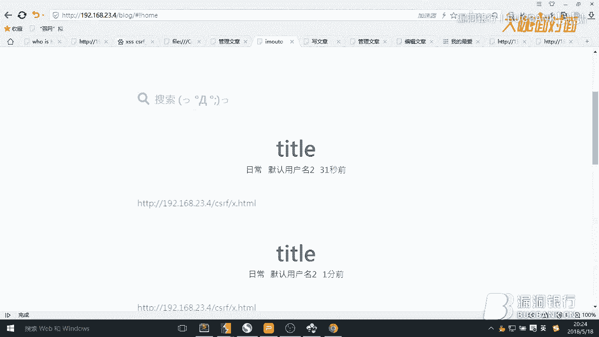

就是我們可以看一下，這個內容就是這個，這個是一看就是標題，然後文本內容，下面那些就不用管他了，我知道這個是內容就行了，就比如說我們就是，你可能會見到的，可能觸發CSRF的時候，還就是組合起來怎麼用呢。

就是你觸發完CSRF以後，他可能還會把你的就是，Cookie給你偷走，然後這個呢，大概就是，我們先看一下，我們就是現在已經勾搭好了。

一個就是還沒有入床的，就是CSRF攻擊的表單，點一下，抓著包呢，然後可能就是看到，因為咱們家跳轉，他就是攻擊完成以後就跳到這個頁面了，我們現在看一下前面這個，看一下主頁所發表的內容，發表這是一個1。

然後這個情況就是觸發了CSRF漏洞，這他先不管他了，就是我們怎麼來就是相互觸發呢。

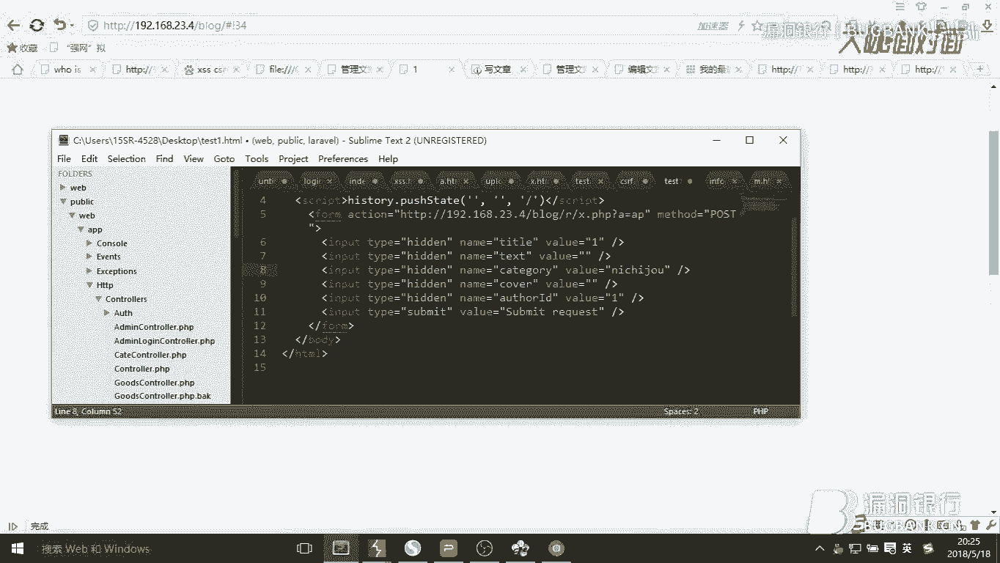

就是把，就是我寫了一個就是X是Timer Out。

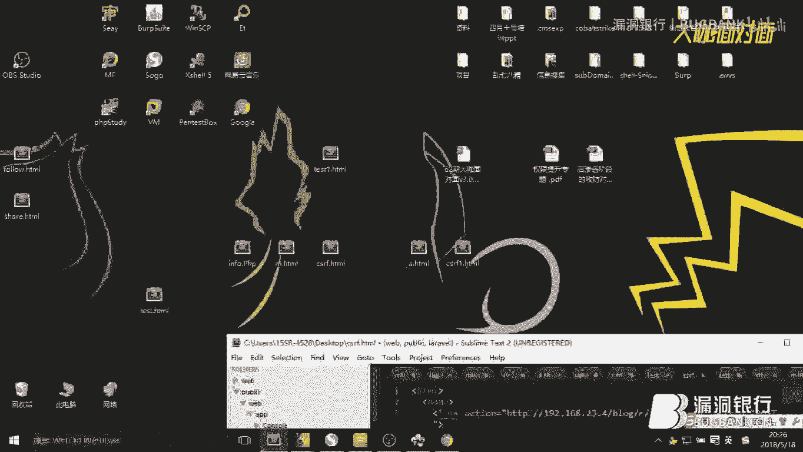

就是這個玩意兒，我們把這個我們攻擊的表單，然後鑲到這個標籤中，然後這個井22呢，就是用戶的ID，就是發文章用戶的ID，因為我的靶機呢，這個是192。168。23。4。

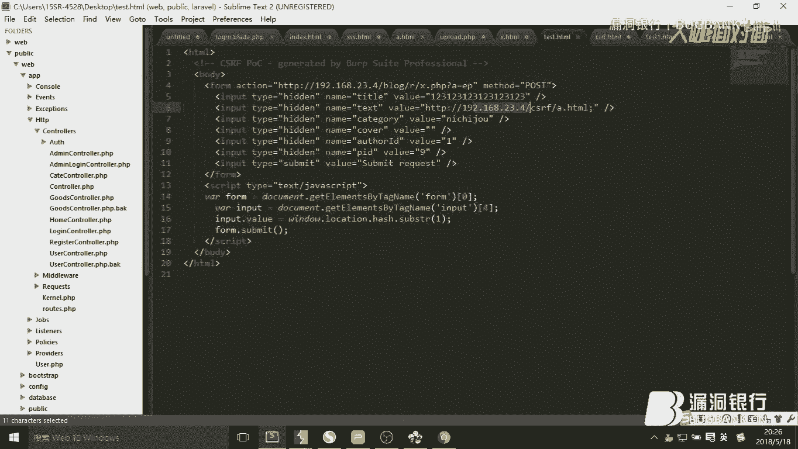

然後我看一下，我們先看一下我的靶機。

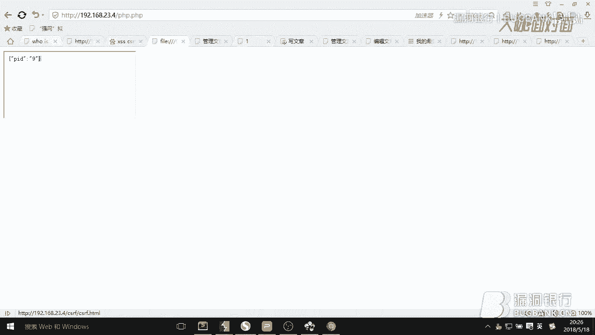

我是放一個大碼，因為靶場放在另一個環境中，網速有點還是什麼意思，這個，先不管他吧，我先說一下，就是我們把這個，就是我們把整個頁面相互到了，就是，就是A HTML，我們把整個頁面相互到這裡。

相互到X HTML一樣的，這兩個頁面是一樣的，然後就是發表內容，他就直接相互到了這個引代的詞裡面。

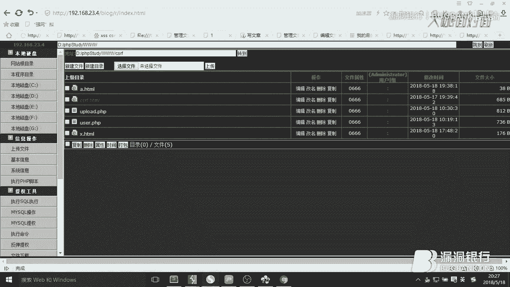

相互到這裡，然後為什麼會就是這篇文章內容呢。

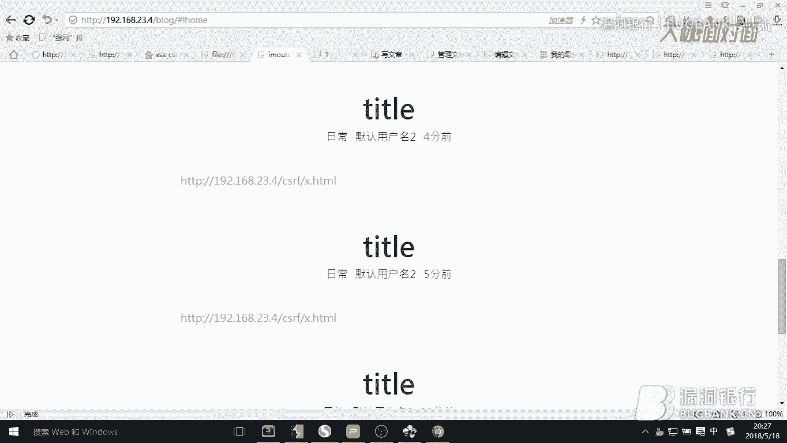

就是這裡。

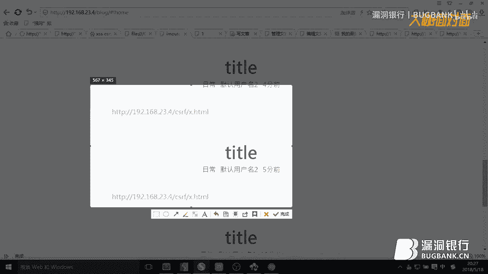

這篇文章內容就是我們那個文本的內容，他的V6值。

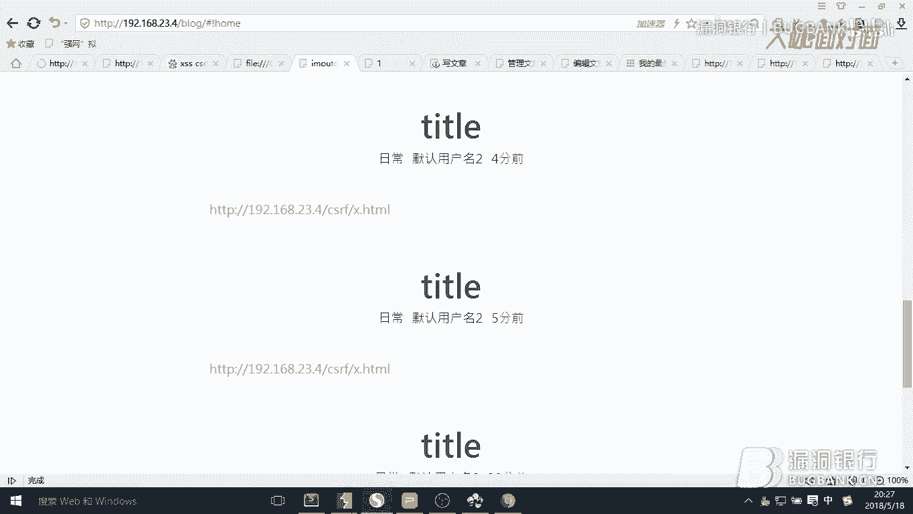

就是這個，我們就是將這個改好以後，然後用JS就是WOW，然後Farm，然後高科密的，然後獲取他的這個內幕Farm，然後獲取的這個數字0，就是我們這個，然後再來出發就是我們input。

然後又實現就是自動化的，用JS自動化就是模擬請求，大概就是這個先給大家看一下，我們先把這個表單內容，我們這個就是這個CSRF表單內容。

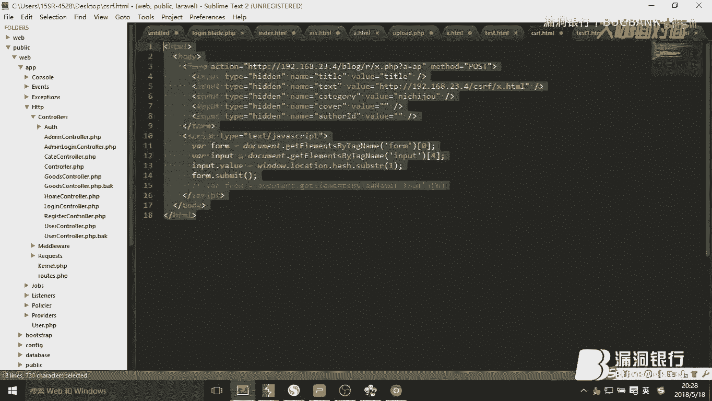

然後這個呢，這個XHTML，我就是剛剛所說的這個標籤，我們先來放到瀏覽器中，看看是怎麼回事，我們就是直接就是兩個一起用了，就是這個這兩個玩意一起用了，先放著，他雖然是error，但是他是出發成功了。

1920。

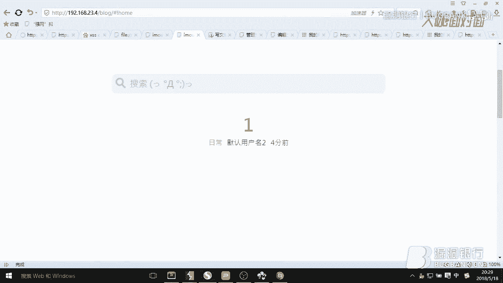

我們請求一下就是我寫的這個CSRF。

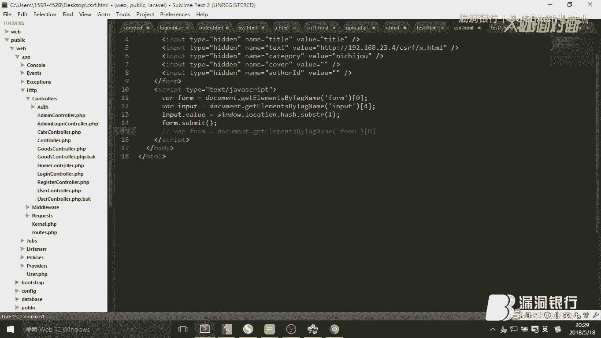

我已經放到了就是我那個靶機上面，CSRF目錄，然後這個這個表單是在這兒的，我們來請求一下這個這個表單，不用不用，我們不用請求這個內容了，因為我們把這個表單，鑲嵌到這個XHTML中，我們直接訪問這個。

就是怎麼說呢。

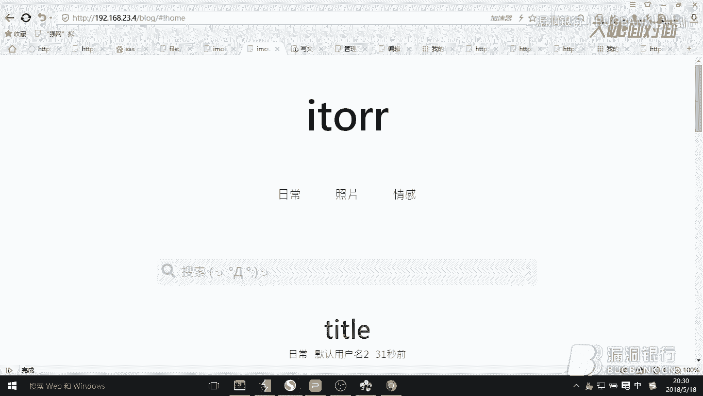

就是我們把這個表單，直接就鑲嵌到這個XHTML中，然後就是直接用XHTML，可以直接就是觸發這個了。

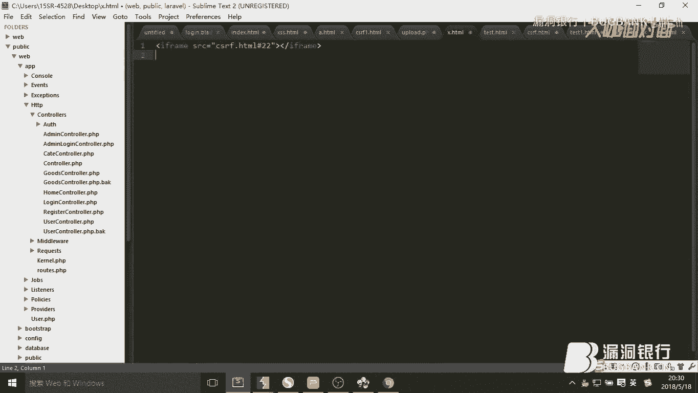

但是你看你可以就是在我的靶場中也可以看到，他發送的直接就是，就是這個連接了，他發送的就是直接這個XHTML了，我們觸發了，然後還有發送的都是從這個XHTML中出來的。

因為我們把這個估計好的就是CSRF這個工具表單。

我們已經鑲嵌到這個XHTML中。

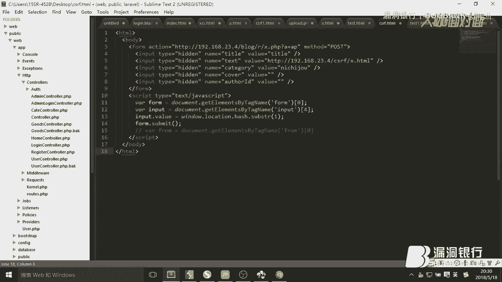

然後我們呢，就是直接就是訪問那個XHTML，結果觸發了，這個目錄，然後訪問這個，就是直接就是談到主頁來了，index上面來了，然後至於這個蠕蟲，然後點一下，然後他就會再發一個點一下，他又再發一個。

然後也就是所說的一穿十，然後十穿百的這種，蠕蟲的話呢。

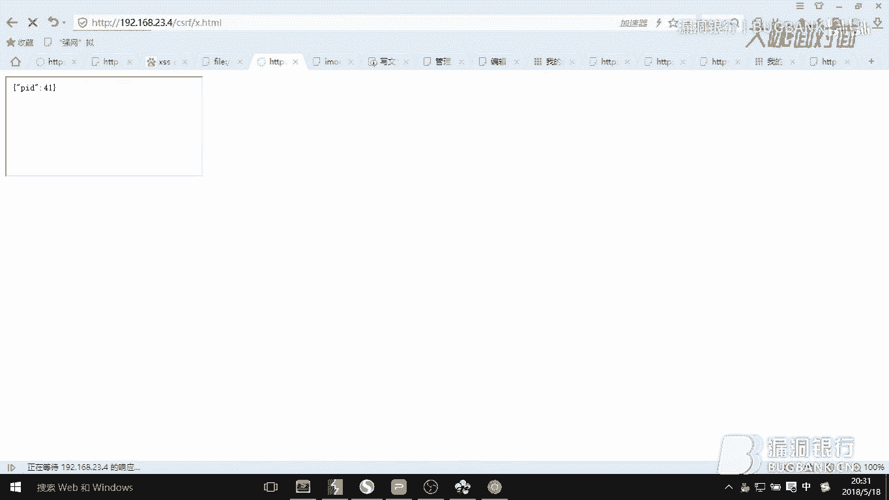

大概就是這麼個玩法，就是把我們這個工具表單，然後實現就是用JS來實現就是模擬請求，用JS自動模擬請求，然後把我們的就是所發表的，比如說我們就是發表的內容，基本上就是在，就是在評論裡面可能就會看到一個。

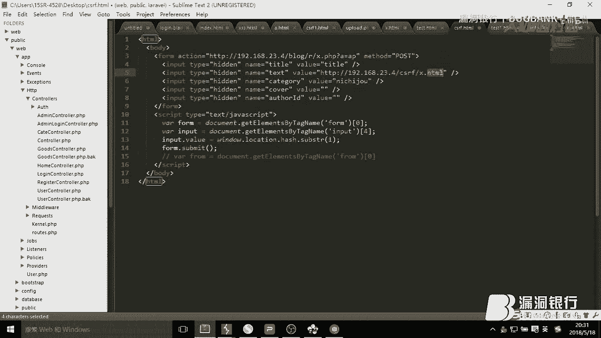

就是這麼個網頁點開可能有機會就是有機會就是蠕蟲，你們可能就是現實見過的例子很少，嗯，一會兒我直接就是講完了的話，把這個靶場發給那個咱們論文銀行的運營，然後讓他可以分享給你們。

你們可以自己就是試一下怎麼玩，這個蠕蟲大概就是這麼個玩法，這只是比較就是簡單一點的，像一些什麼高端一點的操作，大家可以就是去網上理解，今天講的就是簡單蠕蟲的玩法，也是XRS進階版，就是點擊，然後觸發。

然後被攻擊者再發送一個攻擊請求，然後也就是這樣點一下就觸發一下，然後他就是在發送一個請求，大概這個蠕蟲就是這麼個情況，我們來接下來這個實例的話，大家就是可以就是回頭去看一看，嗯。

現在就是講一下就是XRS與CSRF的組合權吧，就是CSRF就是可能就是被開發者修復，就是例如加了什麼各種驗證，攔截偽造請求，然後這個時候有XRS漏洞的配合，就是威力可以放大很多。

就是可能當站點有HTTP only的時候，XRS可能變得會更加難以利用，這個時候我們可以就是將他的威力，就是將他威力超強，就是用CSRF來實現攻擊，一般就是一般的站點敏感操作。

就會都會就是帶上就是附加字段，就是確保你的請求是自己發的，而不是別人偽造發的，然後這個時候我們可以就是用XRS來附加這個字段，然後進行CSRF，其實在我們利用XRS的時候呢，一般也就是打到QK。

然後來登錄什麼用戶的賬號，進行操作，基本上就是我們XRS的完成的攻擊，然後這個時候呢，我們如果就是將其利用為CSRF，可能就是更簡潔化，就是簡化了攻擊的過程，然後說一下這個Sheriff XRS。

然後很多網站可能就是存在缺陷，大部分人就是可以就是認為這種漏洞難以利用，就是危害低，就是沒什麼用，然後一般出現在用戶編輯，或者自己隱私就是信息，然後搜索出，然後多數用戶操作之後才能進行更改的地方。

這個時候我們就是用CSRF來偽造用戶的就是操作，最終利用為就是XRS，然後我們說一下就是這個XRS，這是兩個激烈的比較激烈的漏洞，就是兩個激烈的一個就是XRS，還有一個激烈的CSRF，它的組合權。

就是激烈的CSRF呢，就是CSRF，就是我們在用戶登錄的時候，沒有做些什麼驗證Token，驗證refill，或者填驗證碼這些，就存在了無比就是比較激烈，而且在一般人看來還不算是漏洞的。

然後就是這個這個激烈的XRS，也是一些網站用戶填的會有這麼一個功能，就是在用戶提交信息失敗，並且就是返回就是去填的時候，幫你把自動之前填的信息補回來，這樣就避免了用戶的輸入，節省了用戶的時間。

就是這是一個很好，很人性化的就是功能，但是這種補全功能不必重視，因為很多網站不會對輸出進行什麼過濾，然後可能會存在XRS漏洞，我們來說一下這個什麼是Sharefile XRS。

就比如說我們在修改信息的時候，這是我自己寫的一個就修改信息的時候，然後這個簡介呢，是我寫在sleep的標籤裡了，然後我們直接在這輸入alter，然後然後他就可以彈窗，但是這個呢，我認為就是他不是反射的。

我們看似就是反射的XRS，但是這個就是被稱為Sharefile XRS，然後這個漏洞呢，我就是看似也沒什麼卵用，就比較激烈，也就是沒有什麼傷害，沒有什麼危害，然後一般，我們就是看這種漏洞。

基本上覺得跟沒有是差不多的，但是如果說我們就是打一套組合起來的話，但是我們想像功能可能就比這個要好得多，就是我們將這兩個機子的漏洞，就是變廢為寶吧，就是將激烈的CFR用戶登錄沒有功能。

就是用戶登錄的功能沒有添加什麼驗證的，然後存在無比激烈的，然後這個剛剛前面寫過，這個呢，我們看一下怎麼用，組合權一般是這樣點進去，然後基本上它說你成功，然後我們從這刷播，其實這是有一個CSR的戶。

然後我們直接丟到這個表單，丟到這個生成，也是就是都是HTML。

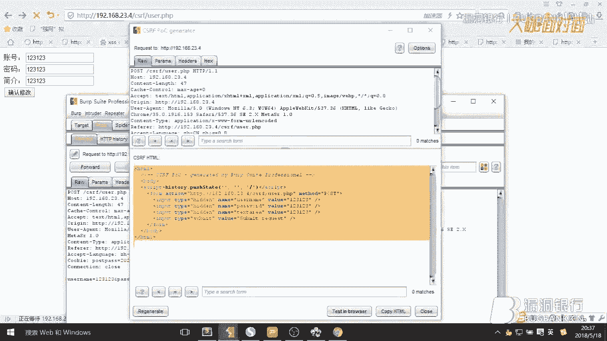

就是我們將這個CSR，我們先看一下這個玩意。

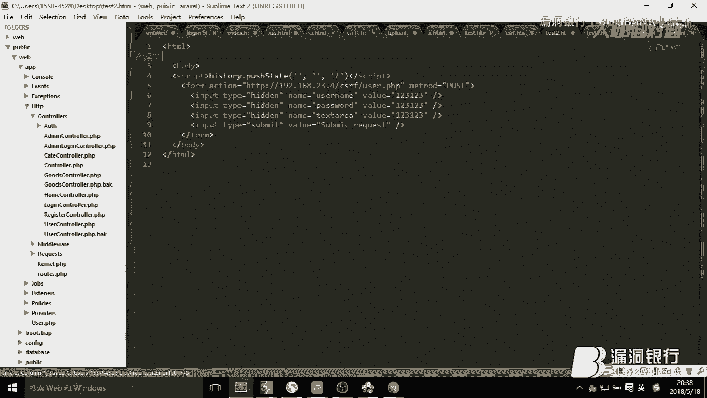

先把這個包給招呼，我們現在看我們就是這個CSR漏洞。

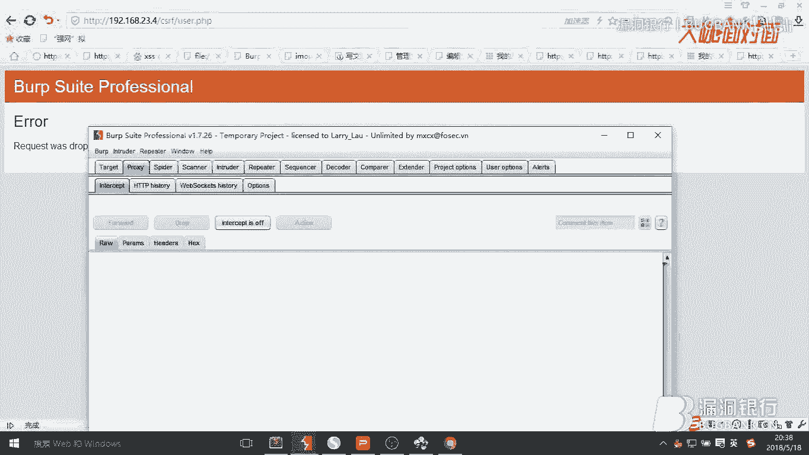

然後我們就是直接就是可以看到省略的那一步，也就從這可以修改，但是這樣呢，就是只針對這種漏洞啊，我感覺就只針對自己，然後對外的話呢，沒什麼用，然後也就是說他比較激烈，但是如果這兩個的話呢。

我們一起用怎麼用，就是我們將這兩個機子漏洞一起用，可以看一下，我們就是，在這個簡介這，簡介這，因為我這個簡介是直接就是這個，這個input框是寫在那個sleep的標籤裡面。

所以我們就出個alter可以直接彈窗了，然後這正好有CSRF，就是我們現在這兩個機子漏洞，只能影響到自己，不能影響到別人，就是我們想怎麼讓這兩個漏洞影響到別人呢，就是我們將它就是組合起來，就是這個。

這個值是我們那個簡介，我們把它改成一個alter。

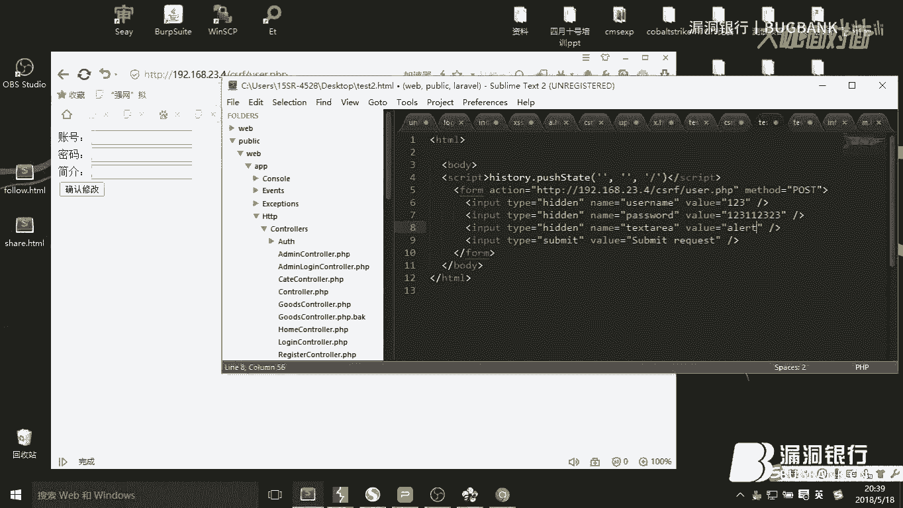

然後再放到論壇期中運行，然後我們可以看一下，然後可以看，可以看到就是，就是也觸發了CSRF，也觸發了XRS攻擊，但是有的人可能會問，你這樣的話，不就是同時觸發兩個漏洞嗎，但是怎麼去影響到別人。

就不就簡介化了，不就是進行簡化的攻擊嗎，怎麼影響別人呢，就是我們就是可以，將這個值改為我們的就是XS平臺，可以改為一個就是，就是show cookie的平臺，就我們的就是攻擊代碼。

然後把這個就是打是打別人Cookie的代碼，然後從這就實現就是我們剛剛所說到的，就是，所說到就是用GS來模擬，來模擬就是請求來模擬偽造請求，然後我們現在再想一想，這個因為沒有別人的賬戶。

所以我自己寫了一巴掌，就是不能給大家付現，就是還是會給大家說一下這個怎麼用了，這個一般就是我們過得好，從這個值這過得好，攻擊代碼就是我們獲取Cookie的平臺地址，然後我們用GS來就是實現。

就是GS模擬請求自動化的，我們將這個表單放入到就是我們，放入我們的服務器，生成一個連接，我們將連接發給這個，就是可以和我們一同用這個網站的人。

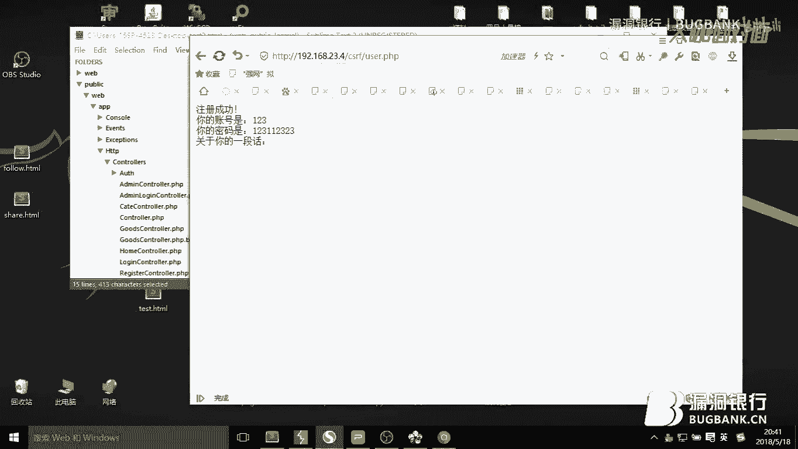

然後我們就可以修改他的，比如說修改他的密碼，還可以如果不是修改密碼情況下，比如說修改個人信息，但是修改個人信息什麼的，我們可以就是把我們過得好的連接發給那個人，然後那個人呢，觸發我們的攻擊。

我們就是可以打他的Cookie。

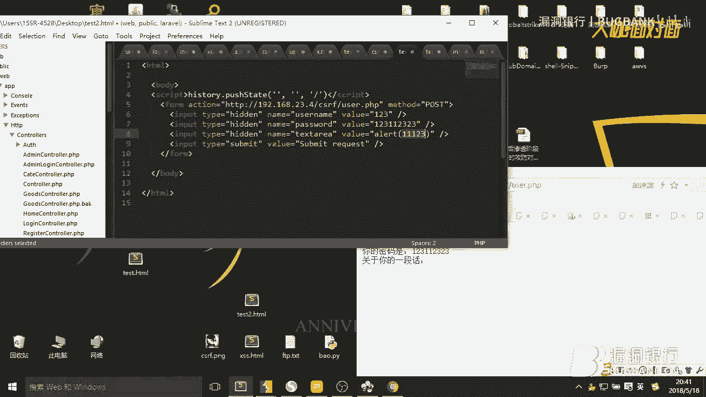

就是可以去把他的個人信息什麼的，這個呢，也就是說的組合群，其實也沒有那麼小，那麼神，但是有的就是比較基礎比較簡單的，還有的也是有騷操作，這個激烈的XSS與這個激烈的CSRF組合群，大概就是這麼一個流程。

然後就是再看一下配料的，就是我們將他的內容修改成我們自己想要的，然後將那個存在XSSLogo那個框，就是先說XSS這個框，然後輸入上我們的就是獲取Cookie的地址，然後再用JS來模擬請求。

然後生成一個連接，然後發給被攻擊者，大概的情況下就是這兩個，如果說你不是組合群的話，這兩個Logon看似真的是沒什麼用，但是如果的話呢，你如果將兩個連接放在一起，就是放大化攻擊吧，現在給大家就是組合群。

我只是講這兩個比較激烈的，沒什麼用的，當然就是我們可能就是在平常遇到這種不是激烈的，平常遇到什麼存入型的XSS，可能會很少用到這種組合群，這就我這就就提到兩個激烈的兩個激烈的漏洞，然後組合起來。

將兩個漏洞變廢為寶，然後怎麼去放大化攻擊，然後文件上傳，文件上傳與CSRF的組合群了，一般就是文件上傳可能會不會被我們攻擊者就是，修改什麼的，大家就是可能都知道。

通常用CSRF來上傳一個文件並不是很簡單的，就是問題在於我們創建的假表單，然後提交數據跟瀏覽器文件上傳，然後提交的數據有一點不同，那就是上傳的時候請求會有一個Fill Name這個參數。

我先給大家看一下這個Fill Name參數，這是直接，我們先登記，可以看到這兒是有一個文件上傳，剛說的有一個Fill Name，我們寫一個PP文件吧。

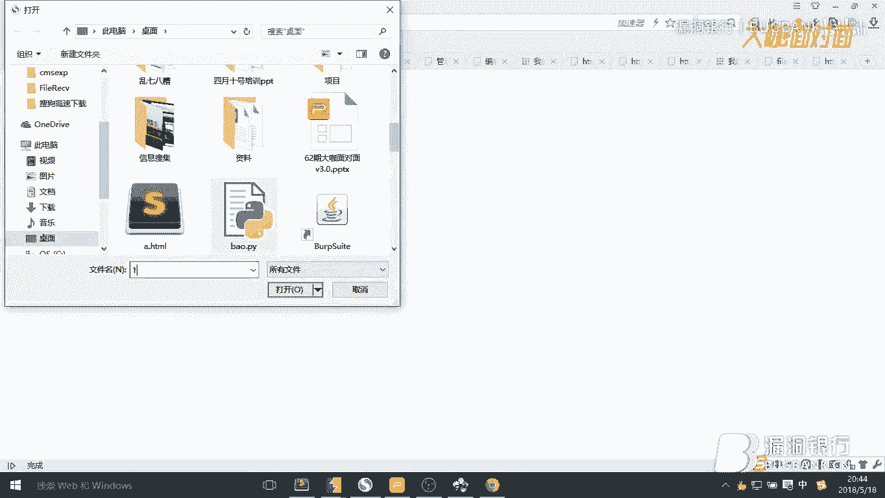

寫PPinfo，我們就是在上傳文件時候。

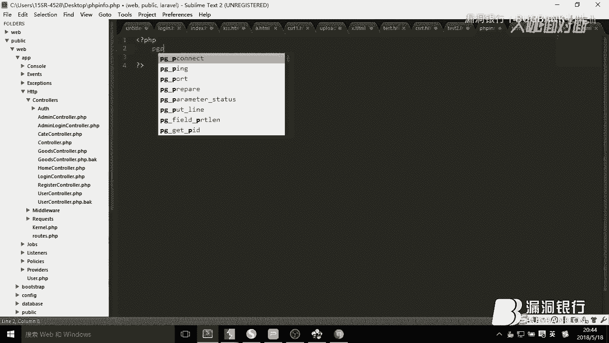

進行抓包，然後進行抓包，可以先把這個關了，然後上傳，剛剛PPT中所說到的這個Fill Name參數，就是用CSRF來上傳文件不是很簡單，就是有一個不同點，那就是上傳的請求會有一個Fill Name參數。

現在看起來是Fill Name參數，他會判斷我們是文件就是這個尼稱。

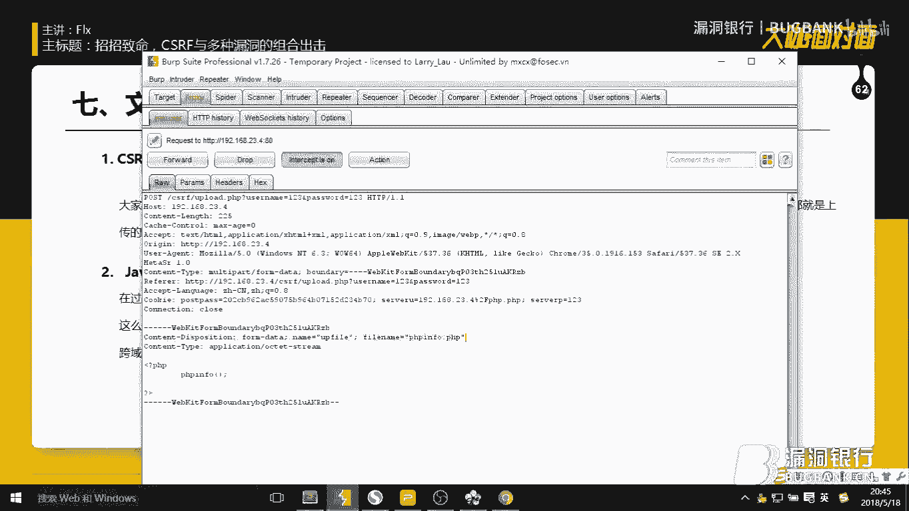

什麼爛碼七糟的，然後這個就是這個就是PPT裡說的Fill Name參數。

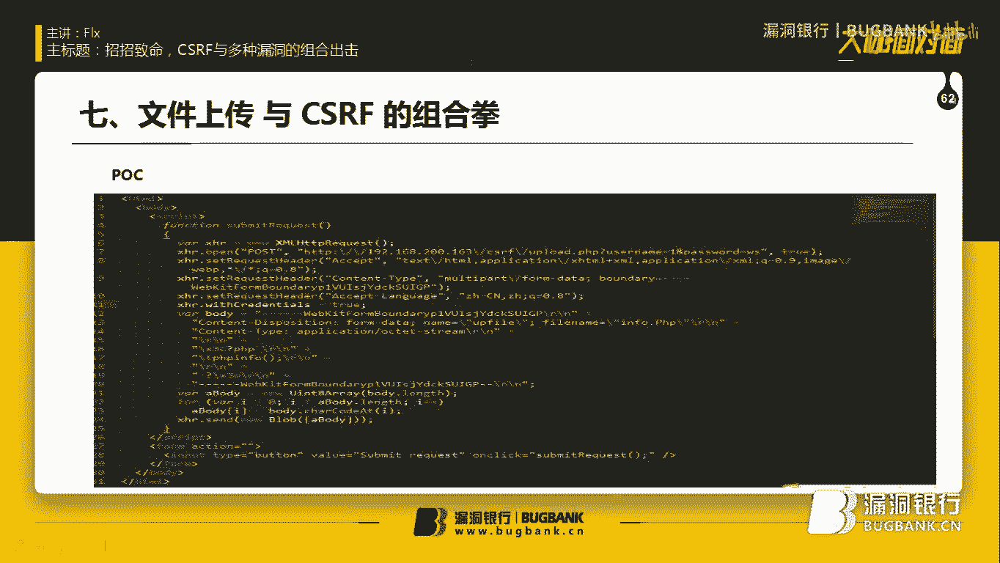

然後用我們就是可能就是如果用文件上傳配合CSRF攻擊的話，可能用我們的POST的，剛剛講到的POST和GET可能會實現不了，剛剛也說到可能就是用JS或者CSS比較好。

就是我們用POST跟GET肯定是不行的，然後我們就用JS來發送有效的Fill Name屬性，然後就是在過去呢，由於同源策略的影響，就是我們沒法通過JS去訪問別的域的，然後考慮到XSS這麼氾濫。

然後從策略就是讓我們想要生活更安全了，不過就是利用STM5的跨域資源共享，可以讓JS來發送就是有Fill Name屬性，並且合法的跨域請求，這樣就是用戶只要訪問到惡意頁面，不需要其他交互。

就直接可以用CSRF來上傳文件了，我們就是操作一下這個大概是怎麼就是組合全了，因為就是我們既上傳文件也用CSRF，就用CSRF上傳這個文件，我們就是，先上傳那個PPP info，然後抓寶。

放到這個SnoopQC。

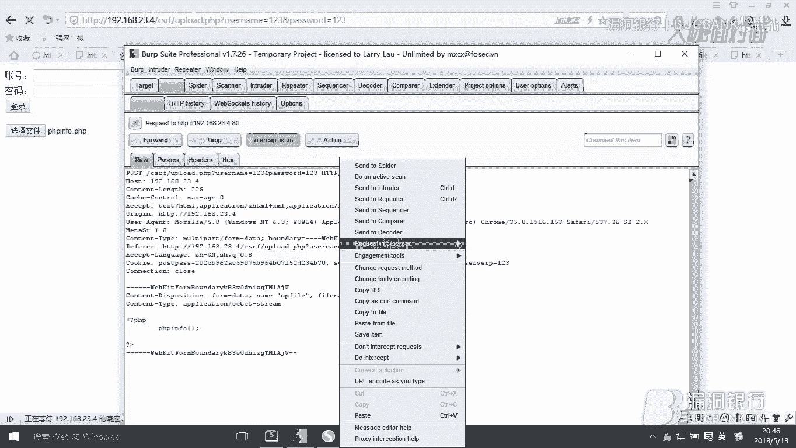

我們可以看到他直接就是JS來模擬請求，來模擬一些東西來進行上傳，但是在我們後端代碼裡是沒有這些東西的，也只是一個就是普通的上傳而已，沒有這些JS的東西的，我們來看一下，這個直接改掉。

看到就是方子是一個函數，然後從下面然後往裡可調用這個函數，就是也是看一下怎麼操作。

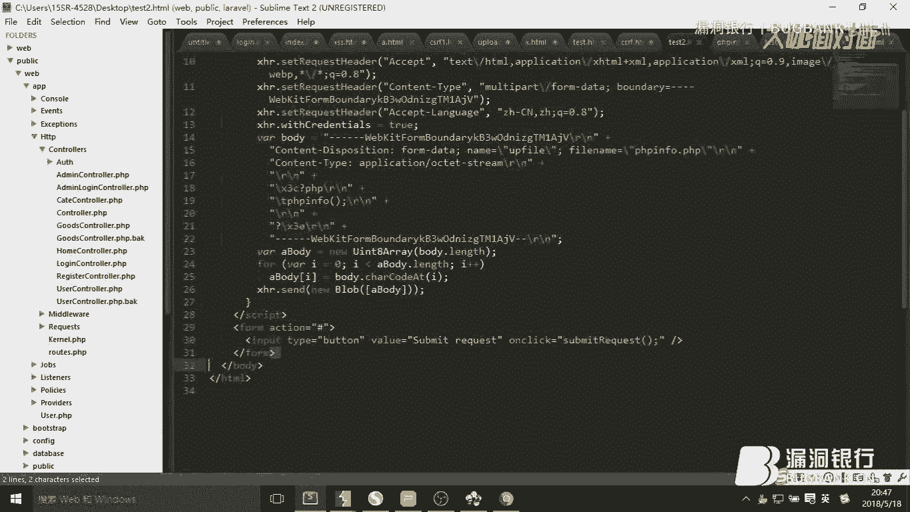

我們直接把這個表單也是同樣拉到瀏覽器裡，可以把這個包給照顧掉，現在是沒上傳了，刷新一下，我們來就是，提交一下事實，我今天就是臨時可能時間比較緊，沒做這個什麼詳細的利用，這個玩意兒點完了以後。

他就是不給你就是跳轉什麼連接，也沒有什麼就返回包，然後實際上我們的就是這個文件已經上傳上去了。

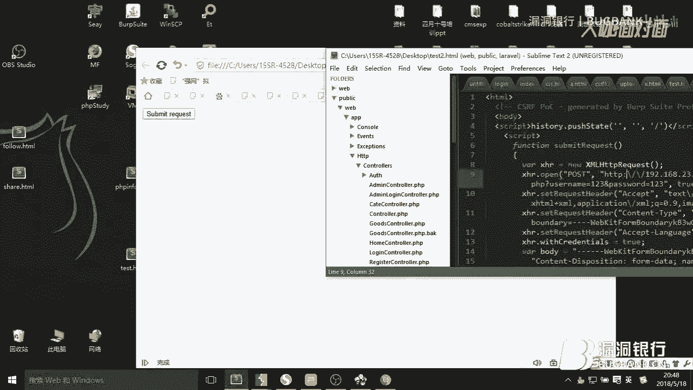

我們從這個大碼裡看一下，上傳我哪個目錄了看一下，啊，在這呢，在這呢，我們先把它刪了，剛剛沒看到有點緊，先把它刪了，然後這下面是這個目錄下面是沒有這個PGP info的。

我們就是利用CSRF來配合文件上傳，我們再點一下這個請求。

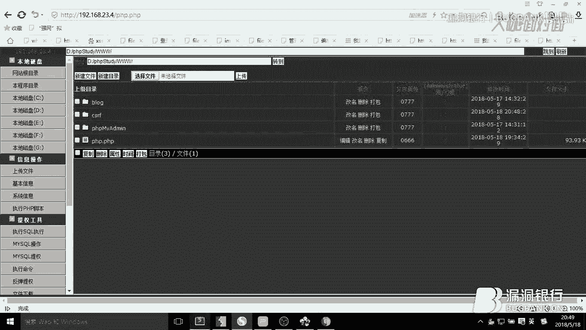

因為我呢也是臨時寫的靶場，沒就是沒太多時間去看這個玩意兒，也沒怎麼去調他這個返回包是沒返回是怎麼回事。

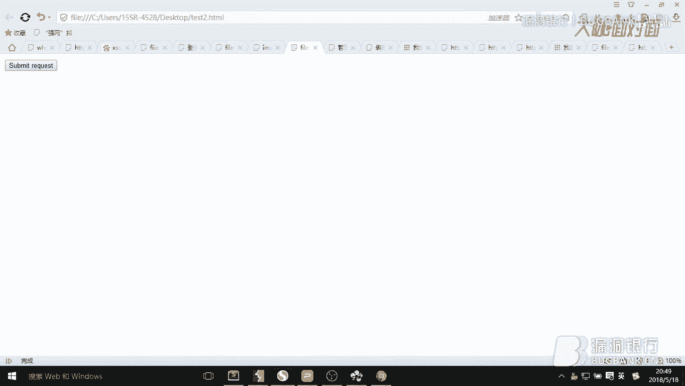

然後我們點了一下以後，就是再刷新這個大碼裡面的目錄。

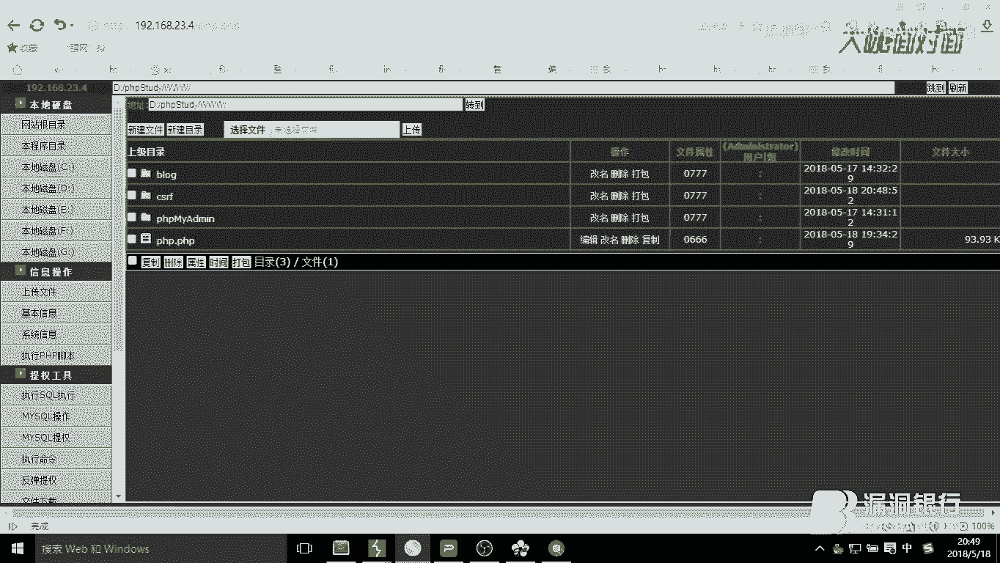

然後這個可以看到是有PGP info這個文件了，實際上他是已經上傳成功了，這個呢到以後今天就先把講完以後，至於為什麼就是沒有返回，我會一會兒會處理一下，然後你們可以就是通過QQ，然後來問我。

這就是基本上就是，文件上傳與這個CSRF的組合牆，就是用JS來發送有效的CodeName屬性，記住一定是用JS。

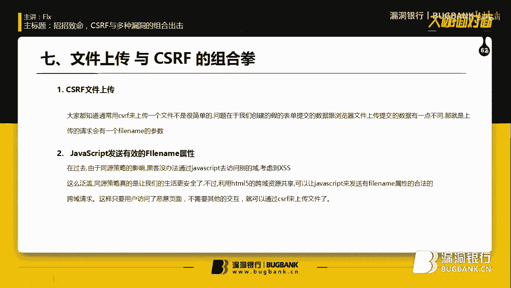

然後再來看一下這個PoC，然後一個函數，然後就上傳文件內容，直接就是CodeName，然後今天的課程差不多就到這裡。

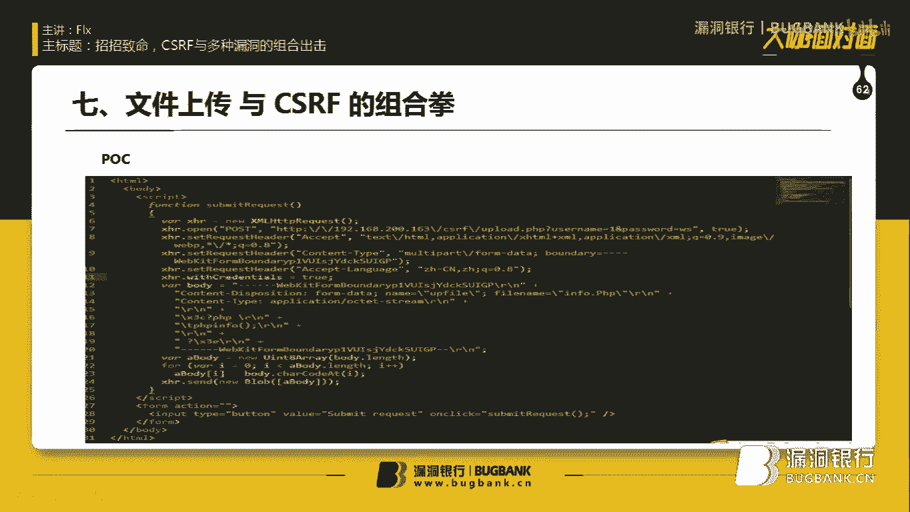

然後再給大家提一下就是CSRF的修補建議，第一呢就是驗證refer，然後就是驗證用戶的來源字段，是一種防止CSRF攻擊的手法，但這種手法就是很容易突破，即使就是偽造這個來源字段。

就是通過自訂一個數據包的hide，就是輕鬆可以繞過，就是怎麼為什麼說他可以輕鬆繞過，就是說這種驗證還是相對來說，一些可以繞過還是不怎麼安全，但對一些掃描器來說的話，他已經是可以防止發現CSRF了。

然後就是自訂一字段，在用戶請求添加一個唯一的，就是臨時臨時的自訂一字段，也就是我們就是聽說過的talkie令牌，然後來驗證用戶的請求是否是偽造的，然後此種方法呢，就是能有效的防止CSRF攻擊。

就是一旦出現XSS，就像上回說的也可以進行突破，當然如果talkie生成的規則比較明顯簡單的話，攻擊者也是能同樣就是通過服務端檢驗，然後進行CSRF攻擊，就是怎麼說有些他就是說你都說了，這是修補建議。

怎麼還可以進行攻擊呢，然後他可能就是修補的不太完全，只是表面上的修補，然後我們在實際上是有的是還可以繞過的。

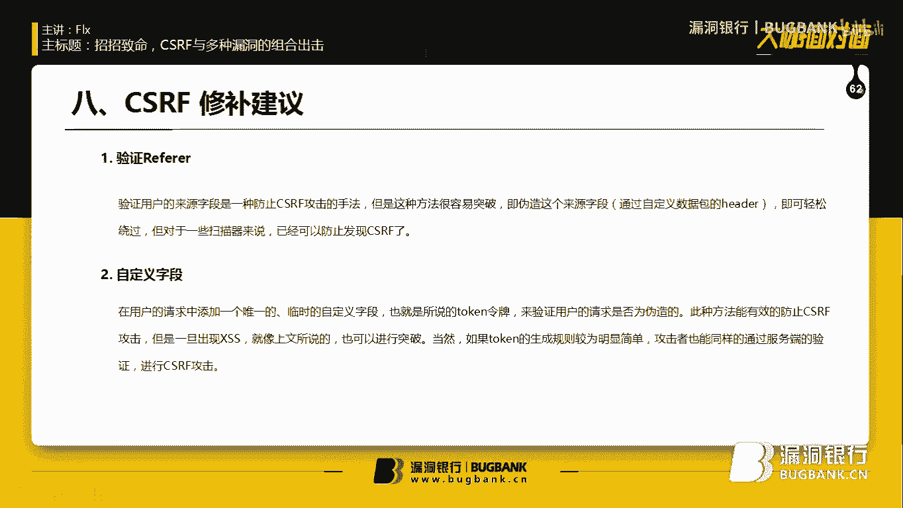

但有的話是不行，然後今天的話課程差不多就到這裡了，然後這個就講完了，我們就是讓運營點點來說吧，好，大家辛苦了，感謝大咖帶來的耐心的講解，那下面就到我們行長問答環節，今天大家的問題有點多。

所以大咖可以切換到我們直播間，看一下大家的提問，請求偽造怎麼就是無限制辱蟲了，請求偽造無限制辱蟲，我們就是剛剛說了，嗯，就是我們構造好的內容吧，就是他可能會在某一個點上這個辱蟲。

就比如說我們在發表文章的時候怎麼無限辱蟲呢，就是我構造好一個攻擊表單，發送的表單內容就是再次調用了我的攻擊表單，然後利用我們就是來回調用的方法，然後讓這個辱蟲就是自動化散播，然後讓攻擊者就是發送攻擊。

然後被攻擊者觸發這個攻擊，然後他再發送一輪的攻擊，這個就是差不多就是無限制，大概就是CSR的內容，就是你攻擊內容，發佈內容的話，這是我演示的比較就是簡單的基礎的，就是當然現在的有的差價算了。

可能可能就是剛我說到的比較雞肋一點了，然後基本上發佈的攻擊內容可能就是，大概就是這麼個流程，有CSR和Token策略，有這個Token策略的有一些可以繞過的方式，今天但是難免沒講，我想問一下。

這個用JS的話也是可以，但是今天我沒用，我就是給大家說了一下，就是Pulse的GET，你們回頭可以自己去網上找一下，就是怎麼在偽造用戶發表文章，有一個指定的ID是用戶發生的。

在構造的時候怎麼來繞過這個用戶ID的，例如就是剛剛我說到，大家可以看一下，你問這個問題，我從這個標籤中，就是給這個用戶ID，這個ID就是構造了一個自己可以模擬用戶，然後我剛剛也說到，這裡呢。

為什麼有一個警號，這裡就是來構造，就是你剛剛說的指定ID，大概就是這麼個意思，我們可以指定ID，比如我從這可以指定這個用戶ID，這個用戶ID，我們可以指定他的ID是22，當然也可以隨便指定。

21都可以隨便指定，待會講講跨域的Pulse使用Token，這個我今天就是沒準備，就是使用Token來防止我們怎麼繞過的，今天我沒準備，大家如果有什麼想了解一下，就是怎麼繞過了，一會兒的話。

你們可以加一下我的QQ，然後以後可以進行一些這方面的交流，我也可以給你們單獨說一下，因為今天也是兩天時間比較忙，沒有寫這個怎麼驗證以後，然後再進行攻擊的，只是講了沒有驗證的情況下進行攻擊的。

剛剛也說到這些，但是可以繞過的，從接口中數據不攜帶上傳，過去Cataway驗證這種情況，你這個意思，你能問的再仔細一點嗎，可能就是不太懂你的意思，在他攻擊如何進行防範，如果進行防範的話，剛剛也說了。

驗證refer，然後給用戶添加就是，Simple驗證添加Token，有的就是refer驗證的，他可能驗證的不是某個URL地址，他可能就是驗證了是不是，到底是不是你這個網站，沒有就是例如。

你驗證某個就是頁面，這種是可以繞過的，他報的話，可能就是沒有驗證，API scan報有Cataway漏洞的話，他可能驗證refer，驗證了就是網頁的URL，沒有驗證頁面。

Cataway漏洞使用WAF怎麼繞過，這個我還沒遇到過，使用WAF的話，怎麼會使用到WAF呢，可能出現的地方就是，我們用戶，什麼註冊登錄修改，然後發表文章這些都是有可能就是，出現3SWAF的。

可能就是在生動測試過程中，給大家分享的小經驗吧，你就是對一個網站，比如說不讓你用算表器了，就是Doinbuff抓包，然後可以抓包改包，可以看看他什麼什麼，就是可以改哪些參數可以動了。

然後你再可以進行一系列的操作，在代碼審計中有沒有辦法可以發現，這個是可以有的，可以有的，例如網站的註冊邏輯，我忘記了，這個今天沒講，多個3SWAF怎麼利用，這個是可以利用的，我今天就是剛。

前兩天剛挖一個漏洞，就是我把XSS和兩個3SWAF一起利用，然後基本上就是一個頁面過去，先就是發表蠕蟲，就是發佈蠕蟲，然後我另一個3SWAF就是關注我，然後就是可以聽到一些大佬什麼說的，點擊即可關注我。

然後，可能就是這個操作，這個是可以連續利用的，就可以一系列連續利用多個3SWAF，主要看你頁面怎麼構造，挖掘3SWAF不需要一定的權限了，TOSIN本身是存水瀏覽器，但是可以存在Poke，不必導致塞外。

這個是可能會導致，還是看他驗證這個身份是怎麼驗證的，這個無線蠕蟲是需要XSS配合吧，這個是不需要配合XSS的，因為我們就是反復的利用這個蠕蟲，就是我們反復利用3SWAF，是不需要XSS配合的。

就是遇到這種XSS發表文章ID是不固定的，這個一般沒有發表文章兄弟，怎麼利用3SWAF，我剛說了這個是否XSS，可能只是你本身自己攻擊自己那種，沒什麼鳥用的，但是如果配合3SWAF的話。

就是可以完成一系列的攻擊別人，然後不知道，我們不需要知道他的ID，直接把構造好的瀏覽器，直接把構造好的PLOG發給別人就可以了，不需要知道他的ID的。

在網絡裡面不管是GET還是POS都會進行3SWAF驗證，現在我遇到問題是從接口中返回數據，不寫在商城上有3SWAF驗證，如何設置3SWAF驗證，關閉或者怎麼著，這個呢。

那還得看你接口到底是怎麼來校驗這個數據了，如果說你的一些什麼校驗數據手段不一樣，就是設置驗證的情況下，可能還是不安全還是不緊密的，這個解答的話差不多到這就完了吧，好，感謝大咖FLX的解答。

那下面就進入我們大咖贈書的環節，今天晚上的贈書是大咖挑選的這本，XSS跨站腳本攻擊剖析與防禦，相信會對大家研究XSS有關的技術有很大的幫助，那究竟誰能獲得這本書呢，下面就請大咖選出本期的幸運觀眾吧。

今天就是誰會是我的天選之子，我要選個人共度5萬零是吧，好就選秋秋的男朋友吧。

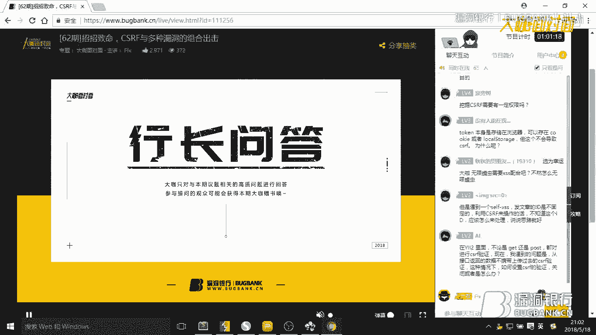

秋秋男朋友，那我們今天幸運觀眾就產生了，就是這位秋秋的男朋友，恭喜你獲得這本XSS跨站腳本攻擊剖析與防禦，那希望你在幸運觀眾的領獎處留下正確的收穫信息，我們會盡快將書籍寄出。

那今天的咖面到這裡也就全部結束啦，大咖已經準備辛苦了，也感謝小夥伴們的精心參與，想直播還得上專業直播，大咖面見面專業的白貓技術直播，如果你也想來咖面一展風采和網際大咖切磋技術的話，記得來找我報名哦。

大咖面見面，週五萬零見我們下周再約吧。

(音樂播放)，(音樂播放)，(音樂播放)，(音樂播放)，(音樂播放)，(音樂播放)，(音樂播放)，(音樂播放)，(音樂播放)，(音樂播放)，(音樂播放)，(音樂播放)，(音樂播放)，(音樂播放)。

(音樂播放)，(音樂播放)，(字幕製作/時間軸：秋月AutumnMoon)，謝謝觀看。

