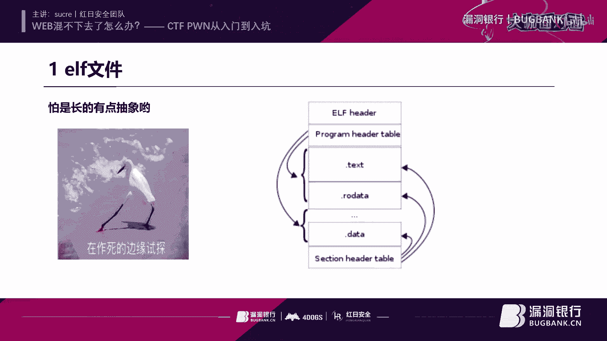
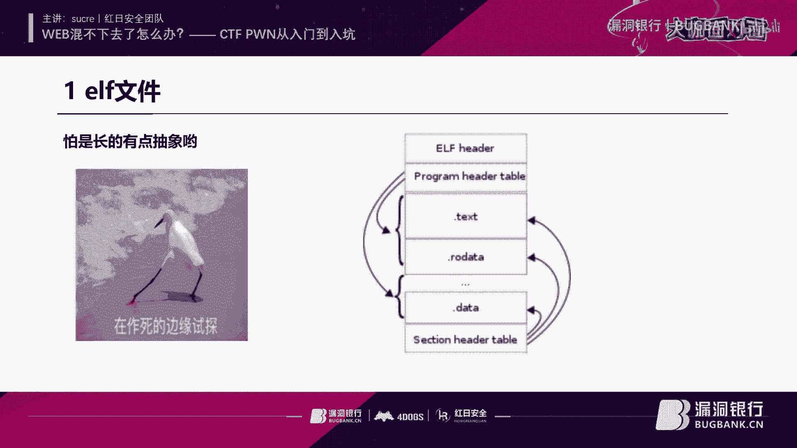
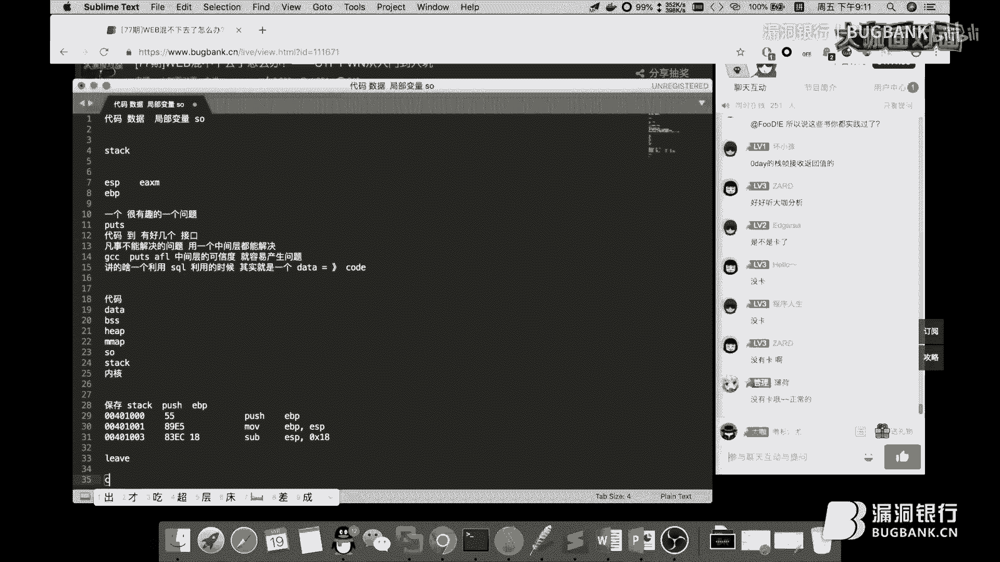
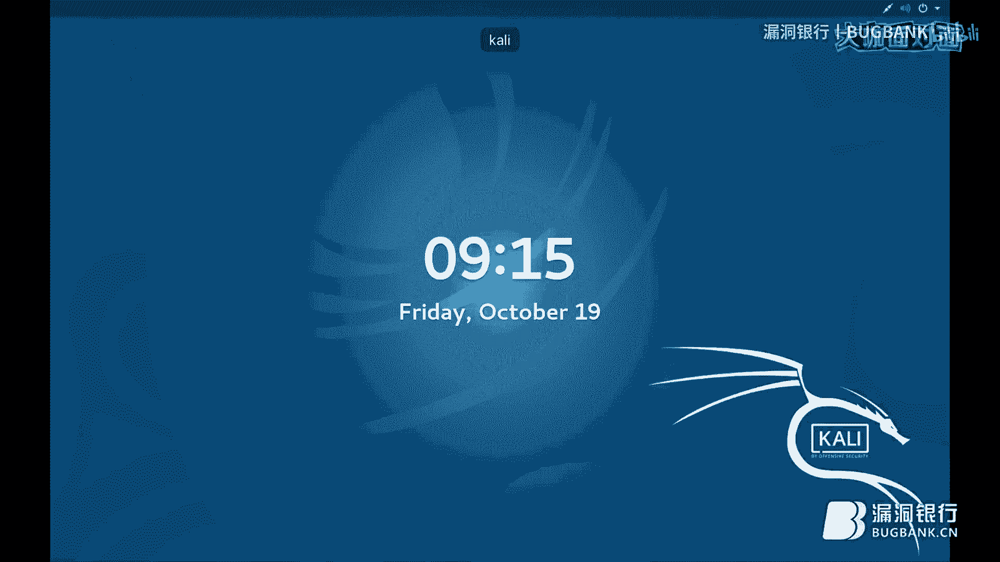
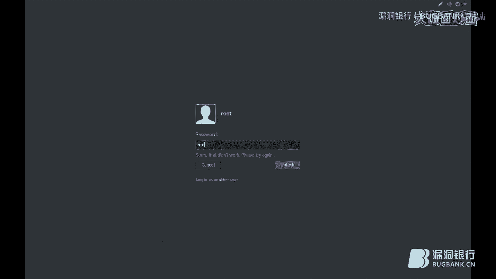
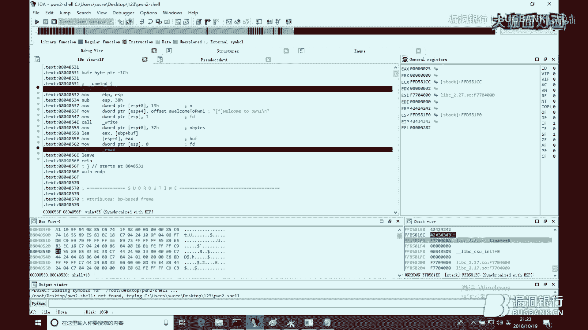
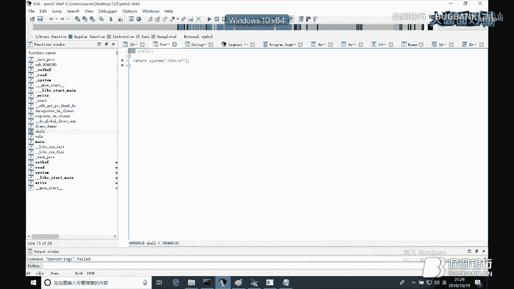
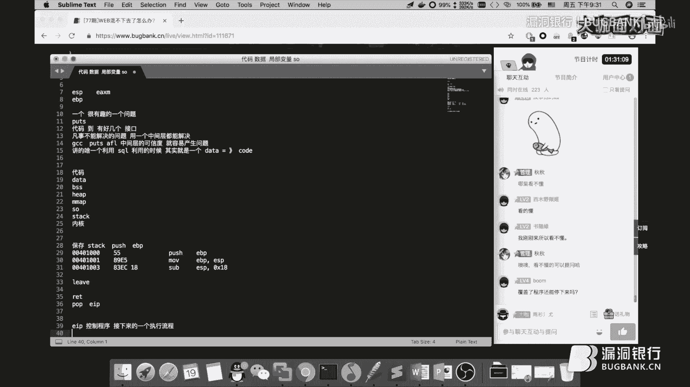
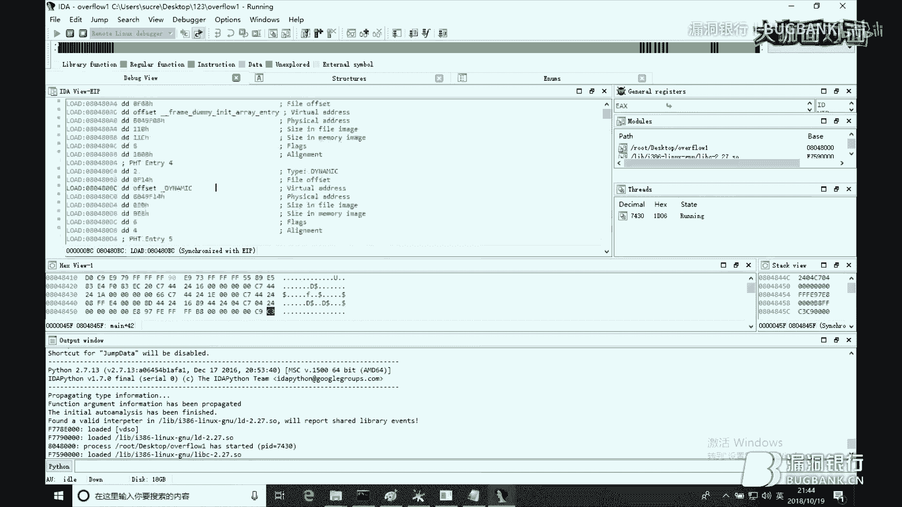
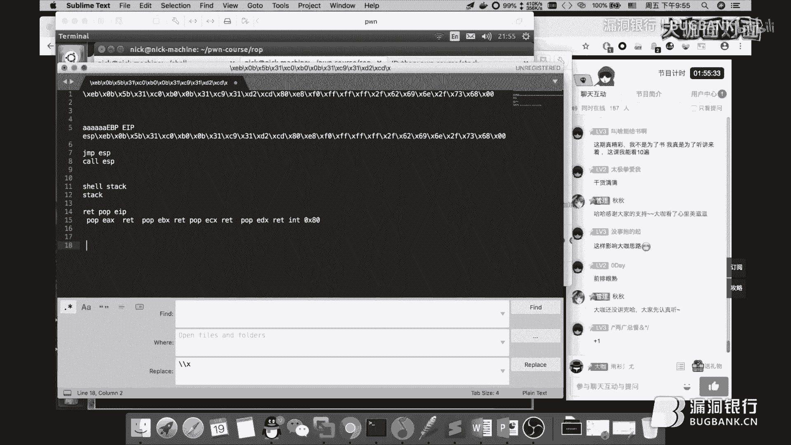

# 漏洞银行丨CTF PWN从入门到入坑-sucre丨咖面77期 - P1：【录屏】WEB混不下去了怎么办？_CTF PWN从入门到入坑-大咖sucre-漏洞银行大咖面对面第77期 - 漏洞银行BUGBANK - BV14b411A7Hy

(音乐)。

为知之而存 亦知之而生，小伙伴晚上好，欢迎参加第77期，浪东银行安全记录直播，大咖面的面，我是陈秋秋，那今晚是CTF之夜，请到的是来自红十安全队大咖，Sukuri，Sukuri也是四维创制生的工程师。

清晰安全高级研究员，他非常年轻但经验丰富，会有很多技能哦，所以今天他要展示一下，自己技能术的一脉，CTF Pong，那本次直播基本都会全程上手演示，而且内容很多，观众朋友们务必要紧跟大咖节奏，不要掉队。

那同样为了照顾新生朋友，还是说一下，我们的直播不是只有听讲的，还有问答和互动环节，那大咖演讲结束之后，会有10到15分钟左右给大家提问，那问答结束之后，Sukuri大咖还有许多明星观众。

自于书籍IDA Pro，权威指南的第二版，那看到最后就有机会拿到哦，好那介绍完毕，下面我们就请Sukuri大咖，开始今天分享吧，OK你好，大家晚上好啊，然后今天呢主要是想讲讲这个。

是一个叫做CTF的一个东西，不过呢CTF说实话，现在他越来越打的有点偏了，和实际跑的有点偏，只不过是外部层面的偏的有点厉害，不过二连制还是还算行，因为二连制如果你懂了的话，基本上他再怎么偏的话。

你和你做实际应用的题的话，像你挖些二连制漏洞，自己去发指的话，还是有一点用的，当然前提是你要学好才行啊，如果你学的不好的话，你我觉得你干啥都不行，这是这么一个关键，嗯，这开始我想呢。

我记得是大概是以前吧，是吧，以前还是本来是在做谁家家开发的时候，想想每天加班好辛苦啊，然后呢我想了一下，我们看了一下公司那一测试嘛，每天每天挺轻松的，反正就是觉得工作太累了，反正就想干这个。

感觉挺轻松的，发现进来之后发现这个更累，而且没有后悔药是吧，回不去了，不过这个做的还还是有点好吃的，因为他挺有意思的，因为你每次公布一个网站的时候，有一种莫名的兴奋感，不知道为什么，反正就是这种情况。

我们来讲一下这个吧，嗯，今天我主要讲的是一个叫做班达瑞的，因为就开始怎么说来着，就像其实二连制呢，其实二连制感觉跟那个外婆，其实差不了多少的，唯一差别在于就是因为外本好看，因为你从最开始学代码的时候。

一般都是学c，然后或者p h b之类的这种代码，对吧，然后你看这种代码的时候，你会有亲切感，但是呢，一到二连制之后，你会发现是一个完全另外一个东西，因为好多东西像什么代码。

你就像会编语言的那种就不好接触，但是呢，你要发现他漏洞的时候，你又必须要尝试的，就是理解这一代码，所以其实呢。

但是他的原理都是差不了多少的，就最开始才学c的怎么办，没事好好学，才学c，那你的路有点远，不过还行吧，基本上好多大佬，因为以前从现在的好多大佬都是那种，素成的也不是素成嘛，因为他们学的特别快。

不知道为什么，就那种，而且好多像我看到一些公司的一些，高中的就开始搞这个了，已经挺厉害的那些人，然后我们来看一下，其实呢，从最开始我们学安全的时候，是不是都从socal注入开始学，而socal注入的话。

第一课的话，他就会教你放个单引号，或者什么插入器，让他报错，然后呢，从报错的信息，然后往回推，往回推，推完之后呢，他跟你讲代码，讲完代码，然后跟你讲socal语法，是吧，为什么会变成这个样子，讲讲讲。

然后为什么会执行成这样，然后剩下的是一些有wav绕过，或者是高阶的一些课程，如何跑脚本，这种这种巴拉巴拉，对不对，那么其实你二人制也是一样的，只不过你可以这么理解，因为像password的话。

大家都有用过password的吗，password的话，他不是一个解析性语言吗，就是你写一个代码，然后呢，你扔给那个解析器，password解析器，然后他解析了会执行，接着执行执行执行，但是呢。

如果是一个exe文件，或者是一个p或者一个ef文件，他是怎么执行的呢，他的一个执行的一个流程呢，就是一个操作系统来执行他，对不对，但是呢，操作系统最终执行执行执行，但其实最开始也是最底层的一个东西的话。

他就是用了一个cpu来一个一行代码一行代码来解析，而这个解析呢，给你画个图吧，最开始就是一个cpu，对吧，二人制，对吧，回编，然后代码，是不是这样的，基本上就是这么一个过程，对吧，我们的一个程序。

它是由我们的一个操作系统来执行的，操作系统呢，其实就是在挂在，它的本质感觉就是挂在cpu上的一个软件而已，对不对，最终执行的一个实践的，他都是一个什么东西，就是cpu一行一行的执行下去，对吧，但是呢。

而且cpu他有个特点，他只能认识质量，其他都不认识，是不是有点留情不认的感觉，对吧，那么，cpu他只能认识二人制，那么，它是我们的代码，但是我们的一个程序员，写代码的时候呢，他是怎么把代码。

到一个cpu能够识别的这么一个过程呢，有没有想过这个问题，大家，对吧，如果你没有想过，然后今天我给你解释一下，怎么解释，好，好，嗯，嗯，嗯，然后呢，这是我写的一个小代码，大家可以看一下，而这个代码呢。

不是很难，它就就开始一个孟函数，然后pointful一个hello，定义了一个变量，两个变量，一个m和n，然后定义了一个数组，然后调用了一个方形1，那个方形1呢，它就是这样，传入两个参数，然后回腾1。

然后把a和b进行复制，然后return，然后接着呢，我们又调用了三个pointful的函数，然后它的一个就是D，然后后面挂了一个参数，参数呢，就是这个，这是一个数组的一个对应的一个值，一个0-1一个7。

接下来是一个pointful，然后后面就是一个malloc的一个过程，就是一个我们的一个堆的一个过程，然后呢，这个代码大家应该都能看懂吧，因为这个代码其实不难啊，你看一下，就是一个定义了一个函数嘛。

定义了两个函数，一个孟函数，一个方形1，然后呢，就是一个pointful嘛，就是一个输出嘛，一个输出一个int，定义了一些变量，定义了一个数组，然后pointful一些。

然后剩下一些malloc一些东西，malloc后面拿来干嘛，一会儿我会告诉你，我来干嘛，对吧，可以看懂对吧，没有文件头可以吗，试过不就知道吗，对吧，然后把它编译一下，GCC-G。

-G呢就是挂了一个debug参数，因为这不是py，这是c，这是c，我把它GCC-G，-G，然后-G呢，就是让它挂上一个debug的一个sample，就是然后呢，我们用GDP调试它的时候。

就可以看到它的原代码，这种对吧，然后-m32，就是让它生成一个32位的一个那个，然后haloc。对吧，如果你后面不加任何的东西的话，它会在你的当前目录生成一个a1。out的一个程序，对吧，虽然它报错了。

但是呢，它虽然报了一些警告，虽然报了一些警告，但是不影响我们的一个程序的输入，你看它会在当前目录生成一个a。out，然后把其他的一个删掉，而这个像什么，halo。i，halo。o，halo。s。

其实就是灭版不是越界了吗，对啊，我故意写的越界啊，故意写的，以后告诉你为什么，我把其他的一个删掉，嗯，大概就是这个样子，我们运行一下它a。out，你看一下它会输出什么，然后对照着我们的一个代码。

你看一下，第一行它会输出一个halo，对吧，对不对，然后第二行输出一个a0，array就是我们输出的第0位元素，也就是我们的1，你看一下，它确实输出了一个1，对不对，然后第二个。

它输出了array的-1的一个元素，那么-1它输出了什么，输出了是-46876704，而这个是什么呢，一会儿我给大家解释一下这是什么，然后7，输出的是0，对吧，然后剩下我输出了一个x，百分号x。

但是我并没有给它指定一个地址，这是为什么呢，对吧，因为我们来看一下这个，但是今天我们的一个内容，还并不是这个，因为像GCC的时候，GCC就是我们不是编译的时候吗，它其实给我们做了很多东西，对吧。

我们-o，然后我们加一个东西，就是它最开始并不从一个源代码，就我们的一个hello。c这个c源代码，然后转变的可执行文件呢，它其实经过了很多步骤，而这一步骤呢，你可以把它显示出来，嗯，嗯，嗯，嗯。

是听不懂吗，等一下，嗯，嗯，是哪个来着，啊，这个挂过来，m32。7，切上去，然后我们的hello。c，-o123，然后呢，你看它会在我们的目录下面生成一个，hello。i，hello。o，hello。

s，对吧，然后你cat一下这些这些东西，它会变成什么样呢，比如说cat这个i，你看一下，最开始我们写的是一个hello。c，你和hello。c的话，我这些那个木汉书，其他啥都没有写，但是呢。

它首先给我们生成了一个hello。i，对吧，而这个东西它会，这个过程叫做一个预编译，它会把就是我们的一些用到的一些，比如说我们这个pointful，但是我并没有定义它，它会怎么呢。

它会就是但是它是在labc，就是我们的一个s5文件，就是共享库里面的一个东西，然后它会把很多的一些该导入的东西给导入来，让它成为一个完整的一个代码，这就是预编译，就这么一个过程，然后生成它，然后呢。

这就是生成预编译之后呢，它就会拿这个代码，把它转变成一个汇编语言，你看一下就是我们的s转换成一个汇编语言，当然有点长，我们，它就会把我们的这个就开始生成了一个完整的代码，然后呢，转变成一个汇编语言。

对不对，对吧，汇编语言，然后呢，生成一个汇编语言了之后呢，它就会接下来把它生成一个ef文件，就是我们的一个最后的hello。o，对一个，对不对，hello。o，然后你去fire一下。

是一个32位的ef文件，但是呢，它和但是它现在还是不可以执行的，为什么呢，因为它是一个重定位文件，什么叫重定位文件呢，ef你看的，然后你-h读取它的一个头，你会看到这么一个，它这定义的是一个type是。

重定位文件，我们讲一下这个重定位文件到底什么用，嗯，差不多就是这么一个过程，我们的c代码，然后汇编，然后再变成我们的一个ef文件，但是那一个ef文件呢，它是一个什么呢，重定位的，重定位文件。

然后后面最后变成我们的可执行文件，比如说我们a。out，对不对，今天是叫破解密码，并不是并不是这样，就是让大家理解这么一个过程，对吧，当然其实你可以看一本书，叫做程序员的自我修养。

这些东西上面都有很详细的讲解，然后我们接着回来，接着回来，那么这个会有一个什么过程呢，你注意看一下，对对对会点这号，然后后面会用，它会用一个叫ld的一个命令，然后把它进行一个链接。

然后就把它生成一个我们的可执行文件，然后GDP，然后首先呢，我会看大家大家看一下它的一个，这是我们的这个a。out，对吧，还有什么就是这个哈喽，我们看哈喽，然后呢，你会看着他的。

我们首先看一下的一个会员语言，就是你首先如果就是你并没有一个工具的话，并没有一个工具，你可以用几个东西的话，来查看他的一个反会变代码，比如说IDA，GDP或者是OBJ，你加上-d参数。

就会看到他的一个反会变代码了，然后看一下就这样，对这样就可以看到了一个会变代码，但是呢，这个是不是跳的有点快，我们从这开始看吧。

这个是其实一个EIF文件呢，它有几种格式，一个叫做，就是我们的刚才不是看到一个是重定位文件吗，然后呢，你再看这有一个-h，就是查看他的一个文件头啊，其实一个EIF文件，它是这么一个情况的。

它就是它的一个binary，就是它的二维格式呢，是这么一个情况，首先是一个文件头，因为是一个文件的话，它基本上都会有一个文件头，除了一些TXT，对吧，它的文件头就是你写它就是啥那种，然后后面呢。

接紧接着就是一个program，就是它的一个程序的一个头表，然后接下来就是一些session，然后放过去，就是一些session，然后呢，这些session呢，就是它不同的一些段，然后呢。

这个session的一个table呢，就会指向着它每一个段，当CPU就是，当我们就是运行这一个EIF文件呢。

它是怎么做的呢，我们来看一下呗，就是，对，其实EIF和PE，它们都属于同一个结构，叫做Coff，它们都是从这个来进行一个拓展的，所以它们的一个文件格式都挺差不多的，然后你自己看一下这个。

就是我们用RAID EIF来查看一下，它的hello的一个文件头，前面几个，就是它的一个魔术符，前面几个，然后7EIF之类的，你当然你可以直接，用一个叫做OD的这么一个命令，就可以读取它的一个。

它的一个binary，--raid，当然你可以直接这么跟，是吧，那么前面五行就是这样，不过它是以，是以8进制来显示，所以我们可以加几个参数，让它变成16进制来显示，而最右边最左边这一位。

就是它的一个偏移文件的偏移，0位的偏移，20就是8进制，然后我们-a，然后它就会变成16进制，就是偏移就会变成16进制，然后我们把后面再加上一个-tx1，x呢就是一个16进制的形式来显示，就是这些。

以16进制来显示，1就是每一个byte一个byte，然后z呢，就是后面显示它的R4个字符，就变成这个样子，我把命令切下来，对吧，这样，这样的话你会清楚的看到，它前面几个就是一个elf，当然这个7f呢。

它的8进制是-1772，然后像我们的file命令，p可以随便设置大小，差不多吧，也是这样的，然后我们hello的时候，它就会其实就是，我们这个file这个命令，其实就是首先读取了它的。

这几个前面几个魔术符，然后这样来识别它的，这样，我们接着回去看这个，然后呢，剩下的几个呢，就是它的一个，后面跟着这些这些模块来，就是它的一个identify，就是它的一个认证。

其实就是它的一个身份识别信息，其实，怎么说来着，是一个宿主的形式来展示的，不过，没什么多大的用，然后你看下面这个date，这个date的显示呢，就是一个它的一个字节序，而这字节序呢。

就是一个小端字节序来显示的，然后当前的一个type，是一个可自信文件的一个type，然后后面呢，这个enter process，这个address呢，它是一个就是文件的一个入口，什么叫入口呢，我估计。

你downdate的时候呢，你把它接上，然后你看一下这个地址，你把前面的0x给去掉，它就是呢，程序的入口点，也就是说，当我们的，就是我们运行这个程序的时候，它首先加载的，首先它第一行运行的这个函数。

一个指令的话，就是这么一个行，就是80483bd，这个*函数的这个东西，对不对，那么就是它的文件的一个开始，而后面呢，像这个size呢，就是它前面的一个大小，是这么一个情况的，然后我们接着看一下。

那么这就是一个，它的一个文件头，就是EIF的文件头，当然你可以接下来读下。

它的program的一个头，比如说我们的这一部分，program head tables。

当然我要不放大一点，这是在写什么呢，这个呢，其实是在讲，就是我们的一个，这个EIF文件，就是你拿着一个操作系统，拿到这个EIF文件，你运行它的时候，它是怎么一个装载的一个过程，对不对，首先你写了个代码。

然后呢，你把它慢慢用GCC，一步一步的生成成为它的成型文件，然后呢，CPU是拿到这个文件，然后它是怎么执行的，对不对，然后这个第一行，就是它的endpoint，就是它的，我们的那个程序入口，然后呢。

这个，这个呢，叫什么，这一个表，intr的，这个呢，其实就是我们的一个，就是，它装载的一个library，当然这个library，只有那个动态连接的时候，动态连接的时候，它才会有，就像这样，LDDD。

你用LDDD这个命令的话，就会看到它动态连接的哪一个，哪一个S文件，而这是它的文件一个偏移，你可以用接着一个，read bytes，当然我们可以用那个，skip，这个Odd这个命令呢。

就是用杠杠SKIP，就是它可以跳过前面多少个字节，它的文件偏移是154，那我们就跳过154这么一个，跳过154这么多个byte，然后呢，我们读取一下，读取多少个字节，它的大小是，0x13。

那么就输入0x13，对吧，然后down，a，差一零，然后，大概就这样，154是怎么看的，这不是写的吗，它的一个偏移，type，type这是一个偏移，也就是说，它对于当前文件的一个偏移是。

0x154个字节，是吧，我大概就是这么一个情况，好像大家对这个没什么兴趣，是吧，我感觉好像提神不得劲，但是好吧，其实我觉得这种东西，其实是非常重要的，只不过，大家，他喜欢这个，其实就是这样。

这部分就是他的文件的一个偏移，而他这个偏移的这一个，这一个段就代表了，就有点拖是吧，其实这个段呢，就代表了它就是对应的那个地方，然后cpu，就是操作系统会拿到对应的那个偏移，然后进行读取相应的数据。

然后呢，像这个node这些，而这些aorad，那么它的一个偏移呢，就是装载，你也可以自己用od来查看一下，查看一下他的一个对应的一个byte，然后你会发现，他其实就是装载了你，那个。

他就是装载了这么一个东西，我看一下是多好来着，我们直接看，嗯，嗯，嗯，然后你看，我们的一个raid_af_frog，是吧，他前面这一行是这个node，node呢，就是加载他的一个一个指令，但是呢。

f08，f08在这，那么他前面这几个就装载他的一个地址，那么地址，不过他是一个小单字节序，那么他就是一个反的，你读起来的话，应该是08048480这么来看，就会变成多少来着，08048480。

然后你把它复制过来，然后就是这么一个函数，然后一个个慢慢的装进去，装进去装进去，对吧，哎呀，好难受啊，嗯。

我们直接开始讲工具吧，感觉这个，嗯，我们直接开始讲工具吧，其实呢，就我们用一般情况下，用那个动态调试的话，用两个工具，一个叫做ID或者GDB，有ID和GDB，只不过这两个，他是一个，怎么说，你看就行。

也不是也不能说看就行了，其实两个工具用的挺简单的，就是如果你用GDB来调试这个程序的话，你用GDB，然后后面跟你要调试的一个程序，程序就行了，如果你并没有跟其，一个调试的程序的话，你可以进来。

然后用File命令，然后来选择你需要调试的程序，比如说你File，然后Hello这样，对吧，也行了，比如说你Attach，然后现在当前的一个程序，对不对，现在当前的一个进程，比如说你的一个要调试的东西。

它是一个进程，你可以用PS杠，然后查看它当前的一个PID，然后你Attach，就可以用跟跟着它的一个PID就行了，而接下来你拿到这个东西的时候，你不是已经进入了一个GDB的一个交货式的一个界面。

那么你就可以进行一个对它进行一个调试，不过呢，当你在处在一个，处在什么状态呢，当前程序并没有运行，你可以用几个命令来把它程序来运行起来，一是Start，Start的时候呢，这个命令呢。

它会把我们的这个程序，就是运行到Main函数的一个，运行到Main函数的这一个地方来，Debug create choice，头疼，头疼，OBGD，这个EARF，从这开吧，因为我们用我们讲IDE吧。

因为那个好像命令函，这感觉有点，对大家好像要求比较高，是吧，Linux的话一般都是用GDB，让我们重新来吧，从这你们我们讲一下IDE吧，先就是先让大家把工具给知道这怎么用，是吧，这就是，IDE呢有两个。

一个就是IDE32位，一个是64位的这么一个东西，IDE32位，然后呢，它会有两个东西，一个是你啥都不带的话，它是一个32位的，如果他加了一个64的话，它就是64位的，你只需要用对应的。

首先你要查看一下，你要调试的工具的，它的一个位数是多少，如果是32位的话，你用32位的IDE打开，如果你打用不同的IDE打开的话，它就没有一个一个叫做那么一个操作，什么操作呢，就是。

没有那个没有这个操作，就是把它申请一个伪代码，我电脑好像，哎呀，哎呀，哎呀，我没有着急啊，发现他不想听话了，大概就这么他就并没有这么一个操作，当然了，这个不是很重要，我们从最开始开始讲吧。

就是最开始一个程序呢，它运行刚刚不是看了吗，程序的Enter point的话，它是一个从start函数开始的，对不对，然后我们点到这个start函数，而就是你打开IDE的时候，就这样。

你要调试一个程序的时候，你右键，然后你把它发送到IDE，然后我们把它关了，重新重新重新重头开始讲，就这样，你把它发送到这个IDE，或者是你先打个IDE，然后把它拖进去，拖进去的时候。

你会看到这么一个界面，然后这是一个程序流程的图表，当你给敲一敲空格，然后它会就会有一个按偏移位置，来给你显示它的一个会变语言，然后呢，它有几个界面，就是一个菜单，上面虽然是主菜单，然后上面是下面是一些。

一些纸窗口，这些窗口呢，每个都统计了不同的信息，像你可以通过按着country+1，然后把全部的一些，一些纸窗口给拖出来，比如说像什么de-sample，就是它的会变语言，或者是一些16进制档口。

它的16进制，或者是这样，或者是支付串，或者是它的一个方形，或者它的一个，这些这样，然后呢，或者是如果你不知道会计键的话，你可以点开view，然后就有个subview，同样也可以把它选取出来，然后呢。

这边呢，就是它的一个函数的窗口，因为如果它函数窗口，就是统计了它，这一个二连接文件的，它全部的一个函数，但是它识别出来的，如果它有些函数，没有识别出来的话，没有它的一个符号表的话，它就会以它的一个。

以sub然后下滑线，跟上它的一个地址的方式来命名，就像这么一个，然后我们从十大函数开始，而这个十大函数呢，会有一个就是它首先运行，运行到这一步，就是像一步一步一步走，一行指令一行指令的走走走。

走到这后面的时候，它会掉一个函数，叫做libc-star-mine函数，而这个libc-star-mine函数呢，它前面会给它挂了一个东西，你看这一步就push of size mine，对吧。

而这一个呢，就是我们的程序的入口，不是说我们程序的入口，也就是我们写代码的一个入口，因为我们写代码一般都是从Mine函数开始的，当然它也即使是编译的话，也是默认以Mine函数开始，然后呢挂挂挂挂上去。

然后呢，libc-star-mine函数，libc-star的时候，它就会执行执行执行了之后呢，它就会调用我们的Mine函数，它执行到一半，然后就会把我们的Mine函数给挂上去。

挂上去执行完执行完Mine函数的时候，执行完Mine函数了呢，它就会回来，Mine函数执行完了之后，它就会回来把控制权交给我们的libc-star-mine函数。

就是我们的libc-star-mine函数，而libc-star-mine函数接下来执行执行，它在下面几行就会有一个退出的一个函数，就是exe，快捷键，快捷键是这个，因为Country1。

你按着Country然后加1，然后就会看到所有的窗口，然后呢，所有的窗口你要对应的窗口的快捷键就在你的右边，比如说这个F或者Shift这个，这样，这部分，知道吧，编程尾代码是F5，国内你觉得用的。

是这样的，对不对，然后呢，我们过来看一下，但是呢，讲到这儿我们需要科普一些，你还是用OD，我们要科普一些，就是一些小的汇编指令的一些常识，对不对，我们还是讲点其他东西吧，对吧，嗯。

除了CTF还有哪些用到Pong，很多地方都用到Pong，比如说你的BinaryX Pro或者一些，是吧，嗯，我到个后面再讲，来后，ID，后面再讲，后面再讲这个东西，我们就是，你可以想象。

虽然你就是不知道的话，你也可以想象一下，想象一下，就是我们的一个程序，它执行了之后呢，CPU，它只能一行一行指令的执行，对吧，当然现在有些多核的，一些就是一行一行执行执行的时候，但是呢。

我们为了就是为了节省方便嘛，对不对。

像我们的这一个，这个函数，我们现在写的这个代码，对不对，它都是这样，执行完一个int什么什么什么之类的，比如说我们有一个，有就是我们执行完这执行执行执行执行执行到这一步，然后当我们要执行下一步的时候。

下一步操作，但是我们需要某一个值，比如说我们要计算两个值的一个加减法，然后呢，但是呢，这个当然不一定是加减法，比如说一个复杂的一个算法，需要我们来执行，但是呢，这个执行的时候，我们为了偷个懒。

就是把它写在一个方向里面，就是写在一个函数里面，写在一个函数里面来之后，我们只要执行到这儿需要这个值的时候，调用这个函数，然后呢，函数把它返回值拿到给我们，我们就可以拿到那个返回值。

然后接着做下面的一个操作，对吧，但是呢，因为CPU它是一行一行指令执行的，那么它执行完那个方，比如说它从我们调用方向1，调用方向1之后呢，执行到这儿，它是怎么拿到返回的地址。

又接着执行那个Pointful函数呢，对吧，然后我们就可以通过这个，然后你可以看一下这么一个东西，因为我们的某每一个函数，都会有这么几个操作，有这么几个操作，push_ebp， move_ebp。

 esp， sub，这个你可以把它复制下来，这几个东西，基本上每一个函数都会有这么一个操作，你看push_ebp， move_ebp， esp， sub， esp，什么什么，对吧，对不对。

你看都会有这么一个操作，而这个操作是代表。

这个操作有什么意义呢，嗯。

然后，那我们要start起来，start的时候呢，我们再看当前的一个dle sample，他就是查看会编，就是我们可以查看函数的会编，当然如果你不知道函数名字，不知道现在当前有多少函数的话，你可以按i。

i就是 info的一个书写，然后你可以我一般的东西书写，然后 functions，然后你会看到，全部的一个函数名字，就是当前我们这个binar全部的一个函数，然后我们一个dl sample。

然后你可以查看孟函数的一个返回编，然后或者说你可以查看，当前有当前的一个，你一个download后就查看哪里变量，pc就是当前执行到哪个地址，然后也是一样，执行到这儿，当下我们是在这个孟函数。

孟函数你看方形孟函数的这么一个地址，但如果你调入实打函数的话，只会跑到孟函数，然后把前面这几个指令执行完，然后接着直到这儿，然后现在我们就可以看一下，他现在的内存布局，而这个内存布局是什么东西呢。

他其实就是查看了一个，查看了这么一个东西，比如说我现在一个pi6，然后我们刚刚不是调用了hello吗，然后，大概就这样，比如说查看这么一个id，就是GDB的话，也是查看对应哪一个东西，对应的那个。

那个他的内存地址，然后你看一下，然后他程序就是加载到内存里面的话，他是这么一个布局的，前面几行是搭的一个code，然后呢，中间几行是挂载了他的一个ssh文件，然后后面最后，然后挂了一个sdk。

这是我们的一个站，因为一个程序的话，都会要几个东西，代码数据，还有一些局部变量，对吧，这几个东西是肯定要有的，当然了，甚至还有一些就是挂载的library，就是我们的ssh文件，对不对，这样，是不是。

不过呢，我们现在执行到这个位置，执行到我们的一个，执行到我们的一个这个位置，我们air的话，就可以查看他的一个指令，然后呢，现在我们把它运行起来的时候，我们就可以看这么一个东西，就是看他。

然后我们如果要，因为刚刚我们运行了这个程序，直接run运行了这个程序，运行了这个程序之后，他输出是这几个，一个是hello，然后这几个输出，对不对，然后呢，我们在这个地方下一个断点。

然后看的是怎么输出的，第二，我们在第二个地址，第三个地址，地址是第六个地址，是吧，下个地，然后把它run起来，run起来的时候，然后他就会跑到这个地方，也就是我们的第六行，这一个第六行，然后呢。

会发生什么信号，会发生什么情况呢，我们在第七行下个断点，然后c就是continue的意思，让他接从前面的一个，一个断点，然后接着往下面跑，然后，执行完了之后，你看他输出了一个1，对不对，一个1。

输出了1的时候，这个1是怎么来的呢，1我都，我们都知道1是我们的，那个树主的第一个元素，就是我们的第零个元素，对吧，第零个元素，也就是我们的1，但是呢，会有个问题，他是从什么地方，拿到我们这一个1。

然后尤其是他什么地方，从定义的，然后我们就可以从，他的会变代码上面看，他前面call了一个put，是吧，从这掉了一个put，然后怎么怎么，该接着怎么做，然后呢，后面到这一步，就是我们的esp+0x2c。

然后，move呢，就是一个复制的一个操作，就是把后面的一个值，复制到前面这个地址，而12345这几段，就是我们写的一个，树主的12345，然后他把它分别复制到，esp+0x2c，0x30，0x38。

3438这个位置，而esp是什么呢，esp是什么呢，就是我们的一个寄存器，是吧，现在就是我们的计算机，它会有很多个寄存器，像比如说八个通用寄存器，像eax，ebx之类的，但是呢，我们的一个局部变量。

就是我们最开始不是说，我们的一个程序，起码会需要这么几个东西，一个局部变量代码数据，而我们的局部变量，包括我们的函数的一个环境，都会存储在，在一个地方，就是我们的一个stack里面，而stack的话。

stack就是在这个，他的一个在内存的一个地址的话，就是在最末尾，ffd0到这个区之间，就是我们的一个站的区间，而站呢，他是怎么来标记它呢，他用了两个东西来标记它，因为它只是一个开始一个结尾，对吧。

开始一个结尾，就表示了一个站，而不同的一个站呢，用不同的一个两个标志位，就可以来进行确定它，那个标志位是什么呢，一个是esp，一个ebp，这样，就是一个在上面，一个在下面，那么的话。

中间的一区间就会变成我们的一个单空间，对吧，这么就是我们的，刚好是一个局部变量，是这么一个过程，而esp就是我们的一个站顶，但是呢，站顶在上面，而上面的时候，他会有一个，就是一个什么东西呢。

就是他的一个地址，从上面是一个低地址，下面是一个高地址，那么他的一个区间，那么esp就会在所有的局部变量的上的，他的就是所有的局部变量的位置，都会比esp小，对吧，那么如果我们的一个。

就是我们的一个宿主，如果他在站区间的话，那么他的一个相对位置，就是应该esp加多少，加多少，加多少，那么他的一个相对位置就在哪呢，从汇编语言上来看的话，你看他就是一个esp+0x2c。

当然前面这部分就是一个负值，这个负值的一个操作，就是我刚才的这一个，就是我们的这个操作，对创建一个宿主，对他进行负值的12345，对吧，所以说我们就可以把这一个esp+0x2c，那我来查看一下他。

怎么查看他一个内存，就是x，x是什么呢，x是什么的缩写呢，xm，这一个的一个缩写，这个缩写呢，然后后面呢，如果你不知道这个命令的话，你给help一下，我给help一下x，然后呢，他是什么样的，一个x。

然后给一个斜杠，后面呢，你要查看多少个数据，你就写多少个，如果我要查看10个数据的话，就写10个，然后后面给上跟上一个地址，现在当时我这个地址的话，我用一个变量来表示，有esp我们esp的一个地址。

然后就可以往里面看，当然我他如果你并没有挂上，任何的一个显示符的话，他就会默认，以你上一次的一个格式来显示，我上次以一个指令的形式来显示，但是呢，我现在他有个集中显示格式，一个是8。

一个是一个是这个是什么来着，8进制，就是8进制16进制，还有10进制，然后或者是无符号，比如说这一部分，就是每个的缩写，就代表了不同的一个显示格式，然后后面呢，后面的一个size，就是一个一个byte。

或者一个halfor或者是一个or，这样的显示，这个呢就是一个字节，两个字节，四个字节，八个字节来显示，差不多就是我以一个16进制，16进制显示，然后呢，我插10，然后插w，插w随便进制。

然后以四个字节来显示，ESP，然后呢，12345678910，刚好就是10个，是吧，ESP，然后ESP加0X多少来着，你看一下，加0X20，0X20，0X20，然后就是刚好是12345。

12345就刚好是在我们的，宿主的那几部分，对不对，然后呢输出第一个，输出第2个，输出第3个，对吧，然后你看一下我们的一个代码，好，第0个就是我们Arial的，这一个地址，对吧，那么，-1呢，-1的话。

它会显示是什么呢，如果我们不知道情况下的话，接着把它执行出来就行了，然后我们B，然后在多少个，在8的这个地方下一个端点，然后continue起来，然后呢，输出了-12468，对不对。

-12468是多少呢，刚才我们查看的一个，我们的这是0，这是ESP加0X20，是我们的Arial0的位置，如果我们再，减上4呢，就是在前面有一个FF4C，这一个东西，那么如果我们以。

实境制的方式来显示的话，你看它就是-12486，又刚好是我们输出的这一个0，对不对，那么这就是一个，很有，趣的一个问题，对吧，怎么有趣呢，你可以想象一下，想象什么呢，会非常神奇，因为我并没有做一个东西。

包括你看前面我们的一个代码，就是simple，我们的孟函数的一个代码，因为这个过程很重要，所以我不着急讲，我们call的是一个put，对不对，这个put是什么呢，其实最开始我们孟函数，是吧。

孟函数执行完的时候，孟函数开始执行的时候，我们第一步是调用的是一个pointful，是调用的pointful，它为什么会这写一个put呢，你看，但是后面的都是一个，后面都是一个正常的。

调用了一个pointful，为什么在这的话会调用一个put，一个put函数呢，对吧，调数字ID有什么区别吗，命令为什么，对吧，为什么会这么一个操作呢，这叫做一个，因为从最开始我们的一个代码。

到我们的一个err文件，它中间经历了好几个过程，对吧，这个过程，你可以想象一下，就会变成这么一个类似的东西，它中间就是有好几个人，有好几个人在操作，他在操作什么呢，对我们的同一个东西，都进行一个操作。

就相当于一个公司，老板就是就是给写了一份计划书，但计划书就是每个人都可以看到，但是他看到的只是短短的这么一部分，他只能看到自己的这一部分，是吧，只能看到自己的部分，但是它是一个相互协作的一个过程，对吧。

前面一个人做完了，然后交给后面一个人，再交给后面一个人，但是中间如果某一部分出现了问题，是不是后面的都会出了点，都会跟着这错误的情况下，接着往下执行执行执行，是吧，就类似一个中间层接口，对不对，嗯。

你又往后面对吧，那么这就是现在很多很多的一个bug，出现的一个问题，就是一个接口的问题，对吧，就注意注意注意安全，我装了很多个系统，大概七八个，然后我想一下，对实现机制不同，各自的实现机制。

在计算机不知道你们听过一句话没有，就是凡是不能解决的问题，凡是不能解决的问题，用一个中间层都能解决，就相当于最开始，对吧，最开始加个层对吧，加个层，七层协议为什么这么多，然后不就是一层一层加上去的。

对吧，加个中间层都能解决，但是中间层它会有一个很尴尬的点，因为中间层就是相当于你把这个东西外包给其他公司，当你拿回到这个结果的时候，这个数据可不可信，那么就是另外一回事了，用一个中间层，因为是吧。

就相当于拿一个拿了一个，外包公司，然后你到时候收到结果就行了，但是这个结果靠不靠谱，那不一定的吧，就相当于我们最开始写了一个代码是pointful，对吧，但是交给GCC这么一编译。

它又变成了puts函数，为什么，因为GCC它有一个优化的一个过程，对不对，它有个优化的一个过程，但是如果你并不知道，或者说你直接把这个东西拿过来用的时候，它是不是就容易出现问题呢，嗯，你把files。

怎么定位到溢出的方地方用files，一般用afl，我用的是afl这个这个软件，嗯，那么一个东西是吧，这么就会有一个问题，这个中间层，的可信度，就容易产生问题，对吧，就是今天就是基本上现在很多的一个代码。

都就是很多bug出现的一个原因，基本上都是什么什么哪个东西出了一个问题，然后扔在下面，这就是一个bug产生的原因，那但是我们今天讲的是一个利用啊，讲的是一个利用，这个利用是什么呢，就是把那个漏洞。

因为如果通过一个中间层产生了一个漏洞，然后我们怎么利用它，就开始比如像你的一个收购注入，对吧，就跟你们不是学过基本上收购注入就学过吧，那么收购注入它会有一个很，很那个，利用的时候，你要把各方面都抽象化。

就是把所有没不必要的都，除开，那么会有一个这么一个东西，它其实，就是一个一个过程，就是一个，一个data，到code的一个过程，就是，不管你怎么利用，不管你有什么怎么一个利用的这个漏洞。

但其实最终的一个抽象起来的话，都是一个数据，到代码的一个过程，因为我们输入的全部的数据其实，其实它如果其实都是一个数据，这其实都是一个用户数据，然后，不知道我因为什么原因，然后转换成code，就相当于。

很多一些图片呢，或者是那些或者一些文件，它其实并没有什么，如果按照正常的解析方式的话，它并没有任何任何的危险，但是你换一个方式，或者有一个什么包含漏洞之类的，它就会瞬间变得很有威力。

那么就是这么一个过程了，让我看一下，然后我现在现在我们运行到哪来的，运行到，运行到第8行，第8行，第8行在哪，运行到第8号，然后接下来呢，6 7基本上，那么，我们最开始定义这个宿主和pointful。

基本上就是两个世界了，对吧，你可以相当于pointful，定义一个宿主的时候，pointful并不知道是什么回事，但是它输出的时候，只拿了一个宿主的一个头，然后它根据对应的一个偏移，然后进行一个输出。

所以它啥都不会管，基本上就会把这个和这个输出来，而-1就是它前面一个，7基本上就是6的前面一个，然后5的前面一个，就是5的第，越两位这样这样这样，接下来行了，然后我们接着下后面下一个段子，在14。

第1个14下一个段子，continue，然后呢，因为我们现在运行到了这么一个，运行到了这一个地方，就是我们的第14行，第14行它有个什么呢，第14行我们Melloc，调用了一个函数，叫做Melloc。

然后Melloc会把，因为最开始我们的一个数据，就是我们的一个进程空间，并没有这么一个东西，叫做heap的这么一个东西，但是它调用了一个Melloc，Melloc就是一个全，当我们调用了这一个。

一个Melloc，它会产生一个全局的一个数据，就是任何函数都可以访问它，访问的这一个地址，然后就是这样，它的位置就是在这个地方，当然如果像我，而前面几个调用的会比较少，但是你注意这么一个位置，而像什么。

我把这个复制过来，三行code，然后发译，而从我们的最后几个地址，也就是我们的hello，也就是我们最后几个obsess的，第三个，它就是一个gott表的这么一个地址，而gott表，是过了不一样。

可以翻到长，差不多也可以这样，我都没开始，好吧，我都一个小时了，算了，不浪费大家时间了，我直接开始画，画不好画。

我直接写，其实我们加载到内存，其实就这么一个东西，前面是一个代码，然后后面中间是一个data段，然后是一个bss段，然后下面就是我们的一个heap，heap过来是一个mmap，加我们的so文件。

然后下面才是一个stack，在后面的话，就是我们的内核，大概就是这么一个分布，人越来越少了，走了30个了，已经，我们开始。

还是领扫一点好，从最开始，Od大家都用过，是吧，我先把eip是在这，然后我写这个代码，push，然后你首先要知道这么几个函数的，一个push，push就是你push了之后，它会把，后面一个值追到站里面。

然后我们现在的一个站顶是在这个位置，站顶是6F84，然后我们F7一下，执行完之后，它就会把epp的一个值复制到站顶，对吧，然后复制到站顶之后，会接下来怎么做，就前面这三个函数，是一个开站的一个过程。

就是对站进行一个初始化，就是为新的一个函数开p一个，stack，它是怎么开p呢，e到F7，它要做这么久，我们知道stack，它有两个东西来看它，就是esp和epp，那么我们只要保存esp和epp。

那么是不是就可以保存整个站了，是吧，对不对，就会保证怎么整个站，所以但是会有一个问，它是怎么做，而它用了一个比较简便的方法，就是直接把es，直接保存epp，然后把esp指向epp就可以了，是怎么做的。

你看它push了epp，那我们的epp就保存在这个地方，然后它move了，epp esp，那么esp和epp现在就指向同一个值，指向了同一个地点，也就是我们当前的这个地点，然后接下来。

它把esp进行往上抬，就是把esp往上一抬，抬到这个地方，那么它的一个站的空间，就会变到这个地方，这一段就是它当前的一个站空间，而这一个点就比较很关键，因为它当前是处于现在这个。

现在这个函数的一个epp，现在函数的epp在这，同时它存储的值，又是前面一个函数的epp，对吧，然后存储在不动，但我们的对站的操作，其实只有两个，一个是push，一个是push，一个是push，推过去。

一个是push，这两个有什么用，一个就是往里边，送值，然后剩下一个是一个取值，这么一个东西，一个是送一个是取，那么一个存取的操作，就它只有这两个，那么存取的一个操作，都只会影响esp。

那么它的epp就不会变，那么epp存储的这个值，就会十分的稳定，所以就会成为我们的一个战争，那么当一个函数执行完了之后，它会把自己的函数，这一个stack给清掉，它怎么清的，直接会把esp指向它的。

一个epp的一个位置，接下来再把epp这一个值，就是我们的当时，当前存的值，然后返回，就是复制给epp，那么就可以了，这两个是用了什么，一个指令，就是我们的一个leaf指令，leaf和leaf指令。

leaf指令做了什么操作，我们只能再来，当前是460，而eip就是程序CPU，即将执行的下一条指令的一个地址，然后我们把它执行了，你注意看，现在我们的一个epp的一个值，是个80，对不对，80，然后。

esp是f80，f68，这么一个值，我执行完，现在我们的esp指向了84，也就是刚前的操作，刚刚它是指在这个位置的，现在它指到这来了，而且我们的epp也会改写成了，这一个值，对不对，比如是，怎么是这个。

那么就是这么一个操作，我们能把它直接复制过来。

然后它只用了。

这是一个开帐的过程，那么回帐的时候，它清空帐的，它只用了一个指令，叫做leaf，leaf就是把esp指向epp，然后pop epp，这样，然后但是还是没有解决一个问题，什么问题。

就是它如何执行完这个函数，然后返回去，接着执行，就相当于我们的这个，我们这个函数，我比如说我们这个梦函数，然后你看它的一个调用的一个过程，就是start函数调用梦函数，是吧。

然后我们调用warnable的函数，是吧，就是指向一下，就是一个start函数调用梦函数，然后调用warnable函数，但是梦函数它调用完了之后，它是在这个地方调用的，call，这个地方调用。

走走走走走到这儿，然后调用warnable函数，调用warnable函数，接下来它是该执行，warnable函数执行完了之后，它就应该执行084085bd，对吧，这个地址，那么它是怎么回来的呢。

你看它走走走走走，走到下面有一个leaf，leaf就是把帐清空，清空之后，下面有一个return这么一个指令，return这么指令是有什么用呢，它是和这个call指令相对应的，怎么对应的呢，就在这儿。

我重新写一下，就在这儿，我们call一下，40100，对吧，然后我们指到这儿，把esp，就是我们的ep指到这儿，指到这儿的时候，你看一下，它站里面发生了一个变化，它保存了一个值，保存的值是401013。

401013，也就是我们即将执行的下一个地址，也就是说执行完了这个之后，执行开站开站开站，开站完leaf之后，然后这一个return，我们把return写起来，对吧，执行执行，前面就是一个开站的过程。

过程完了之后，它就会回到原来的地方，回到原来的地方，接下来我们调用return这个资料，你自己看，现在我们的ep是401007，不出意外，如果正常情况下，它应该指到401008，对吧。

但是它做了一个操作，就是把这个站顶的一个元素。

复制给ep，那么其实return这个指令，就相当于等于popep，它就是一个popep这么一个操作。

对吧，对吧，然后我们来，等一下，我们来做一下今天的这个题，是吧，嗯，要说我们今天的这一个题，就是我们的一个meng函数，然后调用这一个，ua，就是一个web函数，然后它是怎么呢，我们查看它的一个反馈编。

就是它输出了这么一个字幕串，然后接下来调用了ray的这面函数，ray的一个函数，它是往内存里面写，一定数量的字节，而这个字节就刚好是后面一个数字，是0x32，也就是50个字节，往buffer这个地址写。

写写写写写写50个字节，但是我不是最开始想的吗，就是buffer这个地址，它是在内存，它是在站里面，相对ebp-ech这一个词，对吧，从ebp-ech这一个字开始写，写写写，然后写50个字节，对吧。

当然我们输入的没有50个字节，那也好，如果超过这么多的话，它就会把它接着往下写。

怎么写的过程呢，怎么写这个过程，我看一下，我程序呢，在这是吧，然后我们先在这个地方下一个断点，然后直接开这个，我开着了。

我们叫debug，我们用这个IDA来进行一个调试，然后后面我把这个设置一下，然后你把这个地方给去掉，然后怎么用IDA进行一个远程调试，就是你找到IDA的这么一个目录，它有个IDA的目录。

有个dbg server，然后后面你把对应的一个，它因为跨平台的，远程调试跨平台，你把对应平台的这么一个server，然后拖到调试的地方，然后你把它运行起来，对吧。

我就是我拖了这个linux server，然后你把它运行起来，然后它就会在监听自己本地的一个端口，然后你查看一下自己当前的一个，一个一个IP地址，然后把这个IP地址往这儿，这个地方一填。

然后再点一下OK，基本上它就开启了，然后你怎么判断连着没上去，你点一下这个attach，oversearch，如果它能读正确的读取到当前的，就是你远程程序的一个，进程的一个PID的话。

那个ID那么就算它连上去了，接下来的时候，你又可以进行一个debug，debug怎么做，其实就跟OLE差不多，然后你往这个地方下一个断点，F2下断点，然后F9运行起来，然后又是放着是吧。

然后它就会到这个位置来，然后你把这个界面窗口调一下，这是这样的一个窗口是吧，你就可以把这些无关紧要的都给关掉，是吧，集成器窗口这样，然后你当时你还可以看到它的一个，我看一下是，我们现在运行到哪了。

jump to ip，我们就是在这个地方，然后就可以看到这个地址，有时候看到它的尾代码，然后接下来就可以一步步执行，一步步执行，看现在就执行到第5这个位置。

然后这样子，是吧。

然后投案开赠的过程，这是赠码，然后你可以jump to esp到这个位置，然后它会push ebp，现在我们的ebp是，ffedef8，然后你下一步，然后它就会开门，它就会布你到这个位置。

然后走走走走到这，然后correct，我们回到了，当然如果你不知道你跑到哪去的话，你可以回来回来，接着回来按esc，然后回去，回到这个地方的时候，然后你可以接载在下面下一个断电。

因为我们要靠RFREAD这个地方下一个断电，然后你再执行到当前的这个位置，我是不是设计错了，你看，大概就是这么一个操作，执行到，然后它扣READ，然后f8跳过，跳过之后，你又可以到这边。

你远程调试的这个地方，然后输入一大段值，因为我们刚不是调用了READ，是吧，因为正常情况下，我们执行pangfu share的时候，我还没到中间，正常执行的话，它会输出一个字符，然后让我们输入一下字符。

这样，然后远程的话，然后你可以到这个地方输入，然后我们跳一下回车，然后就再切回来，切回来之后，然后调用完READ是吧，然后我们就可以往计算机上面一看，ESBP的这附近的一个位置，它往哪个地方写的。

也就是我们的ESP+4这个位置，当前走到我们的一个EBP这个位置往上走，也就是我们的这一个6161这部分，就是我们这一部分，就是我们当前输入的这么一个AAA，对吧，但是呢，AAA6C到我们的EBP。

我们的EBP的一个位置888，对吧，因为你可以从这个尾带，就它的尾带上面看，是它buffer的位置，距离EBP ECH，ECH是多少呢，ECH，0X1C，0X1C是28，28明显它就小于50。

那么我们一共可以输入50个字节，那么50个字节往里面填的话，它就容易把我们的下面的一个，保存到EBP的这个位置的一个值，因为EBP不是到这个位置吗，FF85718这个位置，容易把这个位置给写掉。

它是怎么写掉的呢，重新来一遍，把它关掉，然后我们重新执行，F9执行这部分，执行到哪来着，我们执行到RAID的这部分，然后执行到EIP，执行到这儿，然后接着又让我们输入，输入到我们刚刚不计算了吗。

是0X1C，28，然后我们输入28个A，然后刚好敲回车，然后到这边来，F8到这来，然后我们接着看，降幅到EBP，EBP在这个位置，然后我们往上面走一个，你看刚好就可以写到我们的，EBP这个位置是吧。

但是我们还是可以接着往下写，对吧，接着往下写，然后我们在F8一下，leave的时候，它会把正常情况下，leave的时候，我们并没有现在，我们并没有往下写完，然后正常情况下，调用leave的话。

它就把EBP都给覆盖上去，然后是吧，回写，但是如果这个时候我们，然后如果我们写超过了，现在的也在到这，然后我们在F8调用完RAID，然后如果我们，到这是吧，再粘贴一下，刚好到EBP。

然后我们再输入4个B的时候，你看到这个位置，我们在降幅度EBP，EBP的这个值，已经被我们改写成了4个B，然后下面一个摆成了4个3，然后我们接下来执行F7，你看一下，它就会把我们当前的上面的一个值。

毫无保留的写到我们EBP的一个位置，对不对，然后接下来我们调用return的时候，它就会把，我们的下一个位置，最开始保存的那一个返回地址，然后复制给我们的EIP。

这一部分，能看懂的扣个1。

然后这么一个情况。

那么，问题就来了，如果我们能够精心的设计一下，就是因为我们相对距离已经算出来，是一个A28对吧，A28，然后呢，加4个字节，然后就刚好是复制EBP，然后再复制EIP，那么我们就可以控制这么一个东西。

我们开网站写，为什么还有两个，因为大家都知道EIP，是一个控制程序的指令流程，因为现在我们有个东西，就根据这个rate，我们可以控制，我们可以控制我们的EIP，对吧，对。

它可以如果它就是有足够的大小的话，给它足够的一个size的话，它就可以一直往下写，一直往下写，一直往下写，对吧，对不对，然后呢，当然那是做ROP的，以后我们讲到这个，然后它就会一直往下写，一直往下写。

写到时候，如果我们精确的计算一下，这个偏移，然后刚好，它落到EIP的，就是我们修改的EIP的那个值，然后我们就是会去控制程序，接下来的一个执行流程，怎么控制呢。

就是你想让它跳哪，它就会跳哪，但是会有一个问题，因为我们比如说正常情况下，网上写的话，它会让我们写一个16G，写一个地址过去，但是那个地址呢，会有一个很尴尬的点，因为很多地址都是一个不可见字符。

而我们用键盘输入的话，它是一个这么一个东西，看一下，然后比如说我们Pwn2，然后这边是吧，输入一大串数，然后它quash掉，但是呢，我们如果用GDB来调试它的话，GDB来调试它的时候。

我们start起来，然后呢，然后输入一大堆，然后continue，然后输入多少个A来着，然后，然后接下来呢，当然我是这样做不太好，这样做不太好，因为我们现在直接往输地址的话，它会变成一个字节。

然后呢我们这样做，用一个你输入一个password，用password来帮我们做件事情，*2C*28，对吧，然后加上我们的一个1234，我们的EBP，对吧，剩下的时候就是我们的一个地址，这个地址呢。

就是我们想让它跳哪个地方，就跳哪个地方，比如说我们想让它跳，孟函数，让它重新再执行一遍，所以我们就先拿到孟函数的一个地址，孟函数的一个地址怎么拿呢，第一就是你可以用，你可以用那个。

你可以用IDA来查看孟函数的地址，然后把它灌进去，然后或者是你可以像，用电用pontus的一个东西，用EIF，我是在当成路由吗，这个位置，然后呢，EIF，然后呢，你输入孟函数，就会拿到孟函数的一个地址。

不过这个地址呢，你加一个16进制是这么一个东西，16进制显示的话，就是一个8048570，然后呢，你可以把它用pontus的一个东西，一个一个一个函数叫p32，它可以帮我们包装成一个。

包装成一个就是一个什么东西来着，就是一个小端自觉系的，就是一个例序的一个东西，所以你把它挂在上面，那么它就会变成这么一个东西，然后后面就是一些不可见字符，那么你再用一个重定向，然后呢。

你cut一下payload，然后就变成这个样子，然后GDB，然后来调试它，调试它的时候run，然后直接把这个东西给，传进去payload，对吧，直接直到labsd了，你看它会调用两个。

welcome to ponte，welcome to ponte，但是呢，因为GDB你要设置一个，因为它现在会再跳一次s5文件，会比较尴尬，所以你这样不好看，但是呢，制造这个体会是比较简单。

你搜一下你的f12，string，当我们把这个调试给关掉，调试关掉，f12说，它有已经给了我们一个share，那我们可以，你指到这个字符串之后，它右边有一个调用这个字符串的，这一个位置。

你可以双击跟过去，比如说我们的这一个地址，你可以直接把它指向这一个地址，比如说我们的一个share，就是一个是制造，就是如果你没看清楚的话，其实它有一个这么一个函数，你f5，你可以看到。

它其实就是返回一个并sh给我们，看不懂吗，就是刚才这它调用已经，是吧，你别看网上看，它调，welcome to pong，其实如果正常情况，它只会执行一次，但是如果我们执行完。

我们把那个返回地址给覆盖掉的时候，然后让它再执行一次，那个函数的话，它就会接着执行，再执行，pong，一个welcome to pong，这么一个东西出来，对吗，我们接着来下一步，那么我们就往这跳。

直接往这个share的这个函数。

往那边跳就行了，它就会返回一个share给我们，那个share的一个地址是多少呢，对吧，就是这一个，所以我们可以直接切过来，把我们的payload，再那么转变一下，把这个地址重新填。

我们cut一下payload，db，然后，pong，sush，然后run的时候，然后把payload的报上去，然后你看一下，它就会，这有报这么一个东西，process is a new program。

然后它开了一个新的进程，bin sh，bin dash，但是呢，这种不明显的话，你可以这样，你用nc，你用cut一下，cut一下payload，然后你用一个重定位，重定位符，然后挂过去的话，一样可以来。

然后这时候我们一样有一个share，不过这个share，并没有任何的一个提示符，这样，这样的，然后呢，这是一个，就是一个最简单的一个pong，覆盖了程序还能停下来吗，就是如果它覆盖了一个程序。

如果你覆盖了一个地址，是一个有挂的，有退出程序的话，有退出的指令的话，它还是可以停下来的，但是正常情况下。

正常我们都是跑完，就啥都不管了，就这样，但是呢，这个程序一般情况，你这个如果程序有一个share的话，我们就往share里面跳，如果它没有一个share的话，我们就需要把share挂上去。

怎么就是我们自己输入一个，因为你看一下，这个share，它其实的汇编指令就是这么几行，不行什么东西来着，但是呢，如果我们就是可以自己把一些汇编指令，灌进去，然后让它跳我们写入的那个指令。

对吧，就让我们就是它不是有些汇编指令吗，然后我们把汇编指令扔进去，然后呢，跳的地址写我们汇编指令的地址，然后同样可以拿到一个share，这个汇编指令需要怎么写呢。

就是你需要了解一下的一个system code，是怎么调用的，我看一下，怎么来着。

试一下，试一下，试一下就是这个，一个程序的一个system code，是吧，它是这么来调用的，就是呢，就是它会通过一个就是程序，怎么实行一个system code，就是当程序。

汇编指令执行到一个叫做int 0x80，的这么一个函数的时候，它就会去查看对应查看，当前计算器的一个值，ex的一个值，就代表了它要调用的对应的一个，会调用的system code。

如果它当前是一个0的话，就调用这个system code，如果是，如果是一个0a的话，就调用这么一个system code，是吧，然后后面的ebp ecx edx，就是。

它对应就是这个system code，对应的其他一些参数，那么是怎么来过程，那么所以我们要如果，正常情况下，我们一般都是调用这个，system。excv，这么一个东西，当然你可以自己上去看一下。

然后我们现在来就是自己写一个，make dhcd。sh，因为我们接下来一个程序，它并没有就没有一个叫做sh，给我们说我们要灌进去，所以我们需要自己写一个，写一个汇编程序，比如说我们先定义一个，ecc。

然后定义一个txt段，然后txt段，然后是什么呢，global，然后呢，global，然后是多少，star，然后我们，定义一下，star，然后我们jump到我们的一个，go，go就是这。

然后我们再写个sh，total，但是我们一般要调bin。sh，是吧，然后我们定义一个bin。sh，bin。sh，然后给它一个阶段，然后接下来我们就可以在复制，move不是复制，然后我们先在。

因为dbin的话，call的话，它会把下一个，下一个指令，就是下一个指令，给下一个东西，给push到站里面，那么我们调用call的时候，这个字母上，它就会在我们的站顶，对不对，是不是会到我们的一个站顶。

我把它切过来了，大家不一定看得懂这个东西，我尽量没有弹幕，好尴尬，就因为我下面定义了一个字母串，db是一个定义字母串，然后我们call的时候，它会把这个字母串，给push到站里面，然后我们现在pop。

ebx，那么，这个ebx就会存在我们的一个字母串，就会存在我们的bin的ssh，现在我们moveex，然后为0，那么不是0，我们的编号是0xbb，是吧，然后我们moveex为0，然后moveedx为0。

这个时候我们4个技能就复制好了，然后调用0x80，然后接下来写完了，然后我们就可以把它编译一下，就会生成一个share，你放一下这个share，然后我们看一下这个share是什么。

其实它就是一段一段什么东西来着，你看我也难受，大哥，然后我们看一下share是什么东西，它其实只不过它是一个，不过它现在啥都没有，不是一个正常的一个东西，所以我们需要把它一个，就是把它。

变成一个可知性文件，所以我们要，对，我没有写这个，我们n要指定它的一个文件结构，-f1，然后我们的一个share。asm，然后看一下，它就会有一个file。share，是o，是吧，3322位的lsb。

那么接下来，但是不可执行，它是一个从定位，所以我们把它链接起来，m1lf，i386，然后执行完这个时候，我们就可以这样，然后把它生成一个，a，又写错了，哦，elf，然后就会生成一个a。out。

然后执行a。out，就会有一个sh，就会有一个bsh，但是这个会有一个问题，因为你看一下，插插地来看一下的一个，后面它的一个指令的时候，你会看见这么一段，其实真正的一个代码，就是我们的bsh这一部分。

上面这一个就是我们的，但是它会有一些零，你看中间会有一些零，这个东西，不一定，它会有一些零，那么我们怎么样把这些，因为如果我们在传输过程中，把零传过去的话，它就会进行一个截断，因为后面东西它就不管了。

我们的一个，那种，所以我们就现在我们的一个程序，就不能这么写，所以我们就需要用另一个动作，另一个方法来绕过，不能有零，然后存，而且把这个东西都完成，所以我们要把我们的asm重新写一遍，怎么写。

把重新写一遍，因为如果不添加零，然后存在零的话，我们就可以异化它自己，那么它就会自己会变成零，然后我们现在，mov air，air就是它的低位的那一个，所以零差b一样的可以这样，然后把ddu删除掉。

ddu删除掉，然后我们copy，copy一下，然后我们把这边，然后，dp，ecx，edx，ecx，edx，这样，然后也是一样的操作，接下来就进行一个，对，同样的一个操作，2d-mvlf。

然后现在我们来看一下我们的addout，这部分你看它就并没有一个零了，对吧，并没有一个零了，然后我们把这一段代码给copy出来，就用obj，为什么会在站顶呢。

因为它call的时候会把下面一个东西给push到站里面，然后对吧，它就那我们的bsi就会在站顶，对吧，当然现在我讲完的时候，我们我再给大家细聊这个东西，obj copy，然后-obj，addout。

然后123，然后我们叉叉d，我们的123，就会看到这就是我们的一个sharecode了，我们把这个sharecode给复制过来，删掉，然后接下来就会有很尴尬的一个点，我们需要在后面加一个杠叉。

先看一下我们sharecode能不能跑，可以跑的，可以跑就行，然后呢，为什么加杠叉呢，因为是一个二进式显示，放在这，啊，写完了，然后呢，接下来呢，我们就，然后把这个sharecode的给搭进去，三题。

点到什么了，我点到什么了，然后我们接下来看一下我们的第二个第二个题，就是我们的这一部分，把它关掉，这个是这么一大串季节，对吧，很长很长，但是我们的一个buffer是在这个位置，-ah。

ah是多少呢，0xa，0xa是这么短吗，8G没什么朋友，肯定有点，当然有如果有时候那个我看一下，当有时候你感觉这个8G，感觉这个就是idea有时候它会不准，那你怎么来测它一个偏移呢。

然后你直接把它run起来，然后你输入一大串字符，当然这个是这个，这是这是这是什么来着，这是糖醋是给我们提供的工具，任何一个相邻的，它是特殊用特殊算法生成的一个字母串，任何四个字节的四个字母连在一起。

都可以进行一个定位，然后我们把它粘贴起来，然后这个时候呢，我们eip被复制成了aaga，那个时候呢，我们就可以对它进行一个find，就22，也就是证明了我们的这几个字，四个字节前面的一个字母有22个。

那么同理也代表我们的一个偏移有22个，对吧，同理有个偏移有22个，那么这么多个偏移呢，就是说我们前面填22个a，然后后面就可以填我们jump的一个地址了，对不对，jump的地址会是多少呢。

然后我们来看一下，因为是这么一个情况。

你可以从类型上往我这个地方来看，嗯，嗯，一样，嗯，嗯，我们在这个地方下一个断点，然后把它放进来，然后我们跑到会跑到这个地方，嗯，我把它拿一下，这个不好看。

嗯，我们在这个地方下一个Pull rate，然后这个地方下一个断点，在断点的时候，地址的话接上信号就可以了，然后把它run起来，然后会让我们输入一大堆，然后并没有让它crash到。

然后leave return的时候，我们SI就是下一步，SI return，这个时候你注意看一下，我们占领的指针和EPP这么一个位置，然后我们P就是输出了，输出EPP，已经改选了，这么难受的吗。

输入我们的EPP，然后我们再输入我们的ESP，会有这么一个问题，会有这么一个问题，就是当执行完leave的时候，当执行完leave的时候，你看我执行完leave之后，我们的E。

你看一下我们的rejector，比如说我们的支撑器，比如说我们的ESP和我们的EBP，会在同一个地方，那么这个时候，也不是同一个地方，也不是同一个，就是这个是这么一个情况。

我们的一个buffer是在这个位置，当我们往程序里面灌一大堆东西之后，我们的这么一个东西会在这里面，就是我们的一个AAA，是不是输出完，然后后面接我们的EBP，然后后面接我们的EIP这个位置。

但是执行完了之后，我们的一个ESP是不是应该会在这个位置，会在我们的一个站顶那个位置，因为他把ESP，然后直接复制成了EBP，那么我们的ESP就应该在这个位置，而这个时候。

如果我们在后面接上我们的share code的话，我们接上，因为现在我们并不知道一个，一个我们站的一个位置，所以但是我们可以用这么一个小区可，把我们这个share code，直接接到这个位置来。

那么如果我们只要找到一个指令，叫做降幅ESP或者call ESP的话，那么是不是他们就会往ESP的地址是执行，但是刚好ESP现在我们的一个buffer，我们把这个buffer。

就我们这个share code往ESP那个位置一填，那么它就会变成这个样子，是吧，怎么来做呢，现在我们来大一个，怎么做来着，我们的偏移是22是吧，pi-c，然后，然后加上我们的一个地址。

然后再加上我们的share code，但是这个降幅ESP我们怎么来找呢，用一个工具叫rop-get-gate，然后输入一个，binary，然后后面的跟上我们的overflow。

然后它就会帮我们找一大堆一些指令，然后加一批，然后我们找降幅的，或者这就刚好有一个降幅ESP，我们把这个地址来复制过来，然后p32，然后同样一样的到贴过来，那么这就是我们的一个位置了，然后怎么做呢。

pi-c，point，乘以22，然后加上我们的一个，一个降幅的地址，然后再加上我们的share code，我们share code是什么呢，就是我们这一段代码，一样，然后把它粘贴上去，就这一段代码。

对吧，然后从地下到一个payload，然后cat payload，对吧，对吧，就是这个，然后我们就可以把它灌进去了，就会拿到一个share code，怎么做呢，你会用GDP来动态调试它，来查看一下。

查看一下这么多，查询，可以可以老铁，你都问得很深刻，马上，我们下一个弹点，然后我们run起来，把我们的payload放过去，是payload的文件，就是我们直接把，因为payload纯属我们的一个。

payload的文件纯属是我们payload的值，所以我们直接可以往那灌进去，对吧，然后执行完另一个账，是吧，然后我们接到si，按一下，你看一下它接下来会执行什么，你看一下，现在我们的一个。

现在我们的一个，看一下，再si一下，然后看它让它执行完return，这个位置怎么在呢，我有两个payload是吧，这就很尴尬了，我看一下另外一边的，那两个都一样是吧，删掉吧，这就很尴尬了。

然后偏移不一样，好，然后我们现在看一下我们的一个，然后si一下，6161615，为什么还是61615，我偏移算错了吗，这么数字，好吧，当然这个会有点尴尬，payload没问题。

当然我这个GDP可能会有点小尴尬，当然不用管它，我们大概就是这么一个过程，这个就是，对吧，你把sharecode然后放进去，然后放进去，但是还有一个问题，因为现在因为我们现在写的一个sharecode。

是在跑的是在站里面，但是呢，stack的话，它会有个缺点，就是因为如果开了一个叫DAP保护的话，站上的代码就不能执行，那么所以我们可以用另外一个操作，就是回到这么一个东西来。

因为我们最开始写的是一个return这么一个东西，return它会相当于pop，eip其实它就是控制我们eip的网站里面数据，扣以eip，那么我们是不是如果换一个，换一个计算器呢，换成ex。

那么是不是就可以控制ex了，同理我们是不是就可以控制ebx，ecx，edx这样的，对不对，那么既然我们全部的计算器都可以控制了，那么我们是不是就可以调用我们的system code，对吧。

调用system code，那么就需要找一个popex或者popebx，或者是return这么一个地址，对吧，那么我们就可以往这么来做，然后就可以看我们的第三个题，比如说我们的rop，比如说像这个例子。

我们就不需要我们要怎么做呢，就是搜集一下，rop，gallery，--beyondbinary，嗯，当然有点慢，因为它毕竟比较大，所以我们就可以，对吧，就是它的很多，所以我们grip，然后，popex。

当然加一个，那个，return，然后刚好因为return也相当于一个popex，对吧，你可以这么想，return就等于，popeip，那么我们就可以找popex，然后popeip，然后pop，对吧。

然后呢，popex return，然后popebx return，然后popecx return，return，然后呢，popedx return的这么一个东西，然后呢，后面再调用lint 0x80。

是吧，就可以一样的可以调我们system call，那么所以我们就可以，这样一直过滤一直过滤，找到这个几个对应的位置，然后最后呢，一个exp呢，就是会变成这么样子。

popex return的地址就是这个，然后popecx return的地址是这个，然后就一直这么这么找，然后后面我们先调一个，先调用这么一个，调用我们的先前面一个一个一个指令呢，就是调用我们的这一个。

raise这么一个函数，调用raise的函数呢，我们就把我们的binsh，放进去，放进去之后呢，接下来我们就调用，xb嘛，3的话就是刚刚我们讲的那个raise，然后后面xb的话就是我们的int，就这样。

然后呢，就一样的可以拿到一个share，对吧，大概就是这么说，只不过呢，它就相当于这样，就是相当于一个绕过的一个过程，就相当于有一个warp，然后你可以进行另外一个，写地址的方式来绕过它。

就是这样，大概今天就是这些内容吧，我这边讲完了，对吧，好，那感谢sql大咖的给力分享，今天时间超长，内容超多，但大家还是兴趣很高啊，所以非常感谢大家的支持，那那个大先别着急。

我们下面先进入到一个问答环节，因为刚刚有很多提问，虽然他开解答一些问题，但是还是有些问题可能想要细听一下，所以sql大咖你这边可以点一下，那个绕过中心下面一个直看提问的按钮，来看一下刚刚选的一些问题。

然后做一些解答吧，好吧，一般，其实我感觉像什么这方面知识，除了ide权威指南，是程序员的自我设计还要读什么，其实呢，你只需要懂一些原理，然后自己去做这个东西，做一做的大部分你都会很理解。

因为像虽然他是知识面很广，你是但是呢，像网上的一些外的哈普和一下思路，你就可以参考的，但是呢，他所需要的参考的时候，就是你按照这个按照这个外大补习错，做这一做这些东西的时候，其实并不需要要求你懂很多。

但是你经经自己去做的时候，你碰到那些磕磕碰碰，然后就会驱使你去学习那种学习，你需要的那些知识，也就是说你以实践的方式来学，这个话会更加有趣和更加实用，以及进步很快。

而且并不需要你把全部的一些技术知识都学完了，然后再学这个东西，你直接上手的话会快很多，还有什么东西，CTF中的胖怎么快速定义到溢出的地方，一般一般情况下，有些像堆堆上的题的话，他就会比较难找。

我是一般怎么找的，我都是用这个，看一下我的虚拟件在不在，就是我一般都是用这个东西来找，叫做afl的这么一个软件，它就是一个fuzz的工具，你可以直接调用afl fuzz，然后-in -in。

当然这个软件挺好搭的，你可以去试一下，然后-in -out，然后-q，然后-headphone，然后它就会进行一个，嗯，没有吗，-，我加个- -，嗯，我要做这么一个东西，叫做我要把这么一个东西。

就是我需要把我的这个就是chrome的，就是我们的破译到，哪个地方写错了，我没有写那个vm，当然就一会我再弄这个吧，就是用一个afl这个fuzz的工具，然后你一直让它就一直对程序一个fuzz。

fuzz完之后它会产生一个crash，然后crash之后呢，你就会对在它对哪个地方crash了，然后你这样返回去调，这样，嗯，pan可以通到哪一这个哪儿去，先选立项拆了选，其实立项的话和pan它不是。

不是就相当于是一个二进制的两个分区，我感觉你pan的话就相当于一个利用，而立项的话就你将你会更加的就像，相当于你在玩玩像玩乐高一样，立项的话就相当于立项破解，然后你相当于在玩乐高一样看会变语言。

但是pan的话你只要专注一点，它的可利用的那一点，就是它的一些，crash就是它的一块血的地方，然后你再找找怎么控制它eip这样，然后这样找，我想知道大家用的，嗯，刚才那个sysencode网站是吧。

这个网站呢，有这个啊，一般像我们刚刚不是一个sharecode，sharecode你可以往这里，sharecode如果你自己不会写的话，你可以往这个网站上面来找一下，就是sharecrossdom。

这个它上面就有很多现成的一个sharecode，各种版本你哪只都可以往那找，对吧，你可以，你可以自己把它贴过来，然后呢，这个，这个叫什么来着，我们啊，但我把这个网站发可以发一下，啊，然后呢。

我们来找一下这个，其实呢，它就是检测了一下，就包就包括中断，我们的一个程序的一个中断呢，它的一个原理就是把对应的指定改成一个0XCC，然后执行到那个指定的话，它又产生一个中断，然后中断呢。

它又会把异常抛给那个注册的一个程序，就是我们的调试啊，啊，这个这个呢，其实其实很简单，就像那一个硬性规定嘛，就像那一个硬性规定，然后呢，执行到int0X80，然后它就检测对应的计算器，对应ex写了什么。

它就调用了对应的sysencode，然后sysencode所需要的参数就往对应的一个计算器里面找，你就往里面找就行了呀，嗯，22个a是覆盖1，就是去前面的，然后四个字的定位。

就像然后就是上次视频定位的过程，如何更如何更好的定位，第一呢，就是用二分法，嗯，当然二分法也就是因为已经比较已经感觉已经过时了，大概就是用那个旁突使那工具。

就是你可以这样，像我这样，因为你装好了旁突使了之后。

你会有这么一个，你会有一个胖的一个shear，你会有胖的一个shear，就会你直接可以输胖，然后cyc，嗯cyc，然后，嗯，等等是多少来着，好，就是这个，你直接输胖，然后-cyc，然后-，然后100。

它就会输入100个字节给你，是吧，然后你定位的前面几个字节呢，然后你可以，然后，往里面找一下，然后-cyc，-cyc，cyc，cyc，是多少来着，-a2是吧，嗯，-a2，然后你把它贴过去。

它就会把它的一个前面的多少个字节给认给你，是这样，在溢出在提全域中起作用，这个东西你要看它的一个就是它一个提全，它是一个一般提全是这样的，就是一个高权限的用户，它有一个权利把低权限用户。

变成和它同样权限的东西，但是会有这么一个问题，就是一般说Ninux的话，我们就是找setuid的那么一个东西，那一个程序，然后你发指它，如果它出现quest的话，那么它执行的指令就会是root。

是这样的，基本上没别的了，入门到入坑，有没有系统学习的资料或书籍，有啊，书籍的话，大概是一个，如果你要是偏实战的话，你可以看叫做，零对安全之探险出的那一本，或者是用或者是看叫做。

英文版的是英文版的是一个叫做，shadow code handbook，就是这个，shadow，是handbook，应该是这个，然后中文，它的它有一个中文版叫做就是这边，我看一下是在这个。

当然我这个只是一个电子版，我看一下有没有，嗯，对应该是这个，就是这个，这是它的一个中文版，然后就用完这个中文版，它上面讲的还算比较详细，就这个，它基本上讲了很多内容，这个空中实战，这一个。

或者是你去看一个，如果你能上某网站的话，你可以去搜这一个人的视频，叫做，叫做你可以上你上某拓布上的话，你又可以搜这么一个人的视频，叫做你可以直接搜矿，然后它会有一个，seam，我记得他叫他叫。

我记得他叫这个名字，对，b的上有对，b站上有很神奇的一个东西，b站上有我可以看一下，对，b站上面有一个，他有人把它上传到b站了，他讲的挺厉害的，就是我看一下有一个，就是这个，你可以到直接上b站上面学。

感觉好抽象，对，而且是比较全的，所以你可以自己找一下，这个cdfpong，就是这个，所以这个的一个，对去b站上搜b站，有一个有一个大佬讲的很厉害，是台湾的一个，也台湾的一个人讲的，GDB调试堆的时候。

找内存存放的指针的地方，是怎么也没找到堆的话，是这么一个情况，因为对的时候你要看，就是他的，Melloc。c的代码，但是你要怎么掌握，对是这么一个情况，它还分为好几个，一个叫做fixed bin。

还有一个small bin，还有一个logic，还有一个叫做mmap的，这几个东西，如果你要找的话，它是它其实返回给你的指针，并不是一个堆的指针，它堆的指针的话，前面还有一个向上，如果是32位了。

它会向上8个字节对齐，8个字节对齐，你向上加4的话，有32位，你向上加4，它就是写了它堆的一个大小，然后而且堆是一个对齐的，它是一个，如果32位8字节对齐，64位的话，是16个字节对齐的。

然后对齐的时候，它就是它的一个怎么说来着，它的一个使用中和，就它Mirror和Forex是两个不同的状态，所以你要看到的一个指针的话，你可以用这个，要怎么说来着，可以用Ka。

因为我看一下，这能不能看到，我的这个直接在这。

我的这个，然后cd到state，然后你可以cd，然后我们直接跟上它，然后我们在这个地方，下个断点，然后我们在这个地方，14的地方下一个断点，让我们container起来，然后你再看它一个内存结构的时候。

它会有这么一个东西，然后你现在可以查看，200个xw的一个地址，然后这个就是一个，HIP的一个大小，HIP的一个大小，对吧，而下面就是你拿到了HIP的指针，但是如果它是一个局部变量的话，有时候当前函数。

你可以拿到像ABC，它就指向了函数的这个Mirror的一个指针，所以你可以info local，就会看到它一个对应的一个指针，因为我的d还没有，因为我现在只到第14行，所以d的话，它并没有把指针复制。

所以的话，像8048BC的话，这个位置就是A的一个Mirror的一个地址，所以x20 xw就是这个，那么它就是这么，它的一个大小就是这么多，这么多，一直到前面这部分19，然后呢。

你可以往上面加4个byte，这个下面加，哎，加加加减4个byte，减4个byte，那么减4个byte，这个就是它的一个大小，为什么是19呢，怎么计算的呢，我Mirror是一个多少呢。

Mirror是20对吧，2020是多少呢，20是0x14，然后它要加4个字节，这4个字节加来是干什么的呢，就是存放它的一个size的一个大小，比如说它这一部分，那么加4个字节就变成了0x18，对吧。

加4，然后呢加4的时候还是18，对吧，但是呢，它会向上对齐，向上4个字节对齐，比如说16，16是它最上面，然后1718，然后向上4个字节对齐就会变成20，比如是0x20，对吧，0x18就会变成0x20。

对吧，这个0x20，但是呢，它还有一个字节，也就是有一个字节，你看这部分有一个字节，它代表了前面一个chunk，就是前面它位置前面堆是放在一块的嘛，那么它前面一个chunk代表了。

这个字节代表了它是否正在使用，1就代表正在使用，那么就会相当于它就会变成0x21。

是这么一个过程啊，嗯，基本上就回答完了吧，好的，非常给力，答了问题也讲得很细，那大家如果后续还有问题的话，就是可以之后再跟大咖交流吧，大咖之后愿意分享你的联系方式给大家吗，你要什么联系方式。

比如说比如QQ呀，微信都可以，我不是在群里，我在群里面你可以加呀，在群里对吧，行行好，那之后我们把QQ号发到直播间，可以加一下大咖，然后跟他再做交流啊什么的，这些底层的日子看哪本书啊，一是一是。

当然我外大二看的会比较多，一是的话，我看的比较多的是那个叫做，当然如果你要看编程的话，这本书会比较好一点，叫做寒江读调，寒江读调，你可以收一下，哎，对就是这么说，寒江读调，当然现在找电子版比较划算。

因为这些东西都会比较老的一个书了，寒江读调，如果你要看工具的使用的话，工具的使用的话，你可以看这个叫做Binary Hacking，Binary Hacking，哎呀，我没打完。

Binary Hacks，Binary Hacks，或者是叫做一个叫做，Debug，还有个Debug Hacks，这几个这几个，他是工具讲的是工具使用比较全，剩下大部分差不多就是这些，好多好多想起来。

当然看雪的那种那本书，加点密室。

我还是比较期待的，还没来得及看，大概就是这些，好的，好，那感谢大家的解答，相信大家也学到不少吧，之后如果还要交流的话，可以到群里面或者加打开去，继续交流都可以啊，那好，我们下面就直播的最后一个环节吧。

就是福利环节，我要给大家送书了，今晚这本书是Sukri大咖选出的，Idea Pro权威指南第二版这本书，这本书是，据说是立校工程师的必备手册。

那大家如果想要的话，赶紧可以跟他大家互动起来，那Sukri大咖也请你来决定，今天谁会选观众吧，这个简单，你刷个屏，我截个图啊，公正一点，我截个图啊，没有拖啊，截到谁就是谁啊，无相继无这个哥们。

既然大咖点了选项呢，这边就会收到一个系统通知，或者之后你直接找我私聊我，求求也可以对讲好吧，这位叫无相记录的小伙伴，好的。

那今晚我们直播内容就要到这里结束了，来到尾声了，再次感谢Sukri大咖的精心准备分享内容很丰富，那希望大家也能够收获不少，如果对你有帮助的话，记得和大咖说一声感谢吧。

今后请大家多关注Sukri大咖和大咖的团队。

或者大家可以关注一下红人安全团队，大咖是这个团队的，你可以如果就是如果你想找工作的话往这投啊，想找工作往这投，这是大咖的公司，对你想找工作的话，你往这投，但是如果你不想找工作，但晚上还想学习的话。

你可以加入我们的团队，当然这个就是他会有个规定，有个规定就是每两个礼拜会有一次分享会，就是每个团队就是每个组的，因为我们分成不同的组，每个组的话会有一个人上去就是分享。

就是我们基本上用像演讲的形式来讲一下，你前面学到了什么东西，这样分享的一个，如果你缺席两次的话就会被踢，所以也感觉挺好玩的，你可以来试一下，直接搜索红日，红日安全团队，团队这个这个机制我觉得很好呀。

大家可以交流，这个就是我，好的。

好，那这里也呼吁一下，大咖对面是一个传播式技术，展现白茂风采的舞台，那如果你也想像Sukri大咖一样来分享的话，可以找我报名哦，那加入大咖天团的话，还可以获得更多的特别福利优待。

那如果后续你们也想关注直播的话，也可以点一下本页面底部的加群链接，好了，那大咖对面周五八点见，我们下周再约吧，(音乐播放)，(音乐播放)，(音乐播放)，(音乐播放)，(音乐播放)，(音乐播放)。

(音乐播放)，(音乐播放)，(音乐播放)，(音乐播放)，(音乐播放)，(音乐播放)，交通工具，(音樂播放)，(音樂播放)，(音樂播放)，(音樂播放)，(音樂播放)，(音樂播放)，(音樂播放)。

(音樂播放)，(音樂播放)，(音樂播放)，(音樂播放)，好了，再見。