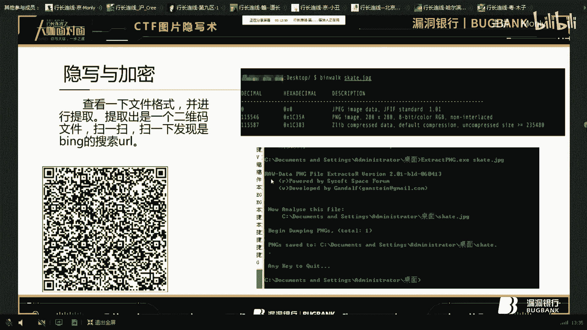
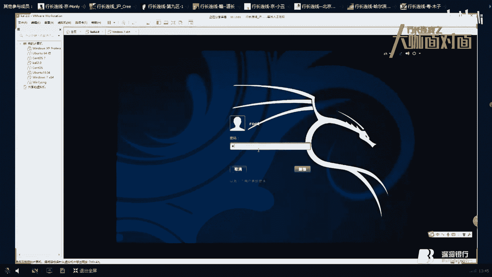
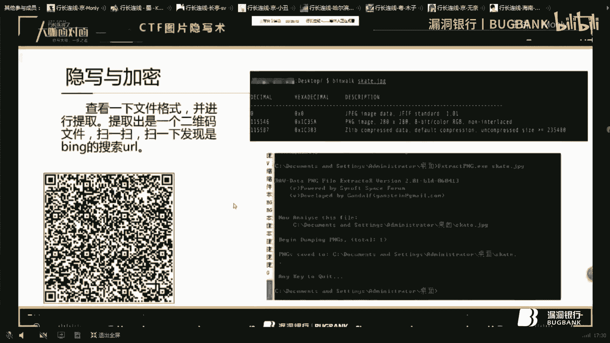
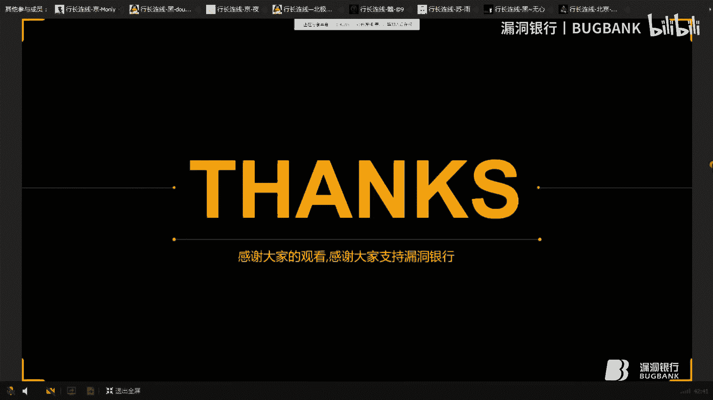
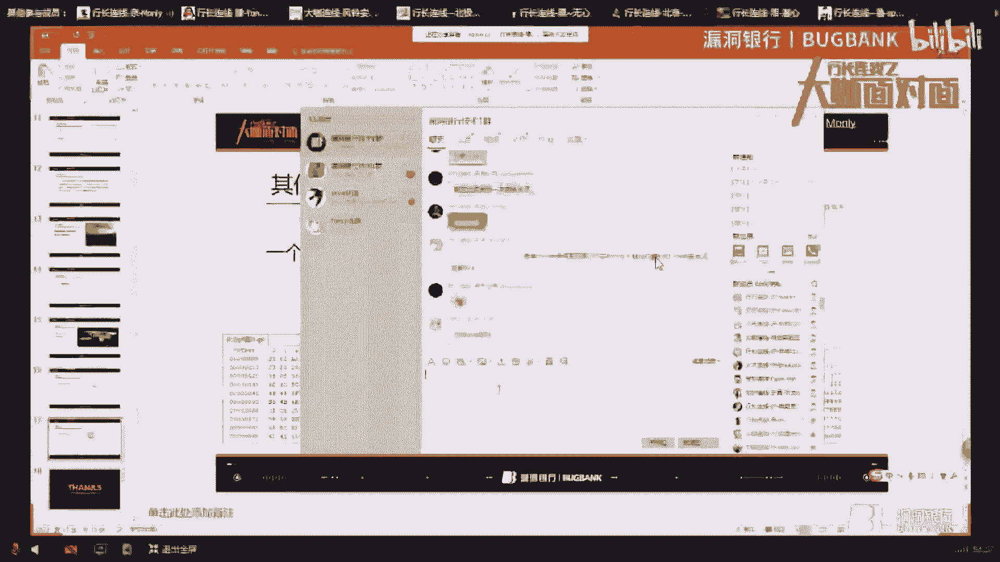

# 漏洞银行丨CTF图片隐写术的各种脑洞—Monly丨咖面25期 - P1：【录屏】CTF图片隐写术的各种脑洞——25期大咖Monly - 漏洞银行BUGBANK - BV1Pp4y1h7wS

小伙伴晚上好。

歡迎收看漏斗銀行第二十五期大咖面對面，我是主持人年念，今天我們邀請到了大咖money，做客我們的大咖面對面，今晚將為我們分享CTF的最新消息，我們先來看看大咖面對面，今天我們邀請到了大咖money。

做客我們的大咖面對面，今天我們邀請到了大咖money，做客我們的大咖面對面，今天我們邀請到了大咖money，做客我們的大咖面對面，今天我們邀請到了大咖money，做客我們的大咖面對面。

今天我們邀請到了大咖money，做客我們的大咖面對面，今晚將為我們分享CTF圖片影寫術的各種腦洞這個主題，今晚將為我們分享CTF圖片影寫術的各種腦洞這個主題，難度係數兩顆星，大咖分享期間。

希望大家能多和大咖進行互動和交流，但是請大家不要探討與分享內容無關的話題，保持對大咖的尊重哦，那現在就有請大咖money開始今天的分享吧，大家好，今天我主要是講一下CTF圖片影寫術，首先介紹一下影寫術。

影寫術算是一種加密的技術，權威的說法呢，就是是一門關於信息隱藏的技巧與科學，所謂信息隱藏指的是不讓預期的接收者之外的任何人，知曉信息的傳遞事件或者信息的內容。

現在呢各大的CTF比賽中都有關於圖片影寫術相關的題目，通過將key隱藏在圖片或者它通過圖片的其他方式隱藏起來，選手通過找到各種方式找出正確的key並提交，這就是圖片影寫術的簡單介紹。

我們時間有限就是把它稍微分了幾下類，然後就是平常見得最多的幾種類型，然後給大家分享一下，先看一下第一個類型吧，修改數據的，修改數據的最多的話應該是LSB進行影寫，LSB呢它是最低有效位。

一般是PNG格式的文件，它中的圖像一般是由紅綠藍三顏色組成的，每種顏色能佔用八位，取值範圍就是00-FF，一共是16的平方256種顏色，然後呢它就包含了256的三次方的種類顏色。

LSB影寫呢就是修改了像素中的最低的一比，一般是最低的一比特，在人眼看來是看不出來區別的，也就把信息給隱藏起來了，所以就經常打CTS的話，你看到圖片如果是PNG格式的，你就可以先用一下後邊這個工具。

直接用進去看一看，或者這個圖片比較大的話，也可能是LSB進行影寫了，LSB影寫的話主要用到的是這一款工具，圖片通道查看器，這是它的下載地址，我只是先介紹一下這個類型用到的工具。

然後給大家看一下圖片影寫處，對這就是這個工具，用Java寫的，然後打開一個PNG的文件，這張圖片可能大家很熟悉，網上很網上經常有這張圖片，而且這是影寫處理很清楚的一張圖片，我也拿來用了一下。

然後打開這文件通過不同的切換它的通道，最終在一個通道裡發現了一個二維碼，用手機掃一下二維碼的話，然後就會出來這道key的key，可能有些題目它不只是到這一步就結束了，還會有更長的延伸。

可能與其他加密什麼的合到一起，這是一個簡單的圖片，然後還有一個，對就是這一個，圖片小一點，對它也是通過這個不慣的切換通道，有點不一樣了，對就是它這裡邊也隱藏了一個二維碼。

也可以通過掃描二維碼來找出它的key，然後關於LSB修改的話，也就這兩個例子，大家如果有興趣可以看一下其他的例子，然後這是第一種類型，簡單的講解一下，然後這算是CTF比賽裡圖片影寫處理用的最多的。

就是影寫與加密，影寫處理在CFB賽中，它們會和加解密結合起來一起出現，或者是一些編碼方式一起出現，需要對數據進行解密，或者其他方式才能找出最終的key，然後看右邊這張圖片感覺沒什麼。

然後我還是先介紹一下這張圖片會用到的工具，Bing Web，這是一個文件的分析工具，旨在協助研究人員對文件進行分析，提取及逆向工作，這個工具在卡里什麼的，UNIX系統裡都自帶的，可以直接用，也可以下載。

然後下面這個工具，是專門用來提取文件中未加密的，JPG或者PNG圖片的軟件，這個軟件後邊有一個工具是JPG的，這是一個PNG的，這就是剛才那個題目的一個解題的流程或者方法。

首先先講一下它的流程，然後我再給大家演示一下，首先查遍這些文件的格式，就是用Bing Web，然後發現它裡邊隱藏了一個PNG的圖片，發現這個圖片呢，然後就把它提取出來看一下，提取出來之後。

它會是一個二維碼，然後掃一掃之後會發現，已經是一個必用的搜索URL，我還是給大家演示一下吧。

這張圖片，這張圖片就在這裏。

對就是用這個工具，然後加載這張圖片，會看到它裏邊隱藏了，它裏邊隱藏了一個PNG的圖片，然後可以把這張圖片給提取出來，提取的話主要是用，可以用到這個工具，將圖片進行提取，這就是這張圖片，提取一下。

提取完之後它會產生一個文件夾，這個文件夾呢，就是提取出來的那一張PNG的圖片，就是這一個二維碼，這個二維碼能掃，用手機或者其他的掃過之後，會是一個必用的URL，我們直接用網上的，二維碼。

對掃描之後會到達這個頁面，這就是必用的那一個頁面，它會寫著Key不在這，其實Key已經被隱藏起來了，我們用二維碼，對我們用這個二維碼解碼器，來看一下這張二維碼，對這就會發現是它的URL。

對搜索這個URL就會是這一個，它的Key並不在這裡面，而是隱藏在它的URL裡，仔細看它的URL，會發現最後有個百分號3D，兩個百分號3D，百分號3D可以轉換成兩個等號。

經常做這種計劃會對Base64特別敏感，看到等號就想到Base64，而這有兩個等號，可能前邊的這一塊數字，不是字符可能跟Base64有關，然後正好這有一個Key，然後我們就把這一段。

看看它這裡面是什麼意思，這就是它真正的Key。

這道題呢，拐的彎也不是太多，基本上也不是很難想，對圖片引解術有所了解的話，基本上差不多都能做出來，這算是一個比較基礎的題目吧，然後，第二個題目也是引解與加密的。

這個題目呢，我記得上次還是什麼時候，有個同學就問我這個核發的Pin是多少，上次好像沒有告訴他們，這一次好好看的話就知道了，左邊寫著東漠區大明湖，順便用Pad拍了一張，景色這麼美，要跟大家分享找出Key。

其實這句話裡邊也隱藏了一定的信息，我們做CTF題的時候，它可能也是前面會帶一句話，我們要仔細看那句話，它有時候會在裡面隱藏一定的信息，而這一道題目隱藏的信息呢，待會告訴大家。

先來給大家介紹一下這道題要用到的工具，Magic EXIF，這款工具呢是一個元數據編輯器，是一款強大的照片EXIF元數據編輯器，它可以從數十種圖像格式中。

錄取超過1500個GPS內的標準和非標準的EXIF項目，比如說JPEG EXIF TRFF RAW等等，還支持一些非主流的文件格式，這個工具呢主要是對圖片進行處理要用的，因為前面它提到了一個Pad。

這張圖片是用Pad拍的，而這個是處理，這就是這道題目的詳解，先給大家講一下吧，右上角這張圖片呢，就是我剛才說的那個Magic EXIF工具，用它打開這張圖片，就可以查看這張圖片的各種信息。

製造商水平水平分辨率垂直分辨率，這款工具呢平時用也很好用，就是不一定是做打CTF的時候，然後會看到它的數據裡，這一段似乎很長，這就引起了我們的注意，然後呢這段數據就可以用，你看到64 47 68。

就看起來就像是16進制，所以我們就用16進制解密一下，就會出來又一段字符，這一段字符呢，我們還是用最常見的BASE64試了一下，就會出來一串正常的感覺是幾個單詞，或者什麼拼起來的。

那這個呢就是這道題的真正的題目，就是這樣的，還是給大家演示一下吧，對就是這一款工具，這就是這張好畫，它的主圖像信息，還有它大量的信息，它這道題呢是在前邊，這個它有可能放到後邊，或者其他地方，要仔細觀察。

這道題呢主要是一開始，他提到了用PAD拍的，所以才會就是往，用這個圖片打開的那個方向下，就這一段字符，然後呢還是用BASE64，16進制，然後解碼一下，對就這一點，然後這一段。

一般CTF裡最常用的就是BASE64，所以先用BASE64，用一下就會出現這一點，看起來很正常的數據，做這一項，先給大家看一下這題目，這題目呢是一張圖片，加上一個壓縮文件，解壓這個壓縮文件。

其實這個解壓密碼呢，就是剛才解密出來的這一段字符，它加上這個，沒什麼用其實，其實如果能解出這一個來，後邊的人也就解出來了，就是放在裡邊，可能是混淆了視聽用的，然後打開一下，這個它會在這裡，放在裡邊。

這道題呢，其實知道了它的方法，它很簡單，就是想不到，想不到要用這個工具，其實CTF圖片影寫術中，它會用到各種各樣的工具，你只有通過不斷的做題，不斷的做圖片影寫術的題目之後，你有了經驗。

然後把那些工具給收集一下，然後就見到圖片之後，就會有靈感了，就知道往哪個方向想了，然後做起來呢也會很快，而如果不知道的話，你給他什麼一天兩天，他都想不到用這個工具，那他不可能做出這道題目來。

所以說CTF，怎麼說呢，運氣，這也是看一點運氣吧，然後這算是主要的了，然後看一下，運用載體，講的有點快啊，運用載體呢，數據在隱藏的時候，我們常常需要先分析數據隱藏在哪裡，也就是它在利用什麼做載體。

之後才可以進一步的分析，是加密或編碼，也就是說我們在對一個圖片的格式要有了解，才能知道哪些地方有顆粒，哪些是可以隱藏信息的，運用載體的話，他會一張圖片，他有很多地方可以隱藏信息，所以呢，我們要多做題。

然後多想想它的套路，其實呢，圖影術的套路也沒有太多，基本上就是換換圖片，然後在裏面稍微修改一下，只要知道了方法，那些方法網上一定，總有一種方法能讓你找出真正的Key，這也是這道題好玩的。

這也是圖片引寫書好玩的地方，做題的時候呢，唉 怎麼說呢，最喜歡做這種圖影術，感覺很好玩，你在不知不覺中就能找出他的Key，或者你都想不到他的Key會藏在哪些地方，找到的時候感覺很有成就感。

就比如說這道題目，運用載體的話我就找了一個題目，然後還有其他的時間問題，我也沒找太多，這道題目，其實你知道的話，它很簡單，它就是藏在了這個張圖片的屬性詳細信息裏，在裏面直接加了一個Key。

但如果不知道有這個套路的話，那你可能做好久都做不出來，我記得之前去年，好像是什麼，然後我們幾個人一起參加了比賽，那幾個這道題的時候，唉呀 真的也是做了好久，後來我讓他們別做了，趕緊做其他題目。

然後我說就在這詳細信息裏面，然後後來比賽完之後，他們就說 哇 居然這麼簡單我都想不到，真的 當時做的時候我們也沒怎麼詳細的分工，就是說一開始你喜歡做什麼題，你就去做著玩玩，然後就是做一會之後你再去做。

我們當時分的時候你去做哪些題目，然後呢 這道題很簡單，其實就這樣 大家學到這個套路就行，下次他可能隱藏在其他信息了，隱藏在什麼常規安全和以前的版本，或者他是一個壓縮文件，他隱藏在其他地方。

還有一種呢 突然想起來還有一種，就是他要 他一個壓縮文件，好像也不是圖片已經寫出來，就是一個壓縮文件，他說有一個密碼，然後你要解出來的話，你就必須得輸上密碼，你需要用爆破，需要不斷的嘗試他的密碼。

一般那種題目的話就是密碼位數不會太多，什麼五位啊六位之類的，你可以直接爆破著然後去做其他題目，可是突然想到給大家提一下，然後就是其他類型，其他類型的話題目也不多，我也找了兩個案例。

然後就是跟前面的類型可能不太一樣，我也不想給他仔細分什麼類型了，然後就直接扔在其他裡，這道題呢也是很簡單，大家也都看出來了，就是個送分題，讓大家放鬆一下拿點分的，要不然是不是最後比賽那分也不太好看。

通過截圖，然後就會看到他有一些字符，每一次你看這有個key，每一次截圖呢他都會不一樣，把這一串不同的都把它合起來，就是這道題真正的拼，就是送分題給大家放鬆一下，然後呢，還有一個就是一個損壞的GIF圖片。

我們有時候做題的時候會遇到那個圖片，他給的就是一個損壞的，而這個損壞的圖片呢，你打不開，也看不到裡邊的信息，所以呢，我們就要嘗試看看能不能把這張圖片修復，也可能他是隱藏在其他地方，也可能他是能修復的。

我們看一下他是怎麼修復，先給大家講一下怎麼修復，對，GIF圖片的時候，就要想到這一個，GIF署名的話，是用來確認一個文件是否是GIF格式的文件，這一部分有三個字符組成GIF，文件版本號呢。

是由三個字節組成，可以為87A或者89A，具體描述見下面，對，這是他的文件標識，GIF文件的話都會有這幾個字，GIF，然後是文件版本號，87A或者89A，這張圖片呢，這台相機還是給大家直接演示一下，對。

這道題用到的工具我還沒給大家講，用到的是這個工具，叫做OneXS，這一款工具呢，主要是可以看他的信息，可以看這張圖片的數據，這也打開，這就是這一張圖片，圖片的16印記，還有他的ASK，有些題目呢。

他可能把Key隱藏在這裡邊，他可能在中間加上一段Key括號，等於什麼什麼，所以這也是一個套路，到時候看題的話，就可以往下拉一下看看，然後呢，看這張圖片就會發現他沒有他的標識符，這是一張GIF圖片。

而他的開頭卻沒有GIF，做這種題呢，做多了，就知道這種套路，然後也有經驗了，然後看了他就會想到，他會不會是缺少圖文件，其實呢，CTF圖片隱藏術，他就是你能想到的話。

就會一分鐘或者幾十秒就能知道真正的Key，而你不知道呢，想不到那個方法，你就好久都不知道，還不如放棄這種題目，去做其他的能拿分的題，去做下面那種外部的題，外部一個就好幾百分呢，比這分多多了。

圖片隱寫術的分也就是百八十分，加起來，多的也可能給你兩三百分，但是外部的那些題目一到就好幾百分，但看個人興趣了，你喜歡做這種題目的話，那就是另說嘛，然後我們可以給這張圖片修改一下，給他加一個圖文件。

運用這個工具，這有個編輯，然後有個，對這就是要插入的圖片，插入的數據，你要插入幾個字符，插入的是GIF8，一共四個字符，所以我們就在開頭這裡加GIF8，加錯了，加GIF8，加完就保存一下，然後呢。

然後呢，心理機裡沒有裝圖片。

這就是已經修復的圖片，已經修復的圖片的話，你會看到他有個password，這是一張GIF的圖片，然後一直的閃，然後我們可以一幀一幀的看，這個呢是一個password，讓我們一幀一幀跳。

後邊這個地方可能看不太清，其實這是有東西的，如果你仔細看的話，會用自己電腦看，裡面有字符，然後把裏邊的字符都保存一下，保存出來，然後合起來，就是這道題的定義，這道題呢，也是我從網上找到的，然後呢。

這種圖片已寫出的題目其實有很多，稍微改變一下東西，然後就是一道新的題目，就是運用剛才這幾個套路，能做好多這種類型的題目，他可能這一次是放到這個位置，下一次他可能就放到了其他位置，但是你知道了方法。

這只是我找的幾個簡單的工具，這幾個工具呢，我突然又想到一點，就是之前想，對剛想起來，我記得之前想講點什麼東西忘了，之前遇到那種什麼來著，圖片轉換成音頻，但是我PPT裏忘了，剛想起來，還有那種題目。

那個好像不應該歸在圖片音階書裏面，應該歸在音頻音階書裏面，就是將音頻進行轉換，他有個叫什麼工具來著，挺長的一個英文名，可以把圖片轉換成音頻，那個工具呢，我也有，我忘了放在哪了，要不待會看看直接也發出來。

不過我沒有準備那個類型的題目，因為剛想起來吧，可能工具也得找好久，以前是遇到過那種題目，當時看到音頻就根本就無從下手，不知道他的題目會在哪，聽了聽他的生意，也沒有找到他的key，後來呢。

後來算是知道了他的key是怎麼實現的，我直接講講那個方法吧，那工具叫什麼來著，還是想不起來，一分多秒，就是把那張圖片，然後轉換成那種音頻的話，是那種波浪，那叫什麼浮來著，我也忘了，然後就是一段一段的。

然後轉換成那個的話，就會看到那個音頻的那個波段很有規律，那叫什麼來著，叫摩斯密碼，一個叫做摩斯密碼的東西，那個音頻很有規律，就是一段一段有一點什麼的，如果熟悉熟悉那幾種密碼的話，那幾種什麼蟑螂密碼啊。

摩斯密碼還有什麼，凱薩，凱薩呢什麼密碼之類的，就是那一段的話，一看就能看出來是摩斯密碼，然後就盡量簡密就行，就是那到其真那到其假，也是知道了方法就會感覺到很簡單，如果不知道的話，還是不會做。

我這也是後來才知道了那個套路，之前也是用了好幾種那種音頻的軟件什麼的，都沒有把它，都沒有找到它的PIN到底藏在哪裡，當時對那個文件也研究了好久，也不知道原來是需要用那個軟件打開，誰能想到呢。

沒遇到過的話，很難能做出來，只有知道那工具才能做出來，還有呢，之前也想起來什麼東西，還有呢，什麼提來的，突然忘記了，PPT的話，就是這一些，我只能是說沒有做筆記忘記了，本來記下來，本來想記下來。

但是最近太忙，今天忙了一天，我剛剛回來，然後網還不好，我這是用的別人給我開的熱點，還是用流量開的，太貴了，那給大家就簡單介紹這裡，到這裡，然後呢，音頻的話，看有時間的話，也可以準備幾個，講就算了。

可以找幾個題目發出來，還有那個工具，工具我也可以給大家發出來，然後大家有興趣的也可以看一下音頻的那一個，總的來說，CDF中音頻的也不是太多，反正遇到的話，那就很容易記起來。

如果知道的話，是不是，白拿這麼多分，好了，主要就是這一些工具的話，還有前面介紹的那些工具。

待會也可以發出來，然後呢，年年去哪了，我在，好，你是結束了，是嗎，好，那非常感謝，忙於打開的分享，接下來就是我們的行長問答環節，然後時間為十分鐘，對今天所講的內容，有疑問的小夥伴，可以抓緊機會提問。

你可以注意看一下，群，大家的提問，最後那個TF是什麼意思，因為這張圖片，因為這張圖片是已經損壞的，然後呢，你根據他的習慣呢，你可以先各種查看他的屬性，然後各種運用其他方式，就是到了這一步的時候。

對因為這些方法都都要都要放到一起，就是一個一個的試，總總會試到一個方法，會試到試出他的就用的套路，然後這樣GIF的話，他圖片損壞GIF圖片一般都會有個前綴嗎，前面這裡好像忘了對，他這張打開他沒有前綴。

我給他添加一個，圖片不能寫入RM計劃SO裡面，然後刻成光盤，影寫過的圖片是什麼樣的影寫過的圖片，這我不知道具體問的是什麼意思，對對像素材，這張圖帽子見過，忘了，聽這題目太多了，你隨便找一張圖片。

自己改一下，就可以當一個題目，那非常感謝Money大開的分享，接下來就是我們的行長問答環節，然後時間為十分鐘，對今天所講的內容有疑問的小夥伴，可以抓緊機會提問，你可以注意看一下，群，看大家的提問。

最後那個GIF是啥意思，因為這張圖片，因為這張圖片是已經損壞的，然後呢，根據他的習慣，你可以先各種查看他的屬性，然後各種應用其他方式，就是到了這一步的時候，對因為這些方法都要放到一起，就是一個一個的試。

總會試到一個方法，會試到試出他的就應用的套路，然後這樣GIF的話，他圖片損壞，GIF圖片一般都會有個前綴，前面這裡好像都有個前綴，他這張打開他沒有前綴，通過給他添加一個圖片，能不能寫入RMG和SO裡面。

然後刻成光盤，影寫過的圖片是什麼樣的影寫過的圖片，這我不知道具體問的是什麼意思，對象素材，這張圖啊，貌似見過，忘了，這張題目太多了，你隨便找一張圖片自己改一下，就可以當一個題目。

而且國內這麼多CGF比賽是不是，基本上，還有什麼，幾週一個幾個月一個百度的，還有什麼其他的，太多了，然後這題目也太多了，把圖片改後綴名，這應該是很簡單的一種吧，他就是有一些是什麼點什麼其他格式的。

或者直接給你一個圖片，然後你把它改成什麼JRP還是什麼格式的，然後打開他，他裡面也會隱藏一定的數據，隱藏一定的信息，然後根據那個信息呢，根據他的步驟走，他可能提示你一段，然後你再走下一步。

然後他又提示你一段，他可能在壓縮文件裡，你打開他右邊，之前就遇到過一個右邊就畫了一張，就一個小圖片，然後旁邊提示你什麼新的信息，不看完，對，確實很多都想不到，但是如果你做的多的話。

然後把這些能用到的工具什麼都整理一下，你就拿著圖片試就行，工具只要全基本上都能試出來，是不是圖片中隱藏的壓縮包的算啥題，圖片中隱藏的壓縮包，圖片中好像隱藏過一個叫ZL什麼什麼P的，不是ZRP。

挺長的那一個什麼格式的，他好像是把一段，一段數據隱藏在裏邊，以前我好像也遇到過，那一個題的話，對，對好像是正常的，看起來是正常的圖片，但是直接在裏面隱藏了，這個算數據隱藏嗎，這個應該算數據隱藏呀。

他們把這個數據隱藏在圖片裏呀，然後你要把那個壓縮包什麼的找出來是不是，改了後注意變壓縮包那一種，這應該是拿到之後先改一下試試，上次DOC有壓縮包，DOC對呀，他有一個DOC的文件，他直接打開一個mod。

在裏邊之前遇到一個題目叫什麼上帝之手。doc，我同學參加過那個CTF，記得那個題目，機關一層一層的，對，從中爆開之後就是，還有小夥伴有疑問嗎，然後抓緊時間提問哦，本來是一張圖，後來又是一張圖。

我倒不太知道，改後你改成圖片格式的後綴，他當然還是圖啦，你是說改完後綴變成了另外一張圖嗎，這個題目好啊，之前沒怎麼遇到過，有沒有題目的詳解啊，我也想看一下，JPG改成JRP，這是最基礎的，也是最簡單的。

拿到之後先改一下試試，那十分鐘時間到，本次的行長問答環節就暫時先告一段落，由於時間的問題，如果還有疑問的小夥伴，可以等講座結束之後，再找大咖繼續交流吧，那接下來我們就先進入，今天的行長增書環節。

今天的大咖為群內的小夥伴，挑選了一本，Web安全深度剖析的書，接下來就請Moni，在剛剛所有參與交流互動的小夥伴裡，選擇一位你認為聽破最認真，互動最積極的小夥伴吧，然後你可以在群裡，@一下這位小夥伴哦。

這本書呢是一本很基礎的書，因為突然要推薦書，我也不知道推薦哪一本，然後這一本呢算是第一本書吧，當年當年看的感覺最好的一本書，這本書呢我當時翻了不下，就是每頁看的話，真的應該是不下十遍。

而且還做了很多筆記，感覺這本書入門什麼的都挺好的，不過這裡群裡全是大神，是不是對這本書有需求嗎，我看看哪一位，是不是得給新手呢，大神就不需要這本書了，看到一個人還是給這位小夥伴吧，是不是很激動，好嘞。

那這本書就送給小小怪這位行長，在嗎在的話可以冒一下炮哦，不要發圖，那恭喜小小怪成為今天晚上的幸運兒，你將獲得由漏洞銀行代表本期大咖Money，為你送出的外辦全深度剖析這本書。

一會兒活動結束之後我們會聯繫你，關於送書環節的後續結果，我們也會在後期官方發佈的本期大咖面對面的推文中公示給大家，可以通過我們的微信公眾號或者是官方微博了解後續的詳情，沒有獲獎的小夥伴也別先忙著遺憾。

多多關注漏洞銀行的官方群內活動機會多多，今晚的大咖面對面活動就要和大家說再見了，大家如果對今晚所講的內容還有疑問，可以繼續在群裡交流討論。

再次感謝Money大咖的分享，咱們下期再見吧，(音樂)。

好，未经许可，不得翻唱或使用。