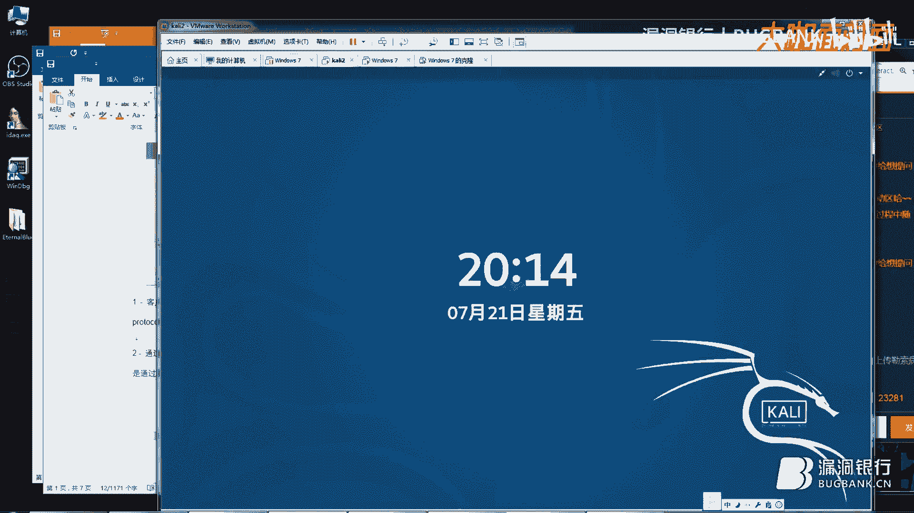
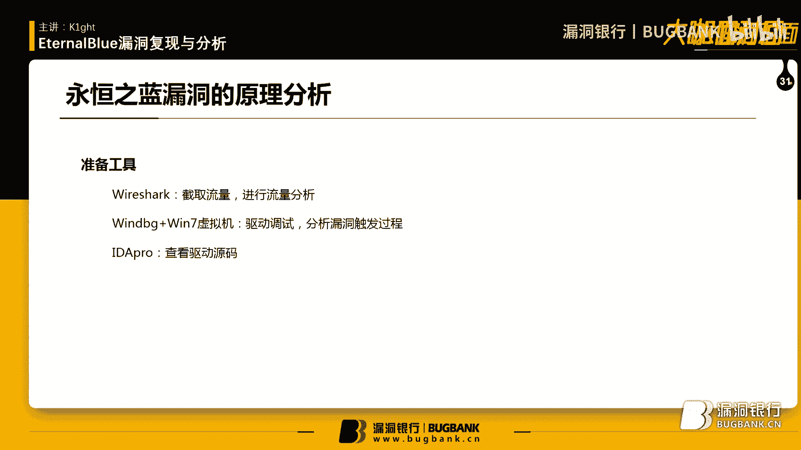
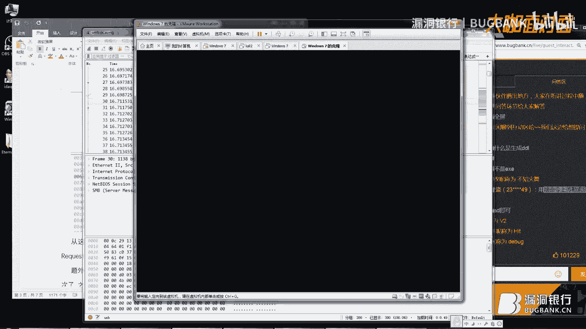
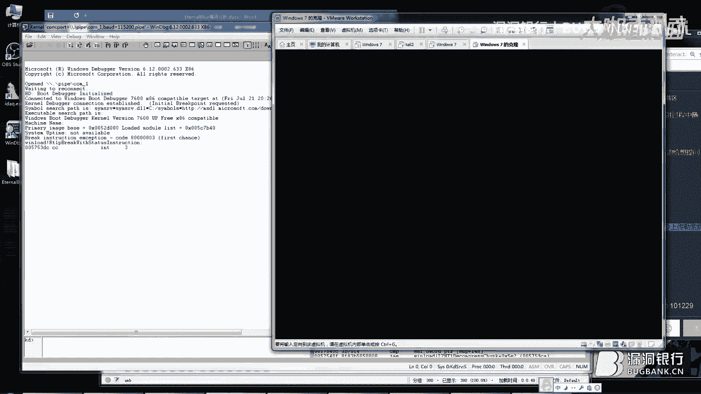
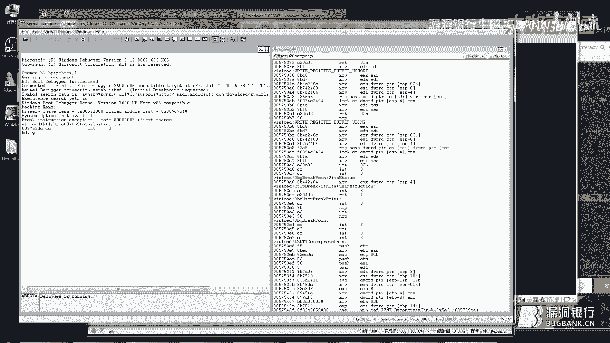
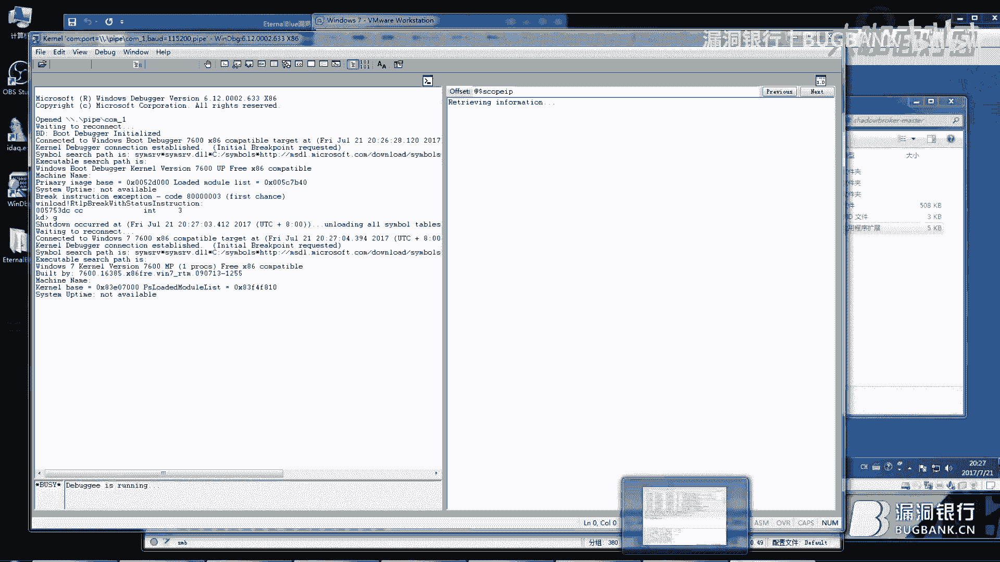

# 漏洞银行丨EternalBlue的漏洞复现与分析—K1ght丨咖面31期 - P1：【录屏】EternalBlue漏洞复现与分析——第31期大咖K1ght - 漏洞银行BUGBANK - BV1FK4y1S73M

為知識而存。

因技術而生，小夥伴晚上好，歡迎參加漏洞銀行安全技術講座，大咖面對面，第三十一期，我是今晚的主持人，年念，還記得那句，同時我幫您寫，寫載了MS17010，關了Win10自動更新，開了445。

還連上了校園網的玩笑嗎，所以過了些時日，但Eternalblue，作為安全圈萬眾矚目的焦點，其原理及攻擊手段，依然是業內津津樂道的話題，繼大咖周期間，WannaCry的逆向分析與解密之後。

今天我們再一次邀請到了，漏洞銀行的安全專家Kate，來為大家解讀Eternalblue，今晚她將兌現在，一周大咖秀許下的承諾，在對Eternalblue進行，漏洞付現的基礎之上，為大家展示。

利用WinDebug和IDA，對漏洞進行內核調試的全過程，利用WinDebug和IDA，對漏洞進行內核調試，並做深入的分析，和大家分享，在Eternalblue的研究過程中的，收穫與心得。

今晚的直播形式為，漏洞銀行直播間，歡迎大家在互動區多發彈幕，與大咖和聽眾探討和交流，也歡迎你在問答區，留下聽講時遇到的問題，大咖會在問答環節為你一一解答，事不宜遲，下面就讓大咖Kate，來為你補點藍吧。

有請Kate開始今晚的演講，大家好，我是Kate，今天我給大家帶來的是，永鴻之藍的漏洞付現和分析，我之所以想做這個，是因為之前我剛分析了，One and Cry。

One and Cry用的漏洞就是永鴻之藍，當然不僅僅是One and Cry，最近又爆出了一些，惡意的病毒或者是木馬，他們用的也是永鴻之藍的漏洞，所以說我就分析了一下，那這節課主要就是對永鴻之藍。

首先我們先付現一下，之後我們再去看看，它這個漏洞的發生過程，它的漏洞原理是什麼，我相信大家對永鴻之藍，都應該有所了解，那我們直接現在就，我給大家付現一下，這裡付現的時候呢，我得給大家說明一下。

我這裡付現需要的實驗環境，首先是一台卡利，這是一台Linux的系統，它主要是生成一個，生成一個Dell的一個利用，是這樣的，我這次做的不是一個，用卡利來全程進行攻擊的一個模塊。

我利用的是方程式出來的代碼，我是直接用方程式的代碼來做的一個付現，包括一會兒我們進行漏洞的分析，都是用的方程式，那我們準備了一台卡利，還有兩台Win7的虛擬機，一台是攻擊機，另外一台呢是靶機。

以及方程式的露出來的文件，以及Python的一個實驗環境，它是基於Python 6。6的，所以說我們也要把這個環境搭起來，我們先在這個Win7的一個虛擬機上。

那我已經把這個方程式的這個文件夾已經拷進來了，拷進來之後，如果小夥伴想跟著我一起付現的話，你還需要把這另外兩個環境搭起來，就是Python的這個exe，搭起來之後呢，我們就可以進行攻擊了。

那我們現在假設這個Win7，這台虛擬機已經搞定了，搞定了，我們到卡利上來，我們用卡利來生成一個Dell，我這里做了一個小筆記，這里都記得我的命令和需要的環境，以及過程步驟，那我們直接用MSF生成這個。

反射的一個Dell，在這里，這個Dell注入到進程當中，直接就會返回一個TCP的一個鏈接，我們就會有一個Metaprojector的一個Shell來進行控制，我們生成這個Dell之後。

把這個Dell放到Win7攻擊機的一個系統里面，然後隨著我們對另外一台靶機的攻擊，我們就能拿到它的權限，我的聲音如果小的話，大家可以在評論區里頭說一下，我可以看一下，或者是對我這個教程有什麼疑問。

那我生成了這麼一個Dell，那在這里我們把它拷出來，然後我們再放到Win7的攻擊機里頭去，這有個我以前用過的把它刪掉，我們直接拷過來，那這個時候呢，我們就可以進行第二步，Win7攻擊機的操作。

它這個方程式呢，它有一點點問題，如果你直接拿來用的話，它會報一個錯，它主要是，會用到一個listening post，這麼一個文件夾，那我們可以把這句話給注釋掉，或者是我們建一個這樣的文件夾。

我們可以直接用，它這個腳本，那我們到這個，方程式的windows這個目錄下，我們直接python運行，python運行fb。py，那我們可以看到里頭有很多選項，我們要填寫攻擊機和被攻擊者的一個IP。

那我們可以看一下被攻擊者的IP是多少，是80。131，那我們直接就填這個IP就可以了，那麼我們自己的IP是多少呢，我們也看一下，用ipconfig命令，是80。134，那我們就填上這個，然後剩下的呢。

就是基本上一路回車就可以用了，在這裡呢，我們要創建一個工程，我們創建一個新的叫new，那這裡呢，它會記錄一些你的一些，記錄和日誌之類的，你的攻擊記錄啊，都會存在這裡，那這個時候呢，我們第一步已經完成了。

我們第二步呢，就是用永恆之藍的腳本，大家可以看啊，這裡不僅僅是有永恆之藍的腳本，這裡頭呢，還有很多永恆浪漫啊，等等等等一系列的，我也沒有一個個去分析，我這次呢，就是分析了永恆之藍。

我就給大家講的永恆之藍就好了，那啟動這個模塊之後呢，我們就可以直接打這個文西的一個靶機了，那為了看一下他這個攻擊的過程，我們打開vrshark，我們用vrshark來記錄一下，他的攻擊過程，嗯。

我們看一下這個有沒有接到這個數據，好沒問題，好，那我們這邊用永恆之藍繼續開始攻擊，這邊就是檢查一下參數，基本上不會有什麼問題，那到這裡到這裡會選是XP還是Win7，我們這裡他默認就是1，我們直接回車。

那在這裡呢，這裡的話我們模塊我們選第一個，不是第一個，是第二個是1，那這個時候我們就可以，進行攻擊了，一路回車下去就可以了，這裡可以這裡可以看到他就已經發送了他的攻擊的Share。

我們可以看到這裡有大量的來自於445端口的數據，他是連的這個131的445端口，有人問為什麼生成DL而不是EXE，因為他裡頭是自帶的是可以有這麼一個功能，是吧，他是留了一個後門。

他用sharecode打進去之後呢，他留了一個後門，後門是可以加載一個DL到系統的進程當中的，那我們用DL來演示就可以了，好像有點點慢，我們可以大概的來看一下他的協議。

等會我會給大家簡略的講一下這個SMB協議，可以大家看到頭兩幀，頭兩幀是這個協議我也不太會念，大家可以看一下，他在這個第一幀和第一個回的這一幀呢，這個幀是一個很正常的一個協商，他是，發送一個請求。

然後回復SMB的協議版本。

他是支持哪些版本的，所以第一幀是基本上沒有什麼大的問題，好，我們這裡可以看到永恆支援這邊已經打下來了，那等會我們繼續給大家講一下SMB協議，現在呢，我們繼續漏洞付現這個過程，永恆支援這個模塊。

我們已經打下來了，他已經留下了一個後門，那我們下一步呢，就可以把我們剛剛生成的電腦加載進去，那這個時候呢，我們用他的另外一個模塊，大家能看清嗎，就這個模塊，也是基本上參數都是有的。

我們用的是SMB的一個後門，所以是寫的是零，然後我們是x86的，x86也是零，默認都是，那這個時候呢，就是他有好幾個功能了，那我們剛剛既然生成的是一個deal，那我們就選他第二個功能，裝deal。

那我們要填寫這個deal的一個地址，那我們剛剛是放在這裡的，我們直接把這個地址放進去可以了，然後選擇你要注入的進程，這個時候呢，我隨便選一個吧，export。exe，他桌面進程。

一般這個進程肯定是會有的，那我們一路回車，我們打就行了，嗯。

這時候出現了一點問題啊，我這邊忘了監聽了，不過沒關係，我們現在趕緊監聽一下，那為了快呢，我直接就複製了，這個IP呢是你本機的IP，你剛剛生成deal的時候，這也是要填這個IP的。

那我們現在已經開始監聽這個deal的回聯了，這邊我們重新再試一下，我們現在再打一下，看看能不能得到這個啊，我們可以看到我們已經拿到了他這個metaplater的一個權限，那這個的話是已經回聯了。

那到此為止呢，我們這個基本的漏洞付現已經完成了，我們把這個我們剛剛截取的流量保存下來，我們一會來分析分析這個流量問題到底在哪，我現在把它要導出來，好像出了一點點問題，不過不要緊。

我這裡還有一份之前保存好的，那我們沒關係啊，這個電腦好像出了一點點問題，因為我附加了兩次這個deal，他可能會導致了一些衝突，導致他桌面進程的一個崩潰，那我之前呢，已經做了一個備份，他的攻擊過程。

我們剛剛也看到了頭兩針呢，是一個協商，那這裡是沒有什麼問題的，我現在漏洞付現已經講完了，我先看一下大家有沒有什麼問題，用什麼命令上傳勒索病毒，這個不能說這個犯法的，那我在這裡呢，給大家說一下吧。

說一下這個協議，那漏洞付現呢，我已經給大家講完了，現在呢，給大家講一下這個漏洞的分析，他的那個協議，那可能大家有些思路不太清楚的話，我給大家，再看看一下PPT，我們今天呢，有兩大內容，一個是付現。

另外一個就是原理的分析，我們剛剛已經把這個付現過程已經走完一遍了，我相信大家就是，跟著我這個思路來的話，他攻擊和漏洞付現是沒有任何問題的，那我們知道他可以付現，那他的漏洞利用的原理又是什麼呢。

那，我這就給大家講。

講這兩塊，一個是SIMB的漏洞成因分析，以及過一會我們用WinDebug去跟一下他，看看他具體的一些數據，那在此之前呢，剛剛大家看到我用VRShock截數據了，所以說我這幾個工具呢，給大家稍微講一下。

一個是VRShock，就是截的一些數據，另外一個呢，就是WinDebug，內核調試工具，我們用它來對Win7的虛擬機進行內核調試，還有一個呢，就是IDA Pro，這個呢，真的是很有名的一個程序。

各種的逆向分析都用到他，我們一會呢，就用他，他我已經加載好了那個符號，鏈接符號，所以說我們對他的一個驅動，我們也可以直接的分析，裡頭都是有標好了他的API了。

那這個時候呢，我們先對，這個協議進行一下分析，那SMB協議是幹什麼用的，為什麼他老出問題，那這次他出了問題，他是出在哪呢，我給大家就是大概的簡略的講一下，那他是一個，實際上他就是個文件共享協議。

他不但能共享文件，他還可以對設備啊等等一系列的這些命名管道和油槽之類的，都可以進行一個分享，所以說他的本質呢，是一個分享協議，那在這次攻擊當中呢，頭兩針是一個協商，這裡呢，沒有什麼問題，那之後呢。

他還連續用到了幾個漏洞，其中最大的漏洞呢，就是，我會給大家講是一個溢出的一個漏洞，那剩下的還有一些小漏洞，主要就是可以讓他分配一些緩存，那我們繼續看他的第三針和第四針，這兩針，這兩針，是什麼呢。

他是一個客戶端向服務器發送的一個用戶或共享一個認證，這個裡頭是要包含登錄名和密碼的，就是你輸入的登錄名和密碼就包含在這一這一針當中，接著，第三針第四針之後完了嗎，這是第五針和第六針，這兩針呢。

是你要請求的共享資源，大家可以看到這裡是標明了把機的IP和IPC刀的這個，符號，他呢就是請求一個，共享，在這裡呢，其實他也是有一個漏洞的，我沒有去很詳細的分析，但是我知道他在這裡呢，請求了之後。

他會分配一些地址詞，等一會我會給大家講的是分配的哪些地址，那這邊請求完共享資源之後呢，那就是他要做一個FEA list一個轉換，那這個時候呢，就是打開共享文件或共享文件夾的這麼一個，命令，最後呢。

溢出點就溢出在這一針上，這一針是怎麼回事呢，我給大家說一下啊，他是這樣的，他在這一針之前呢，他申請了多個緩衝區，這個緩衝區呢不屬於什麼不屬於這個srv。sys，他是屬於另外一個緩衝區。

他本是不應該被侵占的一個地方，那他利用這一針以及後面構造的數據呢，他溢出到了另外的緩衝區，那另外的緩衝區一旦被溢出了呢，正好他是可以執行命令的，他做了一個調用，正好指向了他的目的地。

他這樣的話就可以調用他自己構建的share code了，所以就GG了，我給大家畫個圖吧，這樣講比較枯燥，是這樣的，這一系列過程呢，他是這樣，他構造了，不是這個，我們用句型來表示一下，他構造了幾個緩衝區。

那在這裡，那其中一個緩衝區呢，就是這個他構造了幾個srv。net這個緩衝區，這個時候呢，他又發了一針什麼呢，他是要請求一個數據轉換，數據轉換的緩衝區呢，就和他是相鄰的，他倆是在一起的。

他在他因為他有一個漏洞，他的數據溢出了，不是他有一個漏洞，他沒有對常動能做一個校驗，會導致他超出了他的緩衝區，所以說他在網裡頭放數據的時候，放數據的時候，最後多出來了一塊，溢到了旁邊的緩衝區裡頭。

那這個緩衝區呢，是有個指針的，他要指向他要執行的部分，那之前呢，這個指針是指向他內部的，那現在把他改掉了之後呢，他就可以指向，黑客控制的一個share code，在那裡執行他的代碼。

所以說我們今天主要任務呢，就是看看這裡是怎麼溢出的，我們先看看這個，因為我已經分析完了，所以說我就順著給大家講了，他主要的問題在於這一幀，這一幀可以大家可以看到，他請求的數據量是66512是。

1103D0H個字節，那我們來進行一個，內核的調試，來跟一跟他這裡到底是怎麼處理的，其實這裡我分析完之後呢，我也總結了一下，我也不知道該怎麼描述呢，才能描述的特別的清楚，總之呢，我盡量給大家講細一點。

講清楚一點，他這個漏洞到底是怎麼發生的，我們這裡選擇調試模式，這樣的話，他就會等待一個windy bug的調試。

windy bug調試，如果有不會的話，回頭我也可以做一個小教程。

怎麼對內核進行調試，那這裡呢，我就直接搭起搭好了環境。

搭好環境，我們直接調試，首先我們用J來進行，走到系統裡面。

那等一會呢。

我們要內核調試，他溢出的點的話，我們還要用一次永恆支藍，那這裡呢，我還是要用永恆支藍的模塊，所以說我們在這邊都準備好，這個卡莉沒什麼用了，他已經拿到了share，我們把他關掉，趁著他啟動了這個間隙。

我再給大家講一下他這個漏洞的一個流程。

我們從我們用ID打開，他的問題就發生在這個驅動上，他呢，就是處理SMB協議的一個主要的一個模塊，我們剛剛講過了他這麼一個流程，那他一步一步往下走的時候，大家可以看到，這個數據一幀一幀發的時候。

發到這一幀的時候，他要求一個什麼呢，他要求轉換他的數據，轉換FA類似數據到NT數據上，那這個時候呢，他調用的是哪個函數呢，是一個SMB，open，我們可以看到是這個函數，那他發送的這個。

我這麼來回串的這樣對比的講，可能大家會對他整個流程會有個更為清晰的一個了解，他發送的這一幀，從這裡開始，從這裡開始，從我這個黃色的小塊開始，往後的內容，就是這個A1，因為這些內容就是他要轉換的內容。

那這個A1進來之後呢，他要把它轉換，他在這裡，進行實際的轉換，我們再進去看一下，他進到這個函數裡頭呢，他首先要讀他的長度，他的頭四字節呢，是表示了他這個數據的長度，這個時候呢，他的長度呢，是10000。

是10000H字節，那我們一會兒跟就跟到這裡，我們來看一看，他到底是怎麼回事，都聽得明白嗎，我感覺會不會有點跟不上，那我再講講這個。

SMB處理的時候的他的問題吧，那他這裡進行實際的轉換，在這裡呢他會先算一下，他到底需要多少空間來轉換，來留給他這個長度，那在這裡呢，這裡有一個V6和一個V1，這個V6的返回值。

大家可以看到就是這個這裡的這個一個V5，那V6返回的是轉換後的數據長度，那V1算的是什麼呢，V1呢就是F list的頭四個字節，換句話說就是F1A list的一個長度，那這個長度呢。

本來是沒有任何問題的這個函數，但這個函數呢，就在這句話上，他做了一個word的一個強制轉換，那在實際的過程當中漏洞發生的時候呢，V3-V1的時候是等於FF5D，那如果你這裡不做強制轉換的話。

V1=V3-V1，就是FF5D，這個長度實際上是沒有問題的，FF5D那return的V6呢，是10F18，那很明顯後面的數據比前面的數據要大，那這個時候是沒有任何問題的，他也不會發生任何的異處。

但問題就出在他是一個強制轉換，相當於他只有兩字節，兩字節的話，最後會導致呢，四個字節數據，前四個字節呢，是沒有任何變化的，後四個字節等於FF5D，導致他V1呢，實際上就是1FF5D。

相當於不止兩倍的長度了，他算出來的長度的乘以2，相當於這麼一個程度，那我這邊的一個windows已經啟動起來了，這個時候呢，我們做一個斷點，我們剛剛講了半天這個函數，那我們就斷到這個函數這裡來。

我們看一看，他的數據是怎麼發生異處的，我這裡做了筆記，Windows Debug的Ctrl+Back鍵，就是暫停鍵，我們暫停下來之後呢，我們下一個斷點，我們斷到這個函數上，現在呢，我們用溫期的攻擊機。

對溫期的靶機進行攻擊，我們可以看到這邊的斷點已經斷下來了，我們斷到了這個List2nt的這個函數上，這個函數就是這個函數，在OD裡的我們可以看到，他相當於F5過來之後，C代碼是什麼，那這裡呢。

是會變代碼，那我們來看看他的記存器，Eax，的內容是什麼呢，我們可以看一下Eax的地址，就是F1List，大家應該都知道，就是函數，函數進來之後，他的第一個參數往往是Eax。

那我們看到了他的頭四個字節呢，是10000H，我們做個小筆記，我們記下來，他的，F1List初始的一個長度，那就是後面的全部都是0，這個沒什麼好說的，他的實際內容呢，就是0，那他的頭四個字節呢。

是他的長度，這個時候呢，我們已經得到了F1List的長度，我們走到這個函數，我們看看他算完之後，他的長度是多少，那我們剛剛看到了這個函數裡頭呢，會有一個強制轉換，那按照他本身的意思呢，最後唯一也就是說。

他的這個第一個字節，他頭四個字節呢，應該是不會超過兩字節的長度的，我們在這裡下一個斷點，我們再走一下，我們用J再走一下，走到這裡，我們再來看一看，這已經到了函數的內部了，這個，一步一步走太耗時間了。

我分析的時候呢，我是一步一步走的，我是看他具體是怎麼導致了這個溢出了，我這邊的話，我給大家說一下啊，這個函數裡頭，這個函數裡頭呢，大家可以看到這個V6本來是等於0的，這個V6呢，就代表的。

他的NT的長度，那每次呢，他會增加一個C字節，就是12字節，他在什麼情況下會增加12字節呢，在這裡V4+5，換句話說就是F1List沒有5字節，這邊呢就會增加C字節，其實是這麼一個情況。

他最後循環便利完了之後呢，他就會得到一個值，記錄著V6到底應該是多長，那V1呢，他也會做一個驗證，保證他不會超過兩字節，所以說這邊呢，我就直接，走到後面，我們一會走到後面，我們看一下他最後走完之後。

應該是多少，我這個機子上稍微有一點點卡，我害怕我走過了，所以說我就不趕時間走，還好我做了個記錄，那我現在的話，我現在找不到他那個地址了，我們來找一下他的偏移，之後我們來練習一下，怎麼樣去定位一個偏移。

比如說我想斷，我想斷在哪呢，我想斷在這個函數的下一句上，那我現在我走到這個函數裡面來了，我找不到他下一句在哪了，我們就可以用IDA來看一下他的偏移，我們可以看到這個函數在這裡執行的，我想斷到這一句。

那他的地址是RF343，那我們就用RF343，減去一個這個函數的初始地址，那偏移就是15，0X15，那我們就可以做一個斷點，他加上15，0X15，我們做到這個斷點之後呢。

我們就可以看看他這個函數執行之外是什麼情況，我們可以看到，他這個函數執行之外，我們可以看到，他這個函數執行之外，我們可以看到，他這個函數執行之外，我們可以看到，他這個函數執行之外，我們可以看到。

他這個函數執行之外，我們可以看到，他這個函數執行之外，我們可以看到，他這個函數執行之外，我們可以看到，他這個函數執行之外，我們可以看到，他這個函數執行之外，我們可以看到，他這個函數執行之外。

我們可以看到，他這個函數執行之外，我們可以看到，他這個函數執行之外，我們可以看到，他這個函數執行之外，我們可以看到，他這個函數執行之外，我們可以看到，他這個函數執行之外，我們可以看到。

他這個函數執行之外，我們可以看到，他這個函數執行之外，我們可以看到，他這個函數執行之外，我們可以看到，他這個函數執行之外，我們可以看到，他這個函數執行之外，我們可以看到，他這個函數執行之外。

我們可以看到，他這個函數執行之外，我們可以看到，他這個函數執行之外，我們可以看到，他這個函數執行之外，我們可以看到，他這個函數執行之外，我們可以看到，他這個函數執行之外，我們可以看到。

他這個函數執行之外，我們可以看到，他這個函數執行之外，我們可以看到，他這個函數執行之外，我們可以看到，他這個函數執行之外，我們可以看到，他這個函數執行之外，我們可以看到，他這個函數執行之外。

我們可以看到，他這個函數執行之外，我們可以看到，他這個函數執行之外，我們可以看到，他這個函數執行之外，我們可以看到，他這個函數執行之外，我們可以看到，他這個函數執行之外，我們可以看到。

我們再用這個永恆之藍，我們再攻擊一次，我們再截一下他的數據，我們再攻擊一次，我們再截一下他的數據，調試嗎，調試嗎，就是這個樣子，就是這個樣子，好 我們又回到這個位置上來了，那我再重新下一下斷點。

我這裡下斷點，好像下的有一點點問題，所以我現在重新下一個斷點，好 我們斷到這裡來了，我們已經斷到了，他計算長度的這個函數，我們來看一下，他的計算器，我們可以看到他Eax，這個Eax就是NT的長度。

計算在NT的長度，那就等於10F18，那在這裡就是10F18，我們再看看V1是多少，那他指的EDI這個位置呢，就是他的FEList的一個結構體，我們看一下EDI，我們可以看到這裡已經變成了。

這麼一個樣子，我們把它拷貝出來，那在此之前呢，他是一個14010000H，那現在已經變成EFF5DH了，這個很明顯是不應該的，因為他做了一個強制轉換，那按理說他就應該是在兩個字節之內的一個範圍。

他現在呢，可以說已經超過了兩個字節了，遠遠超過了，那我們就帶著這個，超過了這個東西，我們可以看一看，我們超過了這麼多範圍，那最後到底會發生什麼呢，我們再看一下這個函數，我們再看看這個程序的這一塊。

這樣這個V9，V9呢在這裡是A1+4，換句話說V9就是從這裡開始往後，這裡往後都是FEList的內容，換句話說這個V9，這個V9在不等於7F的情況下呢，他會一直一直循環下去，循環下去呢。

他就會用這個函數來做一個轉換，點進去這個函數呢，我們可以發現，他裡頭有兩個內存的一個複製的函數，那在這裡，在這第二個函數這發生了越界覆蓋，因為他的長度已經遠遠超出了他的一個許可的範圍。

雖然說在這裡也有一個驗證，V9必須大於V8，其實他也是一個長度的一個驗證，但是沒有絲毫卵用，因為已經超出了太多呢，所以說他是一直是大於V8的，因為V9的長度已經達到了EFF5D，那在這裡呢我就不跟了。

因為跟下去的話時間會非常長，這個循環呢會循環很多次，大家有興趣的話可以在私下裡自己跟一跟，那在這裡呢最後就出現了，我在這裡做了個記錄，他出現個什麼樣的情況呢，他出現一個他的地址池呢。

分配了0x11000個字節，那最後呢，他實際上呢寫了11000再加A一個字節，那這樣的話會多出來A一個字節在這裡，還有一個箭頭一個標識，那這A一個字節呢，他就會我剛剛畫過一個圖，他就會超出他的地址池。

那本來呢這個地址是在這裡，那下面還有一個地址池，那剛剛呢他這裡多了A一個字節，就在這裡多了A一個字節，把它覆蓋掉了，把下面那個地址池覆蓋掉了，那這樣的話呢他就寫上了一個指針。

指針指向了他要執行的一個shellcode，那今天對永恆之藍的分析呢，就講這麼多吧，他整個過程呢還是稍微有一點點複雜，大家最好是用windybug呢，好好的跟一跟，多做一些斷點。

看看他那個數據的詳細變化，因為他這個過程確實會比較考驗人的耐心啊，所以說是需要花很多時間來仔細的走，仔細研究他的shellcode的，那後面那個shellcode的具體的漏洞方法呢，我就不講了。

時間也不太夠了，那今天呢我就講到這裡，Kate你的分享結束了是嗎，對我的分享結束了，那最後呢還有兩個問題，大家可以看到的話可以想一想，為什麼會有這個漏洞，以及我們怎麼樣找到並且利用這個漏洞。

那行我要講的就這麼多，好的感謝Kate的精彩分享，那接下來就先進入到今晚的行長問答環節，對今晚演講內容存疑的小夥伴，可以在直播間的問答區，發出你們的疑問，也請Kate翻看一下小夥伴們之前的提問。

問答環節最多持續15分鐘，大家抓緊時間提問吧，給我點幾個贊吧，如果覺得我講的好的話，不好的話就點兩個贊，Kate你可以看一下那個問答區，已經有小夥伴在給你提問了，咱們這邊的小夥伴是不是還是。

做滲透的比較多，做逆向分析的是不是稍微少一點，在問答區提問啊，不要在互動區啊，我直接看的就是問答區，我想問一下這個漏洞出現的是什麼原理，那我給大家，剛剛我已經給大家講過它那個整個過程啊。

它是一個溢出的一個漏洞，它是兩個緩衝區，因為它在做一個數據轉換的時候呢，它對長度驗證，它也有一個驗證，但實際上呢是形同虛設的，所以導致了它溢出到另外一個緩衝區了，而且另外一個緩衝區正好。

它是一個指針是可以正好指向一個，可執行的一個社交客戶的，很多人都問啊，就是逆向該怎麼入門，逆向的話其實是一個比較花費功夫的一個事情，首先你要對8086 80386，這些彙編的指令集要有比較。

不能說是比較深入，至少是比較熟悉吧，那你對這個彙編指令比較熟悉了，那你這個時候不管是看ID還是看OD，你把EXE的程序分析一下或者是DL，都可以有一個比較清晰的一個理解，那最近呢我正好分析了一個。

Win7的一個激活軟件，它是加了殼的，而且呢是有惡意行為的，回頭呢我做了之後呢也給大家講一講，如果有機會的話也給大家講一講，那樣的話我就可以，從相對來說比較容易比較好理解一個角度來看看。

一個惡意的並且加了殼的一個軟件，我們怎麼把它脫殼，脫完殼之後怎麼去拿到它的，找到它的惡意行為，把它的惡意行為都找出來，然後如果是想把這個程序改其規正的話，那我該怎麼打補丁，怎麼把它的惡意行為消除。

這一系列的這些行為，可能比這個我剛剛講的這個，驅動分析要有意思多，那我推薦兩本書吧，一本是王爽的那個繪編，那本書我覺得很適合入門，因為它是一點一點講的，它不像是很多書，一上來呢就是把所有的記存器啊。

所有的繪編語言都給你一條條列出來，一大段一大段的，看起來會非常的枯燥，那王爽的呢他就是，一邊實驗一邊跟你講，他用到哪些語句呢，他用到哪些記存器呢，他就跟你講哪些，這樣的話會比較容易入門。

那還有一本書呢就是看雪的，加密和解密，這裡頭呢有PE結構的分析，也有加密和解密的基本原理，那這本書其實是，作為入門的話真的是很不錯的，當然了入了門之後呢，你要多去分析，多去總結才能真正的提升。

那我看看這個問答區還有人問，問那個我的文檔是可以分享的，回頭我會整理一下，都放到群裡去，這樣的話大家可以跟著文檔再做一做，或者是再分析分析，包括我截的這些數據，請問永恆之藍之類遠程的漏洞。

可不可以自己挖，我呢還沒有達到這個高度，但是我感覺其實是可以挖的，大家可以過來看一下這個代碼，這代碼很明顯會很奇怪，這裡為什麼他這個長度呢，做了一個強制轉換，強制轉換之後呢，他又不檢查他的長度。

那按理說他做了一個word的一個強制轉換，那這個長度在往後都應該用word來表示，那他在這裡做了一個word，卻在以後還是四字節的底word在用，那這本身就是一個問題，如果我們可以批處理。

用批量的方法去檢查這些驅動的話，恐怕不僅僅是這裡有這麼一個問題，恐怕很多地方都有這種問題，那我給大家看一下，像這個函數，這個函數出問題也不是第一次了，是這樣的，這個函數這個協議出現問題呢。

在08年已經出過一次問題了，大家可以查一下這個CVE的這個編號，他就是一個一出的漏洞，08年就有，那現在是17年又爆了一個這樣的漏洞，那我是很奇怪，為什麼在同樣的一個協議環境裡，他不停的出這麼一個問題。

那既然是高發區，那肯定有辦法去找到他其他的漏洞的，所以說即便是現在這個永恆智能已經打了補丁，那類似永恆智能的漏洞肯定還有，如果去用一些方法去找肯定能找得到，我覺得是肯定能找得到。

有思路的小夥伴可以去試一試，這就是零對啊，不要問這種問題啊，怎麼製作勒索病毒，怎麼製作我知道我也不能告訴你啊，對不對，永恆智能本來就有問題，永恆智能很多很多年前就有了。

也不知道是微軟故意修08年的漏洞沒有修好，還是說他留了後門怎麼樣，導致在同樣的地方有同樣的漏洞，可能今天我講這個WinDebug的時候，我這裡講的還是有點快了一點，其實按理說這應該是一步一步走的。

這邊一步一步走，可以更好的看出來他這個漏洞，還有他這個內核的程序，他到底是怎麼執行的，凡這個1034結尾，這個你這屬於惡意提問啊，坐下重新問，小夥伴還有關於本次講座議題相關的問題，可以抓緊時間提問哦。

那再不問我我就要問你們了啊，還有沒有問題啊，網上的安全小軟件很多，那你要是比較有興趣的話，那網上下載下來的軟件，你要是懷疑有問題的話，可以自己分析一下嗎，給大家推薦一個軟件啊，就是沙箱，大家可以百度啊。

沙箱有很多種沙箱，我之前用過有火融的，還有等等一系列軟件都有，大家可以下載一個沙箱啊，先在沙箱裡或者在虛擬機裡運行一下啊，或者搭個環境，在虛擬機裡分析一下，尤其像垃圾軟件這種，是吧。

你不小心一點你的電腦就跪了，來歷不明的軟件都在虛擬機裡先運行就行，我的建議，火融有一個沙箱啊，做的還不錯，他會把你，他會把這個EXE的行為，包括註冊表啊，文件讀寫啊，這些行為啊，他都會記錄下來。

你可以大致的看一眼，看看有沒有不該有的行為，誒有個小夥伴，我發現提問的問題很不錯啊，有沒有軟件在虛擬機是正常的，在物理機就不正常了，是有的，在代碼裡頭可以做一個檢測，看是不是本機在vimware。

或者是vimplay啊，這些常見的虛擬機裡頭，如果我在這個虛擬機裡頭的話，我就不表現出惡意行為，如果我不在這種虛擬環境下呢，我才進行惡意的行為，我以前也寫過這樣的軟件啊，確確實實是有這樣的軟件。

不能排除有一些惡意軟件，他的惡意行為做了一個判斷，還有什麼要問的嗎，這個關於永恆之藍或者one don't cry，或者一些加脫殼加解密的，二進制的問題，和咱們這次講課有關的，都可以問一問。

有的小夥伴問，加殼是什麼去殼怎麼去，這個問題非常的寬泛，我在這裡沒法回答，加殼是什麼可以問百度，那怎麼去殼呢，我之後呢也會做些教程，如果有機會的話也放在這裡來，看到有小夥伴問，後面幾期會不會有。

二進制的入門課程，也會有的都會有的，有人想問我一下，我的學習路程，那給大家說一下吧，反正最近的話我也準備做一個，一個二進制分析的一個課程，主要呢首先是彙編，彙編的學習，彙編的話對指令機起碼有個了解吧。

那我們對彙了一個基本的，彙編指令機呢，我們還要對PE結構，有個基本的了解，那對應的Linux呢，就是ELF結構，這些可執行文件的結構，有一個基本的了解，那對基本的結構有了了解之後呢。

我們才能更好的去分析這個軟件，這個時候呢我們可以，會學一些加脫殼，脫殼加殼，脫殼加殼或者是加解密，那再往後呢我們可以研究研究漏洞，Circle的編寫啊什麼的，這個的話思路就很廣了。

因為即便是做二進制的話，也分成很多種不同的，那我們還有另外一種呢，就是安卓像移動端，移動端的二進制移動端的逆向，就是另外一個方向了，都是有的，還有人問夾克和免殺是在一起的嗎，怎麼說呢。

有的軟件確實夾克是為了免殺，但是這種事情不好說啊，不一定，有可能夾克反而不免殺，免殺是另外一回事了，免殺呢，其實我剛開始學繪編的時候呢，就是學完繪編我就學了免殺，那在這裡呢我就不推薦大家學了。

因為傳統的免殺呢，就是特征版的免殺，現在呢都是比較實行根據惡意的行為進行免殺了，特征版的免殺，不大有意思了我感覺，也是一些繪編指令的，跳轉啊更改啊什麼的，輸入輸出表的免殺之類的，剛剛提了兩個問題。

大家有沒有想好怎麼回答呀，就是我剛剛講的這個永恆之藍，它為什麼會有這個漏洞，以及我們怎麼能找到並且利用這個漏洞，有什麼思路沒有，剛剛我已經講了我的見解了，但大家有沒有自己獨特的見解呢。

大家來回答這個問題好不好，大家那我們先就是結束今天的這個第二個環節，打卡問答環節，那如果意猶未盡的小夥伴，可以在講座之後到自己所在的漏洞銀行，進入社群內繼續探討和交流，那接下來先進入今天最激動人心的。

大咖贈書環節，到了考驗大家聽講認真程度的時刻了，Kate大咖會向大家提出本次議題的問題，根據大家的回答呢，大咖將挑選出一位認真聽講的小夥伴獲得本次贈書，本期贈書是一本二進制研究必備書籍。

由看雪斷崗編撰的加密與解密的第三版，題目大咖已經公佈出來了，相信對認真聽講的小夥伴來說，定是易如反掌的，那大家仔細想仔細思考，務必在問答區發出你的答案哦，大家看看我提的兩個問題。

有沒有有時候思路的可以說一下，那答的最好的呢就把書給你了，不允許惡意提問不允許惡意回答，已經有小夥伴在回答了，大家可以看一下，每一位小夥伴的回答更勝一籌呢，不過我真心覺得像這種漏洞。

應該遠遠不止永恆之藍永恆浪漫這種的，一個兩個的應該會有很多很多，其實大家如果有這個能力的話，分析分析是有機會能找到的，那還有沒有人回答呀，沒有人回答那我就定這本書給誰了，沒有想好嗎，還沒有人回答的話。

那就把書給這位雨逸同學吧，開頭是13最後是66，那我在這裡把它記起來吧，好的那恭喜這位雨逸。

Annie Saif，QQ首號是13尾號是66的這位小夥伴，成為今晚的幸運兒，你將獲得由漏洞銀行官方，代表我們Kate打卡，向你送出的加密與解密這本書，沒有得到贈書的小夥伴們也不用遺憾。

我們會持續為參加直播的小夥伴，送出更多的福利，歡迎你今後多多參與漏洞銀行的技術講座，活動的尾聲還需要大家花兩分鐘的時間，來告訴我們你今晚的感受，為了給大家打造更優質的直播環境，請所有參與直播的小夥伴們。

戳一下前夕表姐發出的問卷鏈接，由於直播間仍處於測試期，我們需要你的反饋建議，來決定直播間未來的體驗效果和完善程度哦，感謝每一位參與直播的小夥伴，對大咖面對面的支持與厚愛，請大家快動動你們前往的手指。

開始填寫吧，那麼今晚的大咖面對面，就到這裡結束啦，感謝漏洞銀行的安全專家，大咖Kate的精彩演講，也感謝諸位的捧場，願大家今晚學有所獲。

我們下周五同一時間再見啦，(字幕製作：貝爾)，(字幕製作：貝爾)，(字幕製作：貝爾)，(字幕製作：貝爾)，(字幕製作：貝爾)，(字幕製作/時間軸：秋月AutumnMoon)，基本上就是用雙手捏著。

