# 漏洞银行丨PHP反序列化getshell丨咖面56期 - P1：56【录屏】看白帽小姐姐玩转任意代码执行——PHP反序列化getshell原理与实战-56期大咖Amber - 漏洞银行BUGBANK - BV1Ft41187ZX

为广大单身男同胞某一个福利吧。

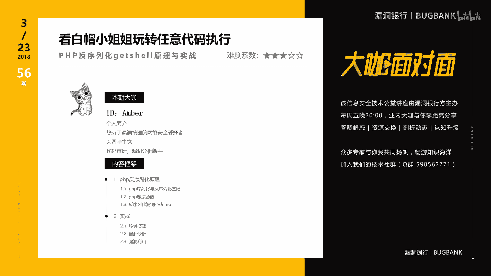

大家想不想知道，Amber喜欢什么样的小哥哥，为知识而存。

因技术而生，小伙伴们大家晚上好，欢迎参加漏洞银行信息安全技术讲座，大咖面对面，今晚是咖面的56期，我是主持人年念，本期我们请到了白帽子小姐姐Amber，给大伙带来技术分享，本期的主题是。

看白帽小姐姐玩转任意代码执行，PHP反序列化该事原理与实战，在演讲过程当中，小伙伴们有什么问题都可以随时提出，Amber会在演讲结束后的行长问答环节来解答，今晚的大咖资讯环节会选出一位幸运观众。

送出小姐姐挑选的代码审计，企业及web代码安全架构一本，那话不多说，下面有请大咖Amber，带我们玩转PHP反序列化，好，大家好，我是本期的大咖Amber，一个热衷于漏洞挖掘的网络安全爱好者。

目前在学习代码审计。

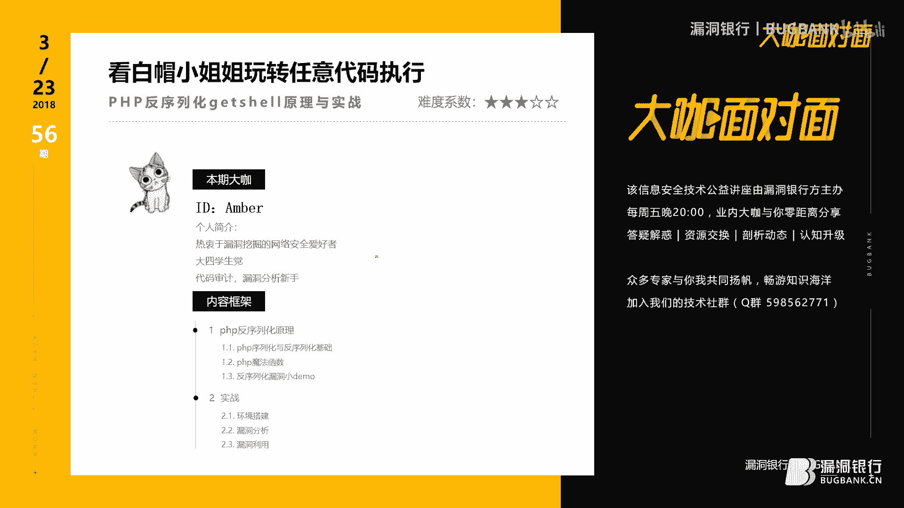

以及漏洞分析这一部分的内容，今天我分享的主题是，PHP反序列化漏洞原理及其实战，本次分享主要分两个部分进行，第一部分我会介绍一些与PHP反序列化，漏洞有关的一些基础知识，第二部分则是有一个实战的环节。

想要知道什么是PHP反序列化漏洞，我们就必须先要知道什么是序列化，以及什么是反序列化，简单的来说，序列化就是将一个变量，转换成一个字符串的过程，而反序列化则是将我们序列化后的字符串。

再把它转换为原来的变量进行使用，PHP对于序列化及反序列化，提出了两自定义了两个函数，一个是serialized这个函数，另一个则是unserialized这个函数。

PHP进行序列化的目的是为了保存一个对象，把它保存起来，然后方便以后进行可以重用，既然说到了保存一个对象，我们需要先知道什么是对象，在了解对象的概念之前，我们需要先明白什么是类。

对于类我们有一个很经典的解释的例子，说我们可以把人想象成一个类，我们人有姓名，还有年龄，这些则是人这个类的一些属性，我们人会吃饭睡觉以及打抖抖，这些则是人这个类的一些方法，在对象就是对类进行实例化。

在右边的这个例子中，可以看到我创建了一个person类，在这个类中我们定义了两个标量，还定义了一个information的方法，在二次行代码中，我们可以看到我们创建了PER这个对象。

并对我们person类进行实例化，接下来做了一个复制操作，这里我就以自己做了个例子，但是为了不暴露我的真实年龄，这里我就暧示设为了18，毕竟可爱的人永远18岁，在座的各位一定也都是18岁。

在24行中我们又用PER对象，去调用了类中的一个information，这个方法，在这个方法中，我们可以看到有一个输出的操作，所以当我们访问PHP运作界的时候，它会有一个输出的结果。

知道了什么是对象之后，我们就需要先了解一下PHP是如何使用序列化函数，以及如何使用反序列化函数，PHP序列化用到的是serialize这个函数，我们还是用刚才的那个例子。

在22行中可以看到我们对PER这个对象，进行了实例化，并将我们的实例化的结果进行了输出，在左边我们可以看到我们的输出结果，在这个输出结果中，我们可以看到序列化一个对象之后。

它会保存我们这个对象所对应的类的名字，person，还会保存这个对象中所有的变量，但是需要注意的一点是序列化一个对象之后，它并不会保存我们这个对象中的方法。

PHP反序列化用得到的是一个on serialize这个函数，我们反序列化一个对象，这个对象的类必须是我们事先已经定义过的，在右边中我们可以看到我们已经事先定义了一个person类。

在18行看到我们使用了反序列化函数，将我们上一步得到的序列化的结果对它进行了反序列化，反序列化之后我们就可以继续来使用我们的person类中的一些方法，这里调用了information。

可以看到这边有输出结果，说起PHP反序列化漏洞，我们就不得不提一下PHP的魔法函数，PHP类中定义了一些魔法函数，这些魔法函数可以在脚本中的任何地方，最主要的是这些魔法函数我们不用声明就可以进行使用。

接下来我将介绍6个与PHP反序列化有关的重要的魔法函数，小伙伴们拿出你们的小本本快快记下来，我们介绍第一个PHP魔法函数是construct函数，魔法函数是当我们创建一个对象的时候，它会被自动调用。

当我们销毁一个对象的时候，则会触发destruct函数，sleep以及workup这两个魔法函数是当我们使用，序列化函数以及反序列化函数的时候，会自动触发，当我们把一个类当作字符串使用的时候。

就会自动的触发toString魔法函数，当我们从一个不可访问的属性中读取数据的时候，又会触发get魔法函数，既然知道了这些魔法函数的触发条件，接下来我们来看一个魔法函数的例子。

在右边这个类中我们可以看到，我们自定义了一个toString函数，还自定义了一个construct函数，还自定义了一个destruct函数，在24行中我们创建了PE21这个对象。

并对person这个类进行了实例化，我们知道当创建一个对象的时候，我们的construct函数则会被自动调用，所以在输出的第一行中，可以看到我们的construct函数被输出。

在27行中我们又把一个对象作为一个类，我们把这个类又作为一个字符串，来进行了输出，你知道当类当作字符串使用的时候，则会自动的触发toString函数，所以我们在第二行中可以看到。

我们的toString函数被输出了，所以当我们的对象被销毁的时候，则又会自动的触发destruct函数，所以这边是PHP魔法函数的一个实例，知道了什么是反序列化，还知道了什么是PHP的魔法函数。

下面我们理解起来，反序列化漏洞就比较容易了，PHP反序列化漏洞又称为对象注入，它可能会导致一些比如说注入，或者是远程代码执行等一些安全问题的发生，那么一个PHP反序列化漏洞，究竟是如何产生的呢。

比如说我们写了一个PHP代码，在这个代码中我们创建了一个类，我们把这个类叫做A，有一个类A，在这个类中，我们可能会自定义一些魔法函数，比如说我们在这个类A中，自定义了一个construct的魔法函数。

在这个魔法函数中，我们会有一些操作，也有可能我们在这个魔法函数中，会去调用类A中的一些其他函数，比如说我们construct函数，调用了类A的一个B函数，所以当我们使用反序列化函数，去调用类A的时候。

construct的魔法函数，则就会被自动的触发，从而执行它里面的代码，如果我们的construct函数中，包含了一些危险的操作，比如说这里面，我们有一个删除文件的操作，或者是读取文件。

或者是有一个输出的操作，而它调用的B函数中，也可能有一些危险的操作，如果这些危险的操作是我们可控的，那么就可能会产生一个，PHP反序文化漏洞了，知道了什么是PHP反序文化漏洞，还知道它是如何产生的。

接下来我们就要去学习，我们如何去发泄一个反序列化漏洞，在发泄这个漏洞之后，我们又要怎么去利用它，比如说我们在代码审计的时候，在一个test5。pip中，我们发现了有这样的一行代码，在这个代码中。

我们可以看到，它创建了一个delete类，在这个类中，我们可以看到，它自定义了一个destruct的，魔法函数，我们知道destruct的魔法函数，是在一个对象被销毁的时候，会自动触发。

从而执行它里面的代码，在这个函数中，我们可以看到，有一个危险的函数，unlike，我们知道unlike会执行文件删除的操作，所以我们的思想则就是，我们能否调用这个类，让它去触发destruct函数。

从而去删除一些，从而去触发unlike函数，来删除一些我们想删除的文件，之后我们可以看到，unlike中间所传递的参数，filename，是public型的，所以是我们可控的，所以接下来我们需要找一个。

我们可控的反虚拟现化函数，让它去调用我们delete类，就是我们找啊找啊，然后在test6。php中，我们可以看到，它包含了我们之前的，这个test的5。php，并且在这个文件中的第15行。

我们可以看到，它有一个反序列化的操作，它调用了反序列化函数，而且最主要的是，反序列化里面的参数，是我们可以控制，它是get型，所以接下来我们就需要，去构造我们的puc，比如说我们已经知道了。

该目录下有一个1。txt文件，我们如果想删除这个文件的话，我们则需要在，如果我们想需要删除这个文件的话，我们则需要用，通过这个参数，传入我们的pilot之后，从而触发delete类。

从而执行unlike这个函数，所以漏洞出发点是在delete类中，所以我们写puc的时候，会定义一个delete类，并将它进行实例化，实例化之后，我们对filename进行复制，filename的值。

就是我们想要删除的文件名，之后我们对它序列化输出，得到了我们的序列化结果，由于这里是反序列化操作，所以我们传入的pilot，必须要先序列化，所以我们这里得到了，我们能序列化的后的结果。

之后我们把序列化后的pilot，然后传入到我们可碰的参数中，当我们访问6。php之后，代入这个参数之后，我们可以看到，有一个提示1。txt被删除，之后我们回到，delete类中，发现我们这里有一个输出。

说1。txt被delete，所以我们的，函数已经执行到了这一步，所以当我们，再次访问1。txt文件的时候，发现我们的1。txt已经notified，所以我们的1。txt，已经被我们成功的删除了。

还有一种情况，我们在代码审计的时候，可能会在test8。pip中，看到了定义了一个rend类，在这个类中，自定义了一个toString函数，在这个函数中，我们可以看到，它有这样的一个参数。

这样的一个函数，在这个函数，我们知道这个函数，可以进行文件读取，所以我们的思想是，我们能否通过调用这个类，然后触发toString函数，从而达到我们的，任意读取文件的操作，所以我们接下来需要找一个。

可利用的反虚化的函数，还需要找一个，能触发toString函数的条件，我们知道toString函数，触发的条件是当一个类，被当做字符串的，使用的时候才可以触发，所以我们需要在文件中找。

于是我们找啊找啊找啊找啊，然后在test9。pip中，我们发现它包含了，我们刚才的test8。php中，然后我们在14行中，可以看到，它有一个反序列化的操作，并且这个参数，是我们所能控制的。

所以我们可以通过，这个函数去调用我们的red类，之后我们可以看到16行，有一个把类作为字符串输出，这就满足了我们，toString函数触发的条件，所以我们可以利用这个文件，来对我们，任意文件进行读取。

比如说我们还想读取，我们刚才删除的1。txt文件，这里会有小伙伴可能会问说，你刚才不是已经把1。txt删除了，为什么还要去读取呢，当然是我用我的小魔法，帮他将它又变了回来，所以我们需要构造puc。

我们漏斗触发是在red这个类中，所以我们需要，创建这个类，并对这个类进行实例化，之后filename设置为，我们想要读取的文件名，之后对它序列化，得到我们的序列化后的pilot，之后我们将pilot。

传入到我们可控的参数中，去访问test9。php，可以看到我们1。txt，已经被，完美的读了出来，通过刚才的两个例子，相信大家已经明白了，什么是php反序列化漏洞，还明白了如何去寻找一个。

php反序列化漏洞，简单的来说，我们去发现一个php漏洞，是先要找一个，可控的反序列化函数，通过反序列化函数，我们去调应一些类，这些类中可能会包含一些，魔法函数，在这些魔法函数中，可能会有一些。

我们可控的危险操作，从而就触发了，我们的php反序列化漏洞，做完了小总结，我们就要立一个flag了，比如说我今天学了，php反序列化漏洞，我要找10个，php反序列化漏洞，做完了知识，分享环节。

就进入了我们到了，我们第二个实战的环节，本次实战环节，为大家讲述的是，type echo是一个博客系统，这个系统中，存在的一个反序列化漏洞，该漏洞是发生在，install。php文件中。

通过我们传入了一些，构造的数据，传入到了参数中，通过参数，我们去让程序，进行了一系列的操作，最后它是由，这个函数，或者是这个函数，来实行我们的任意代码执行，这两个函数，大家应该都不陌生。

可能会执行任意代码，知道了它的出发点，我们则需要，接下来对它进行一个，详细的漏洞分析，既然漏洞发生在，install。php中，并且它是由这个参数，传入的，则我们需要定位到，相应的代码中，在230行中。

我们可以看到，我们传入了，这个我们可控的参数，并将它的值，传给了config，然后在232行的时候，我们看到了，它有一个，实例化类的操作，当看到实例化类的操作，大家就会想到，这里面这个类中。

我们有没有一些，我们可控的，魔法函数，会触发某些魔法函数，这些魔法函数中，有没有，我们可以控制的，一些危险函数，于是我们进入到这个类中，去寻找，在这个类中，我们发现有一个，construct函数。

在这个函数中，我们读取了相应的代码，然后发现，它并没有我们可以直接去，利用的一些危险函数，所以之后我们需要去，换一种思路，说我们能否通过它，来去触发另一个类，而从而触发，另一个类中的，一些魔法函数。

在120行的代码中，我们可以看到，它有一个拼接的操作，把一个字符串和一个变量，进行了拼接，所以我们，会想，如果我们将adapter name，用这个去实例换一个类，这个时候我们变量，就会变成了一个类。

当一个类和一个字符串，拼接的时候，PHP是弱类型的语言，当一个类和字符串，拼接的时候，它会把我们的类，自动的转换成字符串，当把一个类转换成字符串的时候，我们就会想到，它可能会去。

它就会触发一个toString函数，所以我们接下来的思想，是找一个模式去找一个类，并且这个类中有toString的函数，于是我们在文件中查找，在type=fid的类中，我们发现了toString函数。

我们编列了代码之后，发现并没有我们可以直接控制，或者直接利用的危险函数，于是我们对代码进行了分析，之后我们可以看到，这一行有一个，取值的操作，我们知道这个函数这个变量，是通过这个变量，循环出来的。

所以我们在112行，又可以看到这个变量，是我们可控的，所以我们的思想是，我们能否把这个变量，用它去实例化一个类，当我们把它作为一个类的时候，去调用这个secureName，当然我们去调用的类，可能。

它是未定义secureName的，所以当我们去访问一个，不可访问的属性的，数据时，则就会触发一个，魔法函数，get这个魔法函数，所以接下来我们的思想，则又变成了，我们能否去找一个类。

这个类中有get魔法函数，并且get函数中，可能会有一些危险的操作，于是我们在代码中寻找，之后我们在request这个类中，我们发现了有get魔法函数，魔法函数中，我们调用了一个get函数。

我们根据去get函数，可以看到，它进行了一系列的操作之后，又调用了a plain filter，这个函数，之后我们进入到这个函数，我们终于看到了胜利的曙光。

我们看到了call user function，以及我们的IBMAP，这两个可以执行，任意代码的函数，但是我们看到了这里，则就需要去分析，这两个参数，是否是我们可控的，如果这两个参数不可控，则这是一个。

不能直接利用的一个漏洞，于是我们查看filter，看到filter，它是通过下环线filter的值，才串入的，而我们在120行的代码中，可以看到，我们的下环线filter，是一个prevent属性。

意思就是说我们是可控的，于是这个filter就相应的，我们也可控了，接下来我们需要去寻找，这个value值是否可控，在，get函数中，我们可以得到，我们的value值，是通过它来获取的，而在。

代码的一开始，我们又可以看到，它也是prevent类型的，也意思说我们是，我们一个可控的，所以我们filter以及value，都是我们可控的，这里我们就找到了一个，PHP返息原化漏洞，通过这个漏洞。

我们可能会执行，我们的任意代码，之后我们将整个过程，再来理辩，首先我们通过type echo config，来传入了我们，构造的一些数据，让它进入到了，type db，这个construct函数中。

之后又进入了，fade这个类中的toString函数，再依次进入request，这个类中的get函数，这个get函数有，get魔法函数，又调用了get类，这个get类又调用了，openfilter函数。

在这个函数中，我们有这两个，函数实现了任意代码执行，明白了整个漏洞，封起的过程，接下来我们则需要去写，我们的PoC了，由于这个过程比较复杂，所以我们需要对我们的PoC，做一个流程图。

这边有我做的一个流程图，首先我们通过adapter，去实例化这个fade类，从而让它有一个拼接的操作，就是把它作为一个类，作为一个字幕串区，触发我们的fade类的，这个toString函数。

进入到这个函数之后，我们又用到了type=，这个fade类的一个，items这个参数，对这个参数，我们又进行了实例化，让它进入到我们type，request，这个类中的get函数，在get函数中。

我们又调用了get函数，又调用了apply filter，从而执行了我们想要，利用的两个任意，可能造成任意代码执行的，两个函数，之后我们就要对我们的filter，以及value进行复制，比如说我们这里。

则是读取一个phpinfo信息，知道了整个流程图，接下来我们就需要写它的poc了，这边有一个我已经写好了的poc。

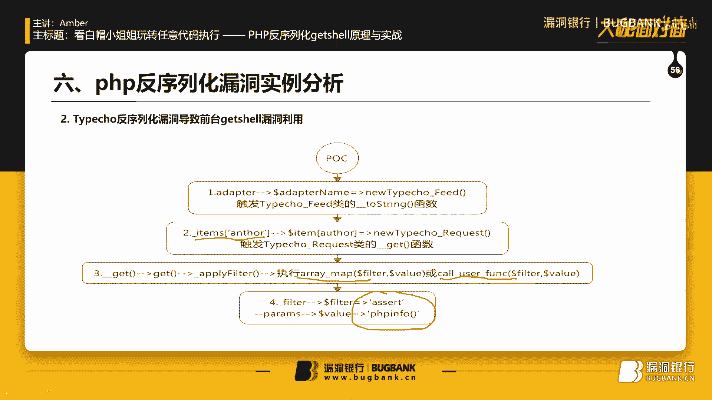

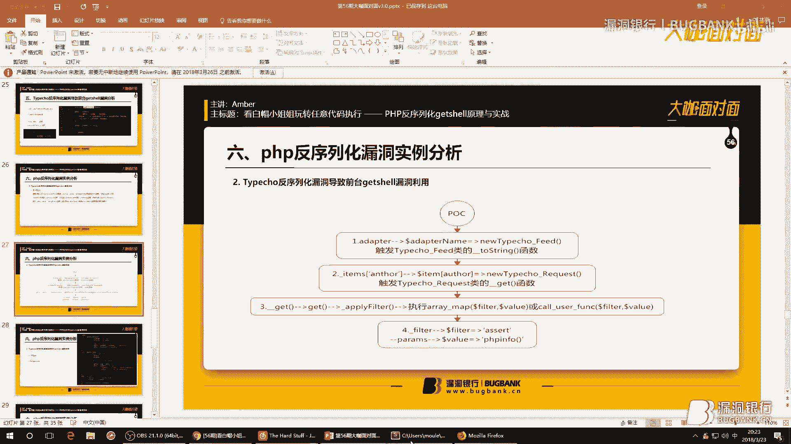

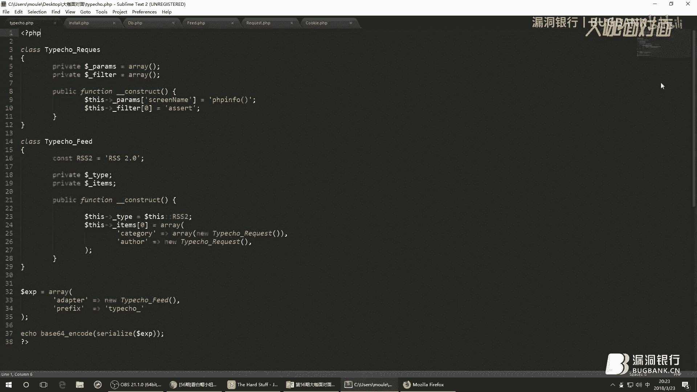

鉴于我的打字速度。

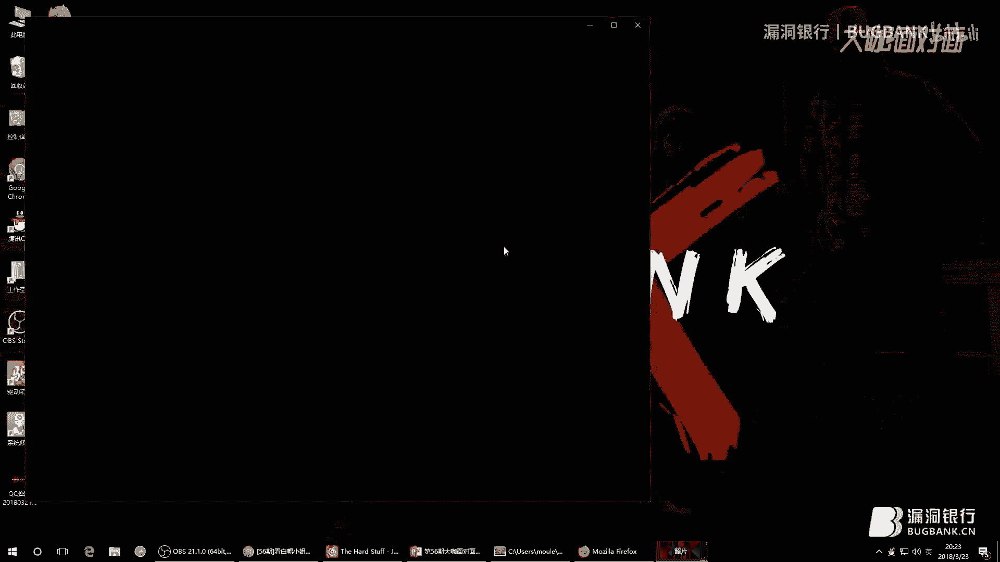

还有待提升，所以我就直接将之前写好的，直接给展示给大家。

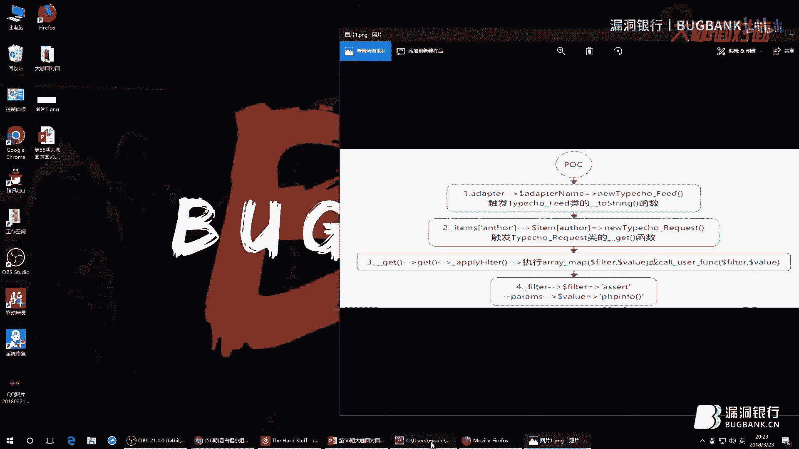

我们对应着这个poc图，来进行写poc，在这边我们先用，adapter，来去，实例化这个fade类，从而进入到这个类中，我们又去对items进行，order进行对它实例化，从而进入到。

type request的类中，进入到这个类中，我们可以看到，进入到这个类中，则需要对我们的filter，以及value进行复制，这里我们做了复制操作，所以整个poc就是这样连写。

之后我们对我们的poc进行，我们的结果需要进行一个序列化输出。

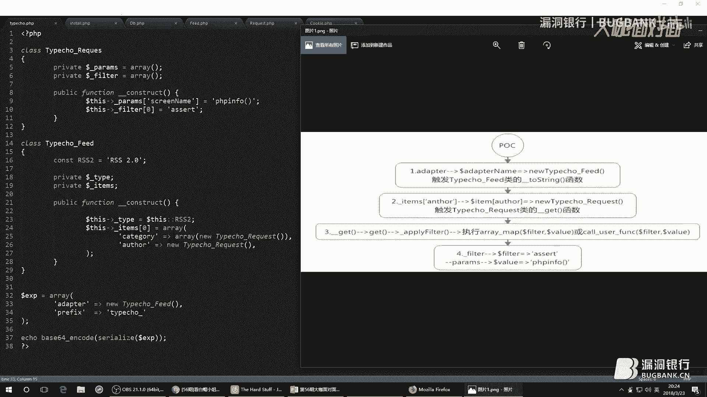

在这里我们在，文件的install的一开始，我们可以看到，我们传入的这个type equal configure，这个参数是进行了，Base64解密的，所以我们的poc需要。

先对它进行一个Base64加密，之后我们则对它进行输出，得到我们的pilot。

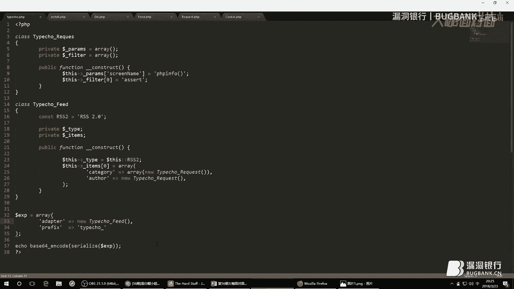

这里我已经将pilot的结果。

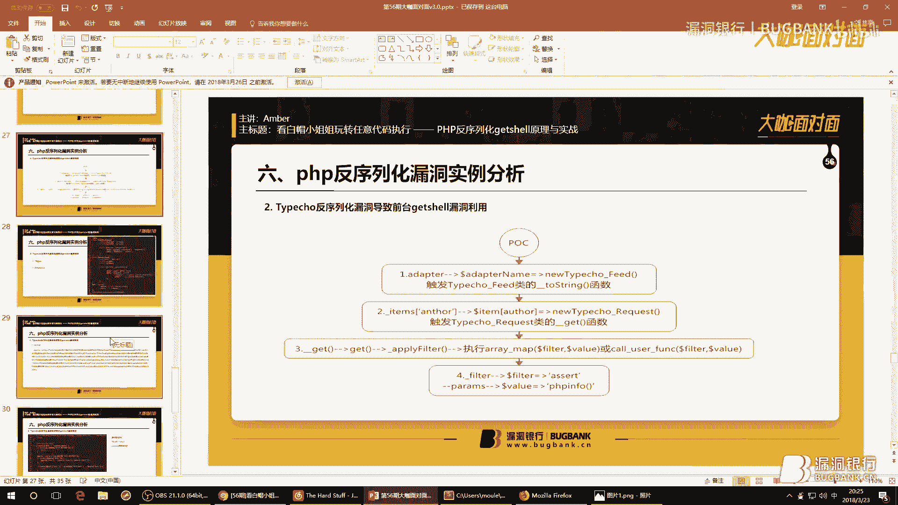

已经粘贴复制到了这里，之后得到了pilot之后，我们就要进入激动人心的，漏洞复现的环节了，在漏洞复现之前，我们需要注意几点，在install。php一开始中，它有一些判断的操作，有一些判断的条件。

比如说有一个条件，是我们的finish，必须存在finish这个参数，它才可以进入到下一步中，还有在64行以及到76行中，它有一个防止跨站请求的一些代码，也就是说我们的referry，必须是本站。

所以我们做漏洞复现的时候，必须满足这两个条件，一个是finish不为空，另一个则是referry。

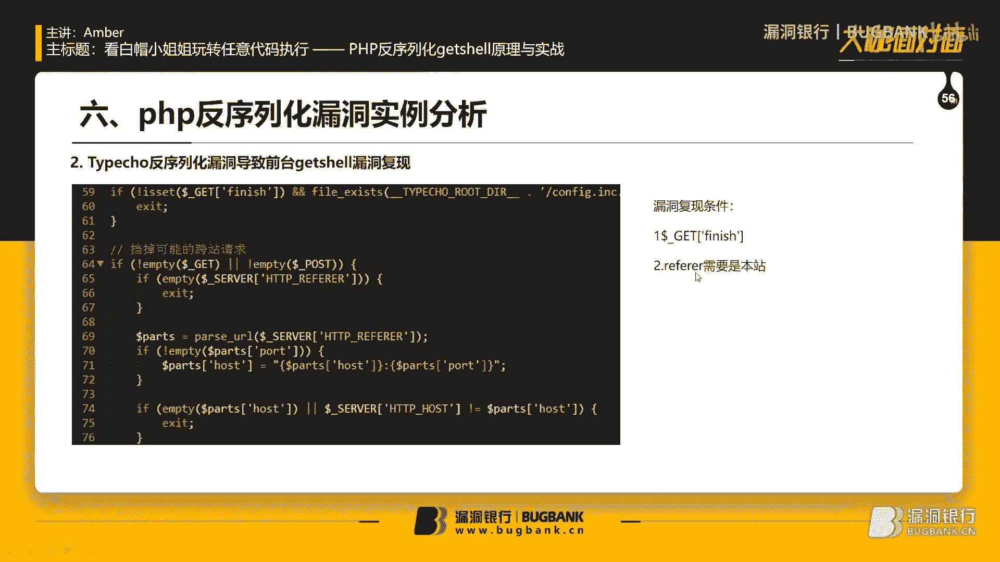

需要是本站的，而且在这个代码中。

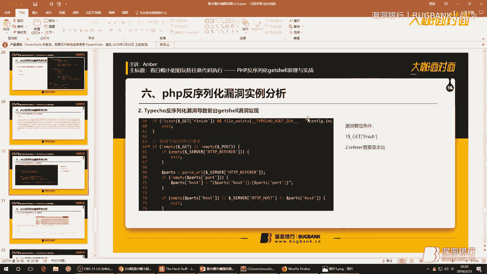

我们可以看到，我们的type=config，这个参数，是通过类的get函数中所获取的，我们进入到类中，去看一下我们的get函数，在get函数中，我们可以看到，我们的参数，不仅可以用cookie传入。

如果cookie中不存在的话，它还会去pulse包中去寻找，所以我们的pilot，不仅可以通过cookie传入，也可以通过pulse来传入，接下来我们进行漏洞复现。

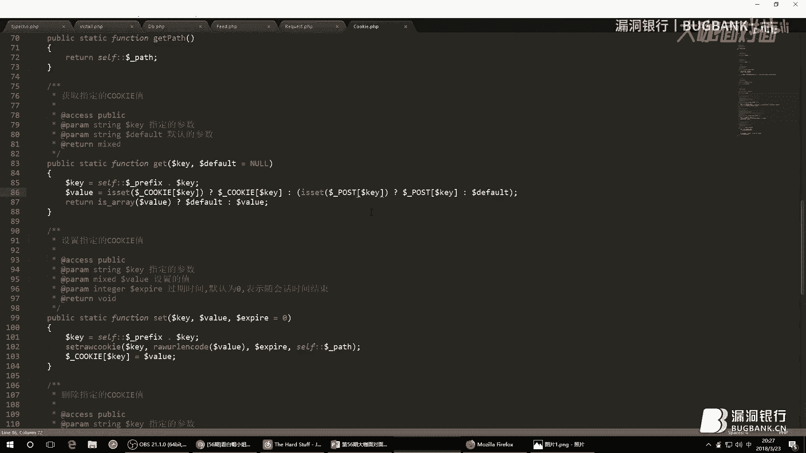

这里已经有我搭建好的一个，博客的一个系统，之后我们就要进行漏洞复现，漏洞复现的第一个条件，是我们的finish不为空，我们这里给它加上finish，之后我们使用一下hack bar，还有一个条件是。

我们必须，我们的referry必须是本站，之后我们对我们的referry进行复制，之后我们就可以在cookie中，传入我们的pilot，好，接下来就是见证奇迹的时刻，到底能不能成功，让我们来发一下。

可以看到我们成功的读取了，PHP info信息，当然我们这里是通过cookie传入的，我们可以试一下用pulse的包，用pulse的传入，咦，怎么没有结果呢，等一下，需要看一下，我们没有给它的参数名。

我们重新粘贴复制一下，之后我们进行发包，可以看到，通过pulse包传入，也是可以触发漏洞的，一般我们做代码审计，或者是漏洞分析，或者是我们在挖洞的时候，到这一步，我们差不多就应该停止了。

毕竟我们都是正义的白帽子，当发现漏洞的时候，当然会想着，马上上交易给国家，正所谓有攻就有防，我们知道了，如何去攻击它，我们就需要学习一下，如何去修复漏洞，既然漏洞是发生在insta。php中。

我们最简单粗暴的方法，就是我们将insta。php文件删除掉，不过像我们这些有安全意识的白帽子，当我们安装一个CMS之后，会自动的将insta。php删除，为了防止被二次安装，还有一个修复建议。

是我们升级到最新版本，在这边我将最新版本的代码段，在右边这边是最新的修改，就是修复后的代码，在左边是我们有漏洞的代码，在左边我们可以看到，我们的漏洞是因为我们实例化了这个类，从而在这个类中。

我们进行了一系列的操作，从而触发了漏洞，可以看到它修复之后，没有直接去调用这个类，所以我们是无法，所以修复后，我们是无法进行漏洞利用的。

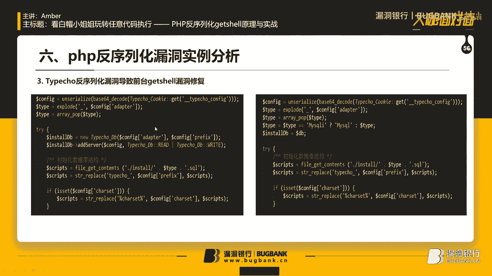

本期的分享到这里就结束了，念念小姐姐。

好，感谢Amber的细心讲解，小姐姐的操作可以说是很炫酷了，大家赶紧从小姐姐甜甜的声音当中清醒一下。

下面就到我们行长问答环节，大家在听讲过程当中，没有听懂，或者是实际测试当中，碰到的问题都可以提出，Amber小姐姐会给大家耐心解答，小伙伴们抓紧时间提问，曾叔再向大家招手了，PHP代码审计中。

如何快速的查找返息漏洞，这个问题，我们做代码审计的时候，会有一些代码审计的工具，我们可以利用那些工具进行全局搜索，则就可以快速的定位到一些，反序列化的函数，从而我们得到序列化函数之后。

再进行一系列的分析，这种方法是比较快的，对于反序列化漏洞的防御，我们还是，先，对于反序列化漏洞的防御，我们还是，最好的防御方法，当然是如果我们有反序列化漏洞，则需要从代码中去，修改，当然。

如果我们为了防止防御手段，也可以对我们的输入参数，进行一些判断，渗透测试中，有没有高效检测，反序列化漏洞的方法，我觉得一般，黑盒测试的话，就是很难去发现一个反序列化漏洞，一般是进行白盒，就是需要看代码。

才能，发现一个反序列化漏洞，高效检测反序列化漏洞的话，我们可以直接去全局搜索，有没有我们可控的，反序列化函数，通过这个函数，我们去寻找，有没有一些我们可要用的类，这些类中，有没有魔法函数。

是有一些危险操作的，这些危险操作的函数，又是是不是，又是是否，又是我们所能控制的，PHP代码升级有什么好的工具，有什么实际的建议，现在差不多还是一个代码，审计的新手，对于工具也不是用的特别多。

我现在主要用的是一个SEI，那个，应该是SEI这个漏洞的一个，就是一个PHP审计的一个工具，一般反序列化函数，都只能本地出发吗，我这个是因为是本地搭建的，如果是别人的搭建的网站，当然你也是可以出发的。

不一定是要在本地，PHP反序列化，PILOT是通用的，我们的，我们PHP反序列化漏洞，是我们需要去调用一些类，当然，这些PILOT的，当然不是通用的了，因为我们需要去，实例化不同的类，要根据具体的情况。

去构造具体的PILOT的，序列化在哪里出去，概率比较大，我们知道，序列化和反序列化，序列化是将我们的一个对象，保存起来，而反序列化，是将我们的对象又进行了，将我们序列化后的字幕串。

又把它变为边量进行使用，所以出现概率最大的地方，当然是有反序列化函数的地方了，灵活控制，这个是可以减少的，因为我们使用反序列化，函数的，条件是我们需要先把它序列化，所以它是有序列化之后的结果。

是有一定的规则的，所以我们可以通过控制用户的输入，来减少反序列化漏洞，序列化漏洞，一般会在什么情况下触发，反序列化漏洞，一般是我们找到了一个，我们可控的反序列化函数，并且在这个函数中。

我们可能去调用了一些危险的类，在这些类中，如果有一些危险的操作，则就会触发一些反序列化漏洞，柯德程序出现的反序列化漏洞，很多还是类似商城，论坛之类的，虽然能写出很多，博客和论坛一般可能会都会有，主要是。

主要还是要看程序如何写代码了，还有最后一个问题，反序列化漏洞，一般会在什么情况下触发，反序列化函数漏洞，触发是由于我们使用的，AnswerLine，反序列化函数，反序列化漏洞，反序列化，漏洞，通过函数。

一般会是在一些我们可以自动触发的，一些，这就是魔法函数中，一般会在这里面触发的条件下，比较多，一般来说，反序列化漏洞，还是不好利用的，所以一般反序列化漏洞不是特别的多，就博客和论坛一般来说。

还是注入的漏洞比较多，反序列化漏洞，产生的原因和PHP本身没有关系，是因为我们写了的代码中，可能会触发，我们的一些逻辑，可能会触发反序列化漏洞，和PHP本身语言是没有关系的，主要还是代码的问题。

程序写的代码的问题，跟我们PHP这个语言是没有关系的，还有问题吗，小伙伴们还有什么问题，抓紧时间提问咯，好，感谢Amber小姐的解答，也给小伙伴们积极的听讲和认真的提问，点赞。

下面就进入到我们大开赠书环节，究竟今晚谁能获得小姐姐的青睐，获得这本代码审计，企业级web代码安全架构呢，下面就有请Amber小姐姐选出，本期的幸运观众，好书要赠有缘人，接下来我来选一选有缘人，好。

看一下，还有问题的小伙伴，可以在直播过后找小姐姐，对吧，私聊沟通或者在群里沟通都可以的，大家都很热烈的想要这本书，这个吧，叫哈娃，她提问的最多，叫什么，哈娃吗，应该叫哈娃吧，名字有点怪，好。

那小姐姐请她收一收，好，恭喜这位哈娃小伙伴，对，恭喜你获得这本代码审计，企业级web代码安全架构一本，那需要你在直播间相应的区域，留下正确的收获信息，我们会尽快将书籍寄出，那今天晚上Embr小姐给大家。

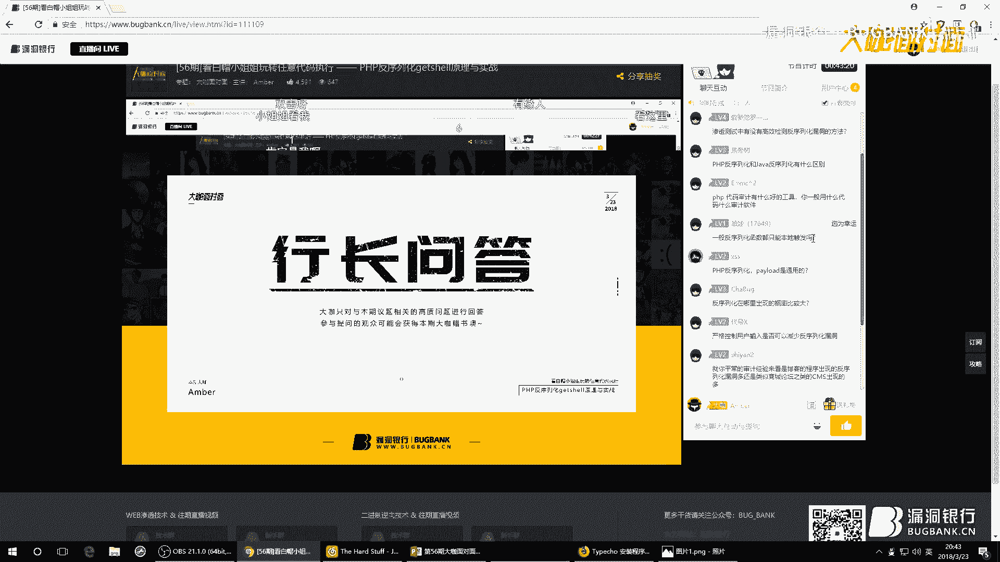

一展白帽小姐的风采，出得厅堂下得厨房，挖得了漏洞上得了咖面，那绝对是霸气十足，那你们想不想也来一次咖面，一展风采呢，千万不要错过和小姐姐，切磋交流的机会哦，那我只能帮你们到这了。

今天的咖面到这里也就全部结束了，再次感谢Embr小姐的认真准备，也感谢小伙伴们的积极参与，大咖面对面周五八点见。

下周晚同一时间我们不见不散吧，为广大单身男同胞某一个福利吧。

大家想不想知道，Embr喜欢什么样的小哥哥，小哥哥的话，嗯毕竟我还是一个技术控，所以喜欢那种技术比较好的小哥哥，当然，希望他也来一起上大咖面对面，嗯我觉得可以的，是不是小姐已经向你们抛出橄榄枝了。

你们要抓紧机会好不好，来上一下我们的大咖面对面，对吧，然后呢，还能跟小姐在同一个讨论桌面沟通技术，没准交流着交流着然后就，对吧擦出什么别样的火花，也没有什么，才艺可以给大家展示一致。

要不然我给大家唱首歌吧，我觉得可以，大家想听小姐唱歌吗，嗯，好唱什么，嗯给大家唱一首小西域嘛，小西域，我相信你会把那个我们的一键关一下，下面呢我为大家带来一首小西域。

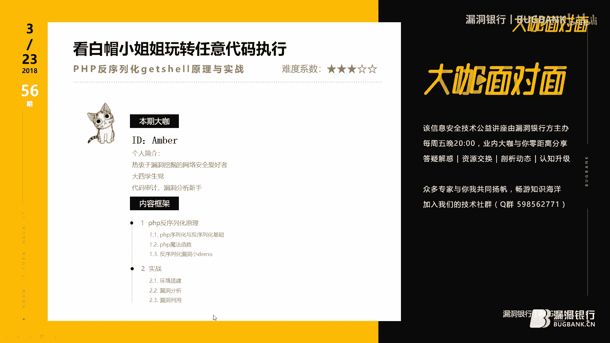

所以请小伙伴们拿出你们的瓜子，西瓜小板凳速速来围观，曹轶薇 (Live)，我听见雨滴落在青青草地，我听见远方香客钟声响起，可是我没有听见你的声音，认真呼唤我姓名，爱上你的时候还不懂感情。

离别了才觉得刻骨铭心，为什么没有发现遇见了你，是生命最好的事情，也许当时忙着微笑和哭泣，忙着追逐天空中的流星，人理所当然的忘记，是谁风里雨里一直默默守护在原地，原来你是我最想留住的信誉。

原来我们和爱情曾经靠得那么近，那维护对抗时间的决定，那陪我淋的雨一幕幕都是你，一场不染的真心，与你相遇好幸运可我已失去，为你泪流满面的权利，但愿在我看不到的天际，你张开了双翼，遇见你的注定。

他会有多吸引，好今天的歌曲就到这里了，好棒好棒好棒，鼓掌，超赞超赞，大家都说会唱歌的小姐姐就是棒，还好还好还是有一点点文艺不全的。

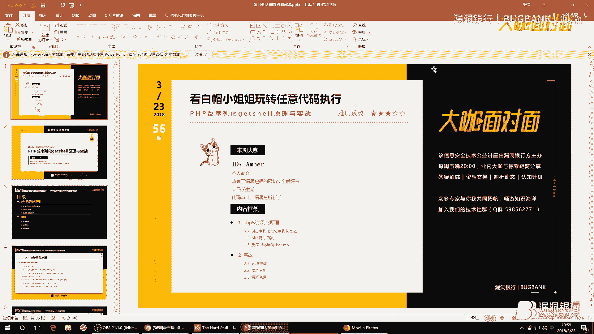

好，好，好，好，好。