# 漏洞银行丨RFID射频技术与实战解析丨咖面54期 - P1：54【录屏】打开RFID Hacking攻防的大门——RFID射频技术与实战解析-54期大咖冰尘 - 漏洞银行BUGBANK - BV1ct41187ux

為知識而存，因技術而生。

小夥伴們大家晚上好。

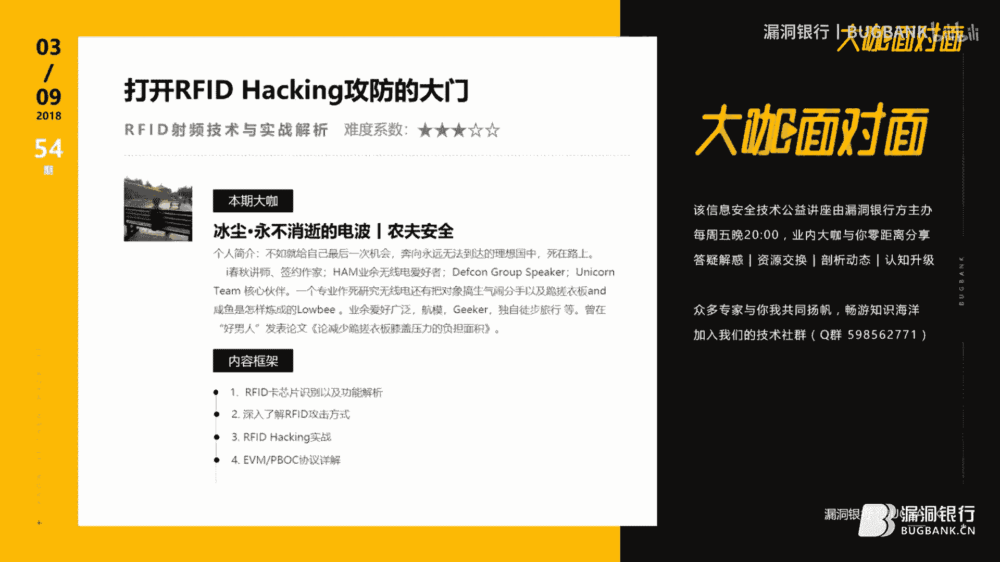

歡迎參加漏洞銀行信息安全技術講座，帶咖面對面，今晚是咖面的54期，我是主持人年念，本期我們請到了朋友和謎底遍地的大咖丁程，給大家帶來技術分享，本期的主題為，打開RFID hacking工坊的大門。

RFID 射頻技術與實戰解析，在演講過程當中，小夥伴們有什麼問題都可以隨時提出，大咖會在演講結束後的行長問答環節來解答，今晚大咖散數環節還會選出一位幸運觀眾，送出大咖挑選的硬件安全工坊大揭秘一本。

那話不多說，下面請出大咖丁程，今晚就讓我們Hack and Roll，嗯好了十分有幸啊再來沒開二錄，嗯其實就是說今天高興嘛，就大家就是說十分有幸，來聽我這條鹹魚，就是已經鹹到發霉的鹹魚，來講段子啊。

因為我講課可能峰哥大家都知道就是講段子嘛，就是冷不丁的抖個包袱。

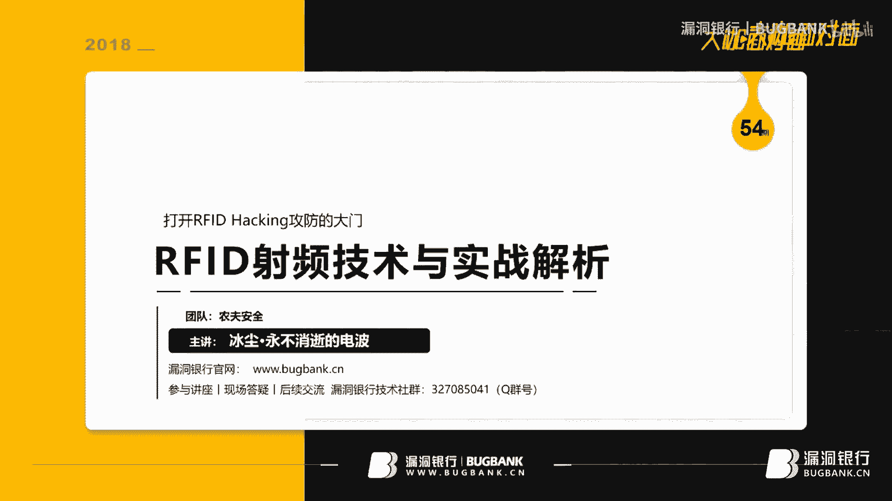

所以說我們開始吧，那首先來看一下就是說關於我吧，about me，然後我是就是說這些頭銜什麼都不重要，就是說重要的在於我天天跪搓衣板，然後還是沒跪好對吧，然後業餘愛好比較廣泛吧。

比如說航模呀無人機無線電，然後gay客，然後自己平常獨自徒步旅行，然後去參禪是悟道什麼的，反正就是我比較我是佛性的一個人，然後就是說我們今天來看一下摘要吧，然後內容框架。

首先第一的話就是我們首先要了解就是我，我講課一般會有遵從一個主旨，然後就是我希望大家就是能了解原理之後，能把原理深入到實戰裡面，然後開一個好的引子，然後剩下的事情是交給你們去解決的。

然後本來今天我打算是就是說把題目，我一會開開可以連，但是我害怕有人給我搞破壞，所以說我就不放了，我一會可以給大家演示實戰演示一下，然後內容框架首先第一個就是說是我們要識別如何識別芯片卡。

然後就是說各種各種芯片卡的類型種類，還有他的協議通訊協議怎麼去解析，然後第二種的話就是說是第二第二解第二小節的話，就是我們去講就是說RFID的一些攻擊方式，然後就各種的攻擊方式還有攻擊套路。

以及就是說一些其他的一些東西，第三個就是我們開始進入實戰環節，然後我會弄一張用兩張卡來舉例子，然後來給你們演示一下，就是說如何去就是說是對數據進行修改和中繼操作之類的，然後。

第四個的話就是EVMPBOC協議詳解，但是這個EVMPBOC詳解可能各位不太清楚是什麼，但是我一說銀行卡可能各位都知道，對閃復Quick Pass有Quick Pass的卡。

然後我們就可以用它來進行一個模擬，就是說是我們來對他進行讀取裡面的消費局額，然後開戶行，然後消費卡類別身份證姓名之類的，然後我們來進入正題。

然後首先我們來做一個十分，不正經的聲明，就是說你搞這些東西的搞無線電，首先再給各位強調一遍，你得考證，你不考證你會很麻煩，就是說就是搞，如果你要搞發射的話，你接收的話，你無所謂，你買了對講機接收接收了。

因為在國家規定，你拿對講機手台都是要就是說你要考證的，考什麼證呢，無線電就是業餘無線電操作證，這個證請聯繫當地的無線電管理局，或者說加一些HUM論壇，就是HIM火腿論壇去或者火腿QQ群。

去找你當地的那些無線電管理協會去聯繫，然後每年的三月份和十二月份會考試，還有六月份也會考試，然後考的話，這是這是一年好像會考三次考兩次一年考兩次，然後這個是考的是A罩，A罩的話就是說你擁有了一個有手台。

就比如說手咪的那個操作，比如說就說是U微波段下的操作，然後當你拿到二級證的時候，你就可以進行微波段操作，然後就是U微波段的另外一個波段操作，然後我們接下來的話可以進行短波操作，C罩短波操作。

然後C罩也是最少的，所以說好過不好過這麼說吧，就是說25道題你要答對多少道題，30道題你要答對25道也行，就是選擇題ABCD在電腦上做題，然後當然就是說發生什麼事情你跟我無關，別說是我教你們的也行了。

就是這個東西你們要是想讓國家包吃包住的話，請大膽舉起你的右手跟我一塊喊，不要慫就是上，這麼蓋緊額，中繼，DX爆破，然後，千套認證，然後都是一把縮，縮哈縮哈，我學了這麼多技術就是為了裝一個X。

不裝X和響應有什麼區別，然後你當然這是純屬在扯大，你要是想下海幹活，然後讓國家包分配包吃住，然後還給你保障房的話，那你就上，然後分了你自己把握，反正老子無所畏懼，然後，所以說就是我說的都是反話。

你們自己掂量，然後就是說我們先來看一下，就是說是很多人都說RFID就是磁卡，說是消磁怎麼樣的，然後，你們要是說消磁這是不存在的知道嗎，因為RFID它裡面就是一個芯片，它裡面屬於一個就是微型計算機。

它是一個芯片，然後它裡面是一個控制單元，它並沒有磁，它什麼磁都是不存在的，它裡面就是一個線圈，然後我們可以看這款，就是說這是一個閱讀器，它裡面各種的就是單片機編碼什麼的，然後它通過天線來發射一個能量波。

正常情況下，正常情況下我們可以看到這裡，就是這是閱讀器，這是芯片，然後，正常情況下如果先畫一張卡，它卡裡面你們可以拿到，隨便拿一張你們的那個就是RFID卡，IC卡可以放到那個檯凳底下看。

它裡面是有一圈又一圈，一圈又一圈，一圈又一圈又一圈又一圈又一圈又一圈的，一個芯片，它裡面準確說是這樣的，就是一個正方形，然後裡面又一個正方形，就這樣一圈一圈一圈的就這樣一圈，它裡面是有一個芯片。

這樣的一個芯片在這塊，然後這是它的，這是它的那個東西，然後就是說我們前就是已經上過初中的人可能都知道，就是電流切割磁感線，就當我們的電源，就比如說當我們的卡，它這個線圈發射能量之後，它補貨。

然後給這個卡進行供電，就是說進行一些相關的一些對EPROM進行一些讀寫操作，然後這個時候我們就是會有一些東西，就是知識點就出來了，大家做筆記，然後筆記什麼呢，就是說什麼是有源卡和無源卡。

現在市面上有很多卡都是有源的和無源的，然後什麼是有源卡呢，簡單區別一下就是有電沒電，什麼叫有電沒電呢，你就像咱平常的那些飯卡，它是無源卡，為什麼呢，因為就是說它是不需要就是直接供電源的。

比如說我必須要往上接電池什麼的，然後但是有些比如說就比如說有些這些基礎知識，可能就是對新手來說可能很很蒙逼，然後我就給你解釋一下，老就是各位大佬啊什麼的，我知道今天晚上可能有一些老前輩可能會過來捧場。

所以說老前輩見笑了，然後就是說我這個人就給他們簡單解釋一下，然後像我這種lowb還請我無視，然後，就是說你無源的話，就是說我沒有直接供電的東西，我是通過間接性的，比如說像剛才那種就是IC卡這些。

它是無源卡，當然也有那些有源的ID卡，比如說插了電池才能用的那種的，就這麼簡單就得再說吧，就是比如說是，陽青前輩他們的那個就是那個hackID，他們用的那個模擬狀態就是有源卡，因為他們用了內置供電。

他們用來就是寫芯片來進行操作，然後，正常情況下就是說，你看我們來看一下這邊吧，這個是比較官方的一個解釋，就說我們發射特定頻率的視頻信號，比如說IC卡的話是13。56兆，13。56兆赫茲，無線電頻率。

然後ID卡的話，一般的話有很多，但是一般125K，低頻125K赫茲，這個我們一會會後面會講到，現在先不講了，要不然我打點節奏，然後就是說比如說，就是我們這樣發射出去的就電波，然後它產生了感應電流。

就是切割磁感線產生感應電流，然後激活，然後來給他供電，然後他調整信號，然後再返回，然後識別，然後進行消息的操作，然後就是我們再來講一下，就是RFID卡的分類吧，然後很多人都並不知道。

就是很多卡什麼分類什麼的，但實際上就是剛剛才那個，給我來了一句那個什麼卡，剛才那個哥們給我來了一句，那個什麼卡來著我忘了，反正就是那個4K的，MateFire 4K的卡，4K的DS Fire的卡。

DS Fire的卡實際上它就是高頻的，那個13。56兆的，它走的是ISO，這個後面有說，13。56兆，它就是高頻卡，然後我剛才一看我懵逼了，你要說的細細詳細的話，可能有點懵逼，然後，就是說低頻率的話。

就是說是比如說，可能各位可能見過的ID卡，就是那種帶很厚的那種的，然後它是工作頻率，它一般被定義為100K，100~500K赫茲，然後感應距離非常的短，然後但是速度也比較慢，但是它穿透性非常好。

比如說你隔上一個一層布，或者一件衣服什麼的，它能讀出去，然後就隔一件很厚的衣服，隔一本書什麼的讀出去，然後，但是高頻率的話，就是說比如說它你看這個時候，我們看就翻了很大一個，翻了很大一個數。

它直接到兆上面了，我們從K到兆上面了，然後就是從10~15MHz，但正常標準的話是13。56MHz，再重申一遍13。56MHz，這個的話是125K，然後讀取速度也比較快。

然後就是Methier系列和UID系列卡，還有就是說是銀行卡的EVM通訊，然後我們平常說的NFC，NFC，還有很多人會問，NFC和RFID到底有什麼區別，我現在很明確的告訴你，NFC它應該是13。

56MHz的，下面的一個東西的，統稱為NFC，還有的話就是說，還有超高頻率的，比如說就是說是850~950兆，還有就是甚至是2。45G的，這估計可能都跟WiFi一樣，然後這種情況下的話。

感應距離是最長的，然後速度最快，然後穿透性也比較差，因為為什麼大家可能就是腦補一下，就是說5G信號的穿牆效率，和那個什麼穿牆效率，它肯定是不一樣的，可能無線電波裡面有一個法則，就是說你波長越短。

它的穿透性，就是你可以自己這樣看，它裡面就這樣的，它是一個就是一個三頁函數一樣，然後，我們常見的ETC用的就是這種超高頻率的卡，還有就是停車場，現在很多停車場用的ETC，或者什麼都用的這種卡。

然後我們現在接下來看下一個，就是說這是MAYFARER系列的卡，你看我們它的線圈就長這個樣子，嚴正聲明一下，教你們去怎麼識別一張卡，最簡單的方法就是把一個把這張卡，放到強光手電底下，要麼把它放檯燈底下。

看裡面的線圈形狀，線圈形狀如果是正方形的，它就是13。56兆的UID卡，或者說是，要麼就是說是MAYFARER系列的卡，然後就是說它用的是ISO1443A的協議，然後14A簡稱14A。

就我們常常說的14A協議，然後MAYFARER卡片裡面根據卡裡面芯片不同的話，有很多種區分方式，你像，剛才你看就是MAYFARER，就是，UL-TiLite，然後比如說是MF0的。

然後還有S50 S70，然後還有MAYFARER PRO，然後還有就是說DS-FIRE MF3的，然後就是說MF1K的話比較常見種類吧，然後就是說13。56兆核子，然後這也是再重申一遍。

我們今天的實戰主要就拿這個最簡單的，就是MAYFARER 1K的來進行講解，然後為什麼呢，因為這個漏洞已經被玩爛了，其實說句實在話，我有點偷懶，為什麼呢，我PPT拖了很久，然後所以說我就沒寫其他的。

我就只是給你們做個引導，然後，還有就UID卡，UID卡的話怎麼說呢，就是說比如說我們已經知道，比如說我們知道就是說，UID卡就是我們已經知道MAYFARER卡了。

這個後面我們會講到就是UID卡和MAYFARER卡的區別，就是它是一種，它也是一種IC卡，但就是它的卡可以修改任意扇區，而MAYFARER卡它裡面的那個快速，它裡面頭一塊，它裡面是一個硬編碼。

就跟麥克地址一樣，它是被鎖死的，它是不能改的，它是不能改的，所以說，所以說就是說它不能改，但是就是UID卡它是可以的，它裡面可以修改任意卡號，就是說我裡面任意的我ABCD都可以往裡面填，然後。

就這個卡片是可以完全兼容就是就MAYFARER 1K的，然後而且就是說它可以直接就是通過MAYFARER機器來讀寫，沒有任何的區別，可以可以說基本上沒有任何的區別，然後，還有就HID卡。

HID卡大家可能見過就長這個樣子，這個5577的卡我不好給你們展示，一會兒可以給你們，一會兒給你拍張照給你看一下吧，一會兒打野的時候我順便給你拍張照給你看一下。

就這種厚的這種看就這種又厚又厚又厚又厚的這種，它的卡的裡面的線圈形狀是很粗的一個線圈，是橢圓形的，橢圓形的一個線圈，然後這樣這樣這樣這樣這樣這樣這樣這樣這樣，它裡面的卡，它裡面的話是有就是說。

它這個卡是已經攻擊方式已經被玩爛了，最開始的時候就企業門禁打卡什麼的都是這樣，然後，高中卡這個範卡很厚嗎，一會兒我會給你講這個東西，應用方案解讀，我一會兒給你解就是專門我今天晚上專門想到這個問題了。

之前有人跟我問我專門去研究過這個東西，所以說今天晚上我會把這個東西全部給你們講一遍，然後我們先忽略這個問題，然後先就是說，我看5577吧，5577卡的話，它裡面是一張很薄的一張卡。

就是跟我們平常的那個常見的那種就是沒法卡是一樣的，就是很很薄，它裡面沒有很厚，它裡面有線圈的常見形狀是正圓形的，就是就是一個圓，它裡面一個很圓的一個圓圈，然後當然就是說一般的話。

還有那種比較變態一點的卡，他為了裝像這種雙向的什麼的話，它裡面會有一個5577的線圈和一個UID的線圈，它是混合卡，有這種混合卡的有這種混合卡，先說一下有這種混合卡，你要是想區別的話。

其實真正的你要想區別真正就可以就是拿手電筒，強光手電，要不扔檯燈底下，把它對著檯燈底下一看，你就看出來了，然後，當然就是看前面這兩個的話都是13。56兆的，然後這兩個的話是125K的。

然後我們接下來講了這麼多扯淡的，我們來點難的怎麼樣，互動一下來點難的，你們準備好燒腦了嗎，知道一貨一算的當然就是可能大家都知道一貨一算，交易算法實現就是說，他在數據通訊過程中。

可能無線電子隨著距離的增長，那可能會信號可能會失真，導致數據的那個就是說數據的，比如說數據的錯誤啊什麼的，這個時候怎麼辦，我們肯定需要交驗數據啊，對吧，我們傳過去的數據，我們肯定需要交驗的。

就靠我們加個Cystion或進行交驗，就web裡面的Cystion進行交驗，對吧，然後這個時候，我們肯定要交驗，交驗怎麼辦呢，然後我們肯定就出現各種算法，先不要看這個CRC算法，我們先看雷加交驗吧。

雷加交驗可能對各位理解比較，就是說可能比較簡單一點，因為首先看比如說我們要在卡裡面，他比如說就比如說是這是一個交驗算法，這就好比就是說是我們現在要發送，6還有23和4這三組數字怎麼辦呢，我們為了交驗他。

他是不是失真，是不是錯誤的怎麼辦，雷加交驗算法是什麼呢，我們就比如說把雷等等，雷加交驗我們把6加23加4等於多少，然後他裡面會等於33對吧，然後這個時候我們就會把33，就是前面這幾位的交驗總和。

然後我們把這個33附到數據包裡面，變成623433，然後把它發送出去，然後那邊會然後服務端去檢測，檢測他的那個是不是三前面三組數字，相加是不是33，然後來判定就是說這個數據包是不是有失真。

然後這個不知道大家能聽懂了嗎，聽不懂你自己後面翻就是翻重新講吧，就是自己拿個筆算一下就行了，然後，就說如果失真的話，就說如果失真的話，他肯定數據錯誤的嘛，對吧，但這種情況下，大家有沒有想過就是說。

他在就是說是比較簡單，然後但是就是這種單，他對單字階的交易，比如說就是一個字階的交易的話，他可能會有256分之一的出錯率，為什麼呢，因為你自己拿二的就是次方數乘下去，知道了他就肯定會出錯率的。

你自己算一下，然後這個時候怎麼辦，我們可能就會用到一種新的算法，叫做CRC，CRC交易的算法是什麼呢，就是說首先選擇一個合適的除數，然後比如說我隨便規定一個9啊什麼的，然後就是把它變成二進制數。

比如說是1001之類的這種亂七八糟的數，然後就是說是把它變成二進制數，然後就是說就是用新式，就是把這個發送的針上面加這個位數的減一位的零，然後再去形成一個新的那個針，然後再用摩爾除法，摩爾除法是什麼。

可能各位很懵逼，我就這麼簡單說一下吧，就是說它是易貨運算，易貨運算大家都知道吧，XOR嘛，注入裡面肯定有S哥，你別說你不知道，你不知道你可以回家，趕緊就是說是趕緊就是說是回家，就是說是趕緊看看書。

然後學習補一補知識，對吧，然後就是說就是比如說，就是說是然後把它處理上面的除數，然後就是說他就得到就是CRC教驗，然後就是說是，但是你要注意一個，一定要注意一個問題啊。

就是說餘數的位數只比就是除數位數少一位，然後所以說就是說，CRC教驗碼的除數位，就教驗碼的位數肯定會比除數位少一位，所以說前面位是零，也不能忽略的，這個東西值得注意一下，然後還有就是將計算出來。

教驗碼就是構建原數據，在後面，然後構成一個新的數據針進行發送，然後就是說是在接收單以模擬出版方式就是一貨碼，然後就選擇除數，然後如果沒有餘數的話，說明就是說真在傳輸過程中是沒有出錯的。

然後就是說這裡有一個簡單的一個過程，這就好比就是說這個地方，我除以，這塊然後變成了這個樣子，就是說看就是他根本思想，就是說在後面附加一個數，然後就這個數據來做教驗碼，就是說這二進制序列的話。

就是說發送給新服務端，然後就是這裡的話，就是摩爾除法摩爾除法就是算術處罰相似，就是說這裡有個詳細介紹，然後這裡是一個失利，就是說CRC一般可以用多項式來解決，多項式的位數為5的話。

就是說你在數據幀後面5-1位的0，然後數據幀變為就是說，5-1位的0，然後就是說這樣，然後摩爾除法，然後你除以就是說就是求一貨嘛，然後你把一貨就是一貨，一貨大家可能都知道嘛，就是銅0一貨嘛，X2。

然後得到餘數，然後這個時候我們就開始抄傢伙，準備上手去做一些，就是說我們想做的事情，就是說其實正常情況下工具選用的話，可能會問工具選用，然後這個我給你解讀一下工具吧，然後就意大利炮你怎麼選。

就是說我們可以根據經濟能力的話，就比如說我今天調侃騰訊會員這件事情，然後，就是說我們有錢的最有錢的可以買，Proxmark3的那個RDV2版本，然後普通的話可以充個超級會員對吧。

然後買PM3或者說是買個變色龍迷你，然後窮苦大眾的話，要只想就是研究普通的那種就是就是14A的卡的話，我們可以買個ACR122U，然後作為工具，然後其中就是說還有注意點啊，這個變色龍迷你的話。

它是用來秀炭的，它只適合用來秀炭和模擬14A的卡，還有就14B的卡，就是13。56兆赫茲的卡，然後，就是說然後就是這個，然後就是說是你這樣的話，就是說嗯，就是說注意就是根據需求去選購一下。

還有就是說是ACR122U，它不能讀ID，它不能讀HID，它不能讀HID和T5577，它不能讀HID和T5577，因為它只支持跟變色龍一樣，它只支持，13。56兆，當然就是說像我這種屌絲。

然後我推薦的話是PM3，價格後面我會說，然後就是推薦PM3的話，肯定是有原因的，因為PM3的槍版的話基本上也很便宜，然後就是說對卡的讀寫，就是說它既能讀ID卡也能讀IC卡，然後像我這種屌絲的話。

可能已經就是超過七顆板子召喚神龍了，因為今天我已經用了四塊PM3來給大家講東西，然後其中還有兩塊定製版的一個RDV2，還有一個是給Radiowire他們團長老前輩他們打個廣告。

淘寶上這個價格應該是在一千塊錢左右，就是這個PM3定製版，我還有RDV2，我今天拿了用了四塊板子，然後還有一塊板子備用的，主要是三塊，就是來可以做個性能測評，可以給大家一會兒就是客戶。

然後就是說預先攻擊是必先立即啟動，對吧，然後變色龍是可以模擬卡的，然後你把固件導入進去就可以了，就比如它裡面會有一個1K的幣文件，你導入進去，然後就是說首先我推的PM3，為什麼就是說，首先大家注意點。

就是PM3淘寶上大多數的槍版都是Radiowire，他們仿製國外的一個那個就山寨圖被露出來了，露出來之後然後抄的，這個抄版裡面天線就是說是讀高頻卡的時候，就是說13代56兆赫茲可能會有問題。

就是具體問題在一些比如說爆破上面的一些問題上面可能會有，嗅探和爆破上面會有一些小問題，但是就是說基本的就是跟你正常的一個入門操作是沒有問題的，然後淘寶的售價我買的時候反正400。

但是我感覺好像我買了兩個月之後，他立馬降到280，我感覺我手好像被他給剁了一樣，然後還有就是說是我們要是對，然後還有就是說我對就是說，你們要是覺得不滿足的話，可以會那個什麼會FPGA編程的話。

我建議你們可以去花上2000塊錢買一個這個，我當然這裡不是在打廣告，不是在安利啊，我只是就是給你們詳細解讀一下這個地方，你們就是輕噴球輕噴，然後就是說這RDV2版本，他是可以就是進行編程的。

然後你比如說可以開發一些自動引擎功能什麼的，然後還有就是更強大一些，然後淘寶售價應該是某寶收價，官網收價應該2000左右，2000人民幣，我這裡都是人民幣，然後也有1400的便宜的山寨版的1400。

然後還有就是說最適合就是最適合就是說，呃，重複大眾我還有就是像我這種屌slow逼的，我其實我還是挺喜歡ACR122U的，為什麼，因為它是我RFID方面我第一入了第一塊板子，然後。

就是說這個板子就是這這幾張照片都是我的照片，這幾這張照片和這張照片，然後還有這張照片，然後這是pm3的RDV2精緻版的，然後這個是槍版的，這是我的ACR122U，然後。

它是就是可能我們經常就是你要會單屏機開發的話，我推薦你們動手能力強一點的，可以買個pm532去自己去開發玩一下，這個真的好玩，要是你要再窮的話，我跟你說一個很便宜的東西，一個Arduino。

我今天晚上就是跟大家來扯犢子的，一個Arduino加一個R2C5R，拿一個R2C5R慢慢玩去，真的可以的，至於思想就是說一會我給大家講到，然後就是說我們現在開始進入實戰攻擊的環節。

就是說先首先我們現在再講一下理論，首先我們來看一下HID關於HID卡低頻卡的攻擊，就是說首先嚴正聲明一下，注意這個圖標，我這個是已經經過養老前輩許可，然後拿過來，這是獨角獸團隊的一個產品，叫HID。

我打一波硬廣告，有興趣的話可以在IC或者Defcon上面去，Defcon的集市上面可以買到這個東西，然後，就是說這樣就是說這個東西怎麼說呢，它裡面就是個單片機，然後它操縱一個天線。

然後你進行輸入HID的卡的卡號，它進行編碼，然後把這個編碼發送出去，然後進行一個模擬，比如說我已經知道一個HID卡號，然後我去把這個HID卡號輸進去，然後就模擬給比如說這是一個黑客A。

我畫一個匿名者可能不太像，然後就是我們來講一下，就是說是關於HID卡的攻擊，然後就是說HID卡的攻擊的話，這是一個黑客A，然後他，拿了一個HID，直到看見對方的卡號，或者說是往周圍他貼了一下。

然後去模擬就是說是讀卡器，讓卡發出射頻信號，把射頻信號抓到解包，然後用這個用這些就類似的設備去解條，然後把它發送給讀卡器，好門開了，然後門開了，這是一種，還有一種的話就是說怎麼辦。

我們可以用web的思想爆破嗎，然後怎麼爆破呢，一個黑客A，這是黑客B，他會爆破他身上爆破怎麼辦，然後就是說我們去，我們去弄一個卡，然後就是在裡面，就是他裡面是就是按這個ID號。

我們把它從就是0000一直到FFF，比如說0000一直到FFF，然後就是他這樣，然後就是一直滾動，按著他那個就是極限的編碼速率，然後去滾動他爆破，我就不相信他爆破不出來，爆破卡號的話。

基本上在三分鐘之內應該解決得了，最長五分鐘，然後，另外一種的話就是說是最簡單的，就是說是比如說就是說是克隆攻擊，怎麼克隆攻擊呢，就是跟單面型模擬卡號是一樣的，只不過就是說是我們，這是一個黑客黑客C。

他去拿了一張卡，這張卡是一個HID卡是空卡，然後他去把這個卡去放到了，HID，卡的，就讀了一張HID卡，然後把這HID卡號寫到這個裡面，然後他這張卡就變成了這個卡的複製卡。

然後這個卡就可以去刷其他的文件，門開了，然後這種情況下的話，當然剛才過去有人問，就是你的飯卡什麼樣的，我有點不可思議，就是說是現在這個年代可能沒有人去再去，用HID的卡去當飯卡了，還有就是說飯卡怎麼改。

我可以說一下，就是這個東西你不要問我，不要說是我教的，我今天晚上就給你簡單透露一下，就是一些應用技術詳解，HID卡它裡面沒有存數據，它裡面只是個ID號，就是比如12345678，你張三李四王麻子這樣的。

然後，然後就是說，然後就是說你比如說，他比如說就是說是一個ID號，這就好比對應著一個令牌，對應著一個令牌，然後我去抓到卡機上面，卡機去給數據庫通訊，就是上位機上位機，然後去找數據庫。

從上位機的數據庫裡面進行通訊，畫個塞口塞口沒畫好，然後就是跟上位機的數據庫進行通訊，然後他去讀寫，進行相關軟件讀寫操作，然後再改數據庫裡的餘額，這是ID卡的一種，如果搭建那種平台的話。

就比如飯卡平台的話的寫信方案，但是這種卡的話容易一個缺點就是說，工房缺點，講工房的話肯定有工具有房，工房的話，這種房可能沒有絕對的防護，因為他不能被改進額是一個優點，但是他一個最顯著的缺點就是。

他太容易被複製了，我張三我拿了李四的，我是張三，然後我拿了李四的卡，我就貼了兄弟，我把他拍了拍他屁股，然後手上貼了一個複製的東西，然後把他一貼著貼，然後回來拿回來一讀，好了恭喜我自己。

我以後能吃他的飯了，他以後抽多少錢，我花多少錢，然後，還有就是說，還有就是說，還有一種最難實現的一種操作，就是說也是比較，就說比較騷的一個套路，然後就是說，你用HID進行中繼攻擊，怎麼中繼呢，我黑客A。

我拿這張我拿這個接收器，接收器，然後他這個是通過一些其他的通訊，然後用遠距離傳輸，比如說4J，還有就是JSM之類通訊，然後把數據包，這邊有黑客B，這種攻擊基本上適用於所有的NFC卡，或RFID卡。

對手機距離不夠，距離不夠，這就是個問題了，對吧既然距離不夠，我們得想辦法，我現在講的就是距離不夠的問題，看就是說我們黑客B，讓黑客B去拿這個修探器去修探，激活他的卡號，激活這張卡，卡會返還給他一個信息。

然後這個是模擬器，就模擬成一個閱讀器，然後閱讀器再通過無線信號，發送給接收端，接收端再通過特定攝頻接口，再傳給卡機，這樣的話就完成了一次中繼人工機一樣，就像中繼人工機一樣，然後他就完成了一次中繼人工機。

也相當於就是說是我把這卡，通過遠距離的就取回來了，就把他裡面的數據模擬取回來了，這是主要攻擊方式，這種攻擊的話，基本上就是說可以說一下，就是說是也是獨角獸團隊，他們老前輩搞出來的，我只是拿來借用一下。

說一下這個攻擊方式，還得尊重一下版權，然後就是說，這種攻擊方式的話，基本上可以就是搞定很多卡，比如甚至就是說包括銀行卡都可以，就是閃付都可以，然後就是我們來看一下沒飯的卡，我們可以講一下沒飯的卡的攻擊。

什麼是沒飯呢，就是說我們常見的13。56兆，就我們飯卡飯卡就是13。56兆，13。56兆的那個飯卡，然後他裡面，有的話就是說就這是一個正常的，就是這是一個邏輯結構圖，首先我們來看一下邏輯結構圖。

他裡面就是一個天線，真正的天線，他就是一個就是一個正方形的一圈又一圈，然後他裡面一個小芯片，他裡面分別構成是RF接口，然後就是說我把信就貼信號編碼，然後進行發送和接收，然後接下來的話是數字邏輯控制單元。

他裡面有什麼呢，就是防衝突模塊，然後真正模塊，然後就是還有就是說防衝突模塊，我給大家講一下，就是說剛才不是說到就是UID卡號嗎，UID這個卡號，UID號就是UID號，這是13。

56兆14一下的一個ID號，你ID號，我這塊有四五張卡，同時擺在卡機這塊怎麼辦，同時現在發送信息會不會數據會不會很亂，然後他就可能根據ID號進行固定的，特定頻率通訊。

比如說我專門給卡A通訊卡B通訊卡C通訊，挨個進行一次的進行讀寫，然後還有就認證，就是我交驗這卡是不是正確的，就是說是有沒有權限之類的，然後還有就是數字邏輯控制單元，然後IPROM接口。

IPROM接口對應的是存儲數據範區，然後還有就是加密，就是我該怎麼把這個數據加密掉，加密算法，然後，這邊的話是一個標準的一個就是它裡面那個卡，的一個存儲的一個狀態。

包括像剛才說的大就是DS-File之類的卡，然後這些東西它都是長這樣，只不過就裡面大小不一樣而已，怎麼大小不一樣，我們可以來舉個例子，這張的就是1K的卡，MIFARE 1K的就是我們常說飯卡。

就因為MIFARE 1K的，它裡面是有1KB的，數據量，也就是說它裡面是有8192位，8192位是注意是位啊，就是是0101這樣是一個位，位數就是一個二進制位數，一個是一個位，然後一位的話我們除以八。

就是八字節等於一幣，然後就是說BYT，然後就是說八位數等於一字節，然後一次節裡面，然後它它一共有1KB，就是1000字節，1000字節它裡面肯定就是說，這樣的話裡面算的話，它裡面會有會有就是一個塊。

然後64個塊，64個塊它分為16個扇區，一個區有4個塊，一個塊有16個字節，4個塊每4個塊裡面它會有，就是是有3個塊是用來存儲數據的，數據區，然後還有一個塊它是用來做，就是做密鑰和控制位的。

控制位就是控制讀寫條件啊，或者什麼樣的，然後密鑰A就相當於root權限，我們可以設置就是密鑰A相對root權限，然後要密鑰B等於user權限，然後就這樣，然後就導致，然後就是正常的就比如說我們的2K卡。

還有就是就是DES_FILE卡，DES_FILE卡和什麼區別呢，它就是4K的，4KB的，這DES_FILE，然後，DES_FILE卡，然後這就是它的區別，它其實都是MAYFIRE系列的。

只要就是MAYFIRE系列，它可能就是有很多種攻擊方式，我們來說一下，首先第一種就是秀態，就比如說我在卡的A，這是一個卡A，我把它，放到，卡機中間進行讀取的時候，這是卡機，它跟上位機進行通訊。

然後這裡再先講一下我們的解決方案，就是解決方案，它裡面已經知道它裡面的存儲數據了，這數據代表什麼，我們是不是一個塊裡面存儲的數據，能代表就是說裡面金額啊什麼的，就存儲在這裡面了，然後所以說。

它這張卡的本身，它就是有一張數據庫的，可以把它可以看成一個數據庫，我打個比方，很生動的比方，它就是個數據庫，然後，卡機，然後，給通訊，然後卡機給它進行讀寫相關的進行扣款，或者扣除金額。

或者增加金額之類的，然後，這種情況下就是沒有交驗的情況下，有交驗的情況下什麼呢，就比如說有些人那個卡，放卡改了被抓了，對吧，他抓了什麼情況呢，我給各位說一下，人家也不傻是吧，那就，他做了什麼呢。

就是我有很多種情況，就第一種它的單項交驗，比如說，就是說我只交驗上一次刷多少錢，還有一種就是說，第二種交易方法，就是說我抽了錢之後，我在這邊我用充值機充了錢，然後電腦這邊也有數據庫。

也自己建立了一個數據庫，這種情況下它是不需要這個東西的，它這邊卡裡面就能操作，就像現在這個情況，就是我建了一個數據庫，然後，我充值之後，我每一筆都記在賬裡面，然後我每隔一段時間，我跟著數據會進行同步。

然後如果是卡裡面金額進行變動的話，以數據庫為準，然後肯定過一段時間，那些頭很鐵的人，他肯定會被抓到，這是第一種方式，當然最好的方式，你們要想改的話，我不推薦你們改，因為我也沒改過，我承認我真的沒改過。

然後就說，然後就是說他這裡面，就是說通過單片機來自行操作，然後就是說，還有一種方式，就是說雙向校驗，什麼叫雙向校驗，我這邊我先立馬查給他，然後立馬返回返回之後，然後，就說這樣，然後這是他的攻擊方式。

也不是他的就是架構，說錯了緊張緊張緊張緊張，然後就是說他架構是這樣的話，我們怎麼攻擊呢，首先第一種先看第一種，我們可以直接去改金額，怎麼改改金額的話，就比如說是改金額這個東西，我們不要說改金額了。

就是說修改裡面數據包，怎麼修改裡面的數據包呢，他裡面一直是這樣的，他裡面有一個塊，現在有很多種漏洞，比如說爆破漏洞，我們可以直接去爆破爆破去，挨個去秀他，他的卡子爆破，然後還有的一種方式呢。

就是我們可以去就是利用那個，利用就是Dark Side，然後去修他修他，Dark Side是爆破，然後還有就是一個修他，然後修他完了之後，還有就是說我們可以，他有一個漏洞，這卡有一個漏洞。

就是他會用已知的一個密鑰，然後知一密求全密，然後我們可以算出其他的，所有的區塊的密鑰，然後進行解密，然後進行讀取數據，然後還有就是說，我們也可以就是說，用最開始這種方式來進行攻擊，模擬把它通訊編碼。

然後從A傳給B，然後進行攻擊，然後我們可以來實戰一下。

好了我們來開始，我們現在訪問一下Github，就我們現在來講一下，如何就是在Kali下面安裝pm3，就是說各種的pm3驅動之類的，然後我們先來搜，首先這麼說吧，很多人都在問，就是pm3有什麼區別。

看你需要，但是我個人推薦還是，你要想求穩的話，可以用官方固件，這是官方固件，當然你也可以用我的，或者說冰人的固件，然後可以用冰人的固件，然後冰人不是冰塵，首先我們要解決，就是說很多人不會安的話。

這塊有個wiki，wiki上面會有很多種解決方法，然後在這裡，然後這裡有Kali的，Ubuntu的，Gentile的，還有Open Source的，Windows Mac OS。

還有Windows GUI的，然後首先我們，因為我們系統是Kali，所以我們就安裝Kali的，Kali和Ubuntu的區別，區別存在於就是需要安裝的依賴包，然後我們可以看一下，這裡需要哪個依賴包。

GET不用說，BUILD INSTALL基本依賴，然後LIBRARY的LINE5，然後LIBRARY IN THE LINE，然後還有GCC ARM的編譯，還有LIBRARY ISB的驅動。

一些亂七八糟的東西，然後我們把這個，先把驅動安好，就是把依賴關係，把這些相關的配置依賴關係安好，Kali下面不支持Ctrl+C，確實是很蛋疼，然後我們回撤，然後等待，好了，我們可以到這個裏面。

然後到這個MAKE，我們可以MAKE，然後CLEAN清除，先清掃一下，然後MAKE所有，然後他會把它全部MAKE到，又是一段等待時間，好了我們編譯完了，然後我們現在需要幹的事呢，是就是說刷寫。

這個在CATHUB裏會寫到，然後刷寫的話有兩種方式，基本上就是大同小異，首先我們來看命令結構，看我們要進到CLENT文件裏面，然後在CLENT文件夾裏面。

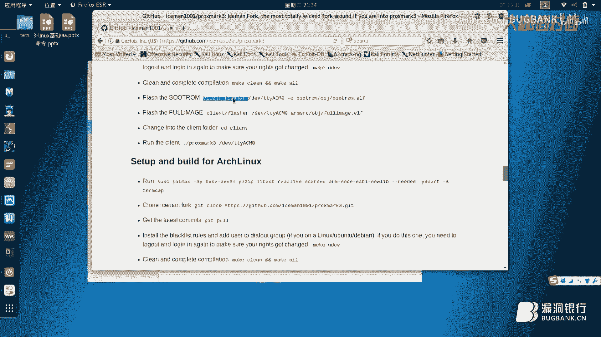

然後對它進行FLASH的刷寫，FLASH然後調用DIV_TTY_ASIM0，然後用-B然後去刷寫，然後刷寫這個，就是說寫入燒入燒入這個BUD/TOM，然後obj。BUD/TOM文件夾。

這是個BUD/TOM文件，ERF文件，它是單面機的RG文件，然後我們可以燒進去，然後這個時候主板上面的紅燈和黃燈會亮起，然後紅燈和黃燈會亮起，然後完了之後，我的板子好了，現在刷好了引導了。

引導刷好了之後，我們的我們的客戶端，然後進行刷寫，刷寫完了之後，刷寫完了之後，然後我們進行就是說DIV_TTY_ASIM0，然後繼續調用，調用刷寫的是我們的這個FULL_AMI智慧型，找不到我們輸錯了。

還是複製一下吧，然後這個時候板子上的紅燈和黃燈依然會亮起，然後它會檢測，現在正在尋找，當它尋找上了這個板子之後，然後等它就是檢測到之後，它就開始刷寫，刷寫完了之後，然後它這個刷寫比較大。

因為它有體積問題，然後還有Nested，然後這個時候呢，就是代表已經全部刷寫完了，就是我們的固件已經燒到PF3裡面，然後我們的客戶端已經編譯完畢，這個時候我們要進入到客戶端裡面，然後我們點擊ID。

這個時候我們就進入客戶端裡面的時候，然後我們調用的命令行的命令是，點斜-proxbox3，然後DATA_WARGAMING_TTY，然後ACM0，然後這樣的話就能啟動PM3的客戶端。

然後這塊我們能看到這個，就是說PM3的這些相關信息引導什麼時候刷入的，這個FPGA什麼時候刷入的，然後還有這些使用方式，然後就是說還有這種可以試一下，天線電壓，HWTONE。

好了這是我們電壓的方向圖在這裡，然後我們可以從這看到相應的數據。

然後這個時候如果要執行破卡的話，我們可以用低頻卡和高頻卡，這個時候我拿一張低頻卡出來，然後我們可以去讀一下，然後是LF，然後才會讀出來，這是低頻卡，然後高頻卡的話，我們拿一張高頻卡出來，然後HF。

然後因為我們知道他沒FAN的卡，所以我們用MF，就是HF14A RADAR，然後他會把UID號，還有QQA還有SEC讀出來，SEC就讀出來，完了之後呢，我們可以HF MF。

然後檢查他就是掃描他的默認密碼，就是掃描入口令，CHK然後新號，然後問號T，這個時候他就會每舉出來常見的所有的這些密碼，看這是常見的一些入口令，然後他去掃描，嗯好了，然後入口令掃描完畢。

然後這個時候我們就需要HF MF，然後，好了我們把它輸進去，然後，我們看一下這個密碼，密碼還有點問題，107號，然後他會去把所有的，他這會把密碼全部求了出來，然後我們可以HF MF。

這個時候他就會把所有的密碼讀出來，然後我們可以看到這個時候，這個時候可以看到黃燈和綠燈在閃，然後他就保存了這個文件，這邊Windows還一下，我們先來看一下，就是命令行和GUI吧。

我們Windows本來想給你們看GUI的，GUI比較方便，Windows下面的Language tab，傳輸就是說是我們看的高達上一點，然後給你們看，然後就是說是這個情況下，我們看這個位數。

剛才說為討論位數這個問題，我們看多少位，1位2位3位4位5位6位7位8位9位，10位11位12位13位14位15位16位17位18位19位，20位212223242526272829303132。

32位剛剛誰說的，32位然後其中我們來看一下，控制字佔了8位，然後控制字佔了8位，然後32減8，然後24位24位再除以20，就是就是他每個鑰匙有12位鑰匙。

然後這是Mafia 1K的典型的Mafia 1K，他有那個什麼的，他操作的話，我們可以說一下，比如說看首先就是你會自點鑰匙去掃描，我們就導入一個鑰匙，鑰匙情況下，比如說看我們HF，我們可以先測下電壓。

HW TONE，然後我們來測電壓，然後電壓出來了，電壓好低啊，我現在就先緊著，這給大家講一下吧，該怎麼裝驅動，這電壓的這個波形圖在這裡，這是他電壓，然後至於大家說怎麼對比數據，然後首先我們看這個固件。

怎麼去說就是給他刷固件，然後怎麼去給他就是說去刷寫一些，刷寫固件包括刷寫固件啊，還有驅動的安裝，首先我們看問號小驅動安裝，首先我們需要，怎麼弄的設備管理器來看，然後這是我現在設備管理器。

看他靠木口是pm3對吧。

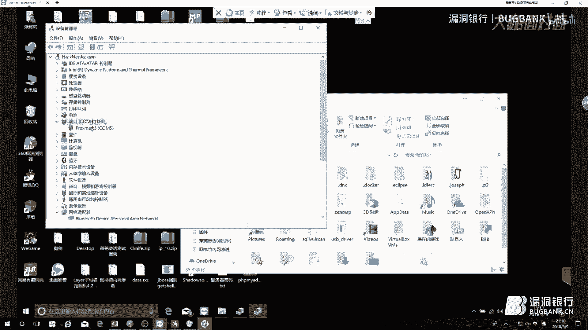

我現在插到了我的這台工作站上面，然後他現在亮了一下，然後他現在開始識別驅動，我們可以看一下，看他現在識別的是USB串行設備，然後怎麼辦呢，我們來然後我們來看一下這個區別。

然後我看他這把寫的是看USB串行設備，靠木5在這樣的情況下，我們應該是，在這個情況下，我們應該他應該識別是pm3，為什麼他因為我們沒有裝驅動，驅動要禁止強制性的驅動簽名認證，因為他本身就沒有驅動簽名了。

這個東西我們來看一下怎麼裝驅動，首先設備管理器。

然後我們看比如靠木口，剛才識別是靠木5，我們這樣這樣像這個時候已經安裝過的，怎麼辦呢，我們現在就是重新啟動，把這個高級啟動設置選項打開。

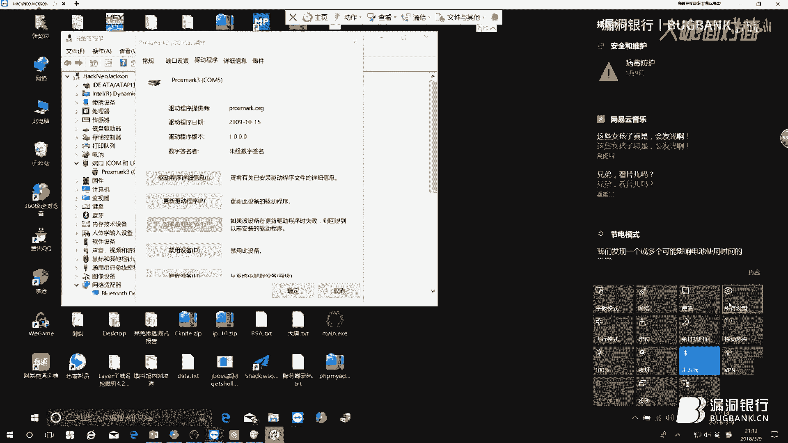

看高級Windows更新選項，高級Windows重啟選項，高級啟動，這有高級啟動，我們可以高級啟動。

我這裡有個不點啟動，高級啟動完了之後，把驅動簽名強制認證關掉，然後我們可以就是驅動程序，然後更新驅動程序，然後瀏覽我計算機軟件，然後列表中選取，完了從磁盤安裝瀏覽，我們的那個就是pm3。

那個RNF文件在哪裡，我們可以點擊然後點擊確定，然後下一步，然後更新完了之後，我們要釋放兩個文件到系統的文件夾裡面去。

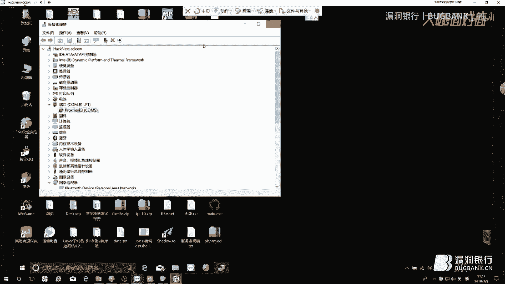

什麼文件呢，就是這兩個一個USB3，然後另外一個是，一個是USB3的SYS文件，還有一個是MDMCQPQ的這個RNF文件，這兩個要釋放的路徑，釋放路徑，我們就是說把這個RNF複製到這個C的。

這個WindowsRNF文件夾裡面，我們複製到這個文件夾裡面，然後另外這個的話，我們複製到System32 Drivers文件夾，驅動文件夾裡面，然後這個就重啟機動強制驅動認證。

然後我們就可以看到這個pm3，有的時候這pm3上面，他不能破怎麼辦，他不能連接怎麼辦，我跟你說一下什麼原因，Windows上面很多坑，所以說建議你還是用Linux，畢竟大家敲一敲命令。

然後對他有助於記憶，然後一是有助於記憶，二的話就是說我們方便各種各樣的，就是說是操作更靈活活泛一點，然後就是他這個會有小攤號，小攤號的話，你就把這個驅動線材強制認證關掉，然後就可以了。

然後這個時候看我們剛才破了一張卡，然後再回到卡的問題上來，我們剛才是不是已經把一張卡通過，那個就是千刀認證工具把它給讀出來了，不得不佩服剛才那個哥們。

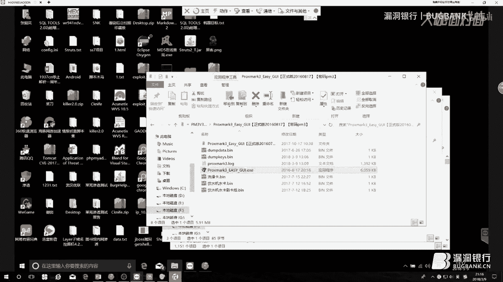

他的apt能力很強，潛伏這麼久了，那個電腦我已經幫他弄灰多了，我再給他補一下，我現在發這個群裡面，nasty的攻擊，千刀認證，千刀認證，這個對比卡怎麼對比呢，我們可以看到。

然後就是說這裡他會出現這個數據，我們可以把卡刷一次，然後對比之前和現在的數據，比如說，看這是我之前刷的卡，這是一個飲水機的卡，然後我們對比數據怎麼對比，然後刷卡後之後對比，然後我們對比出來數據。

在這裡高亮的時候對比出來變動數據，這是第一張卡，這是第二張卡刷卡前刷卡後，然後他變動數據之後，我們可以進行一個就是相對的一個操作，然後就看他裡面的數據變動位數，然後通過易貨或者CRC，累加膠驗之類的。

注意他裡面可能會有一個累加，會有一個膠驗位，然後他裡面金額是多少，然後我們可以去改動，然後通過去測算他的金額，然後來進行一些他裡面詳細的一些東西，這個東西不好給你們細講，然後這個是就是這個是關於讀卡的。

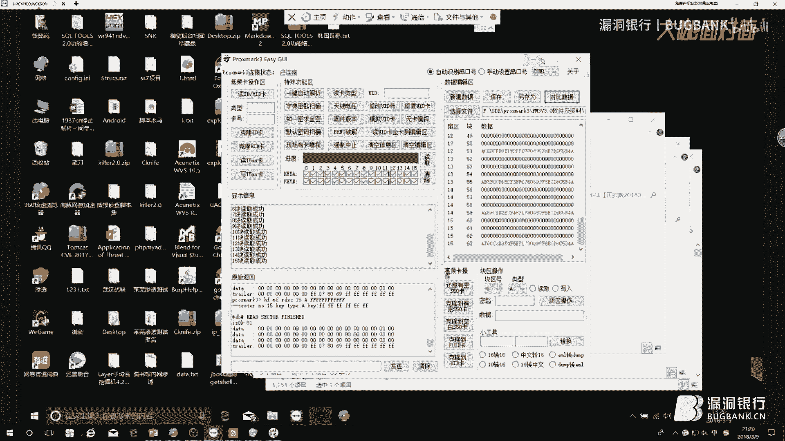

然後我們回到PPT。

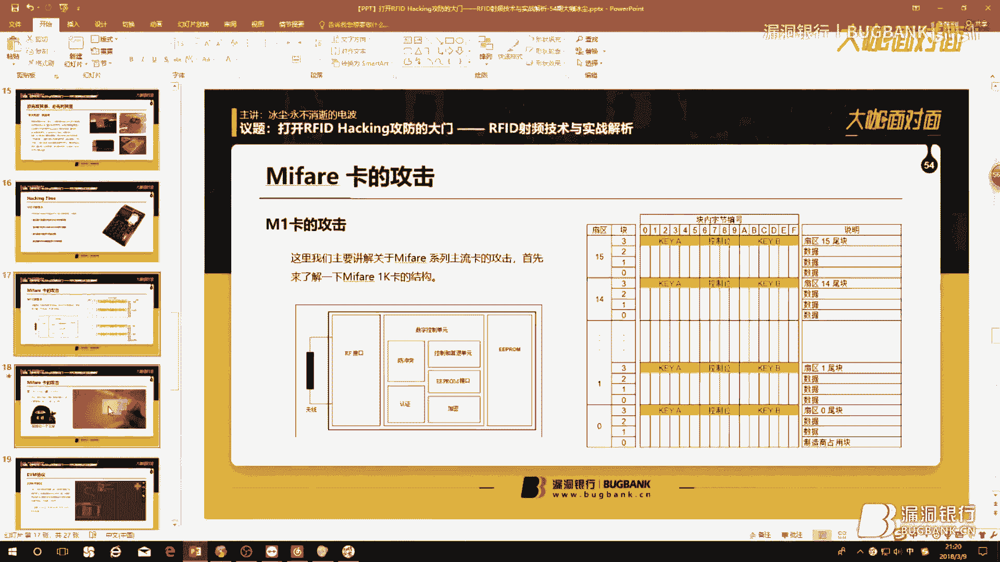

這個是我們一個就是我們一個那個什麼，就是我之前的一個效果，我來看一下這張改的版卡，這是那個洗澡的那個水卡，我們插進去，好的現在看下金額，金額是35塊9毛2，好，然後這個是效果。

當然就是說是我們這是一個裝逼的效果，就是裝Helen，然後今天你又Helen了嗎，RFID戰來了，我們來支衛星吧，然後就是拳頭大佬正版授權，我想支一個衛星，然後再來說一說EVM協議吧，EVM協議的話。

這些東西可能再給大家做個了解吧，之前剛才我們已經知道了，就是說，這裡就是我們已經知道了。

就是說這裡他是我們有沒有看的注意到，就是看他HFMF，他用了HFMF卡的讀取，然後往裡面去就讀，然後通過發送固定的數據，然後導入數據包，對吧然後這個時候導入數據包，數據包裡面，然後產生的這些值。

然後我們可以就是比如說就跟正常情況下一樣，我們可以去發送，就是這是他密鑰，這是他密鑰，我們可以發送他密鑰，然後來讀取卡裡面的信息。

先來做個簡單的了解，我來看，然後看就比如說是正常情況，我們做電子信息交易，可能顯示當時應用吧，然後我們調用select命令，然後傳入當前的那個應用的AID號，然後就是說是正常情況下。

就是我們卡這是我們做一個效果，這是，然後我們用卡，然後就返回900，這表示下面選擇成功，然後舉一個例子，我們舉一個例子吧，就是花栗鼠的例子，然後比如說我們發送一個密鑰。

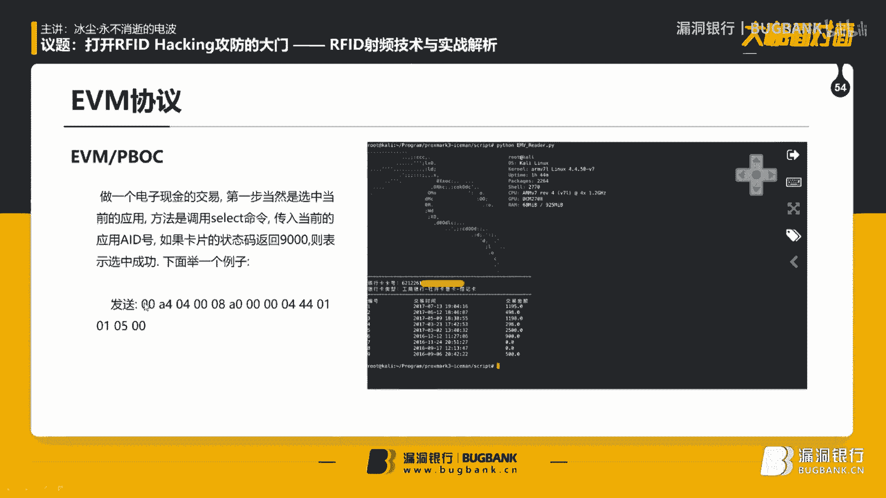

然後他返回給你這個密鑰。

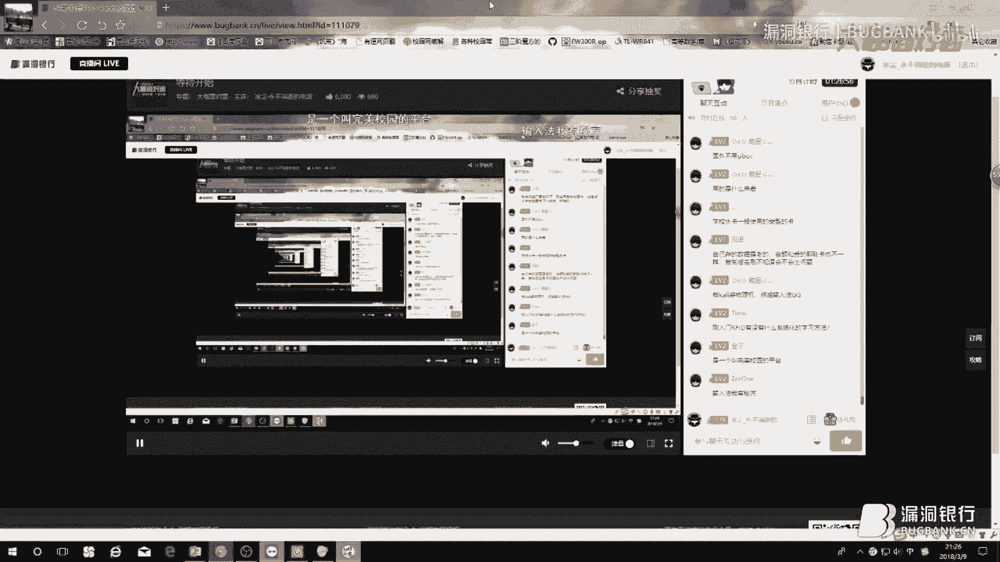

然後另外的話就是說我們可以看一下，Github會有pm3的固件，我們官方搜索是proxmark。

他就會搜索出來，嗯這個第一個就是這是他的那個倉儲，這個倉儲裡面用的是官方固件，就是比較穩定一點，然後，比較穩定一點，但是就是說是功能不是很全啊，如果你要想體驗其他功能的話，我們可以看一下其他功能。

這個安裝的話如何安裝，我給各位說一下，這裡會有一些相關的wiki，然後我們可以看一下，比如說在Kali裡面安裝，我們需要安裝相關的e-light，然後我們就是把這個get給插過來，然後，我們進入這目錄。

然後去編譯，然後編譯進入清理，然後我們來看一下，就是USB的驅動到底是HID的驅動，還是CDC驅動，HID的CDC給大家說一下，就是HID是物理驅動，就是說是和CDC就是虛擬驅動。

就是USB的驅動模式就不一樣，一個就是一個底層的硬件問題，這是一個可以百度一下有興趣的話，然後還有就是說我們去上傳，就是說把這個，就是比如說我們該如何去上傳，就是把這個引導。

Botloader引導就是pm3固件單片機引導，然後上傳到pm3裡面去，在CDC模式下，我們就可以就是就是到客戶端裡面，然後就是編譯，然後就是用Flash命令，就到Flash文件夾裡面調用。

div tty sm0然後-b，然後就刷寫刷寫到刷寫這個文件夾裡面的，刷寫這個Botatom obj文件夾裡面的Botatom，ERF文件ERF文件，就是單片機下面的二進制文件，各位強調做好筆記。

然後我CDC。com寫出來，然後然後就是說是我們如何升級，就是固件，然後就是說我們繼續刷寫，然後刷寫整一個就是鏡像，然後就是說包括就是說我們，就是如何去刷寫進入客戶端。

就是在進入到這個Silent文件夾裡面，然後就調progmark3，然後div tty sm0，然後就進入了客戶中端裡面了，然後我們確定就是HW。dottis。version版本號，然後測天線電壓。

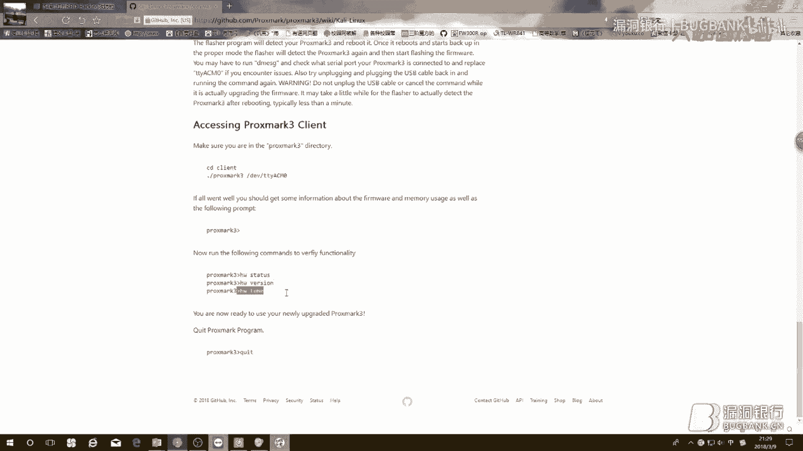

然後我們退出，這都是正常情況下命令操作，我不知道各位今天看就是，這是最起碼就是這是最後一點乾貨筆記。

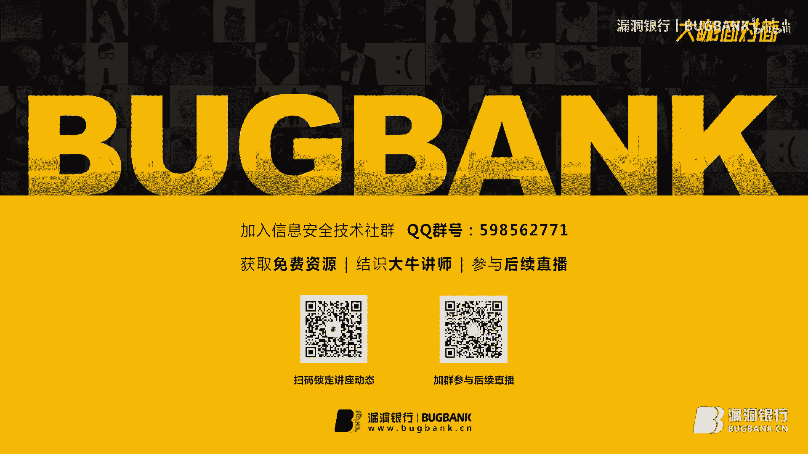

那下面就讓我們進入到行戰問答環節，大家在聽講過程當中沒有聽懂，或者實際測試當中產生的疑惑都可以提出了，那大家抓緊時間，扇區全加密的也有解，扇區全加密你可以用修態，手機的公交卡使的話。

實際上就是說手機它裡面會有一個固定的，一個就是Mate Fire芯片，它一般會有CPU卡模擬，就是一般會用一個CPU，就是一些單片機來進行模擬這個卡，然後模擬這個NFC，然後來進行，多謝。

那個卡我現在用的是那個NAS的公雞。

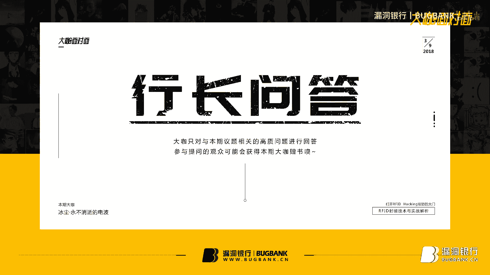

辦案卡30一張現在數據，辦案卡其實30一張它主要是為了防止你丟，正常情況下一張Mate Fire的卡成本在幾毛錢，7毛錢左右，我就給你們說內幕吧，虛擬機不行，虛擬機你這個東西只能用物理機。

然後只能用物理機，然後因為你虛擬機一跑的話，它裡面吃進去的驅動問題，因為它硬件底層東西它不能用那個什麼，看了的話它裡面我這麼說吧，PBOC協議它並不是漏洞，而是它因為這個協議它本身它就是。

PBOC協議什麼它PBOC協議就是中國銀行，中國半可就是PBOC的就是中國半可，然後就是說微信不好意思報價，就是它是它全稱叫EVM協議，然後就是EVM協議，它EVM協議二次開發之後它變成PBOC。

開了驅動開了真機上可以用的，但是不推薦，UID和Mate Fire卡這個問題問的好，我可以給你說一下這個，UID卡和Mate Fire卡的區別，我給你這麼說吧，就是說是它有那個卡的區別是。

它裡面的位數不一樣，就是說就是說是UID號，Mate Fire卡那邊的UID號，我們可以看一下剛才這個地方，剛才我們那個地方用的那個卡是，就是說剛才我們的卡的上面有個固定的號，那個號是死的跟Mac一樣。

它是死的綁定死的，然後這個東西它沒法修改的，但是UID卡好好的那個UID是可以隨便修改，任意修改我們想怎麼修改就怎麼修改，M1卡本來就是可以作為門禁卡的，當然就是M1卡的門禁卡它是UID卡。

UID卡是可以作門禁卡的，然後書和資料書的話，資料可以看一下雪碧的，雪碧老前輩的就是博客，雪碧零成root的博客，然後給安利一下還有FocusBlog，然後PBOC協議是基於EVM協議二次開發。

然後M1卡能不能作為門禁卡，M1卡它就是UID卡，我們常說電梯卡，我們常用的電梯卡都是UID卡，全是RFID其實我也有一個，然後電梯卡的話是UID卡，然後破解飯卡是不是需要NFC那個東西。

NFC它就是13。56兆現在的統稱，然後你要是想用到可以刷個NetHunter可以搞一下，PBOC協議漏洞，20筆存款支付信息被修復，這個是不存在的，因為它本身就是個開源協議，就是它企業都公開的。

相當於就是我已經把密鑰公開給你了，你可以任何人可以訪問，要不然的話它可能就是說不好那個什麼了，這個東西它屬於是屬於信息洩漏，但是這個信息洩漏可能會有辦法解決的，但是目前可能我真想不出來有什麼辦法解決。

是可能就是說你可以通過購買一些，就比如說卡房，我還給養老前輩他團隊打個廣告，就可以買卡房，然後卡房就是你可以，要么就是自己拿個錫箔紙去，拿個錫箔紙，然後去包的卡上面，然後這樣的話你可以去試。

因為它能擋住，因為就是金屬它能擋住一部分無線電波，對吧，遠程攻擊RFID卡，剛才我已經講過了，終極攻擊，卡片比較安全一點，CPU卡，CPU卡就是說，就是這兩句話，也不是它有千艘人證漏洞攻擊。

然後我們可以就是用CPU單面機模擬，然後來限定每一個區塊，通過CPU來進行校驗讀寫，每一個地方，如果一樣水卡是聯網的話，卡沒加密，把它複製等幾張，然後等第一張消費完卡裡面有幾個，聯網的話。

有就剛才我說了，剛才我已經講過，就是單線校驗和雙線校驗的問題，就是說是如果雙線校驗的話，他可能會就會以數據庫為準，單線就可能只就管理員可能只知道金額，但是你卡裡面可以繼續花，就是說你可以繼續花。

但是你要是被查到的話，可能你會死得很慘，還有那種就是安全方式，就是說是我把它做了雙向校驗，我這邊就是以金額為準，刷可能你第一次刷，可能第二次刷可能有問題，第三次沒問題，第三次可能就有問題。

就是你的卡可能會一下，比如說是我裡面100塊錢，我往裡面衝了200，然後我可能刷好幾次之後，我一下變成了十幾塊錢，因為為什麼，我就刷了，因為我就刷了那麼多，就以數據庫後端為準，數據老了也不一樣。

這種情況就是已經改把數據包改了，就是說我金額什麼都跟之前的一樣，就跟之前的你就是老卡那時候一樣，需要水卡一般是uid卡或者說是，就是沒飯，fc感染數據你自己看，你不要關注這些東西，uid沒飯。

我剛剛已經說過了，就是說是他的uid號可寫，就是我們來看看這裡。

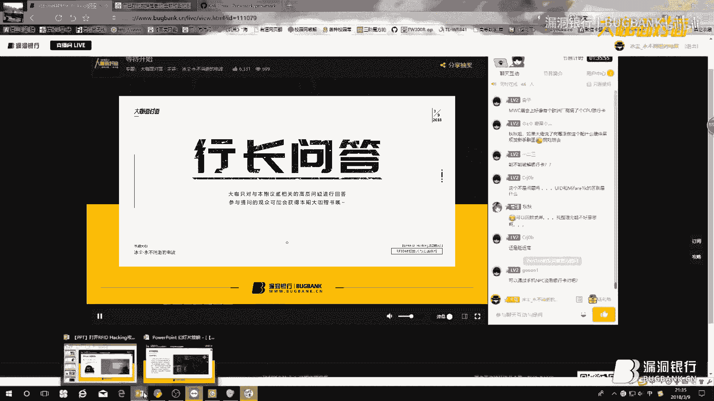

我們回到ppt來看一下，看就是說他這裡會有一個卡號，他不是有16個塊嗎，16個塊，然後就是說是64個64個塊，16個扇區，然後他裡面形容零塊，他是不可寫的，就是沒費卡是不可寫的，他裡面會有一個對應的。

一個唯一的一個號，注意這是唯一的就是全球唯一，他跟麥克地址一樣，他是全球唯一的，然後就是說你是不可修改，他是寫死在裡面的，是不可修改的，uid卡是可以任意修改的。

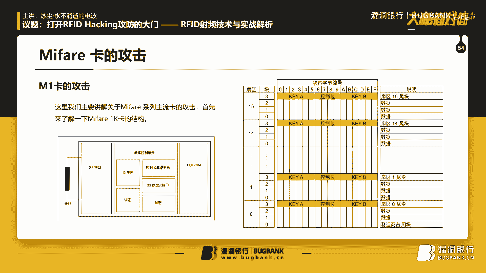

這些東西，14a啊，14a的頻率就是13。56兆啊，支付寶可以刷試試，因為這東西他本來就開源的，所以說你可以刷到的，通過更改卡的授權查詢。

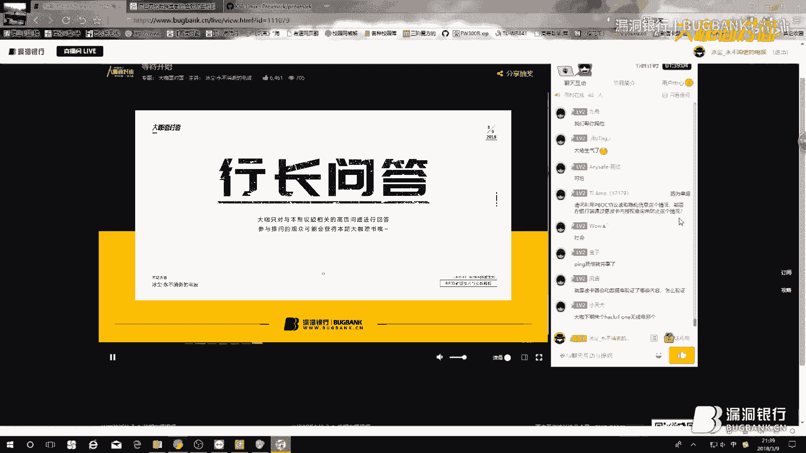

這個人不存在的，因為他卡本身就是個數據庫，好，那我覺得時間也差不多了，那今晚上的大咖面對面到這就全部結束了，丙辰辛苦了，丙辰辛苦了。

謝謝觀看，謝謝觀看，謝謝觀看，謝謝觀看，謝謝觀看，(字幕製作/時間軸：秋月AutumnMoon)，更多：http：//fashionecstasy。com。

