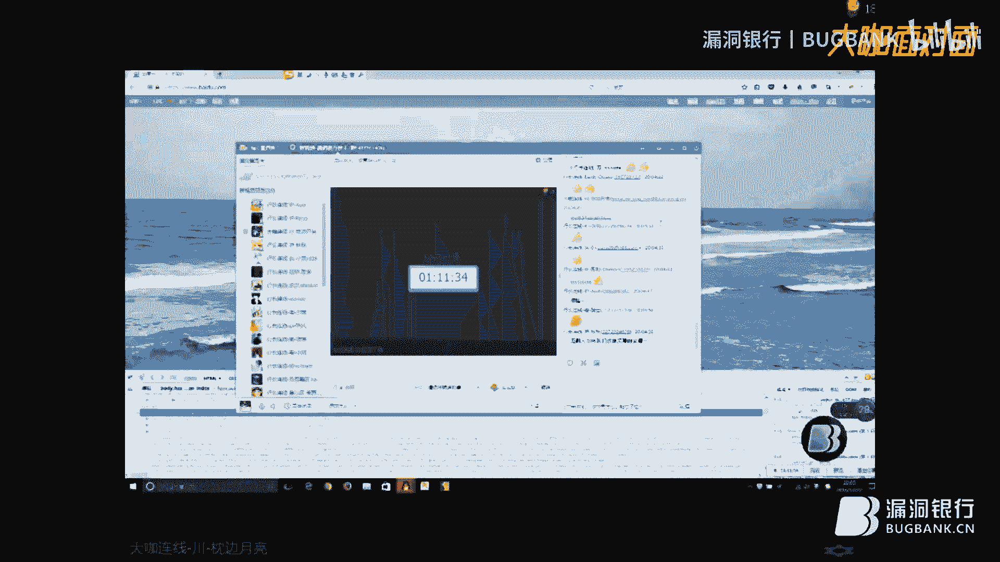

# 漏洞银行丨Web安全基础丨咖面4期 - P1：【录屏】Web安全基础——大咖枕边月亮分享 - 漏洞银行BUGBANK - BV1Ht4y1z7mz

(音效)。

大家好，我叫枕边月亮，是四川一个高校的信息安全在读大学生，从事安全行业已经一年半了吧，现在大二嘛，还有两年毕业，然后我就给大家分享一点，比较我自己水平其实相对来说比较一般嘛。

可能讲的东西可能有如果讲的不到位，还请大家指出来我们大家一起相互交流嘛，好吧，现在我们今天就开始来看，(音效)，看一下这个我今天演讲目录，我主要还是从安全事件盘点，然后引出给大家介绍一下一些安全知识。

然后再给他家讲一下外部常见的一些安全问题，然后最后再给大家讲一下什么是这渗透测试，因为所谓渗透测试，他也有一个相对正规的流程做渗透测试，然后我们来看第一个吧，安全事件的盘点。

我们今年2016年出现了一些，比较引人注目的安全问题，比如说，1月8日时代华二的数据出现了，1月18日凯连连锁酒店超过50%的遭过遭恶意软件的入侵，在2月份敲诈病毒爆发了。

3月份OpenSSL这个大家可能比较熟悉，OpenSSL他出现了一个新的安全漏洞叫作恶，这个安全漏洞的危害十分严重，待会我会详细给大家介绍，Strike2框架爆出多个远程代码执行漏洞。

Strike2对于家外web来说，这是一个比较常用的框架，因为大家平时做web开发的时候，如果用GSP来写代码，大多数情况下，其实用Strike2的框架的比较多，然后Strike2是很常见的事情。

因为经常，每隔几个月就会爆出一个远程命令执行，出现了20万儿童信息被打包出社，然后在土耳其大家都看过新闻都知道，土耳其出现了重大数据泄露，包括5千万的公民信息被泄露了，俄国黑客盗取了2。

73亿的邮箱信息，然后以1美元的价格进行贩卖，然后在8月份，Zabis爆出了Circle注入漏洞可获操作系统权限，这个漏洞可行，当时出来的时候可惊动一时，好多人可能大家都也测试过这个漏洞。

这个漏洞确实危害特别严重，然后现在也出现了可以直接利用的工具，然后在8月份还出现了NSA，就是美国国安局文件泄露了，然后我们来介绍一下SASL作文漏洞，因为在SASL在3月份的时候。

在国外被研究人员发现了OpenSASL的漏洞之后，然后这种漏洞它主要是利用，用了一种过时的脆弱加密算法，然后OpenSASL发出了公告，发出了一个安全公告，说这个作文是一种跨协议攻击。

如果服务器使用了SSLv2协议和Export加密套件，那么攻击者就可以利用这项技术来对服务器的TLS绘画进行破解，然后攻击者他利用这个漏洞破坏了网站的加密体系，然后可以发起中间人劫持攻击。

从而窃取了HTTPS的敏感通信，包括网站的密码，信用卡账号，商业机密，金融数据，这个漏洞影响了大部分的HTTPS网站，甚至包括知名的阿里巴巴，雅虎，新浪，微博，新浪这些360。

还有这些知名的公司都遇到漏洞的影响，危害十分的巨大，然后这个Zabis在报告为Circle注入漏洞，因为它是一个开源的企业及性能监控解决方案，很多的企业都在采用这款开源的工具来监控性能，来监控它的性能。

也就是说在Zabis的它的参数在insert的方式存在了一个Circle注入攻击者，直接不需要授权，你可以登录这个管理系统，也可以通过script等功能直接获取Zabis他的服务器的操作系统权限。

这个已经马上已经有很多的那种payload，大家可以直接自己本地搭一个来测试一下这个漏洞，但是他这个也有一个前提的，因为就是必须要开启了那个访客权限，才可以用这个漏洞进行测试。

在Zabis的密码是唯空的，这个条件支持，那就能进行直接，然后这个NSA泄露大量攻击工具这个事情，国安局他遭到了黑客的攻击，然后他们入侵了方程式组织，然后从他的黑客组织的计算机系统获取了大部分黑客工具。

全部泄露在了互联网上，这些黑客工具都是不同于我们现在所使用的工具，都是那种很强大的，很强大的一种集成环境，他是有很多那种比较厉害的工具，可以直接拿来利用，这都属于国家级的黑客那种。

为国家服务他们使用的那种比较厉害的工具，但是这个工具在网络上已经泄露出来了，这个危害还是很严重的，然后国安局泄露了他被攻击，然后现在给大家介绍一些外部安全知识吧，首先我们讲一下为什么要重视外部安全漏洞。

因为现在几乎所有平台，我们都是依赖在互联网构建核心业务的，在windows xp之前，windows的操作系统都是不自带防火墙的，现在也就是说windows xp开始出现。

在2003年被大规模使用的时候，windows xp，他是自带了防火墙的，所以说传统的缓冲区一出攻击就没有了，当时那种比较没有那种，失去了他原来那种威力，然后大多数的攻击就已经放在外部层面。

然后进入了外部2。0时代的时候，然后从他的外部后端延伸到了前端，也就是说现在的处于2。0的时代，外部攻击大部分发生在前端，包括所谓的XSS与CSRF漏洞，这些都是在前端方面比较突出，最近这几年。

XSS和CSRF的占有率已经大幅上涨，甚至超过了注入尔尔一般常见的后端的漏洞，因为现在外部安全形势也变得越来越严峻，但是外部安全的加固也变得更强了，所以说现在从事外部渗透这一块的门槛比以前也更高了。

需要掌握更多的基础知识，然后现在因为国际权威调查机构已经调查了，因为现在75%的，攻击都发生在外部的应用，开发是应用安全中最薄弱的一环，也就是说什么叫什么叫产品，甚至开发是最薄弱的一环。

也就是说在此或者是写框架的时候，之后这个起这套系统他没有考虑的很完全，按照常规的方法，或者是常人的思想来设计的一些就会出现一些包括一些漏洞，这些漏洞都不易，嗯，准确的说就是相对来说。

这些漏洞就比较变得更多了，就不是不是就是程序员在写代码时候的问题了，然后外部系统现在也是逐渐成为了企业安全边界之一，嗯，主要现在从这个图大家可以看到这应用层作为安全边界的一部分。

他是有具或许是有巨大的漏洞的，从防后现在防火墙的兴起，包括袜子啊，这些的兴起也是建立在防防御网外部的前端这一块的东西，嗯，准确的说来说，外部应用层，他只有网，其实那些所谓的硬防就是所谓的设备防御。

他仅仅是在网络层端口进行防护手段，包括防火墙SSIDS和入侵检测系统啊，嗯，加固啊，这些都无法阻止，如果检测到外部应用层的工具，现在比较兴起的就是这种，安全狗或者是他来说云锁啊。

创与盾这些这些云瓦夫现在也变得比较外部应用层的攻击场景，首先他要如果一个黑客他想入侵一个外部服务器的话，他有一个攻击动机攻击方法，攻击工具，然后这里，说到这里攻击动机。

大家有一本书叫卡里命X高级渗透测试，他里面讲到了一个杀链，这个杀链就是针对外部攻击的一系列整套的手段，可以推荐大家去看一下那本书，然后他攻击动机，他有一个攻击方法，他攻击方法。

首先他可以去从漏洞先探测他的防范措施，措施和他的系统漏洞，看看有没有常见常见的系统漏洞，然后攻击工具对系统漏洞进行攻击，那外部常见的攻击动机有哪些，比如说恶作剧，篡改外部的网页，损害企业的名誉。

黑色产业链，入侵数据库，窃取数据，然后以用户身份进行非法操作，获取暴利，以此作为跳板攻击，攻击企业内网的其他系统网页挂码等等等等，其实大多数人入侵一个对于一个网站进行入侵或者安全检测。

可能只是一个恶作剧而已，就是想测试一下自己的水平，或者这样，但是在其实现在在对未授权的网站进行渗透测试也是一种非法的行为，所以说必须要得到授权的测试，或者是所谓的那个开放测试，大家才能进行。

才能进行那种渗透，才能进行对他进行渗透测试，不然都属于非法行为了，外部常用的攻击方法，这里的比较常见，大家也可能常用过谷歌hack，通过谷歌语法来搜索该网站的一些敏感信息啊，包括后台地址啊。

网站敏感目录啊，然后还有网页爬行，还有暴力拆解，暴力拆解用BurpShirt啊，或者是PKA未出品的那个http爆破了，可以识别验证码，可以对网站进行一个暴力拆解，然后就是外部漏洞扫描。

一般漏洞扫描工具都是用的企业级的，类似于AWS，APP实看这种进行整体的扫描，然后对于企业级这种扫描工具，它是存在一定的误报的，所以说你还要进行手工的排查，主要挖掘漏洞还是靠手工来进行。

然后又是错误利用信息的利用，包括一些网页，他返回了一个错误的信息，比如说不小心暴露了内网地址，暴露了一些敏感的目录，暴露了夫妻的版本号，阿帕奇版本号，数据库的版本号这些，哦。

然后看的说识别验证码的工具是什么，那是你可以百度搜索一下PKAV，然后就有一个那个http，他他可以识别，他对可以对验证码进行识别，等会我可以给大家看一下一个工具，嗯，然后构造恶意的输入。

比如说Circle攻击Circle注入命令注入，夸张脚本攻击，然后http协议攻击拒绝服务，拒绝服务虽然是也就是说最没有最不考技术，但是又是最，使用最有用的weibo service flash。

还有Java，Apple 业业务逻辑测试等等等等，然后看外部攻击面，特利用外部攻击面，他不仅仅是浏览器中可见的内容，当你用BurpSort或其他抓包工具抓包的时候，你可以发现他可以有很多的利用点。

我看到你们在说CSRF，说到CSRF，我们就可以，我就怎么那个的，根据这个图来说吧，你们说常见CSRF漏洞就是网站，他没有加token，没有令牌，或者是他没有对refer请求进行验证。

所以说当你抓BurpSort抓包的时候，抓到这个有一个refer请求，然后你通过你直接把这个网址给改掉，比如说我们随便改个你那边也可以随便改个3w。test。com，或者这种。

然后你点在BurpSort里面有一个repeater，然后点go，如果那个页面返回200，而且成功执行了，那就说明这个地方他存在CSRF漏洞，然后这个就是可以利用的，CSRF漏洞。

然后我们接着说这里接着说这里吧，然后他就说，嗯，我们再说访问，他可以输入的点有这个GSP，webpeng1。1，可以直接在浏览器的输入进行利用，然后我换一下鼠标，然后看一下这个。

黑客他实际上的利用点就有这个refer，然后还有这有一个user agent，就是你所使用的浏览器，这种在常见，因为他会有CTF有些题目，他就会判断user agent来看你，然后来判断这个。

然后看其中就是一个隐藏，浏览器或者是什么，还会让你，下一个页面还可以，然后，还有可以就是说cookie嘛，然后他就tie SS在留言板或者一些地方用tie SS，或许可以直接抓在抓了包在这里进行修改。

然后就可以模拟管理员或者其他用户登录，然后其他输入点包括一些flag，web service，然后在海耀这些地方都是可以直接输入的，实际系统呢，他是参差不齐的，因为，越大的怎么说，就是越大的web系统。

他的程序，会很多，然后开发人员，比如说我们现在在学校，也是，有40个同学，然后不同的开发任务，然后开发的代码量又特别多，人员也比较多，每个人他的代码写法也不一样，代码写的风格也不一样。

然后会出现难免会出现一些问题，然后就是系统屡次升级，人员频繁变更导致代码的不一致，这也是一个，由于开发人员太多导致的系统上，他有多个外部系统运行在同一个服务器上，这样也就比较危险。

如果一台比较脆弱的网站遭到了入侵，然后或者在服务器上，全线没有做的很好的，全线没有很好的限制，然后就可能会导致其他网站受影响，甚至整个服务器被攻陷，然后开发人员为进行安全编码培训，因为安全编码这个东西。

怎么说，我们在开发过程中，家瓦，比方说我，我是我们是一个家瓦开发成员，有一本我可以给大家推荐一本家瓦安全编码书，就叫家瓦安全编码，然后在亚美讯上可以收到，那可以用这个多学习这本书上的内容。

他就对安全常见的安全编码规范，防止黑客入侵有一些，有一些好用处，然后定制开发系统，产品其实一个安全编码和一些家人员在一家公司里面，电信人员而也更重视客户的体验和功能，系统的功能。

然后开发者他关注点主要还是在客户的满意啊，或者是性，处理性能，二十啊，就是警察们看的很很低，开发成员一起从事一个项目的发展，这样会让这个项目，让这个运行稳定，然后又能实现他所有的功能。

第一个分类他是输入不充分，比如说最常见的就是输入了，外部应用没有对没有对公司的输入进行适当的编码和攻击，就导致了，然后攻击者可利用注入漏洞，又是外部应用执行未预见的数据库查询。

然后就是命令注入这个跟社会注入非常，非常像的，他也是利用一个注入又是外部应用程序执行未预见的命令，获得一些数据库查询，然后就是，这个，先比较不二等于三，靠他是在比如说在用户浏览器，直接，进行恶意的脚本。

嗯，这里看到，我手术，比入海，来说其实来说或者是现在的开发，因已经考虑到，二数，因为现在工具，其实工具这个东西他不能做到百分之百的准确，包括有著名的，SR，虽然大家都是用，用的破解了，但是很有物。

是很大，然后就发展起是夸张情，我可以详细介绍一下夸张请求，因为CSRF攻击者在用户未察觉的情况下，迫使你忘记发生了未预见的请求，往往损失用户本身的利益，因为CSRF漏洞，和XSS几乎是两个是。

一起使用这种严重的恶果，嗯，CSRF这样，XSS，使用破坏力更大，嗯，因为一般的CSRF对于我们来说，比如说订阅啊，各种订阅，我们很容易，看到，CSRF的，是，是，念的，然后没有，最近用上头的用脚本。

SP啊，偏心，比如说一句话木马，然后造成影响，然后就是对象直接引用，不充分，内部的路径，可攻击者穿，那其他下载其他东西，还有一些下载的函数，输，能，变异出，然后还有加瓦浮点数，拒绝服务漏洞。

flop了变量，因为Xpass注入攻击，这是一些人在使用插庙文档，替代传统的文本文件，技术纪录，然后还有一些常见的安全问题，比如说逻辑缺陷，越权操作验证绕过程序，流流程的失误，变量注册顺序，gs截持。

随机数生成，API调用缺陷，还有容错处理不当，包括泄露了系统的信息，包括泄露了系统的信息，然后还工作平台的安全特性，比如说阿帕奇文件解析漏洞，额那个是文件明解，都刷个图，任意代码执行。

这这个都是刷个图的任意代码执行，然后还有福拉奇安全策略，然后我看他这提到了一个SSRF，就是服务端的跨站请求伪造，Circle注入他的一个详细介绍，他主要，是，对于输入用户输入检查不严格。

不过这个工具获取了，他不想网站不想让别人获取到的数据，主要是还是检查不充分，导致提交非法数据，当作一部分来直接用来执行，由于我们的一些外部应用常常采用GSP。

Java Bean或者SSH框架代码中会直接，或HQ，而有些时候可是用拼串实现的，嗯，这和蓝姐主要是过滤，实力，敏感敏感制服吧，但是其实还是可以通过各种编码，来进行转换，我想，系统屏蔽了详细错误信息。

还是可以会造成查看，12个注入，认证旁路可能会绕过程序的认证机制，上午给大家演示，有一个Circle注入场景模拟，本来我是打算给大家搭建一些环境，复现一些漏洞，可是最近快期末考试了，很多报告还。

好多课本还没预习，所以说等下次假的时候给大家可以复现一些，这本当你复现一些，一幕考试二了大二的期末考试了，然后程序员考虑的场景，比如说程序员，他想的是如果我把密码设置足够强壮。

那入侵者就不一定会入侵到这个系统，或者是获取系统，他就通过像这样的一个密码，password，这个密码相当强壮，又有字符，又有数字，还有英语，但是英文，但是这样的很强壮，他在登录框没有做适当的过滤。

可以直接查询，于，我们，我们管理员他我们正常的登录，请说一下是说，然后正常查询于就是select from user，where user name等于admin。

and password等于password，查询到如果有这一个，然后，返回就是正确，然后你就可以成功，然后程序员他没有想到一个结果，就是如果他要对进行一些助攻击，比如说我们在这输入admin。

我一等一就是所谓的万能密码，万能密码可能大家也用过，万能密码来实现对万能密码，其实有的是还挺好用的，对一些老站或者是旧站，可是对于新站来说，这个并不好用，然后，你直接输入输入了，admin。

这有一个二二一等于杠杠，因为刚刚他这个是绝大数据库，截断符号，GBK版的my circle是警号，或者是斜杠型号，他截断了后面的一部分，这样问后面语句，他就会变成url，等于ad。

因为只要其中有一个执行是正确，那他们就会执行后面的动作，也说就算这个数据库里面，我没有admin这个表，但是我等于，我也判断了url这个，然后存不存在admin表都会直接当成直接用select信号信号。

如果可能有没有学过数据库的朋友，我给大家讲一下，select信号就是全全选就是所有，所有select所有fromurl，这样我们查询到的，结果管理表第一个，然后就会这就所谓的万能密码，然后就直接能绕过。

然后我们如何防止circle输入，严格的限定参数的类型，明确参数检验的边界必须在服务端之数据验证，然后最推荐的还是希望大家采用参数化的查询方法，这是最推荐的，现在来说，加瓦的注入比PHP少得多。

也就是因为现在大家写的时候都是采用参数化的查询方法，然后还有内置的过滤系统，过滤系统就是所谓的黑白明点，加入黑就是一些黑名单吧，能直接引用，这是很常见的手法，但是这个方法并不推荐。

因为这种还是可以绕过的，编码是很多的，有很多种编码可以直接绕过这种黑名单，所以关闭circle注入还是最重要还是安全编码输入验证，然后比如说我们在输入的时候，数字型必须是合法的数字。

然后要对点就是所谓的点要进行一个特殊的处理，验证所有的输入点，包括get post cookie以及http槽，甚至还要验证，refer，利用的话，那就容易造成CSRflow，没有验证refer。

这些都是所有的输入点，最好做一次验证，使用的数据过长，最后基本上安全编码，真正的安全编码，有加瓦的安全编码，应该也有类似的数据，我用的是加瓦，然后加瓦的安全编码，我看过一部分讲的非常不错。

还是可以给大家推荐一下来评述，然后各种语言，数据库实际情况也有所区分，所以还要具体问题来具体分析，CSRflow第二个方案就是从数据库端入手，进行加固，除了在代码设计，还可以加固比如法权限。

禁止任何高权角色付语音程序的数据库账号，更安全的话，就单独创建，为应用创建有限的访问账户，还有拒绝用户访问敏感的系统储存，限制用户所能访问的数据库表，这些都是从数据库方面进行加固，大家讲一下XSS漏洞。

比如说我们一个论坛或者呢，你套入了代码script恶意代码，这里恶意代码有很多种，比如说alter，XSS啊，docker反弹，或者是直接弹出你的cookie，或者是各种XSS的玩法多种多样。

可以有很多种不同的编码，绕过来进行XSS攻击，XSS攻击可谓防不胜防，就是在现在这种比较大型的战，包括新浪腾讯这种，还是有无端的XSS漏洞被挖掘出来，在相关的一些漏洞平台上可以看到。

然后正常的服务器信息，然后他弹了一个插入恶意的代码，在用户浏览网页的时候，服务器就把比如说留言板，然后你点开了之后，你会触发一个弹窗，把恶意代码，反弹给用户，储存型的XSS，比如说我们登录了论坛。

我们发个帖子，script water hello，然后在里面干script，然后直接发表帖子，嗯，然后大家知道javascript嘛，前端的一种，主要还是分三种，储存型一种就是那种。

CSS这些标签当中还有那个demo数里面，demo数里面的标签，包括CSS，但这一组呀，还是从html的标签，比如说储存型，或者那种反射型的反射，或者直接在html里面勾造，他这种就会触发。

然后你登录论坛，浏览刚才的帖子啊，就触发了弹窗，反射型XSS跟储存型的不同，储存型的XSS代码是储存在服务端的，反射型他会立即执行，或者说你直接，进去吧，上就能见到效果，一回车的相关的提示框。

不能说反射型的XSS就，不用说只能这样说，我们的技术没SS是漏洞，但是有人能用，一定是有人能用的，这也是我们老师常给我们说的一句话，这个漏洞你用不了，不代表别人也用不了，所以说基本上不管是什么漏洞。

还是要尽量的杜绝，我们直接在K存看到，把开锁，直接给，又不能，会不然这里就会立即执行，我来头上就把哈喽给弹出来了，我来头上就把哈喽给弹出来了，我来头上就把哈喽给弹出来了，我来头上就把哈喽给弹出来了。

我来头上就把哈喽给弹出来了，我来头上就把哈喽给弹出来了，我来头上就把哈喽给弹出来了，我来头上就把哈喽给弹出来了，我来头上就把哈喽给弹出来了，我来头上就把哈喽给弹出来了，我来头上就把哈喽给弹出来了。

我来头上就把哈喽给弹出来了，我来头上就把哈喽给弹出来了，我来头上就把哈喽给弹出来了，我来头上就把哈喽给弹出来了，我来头上就把哈喽给弹出来了，我来头上就把哈喽给弹出来了，我来头上就把哈喽给弹出来了。

我来头上就把哈喽给弹出来了，我来头上就把哈喽给弹出来了，我来头上就把哈喽给弹出来了，我来头上就把哈喽给弹出来了，我来头上就把哈喽给弹出来了，我来头上就把哈喽给弹出来了，我来头上就把哈喽给弹出来了。

我来头上就把哈喽给弹出来了，我来头上就把哈喽给弹出来了，我来头上就把哈喽给弹出来了，我来头上就把哈喽给弹出来了，我来头上就把哈喽给弹出来了，我来头上就把哈喽给弹出来了，我来头上就把哈喽给弹出来了。

我来头上就把哈喽给弹出来了，我来头上就把哈喽给弹出来了，我来头上就把哈喽给弹出来了，我来头上就把哈喽给弹出来了，我来头上就把哈喽给弹出来了，我来头上就把哈喽给弹出来了，我来头上就把哈喽给弹出来了。

我来头上就把哈喽给弹出来了，我来头上就把哈喽给弹出来了，我来头上就把哈喽给弹出来了，我来头上就把哈喽给弹出来了，我来头上就把哈喽给弹出来了，我来头上就把哈喽给弹出来了，我来头上就把哈喽给弹出来了。

我来头上就把哈喽给弹出来了，我来头上就把哈喽给弹出来了，我来头上就把哈喽给弹出来了，我来头上就把哈喽给弹出来了，我来头上就把哈喽给弹出来了，我来头上就把哈喽给弹出来了，我来头上就把哈喽给弹出来了。

我来头上就把哈喽给弹出来了，我来头上就把哈喽给弹出来了，我来头上就把哈喽给弹出来了，我来头上就把哈喽给弹出来了，我来头上就把哈喽给弹出来了，我来头上就把哈喽给弹出来了，我来头上就把哈喽给弹出来了。

我来头上就把哈喽给弹出来了，我来头上就把哈喽给弹出来了，我来头上就把哈喽给弹出来了，我来头上就把哈喽给弹出来了，我来头上就把哈喽给弹出来了，我来头上就把哈喽给弹出来了，我来头上就把哈喽给弹出来了。

我来头上就把哈喽给弹出来了，我来头上就把哈喽给弹出来了，我来头上就把哈喽给弹出来了，我来头上就把哈喽给弹出来了，我来头上就把哈喽给弹出来了，我来头上就把哈喽给弹出来了，我来头上就把哈喽给弹出来了。

我来头上就把哈喽给弹出来了，我来头上就把哈喽给弹出来了，我来头上就把哈喽给弹出来了，我来头上就把哈喽给弹出来了，我来头上就把哈喽给弹出来了，我来头上就把哈喽给弹出来了，我来头上就把哈喽给弹出来了。

我来头上就把哈喽给弹出来了，我来头上就把哈喽给弹出来了，我来头上就把哈喽给弹出来了，我来头上就把哈喽给弹出来了，我来头上就把哈喽给弹出来了，我来头上就把哈喽给弹出来了，我来头上就把哈喽给弹出来了。

我来头上就把哈喽给弹出来了，我来头上就把哈喽给弹出来了，我来头上就把哈喽给弹出来了，我来头上就把哈喽给弹出来了，我来头上就把哈喽给弹出来了，我来头上就把哈喽给弹出来了，我来头上就把哈喽给弹出来了。

我来头上就把哈喽给弹出来了，我来头上就把哈喽给弹出来了，我来头上就把哈喽给弹出来了，我来头上就把哈喽给弹出来了，我来头上就把哈喽给弹出来了，我来头上就把哈喽给弹出来了，我来头上就把哈喽给弹出来了。

我来头上就把哈喽给弹出来了，我来头上就把哈喽给弹出来了，我来头上就把哈喽给弹出来了，我来头上就把哈喽给弹出来了，我来头上就把哈喽给弹出来了，我来头上就把哈喽给弹出来了，我来头上就把哈喽给弹出来了。

我来头上就把哈喽给弹出来了，我来头上就把哈喽给弹出来了，我来头上就把哈喽给弹出来了，我来头上就把哈喽给弹出来了，我来头上就把哈喽给弹出来了，我来头上就把哈喽给弹出来了，我来头上就把哈喽给弹出来了。

我来头上就把哈喽给弹出来了，我来头上就把哈喽给弹出来了，我来头上就把哈喽给弹出来了，我来头上就把哈喽给弹出来了，我来头上就把哈喽给弹出来了，我来头上就把哈喽给弹出来了，我来头上就把哈喽给弹出来了。

我来头上就把哈喽给弹出来了，我来头上就把哈喽给弹出来了，我来头上就把哈喽给弹出来了，我来头上就把哈喽给弹出来了，我来头上就把哈喽给弹出来了，我来头上就把哈喽给弹出来了，我来头上就把哈喽给弹出来了。

我来头上就把哈喽给弹出来了，后进行过滤，导致前面的过滤就不要提，全局的解决方案，从设计的角度来看，这是最佳的，一旦数据已经入库，就很难用输出编码处理，输出编码有助于开发者细腻度控制输出。

但也导致了工作量的增加，输出编码可以解决输入编码无法处理的，已入库数据，然后从用户安全加固，大家要注意小心点击来源不明的链接，然后对浏览器进行安全加固，比如说我们禁止activex。

永远不要点击自动登录信息，这个可能很多人他为了自己方便，然后本账已保存密码，这是一种非常危险的行为，SRF就是跨站请求违约，所以他为什么叫嗯，还有差，再提一下，为什么叉烟是叉烟，谁是实际上。

他是叫CSS，但是为了跟样式表冲突，所以他那个跨站脚本攻击，他叫做我操，SS而不叫CS实际上是CS，他为了跟那个，沉淀样式表进行区分，CSRF回到虽然RF攻击流程，就是跟上图一样，用户访问第三方网站。

然后截辞绘画，提交了操作的数据包，然后提交到另外一个受攻击的网站上，然后受攻击的网站的前提是跟他，还有用户绘画是保持的，比如说绘画状态必须保要保持，这是必须的，因为自己用户获取了。

他已经那个网站已经取用户的信任授权，然后用户在依然保持没有登出，易受攻击网站的情况下访问了第三网站，三他这个提交的操作数据保持可以预知的，CSRF攻击的案例，给大家看一下，大家看一下比如说这个银行。

他保留QQ自动登录了，然后在这个QQ有效期内用户访问了，然后在上次再次登录的主机用户名，然后就自动登录了，然后这个银行上有个链接可以通过，给指定的对象，我们登录访问这个链接。

然后就会想向爱丽丝转账一块钱，这个爱丽丝又发送了给波尔一封邮件，然后里面嵌入了如下的图片标签，他虽然是一个图片，但是这上面嵌入的一个标签是这一句语句，就是转账的那个链接，然后当波尔他打开这个邮件的时候。

然后这个恶意的HDMI标签就给就转了100元到爱丽丝里面，不知道逻辑懂没有懂这个CSRF是怎么用的，反正这就是稍微通俗一点的说法，CSRF防范措施，这个我刚刚也提到了。

我们挖掘CSRF就是从refer信息和token上下手，然后所以说解决方案，我们就要检查他的token和他的refer信息，refer就是请求来源吧，然后这里一定要经过验证，验证然后要有token。

然后接收在服务端，他接受到这个请求之后要检查，这个头的信息只接受来源于本预或请求而忽略外部，但还是来自于存在本站的威胁，我们在本站论坛发一个说论坛说，用户看看这个页面显示乱码管理员就点开中断。

然后还有采取request getmost判断，他方法是不是post的请求，get请求有一个危害就是他提交的参数会在URL中显示，但这种方法还存在链接内容绕过第三方来实现自动表达的提议。

比如说在添加用户修改密码转账必须要，判断refer甚至还要，要验证，token，两种XSS和CSR的区别，用户浏览页面就可以触发并调用了GS代码持久性的。

每次打开都会能以当前用户的Session进行一些操作，包括窃取管理员的cookie，嵌入第三方的木马反射型是一次性的，必须用户点开链接才能触发，这里就不详细介绍反射型的这个功能。

还有CSRF他的表现形式跟反射型XS是一样的，但只针对某个功能的也是一次性的，也必须用户要点，比如说网站AAA。com，但不一定是自己的站，大众在K8要看那个BBB的网站，然后你是不会打开帕纵码。

当当你看到AAA。com后面这跟那一个参数和链接，urlm。idm和password，你可能会打开了，因为你觉得这个链接跟你自己访问的这个有点相似，如果你只是，又登录了你第一个网站后台。

那么你就会以当前的权限进行存在CSRF漏洞的操作，不能QKR，不能窃取QKR，也就reform嵌入第三方木马，所以XSS更像漏洞，CSRF更像攻击，只要有XSS就可以发起类似CSRF的一切攻击。

然后就常见的文件上传漏洞，这就是常见文件上传，文件上传的在一般的编辑器啊，或者那些都会存在一些文件上传的漏洞，不过现在大家都足以修复了，现在修复先讲一下，他是怎样造成的吧，因为允许上传可执行的文件。

比如说我们传了个一句话木马，小马大马传直接传上去，然后能够执行，这就是一个重大的安全问题，使用客户端GS验证文件上传的漏洞，这里要强调一下GS验证，任何的GS验证都是没有任何用的。

因为JavaScript和GS验证，我们是可以直接关掉GS验证的，而且不管你怎样，你用GS验证，那是绝对会出现安全问题的，所以说采用文件上传类型，千万不能用GS的验证。

使用黑名单限制上传文件的类型文件储存，可自定义文件名特殊字符，比如文件包含漏洞也是上传上传进去，然后文件包含漏洞来造成对网站的危害，先说一下黑名单的局限性，REST API只能执行XTP的类型文件。

海信相当于使用互联网页面的后台程，没有对XTP扩展名顾虑，导致可以上传执行代码，文件上传漏洞包括编辑器的漏洞，大家都知道一般用工具扫描，或者是说你可以发现一些敏感的目录，什么Factor编辑器。

还有什么Weibo编辑器，那些都可以上传，一些都存在风险，你甚至直接在网上搜一下编辑器，就跟你说某某某版本存在什么漏洞，然后怎么绕过怎么绕过，你一般在网上引用这些，应该删除无必要的上传功能。

还有所谓的什么，他验证一些东西，验证文件名后缀，然后可以通过抓包改包，还有甚至00阶段的各种方式来进行绕过，文件上传不随机重命名的危害，现在的之所以文件上传漏洞也变得很少，就是说我我们在写后端的时候。

上传了一个文件过来，我强制把它进行重命名，而且强制把它放置到，在新建一个文件夹，然后把它强制的放到一个新建文件夹里面，然后对文件夹又进行一次重命名，这个就可以有效的防止文件上传漏洞。

当然这是前提是别人已经突破了你前面的上传，然后对后端你强通过权限各种和路径目录，让进行卡死，直接让密码不能执行，嗯，还有这个文件上传文2000以下，断了点击P文2000上就会直接变成了一S P，还有。

大名的林林的动物的一段的来造成，你们阶段这个就不用给大家讲了吧，可能大家都玩过这个，也是啊，你看现在也相对来说比较少了，那还有一些外部容器的，比如说阿帕奇解析漏洞啊，哎。

那解析漏洞都会存在一些相关的安全问题，我点错了，不好意思，然后解决上传的防范措施，我们可以从编码上对上传页面代码严格把关，在保存文件的时候，考察可能出现的异常状况，然后再去解决。

编码严格把关在保存文件的时候，考察可能出现的异常字符，嗯，比如说这点点杠啊，点点杠还有分号啊，这种其次在对文件名进行扩展检查，要采取允许GPC这样的检查，而不要采取不允许ASP等这样的解决。

例如IS允许执行CR类型交流CR就证书吗，大家导入NHTP证书，NHTP证书也是要证书就会用到这个东西，不可以使用本地，本地GS的后者明镜验证，必须在服务端进行验证，最好对上传目录设置不可执行。

然后还可以通过我们对外部服务器来进行配置来加固来实现，然后还有一些其他外部漏洞文件包含远程代码执行，这些简单给大家提一下就可以了，因为这些漏洞相对来说可能要少一点，嗯。

比如远程代码执行主要还是框架上出现的问题，比如家外部的多次说了个家外部的那个Strike2的框架，经常出现远程代码执行，然后文件包含文件下载文件下载的那种，现在相对来说比较傻了。

然后就是网络节制容错处理不当，然后各种平台后台认真绕过等等等等，然后给大家介绍一下渗透测试，嗯，渗透测试啊，在授权的情况下是为了证明网络防御措施，按照预期计划正常运行提供的一种机制。

有安全专家他来模拟黑客攻击行为，通过远程本地啊，信息系统进行非破坏的入侵设施，渗透测试可以发现逻辑性更强，更深层次的安全隐患来反映这个外部应用或者外部服务，外部服务端服务器的一些前代的危害。

使我们更加的安全，更加真实的人了解，网站或者外部应用程序的安全性配置，你提供相关的建议，嗯，安全检测就是在授权的情况下，别人给渗透测试的文件，然后为一些公司或者是企业渗透测试，然后。

真的是相关的信息收集分析，那利用那种扫描工具进行脆弱性检查，然后对一些网站后台，比如说我们进行强制爆破测试，几百万字典才能把它跑出来，然后就是远程艺术攻击，本地提前测试逻辑验证攻击。

一般的其实做了很多那种授权的渗透测试之后，会发现很多的问题，比如说，其实做了很多那种授权的渗透测试之后，会发现其实一大部分的公司企业，XSS漏洞和CSRF漏洞特别的多，他们就是存在这方面的问题。

所以说这个问题，XSS主要是玩法很多，你可以各种的绕过各种的玩，甚至有些人专门就只玩XSS，然后趁着测试，他实施的流程，比如说外部应用测试，外围应用平台测试，操作系统测试，数据库安全测试，网络设备测试。

还有安全防护的测试，还有其他测试，还有甚至一种物理测试，比如说机房的安全保护，机房的空，温度必须，保持在多少，多少，要进行一种，就是说要满足这个定时的清灰，还有服务器，机房防止物理破坏。

其实最有效的攻击手段，肯定都是物理破坏，在直接对机房进行操作，直接进去破坏机房，这个就是物理破坏了，然后我今天有什么想交流的，大家可以联系我，或者有什么问题要问的，我也给大家看一下。

刚刚那个验证码工具是吧，我给大家看一下，那个pkv那个工具，到这，就是这个pkvhttp folder，这个东西它可以用来识别验证码，它有识别验证码的引擎，大家可以直接在网上搜索pkvhttp。

这个工具，它可以用来爆破，进行一些爆破的手段，有强壮的密码，然后用来识别验证码，这样它就会爆破成功率会高很多，相对于BurpSort，CSRF，CSRF如何利用，CSRF利用怎么说呢。

比如说你要利用的话，我这暂时没有搭建环境，也不能对，其实普通的CSRF是没有什么，就是危害性的，其实普通的CSRF，存在一些什么定义，比如说添加管理员，或者是删除管理员，这些就可以用CSRF。

然后可以造成一定的影响，就会用这个理由，我以前是经常测试CSRF漏洞的，但最近环境没有搭，下次我可以给大家搭建环境，用这个CSRF，Python的话，Python的话怎么说。

Python我建议大家还是学2。7，因为安全工具大多数其实是基于2。7来开发的，3。5现在虽然也是主流，如果做安全的缘吧，最好还是学Python 2。7，WAF绕过还是主要是通过脚本，学习注入怎么入门。

说我们大家只学一个，学什么注入啊，参考SSR，只学一个还比较全面的是什么都要学，CSRF利用工具啊，就是有很常见CSRF，我们直接用BurperSERT都可以实现CSRF的请求表单为之。

比如说我们用CSRF，我们这样我可以给大家演示一下过程，大家可以自己试一下，我这里没有环境，下次我会给大家搭建一下环境，CSRF比如说我们抓包，抓包抓到了之后，随便点个网站吧，比如说，你完全算了。

我们换一个网站吧，火幅现在对Facebook会有一种难解，比如说，看大家这里抓到包，然后我们可以升格到，repeater这里，然后这里他有一个构造表单的功能，可以直接生成一个表单。

看这里有一个CSRF POC，他可以直接给你构建一个表单，但这里没有表单，就是要在表单页面，然后有一个提交，他这里就有一个POC，然后你放在本地上直接运行，然后改你想改的内容，比如说URL链接给改掉。

然后提交的参数给你改掉，然后直接在本地运行，然后就可以造成CSRF的攻击，还有什么，你们可以这里边说了，有DVWA，DVWA，DVWA就是一个工具，就是本地搭建的一个，让大家做渗透测试的一个工具。

那个web应用，你可以对他进行很多的测试，比如说注入查询，注入查SS上传，都是可以进行测试，我看一下他说什么，如果只碰到保留一部分的属性标签，其他的标签全部过滤，有没有可能绕过，这种情况是可以绕过的。

因为XS，他是可以，新购入到的，你可以直接收从代码上分析，他填入参数的那个位置，如何闭合，如何绕过，他对哪些做了过滤，然后要判断，然后做一下笔记，然后你再从其他地方进行精心的构造，那还是可以绕过。

XS的，Stack的注入，Stack的注入，不是很了解，也没有玩过Stack注入，然后文件包含，文件包含文件读取文件便利，文件包含的内容，他实际上是在服务器端，我们对有比如说有一个码。

然后另外一个不是码的文件，比如我们传了另外一个，然后里面写了一个包含，把这个文件包含到这个程序里面，这个文件里面，然后就只，然后就可以执行那个不让那个被过滤掉的，就是说，然后文件便利，你便利。

就是说嗯便利，这个其实很好理解，我打开一个网之后一点开，他的目录全部都出现在了网页上，而没有直接执行，这就是目录便利，目录便利漏洞危害并不是特别大，但是你可以很清楚的了解到一些漏洞。

但我自己曾经大网站就出现过这个问题，后来解决了，对你面目录大暴露了大网站的规则，CSPXSS，哦，是大个注是Circle的多语句注入，这个不是很了解，嗯，谢谢你分享，我也可以，CSPXSS。

CSPXSS，他是一个防护的用来防护的，CSP他是从安全策略上从协议层，然后用一些安全隐患用法进行默认的拒绝，这就是用CSP来抵御XSS的防护，然后关于什么是CSP，你可以在百度上查一下，详细的介绍。

有什么问题可以私下的问我，Demo XSS，Demo XSS就是比如说我们点开一个网站吗，我把这个先给，Demo XSS就是在Demo数当中，Demo数当中出现了XSS你成功的插入进去了。

直接在Demo数里面，这就是Demo的XSS，Demo XSS怎么利用，利用法跟普通的XSS一样的，只是Demo XSS相对来说，要少一点，但是还是存在的，叫做weibo前端黑客技术。

这本书讲XSS挖掘漏洞，是知道创业的副总就是于璇，于璇写的，写的特别好这么说，这本书讲特别好，还有一本XSS剖析防御，还有一本XSS剖析防御，我再给大家说一个我的博客吧，这是我的博客。

大家可以没事也可以看看里面的文章吗，或者给我留言，或者你直接问我一些问题，大家都是个相互学习，其实我也还算比较菜，比较菜的一个我也只是刚才搞群也就快两年了，感觉这个学的还是还是很不错。

虽然我也不后悔从事信息安全的行业，嗯，这个博客其实我大一的出了点问题，我没及时，然后就搞掉了，但这个博客是今天又重新搭建了一个博客，重新采，然后还有一些关于CTF啊，夺棋赛啊。

这种你们可以和我一起交流交流，感愿，也是玩CTF夺棋赛啊。

这种，嗯，不过也不算是反正基本上CTF的比赛一般参加了，先上先下的一般都是一样，嗯，应用系统扫描的时候，Jocely跨站怎么测试是否存在啊，这种跨站他会看你使用使用什么东西来来测试了。

因为你AWS如果跑出来，他会有一个payload在那个payload里面，然后你可以直接用payload进行测试，或者你直接抓包抓包，把那个payload各个购造进去，不然他说有有是有。

但不一定不一定存在还是要验证，系统扫描你所用的系统扫描是用什么东西扫描的，嗯，冷暖机，嗯，嗯，如果没有要问的，那我就先下了，有事可以私聊啊，或者在我博客进行留言都可以都可以，谢谢大家今天的分享嗯嗯。

好的，然后大家有什么问题可以私聊，大咖，然后本次的分享会就到此结束啦，希望各位小伙伴们都有所收获。

好，嗯，嗯，嗯，嗯。

謝謝觀看，^_^。