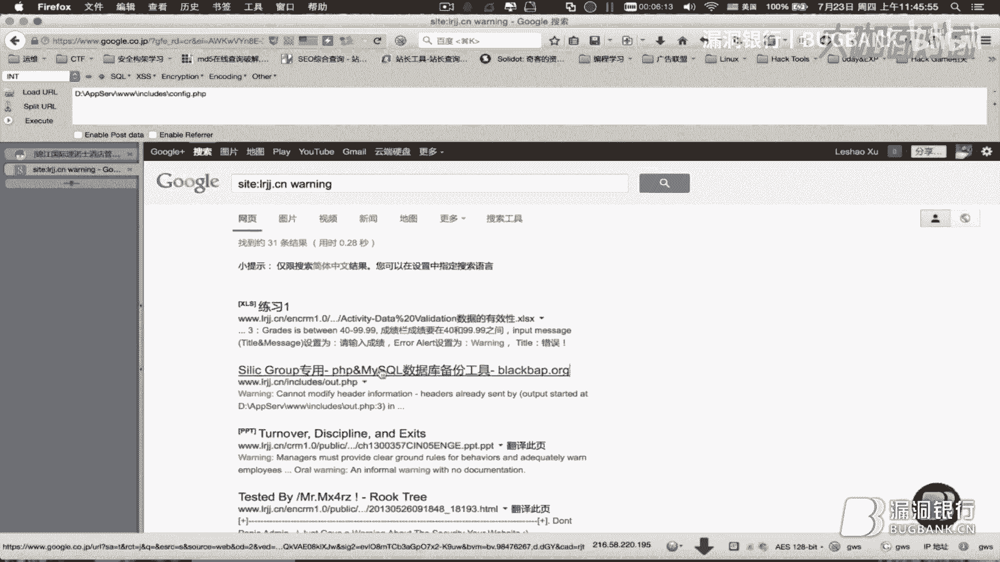
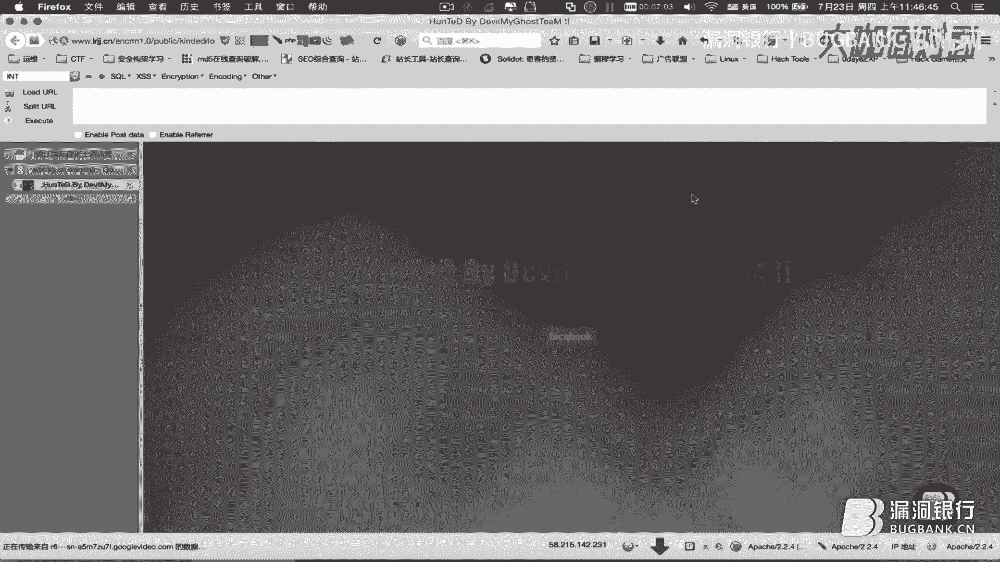

# 漏洞银行丨mysql-root全手工注入写马实例实战 —lshack 丨咖面13期 - P1：【录屏】Mysql实战案例——第13期lshack分享 - 漏洞银行BUGBANK - BV1A54y1a7Km

这边咱们做一个实战的入侵教程。

是这样子，在网上逛了逛，找到了一个这样一个网站，是比较适合咱们入门，通过一个网站怎样知道它是可以产生漏洞，然后通过怎样的手段针对这样的漏洞，来通过这种手段把它达到咱们最终的目的。

就是说把这个网站给黑掉了，那其实就是说获得的它一个管理员的权限，然后在这过程当中，因为咱们这个是偏域实战，没有说每一步非常必须按照咱们的技术，比如说咱们有一步是注入，接下来一步是必须要得到后台账号密码。

然后进入到后台，然后上传咱们的web share，就是我们的网站木马程序，就是说不是每一步必须苛求和传统观念当中的，入侵思路和手段一模一样，但是其中很多的操作，包括搜集信息，找到后台的方法。

还有一些注入的手段，还有拿web share的过程，都是有助于我们去理解如何，通过这个网站它所产生的漏洞，于是获得这个网站的管理员权限，然后现在刚看到这个网站，我们首先我们换一个浏览器。

这个浏览器因为URL它是会产生这样一个覆盖，你点击任何链接，它都没有很好的显示后面的参数，对吧，咱们用火狐，然后就访问这个网站，我们可以看到，它导航上面有很多这样一些，动态的小模块和链接，那不用管它。

我们先找到几则学院的动态新闻看一下，看到这个动态新闻，然后我们发现，它的URL地址栏上进行了变化，它首先是这个页面后面问号，来了一个ID等于70的参数，我们把这个参数和问号去掉，访问一下。

它的参数不正确，这我们注意到有一个报错信息去掉以后，咱们发现在这边，地盘APP server www。includes，然后这个global的fax文件，它是一个数据库的链接文件。

咱们以后网站检测做多以后就会知道，然后这边其实它又暴露了一个网站，它在服务器上所处的这样一个物理路径，和真实的物理地址，所以说，这边我们可以不用管它，知道有这样一个信息即可，然后就说明这网站。

它是可以进行一个报错的反显，那么说明它可能存在漏洞，于是咱们可以看到，在这个参数后面，它这边调用的是ID等于70，就是说这篇文章，它的名字叫做学院动态当中，上海召开旅游职业教育行，职位工作会议。

这篇文章它在数据库当中所存储的位置，是在ID序号等于70的这个地方，那么咱们用71看一下，没有这篇文章，那很简单，咱们换69看一下，69又换了一篇文章，那69-1呢，参数不正确，那咱们换68，68。

也是没有这个文章，但是从这我们就可以知道，这个ID后面这个参数，我们可以手动对它进行更改，并且进行操作，然后这个操作可以进入到数据库，让它回显咱们所需要的内容，是这样一个意思吧。

所以说接下来我们再看一下，网站首页关于我们，我们在学院简介这边看一下，学院简介，大家有没有注意，刚刚我点的是学院动态当中的，这个，ID是70，然后我们在学院动态的这边看一下，ID是67。

刚68有69没有70没有，它67又有，那咱们试一下66，还是有文章的，是这样一个意思，然后它这个学院动态，就说明是这个，News Detail对吧，新闻，综合详细细节，这样一个页面当中的。

66号文章是这样一篇，所以说整个咱们看到这个文章，这个网站是这样子，从数据库当中调取，然后显示给我们用户看的，那么我们擦掉以后看，擦掉这个参数看是，它告诉我们不正确，于是说明这个页面，说明这个页面。

它的代码有一定的问题，于是为了我们后期的注入操作，使得它反显，不会出现参数错误，这样一系列的比较暴力的问题，可以方便我们和数据库，进行互动这样一个操作，我们看一下这个，这个页面，这个页面大家看到。

是没有任何问题的，我把后面参数擦掉以后，我把后面参数擦掉以后，它是一个空白页面，但是没有显示任何一个ID号的文章，于是我们看一下，我们所看的是学院简介，ID等于2，然后我们看一下ID等于1是什么。

教务章词，对，那就是关于我们这个之下的一系列的小标签，那学院历史应该就是3了，咱们看一下，换成3，对很简单，就学院历史，那么4，可以我们尝试一下，看看3+1能不能操作到4，说明不可以，我们直接换成4。

看一下，是可以的，一个学院的使命，对，那56应该就是这两个后面了，然后，把参数去掉，没有像刚刚那样报错，并且页面显示正常，说明这个PHP文件它的代码是没有问题的，我们可以对它进行一系列的操作。

因为它在页面上会有一个正常的回显，给我们显示看，我们还是看一下ID对于4的话，是学院使命，ID对于2是学院简介，在这个地方，我们实施，进行一个手工的操作，手工怎样一个操作，首先因为拿到一个网站以后。

我们通过这边，咱们找到一个叫做注入漏洞，叫做注入漏洞，为什么，因为我们简单的提交一个单引号，会发现它页面同样出错，然后我们尝试提交一个恒等的条件，暗等1等于1，你发现它没有任何问题，因为1本来就等于1。

所以不会出现问题，那很显而易见，我们如果提交1等于2应该是不对的了，然后我们看到确实它页面回显是有错误的，我们可以看一下页面的圆满有没有什么问题，圆满一切正常，然后发现暗的1等于1和1等于2回显不一样。

那么这边咱们为什么要换浏览器呢，换别的浏览器也行，但是这推荐使用谷歌火护浏览器，下面有这样一个小插件，叫做hackbar，hack工具条，它这边你load一下，载入一下URL，然后提交。

会发现它重新刷了一下页面，这个页面咱们就载入到它这个插件里头了，然后这边我们可以看一下还有很多的设置，字符节的格式，很简单，咱们这边也一样提交1等于1，再按手动提交这个是没有问题，1等于2，是有问题的。

那么咱们这边进行手工的一个注入尝试，把它摆一下，20发现页面输错，然后AutoByte 20是有错误的，那么这边，咱们是使用一个二分法，因为大家看到在这，在我们查询ID对于提交ID对于2的时候呢。

就咱们查询2，它会调用回显给我们这篇文章，那我们后面转换参数，看一下，它因为它这个在页面显示的位置，我们可以查看一下元素，在学院简介这个地方，大家可以看到是这样一个class的元素。

它可以给它这个元素的属性是可以我们复制，产生回显在这个页面上，那么我们可以通过这个办法来知道，它页面上到底有几处是可以从数据库当中，回显字符串给我们看的，那么咱们这边一般通常首选的先从20起进行排查。

20我这边提交的话看一下，提交，页面是出错的，那么换成10，或者咱们换成1，用一个很简单的二分法，1是页面正常的，那么1和20之间很自然就是10，咱们看一下10对不对，10页面出错。

那说明是在1到10之间，咱们换成5再看一下，5是正常的，那说明5和10之间可能我们换一下7，7也是正常的，那就是在7和10之间，我们换一下9，9是错误的，那很显然就是7或者8，看一下8是错误的。

那OK确定就是7，咱们使用数据库的一个联合查询看一下，它这直接插件可以直接提供你语句，然后我们看一下，它在整个页面，大家有没有发现整个页面的，4这个地方，还有3这个地方，可以回显给我们错误信息。

最后这边还有个2的地方也是可以的，那么由于它这个网站是PHP的，大家可以注意到是用PHP语句写的，所以说PHP语句一般都是结合一个，PHP+my circle的这样一个组合，来进行网站的一个搭建。

于是我们可以看到，我们可以看到，my circle数据库的用户名，咱们怎样进行查询的，可以在4这个地方看一下，user对吧，很简单查询它的用户，我们看到，4这个地方替换成user用户查询用户以后。

咱们页面上刚刚是4的地方就反显出来了，说明咱们当前网站连接的数据库，它的权限是root，权限很高了，这样大家应该有一些常识吧，然后我们可以看一下，它是不是可以包含网页文件，load file一个。

这边咱们就要用到刚刚那个回遣的，回遣的网站绝对路径了，通过site这样一个网站的语法，搜索关键词我们可以看到，好这个百度大家知道，可能不太给力，我们用一下谷歌试试，谷歌通过搜索这样一个语法。

大家可以看一下，你看就爆出了这样网站的一个绝对路径，然后我们这个页面是在网站根目录下的contact。php，那么网站的根目录应该就是这个了，到www为止，然后我们稍微的编辑一下这个路径。

然后对它进行16进制的编译，这边大家还是可以用一下小插件，它没有16进制的一个加密，然后我们可以切换到，咱们可以使用这个工具，16进制是这个，选选复制，然后咱们提交到这个URL上，还是放在4的位置就行。

load file，加载文件，查看哪个文件就是咱们这个16进制的，提交一下看看，大家看到没有，这就爆出了很多的网站的源码，这其实咱们通过查看页面的源代码，我们可以看一下，因为在这个页面上回显。

由于它网站CSS的排版问题，会出现很多的乱码和格式的不成觉，我们通过源码的查看，应该可以很清晰的看到这样一个现象，我们往下拉一点，看一下大家看到这边，就是一个就是网站源代码的泄露。

从这边开始红字PHP对吧，看一下，对一直到这边都是在进行一个源码的泄露，然后大家看到泄露的源码当中，有这样一个include的文件，它是非常重要的一个信息，可以看到comments。

接下来就是一个连接数据库的语句，对吧，数据库一个查询语句，所以说，可以通过再次查看这个文件，然后我们可以获得更多的信息，这边咱们尝试一下，我也不是说百分之百，还是通过，构造这样一个绝对路径。

然后对它进行16进制的转换，然后再，转换了以后，再放到这个里面，还是这样提交，我们可以看一下它产生了什么变化，应该是读取了另一个文件，大家可以看到，从这开始又进行了一个源码的泄露。

我们很容易的又看到它包含了一堆，require set root，请求了站点跟文件下面的哪些，这样一大堆文件，这样一堆的文件当中，咱们网站检测做多以后，很显而易见的可以看到。

这样有一个英文单词叫做configure。php，那一定就是网站的配置文件了，对吧，于是我们可以还是和刚刚一样的操作，还是和刚刚一样的操作，把它复制下来以后，对它进行路径的编译，再转换成16进制。

然后放到这边进行查询，提交，大家可以看到，还是看网站源代码比较方便一些，我们拉到下面看到相关的信息在这边，对吧，大家很明显的可以看到这样三条信息，dbuser是root。

就说明印证了咱们刚开始请求的那一条，查询的user的信息是root@localhost，就说明这个用户他确实是root，那又印证了咱们这个网站，现在咱们查询的，查询的文件和数据库的所对应的用户。

确实是root，就是这个网站使用的数据库的用户，那么这边很简单的，下面一句就是pwd，显而易见的是一个password，这两个信息就提供给我们了一个非常重要的入侵的证据。

于是我们把它复制下来以后进行一个保存，好。

然后因为他是mysql数据库，所以说咱们可以尝试看一下，有没有相对应的一些，它的管理地址，这个其实大家后期可以知道，这个网站已经被人黑过了，已经被人黑过了。

那么通常手段，因为这网站毕竟它确实是比较典型，所以这边拿出来给大家看一下，作为一个入门来进行一个练习，我们可以看到这边都是被人黑掉的，应该是，有还有一些老外的黑夜。

做的还是比较酷炫，我们来找一下，(音量调整中)。

(音量调整中)，(音量调整中)，(音量调整中)，(音量调整中)。

咱们不浪费时间，因为它是MySQL，然后我们看到这边有一个，MySQL数据库备份工具，于是咱们可以尝试，猜测一下，这也是经验所得毕竟，因为教大家了这个，通常的入侵手段操作以后，很简单的一个道理。

也是所有，你们如果去问一些，做网络渗透的，工程师来说，他们手上所有会的东西，以及操作的，入侵手段的操作，原模原样交给你的话，那同样看到一个网站，他十分钟看一眼，就可以知道怎么黑如何黑，他进行操作以后。

最后是不是能黑掉，只是一个时间问题，但是同样一个网站，如果他十分钟能黑掉的话，扔到你手上的话，这个半个小时或者说几天几个月，由于一个经验的产生问题，我们这边可以尝试通过我的经验，我们可以尝试一下。

访问这个地址，我们可以看到他，网页的title已经出来了，是PHPmyadmin，他是mysql的一个，web UI的访问界面，那他这边也提示你了，一定的信息，我们可以尝试看一下。

他的mysql的port是3307，我们可以看一下3307是不是能够访问，这边看来是访问不了，那我们就用他这个默认的账号密码，也登录一下看看，root usb w，看一下，是无法登录的。

那肯定一定是用到咱们这个密码了吧，我们copy下来。

以后尝试登录，我们看这个网页的，加载进度条就知道他的，一定是登录进去了，然后登录进去以后，这个数据库呢咱们有一个很重要的，获取，web share的手段，是针对，mysql数据库和，有这个，和有这个。

网站，数据库，web ui操作，控制台的，思路有一个独特的思路，可以这样进行操作我们先看一下，点击这个sql语句这边，因为咱们现在是以root登录的，所以说我们有至高无上的权限，可以这样进行操作。

然后通过，这样一个语法，select，fuck you，后面加上一个，php的一句话语句，这一句话语句，其实就是一个一句话木马，那一句话木马的原理后期，再跟大家出另外的课程进行讲解，这边咱们就只需要。

使用会使用就可以了，因为如果你真的想，改自己的一句话语句的话，你还非得懂那个php，代码对吧，然后这样子以后再，into out of file到咱们的这个，网站的根目录下面，就这边。

我们只需要这个后半句就可以，然后叫做，fucked in php，复制下来，以防止等一下操作失误，以后不用再重新打了，然后我们执行查询，他说已经存在，那我们就查看一下，是不是已经存在，没有。

然后他会显示说第一盘的，这个当中少了，少了一个，转译符，于是我们添加两道杠试一下，执行，执行成功，那咱们再访问这个文件，存在，然后我们使用一句话的，工具进行连接，执行，执行，执行，(按钮扔出主板驱动)。

前后边选择php，然后我们看一下，它已经将目录词盘都浏览出来了，说明这个一句话是成功的，于是我们可以看到，点击任何一个词盘都可以看到它，目录下面的任何的信息，我们可以通过，这个路径咱们找到它的网页地址。

d盘的app server www。includes，看一下d盘的app server，www，includes，下面，configure。php，对吧，这就是咱们刚刚看到的一模一样的信息。

当我们有这样一个浏览的权限以后，我们当然可以看到在www，这个是网页的根目录，根目录下面我们可以看一下，txt。php，这是它放的测试脚本文件，我们可以新建一个，新建一个文件，txt，我们同样也写上。

hacked by suzhou，然后我们对它进行保存，它左下角提示操作完成，然后我们再通过浏览器，访问这个文件，对吧，我们对现在就说明。

咱们可以对这个网站进行任何的操作更改，都可以，至始至终这一步达到以后，咱们可以称之为这个网站被咱们黑掉了，谢谢观看 下期再见 拜拜，(關於多謝感謝觀看)，(字幕製作/時間軸：秋月AutumnMoon)。

(字幕製作/時間軸：秋月AutumnMoon)，(字幕製作/時間軸：秋月AutumnMoon)，(字幕製作/時間軸：秋月AutumnMoon)，謝謝觀看。

