# 漏洞银行丨phpMyAdmin getshell-雨幕丨咖面66期 - P1：66期丨phpMyAdmin getshell独家技巧详解-雨幕 - 漏洞银行BUGBANK - BV1Mt411f78w

(音效)。

为知识而存，因技术而生，小朋友晚上好，欢迎参加第66期漏洞银行安全技术直播，来咖面对面，我是陈秋秋，今晚我们请来了一空间安全团队的创始人宇木，他有着两年的信息安全讲师经验，对web渗透，代码审计。

漏洞挖掘，工具研发都有一定的研究，今晚他将为我们分享独家的技巧方法，如果你在挖洞时会遇到瓶颈，没有思路，那今天内容一定要仔细听啦，在他演讲结束后，还会有十道说不清的互动问答环节，问答结束后。

宇木大咖会选出一名幸运观众，赠予由投入安全团队陈小兵所著的，安全之路web渗透技术及实战案例解析，下面就请宇木大咖开今天分享吧。

好，谢谢秋秋，大家好，今天我要给大家讲的是一个，PHP Myadam Get Shell的一个技巧，首先我们来看一下今天的一个目录，第一点呢我们肯定要去认识一下。

这个PHP Myadam是一个什么样的东西，然后呢我们就要讲一个get shell的一个思路，毕竟这个技术上面的一个共享，更多是一个思路上面的共享，我们只要掌握了一个思路，就可以去更好的去发挥。

积极的一个渗透测试的一个能力，那么第三呢我们会结合一个，PHP Myadam 4。8。1这个版本，去做一个get shell的实战，那么懂得攻之后呢，我们作为一个渗透测试人员呢，肯定也要懂得如何去防。

对吧，攻防是相互促进的，所以最后呢我们也会讲到这个PHP Myadam，漏洞防范的一些方式，PHP Myadam是一个以PHP为基础的，以web based方式架构在网站主机的。

一个MySQL数据库管理工具，然后的话让管理者可用web的一个接口，管理这个MySQL的一个数据库，那么我们归结来说，它就是一个网站式的一个，MySQL管理工具，你可以这样去理解。

就是我们使用这个PHP Myadam，就是相当于我们是以网页的形式连接到了，我们这个MySQL的一个数据库，MySQL对应的一个功能，它也能够去进行一个执行和操作，所以在渗透测试过程中呢。

我们也会经常会利用到它，去完成一些get shell的一个过程，我们来讲一下这个PHP Myadam的一个get shell思路，不管做什么测试，首先我们要明确一个目标，如果你连目标都不知道的话。

那渗透就失去了这个意义，因为你会陷入一个很迷茫，然后的话效率会非常的低下，特别是在工作中，你也需要跟客户去交流，明确这个渗透测试的一个目标，紧接着是一个信息收集，这个信息收集的重要性我就不多说了。

因为知此知彼方能百战不殆，那么我们这里不讲其他的一些信息收集，例如whoista这些我们就不提及，因为我们今天要讲的就是一个PHP Myadam的一个get shell思路。

那么我们主要收集的这个信息呢，肯定要跟这个PHP Myadam的get shell有关的一个信息，例如PHP Myadam的一个路径，它的一个URL是什么，然后它的一个版本，然后还有一个账号信息。

至于这个信息收集呢，等一下我会给大家去做一个简单的操作，还有一个简解，那么我们先把第三点给讲完，第三点是一个漏洞挖掘与利用的过程，我把PHP Myadam的利用方式分为了两种，一种是非特殊版本。

也就是说这个时候呢，它是对版本并没有一个特殊的要求，而特殊版本漏洞利用呢，它是对版本有着一个特殊的要求，例如我们接下来要讲的一个PHP Myadam 4。8。1这个版本，它是有一个明确的版本要求。

当然有可能4。8。x有其他版本也可能存在对应的一个漏洞，这就需要大家去进行一个挖掘了，信息收集是我们这个PHP Myadam Get Shell中的一个重头戏，也就是说你信息收集做好了，你就成功了一半。

首先我们要做一个明确这个路径。

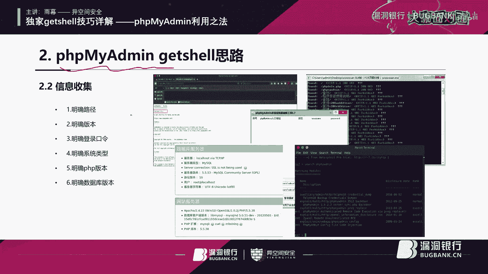

如何去明确这个路径呢，我们可以去借助一些工具，也可以去借助一些在线的一些引擎来去进行一个。

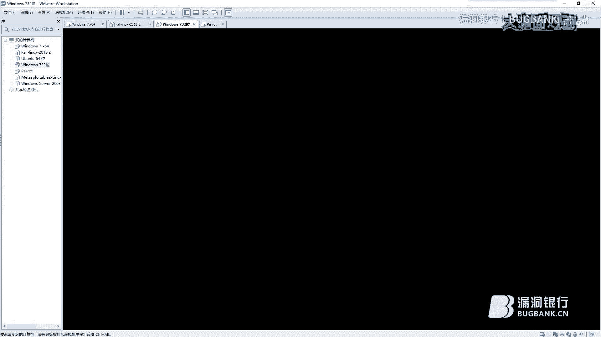

那么我这里呢，就使用一个WWSquare来进行一个扫描，但这种工具会非常之多，规则来说，它就是一个爬虫，这种工具完全可以去自己写，我们先查看一下这个IP地址，192。168。182。133。

这里现成我们提高一下，就是增加它的扫描速度，那么在扫描之前，我们简单的来给大家去讲解一下，我搭建的这个一个环境，那就是一个PHP Study 2018，就是然后看一下它这个PHP版本是一个5。5。

38这个版本，这里跟大家去讲一下，避免大家下去尝试的时候，因为一些环境的不一致而导致的一些问题，那么紧接着我们就开启一个扫描，扫描的成功概率大小呢，取决于你个人字典的一个大小，对吧。

这一点大家一定要明确，所以我们在进行渗透测试的过程中，要不断的丰富个人的一个字典，例如它现在已经跑出来了，它的路径就是一个PHP埋，也就是说我们只需要在它后面直接加上这个路径即可，我们先去访问一下。

我这里之前已经弄好了，当然你也可以自己尝试在后面去拼接一下，这种是最为简单的一个尝试方法，一般它默认的路径如果没有改变的话，就会在一个根路径下面可以直接访问，当然现在的安全人员或者说现在的一个管理员。

他更多的会放在一些特殊的一些路径之下，不会说简简单单的像这种，直接就能去进行一个访问，那么这个阶段我们就大致确定了我们这个URL，就是我们这个PHP MyAdmin这个URL对吧。

当然你也可以自己去利用一些搜索引擎来去进行一个搜索。

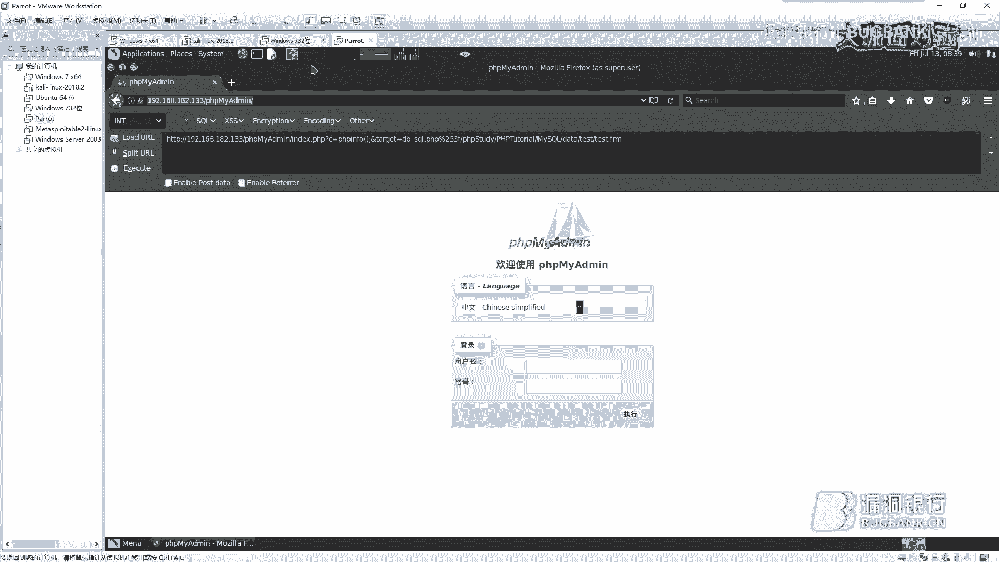

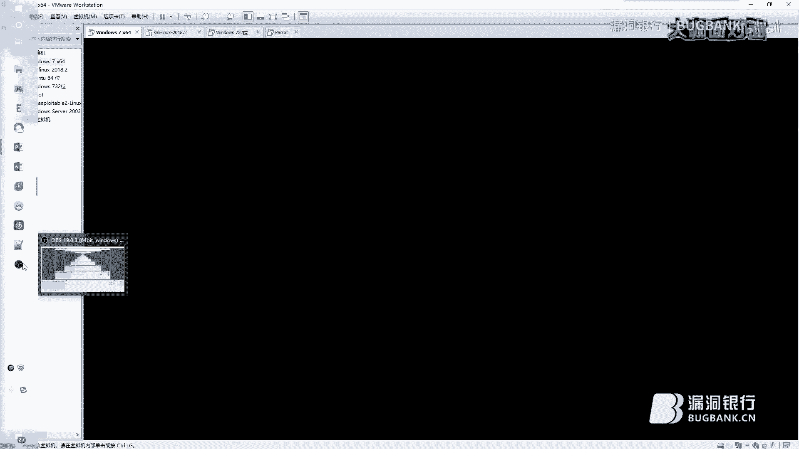

这点就不讲了，紧接着是一个明确版本。

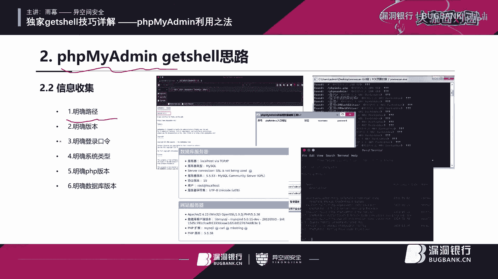

这也是非常重要的一个信息点，明确版本如何去明确呢，我们这里可以利用它内置的一个文件。

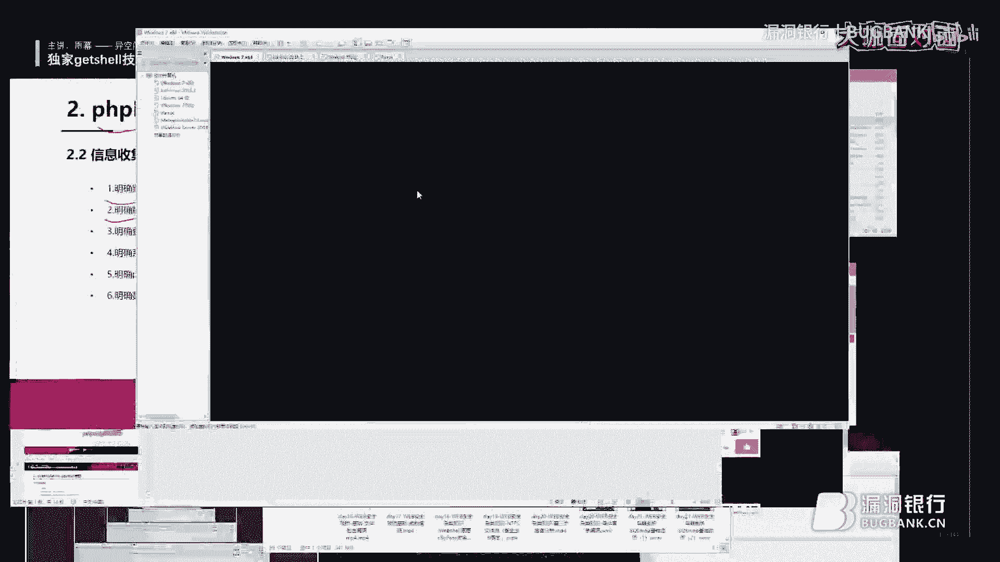

在这里我们利用的是哪个文件呢，我先给大家去打开一下，所以在有源码的基础上，我们一定要多加去分析它这个源码，看看能不能去找一些有价值的东西，现在其实就是处于一个白盒的阶段了。

因为我刚才那里没有加那个PHP MyAdmin，应该是接在后面的，我们看到这里的话，它就会产生了这个版本是4。8。1，就是通过它这个说明文档，记录获取到了我们这个版本信息对吧。

这在我们接下来的渗透测试至关重要，并且这个文件一般管理员他不会去注意到，也就成为了我们可以利用的一个点，然后我们回到这个PPT。

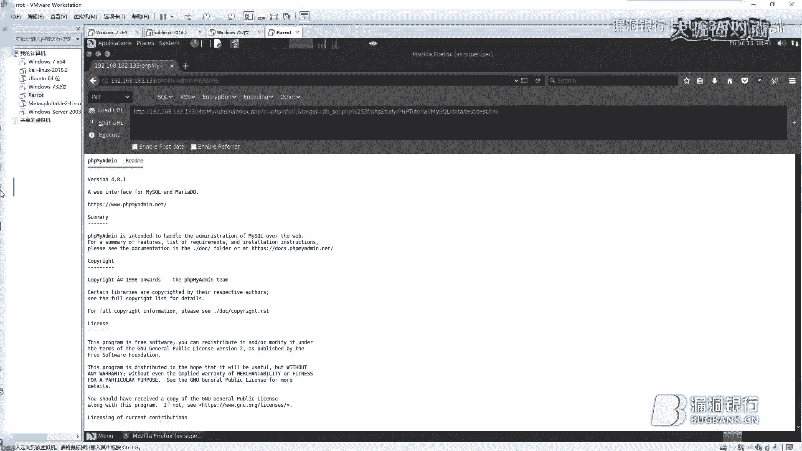

紧接着就是明确的一个口令，这个口令有一种就是一个手工，还有一个暴力拆解的一个方式，那么手工就是简单的尝试一些，这种非常之弱化的一个口令，也可以去借助一些工具。

例如这个PHP MyAdmin多线程爆破的这个工具。

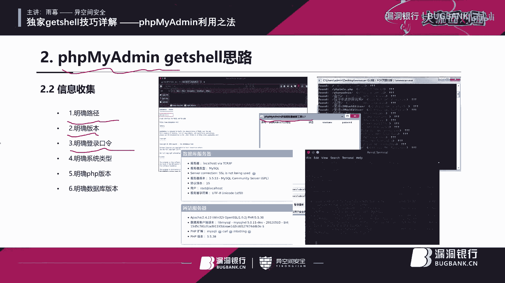

但是这个工具它有一个局限的地方在哪呢，就是它对版本是有一定的要求，好像是4。0以下的版本，它是能够爆破出来的，我们这里的4。8。1这个版本，它是肯定爆破不出来的，这个工具怎么去使用呢。

我们就填充你的URL把它弄到这里来，然后我们就把这个拉过来，然后就开始一个爆破，其实你会发现我们这里登录的一个账号密码，就是一个ROT，然后密码是ROT，但是它并没有爆破出来，我们可以看一下它的密码。

第一个就是，但是它并不能成功的爆出来，也就是说工具给我们提供的只是一个参考，并且它对版本是有一定的要求的，这一点大家一定要去明确了，并且工具不能说只借助别人的，完全可以写自己一个工具。

那么这工具的拓展的话，我建议大家就去使用这个Python来去进行一个编写，他们只不过是将我们这个爬虫的一个过程去进行一个，或者说是将一个请求的过程给图形化，这个时候呢，你完全可以手工拆解，对吧，手工。

手工就拆它的一般默认的ROT这种，看看能不能登录，如果能登录的话就最好了，诱口令是危害非常之大的一个漏洞，那么这个时候呢，我们已经登录过了。

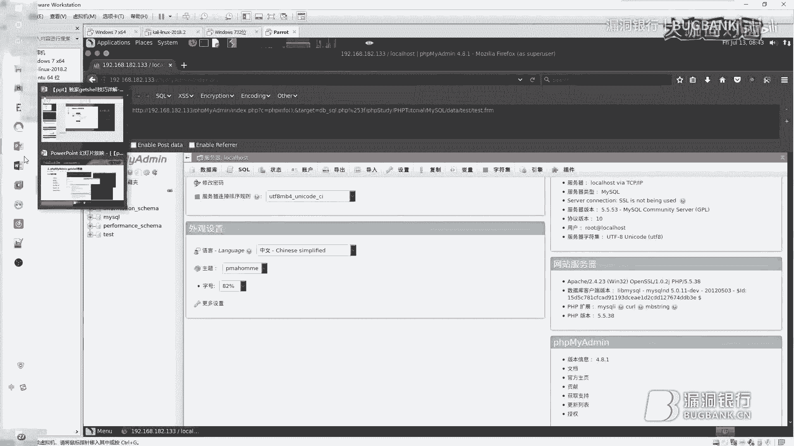

所以在渗透过程中主要是一个思路的讲解，我们要懂得这个思路，不然的话稍微变一变这个网站一个形式，你就不懂了，那就很尴尬了，对吧，那么紧接着我们要明确这个系统的版本，那么为什么要明确这个系统的版本呢。

我们知道Linux对权限的控制是非常严格的，但Windows呢，它对权限的控制是比较缩小的，所以说在Windows下，Gesture的难易呢，是会比这个Linux要容易非常非常之多。

所以这个版本一定要明确，这个系统的类型一定要明确，紧接着是一个PHP版本的一个确定，我们来怎么去确定呢，最后是一个明确这个数据库的一个版本。

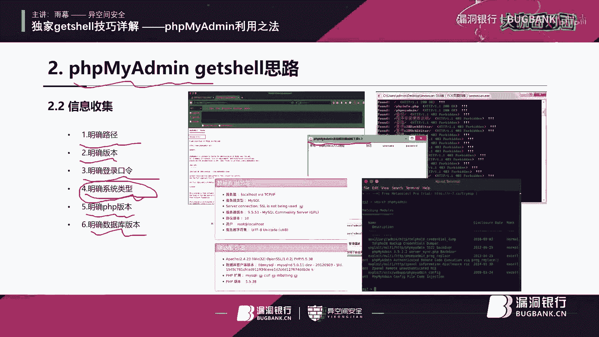

如果我们登录进来，我们就可以看到它这个版本的一些信息，看到没有，它的一个是一个Windows32位的运行在，然后它的一个PHP版本就是一个5。5。38，那么MySQL的一个版本就是一个5。5。

53这个版本，也就是说这个时候我们已经把该有的一个信息去进行了，一定的收集了对吧，也就是说我们这次需要Gesture的一个目标是一个，Windows32位下的一个PHP版本为，5。5。

38的一个版本的一个网站。

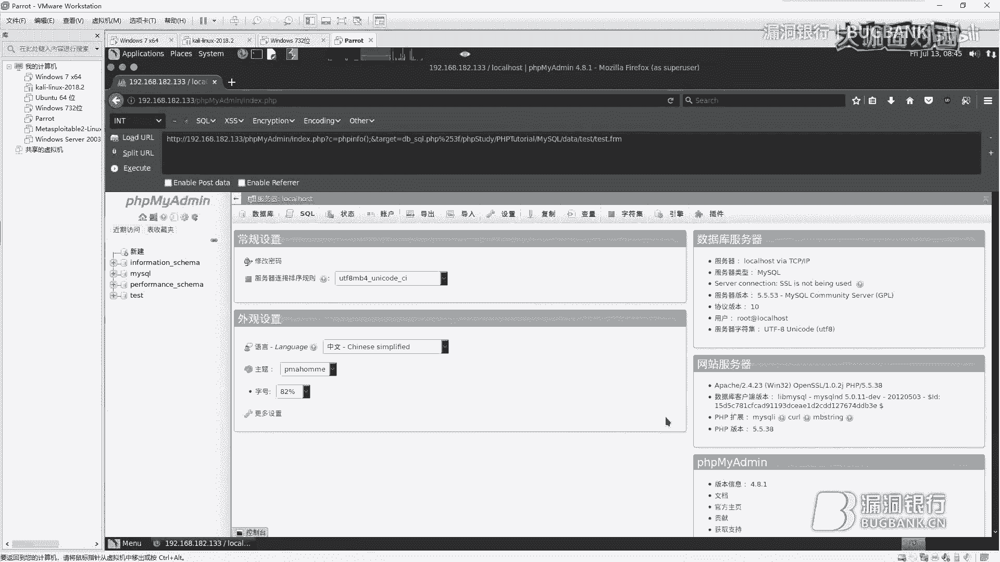

我们知道PHP它的版本变动最大的就是5。4和5。5，5。4算是一个分水岭，很多特性的产生时，它这个东西会变得更安全，也就导致了我们这个渗透测试变得更为困难的一些，当然我们这里也可以明确了这些信息之后呢。

我们就继续往下看，信息收集之获取它这个网站的真实路径，为什么需要获取到这个网站的一个真实路径呢，我们知道不管你是写校还是读取文件怎么样，你都需要获取到它的一个网站的真实路径。

不然的话你就没有办法去进一步去进行操作，那么我们就获取网站的一个真实路径去做一定的讲解，首先第一点就是通过这个PHPinfo的函数去进行一个获取。

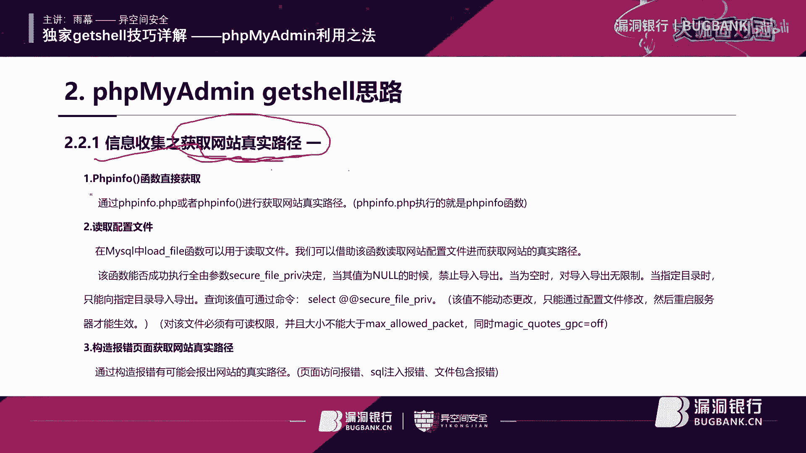

那么这个时候呢，也要求大家对这个PHP沙底对一些常见的一些，我们软件有一定的了解，就是这种组合性的软件，我们可以去看一下它这个，如果管理员没有删除的话，我们可以直接访问到这种文件的。

我们就可以去获取到它的这个网站的一个真实路径，也或者使用我们这个PHPmyadmin，来去进行一个查询的操作去进行进一步的获取，那么我们先来演示这个，永远不要忽视一些小细节。

如果正是因为管理员的一些小细节，给我们装了一个漏洞，但是在这个路径下，我们通过这个PHPinfo，我们就已经基本上可以确定，它这个是使用一个PHP沙底这个软件来去搭建的一个网站。

只要你稍微了解过这个PHP沙底，你通过这个路径，你就完全可以知道它的跟路径，当然你也可以去继续往下看，看到这里，对吧，这些信息它都已经直接的给你去指明白了，看到没有，这里就是它网站的一个真实路径。

要说这个时候呢，我们也进一步去挖掘了它的一个真实路径，也可以去看一下它这个L文件，就是它这个指针文件是否存在你想要的一个信息，你看到没有，这时候它就直接爆出了一个绝对的路径，所以安全没小事。

一点点小细节没有做到位的话，就能引起一个进一步的一个渗透，我们作为渗透测试者，一定要去利用各种可能性的文件，去进行进一步的信息收集。

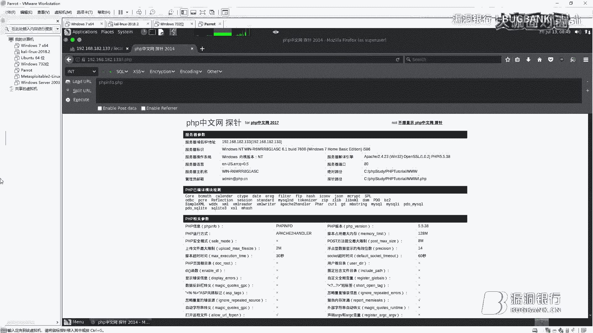

紧接着我们讲一下这个读取配置文件，这个在5。3，也就是说大概是5。2以下的一些版本，那时候好像我记得是对这个参数，它是并没有一个要求的，就是它没有新增有这个特性，但是现在的版本基本上都是5。3，5。

4以上，那么这个时候呢，我们安全人员的话，就思路就应该跳过来，不能说还是像以前的直接读取这个配置文件，这种思路可能不太可取，因为我们不知道是否能够成功去读取，我们首先要去进行的一个查询。

就是看看它是否为NULL，NULL的话就禁止导入导出，当为空的时候的话，它就是对一个导入导出做一个限制，如果这个值它是指定了一个目录的话，这个时候呢，不可置疑的就是说。

它只能像往指定的一个目录进行一个导入的导出的操作，对吧，那么查询的命令只需要去使用这条命令，对吧，然后有一个注意点就是该值是不能动态的去进行一个更改，也就是说我们哪怕去使用到PHP Madmi这种工具。

我们是没有权利去动态更改的，我们只能通过它配置文件去进行修改，然后重启它的一个服务器，这样才可以去进行进一步操作，然后再回到来讲这个东西，这个localflag就是一个读取文件。

在以前会经常会用到这个东西来去进行一个更改，那么我们这里也要注意一个点，就是对该文件必须有一个可读的一个权限，就是你在满足上面这个条件下，你还要满足，它要能可读，并且你读的大小不能超过它限制这个大小。

同时这个参数要处于一个off的状态，这个时候你才完美的去利用这个函数来去进行一个函数的操作，那么实至今日，我们更多的思路不是借助这个函数来去进行一个渗透测试了，那么借助到这个东西。

进行get下的或者说提前的思路，更多是处在这个linux下，因为我们知道linux下对这个权限的划分是非常之明确的，划分明确之后，我们没有办法去进行一个读写的操作，那么这个时候。

有可能你可能会有一个读的操作，对吧，那么读的操作，我们可以去读它的一些敏感的文件，例如存放它这个密码，用户哈希子这些文件，去迂回的获取它这个哈希文件去进行一个爆破，获取账号密码来进行提前的一个思路。

那么第三点就是通过构造一个有可能爆出错误的一个路径，然后的话就让它爆出一个真实路径，常见的会有一些故意的加一些单双引号这种，或者说使用到这个SQL注入一个文件包含，我们先来演示一下这条它默认的。

这条命令呢是处于一个Node的状态，现在只要是一个新版本，它都是处在一个。

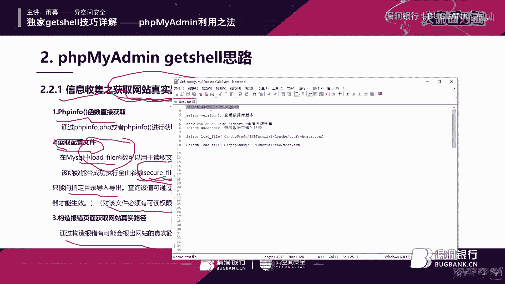

我们可以通过这个PHP MyAdmin来去进行一个查询操作，那么这里我要跟大家去讲一点，就是我们这个PHP这个SQL查询，还是跟我们这个MySQL命令端去进行操作有一定的差别。

如果你是想着通过这个PHP MyAdmin去使用这个local file，它导入的其实只是一个字节，并不能真实的显示到它的这个内容，对吧，我们看到这个时候的话它是为一个Node的状态。

如果这时候你强行的去写入一些东西。

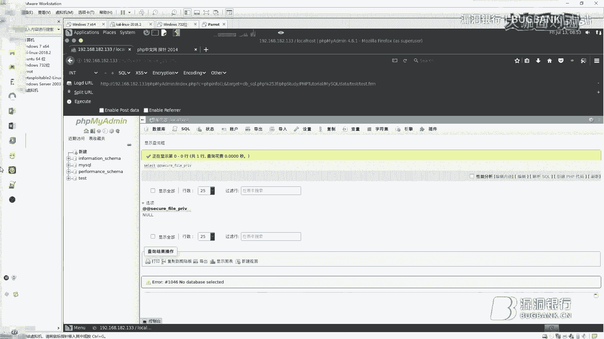

或者说你去读一些东西的话，它是没有办法正常进行，这一点大家也一定要明确了，那么讲一下第二点，获取真实路径，那么我们这个时候呢，就要对一些常见的比较重要的CMS有一个了解。

例如一个DDCMS这种对它的一个路径，当然我这里是随便举一个例子，你对这些CMS有一定的了解，并且它的版本更新会非常之坏，因为它一般的话一个漏洞出来的话，影响了一个版本，它就会马上又升级一下。

所以你一定要作为一个渗透测试者，你一定要去关注一些用户量非常之庞大的一些CMS，并且这种CMS它往往都是开源，但只要你懂代码，神经你可以把它弄下来去进一步去分析，紧接着你可以去接触一些搜索引擎。

例如一个百度、谷歌还有一个Apple FA这个空间搜索引擎，去进行一个进一步的一个搜索，那么搜索的关键在哪呢，一些报错的网站有可能会发出一些关键写信，not就是错误。

或者这个时候有可能会爆出一个网站真实路径，我们就可以使用这条语法来去进行一个搜索，你可以把它理解为是一个谷歌语法，当然也可以通俗的理解为是一个搜索引擎，当然也可以去通过一个坏兆来获取到它的一个真实信息。

就是坏兆它都是保存某个状态下的它的一个网站的一个情况，所以坏兆也是我们可以利用到的一个点，好讲完第二点信息收集之后，我们来讲一下第三点，第三点是Gesture的非常之关键的一个点，就是漏洞的一个挖掘。

那么利用之前你肯定要有一个挖掘的过程，你如果没有挖掘到你怎么去进行利用，你要写我刚才说过你要读写文件，这个参数必须不为not或者处于一个空的状态，not和空是有区别的。

大家一定要明白空和not是不一样的，如果是not的话，它是没有办法正常的写入这个下，这个时候就意味着我们使用常规的这种直接写下的，或者是要写一句话的这种输入的话，就没有办法说正常的去行得通了。

我们可以看一下它的结果，来看一下这张图，我们查询带的是一个not，对吧，紧接着我们尝试去插入我们的这个木马，就是我们的webhack，我们会发现它会报这个错误，正是因为这个值，它的设置为not。

导致了我们没有办法正常的去写入这个文件，那么这个时候呢，我们就要换一个思路，看看能不能别的思路，至于这个常规写下的思路，这就不深究了，你只需要把你的一个校写好，放在这个sql里面执行就可。

我们主要讲的就是一个新思路的一个产生，就是一个日制写下，测试人员就是利用凡是能利用的东西来去进行一定的操作，那么在使用这个日制写下，有一定的前提条件，就是首先这个全局变量。

这个local和localframe，就是这个是一个导出的一个路径，就是你日制的一个路径，这个是明确是否开启这个日制状态，所以我们首先要明确这个信息点，我们要进行一定的查询，查询完毕之后。

我们还要明确它还有一个前提条件，就是这个日制的一个设置是不需要更改它的一个配置文件，可以在这种网页端，或者说直接执行这个语句来进行一个动态的更改，所以说这里就跟刚才我们所说的这个参数是有区别的。

这个是不能动态更改的，这个参数我们是可以去进行一个动态的更改，所以说这个时候我们可以就可以尝试去利用它，继续往下看，刚才说到如果它属于关闭的，我们就要把它开启，但是我们一般情况下。

它都会处于一种关闭状态，反正你是有权限去进行执行的，这时候你就set global，然后这个参数让它变成OS，然后这里就关键点了，我们这里的一个网站证实路径。

之前也不断重复了这个网站证实路径的一个重要性，这里就得到一体现，如果你不知道网站证实路径的话，你写的一个路径的话，没有办法通过UIL的形式去进行一个正常的访问的话，那这种情况下。

你就是没有办法进行下一步的渗透测试，所以我说网站的一个证实路径收集非常之关键，接着我们来看一下如何去写用这个"笑"，这种你是可以动态的去更改的，没有一个特殊的限制，前提等你把这个信息给收集了。

你就写"笑"，如何去写"笑"呢，你就把你的一个一句话，或者说一些免删的一句话写好。

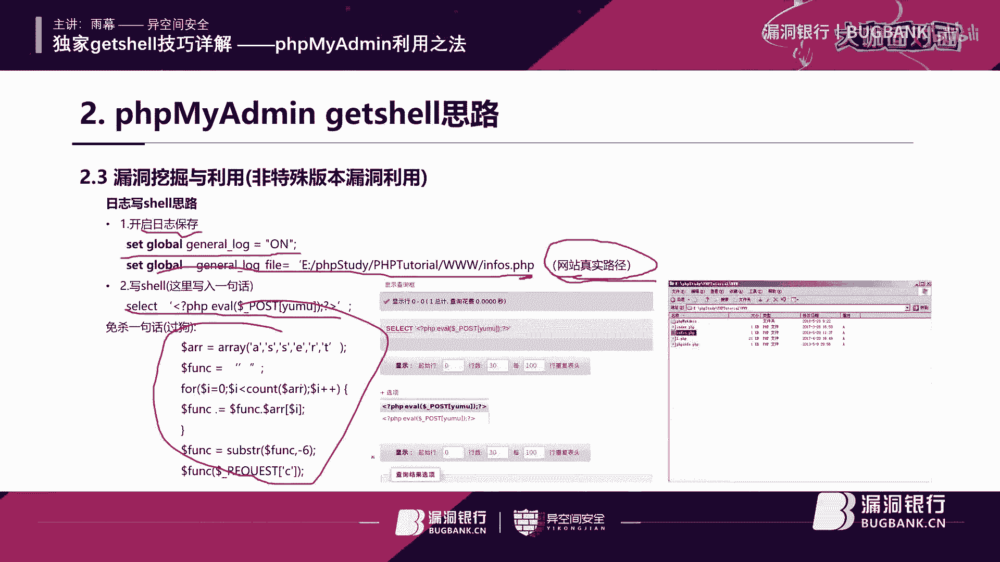

去放到这里去执行就可以了，为什么呢，我们这里每执行的一条命令呢，它都会保存在它对应的一个日志文件上面去。

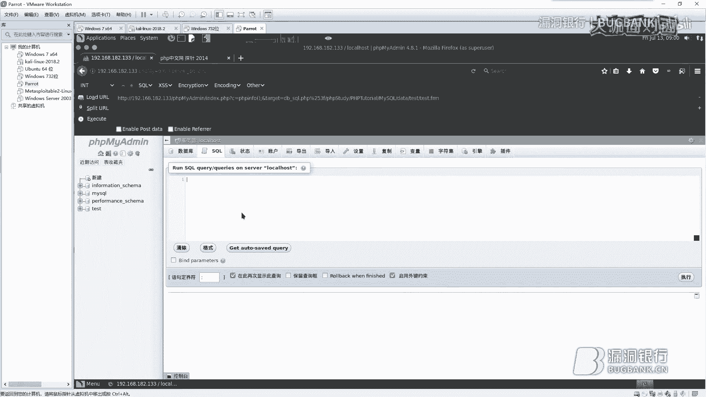

而我们这里就是动态的更改了它的一个日志文件，让它设置为我们这个文件，而我们只需要执行这么一句笑一句话，就是插入这么一句话，它就会把你写到这文件里面去，然后我们只需要访问这个inforce。

php这个文件，它就已经能够正常的去执行了我们的一句话，那么这里有一点就是我们在渗透测试过程中，可能会设置到的一些安全防护元件，那么这个时候呢，我们可能可以去写一些过沟的利诱这些的。

就是使用了一个让它使用素组，然后去进行一个混合拼接的一个方式，来去构建的一个一句话，这个时候就发现我们菜刀已经是正常连接，然后密码的话就是一个鱼幕，前提重要的事情说三遍。

就是你这个网站的真实入境必须要明确了，好，最后的话我们来讲一下特殊版本的一个漏洞利用，那么如何去利用特殊版本，既然跟版本有关的，我们肯定要去明确它这个版本的一个信息，一般的话我们主要是借助这个文件。

当然你也可以去借助一些稍微有一些特征性的。

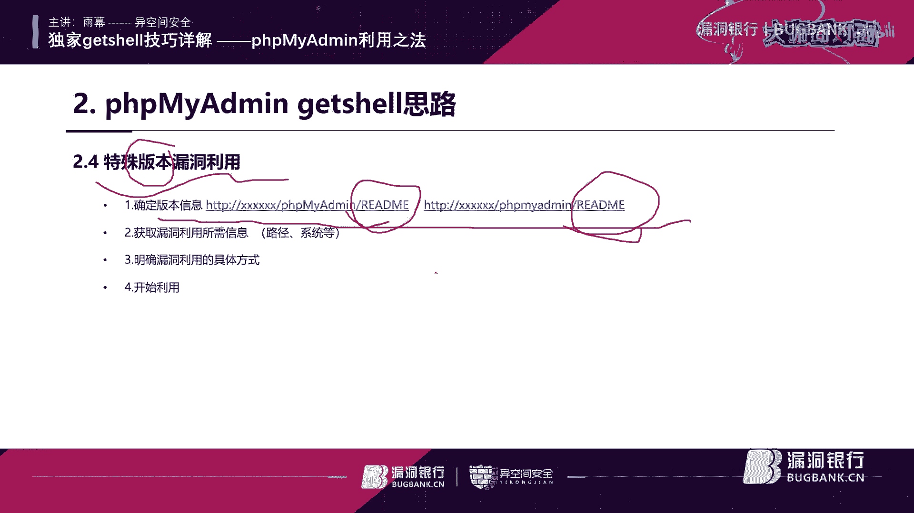

看看那些网页的一个登录状态，它有没有一些比较特殊的地方，就是通过它的这个。

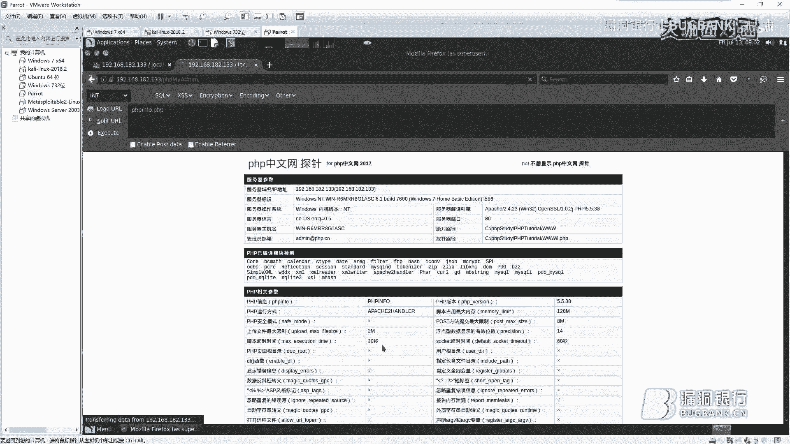

这我就不演示了，然后我们就需要获取漏洞利用所需要信息，这里我去获取了，当然每个人有每个人的渠道，一种就是通过一些网站，然后有人发出一些漏洞资讯，也可以说自己去进行一个代码审去，去进行一个漏洞的挖掘。

那么这里我们明确它利用的信息，它需要哪些信息，首先这个入境就不用说还有这个系统版本，有可能你linux和windows下利用的方式也不一次，环境的差异也可能导致你这个get shell是否成功。

那么第三点是明确漏洞利用的具体方式，对吧，这时候你把前面的工作准备完成了，这时候我们要明确如何去利用这个漏洞，你就要看人家讲这个思路，然后去研究，看看这个思路能不能通。

并不是说网上的人发出来的思路都一定能够通的，这时候就需要我们自己人为的去进行一个尝试，预知此事就是得拱心行，对吧，第四个阶段就是一个开始利用，我们这个PHP get shell的思路就大概讲到这里。

我们来看一下这个PHP myadmin 4。8。1 get shell的一个实战，那么我们就先讲一下步骤，等一下会给大家去进行一个实操，去进行一个讲解，刚才我这里讲到了特殊版本的利用是明确。

版本信息为第一点，那么我这里也写到了，经过刚才我们的信息收集，我们已经明确了它的一个版本信息就是一个4。8。1，然后我们就要去理解它一个漏洞所需要的环境，应该说它漏洞所需要的一个信息。

一般这种情况你版本满足了，一般没有加什么其他的防护，或者说一定修复条件的话，基本上就是能正常利用的，然后我们就要去理解它漏洞利用的一个原理，其实它这个4。8。1漏洞的一个原理，就是它漏洞产生的一个点。

在于它产生了一个漏洞包文件包含的漏洞，我们来简单的分析一下它漏洞点到底在哪里呢。

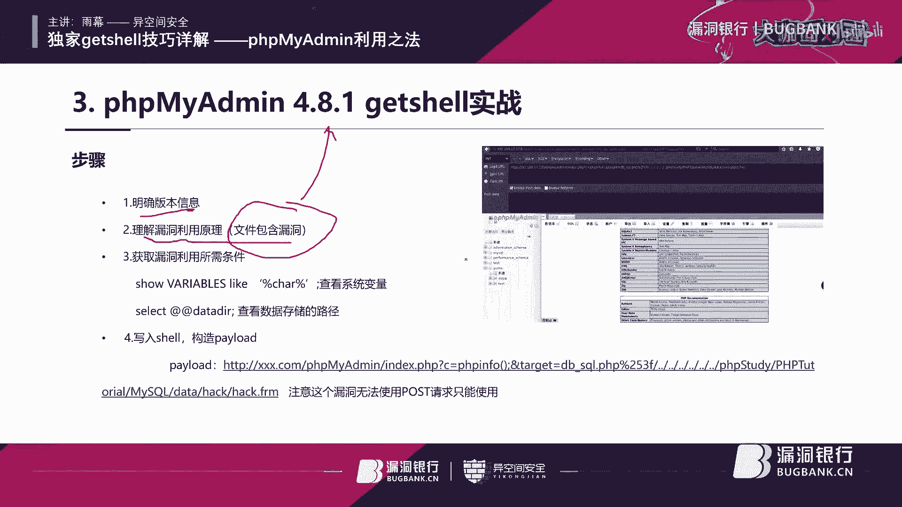

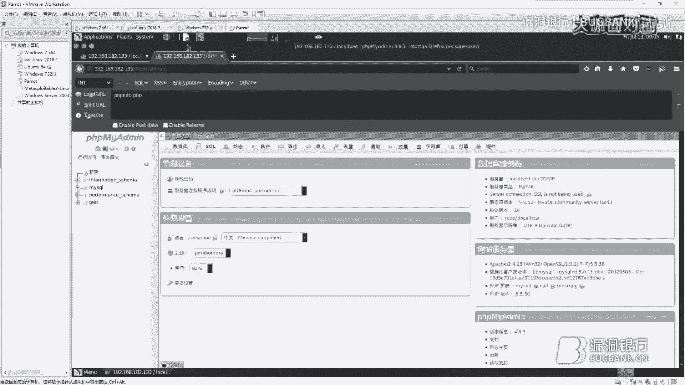

就是在它的首页文件里面，来看到这里我们就直接来看到它漏洞点产生的一个位置，就是在这里，我们知道只要有这个参数的，我们一般都知道肯定是一个包含的操作，如果对PHP有了解的话，特别你做代码审计的时候。

对这种包含操作也是异常的敏感，因为如果它包含出错了，它就是一个包含漏洞，对吧，所以我们做一个漏洞挖掘和代码审计，其实也是有一定的关联性，那么我们先来看一下这里，它就判断我们是否为空。

这里肯定只要你不为空，它就跳到这里来，对吧，应该怎么说呢，如果这里为真的话，它就不执行下面的东西，那么我们就没有办法正常去利用，对吧，我们要想的就是如何去跳过它这些条件，去执行这个操作才是我们想要。

对吧，我们这个时候就要明白，如果它为假的时候，它就会跳到这里来，所以我们这个时候就应该让这坨东西为假，就是返回一个FOR，那么这个时候，这些不太关键，检查它是否为自俯冲，这个就拼接。

不能以这个就是替换一个匹配，是否以一个INDEX的形式进行开头，然后这个的话就判断你输入的内容是否存在一个参数，里面就是这里，看到没有，我们只要说内容不是这两个东西，就说明就不满足它这个条件，对吧。

紧接着更为关键的，其实是在这个东西上面去，我们要过的点，也是在这个点上面去，我们就跟到里面去看一下，来找到这个函数，我们先来看一下它这个函数，它产生的一个点，主要就是漏洞点在哪里，它这里是通过一个阶段。

对吧，以问号形式来去进行一定的阶段，然后说你问号后面的，或者说你问号前面的，怎么解释好，就是你传入了这个参数值，就是你输入的这个参数值，最终会添加了一个问号，然后问号，以后从你0就是第一位开始。

然后去进行一个阶段，它这里的阶段之后，我们再来看一下这里，这里就是漏洞产生的一个关键点了，它经过了一个URL的一个解码，对吧，也就是说你如果使用一个问号的话，你就是没有办法去进行一个讨议。

那么这时候的话，你就需要去使用两次摆名单，来进行一个讨议，最后去返回一个flow，我看一下，明白到这一点，我们就明白主要关键点，就是在这里的一个两次URL，摆名单，就是让它讨议过这个问号的一个阶段。

那么这里也有一个点，就是如果我们这里直接去包含这种东西的话，就是我们使用一个路径去包含，因为我们这里是使用一个两次的白名单，有两次URL编码去进行一个要过，那么这时候你进行导入，是会就是你进行包含操作。

在网页上面是报一定的错误的，这一点大家也一定要去进行明确了，那么这个时候我们刚才已经知道了，它这个用的一些相关信息，但是我们现在有可能要去查询到它的一个数据存储的一个路径，就是我们这个DATA。

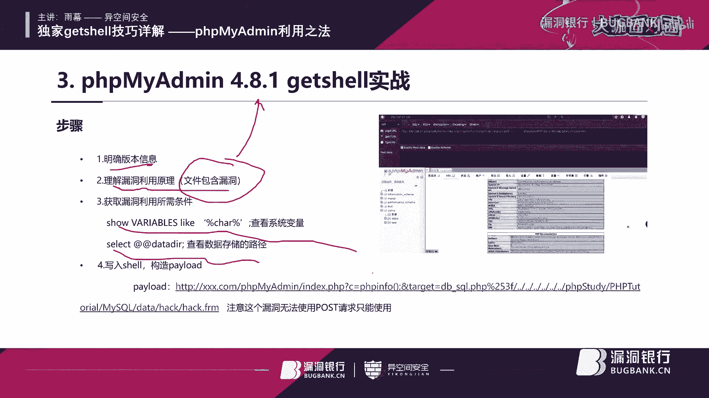

那么又要去查询了，我们再去执行这条直接执行这条命令即可，然后我们执行一下，就能找出它的这个数据存储的一个绝对路径，看到没有，它的一个绝对路径就是这个，就是在买SQL，不过只要你对这个，PHP。

SADI是了解的话，这种你猜测都能直接知道它是PHP，MADMIN，一般没有人会人为的去改这些路径的，很少，你知道一般使用这种PHP，SADI来进行搭建网站的管理员都是比较懒的。

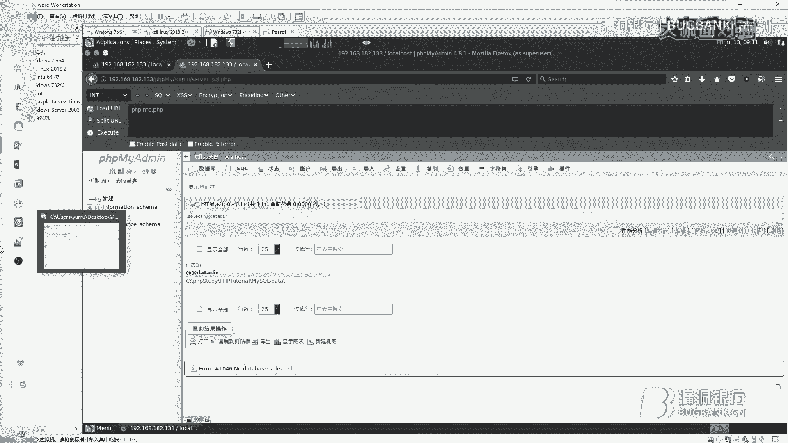

知道这个路径，我们就想一下，结合我们在网上获取到它的一个信息，这个时候结合我们刚才分析的我们构造的一个Payload，就是这样子的，这个是网站他们提供的，主要就是这个路径的问题。

我们这里使用到的是一个相对路径，能理解吗，所以说你这里的一个数据存储的路径一定要准确了，并且这里你写入的一句话木马，不能使用其他的一个方式去发起请求，只能使用一个guest，不然的话它会去报错的。

这一定，不能说报错，是没有办法正常去进行一个执行，为什么可以这样去利用，就是因为我们每建立一个数据表，它就会对应有一个FRM这个文件，然后这个FRM文件又存储有我们这个原数据，这个时候你应该懂吧。

其实是借助它来帮我们辅助完成一个写入的一个操作，你只要知道它是这个原理就行了。

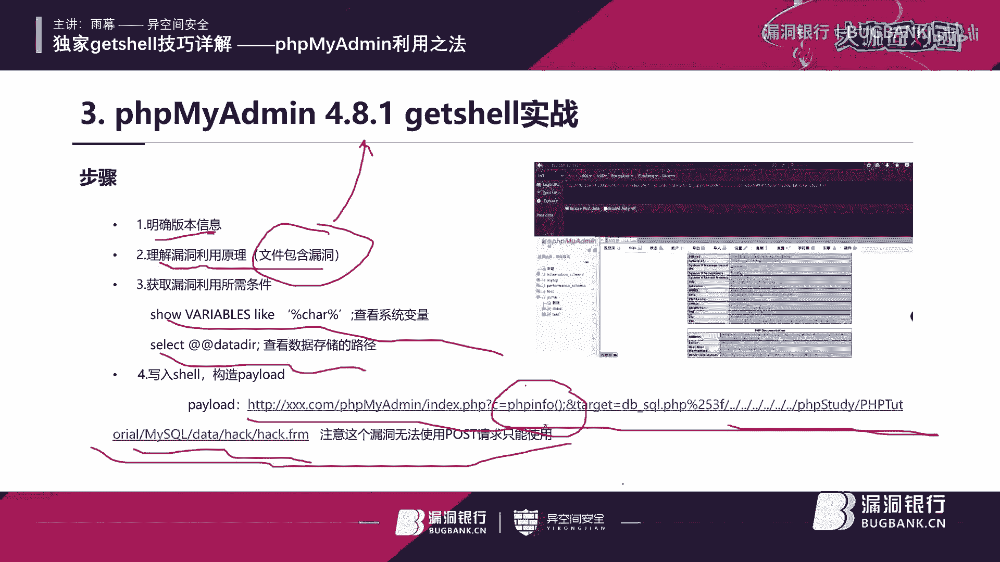

好我们来去进行一个数据户的一个新建了，首先我们可以去建一个羽毛，有这些编码的话你不用去管它，一般使用UTF-8就行了，那么创建数据户之后我们还要创建一个表，创建什么表也叫羽毛，字段你可以随意写。

我们一般只需要插入一个，你选四个也行，选一个也行，没有限制，我们就在这里插入一个一句话，对吧，但你最好可以去，如果一般这种长度是你自己设置的，对吧，那么你可以完全可以写入一个免删的，为了持久化。

避免一些工具检测出来的话，你可以写一些免删，其实这些类型的话你也不用去管，我们就直接去保存，那就行了，这个时候我们就会发现。

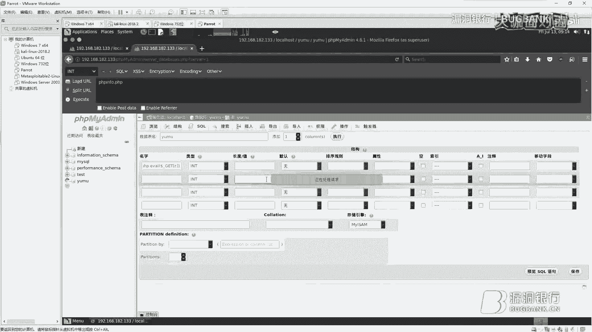

在这个路径下它已经生成了有这个文件了，看到没有，羽毛文件夹已经生成了，并且你看到时间9点11分，对吧，我们可以看一下我们插入的一句话在哪里，是不是在这里，这时候我们已经成功插入了。

那么紧接着我们要进行的，就是利用它来完成了一个文件包含操作，这里我们要把相对路径给加上。

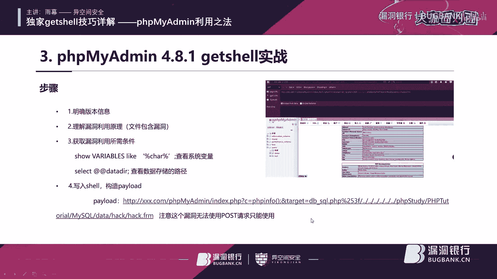

把这个改成一个羽毛，然后我们这时候再执行一下，这时候它可能会说这个检测有错误，刚才跟大家提到过了，它这个是会发起错误的，你看这个时候的话，我们已经成功执行了PHE Info。

也就是说我们这个时候已经成功的去get shell了，虽然会有一些错误的爆出，但是我们get shell的目的已经完成了，所以说这就是一个特殊版本利用的一个过程。

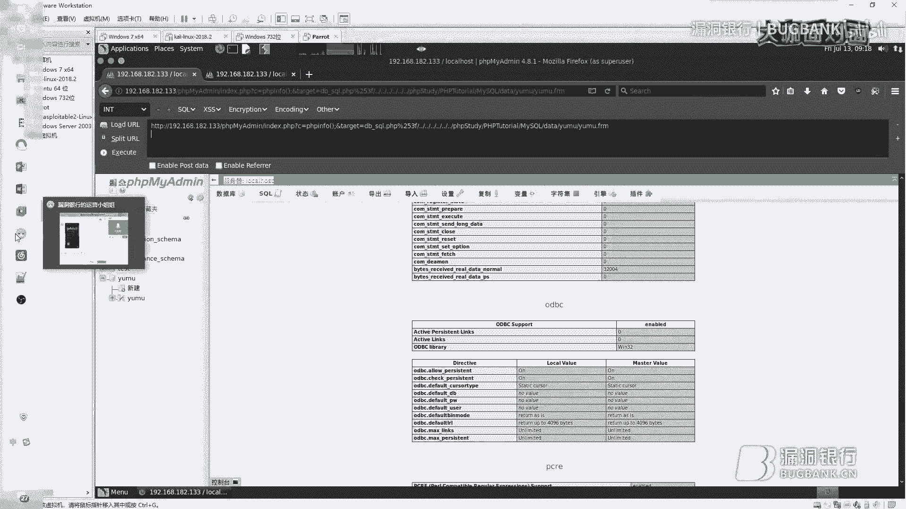

那么第4点我们来讲一下PHP，MyAdmin漏洞防范的一些方式，既然我们刚才演示的都是功，那么现在我们就要懂得防，对吧，首先我们进行去收集的时候，不就是利用这两个文件吗，有可能会利用到这种敏感文件。

我们就直接delete，将它删除了，然后修改PHP study或者这种的一个默认的一个网站路径，对吧，这种不用说免得别人直接就能猜测到你网站的一个路径，然后的话修改一个默认的账号密码。

若口令是危害挺大的一个漏洞，密码最少15位，当然这里是我建议，然后的话，字母大小写和特殊字符，还有加数字，然后的话还有最好就是控制账户，一般不要使用根用户来去进行一个数据库的操作。

可以去进行一个数据库角色的划分，用一些普通用户来进行操作就行了，那么紧接着就是要严格控制目录的一个读写，对吧，有些敏感的文件，你说哪怕你这种文件有存在，你也不能让他去读取。

利用我们获取版本的那个Vitamix，那个缩云档的那个文件，也不能说去让人家去读取，就控制它的一个读成性，这里也说到了，当然你也可以去更改它的一个默认路径，这也是必须去做的，不然的话。

人家直接在一个路径后面去进行一个拼接，就可以直接获取到你这个网站的一个路径，紧接着第6点就是删除一些无关的内容，例如如果你源代码打包了，一定要去进行删除，如果你要一些测试文件。

有一些数据库连接的文件的话，也要进行删除处理，第7点就是在连接数据库的时候，就非使用这个ROT，刚才其实上面点讲了，我这一页不讲了，然后的话第8点，第8点比较重要一点。

如果你不是经常使用到这个PHP MyAdmin的话，你可以考虑安装完成之后，就把它进行一个删除的一个处理。

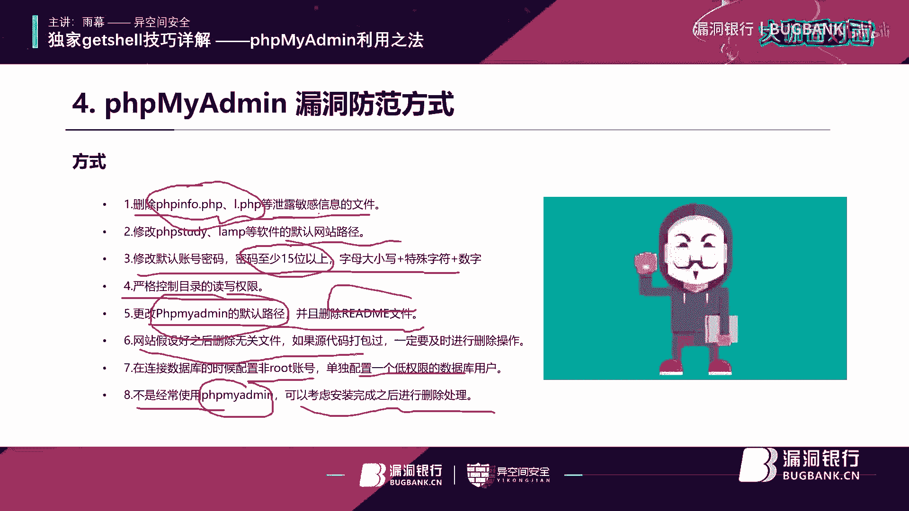

那么好，我们今天的PHP MyAdmin Get Shell之路就到此结束了，谢谢大家，感谢榆木大咖，今天非常感谢榆木大咖的认真准备，我们下面还是进入问答环节，有问题开始了，爆破不出来岂不是瞎了。

这种如果你路径不知道的话，那你怎么去进行，你访问都访问不了，那你如何去进行下一步的操作，那么这个时候的话，一般基本上现在的一个操作的话，更多的去进行一个字典，当然你也可以选择一些比较智能性的。

去自动的去补全，去进行一个路径的一个猜测，那么下面这个，一般的话，它主要就是分PHP MyAdmin，就是分一种常规思路，还有一些比较特殊的，就是一些一级信息，它的PHP MyAdmin的话。

防护性还是做的比较好的，当然你可以去研究一下，其他的一些攻击方式，PHP MyAdmin爆错可以收集到多少有用的信息，这个一般的话，更多的是爆出了一个网站真实路径，至于其他的话，爆错的话。

很少会爆出其他更为关键的，除非是一个注入，至于这个阿里云和科木马连不上的话，一般都是追一个数据去进行一个加密，然后的话也可以去下载这个云锁，去进行一个自我的一个研究，看看有没有一些白名单的要过。

去进行一些混淆，去弄一些免杀的一个木马，我们挑一些来问吧，对这个PHP MCF的话，它里面的话也可以去进行一个利用，就是但是那些版本比较旧，就是你可以直接去进行一个查询，模坏了去进行一个操作。

当然如何去收集一个登录的一个口令的话，我个人觉得的话，分为一个社工和一个非社工，然后的话，非社工又分为一个常规手工拆解，一个暴力拆解，也可能其他的方式去进行一个获取，也可能是一些信息泄露。

或者一些源代码泄露，去进行一个获取，好那么今天的回答，我个人觉得就到这里了，嗯好的，那正好我们也还没有收到一些新的问题，大家如果后续有问题的话，云木大开在我们的群里面，马上可以私聊，他来进行沟通。

那下面我们进入到打卡赠书环节吧，那今天的赠书是由活路安全团队的核心人员，陈小兵编写的安全之路，暴力渗透技术及实战案例解析，那打卡签订应该是本好书了，今天谁会成为这个幸运儿呢，就选这个吧，嗯好。

那就请年年表姐来核对一下，这个问题是哪一个小伙伴提出的，然后我们来把这本送书送给这个小伙伴。

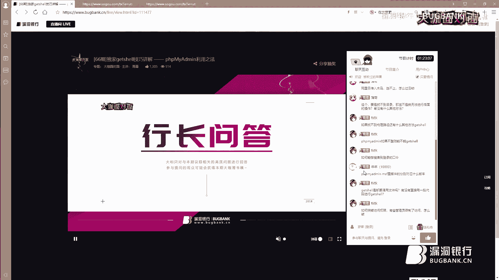

那今天我们的打卡面对面的活动，就大概跟大家说再见了，那再次感谢云木大咖精心准备的内容，那也希望大家今后能够多多关注一空间安全。

关注他们的发展和动态，同样的我们也感谢今天每一位小伙伴的积极参与，那打卡面对面，希望你如果也想来一闪风采的话，如果你也想整合现有支持，挑战直播演讲，促进共同进步，可以一会来找我报名。

或扫描屏幕中的二维码，好那打卡面对面周五八点见，我们下周再约吧，i'm just a sucker for pain，i'm a sucker for pain。

i got the squad tatted on me，from my neck to my ankles，a question from the man。

got us all in rebellion，we gon' go to war yeah，without failure，do it for the fam dawg。

ten toes down dawg，love and the loyalty，that's what we stand for，alienated by society。

all this pressure give me anxiety，walk slow through the fire，like cool gon' try us。

feeling the world go against us，so we put the world on our shoulders，i told you，you。

take my hand through the flames，i told you，you，i'm a slave to your games，i'm just a sucker for pain。

i wanna chain you up，i wanna tie you down，you，i'm just a sucker for pain。

优优独播剧场——YoYo Television Series Exclusive，~完成~。