# 漏洞银行丨shellcode&bypass的骚气深入方式-Met32丨咖面118期 - P1：【发布】shellcode&bypass的骚气深入方式—委派攻击详解-Met32-大咖面对面118期_x264 - 漏洞银行BUGBANK - BV1iU4y1P7ij

(音樂)。

為知識而存，因技術而生，各位小夥伴們大家晚上好，歡迎參加第118期漏洞銀行安全技術直播，大咖面對面，我是今晚的主持人Fancy，今天要給大家做技術分享的大咖，是來自於一代芳華安全團隊的Mate32。

今天我們有幸邀請到他來咖面做客，起名星辰，民眾可信簽約作家的他，這次帶來的議題是，Showcode Bypass的燒起蜃樓方式，感興趣的小夥伴還要做好筆記聽到最後哦，同時歡迎各位小夥伴登入直播間。

在聊天區進行交流互動，聽講過程中有任何疑問，可以隨時在聊天區提出，待演講完畢後，大咖會在行長問答環節，集中解答小夥伴的疑問，同時今晚的聽講福利，也將在問答環節結束後，挑選一位幸運觀眾。

送出由Mate32大咖親自騰訊的書籍，內網安全工房滲透測試實戰指南，那下面就有請Mate32大咖，開始今天的直播分享吧，大家好啊，我是本期的嘉賓Mate32，目前的話是偏於漏洞分析方面吧。

其他的你們簡單的看一下就行了。

今天咱們這個議題就是，share code bypass這方面的，然後我分為了四個小階段，第一個就是share code的一個原理分析，第二個呢，簡單loader的一個編寫。

第三部分就是一個bypass方面的一個東西，最後一部分就是一個利用share code，進行一個權限維持方面的一個東西，那咱們首先先看第一個，這個share code其實就類似於，下面的一個摩斯密碼。

這個摩斯密碼就是通過你敲擊長短，就是來轉換為字符，大家應該都看過那種，就是別戰片裡邊那個東西，就是類似於發電報的那種，通過敲擊長短，然後來轉換為字符，然後發過去對吧，假設你看這個字符1。

它通過一個摩斯電腦來轉換的話，就是一短四長對吧，你敲完之後，它就會轉換為這個字符1，然後同理其他也是，而你這個share code，其實和這個原理是比較類似的。

你這個share code就是將特定的一個字符，你翻譯為彙編指令，當然咱們這個例子肯定是有所不同的，咱們這個CPU是直接可以執行，咱們這個機器碼，接下來咱們看一下這個一個戰役出吧，一個簡單的一個戰役出。

它這個share code，是可以獨立執行的一個代碼，咱們看這個戰役出，這個戰役出就是說，觸發這個緩衝區，然後覆蓋EIP，然後拿到控制權之後，然後再進行一個執行share code。

假設在咱們右邊這張圖，就是一個函數，咱們是通過一個靠指令來進行調用的，當你靠指令執行完之後，你肯定是要程序要繼續往下跑的對吧，你程序如何往下跑呢，這就是說你可以看到，你這個函數裡邊，記載著一個返回地址。

如果你將這個返回地址，改成你的share code首地址，那你這個EIP肯定就是會跳到share code，對吧，你這個返回地址就相當於是，你靠指令中的下一條質量，至於這個溢出的話。

你們可以就是刻下自己去看一下，戰役出最經典的一個漏洞，當然我這裡這個舉的例子，是沒有任何安全機制，如果有安全機制，就是再另作考慮，然後咱們看一下，看一下這個share code，就是在OD中的情況。

可以看到我這裡畫了條紅線，把它分割開了，這個左邊其實就是一個share code的質量，右邊就是你翻譯過來的一個彙編質量，可以看的吧，其實你CPU執行的這個東西，就是這麼個東西，很多人以為。

它其實執行的就是這個彙編質量，其實都理解錯了，可以看左邊，執行的就是這麼個玩意兒，這個share code的質量，也是應變碼質量，那麼就是說，咱們拿到一段share code，如何對它進行一個更改。

我們看右圖，看右圖的話，首先它有三個push對吧，這三個push之後，我追它這個內存窗口，可以發現它push的這些東西，其實就是一個字符串，就是push了一個，彈窗的一個字符串。

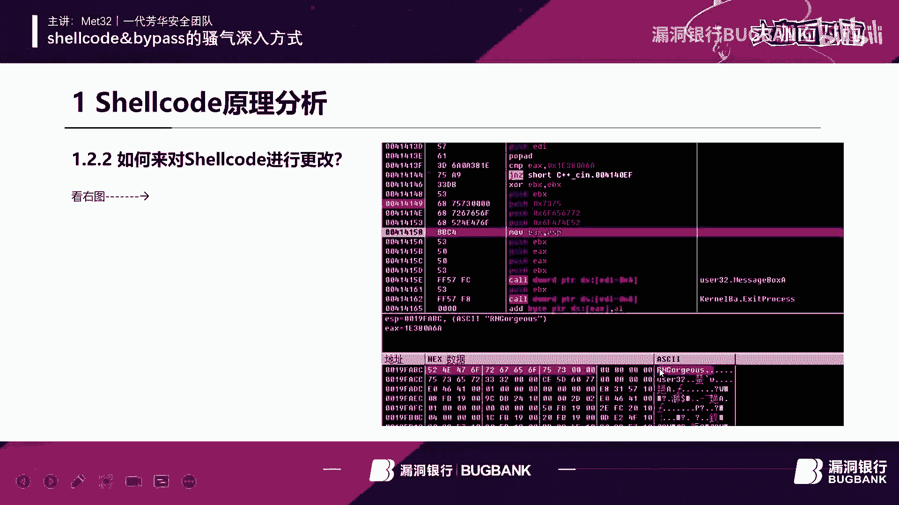

那咱們看一下，先用咱們虛擬機吧，然後這裡我準備了一個share code。

這個，我找一下啊，稍等啊，剛開機，有一點卡一個訊息，好像是這個啊，看一下，看一下原代碼，是這個，這個share code，就是我這個，我這個客戶界裡邊準備的這個share code。

我這裡用分割服務分開了，這個就是咱們那個字符串的一個內容，這是我給它分開了，比較容易區分。

那接下來呢，咱們就是可以跟他去OD裡邊看一下，找一下他入庫點，是這吧，然後的話呢，這就是一個share code的調用對吧，跟過來看一下，現在的話，你看一下啊，這個這有一個424A30。

我不知道你們能不能看清啊，就是後邊這條指令。

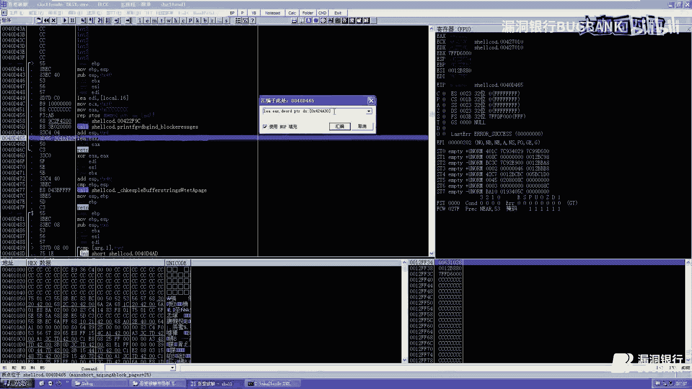

你可以跟過來去內存中看一下對吧，他是從FC68開始到一個FF57結束。

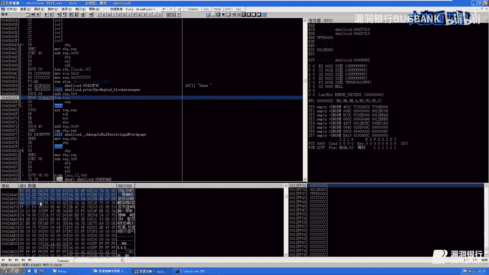

對照一下對吧，FC68到57F8結束。

這個就是咱們一個share code。

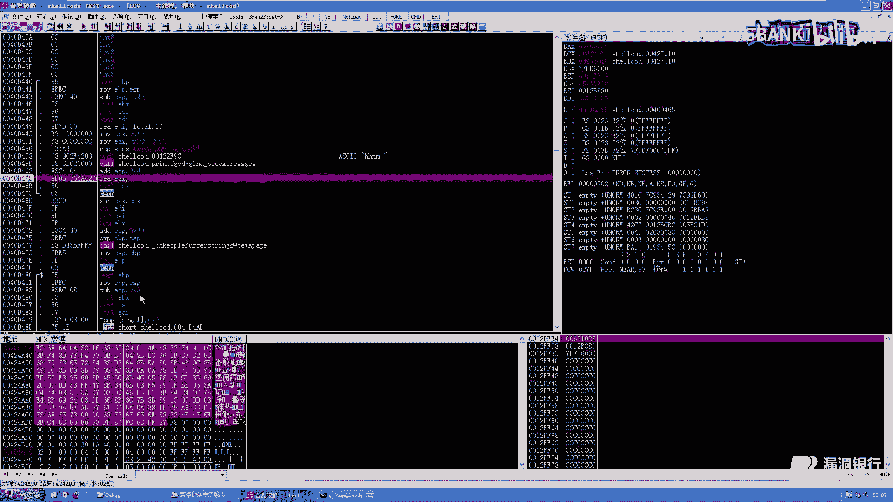

然後進行一個調用啊，調用之後呢，看可以看到咱們進來了，你進來之後呢，這個就是咱們一個share code。

這個就是咱們一個share code翻譯成的一個匯邊指令啊，重新載入一下有點問題，可以看見吧，就這麼個玩意兒，其實呢，你CPU就是執行的這麼個玩意兒。

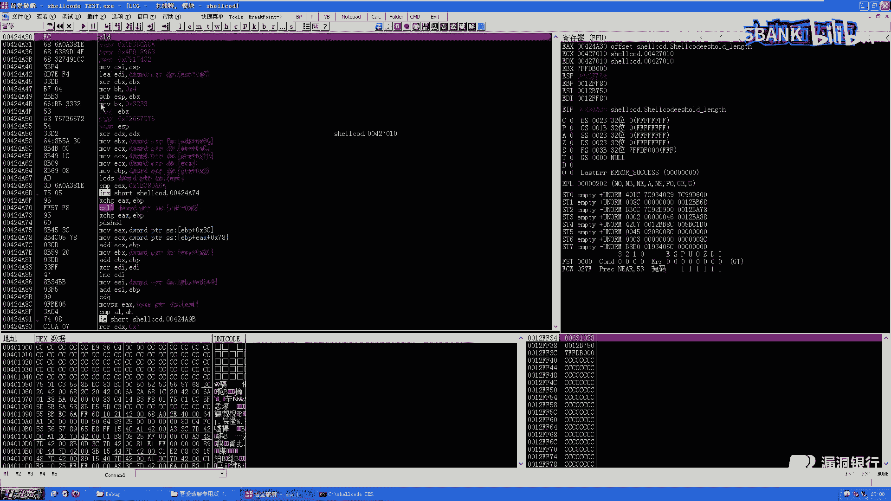

如果你把右邊完全給他遮擋住的話，你肯定也不知道這是個什麼東西對吧，那麼咱們繼續分析啊，這個share code是我之前已經簡單看了一下啊，在這裡呢，他首先進行了就是三個push操作，咱們通過一個斷點。

通過一個斷點給他跟過來，現在的話呢。

盯著這個站點看一下，可以看見吧，他現在估計看不出來啊。

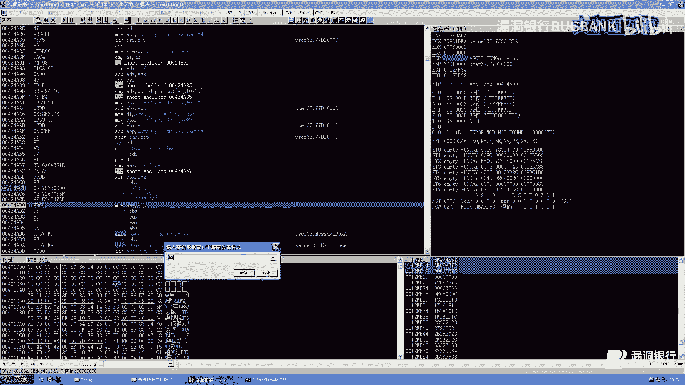

咱們追ESP，現在可以看見吧。

他現在的這個內容呢，已經變成了這個彈窗的內容了，對比一下對吧。

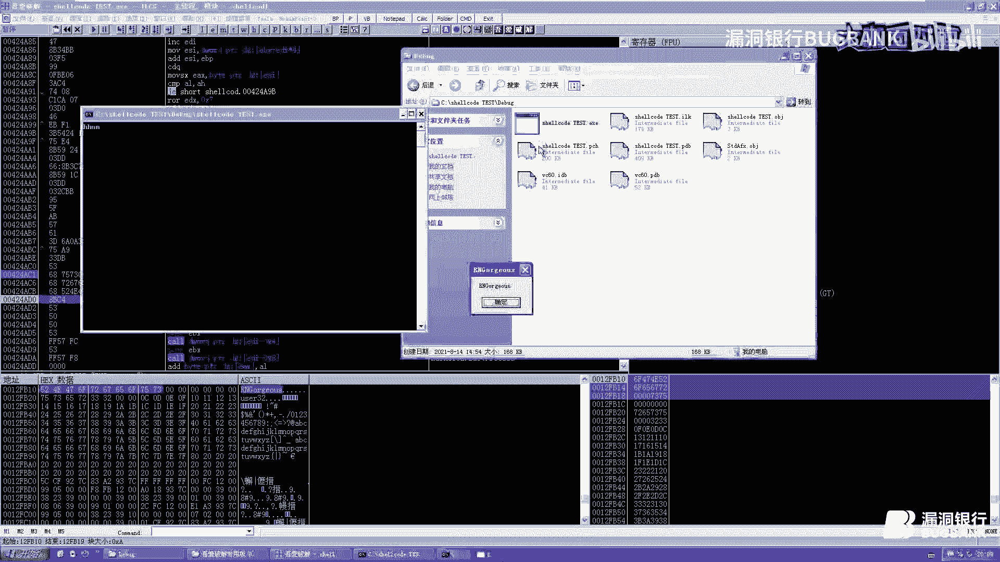

這個什麼RNG什麼亂七八糟的啊，這個這三個push呢。

就是執行的是一個，把你這個伺服器給他push進去。

然後呢，下邊這個呢，就是一個message box，你push進來之後呢，你看見了吧，他把這個ESP呢，給了EAX，並將這個EAXpush到站裡邊，在彈窗，如果你把這邊的內容給他進行更改對吧，假設。

把他內存中的這個內容給他改掉啊。

後面加個結尾，改好了對吧。

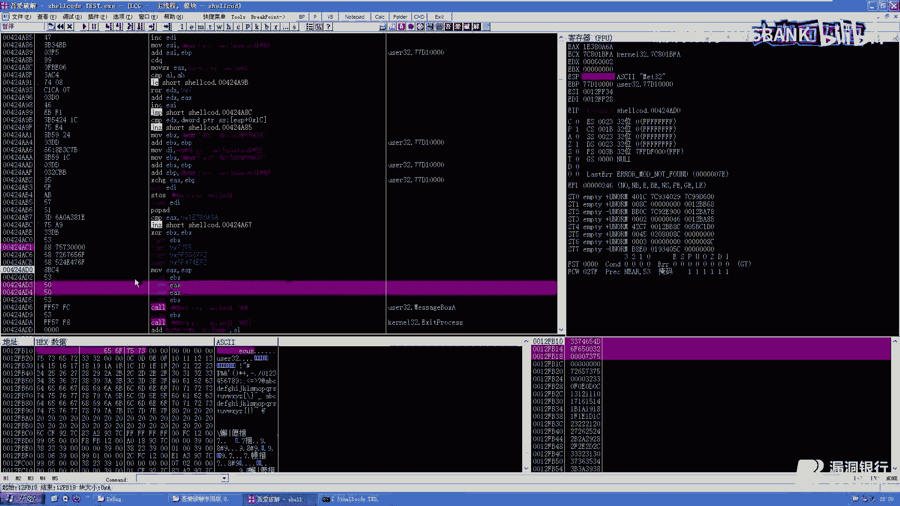

改好之後呢，然後繼續單步啊，現在咱們這個message box還是沒有執行的。

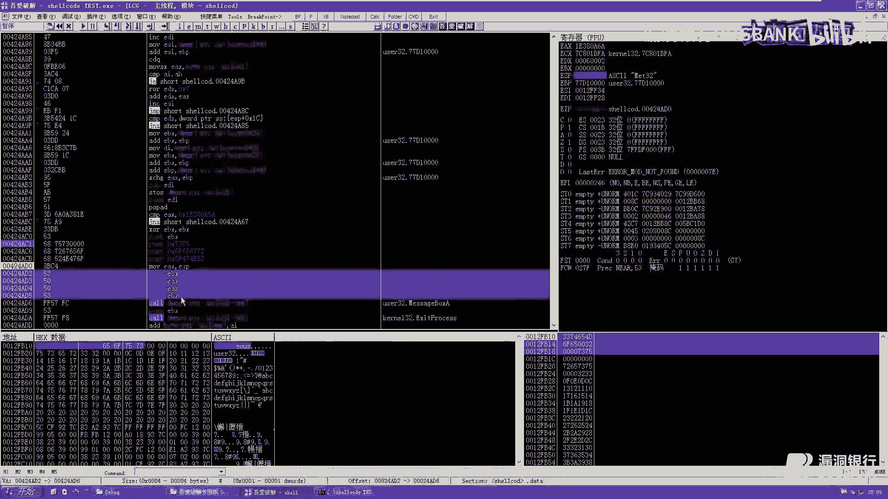

你盯著這個EAX記憶器。

你看一下啊，可以看見吧，他自動幫咱們識別了，就是剛才咱們已經改的這個內容，接下來是一個push操作對吧，push 0，push了兩個咱們已經修改的這個，然後呢。

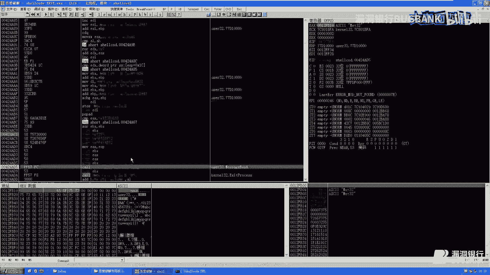

再通過調用一個message box，成功成功彈窗了吧，對吧，那麼如何你做一個更改呢，這裡的話呢，咱們只是在這簡單的改了一下對吧。

如果你做一個徹底的更改呢，所以咱們呢，就是要把他這三個push給他改掉。

給他替換掉就是說，他原有的一個push指令，縮小一下啊，他原有的一個push指令呢，就是就是就是這部分，什麼687什麼67什麼的對吧。

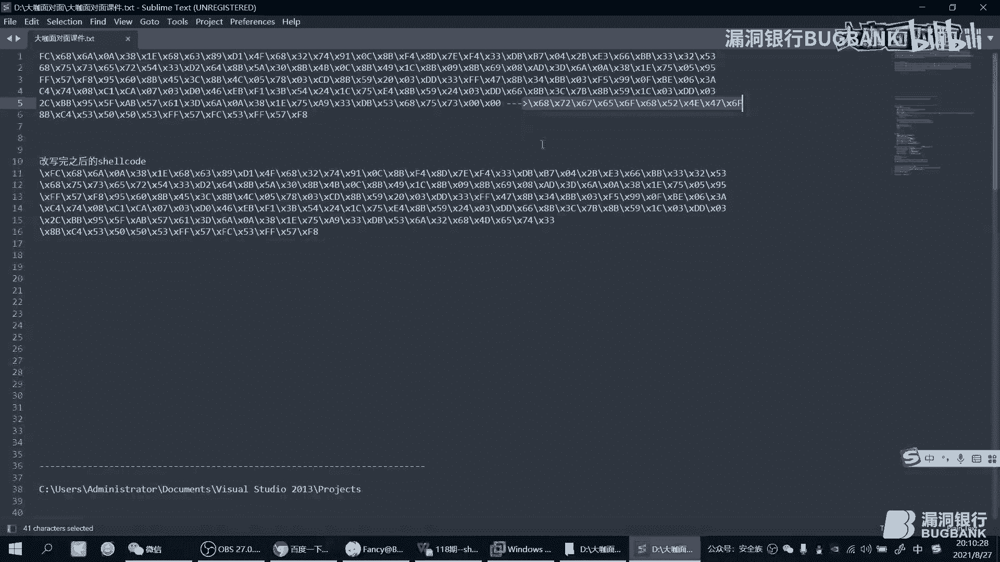

然後你把它改成什麼呢，你把它改成push，咱們這個新的字符串給他push進去。

首先把咱們這個32給他push進去之後呢，把這個。

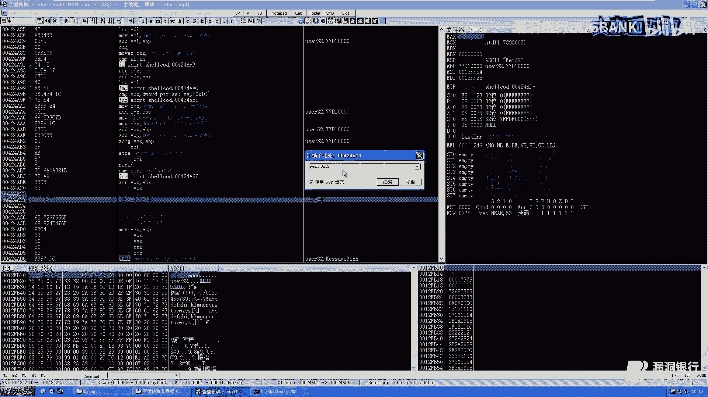

337465，4D給他push進去。

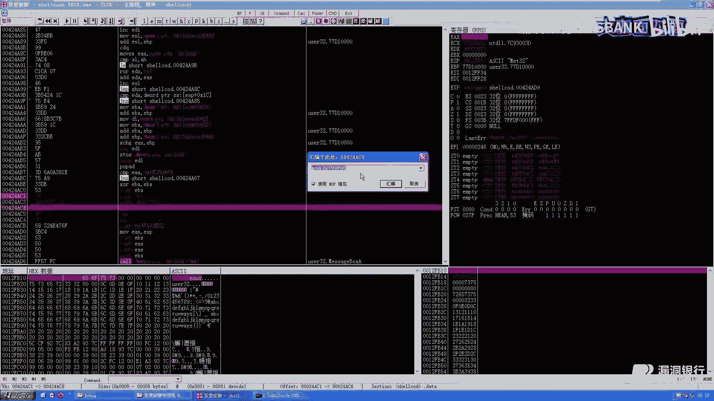

可以看見吧，你push進來之後呢，他就會成這樣的形式，因為咱們這個小段存儲對吧。

他所以他要這樣反著來啊，然後你push進去之後呢，他這個硬編碼指令呢，看咱們這個標紅的這個地方啊，90你這裡不要看。

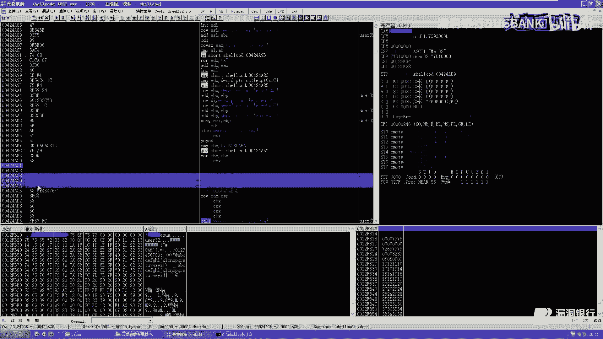

看咱們這兩塊地方呢，他就已經變了，變了之後呢，你再拿出來把咱們這個新的這個內容呢，把新的這個硬編碼指令呢，給他替換掉，把原來的這個給他給他刪掉，替換成咱們這個新的就改，改完之後就是這個樣子了啊。

什麼6A6A32684D什麼這個這個就是啊，然後呢。

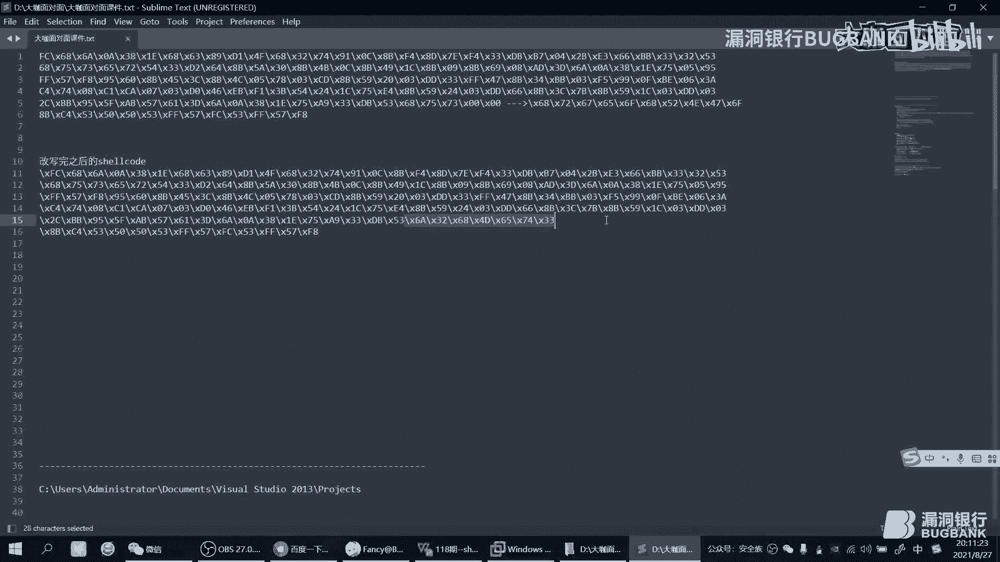

你看一下啊，給大家看一下，找一下VC6啊，看看這個，這兒，先把它寫一下啊，可能有點繁瑣，但是沒辦法，這個就是咱們改好的啊，改好之後呢，運行一下，可以看見吧，成功已經改好了對吧。

這這個就是咱們簡單做一個簡單更改的一個Circle的，其實總結起來的話呢，也是非常簡單的啊，總結起來的話就是說你到OD裡邊，你分析一下他的這個會編指令，他他push的對象，他是push了個啥玩意兒對吧。

然後你可以進行一個更改，根據自己的需求呢，進行一個簡單的更改，然後第二部分呢，就是Sherry Code loader的編寫啊，針對一些常見的loader進行一個編寫。

在拿到一段Sherry Code之後呢，就是說你如何來加載使用，你總不能說你把這段Sherry Code的給那個管理員，讓管理員幫你加載對吧，你感覺可能嗎，對吧，人家不揍你就是好的了啊，然後繼續看啊。

這個主要分為兩部分，這是我我自己大概寫的一種啊，兩部分，第一種的就是通過C源的一個函數吧，C源的函數來調用什麼Melloc，Memcpy什麼Meshworklock，什麼Hyperlock等等等等等啊。

就是說申請申請內存，什麼操作內存的那些函數呢，是都可以用的啊，這裡我用了一個最簡單的一個Melloc，第二種的就是一個內聯會編的方式，這種的方式的話呢，也是最常用也是最方便的那種對吧，咱們先看第一種啊。

就是通過一個Melloc，一個Memcpy的等方式的一個調用，咱們寫一下吧。

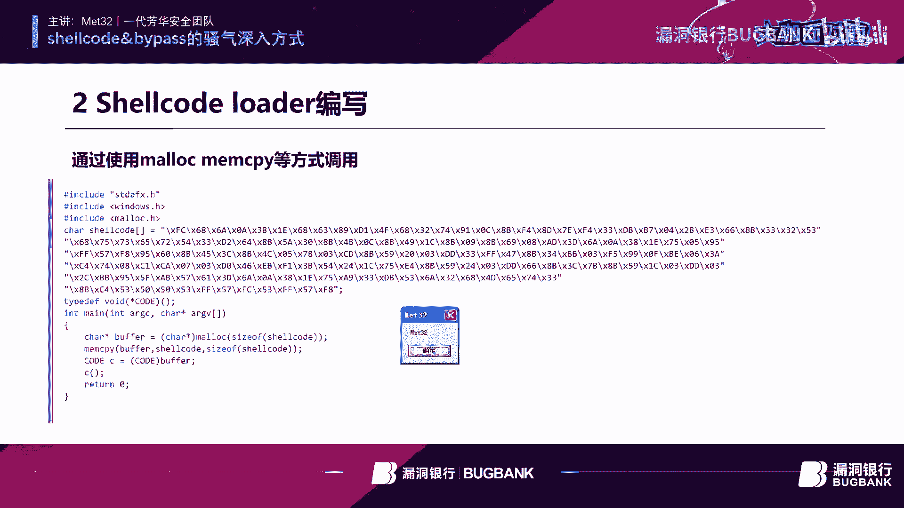

剛講的話誰也記不住對吧，你就得動手寫一下。

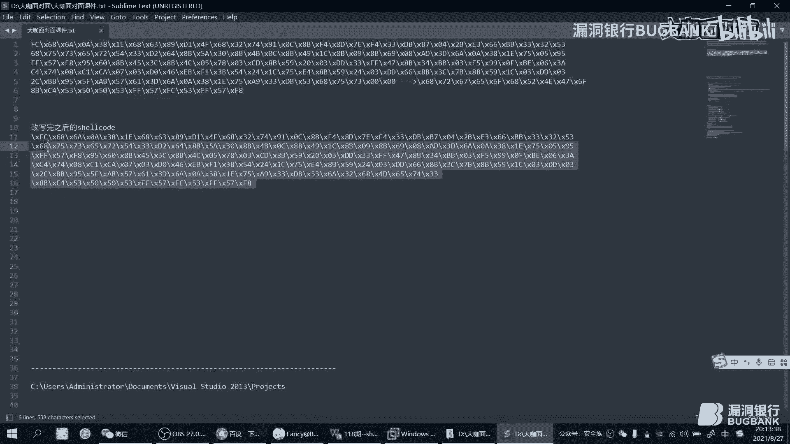

這個Server Code咱們已經現成的已經定義好了，然後呢，這裡咱們其實這個呢，可以看見這個這個和剛才那個都一樣，就是通過一個通過一個函數指針，函數指針來調用，首先的話呢，就是首先的話呢。

你需要就是說申請一塊申請一塊空間，書法的申請，申請完之後呢，然後再進行拷貝，再執行就行了，就就就這三個步驟很簡單的，像網上那種什麼用各種Windows API，各種玩玩玩玩半天還被查殺的那種。

就基本上就是可以說是造輪子啊，沒有沒有必要，那咱們這裡寫一下吧，首先申請一塊空間，大小呢，就是咱們這個Server Code的大小，然後呢，把咱們這塊空間，咱們先定義一個變量叫Buff吧，這個。

給這個Buff申請一塊空間，之後的話，把Server Code拷進來啊，現在你申請完了，你這個空間裡邊還是還是沒東西的，所以的話，你需要把這個Server Code給它拷進來，Server Code。

拷進來之後呢，你就需要需要去執行了啊，這裡我定義了一個海瑞指針，就是code啊，你這裡也可以定義成什麼其他的，比如說FUN什麼的，怎麼方便怎麼來，看著怎麼順眼怎麼寫就行了啊，然後呢。

將咱們這個Buff給它寫進去，再通過一個FUN來調用，看能不能執行啊，這裡Server Code，大小寫啊，成功可以調用對吧，然後你可以咱們可以注意一下，注意一下它內存，它怎麼走的啊，注意一下防匯邊吧。

也就不用OD分析了，它首先它申請了一個Server Code的這個Set of Server Code的一個大小，可以看見吧，它這個Push呢，已經就是這個大小，之後呢，調用了一個Milk函數。

然後的話呢，將你這個申請完的這個大小呢，給了咱們這個局部邊量Buff對吧，因為你這個函數一般返回出來的這個返回值的返回值都在這個Eax裡邊，再進行一個拷貝操作，拷貝操作的話呢，嗯。

首先Push了一個大小，然後呢，再把你這個Server CodePush進來，再把你這個什麼Buffer給它弄進來，可以看見吧，有點有點小啊，這裡有點小，我要不給它拷出來，看看拷出來能不能大一點。

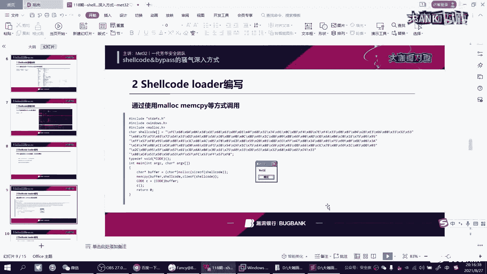

啊，這樣是不是很清晰，然後再通過一個MemCopy就是複製到咱們申請的這塊內存空間之後呢，進行了一個函數指針的一個執行啊，其實這裡怎麼說呢，你可以看到啊，他把這個EPP-4給了ECX。

然後再將這個ECX呢，給了這個EPP-8，這個EPP-8就是咱們這個局部邊量唄，然後再通過一個靠指令呢。

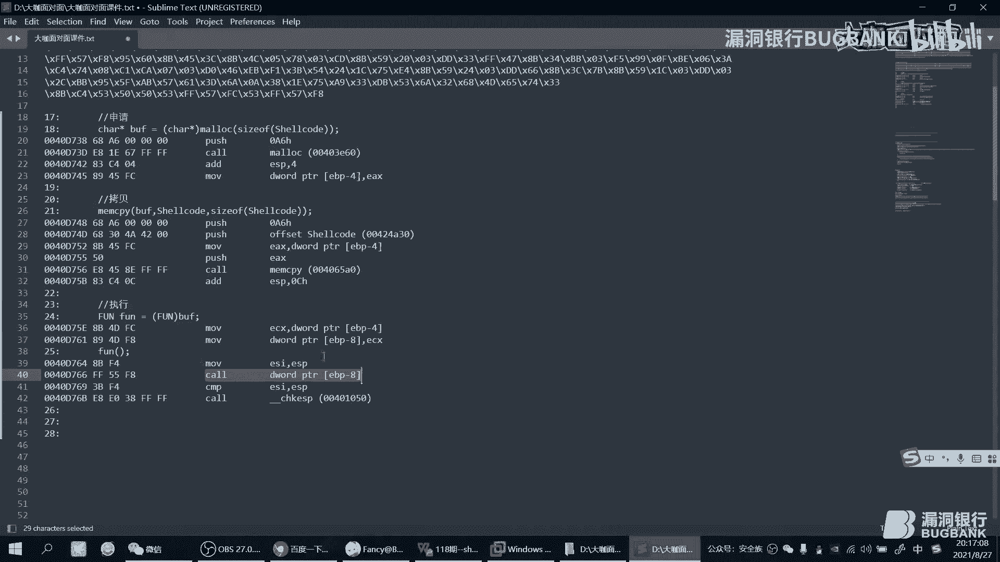

來進行一個執行，你可以咱們可以跟一下這個靠啊，跟進去對吧，你看一下，你看一下你這個指令是不是Server Code指令，你直接咱們對前面這個幾個字啊，FC開始對吧，FC68，FC686A0A。

FC686A0A對吧。

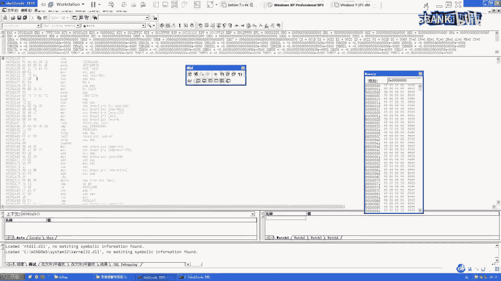

這個就是咱們這個Server Code的。

旁邊呢，就是他一個匯編指令啊，這裡的話呢，可以看見吧，成功執行了，然後繼續啊，這種方式是不是怎麼說呢，嗯，寫的寫的很繁瑣對吧，然後呢，咱們就用第二種方式就是通過一個內聯匯編的方式來調用，這種呢。

是最常用的一種，是我最常用的一種啊，因為內聯匯編呢匯編直接操作內存對吧，所以他的靈活性是很大的，對吧，你像網上什麼一些什麼滑指令亂七八糟的對吧，都是這不都是根據匯編來改的，那咱們先看第一個啊。

把這個刪了吧，嗯，刪乾淨了，通過一個內聯匯編方式來調，第一個是個啥看一下啊，嗯是個賬簿對吧，我先我先寫好，下個段點，先看一下能不能正常執行啊，如果正常執行咱們再分析，可以是吧，可以的話呢。

下個段點看一下，嗯，咱們看一下這個內存窗口在哪啊，這個VC6用的比較少，內存窗口這有，首先的話呢，看一下咱們Circle的啊，對吧，你這個FC68這就是你這個目前中內存的一個狀態，之後呢。

你看一下你這個EAX啊，他把這個Circle的手機紙呢，給了EAX，F10走過去就行了，然後你EAX呢，是用這個什麼43的這個玩意對吧，嗯，你就是剛才那個是實際值啊，你給他翻譯過來，你翻譯過來之後呢。

你再用EAX來定位一下，同一個地方啊，然後再通過一個賬簿指令呢，來進行一個跳轉，賬簿指令來跳轉執行，F11跟進去啊，大家看一下他這個內存中的狀態是不是咱們這個Circle的裡邊，FC686A0A對吧。

這個這個不就是咱們這個Circle的嗎，再往下找啊，看能不能找到，找到咱們剛才那個那個字符串可以看見吧，這個這不就是咱們那個彈窗的內容，這個就是那個Message Box，以及退出函數啊。

退出函數好像在亂了啊，退出函數，以及退出函數啊，以及退出函數，第二種方式呢，也就是通過一個賬簿，賬簿方式來進行一個使用，第三種呢，要不，什麼第三種啊，接下來看這種啊。

這種靠其實和這種和賬簿是原理是一樣的啊，原理是一樣的，F9打多年看一下唄對吧，你要覺得不信，咱們先看這個Circle的，Circle的已經提前寫入了對吧，寫入好之後呢。

EAX現在是C C C C C對吧，F10你EAX呢，你再你再注意一下，還是同一個地方對吧，然後返回邊的話，你可以跟一下，跟一下的話，對吧，這個也是也這個和賬簿一樣啊，其實都都是一樣。

這是比較簡單的幾種，還有一種就是後兩種了，後兩種的就是和這個對賬比較相關啊，但是呢，其實和前兩種我們看都是都是雕用啊，沒什麼區別，Circle的給他，EAX push進去，然後的話呢，看一看是哪個。

哦是這個，EAX什麼EAX ESP，看一看能不能雕用啊，可以雕用對吧，這種的話相對比較相對比較來說，你也可能比較繁瑣，但是其實也是比較簡單的啊，分析一下吧，接著注意一下，你先先定位你的Circle。

對吧，定位到了之後呢，你看一下你的EAX，你的EAX現在絕對是都是CCCC對吧，你F10看一下咱們EAX的一個狀況啊，他這個有點不智能啊，對吧，之後呢，接下來一個Push操作啊。

Push操作的話肯定影響的就是咱們一個對賬唄，對吧，咱們盯緊盯緊這個ESP就行了，ESP現在是12FF34，12FF34對吧，嗯，然後的話呢，看一下啊，Push啊，Push進來之後呢。

是這麼個地址之後呢，通過一個jump，jump他取地址他取的是哪呢，他取的是12FF34裡邊這個內容對吧，然後呢，一個返回邊，通過一個F11咱們可以跟進去看一下啊，他這裡邊的話呢。

其實還是咱們這個Circle的指令啊，和前兩種其實都是原理都是類似的，最後一種呢，給大家看一下啊，是不是比非常靈活呀，然後進行一個Push，Push進去之後呢，進一個Jump，看一下能不能執行啊。

可以執行的接著對賬根吧，SC68對吧，這兒是之後呢，看一下EAX的話，現在已經，EAX是這兒對吧，接下來呢，我進行了一個Push操作，所以的話，咱們這裡直接盯準這個ESP就行了，看能不能大一點。

調一下調一下，ESP給他Push進去之後，咱們看一下他Push的啊，有點不智能啊，真是哎，這個什麼424A30，這這個就是咱們Circle的那個地址，然後通過呢，一個return操作。

通過一個return操作呢，來進行一個調用，就是一個popESP吧，你其實可以可以返回邊，繼續跟他一下啊，對吧，通過一個F5直接執行，總體來說，其實這這是比較網上就是早些年比較常見的一種，怎麼說呢。

一種loader吧，一種加載器，這種呢，你可以看見吧，他這四種的話呢，其實怎麼說呢，他指令不相同，但是他這個內存狀態也可以，剛才我也一個一個帶大家看了對吧。

他這個內存狀態到最後都是跳到那個Circle的指令在執行對吧，都是都是得執行一下，至於你前邊你你把這個Circle的，你扔在一個箱子扔到一個盒子，什麼到最後你甭管甭管把它藏到哪吧，你到最後的話。

你肯定也是得通過一個什麼，站步啊，靠什麼return啊等等等等等啊，來執行，可以看見這兩種對吧，這兩種是不是一下這個區別就出來了，這個內聯匯編的方式是不是非常的一個方便，這四種呢。

基本簡單一寫就能寫出來啊，當然你們也可以就是根據自己的思路來寫一下，也是比較簡單的，因為比比較靈活嘛，這個就是一個Circle的一個loader的一個簡單的編寫啊，然後咱們看第三部分啊，這個第三部分呢。

就是Circle的bypass的一個一個思路吧，目前是我自己寫了一個思路啊，就是不知道還管不管用了啊，我感覺應該沒問題的，首先的話呢，是基於一個文件的一個bypass。

就是說叫你這個Circle的存到文件裡邊loader加載並執行，我記得就是早些年在網上看到過那種，把你那個Circle的你放到一個外部服務中對吧，你用你你用外部你搭一個外部服務。

然後將Circle的存裡邊，然後通過通過Python來讀取並執行對吧，因為Python畢竟寫Python很方便嘛，所以的話呢，他讀Circle的話呢，也是什麼讀那種網頁源代碼的話也是比較方便的啊。

所以的話呢，為此我寫了一個基於文件bypass的啊，咱們看一下，我寫的那個那個在哪呢。

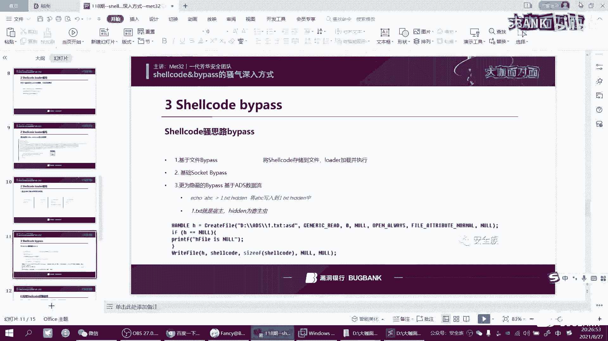

兩個啊，首先是一個加簡密的一種，找一下吧，哎。

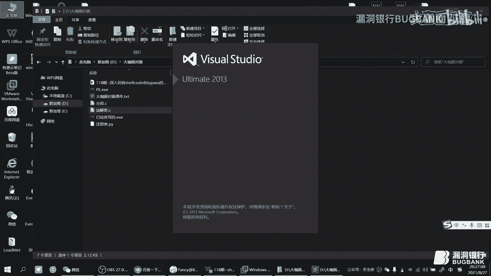

加簡密的，稍等一下，VS怎麼怎麼歇班了，好了，今天也沒周六日啊，我以為他歇班了，嚇我一跳啊，找一下啊，好像是這個，這個玩意兒，首先的話呢，我準備了一段Circle的，這段Circle的已經寫好了。

寫好之後呢，咱們可以看見啊，嗯，咱們首先看看這個這個Circle的這個函數吧，放大一點，通過一個Creator file呢，咱們在這個地盤下邊呢，創建了一個Circle的點TXT，創建完之後呢。

就是說可以看見吧，我這裡有一個Ratefile，通過這個Ratefile呢，來進行一個寫入Circle的，當然我在寫入的前提，那你可以看見我這裡做了一個循環，循環處理這個循環處理呢，就是咱們這個，哎。

這個循環處理呢，就是咱們這個加密的一個操作相當於你可以看見吧，我取Circle的第幾個元素，然後加上了一個隨機順，然後存到了這個VAL變量裡邊，存到VAL變量裡邊之後呢，用這個VAL給了Temper。

並通過一個Ratefile進行一個寫入啊，這裡咱們可以注視一下，運行一下，哎呀，這個printf，這個先給他幹掉，先看一下啊，現在已經運行了，然後你也不知道他有沒有寫入好啊，現在來看一下吧。

嗯，看一下咱們這個是sharecode。txt對吧，這個這個玩意兒，如果你打開的話肯定是一堆亂碼啊。

你，你拖到WinHex裡邊，咱們看一下，你現在看亂碼肯定肯定是亂碼對吧，哎呀。

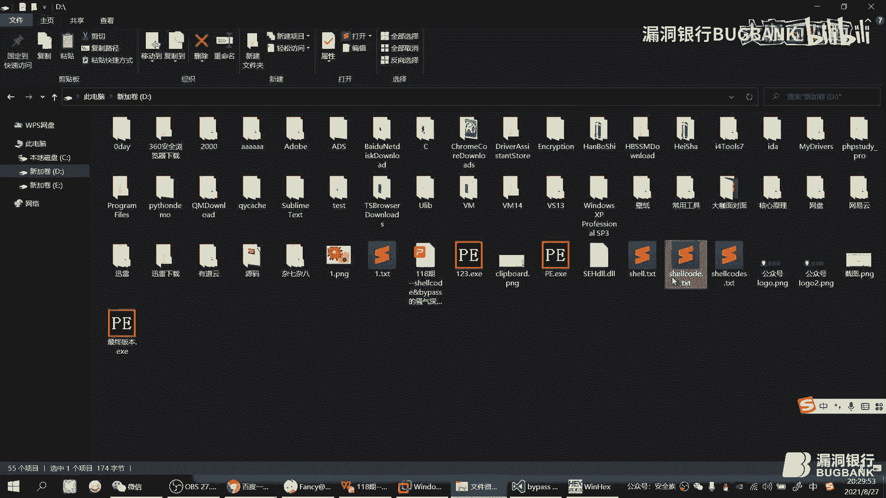

有點不好搞，可以看見吧。

這不就是一個加密後的一個狀態嗎，可以看見吧，這個旁邊呢，這個什麼ASK呢，就是這個加密後的一個內容，很多人呢，這裡有一個常見問題，就是很多人呢。

在寫這個的時候呢，他常常把sharecode，寫到這個文件內容裡邊了，怎麼說啊，我給大家舉個例子，哎。

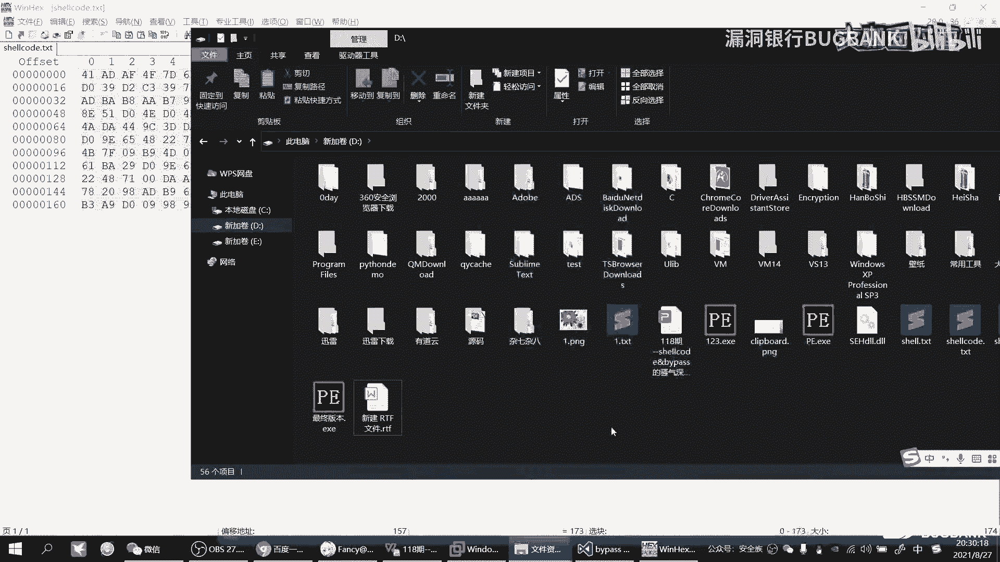

就舉這麼個例子吧。

假設他寫的話呢，他都這樣寫上了對吧。

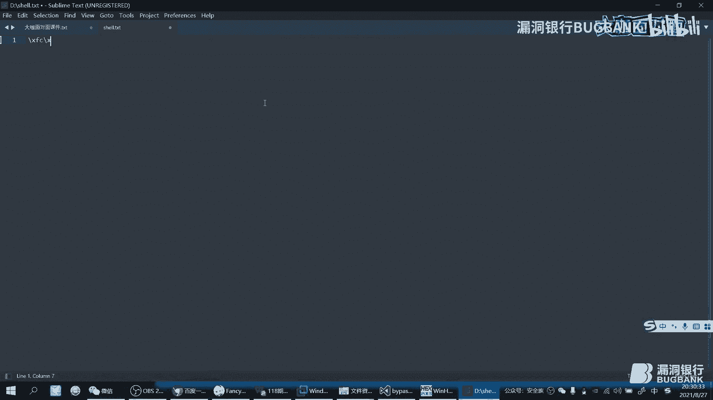

FC68什麼什麼的，如果你這樣寫入的話呢，你可以看，你可以你可以拖一下他這個WinHex。

可以看見吧，你確實你這邊是這個sharecode的，而你這個內存裡邊呢，你看看他成啥玩意了，成什麼5C78，這翻譯成啥了對吧，所以的話呢，你需要大家一定要記住，如果你在寫入文件的時候呢。

你需要把這個sharecode寫入到這裡邊，這麼這麼一回事啊，然後繼續分享，現在是一個加密後的狀態，你完全看不懂啊，什麼FC68，這是一個4EAD對吧，這是這是因為咱們加密了對吧，加密了，你肯定看不懂。

然後的話呢，就是一個解密操作，這裡我把注釋給他幹掉，這是一個執行啊，咱們就接著分析這個解密操作，這個解密操作呢，就是說和那個寫文件操作的差不多啊，首先的話對吧，獲取咱們這個剛才這個加密文件的一個句餅。

獲取完之後呢，將你這個文件句餅呢，給他讀一下吧，讀到buffer裡邊，讀到buffer裡邊呢，再進行一個批量解密對吧，咱們上邊呢，進行了一個+4954949，那你如何解密呢。

你解密肯定就是要-4954949了，你給他-回去，他不就成為原來的一個sharecode了嗎，嗯，咱們直接看一下吧，下到這吧，這裡啊，就下到這吧，下到這的話呢，可以看他現在這個buffer。

這個是sharecode，是這有點問題啊，現在他這個buffer其實是已經解密好的啊，哦，不是定的buffer，定的是這個vl吧，我說怎麼跟buffer有點不對呢，給這個vl吧。

因為咱們這個buffer這裡又給了這個vl，你可以跟看他內存窗口，這裡是什麼fc68對吧，到到到到57什麼亂七八糟的啊，你繼續往下看就行了，這個這個就是咱們解密之後的一個sharecode的。

這個sharecode是我之前那個什麼到16c3對吧，之前的一個，這就是一個加解密，就是說你給他加密之後呢，再進行一個解密解密的一個操作，然後呢，你這裡的話其實也可以是可以通過一個。

內聯匯編的方式來調用啊，這裡自己可以去寫一下，內聯匯編的方式調用也是可以的，那咱們繼續看啊，這個呢，就是基於文件的一個加解密的一個bypass。

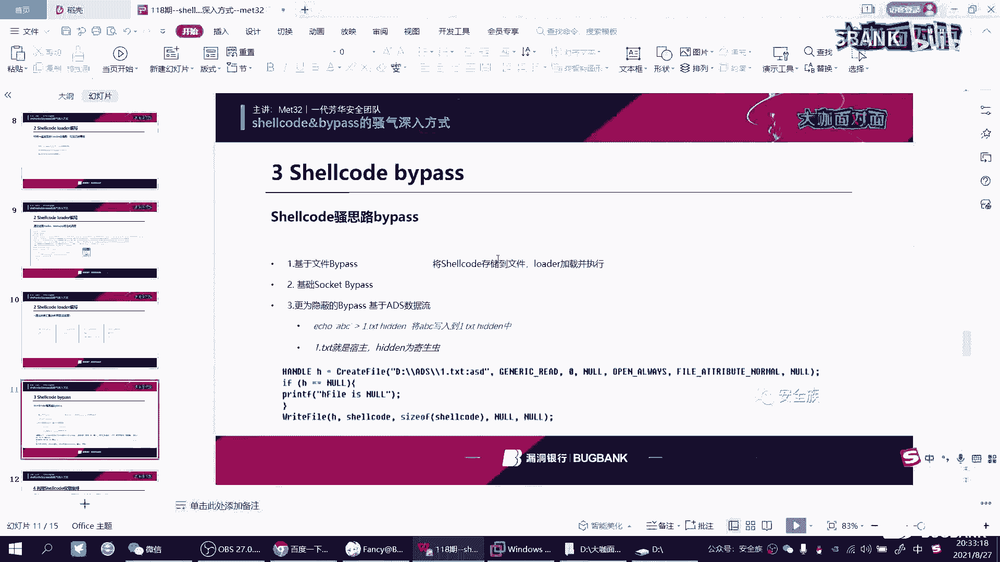

還有一種呢，就是一種分段。

分段bypass這個這個寫的時間比較久了啊，我不確定還能不能用，但是的話呢，給大家看一下吧，看一下是怎麼回事啊，我把這段sharecode呢。

劃分成了12份，當然你要劃分的就是越多越好對吧，你把這個sharecode就相當於進行了一個整體切割，切割完之後呢，我通過我打開了一個就是我創建了一個文件，就是地盤下邊的ASD。txt，然後呢。

進行了一個一些批量處理的操作，可以看見吧，第一個file，第二個file，第三個file，第四個file，可以看這個file循環的都是批量，將你這個將咱們這個sharecode呢，寫到這個文件裡邊。

第一個，這就是寫入第一個對吧，這是8份2，這個是第三個，然後第四個等等等等等就是你進行好多次的file循環，進行一個批量寫入啊，然後就關閉劇本之後呢，再進行讀這個文件，讀這個文件呢，再進行一個執行啊。

因為那時候我發現的是就是說，如果你sharecode，如果你直接寫在一塊的話呢，可能就是直接會直接會被查啊，直接會被查殺的，如果你把它分段定義的話呢，你分段定義之後呢，你再你再把它寫入到一個文件中。

再拿出來讀取的話，這種也是一個繞過的姿勢啊，當年不能說當年吧，只能是今年吧，今年那時候用這種方式的話，bypass是非常非常容易過的啊，後來的話我就不清楚了。

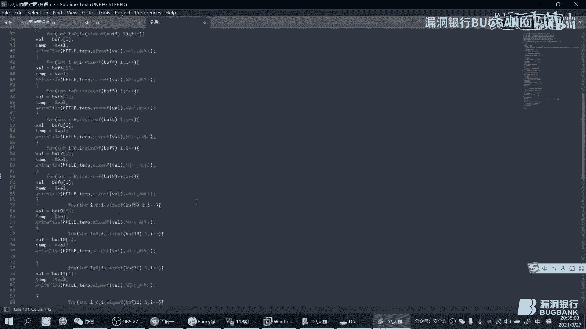

因為時間比較久了，這個這個也一直留著呢。

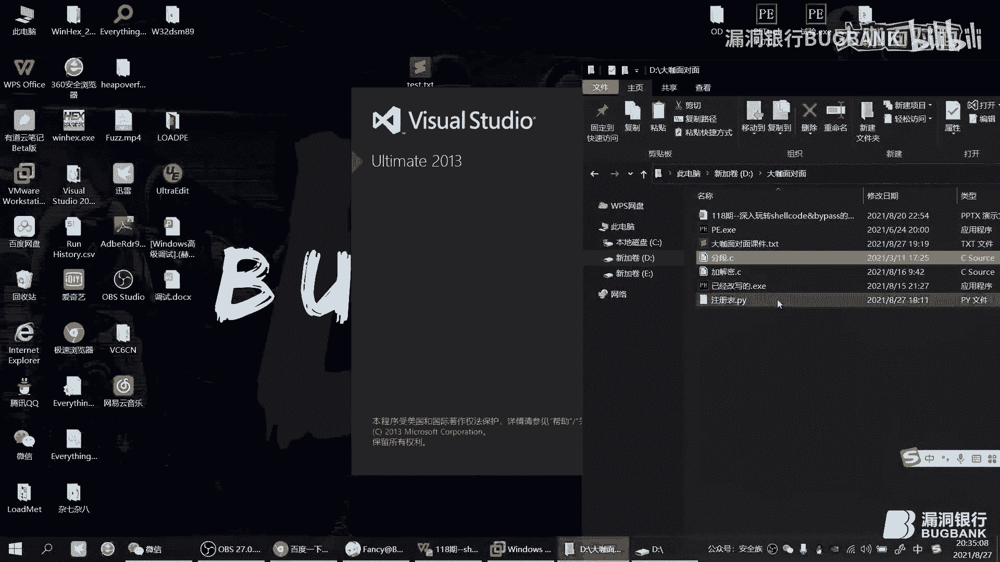

繼續看啊，嗯，講完第一個之後呢，還有第二個和第三個基於ads數據流，還有一個什麼基於socket bypass，咱們首先基於這個ads數據流的吧。

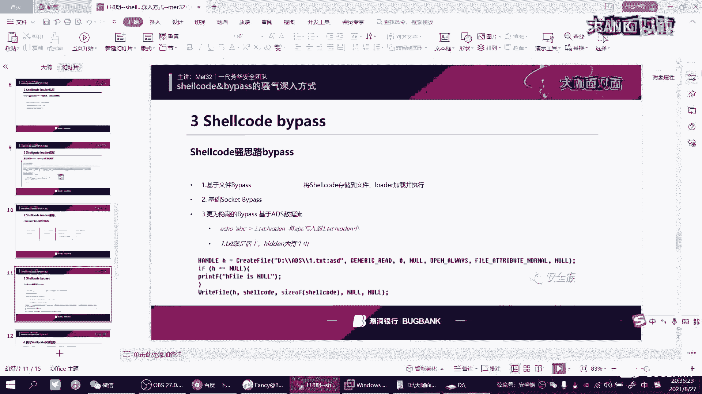

哎，我這個2013他怎麼，看一下等一下。

稍等一下，首先咱們看一下，嗯，先講這個基於ads數據流的吧，因為這種的話呢，這種的話和咱們這個基於文件的是類似的，基於socket的咱們放到最後面再講，嗯，我記得在前些年呢。

我在網上看到過一篇文章就是什麼，呃，webshare，然後ads數據流好像是這麼個東西啊，嗯，大家可以去看一下，當時我看過這個文章，就是說你這個share呢，你藏在一個文件下邊。

你給他寄生在一個文件下邊呢，來可以執行，嗯，你們網上可以去看一下啊，其實這個也是比較簡單的，你可以看一下咱們這啊，這個1。txt呢，他後邊有一個有一個就是冒號吧，他後邊寫了一個hidden，這個1。

txt就是一個宿主文件，你這個hidden呢，就是一個寄生蟲，就相當於說，嗯，你這個宿主宿主裡邊呢，寄生著咱們這個東西，對吧，你當你這個宿主涼涼的時候呢，你這個寄生蟲肯定也涼涼，對吧，那麼肯定有人會問。

就是說你這麼做有有啥用嗎，這個就相當於怎麼說呢，你這個寄生蟲呢，是非常不容易被發現的，對吧，非常不容易被發現，除非你這個宿主文件涼，你這個寄生蟲才涼，那舉一個例子啊。

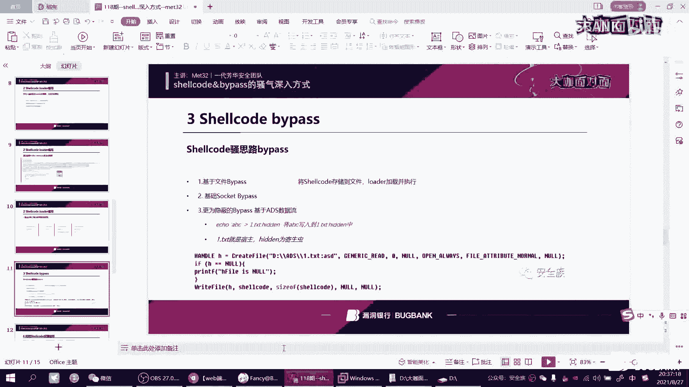

都認真聽啊，ABC對吧，你給他寫入到寫入到一個，咱們先給他寫到一個地方裡面，然後寫入一個123吧，123，到咱們，嗯，Mate32。txt，裡邊的一個，DDN啊。

這個寄生蟲這個這個文件的名字呢，你可以隨隨便起啊，因為我這裡起的這個head呢，念著比較順口啊，這個你可以隨隨便改啊，咱們看一下啊。

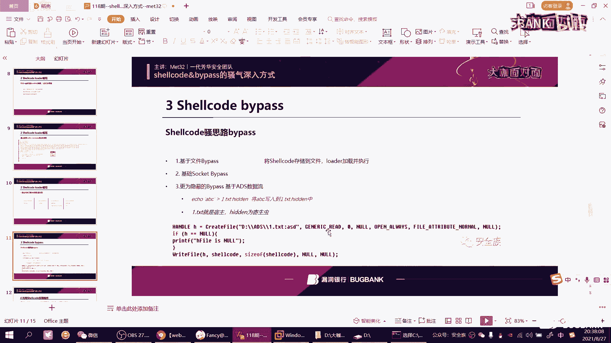

咱們剛才創建的是Mate32。txt是吧。

你簡單的注意一下啊，有這個文件對吧。

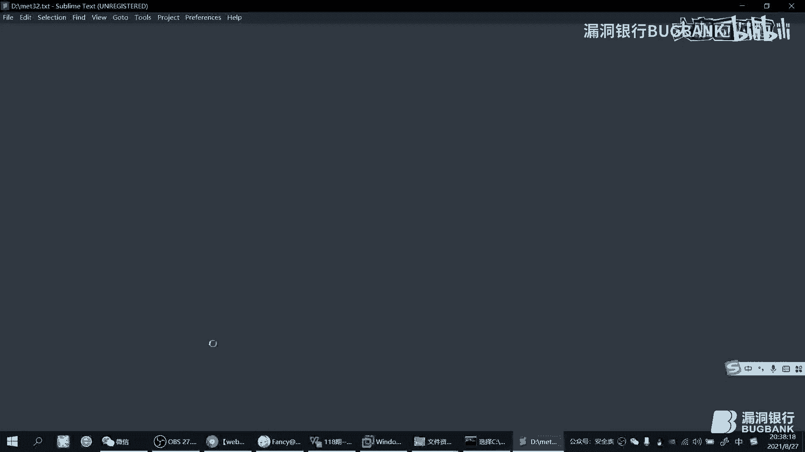

但是當你打開之後呢，你發現他裡邊什麼內容都沒有，然後呢，你通過一個屬性來進行一個查看的話，他這個大小也是零字節，就是就是各種東西呢，都是零字節，可能可能你一眼看起來，這就是一個空文件，對吧，但是啊。

你可以看咱們這個明明是寫入了一個123321啊，123123啊，那麼你怎麼你怎麼查看呢，你就通過一個命令行來進行一個查看，這個書法有點有點難受啊，通過一個notepad可以看的吧，現在你打開的這個文件。

這個這不就是咱們這個寄生蟲文件嗎。

你再對比一下，對吧，你現在這個是空的。

接下來我給大家看一下，如果咱們把這個宿主給他幹掉，你看看你涼不涼啊，你看看你涼不涼。

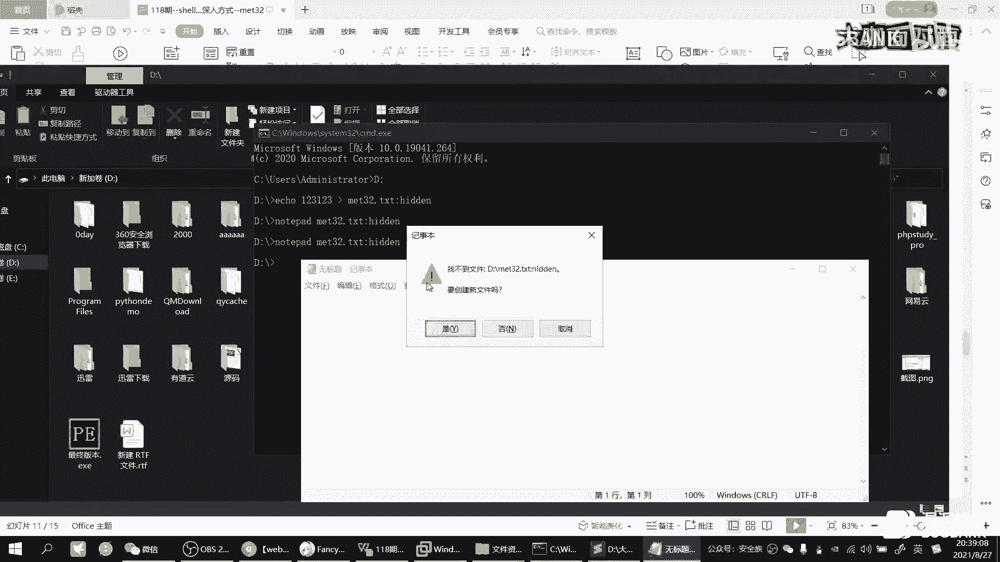

看見吧，已經涼了對吧，那麼簡單介紹完之後呢，你想想，如果咱們將這個sharecode，你寫到這個這個寄生蟲文件會怎麼樣呢，首先呢，就是一個極極難被發現吧，對吧，因為沒有人閒著閒著沒事幹。

就一個一個去找這個寄生蟲文件，對吧，應該沒人幹這事吧，然後咱們這裡的話，我寫了一個代碼啊，找一下，堅持住啊，馬上就下班了，馬上就講完了，把先把先把這兒補齊點，首先進行一個寫入啊，嗯，這兒我看一下啊。

先寫完內存之後呢，給他清空清空完之後呢，把咱們這個sharecode給他寫入進去啊，沒問題，這就寫入進去了，當然你這裡看肯定看不出來，對吧，一個黑框框，你怎麼看得出來呢，所以的話呢，你就可以通過一個。

什麼什麼呀，咱們先看下啊，看下，看下這個文件是吧，這個是咱們剛剛創建的，你可以看一下看一下時間啊，哎，修改時間對吧，你看一下修改時間。

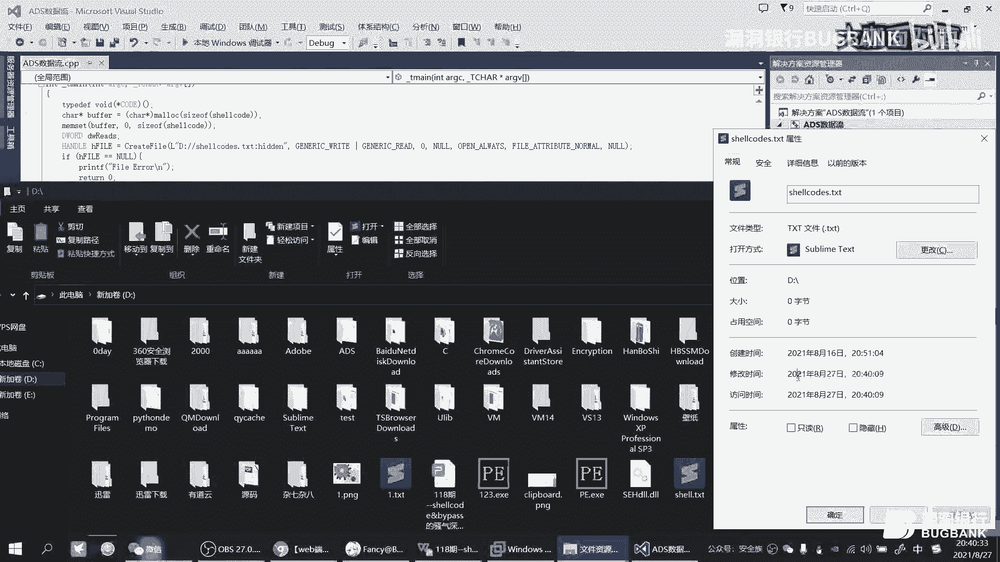

修改時間，然後的話，他大小也是零，剛才可以看見。

咱們看一下他sharecode，是不是存在這裡，嗯，可以看見嗎，他裡邊就是這個亂碼的那種啊，但是WinHex，我目前也沒有找到什麼辦法，能把這個，這種這種數據流文件給他拖進去啊，可以看見吧。

他是這種亂碼的，其實他這個你要是放到，你也可以通過把它複製出來呢，放到一個WinHex裡邊呢，可以看一下，他是不是你這個，咱們這寫入的這個sharecode，寫入進來之後呢，接下來就是讀取唄。

你目前已經寫好了對吧，你寫好之後你就讀唄，讀文件，咱們這裡已經申請了一塊，一塊堆空間，對吧，這個和咱們之前的前面那個文件操作，一模一樣，一模一樣，下了個斷點，注意一下，嗯，看一下buffer，找一下他。

可以看見吧，他這個buffer就是咱們這個sharecode的，然後把它卡掉啊，之後呢，關閉劇本，關閉劇本再通過一個hash指針來調用啊，這裡我已經定義好了，對吧，還是熟悉的操作，熟悉的操作啊。

是不是看著非常非常，非常簡單，看著對吧，就這裡邊的，裡邊這個這不就是咱們這個sharecode的一個內容嗎，那麼一個f5標用對吧，就公了對吧，這種的就是基於ads數據流。

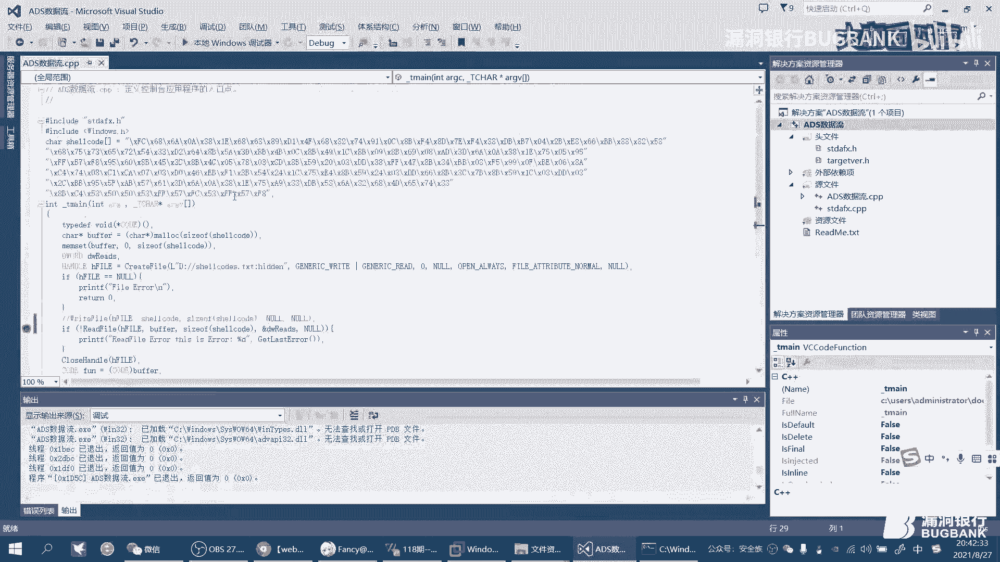

就是說你這個文件呢，嗯，確實是這也是算，也算是文件文件就是把sharecode寫到文件的一種，但是的話呢，嗯，實際上呢，其實是寫到ads數據流的這種啊，這種的話，bypass也是非常強的，最後一種呢。

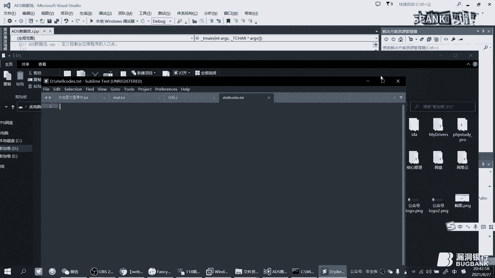

咱們看一下，接著往下看，基於socket的一個bypass，基於socket的bypass呢，這個是我之前看到過一篇文章是，就是那個python。

拿python就是讀那個web服務上面的那個sharecode，讀下來之後呢，再進行一個執行，於是呢，我就改進了一下，小小改進了一下，這個這個給他幹掉啊，其實總體來說呢。

這也是一個sharecode loader的編寫吧，loader的一個更深思路的一個編寫吧，服務端對吧，這是一個服務端，這是我之前寫的一個服務端，寫好之後呢，看上他一個客戶端，客戶端，客戶端啊。

具體的一個流程呢，就是說你這個客戶端可以看見吧，咱們這裡邊寫了這個sharecode了，你這個客戶端呢，通過發送這個sharecode呢，到這個服務端並進行一個執行，這裡有咱們這個服務端的一個IP地址。

咱們可以這裡，2。175對吧，這裡我提前寫好了，這就是一個服務端，然後，然後呢通過一個send進行發送，發送完之後呢，服務端當接收到之後呢，用一個result接收到之後呢，我把它寫入了一個文件了。

可以看見吧，我為了更加保險一點呢，我為了更加保險一點呢，我就又寫入了一個文件啊，愛事，又寫入了一個地盤下的sharecode。txt，然後呢，通過什麼然後呢，再什麼讀取亂七八糟的啊。

然後在最後再通過一個內來匯編的方式來執行，也是比較簡單的一種，但是呢，你這種繞過方式也是比較比較強的，可以試一下，先打開咱們這個訊機啊，為了就是更貼近實戰啊，該訊息似乎正使用中，完了。

我把這個，先把這個訊息給他幹了，這個是我寫的條碼號的一個。

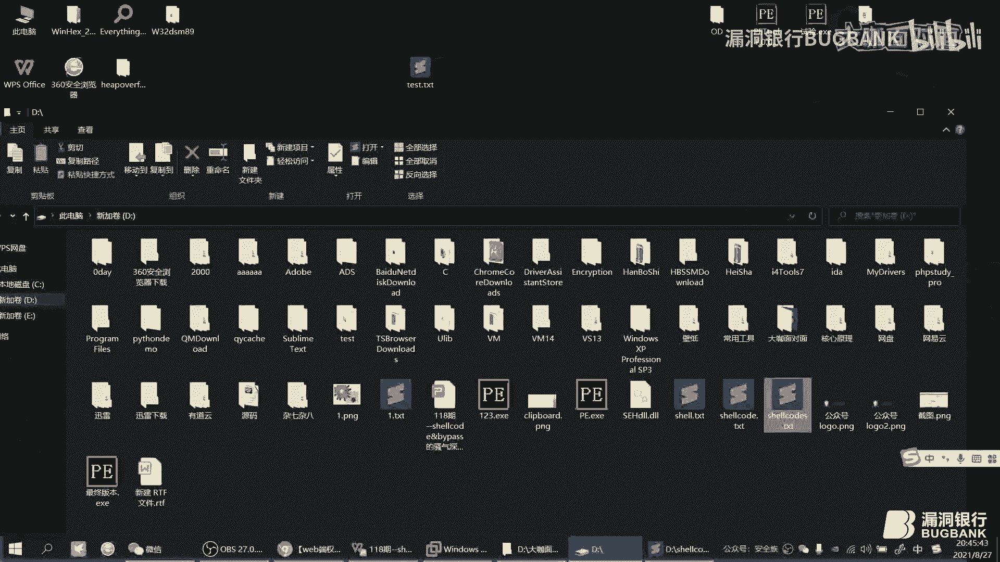

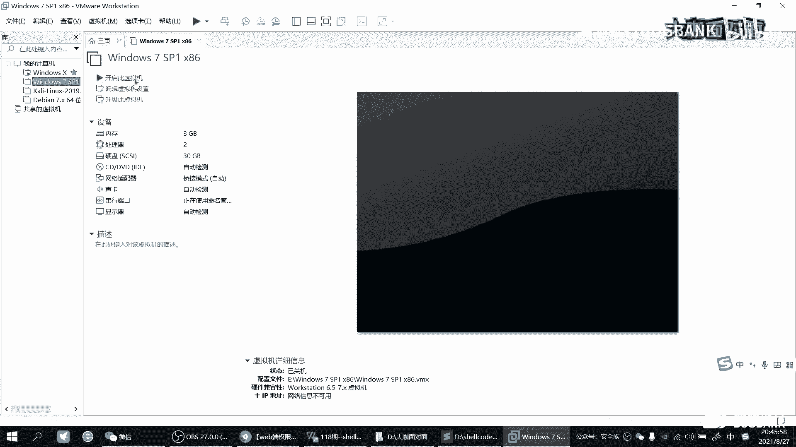

為了更貼近實戰一點啊，然後為了就是怎麼說呢，打臉一下噴子啊。

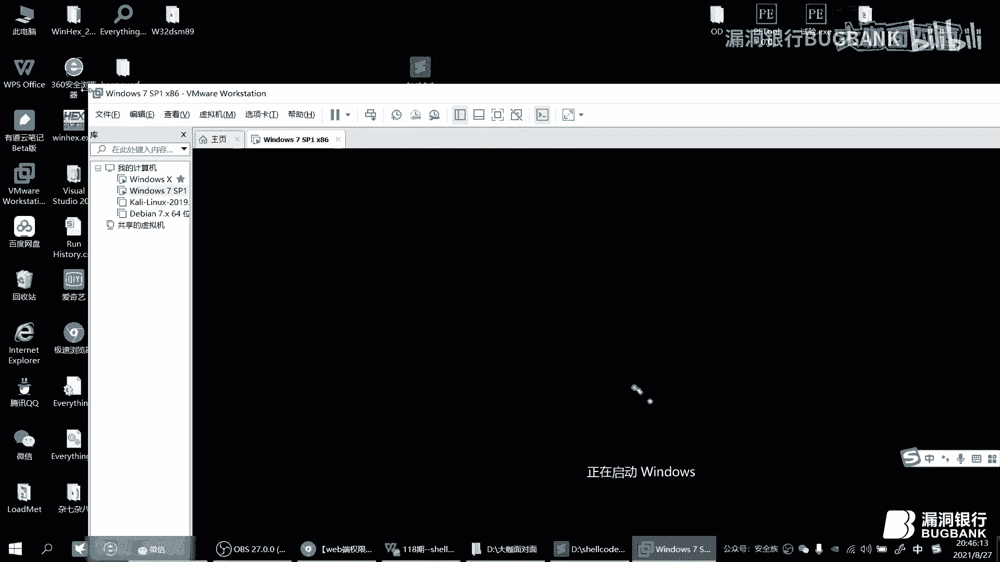

不然的話，如果我拿本機做測試的話呢，肯定有噴子會噴我說什麼啊，你在本機做測試誰不會啊。

對吧，我記得我之前傳了一個客戶的，好像是這個，哦，是這個是這個，這個是我傳的，看一下你們這個能不能拼得通啊，咱們現在的話呢，我這個本機呢，就是咱們這個服務端運行的一個環境。

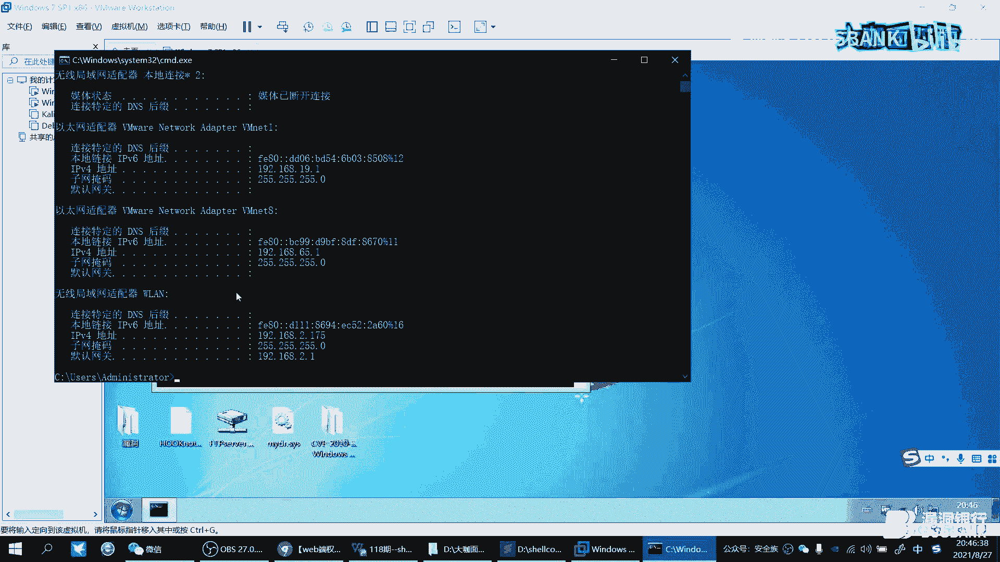

而這個客戶端呢，就是一個攻擊者的一個環境，假設啊，首先拼一下能不能能通，對吧，拼可以通啊，可以通之後呢，嗯，先把咱們這個服務端給運行起來啊，找一下，哎呀。

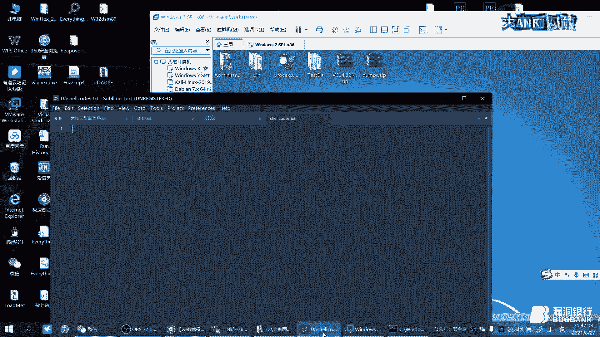

我的服務端又關了，哎呀，我這記性，嗯，對吧。

現在服務端處於一個運行的狀態啊，把客戶端運行起來，這個客戶端文件呢，我這裡就不再傳了，這個是我剛才傳的一個，由於這個IP沒有做變動，可以看見吧，嗯，我這個客戶端已經發送成功了，我這已經寫出來了。

發送成功對吧，發送成功之後呢，我這個服務端呢，成功執行了咱們客戶端發送過來的一個SR-Code，並進行一個執行，當然你也可以怎麼說呢。

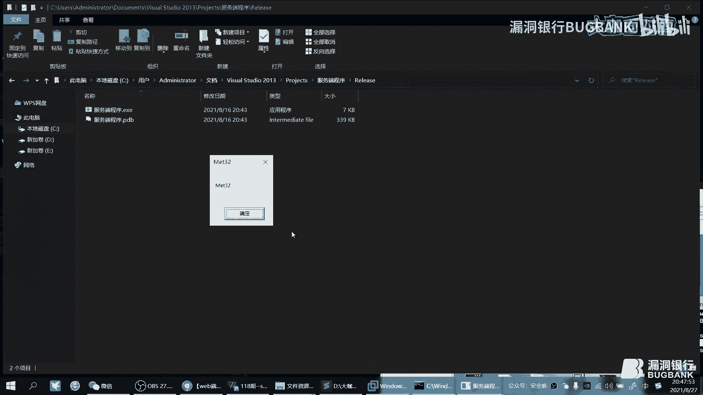

可以跟一下他的這個，他這個跟一下他斷點斷點啊，嗯，首先呢，是進行一個寫入。

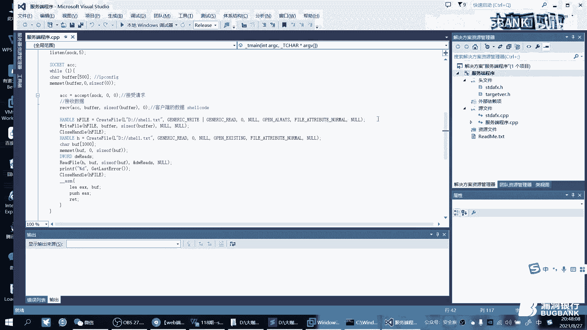

在這斷吧，把服務端運行起來，現在處於一個運行狀態啊。

把它把它小化，再運行一下客戶端，斷下來了對吧，斷下來之後呢，注意一下啊，注意一下你這個接收過來，這個內存啊，注意一下這個內存，看看接收接收到了嗎，內存，現在現在其實已經接已經接收到了啊。

但是我這裡怎麼說呢，又進一步做了一個寫文件的一個處理，當然你這裡也可以把這個寫文件的一個處理呢，改成那個那種ads數據流的那種更更隱蔽一點吧，寫入對吧，寫入進來之後呢，寫入進來之後，關閉劇本。

關閉劇本之後看一下，哪個文件啊。

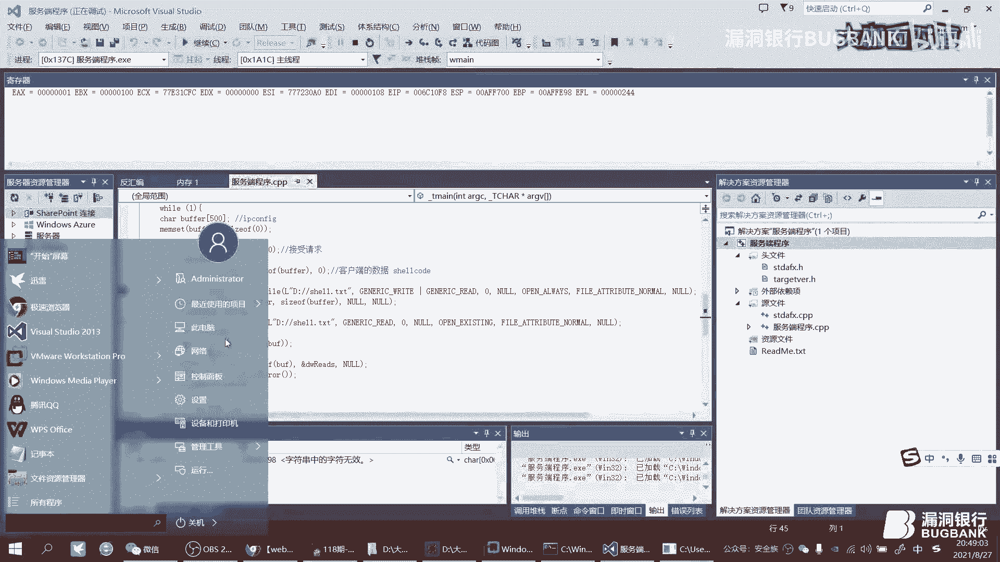

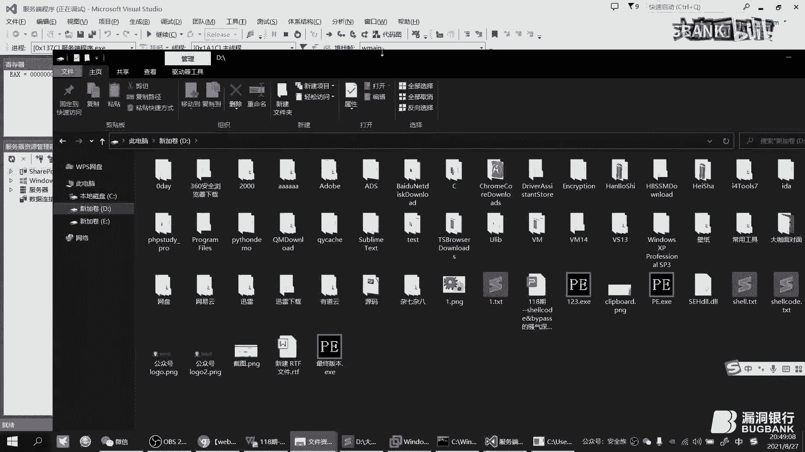

show。txt，對吧。

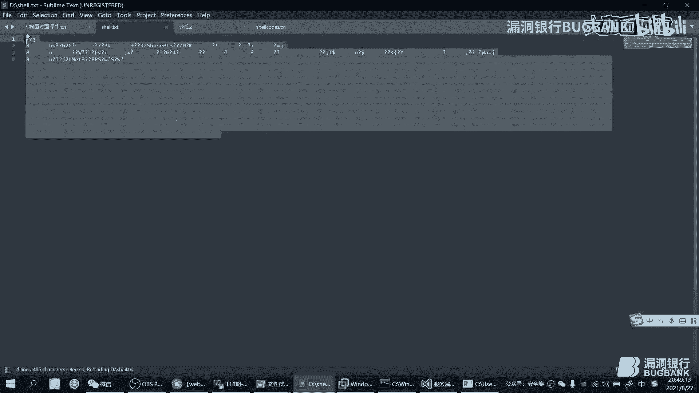

這麼個玩意兒啊，當然你這裡看肯定是亂碼的啊，因為剛才我前面已經已經說了，然後呢，再通過關閉完劇本之後呢，再次打開進行一個讀取，讀取對吧，注意一下，注意一下咱們這個buff，可以看見吧，然後。

然後咱們看一下，關閉劇本對吧，然後這這這就是一個一個loader對吧，這就是執行的地方，還有地平線下對吧，其實你這主要主要來說呢，就是你這個你這個客戶端呢，就運行在你的電腦上就就行了。

你客戶端就負責給這個服務端發送發送發送數據就行了，你這個服務端架起來之後呢，他做了一個接收數據，並進行執行share code的一個一個工作，就這麼個操作，然後這裡講一個怎麼說呢。

你在VS一個高版本編譯器中的一個一個安全吧，現在的話呢，編譯器也就是越更新越厲害，你連操作系統就是都是對吧，你越更新越厲害，安全機制越猛對吧，讓咱們這些搞安全的都沒法過了，只能靠吃土了。

他再這麼更新下去只能吃土了，可以看到啊，在這個鏈接器裡邊呢，他有一個所有選項，所有選項裡邊這個第一批呢，你要給他幹掉啊，第一批這是一個數據保護，你要給他幹掉，他這個就是專門防止咱們這個戰役出的。

就是我剛我剛開始開頭講的那個戰役出對吧，這個就是專門防那個的，所以的話你要給他幹掉啊，給他關掉，如果不關掉的話，他執行不了的，至於有的有的人會說啊，我這個這個客戶端用不用關呀。

你這個客戶端你想過去關唄對吧，因為你客戶端的怎麼說呢，他你這個客戶端並沒有執行server code，你這個客戶端只是負責給服務端進行發送過去，就是說我我把server code扔給你。

然後你來幫我執行，就就這麼個意思啊，千萬不要搞混了，這個就是一個GGsocket的一種，一種bypass的一種手段吧，如果你單純的將將服務端你上傳到，就是來進行掃描的話，你肯定是掃描不出任何異常的對吧。

因為你這裡邊既沒有server code，更沒有任何特徵碼，好啊，接著往下講，嗯，我所講的我再穿插一句啊，我所講的這幾種呢，就是說針對於針對於一個靜態或動態的話。

都是可以得到一個有效利用的一種bypass的，大家這種事不用擔心的，因為我沒有往外往外就是發過啊，接下來最後一個啊，最後一個啊，馬上就下班了啊，大家堅持一下晚點睡啊，最後一個呢。

就是一個利用server code進行一個傳線維持，這個是個什麼玩意兒啊，咱們先簡簡單單講下，就是說通過一個p文件來植入一個server code，並進行傳線維持。

首先咱們先簡單介紹介紹一個最簡單的一個玩意兒啊，最簡單這個玩意兒呢，就是一個，搞逆向搞破解的那群人肯定就是等天滿嘴就是OEP，OEP找OEP對吧，可能就是很多人都不知道這個OEP是什麼，這個OEP呢。

就是這個程序入口點，而你這個OEP呢，它是分為兩部分啊，一個是一個address of entry point，以及一個image base，它是這兩個加起來是一個OEP啊。

你千萬不要理解為這個OEP就是就是就是這個address of entry point啊，不然就就出事了啊，你的老闆很有可能把你開了啊，那麼咱們先看一下啊，嗯，先簡單舉個例子。

你這個image base呢，其實就類似於一個機制吧，就是說，呃，在那種小區裡邊的話，你可以看見那種小區的那種單元樓，咱們簡單舉一個例子啊，對吧，你那種單元樓有一單元二單元三單元，對吧。

而你這個image base呢，就是說它在你可以理解為它在哪個單元裡邊，而你這個address of entry point呢，就是說你在幾樓，假設我在10樓對吧，我在10樓就在這兒吧。

你是在一單元的10樓啊，還是二單元的10樓啊，還是三單元的10樓啊，對吧，你不能說我就在10樓，嗯，你連你哪個單元的都沒說，那我去哪找你啊，對吧，這就是一個OEP啊，就是這兩個玩意兒合起來的。

通常情況下呢，通常情況下呢，像咱們這種高版本的話呢，很多程序都有都有那種地址隨機化了，地址隨機化的處理，地址隨機化處理的話呢，他只是對前邊，對前邊進行了一個隨機化處理，到後邊的話呢，他是沒有，就是說。

你這你你這一個地址呢，他對你前四個字節進行了一個隨機化處理，你後邊呢，他沒他沒有動，就這麼個意思，那麼咱們講一下，如何來植入一個SERVER CODE。

就是說通過一個文件來給他植入一個SERVER CODE。

這裡的話咱們找一個小白鼠啊。

這個吧對吧，這個就是咱們一個，一個PE Tools啊，這裡我不敢用什麼，就是比較敏感的一個一個東西啊，這裡咱們就用一個小工具來做測試就行了，可以看見吧，這這個就是一個程序正常流程，正正常執行流程啊。

你把它拖進來，就是他就是一個PE解析器，這個這個玩意兒對吧，你看下應該很多人都用啊，就是如何來向他植入一個SERVER CODE呢。

嗯，首先就是通過一個手動方式吧，把這個咱們給他幹掉啊，拖進來對吧。

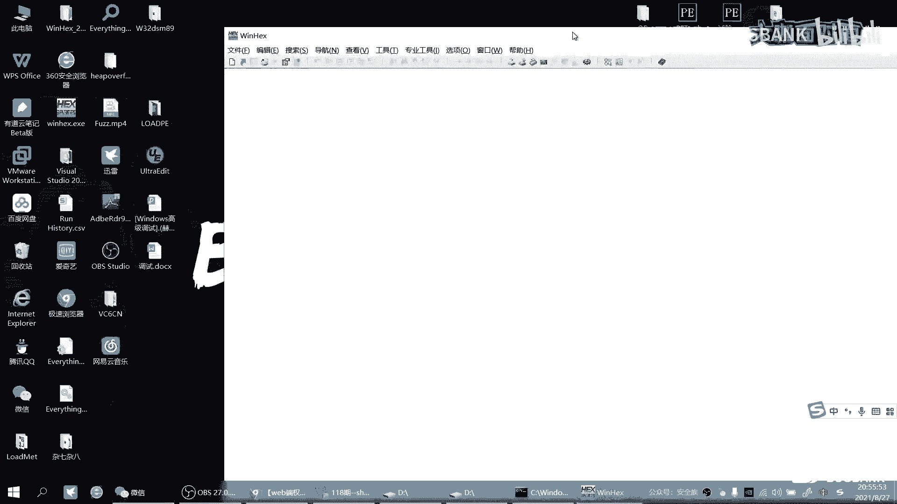

拖進來之後呢，在128的地方呢，就是他的一個address of endpoint，在這可以看見吧，他這他目前的一個入口點是193BE，如果你不信的話呢，可以看一下啊。

直接，直接注意一下，這兒是吧，193BE很簡單的一種，很簡單吧，然後imageBase呢，在這兒，嗯，這裡我教大家一個快捷的方式，你直接就是通過一個地址給他找就行了，你不要像網上的那些什麼。

你一個一個從，從前面這個這個文件頭這兒呢，你給他數到下邊對吧，從什麼到此頭NT頭一個一個數，你數到過年也數不完呀，對吧，你何必為難自己呢，怎麼方便怎麼來唄，然後的話呢。

咱們現在已經了解了你這個OEP是什麼。

你現在咱們拖到OD裡邊看一下，他這個程序會不會是4193BE，不要為難自己啊。

怎麼方便怎麼來啊。

哎，我的OD歇班了。

哦，這兒是吧，4193BE，這個就是他這麼一個執行流程，對吧，很多是吧，那就不看了，改一下啊，看看如何來修改一下。

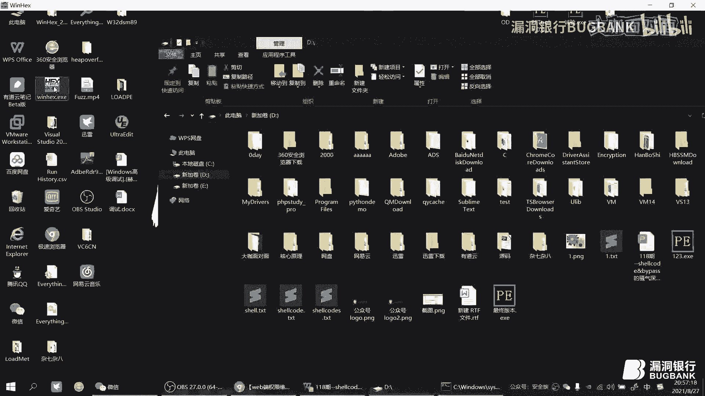

哦。

現在咱們打開的這個就是咱們找一段空白區域呢，來進行存放srcode的，你這個文件呢，你往後一拉，可以看的吧，這不都是嗎，對吧，這不都是空白區域嗎，隨便找一個，這裡我寫個回歸指令。

我就寫個硬碼指令6100吧，這裡就不用印他斷點了，如果用斷點的話，直接就涼涼了，6100，然後然後呢。

然後再一個6100行吧，寫兩個6100，寫兩個6100之後呢，記一下，目前這個地址是32A50，把128的地方給他改掉，128，32A50，你現在運行的話肯定是運行不了啊，咱們直接拖OD給他分析一下吧。

因為我這裡就不再給他搞srcode了，比較浪費時間啊，因為大家都著急睡覺陪女朋友對吧，可以看的吧。

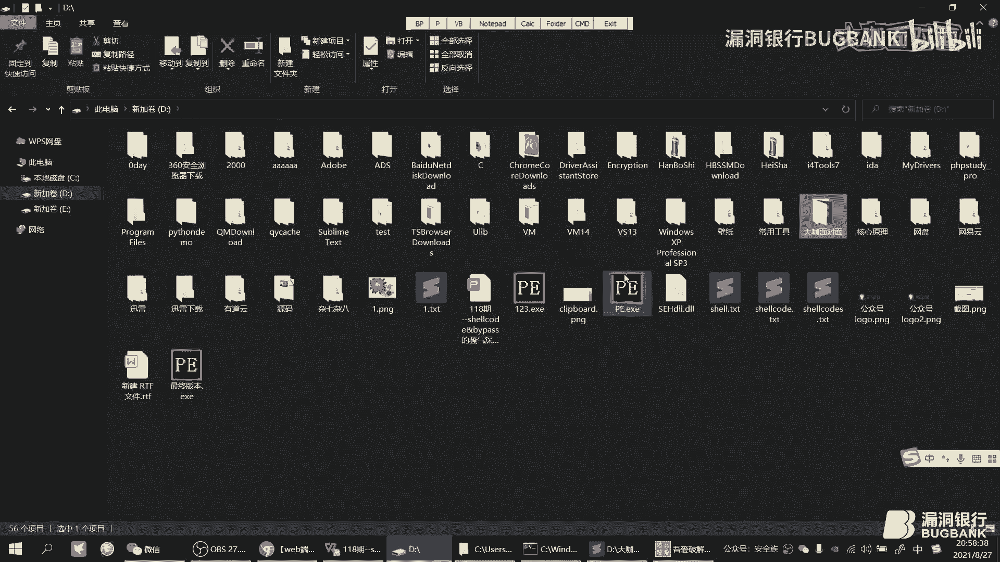

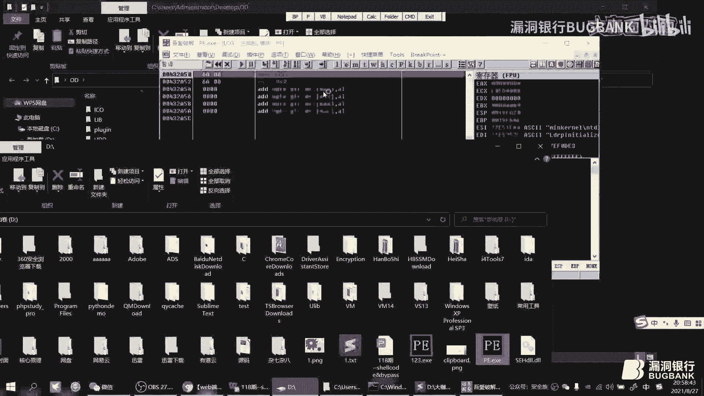

現在咱們這個入口點就是6100，6100，6100，對吧，那麼你寫好這個6100之後呢，咱們這個原程序。

他的功能這不就沒了嗎，對吧，你這個原程序功能，你運行去刷機，他他不運行了，對吧，你像如果如果別人一看的話。

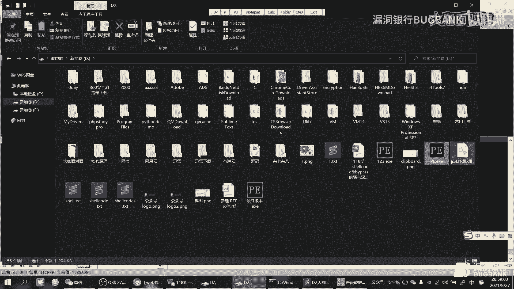

一運行他程序運行不了的話，肯定會給他刪掉或重裝。

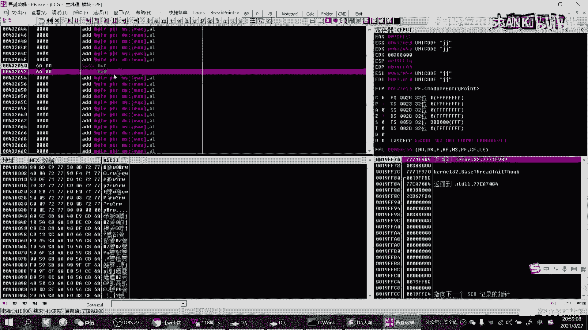

對吧，所以的話呢，咱們就要通過通過一個靠貨，jump來進行一個跳轉回去。

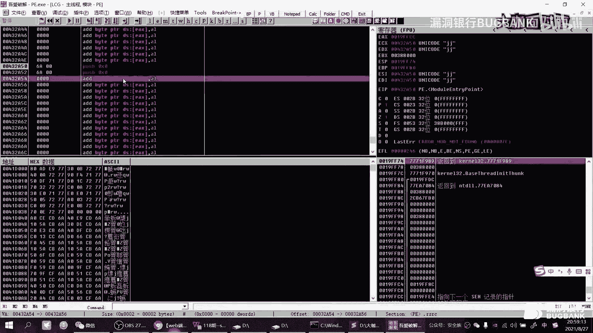

跳轉回原OEP，找一下一個原OEP。

完了，找一下，我好像沒留備份。

哎呦，走神了，走神了，這是吧，4193b，哦，對啊，大家仔細聽啊，我剛才又忘了一種bypass手段，忘講了，等會等會給大家講啊，4193b啊。

所以的話呢，咱們這裡就直接通過一個jump指令，進行一個跳轉。

4193b，他翻譯過來的一個硬編碼指令呢。

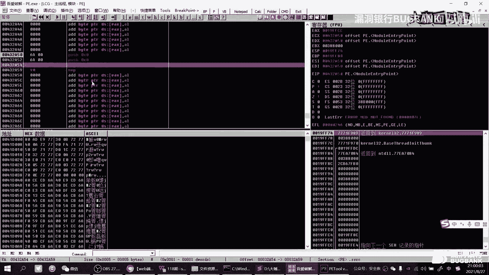

咱們這裡記載一下是一個1965，69F1FF，對吧，他其實這個玩意呢，如果有人就是應該寫過這個叫什麼空白區域植入message box。

在那個網上有很多文章寫那個空白區域，植入message box的話呢，他是進行了一個運算，就是什麼要跳轉的地址，就是說你要跳轉的那個地址呢，-18當前的地址再-5，這個18呢，就代表的是你當前這個地址。

再-5什麼什麼，再進行一個手動運算，對吧，是不是非常繁瑣啊，所以的話呢，嗯，所以的話呢，這裡就寫了一種比較簡單的，比較簡單的一種方式啊，嗯，哎，稍等一下卡了嗎，啊，不卡不卡，接著講，就是說。

像網上那種方式呢，像網上這種什麼要跳轉的地址，-這個-那個，然後你再算一下，然後算半天算了十來分鐘，然後移動，哎，還用不了，是不是非常崩潰，對吧，就那種方式呢，你就玩一兩次。

你知道有知道他是怎麼個運算原理就行了，實際上的話呢，你就你就直接在OD裡邊。

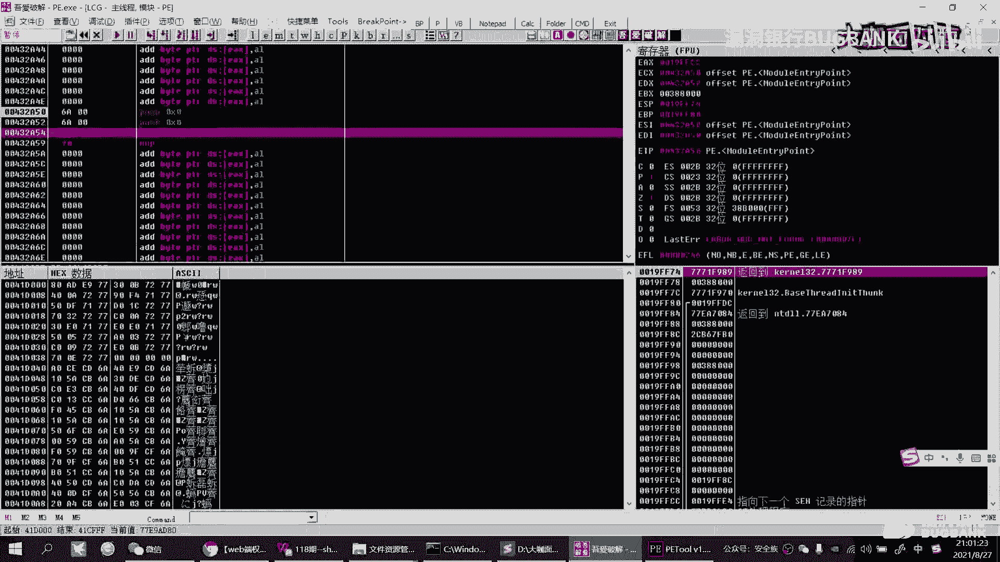

直接寫一下不得了，你在你在你這個Shrk的最後邊呢，你再通過一個jump進行跳轉回去，這不就得了唄，沒必要是沒必要造輪子啊。

這裡這是我個人的一個一個建議啊，沒必要造輪子，然後的話呢。

給他寫進去啊，咱們的WinHack，是128，12832A50，A50對吧，然後呢。

通過一個19之0來跳轉回去啊，196569，196569，F1 F1。

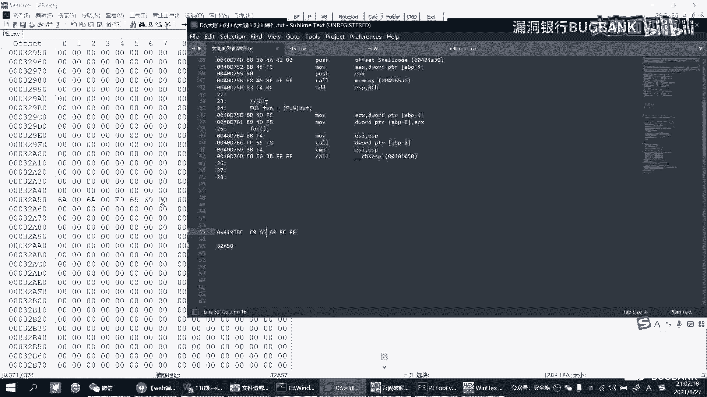

看吧，哎，哦，OD還打開呢，咱們的宗旨就是不造輪子啊。

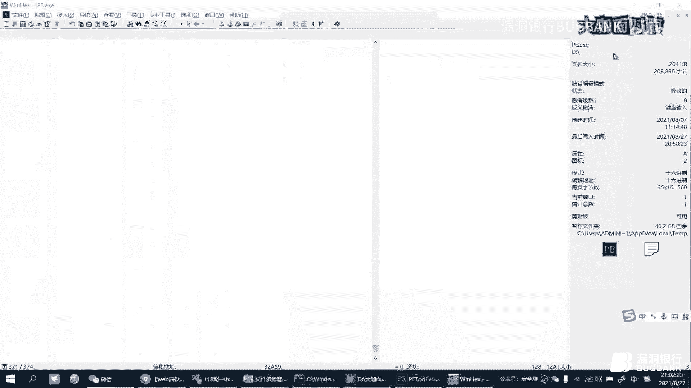

怎麼方便怎麼來，怎麼能摸魚怎麼來啊，可以看的吧，現在的話呢，你已經成功成功執行了，對吧，當然你這裡可能可能看的不明顯啊，因為剛才的話，你這個什麼P1。1，EXE它是進不來的。

因為我這裡進行了兩個兩個push操作，所以的話，你肯定也是看不出啥操作來的，接著接著看啊。

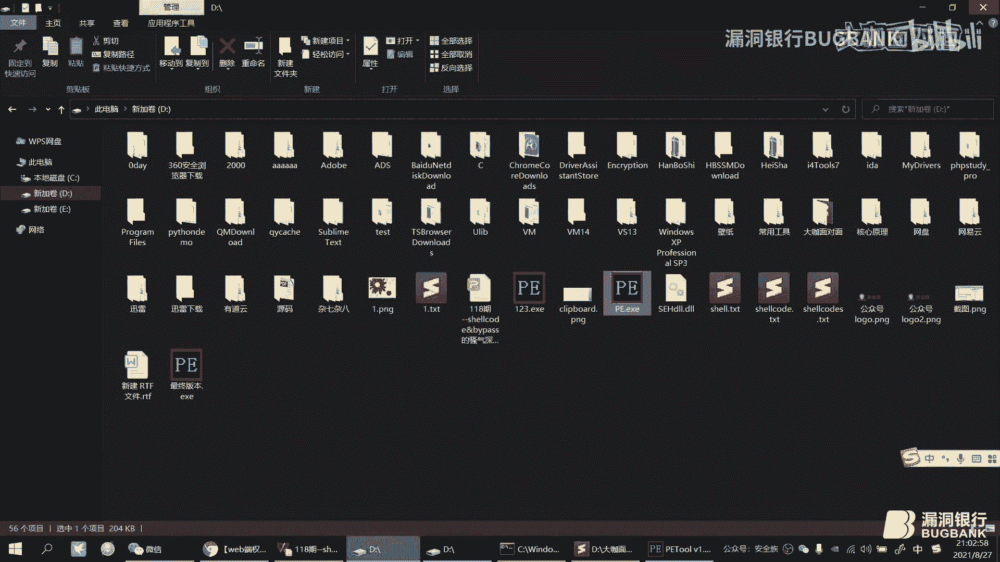

嗯，就是說當你這個空白區域如果不夠的話呢，不夠存放shrk的話怎麼辦，就是說可以通過一個新增解的方式，這個，網上應該有這種很多文章啊，你這個空白區域如果不夠的話呢，你先增一個解吧，先增一個解。

你這個解專門存放你的shrk的，然後的話呢，你這個address of entry point呢，等於你這個系統解的這個RBA，啊，VA啊，VA，然後再修改你的什麼，然後就是最後就是進行一些修改。

簡單的一些修改了，把這個什麼size of image啊，什麼這個解表的數量啊，什麼，什麼P1。1啊，給它設一下就好了啊，我這裡之前寫過一個。

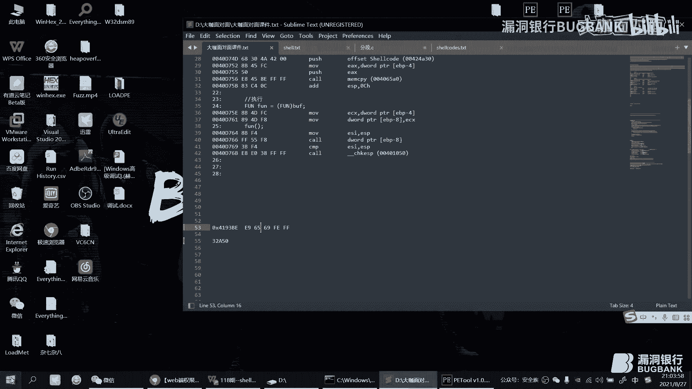

我寫過一個自動植入share code的。

太久了，我給大家看一下還能不能用啊，可能比較吃虧了，估計是之前，以前寫的一個代碼有點多啊，但是沒辦法，該省的我都省了啊，咱們看一下啊，看一下這個地方，首先的話呢。

獲取了一個最後解的一個FOA的一個對齊值，就是你FOA和RBA呢，你得獲取一下他的一個對齊值對吧，獲取完之後呢，然後呢，你這個file size和你這個visual size呢。

就是你最後一個解的一個開始地址和一個內存地址，然後再進行了一個解表的一個++。

自這個OBS，現在呢現在怎麼樣，好我們刷新一下，我看一下啊，不著急，我們這邊還，我這個OBS給崩了呀。

怎麼一下，沒事了，現在好了吧，哎，出來了出來了出來了，趕緊把，剛才剛才講到哪了，出來了，剛才，我哪知道，評論區說一下。

剛才你們看到哪了，我繼續往下講就行了，剛才我講。

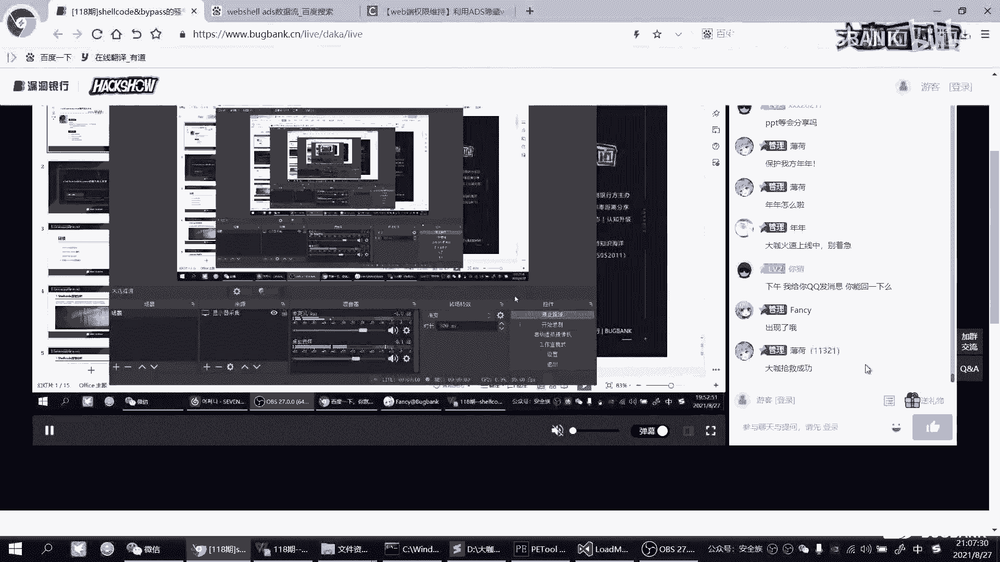

我講這的時候你們看見了嗎，看到了看到了，就從這講吧，就從這講，就從這開始講，進行新增接之後呢，可以看見吧，其實前面的都是為了就是對這個新增節的一個操作，就是不必於太過就是關心啊，主要是看後邊這條指令。

我這個address of entry point，就是這個EP呢，這個EP指向了咱們這個visual size，這個visual size是個什麼東西，你可以往上邊一追就可以追到。

它是最後一個解開始的內存地址，而我在前面已經說了，他這個share code呢，就是就存在咱們這個新增節的一個起始位置，新增節的一個起始位置，之後的話呢，就是進行了一些什麼保存文件的一個操作啊。

就是將咱們這個share code，可以看見吧，這給他寫入進來，將咱們這個share code進行寫入進來，看一下啊。

看一下我寫的這個自動化的一個工具，輸入文件路徑。

先找一個文件，找一個試驗品啊，這個吧，對吧，可以運行對吧。

他現在正常運行的話，他是沒有植入share code的，然後的話呢，把咱們這個，把我寫的這個程序給他運行起來，輸入一個文件路徑，好啊，直接自動化寫入啊，自動化寫入。

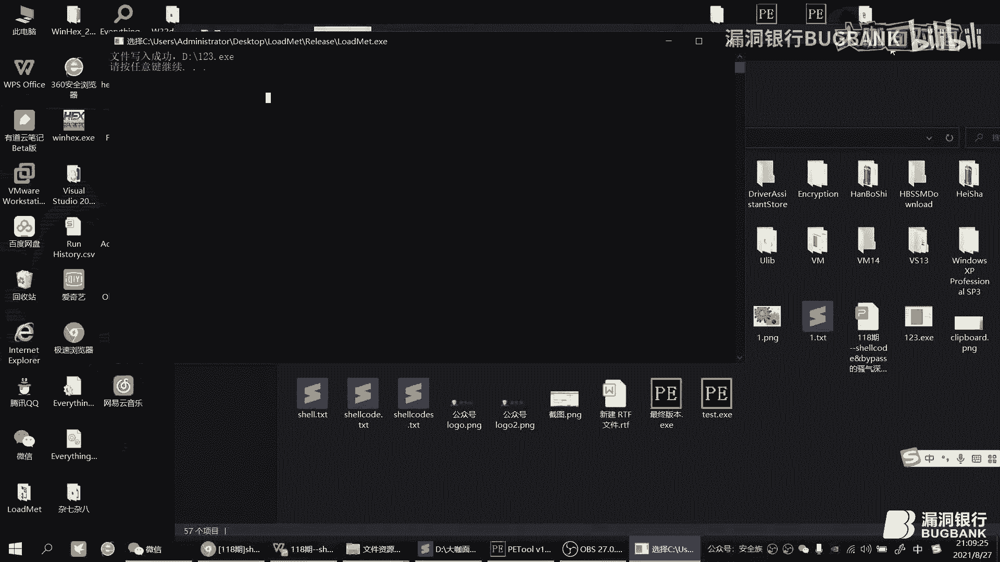

寫入成功了，對吧，寫入成功之後呢，是123。txt是吧，哎，等等等等等等啊，123。txt，好這個是吧，可以看得到吧，現在咱們這個share code呢，就處於一個，植入後的狀態了。

當然他這個程序是運行不了的，對吧，然後那咱們需要進一步搶救一下啊，給他改一下，直接追一下。

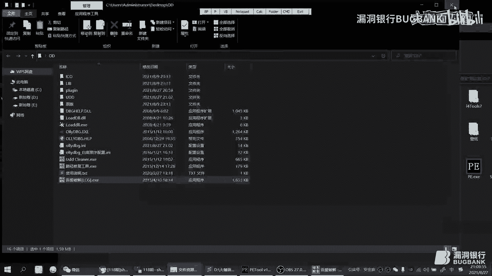

嗯。

這吧。

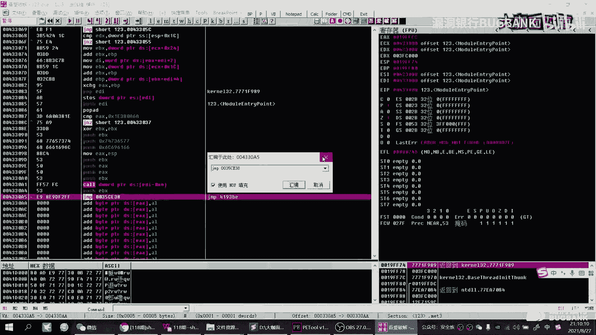

咱們把這個19這兒這兒給他給他改成咱們，把這個jump這兒給他修改為原OEP。

原OEP的一個地址是4193。be。

通過一個jump來進行一個跳轉。

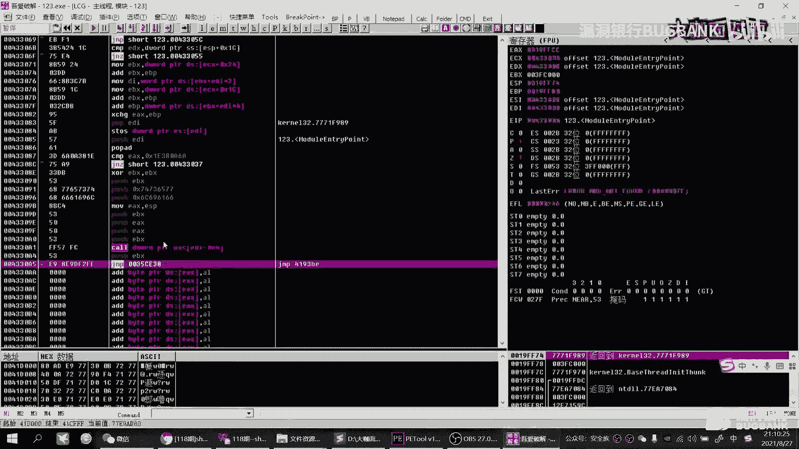

他翻譯過來的一個指令呢。

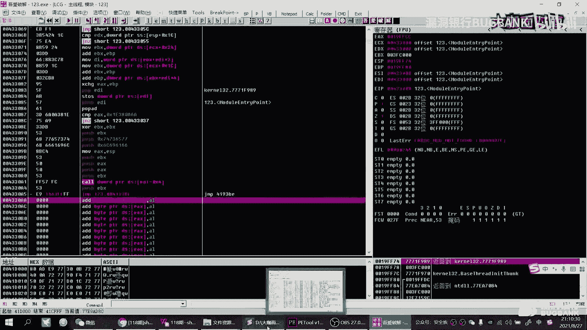

給他寫齊好啊，寫好，191463FEFF。

然後通過一個winhacks來進行一個進一步更改。

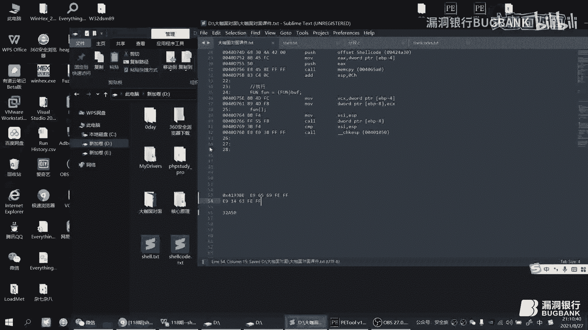

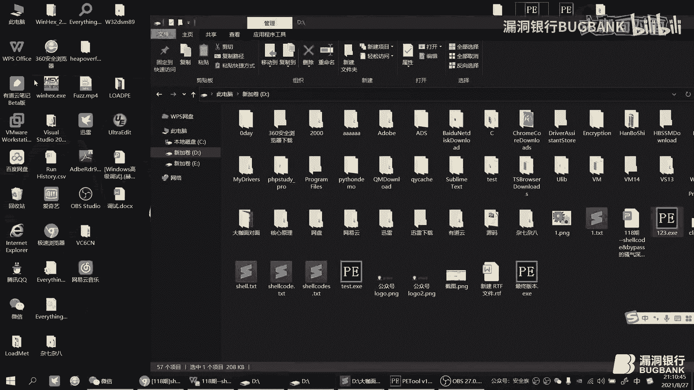

這換一下啊。

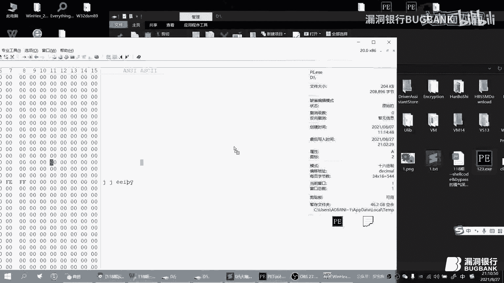

128，33000對吧，咱們這個EP的位置在33000，33000，33000，這兒是吧，很明顯這兒就是，之後呢，之後呢，將咱們這條19指令呢，給他改成咱們這個剛才已經寫好的這個1914什麼。

191463什麼的對吧，這個呢，就是跳轉一個原EP的一個一個指令，你不跳轉回去之後，你這個程序怎麼就是正常執行了對吧，很簡單的一個道理啊，現在看一下，嗯，可以看見吧。

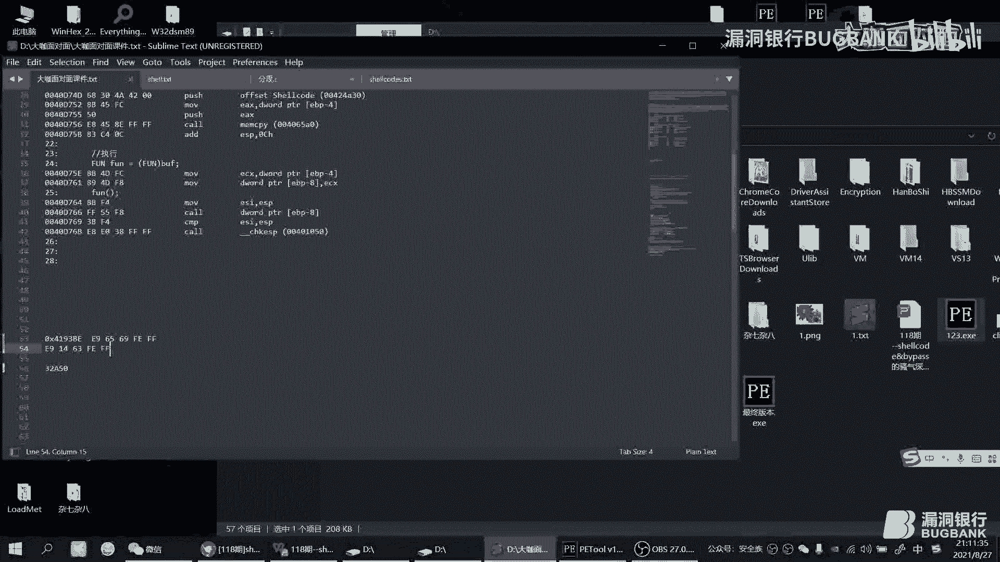

他首先執行的是咱們一個share code之後呢，再進行了一個文件的一個正常執行，就說再關掉再看一下啊，可以看見吧，就說你每執行這個文件之後呢。

他首先先會執行咱們這個share code執行完share code之後呢，他才會再執行這個文件的一個正常流程。

這個呢，就是一個呃，全線維持的一個一個一個小思路吧，大家也可以刻下自己去寫一下，這種小工具啊，然後的話呢。

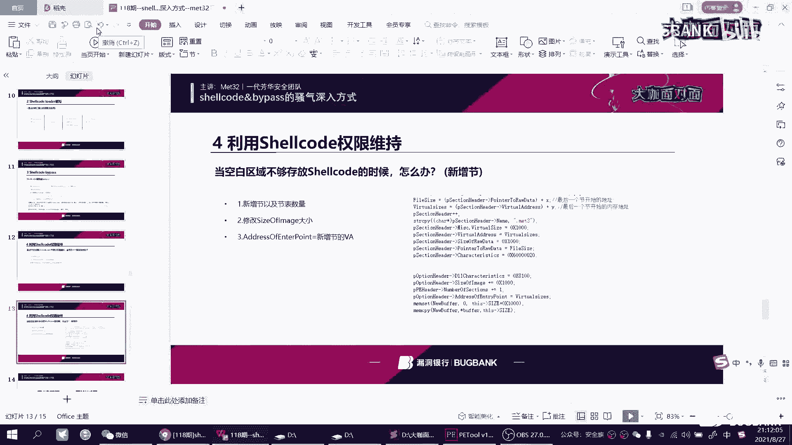

嗯，其實這裡的話，我還有還有還有一個還有一種bypass的一種手段啊，我給大家看一下吧，這種的話剛才忘了我這個PPT上可能沒有寫啊，這種呢，是這個小剛師傅寫的那個註冊表的那種啊，註冊表的那種。

我給大家看一下他寫的這個，他是拿python寫的一個可能就是大家可能看著python比較友好吧，比較簡短嘛，對吧，他這個原理其實我簡單看了一下，就是說，將你這個buffer裡邊。

你一個buffer裡邊存的就是一個share code啊，就是一個share code，把你這個share code呢，你寫到註冊表裡邊，寫了寫到註冊表裡邊之後呢，再再讀取出來，你可以看見吧，他首先呢。

是一個設置，set嘛，對吧，set就是把你的share code給給設置，給寫進去給設置進去，再通再通過一個query呢，來進行查詢出來唄對吧，查詢出來之後呢，把你這個建址呢，給他刪掉了。

小剛師傅這裡呢，他把這個test這個給他刪掉了，刪掉之後呢，通過一個credit through的來創建一個現場並執行啊，來達到一個就是說將share code呢，寫入到一個註冊表裡邊，然後呢。

再讀取註冊表裡邊內容，執行一個share code，這種也是怎麼說呢，也是比較也是比較狠的啊，當時他發出來的話，也是當時也是比較火的，嗯，這就是小剛師傅寫的一篇啊，然後咱們繼續看啊。

我們往下看，咱們講到哪啊，然後最後的話呢，在這裡就是說這個就是我的微信啊，大家有問題可以加一下我的這個微信，以及這個是我旁邊的一個個人的一個公眾號，平常分享一些就是乾貨的一個文章，大家可以關注一下。

或者大家一起交流一下啊，然後本期就到這兒啊。

好的好的，我來了，哎，這個妹特在大咖講的真的非常脫口秀的感覺，我們聽了真的是不想下班，不想接班，不想一直聽你聽，我們沒有我們沒有女朋友，不知道表哥們有沒有，哎，就是這個一個多小時啊。

乾貨滿滿有沒有學會了很多，大家先喝點水休息一下，沒事沒事沒事啊，他他把休息一下，然後呢，我我先來插播一條廣告啊，還有一個月不到的時間就中秋佳節了，我們漏洞銀行馬上呢，就會有中秋節活動，而且是多重的活動。

真的是驚喜年年，我們現在來進入到行長問答環節了，然後我們的大咖把這個鼠標點到那個聊天區的右上方有一個只看提問，只看提問，哦，看到了，看到了，嗯嗯嗯，只看提問，然後就可以看到大家的問題啦，哦。

看到了看到了，稍等一下啊，一個一個解答啊，嗯，內存沒有執行權限也可以執行你內存，如果沒有執行權限的話，那肯定是不能執行的，對吧，嗯，所以的話，你所以的話，你在執行的前提你肯定要內存要有一個執行權限。

但是這個的話呢，像大部分的話，你如果用mylock或者什麼memcpy這些申請的這個內存的這種堆內存的話都有執行權限的啊，這種就是你這不是你需要關心的一個問題啊，第二個呢，是這個加載器不用加殼過免殺嗎。

加殼過免殺也是一種思路啊，加殼過免殺也是一種思路，我講的這種呢，就是說是針對於一個loader的一種一種免殺吧，嗯，第三個將cs的sharecode插入到exe中。

在修改指針指向sharecode可以上線，但是程序不能繼續往下走，沒有辦法判斷sharecode結束的一個位置，或者起一個線來去執行sharecode程序繼續往下走，嗯，你這個提問我有點沒理解啊。

但是呢，但是你可以就是說，嗯，你可以像我這種，就是像我剛才那種，用那個通過一個新增節來進行植入，植入完sharecode之後呢，它是不會跳到一個原OEP的，這時候你就需要用ODP來分析一下。

他就是說你這個sharecode到哪裡到哪裡，他執行完了執行完之後呢，你再通過一個jump或者靠指令等等等啊，給他跳轉回一個原程序進行一個執行，這個就是一個簡單的一個，嗯，嗯一個解決方法吧。

基本上可能就是一個彈窗的一個哈碎地址，如果你放到別人的一個機器上面呢，他的一個地址呢，就可能是23456對吧，所以的話呢，你這個sharecode如果彈窗sharecode的話呢，你要寫的話。

你什麼又得取他什麼PEB，什麼各種什麼科諾32的記者等等等等等，你得一個一個的還得獲取特別麻煩的，之前我寫過一次差點崩潰啊，學sharecode看什麼書啊，你可以看一下那個零電安全。

零電安全裡邊有一張是專門講這個sharecode的，這個是講漏洞的一本書，嗯，像像像你這種繞過方式，是不是用通過msf生成的sharecode的啊，你們可以自己可以自己試一下唄，對吧。

拿msf生成一個之後呢，用我自己寫，用我教你們寫的這種就是bypass的一種手段來自己試一下，現在殺的太厲害了，好多殺軟都感覺挺厲害的，如果要是對流量進行分析這種方式還有用嗎。

如果要是像咱們這種的就是怎麼說呢，他是對一個loader的一個，一個一個編寫吧，一個bypass吧，如果你要是流量分析分析的話，人家要查你這個行為的話，對吧，比如說人家就就查你，你創沒創下一個文件，嗯。

你要創下了，你就就把你刀的病毒給你處理唄，就是引寫到文件裡，這個什麼意思，sharecode寫入到ads數據流可以過，嗯，可以過殺軟查殺嗎，這個是啊，咱們這裡就不用殺軟啊，就比較敏感這個詞啊。

咱們這裡就用bypass吧，他是可以bypass的啊，這個我是試過的啊，嗯，連國外的那種就是國外的，你們你們經常說的那個也是可以過的，這個就放心吧。

socket服務sharecode場景怎麼在實戰中使用，socket服務sharecode場景，在實戰中使用，是上傳一個server可執行文件，然後啟動最後進行連接，剛才我已經也已經說了。

你這個socket服務呢，你這個socket服務呢，你這個服務端呢，就相當於運行在一個目標主機上面，你這個客戶端呢，就運行在你自己上邊，也就相當於說你這個客戶端的存放的，存放著sharecode呢。

存放完之後呢，通過一個通過發送到服務端的服務端，並進行一個執行啊，前兩種對動態免查效果怎麼樣，你們自己去試一下吧，對吧，這樣一採用DNS隧道會更隱藏啊，怎麼方便怎麼來對吧，因為。

因為每個人和每個人的習慣不同嘛，對吧，你這種繞過方式可以繞過哪些，自己去試一下吧，對吧，這種這種就是一動手就試試的問題，大咖過卡吧，有研究過嗎，這個卡吧是可以的啊，可以的，就是這個是可以的。

這個我之前是試過的，其實這個目前的話，殺毒軟件就是怎麼說呢，你給錢就給的越多，你越厲害吧，對吧，好的好的，今天晚上那個體溫情況也差不多了，哎，我們大咖非常對，把那個體溫給去掉了，是對的，然後我們現在。

對把體溫去掉，然後我們就下面可以進入到大家特別期待的其中一個福利放送環節，好，大家現在可以可以先開始扣1了，吃點愛，來，這個選輸就是說只只能選他們只看體溫的這些大佬們嗎，不是不是。

不就是所有人都可以選擇，所有人啊，對，就是把只看體溫給去掉，對要看就是你覺得哪一個人這個吧，這個名字比較特別，這個這個黑黑虎阿福比較稍微等一下，你你稍微等一下，讓他們再刷一下嘛。

然後我還要把書名再次念一下，這本書在那個漏斗銀行兌換商城裡面，那個兌換的那個是數量是前三的，費表哥們非常喜歡的樂內網安全工房滲透測試實戰指南，哎，那我想問問大咖了，為什麼想要贈送這本書呢，因為怎麼說呢。

目前就是我看大家都比較偏向於一個紅隊的一個發展吧，所以的話呢，就挑這本書來給大家一個學習吧，嗯果然很實用啊，那我們來現在開始了啊，究竟這份幸運的禮物要落到哪位觀眾的手上呢，這個黑黑可以開始挑了，這個吧。

然後你這麼正好，正好又點到那個旁邊有選為幸運，OK，哦，這就好了是吧，對，然後，OK，OK好好，就這就OK，就叫黑虎阿福，對不對，對對對，黑虎阿福，好恭喜恭喜，太恭喜了，那我們，黑虎阿福這位這位表哥。

你要根據直播間的獲獎提示，在相應的區域留下正確的收穫信息，或在直播後私聊我Fancy隊長哦，我們會盡快將書籍給你寄出，希望小夥伴們耐心等待，好今晚的直播到這裡就結束了，大咖還有什麼想跟大家說的嗎。

嗯如果有問題的話，你們也可以就是私底下咱們一起來交流一下，因為我目前做的這方面呢資料也是比較少的，如果有一起來學習的話，可以加加個微信啊，我這裡發一下吧，如果有一起就是來學習交流的。

咱們可以一起來學習啊，好的好的，感謝再次感謝Mate，嗯你說，沒什麼了沒什麼了，沒什麼了沒什麼了，都去陪女朋友了沒人了，有人了有大家，好多人呢你看一下直播間，好二百多人，再次感謝一下Mate7，啊。

可以的啦，可以的，十點馬上都十點了，二百多人就是陪我們這種，對吧深夜十點檔，有沒有像那個廣播的那個節目一樣，深夜十點檔，都一看都是單身的，那希望本期的，知識內容大家都學有所得有所啟發。

如果想回顧本期直播，我們將在下周五的時間發布錄屏，敬請關注官網的更新獲取你錄屏更新通知，今後大家也可以多多關注，一代方華安全團隊的Mate3R，最後感謝所有觀眾朋友們的守候。

還有對咖們的支持和喜愛，如果你也想像大咖一樣直播分享，歡迎找我報名，大咖面對面是一個展現白貌風采和傳播技術的舞台，不懼年齡不畏資歷，只要你有才華敢分享我們都歡迎，如果想進行交流的話。

可以在頁面底部找到群號，本直播間地址固定，大家可以收藏到瀏覽器，好今晚的直播到這裡就結束了，感謝各位小夥伴的積極參與和陪伴，大咖面對面，周五八點見，我們下次再約吧，下面是聽歌時間，小夥伴們早點休息。

就像Mate3R一樣，早點下班早點陪女朋友，好，Mate3R現在可以跟大家說再見了，好大家再見，啊，啊，嗯，嗯，嗯，嗯，嗯，嗯，嗯，嗯，嗯，嗯，嗯，多謝您收睇時局新聞，再會！

