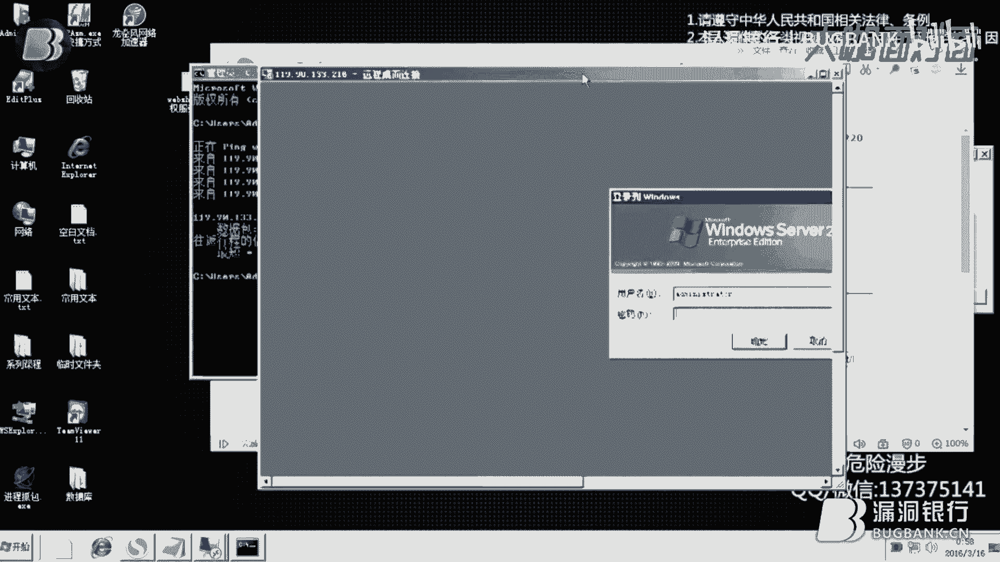

# 漏洞银行丨webshell提权服务器登录—危险漫步丨咖面6期 - P1：【录屏】webshell提权服务器登录——大咖危险漫步分享 - 漏洞银行BUGBANK - BV1nz4y1S723

大家好，我是危险漫步，下面进行web需要提前服务器登录，这是我们今天的目标站点，那么在呃网站入侵当中拿到web需要之后，下面进行了一一步呢，基本上都是提前登录进入服务器，这样的一个操作好。

下面呢我们来先来看一下我们的目标站点，大概是这个样子，它是一个呃，类似于一个应该是一个博客这个样子的，我们可以来看一下，OK我们暂时把它关掉，然后呢，呃我们的第一步就是要进入我们已经拿到的web。

需要的一个权限里面，然后我要输入我的web需要的地址，输入密码，这个密码你可以自己去设置，之前的课程里都有讲过，OK下面进入我们的web需要的一个界面上来，然后我们可以对它进行很多很多的操作。

这里是嗯目录的，地址，然后你可以都可以去进行一些功能的访问，我们今天要用到的就是这里的web，需要的这个目录里面去执行啊，CMD的一个命令行的一个命令，呃这个mini行呢相当于我们本季的，这这个样子。

只不过说我们变把它变成了，一个网页的一个形式，在他们的服务器上运行，O，我们先来试一下有没有什么这种操作权限啊，这里边是一个查询本地连接的一个命令，我们看一下它这个站点是用的什么服务器，什么地方。

OK是一个河北沧州的一个电信的一个服务器，然后呢，如果说大家在执行命令的过程当中，出现了一些错误的话，呃就是说不允许执行的话，没有关系，你可以去尝试，这里边有，一共有1234567个这样的一个执行函数。

你每个都尝试一下，基本上就是可以的，OK然后我们第一步呢要去做的，就是查看一下他这个服务器，它开启的端口，我觉得我应该把这个命令给记录下来，因为到时候你们如果说要输入一些命令的话，你们不明白是什么意思。

这个是查看端口的命令，我们来执行一下，OK这个就是那个服务器它所开启的端口，我们这里查看的主要目的，是看他的这个远程链接的这个功能有没有开启，一会要方便我们对它进行一个远程的一个连接。

这里的3389默认的都是开启的，然后这里的话我们就可以，一会用远程登录进行一个访问，然后呢，接下来我们就要做的就是先查看一下，他们机器上有的用户存在的用户有哪些，我还是要记录一下，OK这样子的话。

呃这里呢呃这里net和user之间是有空格的，要注意这种命令的形式，你千万不要打错，打错的话，那么会不会执行出一个正确的结果出来的，OK这里边是一个用户，然后我们现在就是要创建我们的。

一会儿要登录的用户，这里的空格，然后我们需要去输入我们的用户名，然后再一个空格输入我们的密码，然后再一个空格，然后斜杠ADD就是，这个样子就创建的意思，如果说你要删除用户的话，你可以去输入调这个样子。

这里我们创建，OK我们现在在进行，把这个用户加入到管理员的这个组里面，哦对了，我忘记保存了，现在我们执行的是把这个用户加入到管理组，然后输入我们的用户名，同样的在后面是斜杠，然后我们执行。

这里的命令也是完成的，再接下来呢我们就要去激活这个账户了，输入命令，用户名，这里的冒号一定要是英文状态下的冒号，然后直接，OK命令也是完成了，这样子的一个命令，OK我们现在就要去尝试登录了，呃。

我们一般的电脑上都会有这这么一个，远程链接的功能，在开始，然后远程桌面链接这里，然后呢也有的是在如果说你没有找到的话，你可以在所有程序附件，然后这里边有个远程桌面连接也可以去找吗。

OK我们现在要得到这个网站的它的IP地址，把这个网址复制下来。

不带HTTP以及冒号双斜杠，然后在我们本机里边，运行开始，然后运行，然后输入CMD命令啊，出来这个黑色的一个背景的一个命令窗口，我们在里面输入，然后呢，接下来我们就得到了这个服务器的IP地址。

我们需要把它给记录下来。

然后打开远程桌面连接，把IP地址粘贴进去，然后我们要去连接。

大家看到这是一个windows server。

2003的一个登录界面，我们需要去输入，刚刚在在web需要上创建的账号和密码，OK我们的服务器已经登录上来了，说明我们的提前是成功的，接下来的操作呢就是可以去进行一些呃，渗透到其他机房里边。

其他机器的这样子的一个操作呃，去渗透整个机房，然后呢，这个不属于我们这个网站入侵系列课程的内容。

我们就不再去多讲。

刚刚所演示的呢，就是呃我们在从外部需要端，去这个权限里面去提取，提到呃服务器端这样的一个权限，然后整个过程呢呃其实也很简单，只要是你能够去理解他的话，如果说你不明白的呢，你一定要去多加的去练习。

然后呃我的QQ在这里，然后有什么不明白的可以来问我。

