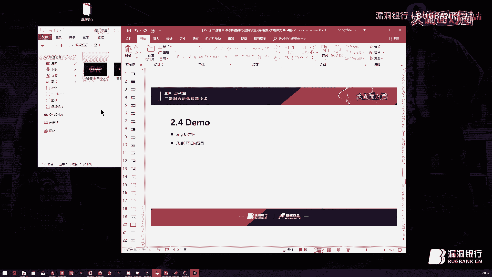
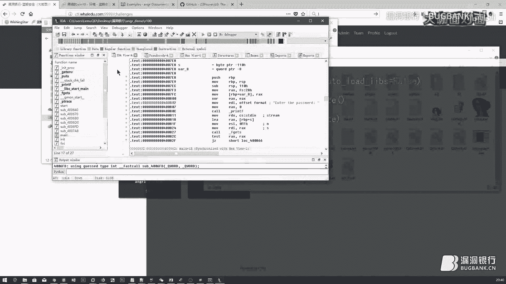
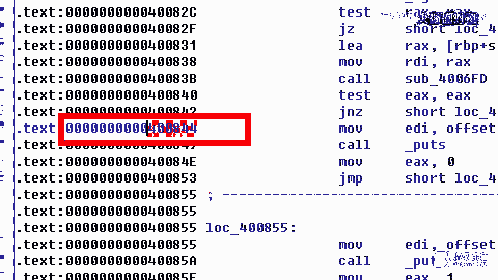

# 漏洞银行丨二进制自动化解题技术-蓝鲸塔主丨咖面64期 - P1 - 漏洞银行BUGBANK - BV1Kt411f7h7

为知识而存 因技术而生。

小伙伴们晚上好，欢迎参加第64期，漏洞银行安全技术直播，大咖面对面，我是主持人秋秋，今晚大咖是有两年性信息安全讲师经验，人称CTF全能，他还担任过2017年北京网信办竞赛主裁判，这么厉害的。

当然是我们亲爱的兰金安全网校创始人，兰金塔主啦，今晚很高兴能邀请到塔主来当大咖，他将为我们分享，主题为二进制自动化解题技术方面的内容，在大咖演讲结束后，还会有10到15分钟的问答环节。

大家如果有什么想问的想聊的，到时都可以找大咖探讨，问答结束后，塔主会选出一名幸运观众，则予书籍，黑客大曝光，恶意软件和Rootkit的安全，好啦，那时间差不多了，下面就有请兰金塔主。

带我们进入今天的主题吧，好的谢谢秋秋的主持，那么接下来我们就开始今天的正题了，那么今天给大家带来的一个内容是，二进制自动化解题技术，听这个题目大家觉得可能比较高大上，但是我们会给大家带来的内容。

并不需要大家掌握非常深厚的，逆向基础或者是二进制的一些基础，那么今天是另辟蹊径的一个节目，那么今天带来的模块也是以三个，这个框架来组成的，第一个先介绍一下，什么是咱们的符号执行。

它是我们二进制能够自动解题化技术的，一个基础概念，那么当然也是现在我们所做出来的，算法能够支持这样的一个算法的，一个基础概念，那么之后怎么样发展，肯定还会有更多的技术出现。

第二个就是我们实际的去实现一下，这个自动化解题的过程，那么期间我会带大家利用，Angle和Z3这两个模块，写一些二进制方面的题目，那么也是一些网界CTF的真题，有国外的有国内的，然后最后看大家的感觉吧。

如果大家觉得还想要再听一个，比较复杂的实验，那么最后我会再加上一个。

稍微复杂一点的，那么大家可以一块做一下，好，那么我们今天就开始正题了。

首先这边自我介绍的话，我就不做太多介绍了，刚才我们在聊天的过程中，也有一定的了解对吧，那么今天也有很多是咱们网校，还有之前咱们培训过的一些小伙伴，来听我的这个讲课，那么我们的介绍就先略过，好。

那我们先来看第一个模块，那么要讲符号执行，我们先从一个二进制的题目开始，好，这里我们先设置一个场景，在一个CTF比赛，或者说老板给你下发了一个任务，让你去测试某一个二进制软件的过程中。

我们拿到这个二进制一个可执行的，程序之后，我们有些什么步骤呢，好，那么当我们拿到一个binary，一个二进制可执行文件的时候，我们是不是可能会利用到以下的一些工具，去对它进行首先的分析。

第一个是file对吧，这个是Linux下的一个命令，我们可以看到当前文件的架构是什么样的，它是多少位的，在什么地方运行，然后包括里边一些它导入的库等等，那第二个是我们做CTF里边比较容易用到的一个语句。

也是最简单的一个解法，那么不光是binary，其他地方也有用，就是strings这条命令，它是可以把我们程序中，已经定义好的一个字符串给你打印出来，那比如说下面我们看到的这个程序里边。

是不是有fract，这样的一堆描述性的字符串，那么你用strings的时候，它就会把这种预先定义好字符串给你打印出来，而如果有一些简单的CTF题，flag是静态的，它已经定义好一个字符串。

strings当然就可以直接查看到这个flag了，那么下面两个Ltrens和Strens，我们就可以跟踪程序执行的流程，它会把我们程序不断的执行，执行到某一个中断的地方，比如说当你需要输入一个值的时候。

那么停下来让你去看附近的一些代码，包括它导入一些库的一个过程，那么当然这个就追踪的一个方法，接着我们还会使用到一个静态分析的工具，比如说Linux下的GDD，包括GDDpeta。

还有Windows上的OD，OD debug，那么这些文件其实也都是一个开源的，对吧，大家可以直接下载安装，然后OD的话，你也可以在Windows上，在这个Wire破解上下到破解版。

那么做一个动态的调试，那最后我们还可以通过IDA去分析，那下面这个截图，其实就是我们利用IDA这个高级的进阶工具，来分析出来得到的一个代码，那我们就带大家看一下，你要是通过普通的手段去做一个二进制。

其实难度还是有的，比如说咱们这个程序，我们打开以后看到它的主要流程，那么IDA是有这样一个功能的，就是按F5以后进行一个返回编，把我们的程序返回编成一个高级的代码，让你能够更清晰地看到它的一个执行流程。

当然这是一个伪代码，那么我们能看到在这里，需要我们进行一个输入对吧，输入之后通过了一个verify函数进行校验，如果校验成功，那么我们这里打印true correct，恭喜你拿到了一个正确的密码。

否则呢打印出这个I'm sorry的标识，那么当然我们现在就会双击进去这个verify，看看它这个函数里边具体是怎么校验的，所以我点进来以后就看到，右边这边非常复杂的一个。

可以说是非常复杂的一个加密过程了吧，像是一个密码学里边的一些异会啊，语啊还有加减等等这样的一个运算过程，那么你要是做这个题目用静态的方法，我们应该就是慢慢的一步一步去分析，每一条计算出来的结果是什么。

然后最后做一个逆算，把我们原始的输入值正确的值给校验出来，好那我们继续往下看，第一个当然就是我们刚才说到的静态分析的方法，那么你用IDA我们就是可以看到这样一个程序流程，那么我们先对比一下。

静态分析和动态分析的一些优缺点，然后我们看看还有没有什么其他的一些方法，可以去解二进制题目的，好那这里大家听一下概念就行了，我不会带大家做一个具体的静态分析，那么今天的重点都是在读程序的代码。

和做这个动态调试的一个过程上，那么首先IDA我们可以把整个程序的所有代码都给静态的给分析出来，那么让你可以一条一条的读它的代码，那么你可以在汇编的层面上去读，那如果你汇编的基础不太好。

我们还可以用它的插件把所有的代码返汇编成一个高级的语言，那么它的优点当然就是我们可以覆盖到所有的程序面，你可以看到在我们这边有左下角模块，有一个graphic这样的一个视图。

那么这个视图上放的其实是我们整个程序的执行流程，等会我们还会专门说这一块的执行流程，那么它里边就是我们程序遇到了一些循环，那么它判断之后会进入到下一个流程这样的一个过程，那么都会给你展现。

所以可以把程序里边所有的执行路径都给你给展示出来，那么第二个我们是可以找到多条执行路径的，我们可以根据某一条循环或者某一个循环条件控制语句，它的判断结果来判断我们下面程序该走哪条路。

那我们自己去找到正确的一条路对吧，但是它也有很多缺点，就是最基本的我们不知道从哪开始，一般我们用C和C++或者加码这类语言编写的程序，那么用AIDA翻译出来，它可能会有这个明确的函数名称。

像是我们现在右边这个模块它叫function name对吧，那么这边写的都是所有节里边有的函数名称，那么你可能可以根据函数名称来分辨这个函数是做什么的，也可以找到MEN函数，那么它就是我们一般的入口点。

但是如果你用到了一些其他语言，比如说Dubbing啊或者是这个VC C#等等这些语言，那么它写出来的代码你用AIDA去看，这边的函数名称就会变成了sub这个sub什么什么的。

写的是一个函数偏移来做它的名称，那么你就很难找到入口点，所以一般我们会单击右键啊，或者是Shift+F12去找一下我们程序里的静态字符串，那么你可以找到一个让你输入的地方作为一个启示点。

然后从那开始分析，然后接着我们也不知道程序是怎么交互的，因为始终都是一个静态的代码，你不跑起来，你没有这个深厚的程序公底的话，代码公底的话很难分辨出，这个部分它到底是读取了多少个字符串，它是怎么读取的。

读取到了什么地方，然后做了些什么校验，所以这个交互我们很难做，好，那么这些缺点可以避开吗，也可以，所以我们有了动态分析的这个路径，动态分析我们刚才也说了，一般会用到GDB和OD这两个工具去使用。

那么它的优点就是我们可以通过比如说Windows上的OD，你可以在右上角这个部分看到内存，寄存器里边的一些值，对吧，比如Eax，Edx等等，这些寄存器的值都会在上面显示，甚至我们还可以去修改它。

让它变成我们想要的值，那么在下方，我们还有这个内存和堆栈的一些值，那么这个在程序执行过程中，一些动态的变化的量，我们就可以看到了，那么交互的过程当然就解决了，然后我们的结果会比较精确。

因为你在完成这个动态执行的过程中，不会说因为你自己的分析而导致失误，一般都会让程序自主的执行完，产生一个正确的值，那么这个值是由程序产生的，所以没有问题，但是是不是有一些缺陷，对比刚才的静态分析。

当然我们就没有办法去对程序做一个全面的覆盖，因为我们在运行的过程中肯定只能走一条通路吧，比如说这里有一个Eaf循环，你的输入大于5，它会走到下一个，比如输出一个URL，那么另一边如果小于5了。

那么就跳出我们的程序了，就打印出这个密钥是错的，那么我们当前就只能输入一个值对吧，你就只能输一个大于5的值，或者小于5等于5的值，那么这个时候我们只能便利程序的一条通路，可能你就会错过这条正确的路径。

然后我们要多次的便利的话，你很难找到交互点，因为我们也可以看一下，刚才程序执行的流程，这个还算是比较简单的，那么它的流程并不是这么多，那如果这个分支非常多怎么办，我们自己去便利就非常困难了。

好不会动态调试的同学不用担心，我们说了今天其实都不需要大家掌握这些技术，我们只是描述一下他们的优缺点，然后我们来修补一下，看看这些优缺点是不是可以绕过来，那么接着第二个，我们还有一个最严重的问题。

就是动态调试动态分析的时候，我们是一个什么原理，就是让程序慢下来，本来程序执行的时候，就是很快的去把所有的语句，每一条交给CPU去执行，那么很快的执行完之后，你可以得到一个流畅的过程。

比如说你玩游戏的时候，为什么你得买一个高级的CPU，买一个高级的内存，买一个高级的显卡，那么就是为了让它能够更高速，更高效的去运行这个程序，那么动态分析刚好是反过来，我们应该让程序慢下来。

一步一步的去执行，那么在这一步的过程中，它得到了一些什么值，我才能够去分析对吧，那所以当然这个慢下来的过程，我们的内存，我们的程序就会做一个记录了，特别有一些函数，游戏API就专门会对我们这个值。

进行一个记录，那你在调试的过程中，它就会记录上，你是不是在调试，还是在真正的运行环境中，那么这个地方我们是没有办法模拟的，如果你用了动态分析的方法，那我们在调试的过程中。

它这个Ease of Present Debug，那么这个东西就没办法绕过，那么如果做了反调试的一个加固，我们的这个调试过程中，得出来的值肯定就是错的，好所以除了静态分析，还有动态分析这两种方法。

我们今天再向大家介绍一种，比较神奇，比较这个全能，然后感觉也释放了，你们读代码的一些时间的一个。

好用的方法，那么就是利用符号执行，去自动化的解决二进制题目的一个问题，那我们先来了解一下，什么叫做符号执行吧，符号执行这边官方的说法，其实就是我们刚才，比如说要输入一个值，一般我们在做这类题目。

都是让你去输一个值，最后将它正确与否，或者是根据这个值，来生成一个flag之类的一个动作，那么我们要输入的这个值，并不是一个真实值，而是一个代号的时候，我们称之为符号执行。

那就比如说你在解一些数学问题的时候，我们就有一个东西叫做方程式，对吧，方程式其实就是我们利用了某些不固定值，就是xy这样的一个未知变量，来代替我们当前的值，去进行运算的过程。

那么符号执行同样也是这个过程，那么把它的这个符号值，代入到程序中，然后让程序自动的去，根据它的这个判断条件，来规范我们的值的一个过程，好，这个是官方的一个说法，那么说白了，其实就是给它一个不确定的值。

然后根据程序的限制条件，我再去限制我自己的这个不确定值，最后变成一个确定了的值，好，那么这个符号执行，我们一般会拿到，这个现在我们今天说的就是angle和z3里面去使用，那么angle和z3。

它其实做的是一个路径变力，根据它不同的限制条件，我们做一个所有路径的变力，最后找到一条正确路径的过程，好，所以这里我们举一个小小的例子来说明一下，这个符号执行是怎么样的一个过程，那符号执行。

它其实也是分动态分析和这个静态分析的过程，那么现在以动态分析的一个过程来做一个小小的解释，那么它的过程就是，首先设置一个符号值，对吧，那么把符号值传输到程序的流程里边，让程序去执行。

最后根据程序自己的限制条件得到一个确定的值，这就是符号执行的过程，那么我们通过这个图来讲解，可能会更明确一些，我们先来看这边给出了一个初始限定条件，当然这边是给大家的一个预设条件。

就非常简单的一个方便大家理解的条件，就是我们的限定值为x大于等于5，然后x要小于50，好，所以这边我们根据这个值，可以最后得到x等于20，它是怎么来的呢，我们来看，把这个限定条件写成一个程序。

它的代码就是这样一个简单的代码，对吧，当然这是一个伪代码，那么这边需要我们输入一个x的值，利用了get_input这样一个函数，然后接着我们用EIF去判断一下，根据EIF判断的条件。

它会不断地调整到不同的路径里边，那么我们最终的条件，就是最终需要的目标是什么呢，我们在这边给大家标出了一个target，这就是预示着我们CTF解到的flag，或者是你解Pong的时候。

里边的一个漏洞函数，我们叫做带有bug的一个函数，那么里边要不就是带有了最后输出的flag这个特殊值，要不就是你可以利用的一些方法，那么换到实际生活中，你要在真实的工作里边，是不是也需要对程序分析。

然后不断地去找带有漏洞的函数点，那么这样的话就是我们漏洞挖掘的一个过程，那你怎么找到带有漏洞的函数呢，其实你也是先找到这个漏洞的点，我们反向地去走迷宫，好 那么这边我们就把入口点设置为一个state。

以后我们讲state的话就是一个当前执行的环境，当前执行的一个情景，那么我们叫做stateA是它的一个输入值，那首先我们本来要输入一个x的值，那么现在不把x的值给它，而是给它一个符号就是x。

那么它的值是未定的，那么如果给它一个确定的值的话，我们当然程序就会便利某一条路径，比如说我们大于5的话，大于等于5 当然就会走AB这样的一条路径，我们走过了一个 走AB这条路径。

那么现在我给它一个不确定的值，它会怎么走呢，是不是两条路径都可以去便利，而我们便利的过程中，我们就可以收集到这个题目对x当前的一个限制条件，我们再用这个限制条件去对x进行一个范围的复制。

把它缩小一定范围的另外一个符号，好 那么走完这个AA和AB之后，我们去到下一个环境，继续给它一个不确定的值，那么让它去便利下一条路径，再这么依次的判断下来，我们会发现肯定只有一条路径。

是可以到达bug这个函数的部分的，对吧，那么到达这条函数的部分的限制条件是什么，我是不是也收集到了，那就是x大于等于5，x小于50，那么这条路径，所以我根据这个限制条件，最后得出了x肯定是一个范围取值。

但是我们这里只给了大家一个值，这里看图的话只是x等于20，其实并不是由这个限制条件得出来的，那我们只是给大家每指了一个，那么这个就是一个符号执行的过程，那么大家理解了我们是怎么收集，这个符号执行过程中。

它的一个限制条件，最后给它复制一个真实值的过程，就好了，好那么这是原理的部分，我们把它带入到一个真实的程序里边是什么样的呢，那么大家刚才也看到了，IDA里边如果把程序拿出来做静态分析的话。

你是可以看到这样一个graphic图片，那么它每一个判断条件，都会把我们的程序框成一个矩形框，那么这个矩形框我们称之为一个basic block，它是一个基础框，那么在执行完这个框。

然后它的一个判断条件之后，当然会进入到下一个模块，那么符号执行其实就是便利的这些框，每一个框就可以代替为刚才我们的state，对吧，那么这个过程执行下来，我们肯定能够得到一条真正的通路。

好 那我们怎么去真正的运用这个符号执行来解题呢，我们就进入今天的正题，第一个模块，利用Angle暴力破解，怎么去执行一个程序，那么Angle这个模块，它是由，其实是由后面我们要讲的z3。

这个为基础来开发的一个模块，当然它里边加入了很多新的选项，然后它也支持各种各样的平台，我们先来简单的介绍一下Angle是什么样的，大家如果光听我们的PPT觉得不够。

你想要学习更多关于Angle方面的知识，你可以去到Angle的官网，也就是这个网站，angle。io，很好听的一个 是吧，那么Angle这个名字也很好记，它是一个愤怒的单词。

你可以看到我们的图标就是一半笑脸一半愤怒的脸，好 那么这个就是Angle的图标，然后里边它对Angle做了一些整体的说明，虽然全是英文版的，那么大家也可以练习一下英文。

或者是用谷歌翻译把它翻译一下再看看，那么上边如果你要看它的文档。docs，看Angle的这个文档，它具体的一些介绍也会在里边，包括我们的装载，包括它对这个程序的静态分析，以及一些example例子。

你要做一些练习的话，也可以在这里进行练习，好 那么这个是Angle的官网，那么现在要说一下怎么安装呢，我给大家一个地址，Angle的地址我也给大家，这是Angle的地址，然后这边是我们蓝金安全网项上。

给大家放的一个Angle的安装手册，我们Angle是支持非常广泛，就是支持性兼容性非常好的一个Python模块，它其实需要的是Python的安装环境，那么你无论是Mac OS系统。

还是Windows系统，还是Linux的系统，都可以直接的进行一个安装，那么一般我们选择一个Linux系统，推荐使用Ubuntu 14到16都可以，那么这边你用apt-get-install。

Python， Angle也可以，或者是你去Github上下载它的Angle项目，然后用Setup或者是Meg都可以，那么甚至有的同学觉得，这个Angle我不想装在自己的实体机上，担心有些风险什么的。

怎么办呢，我们也可以去下载它的Docker版本，直接利用下边这个语句，把Angle的Docker虚拟机给下载下来，那么你在本地开一个这样的虚拟机，也是很快的做起的，然后下边也有一些。

大家安装过程中遇到的一些错误是吧，那你遇到了错误，你再把这些语句一条一条的去运行下就可以了，如果还有一些什么其他安装的问题，欢迎大家在我们的网上上这个地方进行留言，然后我会给大家一一做解答。

那么这边也有曾经看过咱们网上去安装Angle的同学，留下的一些问题，好的，那么我们继续回到正题，这边大家装好Angle以后呢，你就可以开始解题了，我们就得看Angle是怎么样读取一个二进制。

我们首先看到，Angle其实是一个多架构，然后的二进制分析平台，它支持到什么程度呢，几乎现在所有的架构，Linux的Windows的这个叫什么安卓的IOS的，它都支持，那么它做到这个支持。

其实也是利用了一些虚拟机的原理，它里边还特别推崇了一个系统叫做Unicode，独角兽的系统，大家可以去了解一下这个系统，这个Angle在官网上有介绍这个系统，然后也有放它的下载地址。

那我们在读取某些二进制文件的时候，可以专门用Unicode这个独角兽的系统去运行，那么第二个，我们Angle是首先要把二进制装载到分析平台的，那你就像是我们在Java等等一些编程的过程中。

你需要定义一个对象一样，我们Angle也需要把你当前的二进制文件读取成为一个对象，接着我们会把这个二进制的文件转换为中间语言，这个过程是不是和这个IDA非常像，我们把它先读取进来。

然后你按F5把它转换成了一个尾代码，是吧，你可以去分析尾代码，那么现在我们还不到这一步，我们只是把它转换为一个中间的语言，这个叫做IR语言就行了，大家记得，那么它是为了做一个统一，就像是什么呢。

当年秦王统一六国的时候，做的最大的一件事就是统一了六国的货币，对吧，不然说你在这个环境下我们可以使用货币，但是换到了秦国是不是就没法使用，那么Angle也是做了这样一件事。

我们把这个所有二进制里边的各种各样的代码，转换成一个统一的中间语言，那么这个中间语言当然所有平台下都可以执行，接着我们IR还是不够的，因为IR只是一个中间语言，方便它执行而已，那我们怎么去分析它呢。

所以IR还会换为一个语意的描述，这个语意的描述我们就像是IDE的F5插件，把它转换成一个程序可读，可以识别到它这个语句到底是干了一些什么事的东西，那么这个语意描述就方便我们做静态分析。

接着我们就会真正的去执行和分析这个程序，那么其中它安格就包含了我们动态调试和静态分析，这样两个所有的过程，那么主要静态的分析就是去提取，刚才我们所说的那些性质条件，X大于5小于5的一些东西。

那么动态探索是什么呢，就是程序对符号执行过程中，这个符号的一个改变，那么这个符号不断探索，它是需要不断改变它的值才能进入到下一个区块的，那么下面我们当然安格就是对以上的这两个过程进行一个综合的理论。

好说了这些废话，那我们就会真实的看到安格的这个全貌了，我们用的时候是写了一些什么语句呢，大家不用担心，今天对大家的编程基础没有太多的要求，就跟着我敲完这个模板，其实你都会用。

你把这个记上笔记也都可以会用，那么我们先来看看安格装在二进制文件的时候，它用的是什么，这个我们做一个简单的介绍就行了，就是用的一个组件叫做CLE，它是有全称的，我不太记得了，这个大家可以去官网上看一下。

也对这个CLE是开源的，也对它的代码进行了展示，然后你可以进入一个深入的学习，包括一个二次开发，你想做一个自己，比如说公司开发了一个项目，你怎么去动态的自动的识别一个程序的漏洞呢。

那你就推荐非常推荐大家用安格的这个CLE，好接着我们就看它装载进去以后都有一些什么东西呢，就是装载了以后到底把这个二进制程序做了些什么改变，那么当然就是提取了它所有的信息。

相当于现在我们点击一个程序的右键，比如说我们随便看一个。

就拿今天的壁纸来说吧，我们点击了一个右键是吧，看它的属性，就把这些所有的属性都给提取出来了，那么这个如果你自己要去分析，是不是可能会用到各种各样不同的一些软件。

然后也会把它的这个二进制信息做一些稍微的翻译。

那么安格不光提取这些信息，还把我们的代码做了一个转换，刚才也说到了，那么现在我们提取出来，你当然就可以直接用project里边的一些对象，比如说entry，那么找到它的入口点。

比如说它的man addr，然后找到它的最小地址，还有这个max address，最大地址，以及文件的全名等等，这些信息都可以找到，那包括它读取的一些什么库都可以，好。

所以这个大家可以先做一个小小的试验，然后我们在真实做题起来的时候，我们再来看，好，接着我们看第二个中间语言，它到底是一个什么样的翻译过程呢，刚才只说了IR是这样的语言，那么下边有一个示例。

大家可以稍微的看一下就行，不需要看懂，就是它的一个转化过程，我们就把一个汇编代码，比如说dec ex，做一个ex集成器的检查操作，把它转换成一个vex的中间语言，那么转换出来是这个样子。

当然你现在可能看不懂，但是Angle的编译器，还有我们所有的CLE插件，都可以去运行中间语言，所以对这个vex的中间语言，如果你要做开发的话，可能是需要去读一下的。

但是平常我们做题只用angle这个插件，就没有必要了，好下一个呢。

我们就会带大家来做一些小小的题目，那么大家肯定问题目在哪儿呢。

我们给大家一个网址，这个网址一样的，是我们篮球安全通用的模板，是吧，CTFD搭建的一个模板，那么大家自己注册一下就好，今天的几个题目都放在上边，我看今天下播以后呢，如果有需要。

我还会再放一些小小的练习题上去，我们收集到的各种各样的题，大家都可以再做一个进一步的练习。

那么我们先来看第一个angle，angle1正常爆破。

这个R100的一个题目，是我们国际上一个CTF比赛的一个原题，我们下来下来，R100。

那么今天我，大家可以用自己的虚拟机去做这个Linux的题目，我们今天给的这个题目都是Linux上可执行的ELF文件。

那么我现在是在Windows的环境下安装了一个子系统，那么来过我们网校的，听过我们讲课的同学应该都比较了解这个系统了。

如果不太了解的同学给大家一篇文档，你也可以安装一下，感觉是比较方便的一个操作，在Windows上你就可以模拟Linux下的运行环境，那么这个就发给大家到这里，我们先来做题。

那么你要进入到Linux下的系统，我们就输入bash这条命令，我先退出一下，我们去到当前的目录，然后再做切换，那就像刚才我们所说，拿到一个R100的文件，我们先去运行一下它吧，好吧，好那运行成功。

我们就看到这样一个提示，程序是让我们输入一个password，输入一个密码，你输入一段密码之后，它会提示你密码到底是错误还是正确的，现在我们就可以正式的开始分析文件了，你发现这边会有一个输出的提示。

这个就是Angle解题的一个标识吧，就是我们什么时候用Angle呢，遇到这种题目的时候，你就可以去用一下，然后我们正常去做题，是不是会用到刚才几条命令，我们先来做一个小示范，比如说file。

然后读一下R100，那你就可以读取到，我们当前的程序是64位的一个可执行程序，然后它有一些动态的链接库，链接到的Linux上x86-64的SO，然后执行的这个框架是刚Linux的，是吧。

那么包括strings，这条命令是不是也可以读取它所有的字符串，你看这些都是它里面静态的字符串，然后你看我们刚才这个enter the password，nice。

以及incorrect password，这类静态定义好的字符串都已经出来了，所以这个就是我们正常做题的时候的一些思路，你根据这些信息再去做进一步的分析，那么今天我们用Angle去解一下题。

我们在演示的过程中，会直接利用ipayson这样一个payson的交互平台，大家没有的话，你可以直接apt-get install ipayson安装一下，或者你直接把我刚才的代码，编写到一个。

py为后缀的脚本文件里边，最后去运行一下，它也是一样的，我们只是为了交互的过程中看一下这个过程，所以我们先去导入Angle，对吧，你要用Angle的话，一定要import Angle这个库。

导入的过程中会稍微慢一些，然后也会有一定的提示，这个是我们没有安装完成的一个过程，你看我们当前的架构，其实我只是在子系统上装了一下，所以它并不支持MIPS的架构，你要支持MIPS的架构。

你可以再装一下这个Unicom的操作系统，那么它就支持了，好接着我们要去读取这个文件，把这个文件给登了进来，所以我们把它定义为一个project的对象，那么它是调用Angle里边的project。

大写的p开头的project的这个函数去装载的，那么装载的时候我们就要给它名字，你要装载的是谁呢，当前目录下的21版，是吧，那如果你不在这个目录，是不是给它一个绝对路径呀，这个是编程的一些小习惯。

那么大家理解一下就好，那么Angle官网上给到这里就没有了，我们现在一般去分析CTF题目的时候，你会发现一般的CTF题目，不会再去导入一些系统的库进行运行，对吧，除非你单独遇到一些胖的题目。

它专门用到了某些力不顾，然后你再去分析这个力不顾，所以我们今天不要分析系统上的一些进来库文件，单纯的分析本程序，所以我们要加上一个选项叫做auto，因为它是自动启动的。

自动load的自动导入leads=false，false就等于错这个选项，把它给关闭，那我们现在是不是就不太会直接自动的导入这个库了，好，然后我们做到这一步还要干什么呢，是不是刚才静态分析的过程。

我们先得找到它的入口点，从哪开始输入的，那么Angle也一样，我们得先拿到一个入口点叫做state，初始阶段，那么它在我们的刚才这个对象里边，proj里边的factory，factory方法里边。

你可以tab一下，factory在Payson它是自动补全的，那么factory下有一个东西叫做entry state，都是非常显而易见的名字吧，那Payson这些高级语言就是可以让你一目了然的。

读明白我们当前这个语句是干嘛的，那么entry state是不是就是初始状态，接着我们要给它创建一个爆破器，就像是我们上几期大概也讲过，BubSuite之类的一些爆破工具。

我们是不是都得用一个程序或者什么，装载一个爆破的选项，那现在我们只装载了程序，当然还需要一个爆破管理的这个对象，那么我们把它叫做SIMGIR，SIMGIR其实是一个缩写，大家可以去官网看它的全称。

它也是在project的factory里边，那么factory里边有叫做SIMGIR的东西，然后在SIMGIR里边记得给它state，给它state以后，我们就可以从入口的地方开始爆破嘛。

否则的话它会随便找一个地方，或者是直接爆破不了的，对吧，好SIMGIR找完了以后，我们就可以开始爆破了，代码是不是很少，真实开始爆破的时候，直接用SIMGIR里边的explorer探索，直接去让它探索。

那么好说到这里，大家自己去想一下，我们探索一个东西是不是得有目标，比如说今天你看了这个贝爷，第一个荒野求生，那么他肯定是在某一个地方降落，然后最后是去到某一个直升机的营救点，然后你才能回到这个城市吧。

然后你如果去错了，去到了某一个沼泽里边就淹死了，对不对，然后我们现在要用explorer找一个目标，就像刚才我们的bug程序，那么这里你需要给它一个标识，给它一个目标点，否则的话。

这个探索是不知道探索到什么地方的，那么这也就是大家一开始，为什么让大家去用一下IDA，我们ADA还是需要用一下，结合起来，但是不需要你去读代码，非常简单，ADA的这个下载会进行后会给大家的，这个叫什么。

百度，有同学说了啊，刚才这个例子举的不好，是吧，贝爷去到沼泽不会死，他是食物链的顶端，好吧，那我们就说跟着贝爷的那个明星吧，他去到了这个沼泽点，就一定会被淹死的，好吧，那么稍等一下。

我把这个IDA的百度链接给大家，好，当然这个也是IDA Pro的一个破解版，好，那我们打开了，那你在用IDA之前，我们其实普通的小白用，你就用两个东西就行了，IDA-Q和IDA-Q64，对吧。

那么一个是去分析32位文件的，一个是分析64位，那还记得我们当前这个程序是多少位的，我们上网上看一下，是不是我们用File去分析的时候，发现了它显示出来，我们当前的程序是64位的文件，所以呢。

你先用File这类的一个分析，或者是Windows下的程序用什么呢，有PID，是吧，还有这个Detect Easy，DIE，这两个程序可以分析，我们把它分析出来以后，直接你打开这个64再打开文件也可以。

直接把文件拖到64位，这个IDA的图标上，它也是可以直接打开的，那么稍等一下，它会出现这些弹窗，一路都得OK下去就行了，好，那这个我们等一下弄，那么它给你出现的，现在是这样的一个可是平台对吧。

那我们要看的话，肯定是看Text的界面比较方便一些，TextView，我们点击右键，这里有个TextView，然后现在没有了，因为刚才我们现在就是在这个模块，那么你刚进来，如果是正常的程序。

那它就会直接停在Manhunt上，你可以看到。

这就是刚才我所说的，如果编写的一些代码，没有定义我们某个函数的名字，是不是这边会用一个sub，然后函数的偏移量来定位。

它的这个函数名额，那这个时候你去分析起来就不方便，对吧，我们现在，其实还能找到Manhunt吧，双击，F5，我现在说的这个过程，是我们直接去用IDA的，直接用Angle这个模块解题的一个过程。

但是大家完全可以把这个过程给自动化，因为Angle是可以自动帮你去寻找某些，自动串核这个标识的，但是这个过程呢，我们今天先不讲，大家可以去官网上了解一下，它们怎么做，或者后期我们有课的话，给大家介绍。

那今天我们就还是结合着IDA，来分析一下这个程序，然后就稍微的把你需要找到的目标点，给获取到就行了，好那我们，这边应该能够直接看到，Manhunt里边就是刚才我们整个程序的流程吧。

让你输入一个密码之后呢，通过这个函数进行校验，对吧，那么校验成功是输出这个，校验错误输出这个，校验成功输出这个，那么其实就有点类似于你说一个验证码，然后验证码，校验的一个过程。

那我们正常分析就会点击双击，双击去到这个函数里边，看它的一个校验过程，那么这个函数其实校验的也不太难，我也有这个函数，直接做逆算法的一个解题过程，那么今天我们要用自动化的解题，去解决这个难题。

我们回到原始的函数里边，好现在你光看这个地方，你说给IDA一个标识，我直接给他nice可以吗，哎不好对吧，我们在这个程序的阶段，你还是用程序的语言，去跟我们的Angle做交流。

所以呢给Angle交流的时候，我们点击F5，不要点击F5，回到这个IDAViewA。

就是去到它汇编层面的这个代码，这里是不是你也可以看到，我们刚才定义的这个字符串，就算你读不懂汇编代码，这个字符串英文应该还是看得懂吧，好所以我们就看到这边有一个nice，是我们需要的目标。

下边是incorrect password，错误的密码，所以我们要找到的是不是，就是这个nice目标，把它的地址前面这个地址，大家可以看到就是400开头的。

那么这个是程序地址，大家有听过这个前几天，我们漏斗银行播的二精致的课程，肯定也就明白这个地址到底是什么用，那我们现在只需要知道，你要给Angle的是这个地址，16精致的所以要加0x对吧。

然后这个地址是我们需要找到的，所以它叫做fund=它，那么不希望找到的呢，叫做avoid，避免哪个incorrect password，这条对吧，然后把它给复制到avoid上，接着加上0x，好现在回车。

你看我们的Angle已经静态下来，就是它已经正在运行，正在暴力破解过程中了，那么现在是看不到太多的一个回血条件，已经出来了是吧，你可以掐下秒啊，或者用time这个函数去计算一下。

你看看他找到的这个过程到底多长时间，大概就是五秒钟左右对吧，然后我们可以看到。

他也给了一个回血，但回血的内容其实不是我们的这个找到的过程，不是找到的这个确定的字符串，而是给了你两个active，两个可行的通路，一个找到的字符串，以及12个avoid，12个不想找到的东西。

那我们现在要查看这个字符串怎么办呢。

打印出来就行了，所以print finger点什么呢，刚才是fund就是让它去找，现在是不是英语上的已经找到，就是过去完成是fund，几个呢，他找到了一个，那我就打印出第0个，坐标是从0开始。

然后后边的东西，大家硬性的印记一下吧，这个就是他的一个模块里边规定的语法，那么记个小笔记之后再写或者背一下都可以，这里不做过多的解释，第一个叫做postix，然后第二dumps，把它dumps出来是吧。

用这条命令就可以打印出我们的这个密码，打印出来他找到什么呢，code talks，是不是这条语句，好，那我们看一下整一个编程的过程，其实就123456条语句。

6条face语句帮你解决了一个程序的这个自动化破解，是不是让他自动的去找我们最终需要的目标，然后也自动的去帮我们避免到了不想要的东西，那我们现在不知道他对不对，所以呢，我退出来，我们运行一下R100。

看看刚才找到的这个密码对不对，的确对了吧，输的是nice，那是不是大家就可以提交flag了，那这个就是flag，如果这个密码输入对了以后，他自动再生成一个flag，那当然也会给你弹出一个flag，是吧。

那不管怎么做，我们都找到了一个正确的答案，好，那这就是angle解题的一个过程，但是这个过程我们发现，他只是适用于这一类程序，这个程序有什么特点，就是在运行过之后，我们才要求大家输入一个密码。

那是不是还有一些程序，就比如说第二个，我看有同学说想听会编的。

也没问题啊，那我们下次找机会再给大家讲会编嘛，我可以带大家去动态分析一些，这个程序是吧，那我们先来看这个自动化解题的过程吧，那第二个我们要做的是这个题目，angle2参数破解。

那刚才我们做的是一个正常的破解。

第二个是带参数的，大家把这个程序下载下来，我们先运行一下，同样的去运行这个程序。

AIS3 CTF的这个题目，回车以后，你看他直接报错了，让你输入一个什么呢，You need to enter the secret key，让你输入一个密码，所以我们猜测。

他是直接在后面需要跟上一个参数的，我们回车以后，你看加上了一个100的参数，这里是不是就I'm sorry，That's the wrong secret key，说明我们刚才要在程序运行之后。

输入的内容变成了跟在程序名之后，而直接通过系统的这个API接口，去获取的一个参数，好这类题目，我们在用刚才的方法可以解吗，我们先来解一下，继续进到iPerson环境里面，然后前面的步骤肯定不变。

导入angle，然后proj是吧，定义一个对象再复习一下，然后记得autoloadlist，给他设置为POST，好那接下来是不是要找入口点，如果你直接给他正确的入口点，是不是就有问题。

那么我们应该怎么做呢，应该在入口点这个部分，给他设置一个参数吧，那么angle里边附带参数设置的方法，其实没有，我们需要导入另外一个库，这个库在官网也有介绍，就是你怎么去下载。

那么现在我们直接用PIP去安装这个库就行了，他的名字叫做Clarify，Claripy，导入这个库，大家导入这个库才可以设置一个angle的参数，好那我们就会设置这个题目只需要一个参数。

所以我们叫做argv1，他等于Clarify，Clarify。py里边的一个bvs。

有同学奇怪了bvs是个什么东西呢，其实他是一个bit vector。

叫做比特向量是吧，比特向量string，那么他所定义的单位都是以比特为单位来定义的，所以我们现在定义的是一个字符串，然后我们先给他一个名字吧，名字叫做argv1，没问题，然后接着要写他的大小。

大家想一下我们一般ctf里边flag的大小是多少，可能50个字符就够了，那么50个字符如果你写成了这样，能爆破出来吗，肯定是不行的，因为我们刚才说了他的单位是比特，那么一个字符应该是8比特对吧。

那么一个叉类型是8，如果你这时候爆破的是int电量，那就可以乘以32吧，4个比特，那在c代码里边，在语言里边32，这个我们在z3的时候还会给大家详细说明，那么现在先乘以8，定义这样一个比特向量。

然后回车，继续去找state，后面就一样了state，那么state等于proj，里边factory的一个entry state的选项，那么这个时候entry state后面就不是空参数了。

我们需要给他一个入口的参数选项，那么这个地方是用一个args的变量名来导入的，后面呢需要大家列一个数组，数组的第一位是我们当前执行程序的名称，其实就和你执行程序的习惯一样，先写名字再写他的参数。

所以AIS，然后呢第二个变量是argv1，后面就一样，sim_girl=proj。factory里边的sim_girl，接着给他state，然后呢开始爆破，好爆破时候是不是又得fund和avoid了。

我们先写好fund等于什么呢，avoid等于什么，同样用ada去看是吧。

刚才我们还没有去教验这个程序到底是什么环境。

我们再来教验一遍，这次我们用die用windows上的这个程序来跑一下，打开了以后就是这样子的一个程序。

detect is easy，我们导入进来以后，你看是不是他也能够识别这个程序是多少位在什么环境下运行的，amd64位。

这样一个可执行程序，type是elf64，所以同样用我们这个64位的去分析就行了。

好现在我们已经熟悉了，那还是带大家看一下流程吧，F5这个小声有点大，大家不要被吓到啊，我自己戴着耳机我都会被吓到，然后你们看这个里边我们能够找到，correct，然后I'm sorry。

还有you need an inter-secret key，就是这样一个过程，那么他教验的其实就是我们开篇给大家看的那个失利，对吧用的verify这个函数，点进去以后，是不是很长一段的教验。

这个地方你要去分析的话就非常麻烦了，那么我们用angle去解还是一样的，回到AWA找到你需要的和正确的和这个avoid的地址，那么第一个correct肯定是需要的地址。

所以把这个400602地址复制一下。

放的给他，然后avoid，另一个。

这边我们不要I'm sorry，然后你说前面这句还要吗，因为你一定给了他一个参数，所以我们这一段的啊。

就前面这段you need to enter a secret key，就不要了是吧，好继续回车让他去爆破，好，是不是时间也很快，那这边我们就能看到，当然这个效率还是和大家所用的系统啊。

计算机的一些性能相关，你到底用的这个多少的内存，如果你在虚拟机里边稍微调高一点，肯定会更有效，那么刚才的结果一样，那现在我们直接print，simgall。found，0。

然后再用刚才的一个polysix。dumps，可以吗，不行是吧，报错了，因为他是个list的object，那么我们现在如果定义了这样的一个参数，再怎么打印出他来，是不是打印不出来，现在就算报不出来了。

你也找不到啊，所以我们用另外一个方法，还是simgall。found，0，刚才那个地方还写错了，是吧，0，但是你直接打印，肯定也是看不到结果，好，那么我们这个clarify的库里边提供了大家一个方法。

就是针对于bit vect这种比特相量的，就是转换成字符串这样的一个方式，那么他叫做solver，solver，然后。eval，然后给这个参数名就行了，你要导哪个参数就输入哪个，好，现在我们回车。

你会发现他直接给你的是一个ask对吧，那你要自己再做hex的一个转换，是不是也挺费劲，有没有直接打印出字符串的方法呢，也有，eval里边有个参数叫做cast2，好。

这个东西可以直接把我们转换成str字符串，现在再回车，加上cast2以后，是不是flag就已经出现了，那么大家熟悉的这种格式的，flag+>号里边一个值的形式。

就是我们ctf里边需要在逆向中找到的一个值，那么这就是我们利用angle去解带参数和不带参数的两种方法。

好，那么这是我们利用angle去解的一个方法，那么有没有angle解不了的呢，其实也有对吧，那么像经常做一些非完全逆向题，比如说一个杂项题，一个密码学的题，也会给大家一段代码，比如说python的代码。

然后这个c原代码等等，那么只给了你算法，你自己编译出来，也做不到这个非常快速的解题，有时候只能去爆破，那你自己编写一个爆破肯定很慢，然后angle的话，你会发现我们得运行它，一定要有一个可执行的程序。

那么这个解法肯定就不太适合于angle，所以我们现在大家介绍一个更底层的，叫做z3的模块，那么z3和angle的关系，其实是angle是基于z3开发的一个高级应用，那么z3是一个原理，底层原理的实现。

为什么说z3是底层，你可以看一下，它是由什么哪个公司去开发的，这里是由就是大家现在所用电脑，windows这个电脑的厂商来开发的，就是微软这个厂商，他们去开发的一个算法，肯定可靠度就非常高了。

然后z3所解的一个这个题目模块，它所用的原理叫做smt，就是一个可适应性模，就是可适应性模运算这样的一个原理，那等会我会再介绍什么叫做smt，然后它的原代在这，你去github上直接搜z3。

直接第一个或者我把地址再发给大家，这就是z3的地址，那么你可以直接下载下来，make和makeinstall，下面有一个安装过程，那么这里还需要安装吗，其实并不需要，大家刚才跟着我安装了Angle之后。

其实你已经安装了z3，我们说了Angle是基于z3的，所以怎么会不安装z3呢，所以Angle就有z3了，完全放心的去用就行了，好接着我们来看z3是怎么样一个运行过程，那它是接什么类的题的呢。

我们这里看到给大家举的是一个，寄存器为基础的一个例子，比如说ex现在我们给它一个值，这四个寄存器大家都知道它的作用吧，稍微说一下，ex是个加法寄存器，ebx是个地址寄存器，一般会存储我们计算的结果。

然后ecxt是一个技术寄存器，count，然后edx是数据寄存器，所以现在我们给了大家寄存器里面几个值，然后你也可以把它理解为一个小小的方程式，然后ebx里边做了这样一个运算，然后并把值付给ebx。

如果我们的运算结果等于2，那么ecx的值应该是多少，解这类的一个方程组问题，用Angle就非常方便，没有一个实现的一个程序，比如说刚才我们的Angle去解某一类题目就不太方便，它的路径非常多。

等会我们看实践会做一个rand，有这个随机数的程序，那么它用Angle来解就非常慢，几乎跑不出来会跑死，因为Angle是路径保护，当路径太多的时候，是不是它的运行效率就慢了。

它不怕的是我们输入的这个变量很多，比如说你的这个ASCII 64位，那它不怕，它也可以很快跑出来，有多少位都不怕，但是我们怕的是它的这个EV循环，这个判断语句太多了，那么它就会有问题。

有位小伙伴说Cast2，你写的是Cast2等于吗，我把刚才这一段代码给大家发一下，然后你可以再对照一下，看看我们是不是什么地方没写对，然后推荐大家不要在Windows上使用。

Windows上使用Angle是会有一定报错的，直接在直播间这么发有点问题，就是写出来不太好看，不过也可以做一个小小的教验吧，然后这个大家还是等会再问一些，等会再纠结这个问题，那我们先继续讲Z3的。

好那么Z3里边我们看到，它就是解这类方程组的问题，那我们再举一个例子，用Z3来解一下，刚才还说到一个点稍微回顾一下，就是我们用Angle的时候，它解的是一整个程序，那么有的程序它其实只是中间有一部分。

需要你去解读一下，那其他的你可以自己再做一些，其他的编程或者直接手动输入，那么这个过程我们就可以把里边的，限制条件单独提取出来，用Z3去解，好然后这边给大家稍微科普一下，什么叫做SMT。

可满足性模应算的一个理论，它其实是提出来非常早的，好像是八几年还是九几年就提出来了，但是我们后来实现非常好的一个例子，就是Z3这个模块，那么之前我们学习的Angle，去用符号备利找通路。

其实它利用的也是SMT的，可满足性模应算这个原理，只是说中间加入了一些包装，那么你会发现刚才我们第一个例子，举的X大于5和小于50这个例子，你得到的并不是一个值，而是一个范围。

那这个就和我们的模所联合起来了，什么是模应算，这个在密码学里的时候一定会讲到吧，那模应算其实就是一个环对吧，你可以让某一个边量，一直在这个范围内变动，它超过了这个范围限制，又回到了0从0开始。

那么我们给的模应算，其实就是求出了一组范围，那么在这里，比如说刚才我们的X大于5小于50，解出来的肯定是45个值，那这45个值都是正确的吗，也不一定是吧，那我们就会不断地根据它的限制条件。

去模它这个最终的结果，那是不是每模一次，就会减小一下它的范围，那SMT就可以理解为这样的一个原理，不断地利用限制条件去做一个模应算，那么最后得到一个可满足，我们这个程序运行结果的。

那么就是最终的一个正确答案，是模到最后只剩一个，不断地削减它的一个便利值，那所以SMT它所收集的，并不是一个准确的命题，而是一个范围性命题，就是比如说一个班级里边，老师要点名了。

我们如果点的是某某某小明同学，那站出来，这个时候我们的是可满足型布尔运算，这个是等会我们还会说的，另外一个SAT布尔型运算，这个时候只会拿到一个人吧，准确的某一个人，但是你在执行程序的时候。

不可能明确的知道有这样一个值，所以我们会用模运算，老师就是说戴眼镜的男同学们都出来一下，这样子的一个范围，然后接着它再缩小一定范围，身高一米八以上的同学再出来一下，是不不断地去缩减。

最后肯定会确定到某一个范围，或者某一个确定的值，这个就是SMT的可满足型模运算，那么这是我对SMT的理解，当然大家有更高级的理解，还有这么多算法的大佬们，我就欢迎来批评，接着我们来看一个小小的Z3。

GT的一个DEMO，也是带大家做一个简单的题目，这边我们看到就是一个简单的方程式，X加Y等于6，然后2X等于3Y加6，怎么用Z3去解这个题呢。

我们还是用iPay的交互环境来做一下，好那这边我们看到要导入Z3和刚才的N格差不多，但是为了方便我们去调用Z3里边的一些模块，你就不要直接import Z3，我们用这样一句叫做from。

从哪个库Z3这个库import 新，把它里边的所有模块给打进来，这样的话我们是不是不用再写Z3点什么什么，好那现在我们Z3里边支持很多的变量类型，那等会我们再说它具体支持什么，我们现在要解的X和Y。

我们可以理解为是一个实数类型对吧，实数这个概念大家在数量里边也学过，那所以我先定义一个X，X等于什么呢，real就是实数嘛，名字叫做X，然后Y等于real，如果小伙伴们是直接import Z3的。

那你就得直接写Z3。real，好现在我们写进来以后，还得创建一个什么呢，解题器是吧和刚才的sim格比较像，那我们创建的解题器叫做solver，这样创建就好了，然后我们就会像解题器里边增加我的运输条件。

就像是现在你用了一个搜题软件是吧，那我就把题目交给这个搜题软件了吧，让它去帮我解题，但这个功能要是被现在咱们的小学生啊，咱们的一些高中生初中生学到了，那你用编程的方法去解很多数学问题都是很快捷的。

它Angle里边也支持非常多的运算符号，包括求答这些都支持，那么也欢迎大家就是在学术方面去利用这个Z3，然后我们接着去定义S。ADD，向它添加一些条件，那第一个条件是什么呢，X+Y=6。

注意得加一个等式对吧，不能是直接写一个等号，我们得写两个等号，还是一个等式，S。ADD多少呢，第二个条件是二倍的注意加乘号，X=3Y+6，那这边如果以防万一它的执行顺序优先化顺序，我们加一个括号，回车。

好现在已经加完了，是不是可以直接解题了。

那么刚才说了可模性这个可适应性模应算，还有一个问题。

是不是刚才班主任叫了一堆。

我们用这个圆圈吧，这一堆是戴眼镜的男同学出来，然后班主任又说了，现在这堆同学里边的女同学给我出来，怎么可能有真实的女装大佬呢，根本没有是吧，所以他们之间没有交集，这样的话我给了两个命题之间出现了一个。

这个错误出现了一个不重合的现象，那没有交集的话我就没有解，所以这个时候我们的Angle就是无解的，那怎么确定他有没有解呢，Angle Z3里边就做了一个限制，不要说有了好吧。

然后我们就看到Z3里边一定要做提前的检查，就是做一个check，看看我们这个里边到底是不是可以有交集。

可以有解的，这个部分是有解的，那所以我们得S。CHECK，那你在自己编程的时候会在后边直接用Every循环来做一个判断，如果他有解，SAT就是有解，就不恶心了，它是一个不恶心的编程，那它是有解的。

否则的话是不解的，那么我们再打印出一些语句，如果不可解，那我直接打印OnSet，那我在交互界面我就不做这一步了，我直接来看看他是否有解，回车，它出现的是SAT，那就是可解的了，好。

那么我们是不是要定义一个M，就是把它所得到的结果都装载到这个模块里边，M=S。model，然后printM，好，那现在我们打印出来的就是这一个Angle给我们解到的答案。

大家可以做一下运算，可以做一下校验，把它放大一点，我们看到它XY给我们的是五分之六是吧，那X=24/5，我们先加一下吧，五分之三十那就是六，所以第一个是没有关系，没有没有问题是对的，第二个呢。

五分之四十八等不等于五分之十八加上五分之三十呢，等于吧，四十八等于三十加十八，那所以第二个等式也是对的，所以Angle去解这一类题目是很快的，可以解这个题，好那么体会过了这个之后。

我们来说一下Angle里面需要注意的一些事项，然后再带大家做一个真实的案例吧，刚才只是一个非常简单的一个小过程是吧，那么你学习学习的过程中还是从简入斑，然后先把理论知识给搞清楚，我们再去利用它。

所以我们来看一下第一个，Angle支持的类型有哪些呢，那么它最多我们使用的类型就是bitvect，这个和我们刚才在Z3里面说的BVS是不是非常像，其实就是一个东西啊，比特向量，那么它叫做bitvect。

在Angle里边叫做BVS，好这边一样的定义方法，先给一个名字，后面给它的一个大小，然后如果是C语言的int，是不是四个字节，所以是32位，如果是char类型的就是8位。

那一般我们就会导入一个32位的这个int类型，爆破出来以后再把它转成ascii，那么当然下边的int类型，real类型，bool类型，array类型都是支持的，好接着往下看。

那么Z3需要注意的一些事情就是，Z3没有符号数和无符号数的区别，它没有这个类型的区分，那么一般我们如果做符号数类型，我们可以直接用这个比较符号，大于小于等于除等等一些运算符。

而如果你遇到的是一个无符号操作数，unsigned型的，那你就得替换一下操作符号，给改成下边的ult ule等等，那么接着我们在下边还需要把bitvect，设置成最大的一个运算，这里怎么去理解呢。

其实我们画一个图吧，小小的写一个，比如说这里需要大家计算一个12345678，乘于什么呢，0乘AA，这个时候如果我把符号变亮了，刚才我们设置的那个假定符号，是不是就是一个符号数。

那符号数我设置成最小的这个，0乘AA，那你看它的运算结果应该变成了什么，就变成了0乘78乘于0乘AA，对不对，那么前面这些精度相当于就丢失了，所以我们在运算的过程中，一定得把前面。

把这个bitvect设置成最大这个电量。

好那么最后呢，我们要开始解ctf之前，给大家一个模块，就是我们z3怎么去真正的解题，这个就是一个完整的模块，这个模块我发给大家，你把模块里边需要替换的，比如说add里边的这个等号。

然后比如说我们定义bitvect的时候的一个大小，这些地方给修改一下就可以。

其他的模块完全不会变，等会我们在做题的过程中，就会带大家去体验一下，z3的这个好用的过程，那么我先把这个z3的模块发给大家，嗯z3模板对吧，当然我在这里发的话没有格式，所以大家复制下来。

自己去用一下试试好吧，然后我们来看一下题目吧，这边也是给大家准备了几个小小的练习。

那么第一个我们还是做一个逻辑题目好吧。

第一个是某位连通大哥给我准备的逻辑题，当时他发到群里边。

问咱们这样一个逻辑是怎么算的，我觉得这一类逻辑题在考公务员。

或者是公安侦测这方面，其实还是蛮多的，像我看到2017年的一个公安行政大队的，这个年终面试题出来了之后，它是非常奇怪的一个题，一共十个选择题，它每个题目没有描述一个具体的东西。

就是说本题目的答案不包含c，然后下一个是本题目的答案，与其他九个都不一样，你就得往它的这个答案和描述之间，找到我们所有这个题目之间的关系，然后解答出这样一个题目，所以这边的话我们用z3来解一个逻辑题。

我们先看一下题干是，小李的弟弟比小王李小两岁，小王的哥哥比小王大两岁，比小李大五岁，就是这样一个年龄的题目，没有给出一个人的确实年龄，但是我们得根据他们之间的关系。

最后得出2014年小玉的与小王的年龄分别是多少岁。

好那我们用Anger还是刚才这种模式来解一下，好首先我们一样的，from z3 in kualtung，然后我们是不是先把这几个人物的年龄都定一下，真相只有一个，新记者，来了我们第一个变量叫做小李。

等于什么呢也是实数类型吧，年龄不可能出现这个无理数是吧，那么小李，然后小李的弟弟出现了这样一个人物，小李弟就可以了，然后接着是小王，还有一个小王这次是哥哥，小王的哥哥，好都给他定义好四个。

是不是再定义我们的解题器，把这个模块也记熟了，s=solver，然后呢把他的限制条件给加进去了就可以了，s。add，d是什么呢，小李的弟弟比小李小两岁，小李-小李d=2，是这样一个过程吧，然后s。

add，小王的哥哥，小王哥-小王，是不是也是两岁，然后小王哥哥还比小李大五岁，好最后加一个，你现在是不是解不出确定的东西，比如说s。zheck，你可以确定一下，现在能不能解除，还可以啊。

他可能可以解除一个范围的，各种各样的年龄都可以解出来，从一岁到几岁都可以出来，但是我们得确定一个真实的年龄，所以得把最后这个1994年的年龄给算出来，那么注意现在我们假定的是2014年的。

那么1994年相当于是20年前了，对不对，20年前了，20年前小李的弟弟，加上小王的年龄等于15，那么20年前我们的年龄，是不是得把现在的年龄减多少，每个人减20岁是吧，所以一共是减40吧。

这么写大家明白了，好，最后我们再check一下，好，我们就可以答应出这个model，好，解出来了吧，那小李和小王分别是几岁呢，小李是27，小王是30，对吧，这个很快就把一个逻辑题给解出来了。

那么他现在的条件不管再多，我们根据他的描述一句一句往里加就行，所以这个无所谓，我们不管给出的多少，这个限制条件都可以解，Z3就是这么强大。

好，那么当然有大佬说我掐指一算就算出来了，这个非常模范，这个我们没有办法比，所以我们来看第二个吧。

就是Z3的第二个真正解题，这里叫SMT。

给大家的是一个。c的原文件，那么我已经把它打开了，是这样一个文件，它是也是一个国际大赛上的题目，然后给了一些注释，我们可以看到当时的注释给出了一个提示，叫做SOPMETA_T，那你的缩写就是SMT。

那就暗示了拥有Z3去解题的过程，好，这个题目其实是个远程的，它会读取一个本地的flag文件，你看它会读取一个本地的flag文件，用cat，那必须要当你达到这个条件以后才能读取，所以呢。

它大家自己做题目的时候，在本机挂齐也可以，然后你自己做一个flag。txt在同步录下就行了，这个给一个小小的实验，然后你要是做出来答案不对，你去在这提交，肯定是提交不对的，我给的flag。txt是多少。

等会会给大家看，好，那你就在本目录下也建一个flag。txt，那么里边随便放一个字符串就行，这个就是一个简单的运行过程，好，那么接着我们就来做这个题目，这个题目我们就会在一个PY的脚本下。

具体的去编成它，好，来看一下，我先把这个EDA给关了，现在为什么机器突然比较卡顿，好，再关一个虚拟机吧，好，好，那我们现在来做这个，题目的解答，好，我们先分析一下这个原文件有什么，你不需要把它编译出来。

编译的话非常简单，用这条命令就可以了，好，就是make，make是吗，make关了，GCC我们用G++去编译，它是C++写的，我们用G++-O指定一个输出文件，比如说smt是吧，不用加后缀名。

可运行的一个程序就可以了，然后呢，后面跟上你这个原文件的名字，submitkey。c，回车，它就会编译出一个。smt，好，那你就可以运行下。

看看你编译出来的程序是否可执行，好回车，对吧，that's some delicious，输出了这些内容，没有flag，好，那我们就看一下，到底这个程序过程是什么呢，第一个，他做了一些enum。

没取得变量，那么这个不用管，对吧，他没有用到，第二个呢，又做了一个数组，自结变量，他这个地方也是没用到的，最后我们看看这里做了一个函数，哎，在开头定义了一个state，C语言里边开头这样定义了。

是不是一个全局变量，那么通过这个函数，对state做了一些改变，d是洗盘子，那么做完这个改变以后，是不是就会校验state的值，看它跟我们的system，跟这个值是不是一样，一样的话就会打印flag。

好，那么就是这样一个过程，那么在Math核数里边，其实地址是多次调用的，我们每一个input输入，他都会调用一次，所以我们的输入，其实32位的，他就会调用32位，32级，那么其他下面这个循环呢。

只是一个打印，并没有对state做一个改变，所以我们这块是不是不用管它，好，那Z3解这类题目非常简单，你只需要读懂一个大概，并不需要做逆算的，我们就可以，我们再新建一个吧，叫做sou，一个这样的py。

大家跟我一块写个脚本，那么这边你用记事本打开，也是可以写的，我用的是一个pycharm，用一个pycharm来写，那么第一句肯定还是，from Z3 import 新，然后定义一个state的变量是吧。

这个照抄过来就行了，state的变量初始值是42，然后接着是不是要定义一个函数，就是刚才我们的地址，它里边有一个行参地，在python里边参数是这么定义啊，def后边加一名函数名，然后冒号。

然后我们直接把地址这个函数，给copy过来就行，这边老是等着，这边拷过来就行，但是你有没有发现，这边的state是一个灰色的，第一个是它没有调用是吧，二一个我们state在外边定义了以后。

函数里边可以识别吗，python里边不行对吧，我们得这么定义一下，在函数里边去调用了它，那么只是在函数里边，所以会改变，是不是出了函数又变为42，所以在python里边，全局变量得这么定义。

global，global state，再声明一下，它是个全局的，好接着呢，我们在Z3里边，是不是用到刚才的模块，第一个模块就是定义一个输入值，我们可以看一下后面的说明，这个是定义了一个。

X类型的32位输入，好那我们在这边定义一个input，那么你注意这里，我们是X类型吗，其实不是吧，输入这里它读取的是一个，uint32位，所以我们也定义一个32的int，32bit的int。

然后别忘记定义一个solver，然后是不是按照它，这个man函数的一个做法，但是我们把它转换成basic语句，foridxinrange，32位的输入，32位的程度，每一次呢。

都用bitch函数去处理一下，我们的input，idx，是不是这样就和我们这一句一模一样了，input idx，连函数的这个名称变量都没有变吧，好那么是不是大家觉得，现在我应该加入一个判断条件了，s。

add，它的判断条件也同样照抄，state等于这一段变量就行了，好没毛病吧，好那我们下边接着就会写，这是在脚本里边了，所以我得用s。check=set来判断一下，如果等于的话。

我们是不是再把模板上的东西给抄过来，好这一段吧，其实你这整段都可以抄是吧，if s。check不等于set，完全把它抄过来，这样就没问题了，如果不等于那就是unset，答应是unset。

如果等于了就定一个mod，然后去冲突最终的这个子服串变量，那么这一段也是大家不用记，每次去读取一下这个就行，好那注意一下，发给大家的模板里边这两个双语号，中文的改成英文的是吧，没问题。

如果是中文的符号呢，你再改一下成英文的就可以了，好那我去运行一下这个程序吧，那我在运行之前还差一点，大家有没有看出来，我们定义的32位的这个大小，是不是都是可打印的字服串，那这边要求的。

其实都是一个ch2可打印字服串，那没有做要求，所以我是不是应该在限制条件这里，自己的加上一个，因为程序原本是我们自己输入的，你在键盘上输入，不可能输入出一个不可打印的字符。

所以呢我们这里还要用一个或循环，为每一个变量设置一个条件，好也是这样的一个条件，设置成什么呢，可打印字符的范围在，不是阿斯克马，大家注意不是阿斯克马，是大于等于零，零也是可输出的。

然后input应该要小于等于多少，零乘以255，零到255之间，这样的是一个可打印的字符，好那我们来运行一下。

好这边就输出结果，这个就是我们计算出来32位的值，然后打印出来是像sharecode，这样的一个0。x的编码，没关系。

我们看到这个程序里边说了一个小小的说明，就是你到时候检测的时候怎么办呢，用eq-e去进行一个输入，这个就是我们的配料，刚才计算出来这堆变量，用eq-e，然后后面加上一个管道符号是吧。

连接上作为我们的这个soft-me的key的输入来进行检测。

我们试一下这段计算出来的值对不对呢，应该是eq-e，eq-e的话可以识别这样子，斜杠0x多少多少的值，一个系统机器编码，记得加上双单一号，然后管道符号，第二杠smt，哎，flag就出来了，是吧。

那么z3去解这类这个比较复杂的一个求解问题也是可以的，你看就算是不可打印的字母。

它也可以求解出来，就是不是常规的阿斯克码，它也可以求解出来，是吧，这个题目就是做到这，那么z3可解的题目还很多，我先来看一下直播间的情况吧，那么，有同学问了，之前的几种破解方法是否适用于安卓。

你想完全没问题，完全没问题，安卓它也是支持的，我们说了安格是支持各种架构，然后当然mips这类的还需要你自己重新安装一下，那么z3你拿去分析就完全没问题了，因为你只需要它的限制条件。

不需要接入这个程序的接口，然后这里我们看一下小伙伴的反应吧，我还准备了一个题目，我还准备一个题目，求求稍等一下，因为这个题目是怎么说呢，刚打完的，差不多过去半个月左右吧，ISCC的一个逆向题目。

那大家想要不想要听这个，ISCC的一个逆向题目，想听的话，我们就继续带大家用安格做一下。

那么它涉及的一些方法会更难，安格做不出来，安格做不出来，我们用z3做，我们用z3和SymbolPY这两个东西来做，OK。

那么大家都想听，我们就带大家一块来做，这z3第三个实战，这个东西如果你用安格去报过，直接卡死，我曾经报过了，必须用z3和SymbolPY来做，它的过程有点晚，所以大家非常给力。

这是ISCC的第二个逆向题吧，第一个逆向题不是RSA的吗，然后第二个逆向题做出来的人，我看不是很多，然后拿出来做一下，对，所以这样的一个内容，大家很给力，这么晚都陪着我，OK，前方网友们，谢谢。

谢谢Symbol的火箭，谢谢管理员的名字Symbol的火箭，那么我们先来看一下。

这个题目就需要大家做一定的IDA的分析，然后有你觉得自己虚拟机器能办的同学，先开一个卡例预备，就像我一样，我为了直播的时候，不加载这个时间，那么我们就先开一个卡例，放着，为什么呢。

因为这个需要我们一个远程的调试，远程的调试，这个题目光用这种方法是做不出来的，那我就说一下之后，大家学完Angle的一个发展方向，我们不能说是学完这个程序，学完这个模块，就光只会用这一个模块。

那我们肯定还要结合起来，更灵活的去运用，它做起来会方便很多，然后同样的用IDA去分析一下，IDA，这个题目IDA的分析过程会多一点，所以编程不好的同学没关系，你认真听，我一定会讲到位的。

那它也是一个64位的程序，好我们先进到这个函数来，那么同样的我们看到这样一个程序，是不是也找到它的MAN函数，和刚才那个程序比较相似是吧，那我们看到这里有个MAN函数，然后去到MAN函数按F，返回一遍。

这样的话你看到的代码就比较容易读清楚了吧，那么同样是通过ScanApple这个函数，去收集我们的一个输入值，然后输入值经过了EVE的校验，我教大家怎么去找这种点。

就是你一定要在程序中找到这样的一个EVE判断语句，所有的这种校验题都会有一个EVE的判断条件，那么EVE里边的函数或者是它的判断条件，就是需要去校验需要去反读出来的一些东西，那所以好双击进去这个函数。

这个就是我们这个题目最终需要分析的一个过程，你可以看非常麻烦，好有个小伙伴还找到另一些进步做法，我们先回到原函数，在这里我们可以看到，在EVE判断成功之后，它有两个输出是吧，第一个输出是POOS。

直接输入这个Congratulations，第二个会利用sub这个函数，再对Congratulations这句话做一个转换，我们看一下猜测，应该第二个就是直接读出flag的这个选项。

应该它会生成一个flag，所以我们双击过去400B16，它打印出来是这样子的一个东西，什么呢定义了一堆变量，如果小伙伴用IDA熟的话，你用R这个快捷键，你选中某一个字按R。

是不是可以把它转换成一个字符串，你先转换一下，首先这边字符串是不可读的，这个确定不是flag，那么继续往下看，的确flag的开头确定了就是flag，那么中间的过程，会对我们刚才这些V33V几开始。

做一个异或处理，然后再摆分号，异或一个255是吧，你说这里我直接拿到了flag，你直接拿到flag，可以吗，你注意在计算的过程中，有一个值可能没有太注意，V0是什么，是一个run，就是一个随机值。

对吧随机变量随机产生的，小伙伴到这就懵了，我们flag是随机产生的，那么官方还会做一个动态的flag，其实不是对吧，我们继续回到刚才的程序看，这就是我们不能够直接得到flag的原因，回到刚才的这个函数。

你看他已经把这个字符串给引去，回到这个是读取flag的函数，我们看这个，校验的函数，那flag的rand在这边也出现了，你发现没有，在校验的过程中，他这里竟然也用到了rand，好吧那就没办法。

我们在这边必须要跟rand碰一下硬了，我们看跟rand怎么做，这边是利用到的一个漏洞，可能我之前在打卡的时候，也说过一个问题，就是不管C语言，加把语言之类的编程，rand函数这种随机数产生。

总是有一定漏洞的，你光用的是rand函数，那么它产生的是一个尾随机数，是吧，它是可以进行预测的，那么什么时候可以让它变成真随机数，就是加上一个种子srand，好现在可以听到这里就懵了。

我加上了srand，说明下面的rand是一个真随机数，那我还怎么做这题，别着急，我们说的srand给它的种子应该是随机的，我如果srand的种子每次都是变化，那么rand出来的值肯定是会变。

但是这边相反会做成一个比较鸡肋的东西，srand如果你定义了，但是把里边的值都给做成固定的，就像现在我们如果是有正确答案，那么正确答案肯定只有一个，那这几个值你的输入肯定也就确定了，是吧。

那么这个值肯定也就是固定的了，那么srand的值是固定的，rand出来不管它计算了几次，那我们rand出来的顺序这个序列，它的随机化就变得没有任何意义了，它就变成一个静态数。

所以我们现在做的是不是就把srand这里边的值，给它弄清楚就行了，好那这边现在我们分析还不太方便，我们点右键，选择最后一个hide_cost，就把它的这个变量类型给隐去了，那你再看起来就比较方便了。

好那我们看一下它的整个流程，s是什么呀，s就是你的输入，我们的输入必须是32位的长度，所以32位长的这个东西，它分别负值给了几个内容呢，几个地方去，1234，这边你看到了只看到了四个是吧。

我们先说ns你可以去到内存这边看，它每一个块会存储四个比特，然后其实是存了八个块八个块，都是以dword双字开头的这样的一个变量，那么现在都是空的，因为我们还没有输入。

我当然就需要去解清楚这几个地方的值是什么，然后我们再来看一下它的判断，看上去比较复杂，但其实不然，我们先点击一下srand里边需要确定的几个值，你发现在下半的地方没有标黄，是吧，没有高量。

他们只出现在了上半部分，所以我们把这个EV循环判分为两位，上面这个部分呢，是确定了我们第一次srand的值，所以我用上面的值可以利用angle，或者利用这个z3或者是simply来解释，然后下边呢。

我在确定了之后再进行一次交易，那么这个地方的交易，我才再拿z3算一次就可以了，我的思路是这样的，所以当时我们来看一下前面这几个值吧，那么一共是1234个变量，四个等式可以解吧，为什么不一次解完呢。

下边这边全是rand出来的，那四个变量，八个这个等式，八个变量是不是解不出来，所以第二块我不能够直接解，我必须要先解第一块，我们来解一下第一个部分，大家稍等一下，那这个题是这样子。

我们解一个新建一个文档吧，这个叫reverse。py，好，刚才介绍过了，我们来看一下，刚才已经介绍过了z3模块，所以这个题目我就不重蹈覆辙，再用z3去解了，我们用什么呢。

换一个simply。py，这个东西好安装，大家直接在linux下输入apt-get install，哪个呢，python 装python的模块也可以这么装，就是simply，这个模块，速度一下。

速度一下，我现在不是root，速度一下就可以安装，我已经装过了，那么就是我们现在用simply，符号py这个东西来解，和angler差不多，但是他来解这个方程式会更快一点，好我们就来解一下。

这个过程中需要一定比较麻烦的编程，那么同样的我们先导入simply里面的所有对象，simply import 新，然后我定义一下simply里面的所有符号数，他也是符号之星的，所有符号数这么去定义。

我们先定义四个，a=simple，就是符号这个英文论词，符号a，然后你就可以复制连贴，我们一开始需要四个编程，那我就定义abcd四个，接着我们就直接可以去解题了，解题的过程你可以直接print出来。

然后我都不用定义对象，怎么解呢，simply里面直接用到的是sor，不是ver，sor，然后他这个函数里边我们得给他两个序列，两个数组，第一个数组里边就是我们的控制条件，这里不要缩近，千万不要缩近。

我们为了大家方便去看，我们就把这个地方改一下，看有没有改过来，这个好像不对，这个好像不对，我本来想把下边这个等式直接给他改了，那么我们就这么在里边改吧，好我重新导入一下，我们根据上面的顺序来改。

因为现在我们的读取过程，你看他的识别过程，V3 V4 V5 V6是有顺序的，那么跟你最后输入到这个里边去的顺序是有关的，所以我现在不乱改一下，我们不太好撤销，我把它重新导入一下。

跟着上面的顺序我们再来做，我特别想把Windows这个系统提示给关了，太可怕了，好我们进来以后重新，第一个变量，哦怪不得我们下边的变量跟上面这个没关系，上面这个变量其实是定义的下边其他的一些数。

同样的headcast，其实会变的，其实会变的，它的顺序是这样，你可以根据数字的大小来区分，第一个A4是不是开始位置，你可以看A4，然后A8是第二个是吧，然后AC是第三个，那第四个S的位置是哪个。

S是第一个，S是开头，然后A4 A8 AC，你会越能够看到它的一个排序，所以我们过去以后把S定义为A可以吧，然后应该把它整个的name成A了，没办法，变量类型改不了，然后A4改名成B，然后A8改名成C。

Rename，大家就是选中这个，然后点右键，第一个Rename global item就可以了，它是一个全区变量，然后最后的AC改名成D，这样的话我们直接copy过来，是不是就可以拿到一个方程式了。

直接复制过来，然后记得把A前面的那个型号给取，所以SYNC PY，第一个等式我们贴过来了，但是注意一下A前面删除，然后Solve里边我们得这么写，它和Z3不一样的是这个地方。

我们必须把右边的等式全都移位到左边，就是后边的等号你得改成一个减号，它只要一个等式，它只要一个顺式不要一个等式，然后用逗号分割下一个选项，依次把它贴过来，然后伸出一个等号，改成减，然后第三个。

它是一个语的条件是吧，所以依次的让它放到同一个算式里边去，放到同一个约束条件里，然后最后，27，新A，这样是不是方便你改脚板啊，大家经常说我们的Ada和Payson不太好，不太方便是吧。

那么同样在这个里边，你看Ada也是支持Payson脚本去运行的，所以这边你还可以稍微换一下，好那这边我们已经把第一个等式给替换完了，然后接着我要输出它的ABCD四个值怎么办，你注意要给它第二个选项。

ABCD，好这个是它第一次解，第二次我们就不用加ABCD，然后我们来输出一下，试试吧，看看它能不能计算出来，python reworks。py，这个我没有在Linux下装，我会在Windows下装的。

好这边它在计算了，因为我们数字比较大，所以它会稍微慢一点点，其实也慢不了多少，所以我们就等一下，等的过程中我来看看咱们直播间有没有什么问题，有同学问说模板该如何选择利用，就给了大家一个模板呀。

其实就是一个Z3的模板对吧，那我们要用Z3解题的时候，就用那个模板去把该换的地方换一下就行，哦你看这边我打印出来了，稍等一下，我们胶本里边不应该这么写，嗯看看就是ABCD的值。

看有没有给我打印出来就行了，看看最后，就是计算过程的吧，其实在这给我打印出来了，但是后边我们应该给它一个选项，它只要第一组就行，后边是它的计算过程，就是它怎么去练，就给它个零，简直吓死人了是吧。

这么大一串，稍微慢一点没关系，让它算着的过程中，我们再来看一下Z3的模板，大家看一下什么地方是固定的呢，我们导入Z3模板是固定的，是吧，然后创建一个SOP是固定的，然后呢CHAT一定要固定。

然后下面这个模板其实都是固定的，CHECK这一块都会固定，最方便的就是大家在定义输入值的时候，这里把8这些值给改一下，就换成你现在需要的数据类型，8就是CHART类型，那么32是INT类型。

然后下面是这个其他的一些，我们要添加一个约束条件，约束条件在ADD里边添加就可以了，好那这边我把ADCD四个值给打印出来了，就是这个值，好我们拿到这一步怎么做呢，你看到我们要SREND的时候。

是不是就是ADCD四个值进行易货一下，那么现在我已经得到它了，是不是相当于你得到了一个静态的值，好所以我在后边，这个把四个值给，A=B=，C=D=，好我们这样固定下来。

然后再PRINT一个A=B=C=D，操作就可以了，但是大家注意，现在我不想再算一遍了，所以你把前面的东西都给注释一下，是不是就可以立马得到这样一个数了，好拿到他的数，那现在我们就开始。

今天感觉是在今天讲题范围以外的一个过程，我们怎么利用它来获取REND的值，这个我们自己通过Python编程，好像获取不到这个随机值，但你发现我们下边的等式，如果要计算的话，这个REND值还必须要获取。

是不是，所以它还模拟个50，那么这个值我们就通过这个程序自动帮我们生成，因为我们已经有了SREND的值了，那让它自动帮我们生成就可以了，所以我们选择一个远程的动态调试，看看怎么调试这个题目。

那这边大家打开IDA的文件夹，你会发现有这样一个文件夹，叫做DDBG-SRV，DDB的一个server，它是远程连接GDB，IDA去调试的一个接口，一个服务端，那如果你是卡利Linux四位的。

那你就选择这个Linux server64，把它丢进去，那我的做法，我直接把一个文件夹都拖进去，其实也没问题，然后你还需要把你要调试的程序，这个有点卡住了，你把你要调试的程序。

也放置到这个GDB server，这个文件夹下，统一文件夹下就行，你看我把这个reverse也放到里边，好，那我们现在就先在这个卡利的环境下运行一下，Linux server，然后x64就可以了。

那么它就会表示，已经在这个23946的端口上监听。

我们这边就可以开始调试，你先导入这个程序，然后我们选择debug，你看刚开始的话，它只有一个选择debug类型，我们选择远程的Linux，就是remote linux debugger。

选择这个调试模块，OK，现在再点debug就多出很多选项，我们现在要做一个process option，做一个小小的设置，那它才能持续到我们当前要调试的程序，点进去以后，它就会出现这个目录。

这个是本地调试后用到的绝对路径，那你在远程的时候，为什么让你放到本那个文件夹下，因为你这些地方都只需要输入文件名就行了，最后一个输入目录的地方可以直接为空，然后下面得输入一个地址，一个地址。

然后我看一下我Linux上的地址是多少，105是吧，105复制，下面这个hostname填一下，password这个就不用了，这个就不用了，那我们就这样配置一下，OK。

然后我们现在如果直接开始调试运行的话，就会直接死，那我们看一下有几个判断的地方，第一个是这个32，它确定我们的输入是不是32位，我得先把这里做一个小小的断点，做一个断点调试是吧，我们得让它运行到这儿。

然后接着是s run的这个地方，你可以做这个断点也可以不做，那断点就是点一下旁边这个绿蓝色的点就行了，它变红了就行，好我们开始调试，点yes，点这个绿色的播放键，你们会看到那出现两个确定窗口。

直接点OK apply，我们看现在程序是绿色的这个界面，就是正在调试过程中，然后现在停下来了，为什么呢，不是我们的断点，是刚才你设置的这个需要输入了，我们去到Linux这个端。

是不是出现了运行完程序后的这个模样，然后让你去输一个值，好我们为了让32位的这个判断可以通过，我输一个32位长度的值，32位的，然后回车，好这边就去到了这个比较长度对吧，比较长度的确是32位。

但是你别忘记，我们可以回到这个，你还可以在这个界面上页点app，它也是可以看到这个代码，别忘记下面又有衣服，又有衣服了是吧，那我现在这个衣服也想跳过怎么办呢，我不想让它判断，因为这个值我自己计算出来了。

我想直接去到sRend，来把这个sRend的值给复制一下，我把这个值直接复制成刚才我计算出来的这一值，好所以我们往下整，往下整，这些都不是我要的，是不是在这个地方找到了一个sRend。

它括一个sRend，这个就是它调用sRend的值了，然后接着move，前面有一句move，就是把ex值放到edx里，然后这个后面做了一个注释是seed，它就是我们sRend里边所用的seed值。

然后这你也就学到了，在64位程序下，那么sRend读取哪个值作为主子呢，就是edi里边的值，所以我是不是想让程序去到这一步，我直接把光标移动到这一句上，然后点右键。

IDE有一个非常方便的功能叫做set IP，我们可以把eip就程序执行的指令所在地址，放到这，直接跳过了刚才的便利，set IP，你看我们的rip是不是直接到这了，那么它的口令直接就运行到了这个地方。

然后我们现在是不是得把seed的值复制给eid，那么它要的是ex里边的值，64位对应的就是rax，我们双击rax进存器在这边，那么把值给对应的复过来，刚才计算出来这个，你不需要把它转换成16进制。

你看不加0x就行了，OK，好它自动会帮我们转换成16进制，然后同样跟OD一样的快捷键，你按F8也行，或者按下一步这个execute去下一步也行，那我习惯F8了，好它就复制过去了，你可以对照一下edi。

edx edi，那edi的值是不是也就复制过去了，变过去了，咱们这条就执行成功，继续往下，好，第一个rand执行完之后，你看，它会把值复制到ecx里边，是吧，ex里边那值就变了，这个是我们要的值吗。

不是对吧，我们看一下原代码里边，是不是它会做一个模50的操作，所以我们求发的数都会在50以内，又回到了模运算，百分号就是模运算，都会在50以内，所以我们直接往下往下，运行到哪一步呢，你也可以下个断点。

然后让它自己执行运行到这一步，cdqe，这边出现了一个16，这个才是我们要的值，所以我们在这边，你可以这样做一个小小的笔记，方便我们后续的一个操作，嗯，比如说第一个值是V1，然后V2，V7，V8，V9。

然后V10，V11，V12，好这一共123456788个值，第一个值是0x16，等会我们再转化，然后第二个值，一样的执行到这一句，V27，0x27，然后继续往下，别跑过了，跑过了你这个就得从头来。

非常麻烦，0x2d，看这个地方的值就行，又是一个2d对吧，这两个2d，模拟算进行会出现同样的值，这个不用担心小怪咱们都一样，好23，然后再往下一个，快胜利了，这个地方的工作比较枯燥，0x29，最后。

0d，还不是最后，还有一个，好0x24，后边都没了是吧，0x24，好现在我全部值都拿出来了吧，这个就没问题了，那我下一步该怎么做，是不是我有了这几个值，你看12345678，8个值。

然后这边还剩下四个位置变量，我是不是都可以去求解了，然后这个里边的V3，V4，V5，V6，其实也是我们的一个输入，对不对，那你求出来这四个变量，再联合上第一次求解出来的ABCD，那你输入的这个8组值。

每组四个变量的值，我们连续起来，是不是就是你要输入的真正的一个secret key，所以我们再次回到这边的一个，save p1，用save p1来解下面的题，好那这边我们就得又定义一个ABC，定义。

EFGH，那这边我直接粘贴，咱们选择一点时间，EFGH四个位置变量，然后呢，用刚才同样的方法，print so，用这个方法又再次去运算，那么这个里边的值，是不是带入刚才我们计算出来的这几个值，又可以了。

好那么我同样可以复制粘贴，但是现在我为了简略一下，简略一下，我已经把它给改好了，所以我们把这个过程给贴过来，大家可以自己去修改一下，其实你看V6是不是，这里V6我们第四个变量H。

然后这里的V2我们对一下，V2是39，我这边给的是实境制的，那V2我们的27，用计算器来算一下，程序员的，那27是不是就39，所以你就把这几个值，依次的填进去就行了，最后我们剩下EFGH四个变量。

然后把它打印一下，又得计算一个过程，好第二次计算，就不需要再加零这个，再加零这个限制，那么它直接会算出EFGH的值分别是多少，好接着我们把它也屏蔽起来，EFGH的值，我也把它依次的给贴过来。

我们接下来要做的是，是不是你可能输入一个数字进去，现在我们破解出来的是数字对吧，但你输入的肯定不是一个数字，应该是一个字符串，所以应该把这个地方当成阿斯卡麻，转换成一个阿斯卡麻。

所以Python里边怎么转换呢，直接通过长整形，一个Pax值去转换非常麻烦，所以我们再导入一个库来帮助，这个叫做libNUM，libNumber的一个库，然后大家就可以这样去，做把我们的这几个值呢。

放到一个数组里边，L=ABCDEFGH，换成这样一个数组，然后呢最后的S=空字符串，直接复IinL，一个一个的去转换就行了，LibNUM，LibNumber库里边的NumberToString。

很好记吧，NumberToString，二的英文是不是就to，他们经常这么写模块，NumberToString，然后对I进行一个转换，注意我们在Windows里边，我们先不做这个操作。

打印一下看看结果是什么，打印出这样一个字符串，你拿去提交一下，看看对不对，再开一个吧，我们来运行一下，看看第一次计算出来的结果对不对，要我们输入一个字符串，我把这一串给输入进来，RoundNumber。

为什么呢，是不是还有大端小端存储的问题啊，大家注意一下，我们在存储这个读取的过程中，64位的程序不用说，一定是小端存储，所以我们要把这个字符串，给倒序一下吧，倒序怎么写，(1)，是不是就可以了。

每一组字符串倒序一下，这样的话。

我们就可以得到一个正确的字，好就是AMPO开头的这一串，我们再去输入一下，哇你看Congratulations，然后Flag也就尊重把你打出来，那么这个就是ISCC的一个第二期逆向的一个做法。

当然你同学可以看到，我们过程中Flag也是Round产生的，那么你Round那边也可以32次，然后直接在动态调试的时候，就找到这个Round值，因为SRound我们已经固定了。

所以你调试第二个这个函数就生成，第二个函数的这个部分也就可以，那么我们这个也是一种方法，所以做一个题目的解题方法很多，要练习的话，你可以各种方法都尝试一下，好了。

那么，做一个小短短的结尾，今天我们给大家介绍了一个二进制自动解题的一个方向，也就是向大家介绍了Angle和Z3，以及Simply三个Py的模块，怎么更快速的去解决CTF里边逆向的一些题目。

然后或者我们在真实工作中，也会用到很多这种解题方法，包括你在数学方面的一些解题，也推荐大家去使用，在数学建模等等一些范围都可以，好那么今天的内容，其实也是希望分享给各位入门，就不管是入更很久的大佬。

或者是你刚刚入门的一些小白，那么我们在学习逆向的过程中，不用担心，不用害怕逆向这个，感觉它是什么猛兽，是吧，其实也没有那么难，那么也有一些另辟蹊径的做法，像这种题目一般都是国外出的一些题。

然后他们写的WordTap里边会用到Z3什么的，那你刷题的时候，再看到Z3你就可以多做一些练习了，那么今天我们的分享过程就到这里。

然后稍微说一下，就是大家可想要后续关注了，那么我们自己的这个蓝捷安全网站的二维码是这里，在第三个大家可以扫描一下，网址是3w。wow1du。com，那么最近我们也会开启CTF打卡的第三期。

以及暑假的一个渗透测试加CTF训练营的一个暑期训练营，那么也欢迎大家来报名，有更多这个免费课程，像今天咱们的二星制解题也在上面放了，还有一些题目的做法都会在我们的网站上进行更新。

那么有更多这种渗透测试方面，大家需要去了解漏洞，然后我们挖洞的一些技术，然后包括CTF一些安全方面的技术，也欢迎大家继续关注我们的漏洞银行，非常荣幸这次能与漏洞银行合作，参与到打卡面对面这样的活动。

那么以后有机会，希望漏洞银行还能再让我上这样的一个平台，那么大家可以互相的交流各种各样的高级技术，好了那么今天就到这里，祝您优秀，感谢塔主的用心分享，两个多小时果然是干货满满呀，塔主真是声音又好听。

技术又厉害，我们的小伙伴都特别喜欢你哦，那经过这次技术分享，大家都学到了不少吧，你也一定有很多疑问，那下面就进入行长问答环节，想提问吗，抓紧时间吧，好的好的，已经有好多同学进行提问了是吧。

那我先从头来稍微看一下吧，那么大家第一个说的是，有没有好些的练习二进制平台，有好循序渐进的那一个，那么你要看的是逆向还是PWN，其实我觉得PWN的这个平台会更多一些，比如说pwnable。kw。

tw这样的一个网站。

都是比较好的一些练习平台，还有java。io，然后等等的一些这个练习平台都会有，那这个线下我到时候发一篇这个整体的，整体的资讯在我们的网站上吧。

然后你想要练习的话，可以去看更多的这个练习，然后更多的就是你去ctf里边实际的练习了，这个可能会更好一些，第二个，然后如果遇到switch case的情况也可以用angle。

当然可以angle对于这种类型，就是分路的情况，它是最擅长解的，那switch case，不管是for循环if循环switch case还是go to等等，它都是可以解的。

你在完全不清楚一个程序结构的情况下，你也是可以用angle去进行尝试的，接着对了加口的程序有没有自动化脱口的方法，好我们那这个就是也会用到angle，你去看angle的官方文档，它是有一个扫描的过程的。

他把程序读取进来的时候呢，就会找到入口点，这个相当于就把你送到脱口了，他找到的一个正常入口点和一个假入口点，都会给你列举出来，然后这个地方你还是找一个实际的程序，去演示一下试试。

那么这个模块可能交流的时间会比较长，咱们可以先下载来说一下，然后angle爆破路径的原理是什么，angle爆破路径的原理，刚才我们已经说了是吧，它是先放置一个这个叫什么，我们的符号数。

然后它是一个没有定制的数，是根据在执行过程中不断收集到的限制条件，来把我们符号数的范围给不断缩小，这和你真实自己手工写一个字符串区爆破完全不一样，你手工爆破就是硬去执行这个程序。

那么是不是你会把这个程序的整个流程都跑一遍，然后那个速度会很慢，那么这个时候我们就会用这个angle，作为符号数的话，它可以免去很多的不必要的路径，然后它也是一个并行的。

然后在运行的过程中不断缩减这个过程，它的这个思想可以让你的这个效率提高很多，然后能不能把angle的操作模式和z3的操作模式整理，你具体指的是什么操作模式呢，就是他们的原理吗。

还是说我在做题的时候是怎么去调用的，没问题啊，然后这个大家可以看这期的课程，那么我们网上上有一个模板也放了，对主要的就是做题的流程是吧，那我们在网站上有放这样的一个模板操作流程，然后我到时候都会放出来。

没问题，好z3的应用场景都有哪些，那像刚才我举了几个例子是吧，z3第一个就是解方囤组，第二个是解逻辑的题目，第三个就是当你拿到一个限制条件非常多，然后我感觉angle跑的比较慢的时候。

我就用z3来单独解这个题，好吧这三种场景我觉得，好z3和angle的分别偏向哪些类体题目，第一个angle不用说了，肯定就是一定需要有一个可执行的程序，它是对某一个程序就是单独拿来做求解。

那么z3就不一样一点，z3是对某些算法，你可以理解为对算法的一个求解，而且呢，z3是更基础化，就相当于你买了一个什么，你买了一个阿里云的服务器，那么这个是z3，它是最基础的。

你想装什么东西装什么东西上去，想怎么扩张怎么扩张，但是angle呢，它是包装好的，你买了一个sas服务，你买了一个包装好的这个平台，比如CMS已经包装好，你再想去改基层的一些PSP应用呀，啊。

阿法奇这些就不太可能是吧，那我们只能通过这个基础的去用，嗯，然后接着往下啊，嗯，之前的几种破解方法是否用于啊，这个刚才我们已经说了，关于上一题，模板怎么选择利用呢，那么就是刚才我们还是重复了这个问题。

你怎么去选择z3还是angle来解题，那么主要就是拿到一个可执行程序，你没有任何头绪的时候，可以用angle帮你跑一下试试，然后下边这个啊，对我看见有同学说邀请码是选前的，前面的小伙伴呢。

就是你可以看是谁邀请你的，我邀请你肯定不合适，别人邀请你的话，你填完邀请码，你可以得十元的贷金券，然后你那个小伙伴怎么样可以获得，然后我们再来看这个模板选择问题，还是就是一开始只有一个程序就angle。

那如果是给了你一个源代码，或者是密码学之类的一个题，让你去分析算法，那你用z3，然后断点一般下在哪些关键函数，想想那就是程序分支的地方，第一个是带有校验的地方，比如说汇编层面的话就是CMP。

有CMP这种比较的地方，或者是test的地方，或者你要看某一个函数，是不是在core的地方下一个断点，那么当然还有些高级的断点下方，比如说API断点，比如说消息断点，那么这些呢。

你一定要根据实际的程序来看，比如说我出现一个弹框等等，这种情况我们都我们都用消息断点，或者API，然后这个我们一般都会在eep循环，如果是这个可以看到源代码，像AIDA这种，那你就在eep循环上下。

那防止在这个地方是不是要形成插入了，所以我要控制它的插入，到底去到哪条分叉，或者我看看他这条是怎么判断的，是不是就可以判断我应该输入的是什么，还是结合你自己的一些经验，我们多做一些题，然后这位同学。

我是猴子，同学提的，那个loom是什么意思，loom类型变量吗，那么loom类型你可以看看，bit vector到底定义的是多长的，最后可以用matlab来代替z3，当然可以，如果大家比较熟悉这个方面。

那我完全推荐，只是说z3比较轻量级化，它是基于pysm的一个小的模块，那导入进来就方便了，怎么定义loom类型变量，那你就bit vector，后面我们是不是8bit的就是X类型。

32bit的是这个类型，那么其他的，其他的类型它都是有长度设置选项，那你loom的设置64或者56等等，这种长度都可以，那么大家还有其他的问题吗，大家如果还有疑问的话，关键时间提出，还有一位小伙伴问了。

能做溢出，对这个我给大家看一下，有小伙伴在这个前面问了是吧，那你看Angle这里边有一个example是吧，它有什么呢，它有漏洞发现和碰撞的一些问题，在这里叫Valuable Discovery。

它是不是和Punt比较相似，Punt就是要找到这个溢出点，那么Angle是可以做Vulnerability，然后这个Discovery，发现还有这个CGC的一个破坏问题。

CGAC Crash Identify等等这些都可以，那么你去看看它的这个实例，看看它怎么发现，比如说String cpi，这一个函数，这个漏洞函数的发现，那么等等的一些Punt也可以做，都是自动化。

好了那这个问题是这样，还有其他问题吗，那今天时间也比较晚了，大家如果现在没有什么问题的话呢，我们就可以请塔主稍作休息，后续有问题想交流，也可以到群里面继续探讨，那再次感谢塔主的解答，真的非常的细致。

下面让我们进入最后一个，激动人心的大咖赠书环节，今晚赠书呢，是大咖亲自挑选的，黑客大曝光，恶意软件和Rootkit安全，那究竟谁会成为今晚的幸运儿呢，下面就请塔主选出幸运观众吧，塔主你可以在。

想要赠送书籍小伙伴的ID边上，点击逗书门按钮，好的大家可以先扣下1，然后如果不太积极的话呢，我就直接在这个问题里边，好，大家都扣下1，那我看看我叫停的时候，下边这位小伙伴就是幸运观众了。

好我们倒数321，停，好那就他，刚才我听到的时候是塔主小迷妹，刚好这个名字，谢谢你的迷，那我就选他吧，这位观众叫做塔主小迷妹，我们塔主选送书方法果然是，拼运气还有拼缘分的，我感觉非常的公平啊。

恭喜这位小伙伴，因为大家今天提的问题都比较好，大家今天特别给力，能听到现在的都是真爱吧，那我们今天幸运观众已经产生啦，恭喜这位叫做塔主的小迷妹的小伙伴，获得这本黑客大曝光，恶意软件和Lookit的安全。

你应该已经收到直播间的提醒啦，需要你在幸运观众的领奖处，留下正确的联系方式，我们会尽快联系你把书籍寄出。

好啦今天大咖面对面，要和大家说再见了，大咖蓝金塔主认真准备细心讲解，辛苦了给你一个小惊喜，在今晚结束后呢，我们也会给你寄送一个，路德银行的周边，作为本次直播活动的纪念，然后我们其实也很欢迎。

你下次有机会再来跟大家做分享，其实都很喜欢你们。

有机会我再来，同时呢我们也要感谢，每一位来直播间参与直播小伙伴，正是有你们的支持，才让我们的直播越办越好，想直播还得上专业的，大咖面对面，专业的百冒技术直播，如果你也想来咖面一展风采。

和往昔大咖切磋技术的话，记得来找我报名哦，大咖面对面周五八点见，我们下周再约，小伙伴们再见，今天晚上咖主辛苦了，再见各位小伙伴们大家再见。

i'm sorry if i seem uninterested，no i'm not listening，no i'm indifferent。

truly i ain't got no business here，but since my friends are here，i just came to kick it。

but really i would rather be at home，all by myself not in this room，with people who don't even。

care about my well being，i don't dance don't ask，i don't need a boyfriend，so you can't go back。

please enjoy your party i'll be here，somewhere in the corner，under clouds of marijuana。

with this boy who's harping，i can hardly hear，over this music i don't listen to。

and i don't wanna get with you，so tell my friends that i'll be over here，oh yeah oh yeah。

oh i ask myself，what am i doing here，oh yeah oh yeah，(字幕製作：貝爾)，(字幕製作：貝爾)，(字幕製作：貝爾)，(字幕提供：貝爾)。

(各種各樣的聲音)。