# æ¼æ´é“¶è¡Œä¸¨äºŒè¿›åˆ¶è‡ªåŠ¨åŒ–解题技术-è“鲸塔主丨咖é¢64期 🚀


## 概述
在本节课中，我们将学习如何利用自动化技术解决二进制逆å‘工程题目。我们将é‡ç‚¹ä»‹ç»ç¬¦å·æ‰§è¡Œçš„概念，并学习使用 **Angr** å’Œ **Z3** 这两个强大的工具æ¥è‡ªåŠ¨åŒ–分æ程åºã€æ±‚解约æŸæ¡ä»¶ï¼Œä»è€Œå¿«é€Ÿæ‰¾åˆ°æ­£ç¡®çš„输入（如Flag）。本教程旨在让åˆå­¦è€…也能轻æ¾ç†è§£å¹¶ä¸Šæ‰‹å®è·µã€‚

---

## 第一部分：符å·æ‰§è¡ŒåŸºç¡€

上一节我们概述了课程目标，本节中我们æ¥çœ‹çœ‹ä»€ä¹ˆæ˜¯ç¬¦å·æ‰§è¡Œï¼Œä»¥åŠå®ƒå¦‚何æˆä¸ºè‡ªåŠ¨åŒ–解题的基石。

符å·æ‰§è¡Œæ˜¯ä¸€ç§ç¨‹åºåˆ†æ技术。其核心æ€æƒ³æ˜¯ï¼š**使用符å·ï¼ˆå³æœªçŸ¥å˜é‡ï¼Œå¦‚ `x`）代替程åºè¾“入的具体值，让程åºåœ¨ç¬¦å·çŠ¶æ€ä¸‹æ‰§è¡Œï¼Œå¹¶æ”¶é›†æ‰§è¡Œè·¯å¾„上的所有约æŸæ¡ä»¶ï¼Œæœ€å通过求解这些约æŸæ¥å¾—到能使程åºåˆ°è¾¾ç›®æ ‡çŠ¶æ€çš„具体输入值。**

### 符å·æ‰§è¡Œè¿‡ç¨‹ç¤ºä¾‹
考虑一个简å•çš„程åºæµç¨‹ï¼š
1.  程åºè¦æ±‚输入一个值 `x`。
2.  å¦‚æœ `x >= 5`，则执行路径 Aï¼›å¦åˆ™æ‰§è¡Œè·¯å¾„ B。
3.  在路径 A ä¸­ï¼Œå¦‚æœ `x < 50`，则到达目标（æˆåŠŸï¼‰ï¼›å¦åˆ™å¤±è´¥ã€‚

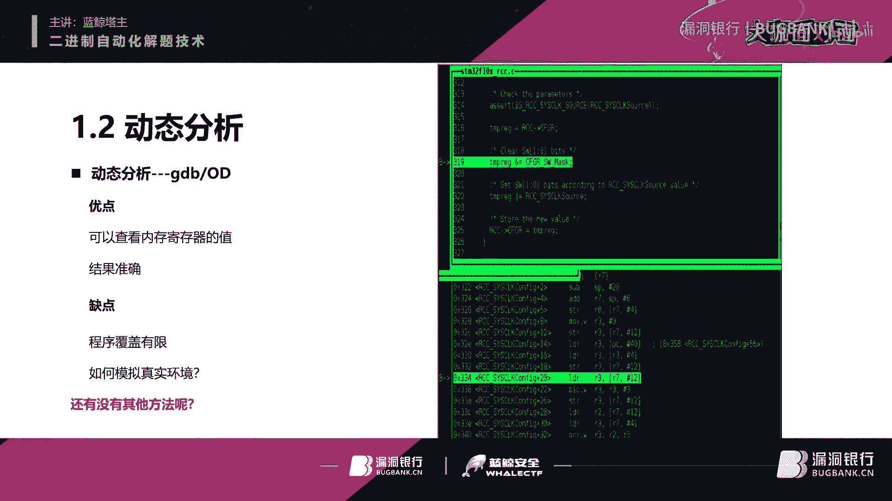

传统动æ€åˆ†æ需è¦è¾“入一个具体值（如 `10`）æ¥æµ‹è¯•ä¸€æ¡è·¯å¾„。而符å·æ‰§è¡Œåˆ™ï¼š
*   å°†è¾“å…¥è®¾ç½®ä¸ºç¬¦å· `x`。
*   åŒæ—¶æ¢ç´¢è·¯å¾„ A 和路径 B。
*   对äºè·¯å¾„ A，收集约æŸæ¡ä»¶ï¼š`x >= 5` 且 `x < 50`。
*   求解器（如 Z3）会找到一个满足该约æŸçš„具体值（例如 `20`），这个值就是能使程åºåˆ°è¾¾ç›®æ ‡çš„有效输入。

**å…¬å¼åŒ–æè¿°**： 符å·æ‰§è¡Œæ—¨åœ¨æ±‚è§£æ»¡è¶³è·¯å¾„çº¦æŸ **φ(path)** 的输入å˜é‡ **x** 的值，使得程åºèƒ½åˆ°è¾¾ç›®æ ‡çŠ¶æ€ **target_state**。å³æ±‚解 **∃x: φ(path(x)) ∧ (state(x) == target_state)**。

è¿™ç§æ–¹æ³•å¯ä»¥é¿å…手动逆å‘å¤æ‚算法，自动éå†æ‰€æœ‰å¯èƒ½çš„路径并找到通关æ¡ä»¶ã€‚

---

## 第二部分：é™æ€åˆ†æä¸åŠ¨æ€åˆ†æ简介

在深入自动化工具之å‰ï¼Œæˆ‘们先简è¦å›é¡¾ä¼ ç»Ÿåˆ†æ方法，以ç†è§£è‡ªåŠ¨åŒ–工具的优势。

以下是常用的二进制分æ工具和方法：

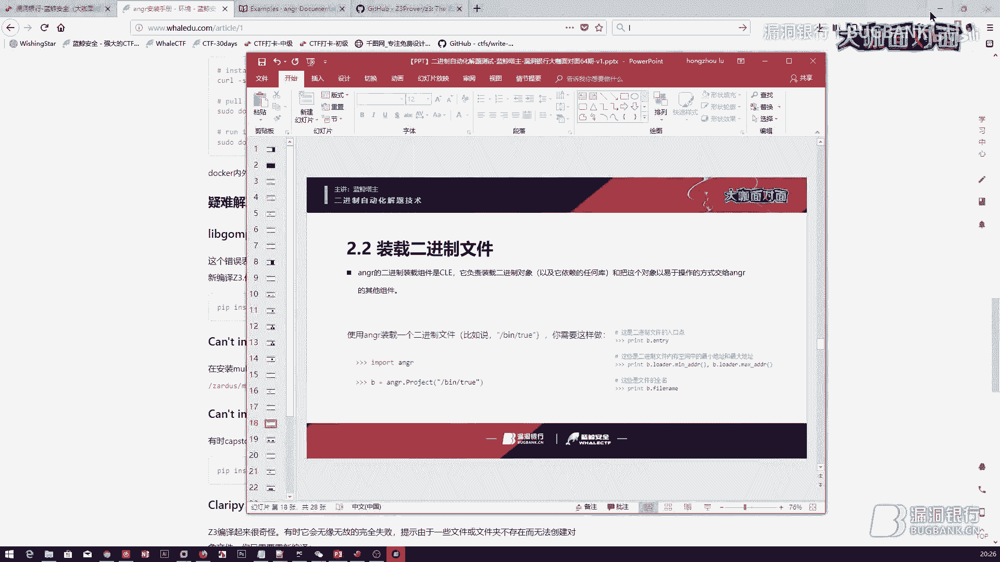


*   **`file` 命令**： 查看文件类å‹ã€æ¶æ„（如 32/64 ä½ï¼‰ã€‚
*   **`strings` 命令**： æå–文件中所有å¯æ‰“å°å­—符串，有时能直æ¥å‘ç° Flag。
*   **`ltrace` / `strace` 命令**： 跟踪程åºè°ƒç”¨çš„库函数或系统调用。
*   **é™æ€åˆ†æ工具 (IDA Pro, Ghidra)**： å汇编程åºï¼ŒæŸ¥çœ‹æ§åˆ¶æµå›¾ï¼Œå°†æ±‡ç¼–代ç è½¬æ¢ä¸ºæ›´æ˜“读的伪代ç ã€‚
*   **动æ€è°ƒè¯•å·¥å…· (GDB, OllyDbg)**： è¿è¡Œç¨‹åºï¼Œé€æ­¥æ‰§è¡Œï¼Œå®æ—¶æŸ¥çœ‹å’Œä¿®æ”¹å¯„存器ã€å†…存值。

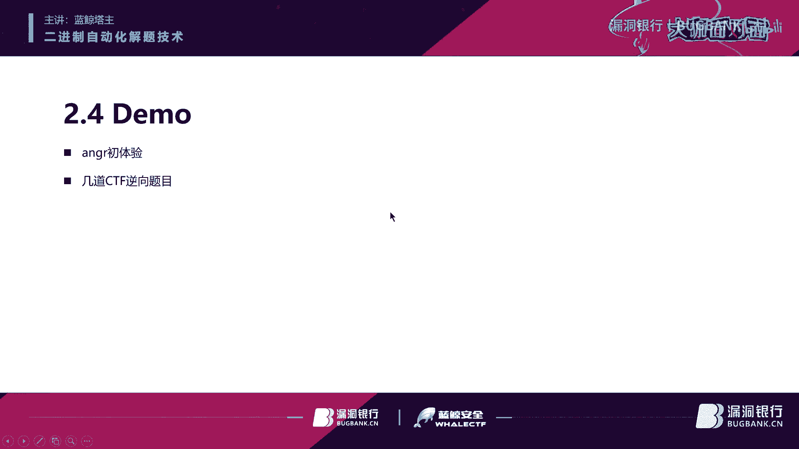


### 方法对比
*   **é™æ€åˆ†æ**：
    *   *优点*： å¯ä»¥æŸ¥çœ‹å…¨éƒ¨ä»£ç ï¼Œå‘ç°æ‰€æœ‰æ‰§è¡Œè·¯å¾„。
    *   *缺点*： 难以ç†è§£ç¨‹åºåŠ¨æ€äº¤äº’逻辑，入å£ç‚¹å¯èƒ½éš¾ä»¥å®šä½ã€‚
*   **动æ€åˆ†æ**：
    *   *优点*： å¯ä»¥è§‚察程åºè¿è¡Œæ—¶çŠ¶æ€ï¼Œäº¤äº’清晰。
    *   *缺点*： 一次è¿è¡Œåªèƒ½è¦†ç›–一æ¡è·¯å¾„，路径爆炸时难以穷尽；å¯èƒ½è§¦å‘å调试机制。


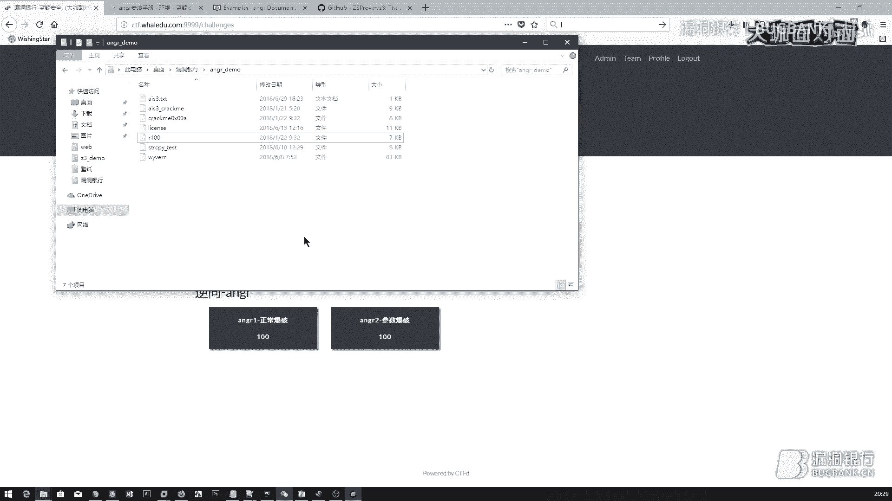


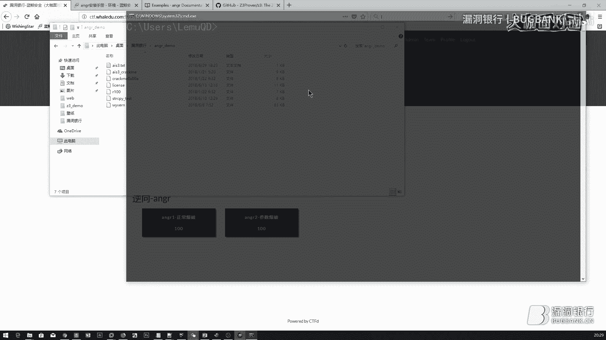

符å·æ‰§è¡ŒæŠ€æœ¯ç»“åˆäº†äºŒè€…的优点：**åƒé™æ€åˆ†æ一样æ¢ç´¢æ‰€æœ‰è·¯å¾„，åˆåƒåŠ¨æ€åˆ†æ一样处ç†å…·ä½“的程åºçŠ¶æ€**。

---

## 第三部分：使用 Angr 进行自动化路径æ¢ç´¢

上一节我们介ç»äº†ç¬¦å·æ‰§è¡Œçš„åŸç†ï¼Œæœ¬èŠ‚中我们æ¥çœ‹çœ‹å¦‚何利用 **Angr** 框æ¶å®é™…进行自动化解题。

Angr æ˜¯ä¸€ä¸ªåŸºäº Python 的二进制分æå¹³å°ï¼Œå®ƒé›†æˆäº†ç¬¦å·æ‰§è¡Œã€æ§åˆ¶æµåˆ†æã€æ¼æ´æŒ–æ˜ç­‰åŠŸèƒ½ï¼Œæ”¯æŒå¤šç§æ¶æ„。

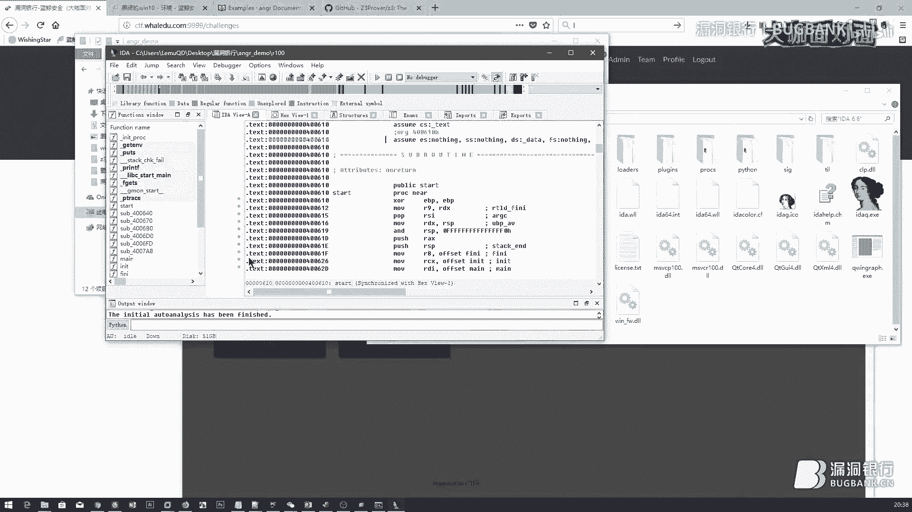

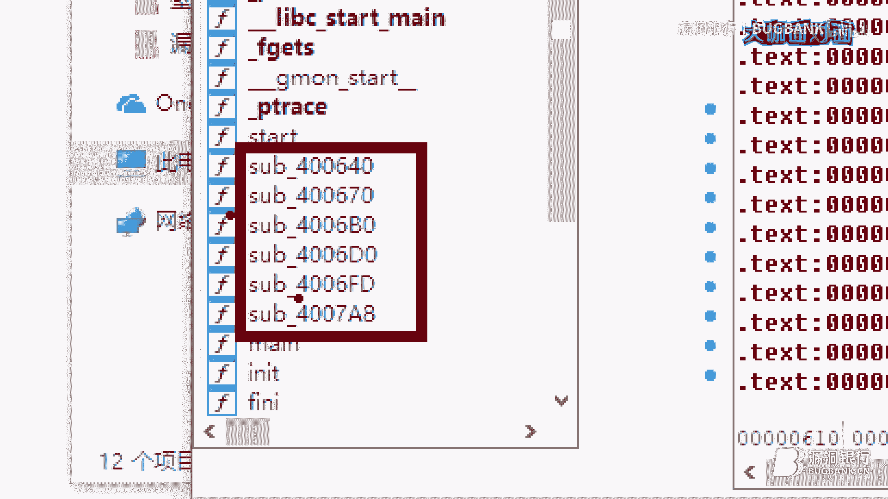

### 安装 Angr
æ¨è在 Linux ç¯å¢ƒï¼ˆå¦‚ Ubuntu）下安装。å¯ä»¥ä½¿ç”¨ pip 安装：
```bash
pip install angr
```
或者使用 Docker é•œåƒä»¥è·å–完整ç¯å¢ƒã€‚


### å®æˆ˜ 1：Angr 基础破解
我们以一个简å•çš„ CTF 逆å‘题 `r100` 为例。程åºä¼šè¦æ±‚输入一个密ç ã€‚

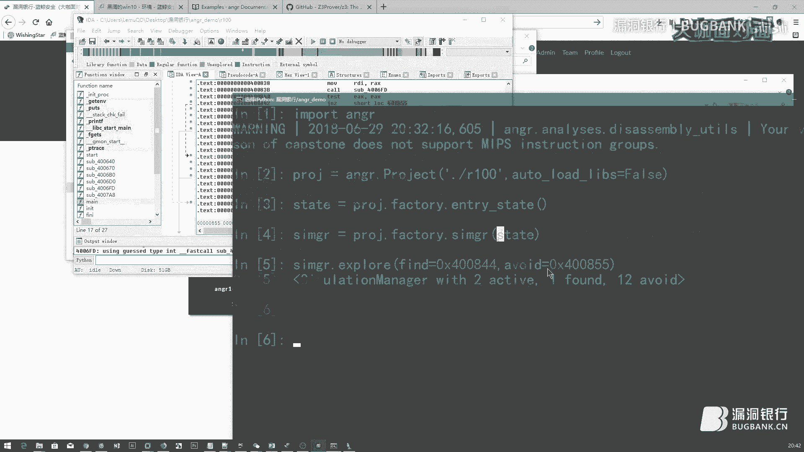


**解题æ€è·¯**：
1.  用 IDA 等工具找到程åºè¾“出æˆåŠŸä¿¡æ¯ï¼ˆå¦‚ `"Nice!"`）和失败信æ¯ï¼ˆå¦‚ `"Incorrect password"`）的地å€ã€‚
2.  编写 Angr 脚本，让其ä»ç¨‹åºå…¥å£å¼€å§‹ç¬¦å·æ‰§è¡Œï¼Œæ¢ç´¢è·¯å¾„。
3.  设定目标地å€ä¸ºæˆåŠŸåœ°å€ï¼Œé¿å…地å€ä¸ºå¤±è´¥åœ°å€ã€‚
4.  让 Angr 自动求解出能到达æˆåŠŸåœ°å€çš„输入。

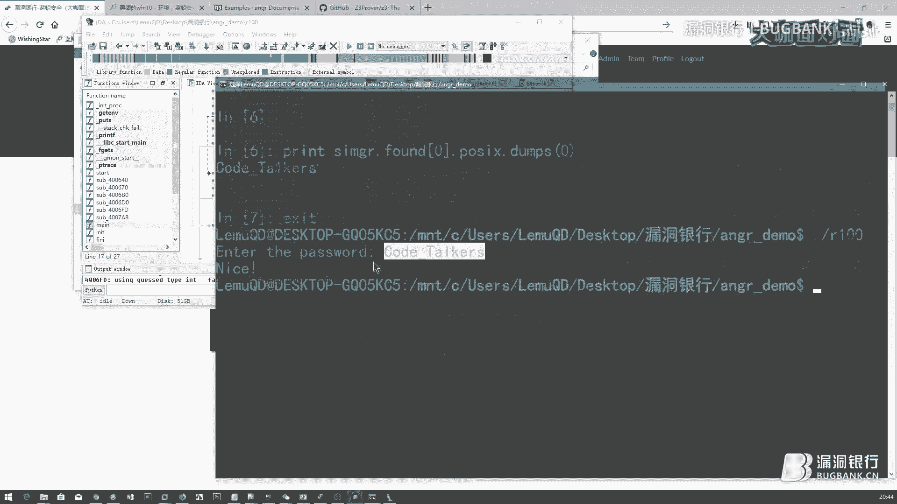


**核心代ç æ¨¡æ¿**：
```python
import angr


# 加载二进制文件，ä¸è‡ªåŠ¨åŠ è½½ä¾èµ–库（适用äºå¤§éƒ¨åˆ†CTF题）
proj = angr.Project('./r100', auto_load_libs=False)

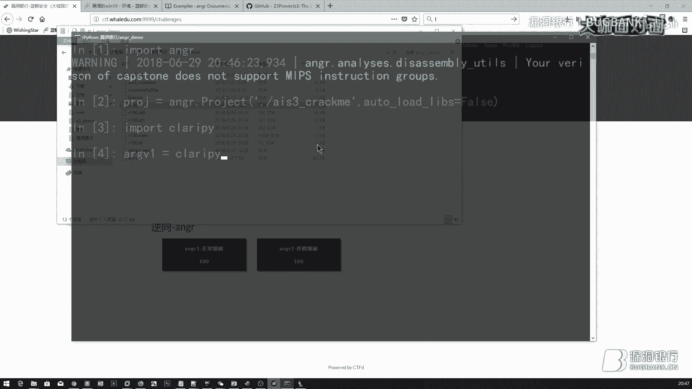


# 创建åˆå§‹çŠ¶æ€ï¼ˆä»ç¨‹åºå…¥å£å¼€å§‹ï¼‰
state = proj.factory.entry_state()


# 创建模拟管ç†å™¨ï¼Œç”¨äºè·¯å¾„æ¢ç´¢
simgr = proj.factory.simulation_manager(state)


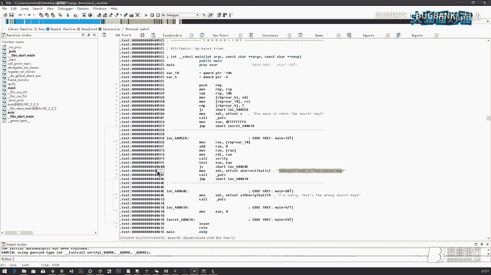


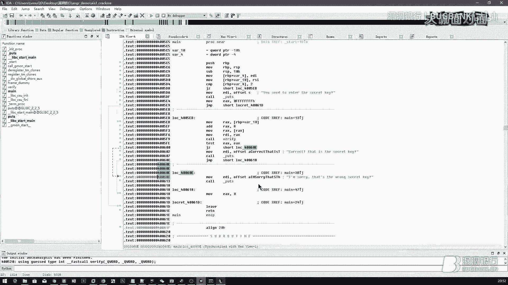

# 指定目标地å€å’Œé¿å…的地å€ï¼ˆéœ€é€šè¿‡IDA分æè·å¾—）
find_addr = 0x400844  # 例如 "Nice!" 的地å€
avoid_addr = 0x400855 # 例如 "Incorrect password" 的地å€

# 开始æ¢ç´¢ï¼Œå¯»æ‰¾é€šå‘ find_addr 的路径，é¿å¼€ avoid_addr
simgr.explore(find=find_addr, avoid=avoid_addr)


# 打å°æ‰¾åˆ°çš„解决方案（å³æ­£ç¡®è¾“入）
if simgr.found:
    solution_state = simgr.found[0]
    # å‡è®¾è¾“入是ä»æ ‡å‡†è¯»å–的，并存储在特定的ä½ç½®ï¼Œè¿™é‡Œæ‰“å°æ ‡å‡†è¾“入的内容
    print(solution_state.posix.dumps(0))  # dumps(0) 表示标准输入
else:
    print("No solution found")
```
è¿è¡Œè„šæœ¬å，Angr 会输出求解出的字符串，例如 `b'Code_Talkers'`，这就是正确的密ç ã€‚

---

## 第四部分：处ç†å¸¦å‚数的程åº

上一节我们处ç†äº†ä»æ ‡å‡†è¾“入读å–æ•°æ®çš„程åºï¼Œæœ¬èŠ‚中我们æ¥çœ‹çœ‹å¦‚何处ç†é€šè¿‡å‘½ä»¤è¡Œå‚æ•°æ¥æ”¶è¾“入的程åºã€‚

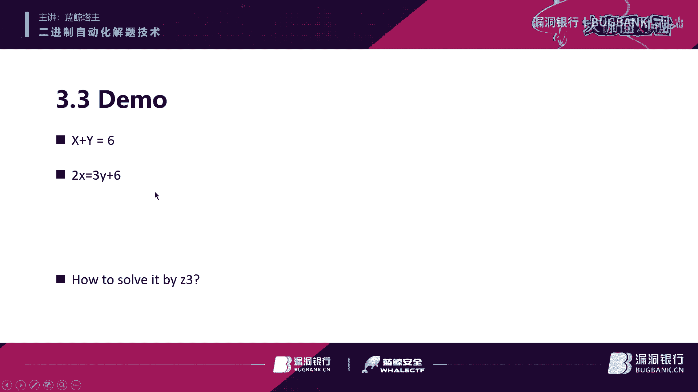

对äºç¨‹åº `ais3_crackme`，它需è¦ä»¥ `./ais3_crackme <secret_key>` çš„å½¢å¼è¿è¡Œã€‚

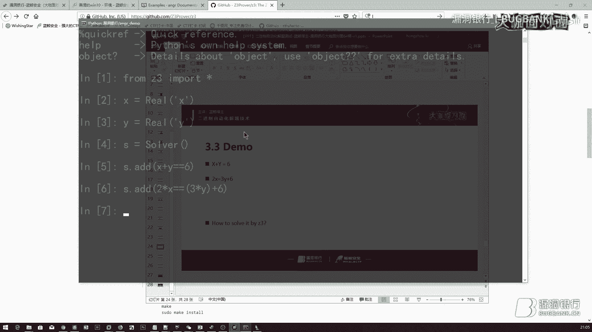

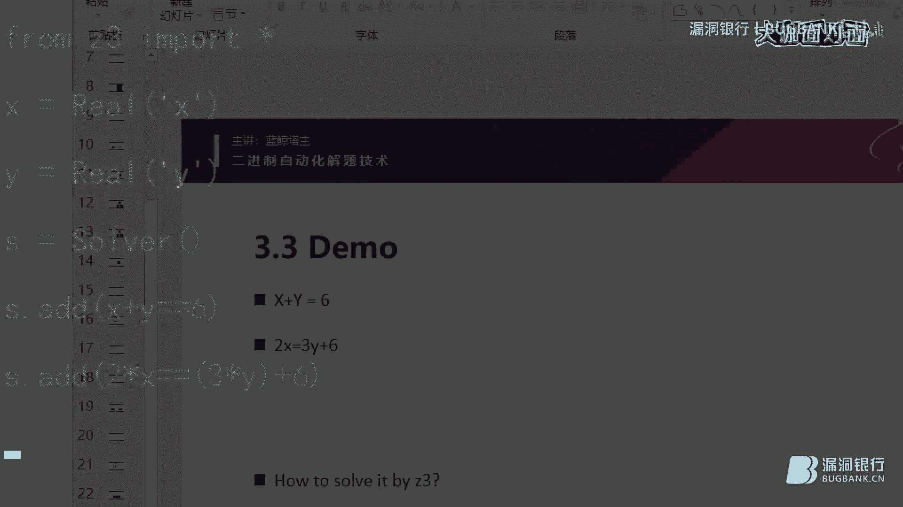


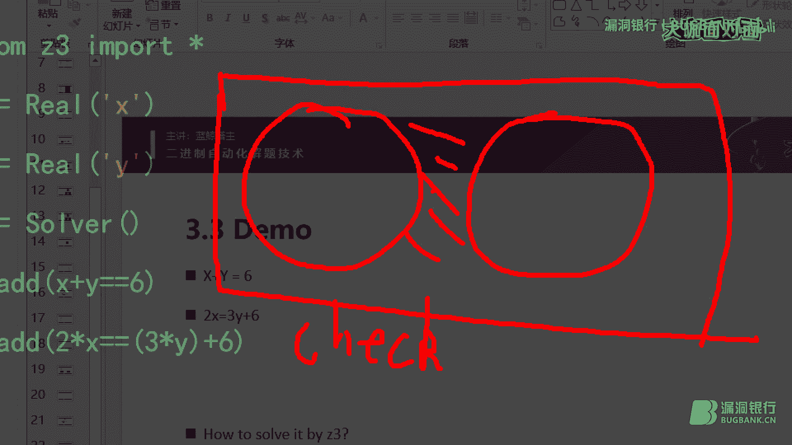

**解题æ€è·¯**：
1.  在创建åˆå§‹çŠ¶æ€ (`entry_state`) 时，需è¦è®¾ç½®ç¨‹åºçš„å‚数列表。
2.  将待求解的密钥设置为一个符å·å‘é‡ï¼ˆBitVector）。
3.  其余步骤ä¸åŸºç¡€ç ´è§£ç±»ä¼¼ã€‚


**核心代ç æ¨¡æ¿**：
```python
import angr
import claripy  # Angr 的约æŸæ±‚解模å—，用äºåˆ›å»ºç¬¦å·

proj = angr.Project('./ais3_crackme', auto_load_libs=False)

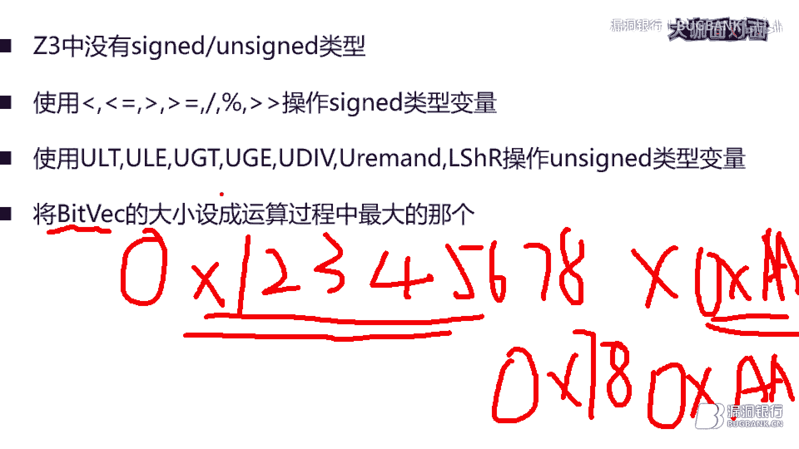


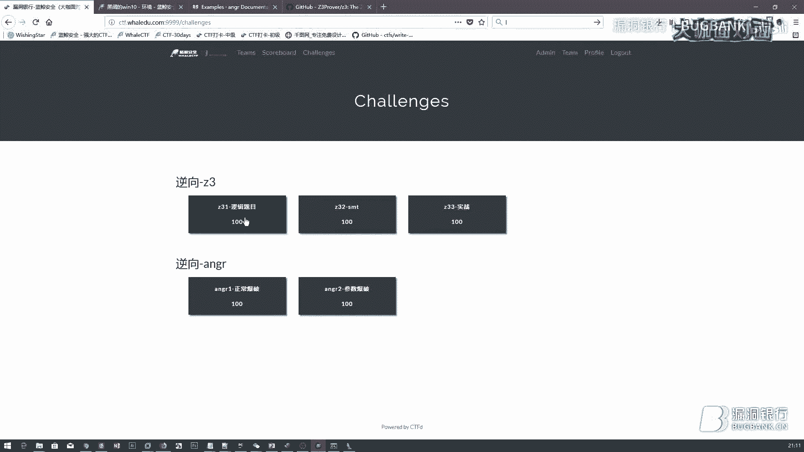

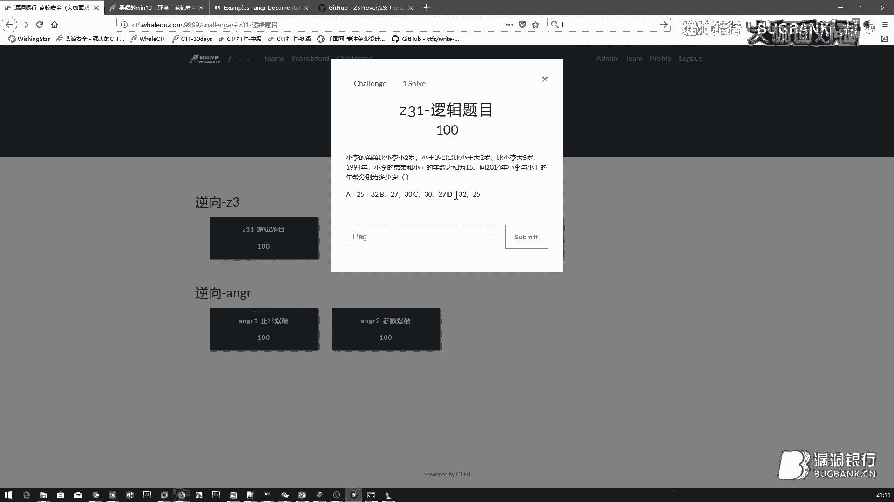

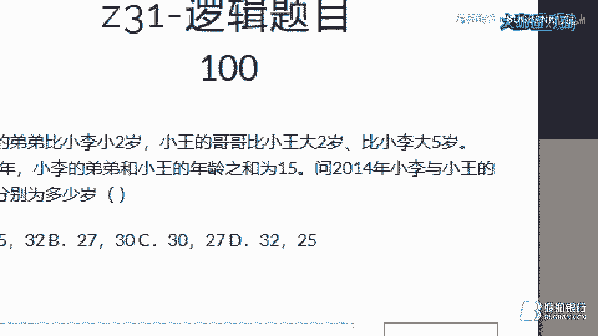

# 创建一个长度为 50*8 比特的符å·å‘é‡ï¼Œä»£è¡¨å‘½ä»¤è¡Œå‚数（字符串）
# BVS 表示 BitVector Symbol
arg1 = claripy.BVS('arg1', 50 * 8)

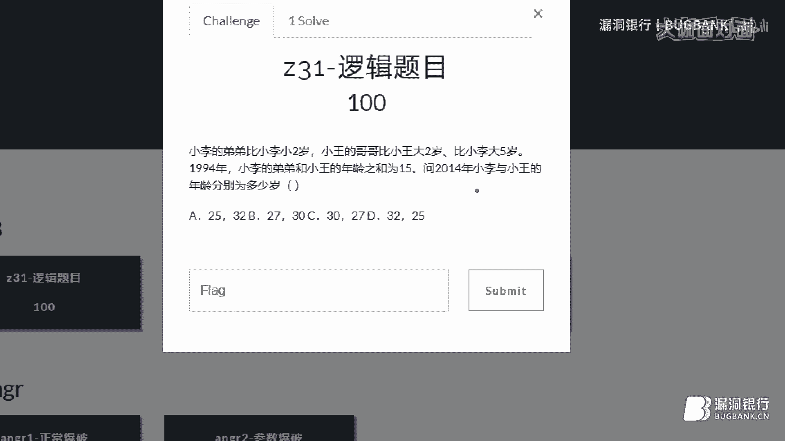

# 创建åˆå§‹çŠ¶æ€ï¼Œå¹¶è®¾ç½®å‚数：第一个是程åºå，第二个是我们的符å·å‚æ•°
state = proj.factory.entry_state(args=['./ais3_crackme', arg1])


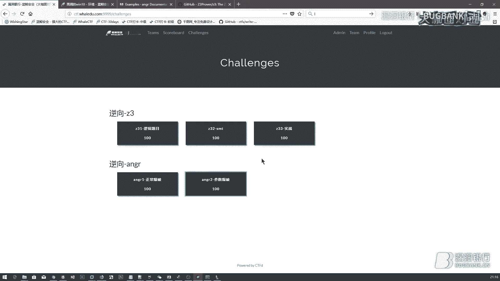

simgr = proj.factory.simulation_manager(state)


# 通过IDA分æ找到æˆåŠŸå’Œå¤±è´¥åœ°å€
find_addr = 0x400602  # "Correct" 地å€
avoid_addr = 0x4005F7 # "I'm sorry" 地å€

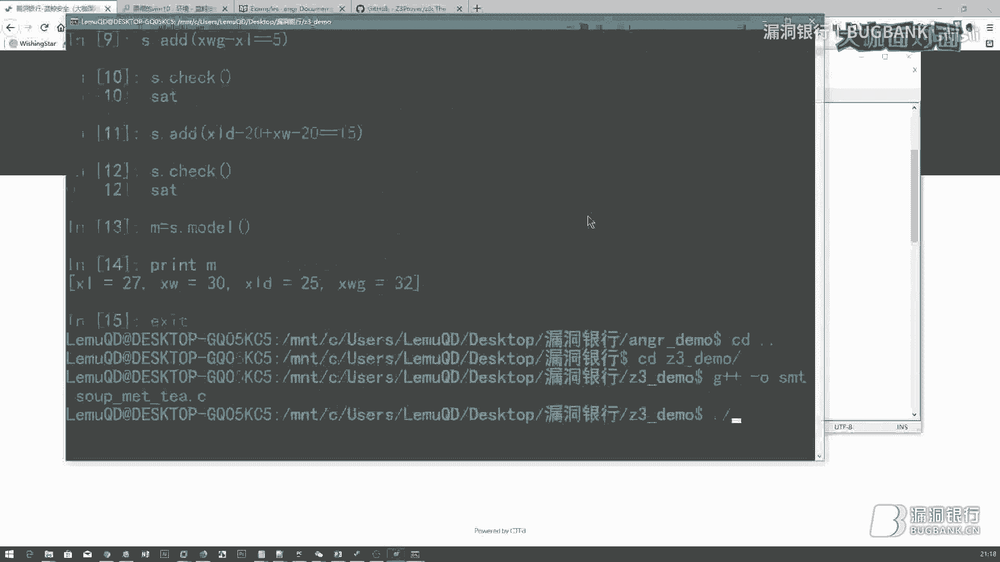

simgr.explore(find=find_addr, avoid=avoid_addr)

if simgr.found:
    solution_state = simgr.found[0]
    # è·å–符å·å‚æ•° arg1 的求解结æœï¼Œå¹¶è½¬æ¢ä¸ºå­—符串
    solved_arg1 = solution_state.solver.eval(arg1, cast_to=bytes)
    print(solved_arg1.rstrip(b'\x00'))  # å»é™¤æœ«å°¾çš„填充空字符
else:
    print("No solution found")
```
è¿è¡Œè„šæœ¬å，将得到正确的密钥，格å¼å¯èƒ½ä¸º `b'flag{...}'`。

---

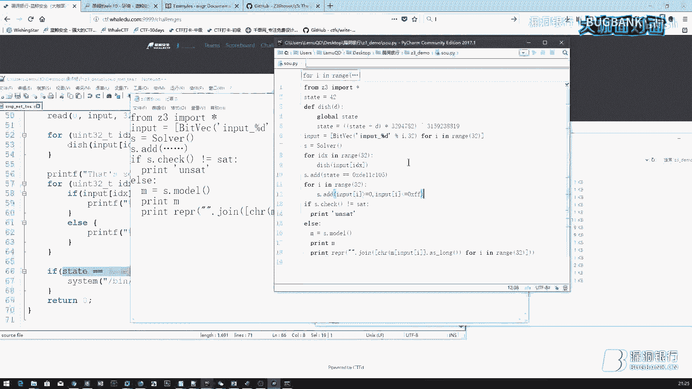


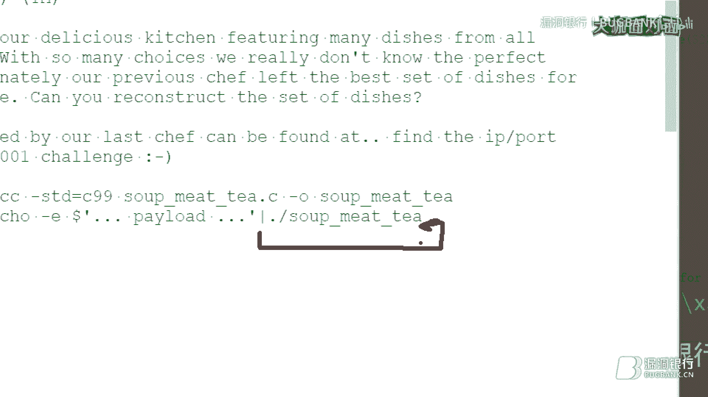

## 第五部分：使用 Z3 求解器处ç†å¤æ‚约æŸ


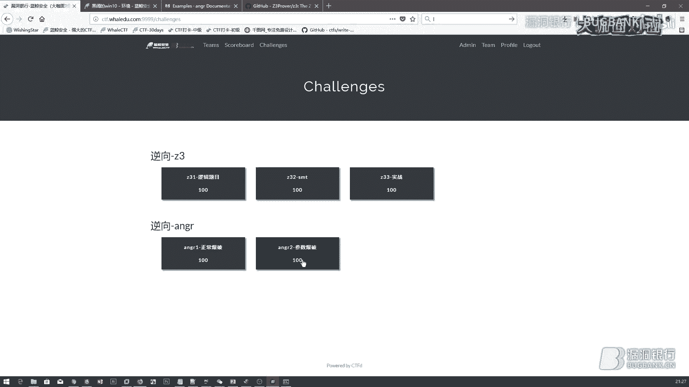

Angr 适åˆå¤„ç†å®Œæ•´çš„ã€è·¯å¾„清晰的程åºã€‚但当é¢å¯¹çº¯ç®—法ã€ä»£ç ç‰‡æ®µæˆ–路径爆炸（如大é‡éšæœºæ•°åˆ†æ”¯ï¼‰çš„问题时，更底层的 **Z3** 求解器å¯èƒ½æ›´é«˜æ•ˆã€‚Z3 是微软开å‘的高性能定ç†è¯æ˜å™¨ï¼ŒAngr 的约æŸæ±‚解å端就是 Z3。


### Z3 基础
Z3 å¯ä»¥ç›´æ¥æ±‚解方程组和逻辑约æŸã€‚例如，求解：
*   `x + y == 6`
*   `2*x == 3*y + 6`

**Z3 求解代ç **：
```python
from z3 import *

# 定义å˜é‡
x = Real('x')
y = Real('y')

# 创建求解器
s = Solver()


# 添加约æŸæ¡ä»¶
s.add(x + y == 6)
s.add(2*x == 3*y + 6)

# 检查是å¦æœ‰è§£
if s.check() == sat:  # sat 表示å¯æ»¡è¶³ï¼ˆæœ‰è§£ï¼‰
    m = s.model()     # è·å–模å‹ï¼ˆè§£ï¼‰
    print(f"x = {m[x]}")
    print(f"y = {m[y]}")
else:
    print("无解")
```
è¿è¡Œå将输出 `x = 24/5`, `y = 6/5`。

### Z3 支æŒçš„æ•°æ®ç±»å‹å’Œæ“作
*   **常用类å‹**： `BitVec('a', 32)` (32ä½ä½å‘é‡ï¼Œç±»ä¼¼ int), `Real('x')` (å®æ•°), `Bool('p')` (布尔值)。
*   **è¿ç®—**： 标准算术和逻辑è¿ç®— (`+, -, *, /, &, |, ^, ==, !=, <, >` ç­‰)。
*   **无符å·æ•°æ¯”较**： 对äºæ— ç¬¦å·ä½å‘é‡ï¼Œéœ€ä½¿ç”¨ `ULT` (无符å·å°äº), `ULE` (无符å·å°äºç­‰äº) 等专用æ“作。

### å®æˆ˜ 2：使用 Z3 逆å‘算法
å‡è®¾æœ‰ä¸€æ®µ C 代ç éªŒè¯å‡½æ•°ï¼Œå…¶æ ¸å¿ƒæ˜¯å¤æ‚的算术和逻辑è¿ç®—。我们å¯ä»¥å°†è¿ç®—过程用 Z3 的语法é‡å†™ï¼Œå°†è¾“入设为符å·å˜é‡ï¼Œè®© Z3 求解出满足最终验è¯æ¡ä»¶çš„输入值。


**通用解题模æ¿**：
```python
from z3 import *

# 定义输入符å·å˜é‡ï¼Œä¾‹å¦‚一个 32 ä½çš„数（å¯èƒ½ä»£è¡¨4个字符）
inp = BitVec('inp', 32)

s = Solver()

# æ ¹æ®é€†å‘出的算法，添加约æŸæ¡ä»¶
# 例如： (inp * 0x12345678) & 0xFFFF == 0xABCD
s.add((inp * 0x12345678) & 0xFFFF == 0xABCD)

# å¯ä»¥æ·»åŠ é¢å¤–约æŸï¼Œå¦‚输入是å¯æ‰“å°å­—符
for i in range(4):
    byte = Extract(8*i+7, 8*i, inp)  # æå–第 i 个字节
    s.add(byte >= 0x20, byte <= 0x7E) # å¯æ‰“å° ASCII 范围

if s.check() == sat:
    m = s.model()
    solved_inp = m[inp].as_long()
    # 将整数转æ¢ä¸ºå­—节字符串（注æ„大å°ç«¯ï¼‰
    flag = solved_inp.to_bytes(4, 'little')
    print(f"Found input: {flag}")
else:
    print("No solution")
```


---

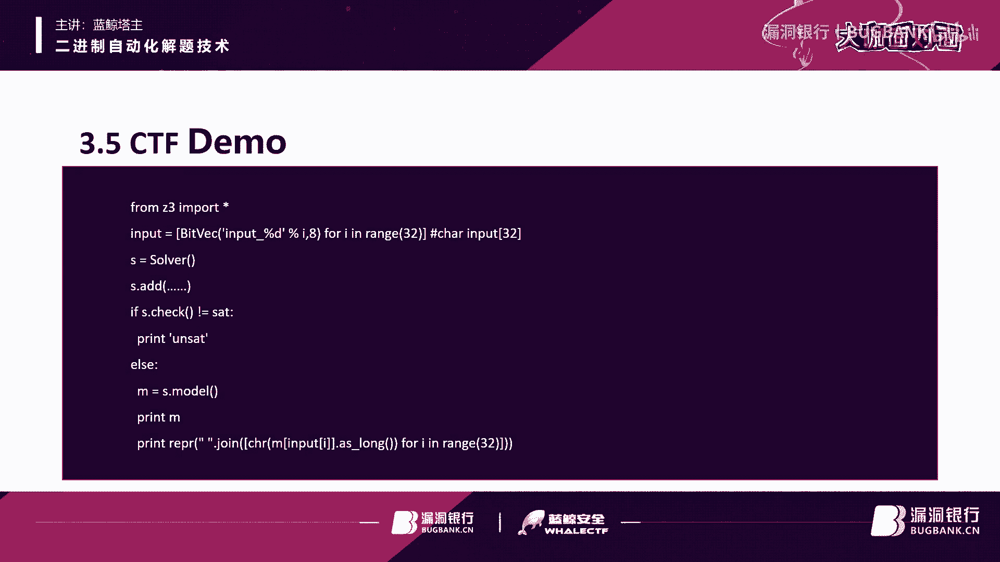

## 第六部分：综åˆå®æˆ˜â€”—å¤æ‚éšæœºæ•°é—®é¢˜


有些题目结åˆäº†éšæœºæ•°ï¼Œä½¿å¾—路径数剧å¢ï¼ŒAngr ç›´æ¥æ¢ç´¢æ•ˆç‡ä½ä¸‹ã€‚这时需è¦ç»“åˆé™æ€åˆ†æã€åŠ¨æ€è°ƒè¯•ä¸ Z3 求解。

**解题æ€è·¯ï¼ˆä»¥æŸ CTF 题为例）**：
1.  **é™æ€åˆ†æ (IDA)**： 定ä½ç¨‹åºä¸»è¦éªŒè¯é€»è¾‘，å‘ç°å…¶ä½¿ç”¨ `srand(seed)` åˆå§‹åŒ–éšæœºæ•°ï¼Œ`seed` 由用户输入的第一部分计算得出。å续验è¯ä½¿ç”¨ `rand()` 生æˆå¤šä¸ªå€¼å‚ä¸è¿ç®—。
2.  **第一部分求解**： ç”±äº `seed` 的计算是确定的（无éšæœºæ•°ï¼‰ï¼Œå¯ä»¥ä½¿ç”¨ **SymPy**（符å·æ•°å­¦åº“）或 **Z3** ç›´æ¥æ±‚解出能产生正确 `seed` 的输入第一部分。
3.  **动æ€è°ƒè¯•è·å–éšæœºåºåˆ—**： 因为 `srand(seed)` 固定å，`rand()` åºåˆ—是固定的。使用调试器（如 GDB é…åˆ IDA）è¿è¡Œç¨‹åºï¼Œåœ¨è¾“入第一部分å，设置 `seed` 为我们求解出的值，然å步进程åºï¼Œä»å†…存中æå–出åç»­ `rand()` 生æˆçš„所有确定值。
4.  **第二部分求解**： å°†æå–出的éšæœºæ•°ä½œä¸ºå·²çŸ¥å¸¸é‡ï¼Œä»£å…¥åˆ°ç¬¬äºŒé˜¶æ®µçš„验è¯ç®—法中。å†æ¬¡ä½¿ç”¨ **Z3**，将用户输入的第二部分设为符å·å˜é‡ï¼Œå»ºç«‹æ–¹ç¨‹å¹¶æ±‚解。
5.  **组åˆè¾“å…¥**： 将第一部分和第二部分求解结æœåˆå¹¶ï¼Œå³ä¸ºå®Œæ•´ Flag。

è¿™ç§æ–¹æ³•é¿å…了 Angr 在无数éšæœºåˆ†æ”¯ä¸­æŒ£æ‰ï¼Œé€šè¿‡â€œåˆ†è€Œæ²»ä¹‹â€å’ŒåŠ¨æ€è°ƒè¯•è·å–关键中间状æ€ï¼Œå¤§å¤§æå‡äº†æ±‚解效ç‡ã€‚

---

## 总结
本节课中我们一起学习了二进制自动化解题的核心技术：

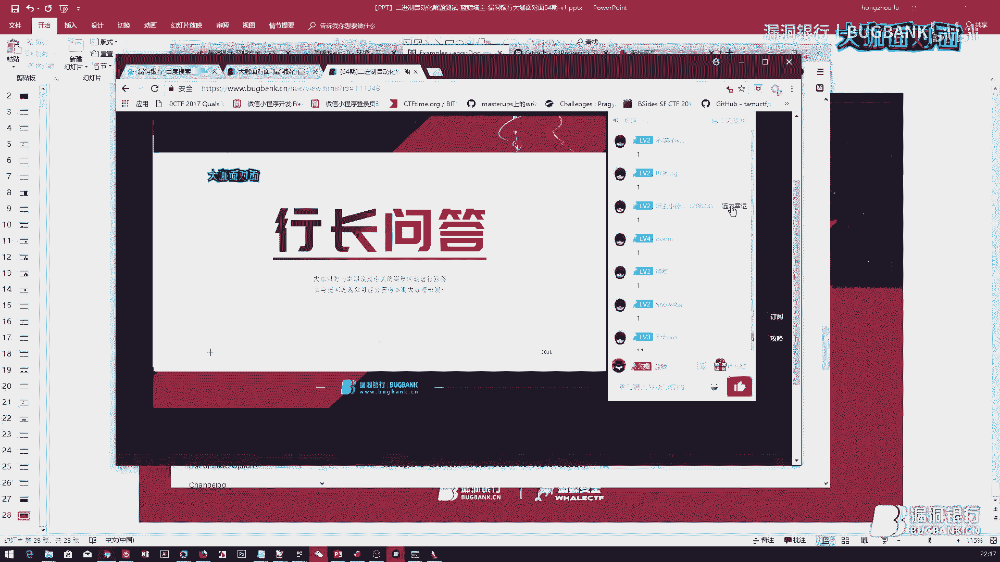

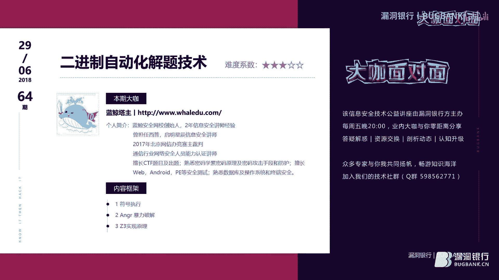

1.  **符å·æ‰§è¡ŒåŸç†**： 用符å·ä»£æ›¿å…·ä½“输入，通过收集和求解路径约æŸæ¥è·å¾—有效输入。
2.  **Angr 框æ¶**： 用äºè‡ªåŠ¨åŒ–分æ二进制程åºï¼Œè‡ªåŠ¨æ¢ç´¢è·¯å¾„并求解，é常适åˆå¤„ç†é€»è¾‘清晰ã€è·¯å¾„å¯æ§çš„逆å‘题。
3.  **Z3 求解器**： 强大的约æŸæ±‚解引æ“，适åˆå¤„ç†å¤æ‚的算法逆å‘和数学约æŸé—®é¢˜ï¼Œå¯ä½œä¸º Angr 的底层或独立使用。
4.  **æ··åˆç­–ç•¥**： é¢å¯¹å¤æ‚题目（如å«éšæœºæ•°ï¼‰ï¼Œéœ€ç»“åˆé™æ€åˆ†æã€åŠ¨æ€è°ƒè¯•ä¸è‡ªåŠ¨åŒ–求解工具，å„å–所长。

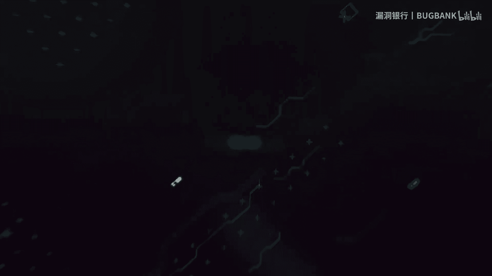

通过æŒæ¡è¿™äº›è‡ªåŠ¨åŒ–技术，你å¯ä»¥æ˜¾è‘—æ高解决二进制逆å‘题目的效ç‡ï¼Œå°†é‡å¿ƒä»ç¹ç的指令分æ转移到更高层的逻辑ç†è§£å’Œå·¥å…·è¿ç”¨ä¸Šã€‚希望本教程能为你打开二进制安全自动化分æ的大门。