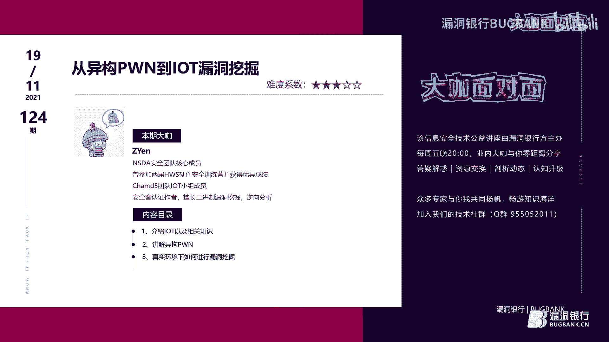
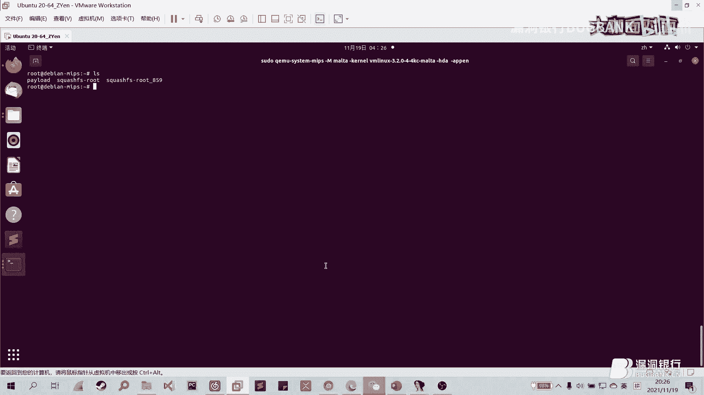
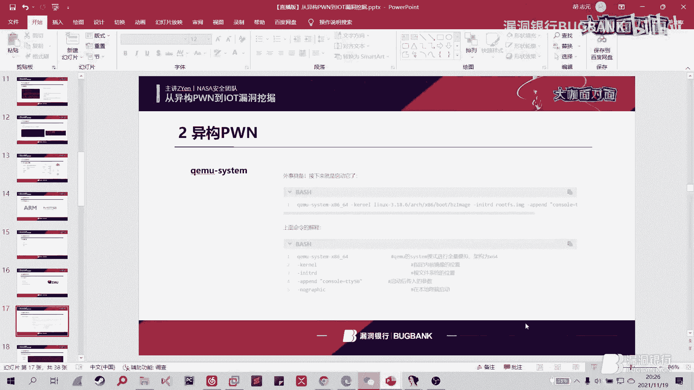
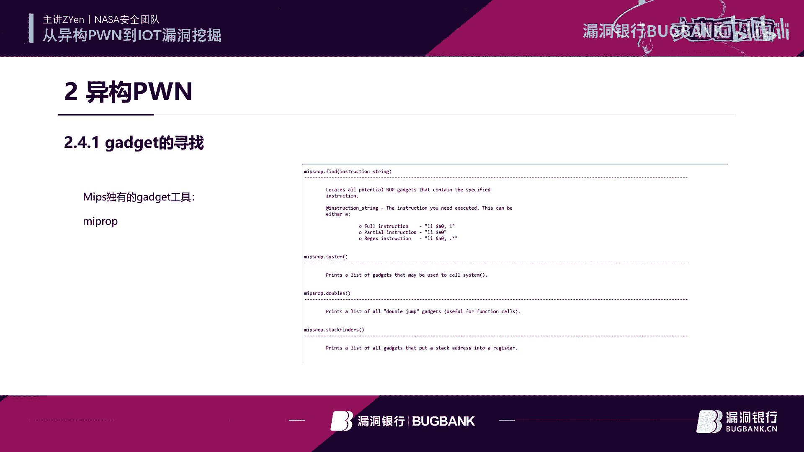
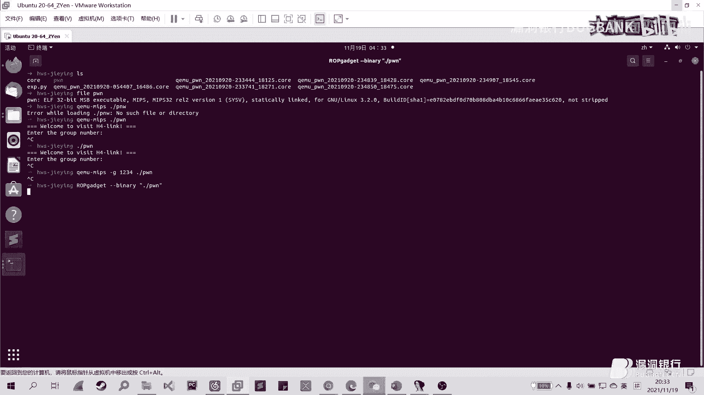
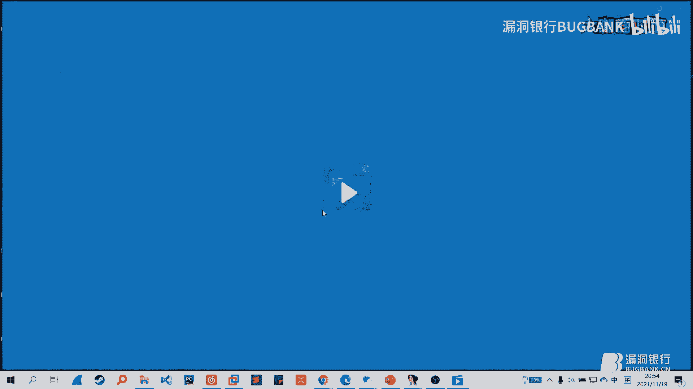
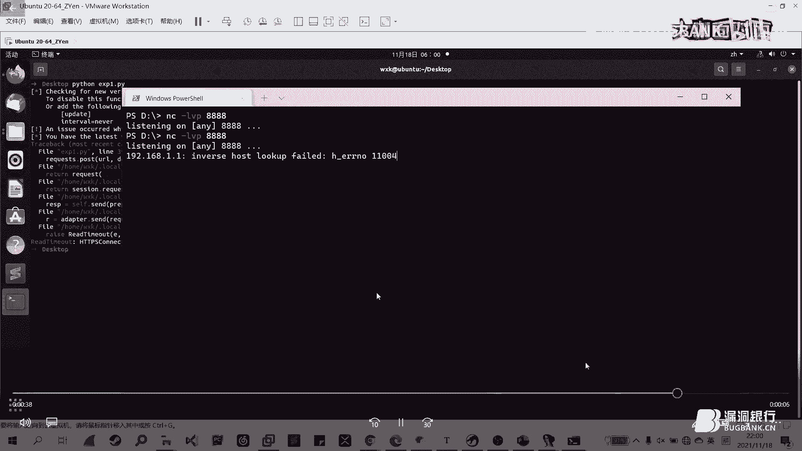
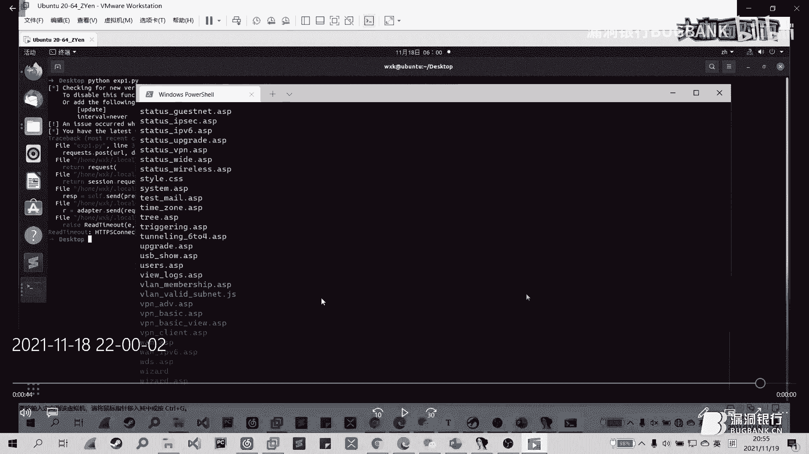
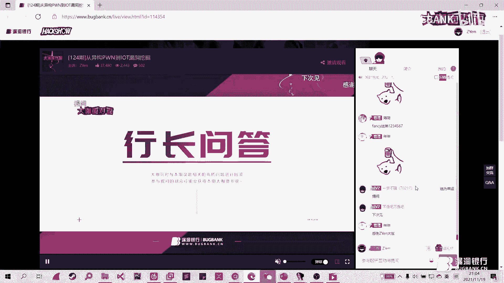

# 漏洞银行丨从异构PWN到IOT漏洞挖掘-ZYen丨大咖面对面124期 - P1：124 最新_x264 - 漏洞银行BUGBANK - BV1U34y197En

(音樂)。

為知識而存 因技術而生，各位小夥伴們 大家晚上好，歡迎參加第124期漏洞銀行安全技術直播，打開面對面，我是今晚的主持人Fancy，今晚要給大家做技術分享的大咖，是來自於NSDA安全團隊成員的Zyen。

今天我們有幸邀請到他來咖面做客，這次他分享的議題是從異構棒到IOT漏洞挖掘，感興趣的小夥伴可要做好筆記聽到最後喔，同時歡迎各位小夥伴登錄直播間，在聊天區進行交流互動，聽講過程中有任何疑問。

可以隨時在聊天區提出，待演講完畢後，大咖會在行長問答環節集中接待小夥伴的疑問，同時今天晚上的聽講福利，也將在問答環節結束後，挑選一位幸運觀眾，送出由我們的Zyen大咖親自挑選的書籍，加密與解密第四版。

那下面就讓我們有請Zyen大咖，開始今天的直播分享吧，大家好 我是Zyen，然後來自NSD安全團隊，然後也參加過兩次HWS的一個訓練營，然後也是MD5團隊的一個IOT成員，然後在上一期呢。

我們的像素大咖已經為我們講解了一個無線電方面的一個安全，然後像素大咖呢主要是講一些信號的一些調製，或者是一些解調方面的一些內容，然後我今天所帶來的呢，就是一些更貼近於我們的代碼層面的一些內容。

然後來看一下今天的一個目錄。

今天的講解呢分為三個部分，第一個部分呢就是介紹我們的IOT以及相關的一些知識，第二部分呢就是講解一下這個egoPwn到底是一個什麼樣的東西，我們在做題的時候需要有什麼注意的一個點。

然後最後一個點呢就是在我們真實的一個環境下如何去進行這個漏洞挖掘，那麼這裡先提一個醒，就是第三Part所講到的一個漏洞挖掘呢，並不是教大家就是看到一個路由器設備就去攻擊人家就去測試什麼的。

我們這裡講的只是說提供一個思路，然後幫助廠商更好的一個完善他們的一個產品的一個安全性，這麼一個目的，然後就進入我們今天的第一部分，第一部分呢就是講解我們IOT到底是個什麼樣的東西。

那麼IOT呢其實本質上就是，他也是人云亦云，也不是沒有特別具體的一個定義，而這裡PPT上也列了三個不同的方向來看IOT到底是一個什麼樣的東西，那麼從定義的角度來看呢。

IOT呢就是Internet of Things，就是一個萬物互聯的一個概念，其實就是從用通俗一點的話來講的就是把生活中的一些設備把他們連接在一起，然後他們可以進行交互啊，甚至可以控制互相控制。

就好比小米的一個音箱，你可以呼喚他，然後控制家裡的一些智能設備，這就是我們從定義上來講的一個IOT，那麼從安全研究員安全研究人員來的角度來看呢，IOT就是一個嵌入式的一個設備。

那麼他呢包含硬件的實現軟件的實現都好，他們都本質上來說就是一個完整的一個計算機，那麼從我個人的一個角度來看呢，IOT就是一個設備嘛，就比如路由器設備，然後攝像頭或者是什麼音響電飯包等等，一些智能的設備。

那麼他他呢有他自己實現的一個邏輯，那麼我們可以拿他這個邏輯呢進行一個分析，那麼我們研究IOT呢並不需要對這個IOT這個概念有特別深刻的理解，我們重點還是看後面的一些內容。

然後我們只需要對IOT的這個概念啊大概理解一下就可以了，那麼講完了IOT這個東西呢，就不得不提一下他最關鍵的部分就是固件，那麼固件呢從語意上來說呢，就是固化的固化的物件嘛，對吧。

那麼固化的物件這個物件指的是什麼呢，指的是一個軟件，所以說我們在看到固件這麼一個概念的時候，我們不要狹義的去理解為他就他就是一個硬件的一個組成部分，其實他本質上來說呢還是一個軟件的一個東西。

我們分析研究IOT其實分析最本質的一個東西呢，就是分析我們固件裡面的一些文件系統，就比如說左圖的這一個黑色的小東西，他就是我們的一個就是一個flash，flash大家應該都有了解過。

他是一個這個黑黑的東西呢，就是一個SOP8封裝的一個flash，然後他的那個針腳可以看到有八個，所以他就是SOP8，那麼我們我們可以看到右圖右圖，我們的固件呢是處在比較底層的一個位置。

然後既然他這麼重要，我們就去想啊我們怎麼去獲得獲得這個固件，說獲得這個固件呢，我們上面列了五種方法，但是最後一種方法呢還是不太建議各位，去嘗試，我們這裡只對前四種方法進行一個講解。

那麼第一個就是互聯網搜索，然後第二個是觸發更新並抓包，第三個是拆機讀flash，然後是shout打包，那麼我們一個個來看，第一個呢就是從我們的互聯網上去搜索，首先第一個就是官網。

就是廠商在發布他的產品之後呢，會在他的官網上留下一個固件的一個下載途徑，但是也不是每一個廠商都會留這麼一個下載的途徑，在他的官網上，畢竟可能因為安全性的一個考慮，他沒有留，那麼第二個就是論壇。

論壇的話就是有一些大佬，可能他之前就通過了一些其他的方式，把這個固件給提取了出來，然後他想把這個分析的過程分享出去，然後他就把固件放在了論壇上，然後剩下的谷歌和朋友呢都是一個概念。

接下來我們看第二個就是觸發更新並抓包，觸發更新並抓包是什麼樣的一個原理呢，就是設備它上面有一個觸發更新的一個機制，或是按鈕，然後他會向我們的雲端的服務器發送一個請求。

然後請求一個固件更新的一個下載的URL，那麼我們就可以在這個過程當中呢，去通過抓包抓取這個URL，然後我們之後再訪問這個URL，我們就能成功的拿取到我們的固件，然後再往下呢，就是比較硬核一點的方法。

比較偏硬件一點，這裡的拆機讀Flash，其實我們剛才也講到我們分析呢，是分析Flash裡面的一個固件，分析它裡面的文件系統，那麼我們就是將它的直接外殼拆掉，然後去讀它的Flash。

那就已經獲得固件最直接的一個方法了，我們拆呢是怎麼拆，拆就是用熱風槍給它吹下來，吹下來之後呢，我們就可以用到左圖這裡的，最左邊這個圖，這裡的一個編程器，easype這個編程器，然後放到上面。

然後連接到我們的筆記本上，然後就可以讀取到我們的一個Flash，那麼前面講的是一個，需要將這個Flash給它拆下來，那下面的下面一種方法呢，就是不需要去採取我們的Flash，直接可以用我們的數位派。

去讀我們的Flash，具體的讀取過程呢，就是用我們的編程夾，可以看到這裡有個SOP8的一個，通用的一個測試夾，然後下圖呢就是這個夾子，這個黑黑的，拍得不是很清晰，就夾到我們的一個Flash上面。

就根據它的每個針腳的一個分布，然後夾到這個Flash上面，然後再連接我們的，通過杜邦線連接到我們的數位派上，數位派呢再通過我們的Flashroom，然後讀取到，然後把我們的固件最後提取出來。

然後這裡其實第二種方法，就是不拆卸的話，成功率的話也是，忽高忽低也是說不定的，第一種方法會更加直接一點，就是直接獲取到我們的一個固件，再往下呢就是SHOP打包，SHOP打包呢。

肯定得先拿到它的一個SHOP，然後它的SHOP呢，有很多種方式，這裡就是直接列了一個，用串口拿到我們的一個SHOP，串口呢，就是我們拆機之後，可能會發現有四個口，四個口有可能上面會標著。

它四個口分別是幹什麼的，如果我們沒有的話，我們就需要用到我們的萬用表，然後測試一下，測試一下每個口，然後來確定一下，每個口到底是接到哪條線上，左圖最左邊這張圖呢，就是一個通過這個是我們的URT。

然後連接到我們的一個，一個串口轉化的一個模塊上面，然後最後連接到我們的電腦，連接到我們電腦之後呢，我們就可以啟動我們的路由器，啟動我們的路由器之後呢，我們可以看到，它的整一個的Bootloader。

啟動的一個過程，我們在等待它啟動完成之後呢，我們就可以拿到一個SHOP，但是也不是每個廠商，他都會在這上面給你開放一個，SHOP的一個服務，他有可能不開，或者他開了，他設了個密碼。

如果這個密碼你不知道的話，你還是拿不到的，如果我們也可以通過在這個Bootloader，他啟動的這麼一個過程通過打斷，我們可以拿到一個，比較簡潔版的一個SHOP，拿到這個SHOP之後呢。

我們可以通過一些，用一些其他的一些方式，把它變成我們一個完整的一個SHOP，另外呢也可以通過它打印一下，我們的一個設備的一些環境變量，看一下有沒有可以開啟的一個部分，比如說一些條件服務。

我們可以去嘗試一下，看一下這部分有沒有一些有用的東西，然後拿到這個SHOP之後呢，我們就可以進行一個打包，打包就是一些壓縮的一些Linux的命令，然後打包完成了之後呢。

我們就可以去通過一些傳輸的一些Linux的命令啊，比如說VGA這些TFTP等等這些命令，然後我們就可以將我們的固件給他拉出來，講完了這個固件的一個獲取的方式呢，我們就就來到了下一步，就是固件的一個解包。

因為它本身是一個打包好的一個狀態，我們需要通過解包才能獲取到它，真正的一個文件系統的所在，那麼這裡就可能會涉及到一個加解密的，就是固件加解密的一個問題，就比如說華為的一些設備。

它可能就會直接把這個固件給它加密，比如說你用賓沃可能直接就不能給它解出來，因為有一些特殊的情況，就比如說它在發佈完全加密的這麼一個版本之前，它會有一個過渡的版本，那麼這個過渡的版本之中呢。

就會有一個解密的這麼一個程序，我們可以將它提取出來，解密我們已經完全加密的這麼一個固件，但是這只是一種比較特殊的一個情況，那麼如果它真的加密怎麼辦，真的加密了可能真的就拿不到它的文件系統。

一般也比較難破解它的這個加密的一個過程，然後呢這裡有個-me的參數，大家應該都不陌生，-me就是一個定規的一個參數，就它可能打包了多次，我們用這個-me就一次性就把它所有。

所有打包好的一個文件給它解包出來，然後這下面有一個它的一個安裝的一個連接，然後還有一個ArtifyOS，ArtifyOS其實就是一個集成了一個很多IoT的一些工具，在上面的一個虛擬機。

你可以直接下載它的虛擬機，我們就不需要搭建這個Binmark這麼一個環境，我們直接用它的虛擬機，就可以直接拿來用就好，但是這裡還是建議大家去搭建一下這麼一個環境，因為有時候可能它的文件系統不太一樣。

那你可能不是自己搭的環境，你可能根本就不知道它到底出錯出在哪，就比如UBI的一些文件系統，你可能需要給它加個插件才能將它解包出來，然後講完了Binmark之後呢，就還有一個Mount這麼一個命名。

就有時候可能我們Binmark呢，就解不出這麼一個文件系統，因為它可能Binmark會破壞我們文件系統之間的一些連接，可能就解不出這麼一個文件系統，那麼我們就可以嘗試一下用Mount這麼一個命令。

然後我們嘗試去解包一下我們的文件系統，可以看到左圖呢，它是沒有成功的將我們的文件系統給解包出來的，這裡只是放了一下它的解包的一個流程，最後我們進到那個文件夾會發現它是一個空文件夾，可以試一下。

然後我們後面就試了一下Mount這麼一個命令，發現可以成功的解包到我們的文件系統，然後講完了這麼一個解包的過程，我們就來稍微帶過一下IoT設備的一些工具面。

那麼我們分析IoT設備一般都先去找這麼一個輸入的一個接口，那麼輸入肯定就有邏輯，那麼有邏輯肯定就是有漏洞，我們通過可以通過分析它這些接口，然後找到一個切入的一個點。

就比如說一些設備可能比如說Oppo的一個設備，然後它存在一個SD卡的一個接口，然後我們可以插入一個惡意的一個SD卡，我們就可以拿到一個它的反彈效也好等等一些操作，所以我們肯定是先分析它的一個接口。

分析一下它的常見的一個服務，httpDRVOA這些都是他們web服務器一般實現的一些文件，OK下面的三種都，這裡這節課可能就涉及的不太多，可以簡單的看一下，從app端就是安卓逆向。

它可能會提供那麼一個app，可能就是官方為了方便我們的消費者，它提供了一個app可以控制我們的一個，控制一下我們的設備，那麼如果這裡存在漏洞的話，我們就可以通過這一端打進去。

剩下的就是web服務還有雲端，所以就簡單的看一下，我們後面會具體的再去講解一下這方面的一個內容，然後就來到了我們的第二部分，第二部分就是講解一下我們的ego Pong。

ego Pong它為什麼叫ego呢，ego就是因為它是不同於我們平常做pong的一個架構，平常我們做pong可能是做x86，可能是做x64下的一個pong，但是這裡的這裡就是一個ego。

就是這兩個架構之外的一個架構，就是arm架構還有mips架構，這兩種架構更多的是出現在於一些嵌入式的一些系統裡面，那麼我們今天是重點著重於一下這個mips這個架構。

因為後面的一些例子可能都是mips架構的一些設備，雖然說這個mips架構，它可能有點就慢慢沒落的感覺，就是有點日落西山的感覺，但是在目前一些主流的一些設備上，比如說路由器或者攝像頭設備上。

它還是會去使用mips這麼一個架構，所以我們還是要去學這麼一個mips架構的一些，一些Pong的一些手法，那麼進入到下面的一個，環境搭建的一個環節，就因為我們的這個ego的pong。

本身它不可能直接的跑在我們的一個x86和x64的一個機子上，它需要通過搭建這麼一個e架構的一個虛擬機，我們才能去跑這麼一個程序，因為他們本身上的一些，會變的會變層面的代碼上不太一樣。

那麼它翻譯成底層的二進制，然後交給CPU處理的時候也不太一樣，所以我們就要構建這麼一個虛擬的環境，給我們去做這麼一個ego pong，那麼這裡講到，怎麼去搭建一個虛擬的一個環境呢。

就是用我們的一個QML，QML它就和我們平常用的VirtualBox，還有VMware這些都是同一類的一個軟件，但是QML相較於他們來說會比較輕量級一點，它就沒有這麼龐大，它就比較輕量一點。

等下會再對它講解一下，然後下面是一個GDB Builder，GDB Builder和GDB的本質上是沒有什麼太大的差別的，它還是GDB的那一套，你所有的一些GDB上的一些命令。

在GDB Builder上都能用，只不過它GDB Builder會多支持一點，一些架構，比如說一些易架構，比如說ARM64 MIPS等等，然後還有PowerPC等等，在上面找到你想要的一些架構。

然後剩下的就是一個DBRF的一個靶場，我們來看一下QML這個，那麼QML它有兩種模式，相信大家都不是很陌生，QML第一種呢，就是我們的用戶態的一個模式。

可以看到，我們可以看到，我們這裡面有一個易架構的一個Pong文件，它是一個MIPS架構的，如果你在我們的機子上本來是跑不起來的，我們需要通過QML剛MIPS，然後才能將這個程序跑起來，跑起來。

這裡就把程序給跑起來了。

然後講到這個用戶態的一個模擬，那麼還有一個，就是當你安裝完這個QML這麼一個環境的時候，就上他們的官網，最好是自己去編譯這麼一個，直接編譯他們的源碼來安裝，因為直接用APT-GET的話。

可能安裝下來的一個版本會比較老一點，我們直接上他們的官網，然後拉源碼下來自己編譯，這樣的話得到的版本會更高一些，當你完成這一套安裝的時候。

你會發現，你會發現它居然可以直接，用我們通常做x86，x64這麼一個Pong可以直接運行起來。

還有一個這裡有一個-g的一個參數，-g參數就是說，它去暴露這麼一個調試的一個接口，就直接程序就停在那裡，等待我們的其他的一些，比如說GDB，然後去連接到我們的一個。

連接到我們的一個暴露的一個調試接口上面去，這個等會再講，然後這裡就講到他另外一個模式，就是用戶態的一個模式，用戶態的一個模式呢，它就是一個全量級的模擬，它就不像剛剛的用戶態模擬這麼的簡單。

它就只是模擬這麼一個二進制的一個文件，它是這個System，它是模擬出完成的一個操作系統，就模擬出完成了一個一架構的一個操作系統。

我們可以看一下，看一下，也就是一個完整的一個操作系統，就是架構的一個操作系統，我們可以看往上拉一下，這都是它的一個Linux內核的一個啟動的一個過程，我們去調試Linux內核的話。

也是用這種方式去一步步調試的，然後可以看到這裡，這裡已經有了一些我傳入了一些文件系統在裡面，那麼怎麼傳呢，一般就是搭建好我們的一個網絡之後，搭建好一個網絡可以跟它進行一個通信。

之後呢我們用SCP這樣的一個命令，然後將我們的一些想要的一些文件，傳入到我們的QML虛擬機當中。

然後接下來就是我們的GDB MUDARM，GDB MUDARM呢，就是剛才也講到，它會支持更多樣的一個架構，可以簡單的看一下，GDB MUDARM，可以看到這裡有很多的這麼一個架構。

有我們通常的一些x86的架構也好，一些MIPS架構也好等等，PowerPC的一些架構，那麼在在我們的GDB下呢，可能就沒有這麼多的架構，只有通常一些比較常見的一些x86 x64的一些架構。

這也就體現出它一個作用性所在，那麼剛剛也講到我們這裡的一個，這裡，這裡的QML-G參數也可以暴露出一個，調試的一個接口，然後我們就可以通過我們的GDB MUDARM，我們設置一下它的架構大小端。

大小端隨便設置一個，我又忘了它那個程序的一個大小端是什麼，然後就可以用TagG-REMU，連接上我們的一個程序，這就是這麼通常我們做x86的一個調試的一個界面。

然後，接下來就介紹一下這個DVRF這個靶場，就是這個靶場上面有很多，也不是很多，也就六七個的樣子，上面有一些比較容易受到攻擊的，這麼一個練習的一個e架構的這麼一個靶場，它提供了這麼一個並文件。

你可以直接將它，你可以在閒魚上買到這款路由器，然後將它提供的一個固件，刷輸到我們的路由器上，然後就可以進行這麼一個練習，本來是打算也是這麼一道題的，但是由於時間關係，就下來大家可以去嘗試一下。

如果有什麼問題的話，可以來問一下我，然後這個是它的一個Github的一個地址，大家可以去嘗試的去嘗試做一下，相信做完之後呢，你對這麼一個Mips架構的這麼一個Pwn，有一些自己的一些見解了。

那麼就下面一個就是講Mips，就不得不談的這麼一個Mips緩存的一個問題，Mips緩存是因為它有兩個維護的兩個緩存，一個是數據緩存，一個是指令緩存，那麼當我們的這個，當我們開始攻擊的時候。

我們Payload打過去的時候呢，它首先是放在我們的數據緩存裡面的，對吧，那麼放在我們的數據緩存裡面，它又沒有及時的更新到我們的組成裡面，我們直接截止它的控制流之後呢，跳到我們的Shellcode上。

Shellcode此時那個地方可能根本就沒有東西，然後你就可能會抱一些奇奇怪怪的錯，那麼我們就需要通過一些其他的方式呢，去讓它更新這麼一個緩存，當然當它這個數據緩存滿的時候呢，它也會自動去更新。

但是在這麼短的這麼一個剛打過Payload，就進行一個控制流截止的話，那它可能就真的就沒有更新到我們的組成裡面，所以我們就需要通過一些其他的方式，就比如說Sleep函數，讓它這麼停幾秒。

停幾秒更新一下它的上下文之後呢，我們再截止我們的控制流，跳到我們的Shellcode上，因為這是一種方法，那麼第二種方法呢，就是它不就是緩存問題嗎，那麼就將我們的Payload拆成兩部分，第一部分呢。

我們就可以直接將我們的這麼一個Shellcode，打到它的程序的這麼一個，這些堆站上，那麼當我們在等著就Sleep，等多一下的時候，我們再打一發，再打一發，這這一發就打控制流截止，然後我們在截此的時候。

它已經更新了這麼一個上下文，然後就可以成功的執行我們的Shellcode，然後這裡提一下為什麼，這裡提一下為什麼EaglePwn，它這麼看中這麼一個Shellcode的一個打法。

因為我們在真實的一個設備下呢，由於它的一個堆站的一個不隨機化，另外它也沒有開一些，可能有現在可能一些比較先進的設備，可能開了一些開了一些Catway，但是NX可能還是沒有開，那麼我們這種時候呢。

可能最容易也是最好用的一種方法呢，就是Return to Shellcode這種方法，所以這裡會特別強調這麼一個Shellcode的一個存在，那麼講完了之後呢，就會就來看一下我們這個EaglePwn。

和我們平常的一個x86， x64下的一個Pwn，到底有什麼區別，那麼第一個就是Gadget的一個尋找，然後是ROP鏈的一個構造，然後是Shellcode，剛才講到的一個Shellcode。

首先是Gadget的一個尋找，Gadget的尋找，通常我們在一個x86的Pwn呢，都會去用到這麼一個工具，就叫ROP Gadget，那麼我們在Mips下呢，可能也可以去用這麼一個。

也可以去這麼，可以用，但是呢，我們剛剛binary，binary，然後Pwn，剛剛Pwn，就這樣，我們也是可以去拿到這麼一個。

拿到一個他的一個Gadget，但是你會發現他的這個Gadget特別的亂，你可能不像x86下那麼的，直接就可以尋找到我們的一個Gadget，同時的話，他也比較慢，因為他需要列出比較多的一些Gadget。

你限制一個範圍可能會比較大一點，那麼這種情況下呢，我們就需要用到我們的一個，另外一款工具，就這裡提到的一個Mips ROP這麼一個工具，Mips ROP下載，大家可以去網上。

網上去查看一下我們的一個下載教程，他還是有一些坑的，如果安裝不成功的話，也可以來問一下，然後安裝成功之後呢，可以在我們的社群，然後下面有一個Mips ROP這麼一個工具，他這裡已經加載過了。

我們再加載一次，我們稍微等一下，可以看到我們此時的一個Mips ROP的這個Gadget呢，已經加載到我們的IDA裡面了，我們可以用Mips ROP。help。

查看一下我們有一個什麼樣的一個Gadget，那麼我們平常最常用到的就是一個Find這麼一個命令，去查找一下我們想要的這麼一個Gadget，還有一個是State Finder這麼一個命令。

他是去尋找一些和戰相關的一些Gadget，還有Title，Title就是講到了這麼一個和x86，x86是一個很不一樣的地方，就是Mips他是沒有這麼Push Pop這麼一個指令在的。

所以他是怎麼樣去傳遞他的一些，保存他一些戰的參數呢，就用LWSW來傳遞他的一個戰上的一些，保存他的戰上的一些變量，所以這個呢就是去尋找，我們可以看一下，尋找尋找尋找我們的一個放置一些寄存器的一些值。

就是正是由於他沒有這麼方便，像我們x86我們可能直接找一個POP，比如說POP RSI，我們就可以直接在站上佈置好這麼一個值，然後就直接POP到我們的寄存器上，但是這裡沒有這麼的順利。

所以才導致了他的這麼一個Gadget的這麼一個尋找，或者是構造帶來了一定的就沒有這麼的簡單，但也不是很複雜，接下來就是講到了這麼一個，這麼一個，RPLAND這麼一個構造，RPLAND這麼一個構造呢。

我們剛才也講到MIPS，MIPS，MIPS，MIPS他有一個緩存的一個問題，所以要先去尋找這麼SLEE的這麼一個函數，然後調用他SLEE然後再跳到我們的sharkle上，那麼調用這麼SLEE的。

那我們就通常，我們先退去通過我們的MIPS，POP。find，然後去尋找一下我們往我們的RA，A0寄存器上，我們可以看到這裡有挺多的這麼一個Gadget的存在，我們就隨便挑一個，隨便挑一個。

能夠將我們的這麼A0的寄存器複製為1，然後後面我們再調用我們的SLEE的時候，就能將這個參數傳遞進去，然後傳遞進去調用完成功調用完我們的SLEE之後呢，我們肯定就是要跳到我們的sharkle。

跳到sharkle呢，這裡需要有一個轉換不能直接跳到上面去，我們需要尋找這麼一個，將這個站上的這麼一個地址，然後放到我們的一個某個寄存器上，然後我們再通過這個跳轉，跳到我們這個寄存器上。

這稍微繞了一點點，但本質上也不是很複雜，然後這裡展示了一張圖呢，就是講到一個System的一個調用，由於我們System的這麼一個，這麼一個函數的一個開頭，他有可能就存在這麼一個00。

自己Betabyte的這麼一個存在，那麼我們通常情況下呢，就是利用這麼一個地址-1，然後再去-1，然後他就沒有Betabyte的存在嘛，後面我們再去+1，讓他的System地址回復到他正常的一個原狀。

然後再去正常的一個調用，這裡左邊的這個鏈接呢，就是有詳細的講解，怎麼rp鏈的這麼一個調用的這麼一個過程，構造的這麼一個過程，然後最後呢講到我們的一個Shellcode。

Shellcode呢相信這個大家做Web也，也挺常見MSF，然後還有Shellstone這個網站上，有很多的一個Shellcode，這裡重點提一下這個Pwn Tools。

Pwn Tools呢我們平常做x86的，x86x64的一個Pwn呢，可能就直接用Pwn Tools生成一下，我們的Shellcode就直接，可以直接拿來用了，但是這在Mips架構下可能就不太行。

因為他有可能在真實的環境下，他有可能這個Shellcode可能就真的，就用不了或者是存在Betabyte，就甚至你去通過一些，他的內置的命令讓他避免掉這麼，Betabyte的這麼一個情況。

他有可能Shellcode用不了，所以很多情況下呢我們都是通過，什麼MSF或者是這個Shellstone這個網站，去拿到我們這麼一個Shellcode，然後對他進行。

Shellstone上面的一個Shellcode呢，是需要自己去改這麼一個IP端口，MSF呢可能就直接拿來用，直接生成拿來用就好了，講完這麼一個Pwn的一個基本的，一個情況之後呢。

就進入到我們今天的一個正題，就是如何在真實環境下進行一個漏洞的一個挖掘，在挖掘之前呢，我們第一步呢就是進行一個信息的一個收集，大家相信做web的都多少會對這種方面，會有一定的理解，就先掃他的端口嘛。

就一頓掃掃完了之後呢，看一下他開了什麼服務，這裡可以看到他開了個Telnet，這是一個可分析的一個點，我們可以看一下他的這個Telnet的這個服務呢，是不是這麼的堅硬，他的有沒有入口令的一個存在。

我們這裡先放一放，然後第二步呢，就是可以去看一下他的一個歷史，歷史的一個歷史的一個錯誤，比如說他以前爆過什麼樣的洞，然後他以前犯過什麼樣的錯誤，然後我們可以通過這麼一個錯誤，然後再來印射。

再來看一下他到底在其他地方有沒有發生過這麼一個事情，然後收集完信息之後呢，我們就可以對他的這麼一個固件進行一個逆向分析，或許固件前面我們已經講完了，下面就是叫大家看一下我去定位這個漏洞，定位這個漏洞呢。

有很多種方法，第一個就是支付串的一個搜索，支付串的一個搜索呢，大家可能覺得這個方法比較低級一點，但是在真實的一個環境下呢，你要對這個設備有一個快速上手的這麼一個能力的話，還是通過支付串。

然後我們再可以對這個設備有一個更好的一個了解，畢竟這麼一個開發人員，他不可能就是說他開發的時候就A函數調用B函數，然後傳3ABC這樣子去開發，他本身對他開發或者是調試呢，也是非常的不利的。

那麼可以去看一下他的支付寫了一個支付串，到底是什麼我們可以對他進行一個分析，當然也有一些設備他的一些固件，他是去了符號的，我們可以看看往前看看他的一些舊的固件，沒有去符號的一些固件呢。

去對這麼一個設備進行一個理解，那麼接下來的就是一個Dev的一個固件，這裡Dev有兩個軟件，一個是BendDev，然後剩下一個剩下一個不知道怎麼讀，然後我們可以通過Dev這麼一個方式呢。

看他新固件和舊固件到底哪裡改了，哪裡有錯誤，我們可以通過這個錯誤呢，去看看其他的地方，有沒有這麼一個錯誤的存在，這裡再強調一遍就是歷史，就是驚人的相似，然後接下來呢，就是Fast固件這麼一個。

一個比較模糊測試，就比較聽起來比較高級一點的一種方式，當我們就是找不到這麼一個漏洞的一個點的時候，我們通過Fast能夠快速定位到我們的一個漏洞的一個點，比如說他使用了一個比較危險的一個函數。

我們可以把它揪出來，然後看一下分析一下上下文，到底有沒有漏洞的一個存在，這幼圖呢是一個上交大他們自己開發的一個項目，大家可以去看一看，然後講完了如何去定位這麼一個，定位這麼一個危險的。

定位這麼一個漏洞的一個點，我們就可以對它進行一個分析了，我們可以看到呢圖中呢是一個未經過檢查的一個，就未經過檢查的一個在溢處嘛，我們通常分析的時候就是用一個IDA或者GDR來分析。

做一般二進制的人都是用這兩個工具去反比喻我們的一個二進制程序，然後看到這麼一個危險函數的時候呢，我們就去思考他到底有沒有這麼一個漏洞的這麼一個存在，我們首先呢去，畢竟這裡是一個戰役處吧。

那麼肯定是去想他能不能進行一個控制流截池，我們我們就先去看一下他，他的站上到底是不是存在於我們的這個，這個返回地址，我們需要知道的是我們MIPS架構有一個特點，就是葉子函數和非葉子函數。

就是當他的這個函數呢是葉子函數的時候呢，他的這個返回地址呢是存在我們的繼承器裡面的，他不會存放在我們的站上，我們先要去看一下他這個地方到底是不是存在我們的站上，我們再去思考一下。

思考一下他到底有沒有這種在溢處的可能，好這裡就講到了一個危險的一個函數，掉入這些危險函數都如果沒有進行一個，沒有進行一個長度的一個判斷，掉入這些危險函數都是比較危險的一個行為。

然後接下來下面這一個呢也是這麼一個站溢處，他是將這麼一個字節，我可以看到這麼一個換行符，他如果這個字符呢是換行符，他就直接轉化成了四個字符，那麼轉換成了四個字符之後呢。

我們可以先在前面瘋狂的去讓他轉換轉換轉換轉換，然後當他雖然他有這麼一個長度的這麼一個限制，但是他前面的一個字節轉換成了四個字節，我們就瘋狂的去站位，然後站到我們的返回地址，然後截止控制流。

我們就可以往前去尋找一下，他的這個包是怎樣的構造的，他的返回地址呢是存在於我們的站上，我們一步步的去從危險函數往前面找，然後去看一下他有沒有這麼一個漏洞的一個可能性，最後的是一個命令注入的這麼一個例子。

命令注入呢，在這麼一個IoT設備上的都是比較常見的，其實我們可以看到，不管是命令注入還是站一出，都是比較一些比較常見的一些一些漏洞，因為IoT行業可能開始可能沒有注意到這麼一個問題。

所以站一出啊命令注入這麼一個漏洞的還是比較常見的，目前還沒有，我個人沒有看過堆的一些漏洞利用，在我們的一些IoT設備上存在，然後可以看到這麼優圖當中，這麼有一個有調用了這麼一個危險函數。

去執行我們的命令，他先進行一個拼接，拼接完了之後也沒有進行這麼一個過濾，然後就直接交給我們的一個POB跟函數去執行，這是一個我們可以通過這麼一個階段，然後就交給他執行之後。

他就可以任意執行我們想要的一個命令，這裡有個松下喜一級的這麼一個例子，他就很巧妙，他就在他的一個翻他的固件翻他的文件系統之後，發現他的這麼一個用WiFi連接的這麼一個帳號。

存在這麼一個命令注入的這麼一個漏洞存在，那麼當我們的設置一個需要我們設置一個階段，就一個分號，然後後面接我們想要執行的命令，為名的這麼一個WiFi的這麼一個帳號，然後設置密碼是隨便設置。

當我們這個喜一級連接到這個WiFi的時候，他就直接把這個帳號，然後就拼接到他的支付串裡面，然後就執行然後就存在一個命令注入，然後就到了他的一個訪談笑的一個操作，然後講到這裡呢。

就是最後前面意向分析已經結束了，意向分析已經結束了之後呢，我們就可以對他這個漏洞進行進一步的一個確認，我們進行一個調試，該講後的我們通過GDP來連接我們的一個調試接口，那麼這裡呢需要注意的一個點呢。

就是我們的IoT設備呢，本身的一個容量也是有限的，你不可能直接塞一個GDP進去，然後在他們的本地進行一個調試，我們一般情況下都不這麼做，因為我們塞進去有可能他體量太大了，因為我們GDP體量太大了。

直接把這個程序塞爆了或者傳不進去也是有可能的，所以我們一般情況下呢，都是傳入這麼一個GDP server，然後在裡面運行一下我們的GDP server，然後暴露一下我們的端口出來。

然後再通過我們的調試器連接，可以看到這裡的底座呢，就是我們的一個IoT的一個設備，然後設備上面運行了一個GDP server，然後暴露這麼一個調試的一個接口。

然後用我們調試器來連接到我們的這麼一個調試接口上面，可以看到呢，右圖呢是一個在上面這個的例子，就是當他的這麼一個戰役初發生的時候，他的PC基準器呢已經被我們解釋成了AAW這麼一個字幕串。

這就是一個劫持這麼一個例子，然後最後呢，我們來總結一下我們今天所講的一個內容，我們今天呢所講的一個內容呢，就是我們先介紹了一個IoT，IoT到底是一個什麼樣的東西，我們怎麼樣去理解它，那麼接下來。

然後又介紹了我們的一些固件，我們怎麼去獲取這個固件，他會有什麼樣的方法，哪些方法是比較簡單，哪些方法是最後才去考慮的，然後就是他的一個解包，解包完了之後就進入到了一個我們的這麼一個。

EgoPwn的這麼一個環節，就是我們的EgoPwn呢，它是它的環境是怎麼樣搭建起來的，它的這個和這個x86x64的這麼一個區別又在哪，因為它底層的一些匯片代碼都不一樣。

所以才導致了它可能稍微的有這麼一點點麻煩，然後最後呢，我們是講到了從這麼一個真實的環境呢，是如何去測試這麼一個漏洞的，可以看回顧一下，我們先是通過信息收集掃描端口，我看他一個歷史的錯誤去思考。

他有沒有在其他地方有，然後去定位我們的這些漏洞，因為定位這些漏洞呢，基本上都是通過我們的服務去定位的，然後最後是逆向分析，然後調試，最後調試呢，調試完成了之後呢，我們就可以對它進行一個。

構造一些惡意的數據包，我們可以對它進行一個發包的這麼一個操作，最後達到我們想要的這麼一個結果，最後的最後呢，就是有一個實例的一個演示，是一個反彈效的這麼一個演示。

可以看一下當時拍的錄的一個屏幕。

然後呢。

這裡是監聽的一個端口，我們在虛擬機裡面呢，運行一下我們的一個腳本，這個腳本呢，就不向大家展示了，這裡只是簡單的去看一下，我們的這個一個攻擊的一個場景，到底是怎麼樣的，我們稍微等待一下。

因為它可能碰巧那一天Pondos在更新，我們稍微等待一下，等待。

好，它現在已經跑到我們的，跑完了我們的腳本，可以看到這個NC的這個部分呢。

已經有了我們的一個Shop。

然後我們的LS，就可以看到我們的一個路由器的一個文件系統。

全部就在這了，然後講完了這個，我們今天的這麼一個講解，大部分就已經結束了，謝謝大家，OK，好，我來啦，感謝ZYEN大咖的精彩分享，接下來就是行長問答環節，我看大家在聽講過程中提出了許多問題。

如果現在仍有疑問，可以繼續在聊天區裡提出，大咖將會給大家解答疑問，我來看看，聊天區還是很熱鬧，大家一定要不要錯過和大咖互動交流的機會，在稍後的福利證書環節，會根據聊天區的交流情況，選出一名幸運觀眾。

所以大家要抓緊機會，我們也有請ZYEN大咖打開直播間。

打開那個瀏覽器，那個直播間，OK，我們這邊有一點點的延遲，我看到了，OK，很好，現在只看疑問，OK，我看到大咖已經翻到了這一頁，那我們大咖可以開始解答疑問了，如果開了第一批的話，一般是直接生成。

具體的學習路線，可能學習路線的話，可能先從一些簡單的一些Pong入手，然後再去慢慢的接觸一些入門的一些設備，我們就IoT呢，最主要的還是去玩我們的真實的一些設備會比較好一點，雖然可能有些情況下。

我們拿不到真實設備，但還是建議大家去去玩一下真實的設備，畢竟真實的設備呢，還是跟普通那種模擬的是不太一樣的，繼續解剖，這個大咖已經講過了，是你直接用剛ME的這麼一個參數就能直接解剖下來了。

轉為實戰需要學習，更多的還是去嘗試吧，更多的去嘗試一些真實的一些漏洞挖掘，剛才也講到了怎麼去提供那些思路，去怎麼樣進行一個漏洞挖掘，漏洞挖掘利用，我覺得更多的是一個挖掘方面的吧，因為它的這個利用的話。

本質上還是說一些比較基本的一些戰役出，或者是命令注入，它可能更多的話，你只要勾個包，找到真正的漏洞點之後呢，你就可以進行一個攻擊，學web，轉IoT需要學習哪些知識。

那你先去把一些一些Pong的一些知識打牢了再說吧，設備上除了這一種，我剛才這個也講到，這個就不透露了，什麼工具去發射，這個就是用那個可以去找像這麼一個這麼一個這麼一個發射項目，怎麼構造，怎麼構造。

可能可以下來的話，可以再討論一下，然後GEP進行ROP，這可能更多的還是，就是它雖然開了PEPP但是你通常情況下，它只是只是不同架構的這麼一個Pong而已，它本質上還是通常x86x64的這麼一個做法。

這麼多架構怎麼選擇，這麼多選擇就看你具體分析哪些設備吧，你就其實一些MIPS ARM都挺常見的，你把這些架構看清楚了，基本上也涵蓋了大多數的一些設備，驅動了這個跟我們的課程也不太相關。

我們直接就下來我們再討論一下吧，這個問題，好，差不多，那個只看體溫還可以再刷新一下，看看好像應該沒有什麼，表哥們還可以最後的機會喔，OKOK，好，看來表哥們都已經學得很通透了。

那我們就接下來進入到我們的贈書環節，OK，我們大咖把那個只看體溫再一個勾去，然後來想想，要不我們今天就不扣，還是跟以前一樣不扣1，我們扣IOT好不好，表哥們聽到我的指令以後，我們扣IOT。

然後就讓我們的大咖來挑選一下新觀眾，然後呢，現在趁大家在刷IOT的時候，我來問一個問題，為什麼想要送加密與解密第四版這本書，就我還是覺得就是想要去學習的話，還是先要從基礎打好，本來是想要去推薦這麼一個。

解密家用路由器頂戴樂論挖掘這麼一本書的，可是他已經停產了，我們就換了一本，換了一本就我們二斤子人都必備的一本基礎書，加密與解密就推薦了這麼一本，對非常實用的一本工具書。

那這本幸運的禮物要落到哪位觀眾手中呢，好請我們的大咖來選出來吧，選為幸運，我看看，提問，這個吧，哪一個哪一個，時間確定就好，哎呀我看到了一個，好的我看到了，但是我還要讓我們的英雲小姐姐確認一下。

稍微等一下，好像這個名字應該我看到會很開心，是不是那個Fancy的小迷弟，然後ID號我來報一下，100936，100936，恭喜這位表哥將獲得這本加密與解密第四版，希望你根據直播間的獲獎提示。

然後在相應的區域內留下正確的聯繫方式，或者在直播後私聊我對講喔，我們會盡快把書籍給你寄出，希望表哥耐心等待，好那今晚的直播就要到這裡結束了，大咖還有什麼想和大家說的呢，也沒有了，差不多。

說明今天講的很盡興喔，好那再次感謝大咖的用心準備和精彩演講，希望本期的知識內容大家都能學有所獲，學有所成學有所用，大家都可以享受這場直播，如果想回顧本期直播的話，我們將在下週五的時間發佈錄屏。

老觀眾都知道了，那個問卷交叉裡有表哥說，就是覺得非常安心，下週五都會有發佈錄屏和相關的資料，對我們會繼續發揚這個優秀的傳統，然後呢，今後大家也可以多多關注NSDA安全團隊的ZYEN。

喔對了我們打開PPT最後一頁好不好。

然後把那個二維碼讓出來一下，最後感謝所有觀眾朋友們的守候，還有對咖面的支持和喜愛，如果你也想像大咖一樣直播分享，歡迎找我報名，好我現在看到頁面上已經有三個二維碼了，我們大咖真的是非常優秀。

在兩個團隊內擔任要職。

大咖面對面呢，是展示白貌風采和傳播技術的舞台，不拘年齡委資歷，只要你有才華敢分享我們都歡迎，如果想進行交流的話，可以在頁面底部找到群號，本直播間地址固定，大家可以搜尋到瀏覽器。

那今晚的直播就到這裡就結束了，感謝各位小夥伴的積極參與，大咖面對面，週五八點見，那我們下次再約吧，下面是聽歌時間，小夥伴們早點休息，我們大咖也可以跟大家說聲再見，好大家再見，(音樂)，by bwd6。

(音量注意)。

