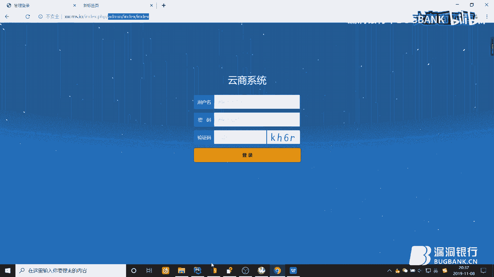
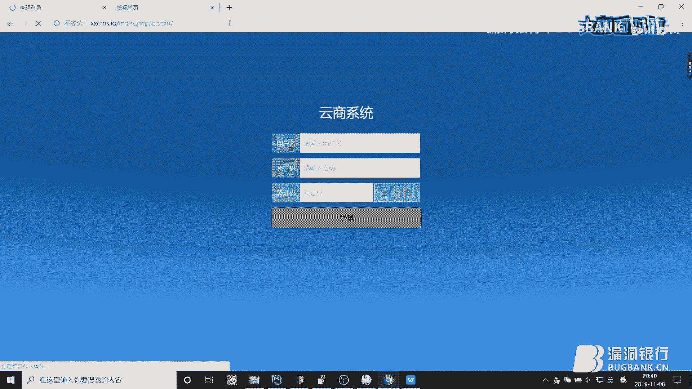
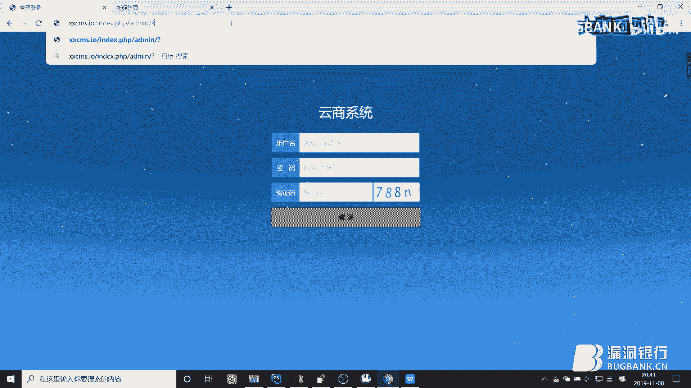
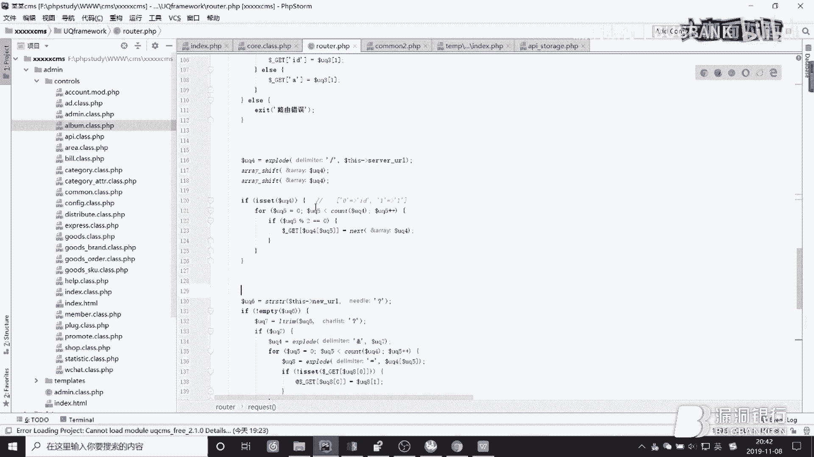
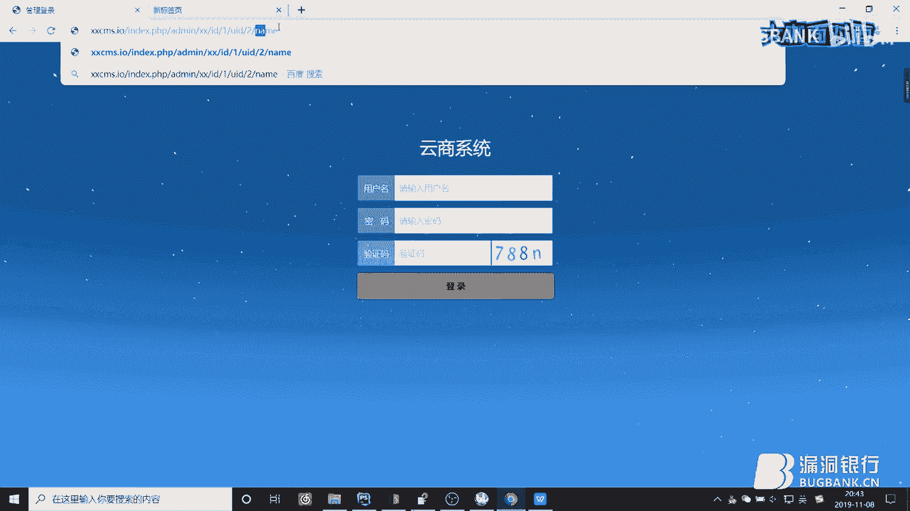
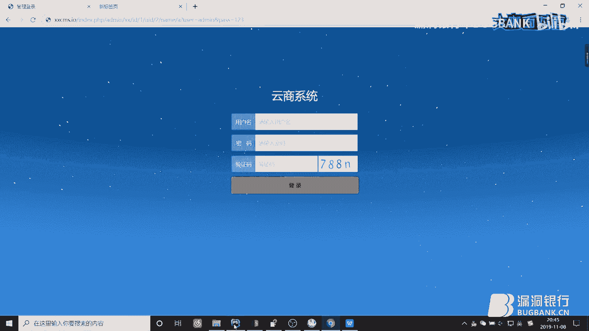
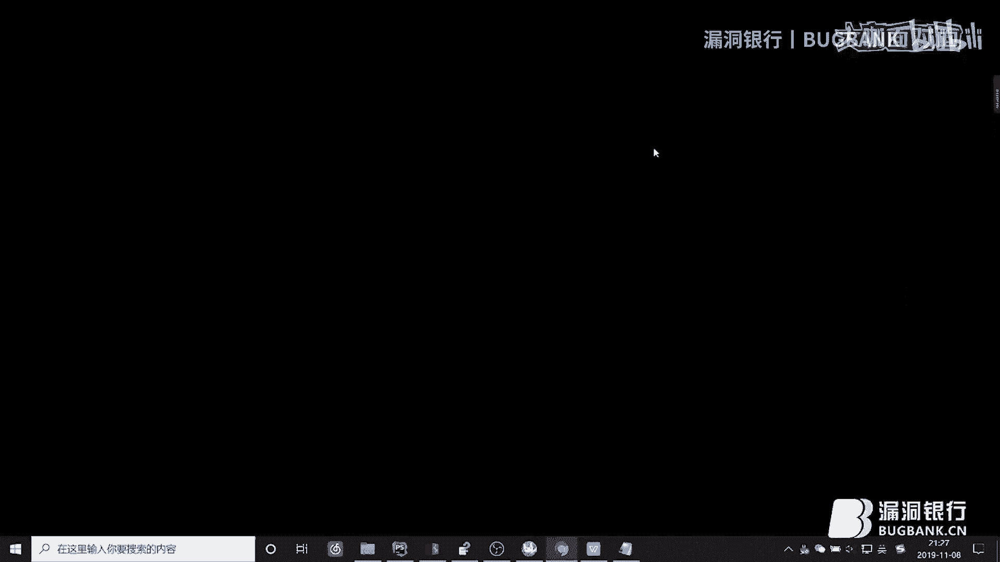
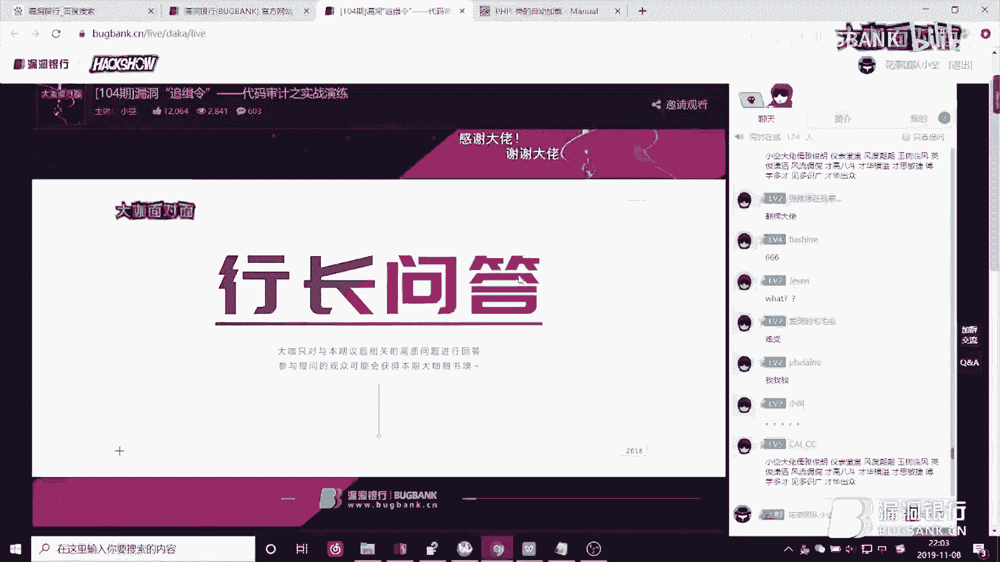
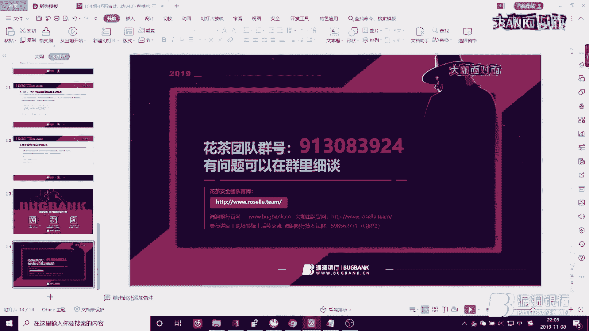

# 漏洞银行丨代码审计之实战演练-小空丨咖面104期 - P1：104代码审计_x264 - 漏洞银行BUGBANK - BV1xJ411D7qr

(音樂)。

為知舌存，應技舌生，各位小夥伴們，大家晚上好，歡迎參加第104期，漏洞銀行安全技術直播，大咖面對面，我是今晚的主持人年念，今晚要給大家做技術分享的大咖，是來自花茶安全團隊的小空大咖，他帶來的議題是。

漏洞追擊令代碼審計之實戰演練，熟悉掌握PHP代碼審計的他，今晚將從MVC模式解析入手，逐步結合實力分析代碼，更有精彩的實戰演示，感興趣的小夥伴們，可以記得聽到最後哦，同時歡迎各位小夥伴們登入直播間。

在聊天區進行交流互動，聽講的過程如果有任何疑問，可以隨時在聊天區提出，在演講完畢後，大咖特假行長問答環節，集中解答小夥伴們的疑問，同時呢今晚的聽講福利，也將在問答環節結束後，挑選一位新的觀眾。

送出小空大咖親自挑選的書籍，內網安全攻防滲透測試實戰指南，那麼下面就讓我們有請小空大咖，開始今天的直播分享吧，好那開始今天的分享了。

首先說代碼審計，肯定還是要說一下什麼是代碼審計，就為了照顧稍微比較網路們一點的，代碼審計他顧名思義就是對，原代碼的安全性就進行簡略，因為他相對於黑盒測試是什麼，你可以直接看到原代碼。

可以在看的過程中熟悉一種漏洞的原理，也就是直接看代碼，然後還可以對他的有什麼缺陷，可以稍微就進行挖掘一下，他的好處就是有利於漏洞的挖掘，並且熟悉整個開發的流程，還有對這些功能的調用。

然後及一些當你看多了之後，他就會有一種經驗了，像這就說的很明顯了，當你看見這個你知道可能是下載，然後第二個是常用的方法是什麼，常用的方法肯定就是通讀全文和回溯，開始先說我們今晚上的方式就是通讀全文。

然後回溯的話，就是當你搜索一種敏感函數，就是在網上的文章中，肯定也有很多那種，就關於什麼代碼審計的總結，他裡面就會就給你列出一些敏感函數，就是一些有漏洞的，就當你通過你的輸入。

然後經過了他一系列原本的操作，原本對數據的處理之後，來到了這個洞，如果可以控的話，可能會造成他的漏洞，就是他這種去利用回溯，然後通讀的話，他通讀有一個大家都知道的缺點，也就是不太喜歡他的原因。

就是因為他很會時間，而且可能你通讀完下來之後，你發現80%的代碼，好像和你要挖的洞並沒有什麼關係，就但是雖然說他很會時間，就但是他有利於你對這個程序的把控，這個其實是比較重要的，然後你通讀多了之後。

你也對經驗的積累會很多，然後也效果很好，通過回溯的話，就經驗的積累會少一點，然後怎麼應該怎麼找什麼程序來念手，就是直接找一些稍微老一點的，像什麼2014年，15年的16年的都可以。

然後其他的就找一些比較小的，就是你別去找那種，一個程序就直接100多兆，200多兆的元碼他很多，然後你看著會很累，盡量開始的話，先找這種小的，然後和一些老的，還有就是找就盡量找一些那種。

沒被別人發出來過的，就假如別人發了出來，你對著他的文章去挖這個洞，可能會效果，我感覺可能效果會差一些，就是首先你沒那麼有成就感，就當然就對一些很經典的漏洞，你肯定還是要去看的，就是很經典的。

他就是怎麼成型的，什麼肯定還是需要去看，然後我們就開始，我們今天的那個我這選的一個比較好，就是一個比較小型的，他是一個人開發的一個作者，他就直接就開發出來，然後就是想先開發吧，他就是一個人開發。

所以問題稍微也比較多，然後我們今天說的目錄就這些，首先你看好，首先是第一條，當我們拿到一個程序的時候，然後現在基於MVC的，MVC它是一種設計模式，也比較好，所以現在比較多的主流的都用了MVC。

所以基本上拿到一個程序之後，你把它用一個編輯器載進來，它肯定會是這種，會有很多目錄，這些目錄之後，它下面它不會像原來那種有很多文件，它這個就一個文件，入口文件就一個入口文件。

然後這只是一個安裝的入口文件一樣的，這個一般的話就一個，因為安裝的可能會被刪掉，然後這就一個入口文件，你看說到入口文件，其他的話就假如說其他一些，像這個modem，modem目錄，目錄下面的一些文件。

你看它首先會有一個限制，你限制你直接訪問的一個代碼，這個就是說，你必須得從這個入口文件訪問過來，不然的話它會直接給你退出掉，就是當第一個，這個長量沒有被定義的話，會執行後面的語句，就是會給你直接退出。

這種是防止你直接訪問的，你看這種就是MVC，一種單入口的一種限制，它知道它會給你限制掉，不管就是你直接訪問，它已經不行了，那麼我們就只能從單入口，然後單入口你看這樣，MVC中各個M、V和C的值。

它的值者是什麼，M其實就是模型，就是model，就是叫做model，model它是模型，它主要是負責和數據庫打交道，然後負責數據庫的增傷改查的，像你登錄，舉個例子，就是當你登錄的時候，你前台頁面。

只是給你展示出了一個視圖，就是用作HTML要給你展示出來，然後我們傳過去的是傳到控制器裡面，就是當我們的數據，你輸入的傳到控制器裡面，然後控制器在，它最好的就是把數據，直接拿到model中去查。

查有沒有或者夠不夠，有的話給你返回一個，儲存到控制器裡面就好了，這個model，然後model主要是和數據庫打交道，控制器它主要是用作M和V之間，model和V之間的一個橋樑，還有就是用戶。

我們用戶直接訪問的，都是直接訪問的控制器，而不是直接訪問的model或者視圖，它這個就是你看，這個一張圖，它就這樣，用戶直接訪問控制器，控制器和model打交道，控制器和視圖打交道，就這樣。

這個就是M和V中的各個職者，然後你要詳細了解它，你還是需要你自己，私下去看詳細的文章，然後這個我已經說好了，就是當很多不是很多文章開頭的話，它會給你解析一遍，這個目錄幹什麼的，第一個看肯定就是。

當如果你不全文通讀的話，你可以看一下它是幹什麼的，你需要全文通讀的話，你就可以就不必那麼仔細研究，它到底是幹什麼的了，因為你肯定會涉及到，好我們這種通讀的話，現在就開始下面一個，就是當你通讀的時候。

這個MVC是怎麼驅動的，就是通過這個，這個index這個單入口，單入口進行驅動，這個就是我從CI框架中扒出來的，它是首先從index。php這個入口，它會來到一個路由，路由功能。

它可能會對這些路由功能的，一些傳的參數進行檢測，就避免你什麼，你直接去調用一些，它不讓你調用的核心內，核心庫什麼的，然後路由進來之後，就直接操作了這個控制器，APP應用的控制器，在控制器裡面。

你看它會和這些model，和一些核心庫，還有助手庫公共插件，這些打交道，打交道完了之後，它會把這些數據處理了之後，給試圖，試圖最後還給這個主頁，然後這個主頁就給我們顯示出來。

其實這試圖直接就是給我們顯示了，它反而會給主頁，給我們顯示一樣的，好這個看完之後，我們就直接看這個，這個現在能看清楚嗎，就是這個，這個才是今天主要要說的，這個是能看清楚是吧，我知道我沒看那個。

就是如果有看不清楚的，年齡就稍微看一下，就是看一下那個直播間的留言，好的，好的謝謝，好我們今天就開始，我們今天用這個實戰的，因為它是剛開始已經說過，就是用一種稍微老一點的，小一點的這個比較小。

但是它很新，它也是每天都在更新的那種感覺，好我們現在從這開始，首先剛開始的時候，它肯定會初始化一些常量，或者一些什麼，你看這它初始了，它的名字是什麼，它的類型，然後初始了一個admin，它的值。

這些就是初始一些常量，其實剛開始的話，今天還是看一下，你到後面的話，你就可以直接這些不用看，後面你遇到你再回來看就行了，因為你看了之後可能也記不住，然後這它定義了一個絕對路徑。

就是我們這個根目錄的絕對路徑，它定義這個是為了，在後面你看像這些地方，加著一個文件的時候，它用絕對路徑是肯定不會出錯的，如果用相對路徑的話，可能會因為就包含了導致，就是稍微會錯位那種感覺，就是會出錯。

然後錯了之後，它照會有第一行就是，判斷你是不是安裝，然後再判斷你這個是安裝所，如果不存在的話，就給你挑單安裝，挑安裝的話你可以看一下，它到底有沒有我這個安裝過，你就去安裝所裡面，有沒有那種判斷。

就是如果你安裝過給你退出，這個是沒有的，你看你就直接來到這看，它有沒有它這確實判斷了，如果文件存在會進入這個判斷，但是裡面沒有任何處理，如果你說你存在你進入之後，你給它來退出的話，這是沒問題的。

但是它這是沒來的，它是沒有這個的，所以這還是有問題的，但是以安裝來說，這個網站反正破壞比較大的話，我自己是，是不會太喜歡神舟的，就是感覺好像限制比較大，然後照我們就先不管，照這個就是它判斷你安裝。

你可以就是如果你對那種，比較大型的肯定是有用的，對這種小型的沒必要看這種東西，然後就會來到這，你看這個就是它的根目錄，如果你不知道這個是什麼的話，就是你第一次看，你會有難度的話，其實不可能有難度的。

有難度只是因為你p2p可能沒學，你看首先我們你用難度的話，你就把它輸出一下看一下，現在我們這個是什麼，好你看這就已經輸出了，這個就是它的根目錄，它的根目錄第一個輸出，這樣就看的是它根目錄。

後面就這種就不再輸出了，因為感覺有點拖時間，然後它會加在這個框架，UQ分，沒有我看嗎，這個框架後面這個框架，它會加在這個框架裡面的，core這個核心內文件，然後我們它在這裡面就開始運行了。

你看首先它會定義一個，就是設置網頁的編碼，它怕就是因為編碼不統一導致亂碼，然後這會設置時區，這個是設置它運行這個的初始時間，然後這個是個長量，在windows下就表示這個順寫桿。

在windows下的話它就表示，這個是目錄分割符，在windows下它表示反寫桿，然後在linux什麼下的話，它就表示，它就表示這個順寫桿，然後在這它會定義這個inUQ等於等於處。

你看就印證了我們剛開始說的，那個它防止你直接訪問，這它不就定義了嗎，就是說如果你從這個訪問的，這個文件是可以訪問的，你直接訪問是不行的，然後這又定義了一個框架的目錄，然後這前面的它都是一些初始化操作。

基本上你都會看到，你隨便看哪個基本上都會看到，然後這一開始你看，它現在在這已經include一些文件了，include這個框架下面的，框架目錄下面的這個com，這個公共文件，公共文件你看它的樣子。

應該是知道它應該是一些函數庫，你看它會在這裡邊寫一些函數庫，寫函數庫這種包含函數庫的話，你只用看一下它的首和看一下它的尾部，你就看有沒有什麼調用的，因為有的可能它會這樣調用，就是它會在尾部可能會調用的。

如果你不看可能會導致你疏忽掉，就是看一下首和看一下尾部，中間基本上不用看，它不可能說這種函數庫，在中間還寫一些會實現的代碼，會直接執行的代碼，然後它後面又會加載第二個函數庫。

它可能現在第一個函數庫有點大，你看或者分類，你看它在這又加載了第二個函數庫，還是一樣的看一下首和看一下尾，它並沒有函數的調用，那麼你先把它記著就行了，就是照法再加載兩個函數庫。

後面如果有函數找到了這裡邊，你就別想它到底有沒有加載了，它加載過了，然後在第三行這行就比較重要了，這行就說的，你看這行就說的路由中的解析，就是它會解析路由，就類似於當我們你看。

當我們知道隨便我傳一個什麼東西，然後我就叫我隨便搜索一個關鍵字，對吧，你看搜索一個關鍵字之後，它照會有銀行代碼，你看你看的話，你感覺看不出什麼，你說為什麼故事後面會有個問號這種，它就是類似於這種的效果。

就是它會把你這個給你處理掉，並不是說你這個傳進去，它直接就怎麼把這個就給你變成了文件，你直接能訪問了，它就是傳了個這個進去，然後你就它路由就是會處理，我現在藍色的這一部分，然後路由這個是個路由。

還是得看一下，你看一下這個肯定裡面是有東西了，好路由的話它還是一樣的，你看有一個類類，它自己是不會調用的，肯定需要你去實例化，或者是訪問一些進台方法，你看還是我們剛才說的自己都不會調用。

但是我們需要看一下手和看一下尾，因為怕他調用了，你看他在尾部就直接遛了這個類，對吧，我們看這個尾部就看見了，他遛了這個類，然後這裡面就是對路由的一些處理，我們等會來會分析的，我們繼續往下走。

如果你看第一個uqcms pass的話，它是在這定義過了，是一個我們知道它這定義過，但是這個東西我們前面，這一行現在不看的話，這兩個裡面是函數庫裡面沒有實際代碼，沒有會運行的代碼。

這上面並沒有這個東西對吧，這個是個常量，並沒有就是在這些上面並沒有它，它是在這裡面定義的，也就是說你必須得去看這個了，看這個它剛好在這實例化，我實例化了一下，所以在這裡面肯定是能找的。

當實例化這個類的時候，他肯定會調用他的構造函數，調用這個調用他的構造函數，然後往下走，他會繼續我們繼續把後面的先說一下，直接這又涉及到了自動加價，我們還是直接說這個，說他的路由，好。

現在我們就去分析他的路由，先把這兩個給他關閉掉，還有一個地方就是，我在公共函數庫最下面寫了一個，自定義的函數就是一個dop，他就是他只是一顆的兩個標籤，一個p2e就是把這個宿主原樣打印出來。

你沒有他的話，他打印出來在頁面上是一行的，全部懟著了一行，這樣的話就是原樣打出，就是他會混成那種，好，現在我們來看他的路由，你看在最下面他是6的這個類對吧，6的這個類之後，他在這。

第一行代碼就來到了第一行代碼之後，你會發現又涉及到一個函數cfg，cfg到底是什麼，它是一個函數，他有什麼功能，你肯定得去看他有什麼功能才知道，有的這種一看，其實就知道他是加載配置的。

或者是一個打寫的c，這種c他都是config和單詞有關聯的，就是配置，配置就是加載配置的地方，然後我們現在得去看一下，這個到底這個函數到底實際上是功能，這種是一定要看的，你不能省，你省了之後你可以省。

省了之後你就只有全局收，像每次像這你可以這樣收，全局收他，我有的時候就是有的那種，也不看反正就是直接全局收，直接就說因為，你就這樣直接能全局收什麼的感覺，然後你再收的他是個0對吧，這其實並不是一個0。

你需要去看他，你看現在我們就看這個配置，這個函數，好來到這個函數，他來到這把這個關掉，你看這個是一個函數，首先他默認他為low，然後這定義了一個靜態變量，靜態變量是在這個整個加載流程中，都可以實現的。

而並不是都可以用的，然後這如果他為空的話，他會照靜態的，就是直接寫在這裡面，會給你寫這麼多配置進來，然後他會繼續判斷這個文件，你看這個UQCMASPASS的話，就是我們因為剛才已經在主頁看見。

他是根目錄下面的data，這個數據裡面的，這個表示目錄分割幅，因為windows和linux他不一樣，他只用這個直接兼容了，然後下面有個uc有嗎，沒有沒有這個文件對吧，沒有的話，你看有的話。

他會直接給你包含進來，然後把你便利一下，然後全部再付給這個靜態變量UQ9，然後沒有的話，沒有的話他就繼續又往下走了，然後他會判斷第二個，也是你看根目錄面下面的這個，下面的config下面的這個文件。

你看他裡面就是有，就有4個配置，就是如果是的話，他會把你包含進來，給還是給這個變量的這個鍵而已，如果沒有了，沒有他這其實就是一個操作，就是他會執行一個查詢數據庫的操作，你看這個已經很明顯的看到。

他這有一個cisco語句，這種口直接能看的是比較簡單，還有一種是面，m模式，就是這個叫面向模型嗎，數據庫面向模型，然後他就類似於tp的那種，-v-什麼的那種，你看我們現在知道這個是查詢數據庫，先不用管。

反正我們看了語句知道查詢了這個表，好查詢了這個數據庫之後，他會把這裡邊的值取出來，給你反訊給再給你反訊，要化成成字符，成數組或者字符創什麼的那種，應該是反訊的話成數組，你看成數組之後又這樣付。

其實這就是從數據庫裡面取知識，取這個文件出來，把這些內容取出來之後，重新給你寫在這裡邊，就是當你第一遍，第一次執行他不存在的時候，他會從數據庫取出來，然後再給你寫在裡邊，為什麼他會寫文件了。

這個是類似於反存，因為他知道你數據庫的配置，你網站的配置一般你不會改對吧，所以他就可以寫成反存，這樣的話可以加快速度，下面是一樣的道理，你看他又會訪問這個，這個事情他這裡面配置有點多了。

他還是會首先判斷他存不存在，存在給你包含進來之後，給你付給靜態變量，不存在的話繼續從數據庫找，找出來之後又給你寫到了這個文件裡面，你看這個文件就是他剛開始判斷了，是否存在的這個文件，對吧。

他這種就是你第一次，如果你沒安裝的時候，他可能是這些文件沒有，你安裝了之後可能就有了，就是他會給你這樣寫出來了，然後寫這個是寫成反存，然後有的就是寫文件操作，照理講這個有個這個行數。

他和Dopple是一樣的，只是他這個更安全，他這個他就是他這個的話是會對單一號轉譯，就如果單一號雙一號反斜槓都會轉譯，就是如果你想寫文件，你可能會需要逃逸單一號，這樣的話是逃逸不了的。

然後又繼續下面的是一樣的意思，你看這他會碰到這個開發者模式的配置，是否存在不存在的話，他就默認把你這個給你設成關閉了，你看這個東西，這個配置是在前面這寫定時的有的，沒在這裡邊，那就在這裡邊。

你看沒在這裡邊，因為我們知道這個文件已經加載了，你看他是在第一號，就這樣的，就是他會照著會關閉這個錯誤的顯示，然後後面你看這重寫，你看這，現在這下面才開始涉及到了這個路由的這個東西。

其實啊他應該最好就是把他應該寫的路由這裡邊，可能會稍微好一點，就是把它分類分好一點吧，然後他寫到個函數這裡邊，你看現在好，我現在我們開始下面的是有關路由的了，就是有關解析的url的，有關解析url的。

好現在你看現在看第一個，現在這其實剛開始你可能會疏忽他而不看，在後面你還是會看回來了，我剛開始我也開始沒看到後面還是看回了，你看首先他會判斷你這個，Server這個超全局數組中的這個。

是不是如果你是阿帕奇的話，在這個他裏面就會存在阿帕奇這個東西，他就類似於我，想到這點吧，PHPinfo，你看現在是PHPinfo的話，這個直接不懂查百度就可以了，直接你看這個你看是不是我這是阿帕奇的。

我這是PPP是body的，然後阿帕奇他會匹配到阿帕奇，然後匹配到阿帕奇之後他就會進這裏邊，然後下面這個呢這個東西是NGK是有的，阿帕奇沒有的就是如果你不是阿帕奇，他就認為你可能是NGK或者什麽的。

他就會用這個來獲取，這兩行代碼效果其實是一樣的，只是他稍微區分了一下服務，你的容器，你看好現在這一行，因為我是阿帕奇他肯定會進這裏面，進這裏面之後他首先會匹配這個，就是我們訪問的那個文件。

就是我們訪問的那個，Index，好你看當我這樣訪問他的話，我還是在這讓他輸出，你看他就會獲得這個東西，這個東西就獲得一個斜杆之後的，主入口文件獲得主入口文件之後，這個run去掉右邊的。

就是直接給你去掉之後，你如果在模糊了一下，你就可以給他打印了，剛開始我們說的在公共行事裏面，說的那個就有用了，那個Drop這個就可以用著了，用著你可以打印他一下，看著會稍微有那麽一點小風格。

你看他就是一個小斜杆，現在綠標照他只有一個，他其實確實只有一個小斜杆，你看他斜杆之後，他下面這個操作，他又是將左去掉，將右去掉，將左去掉，你直接去，你直接去掉我就行了，你看他這他又會有一個。

就是直接把你斜杆給你去掉之後，這個東西變成空了，如果不為空的話，他還會用這個獲取的，我們這是為空的，因為已經去掉了，他這個就是判斷，你是不是在指目錄下面，因為我這個是直接建在網站，就是有個域名給他。

如果你是指目錄的話，就是他建在一個其他的目錄下面，他會進這裡面，這個東西就不會為空，然後他會將前面的給你截取掉，好，現在我們進到就是這裡邊，這裡邊看過的人都知道，這個是什麼。

這個就是獲得我們URL的地址，就是他會獲取你這個域名之後的連接，然後和警號之前的連接，這個警號他後面是會，後面是獲取不到的，就是秒點，他會獲取你域名之後和警號之前的，就現在我綠的這一部分。

他會獲取這個東西，你看他百分27就會獲取他，如果我們現在因為這兩個是，這個已付判斷進了同一個地方，那我現在我把他，好，現在我在這，我把它打印一下，用剛才我那個vrdump，我用dump打印他之後。

我給他退出一下，不然到時候感覺可能又擠在前面，我給他退出一下，現在我們就知道我們UQ27是什麼了，你看現在我在這，沒退出嗎，還是沒來到這，UQ27應該是，我還是因為微空嗎，對他這還是不對，我這有URL。

稍等一下，我看一下他問題出來了，打印應該是可以打印的，因為，為什麼沒給我打印這個，我打印了剛才可能，因為可能因為有這個他不能執行，其實是打印了，你看這就剛才或者說我這個沒什麼，你看他就打印了。

這個因為最開始這個已經被替換過了，他其實是獲取域名之後的，這個只是已經在這被替換過了，在這有一個替換就是這，給你替換掉了，這個index的點，這個然後這又把首尾的斜槓給你去掉了，所以就只剩下。

你看這個他就獲取了，這個index的點php斜槓，在之後的這些內容，然後我還可以在這隨便講，你隨便講什麼都可以，我還可以加一些隨便加一些，你看他都會原樣給你獲取下來，他給你獲取下來之後。

他後面他就開始對你獲取到的，已經就給你操作了，他就會現在就會操作你這個東西了，你看現在前面的執行的這些就是獲取，目的就是為了獲取最後面的綠色的內容，內容獲取了之後，你看他這他會有兩個判斷的給你進來。

這個是為了拼接你域名，這會判斷你是不是https，是的話再拼接一些域名，然後這個為他，你沒收過他是什麼，好現在有個26%，26%你要點著他，你要往回看他來自於哪，他來自於，這有我這就有。

他就是26%的話，其實我們最開始在這輸出的，是不是為空如果為空的話，他確實為空，這的一系列操作，他就是為了拼接這個域名，好拼接這個域名，他會一直來到哪，這個函數原來都走完了，走完了。

其實後面也是一些實際的，就是一些給配置，其實這已經走完了，我們都關他，這裡邊關鍵一步就是為了，這個就是為了獲取你的UI地址，UI地址，然後現在你看我們現在來收這個，因為你大概先看一下之後。

你還是得根據你的需求去看，你就好帶著需求，就是我為了查這個東西，好為了查他，現在你看到他來去，這樣查到是在後面沒有，沒有再對他進行處理的，然後就他其實是來自於那個UK27，然後UK27。

就是我們在打印的這個東西了，所以也就是說，我把這個不給處理，也就是說他這個屬性，其實就是我們獲取我們URL的地址的，一樣的一樣的，我來打印一下，這個其實就是為什麼讀全文會稍微累一點，就是因為他會挨著讀。

你看他就在這，因為後面我們退出是下面又顯示出來，就在這他這個他就是獲取的，這個URL，就是獲取的我們的UI，就獲取上面，然後我們知道他這樣獲取了之後，我們繼續讀這個，你看他開始對這個進行處理了，對吧。

首先他會用這個問號，來給你分割成一個宿主，他為什麼要分割成宿主，就是怕這種這樣，這不是傳了，或者說我就在我直接不傳，我就這樣，我就還是繼續用斜槓，一直讓他用斜槓，用了斜槓之後，我在後面我在傳都可以了。

像A點什麼他都可以了，這樣一樣的意思，因為這個肯定是我瞎輸的，肯定他頁面上不會有內容顯示出來，是一樣的，如果你在這打印的話，他肯定就是他，然後他會給你分割成一個宿主，這個宿主中有兩個，就是根據這個分割。

如果這個0的話，就是問號之前的，還是拿回我們最開始的，這個用這個來說吧，用那個問號，那個搜索框的那個來說，好這個搜索框，他會給你分割，分割之後就是兩塊，一塊是他現在這個綠色的，一塊是後面的這個。

如果不為空，就是如果這個零件，問號前面的如果不為空進來，他會判斷你是不是等於這個，下載，download的，如果等於這個download的話，他會默認把這個地址給你，這個地方就有點像那種，註冊路由的。

你就可以在這給人，就給他註冊路由什麼的了，就類似於他這就寫的註冊路由了，一般這種的話是分開一個，我寫一個配置文件，他這沒寫，他就寫的這，然後他會判斷你是否，這裡面有html，就是偽靜態。

就是這個是手動給他加上去的，你加上你可以在這個地址，這直接給他加一個不影響，為什麼不影響，因為在這他會給你去掉，他會如果匹配到了，就會把這個點之前的，函數會處理這個匹配的，然後到匹配到之前的。

給你返回來，因為第三個參數在已經有過注釋，如果不知對這個你看見的話，你可能會忘了，函數有的時候會幫你去去收，你就隨便收，這個是php的手冊，也可以在直接在百度上收，就是這樣，這個就收到了函數。

然後再看這個是uq2，因為我們這個，不管你其實你不管你匹沒匹配到，這兩個都一樣，今天匹配到給你去掉，沒匹配到就直接返回，把原來那個返回給你就行了，就這個uq0，給你的之後繼續往下。

你看現在他又會判斷這個uq2，是不是你看就假如，uq2他首先會給你去掉最左邊的，left left這個，去掉最左邊的一個斜槓之後，再給你你看這去了左邊的斜槓，又在左邊給你添了一個斜槓，他這有點。

然後這他就類似於我舉個例子，我還是用他舉例，就用這個固執，然後後面來個，來個什麼來個來個花，這樣其實他就獲取到是這個東西，你都不用打印，這樣的uq2，他肯定就是這個東西。

uq2肯定等於我現在後面這個藍色的，剛開始的話最好就是還是以以下以打印，因為我剛開始看起來說我也是不打印，我嫌麻煩，然後不打印之後會把自己給繞暈，就是我一直在頭你想，就是他是什麼，我每一步我都記著。

然後一直往下算，去到沒算，其實容易把自己算暈，然後後面我因為這個是分享，所以還是會自己還是去理過流程的，他uq2肯定等於這個，你別看我再看這麼熟悉，其實我是看過了的，我已經看過了的。

所以這說的稍微比較簡單一點，然後他又去掉之後，又會在前面給你加一根，加根線也變成了這種，變成了這種之後，他又會用斜槓給你分割成竪竹，也就是說這其實是三個件的竪竹，還是給他打印一下，其實打印最實際。

還是退繼續給他退出，你看現在我訪問他，他是不是三個零件為空，然後一件是固著，就是第一個斜槓，然後第二個花，就是問號之前的第二個，如果你還可以再給他加，你可以再給他加一個qwe，你看又會來第4個。

不管你怎麼，他都會後面給你從，疊到後面就行了，然後這個是去掉，去掉是第一個，把第一個給你彈出來，然後他就是定位符傳上，你看這個是將他的開頭移出來，然後他的內容是直接是用定位符傳的，所以他又會把第一個空。

就是其實這沒必要，沒必要用這個，然後這個也可以算，他自己寫就是這樣寫的，這個是給他注釋掉，你看就像我們這樣，你看他又會把第一個給你去掉，那麼最後又變成只有這三個，就是你空的會給你去掉，實際有的給你用。

好然後會來到下面，你看他就會看，UQ3中的零件是不是等於admin，如果等於admin，就固著是不是等於admin，等於admin，他就會認為你是登錄的，因為你看我們這是不是有幾個目錄。

第一個目錄是admin目錄，然後這個data是數據目錄，咱不用管，這個是home目錄，大家也知道這個是前台目錄對吧，這個是後台目錄，後下面還有一個cell賣家的目錄，這還有個web，手機的目錄。

你看他就會判斷你第0個是不是，如果是admin的話，他會是認為你是訪問admin，是web他會訪問這個目錄，然後是這個cell，他會訪問這個cell，cell，然後後面如果默認，就是你這幾個你都不符合。

他會訪問默認訪問前台，訪問home對吧，所以你看他如果是的話，他還會有另一個操作，就是首先，他會定義這個uqms app，是不是我們在找的這個變量了，是不是這個，你看他這個是不是一樣的，對吧，對吧。

現在我就找著他人了，你看現在就找著了，然後找著了之後，他這還會有，因為他不可能說定位一個，這個就完了，他後面肯定還會有，覺得還會有對你，我們這個路由，好，你看現在是，而且剛那個卡了。

就是他在處理這個斜槓之後，他會，因為我們剛開始在這說了，他會根據你這個斜槓，而給你分目錄對吧，你看現在他會，在會給你分三個東西，但是這三個東西分了之後，他幹有什麼用了，他在後面會接著就給你分。

就是你每個幹什麼用的，他會跟你說，你看你如果第0個，因為宿主下標是以0開始算，第0個也說我們綠標的。

這三個東西綠色的，這三個第1個，第1個admin的話就給了你這，是給了你定義了。

這個UK3SAPP，就定義了你這個應用的目錄是哪，你看在這就找著人了對吧，在這就找著人了，因為他方面後面有個文件夾雜，這就找著人了，然後他會接著會對你進行截斷，把前面這。

既然你這個已經就給你分配好了位置，肯定會把你去的，那我就不管你了，那後面把你去了之後，後面的同學就再依次來進行分割，再依次來進行排位置，就這樣理解，然後我們還是再給他，把這兩個都給他打印出來。

他為什麽他這還會有個優客，還會有個這個東西，他是為了方便後面，後面他還會對這個有個小處理，那現在我繼續給他打印出來，你看看這，如果我訪問他的話，他會第1個是一個字符串，第2個是個宿主。

你看他就會把這個已經把admin，同時會把admin，不管是字符串中給你去掉，還是後面宿主中，都會把這個admin，就是第1個已經給你規定好位置，那麽我就不用管你了，就把你去，我就照顧後面的了。

所以就把你先給你去掉，後面的再處理，你看對吧，這兩個是對應上來的，好繼續，現在我繼續往下，我點錯了，好現在我是把它注視的，然後繼續往下，這其實是已經已經好了，就如果我們的斜槓之前的，第1個東西。

如果能匹配到admin，web還有這個cell，如果能匹配到這三個的話，他會依次給你定位這幾個，這三個長糧會給你分別，就是你匹配哪個給你定哪個，如果都沒匹配到，他默認是訪問前台控的解惑。

然後這之後他會來到這，你看現在是UQ3，UQ3就我們剛才打印的，UQ3就是這個宿主，然後這還有一個UQ2，UQ2就是我們這，也是我們這打印的，也就是第1個字符串對吧，然後繼續往下，他會把這兩個東西。

分別付給這兩個屬性，付給這兩個屬性，為什麼要付給屬性，因為你在那種方法中傳遞的話，你只能用屬性來傳，你不可能說我在這裡邊，我直接這樣，直接就在訪問你這個方法，不可能訪問你這個邊梁不可能的。

然後在這個中他就會，你看他就通過屬性來傳，傳了之後，現在這前面初始化，還是前面這些還是叫初始化，因為這種單入口的，開始會初始化很多東西，然後初始化之後，這開始稍微有一些，方法的操作了，你看他這會有一個。

request會有一個，發送你看他會拿到，U2L的pass，U2L的pass不就這的UQ3，UQ3就是我們這上面的這個東西，對吧，然後UQ3之後，他應該不是UQ3，而是下面的應該是UQ3。

UQ3應該是下面這個宿主才對，對應該是宿主，因為他這是宿主，確實這是宿主，我開始看錯了，這是宿主UQ3，UQ2就才是字符串，就在這個，這個是UQ2，這個是UQ3，好你看他會來這個，他首先會判斷你的。

你就是第一個東西，和第二個是不是都為空，都為空的話，默認就給了你兩個默認的。

像我們這如果不傳admin的話，他自己會給你加兩個admin，會加兩個index的進去，這其實後面加了的。

就是因為這，他會如果兩個都為空給你默認，如果第一個為空的話，就給你第一個，第二個就給你默認，如果兩個都不為空，就分別去付給你，你看這就是這個，就是判斷一些默認控制器，就當你不傳的時候。

他會默認給你一個控制器，這就給他這個，如果這個第一個不為空，第二個也不為空的話，你看他照，首先會把零件付給這個變量，你看這是把那個，gat給重新寫了，就是說現在照的gat。

這個gat-m，而並不再是我們照的，這個輸入一個m了，這樣並不是，並不再是這個東西了，因為在這已經被重新給你複製了，那麼他原始的那個就變了，重新複製了之後，這個是控制器，然後這他會判斷你這個方法。

如果這個方法是數字的話，16進去和那個都可以嗎，然後7之後只能是數字了，就是判斷你這個方法，如果是的話，直接付給這個id。

就是如果你第二個是個數字的話，他會給你一個方法，默認方法，給你變成這個默認的方法，然後數字付給id，但是我們不是，我們他就會直接付給，就是說如果我們傳了三個東西，第一個東西是admin的話。

他會認為你是要訪問這個目錄，然後這個a表示控制器，就表示這裡面這個控制器，下面的這個文件，為什麼他會在這下面，他等會在後面還會說，然後這個a就是裡邊的方法，好就這樣，他這個路由就這樣。

現在我們已經大概把他路由看清楚了，然後他會用這個，然後下面就是分，就是分目錄和分那個控制器，和分方法已經分好了，後面他還會有一些操作，因為他這樣有你就要看，他這個有個server ui。

他還是來自UQL，UQL就是我們剛才說那個，一行字符串，一行字符串那個，然後他會首先給你打平，用斜槓給你分成一個宿主，然後分成宿主之後，他會把前面兩個給你去掉，前面兩個就是這個方法和控制器。

給你去掉之後，然後在這再判斷，如果你還有，就是如果你去掉之後，你還還有東西的話，就類似於這種，他就會給你寫到這裡面來，就是為什麼那些偽金泰不是有的。

有的人看見那種，他是有什麼偽金泰，像這他是這個1。html對吧，然後但是在這加個代號，這就可以注入就是因為這樣。

他在這他會直接把你這個，給你分割了之後，重新給你寫到這裡邊，就get裡面，然後分割了之後，他會判斷你這是不是有，有的話他會進來，進來之後除以2等於0，就是能整除的，為什麼就是求余，他余0的話。

為什麼余0，就是想判斷你這個必須是雙數，就是我知道我必須傳送雙數進去，就假如我在id-1，那麼他就是id-1，或者一個uid-2，然後再有一個內膜，這個內膜後面我不幹了，就是然後這個內膜就會被去掉。

就不會要，因為你只有一個，你後面你沒有值，他就會給你去掉，就是因為這樣，他會如果能除2能整除的話。

就可以就余2等於0的話就可以，然後後面你看剛開始就說的，最開始這個東西，獲取的那個url地址，後面這樣又會判斷你，是不是能匹配到這個東西，這個問號如果匹配到了，他就會把後，問號後面的給你拿過來。

這個是拿問號後面的，給你拿過來之後，把問號去掉，去掉之後，再根據你這個連接符，為什麼連接符就類似於這樣的，什麼user等於admin，然後underpass等於123456。

你看他就會把這個問號之後的東西，拿過來，就是現在是我現在綠色的這一行，拿過來之後，會根據你這個，你看就這不是和他對應上給你分割，分成兩個一個宿主，這個是分別是一個宿主，就是兩個他是一個宿主。

然後這個是一個鍵，這個是一個鍵，然後又會用這個給你分，就把這個問號又給你分一下，現在就分成宿主之後，然後再這樣給你，就是一句話，把你問號的這個東西，再給你附重新附給這個，那麼這就是把那個git連接。

重新寫了一遍，就是重新寫了一遍，就是把兩個整合在了一起，把問號之後的給你整合在了一起，大家知道這種問號之後，直接就獲取，然後前面的又給你整合，整合到了裡面，然後整合到了裡邊，這個方法就分析完了。

他裡邊就是，我不管我是通過問號傳，還是通過前面都可以傳git了，那麼傳了git又有什麼用，這一個U-Quest的安全，那麼看他感覺就像是那種。

稍微是那種攔路虎了，你看現在是來到這，他就會繼續判斷你叫git，你看這個git就是我們在重寫過，之後的git，重寫之後的git，他會把你給你便利券判斷，你這個git是不是。

首先判斷這個git是不是在U-Quest15，裡邊，如果不在裡邊，就你如果不在裡邊，你的值就只能是這些數字，字母，然後等號和下滑線就只能是這些，如果不是這些就錯，你看像我這假如我正常訪問的話。

你看我在正常訪問，然後我還是index的，把那個給他補全補全之後，我在後面我自己添，我添一個，我就添一個ID，把ID等於123一個單一號加個單一號，你看是不是給我退出了，非法也就是說。

git裡邊已經不存在單一號了，那麼他還有一個就是如果我們說，我們假設我們在這裡邊的，在這裡邊就是把單一號雙一號，給你去掉之後再給你加個這個，也就是說git想注入的話，應該是有點麻煩了。

就除非說有什麼解碼編碼什麼的，這種應該少，然後我們這就通過讀這個路由，我們知道了他的方法是，就是他是怎麼調用，這三個目錄下面的哪一個目錄，就這幾個目錄，我們知道了是怎麼調用了。

然後還知道了怎麼調用裡面的方法，現在雖然說不知道，然後我們繼續返回來看，好，現在這個User MMS app，已經定位已經定好了，對吧，就是為這幾個，然後他會繼續往下執行，這涉及到了一個自動加載。

自動加載就是什麼，就是假如像原來的話，你還是不是像這種，這麼多類文件，我是不是每個我既然要調用，我是不是每個我都要包含進來，包含進來就會寫大量的，include這樣的代碼，是不是會寫很多。

那麼他就會為了解決就這種問題，就是看著代碼而不是感覺就很亂，所以他為了解決這個，他引入了自動加載，自動加載就是當你實現化一個類的時候，就當你遛一個類的時候，遛一個class的時候。

如果這個class沒有被，沒有被加沒有被include包含進來，他就會觸動這個函數，會觸發這個函數，這個函數他就會將你的類名，變成這個函數的參數名，然後給你進來，然後你看現在就是有一個。

假如叫session，你看像這他是不是調用了這個東西，session跟這個，我們前面是不是沒加載，沒加載他就會觸發這個，自動加載，然後他會進來，帶著你這個session變量，你看首先他就會找根目錄面。

根目錄下面框架目錄下面class，像這個東西session你看有沒有，有他就會給你，這個文件存在就會給你包含進來，如果不存在他又會去找，就會找這個map，這個東西叫class map，叫就是路由地圖。

就是內地圖，就是如果你在這裡面，他會映射到這個東西，就如果你在這裡面找不找的話，他會映射到，就會判斷你這個是不是設置了，設置他會在這裡面來找，就類似這個app下面的這些，他會這樣來找，如果都找不找。

就會給你報錯了，就會報這個文件找不找什麼的，你看這個就是class，就是當我們實例化一個類的時候，他這個類沒有被加載進去，那麼他就會觸發這個函數，參數就是我們的類名，然後就會這樣來執行。

好這個就自動加載，很方便，然後也比較好理解，然後他有一個session start，session start可以看一下，其實他這個他是重寫了這個session，他用這個，組成了助手函數。

他是這個是PHP自帶的，就是他支持你重寫，就像你要存什麼數據庫什麼的，你可以重寫，然後你只要把他這幾個方法，給他實現了就可以了，然後開關讀寫，寫拉只要把這6個方法，你給他實現了就可以了。

那麼就重寫這樣我們不用管，然後你看這個就自動加載，就剛才我口中說的那個，感覺比較好理解，然後我們繼續往下看，你看這會定義兩個這個東西，也不知道這個東西是幹什麼的，你看他就是定義兩個這個。

然後後面繼續往下看，這會有會涉及到一個類，類如果你沒調，他不會他並不會執行，這個類有個core，core類你看就核心類，核心類這裡面先不用管，就是因為他沒調用，我們先不用管。

然後有個controller，這個控制器類，控制器類他又繼承這個核心類，這個是比較常見的操作，然後模型也繼承這個核心類，然後下面這你看這些代碼，又要開始執行了對吧，你看現在這個UKCMAPP。

是不是我們就知道是什麼東西了，你看他在這定義的，就是跟目錄下面拼接一個，這個東西就是我們第一個傳什麼，就是什麼，像我第一個傳個web，他這就是web，那麼就已經找到了，這就是已經找到我怎麼加載了。

那加載這個web中的，又是他這個名，就是web中他會同時執行這個，會有這個文件拼接出來就是他，就這個路徑，然後這個路徑，這個文件是不是存在，存在會將你包含進來，包含進來之後，會實例化你這個文件。

然後會再調用你這邊這個主頁類，他這個是就類似類似於什麼，就是類似於基於這個web，就是這個模型這個模塊，對現在應該是這個模塊，這個模塊下面，就像前台模塊和後台模塊，這個東西就類似於一個。

機內機內裡面他這個是，說的有點就類似於機內裡面的，構造方法了，他造其實他可以直接就是，並不用這樣，這樣其實是感覺稍微有點，看著比較難受，就是你直接可以把這裡面，控制器裡面的方法，直接就繼承於這個機內。

繼承這個機內之後，你再構造函數裡面再寫什麼，你要初始化的東西就可以了，他這樣他就是先把你，這個就是強行給你包含進來之後，這裡面代碼，然後再給你執行一遍，你看他就是一些初始化的東西，像什麼店鋪關閉。

就是如果沒開啟，或者後台照就會驗證權限，什麼的，然後這裡面就會驗證一些權限什麼的，然後前台裡面也就會驗證會員登錄，這個是類似於一個機內，就是不同模塊下面的一個機內，然後機內然後強行在條文裡面的。

這個方法，他直接可以直接就繼承於他，然後在那個，然後再寫構造函數，你看這裡面又沒繼承他了，這個就是類似於一個機內條用，然後在你看m和a，是不是剛才我們已經分析過了，然後主要看m。

m現在就是這個app pass下面，這個下面假如我們現在，就是假如我們是訪問前台的話，最好還是帶著需求卡，假如我們訪問前台，他會來到這下面，然後給你定義這個目錄，這個目錄下面的一個文件。

你看就知道不是找到了嗎，就假如我在第一個我什麼都不傳，第一個什麼都不傳的話，就這個綠色的admin，什麼都不傳他默認為home，那麼我直接給他看ajx，就是為了對應，因為什麼都不傳為home的話。

這個m第一個就會給m，m就是叫的ajx，ajx他不就剛好訪問到這來了嗎，訪問到這他就被訪問到這裡面來，只是我們再給他傳方法，還有一個就是可能因為他，這可能因為這裡面的，可能會因為就這裡面有什麼限制。

導致我這所以沒顯示，然後這這裡面會判斷你登錄，然後會限制有的方法，不能不讓你直接訪問，我們必須要會員登錄之後才給你訪問，然後你看這，首先我們把這個文件已經給他拼接好了，拼接好了之後是文件嗎。

這會判斷是不是文件，是文件給你包含進來，包含進來之後，這個m繼續用你這個文件名，就給你做類名，然後再給你實例化，實例化之後，再判斷你這個a是不是存在，存在的話就直接調用，就是我會包含這裡面的方法。

然後你傳入一個，假如我第一個傳這個方法，第二個傳他的話，他就會找到這個方法，會找到這個控制器下面的這個方法，然後再給你訪問，再給你這樣調用動態調用，調用之後就這樣，如果沒有的話。

默認給你調用這個顯示頁面，或者說你直接，這裡邊應該是走不進來的，這個應該走不進來，還有最下面的，直接給你調用這個，然後在最下面這兩行，就是看你這個運行了多久，和剛開始那個對應上，就是這樣，就是我們可以。

然後我們知道這幾個，一個兩個三個四個，他路由器是訪問這四個，然後再給你調用，裡面對應如果存在這個方法，就存在這些控制器和方法，感覺一下看下來其實沒什麼用，就說因為通讀你肯定還是最好，就是因為你通讀之後。

你可以對這個程序的把控能力，會比較高一些，不然的話可能你會，會有疑問就是怎麼調用這些文件，或者是怎麼調他的方法，然後通讀下來就有，然後通過這個通讀我們知道什麼，就是知道怎麼調用了。

還有就是他這個git被重寫了，所以git會有驗證，這樣文件打開太多，最好還是關閉，不然會干擾你自己的讀寫，打開確實有點多，路由繼續打開框架，然後路由你看就是一個就是，這git已經被這些攔截了。

就如果牽涉到git的注入，那不用想了，那肯定是沒沒注入的，然後這些你看其實還，好像一下看起來是沒什麼，就當是盡量讀，因為讀了之後，你自己看代碼會順一些，還有會，經驗的積累，然後現在我們就知道這4種。

這4個可以，那麼我們直接看前台目錄，好現在是直接，你看這裡邊，這個是類似於一個積累，積累下面的構造方法類似於，然後他會進行驗證，這會有一些驗證，現在這個驗證你可以，因為是會員的前台，那你肯定可以登錄。

所以這些驗證現在可以先不用管，如果是後台的話肯定不行，你必須要管了，因為你不登錄他不讓你看，這個是前台，既然前台的話肯定是可以訪問的，然後現在我們就來看，直接看控制器，當然你可以像直接拿著他。

你也可以直接看控制器，我當時是直接看了控制器，我也沒這樣去分析，我就大概看了一下，然後我也沒分析，我就直接看到控制器，好看控制器之後，因為，兆總的話他的動一般是會有的，而且是比較高位的那種。

他是一個人寫的，一個人寫的還是，經驗還是稍微會差很多，你看他首先會繼承，如果你要看php的代碼，承接php的基礎肯定是不用說的了，然後他首先繼承這個類，這個類下面構造，構造方法沒有什麼。

然後他又會繼承quark這個類，你又看一下他裏面構造方法，下面有這個，然後你看這他會首先將那個m和a，同時附給這三個屬性，然後照附了幾個屬性之後，照有一個這個東西，這打問號不用管。

這個是php的一種語法，然後你看這有個db，db下面有個這個，這個他類似於什麼，類似於工廠模式的那種感覺，他會這樣就會給你返回一個，操作數據庫的資源，那麼既然要操作數據庫，那這個肯定是要看的。

就是因為我知道明確是想挖豬肉的，所以這個我一定要看，因為我才知道他到底是，加載到哪一個文件，不然的話我才知道他加載到哪一個，對吧，所以說你可以在裏面翻，翻到這一個db應該是他了，那其實確實是他。

然後你看這他又會定義一個，靜態的變量，然後他會判斷這個是不是設置，就是這個他就是，單一模式的，單一模式的那種處理，就是如果你已經是，你已經連接過一次，那麼我就不用連了，不然說你每個人你訪問的話。

就是你同時訪問多個網頁，他都會給你連一次，是同時訪問的那種，其實這樣就不用連了，就是我你第一次連接了之後，就不會再給你連了，然後他再會有判斷這個文件，是不是存在，就我現在點了這個文件。

如果這個文件存在的話，他會給你包含進來，包含進來之後他又會把另一個，他又會把這個配置，你看又會包含另一個，data下面的db配置，會把這個給你包含進來，這個就是數據庫配置，肯定要包含進去。

然後他會實例化這個東西，肯定就是這個，實例化這個類肯定是這，包含進來的這個類，實例化，對吧，包含了實例化了這個類，實例化之後把這個配置，又給你傳進去，就傳到構成函數裡面，而進行初始化，然後傳進來之後。

他會把你這些依次給host，user pass和name，這幾個給你附給屬性，附給屬性之後沒了，下面又有一個連接，這個是連接的，連接一個連接方法，調用這個連接方法之後，你看我們就能看到，他其實遛的這個。

MySQI這個拓展，他就會這個是PVP自帶的，他就會遛的這個拓展，你看其實這個就是我們就知道，現在這個數據庫是用，MySQI來驅動的，就是他使用的這個拓展，來和數據庫打交道，然後會設置一個utf-8。

然後會將你這個對象，就是將這個dbi這個對象，給你返回回去，方便你後面調用，你看這個就是這樣，然後將這個對象，複製給了這個屬性，db這個屬性，因為它是最激烈的激烈，就是在下面的這些構造，它是下面的這些。

控制器裡面，他都會依次向上繼承之後，都可以調用它，你看這不就有了嗎，對吧，就有了之後，現在我們就知道數據庫，原來就是通過這個封裝了，封裝了一個數據庫的內文件，然後現在我們繼續往下看，還是隨便先把其他的。

先大概我現在我們知道，他調用了這個db類之後，我們就可以把其他的先關一下，關一下之後看這個構造函數，因為是前台的話，就是首先如果是前台，就在那個全線驗證，你可以先不用管太狠，先看動。

不然但是你把全看了以後，你都沒看得動，怎麼看動了，首先你就看這種public，它這個是封裝性，public的話，你就可以直接通過這樣，我們通過這個地址來進行調用，如果是另兩個收保護的，和室友的就不能。

那麼現在我們你看，現在直接往下這樣看，我們就我們在這裏，因為我們知道這個db是數據庫操作類，然後看到這個add，add肯定是添加插入一個方法，insert，插入插入不是插入方法。

插入一條數據insert，然後type，這個type，type肯定是給你加一個表前綴的，加一個表前綴，你看他照確實就是給你加一個表前綴，你看如果剛才那個db打開，這個type就是給你加表前綴的。

type加表前綴，後面這個是數據，是數據，現在數據一般都是有用宿主闖入，然後我們看著，我們好像沒有很明顯的看到像什麼，get post對吧，沒有很明顯的看到，像這種超全局宿主，那麼他肯定就是被函數。

就是重新寫了一個函數，為什麼重新寫，因為就可以方便處理他，你看這個p一下就看到像這個post，感覺很實用，你把首先你要把它這個給他拿著，後面這個應該是提示信息，拿著你就去看這個函數，肯定函數需要看。

你看來到了這，第一個就是我們剛才說的，這個給他打了這，這個對吧，他是我們他輸入的第一個參數，是這個參數，為什麼是為什麼他有個斜槓-f，其實後面前面這個patch是件，是我們要獲取到數據的件。

然後後面這個是類型，你看他會將獲取之後，把用順斜槓給你分成兩個，兩個變量之後給你進來，然後這個件他會判斷你是不是設置，設置了給了他，然後他又會判斷你是不是宿主，如果是宿主就給你重複處理。

我們就假設我們傳的不是宿主，反正是宿主他都會給你循環處理，就給你定規給你處理掉，然後我們就不是，我們就假設我們傳的不是，是一個正規的一個字符串，然後他會有一個檢測字符串，你看後面這個q uq61。

這種寫法就是全部用這種命名，就是後面遞增這種寫變量是不好的，其實盡量還是顧名思義，就給他安一個那種看著，就知道他大概意思的名字，然後來到這檢測字符串，然後我們可能得跟一下，跟一下之後來到這，去看第二個。

你看如果第二個是i的話，他會判斷就是你規定你這必須是數字，如果不是數字就給你退出去，就給你說你錯說錯了，f的話就判斷你必須是這個，c是這個，然後w是這個對吧，這w就會有個，w會有個這個add和這個處理。

就是依次給你判斷，域名的話是這個域名，然後郵箱的話是這樣處理，正則處理，他這正則稍微有一點錯，就是這寫錯了，看到嗎，大家都知道這個間框，這個前面這個間和後面刀腦符，一個表示手一個表示尾。

但是這個尾他這有了一根斜槓，他給你注釋掉了，就變成字符串，就導致這個東西不能收尾的，就是你在後面其實你看這樣的話，是沒問題的，是可以的，但是他自己寫，應該可能是因為編輯器的問題，或者什麼。

自動給他添了一個，這個就導致這個被轉譯了，而不再是原字符了，所以這可能是有問題，但是他緊接著，就是你這個東西，你如果大於50的話是錯的，那麼這其實是不肯定利用的，因為你長度太短了，你最短的配對。

你都要多短，你看他這個太短了，然後這樣就是個判斷這個的，然後我們看最後看最後這對吧，看最後他再有個這個東西，就是當你什麼都不傳，你如果你依次傳m傳1傳這些，他會對應這些進行給你處理。

但是如果你什麼都不傳，他會給你處理，給你取一個默認的方法，就通過這個給你轉譯，看著這個，大家肯定就知道，這個是轉譯XSS的，是用來防護XSS的，他不會轉譯單影號的，他是不會轉譯單影號的。

如果他不會轉譯單影號，可能大家就比較懂了吧，就是他照其實他如果什麼都不傳，他這個是沒有轉譯單影號的，那麼會造成CS口中的單影號投譯，所以就會造成注入，但是我們照說的和單影號投譯。

大家看著這感覺可能就有一點希望了，而且他大於3萬才錯，所以我們照不會錯，假如他再有個ADD的話，就是ADD這個，大家也別就是看見有這個轉譯的話，大家也別怕，就是因為審計並不是說，一定是通篇都是動的那種。

就是並不是說他就是在這種初始化，獲取數據的地方，有缺陷而導致的注入，他是因為有的時候是一些很，就是他忽略了的地方，這樣其實他就算他寫了ADD的話，就是把這一行代碼一樣拿到照來的話。

他這個程序的問題還是很大的，因為你首先可以看那個什麼，可以看字符型的對吧，就是沒有單影號包裹的，那麼我可以無視單影號，好，在這個我們現在就把這個獲取的，他為什麼要寫個這種獲取的，他就是為了這個處理。

就是你原本你本身的，你本身的這個是不會是，任何數據都可以進來對吧，但是他想的不安全，所以他就會寫個這種類似的這種，助手函數來給你處理一下，那這樣就有一些處理對吧，好，然後我們回來。

我們現在就心中有一個意思，就是我們想那種默認的，就是如果他是默認的話，他只會通過這個轉譯，所以單影號不會轉譯，那麼我們繼續回來，好，有F的都別想，就是後面如果有個斜槓，後面還跟了一個類型的都別想了。

那麼我們就看沒有了，沒有的，你就這樣挨個看唄，反正就是控制器還是最好都看一下，而且我你可以看的時候，你可以稍微就是不只看注入，你可以看其他的一些操作，因為這他只涉及到插入一個操作，你可以看其他的操作。

像什麼有的時候他上傳可能會有，因為反正你別去，這照就是別光看注入，因為我今天說的是主說注入，但是照他就沒有，那P對吧，就大寫的個P後面，他照就沒有對吧，就沒有制服，沒有限制制服類型。

那麼照我們就可以隨便傳了，那麼隨便傳照，這樣就盡量先把它隔開，這樣看的很方便，隔開之後他是個宿主，然後他宿主幹的什麼呢，他傳到這個update裡面，對吧，update我們知道這個東西。

這個$-db的話是這個db類，然後他調用了裡面的update，update這個方法，update我們找一下，update對吧，調用了這個方法，對吧，調用了這個方法，好其實這種情況。

因為他這個類文件是比較簡單的，就一個文件，而且比較簡單，你可以直接把這個這裡面的方法，一個給他讀一遍就可以，當然你可以，當然讀的時候比較好的，就是你直接帶著這個數據去讀，你看第一個他是一個，是一個表。

表我們不用管，因為死了，然後第三個為這個vr，vr這個鍵，然後第二個就是他要更新的數據，而更新的數據，他插入的是一個宿主，然後宿主的有中間有的鍵，我們是可以控的，那麼我們就去看這個update。

這個這個db類，你看看這個db類，第一個是表不用管，這個是vr，首先看了這樣我們就知道，這個vr如果vr可以完全可以控的話，那麼是可以注入的，那麼我們就回來看看這個vr，這個東西是不是可以空的。

好這不可以空，因為我們知道這個i，他必須要數字對吧，必須要必須是-d，-d這個東西，這必須是-d，-d就是必須是數字，如果你輸入其他了就不行，你叫必須是數字，那麼那麼這個就不用考慮了。

那麼我們著重考慮這個中間，第二個這個是個數，是個宿主，然後宿主中有的鍵我的值，我們可以控，好現在我們就看這個，好看這個好，他會將這個你也必須是宿主，你看在這他首先會把這個宿主，給你便利一下。

便利出來之後，如果你這個值不為空的話，他會幹什麼呢，他會把你這個值給你加一個這個處理掉，你看我們雖然說在這，他沒有處理我們的代號對吧，但是在這個db，db內裡邊的那個，update這個方法裡邊。

他會處理我處理我們的這個值了，就會給我們單一號處理了，那麼好單一號處理了，然後如果這個，因為他在mycphp5。3以上就已經是，棄用了的，棄用了之後，你看他知道其實在這裡，這個代碼是肯定會走了。

因為他這個版本都必須要棄，他這個版本必須要棄，他必須要pup7的嘛，所以這裡邊一定會走，也就是說值的話，你是別想，因為有這個是別想了，那麼鍵我們還可以考慮一下對吧，因為這個鍵我們還可以考慮一下，好。

那麼我們通過這樣，我們知道值別想，鍵可以考慮一下，那麼繼續往下看，繼續往下看發現，好像其他就沒有了，就只是一個拼接一個語句了，然後給你執行一遍，好，那麼我們現在去考慮他的鍵，但是然後好像我看到。

因為我沒細看，我沒細看，我就看了幾下，我就沒看了，因為當時是因為還是看的比較快的，反正好像我是沒看到的，很明顯鍵就可以空的，像這個鍵，如果說他這個bug，或者是這個賬戶內容，這幾個如果可以空的話是可以。

但是好像沒有看見很明顯了，那麼也就是說這個update，我們現在知道update，如果第三個傳入了，可以空的，可以空的數據的話，那麼可以注入第二個的話，鍵可以空也可以注入，直接鍵不可以空。

只可以空沒沒用的，因為他這不是給你有個這個轉譯的嗎，好，那麼繼續往下看，好像乍一眼看確實沒看著了，你看add，好，這又全篇簽收的比較常用的一些方法，這又有一個add方法，好，繼續去看還是一樣的。

在這裡邊的add，找一下add找一下，add在哪，你看像這種，你看這個類很小，你看這個類很小，一下就看完了，所以你可以先給他看一遍都可以的，好，這有個add還是一樣的，你看這個add是怎麼傳參的呢。

add他會傳一個表，然後表後面會傳一個，宿主，好，我們看這個為0，默認為0的，他沒傳一個表不用管，看宿主還是會給你把宿主對吧，會給你把宿主給你先便利一下，便利一下之後，還是會判斷你這個值是不是為空。

如果不為空的話，會把鍵給你用這個反引號包裹一下，包裹他是為了，因為這個叫什麼，你不要去衝突他那個，他原來的東西那個叫保留制服，對，你不要去衝突到他的保留制服，他在就是還是把鍵給你包裹一下。

然後就是然後還是繼續判斷，你如果值不為空還是，還是會有這個東西給你處理，也說update和這個add操作一樣，就是鍵可以控是沒用的，值可以控是沒用的，必須要鍵可以控，但是好像鍵可以控到沒看見幾個。

好像是沒看見，還是一樣的，當然就是這個add第二個參數和那個update的，第二個參數必須要鍵可以，必須要鍵可以控就可以，鍵可以空的話就可以注入，然後都沒看見，沒看見還是繼續找，也不能放棄。

然後一個文件還是比較小，一下還是沒兩下就能給他看完，看完之後你就翻其他的，繼續翻，反正就是挨個翻，反正這不是，還是一樣的道理，就是這樣挨個看，一開始如果你看見，我想著是挖注入來的。

然後看如果看到有其他的，你也可以看一下，當時我在哪裏面，在這裏面看到了一個，在這個my，然後這個country，我們開始分析路由的時候，我們知道可以訪問這個目錄，然後這裏面的方法也可以訪問。

好像是在哪裏，這showbo好像是，對showbo這裏有個這個方法，這種沒有public的，默認是public，就是沒有的，這添一個也可以，沒有的他默認是public，這沒有也可以。

沒有默認是public，然後他會判斷這個pose的，是不是有值，如果有值的話，你看這又有這種操作，就是後面沒有這個東西了，對吧，後面沒有數據的類型修飾服了，就是直接你可以直接傳隨便的。

只是他裏面會有一個處理而已，好，然後我們看到了這，看到這之後，他們將複製，這有個這個東西，這一行，現在綠色的這一行，就是注入漏洞的關鍵，首先他你首先得看這個model，這個是個什麽函數，我們得去看一下。

不然到時候，你看如果我不看這個函數，我連這個這個方法在哪，我都找不著，你看跳不過去，你看我直接我想跳到他的聲明的地方，函數就可以跳，因為這個已經加了，所以的函數，他是直接這樣可以跳。

但是我這個我就跳不了，為什麽，因為你找你，首先你都不知道他是哪個文件的，怎麽跳，首先我們我們就得看這個model，model是什麽，傳了一個arer，空地這個是什麽，他會傳個這個東西進來。

這個是個什麽凳子，好傳了個這個進來之後，然後他還是首先會定義一個，靜態變量，然後會判斷你這個是不是設置了，設置了給你返回，沒有設置了，沒有設置了，他會繼續往下走，走到這，首先我們知道這個是根目錄。

根目錄下面有一個model嗎，有，然後有這個目錄，你看現在我們也知道這個目錄幹什麽，幹什麽的，目錄下面有個ar，有這個，你看這個文件，然後給你拼接了個model，剛好不就這個名字一模一樣，好給你對應上。

對應上之後，他會判斷是不是存在，好存在，如果不存在你就錯了，那麽直接給你退出了，好存在了之後，他會實例化他，你看有個實例化，給你拼接了一個類，把這個ar那個類給你懟到這，給你拼接成這個類名。

類名之後給你實例化，實例化之後，給你返回這個對象，也就是說，這個model，他就是直接找這下面的文件，給你實例化之後，給你返回一個對象，好，現在我就知道，這個get cn是這裏面的方法了，好。

那麽我這裏面直接搜一下，好，搜到這個方法對吧，搜到了這個方法，我又不留了，你看搜到這個方法之後，你看我們繼續看，我們這傳進去的數據的原始狀態，這哪了，這裏也不是，這些先給他去掉，你看不然的話。

到時候他也太多了，容易點錯，你看來到這個方法對吧，你看首先我們看，第前三行，前三行他會判斷，這個方法是不是，不是這個方法，這個變量是不是設置了，設置了，他會依次給這幾個，那麽這個變量是來自於我們原型。

原型來自於哪，來自於這個，UQ7，UQ7的原型又來自於哪，UQ7的原型來自於這個UQ4，UQ4來自哪，不就來自這個嗎，對吧，UQ4來自於這個對吧，然後來自於他之後，我們知道這個值，我們是可以控的。

而且他們有過濾單一號，然後UQ4，然後這幾個都可以，這三個都可以都是一樣的，他沒有帶第三個人，萬一他有的可能就是，其中有兩個帶了，但是有一個不會帶，有這種可能，如果他三個都帶了，那麽就沒，這就沒戲了。

但是他沒帶三個都沒帶，你看他這個他就可能就是疏忽了，或者是你看這個，線名他其實在，他的目的應該是想說中文的，你看城市不能文化，他這其實是想說中文的，你看他來到這，然後就是我們UQ7，是來自於這三個。

然後這三個的原型是來自於，這個P函數，這個P函數是一個助手函數，是來自於post，然後這個聲音，你看現在我們就知道了，這三個原來我們都是可以控的，而且沒有過濾單一號，然後繼續。

你看他的招他拼接了一個語句，你看他是不是拼接成了一個，syscall語句，這種是比較方便的，就是很方便你看的，就直接語句拼接到這，你看UQ5，UQ9，UQ21，是不是依次來自於這三個。

然後這三個又依次來自於這個，然後這個P他是什麼，他就是直接來自於這個，就來自於，這會有稍微會有一個處理，但是處理之後，他這並沒有加什麼處理這個的，而且他這也沒有單一號包裹，看見了嗎。

他是沒有單一號包裹的，他是直接是原型的，沒有單一包裹，那麼這其實應該是可以說穩定，是很穩定的注入了，那麼注入我們還是得像剛才那樣，看一下這個函數有沒有過濾，其實像這種如果拼接成了語句的。

一般是不會再有操作的，他是肯定是會直接給你執行了的，因為他操作他其實也是這種拼接成了，語句的他自己他已經，就不是很好識別了，他怎麼再給你處理，那難得還說還把這再給你加個單一，還不可能這種。

然後我們現在就看這個get all，看這裡邊了，繼續看到get all，你看這個之後進來之後，他直接把這個值傳給了他，傳給了這個，quill查詢，那麼我們直接看quill查詢是什麼，查詢的話。

如果為空的話返回，如果不為空的話，直接就給你查詢了，然後我們現在又看這個查詢是什麼，這個查詢他是來自於dollarres-conn，conn就是來自就是我們的這，就是這個mysql的對象。

這個就是數據庫最基本的對象了，那麼這就是直接執行，那麼我們就不用操心了，你看在第一個的話，第一個，剛才是怎麼對，剛才第一個get all，剛才不是get all，剛才是這個get all。

你看這個是dollarres條文的quill，其實就是他肯定是他本身的，他本身我們就可以聲明，或者是直接在裏邊找都可以，你直接跳到聲明也可以，好就來到這，來到這之後，我們又看這個quill。

但是這個quill他前面這個東西，變了是dollarres-conn，conn他就是來自於這個的對象，這個mysql的對象，那麼這就是他直接就是原始的了，那麼這就直接是注入了。

那麼就因為他直接執行了我們的語句，執行了這個語句，就是直接執行這個語句，但是這個語句中的這些東西拼接成，拼接進去的這幾個變成，又是我們可以控制的，所以這直接就是個注入，那麼注入你還得看他是什麼注入。

怎麼看是什麼注入，就是看你看他取出來的這個東西，有沒有怎麼被輸出什麼的，如果沒有被輸出，那麼聯合查詢就不支持了，或者你還可以看就是他這個有沒有報錯，那麼我們來看他有沒有報錯，好來在這quill。

quill下面的，他他首先會有個uq3，uq3是個，這個應該是個資源集，這個對嘛，ssh開這樣查詢了，這個uq3是個資源集應該是，然後uq3他照會判斷就是你看前面會有，一個和那個一樣的操作，就是判。

就是看你這個數據庫執行這個語句，執行了多久不用管，執行大於0。1秒的話，就會有個慢查詢，他這樣然後他這樣你看他就會有一個，這個就是這個conn，就是這個，ssh開的一個對象，你辦到這個屬性如果有值的話。

他會進來，他並且會將這個值給你輸出，會將你輸出出來，這個就是錯誤，就是執行cisco錯誤的那個，內容他會給你輸出了之後，還會把這個語句給你打印出來，對，所以這直接就存在報錯，諸如此類。

而且你看我們剛開始因為分析，在前面分析quill的時候，我們是不是分析過，他這是關閉了那個報錯的，在有個開那個獨配置了，有個開發者模式了，給你關閉了，就是呢，其實他這個是頁面是關閉了報錯。

但是這個並不是說，通過頁面給你報錯，而是直接給你依扣了這個錯誤出來，那麼我們是可以直接可以看到，不管你怎麼是進入他頁面顯示錯誤，這個是直接依扣，相當於是依扣一個數據出來，所以我們直接在就支持報錯了。

那麼我們現在就可以通過這個方法，去這樣，tun他了，你看是我，我先直接拿著，這個是我最開始看的時候看的一個，然後看了一個我就沒管了，但是前不久就當時看那個時候，還是又看到了一個。

另一個稍微和這個類型不一樣，然後這種你看，現在通過我們看這個，我們就發現這個其實可能會存在很多種情況，對吧，就是會存在很多很多處地方，可能都存在有這種疏忽大意的地方，稍等，我自己好像是在返回包裡面。

那我在這邊看一下，好像什麼都沒有，那肯定就是我們，他這個方法肯定是沒問題的，就是他這個方法這個注入肯定是沒問題，那麼什麼都沒有，那到底什麼情況呢，好像沒退出，可能是這了退出了，不應該沒退出，我看一下。

訪問一下主頁能訪問到，這加載反正這就是一個，就是稍微明顯一點的都能看出來，就是你看很簡單，他就是首先這個控制器，我們哪個控制器，這個控制器我們能直接訪問對吧，訪問之後他通過這個，批注尺函數獲取了數據。

這個數據的獲取方式就是直接獲取那個，post，然後照一個這個處理而已，因為他知道什麼都沒傳，然後給了他，他又他同時給了他之後，他又將這個東西又給了，又傳到了這個UQ7，你看他將這個給了3，不是這4 5。

你看他又給了這個UQ7，對吧，這一行沒錯吧，這一行，然後帶到了這裡面，這裡面之後，我們就讀一下這個model，加載到哪的文件，他加載的是這個文件，這個文件中的這個方法，你看我們就直接能看到。

他並沒有任何操作，就是直接判斷你是不是設置，設置了直接給你就行了，然後給了你之後，又給他拼接成了30口語句，所以他直接這樣的話，就造成了注入，然後然後照已經拼接了一個語句，現在我們知道就是這個語句裡面。

我們這個東西是可以控制的，然後就單影，雙影或者一些敏感字符，都可以一些注入的，配漏的都可以往裡面引，然後引了之後，你看他幹了什麼了，他又用這個DB類，這個git all這個方法，來到了這。

然後我們又來到了這個方法裡面，看到這個方法裡面，我們就知道他第一個一個，UCL查詢，然後他是熱死直接調用的，所以我們知道他是他本地寫的，然後就進繼續往這裡邊跟，跟進了之後，我們發現他直接調用了。

這個mycisci這個拓展的查詢，那麼就是源源生態的查詢，那麼我們就知道，這其實已經查詢了，我們的惡意語句了，惡意語句查詢了之後，他又會在這，就是判斷你這個語句中，這個屬性是不是，如果你這個有錯的話。

他就會給你這個屬性，如果他會判斷這個屬性是不是有值，如果有值的話，就直接一刻了這個值，那麼就導致我們可以報錯注入，就不用再去搞其他的，報錯注入是很簡單，比較方便的，那就會直接來到這，所以就導致了注入。

但是在這個地方，有個地方就是什麼，就是這個動已經是這樣，但是為什麼我這個訪問，這種性能不太好，本地會出問題，那麼還有一個就是，你看現在這種是一種，就是我們找到了沒有，單一號包裹的地方。

還有就算他有單一號也不行，因為他照他是沒有處理的，是這個行數不具備，處理單一號的人力，除非他添加第二個參數，添加第二個參數都是可以，可以處理單一號，但是照他沒添加，這個訪問都能，訪問錯地方了。

事實上怎麼沒有，這個是稍微這個是一個個人的，就是一個人寫的，然後寫的稍微他一個人寫，其實很厲害，就但是一個人還是顧不了，實在是有點顧不了，這為什麼都收空了，還是訪問一下，好，現在再轉一下。

其實剛才那個付現，其實已經不用付現了，我感覺其實已經不用付現了，因為還是比較明顯了，已經說了，這就付現就不用付現了，就那個，然後我們接著看下一個，下一個是上次看的時候，突然看見的是在哪去了。

好像是在這個主頁，直接在主頁下面有一個什麼，看一下第一個好像剛才已經看過了，看這個，因為這種是一種還是必須要挨個看的，然後你能直接接觸到的就是控制器，所以我就直接看控制器，這個東西是申請的，然後有沒有。

那就直接這樣挨個看，因為我讓我看得快，因為上次我看過一遍，然後所以這直接就跑得比較快，你看這個東西你看著，是不是感覺好像很誘惑，他好像是注入，其實不是，他這個是查詢訂單的，是亞根是那種媒合那個交付的。

媒合數據庫交付的，所以不行，你看這不是又有一個嗎，這也不行，對上次也看了突然一下出發，對吧，這個你看就看著你是不是感覺好像，如果你不那個的話，就是如果你不去看路由，你是不是感覺他好像是了。

這個方法他是PGP的，他就等效於這樣，他是等效於意思，是他和這個是等效的，因為你看這個你肯定你肯定你連語法，你都不知道那肯定不行，你可以他就類似於等一下，這個就是主要直接你get會直接複製。

然後複製你看到這還沒，這個感覺好像很像，其實他這個因為我們剛開始分析路由，但是分析路由的時候已經分析過，就是這些東西必須就是必須要數字，然後不然其他都過不了，好沒有然後繼續往下，好像當時就這裡面。

是不是這裡面，上次看就當時才，然後這有一個你看upload，他其實應該就是一個什麼，是一個上傳嗎，應該是一個上傳嗎，然後上傳你可以去跟一下上傳，看著upload的這個名字感覺是上傳，而且這個是個上傳內。

然後有個這個方法，可以去跟一下他的上傳內，然後對照著，對就是這樣，你看就當我們剛開始這樣，一個文件往下看，第二個文件往下看，第三個文件往下看，肯定會看到看到哪個文件，看到這個文件的時候。

好這看到了有一個，如果這個沒有設置，uid一般是會員登錄，他會給你一個標識符，就是那個ID，然後去判斷你的身份，等著其實如果你沒有那個，就是，如果你沒有，如果不圍空的話，會把它給這個ID，如果圍空了。

我們不登錄肯定就圍空對吧，圍空之後會有個這個操作，這個操作就設置到剛才我們那個model，model肯定是加載，因為我們已經剛看過了，所以知道加載這個model下面的。

cut這個c a r t這個model，model下面有一個，cookie gate，你看他名字好像就像，像那種獲取cookie的，然後你繼續進來看，你看你獲取cookie。

你看這有個獲取cookie對吧，獲取cookie之後就直接判斷你，你這個cookie，這個cookie card是不是圍空，如果不圍空的話直接給你返回了，也就是說如果我們在這個，這裡邊添加一個的話。

他是直接會給你返回的，那這個cookie card，他直接給你返回了對吧，就這個東西直接給你返回來。

好直接就給你返回了，對吧返回了之後，我們繼續看返回了，返回給了這個變量，UQ18到底那個UQ18幹了什麼，這個UQ18就幹了照的東西，幹了照的事，你看他就加這個UQ18，因為這個東西是沒有單一號包裹的。

你看照沒有吧，然後我們剛才看全局的時候，也沒看到對cookie有處理對吧，所以看全局還是有一些好處的，然後這樣如果就是，如果你沒看全局的話，你就需要真的還是沒看全局，你就需要再給他輸出一下。

雖然說輸出這個肯定比較，比那個看要簡單很多對吧，直接輸出我就知道了，還有一個就是有的就這種，你不看的話，你就如果遇到了問題的話，你就可以這樣輸出，輸出就很方便看，然後他將UQ18附給UQ15。

然後UQ15去拼接又拼接了個vr，然後將這個vr傳到了這裡邊，對吧，然後這又拼接了一個數據，你看這樣拼接了一個，然後拼接之後，這get1才一條，和剛才我們那個應該意思差不多，查一條還不是就直接。

他其實是因為反，為什麼他有個get1和這個，就是因為反而這個查詢的資源級不一樣，這個資源級是一樣，就只查詢了一條，這有個便利，然後這沒有便利，這有便利，這沒便利就這樣，他就只會查詢第一條。

然後又是一樣的道理，然後跟一下這個quill，然後他來到了這裡邊對吧，查詢要給你這樣，但這也是如果有錯誤可以跟你報錯，所以我們在這的話，我們就可以方便很多了，我假如，剛才是直接訪問的話他會。

不行還是得訪問到這個方法裡邊去，不然哪行，cart然後幹這個，然後是home下面，home下面，我們知道home下面，默認不用傳默認的home，下面的cart，下面的這個方法，對吧，還有一個那個名字。

好，現在我們來到了這個方法裡邊，怎麼就如果你不方便判斷，你可以先這樣判斷，那是否是否來到這個方法裡面，你可以一顆一個77，然後隨便一顆一個數字給他退出一下，他如果來到了裡邊，他就肯定會將你這個輸出對吧。

輸出來之後，然後就是一個簡單的邏輯，他先判斷你是不是登錄，如果你登錄了，就給你直接把那個session裡邊的取出來，如果沒登錄，他就會獲取你cooking裡邊的這個，戶給你之後拼接，然後拼接進來了之後。

再給你這樣，用這個處理，所以我在這的話我就添加一個cookie，去給他看的ID，我隨便我給他添加個單一，他肯定會報錯，我給他保存了之後，好保存了之後，我再訪問他，是不是報錯了，是不是對吧。

你看這是不是多了，然後這樣就指嘛，不就剛好和那個一一對一嘛，然後報錯之後，我們就可以報錯注入，然後再把這個給他拼接上去，這個給他往上一懟，他有這有單一號包裹，所以我給他往上一懟，直接給他放到這等於。

等於後面給他來個注釋，好注釋訪問之後，你看他就把這個報出來了，對吧，好，因為你看我們通過兩種方法，就當時因為這個，作者當時我就去給他說，我說你那個好像看到了，有一點BUG，他就說什麼，然後我說是注入。

他就說不可能，他說他把那個地址上的都寫，寫死了，就是像剛開始我們分析路由的時候，那就是必須是那些字符或者什麼的，寫死了，但是你post他沒管，post他post他管了，就當時沒管好，然後。

cookie照又沒管了，而且他照自然採用了拼接，拼接是最容易產生注入的，當然你用那個不拼接的話，像這剛開始分析到，底層的這個ADD，或者這個update，你如果不拼接的話，你這個鍵可以空的話，也可以的。

其實像我們現在就可以搜索這個，update和這個，我們就可以看他的鍵，到底有沒有可以控制，有可以控制鍵的就可以，為什麼可以呢，你看我們這很明顯的看到，他在防注入的手段，是將值通過了這個轉譯。

但是他鍵並沒有任何操作，所以也是一樣的，就像這樣，好，那這個注入，你看就說說完了，然後其他的還是像依次，然後他這又開始有這個，-i了，-什麼的，他又拼接，然後他還是始終會有地方束縛，然後他照束縛了。

對吧，既然我們代碼審計，像剛開始第一篇說，什麼是代碼審計，代碼審計並不是說，人家通篇都有段，然後你看見一個在加載過程中，那像這種加載，他加載過程中的，-這個函數，這個其實就有一點缺陷，就這樣。

加載過程中，他這其實就沒處理好，沒處理好，對吧，就這樣，然後還有的地方，就是他剛開始沒有，我們說的第一個，就是他沒有用單眼行包裹，然後在他quick又忘了，你繼續往下看，就可以看一些這種，那這種操作。

你都可以看一下，既然知道他是加在，-下面的一個什麼，你也可以看一下，而這又有，然後這又有這種操作，所以很多方法，可能都會存在同樣的操作，然後剩下的你就去看一下，他的有沒有其他的，或者是看後台樂圈。

你看怎麼看後台樂圈了，還是一樣的，首先他這些方法，他肯定會繼承一個model，後台的竟然是一個model，我們為什麼會有這個model，還是add class，他會首先，他會繼承這個機內控制器。

這個機內控制器在哪，這個機內，把其他的先關一下，關閉其他，還是因為太多了，等會找文件都找到有點，找不過來了，機內控制器下面就這樣，首先我們就看他，進入到機內控制器，有沒有驗證權限，他下記者是。

機內這種應該是不會有的，為什麼，因為他前台和後台同時繼承了他，那肯定他是不，他裏面是不會本身不會有，權限性驗證的，不然你前台怎麼辦，對吧，所以他照他就類似剛才那個，其實後台的應該直接繼承，也他會好一點。

他照他還是像我們照quad照，他會強行把這個給你加載進來，如果你訪問的是後台admin，這個目錄的話，他會在這肯定強行給你，他寫法不一樣，也就是他照每個程序，他肯定寫法都不一樣，你還是需要你自己去適應。

然後他會將包含進來，強行給你調用這裏面的方法，然後這個方法裏面他會照，會有驗證的，這些就是驗證，如果你不存在會怎麼樣，會給你緩回，會給你退出什麼的操作，然後這個就是個驗證，確定是這樣。

然後我們現在看的就是，首先看兩種，第一種是看，不會，這個因為是首先他肯定是，他這個是在之前就給你加載的，如果他是一個機內的話，你在這裏面你可以看，有沒有方控制器漏了，就是沒有繼承於他，那可能會造成一種。

就是全線沒把他管住，就是他並沒有，就是admin這個，控制器是有全線驗證，但是你在裏面並沒有繼承他，而是直接繼承了機內的，這種性質的可能會有，然後知道他是強行會有的，然後現在這種就只有硬懟他。

就只有看有沒有辦法全線，繞過，然後我當時因為沒看，因為之前的看了注入，而且這種比較小一點的，適合練手，那就這樣吧，然後我今天這個就分析完了，嗯，那感謝小空大咖的精彩分享，聽完本期直播內容。

相信大家一定對代碼審計，又有了更進一步的認識了吧，那麼話不多說，接下來就是我們的行長問答環節，我看小夥伴在聽講過程中，已經提出了許多的問題，那如果現在還是有疑問的話，大家也可以在聊天區提出來。

我們的小空大咖會解答大家的疑問，那麼在問答環節結束後，在福利贈書環節，大咖會根據聊天區的交流情況，選出一位幸運觀眾，所以大家抓緊機會提問啦，我們也請小空大咖打開直播間，看一下觀眾的聊天頁面。

如果彈幕比較多的話，也可以勾選直播間的聊天區右上角，只看提問來看問題，那小空現在有進入到直播間嗎，好那我現在看那個問題，這代碼審計就是查看一下，有什麼問題對吧，代碼審計也就是也不能說。

直接是查看什麼函數，他就是因為你看就剛開始說的，就是如果你是回溯的話，你就需要查看一些函數，就是看他到達這個函數的地方的數據，有沒有在中途被處理過了，如果沒有的話，就是你原生態的。

可能就可能會造成一些注入，然後第二個MVC是什麼，MVC它是一種設計模式，它就像你看它不是和原生態的，原始的那些有那麼一點點不像嗎，像什麼原來的，它就會下面有很多文件，你訪問每一個文件。

它是一個功能對吧，MVC它就為了規劃，而且MVC看著確實比較爽，就是像這種你看他一個入口往上走，然後有個模型視圖控制器，然後它有不同的功能，就MVC具體的話，我這肯定說不明白，而且我說了之後。

你可能理解的時候，或者會更少一點了，那麼你還是需要你自己去擺圖看，如果說中間鍵的頭要是被修改了，他們放了什麼中間鍵的頭，像這個嗎，像這個黑的圖的這個嗎，是類似於這個嗎，還是什麼，他這個肯定是還是看吧。

看代碼吧，跟這個是修改的頭像有一個嗎，像那個或這個什麼，搜尋結束的這個host這個，好像是有一個就是直接獲取，host那個東西，那個什麼的，那個其實是可以就是可以偽造的，他怎麼偽造了。

在Apache下面是可以通過兩個偽造，然後他接收是接收第二個，然後他那個代碼接收是接收兩個，連在一起，然後NG卡在下面又有不同的操作，這種就是類似於審計中的一些小細節，就是那種技巧，這種就類似於技巧。

然後在那種大牛的博客上面有說過這種，到了做代碼審計的時候，直接通讀還是直接通讀，我一般我是喜歡通讀的，因為通讀其實你別看，其實你別看說，感覺一下看下來可能又會有兩三個小時，其實他獲得的收益還是挺高的。

如果你是直接看，像根據功能點來看的話，或許你看了之後，還有你前台有很多功能點，你不一定能發現，像你後台的話，你可以挨個點對吧，後台你可以挨個點，看他有功能點，但是前台並不會那種，就是前台並不會就是。

你看我們看那個前台就只有什麼，那個什麼，搜索或者一些展示玩意的，就是很多地方你看不見，他是隱藏的，代碼審計，其實代碼審計也不用說掌握到哪一種程度，你一定要把就是，變量函數，變量函數肯定得知道吧。

還有什麼乙輔這種邏輯語句沒問題吧，還有一個就是面向對象，一定要一定會稍微會把基礎弄好一點，面向對象是對於這種MVC是很那個的，是很基本上全都是這種，你得有面向對象，就是面向對象學好了就比較好了。

怎麼配合工具，工具其實我不是太喜歡用工具，因為工具的話，他有一種就是直接，還有一個就是這個XBAR，這個我因為不太會用，就是那個調試這個工具，我不是很會用，就是我只會用那個單步調試和單步跳過。

只會用這兩個鍵，其他的都就是怎麼定位的都不是太會用，所以工具我用的比較少，還有就是Sysco注入的時候，最應該注意什麼了，其實最應該注意的其實就是，首先他數據從哪獲取，剛才那不是強調過嗎。

就是那個P函數，他會封裝一個注射函數，然後獲取了之後，然後他這個數據肯定會經過很多處理的，他在中間肯定會經過處理，如果沒經過處理，一下就給你看見了，他會經過一些處理，然後處理了之後，再到最後的時候。

你就其實就有句話，你需要看一下，有沒有什麼單眼號，什麼轉譯了，給你處理掉，或者是一些敏感函數，給你置換為空什麼的，就是重復循環置換為空，或者是什麼的一些，他這個還是就是從輸入到執行，然後在中間有個過程。

你看一下，代理切換那個什麼，這個是個小狐狸，叫什麼名字我也不知道，反正就知道是小狐狸，特別需要注意什麼過濾，特別需要注意單眼號，特別需要注意單眼號過濾，因為他程序他你一條語句，他怎麼分辨你是自服串的。

你還是本身要執行的語句，他就通過單眼號，單眼號之間包裹的內容為自服串，沒有實際意義，然後之外的可能就是數據了，所以你就需要注意單眼號，還有就是那種數字型的，就是沒有單眼號的，會稍微那個一點。

剛才那個好像只用了對，這個的話確實有多短，就是確實可以看，就是當你實在沒挖著洞的時候，你可以看這個，所以偏好說他只用了這個驗證，然後用16禁止可以，可能會造成二次注入，他這個可能就是有多短。

然後你就需要稍微看找一下，就是找一下更新進去的，就是用一個插入或者update，更新進去的，並且沒有單眼號的，必須要沒有單眼號，不然有單眼號，你16禁止不行，因為16禁止就直接還是你0插。

就給你插入進去了，這個是可以。

這個思路是有這種的，就是你可以直接看，他有就可以，php就不行了。

因為php他這個已經不行了，他給你，其實這個已經16禁止，不再是數字了，php不行，對這個環境本來也是php的，對這個環境就是，他這個源碼必須要php，7以上的，所以這樣也不行，聯繫方式我們會有個團隊。

團隊會有個群，這是加群，我就在群裏面，似乎有看神經，就比較一般在哪看，就看大大的博客，像尼別哥這種就是各種論壇，反正肯定就是，似乎在這上面就混這麼久了，肯定哪都混的有，然後聯繫方式直接後面。

到時候有個群，這個就是我們的群，老大叫我放的，這個是群，913083924，然後我就在群裏面，還有就是關於有什麼小細節，或者什麼都可以在那邊詳談，反正大家就相互交流，到時候，我覺得神經最重要，那是什麼。

神經最重要，現在我感覺就是剛開始入門，其實還是比較快的，還是比較簡單的，然後再挖一些中小型的，也比較簡單的，然後對於你要挖那種，比較大型的那種，就一定要基礎很紮實的，現在我就是因為感覺。

好像就是挖大型的，基礎好像就是不太紮實，然後就導致有很多地方，都挖不動，看不懂那種感覺了，已經就是基礎一定要紮實，你基礎才能決定你的高度，你剛開始入門，然後挖個小型的挖個什麼，大家感覺挺簡單的。

其實然後在後面，你一定要基礎紮實，還有就是看一些很經典的洞，就是看別人那種給你發出來，它就會拓展你的思維，讓你知道，因為一個大型的，它不可能像這種光森森的，一個洞給你擺了，它肯定會經過很多繞。

就是繞過去繞過來，然後那種才會去造成的，加上是那個EC訊號，那個代碼執行，不就其實繞了很多嗎，其實那個其實那種就可以，你就可以看，你就知道一個大站，它有可能是在哪，還有就是看一些大型CMS的歷史，漏洞。

你可以知道它這個CMS的開花，你就可以對它有一些熟悉了，用什麼編輯器方便跟函數，函數很好跟，函數就直接用我剛才那個，PHP Storm那個，它就直接有個聲明，不是我每次我點到那個函數。

然後點右鍵有個聲明，就可以跟過去，然後就是你函數是可以跟，然後方法的話，它是什麼動態調用的方法，你就需要你自己去看了，就是你需要看清楚，它到底是從哪一個對象，調用到哪個方法，然後這個對象。

你又它是從哪裡來的，你就要這樣去看了，開發最近在學開發，需要花多少動作時間，去學開發的知識，這個我也是新手，所以也不是太懂，因為開發它其實就是，他那種思想，就是因為大家覺得就是編程，如果飛一門的話。

其他的也可以，就是其他的感覺，代碼審計相關命令執行，代碼執行的，代碼執行的話，就是代碼執行見的最多的就是EVAL，就是常用的EVAL，然後它會在模板解析處，這個它一般會在模板解析，解析模板的地方。

為什麼我這個好像下面沒有了，就是我沒跑，你把那個只看提問給勾掉，去掉，對 去掉就不要勾它，對，好的 謝謝，然後還有什麼，大家還有沒有什麼新的提問，最後一個，最後一個代碼執行的話，見的最常多的。

最多的就是這個EVAL，在模板解析處，然後就造成了這個，一般它會執行一些代碼，會用這個來執行，然後在模板解析的地方，就是如果對模板解析，就是沒一下沒見過的，就可以去看一下這個，然後去看一些很經典的。

就看一些像什麼大米好像有，然後還有什麼都有，原來我玩了一個PHP什麼，三個Z然後PHP也有，反正就反正是比較多，還有就是什麼蘋果，好像也有什麼，反正比較多的，就是看一下，然後這種是比較常見的，代碼執行。

就是直接是前台這個，然後其他的，好像就我去見的稍微比較少了，還有上次那個EC那個也是，他上次也是通過這個，然後其他的確實比較少，還有那個模板那個Smart，那個前不久先知反正一般我關注，就關注先知。

先知論壇，先知論壇裡邊的文章都特別好，然後在裏邊也能學到很多，我一般就關注那個，那好了好像反應，要不再拉往下有一個，最後回答一下雲層之上，雲層之上剛才講那個自動加載，這個是指的，不是他這個是。

這兩個不是同一個東西，這個自動加載他分兩種，一種是斜槓，這個是比較老一點的，就是一個，這個函數，你可以建個函數，他也可以，然後後面的新的是SPL那個，那個是可以這個比，上面這個功能更強大。

下面他一般會用這個，這個可以註冊多個，他這個是自動加載，他這個是這個東西叫自動加載，他是當你實例化一個內，找不找的時候會調問他，然後你說那個Core，這個是面向對象中的一個魔術方法。

是當你訪問一個找不找的方法，找不找就是你這個類是有的，這個對象是這個實例是有的，你這個實例有之後，你實例，你這個實例有的時候你去訪問，你不是這樣調用他的一個方法，對吧，你去調他的這個方法對吧。

你調用他這個方法之後，調這個方法他會發現，你會發現這個方法，可能他沒寫什麼的，他就會調你這個Core，這個Core這個就重載，他會給你，相應就是你調問不存在的話，他可能還是會報，就是他這個程序會報錯。

說找不找這個方法，那麼這個的話你可以給他美化一下，像什麼來個是404提醒，或者是什麼的就可以這樣，就是當他訪問不到的時候，他們這個或者是重新訪問一個空方法，什麼一些默認的方法，就類似於這種。

這兩個是兩個東西，自動加載是自動加載，你可以百度看一下，什麼是PGP自動加載，他就會跟你說很多，然後還有就是這個Core，PGP跟Core，這個是個魔術方法，他又會跟你說很多，那就可以了。

反應後確實可以，但是你要代碼神經，入門挖什麼，入門的話感覺可以挖，挖點什麼洞，看你那個就看你到時候，因為他一個程序，他可能會有的東西會寫的比較，就是比較，有的地方會寫的比較弱。

然後你肯定是能挖到什麼挖什麼，最好是先以高危，還有別的那種像，那種黑核測，測了之後你再去看代碼，最好是白核測，像剛才那個通讀，他有一個好處就是，就是什麼，就是你可以對他的掌握比較多。

因為現在我們是以一個學習的目標，起碼就並不是說我一去，我要挖什麼之夢什麼的，那肯定是不可能的，對吧，最好是先挖不挖的找洞，很沒什麼，我們先去熟悉他熟悉一個代碼，會怎麼寫，因為如果沒做好開發的話。

學過幾年PVP那種，就可能不知道他代碼，他會有什麼套路來寫，這種感覺，這個審計一樣嗎，差其實是差不多，就是SS會稍微可能會好審一點，因為SSO肯定是防的很，就是管理員開發者，可能會把這個會盯得很死。

但是這個也說不準，反正就是兩個如果能看到哪個，看哪個，就類似這種，就是差SS會稍微普遍一些，因為他這個到處都在輸出，他如果忽略了一下，就可能那個，Sysco就很多那個，入門可以審，入門可以審。

對像這種的話，就是他不是看這個的話，你可以去看他的漏洞點是怎麼觸發的，就哪一些函數，就是對於沒沒，就是剛開始一點都沒看過的，就是哪一點函數，他會去那個就是他會造成這種，觸發吧像那個Fail。

不是現在原來文件上傳，不是那個Fail Update，Upload，Upload這個，原來上傳這個，現在其實這個函數比較多了，這個Fail Pro，這個現在比較多，就假如我們現在直接看到這個。

然後我發現他內容裡面是個變量，然後就可以往回溯，就這種就比往回算了，就可以溯到他，這門就能溯到，好那今天這個就完了，那大致，好好那感謝小空大咖的耐心解答，由於時間有限，大家如果後續還有問題的話。

可以到技術群裡交流，可以加入漏洞銀行的技術群，也可以加入大咖打在屏幕上的，花茶團隊的群號，那麼接下來就是今晚的，最後的福利放送環節，小空大咖親自挑選的書籍，內網安全攻防滲透測試實戰指南，將要送出。

那究竟這份幸運的禮物，要落到哪位觀眾小夥伴的頭上呢，那麼我們就有請小空大咖，來挑選今晚的幸運觀眾吧，小空大咖可以在那個聊天區，或者提問區挑選你，中意的觀眾，然後在你想要贈與他的ID邊上，點擊設為幸運。

然後給我報一下他的ID的名字，然後我們請運營翻信小姐姐，也幫忙記錄一下，然後大家就開始誇起來了，一般這種就是接受那個，粉絲對大咖的崇拜的一個階段，哇太難選了選誰都，太難選了，選誰啊，沒關係。

隨便選吧選最後一個吧，可惜只能送一本啊，如果，選了嗎，選了嗎是這個97720，然後沒送到大了就不好意思了，實在是因為只能送一本，然後送誰都感覺好像不太好，好的，實在不好意思，恭喜這位直播間ID為。

強就強在我最帥，你帥大咖也帥，恭喜這位小夥伴，獲得這本內網安全工坊，滲透測試實戰指南，需要你根據直播間的獲獎提示，在相應的區域留下正確的收穫信息，或者在直播後私聊我對講。

因為同時這本書是近期新出的一本書籍，所以目前還在預訂階段，等我們收到貨後會盡快把書給你寄出，小夥伴還請耐心等待哦，那麼到這裡今晚的直播就要結束啦，小空大咖還有沒有什麼想和大家說的呀，各位大佬再見啦。

嗯好，好，那再次感謝小空大咖的用心準備和精彩的演講，希望本期知識內容，大家都能學有所得有所啟發，如果想回顧本期直播的話，我們將在下周五的時間發布錄屏，敬請關注官網的更新，或群裡的錄屏更新通知。

今後大家也可以多多關注。

小空大咖和花茶安全團隊，最後感謝所有觀眾夥伴們的守候，還有對咖面的支持和喜愛，如果您也想像大咖一樣分享，歡迎找我報名，大咖面對面是一個展示白貓風采和傳播技術的舞台，不拘年齡不違資歷。

只要你有才華敢分享，我們都歡迎，如果想進群交流的話。

可以在頁面底部也找到尋號，本直播間地址固定，大家可以搜上到瀏覽器，那麼今晚的直播就到這裡結束啦，感謝各位小夥伴們的積極參與，大咖面對面中午八點見，我們下周再約吧，下面是停格時間，小夥伴們早點休息。

小空大咖也可以跟大家說一聲再見了，各位大佬再見，我這就掛了，再見，好好，那我們再次感謝小空大咖，謝謝大家收看，感謝收看！(音樂)，(音樂)，(音樂)，(音樂)，(音樂)，(音樂)，(音樂)，(音樂)。

(音樂)，(音樂)。

謝謝觀看。