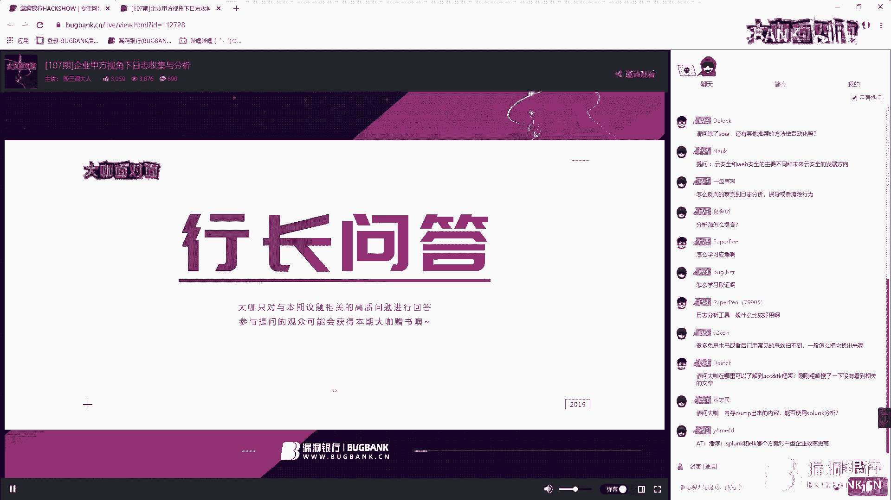
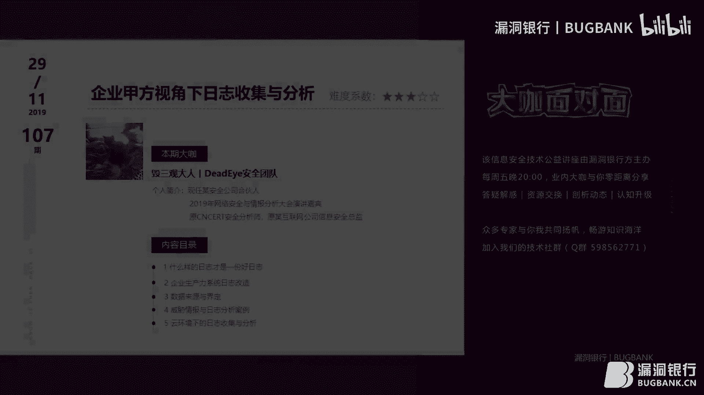

# 漏洞银行丨企业甲方视角下日志收集与分析-毁三观大人丨咖面107期 - P1：【录屏】企业甲方视角下日志收集与分析-大咖团长-漏洞银行大咖面对面第107期 - 漏洞银行BUGBANK - BV1YJ411i7Vm

未知事而存 因技術而生。

小夥伴晚上好，歡迎大家來到洛頓銀行Hackshow直播間，我是主持人秋秋，今晚將進行的是第107期大咖面對面，由毀三觀大人，大咖來為我們帶來名為企業甲方視角下，日誌收集與分析的主題分享。

那毀三觀大咖是Dead Eye安全團的成員，現任某安全公司合夥人，已經受邀參加了，2019年網絡安全與情報分析大會演講嘉賓，曾經也是CNSIRT安全分析師，並擔任過某互聯網公司信息安全總監。

可以說他是一位藍隊大佬，今晚他給我們分享的，將從甲方視角出發，帶你全方位了解日誌這樣東西，從辨別到設計，從收集到分析改造，內容乾貨多多，感興趣的話一定不要錯過，那同時大咖準備的精彩內容。

你也可以不用光看，作為觀眾夥伴你可以登錄直播間，在聊天區裡面發言討論，聽講過程中如果任何問題都可以隨時提出，大咖演講結束之後還會有問答環節，毀三觀大咖會挑選高尚的問題進行解答。

那積極參與更有機會在問答環節後，獲得大咖贈書，今晚贈書是，內網安全攻防滲透測試實戰指南，那每周一本書扛傻不會禿，想獲得實物贈品的話，更不能錯過大咖的分享，要聽到最後哦，那下面我們就請毀三觀大咖。

來開今天直播吧，啊OKOK，然後我今天講的就是剛才說的，企業甲方視角下日誌收集與分析，然後背景的話也跟大家講了，為什麼要做這件事情，然後我自我介紹一下，我在我接觸Splunk大約三年左右。

然後我之前在新SET擔任過安全分析師，主持過一些大型的入侵檢測項目，比如說省級別國家級別的流量檢測這一塊，然後之前在某互聯網公司擔任過信息安全總監，然後我是Splunk用戶大會，2018年演講嘉賓。

演講的內容其實跟這次有一些相像，但是當時的話受眾可能年齡偏大一點，他們沒太聽明白，所以我覺得我有必要再去出來講一次，然後今年微部的網絡安全與情報分析大會，我是作為內部培訓的演講嘉賓。

又講了一個關於甲方安全的一個叫，你可以叫黑客反制的一個議題吧，這個議題我可以在，有如果感興趣的話，感興趣的人可以問我，這個其實也是日誌分析數據的一種補充部分，然後我平時我還是一個射箭愛好者。

雖然說我平時還，射箭是我現在唯一堅持的一個愛好，原來的愛好比如說登山跑步攀岩，因為太懶了，現在基本上已經不做了，OK我今天要講的主要是五點，然後第一個就是什麼樣的日誌才是一份好日誌。

第二個就是企業生產力日誌改造，第三就是數據來源的界定，我們要到底去收集什麼樣的數據，然後第四就是威脅情報與日誌分析案例，其實你們可以把這個句子斷了看，因為日誌威脅情報與日誌分析案例，其實可以是個逗號語。

但是因為今天篇幅的問題，我只能去講一些威脅情報與日誌分析相關的案例，但是如果是我展開講的話，今天我們估計能講到明天了，然後第五就是雲環境下的日誌收集分析，因為現在雲環境發展的比較快嘛。

然後好多公司都上雲了，不管是阿里雲騰訊雲，然後就是亞馬遜雲Azure或者是谷歌雲，還有其他很多很多的雲，雲環境下其實日誌的話，我們收集跟之前在ITT，或者是辦公網有很大區別。

稍後的話我會著重講一下這一塊，然後我們先講一下就是，什麼樣的日誌才是一份好日誌，常見的日誌格式，我們其實可以，如果你們做過這個日誌分析的話，其實你們大概能知道日誌其實有幾種。

一種就是那個我們叫字符串分割，你也可以但是字符串有可見不可見，有的字符串可見有的字符串不可見，我們就把這個日誌就單獨說出來，叫逗號分割空格分割或者是書線分割，這種是一種，這是我們平時最常見的日誌。

其實這樣的話其實也算一種好日誌，然後第二種就是我們一般看到的二進制格式，我不知道那個今天聽課的同學們有沒有做取證方向的，如果是取證方向的同學們，其實大家關注的二進制日誌會很多，比如說IOS的日誌。

比如說蘋果Mac的日誌，還有一些什麼Linux，我們主要舉例就是Linux系統登錄日誌，我為什麼要舉這個日誌呢，就是我在一次溯源分析中，我就發現我在就是那個客戶的服務器上。

拷回來的那個文件在我的蘋果電腦上，其實解析不了的，我就很納悶，因為我當時是在客戶那個服務器上用last命令，直接就可以把這個系統登錄日誌指回來，但是我在我的蘋果電腦上就不可以。

後來我研究一下發現蘋果的last，和這個那個Linux的last其實不太一樣，後來我就通過看網上一些資料，通過一些學習把它那個具體的區域結構知道之後，我就自己手動寫一個小腳本去解析這些日誌。

並不只是Linux日誌，好多日誌都是這樣，這些其實我們為什麼要做提前準備呢，因為提前準備的話，我們在客戶現場或者說在甲方跟同事們一起工作的時候，不會寫的那麼low，如果說你每次去溯源的時候都會限百度。

限谷歌啊，限必應啊，其實就很low嘛，然後就是，我們為什麼要講這些呢，因為就是我對於我來講，我在剛剛入行的時候，就是其實我的部門主管經常要我去看看，線上客戶那有沒有入侵。

然後一般來講主管就要求你去取一下日誌，然後你第一點就是第一點就很尷尬，你不知道要取什麼日誌，然後日誌取了之後，不知道怎麼分析，然後有一個比較慘痛的經驗就是取了A日誌，然後我們發現分析之後。

我們發現我們需要B日誌，C日誌，還有F日誌，但這時候你就發現韻微大哥已經山窟跑路了，所有的日誌都不見了，然後等到過了幾天，你這個case結束之後，你的主管再一次跟你說，線上又被入侵了。

你主管又要你取日誌，你怎麼辦，如果你不熟悉日誌格式的話，每一次溯源都會顯得你很不專業，OK，然後就是我主要講兩個就是特別好的一個日誌分割方式吧，就是K value，比如說A=B，這叫K value。

就是你們如果學過編程，肯定知道K value是一種什麼格式，一般我比較推崇K value，但是有的人比較推崇Jason，但是Jason日誌的話，其實有一點點問題。

我們稍後會提到關於Jason日誌到底有什麼問題，然後通過我對這個帝國時代這款遊戲的愛好，癡迷，我對日誌格式劃分了三種時代，當然這時代可能都不太對，第一就是石器時代。

石器時代你們其實可以看到就是這個研發很放飛自我，它的分割符其實是兩個中括號，然後還有豎線，還有冒號，然後你發現實際上這是一個SQL語句執行命令，你發現它這個SQL語句執行命令後面還是比較奇怪的。

所以說在我解析這個日誌的時候，其實我很頭疼這個問題，然後就是另外一個日誌，我們管這個日誌叫青銅器時代，這個青銅器時代就是一個，一個是DNS，主要是上面這一塊，就是一個DNS日誌。

DNS日誌的話其實就比較煩一點，你會發現這個DNS日誌和下面這個日誌，它的時間圈被打印到了最前面，然後其他的它會用冒號分割，或者用等號分割，就是這個叫KVALUE格式，然後你就發現一個很煩的問題就是。

有的時候它會去打這個雙引號，有時候不會打，這在我做這個政哲版本編寫的時候，我很胡鬧，我覺得我的政哲其實還比較厲害的，但是碰到這樣格式，我也是束手無策的，然後你看最後一個叫帝國時代。

我們一般玩遊戲的知道就是帝國，帝國時代這個遊戲最後一個時代應該，一般如果在普通版本的話都是帝國時代，如果說你玩的比較是那種魔改版本的，可能還有外太空時代，這個時代就比較，我就比較開心了。

因為我們所有的日誌分割都是等號分割，是KVALUE分割，我們只知道建直和建明就可以了，然後另外一個我們就發現就是在日誌，日誌分析中有一個比較煩的一點，就是日誌時間的問題，之前經常因為這個問題。

我會無休止的加班，比如說一次線上溯源的時候，我們知道了WebShell第一次被訪問的時間，當然這是通過日誌，這不是流量，然後我們通過流量查詢黑客具體做什麼，我們通過那個搜索這個WebShell的名稱。

比如說大麻。JSP或者是1。JSP，然後我們就發現這個，搜索之後我就搜索了這個流量，因為有的時候你沒有知道全流量日誌很大，可能十分鐘就是已經幾個G了，然後我們就搜索了全流量日誌發現，哎這個沒有發現。

也沒有命中這個數據，後來我們通過幾個夜晚的加班吧，雖然說你們肯定都知道黑客一般都是晚上幹活，其實我們白天沒去，然後才發現原來就是那個流量設備的時間是有問題的，為什麼有問題呢。

因為說這個廠商在第一次賣給我們之後，他們就沒有人再去維護，他們的時間還是最開始那個時間，然後你們可能有的同學會知道一個問題，就是時間如果你平時不跟這個服務器更新的話，它會慢慢會有誤差。

這個誤差到底是怎麼出現的，其實我也不太清楚，然後我們當時就發現這個時間沒有更新之後，我們再去校驗這個時間，然後我們其實我後來我就覺得可能這個問題應該是最最，我覺得我不會再遇到關於時間問題。

然後後來我就碰到了一個更奇怪的問題，我們在某些自研程序的日誌中發現，研發自己在無休止的造輪子，他們自己維護了一個時間的庫，自己去獲取自己的那個服務器時間，然後同時他把時序搞錯了。

就是我們不是那個UTC8嗎，我們北京時間嗎，他可能就變成了什麼東京時間啊，他可能覺得這個馬尼拉時間也沒有太大關係，然後我們在日誌分析中基本上就已經崩盤了，就是沒法分析，還有個問題就是時間戳的問題。

時間戳有的時候研發打時間戳的時候，就通過兩個代碼去打，有的時間戳長一點，有的時間戳短一點，長一點的時間戳是更新到什麼，有可能更新到那這個分秒納秒，有的時間戳就是更新到分鐘，這個其實對我們很困惑的。

因為同一樣一份數據中出現了大量不同的時間戳，我們這邊在做精度分割的時候，在做時間轉化的時候，根本就沒法去好好做這件事情，然後就是我們在平時的，如果你們做過溯源的話，基本上就是這些套路。

運維搜索日誌就是這麼搜索的，然後Grop， AWK， SED， Locate，然後你就發現這個效率很低，當然說有的我見過有的比較牛的運維，他們通過他們通過自己對日誌分析的理解，他們做了一個xxx。

sh的一個腳本，然後只要這個腳本，只要腳本在的話，基本上他們能分析出大概就是線上的一些問題，但是這個東西基本就是如果說這個運維離崗了，或者說他今天有事的話，這個數據基本就分析不了了。

然後一般就是我們就發現效率很低下，對操作人員不能形成固定的模式，基本上是無法支持一次閉環的事件調查，如果說你是一個比較大的甲方的話，或者一個中型甲方的話，我們每個case都要復盤的。

基本上你這個case，我們能達到的就是一個review的，就是一個報告，這個報告寫的就是等於驢群不對馬嘴，你也不知道他在講什麼，我其實對於我們來講，我們可能要介入到這個日誌分析的每一個環節。

所以說我們可能還是要開一個關於公單系統，但每個人每個角色，每個角色幹的事情都不太一樣，這樣的話我們覺得這樣的事件分析，是一個好的事件分析，然後就是我們講一下日誌加工的流程吧，有好多人說我就是拿一個日誌。

這個日誌我分析我就完了，我覺得這樣是不可以的，我們好的一個日誌加工的流程是這樣的，第一步叫提取日誌，提取日誌就大家都知道，就是這個日誌我們要拷回來，拷回來的話有很多方法，甲方的話你可以做這種。

這個日誌存儲嘛，乙方的話其實你可以把，把這些日誌放到你們的自己的環境中，分割日誌，分割日誌就是我們要確認字段，我們要確認key value，什麼是鍵什麼是鍵名，我們要確認這一點，如果不知道這一點的話。

基本上這個數據，我們只用只能用那種叫我們叫大搜索法，就是只要這個數字就是個東西往裡一扔，當然說這個方法其實有時候很管用的，但是有一點不好，就是如果說你要搜我的一個名字，比如說毀三觀大人。

在這個百度上搜的話，基本上會搜的奇奇怪怪的，但是如果說你們去搜一個名字叫米稱，然後等於毀三觀大人的話，這樣的話你們搜的結果會很精確，然後另外一個日誌重組，日誌重組的話就是這樣的，因為有好多時候。

我們的IP是對應不到個人的，比如說VPN的日誌，有的時候就對應不上個人，有的時候流量日誌中IP也對不上個人，有時候我們的一個服務器被黑了，但這個服務器是誰的，我們其實也不知道，我們就要做這個日誌重組。

我們要通過這個日誌，還有其他數據我們要重組成，最後達成一個新的日誌，比如說IP等於192。168。1。7，然後管理員等於誰誰誰，然後這樣誰誰誰，這樣的話我們就可以做這個日誌重組，然後我們就不用。

不需要再做其他那種無意義的關聯查詢，我們數據已經很好了，然後就是我們要做就是結構化查詢，有好多人說我的Linux命令敲得特別溜，但是我不太推薦大家這麼做，我還是比較推薦大家用類CQ的語言。

比如說這個CQ，為什麼這樣呢，因為這樣可複製化比較強，並且尤其如果你老用Linux命令的話，你老用那個管道服務，我曾經見過一個運維大哥，他的那個日誌分析的那個管道服務，都已經打的，屏幕上已經看不見了。

然後我就跟他說，我說我們需要改一個東西，他說改不了，我說為什麼，他說我也不知道，我也不知道到底要改什麼了，就這個很奇怪，因為這樣的搜索基本上是不可複製的，然後流程化搜索流程化搜索是怎麼做呢。

這就是我們要做的，我們要講的一個點叫SOR方向，這應該是最近幾年最火的一個方向，這個方向就是每一步查詢，其實都可以做到自動化，我們其實就是一個分析師，我們在左邊抓數據，在右邊抓數據。

在這個郵箱上面抓數據，在服務器上抓數據，我們把每個數據抓回來，然後你們比如說你們抓回這個IP，IP對於我來講，它不僅僅是個IP，IP它可以對應域名，IP也可以對應歸屬人，IP也可以對應端口。

IP也可以對應是否被入侵，如果你們去購買威脅情報的話，IP也可以對應這個IP是否是C2域名，這樣對我來講的話，我分析的時候就不要搜來搜去了，所有數據直接就匯聚到我眼前，我只要做一個分析師。

我只要一點這個判斷是否有威脅就好了，而高效的是日日搜索方法，就是我剛才我說的，類似一個搜索方案，可記錄每次搜索結果，方便流程追蹤，商業化的方案有很多，這個Qradar，還有我比較熟悉的Splunk。

其他幾個也都OK，然後關於這塊的創業，國內國外有好多公司在做這一塊，然後的話，你如果說你們覺得免費，收費方案不太好的話，可能預算不夠，可能可以，你們就可以做這個免費方案這塊，就是ELK魔改。

ELK魔改的話，其實我就安利一下，其實有好多人說ELK魔改，基本上就改不明白，很正常這個事情，為什麼呢，因為那個Elixir的搜索，對於我來講，我覺得有一點點反人類，然後網上的話沒有很多的技巧。

去教你怎麼去搜索Elixir，然後你如果真想好好搜的話，你要自己寫Python腳本，寫腳本就是，就是它會對外提供一個API，然後通過API去調用，但是好多人都不懂這塊，然後我就安利一下。

你們可以在網上搜ES-Latecycle搜索插件，這個插件基本上除了刪除這塊，不能做的話，不能用Delay的語句，其他正常的，就是slack，這些語句都可以用，然後如果說你們要做ELK魔改方案的話。

你們就做這個，就去看這個ES-Latecycle搜索插件這塊，然後就是我要講的一個就是通用日誌，然後就是這樣的，因為有好多公司有自研系統，也有外購系統，然後或者是定制開發的系統，我們自研系統的話。

我們要求就是按照這個CIM，CIM這個鏈接，它是Splunk做的一個，一個就是通用的日誌格式，然後就是這個格式就比較好，這個格式你可以看一眼，這個格式它就會強調每個字段的名，它這個字段名是幹嘛的。

然後它這個常見的一些值，這樣的話，我們就是其實可以跟一個概念叫IOC，IOC這個概念，我相信大家肯定要知道，你們也不知道，也可以去百度IOC這個概念，就是入侵指標，我們通過這個IOC和字段。

其實就是像剛才我說的，如果說我們數據不分字段的話，基本上我們只能用大搜索術了，就是在百度裡隨便瞎搜那種感覺，就只要扔一個關鍵字，你看就是如果看排名靠前，我就看哪個，如果說你點第二頁。

基本上你就沒有什麼新值了，這個在我們的日誌分析也是這樣的，如果說你第一頁看不明白，第二頁第三頁，我基本上我覺得，你們在點到第四第五頁的時候，基本就不想看了，然後就是剛才講到一個日誌存儲的問題。

日誌存儲就是我剛才講了Jason的問題，Jason就是一個問題，他比較大，因為Jason他有一個花括號，就是他日誌其實會比別人大一些，就比KY6會大很多，但是Jason有好多這些。

這個Jason Cool的插件，然後好多這個，這個研發都是家，就是學Java或學Python的嘛，他這塊對這個要求就很友好，就是如果說你們公司的研發不配合你，你覺得還，他說Jason解析比較好的話。

你們還是這個退而求其次，答應他們，但是跟他們說一點，存儲費用會比較高，然後就是雲存儲方案，我要講一點就是，其實這個到後期關於反入侵的話，我們其實也要講一點，其實也是一個關注點。

我們有就是那個AWS S3，OSS COS，谷歌的GOS，還有AIDA的BLOB，我覺得谷歌那個，Yamaha不是這個叫微軟雲就很奇怪，你們前面幾個名字都挺像的，為什麼最後用了一個這個名。

我這個問題其實一直困擾我很久了，這個略過這個事情，然後我們要，接下來我們要講到一個問題就是，我們要知道我們要搜什麼數據，如果不知道搜什麼數據，這個事情很可怕的，第一你排不了工期，第二，因為大哥可能不過。

可能就可能就不care你吧，就是你說我有一個需求，因為大哥說你有什麼需求，我有日日分析的需求，因為大哥就問你有什麼樣的日日分析的需求，然後你就說只要日日我都要，因為大哥說那你哪涼快哪去。

那邊比較涼快你去吧，所以說你要知道你要搜什麼數據，因為大哥才好給你拿數據，除非你管運維，你跟運維說什麼都可以，這樣就沒什麼問題，我們想像如果你是個研發會用到什麼數據，我們要再想像一下。

如果一個員工上班到下班會用到什麼數據，一般來講就是一個這樣的流程，這是我之前跟蹤我們一個同事，我看了一天幹嘛了，就是他這麼做的，他第一個就是進門，進門的話要刷門禁卡數據，又要刷門禁卡要打卡。

然後我們就知道OK門禁卡數據如果能收，我們也收我們要OK，然後第二就是手機自動要連WiFi，OK這個時候就會發現如果他已經被入侵了，他可能就通過WiFi，這個手機這塊再去跳進來。

OK我們WiFi的數據要收回來，打開電腦電腦開始連公司網，OK我們公司的辦公網數據我要收，打開通信軟件，OK這個就O不OK就看你們的法務部門了，這個如果你們是內部聊天系統的話。

其實也可以把這個內部聊天系統的數據收回來，打開各類公單系統刷微博，OK我們在辦公網的話，其實他刷微博，我們能能知道的，如果說你們用的那種那個叫外外部代理的話，其實他刷微博數據我們也能看得了。

然後這時候這個研發就開始幹活了，打開IDE開始改BUG，這個時候其實就比較科學，就比較有意思了，IDE這塊其實我們也能收數據的，其實之前有一些人力就讓我們去統計，研發到底幹不幹活。

IDE裡頭他打開的次數和IDE提交記得蓋碼的，記得蓋碼的日誌，其實可以知道你這個研發到底幹不幹活了，然後這時候我們研發就開始去中午吃飯了，當然這個我們公司之前沒有食堂，所以說我們就沒有消費。

這個沒有去收集食堂這個消費記錄，然後我們回回單位之後第二次刷卡，然後下午服務器要上線，服務器上線的話，比如說這個APP Store或者說這個小米，華為商城這個協定他們賬號，如果說他們提供了數據。

我們也要收回來，然後晚飯時間到了，和同事打了幾局王者榮耀，你們不要不會以為我其實連王者榮耀數據也收集了，這個我們是不收集這個數據的，然後其實說不收集其實也有點開玩笑了，我偷摸看了一下我同事。

我們同事有時候那個戰績就是零十零，嘴強王者，這個吃完飯還要打這個王者榮耀，不去這個加班，我覺得其實挺浪費時間的，然後九點到了，然後打車回家打車回家這個打車，如果你們用那些企業打車軟件的話。

其實這個數據你們也是可以要回來的，這個數據其實也也有用，我們到後面可以要分析一下，然後就是數據界定來源就是我之前總結的一塊，我們其實分為兩部分，一個是雲的，一個是我們自買自建自購的。

然後比如說我們使用的服務器，我們服務器的登錄日誌啊，林林是操作日誌啊，這些數據我們都要收，然後好多外部容，呃，裡頭如果說你是容器的話，容器是是是也要收，比如說我們使用的代碼管理系統。

代碼管理系統有這個GitLib吧，有或者有這個呃，我就現在用GitLib，然後OK，然後這個文件存儲的話，比如說你們用NAS網盤，NAS啊，那這是買的啊，不是那種賣不是賣用那種SaaS。

NAS這個數據你要收，因為有好多人他們黑客偷數據，基本都是把NAS直接就端了，然後使用的薪資存放存儲，就是有的時候有可能有些人對你們公司的薪資，比較有有想法吧，想知道你們公司到底開多少錢。

這個這個數據其實，你們公司內部的SaaS系統其實也要關注的，然後啟用使用的企業通訊存放，就是你比如說你們的聯繫人，花名啊，比如說誰向誰匯報這些東西，你們都要看好了，使用的認證系統，認證系統就是。

呃我們叫的就有可能就是我認為就是有有可能是那個AD域，但是有好多公司是用SDAP去認證的，所以說我就沒有寫AD域，寫的就是SDAP，使用的WiFi系統，WiFi系統就是我剛才說的。

然後就使用的經營分析系統就是BI系統，這是我，我覺得是屬於，呃企業中最重要的一個系統，一般丟出去都從這裡丟的，使用的財富系統，這個也很重要，然後還有一些自研的後台系統，外購的後台系統。

還有使用的客服系統，這都是我們需要關注的點，然後現在就回到一個雲服務這塊，雲服務就比較尷尬了，因為好多時候這個數據不給我們管，或者一些因為一些，可能你買的一些是小公司的SaaS服務的話。

它其實什麼都沒有，所以現在其實有一個新的方向就是雲代理，你們如果有了解的，其實雲代理的話，其實可以關注一下，就是你通過一個代理去訪問這些雲服務，比如說常見的O365，二壘雲，還有這個叫AWS。

其實他們都支持這個雲代理了，然後就是還有一個比較敏感的，就是企業SaaS服務帳號監控，比如說你們的企業支付寶帳戶，企業微信帳戶，其實這個平時這個其實危險性很高的，因為好多公司錢被盜了。

就是因為他們的企業SaaS帳號，SaaS帳號被這個黑客攻破了之後，就盜了盜盜盜錢，比如轉個幾百萬出去，這個事情很常見的，然後還有一些應用商城，比如說你的微信小程序，比如說你的微信小程序裡的一些商城。

可能都不是自研都是買的，比如友讚啊，還有好多其他的一些微信商城，這些東西微信小程序商城，其實都是比較危險的，然後就是這就是我們在界定服務器日誌，還有一些比較關鍵日誌這塊，這個日誌其實這個數據。

其實我一會要講的話，這個日誌其實都需要改造的，比如他們看日誌，阿帕奇日誌，這都需要改造的，因為他們其實支持改造，這個阿帕奇是有一個日誌標準的，他日誌標準中都寫了，他會有一個配置文件，配置文件你可以改。

你可以改到底收不收集一些數據，比如說我們在一些入侵溯源的時候發現有好多，好多運維其實沒有收refer這個數據，然後還有那個xff，就是真實IP，他其實也沒有收，就說也說就很尷尬了，你什麼都分析不了。

然後還有一些Windows日誌，IIS日誌就比較有意思，IIS日誌是可以跟那個一個稱職日誌去關聯一下，因為有的時候好多人就，他們公司的一個稱職，基本上是對應不到到底是哪個用戶登錄了，這些都不知道。

然後GitHub Live日誌也比較有意思，GitHub Live現在就是，其實你是不知道哪個哪個用戶去訪問外部，外部這塊的就是他偷代碼的，其實你也不知道，SV日誌也是這樣，然後好多VPN的話。

你們用的都是公司用的OpenVPN便宜，如果說OpenVPN其實也可以去這個收集日誌，但也需要改造常見的4顆的VPN，這個PA的VPN，這些VPN其實都需要改造，因為好多時候都對不上人，然後預控的日誌。

這剛才已經提到過了，然後就是DNS日誌，DNS日誌的話，他這個每家的DNS廠商，他或者你是開源，自己搭的這塊套的話，他日誌都是千奇百怪的，然後還有MEGUAR日誌，MEGUAR日誌的話。

我覺得應該比較重要了，因為如果是內網的MEGUAR出現了問題，基本上黑客已經進來了，然後就是我們還有一個叫CIS，CIS的話，就是不是那個不是會議那種CIS，它是一個關鍵控制點，他大約總結了20個。

這個上面底下有個訪問鏈接，我記得大概在16年左右，有人在網上翻譯過2016年版的，這個TOP20，當然可能那個差異不太大吧，但是你們其實也要注意一下，就是其實我剛才說的就是。

我自己去想到底需要收集什麼數據，你們可以看看別人，什麼要求是收集什麼數據，有好多其實好多數據，其實我的關注也，也比較也比較偏向某一方向吧，有些有的數據，其實我可能之前也沒有收集，如果說基本上可能只是。

如果真是出了事了，可能我被受到教訓了，我知道這個數據該要收集了，我才能收集，然後就是其實我要舉三個比較奇怪的這個數據，我們覺得好多時候，你們其實都沒有收集這個數據，第一個叫CMDB數據。

CMDB就是一個運維概念，你們可以百度一下，它有很長串的這個這個這個解釋，這個東西基本就是你們服務器到底歸誰，你們服務器到底是一個負載均衡，還是一台就是一台服務器，還是跳板機，還是說是一個路由器。

這個數據其實我們都要知道的，比如說我之前碰到過一個情況，一個IP，我們現在知道ID@裡知道這個IP被入侵了，但是我就就是找不到這個IP到底歸誰管，後來通過大約幾天加班。

我們發現這個IP是一個某廠商的一個攝像頭，可能是這個可能是攝像頭被入侵了，但是說這個我們在中間這個搜索，詢問的過程中就浪費了很多時間，如果說我們CMDB把這個攝像頭數據也錄進來的話，我們當場就知道。

我們就一個loot up，其實是個死不爛的一個概念叫loot up，直接這麼一搜索，我們就能知道OK，這個IP它是個攝像頭，我們現在就趕緊去這個攝像頭去歸數據，去看這個攝像頭是歸誰的，OK。

再去分析它裡的僱員到底有沒有被入侵，這個這樣我們其實就做到很好，然後你CMDB裡其實也可以蒐集一些關於這個端口的數據，比如說這個服務器開放了什麼端口，比如說開放80這個端口沒什麼問題。

比如說有一天他開放了3106，你就想這是黑客開放的還是研發開放的，研發開放的是否是設置入口令，如果沒設置入口令，他萬一那個洩漏了密碼被人連了怎麼辦，OK，這樣如果你沒有CMDB的話，IP歸屬權。

然後IP端口IP資產類型的話，其實還有好多好多CMDB可以記好多，你們直接在百度上谷歌上查一下就可以了，這裡我們不再講，然後還有個人力數據，人力數據其實我們其實就比較關注這一塊之前的時候。

因為通過這個數據我們發現了大量的威脅，比如說入職和離職，這就很有意思，有的人入職了，我們可能會觀察個叫入職危險期，因為我之前聽說過一個案例，就是這公司名不講了，這個公司就是有個人入職三天。

然後熟悉了所有流程之後，把他們的所有核心代碼打包就跑了，這樣的話，其實我們在關注日誌分析或者數據分析時候，我們就關注一個點，維度叫入職時間，入職時間前七天，前三天前二天都是危險期。

如果說他然後有這個危險期的話，我們就有個rank值，rank值加一加一加一，所以對於我們分析師來講的話，這個數據這個人的行為就可以就要好好觀察了，然後離職的話，其實離職也有一個風險值。

我們去原來強調一個點叫離職七天風險，七天如果一個基本上就是我通過一個數據分析，分析出來的一個結論，我當時統計了好多人離職的一個信息吧，我發現離職前七天一般他們都會投數據。

這是一方面還有一方面就是有好多公司，他們其實沒有HR系統，HR系統或者數據沒有打通，或者HR肯定就沒有打通吧，然後如果是一個員工離職了之後，他其實沒有去刪這個賬號了，然後之前我們分析過幾次入侵事件。

我們發現全部都是黑客通過一些離職賬號進來了，因為第一離職賬號就沒有改密碼了，離職賬號改不改密碼，或者離職賬號被重置成了默認密碼，或者說離職員工臨走前為了自己方便，設置一個特別簡單的密碼。

這些事情都有可能，或者說員工離職了就放後門了，這個可能都有的，然後離職賬號這塊我們之前就很關注，關注了之後我們通過分析離職賬號，就是疑似離職賬號的行為，或者說通過統計，其實這也叫數據分析也叫日日分析。

這概念就比較大了，就是通過分析HR數據，和我們所有日日中收集的賬號信息，我們就可以發現，有一些離職賬號活躍起來了，或者說這個賬號沒有關，可能因為一些溝通問題吧，我們就馬上把這個事件。

報告成這種最緊急事件，讓相關部門趕緊採取強制措施，或者刪了賬號，或者說再請君入甕，我們再釣他釣魚他一把，然後異動情況，異動情況就是比如說這個人原來在，研發前段部門有一天轉到安理員部門了。

然後有一天轉到後端部門了，你就發現可能這個人是個全站工程師，能力很強，但是有的時候他其實，如果是前端工程師，如果最開始他是個後端工程師，他可能就有用戶數據的權限，但是如果說他是個前端工程師。

他就沒有應該沒有這個權限了，所以說我們要去看這個權限，但是如果說我們的這個系統做得不太好的話，他其實是個有機可能去亂查數據的，如果你員工離職，就員工異動了之後就調崗之後，他沒有去改這個數據。

我們不能相信每個人都是壞人，但也不能相信每個人都是好人吧，我們要及時把這個數據把這個也不應該，應該要權限，我們把這權限必須關閉掉，然後另外一個就是這個奇怪的數據，比如說剛才我提到了打車記錄。

我從我曾曾經嗯，通過這個打車記錄分析過一些很奇怪，很有意思的東西，比如說這個這個研發到底走沒走，因為有比如說你們公司被入侵了，然後這個研發其實已經有打車記錄已經走了。

這個時候你就發現可能現在在公司電腦上操作這個人，可能第一可能是別人就通過他電腦操作，第二可能是通過黑客入侵操作的，可能或者說他回家辦公，當然回家辦公，他要連我們公司VPN。

我們公司VPN如果沒有撥號記錄的話，基本上的就是黑客入侵了，就是通過一個打車記錄，然後剛才你說那個食堂記錄，其實我們我剛才說那個食堂記錄其實也可以記，但是我們公司沒有食堂。

當時就說說這個這就是我們沒有記，然後我們其實要講一點核心就是實驗生產力系統日誌改造，這個問題其實我當時跟我們部門的同事其實一直在在，就是這個問題我們持續了很久，比如說我們剛才提到的一個參與日誌。

默認的話，因為一些一些國內廠商的問題，他要過一些F5負載均衡，他F5負載均衡之後，他一個參與日誌，他變成內網內網IP了，基本上你是不知道誰登錄了這個帳號，然後我們的Wiki可能你們是外購的。

可能是conference，conference就比較有意思，conference是默認的話，日誌是記錄不到是誰操作了這個這個這個Wiki文檔，然後我們通過一些網上的一些經驗，我們把日誌改造了。

就可以能知道是哪個用戶操作了什麼東西，然後剛才我提到GitLive，GitLive也是這樣，就是我們其實是如果不通過改造的話，是不知道這個GitLive到底是誰操作了，但是你看，但是不是提交代碼。

是訪問Web記錄是不知道誰操作了，然後我們就通過改造這個日誌，通過不可分析的數據，改造成可分析的數據，我們就可以知道，我們至少要知道IP，至少要知道一個設備，至少要知道這個人是誰。

這樣我們就可以分析數據了，然後我們剛才就分析完之後，我們發現一個問題，就是改造不可關聯的變成可關聯的，剛才比如說辦公網，辦公網一般都是IP或者是MARC地址，這樣我們通過IPMARC地址一些記錄。

我們認證記錄，我們就可以知道這個對應的真實人是誰，然後比如說我們有線上有APP，我們線上APP它有行為日誌，一般來講就對到對應到一個真實的用戶，這個就是反作弊，反作弊領域了，對應到一個真實設備。

一個設備ID，然後或者我們後台的用戶行為日誌，這個一般我們要對應到一個真實的用戶，這個就是我們之前做的一個小模型吧，就是我們要日誌生產，就剛才我講的那幾塊，我們的server日誌，VPNOA。

下一代防火牆，下一代防火牆和WAF，其實你可以認為是一個東西，在有些時候的話，DLP日誌還有好多日誌，然後我們把日誌就關聯，我們當時就是我們當前就是要關聯設備信息，我們要關聯這個人員信息。

然後還有一個最重要就是我們要時間校驗，如果說你這個我們日誌是東巴區的，你這個是柯林離職時間，那基本上這個數據是沒法一起分析的，然後我們日誌存儲的時候，我們的基本存儲的幾種，一種是網絡數據模型。

就是那種IP能歸屬到人的，另外就是虛擬身份，虛擬身份就是你的一些常見的社交賬戶，這些我們要關聯到，然後就是我們消費日誌消費就是搜索，我們基本就是達到就是我下右下角這個段英文，搜索一次，我們什麼都能得到。

然後我講現在就講這個拉回來的話，講這個威脅情報和日誌分析案例，我們對一個IOC要做一個界定，我們其實好多人認為IOC就是一個就是個IP，好多人都是這麼認為的，或者是一個域名，我覺得這個是不對的。

IOC其實還有一點就是IOC其實是有可信度的，一般來講之前跟一些情報威脅情報廠商聊的時候，他們說C2的可信度更高，IP赤字並且IP存在時效性，並且現在好多人都特別，還有那種欲鉗制這些好多手段出現之後。

你發現域名也不太可信了，或者說IP也不太可信，當然這都是後話，如果說這個你分析的時候，其實C2還是可以用的，然後這個是我通過我找隨便找，網上隨便找一個圖，就是現在比較火的。

基本上安全廠商都在炒作的AT&T CK框架，這個其實他這裡好多東西就是我，我就是我可以認為就是我們可以分析的點，就是他們AT&T CK分析，APT3這個團伙他們常用的一些手段。

我們其實可以通過這個東西學習，因為老外總結的總結比我們確實強一點，他們通過這些總結，我們就知道大概能知道，我們要去收集什麼樣的日誌，我們去怎麼分析日誌，然後什麼樣的數據能成為一個IOC指標。

讓我們去搜索，然後這個是我們之前在聽其他公司紅隊演講時，我覺得這個他們總結的，其實比剛才我講的那個更簡戀一點吧，比如說外部這是紅隊的一個方法，紅隊比如說外部信息探測，然後就是技術設施選行。

然後初始化權限，內部橫向移動，然後數據回傳，一般來講黑客社的數據就是這樣一個流程，然後我們就可能有人就說說這個流程的話，我們可以通過這個流程去分析日誌嗎？其實是可以的，比如說我不知道大家知不知道。

因為之前是我看了一個論文發現的，外部信息探測好多人都都知道這個Google Hacking吧，然後你比如說去site一個網站，比如site。baidu。com，然後你搜索什麼login。

password這些東西去查去找他們後台登錄地址，這個其實如果說你們外部日誌記得全的話，這個信息我們都能收集到，這個信息會記錄在refer裡頭，我們refer是可以看到這個。

這個人是通過什麼網站去跳到我們這個，這個我們的網站呢，比如說我們可以就分析，我們去看這個refer到底，refer裡到底有多少人是通過Google，或者是百度或者是其他所有隱形。

然後通過site跳進來的，這個其實這個其實就可以作為一個IOC，但是這個這個強度不是特別高，因為因為或者說你在溯源的時候，比如說你這個網站到底怎麼被入侵呢。

你可能去看refer他這個日誌裡到底是怎麼來的，OK，然後就是我中間幾個先不講，因為如果這麼講的話，基本上這個課就沒有沒有沒有頭了啊，數據竊取回傳啊，這個這個點我們就可以看到就是我剛才提了。

比如雲春楚雲春楚雲春楚突然有大量下載，我們有大量下載的話，我們要就要去去看這個下來的人第一，是不是在是不是在公司，第二是不是在境外或境外或者是境內境內境外的話，其實也有區別的。

比如說我們一些比如說一些高危貧乏的一些地區吧，比如說那種俄羅斯黑客啊，或者一些境外的組織黑客，比如說一些奇怪的國家，他們就連接日誌，其實這有可能我們之前碰到過一個情況，我們一個同事在泰國旅遊。

然後他其實他其實是在偷數據，這個我們可以確定我們能確定就是他偷數據了，然後確確實能確定了，然後就是太低，有一個陌生的IP在泰國，OK這是我們的一個點，我們這個就是加一個Root值大文件下載第二點。

我們兩個值通過日誌我們自動算完了之後，他這個其實挺挺有問題的，然後我們通過一些自動化流程，我們再去看這個人設備設置常見設備OK，我們當時是是發現是設備是常見設備，確實是他自己的電腦。

然後我們可能我們當時的伊迪亞去，他的電腦搜了一下，發現沒有黑客工具這些痕跡，OK，然後這兩個這兩個這幾個信息自動搜索完之後，我們就要報到我們的分析師，我們就看了一眼能確定，然後這個時候就發現。

我們的人力離職數據中，他已經提交了離職，這我們就大致可以心裡有一個譜了，就能知道這個人在離職前又偷數據了，但是很有很有意思點，他這個人不是在離職前七天，他是在提離職之後就偷數據了，跟離職前七天不一樣。

這當時我們的我們的算法，我們的那個就是我們的自己的那個計算模型沒有去想到這一點，所以說當時差一點讓他偷了數據，然後我們緊急就切斷了他的權限，他這個數據沒有回傳回來，我講一下就是數據自斷與命中。

我們如果你們不太了解這個IOC最快的話，你可以去看FairEye的IOC Editor，你可以看這個工具，他這個工具裡講了好多好多字段都可以當IOC去搜索，當然說有的IOC他準有的IOC不準。

比如說哈希命中哈希命中，比如說一些黑客工具的哈希值命中了，那肯定就是黑客工具了，IP命中，比如說一些能明確是這個有問題的，當然也有沒有不一定有問題的，我們叫這種疑似的，比如說他這個IP是那種境外的。

那可能就有問題，我們在這個當地沒有這個公司的話，可能確實有問題，當然如果說你們老闆去旅行了，其實也沒有什麼問題，然後域名命中的話，域名命中有很多，比如說那種域名傳送，就是用通過域名記錄去傳送數據。

然後C2域名，然後還有一些器械，還有預前制，預前制這塊如果你沒了解的話，要知道預前制這個基礎，其實我們通過域名算也能算出來，然後行為命中，行為命中就是那種比較敏感的，比如說其實跟文件名命中也有點像了。

比如說你們運維在服務器上執行了Nmap，其實這個事就可以要想一想，運維大哥為什麼要執行Nmap，然後函數命中，這就是一些外部效一塊的，比如說你們外部測檢查，比如說命中一些比較敏感的外部效。

就那種可以執行，比如說一句話大碼這些數據，我們其實也有問題，然後數據包命中，匈牙利包命中可能偏向木馬這一塊，或者其他一塊就數據包命中，就是我簡單提這點，然後你其實你們可以內部去維護一下。

關於一些字段有問題的一些點，然後去搜索，然後我們當時可以分析分析這幾種，我們叫弱關係與強關係，弱關係就剛才我提到那種，就是可能被入侵了，強關係就是那種肯定被入侵了，肯定被入侵。

比如說就是你們內網的密關日，突然發現有人在斷桿掃描，如果說不是你們研發，不是不是我們安全部門人掃，那基本上確實被入侵了，或者說你可能看到有一些那種，預服務上有那種Bump。

或者那種Cyto Copy那些日誌，我覺得肯定是被入侵了，或者是那種服務，或者是那種木馬的連接數據，肯定是被入侵了，然後我們就把這個弱關係，強關係進一步講，就是叫真實入侵和模糊入侵。

我們真實入侵的話就要去取宗宿原，模糊入侵我們要進一步去調查，後面我們要講幾個例子關於這塊，高開講一個關於模糊，也不算模糊入侵吧，其實這也是有一些，也可以到強，也可以認為是強強關係，叫真實入侵。

比如說你們的電腦，就是那些服務器網站上有一些關於那種，那種HTTP代理，我們第一想到是否研發，不想通過VPN去審查，我們從VPN去看他們到底幹嘛了，去一些掛了自己，從外頭弄了一些HTTP代理。

HTTP代理也有這樣，或者說Soccer 4 Soccer 5，這些東西，然後我們之前發現過，有的我們之前在某家公司的一個溯源，我們發現過，他們的一個研發代理之前。

在內網的一個服務器上裝了OpenVPN，然後OpenVPN一直維護一個地址，他通過這個通過去連這個OpenVPN，回老東家老去偷數據，然後這個也是我們要去檢測的一點。

我們要知道到底有多少能跳出去的那個地方，然後比如說SSSSR，然後比如說你們公司有S這些東西的話，你們最好要通過統一的一個維護，這個數據如果你們想說也可以收集回來，不要讓研發自己做。

然後第八就是這個VPN，VPN就是我剛才提到OpenVPN是一塊，然後我也發現我們之前的溯源案例也發現，某個運維在離職之前是買了一台VPN，放到機房裡了，誰也不知道這個VPN到底是做幹嘛的。

然後他通過自己經常往回撥，撥這個VPN去通過這個幹一些壞事，然後他也把這個VPN帳戶在黑市上在暗網上賣了出來，OK，然後就是去開始就HTTP，HTPS這塊黑客的話用的比較多。

就可能或者SAMSUPER這些也可能黑客，黑客用的確實比較多，後邊幾項可能就是那些內鬼用的比較多，然後就是我們去檢測黑客工具，黑客工具有幾種，剛才講到了，比如說明明開始去抓密碼，明明開始，如果你不去。

不去這個魔改的話，基本上他哈希是很固定的，比如說還有一些，檢測這個其實我之前在溯源中，我們發現一個比較好玩的東西，比如說BoopShoot，我不知道我讀的跟你們讀的一不一樣，BoopB U R P。

BoopShoot其實也是可以檢測出來的，比如說我們之前就發現在我們在審計中，我們就發現他其實是會訪問兩個網站，這兩個網站其實就是BoopShoot的官網吧，或者說就是你們可以拿這個當一個IOC去搜索。

比如說有的有的人去，你去下載了這個工具的話，你可能會認為他有可能是要做這個測試，QA有可能抓包，有可能是員工，但有可能也有可能是人在學習黑客技術，當然那個我們也可以去看他，他沒看過一些黑客網站啊。

或者說命中一些那種黑客工具下載鏈接，當然說這個BoopShoot其實也挺準，因為之前我在我們的溯源過程中確實發現了有這種情況，就是這個黑客通過WiFi登入，就是入侵了這家企業。

然後DNS記錄就可以明顯能看到一個陌生的Mark地址，去訪問內網一些記錄，然後他會有這個BoopShoot訪問這個記錄，然後我們就知道了，OK這是一個黑客從外面進來了，當然說這個也有些問題。

就是如果說你現在就忙於下結論去調查，他們到底去看更多的日誌的話，其實也有問題的，所以說我們可能只當一個檢測的一個點，不是那種強關係，把它當成一個弱關係，然後你比如說檢測黑客工具，比如說文件名啊。

比如說這個Hardware啊，就包括包括這些工具，這些名，然後供一些檢測，比如說碰到一些比較敏感的函數啊，這是木馬檢測，木馬可能用的比較多，然後Anderson，WoodEye，然後進一步調查。

我們在做異常流量檢測的時候，其實我們把字段，分成了這幾個，OK，然後這裡的其實我是沒有去講那個文件大小，這個其實OK，DSDpart的那個那個IP，不是IP，就是他這個端口開放，比如說現在有一個IP。

我們同事去訪問他很可疑，我們可能通過一些掃描去看這IP開放什麼端口，然後這可能就掃出那種這個木馬的那種後門這個端口吧，然後或者說SRIP，這些IP我就看同事這台電腦到底是哪一個或者服務器是哪一個進程。

再去向這個IP發去請求，然後還有就是我們的協議，這個可能就有UDP，TTP協議啊，就或者七成或四成的協議去查詢，比如說他這個協議是一個叫是一個呃，那種剛才我說的open VPN，那可能確實出事了。

或者說是一種HTTP協議，然後HTTP協議，我們可能可能要進一步看抓包的結果，看到底是訪問什麼東西了，然後就是DSPIP的話，我們就查一下這個IP是否是被命中C2了。

OK或者是在搜索引擎中那個查一下相關的IP，或者去查IP去反查域名地址，或者去IPIP。net，好多會微博去查這個IP是否是那種有入侵行為的IP，我們內網的IP就比較比較好查了。

因為就是我們可以直接去搜索回來的數據，那右邊那個SRCIP，比如說第一這個IP是否是同事的，然後我們要看這個流量畫像，他這個人到底是不是是誰，然後真實身份是誰，是否是本人，然後他有什麼虛擬身份。

這個的我們都要看一下，然後這個東西你們可以記一下，其實就是就是我們這個東西是個發散思維，越發越廣，但是有一點不太好，就是如果你們不是自動化去做這件事情的話，基本上分析一個case可能一天就過去了。

我們要這是我們要講一個思維導圖的一個路徑，當然說這個你們要做到自動化，所以說我們要讓你們去看一下SOR這個方向，因為這個可以都可以做到自動化。

比如說我們現在一個很很就是很很常見的一個一個就是alert吧，就是口令錯了口令錯了口令錯了分為幾種吧，第一就錯了一次錯了三次，錯了錯了十多次被鎖了，就可能都都叫口令錯誤，我們口令錯誤之後。

我們要確定第一這個用戶名是什麼用戶名，第一可能是不是系統用戶名，是不是root用戶名啊，或者說是這些東西，或者當然這裡我也沒有寫啊，對這裡寫了寫了，我才看見，然後是否是個人用戶名，哎個人用戶名的話。

我們就看挑板機就看挑板機是誰登的，然後這是可能是後面更大的一個發散的思維，我們就就夾人質挑板機就OK了，然後比如說系統用戶名，我們就看起我們要檢查一下，第一這個用戶口令錯了，第一是否是被人爆破了。

被人爆破了，是不是是不是因為這個IP被扔到外網了，扔到外網的話，那我可能就要看一眼，是否是在我們的白名單中，就是我們必須開放的那種SAC服務，或者是那種3089服務這種，或者這些其他的東西服務。

然後或者是我們要查一下，我們服務器要自動run一次，檢查查看一下這是否是有入口令，因為有的時候你會發現，其實他入口令是在爆破，萬一他真的登錄成功了，那我們其實就是損失會很大，我們因為之前碰到過這個情況。

因為運維的疏忽吧，他默認的鏡像的話，那個口令是入口令，直接鏡像就是那種開機之後，就是放到公網，在一分兩分鐘之內就被人爆破進來了，還好當時還沒有勒索病毒，如果有勒索病毒的話，基本上可能當以當時的防禦能力。

基本上就屬於我可能應該就被開除了，然後就是我如果確認完那個錯誤的用戶名之後，看現在知道了啊，可能不是系統的或者是個人的，我們要去在auditor日誌中搜索，就這個口令的錯誤的名。

然後看一看他有沒有其他的一些操作，這是Linux自帶的一個，一個內核級別的一個日誌，你們可以看到這個日誌其實顆粒度很細的，可以看到很多種很多關於進程啊，關於口令爆破這些日誌，可以看一看到底發生了什麼。

然後我們確定了完口令錯誤，這個錯誤用戶名之後，我們要確定IP的來源，IP來源的話有公網IP也有內網IP，如果是內網IP口令錯誤，我們就看一下這個人VPN日誌連的人是誰，被誰分配到了，比如說他的設備號。

他的那個用戶名跟IP，如果說是設備的話，我們要看看是否是熟悉的設備，還是熟悉的設備還是陌生的設備，OK，我們要看另外就看那個網絡模型數據，比如說DNS這個IP還訪問了什麼。

比如說他可能還訪問了其他一些敏感的數據，可能就特別像那種在內網發起爆破，當然這可能也可能是公網發起爆破，公網發起爆破的話，我們就像看剛才那個VPN日誌，看看是否是我們自己同事登錄的。

或者在我們一些一些其他數據裡，看看這是我們自己的人登錄的日子吧，然後就比如把這個數據IP數據，再去在這個進程日中搜索一下，看看這個是否是我們一些某些服務器上的一些，被中了馬。

看看有沒有些什麼奇怪的什麼python。1。py，這種奇怪的這種進程啊，比如或者是那種什麼XX。ypsx。plp，這種奇怪進程發起的這個攻擊路徑，然後這個這個就是我剛才講這個日誌分析。

其實就講大約到這裡了，其實你們其實也能知道這個東西可能越講越亂了，所以說如果說今天你們可以去消化一下，因為我平時是這麼做日誌分析的，可能我本人發散性思維比較強吧，可能天天想的東一郎西一腿天馬留星。

所以說我對這個東西把握還可以，但是如果說你們不太喜歡這種發散思維的方式的話，其實可以用去學習一下別的那種日誌分析的方法，當然這是我自己的分析方法，然後這個分析方法的話，現在在國外的話叫ISOAR。

你們可以去關注一下這個領域，為什麼說要關注這個領域，就是說如果說我是人去做這個事情的話，有時候就覺得可能是越做越亂，越亂越做越做越錯，最後可能我什麼也沒溯源到，OK。

下一個我們就要講就是關於叫這個雲環境下的日誌收集分析，雲環境數據分析的話，就是我們會有幾個挑戰，第一個就是雲環境數據挑戰，為什麼數據因為我說不回來，我們在前幾年最開始上雲的時候。

我們發現傳統的IDD機房，我們還可以放一些我們自己的設備，但是在現在雲吧，現在可能好很多了，我在最開始接觸的話，基本上那什麼日誌，好多日誌都收不回來，然後還有就是國內的雲與國外雲差異很大。

這個我就不太不去細說了，因為好多因為要落地到我們國內的一些雲的話，它可能在跟國外原廠的雲，它在數據收集上也會有很大差異，然後另外就是我們可能搞安全的人，對雲環境缺乏訓練。

基本上就屬於那種一問三不知的情況，基本上不知道這個雲該怎麼做，這個你們可以看一眼，就是雲環境不只是服務器吧，你們可以看一眼，這個是AWS的雲，就是他們這個當時是我在一個國外的一個，也不是應該不是國外的。

這我不知道是在誰的朋友圈，我偷了一張圖，我一直覺得這個圖寫的很不錯，我覺得這個人很有水平，然後我就把這個圖一直收藏在我的電腦裡，然後今天他終於派上用場了，你們其實可以看一下那個防衛制，ELB。

國內阿里人叫SELB，就是負載均衡，然後這個日誌的話，就是你們其實現在運威可能比較懶了，就是原來我們都是自己起，Tom Cide、NGS這些去做轉發，現在運威基本上都用那種就是真香。

就是因為用這個雲廠商，原廠商自己的那個負載均衡就很香，但是有一點就比較尷尬，日誌收不回來了，然後還有就是操作日誌，操作日誌一會要單獨統一說一下，然後就是一個關鍵的日誌叫VPCFLOW，VPCFLOW。

VPC分為兩種，一個是VPCFLOW日誌，就是那種留日誌，另外就是他分為兩種，一種是比較粗的日誌，就是屬於那種IP五元組的日誌，就那種只有端口和請求和時間的，另外就是可能比較詳細的。

可能我們要是那種真實的那種留的日誌，我們要解析一下，這個日誌其實是很關鍵的日誌，因為像語音環境上我們的內網的東西呢，東西流量基本上是不可見的，這個日誌必須要收回來，因為現在機房不是我們自己的。

原來我們可能要佈很多設備，這個數據我們就可以基本上能收回來，但是現在基本上是收不回來，然後當然現在是可以收回來了，但是很難就是你如果你不去關注這一點的話，基本上他是不會主動給你的，然後旁邊有一個EMR。

EMR的話，其實阿里人好像也是也是叫EMR，還有S3，S3的話阿里人叫OSS，騰訊叫COS，這個這個其實他們就是好多人就去存日誌，因為這個東西比較便宜，但是有好多人去存一些用戶數據。

好多好多時候之前我看國外的一些案例的話，基本上就是比如說國外好像一個特別大的公司，在這裡我不說名字了，他被入侵的時候就是因為他的那個，他在叫S3，他的S3被人拖了，然後底下那個EC2。

EC2就是對標就是國內的EOS，騰訊阿里人的EOS，這就是那個服務器，他這個服務器日誌其實也可以收好多日誌，比如說服務器有那種腳本啟動，因為好多人通過那種雲做雲這種滲透的時候。

就是拿到了一個key的權限，他要去調一些就那種服務器命令，有的人支持，有的人不支持，但這個日誌我們其實也要收回來，不收回來的話，基本上我們也不知道他其實被入侵了，或者被入侵之後。

我們其實也沒有辦法去分析，怎麼分析進來怎麼入侵進來啊，這是我們強調最重要一點，就是我們要開啟這個操作神經日誌，阿里雲他就開啟這個，AWS叫這個，騰訊要這個，其他雲其實都差不多，他們可能就是這個。

他們他們其實東西都是一樣的，但是可能這個名字起的都比較有意思，就每個人可能就不想跟其他家一樣，所以說這個名又像又不像，好多時候可能就，但是如果說你們你們公司是屬於多雲環境的話，其實這個日誌主要收。

這個日誌主要能幹什麼呢，就可能放後邊再講一下，因為我在後邊講了一下，這個日誌能做什麼，我們先講下一個PPT，就剛才講的雲存儲行為日誌，我們為什麼叫雲存儲，因為他每一家雲存儲名都不一樣。

我完全沒有沒有辦法統一，比如說AWS的S3日誌，阿里雲的這個OSS日誌，然後還有什麼這個谷歌雲的GOS日誌，名都不一樣，還有雲數據庫日誌，雲數據庫的話有可能有好多人，有那種，因為我只用過阿里雲的RDS。

其他家我不太知道他們叫什麼名，然後這個其實就比較尷尬，就是你們這個數據庫不是你們自己的，可能也是多住戶的，這個又到另外一個問題了，就是雲住戶安全問題，這個日誌其實你是根本收不去，就根本都收集不回來的。

然後另外就是雲上面，你們比如說你們的那種請求啊，MySQL日誌啊，但是現在比較好一點，就是你們可以訂閱這個數據去拉回來，這個比我當時最開始去做雲安全這塊，其實好很多了，然後還有比較重要。

這一點比較有意思，就是好多家他的這個VPC都叫VPC，你們可以百度，百度或谷歌一下這個詞，他們所以說就這個日誌，其實也有時候還有其他產品，如果要講的話，其他上面有好多好多好多日誌。

我在這裡就不一一說到了，雲關注雲環境的話，就是我們要關注這幾個點，就是我們的SIS key 洩漏啊，我這個有點短見了，我就寫了個OSIS 洩漏，其實不一定OSIS 洩漏，他可能還有SN 洩漏呢。

當然別講那個EIP SRB，DNET 對不起這裡打錯了，那個DNAT不是DAT，是DNET就是公網的一個開放，我們當時要梳理所有公網開放，所有公網開放的IP，我們開始就以為就是那種，這是阿里。

這是關於阿里雲的，最開始我們就以為這個EIP收回來，SRB收回來可能就OK了，不不不其實還有那個，DNAT網關這塊，我們要整理啊，就是關於一個點，就是剛才我們講到一開始開始。

我提到過一個案例關於一個SIS key，SIS key 的話，基本上其實可以區分出，有那種有幾個的IAM的帳戶，我們能知道他是超管，還是那種普通的研發的帳戶，這個這個權限很大的。

我跟你講這個權限是很大很大的，有好多人其實是不太會設SIS key，這個權限的，他有好多人設置這個key，基本上就是超管權限，有的時候你比如說你們家的一些，這種雲存儲的這個key洩漏了。

其實這個key基本上就等於這個雲服務的所有的權限，這個很可怕的這個問題，然後這個這個問題就導致好多家這個數據莫名其妙就丟了，其實都不知道為什麼，然後我們關注為什麼關注SIS key。

第一我們要關注他有沒有這個敏感操作，比如說這個打包，如果你們是有做取證的朋友，其實你們可以可能在一些取證手段上是這麼做的，其實跟那個攻擊方做的很像，比如說我們拿到一些。

這是授權讓我們取證的一些一些一些這個，阿里雲或者是AWS雲帳戶吧，我們拿到帳戶之後，我們要通過這個key去做一些操作，其實如果說我們在後台點一點的話，可能就很慢，然後如果說你做取證的話。

一般要求速度要求速度和質量，我們可能編寫了一個腳本，腳本就是去調這些雲的一些API，我們要運用到這個SIS key，然後這個其實我們的操作，基本上跟黑客入侵沒什麼沒什麼兩樣。

比如說我們要打包一些不可停服的一些服務器的話，我們要通過這個去打鏡像，SIS key裡頭就有一些打鏡像的API，這個其實是很就是你可以認為這是個關注點，然後第二關注點就是打完鏡像就導出鏡像。

導出到一些雲存組，比如說導出到S3上，其實這個其實也是一個，也是一個比較可以關注的一個點，然後其實還有一點我剛才忘提了，S3或者OSS，其實它是有的時候是會內外網通的。

就是你以為它是一個內網的那種雲存組，其實不是，其實它在我變換一下域名開頭的話，其實在公網其實我也是可以去訪問到的，然後這就是另外一個關注點，就OSS或者叫S3或者叫雲存組洩漏，我們可以關注到這裡。

日日有那種大的文件去下載，然後可能之前我去看了一些國外廠商的，產品有好多廠商去對這個他們雲存組，就專門做了一個產品，就是叫對雲存組做DLP，就是叫雲存組的DLP，也就是對你這個到底存到這些雲存組的信息。

有沒有敏感信息，他要做一次資產的篩查，OK，這也可以當做一個點，你比如說我現在一個人去下載一個文件，我們在DLP，我們這個網絡，我們在我們這個DLP去看，就DLP是數據防洩漏的意思，去看這個這個點的話。

我們就發現OK他這個文件不是特別敏感，我們可能就是在去調查這個事件的優先級不是特別高，我可能會認為這是一個無意義的事件，我們就可以忽略掉，當然說有好多時候就因為忽略事件，然後被人入侵了，這可能性很大的。

然後如果說我現在這個人下載一個很敏感的數據，這個數據是那種用戶隱私數據的話，我們就要關注了，我們可能就強制去暫停了他的權限，讓他不能去下載這個文件，或者說如果你們公司比較健全的話，比如說這種敏感操作。

我們要體現在公立是有審核數據的，如果說他連審核數據都沒有，他在偷摸等數據，基本上可以認為這是一個黑客行為，然後就另外就是關注點，ELP EIP，當然這是我是用那個阿里雲的那個就是那個概念去講的。

就是看你們到底有多少個IP，開放了多少IP，因為好多時候其實你們公，你們都不知道到底公司開了多少公IP吧，尤其是上了之後更可怕了，但是其實這個OK，這個其實是可以寫一個腳本去把這個數據都收回來。

然後這個東西可以去去看關聯到底是誰開，當當初是誰買的這個IP，或者是誰創建的IP，其實我們就可以對應到個人責任人，他還有個關鍵點就是雲數據庫，這個剛才已經講了，還有公網開放問題。

也是跟這個EIP有關的這個數據，我們必須要知道我們公網上到底開了多少個IP和端口，然後就是一般俗話俗得好，熟讀唐詩三百首，不會作詩也會演，我們要通過好多學習去學習一些經驗，也可以說是學習一些教訓吧。

我們要知道就是關於這個方向有一些規則，為什麼要學規則呢，因為剛才我說的全是這個方法論的東西，方法論講一講，大家一聽說的時候，如果你信我的，你不這麼做也行，但是規則其實比這個還重要。

其實規則的話你就知道這個東西到底是不是木馬，到底是不是外部效用，其實這個才是真正的真正的技能，但是今天如果要講這個的話，基本上這個會講的特別特別枯燥，或者我可能今天講不完。

比如說我們要就是要要就是可能跟你們聊一下吧，可能就是你們要平時去看看SOR方向，這個方向啊，基本上都是用Python腳本去寫的，你們如果會Python其實就很好的，好，或者就是SNOW的規則。

SNOW規則就是這個大家肯定知道就是開源的IDS，然後他的規則是很強大的，然後他是當然他官網維護的那個是免費的規則，然後在好多網站上也有一些他們別人分享的一些規則，其實你們可以學習一下。

然後這個這個YAR這個規則，這個是也是一個很強大的規則，這個這是谷歌谷歌VirusTotal他們出的一個規則，就是基本上他可以分析數據包，可以分析文件，就是基本上現在做木馬分析的。

好像很多人都去學習這個規則，然後就是現在最火的這個ACCTK框架，這個框架的話，其實現在炒的就比較玄了，就是我感覺炒的就是感覺那種天不怕地，就是那種基本上什麼東西都往裡裝。

基本的框架你可以你們這個就好多公司，現在基本上拿這個就當這個創業藍圖了，基本上就是他們他們這裡寫什麼，我們創業就學什麼就是這個其實也很有意思，當然這個確實寫的很好，我覺得這個老外總結能力確實比較強。

他你們可以通過這個學習好多，你不管學習紅隊啊，學習藍隊啊，防守和攻擊，其實你可以瞭解他這個攻擊手段，比如說識別APT客戶啊，去看這個其實他其實也是一個疊壓的過程，比如說你在這個全線駐留啊。

好多地方都命中傷之後，你們可能就會認為這確實是一個真實的入侵的一個情況吧，就可能就餓了才報警了，我們可能半夜兩點鐘叫起來，來吧老鐵蘇源吧，然後就關於我們團隊，這左邊是我自己的微信微信號。

右邊是我們的客服小妹妹的微信號，我們可以這個單獨這個這個這個說一下，就是我們客服小妹妹是這個單身，然後他朋友圈發的照片跟他本人長得一模一樣，就是他本人，然後這個左邊如果你們有問題可以問我。

然後我們再重新介紹一下我們集團隊，我們叫Daisy，然後我們主要做紅藍對抗這一塊，然後我們最近有計劃做內網，內網線上相關的一些培訓，然後就是，然後就是內網的一塊是DM。

你們肯定知道就是今天要送出的作者DM同學，他做內網這塊他紅隊很溜的，然後他要做這塊的培訓，我們自己在這裡打一個廣告，也感謝這個漏洞銀行今天給我們這麼好的機會，希望我們在這裡去跟大家有一次這樣的交流。

然後我差不多就到這裡了。

然後現在要把話筒轉接到秋秋，好的秋秋回來了，那感謝毀三觀大咖，內容非常的充實生動，還有很多實力，原來日誌還有這麼多講究和玩法，那分享了這麼多你辛苦啦，那認真聽講小夥伴們，如果你有些問題想請教大咖。

下面我們就進入到行長問答環節，大家可以向大咖集中的進行提問，毀三觀大咖會選擇高質量的問題進行解答，那同時呢如果多多參與提問和互動，會更有機會在稍後的福利環節中獲得贈書。

所以現在我們就請毀三觀大咖來看一下問題。

如果你準備好就可以開始解答，第一個問題那個xxx。sh，那個那個是，那個那個這個東西它不是分析到的，它是我看到的，因為我發現我們認為平時在做這個什麼那種，就那種網絡請求的分析的時候，確實就是什麼叫1。

sh，然後我們當時就以為這是木馬，後來看了一眼裡頭確實就是日日分析的，我這個問題其實看到的從哪裡看到，就是我在運維電腦上看到的，然後看第二個問題，第二個問題日日非常散，大約每天都記錄100個文字。

要想要找出連續的日子怎麼辦，100個的話你們這個100個文件是因為它是，比如說它分割成100個文件吧，100個文件的話你其實可以拼可以拼到一起，就是你們可以把這個這個拼把這個文件拼到一起。

就比如說好多面對這篇，我我現在理解你這個說的就是那種100個文件，想說找到連續日，我其實還是沒太看明白你這個意思，可能你可以一會兒再提一下，一個非常大的文件4G怎麼打開，這個文件4G的話。

基本上我只敢用Tab去看一下開頭和結尾，我我一般不會打開4G的，因為4G的話如果說你加載到打開的話，基本上很難打開，並且你你這個上下左右基本上看不到的，我們是這麼做的，我們是我們剛才你可能沒聽我課吧。

我剛才講的就是這個文件，我們是不需要那麼打開的，我們是要都通過放到一些ELK或者是什麼這個Splunk，這些這些那種工具裡頭把文件去格式化之後，存檔成類似於CQ的類似於可以分析的那種文件。

而不是說我現在去打開就打開，其實是很很大的一個問題了，然後我可能大概知道你的需求了，你的需求其實就是那種就是那個就是搜索吧，如果你搜索你可以用GIPGrab一下，或者是Kite你不要用啊。

Kite的話4G文件基本上可能電腦就卡死了，日誌DM你問我日誌就被幹掉了，怎麼恢復啊，這個問題問的特別好，我跟你講，為什麼特別好呢，因為那個日誌有的時候，那個其實你們會覺得其實它不是，你覺得它被幹掉了。

其實它沒有被幹掉，因為如果說我們做的是那種分佈式存儲的話，你幹掉的現在只是一個電腦上的一個日誌，但其實是我們每一個服務器上，不管是用戶的不管是我們的服務器。

或者是同事的那種WebShop不是同事的WebShop，同事電腦的話，它上面其實有個Agent，Agent會去獲取這個日誌，你看掉了電腦上的這個完全沒有用，你們必須要把這個叫。

就是電腦的Agent給它停掉，就是那種主機收集日誌的Agent停掉才可以，當然如果說你把它停掉了的話，我們基本上就能知道了，你問的是怎麼恢復是嗎？我看錯了，恢復日誌被幹掉的話，第一可能就是有兩種。

其實我們要做就是做WinHash，可以把第一我們可能要打鏡像，或者文件我們要把這個文件打鏡像，這是數據恢復的領域，我們要把這個文件就是重組一下，因為好多時候這樣的話其實就比較簡單了，因為就是你如果。

就是把這個文件交給數據恢復的同夥伴的話，然後我們把這個服務器要打鏡像，然後可能好多人不太理解，就是其實如果真要出現問題之後，你們第一個步上去不要去瞎操作，因為好多時候你們其實更會破壞數據。

然後現在的話第一，我們現在可能不要嘛，如果說現在能去取鏡像的話，就趕緊去取鏡像，如果不去取鏡像，我們現在就把電腦趕緊關機，也不算關機，我們可能要把這個內存取回來，當然我不是特別專業這一塊。

這也別人看別人這麼做的，我們第一就是不要做一個事，就是不要什麼開機關機開機關機，這樣可能日誌就被你真的搞沒了，或者說現在這個聊的話，可能要聊的越來越遠，我可能要看下一個話題。

OK我看這個ATCMDB感覺很難收集，有什麼辦法都是CMDB很難收集的話，這個就比較好一點，就是如果說你們公司有CMDB，就是運維的活了，運維如果他們做的比較好，這塊OK，這個CMDB運維如果有的話。

我們只需要消費運維這塊數據就可以了，或者說如果說你們是雲的話，你們去網上搜有好多開源的，有什麼AWSCMDB阿里雲，阿里雲這塊這個或者是什麼騰訊雲，CMDB它都是雲的。

然後你只要去調用通過assign key，去調用它的那些接口，你就可以很好的去把這個CMDB收集到，主動掃描它不叫CMDB，主動掃描的話只去掃端口，這個因為CMDB的話就是運維的活。

如果你不跟運維去要這個數據，它其實你很難有，然後有沒有好的開源日誌收集，可以搭建ELK魔改方案，你們如果在那個什麼露頓銀行評測群，可能給你們發一些開源日誌收集這個方案，這個方案我們可以發一下。

就是有那種ELK魔改方案，可以給你們發一下，OK大咖你們公司是怎麼搭建飛機，還是選安定為零，確實是很貴，它這個因為有的時候並且，然後這個，動態感知這個是可以做到的，這個可以做到的。

因為我們是每分鐘都去那個去測試這個數據，然後說你有可能有新的值的話，我們這邊直接就來報警，如果說比較強的可能就去搜索下一步，這個是可以做到也不能實施吧，可能是幾分鐘之內，然後有個概念叫MTTR。

叫你們可以搜一下叫MTTR，MTTD就是這個R是response，然後MTTD是detect檢測那個單詞，就是縮短這個時間，縮短檢測時間，這是國外的一個關於藍隊封鎖的一個指標，你們可以看一看。

然後定制化安協定制性系統確實是很貴的，這個東西其實人家都說加錢就可以變強吧，確實是也可以自己自研，自研的話就是有一點比較煩，就是你需要運維同事去背著你，然後這個東西其實有一些話。

我可能在這個直播不太好講，當然你可以用免費，然後你們可以看看ELK這個ELK方案，ELK魔改方案基本上還可以的，這個我一會兒要在漏洞銀行裡，我就提一下，掛了SSR怎麼知道他原地址呢，嗯。

你應該是沒聽過課，原地址的話是這樣的，就是不是破解，其實也可以，因為SSR的那個數據，如果我們全聯要抓回來，他那個數據是可以解，如果破解也是可以破解出來的，原地址的話是這樣的，是因為我們在一些。

一些我們的員工電腦上都會有VPN，VPN的話就可以去看他這個進程有沒有SS有沒有SSR，如果說他是我們員工的話，他其實是就可以知道他這個原地址是什麼，如果說你說是黑客的話，這個就超肝了。

這個如果你要想聽的話，你要去12月7號，我在微博大會我會講這一塊，其實這個東西叫一個東西叫虛擬身份，你們去理解一個虛擬身份，你們可以就是個公安的一個概念，你們可以在網上去查。

XFM最好幾個IP怎麼判斷IP的話，就是你最開始那個最開始那個IP，我記憶中是這樣，不是最開始的IP就是最後的IP，那個是他也不是也不一定是真實的IP啊，有可能就是這個他自己寫的。

但是有一個點可以很好的一點去區分，如果說這個日中XFM都是三組，就是一個IP逗號一個IP逗號，三組如果說突然出現一個第四，一共有四組IP，IP逗號IP逗號IP，那可能他就是偽造IP。

對斯巴拉唯一一點就是貴，OK代理能審計到嗎，通過流量還是匹配代理家裡代理的話，我剛才講的不是可能不是可能講的是，我們要知道這個IP是代理，我們剛才的需求是關鍵字是關鍵字匹配。

然後你們可以去了解一個概念叫DPI，DPI叫深度包解析，這個有開源的方案也有那種收費的方案，這個方案就是就是去做這個協議識別的，然後你去當然我說的代理有兩種，一種是比如說你們不是最多只會出現三組。

多少組都會出現你只要往裡加就可以，當然但是有的時候你是這樣的，就是你們的公司是怎麼去定去看，去看這個IP，你比如說你取第一個IP，你取第二個IP，或者說我只取，或者說我們要強加個限制。

比如說用IP出現第四組第五組的話，然後就然後就是這個IP和另外一個IP，不是你們不要糾結Splunk行不行，我提了那麼多那個方案，你們怎麼只看那個Splunk，還有那個Query的方案的話就是這樣。

如果你們有經費的話，其實用收費的好一點，如果沒經費人員比較充足，你們用開源機也差不太多，但是就需要自己寫代碼，週期比較長，就是只有這個這個就是拿錢換時間，還是拿時間去拼命，就兩個概念。

然後代理還回答代理這個問題，通過流量關鍵字，這個東西叫DPI，你去查這個概念，它叫DPI，它確實是通過關鍵字，但是有的時候DPI也是有可能通過域名，比如說我們去去看一個微信的協議，我們可能只去看他微信。

微信去訪問的幾個域名，就去識別它是否是某種協議，比如微信請求，然後這塊OK，平時有沒有那種學習Ona樣例，請問OK，這個就是說一點事先，就可能我們在以後會有一種藍隊的培訓，然後我們會會那種。

或者你們有需求，或者可以去找我們，有這種有這種，有這種這個我們確實有這種培訓，然後可以分析這種案例，然後公網的話有好多他們一些PPT，還有一些case，我可以在那個漏洞銀行的群裡給你們分享一下。

然後這樣你們可以分析一下，這個這個這個這個OK，除了SOR其他其他的話就是SOR，是這個他們提了一個概念，這個概念是為了找股票用的，嗯，其他的話你不要拘泥這個這個名啊，你不要拘泥這種名。

其他方法也都OK的，其實自動化的話，自動化其實就是自動化就是腳本嘛，你腳本的話，其實SOR它只是個概念，它不是一個它不是一個這個這個方法，就是你自動化其實都是用代碼去寫的嗎。

這個東西你不要去糾結這個事兒，語音安全和外部安全主要和這個這個問題，我我回答就有點超剛，這個問題我就不回答了，OK怎樣反應反向的查證日子分析，或者查處或者刪除行為，日子分析的話，一般來講你可以這麼認為。

你如果你這個碼掉了或者權限掉了，你可能確實對他有日子分析，這個是毋庸置疑的，或者就是我們在看一些網站或者一些東西的時候，我們，內存盪出來的內容的話，Splunk是分析不了的，這個就是二人制的那個東西。

我們我們我們那個就是剛才我提，最開始提到這叫二人制那種的，就是通過特殊的工具去把它格式成格式化，格式化的數據才行，對，反應查證到第一種就是你權限掉了，這肯定有日子分析，第二種就是你要看他。

你要看就是搜一下這個相關企業有沒有這個買一些成功案例，他肯定像我是的，我肯定要出來講出來講的話，你就知道啊，就在這家單位有這個日子分析，第二他有一種就是你要看一下。

他這個主機上或者一些主機上有沒有這些Agent，就是有沒有一些進程，一些奇怪的進程，有的進程其實就做日式收集用的，你就如果知道的話，你一看就進了OK，你可能知道這個你比如說就是你上面有安提社有安全狗。

那肯定有這個分析，但也不他這個分析不一定是從客戶分析的，可能是那種安安理人員安全系分析或者安全狗的分析的，然後這個你看進程就知道了，或者上面有什麼三六年主動防禦這些東西啊。

分析怎麼提高就是多做多聽多寫多看，然後平時是平時多多了解了解，然後我會發一些資料讓你們去了解了解，你也然後聽我的就好了，吹個牛，然後怎麼學習，應急的話其實跟上面那個呃也差不多，就是這兩個問題算一個問題。

這是三星工具的話，你把這個問題放到網谷歌裡頭用英文翻譯一下，基本就可以找到更好的答案，嗯那個最後這個問題我已經回答完了，OK，OK。

好，那感謝我們回三觀大人大咖的熱情解答，解答非常多問題，辛苦了嗯，下面我們來進入最後一個環節了，應該也是小夥伴們最期待的一個環節，相比於演講最期待的一個環節，就是大咖贈書環節。

那本期贈書是我們回三觀大咖精心挑選的內網安全工坊，滲透測試實戰指南，那大咖可以請你說一下，為什麼會選這一本書送給大家嗎，嗯因為這點我們寫的，然後然後那個然後寫完之後的話，你們想要那個簽名板嗎。

你要簽名板你給我們優過了，讓他簽個名，嗯我們回三觀大咖太實在了，這來就是我們團隊的DM師傅寫的，就就就結束了，你可以再說這本書有多好啊，什麼對不對，這本書確實講得很好，確實講得很好，講得很好，哈哈哈哈。

DM師傅晚上不要打我，哈哈哈哈，對反正我我來代替DM師傅安利一下，這本書就是在內網滲透領域，應該是講的最最全最好的一本了，雖然我也不專業，但是我這本書很厲害，而且很多小夥伴都在已經在預定啊。

然後等著跪求發貨啊什麼的，總之嗯這本書非常值得大家期待，那也因為這本書還沒有正式的，就是有實物出版，所以我們小夥伴拿到抽到這本書之後，也會稍微等一段時間等我們發貨好嗎，要耐心一些哦。

那下面我們就請回三觀大咖來選一下幸運觀眾吧，你看一看聊天區，然後把你看中的幸運的小朋友，把他的ID報一下，10秒之後，最後我看的我最後看的那個我就選誰，是6861，怎麼不按套路出牌呢，RIC RIC。

哦 RIC 是嗎，哦 99097，好的 RIC，哎，你看這是一個今天第一次來看直播的觀眾吧，才一集嗯好的，那恭喜這位直播間ID為RIC的小夥伴，大寫的R小寫I小寫C。

然後請我們的運營小姐姐給他發送一下中獎信息，那請你根據我們直播間的提示留下聯繫方式，在直播後我們會有小姐姐來聯繫你進行對講，你也可以主動來找我們都可以，那如果你沒有抽到這本書的話也不要灰心。

我們每週的咖面直播都會送出一本書，後續直播還會有更多機會的，那小夥伴們可以繼續期待一下。

好啦那今晚的嗯，第1077企業夾方式腳下日誌收集與分析，這一講內容就要到此即將結束，那最後想問一下毀三觀大咖還有什麼想跟觀眾夥伴們說的嗎，嗯沒有了就是那個我拼錯這件事大家不要外傳，我真的拼錯了。

因為我開始我覺得因為因為像我對於這個這個我，嗯英語不好還是需要多多練習對不起對不起對不起，好的大咖太可愛了，大咖大咖看來是一個對自己很嚴格的人，就一點點小問題都一直都就是想趕緊給大家道歉。

糾正沒關係我們那個不會介意的，如果你真的很介意以後可以再來一起，好的那也感謝大家的一個支持，看到很多小夥伴在刷毀三觀大人辛苦了，確實你辛苦了講了這麼久，包括嗯給我們配合也準備了很久。

那再次感謝毀三觀大咖的用心準備和精彩演講，也歡迎大家多多關注Dead Eye安全團隊，啊不要忘記關注掃描屏幕上的二維碼哦，那本期直播錄屏會在下週五發布。

如果你想要回顧的話請關注多多銀行官網更新或社群通知，感謝每一個小伴支持，我們每次都有大家的陪伴與守候感覺非常真的非常榮幸，當然如果你想像毀三觀大咖一樣直播分享的話，歡迎找我們報名。

大咖面對面是一個展示白貓風采和傳播技術知識的舞台，不拘年齡不畏資歷，只要你有才華敢分享都可以找我們來進行報名和進行直播，那最後這裡有一個小彩蛋來說一下，就是我們到了19年年底了嘛。

然後年底的話一般都會有漏洞銀行的年度直播，那今年年度直播時間是定在12月27日，我們在今天先預熱起來，那在年度直播上面我們會把今年大咖送過的書的書單給列下來。

然後也會挑選幾本大咖送的比較多的書在直播上給大家贈出，所以如果今天沒有拿到書的話，等年底那場直播來觀看也會有很多福利，除了書還有很多節目或者一些彩蛋遊戲等大家，大家可以好好期待一下。

那最後如果想進一步交流可以加我們頁面底部的群，本直播間的地址固定大家可以收藏一下，那毀三觀大咖我們今天直播就到這邊全部結束了，辛苦你了給大家說個再見吧，好的再見，好的小夥伴們拜拜晚安啦，拼回來看。

影片內容就上字幕囉！(音樂)，(音樂)，(音樂)，(音樂)，(音樂)，(音樂)，(音樂)，(音樂)，(音樂)，(音樂)，(音樂)，(音樂)，(音樂)，(音樂)，(音樂)，(音樂)，(音樂)，(音樂)。

(音樂)，(音樂)，(音樂)，(音樂)，(音樂)，(音樂)，(音樂)，(音樂)，讓我們待到崩潰，I don't need no，Bugger me， bugger you， bugger me。

Bugger me， bugger you， bugger me，(字幕製作/時間軸：秋月AutumnMoon)，(字幕製作/時間軸：秋月AutumnMoon)，(字幕製作/時間軸：

秋月AutumnMoon)，(字幕製作/時間軸：秋月AutumnMoon)。

(字幕製作/時間軸：秋月AutumnMoon)，(字幕製作/時間軸：秋月AutumnMoon)，(字幕製作/時間軸：秋月AutumnMoon)，(字幕製作/時間軸：秋月AutumnMoon)，好。

傳說中的小丑。