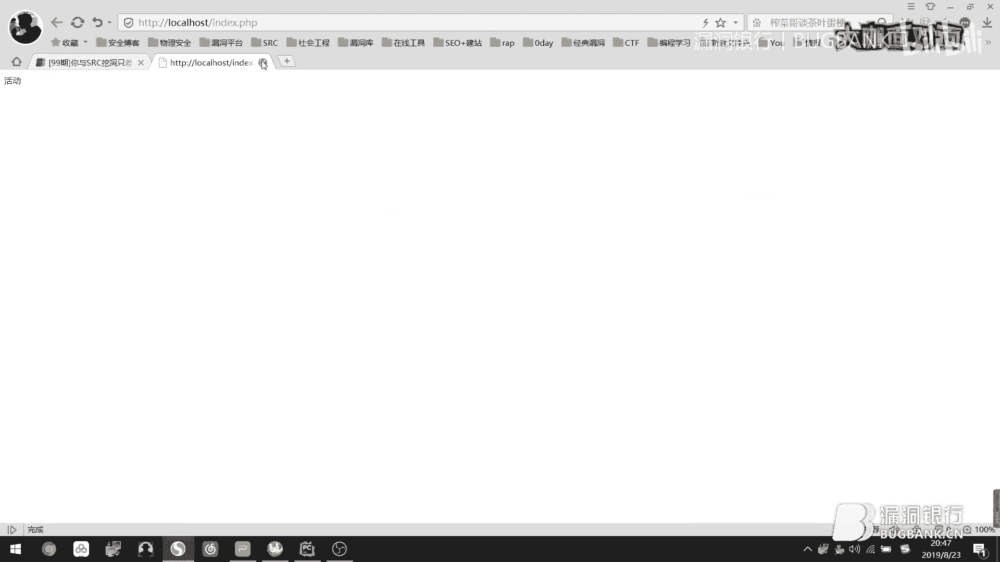

# 漏洞银行丨你与SRC挖洞只差一小时-小陈丨咖面99期 - P1：99期_x264 - 漏洞银行BUGBANK - BV1f4411q7mP

(音樂)。

為知舌存，應技術而生，各位小夥伴們，大家晚上好，歡迎參加第99期漏洞銀行安全技術直播，大咖面對面，我是今晚的主持人，年念，今晚我們邀請到的大咖，是來自WebSite團隊的核心成員小辰大咖。

他帶來的議題內容是，你與SRC只差一個小時，長期混跡於各大漏洞平台，並且熱愛技術分享的他，要給大家帶來玩轉SRC遊戲的獨門攻略，更有精彩的漏洞挖掘案例分享，喜歡挖洞的小夥伴們可要聽到最後哦。

同時歡迎各位小夥伴們登入直播間，在聊天區進行交流互動，如果在聽講過程中遇到疑問，可以隨時提出，演講完畢後，小辰大咖會在行長問答環節，集中解答小夥伴們的疑問，同時，參與行長問答。

就有機會獲得小辰大咖親自挑選的書籍，Web安全攻防滲透測試實戰指南，那麼下面就讓我們有請小辰大咖，開始今天的直播分享吧，Hello大家好我是小辰，歡迎大家的觀看。

然後今天這個就是說去講挖洞方面的一些知識。

然後呢這邊有四個目錄啊，第一個就是說把它比喻成一場遊戲，然後第二個的話就是說去一個有效的去定位，然後第三個就是說它的一些小技巧，然後第四個就是說去擴展大家的一些思維，然後去分享一些漏洞的一個案例。

然後在開始之前，然後就是說大家不要抱有這個矯修心理啊，盡早自首收手，並到公安機關投案自首爭取寬大處理，然後呢就是說SRC是什麼遊戲啊，既然是一場遊戲那我們首先對吧，肯定是要去遵守這個遊戲規則。

然後這邊是以某個SRC為例啊，然後他這邊有這個評分的一個標準啊，在每個SRC他都是有這個標準的啊，然後呢他有這個業務系所和這個安全幣，你去那個SRC他的那個公告的地方，他都會有這個漏洞評分的一個標準。

然後大家可以先去看一下，然後簡單來說一下這邊吧，比如說你去挖掘到了一個，一個一般的業務對吧，然後評價了是5分，然後呢你去挖的是一個，就是一個反射的一個XSS吧，然後算是地位對吧，然後你這邊是5。

然後這邊他給了你兩個安全幣對吧，那就是2乘以5，然後最終你會得到10個安全幣，然後呢他有的這個那個平台，就是說有的是1比5，就是1比5塊錢，有的是1比10，然後如果是1比5的話，那就是50。

如果是1比10的話，那就是100對吧，然後他這邊高位的話，也和這個低位的話相同，他這邊都有介紹，比如說高位是非核心系統中的高位漏洞，或者是核心系統中的一般漏洞，然後他會給你評價為高位，但是高位的話。

他這個安全幣是比低位高很多的，你去挖掘的話，假如你想去挖一些高的這個安全幣，那你就可以去針對他這個，高位裏邊的這些漏洞，然後進行一個挖掘，他這邊給你寫了很多，比如說可以就是導入數據的一個注入。

或者一些任意文件讀取，在這個平台他是算高位的，但是有的話，他是可能會給的這個比較少，所以說你建議還是大家去看一下，他這個評分的一個等級，然後說一下這個，如何在遊戲中進行升級。

首先那肯定就是說去遵守這個遊戲規則，接著就是說在遊戲規則上，去找到這個升級的一個方法，然後就是說去觀察各個SRC，他對這個漏洞評價的一個等級，因為每個平台他是有這個差別的，就是有的可能給的會多一點。

有的可能會少一點，然後知道了這個漏洞的評價等級，然後你再去觀察，他對這個業務範圍對吧，他有的是邊緣多少分，有的是核心業務多少分，如果你想去挖就是分比較高的，那你可以去挖核心方面的一些業務。

然後接下來就是說，去看你的這個基礎知識紮不紮實了，如果不紮實，你可以先去學習一下各個漏洞的原理，以及利用方法，因為如果你這個基礎知識不紮實的話，你去挖掘的話，你可能也會挖到一些。

但是你可能會錯過很多的一個漏洞，知道吧，就是說那個漏洞他可能認識你，但是你不認識他，然後這邊說一下，他怎麼去一個定位，俗話說知己知彼百戰不殆，在漏洞挖掘方面是一樣的，咱知道這個產商他有什麼業務。

那我們就可以根據他這個業務，可能存在的缺陷，對吧，那去挖掘這個漏洞，然後這邊的話，大家可以去想一下，比如說電商，大家可以去想一下，有哪些測試的地方，或者是說有哪些可能存在的漏洞。

大家可以在那個DAM上面發一下，就是自己的看法，然後每個人肯定有自己的那個想法，可能大家有的不一樣，然後這邊的話，就是說他這個，比如說註冊處，對吧，那可以就是說有這個人員互註冊，就比如說你去登錄，對吧。

比如說四維碼，你可以爆破，然後進行一個人用的註冊，比如說登錄處，對吧，那你可能有這個人用戶的一個登錄，比如說修改返回包了，然後還有就是說收貨地址，對吧，那你可能就是存在月權，也可能有XSS之類的，對吧。

所以說你看到這個他的功能點，就是他這個功能點有什麼功能，那你就會盡量去想一下，他可能就是說存在什麼缺陷，然後你再逐個的進行測試，比如說我這個收貨地址，他可能有這個XSS和月權，對吧。

那我首先我可以去測試一下XSS，對吧，如果沒有的話我再去換月權，然後逐個去測試一遍，然後再比如說這個訂單信息處，就是說你購買了這個訂單，那他可能有一個ID或者什麼PID，然後你可以去便利。

然後看到一個別人的一個訂單信息，然後就是說充值處，有一些邏輯支付的一些缺陷，比如說你一塊錢，對吧，去買幾千塊錢的東西，然後這邊當然還有很多的一個漏洞，然後我這邊省略了一下，然後這邊有個圖。

然後這邊就是一個頭像，對吧，上傳，那你會想到什麼漏洞呢，大家，比如說有人說的上傳，比如說這個他可能就是有上傳，對吧，可以直接get sale，但是他可能還有會有一些，就是SSRF之類的。

就比如說他去加在這個這個地址，對吧，那也可能會存在，當然不止這一方面漏洞啊，然後還有就是說他就這個上傳圖片，對吧，你沒有辦法get sale，但是他可能也會就是造成一個儲存的一個xss。

比如說他禁止上傳了，就是ASP PHP，然後JSP之類的，但是你測試發現他可以繞過，然後上傳一個HTML的一個文件，那你上傳一個HTML的文件，那就可以達到一個儲存xss的一個效果，對不對。

所以說你去多去測試一下，然後比如說還有這邊，對吧，收貨地址咱剛才說過了啊，然後就是賬戶信息，對吧，那你就可以去修改自己的信息，比如說CSRF了，對吧，然後別人打開，然後他修改為你規定的一些信息。

然後還有就是說月權，也可能存在月權，比如說他設置的是一個賬戶綁定類似於ID的那些東西，然後你便利IT也可以進行一個達到一個月權，還有就是說xss，對吧，所以說就是說你看到這些功能點的時候。

你腦海中一定要想就是說他可能存在哪些缺陷，對吧，那你然後再諸葛進行測試，然後這邊商品評價，對吧，商品評價那也可能就是說xss啦，或者是月權，或者是CSRF，對吧，你要把盡量每一個功能測試一遍。

比如說你去評價了，對吧，你去評價了，那有一個功能，他可能就是說刪除評價，對不對，那你可以再去測試刪除，他能不能就是刪除，然後或者是有沒有一些規律可言，比如說月權了，對吧，如果是一些ID。

但是他的ID非常小，他可能是11，對吧，那你可以就是寫一個POC，對吧，可以便利色違說，然後這樣的話讓他去訪問這個網站，然後他會循環，對吧，那這樣的話他也會達到一個打開，然後刪除自己評價的一個效果。

小夥伴們可能會遇到一個最經常問的問題，對吧，就是說什麼漏洞最好吧，那當然這邊我推薦就是說邏輯方面的漏洞，因為邏輯是根據開發人員的思維造成的漏洞，如果色違處理時間問題就會出現這樣的漏洞。

所以說只要你邏輯思維能力夠強，對吧，前提是你這個要有基礎知識，基礎知識紮實，你就不怕玩到漏洞，為什麼說他這個邏輯最好玩了，因為現在這個互聯網，他基本上沒有這個，現在還沒有這個防禦邏輯漏洞的一些WARF。

目前大多數就是Token驗證，Cypher文化，還有就是加密等方式進行防禦，如果小夥伴們碰到了這個加密，對吧，你就可以就是說找一些，就是說他的家的一些文件，就是說你看看他是什麼加密，然後進行一個解密。

然後最後再進行一個便利了之類的一些操作，然後再說一下這個定位漏洞的一個觸發點，比如說你去登錄的時候，對吧，登錄的時候他有這個登錄框，所以說你要去聯想他有什麼漏洞，比如說登錄框，對吧，他有這個助用。

然後你去搜尋你這個複製庫，有沒有這個賬號密碼，能不能登錄成功，對吧，所以說你要聯想，然後也可能就是說你假如說他發送了是一個，四維碼，那你就會想到這個任意用戶的一個登錄，那你可以就是便利一下，對不對。

持續發包看一下，能不能就是登錄成功，然後還有就是說這個賬庫，對吧，還有這個賬號密碼，對吧，然後你去便利一下，還有就是這個入口鏈，然後和這個稍微有點相似，然後還有就是說URL的一個跳轉。

就是說你在去登錄的時候，他可能會去跳轉到一些網站，然後你去抓包，可以看一下他有沒有這個進行一個跳轉，然後把那個URL給替換一下，看看能不能達到這個跳轉的一個漏洞，然後還就是憑證劫持。

就比如說有的時候他跳轉的時候，會帶著他的一個繪畫，就是Session繪畫，那你可以利用像CEYE這種平台，對吧，那你可以去劫持他的一個繪畫，然後還有就是你登錄之後，對吧，有個人信息處。

個人信息處那你會想到什麼漏洞呢，大家可以稍微想一下，就是除了這些，大家可以還想一下有哪些漏洞，比如說這個儲存XSS，那你在編輯個人信息的時候，那你可以就是說，把這個XSS的代碼進行測試一下。

還有就是樂圈，你抓包的時候，看看有沒有可以便利的一些東西，當然這個東西不一定是在GET和POST的一些請求，也可能是在Cookie裡面，大家要多觀察一下，還有就是說可能存在這個注入，或者是CSRF。

對吧，然後當然你也可以打數個圈，比如說樂圈加XSS，對吧，那你又可以就是，它就相當於等於對吧，等於任意用戶登錄，對吧，那如果你就是樂圈給別人加上這個XSS之後，然後別人一登錄，對吧。

那你就會打了他的一個Cookie，然後你也就可以登錄了，然後比如再說就是XSS加CSRF，就常說的XSRF，對吧，比如說它可能是一個SELF的一個XSS，那咱可以利用這個CSRF，對吧。

進行結合一個利用，有可能就是說，可以利用這個XSS，然後還有就是說登錄之後，對吧，它可能有這個上傳點，對吧，就比如說上傳圖片，咱剛才說了，對吧，可以GET，然後還有就是說你可以去上傳一下HTML的文件。

對吧，那它可能就是說禁止了這些腳本木馬，那如果你可以上傳一個HTML的一個文件，那你就可以等於一個儲存XSS，對吧，所以說大家要去多多測試一下，然後還有就是說模糊測試，模糊測試的話，為什麼要說這個呢。

因為就是說很多它這個網站有一些隱藏的一個參數，隱藏的參數的話，咱無非就是兩種辦法，一個是利用這個BP裡面的一些測試的一個功能，對吧，進行IPOZ進行一個測試，然後還有就是說利用這個自動化的一個掃描。

就比如說這些掃描器對吧，給它大型一點的，那你可以去掃描一下，因為它這個大型掃描器裡面，它規定的有一些隱藏的一個參數，然後這樣的話你可以去測試一下，有的時候它會掃出來，就比如說我舉個例子啊。

這是一個真實的例子啊，但是這個裡面沒有那個案例，就是說有一個項目它上線了，然後然後正好就是朋友來找我玩，然後我想出去玩，然後我就把那個項目的一個URL，對吧，然後我就放到這個掃描器上面掃一下掛一下。

然後等晚上九點多回家的時候，我發現它掃到了一個任意文件對取，對吧，然後你自己再進行一個手動測試，然後最後付現成功，然後提交，然後再說一下這個精準定位，就是來源於你這個基礎知識啊。

然後就是說觀察業務的功能，同時進行思考可能存在的一個缺陷，然後逐步進行測試啊，千萬不要怕麻煩，然後這邊有兩個小演示啊，然後我把這個環境開一下，就比如在這個地方對吧，那你看到它這個框框對不對。

你能想到一些什麼漏洞對不對，你看到這個框框，你可以去想一些漏洞對吧，那可能它就是說去存在這個XSS啊，那咱可以去測試一下，對吧，對吧，可以看到它輸入什麼返回什麼，然後這邊URL也變了。

也就是說它可能存在一個反射的一個XSS，那咱可以去稍微測試一下，比如說咱先利用這個HTML的一個標籤，對吧，進行一個測試，對吧，可以看到它這邊是執行了這個HTML的一個標籤，那你就可以猜測一下。

它可能就是說全部存在這個CSR，這個XSS啊，不好意思，剛才說錯了，好，可以看到它這邊是測試是存在的啊，那可能就是說小夥伴會問就是說，剛才那個HTML有什麼作用，對吧。

那比如說它過濾了一些XSS的一些字符，對吧，那你沒有辦法造成一個XSS的一個漏洞，對吧，那你可以就是說造成一個HTML注入的一個漏洞，比如說咱可以利用這個進行一個釣魚，對吧，然後這邊把標籤改大一點。

對吧，那這樣的話你點擊啊，可以看到下面。

對吧，然後它就會進行一個跳轉啊。

對吧，然後你可以就是說它這個框框對不對，那你可以利用它這個CSRF，對不對，那你可以就是說結合打一個組合圈，然後就是說它打開的只有它個人資料，比如說對吧，然後去修改一些這個信息。

然後它這個可能會修改你去修改它這個名稱，然後如果它哪天不小心點到了。

對吧，那就可以說你進行一個釣魚，對吧，然後還有就是這邊的一個啊。

就是說，然後這邊啊，大家一看可能就是說像注入，對吧，然後咱可以先測試一下，對吧，然後可以看2，對吧，那它也返回了一些內容，然後既然它是這個數字型的，對吧，那咱可以就是說2-1，對吧，因為在數據庫裡面。

它是可以執行的，然後可以看到它是返回這個1的內容，對吧，那咱就可以猜測它一定執行了這個語句，對吧，SECURE語句，那可以加，再加一些進行一個判斷，對吧，然後當你看到這些東西的時候。

你一定要聯想它可能就是說存在什麼漏洞，對吧，然後你測試完了，對吧，那你可以就是說放到裡面跑一下，然後可以看一下，因為你剛才測試它的確是存在的，對吧，如果說它沒有跑出來，對吧，那肯定就是有WARP，對吧。

所以說就是說你就是在就是發現這些功能的時候，就是說有個框框，對吧，有個ID，你要去腦海中一定要想就是說它可能就是說存在什麼漏洞，然後你再逐步進行一個測試，然後再說一下它這個挖掘的小技巧。

比如說你去關注它這個新增的一個業務，對吧，因為剛上線的業務往往是最脆弱的，比如說新的一個功能，對吧，就比如說，邀請好友，對吧，一個新的功能，邀請好友獎勵一塊錢，對吧，那你可以測試測試，能不能就是說。

就是說便利邀請了，或者是說鹵羊毛，對不對，然後還就是說新上線的一個子域名，然後新功能的話，那咱可以搞一個這個Python的一個小腳本，然後這邊大家給大家稍微演示一下，比較簡單，然後這個腳本的話。

就是說有一個關鍵詞，然後目標的一個URL，然後就是利用這個查看這個網頁源代碼。

然後有匹配關鍵字，比較簡單，然後比如這個對吧。

然後我可以先把這個改一下，比如說他這個網站，對吧，他是現在初始化是這樣的，對吧，沒有發現一些東西，然後你可以設定一個關鍵字，比如說活動，對吧，那你可以就是說，他會去判斷這個頁面有沒有活動，這兩個字。

對吧，然後可以判斷，然後有時間，也就是說在這個時間，他發現到了這個，就是說有這個關鍵字，那可能就是說他出現了一個新的功能，對吧，那你就可以去趕緊進行一個測試，然後如果你要就是說這個頁面，對吧。

你找不到這個關鍵字，那你可以用這個搜索，對不對，你可以搜索活動，然後這樣的話可以去找到這個新的一個地方，然後進行一個測試，然後這邊還有兩個插件。

就是說比如說這個瀏覽器的插件，網頁哨兵，比如說這個，這個是360的一個瀏覽器，然後他下載了一個插件，然後他這個插件的話比較智能一點。

可以選擇一個區域，然後監控的一個名稱，對吧，監控的一個內容，然後頻率，對吧，然後名稱，然後區域，對吧，然後他這個比較好一點啊，然後就是腳本的話，大佬們可以就是說如果可以根據自己的一個需求。

然後去寫一個小腳本。

然後這邊還有一個插件，然後這個插件是一個谷歌瀏覽器的一個插件，好，這個有啊，比如說這邊對吧，然後他這邊你可以去添加，不過他是英文的啊，然後這邊可以設置你的這個關鍵字，然後名稱以及域名。

然後去觀察這個頁面出現內容，就類似於剛才第一次演示的那個小腳本，然後不過他這邊可以去提醒你，然後大家就是說如果需要的話，然後可以去下去下載一下，然後還有就是說這個GitHub上面那個監控。

然後咱直接搜索這個監控。

然後可以篩選一下這個語言。

然後這邊他會就有相似的一些腳本，比如說這些敏感的一些信息洩漏，當然比如說這個對吧，編寫的一個web的一個監控的一個系統，當然這邊還有很多啊，大家可以去看一下，如果自己需要的話，然後可以去下載用一下。

然後還有就是說啊，這邊呢說完了就是說監測一個新功能的一些方法，再說一下就是說監控這個子域名啊，然後監控子域名的話，然後這邊有一款工具啊，然後就是這一款啊，大家可以去搜一下啊。

然後這邊可以就是說他有一些配置的一些方法，然後大家如果需要的話對吧，可以去看一下，可以監控就是說一些新出來的一些域名，但是你監控的話他肯定也是不全的啊，最強的方法我認為就是說你去生成一個字典。

比如說A到Z四位數對吧，然後你去爆破一下，這樣的話一般可以更強一點，但是比較耗時間，如果有服務器的小夥伴可以去搞一下，然後也許你會發現別人沒有發現的一些域名，然後呢這邊再說一下第二個這個小技巧。

就是說嘗試申請這個非普通用戶擁有的權限，比如說餓了嗎對吧，那普通用戶你可以去訂外賣，商家你可以去送餐，然後騎手你可以兼訂單對吧，分別註冊三個不同權限的用戶進行測試，也許你就會發現很多漏洞。

很多大佬都是這樣挖的，有可能就是說你測的一個業務對吧，相信很多朋友他測的這個業務，可能就是說你只是一個普通用戶對吧，你測的你只能訂外賣，但是這個功能很多大佬測過了對吧，所以說你就是沒有去發現了一個漏洞。

然後你就會頭腦發熱，這個時候你可以去申請一下商家，你去註冊對吧，網上找一些信息都是有的，然後你可以註冊，然後你可以去賣餐對吧，那你可以賣餐，你會想到可以發佈一些商品對不對，那既然可以發佈。

那肯定還可以就是說刪除對吧，那你可以再測試一下有沒有越權，有沒有XSS對不對，比如說騎手，騎手那你可以接訂單對不對，那你可以越權對不對，然後就是說比如說這邊對吧，他有這個騎手的一個對吧，那排行榜。

那大家就是看到這個有一個點贊對不對，那這個點贊的話，那你就是說你可以去想到一些哪些漏洞對不對，點贊的話你可以想到變化現場對不對，可以說去刷贊是不是，所以說你要看到這些功能，你腦海中要去想一下有哪些漏洞。

然後還有就是說第三點，去留意一下以前沒有挖到洞的功能，為什麼說要留意呢，因為可能就是說以前對吧，你沒有挖到的原因，可能沒有辦法對這個功能進行一個測試，然後在後面你不斷的一個學習。

然後你發現到了一個新的思路，然後你突然想起和以前測試的功能一樣，然後以前你沒有測試出問題對吧，然後這次你測試出了問題，但是重複了，當然這邊和大家開個玩笑，可能就會重複，因為大腦們可能就是說已經提交過了。

但是你不要灰心，因為這一次你既然能挖到，就是說你這個技術已經提升了，對不對，所以說即使重複了，大家也不要灰心，然後這邊大家可以去思考一下，什麼是漏洞，大家可以思考一下，相信大家每個人都有這個。

自己對漏洞的一個看法，大家可以思考一下，然後我對他的理解就是說，漏洞是只可以對系統造成一定的影響，對吧，只要可以造成一定的影響，危害正常業務的一個運行，對吧，那他就算漏洞，這是我對他的一個理解。

不知道大家有沒有其他的一些理解，相信不同人可能就是，每個人的看法不一樣，是吧，然後就是說漏洞挖掘有三個要素，然後第一就是說一個廣度，就是說你的範圍了資產了，就是信息收集一塊了，然後就是說深度。

就是說每個共同點，什麼之類的就像剛才餓了嘛，對吧，每個權限你都進行一個測試一下，還有就是說認知，就是說你這個基礎知識肯定是要有的，不然你去挖掘的話就是說，漏洞可能認識你但是你不認識他。

然後就會錯過一個漏洞，對吧，所以說大家這三點啊，最好都要有，然後可能就是小夥伴可能還會遇到一個問題啊，就是說挖了一天沒有挖到洞怎麼辦，對吧，然後我覺得就是說，你如果一天沒有挖到。

對吧那可能是你的這個運氣不好，對吧誰都有運氣的，但是運氣是建立在你這個技術上面的，如果你這個技術越高，對吧，懂得越多那你就是運氣就會越好，所以說他是成正比的，然後還有就是說，如果兩天沒有挖到對吧。

也許是你這個業務的一個範圍比較少，就是說你前期做的這個信息收集可能不夠，對吧，所以說我建議你再去，測試，就是信息收集一下，多去收集一些東西，比如說他的一些郵箱啊，對不對用戶名啦。

那你可以利用一些爆破測試一下，對吧，就是反復的一個測試，然後你可能就會錯過一些漏洞，很多漏洞他都會，有的時候會溢，就是突出你的想像，然後就是說，你挖的時候對吧，也可能是大佬們挖了很多次了對吧。

然後就是說如果三天沒有挖到，對吧，也可能是你太累了對不對，所以說你需要去休息一下，然後休息放鬆一下，可以去玩耍一下，然後如果就是說你還沒有挖到，一個星期了對吧，當然這裡包括重復和忽略的。

畢竟你挖到了對吧，那你如果一個星期沒有挖到，那你可能就是說這個，基礎知識不紮實，你要清楚地去認識自己，然後再去學習，然後我建議你就是在叢林學習，然後了解去各個漏洞的原理，以及利用和修復方法。

都要進行掌握，同時還能想出自己新的一個擴展思路，當然擴展思路，你怎麼去想呢，那就是多嘗試，大家就多嘗試就OK了，基本上有的時候，你去測試的時候，他很有可能就會突出你的想像，然後就是把漏洞給送給你。

所以說你一定要去反復的一個測試，如果有問題就去測試，然後呢，這邊有一個案例對吧，就是說垂直月圈，大家看這個對吧，然後可以思考一下，有沒有缺陷，就這邊對吧，大家可以去稍微想一下，然後有的小夥伴。

可能看出來了，就是說他這個地方對吧，三神是指繪畫的意思對吧，然後user你的用戶，然後他這邊有一個三，然後經過測試發現就是說，一對吧他這個是指權限的意思，然後一的話是這個管理員的一個用戶。

然後二的話是一個貴賓，VIP的一個用戶，然後三的話就是一個普通的用戶，然後我去把這個給修改一下，然後最後就是說，可以就是達到一個垂直月圈的一個效果，然後第二個小案例就是說，並發的一個請求。

比如說這邊可以去領這個，手機號然後領紅包對吧，然後你去輸入你的手機號，然後這邊你可以就是，利用這個並發現場對吧，然後去發包，然後你就可以得到很多的，一個這個紅包，然後這邊就是利用，這個VP的一個。

演示方法就比如說你這邊，對吧他這個是指並發的一個現場，那你可以開高一點，然後重視說那你可以開小一點，對吧然後暫停說然後請求延時，然後請求延時的話，一定要設置為零，因為如果你要延時的話他這個包。

就沒有辦法並發了，因為這個就是屬於多線程了，所以說大家要注意一下，然後利用這個FB也可以，然後這邊還有一個案例，就是說程序一出，然後這邊有一個程序一出，就是說一個，就是在開發的時候，比如說有那個。

相信開發的同學應該都知道，比如說int是一個最大的值，他是這個值對吧，然後還有就是說浮點型一些，數字類型對吧，然後程序開發的時候，程序員一般會計算數量的操作時，會用到int，因為如果像商品的話對吧。

他不會用到一些小數對吧，所以說都是int，而int的最大值為這個值對吧，那如果超出的話那就肯定就是一輸了，對吧然後就會導致這個程序出錯，然後這邊有一個小案例，比如說就是說在遊戲裡面。

對吧他最大值就是這個，所以用了int，因為他這個寶箱對吧，他不可能為小數，然後這個假如商品的單價為2，那我們要做的就是說，2乘以這個數量對吧，然後只要大於他就OK，就會達到一個溢出的效果。

假如買這個對吧，這個數量，然後乘以2，然後就是說已經溢出了一個3，對吧那他超出了一個最大值，然後單價就會變成3，然後這個就是從零開始計算，於是嘗試了一下，然後就是最後刷到了這個符文。

然後這是別的一個大腦的案例，然後我去分享一下，就是說程序溢出，大家就是在測試支付的時候，都可以去測試一下，然後這個案例就是說，你不要急著去放棄，你不確定就是說開發人員會給你帶來，哪些的一個驚喜。

比如說這是一個站點對吧，我去訪問的時候它是一個403，對吧然後又通過一個目錄媒體，也就是咱常說的一個目錄掃描，然後得到一個這個地址，對吧但是他這邊出錯了，他這邊提示的就是說，他這個英文翻譯過來。

就是說參數錯誤的意思，那肯定就是說他缺少，這個參數對吧，這邊沒有參數，然後利用這個FUZZ對不對，然後最後就是去，便利這個參數，就是以前你可以去收集一些字典，對吧然後最後就是，加一個單一號然後報錯了。

然後最後得到了一個注入，然後還有就是說一個小總結，就是說在邏輯方面對吧，測試漏洞就是反復對參數進行一個測試，細心分析，每一個參數的作用對吧，一般參數它都會就是，對應和英文有關，比如說PHONE對吧。

對吧它是一個手機號對吧，還有就是說像Email，對吧所以說它每個參數，都是有意思的所以說你一定要，去了解它每個參數的一個作用，然後再進行一個測試，如果不懂的話你可以去百度翻譯，因為它這個是根據。

這個開發人員，他肯定會是根據，這個英文然後來命名的，它不可能說手機號，然後整個手機對不對，它肯定不會這樣，因為它如果會這樣的話它肯定不會進，這個公司當一個程序員，然後還有就是說，就是說GET POST。

COOPERATE的內容進行一個反復的測試，也就是說咱常說的，一個增深改查，有的時候也會存在一些，隱藏的一個參數，那咱可以利用這個FUD對吧，以及這個自動化散播器進行一個測試，然後最後你再進行。

一個手工判斷然後再提交對吧，然後簡單，一句話就是說了解業務的運行，才能最大化的發現漏洞的一個缺陷，然後這邊有一個工具箱，如果大家有需要的話，可以去用一下，然後大家可以看一下。

然後還是剛才說的知己知彼百戰不殆，所以說你去了解這個業務的運行，然後才能最大化的一個，發現這個漏洞的一個缺陷，當然到這裡還是沒有結束的，當然這邊還有一些，其他的東西，我補充一下。

比如說驗證碼的一個繞過姿勢，比如說驗證碼，它可以重復使用，就是說你發報了一次，它這個驗證碼不變，然後你再去發一次，然後還有就是說萬能的一個驗證碼，比如說開發人員，他去測試的時候，他先麻煩對吧。

可以先搞一個萬能的驗證碼，然後它有可能，有可能是4個8也可能是4個0，也有可能是4個1對吧，一般都是四位數一樣的，大家可以去測試一下，然後還有就是說空驗證碼的一個繞過，就是說把那個驗證碼改為空。

有可能也會進行一個繞過，然後還有就是說這個，驗證碼的一個可識別，就比如說一些簡單的一些CMS，對吧，比如說它這個開發的時候比較簡單，這個驗證碼，然後利用一些腳本或者是工具，可以進行一個識別出來。

然後還有就是說其他驗證號位進行對比，大家可能就是聽不懂，然後這邊特別舉例了一下，然後比如說就是說僅僅驗證了密碼字段，和這個驗證碼，然後用戶名未做檢驗，那這個時候可以輸入一個弱密碼，對吧。

然後去編列用戶名，然後得到一個正確的一個口令，然後這邊再補充一個就是說，短信轟炸的一個繞過姿勢，就比如說它沒有這個任何的一個限制，那你可以持續去發送這個短信，對吧，這也是最常的。

也可以間單間到沒有什麼繞過姿勢，然後還就是說你可以去繞過這個短信的一個，就是普通的一個驗證碼，然後得到這個發短信的一個效果，然後就是剛才說的對吧，這個驗證碼的一個繞過，然後還就是說便利手機號進行轟炸。

然後消耗資源對吧，一般這樣的話是不會通過的，但是如果說你有一個仇家對不對，然後你可以就是說，把它的那個就像你去批發這個手機號發送短信，對吧，它可能是一分錢假如說是兩個，對吧那你可以便利手機號。

這樣的話它可能去再去花錢，花個幾十塊再去買對不對，所以說會達到一個消耗資源的一個效果，但是一般的話是提交是不會通過的啊，大家注意一下，然後還有就是說手機號，就是說你在手機號前面對吧。

就是說區號你去加一個86，有的時候也可以繞過限制，然後還有就是說你手機號輸入這個郵箱，然後導致無限的轟炸，它可能就是說沒有這個進行一個規定的一個驗證，然後這個同理就是說郵箱的時候，你輸入這個手機號對吧。

然後最後導致無限的一個轟炸，所以說這些東西，它們是可以通過的，然後還有就是說，無限的一個轟炸，所以說這些方面就是說，你一定要去反復的一個測試，就像這些對吧，這有6點，那如果你去反復測試的時候沒有的話。

你再去換一個其他思路，如果你只試了第二個對吧，你沒有繞過驗證碼，然後測試，那你可以測試一下這個+86，對不對，可不可以重複發送，然後還有就是說再補充一點，如果說你去發送那個驗證碼。

它可能就是第一次給你的一個驗證碼，是1234，然後過了它這個驗證碼的有效時間，是30分鐘，6位說吧，然後30分鐘，對吧，然後就是說它那個，這樣的話，你可以就是說你再去獲取一次驗證碼。

它有可能就是和上次的一樣，對吧，然後這樣的話，你可以拿著多開一個窗口，然後一直去，發送這個獲取驗證碼的一個包，然後它每次都是這個驗證碼，這樣的話這個30分鐘就可以延長，對吧延長到無限時間。

無限時間的話那這6位說肯定也是可以爆破的，對吧，就是時間有一點長，所以說這樣的話也可以達到一個繞過的一個效果，然後這邊最後再去補充一下，其他的一個小知識，就是說大家在挖崩的時候建議。

就是有翻倍的活動的時候再去挖，因為這樣的話分數會很高，然後還有就是說遇到這個，法定節假日可以去挖，比如說，中秋節對吧，你挖到一定分數或者是漏洞數量，對吧那你可以就是，他們可能會送你一顆月餅，對不對。

所以說在節日的時候，可以去挖一下，挖到節日的前一星期和，一般都是前一星期，然後還有就是說，盡量在各大SRC去保留，這個原本的一個分數，或者是一些幣對吧，因為你在節假日的時候你可以拿到1分。

對吧可以去兌換這個節日的一個禮包，比如說端午節你可以兌換粽子，一般的話是1分，也有的是5分，所以說你要去看到這個平台了，一般的話這種節假日，就是節日，它會給的這個規定的一個分很少，然後你就可以兌換。

也算是一個小福利，然後還有就是說，如果大家提交的時候對吧，就是說你對這個評分可能有一些差異，對不對，那你可以去找這個運費人員進行一個協商，因為如果你不協商的話，他肯定就是這個分數了對吧，如果你協商的話。

他可能會對你進行一個重新評分，對吧那可能會高5分，如果高5分的話他是1比10的話，那就是50塊對不對，那你想一下一句話，一句話掙了50塊對不對，但是不是說你什麼都要去找協商，必須是你就是覺得。

他可以算上高位了之類的，大家也不要就是說去騷擾這個運維的一個人員，然後還有就是說，如果你不會挖洞對吧，你是一個新人對吧，但是你想去掙錢，那你可以就是提交這個威脅情報，他每個SRC基本上都有這個。

這個SRC的一個協商，他每個SRC基本上都有這個威脅情報，威脅情報簡單來說，簡單來說就是說，如果你發現，有一些對這個SRC有威脅對不對，比如說你在某個群對吧，發現了某人，他發了一張圖片，然後你一搜。

比如說某個站蓋特市有了對不對，他發了一個圖片，然後但是他也沒有提交，然後呢，你可以就是提交威脅情報，但是前提是你確定有這個威脅情報，但是前提是你確定有這個威脅情報，一定要有準確性知道吧，然後你提交的話。

他肯定也會給你相應的一些分數，然後給你一些獎勵，然後如果就是這個漏洞評分的一個標準，和這個威脅情報，他在那個各大SRC的一個公告欄上，他在那個各大SRC的一個公告欄上，都會有這個介紹的。

大家可以去看一下，然後到了最後啊，比如說這邊有我的一個聯繫方式，如果大家有這個技術方面的一個問題，對吧大家可以咱去多多交流，對吧大家可以咱去多多交流，對不對，然後這邊就結束了，感謝小陳大咖的精彩分享。

感謝小陳大咖的精彩分享，我們現在即將進行到下一個環節，就是我們的行長問答環節，就是我們的行長問答環節，大咖會在此環節集中解答大家的疑問，大咖會在此環節集中解答大家的疑問。

小夥伴們有什麼想問大咖的，現在也還是可以提出來，在稍後的福利贈書環節，小陳大咖會根據直播間的交流情況，小陳大咖會根據直播間的交流情況，小陳大咖會根據直播間的交流情況，選出一位幸運觀眾。

所以大家抓緊時間然後開始提問吧，小陳也可以現在打開直播間，看一下那個觀眾的聊天界面，右上角有一個只看提問，右上角有一個只看提問，可以拉上去看一下，然後選擇問題來進行回答，然後選擇問題來進行回答。

然後選擇問題來進行回答，大家可以就是說有提問的話，大家可以就是說有提問的話，可以說一下，我們的那個技術表格有遇到新的提問，也還是會選進來，也還是會選進來，那個右上角只看提問，那個右上角只看提問。

我看到有個人說是你們對後台未授權拿下賬號這種評價是什麼漏洞，我看到有個人說是你們對後台未授權拿下賬號這種評價是什麼漏洞，我看到有個人說是你們對後台未授權拿下賬號這種評價是什麼漏洞。

我看到有個人說是你們對後台未授權拿下賬號這種評價是什麼漏洞，所以說這個的話你要去看他有什麼樣的權限，对吧，如果说只是一个后台权限啊，你没有办法get show什么之类的，对吧。

他可能会给你最多也就算一个高位，啊，如果你去get show了之类的，对吧，或者说有注入，然后是一个比较高的一个权限，然后进行了一个get show，然后这样的话，他会给你评价一个严重的。

然后还有人问就是说，得学，多久才能挖到漏洞，你可以就是说比如说你可以去学XSS，对吧，那你学了你就只会XSS，那你也可以去针对只挖XSS，对不对，所以说你要说学多久的话。

那肯定就是说你要有这个基础的一个知识，对吧，基础知识掌握之后呢，然后你再去，就是诸葛进行一个测试，因为这样的话你才能测试的一个全面，然后有人说头发全秃可以学这个吗，不耽误，不耽误，你开法拉利也不影响的。

然后还有就是说挖洞的时候注意哪些法律的实现，比如说一些数据了，对吧，有些数据你不要就是获取它，你只要能证明这个漏洞，当然get show之后呢，你测试完之后一定要把你那个show给删掉，对吧。

但是你一定要截图证明就OK了，然后一些数据千万不要获取，然后有人说，请问小陈哥哥游戏里面的宝箱数值是在本地保存吗，服务器是怎么确定这个数字呢，这个就是说刚才说的一个int对吧，如果你学编程的话。

肯定会知道int的一个最大值，那它的最大值，因为就是在一些比如说支付对吧，一个商品，比如说一个商品是一个1对吧，那它肯定不会是一个1。5，对不对，因为它不可能是小数，如果这个商品是一个小数的话。

那它肯定就会就会出错了，对不对，所以说你可以达到一个溢出的一个效果，然后只要超过这个最大值，目录没举，它会不断的发送请求包，触发防火墙错裂吗，怎么隐蔽这个的话，你可以就是说把那个现成数对吧。

比如说现成数你可以就是说降低一下，对不对，有人说那过年挖有没有红包对不对，那过年你去挖的话，他各个SRC他肯定会有福利的啊，比如说新年礼包对不对，所以说你要去看这个SRC的它的一个每个SRC是不同的。

大家可以多去关注一下，比如说一些SRC的群对吧，那你再去这个挖SRC，你可以加一些群，如果有公告的话，他们肯定会在群里通知，对不对，在挖SRC时，一般是最多，是多段的时效性最好，一周嘛，你去挖的话。

比如说你去下班，对不对，你去下班的话，你都可以去挖，前提是你要有一个良好的一个精神状态啊，比如说你一上午对吧，比如说你刚才已经挖了两个小时还没有挖到，对吧，那你可以去再怼一会儿，对吧，你不要去。

那你可以去换一些边缘的一些业务，不一定要去挖一下这个就是核心的业务，有人说如果碰到有WARP怎么办啊，如果有WARP的话，那大家可以去挖逻辑漏洞，对不对，逻辑漏洞他是不怕WARP的。

所以说并不一定要去挖一些注入之类的，而且逻辑的话，比如说越圈对不对，那他你已经越到了一个其他用户的一个权限，那他给的一个分数也是非常高的，挖洞有什么数据推荐啊，就是说这这一期对吧。

就是那个送了一本书就很好，我看一下，就是说，web安全工坊渗透测试实战指南还是不错的，资产怎么可以尽可能的多收集啊，资产的话，如果你要时间比较多对吧，那你可以就是说，你可以找那个生成一个字典对吧。

比如说A到Z生成四位数对吧，你可以去爆破他这个字域名，还有就是说C段，C段你也尽量去收集一下，因为如果是大企业的话，他一般都是很多服务器都是相相连接的，也就是说刚才说的知己知彼百战不殆对吧，你去了解他。

你才可能去更好的去挖掘，啊，有没有靶场推荐就像很常见的对吧，比如说DVWA也很不错，也可以去测试一下，啊，如果拿到一个D的权限，有没有必要进一步的去挖掘验证，那你要看是什么样的一个DV的一个权限啊。

比如说你登录了一个后台的一个管理，他是一个D权限对吧，那你可以一定要在这个后台或者是一些修改密码的地方去测试一下，有没有垂直越圈，有可能如果你运气很好的话，那你可能就是说你可以得到一个管理员的账号。

对不对，啊，然后有人说APP怎么抓包，那你可以利用这个BP对吧，他也是一样的进行一个找包的，就是说你可以用模拟器对吧，可以下一个逍遥模拟器什么之类的，FUZZ的话，就是说，一个BP就够了啊。

主要主要的话还是就是说字典，还有就是说一个大型的一个扫描器，一个自动化的一个扫描，因为很多参数它是隐藏的，有人说挖SRC需要隐藏自己吗，如果有如果你有这个条件的话，建议还是隐藏对吧。

因为如果他要告你的话，你根本跑不掉的，绕过WARF有什么靶机可以练习吗，如果绕过WARF的话，你可以去下这些WARF，比如说安全狗对吧，你下了之后呢，然后你自己在本地去搭建，然后开启这个防火墙。

然后测试，有人说这个注入怎么绕过了之类的，这一方面我也没有就是非常细的一个研究，有人说紫寓民怎么收集，遇到WARF紫寓民探测全部返回500，那你可以就是说，比如说他这个公司有名称对不对。

那你可以去爱战对吧，搜他这个名称，他也会有相应的一个子寓民，还有就是说你这个C段对吧，C段你也可以去扫描一下，你问了三个问题，你可以再说一下，可能我刚才没有看到这别人发的太快了，你可以再发一下。

过滤了监控号的储存XSS能绕过吗，肯定能绕过的，你可以去网上搜一下，那个XSS绕过有很多的一个案例，你可以比如说编码对不对，你可以把这个编码一下，然后我再补充一点吧，就是说XSS的话，呃。

URL编码两次很大的几率可以绕过一些厂商，目前是挖洞主要是手动一个一个进行挖掘，还是Python写P量脚跟跑，然后再来验证，我先说一下这个一个一个挖掘，一个挖一个挖掘的话是针对SRC。

就是说你去测试的话，对吧，然后如果是P量跑的话，你肯定就是说P量对不对，P量，然后去挖一些漏洞，然后提降刷一些东西了，对吧，哪些漏洞新手好挖一点啊，那肯定就是说啊，逻辑方面对不对。

逻辑方面的话肯定是最好挖的，大额支付逻辑怎么测试，就比如说你可以测试一下刚才的，就是说溢出对不对，储存型XSRC怎么找网站啊，你可以搜一些电商的网站，对吧，至于关键词你可以自己搜到，我就不多说了。

然后还有就是说，你开始挖SRC挖到第一个现金洞用了多久，第一个现金洞买了一台二手电脑，国外的站有没有什么好的思路，对国外站毫无头绪，特别是这种大型的CMS，那你他是这个CMS。

那你可以去找他的这个CMS，一些报的以前漏洞，对吧，怎么获取最新漏洞的一个情报，那你可以去就比如说QQ群，对不对，你可以加一些什么HC群，对不对，然后看别人发的对不对，那如果他是威胁到了这个SRC。

对吧，那你就可以提交，前提是你确认了，挖洞挖到什么程度，收手不会对自己造成影响，那肯定就是说你不要获取他的一些敏感数据，对他这个人说的还有就是公众号，一般这种公众号的话都是国际方面的一些东西。

或者一些最新爆出来的一些漏洞之类的，目录字典的话，对开源网站进行政策收集，我也没有收集过，一般的话都是用的GitHub上面一些大佬的一些字典，测试支付的时候，你要支付一百万，也测试嘛。

那你可以把这个金额改小一点，对不对，他是既然是你测试支付的时候，你肯定不会支付这么金这么大的一个金额，然后你说到这一点，我也想起来一点，比如说一个网站，对吧，你可以去他有一个开通VIP的一个服务，对吧。

那你开通会员，他肯定就是多了一些权限，对不对，那多了一些权限，那你就可以再继续一个测试，对吧，陈师傅讲的挖洞姿势不错啊，谢谢，谢谢，有很多地方没有办法小额支付，那你可以改一下，对不对，或者是让他溢出。

对不对，他比较大的一个金额，就是刚才说的溢出，对不对，你可以测试一下，如果是真的要你支付非常多的一个金额，那你肯定不会支付，如果你开通的时候VIP对吧，你开不起，那你可以就是测试一下，对吧。

可以试试一块钱能不能开，如果太大的一个金额，那建议还是不要支付，挖洞的时候有没有必要进行一定的资金投入，如果说比如说五块钱对吧，那你可以投入一下，如果一百万那就算了，好，那我看今晚小伙伴提问都挺踊跃的。

小城大咖也回答了挺多，也非常感谢小城大咖的耐心解答，那我觉得今晚的提问时间也差不多了，由于时间有限，那要不我们就先到这儿，如果大家还有后续的问题，想要问小城大咖的话，可以加群或者是加小城大咖的联系方式。

那么我们下面就要来到今晚的福利，小城大咖亲自挑选了一本书籍，外部安全攻防渗透测试实战指南，要送出究竟这份礼物要落到哪位幸运观众的头上呢，那我们就有请小城大咖来选出今晚的幸运观众吧。

小城你可以在你想要赠书的观众的ID边上点击设为幸运，然后顺便给我报一下他的ID，大家看到右下角的一个送礼物了没，开玩笑，大咖如果你那啥就是你的这个，BK比较多你也可以赏我一点就对了。

大咖刚刚也说了这本书对新手挖洞是比较好，也是所以就是里面很多东西都是接近实战，大家弹幕刷起来了我卡了，你卡了那的那好了好了好了，然后看哪一个，对对对就点击设为幸运好了，看中了哪位。

那不能给安杰了给他就是就是内推了，不能给他，安杰应该也不用了你给安杰就是看不中，就直接点设为幸运是吧，对点击设为幸运就好了，是卡住了吗，是还在飘，没有不知道给谁，没事你或者都可以，你看或者谁提问最积极。

谁夸你帅，上次安杰就是比较虚荣的，有人夸他帅就送出去了，快快谁夸我帅，谁的字最长我就送给谁，五秒钟谁发了帅我给谁，有个说小陈大咖最帅，小陈大咖有女朋友，小陈大咖两秒钟，秋秋说大咖实在选不出来就选我吧。

问题不大，哎等一下等一下，哇要这个人好选了，我好像又卡了，我截图发给你，好的我看一下，是那个发的最快字又长的，恭喜这位直播间ID为Mr。梁的小伙伴，恭喜你获得这位，啊不对，恭喜你获得这本。

Vibe安全工房渗透测试实战指南，小陈大咖说你是发的最快，发的最长的，然后他非常钟意你，然后会把这本书送给你，然后你根据直播间的获奖提示，在相应的区域留下正确的收获信息，或者在直播后私聊我对讲也可以。

我们会尽快将书给你寄出，那么到这里今晚的直播就要结束了，小陈大咖还有没有什么想和大家说的呀，感谢大家的观看，如果有机会下次再讲的话，大家一定要发快一点，好好好，如果小陈大咖下次想聊来继续分享的话。

我们也欢迎，那么最后再次感谢小陈大咖的用心准备和精彩的演讲，相信本期的知识内容，大家都能学有所得有所启发，如果想回顾本期的直播，我们将在下周五的时间发布录屏，敬请关注官网的更新或者群里的录屏更新通知。

今后大家也可以多多关注小陈大咖，还有Vibesight团队。

同时我也预告一下，下周五晚上八点是大咖面对面的第100期，也是由来自Vibesight团队的成员，禅明月下独悲凉的这位大咖，感兴趣的小伙伴记得要关注哦，下周五，最后感谢所有观众伙伴们的守候。

还有对咖面的支持和喜爱，如果你也想像大咖一样直播分享，欢迎来找我报名，大咖面对面是一个展示白貌风采和传播技术的舞台，不惧年龄不畏资历，只要你有才华敢分享，我们都欢迎，如果想进群交流的话。

可以在页面底部找到群号，本直播间地址固定，大家可以收藏到浏览器哦，那么最后感谢小伙伴们的积极参与，大咖面对面周五八点见，我们下次再约吧，下面是听歌时间，小伙伴们早点休息，拜拜，大家拜拜，字幕：

J Chong，生你的花，我想要带你回家，在那深夜酒吧，哪管它是金字塔，情爱真情要拜，忘记钟意的她，你是最美人甲，你知道吗，这是最好的时代，这是最坏的时代，前面什么gay吧富二代，我哪就往里踹。

如此动感的节拍，非得跟门口耍帅，我蹦迪的动线上面怎么能有障碍，大背头 bbg，五尺里的007，东北出来排排气，DJ抽我也猛，不管多热都不能妥协我的皮大衣，全场动作必须跟我整齐划一，来左边跟我一起划个龙。

在你右边划一道彩虹，来左边跟我一起划彩虹，在你右边再划个龙，在你胸口上比我一个郭富城，左边右边摇摇头，两个食指就像两个村天猴，只想闪耀的灯球，这是生你的花，我心有带你回家，在那深夜吃饭，哪管它是金子鸭。

亲爱的真亲友啊，忘记终于来踹，你是最美人家，你知道吗，哪会玩哪会闹，别拿蹦迪开玩笑，左手一瓶大绿棒，右手霹雳手套，剪去眼睛的身高，都给我往后烧一烧，没事不要联系我，大哥大侦没信号，小皮裙大爆浪。

一扭一晃真像样，它在身上太像，忍不住想往上靠，感觉自己好像梁朝伟，在演无限档，万万没想到，他让我找个镜子照一照，各招放五招跳，假装啥也不知道，没有事没有事，我对着天空笑一笑，使劲儿巴拉巴拉。

前面是会摇的小黄毛，气质再次完全被我卡死，哎呦，来 卷场，一起跟我低下头，左手右手往前游，捂住脑门晃动你的胯胯肘，好像有事儿在发生，身为大伙，我想要带你回家，在那深夜酒吧，哪管它是金字塔，请你争前摇摆。

忘记钟意的她，你是最美人甲，你知道吗，Ladies and gentlemen，All the party people，给你吹进包的舞曲，给你吹摇摆的节奏，Let's party more。

Happy tonight，进阶 让我们一起放纵，全场帅哥美女，让我看见你们的双手，这是DJ天地，My C小龙，欢迎莅临，D。L。O。X，来 左边儿，跟我一起画个龙，在你右边儿画一道彩虹，来 左边儿。

跟我一起画彩虹，在你右边儿画个龙，在你胸口上比划一个郭富城，左边儿右边儿摇摇头，两个食指就像两个窜天猴，吃上三家的灯酒，没错，来 全场一起跟我低下头，左手右手 往前游，往前游，捂住脑门儿晃动你的胯胯肘。

好像有事儿在发愁，时时刻刻必须要提醒我自己，不能动手，大事儿不可破功啊，老弟，哎 打电话啥事儿啊，几个都打电话啊，真是 没有信号，啥 干了，对方啥阵营啊，42 提你啊，我的天，给你大姨父打电话好不好。

拜拜，优优独播剧场——YoYo Television Series Exclusive。

可以跟著我。