# 漏洞银行丨偏门信息收集与反追踪—红发香克斯丨咖面37期 - P1：【录屏】偏门信息收集与反追踪-红发-香克斯分享 - 漏洞银行BUGBANK - BV1jb4y1Q7Vk

(音樂)。

為知識而生，因技術而生，小夥伴們大家晚上好，歡迎參加漏洞銀行新鮮安全技術講座，這是我們大咖面對面第37期，我是主持人年念，今晚嘉賓是草帽團隊的隊長，紅髮香克斯，本期主題是從搜集到跑路。

偏門信息收集與反追蹤，那今晚香克斯會通過，滲透測試的案例講解，一些比較少見的，信息收集的方式，最後還有反追蹤技術分享，精彩分成所以大家不要錯過，本期直播分成三個環節，首先是香克斯的主題演講。

接著是航找問答環節，留時間給大家提問，最後就是大咖贈書環節，香克斯會選出一位，最認真聽講的觀眾，送出高度安全環境下的，高級滲透測試一本，所以小夥伴們好好聽講，多多提問就有機會，好那規則就和大家說清楚了。

那我們就開始今天的演講吧，大家好我是紅髮香克斯，來自於草帽團隊，你沒有看錯，紅髮香克斯是草帽團隊的一員，然後我以後期可能會寫到，現在給大家做一下，自我介紹吧，首先本人是一個網絡安全愛好者。

現在是網絡安全的一個從業人員，目前主要在公司做，滲透測試還有應急反應，日常比較喜歡學習新的，信息技術，還有就是輕度強化症災難，疫苗，然後我現在是在，做一些測試，然後我現在是在，做一些測試。

然後我現在是在，做一些測試，然後我現在是在，做一些測試，然後我現在是在，做一些測試，然後我現在是在，做一些測試，然後我現在是在，做一些測試，然後我現在是在，做一些測試，然後我現在是在，做一些測試。

然後我現在是在，做一些測試，然後我現在是在，做一些測試，然後我現在是在，做一些測試，然後我現在是在，做一些測試，然後我現在是在，做一些測試，然後我現在是在，做一些測試，然後我現在是在，做一些測試。

然後我現在是在，做一些測試，然後我現在是在，做一些測試，然後我現在是在，做一些測試，然後我現在是在，做一些測試，然後我現在是在，做一些測試，然後我現在是在，做一些測試，然後我現在是在，做一些測試。

然後我現在是在，做一些測試，然後我現在是在，做一些測試，然後我現在是在，做一些測試，然後我現在是在，做一些測試，然後我現在是在，做一些測試，然後我現在是在，做一些測試，然後我現在是在，做一些測試。

然後我現在是在，做一些測試，然後我現在是在，做一些測試，然後我現在是在，做一些測試，然後我現在是在，做一些測試，然後我現在是在，做一些測試，然後我現在是在，做一些測試，然後我現在是在，做一些測試。

然後我現在是在，做一些測試，然後我現在是在，做一些測試。

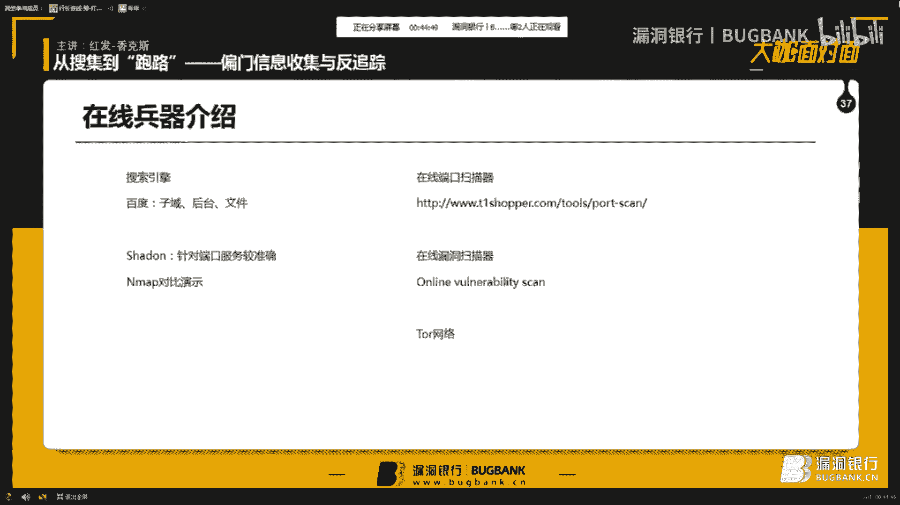

然後我現在是在，做一些測試，然後我現在是在，做一些測試，然後我現在是在，做一些測試，然後我現在是在，做一些測試，然後我現在是在，做一些測試，然後我現在是在，做一些測試，然後我現在是在，做一些測試。

然後我現在是在，做一些測試，然後我現在是在，做一些測試，然後我現在是在，做一些測試，然後我現在是在，做一些測試。

然後我現在是在，做一些測試，然後我現在是在，做一些測試，然後我現在是在。

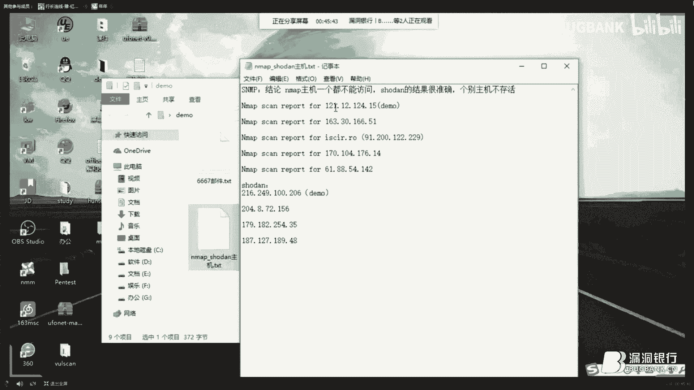

做一些測試，然後我現在是在，做一些測試，然後我現在是在，做一些測試。

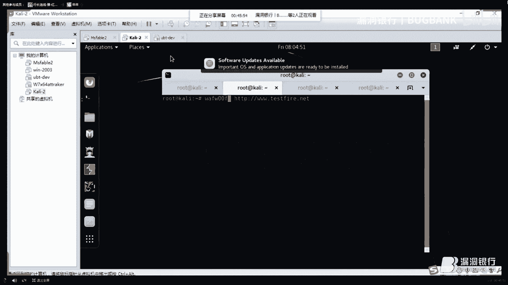

然後我現在是在，做一些測試，然後我現在是在，做一些測試，然後我現在是在，做一些測試，然後我現在是在，做一些測試，然後我現在是在，做一些測試，然後我現在是在，做一些測試，然後我現在是在，做一些測試。

然後我現在是在，做一些測試，然後我現在是在，做一些測試。

然後我現在是在，做一些測試，然後我現在是在，做一些測試，然後我現在是在。

做一些測試，然後我現在是在。

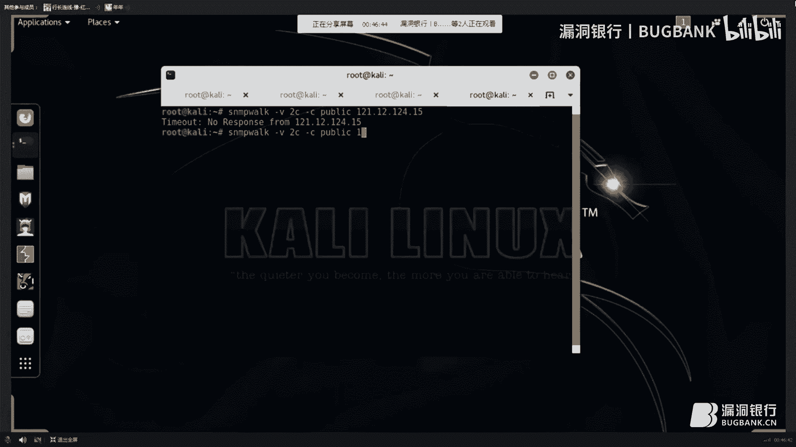

做一些測試，然後我現在是在，做一些測試，然後我現在是在，做一些測試，然後我現在是在，做一些測試，然後我現在是在，做一些測試，然後我現在是在，做一些測試，然後我現在是在，做一些測試，然後我現在是在。

做一些測試，然後我現在是在，做一些測試，然後我現在是在，做一些測試，然後我現在是在，做一些測試，然後我現在是在，做一些測試，然後我現在是在，做一些測試，然後我現在是在，做一些測試，然後我現在是在。

做一些測試，然後我現在是在，做一些測試，然後我現在是在，做一些測試，然後我現在是在，做一些測試，然後我現在是在，做一些測試，然後我現在是在，做一些測試，然後我現在是在，做一些測試，然後我現在是在。

做一些測試，然後我現在是在，做一些測試，然後我現在是在，做一些測試，然後我現在是在，做一些測試，然後我現在是在，做一些測試，然後我現在是在，做一些測試，然後我現在是在，做一些測試，然後我現在是在。

做一些測試，然後我現在是在，做一些測試，然後我現在是在，做一些測試，然後我現在是在，做一些測試，然後我現在是在，做一些測試，然後我現在是在，做一些測試，然後我現在是在，做一些測試，然後我現在是在。

做一些測試，然後我現在是在，做一些測試，然後我現在是在，做一些測試，然後我現在是在，做一些測試，然後我現在是在，做一些測試，然後我現在是在，做一些測試，然後我現在是在，做一些測試，然後我現在是在。

做一些測試，然後我現在是在，做一些測試，然後我現在是在，做一些測試，然後我現在是在，做一些測試，然後我現在是在，做一些測試，然後我現在是在，做一些測試，然後我現在是在，做一些測試，然後我現在是在。

做一些測試，然後我現在是在，做一些測試，然後我現在是在，做一些測試，然後我現在是在，做一些測試，然後我現在是在，做一些測試，然後我現在是在，做一些測試，然後我現在是在，做一些測試，然後我現在是在。

做一些測試，然後我現在是在，做一些測試，然後我現在是在，做一些測試，然後我現在是在，做一些測試，然後我現在是在，做一些測試，然後我現在是在，做一些測試，然後我現在是在，做一些測試，然後我現在是在。

做一些測試，然後我現在是在，做一些測試，然後我現在是在，做一些測試，然後我現在是在，做一些測試，然後我現在是在，做一些測試。

然後我現在是在，做一些測試，然後我現在是在，做一些測試，然後我現在是在，做一些測試，然後我現在是在，做一些測試，然後我現在是在，做一些測試，然後我現在是在，做一些測試，然後我現在是在，做一些測試。

然後我現在是在，做一些測試，然後我現在是在，做一些測試，然後我現在是在，做一些測試，然後我現在是在，做一些測試，然後我現在是在，做一些測試，然後我現在是在，做一些測試，然後我現在是在，做一些測試。

然後我現在是在，做一些測試。

然後我現在是在，做一些測試，然後我現在是在，做一些測試，然後我現在是在。

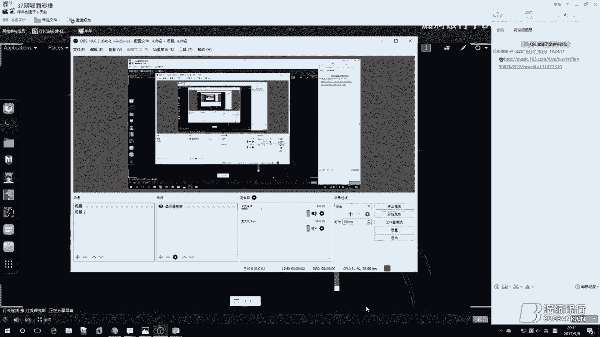

做一些測試，然後我現在是在，做一些測試，然後我現在是在，做一些測試，然後我現在是在，做一些測試，然後我現在是在，做一些測試，然後我現在是在，做一些測試，然後我現在是在，做一些測試，然後我現在是在。

做一些測試，然後我現在是在，做一些測試，然後我現在是在，做一些測試，然後我現在是在，做一些測試，然後我現在是在，做一些測試，然後我現在是在，做一些測試，然後我現在是在，做一些測試，然後我現在是在。

做一些測試，然後我現在是在，做一些測試，然後我現在是在，做一些測試，然後我現在是在，做一些測試，然後我現在是在，做一些測試，然後我現在是在，做一些測試，然後我現在是在，做一些測試，然後我現在是在。

做一些測試，然後我現在是在，做一些測試，然後我現在是在，做一些測試，然後我現在是在，做一些測試，然後我現在是在，做一些測試，然後我現在是在，做一些測試。

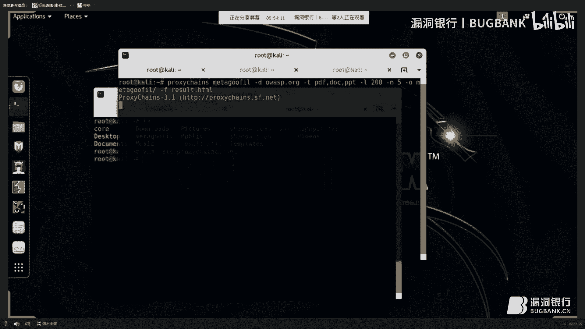

然後我現在是在，做一些測試，然後我現在是在，做一些測試，然後我現在是在，做一些測試，然後我現在是在，做一些測試，然後我現在是在，做一些測試，然後我現在是在，做一些測試，然後我現在是在，做一些測試。

然後我現在是在，做一些測試，然後我現在是在，做一些測試，然後我現在是在，做一些測試，然後我現在是在，做一些測試，然後我現在是在，做一些測試，然後我現在是在，做一些測試，然後我現在是在，做一些測試。

然後我現在是在，做一些測試，然後我現在是在，做一些測試，然後我現在是在，做一些測試，然後我現在是在，做一些測試，然後我現在是在，做一些測試，然後我現在是在，做一些測試，然後我現在是在，做一些測試。

然後我現在是在，做一些測試，然後我現在是在，做一些測試，然後我現在是在，做一些測試，然後我現在是在，做一些測試，然後我現在是在，做一些測試，然後我現在是在，做一些測試，然後我現在是在，做一些測試。

然後我現在是在，做一些測試，然後我現在是在，做一些測試，然後我現在是在，做一些測試，然後我現在是在，做一些測試，然後我現在是在，做一些測試，然後我現在是在，做一些測試，然後我現在是在，做一些測試。

然後我現在是在，做一些測試，然後我現在是在，做一些測試，然後我現在是在，做一些測試，然後我現在是在，做一些測試，然後我現在是在，做一些測試，然後我現在是在，做一些測試，然後我現在是在，做一些測試。

然後我現在是在。

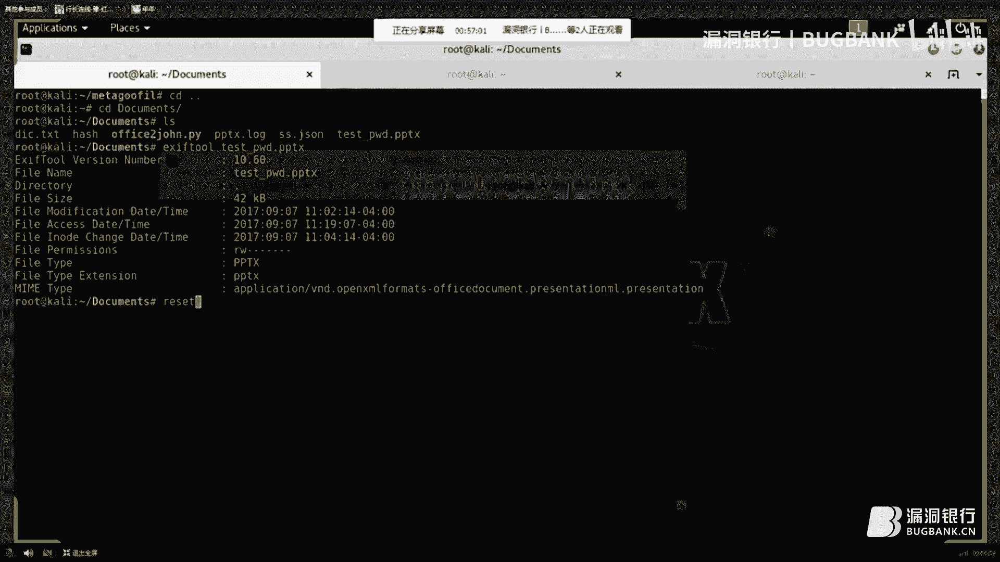

做一些測試，然後我現在是在，做一些測試，然後我現在是在，做一些測試，然後我現在是在，做一些測試，然後我現在是在，做一些測試，然後我現在是在，做一些測試，然後我現在是在，做一些測試，然後我現在是在。

做一些測試，然後我現在是在，做一些測試，然後我現在是在，做一些測試，然後我現在是在，做一些測試，然後我現在是在，做一些測試，然後我現在是在，做一些測試，然後我現在是在，做一些測試，然後我現在是在。

做一些測試，然後我現在是在，做一些測試，然後我現在是在，做一些測試，然後我現在是在，做一些測試，然後我現在是在，做一些測試，然後我現在是在，做一些測試，然後我現在是在，做一些測試，然後我現在是在。

做一些測試，然後我現在是在，做一些測試，然後我現在是在，做一些測試，然後我現在是在，做一些測試，然後我現在是在。

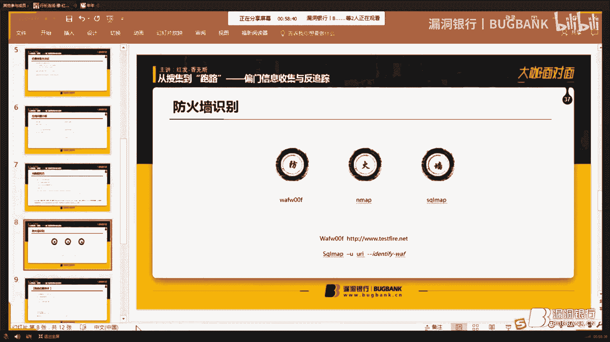

做一些測試，然後我現在是在，做一些測試，然後我現在是在，做一些測試，然後我現在是在，做一些測試，然後我現在是在，做一些測試，然後我現在是在，做一些測試，然後我現在是在，做一些測試，然後我現在是在。

做一些測試，然後我現在是在，做一些測試，然後我現在是在，做一些測試，然後我現在是在，做一些測試，然後我現在是在，做一些測試，然後我現在是在，做一些測試，然後我現在是在，做一些測試，然後我現在是在。

做一些測試，然後我現在是在，做一些測試，然後我現在是在，做一些測試，然後我現在是在，做一些測試，然後我現在是在，做一些測試，然後我現在是在，做一些測試，然後我現在是在，做一些測試，然後我現在是在。

做一些測試，然後我現在是在，做一些測試，然後我現在是在，做一些測試，然後我現在是在，做一些測試，然後我現在是在，做一些測試，然後我現在是在，做一些測試，然後我現在是在，做一些測試。

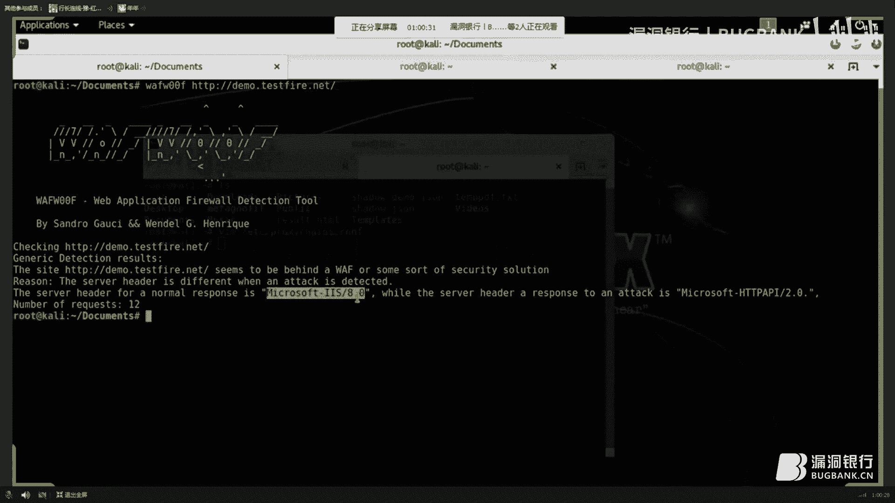

然後我現在是在，做一些測試，然後我現在是在，做一些測試，然後我現在是在，做一些測試，然後我現在是在，做一些測試，然後我現在是在，做一些測試，然後我現在是在，做一些測試，然後我現在是在，做一些測試。

然後我現在是在，做一些測試，然後我現在是在，做一些測試，然後我現在是在，做一些測試，然後我現在是在，做一些測試，然後我現在是在，做一些測試，然後我現在是在，做一些測試，然後我現在是在，做一些測試。

然後我現在是在，做一些測試，然後我現在是在，做一些測試，然後我現在是在，做一些測試，然後我現在是在，做一些測試，然後我現在是在，做一些測試，然後我現在是在，做一些測試，然後我現在是在，做一些測試。

然後我現在是在，做一些測試，然後我現在是在，做一些測試，然後我現在是在，做一些測試，然後我現在是在，做一些測試，然後我現在是在，做一些測試，然後我現在是在，做一些測試，然後我現在是在，做一些測試。

然後我現在是在，做一些測試，然後我現在是在，做一些測試，然後我現在是在，做一些測試，然後我現在是在，做一些測試，然後我現在是在，做一些測試，然後我現在是在，做一些測試，然後我現在是在，做一些測試。

然後我現在是在，做一些測試，然後我現在是在，做一些測試，然後我現在是在，做一些測試，然後我現在是在，做一些測試，然後我現在是在，做一些測試，然後我現在是在，做一些測試，然後我現在是在，做一些測試。

然後我現在是在，做一些測試，然後我現在是在，做一些測試，然後我現在是在，做一些測試，然後我現在是在，做一些測試，然後我現在是在，做一些測試，然後我現在是在，做一些測試，然後我現在是在，做一些測試。

然後我現在是在，做一些測試，然後我現在是在，做一些測試，然後我現在是在，做一些測試，然後我現在是在，做一些測試，然後我現在是在，做一些測試，然後我現在是在，做一些測試，然後我現在是在，做一些測試。

然後我現在是在，做一些測試，然後我現在是在，做一些測試，然後我現在是在，做一些測試，然後我現在是在，做一些測試，然後我現在是在，做一些測試，然後我現在是在，做一些測試，然後我現在是在，做一些測試。

然後我現在是在，做一些測試，然後我現在是在，做一些測試，然後我現在是在，做一些測試，然後我現在是在，做一些測試，然後我現在是在，做一些測試，然後我現在是在，做一些測試，然後我現在是在，輸入在線掃描。

輸入在線掃描，輸入在線掃描，輸入在線掃描，輸入在線掃描，輸入在線掃描，輸入在線掃描，輸入在線掃描，輸入在線掃描，輸入在線掃描，輸入在線掃描，輸入在線掃描，輸入在線掃描，輸入在線掃描，輸入在線掃描。

輸入在線掃描，輸入在線掃描，輸入在線掃描，輸入在線掃描，輸入在線掃描，輸入在線掃描，輸入在線掃描，輸入在線掃描，輸入在線掃描，輸入在線掃描，輸入在線掃描，輸入在線掃描，輸入在線掃描，輸入在線掃描。

輸入在線掃描，輸入在線掃描，輸入在線掃描，輸入在線掃描，輸入在線掃描，輸入在線掃描，輸入在線掃描，輸入在線掃描，輸入在線掃描，輸入在線掃描，輸入在線掃描，輸入在線掃描，輸入在線掃描，輸入在線掃描。

輸入在線掃描，輸入在線掃描，輸入在線掃描，輸入在線掃描，輸入在線掃描，輸入在線掃描，輸入在線掃描，輸入在線掃描，輸入在線掃描，輸入在線掃描，輸入在線掃描，輸入在線掃描，輸入在線掃描，輸入在線掃描。

輸入在線掃描，輸入在線掃描，輸入在線掃描，輸入在線掃描，輸入在線掃描，輸入在線掃描，輸入在線掃描，輸入在線掃描，輸入在線掃描，輸入在線掃描，輸入在線掃描，輸入在線掃描，輸入在線掃描，輸入在線掃描。

輸入在線掃描，輸入在線掃描，輸入在線掃描，輸入在線掃描，輸入在線掃描，輸入在線掃描，輸入在線掃描，輸入在線掃描，輸入在線掃描，輸入在線掃描，輸入在線掃描，輸入在線掃描，輸入在線掃描，輸入在線掃描。

輸入在線掃描，輸入在線掃描，輸入在線掃描，輸入在線掃描，輸入在線掃描，輸入在線掃描，輸入在線掃描，輸入在線掃描，輸入在線掃描，輸入在線掃描，輸入在線掃描，輸入在線掃描，輸入在線掃描，輸入在線掃描。

輸入在線掃描，輸入在線掃描，輸入在線掃描，輸入在線掃描，輸入在線掃描，輸入在線掃描，輸入在線掃描，輸入在線掃描，輸入在線掃描，輸入在線掃描，輸入在線掃描，輸入在線掃描，輸入在線掃描，輸入在線掃描。

輸入在線掃描，輸入在線掃描，輸入在線掃描，輸入在線掃描，輸入在線掃描，輸入在線掃描，輸入在線掃描，輸入在線掃描，輸入在線掃描，輸入在線掃描，輸入在線掃描，輸入在線掃描，輸入在線掃描，輸入在線掃描。

輸入在線掃描，輸入在線掃描，輸入在線掃描，輸入在線掃描，輸入在線掃描，輸入在線掃描，輸入在線掃描，輸入在線掃描，輸入在線掃描，輸入在線掃描，輸入在線掃描，輸入在線掃描，輸入在線掃描，輸入在線掃描。

輸入在線掃描，輸入在線掃描，輸入在線掃描，輸入在線掃描，輸入在線掃描，輸入在線掃描，輸入在線掃描，輸入在線掃描，輸入在線掃描，輸入在線掃描，輸入在線掃描，輸入在線掃描，輸入在線掃描，輸入在線掃描。

輸入在線掃描，輸入在線掃描，輸入在線掃描，輸入在線掃描，輸入在線掃描，輸入在線掃描，輸入在線掃描，輸入在線掃描，輸入在線掃描，輸入在線掃描，輸入在線掃描，輸入在線掃描，輸入在線掃描，輸入在線掃描。

輸入在線掃描，輸入在線掃描，輸入在線掃描，輸入在線掃描，輸入在線掃描，輸入在線掃描，輸入在線掃描，輸入在線掃描，輸入在線掃描，輸入在線掃描，輸入在線掃描，輸入在線掃描，輸入在線掃描，輸入在線掃描。

輸入在線掃描，輸入在線掃描，輸入在線掃描，輸入在線掃描，輸入在線掃描，輸入在線掃描，輸入在線掃描，輸入在線掃描，輸入在線掃描，輸入在線掃描，輸入在線掃描，輸入在線掃描，輸入在線掃描，輸入在線掃描。

輸入在線掃描。

輸入在線掃描，輸入在線掃描，輸入在線掃描，輸入在線掃描，輸入在線掃描。

輸入在線掃描，輸入在線掃描，輸入在線掃描，輸入在線掃描，輸入在線掃描。

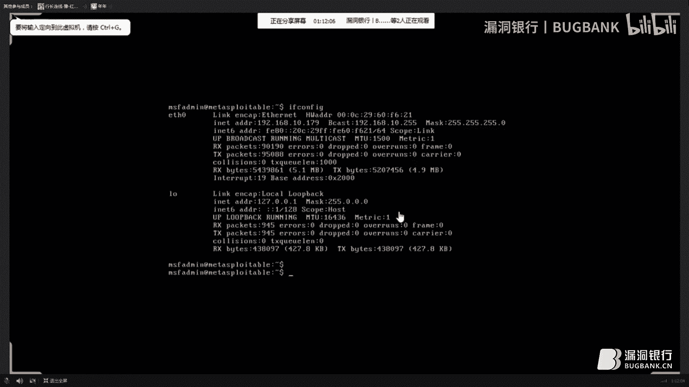

輸入在線掃描，輸入在線掃描，輸入在線掃描，輸入在線掃描，輸入在線掃描，輸入在線掃描，輸入在線掃描，輸入在線掃描，輸入在線掃描，輸入在線掃描，輸入在線掃描，輸入在線掃描，輸入在線掃描，輸入在線掃描。

輸入在線掃描，輸入在線掃描，輸入在線掃描，輸入在線掃描，輸入在線掃描，輸入在線掃描，輸入在線掃描，輸入在線掃描，輸入在線掃描，輸入在線掃描，輸入在線掃描，輸入在線掃描，輸入在線掃描，輸入在線掃描。

輸入在線掃描，輸入在線掃描，輸入在線掃描，輸入在線掃描，輸入在線掃描，輸入在線掃描，輸入在線掃描，輸入在線掃描，輸入在線掃描，輸入在線掃描。

輸入在線掃描，輸入在線掃描，輸入在線掃描，輸入在線掃描，輸入在線掃描，輸入在線掃描，輸入在線掃描，輸入在線掃描，輸入在線掃描，輸入在線掃描，輸入在線掃描，輸入在線掃描，輸入在線掃描，輸入在線掃描。

輸入在線掃描，輸入在線掃描，輸入在線掃描，輸入在線掃描，輸入在線掃描，輸入在線掃描，輸入在線掃描，輸入在線掃描，輸入在線掃描，輸入在線掃描，輸入在線掃描，輸入在線掃描，輸入在線掃描，輸入在線掃描。

輸入在線掃描，輸入在線掃描，輸入在線掃描，輸入在線掃描，輸入在線掃描，輸入在線掃描，輸入在線掃描，輸入在線掃描，輸入在線掃描，輸入在線掃描，輸入在線掃描，輸入在線掃描，輸入在線掃描，輸入在線掃描。

輸入在線掃描，輸入在線掃描，輸入在線掃描，輸入在線掃描，輸入在線掃描。

輸入在線掃描，這邊也是把目標打滿了，大家要注意，要加-SV參數，因為不加-SV參數的話，MacBook是不會調用任何腳本的，MacBook是不會調用任何腳本的，然後，這邊為了給大家演示。

然後我是使用了-P4，P4的話，它是比P3，要更快一點，正式環境，一定要低調，總之一定要低調，這邊環境我已經給大家配對了，大家可以看一下，MacBook的腳本在哪，這是一個文件夾。

這就是我們下載好的MacBook，漏洞掃描的腳本，然後，加上它的，目錄，加上它的腳本，這就是加在，這個腳本，才能夠調用這些漏洞，在你真正做測試的時候，首先，我覺得，最重要的方向考慮，首先。

MacBook的富二胞數率，一定要降到最低，就是用T1，還有就是你選擇掃描的時間，要最不容易發現的時候，避開白天的時段，還有就是，像夜深人靜那時候，因為，有的時候有的公司會利用。

WireShark去抓包，獲取內網有沒有密碼，所以你避開這個時段，還有就是發包數率一定要低，不能引起防護家警覺，這樣的話就可以了，還有就是要加上，數據包偽裝，這是我那邊的話，之前已經建議過了，要用。

內網正式存在的IP去偽裝，那樣的話，當你這條命令輸出去以後，還會出現一個什麼現象，然後通過內網抓包發現，你已經被抓包，你已經被抓包，通過內網抓包發現，然後內網的機器都在互相發包，雖然很慢，不容易察覺。

然後這時候如果認為凌晨兩點半，然後說可能防護家出了一點問題，讓認為去找，因為照到流量一看，然後各主機都在，互相的互相，傷害然後，求管理員的內心，陰影面積，然後這邊，咱再用TCP，咱再用這個抓包工具。

看下他的掃描過程，這邊在那監聽ETH0，掃描正在開始，因為家長出去過他的掃描，可能會比較長，然後咱們先讓他再掃著，咱們現在，繼續後面的課程，在局域網內，然後你拿到那台服務器以後，拿到那台服務器以後。

要對局域網內，局域網內比較容易，局域網內比較。

弱的設備有哪些，就比如說，比如說，像是，像是，像是，像是，像是，弱的設備有哪些，首先公司內網安全性肯定，不高，然後還有就是，比內網，其他電腦安全性更不高的，第一個首先考慮的是，第一個首先考慮的是。

基本上內網的打印機不會設密碼，基本上內網的打印機不會設密碼，然後再其次考慮的就是路由器，路由器的話，路由器的話，路由器的話，信息设计工具，叫做Root Supply，这是一个路由器渗透设置的一个框架。

它有很多，路由器漏洞，扫描和利用的脚本，大家有信心可以下去自己看一下，卡力是可以直接用APP直接安装，咱们脚本什么的该做的也都做了，做了以后就是，消除环境，之前咱们讲过你把所有的信息放在一个U盘里面。

假如有万分之一的概率，可能要是万亿分之一的概率吧，然后你招惹的那个目标，然后他遇到了你，然后比较悲惨的是他还找到了你的U盘，然后利用信息恢复技术，把数据恢复技术把你的U盘里收集的信息都恢复出来了。

更悲惨的是你之前收集的之前删除的日本老师的动作片也给你恢复出来了，然后我那心该多痛是吧，所以删除东西一定要安全，这边给大家推荐三款安全的删除工具，第一款就是Linux的Wipe。

然后他是一个GitHub的一个小本，第二款就是Windows下面的HardWipe，Windows都是SWAP操作，然后可以给他第三款就是MetaSupply的ClearAV，他是青龙日日用的。

这边给大家看一下，Windows下面的，就网上还有免费版，只能说我大中华网络是十分强大的，这边现成的工具，大家可以回去自己玩一下，然后给大家介绍一下考虑下面的Wipe，Wipe是卡利。

有的卡利是带的，有的是不带的，不带的话直接APP安装一下就行，这边咱们看一下他的帮助，看一下他的相机版本吧，首先Wipe他并没有现成的教程，也没有详细的文档，利用杠尾参数可以看到他作者还有他的地址。

可以获得一些帮助，然后来看一下他的帮助信息，这有很多种命令的，他的三层模式是很复杂的，然后没有必要整这么麻烦，像位的偏移啊，还有就是沟通覆盖啊，这类的还有给三级设置密码，这些都用不到。

然后给大家演示一下实际的案例，在刚才咱们收集到了定标的一个信息，咱们收集以后你事情干完了，咱们需要对他进行验射，除，那以这个为例，直接外国和美国文件名删除以后，他点yes就行。

然后这时候大家看到他正在删，第一遍，他的删除过程是非常缓慢的，他是一遍遍的擦擦血，然后最终拿到三十万个里，所以是非常耗时间，但是比较安全，有时候你耗在这边耗几个小时，总比在FBI耗几年强对吧。

所以这个工具还是比较让人放心，能看一下MAP的扫描结果，在这边MAP已经扫描完了。

咱们之前的结果，这种文件他肯定不会大是少那么多，然后这边咱们看一下他的结果，这是这个数据库的，YSVDP数据库，根据这个数据库扫的结果，你看这些有SSG的漏洞，就这样可以帮MAP改造成了一款漏洞扫描器。

大家有时间的话，下去可以玩一下，然后就给大家讲一点，渗透社容易忽略的点，第一款就是查看源代码，查看源代码，我这边有一个非常经典的案例啊，给大家看一下。

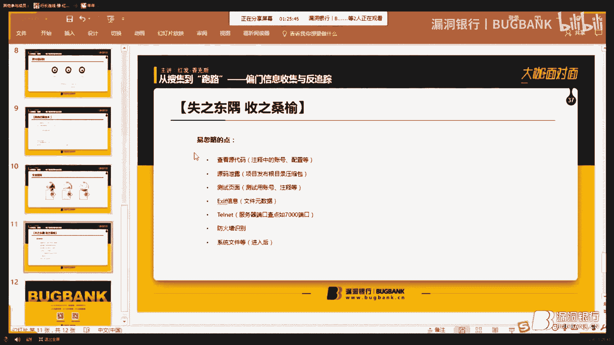

那这个是我在某次渗透社的过程中，对生产环境利用查看源代码方式，然后获得一个信息，当找到的时候，我给一个同事说，然后这个页面有一个信息漏，他去找了一下，然后没没有找到，后来我看了一下。

其实这个这个信息隐藏的很深，但是我看到有一个忽略，就是他的滚动条，然后当时只有浏览器的一半只占了一半，然后当时利用查看源代码的时候，发现那个源代码已经结束了，就ICM的标签已经闭合了。

然后当时滚动条只有一半，后来我通过下拉滚动条，拉了十几行空格以后，在最底下发现了这个，大家可以看到，这是生产环境和测试环境的，MySQL的配置信息，包括数据库类型，主机端口，数据库名，用户密码。

这些信息都有了，所以我通过这种方式，就可以直接拿到了他的，MySQL的权限。

然后源代码泄露主要是因为，因为是比较苦逼的一个职业，然后凌晨一两点，领导一个电话刷一下就起床了，然后起来发布项目，所以因为人在半睡半，在半睡半醒之间，可能会把压缩包忘记上桌。

因为一般可能会把所有的项目源代码，倒了一个压缩包放到根部里面，夹就用了，就是人比较容易忽略一点，所以源代码也有很大的可能性会泄露出来，然后就是测试页面，测试页面。

然后有的公司内网是测试是不允许使用热口令的，然后不让用热口令，那肯定账号不好记啊，然后测试人员可能很机智的，把账号注注收到了页面的源代码里面，所以测试页面是一个重要的口，还有就是XXX信息。

XXX信息现在泄露的应该比较多，大家也都知道，TimeLapse，因为我发现很多人做渗透测试的时候，他并不使用断口信息收集，然后我有一次发现目标开了一个比较生硬的账号，叫6667断口，然后。

再发现一个有意思的东西，给大家介绍一下，首先，我通过6667断口，后来我对这个断口很好奇，我就找了一下，发现了他是一个ESMPP服务器，而且这些我通过沙档找了以后，发现这类主机还挺多哈。

而且他还都能用TimeLapse，或者NC联络，于是我想这个断口能不能利用呀，然后我就找了一篇研究一下，我发现还还真有点用，给大家看一下，大家可以看一下这个邮件服务器，他可以用来做邮件服务器被人冒用。

也就是说可以冒用邮件服务器去发烧伪造的垃圾邮件，然后具体证明还给了详细的案例展示，像你看这边是他那头邮件服务器以后，然后连接连成以后设置那个发送，这是发送原发送的邮件列表，这边是邮件内部内容。

这边结束以后，然后发邮件，这时候也就是可以伪造邮件，嗯，想这可以给大家当一个小作业，大家可以回去自己玩一下，在这些断口都是我用上单去收集的。

算给大家一个小福利，以后再也不抽邮件服务器了，中国漫长的无尽的等待，我们的文件终于上手了，好，然后再来就是方向识别方向识别的话。

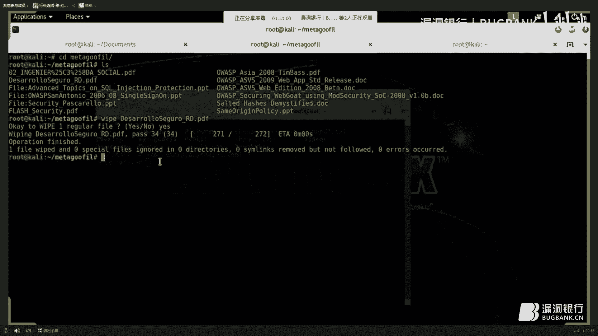

刚才已经演示过了，然后方向识别还有几款比较好用的就是HP3，还有就是Nmap带的Npin，大家回去可以自己研究一下，然后还有一个注意点点就是你进入一台服务器以后，首先接受电视计程，然后查看系统文件。

看一般服务器，他会远程调用其他的主机，然后去做一些配置文件，什么也都有，比如说有一次我进入一台服务器，然后查看了一下系统文件以后，发现他居然远程调用另外就是调用同网端内，另外一台Meseko主机。

然后他写了一个线下脚本，很方便，就是里面设计了另外一台主机的Meseko的地址端口用户名密码什么的，也就是说我从进入这台主机以后，只用了一分钟就进入了另外一台主机，所以这个还是需要注意的，下面。

今天可能就到这儿，然后谢谢大家，好嘞，那感谢红发香格斯的精彩演讲，这么多奇巧的信息收集技术，相信对大家挖洞和渗透技术的学习肯定会有不小的帮助，那小伙伴们有议题相关问题都可以提问。

高数量的问题会被筛选到我们的问答区。

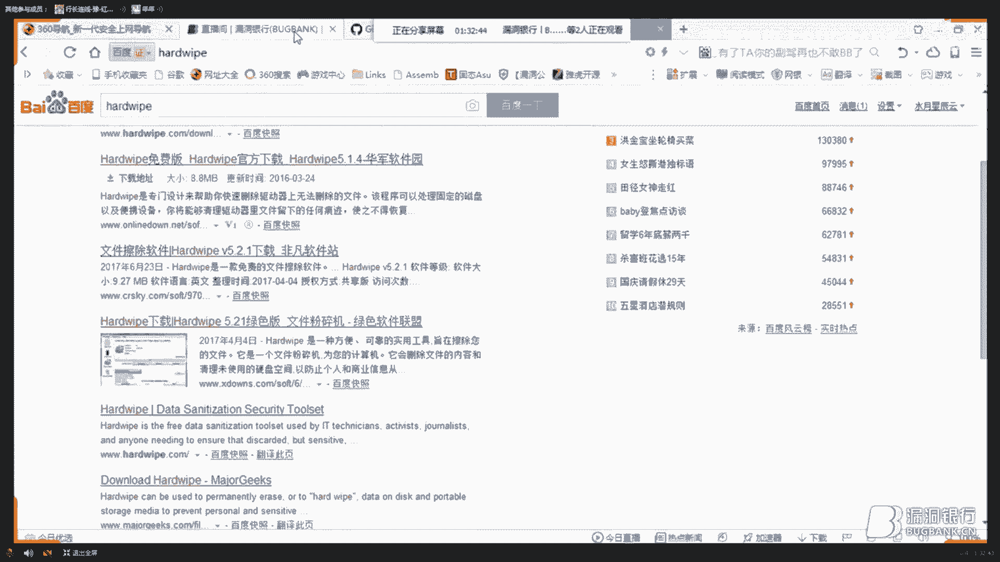

那大咖让我们把聊天室切换到问答区板块，开始今天的问题解答，请问到问答区，你现在是聊天区的状态，你看一下上面有一个选项，就是切换的问答，问答区，大咖你这边将那个页面上挪一下，你现在是属于聊天区的状态，啊。

我是打字配方的还是，我是打字配方的吗，不是你现在要将，你直接在语音里说就可以了，但是你现在看到的是聊天区，看到旁边还有一个问答区看到了，啊看到了，对对对对对对好，可以回答了，第一个它是是发邮件的呀。

这没毛病，然后第二个就是更多隐藏IP的更多知识，这个的话，你需要多层隧道技术，然后多层隧道技术，然后再加几层隧道，这个因为，本次只是讲客户提供一些思路啊，然后我感觉你要更多的知识的话，你可以私下找我。

或者是咱在社交流，然后刚进服务器，它确实不是这个全新的，所以你要先提前提前以后，把日志进程结束掉，然后对搞完以后搞完以后再清除日志，因为你日志进程结束了，然后他的那个日志清除以后。

别人也不他可能以为是日志进程，也有可能是意外结束或者啥，所以那日志清除以后就没啥问题，然后扫描手机的时候，有没有办法绕过方向，有的MAP就可以，MAP的话像，你如果是绕过防火牆的话。

我建议是使用那个NPIN，或者是HP3，那样的话，他可以绕过防火牆，自动化绕过，你在自动化绕过有点过火了，因为防火牆不同的策略，他是策略不一样的，你自动化绕过的话，你还是手工弹的吧，因为防火牆的策略是。

场景很复杂，像之前我做太子平台的时候，他面对的是公网的，公网的那个环境，他的方向策略是很复杂，所以你要针对于做各种的AF判断什么的，去绕过方向，这个问题，如果供应链进入内网，有哪一方可以追踪到供应链。

是吧，这个我做过测试，一般的方法还真追踪不到，你拿到服务器以后，你肯定你拿到服务器以后，这个具体抓包位置的话，你最好是能抓网络的话，优先抓网络的包，然后如果不能抓的话就抓本地包。

他只是信息收集的第一步吗，并不是依靠他完成那个特别内场的信息收集，他只是一个比较省事的一个步骤，然后追踪供应链网，追踪攻击者的话，这个还真难到我了，我向来都是只思考如何的攻击。

其实这种用那种攻击去内场去追踪的话，我当时也用WireShark抓包去试了一下，确实是没法抓到供应的，大家还有问题吗，判断密罐啊，首先密罐这东西，我曾单独和一个，我前年和领导也研究过这个问题，我问他。

当时他给的意见是看有没有真实的内容，因为密罐的话，他一般不会有内容的，然后就是说非密罐的话，他都是有数据化或者是文件之类的，有这些内容，这是内容，所以通过这个图片可以看是不是密罐，让他们抓紧时间提问。

然后多多提问，还有可能成为我们今天的新观众，获得赠书，还有问题吗，看到有人送火箭了，你看到，那谢谢，首先，网络数据包频率检测，嗯，我想一下，通过数据包频率，其实是可以是可以。

你通过频率通过数据包频率去检测一个IP的话，因为它不同设备，它的，它有一定的可行性，但是我觉得不是很靠谱，因为内网那么多设备，有一些设备的发布频率也很大，然后你比如说他内网有一个up。

up的一个防up的软件什么的，然后他发布频率也很大，也就是说，你可以在发布频率高的里面找到核心主机，但是，嗯，你不能说他发布频率高，就是核心主机，密罐加上内容，这就伪装了，伪装的东西，就看你伪装了。

花多大成本，你如果是成本不高，那密罐很容易思维出来，你如果是不差钱，密罐怎么逼就怎么做，那确实是没法思维，我告诉你，密罐内容，例如说他的那个，是指服务器，密罐内容网站和服务器，网站就在服务器上呀。

密罐内容是指服务器上的，网站上的内容是可以可以添加的，手动添加也可以伪造的，服务器上的东西，你没有那么大精力去模拟一台，真实生产环境的服务器上的配置文件之类的吧，这个卡利web的删除防误插帖。

这个他有这个需要看一下源代码，因为是因为你我也没看他的源代码，详细原理的话，我可以研究一下再给你回复，建隧道以后把日志覆盖掉来进去，我感觉你这样问是在搞事情吗，想然后搞事情和我们客户是无关的呀，嗯。

其实建隧道，他主要是用来首先留一个后门，然后还有就是嗯，留着后续持续访问的，然后为了后续操作，还有就是等着日志去覆盖掉，嗯，那样的话，你再进去的时候，因为对方就可能最终的就不知道你怎么进来的。

也不知道你利用什么漏洞，什么工具你知道吧，就这个意思，网络交流频率判断内容主题，这个我还交流频率的话，你说的交流频率是指那个发包，那个主机间通讯的流量的多少吧，然后这也是可以做一些判断。

但是我觉得应该不是特别准确，这个我告诉你吧，睡到天里以后，日日其实你要说日志工坊，咱还可以再开个专题，咱只是介绍一种思路，因为你日志的话，你并不知道对方是日志服务器，还是单独的只有一台服务器。

没有日志服务器，你也不知道对方有多少日志进程，咱说的那个节奏量，日志只是提供一种思路，然后如果大家大了，想深入研究的话，可以去看一下，而且可以给你推荐一本书，叫日志管理分析全页指南。

这边我看网上比较常用的思路，就是多地多地去听，然后网上也有很多现成的工具，然后我之前在群里和大家交流的时候，大家也一致的是使用的这种方法，好那我感觉时间也差不多了，那感谢红发香克斯的耐心解答。

小伙伴们下面就进入我们最后的福利环节，拉卡赠书，那大家期待满满，我们就话不多说，现在就请红发香克斯，选出一位认真听到的小伙伴，送上这本高度安全环境下的高级渗透测试，看谁能幸运拿到，赶紧选择。

首先这本书是我很用心，很用心给大家选的，然后，所以这本书虽然有点老，但是涵盖的技术还是挺多的，很多的时候大家如果是没得到这本书的话，也可以自己去买，然后我看看我选哪个，你可以双击一下这位小伙伴。

然后将他选为精灵观众，好，我看一下。

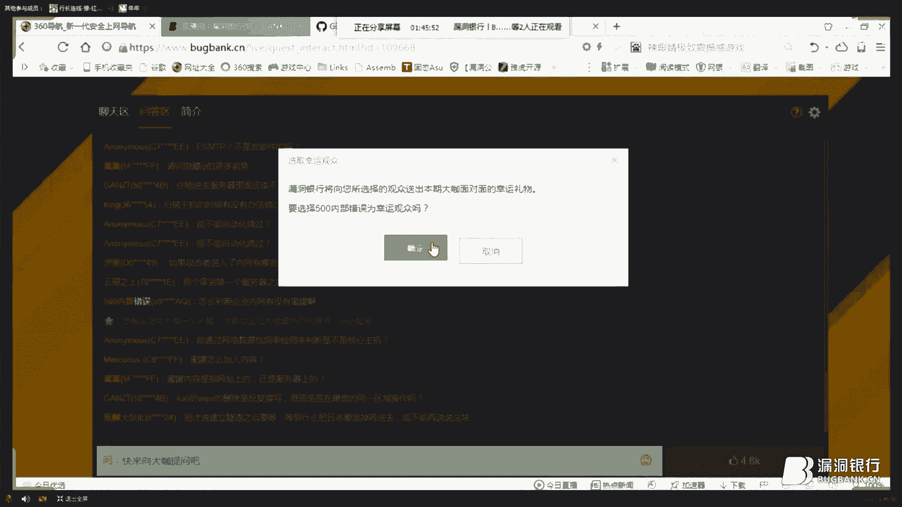

我看一下问题的问题是啥，这个蜜罐的不错，因为我并没有捡到蜜罐，他提醒我了，就他吧，好那你可以将他选为幸运观众，好可以告诉我，500内部错误吗，是，那好，那今天的幸运观众就是这位500内部错误。

那恭喜你获得这本高度安全环境下的高级渗透测试，那希望你在弹窗里留下正确的收获信息，我们会尽快将书集寄出，那到这里本期的大咖面对面，要和大家说再见了，感谢红发香克斯精心的准备，也感谢小伙伴们的踊跃参与。

下周五晚八点，漏洞一行大咖面对面第38期，让我们共同期待，那本期大咖面对面直播到这里就结束了，大家可以退一下直播间，也可以留下来听会音乐再离开，再见，字幕：J Chong，(字幕组)，(字幕组)。

(字幕组)，(字幕组)，(字幕组)，好，咦，在这里做成了一道菜。