# 漏洞银行丨全方位MSF渗透利用探究-HK_WOLF丨咖面83期 - P1：【录屏】全方位MSF渗透利用探究-大咖HK_WOLF-漏洞银行大咖面对面第83期 - 漏洞银行BUGBANK - BV1tt411X7B9

为知识而成，因技术而生，小伙伴们晚上好，欢迎参加第83期漏洞银行安全技术直播大咖面对面，我是主持人秋秋。那今晚请到的是我们进入社群的老朋友HKwo大咖曾与直播间里面应该有些感到眼熟的小伙伴。

今天wo大咖将为我们带来自己独家整理的有关MSF渗透与防御相关的技术内容，我们也是非常有幸可以请wo大咖登台分享。自己这一阶段的技术研究心得，让我们期待这一期经验之谈吧。那直播不只有听讲。

那咖演讲结束之后，还会有问答和福利环节。大家可以登录直播间，到聊天继续进行讨论或者发出提问。问答结束后，沃普达卡有许多一名幸运观众，赠与书籍ta exploit渗透测试魔鬼训练营，现在也可以拿这本书哦。

那下面我们先请沃普达卡开始今天分享吧。OK好的，嗯，谢谢秋秋。😊，哦，那我就开始了。嗯，这一块的话就是主要的本次的讲解，主要就是从MSF的一个渗透利用开始讲起，主要研究有4个方面。这四个方面。

第一个就PC的渗透和防御。呃，内网的RP的渗透和防御，还有一个钓鱼网站，然后最后就是移动AK的防御。为什么分这4块其实也是跟第我的简介里面第一行有关系。因为第一行的介绍就是说比如我们了解的黑产。

可能就是从最早期的像黑鸽子，然后就是主要是去针对你服务器来做一个攻击和渗透。然后到最后就是针对你的页面网页网站去做一个去去你的数据，主要针对这一块。然后最后现在来说的话。

最热门的可能就是针对K的一个渗透移动互联的一个渗透。那么下一个安全爆发点在哪里？那么我可以从这一一长串可以看出来说我们下一个可能慢慢的有了黑，然后就有了攻就有防，然后有了黑客，然后就有了白帽子出来。

然后我们下一个安全爆发点在哪里？可能就是移动就是到。物联网万物互联这一块去走。那么万物互联是什么意思？到时候我们怎么去防它这一块我后面会在大概讲到结束的时候。

我跟大家去仔细细讲一下我自己在这方面的一些心得这一块。然后呢，我们嗯技术角技术角度上，我们就是首先我们肯定是玩脚本玩工具等等等等。然后到最后开始研究一些原理，然后最后面自己去写一些工具。

然后再往下走是什么？做白帽子的理念是什么。这一块可能大家继续可以自己的理解。然后这这一块的话就呃我就因为学的比较杂，并不是说只针对MSF来做，之前很早的时候也学过很多ID呀NBSI呀。

用过很多工具去学去做去做这些事情。当时也是就是玩的很乱这一块。然后这一次呢刚好有这个机会，我们就从MSF跟大家去讲一下，并且同期去演示一下我们整个的一个流程和一个防御思路。最重要的是讲防御思路这一块。

侧重点。然后OK那我就开始了。呃，然后第一块这块，我们就刚刚讲到的PC的防御思路，这块我就拿一个非常经典的MS08-067的一个一个漏洞来做。那么这个漏洞可能很多人都用过，很多人都知道这个漏洞。

并且呢现在基本上很难去找到这么容易的漏洞，就是MS08067几乎找不到这种漏洞了。然后为什么还拿去这些演示呢？就是因为我们可以从它的演示过程中去理解一下MSF主要是去理解，当然你要去学别的漏洞也很多。

心脏出血啊等等，很多东西都可以用。那么我们就讲一个简单一点的。然后去讲它的后门讲一下它的防御思路，主要是针对于防御这一块来做。OK那我就按照我们现在4块来做，就是这一块PC的渗透来讲，我们讲这4块。呃。

这里就是通过的一些MSB的一些协议可触发的所有漏洞服务。然后大概整理了一些就也不是很全。因为页面展示情况，大概我就列了一些比较常见的，并且一些比较老一点的，比较老一点漏洞。

比较新的像那种现在的一些乐水病毒的，我就没有列进来。然后我们就拿MS08-017。它主要针对45服务，45的端口来做的。嗯，这一块命令复习呃，我就演示一下，大致演示一下给大家。嗯。抱歉。

我刚刚忘记起了MSF了，稍微等我一下下。嗯，这一块的话，因为我相信直播间的朋友很多都玩过MSF这一块，然后大家对这个里面都有很有自己的一些想法和自己一些利用点。就自己针对这一块。然后呢，我这边边讲。

然后我们就先边让它启着，我们边往后面去讲一下我的独家理解，就这一块，大家起好了以后，我们再来演示。嗯，就是什么是模块，什么是载荷，然后跟MS的关系是什么？

然后为什么我们有一些是用的runrun命令去去启动MSF的攻击，有一些是启用的explloding这个这个命令来启动。那原理在哪里？就说我的理解是这样，MSF你可以把它抗作一艘，你可以把它看作一艘航母。

然后模块什么的模块可能就是一个航母上的一些运载，就是一些歼机机，一些飞机，然后载荷呢？载荷就针对于挂在飞机上的一些导弹。那最后实施爆破的一定是载合，然后模块是干什么？模块运输载合的一个过程。

那么MSFMSF什么的，就是整个平台针对一个航母，然后你要把它运到太平洋去去搭哪个岛等等，用什么样的飞机，用什么样的炸弹。然后等到最后我们要做的什么呢？就是我们要知道我们要做自己的 payload的。

最后我们肯定是要会。学会去写自己配load的，你你永远用别人的配load的那当然只是一个利用的过程。那么你只有去写好自己的一个配load，才能去深入的走进它什么叫载合，什么样做炸弹？怎么样去做这个事情。

OK那我们就是这一块我我自己的一个理解。当然本来是想说放到后面来讲，但因为刚才的一些失误，OK那我们现在就开始命令系好了，我也就不打了，我就直接复制简单一些。嗯。

这一块用的就是08-067这样一块一个很常规的一个漏洞。然后我们最常用的命令是什么？就是修就是一个修op，看它的一些参数修op看参数，然后这地方它的端口已经给你写好了445。呃。

然后我的一个攻击机可能就是我自己带的一个虚拟机，这个虚拟机可能就是这样就是1个2003的1个2K3的一个机器，2K3机器我针对它因为它的端口是开着的。那么我针对它去做一些事情。那么我先检查一下这个端口。

它是OK的。我先大家演示一下。

然后它的1个45端口其实是开着的，然后我们就主要针对它的45端口来做这个做这个操作，就针对这个这样一个端口做这个做做这个操作。

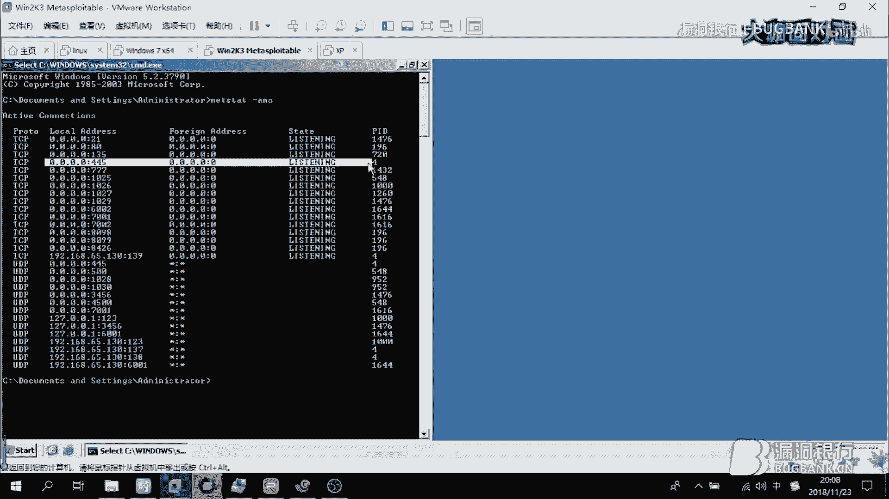

🎼OK那我们就开始了。因为这地方首先说到MSF它我刚刚讲到它可能是我看着它就是一艘航母，可能就是一个比较大的一个平台放这里。然后我们目前来说用到了它的一个模块。

这个模块可能就是我们需要的一个进一个一个攻击的一个飞机或者是一个手段。然后我们我们后面再来加载它的一个就是爆破的爆，就是武器武器装备那一块。那么我们这里可以先s一下。色的韩host。嗯，主要是设置什么？

就是我的攻击的一个目标。

43厚色等于多少呢？啊，就是10192。168。6。135。130吧，我看是130还135。今天刚重启，所以有可能IP可能会变。啊，130。

这样子设置好，然后它的端口是不用管的。然后下面一步我们就开始增加它的载荷，就是开始payload，把payload加进去。然后我们设设了配load一下，我们拿这个这样一个呃。嗯。

bring theTCP的一个配load来写。OK那这是已经设置好了，那我们再来秀它一下。去完以后我们这里能看到看到什么，看到130看到445，然后airport的话是44给的44端口。

这个port的话，等会我们可以看到在1在我们的13130这个机器上，我们都会看到进程里看到这个非常熟悉的44这个东西。那么我们现在该怎么做。我们还要去看一个tag。那么t的话默认我们给的零。

就是auto tag自动选择自动选择我的攻击机的一个就是你的你的攻击机的一个型号，就是你的操作系统的版本。你是window的203还是windows typeP还是windows208等等。

他可以去看到。那么我们现在就不看，我们就直接给大个零啊，这动去选。那么我们就开始做做这个操作explode的。🎼很容易就可以入侵到45的呃130的这个45端口就渗透进去。

那么我们拿到它的max plus以后，然后这个时候我们怎么去看，就说哎我已经拿到这个东西了，那么我还没有取他的笑，那取得笑很简单，就直接笑命令，对吧？那么我们就时我们就不要用这个笑命令。

我们直接去看一下help。它里面就有很多了，然后has dump拿到你的当时的一个账户密码的一个。就是你当前的账户密码的一些数据，然后得到你的addmin的密码是什么？加密密 try等等。

然后ges的等等等等。然后还有你得到你的getge，就是得到你的最高权限的一个命令。然后最大家其实最关注什么呢？就在里面去拍照，去截屏，去截屏，去偷你的声音，去就是录音去截屏，去窥探你的摄像头。

主要是大家可能对这一块比较感兴趣，然后就对你的本地的一些数据比较感兴趣。对吧这一块一般就是初学者，或者说我们嗯。好奇心都有嘛，所以这一块。可能大家会去看这些东西。那么一旦他得到你这个权限以后。

你就威险很大。你自己你自己本地基本上就就属于一个开放状态。对外。所以这一块呢我们要我们讲到你讲工，然后我们讲房，我们先来讲房，讲房的话就很简单，就首先我们首先我们要知道我们机器到底有没有被黑掉。

那么我们再来看一下我们的刚才这个命令。

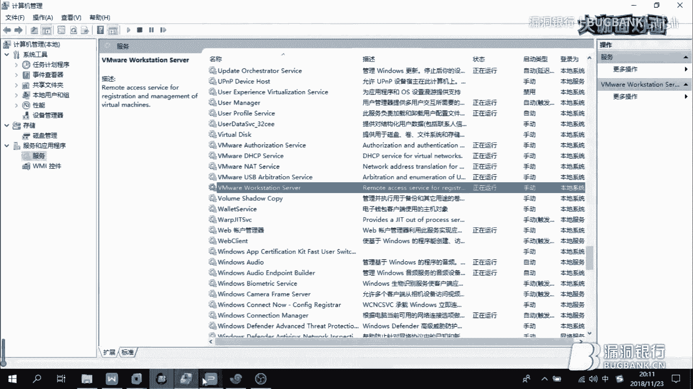

其实通过这里就可以看出来，我们通过这里就能看出来什么呢？我们能看出来我们的本地的一个连接对外的一个开放连接，它是属于一个状态式。ESTABLISHED这个状态，然后这个状态对应的就是130的444端口。

对应的外面那一个端口，100机器的某个端口。其实我是通过它的45映射到44，然后对应我端口是37075，然后映射到这边是44。然后这个状态是什么意思呢？lea声的状态是本地监听状态。

然后ESTAB的这个状态就是属于你创建了一个连接状态。你是一个对外连的TCP对外连接状态。比说我得到这个以后，我基本上能知道我对外连接了什么东西。很危险这个东西。一般所以说一般你去看自己进程的时候。

你就能够从这里排第一步，能排除掉一部分。嗯，当然当然一般做黑场的人，他可能会把它隐藏掉，他他会把这个镜争能你隐藏掉，把这个地方让你看不到他，或者把它伪装成一个list的个状态啊，这个地方肯定是后话。

那我们首先第一步看到他，首先要引起警惕，说，哎，我这地方可有可能会被别人一惊。

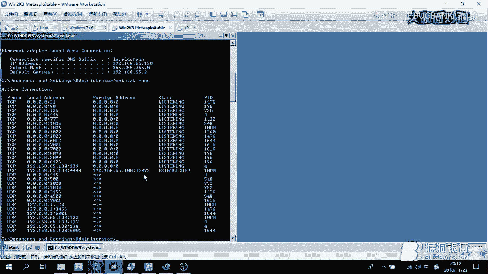

对吧别人已经进到我电脑里来了，那么我可能还不知道这个事情。第二步我就要看什么。看PID它PI对应的是1000的1个PID那么我找到这个1000PID，然后它对应的一个进程就是它。那怎么杀掉。

它其实很简单，就直接摁的掉就完了，然后就可以中断这个接中断这个连接，你你就基本上连不上来了。嗯，然后我们这里我们这里先就嗯不演示什么呢？就是不演示我们怎么去取摄像头啊，怎么去取声音啊，怎么去截屏啊。

因为就是有很多教程，网上有很多教程去这么做，有很多。然后并且这个可能像这个就是取摄像头的。嗯。等等这个这个这个意思。但是取这个摄像头呃，玩那个虚拟机的时候会有个问题，可能也跟大家去提醒一下。

就是你要去通过本地去通过虚拟机去本地的这样一个摄像头，一定要把一个服务开启，一定要把这样一个服务开启，把这个USB的服务开启。就这个微摩尔的USB的一个服务一定要开启，不开启的话。

你基本上就是永远取不到，永远取不到它的摄像头的服务。然后取到服务之后，基本上你可以看从这里就可以看到。就可以看出一些东西。选项卡。虚拟机。就是你只有取完这里然后你才能到这里看到一个摄像头的一个图标。

这样才能去用这个摄像头。不然的话，你这地方嗯我当时也是用了很久才找到，就这这样一个点。然后说哎，我怎么一直都取不到我的这样一个摄像头，然后后来才发现啊，原来是我这里的没有没有开这个东西。呃。

然后我们嗯这个地方我就不继续往下绣了，呃，往下得到需要，其实也就是。终极目标得到希望嘛，就得到他的一个，然后就可以去输一个他的这样来查他的IP啊，查他的一些东西啊等等。然后查他当前的一个进程啊。

然后去里面加那 use啊等等等等等等的。所以这一块我就。我就不写了，呃，我就不到里面去做。但我先讲它的一个防御手段。重点防御手段，其实就是我刚刚说到那一点，你首先你就去看你。

你就去监控你的这个对外的一个对外的一个连接exel一个连接。其实我们还有如果说你像本地进程特别多特别多，对吧？你看起来很麻烦，那么你就直行翻译的这个命令。find命令去做find，然后代引号。

然后把它写进去，然后他就只能他就把所有的把所有的这个命令的，所有的这个状态的全部给你捞出来。这样就比较直观一点了。对吧。可能写错了，finESTABLSHED。商业化。对，他就能取出来这样一段，对吧？

像本地的，像我本地的很多，我本地可能可能对外开放了什么邮件，对吧？网页，然后还有一些连接，单独的读链接等等。然后这样一块的话，你就很多。然后你就是就找到完以后，可能十几条你一个个去排，一个去排除。哎。

可能哪些是有危险的，然后就这样去做。OK那我们嗯讲到这个渗透讲完这一块，然后目前的话基本上呃就是这么多了。大家看起来可能好像没什么，其实这里面用到的东西还挺多。

并且的话它整个防御思路大家可以去想一想是我们防御手段有哪些。首先第一个就是我们的端口，对吧？我们45端口，那么45端口我们要去研究一下什么叫端口。然后端口里面45端口有什么用。

它不光只是说我们可以做做我们的渗透，是就是被。被渗透的一个端口，并且四种端口其实可以做打印。有很多打印机用的4手端口。那我把它关掉之后，打印机怎么办？对吧？那防御手段于什么？

就是到时候我们要做在本地可以做一个策略。win10是专门做了一个策略，就是本地的一个策略端口策略啊，端口策略里面有什么东西就很多了，这里面就。嗯，你可以防防进防出等等等等，很多非常多的东西。嗯。

这一块我就嗯有兴趣的大家可以去看一下，然后我就不深讲了。因为生讲下来，针对端口的针对于嗯策略的那些东西，白帽子类东西特别多了，讲起来就不是一会的一或两会的事情。大家有兴趣的话。

后面我们可以单独再约时间再跟大家讲。呃，然后我们再演示1个ESE的APK的后门。嗯，ESE的后门呢，我们首先也是ESE的后门。ESE后门演示完ESE的一个木马之后，然后我们可以做变种，做免杀。

做过狗等等很多很多动作。我等会都跟大家去讲一下。然后呃并且把把我做了一些捆绑啊，做了一些免杀的东西拿出给大家看。然后大家看一下说哎我们这我们这东西有了这个危害性有多大。并且还有一个问题。

就是我们我们后面应该怎么防这个事情，对吧？比如说呃我把它捆绑到一个王者荣耀的一个，或者说吃鸡的1个ESE程序里面，然后发给你。然后你在电脑上一装，哎，不好意思，那你可能就被已经被肉掉了。

OK然后我们就接着往下讲。呃，命令也是就写在这里，大家嗯PPT后续会发给大家，大家可以去看。这个里面呢有一个问题，就是从20好像是2014还是15年，就是有之前的那个命令就用不了了。

这是我们原来生成木马的命令，他就把它改掉了，改成这个木马了，改成这样一个命令命令串。然后我这里单我这里也单独写了，就是针对于这一串的一个一个写法。嗯，这个文档哈这个文档嗯没有分享给大家的原因。

就是就是比较杂的一些东西。就是我自己在学MSF的时候，然后发现了一些问题，然后就自己做做了一些解决，然后记录了一下，然后呢时间长了，你可能我忘了，然后再过一段时间你可能哎看起来哎。

好像我当时做过这个东西，然后就可以回忆起来。所以大家可以就是。自己也会去整理自属于你自己的一份这样一份独独有的一个份学习笔记。这样你很就是用起来很方便。然后之前用的是MS payload的这个命令。

很多的教程，呃，包括我之前看你小站的，看很多意语义的，然后这些教程的时候都发现哎他们都是用的MS payload的。然后我去试了死灰不行，然后去去百度了很多东西，找了很多事情。

然后去看到了这个东西怎么找怎么用OK废话不多说。然后我们直接开直接开开始。直接开干吧，简单一点。然后嗯跑完了之后，我到时再跟大家讲，就是它里面的每个命令，它一个什么样的作用。

就比如说杠I杠I是我们都知道循环，它拿这个东西来循环5次，相当于什么意思呢？就相当把它嗯你可以简单的说，简单的加了个壳，或者简单的处理了一下，做了个混淆，然后加了5次，那么加5次和加10次。

甚至说加100次。是不是越多越好？但我曾经试过加100次。杠A100。啊，大家没大家有兴趣可以下去试，没用，就是你干完100之后生成的ESE你运行，你在这边根本就收不到那边的一个返回数据。

就是这样一个状态。其实我们最多的时候可能加一加5加10，甚至不加，不要这个东西，然后来单独去对他做一个混淆，或者做一个捆绑。然后达到过狗的目的就是就是走黑产来说的话，是这样一个目的。那走我们白帽子来说。

可能就是呃他这样做，我怎么去防他OK那我们就开始。呃，这一串我就先留在这里，等会可能还有用。

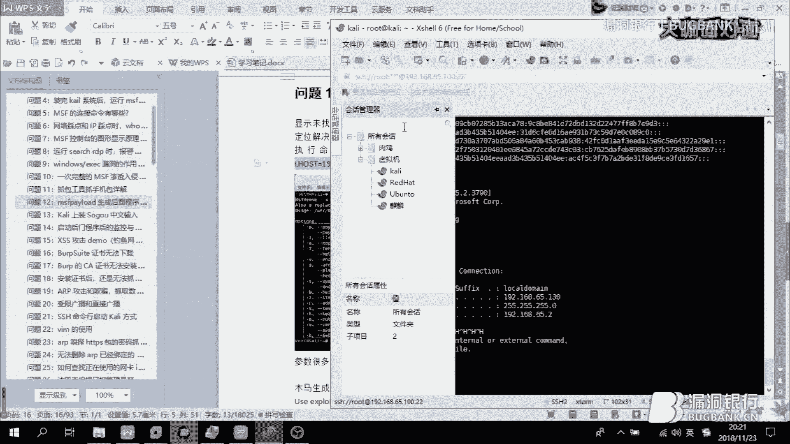

我再起一个。然后这地方我改一下02。然后就是生成了一串命令，然后我就直接写了。没有那个目录或文件夹。哦。0声。嗯，我看一下。哦好，错了。windows没得死。不打的命令开去杠I5罗斯。要9个8哦。

这个打错了IP打错了。嗯，4-65。100是这样一个这样1个IP地址。对IBD打错了。诶哎诶稍等一下。我看一下我到我的。我直接复制这个吧。命令是一样的。认试一下。T。一。杠5160。诶，飞系。

没有这个文件目录。Yeah。多了个空格，前面，然后可能这地方打命令的时候。多了个空格。

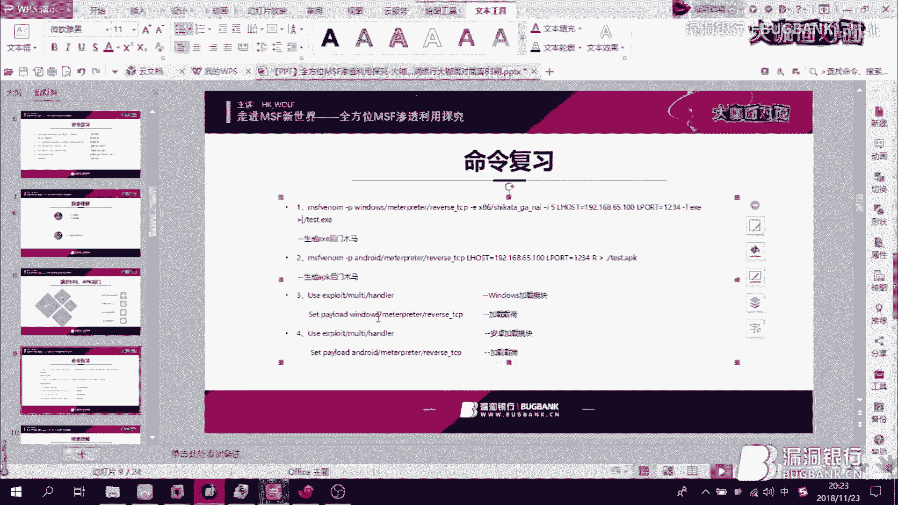

嗯，然后大家可以看到，因为你是杠的杠I杠的是一个5，然后呢它会生成什么？它会它会加循环五变。在下面看到有5次循环，然后得到1个EX的文件。那么这个EC文件可能对我们就说就是一个后面文件。

还说哎这个后面文件其实现在来说，就是你单独拿这个文件出去，90%会被拦掉，会被拦截掉，它的免杀率我查了一下，就是单独杠5的免杀率大概就是6%左右。就是基本上在嗯94%的杀毒软件都会把它防下来。

这一块就是很低很低，基本上不用不了，并且win10它有防御策略。嗯，然后我们去找到这样一个test2点EAC的文件。

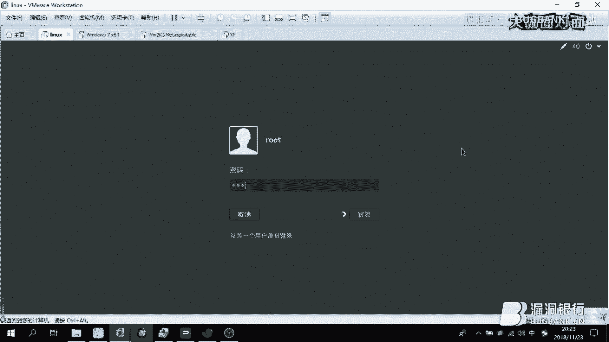

嗯，我们找到这样一个文件。嗯，test2。这样一个文件就是刚刚生成的这个文件，太 style就点SE程序，然我把它拷到我们桌面上。嗯，拷到桌面上的时候，这地方有个需要注意的地方，什么意思呢？

就是win10，它会有一个防御策略。还有时候禁止你考，像我现在能考的目的是什么？我能考的原因是什么？就是因我把那个防御策略关掉了，它的防御策略是什么呢？就是说嗯大家可以去就是你的这地方。

win那防火墙里面它会有一个东西。他会有个东西在这里。首先首先两个东西，它会在这个地方你连接未连接，它都可以都是可以的。就是你的启用和防御，你开和不开，它对这个地方拷贝没有什么太多影响。就是有些人说。

哎，我把这个地方开启这个防火墙开启，是不是我就能够防止住这种拷贝那种病毒的拷贝。其实并不能这方你开启他也能考进来，对吧？然后还有一个地方就是这个。是这样一个这样一个防火墙和网络保护。

然后这个里面就东西多了。这个就是如果如果你想对自己本地做一个检查，你就一定要玩这个东西。首先这是一个在这里。会有一个这个。会一个这个就是它的一个防对应选项。如果你把它关掉。如果把它关掉以后的话。

它上面东西都会扫都会都会隐藏掉，就没有了，就根本就没有。然后你再把定期扫描，打开之后之后就会告诉你一个主性程保护。诶。稍等。好吧，我这我这方开完以后，他好像阻止我开了。开完以后就会有一个主进神保护。

主进神保护在这地方就会有东西，就会有东西什么呢？这个一定要这里看到实时保护，实时保护一旦关掉，你这个地方拷贝的一些文件，木马文件，它就不会做一个实时的一个呃免就是查杀查杀活动。如果你把它嗯关掉，打开。

你这方一旦拷过来，你就会有一个病毒这个报错，你根本就拷不进来啊，不对，我不能删，我要它演示一下。我给大家演示一下。这个特 test style等的一个作用。

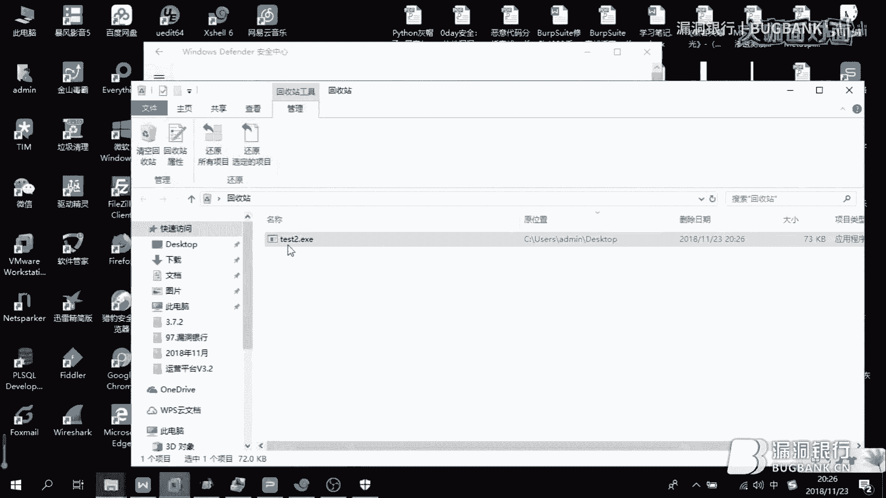

嗯，OK那我们直接拿test2，我们去去发给，比如说我把test2发给某某某是吧，别人去用。那么发的时候又有很多种的一个就是演变过程，比如说呃有些有些人你就看到是1个ESE文件，他先把那个ESE去掉。

那么也很简单，就是你重命名的时候，你再重名的时候，当然这个这个这个其实已经比较老了哈。重名的时候，你插入的时候，你是这样去插你插从左到右插和从右到左插。你这样就有两个变化，就是一个是你写出来东西。

一个从左到右，一个一一种写法从右到左，它就能够把它演示出来。比如说我跟才呃我这里有一个现成的，我就不写。然后我写有现成的。大家可以看到这个它没有演示出来，它没有它没有显示出来。这是在2K3的上面。

它可能就是没有这种演示，还是ESE的后缀。但是我把这个文件如果拷贝到本地上来，大家可以看一下。对吧他其实你看后缀，它是一个它是个GPG的一个后缀。当然我现在先不慌，金三已经把他杀了。嗯，稍等。

我把这量关一下。嗯，它它其实你可以看到它的后缀，它是个JPG的后缀，就是唉这个地方为什么是JPG，其实就是因为一个unit code的一个写一个写法，写法的过程出来了。

OK然后这地方其实就是一个写法的过程。比如说你写出来的时候，它的EX一和那个GB，它这地方是一个倒序。然后你从表面上看，肯定是个JBG这个文件是吧？你说哎好像是个JPG的文件，然后呢，你把这个图片一换。

你是进去把图片换成一个图片，然后它你就伪装的目的性很强这个地方啊后可以看出来这个东西什么范文兵里程，当是我随便瞎写的哈。呃，然后它其实也是个ESE的文件。所以所以有很多变种变种方式。好，这个我不管了。

然后我们我们现在去看test2。嗯。我们看t2，我们把t2考到。拷到我们的就是讯机上去，那拷到什么呢？拷到这台机子上吧。嗯，但这台这是一台虚拟机，所以说它东西比较杂，我放的也比较杂。

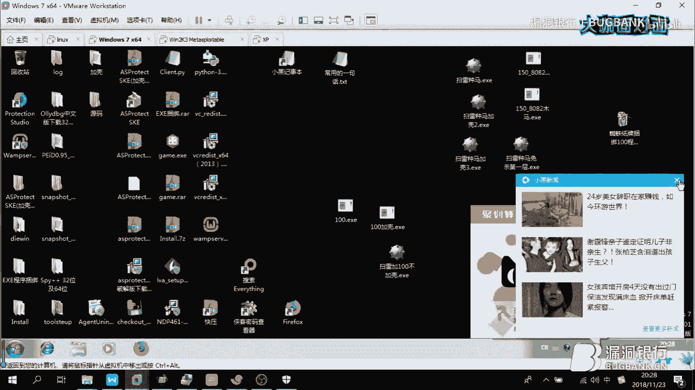

那么这个tsile放这里t放这里，然后等于我跟大家讲它的一个捆绑免杀啊等等，怎么去玩这个东西就大常规的一些操作是什么？

OK那我们现在继续。嗯，不关掉它的原因，是因为我可能还要用它。응。OK拿到这里来以后，我们再嗯我们退到这一步，推到这一步以后，我们可能就继续在MSF里面去操作。因为你那里运行，你运行完了以后。

我可能需要一个接收，就是我一个接收端，我必须要接收到你的一个木马，对吧？你拿到以后，然后哎我这地方需要用到一个载合，需要用到一个模块和一个载合这一个过程。那么我用模块就是什么呢？就是用这个模块。

拿它的一个hand去取代的一个hand。嗯，然后粘贴一下。啊，这个地方有烟小息。🎼因为因为嗯写PPT的时候直接手打，然后手打的它有很他有很多的一些大小写啊，空格啊就没有那么严格。嗯。

这个地方可以再跟大家扩展一下，就是嗯为什么这地方用一个received的TCP为什么要用它它是什么意思呢？它就是一个嗯反向连接的意思。就是比如说我作为一个服务器，我给你开放个端口，然后你作为一个客户端。

才能访问我的服务器上某一个服务，有些比如说网页阿帕奇的或者说IS的，那么你才能访问我开80给你，对吧？或者开80818080等等。那么它一个反向连接什么意思呢？就相当于我先去连你。

然后再让你做一个服务器，开一个端口给我，我再做为一个客户端去连你这个服务器。对，有点绕口还。🎼呃，理解的成就是A和B的关系。A是服务器，B是客户端。那客户端攻击服务器的时候，他可以把自己作为一个服务器。

让别人就是把嗯A作一个给自己开个端口，然后自己再连进去，属于一个反向代理，反向连接，不是反向代理反向连接。然后我们看一下它有什么东西。我们看他什么东西，它这里面需要什么，它需要你的一个目标地址，呃。

需要你的一个端口。那么我们的lhor其实就是我们刚刚设置的。Certaint Air host。嗯，然后这里是192。点168。6。100，这个100呢，为什么是100？

因为我这刚刚设置了他接收的L或就是100，然后它端轨是1234，所以说我们这地方就写个100。然后我们再来s一下它的呃对，这地方st也不要用大写，就用大写，它也会报错。嗯，然后这个地方是1234。

然后我们再来修一下。需要因为他已经他已经有了，他已经设置好了。那这个时候我们就是怎么玩怎么去做，怎么去做这个事情。那么我们看到这个地方嗯。

这里不光是有我这里把嗯EXE和安卓的APK的也加进去了APK的其实用的就是前面一个是windows，后面是安卓，就这样一个区别。其实它的原理是一样的。等一下我给大家去讲它的一个反编译。

哎这个ABK反编译完成之后，怎么就大家可以看到它的一个源码是什么，然后看到的源码可能有点乱，就是因为它嗯加了5次，我杠了一个5，所以它看的比较乱，大家去用的时候可能不杠，也可以。

然后这地方我们用run试一下。Ile exploded。E X，PF IT。嗯，然后我们用说了以后，他就开始等待有人去连到我的这样一个给我发这个消息。也说现在来对他对对于外界来说。

我这台100的机器就相当于作为一个服务器来说了。然后你作为客户端给我来发消息是这样一个道理。然后通过什么？通过1234给我，然后呢呃反向代理以后。

然后这个1234就给到了相当于你的1234发给我的一个消息。那么我们来演示一下这个test2。

他2这样1个ESE它的一个作用是什么？那特斯拉就这个。其实泰斯2运行完了之后，它只是一个demo，只是个演示。所以泰斯2运行完了什么都没有，这样点很异常，给别人看到说，哎，我运行完了，什么都没有。

是不是很异常，对不对？然后我们我们这里可以看到他已经拿到你的权限了，他已经拿到权限是从135这台机器。

来传给我的，然后得到的是什么？得到的是我们刚就是我们刚刚看到这个东西。那么我们得到它以后，嗯，进一步操作就和刚才你利用漏洞是一个故事，对吧？只要他拿需要什么等等等等一系列的操作都是一样的了。

那么我们再重点去讲他的一个防怎么去防御它。

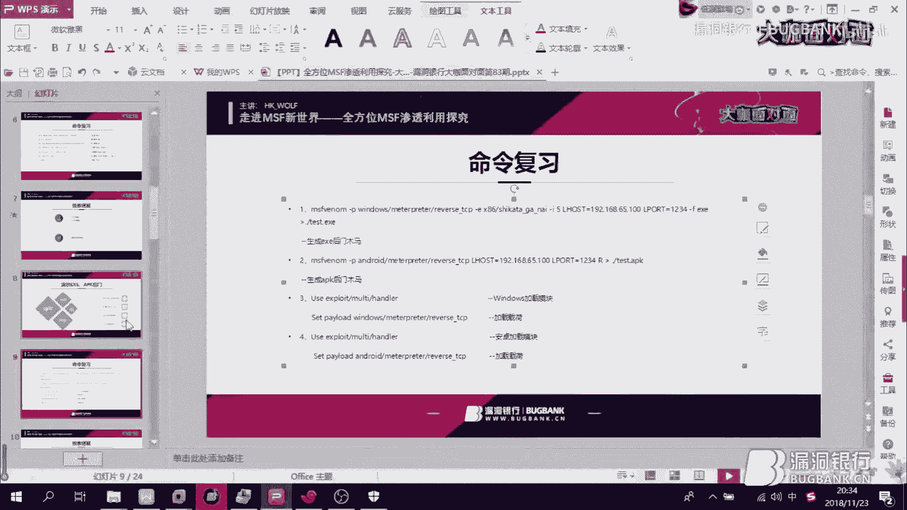

嗯，我先把PPT翻到我房的地方。

嗯，然后这个地方什么是后门，什么是木马，然后防御手段有哪些？呃，后门和木马的关系其实可以理解成嗯木马其实是为了承载后门而存在的。就是比如说木马木马有什么用呢？木马呢，对吧？入侵到你的服务器之后。

他总要给我开一个后门，然后开一个端口给我，然后我才能通过这个东西去连接到你这个端口里面去。至于这个木马最后是生存还是死亡，就是到底是把它怎么处理掉，得跳掉还是怎么样？这是到底是你的处理过程。

很多人会把马杀掉。就比如说马马渗透进去，把马把服务器完，就是服务器得到之后，再把马处理掉，处理掉完了以后，只开后门，开完后门以后，相当于只给我一个端口就可以了。

所以最后很多人就说拿不到码的原因也是这个原因，就根本就拿不到。然后其实都已经被处理掉了，很多人都不会说嗯把码留在服务器上，很少很少人会留。嗯，然后防御手段防御手段呢就和我们刚才的其实有异曲同工之妙。

这里面什么意思呢？就是说我们还是去看这样一个就是刚才的winIN7的这样一个服务。

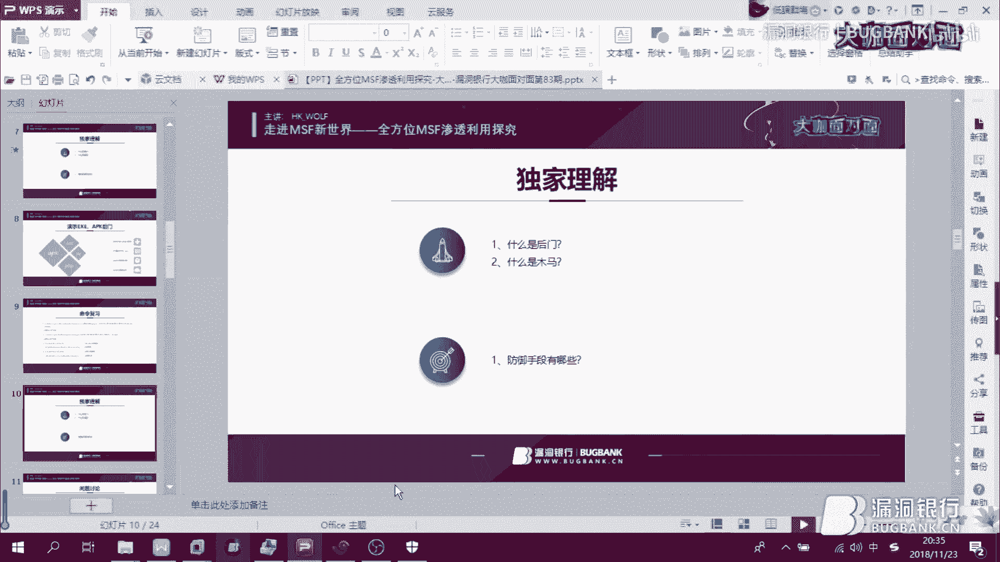

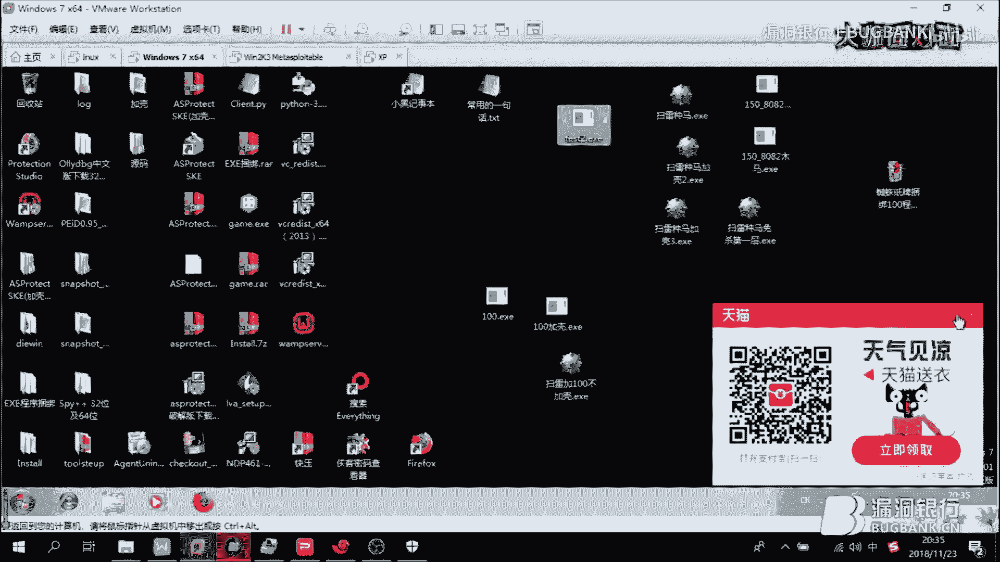

winIN7里面的东西。嗯。

因为是才启动的机器，这里面装了很多的，就是很多的软件，就是就是那种。弹窗的软件特别多。嗯，然后我们还是用let's down那个命令。刚才有的这个命令来做。

那这个命令看完之后，其实你可以看到，大家也看到。这里面有很多，就跟我刚刚说的，其实看看不出来看不出来哪些是我想要的，就是太多了。针对listing端。

其实我们可以先不管我们对listing端口其实没有什么意义，对我来说没有太多的意义。

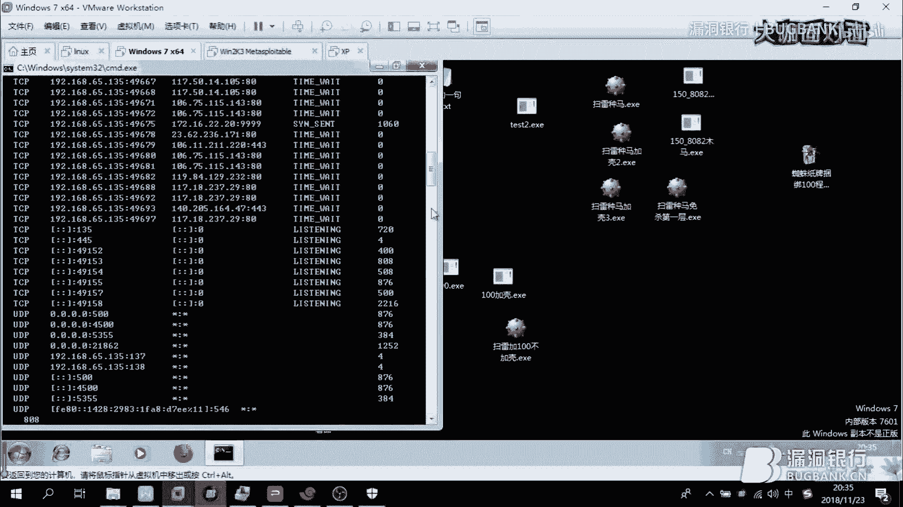

然后这样就直接去翻译了一下。Find的。E，T。A。Y I has a tea。我看一下怎么拼的啊。E T BED。景式。嗯，当然说哎，为什么我们就是为什么我们会去看这个东西呢？就是它到底是什么意思。

这个是什么意思？这个什么意思？其实我这里也罗列了一下，当时去学了一下。

就是到底这个东西什么意思？E， TD。对，我们这地方其实有很多的。跑哪去了？这里。我们这个其实有很多的3里面的大含义是什么？大含义里面就list listening的话监听了TCB的端口请求。

其实嗯只是属于一个侦听状态，它并它并没有打开连接，没有连接，说明他不可能对你做一个透传，他不可能到你他不可能到你机上来。他只是说就算是他对你做监听，就比如说你开那个什么玩QQ的时候。

你这方也有list端口，对吧？针对QQ他会监听你的一个数据，数据有发送，我就把包发过去等等等等。你断网了，我也会监听，对吧？我监听你又没有断网，等等等等。然他一定会有list林。那么林呢其实危害并不大。

其实还好，只要他没有连接，他拿不到你的数据，拿不到你的一些东西。但是这个我刚刚说到TSABESTAB这个东西就很危险了。

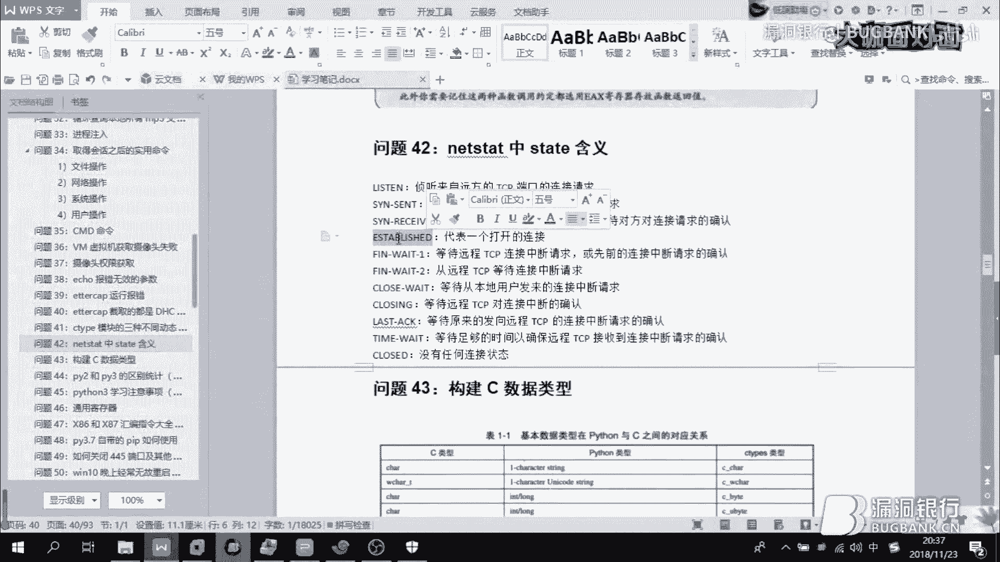

很危险非常危险。那有时候可以看到还有这种等待远程TCB中断请求等等。然后杠1-2等等。然后呢，重点呢我们可以看到这个东西，就是重点会看这个。呃，前面这两种也也会遇到。

像我们刚刚也看到了SYN的SYN的一个那个状态状态码SN的状态码其实是有的。SYN的状态嘛。对SON的状态嘛是有的。那么我们拿到它以后，我们可以看到说哎135135这台机器对应的是就是我自己的这台机器。

叉64是135。跑到了100的1234这样一个端口号。通过了TCP的连接，然后创建了一个创建了一个连接。然后它对应的我的PID的进程是16312。然后我们看一下PID进程。1632。

123对应的它就对应的是test点1S1，然后还是32位的呃，132位的一个进程啊。OK那个进程就是我们刚刚刚刚在呃我们在机上跑过的那个test2点S一这样一个程序应用程序。

然后得到了一个东西给它来了一个连接，那么也就是说我们通过这个手段也可以看到，可以可以得到这个东西。那么很多朋友就会说，那我们还会有什么进程注入的一个手段。我把它注入掉，注入到其他正常进程里面去。

那么你这地方其实根本就没有这条信息了，对吧？那么我们该怎么处理？那这种处理方式防御手段的话，处理方式很多，防御手段主要就是不要运行很陌生的这种ESE。你要是特别想运行，那你就先到虚拟机上去玩一下。

确保它没有后门，没有东西以后，你再在本机上去试。主要是这个原因，只要是这样一个手段去做这个事情。呃，然后。真正的中码之后，比如说这里没有，那你该怎么玩怎么做，那就要一步步去分析。

分析你的一个内存的一个进一个异常点。然后看它是哪个哪个进程在做。然后是针对这个进程去拿它的大火包，然后通过大火包里面去分析怎么去，对吧？它里面到底用了哪些东西。因为你把它打了down火之后的话。

它基本上就是把你当时运行的这个电脑的一个状态做了一个镜像。这是一个dump，一个dump放那里，然后你去分析这个dump，这个dump里面可能有什么东西，它就动不了了，它是它就不可能再去动。

那么它里面到底当时的一个发生情况就一目了然，你就可以一步去分析出来这种东西。

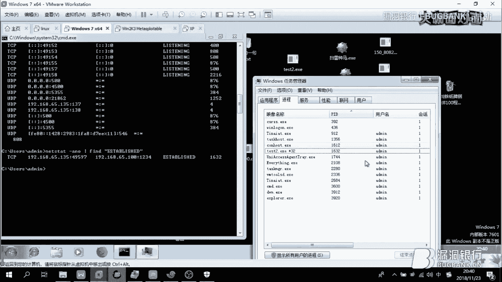

O我们就不讲那么深，然后我们再来讲一个什么呢，就贴T它的一个变种。它和比如说我刚运行，大家看到了，哎，它就是一个散了一下，没有了，哎，给我很异常说哎，这个东西一看我就知道不是个好东西，对吧？

那我就把它删掉，我要我要我要把它杀掉。那你就取不到了一个起不到你要的一个作用。那么我们想了个什么呢？你就把它跟别人绑在一起，然后再做免杀。比如说我这里绑了一个用指子牌和和扫雷去绑是吧？那我用资子牌，哎。

我还做夹壳，对10百做了一个夹壳。当时这个100就是对应我刚刚的100的100的那个服务器扫了100不加壳，然后我跑一把。啊，我现在来看一下这个。这个其子已经断掉了的。其实我直接直接回收。

它是已经断掉了的，它已经没有了的。因为你你在那边已经把它中断了，它这地方就根本就不会有了。那我再来监听一下，监听完了以后，我这边我运行这个扫雷。

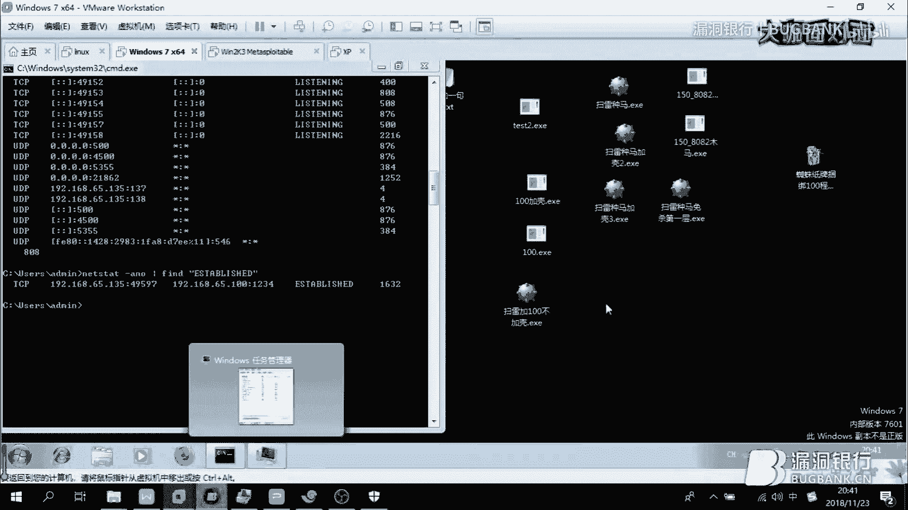

看扫雷出来了，对吧？这个扫雷是可以正常玩的。这没问题的对吧？那么扫了完了以后，然后我们再来看一下它这个地方，其实你已经。

你经背某个。程序已经取得了权限。说白了就是扫雷和它绑在一起以后，你运行的扫雷扫雷的运行。这个扫雷过程中，你也把那个test2演E这个程序也运行了一遍。那么我们怎么去看这个东西？

那么还是根据刚才的那个方法。我们还要通过这个去看。通过这个去看，你看我这个次找到了，其实它是针对于3736，对吧？1234，它是进程是3736这样一个进程。那么我刷新一下。

3736看。3736对应的我们刚才就是什么呢？100。1XE，它是1个32位的，然后它绑在了是扫雷3380。那么我这个时候其实我们还没有做到完整的一个进程之物。比如说高明一点的。

我扫雷运行的时候，这个东西就会注入到扫雷里面去。那么你打开以后，你其实根本就看不到你只看那个扫雷进程在这里说哎，我好像在玩扫雷呀，那么我电脑怎么越来越卡，或者我电脑怎么突然一下子对吧？中毒了。

被黑了怎么办？那就说明你运行扫雷的时候，他已已经带了一个就是后面程序，然后得到你的一个进程，得到了你的一个控制权，然后取得了你电脑的一个控制权。那这时候就是特别危险的了。那这这里面的防御手段就是什么呢？

千万不要去运行你不认可的一些东西，很陌生的东西，很容易就中招了。因为他这种东西过免杀，我当时尝试。过免杀的时候，像周子牌，他的免杀率可以达到70%多。也就说100款杀软件里面也可以过70多款。

只有就是少数的差不多二三十，百分之二三十，也就只有七八款的样子，六七款的样子，能够查出来它是一个就是病毒程病毒程序，其他也是查不出来的。当然了，我只是做简单的捆绑，当然是达不到这个效果。

你还觉对它做什么夹壳。把它加壳加完壳之后加加一层加两层，然后混合加就组合加等等这种加壳的方式方法。然后去运行运行完了以后，你说把这个发给别人，那别人怎么可能去。对吧怎么可能去质疑呢？

或者说你这涉及到什么社会工程学，大社会工程学，哎，我发给你，然后你运行了，对吧？这当这这个就挺危险的这个东西。然后我们拿到看我们把它去掉，去掉完了后，我们看纸牌那个东西。纸牌的东西其实也是也是一样的。

这个先呃里面有好几种，有的是先加壳再捆绑，有的是先捆绑再加壳。它的一个作用和目的是不太一样的，就是免杀率是不同的。捆绑之后再加壳，然后夹壳之后再捆绑，反正就是不断去试，不断去去玩这个事情。

然后你就能得到不同的一些免杀的东西。那针对这些东西的话，大家可能就开始做去做免杀，然后去做真正做好做的好的免杀。其实你要对对汇编要非常的熟悉。就是但是当时这只是我自己的一些就是见解，你真的要做的好。

你对汇编的了解程度可能真的要非常非常深。

然后你这个地方最免杀算做百分之百。当然对汇编的一个玩法的话就。就这节课就不讲了，因为汇编里面确实仁者见仁，智者见智超级多。然后我这边对汇编可能也就是只是说用过呃，还行，但是。不是很熟。

当时也破解过一些东西，但也没有没有像那种大牛一样，特别牛那种状态。

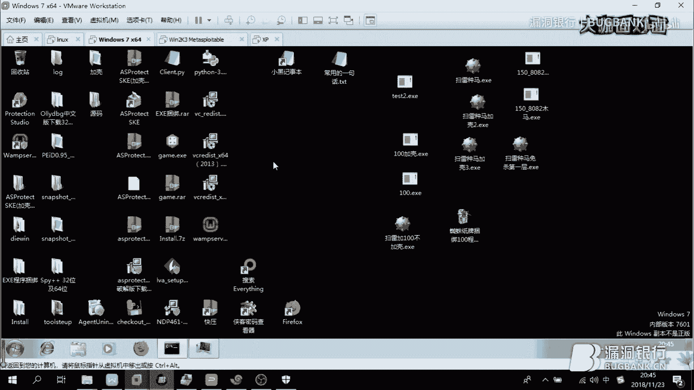

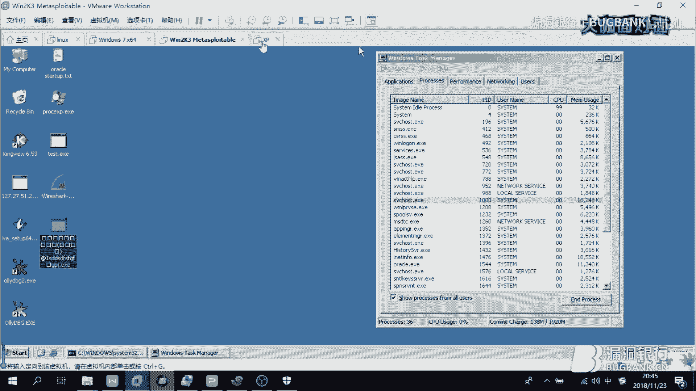

OK那这个地方跟大家讲的思路就这个。

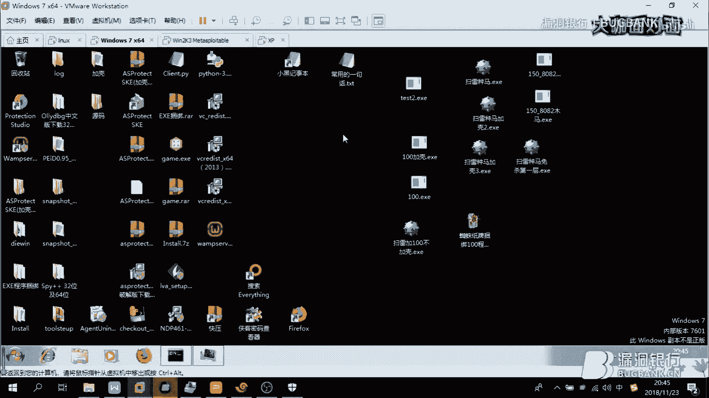

嗯，不要轻易的去装那些。你不认可的或者说你不清楚的稍哥你那些运行程序，特别是ESE呀APK啊那种。一定要那个谨慎一点这一块。嗯，然后这一块的话。就是你说要防没有没有完全可以防得住的。

你像百分之百的把它挡在外面这。你只要运行，你只要手动去点了，那这个东西就不一定挡得住。所以说从源头去挡住它。比如说你要下什么软件，你就用一个什么固定的一个软一个下软件的工具就可以了。

你像比方说我这边下软件，我可能就固定的，我也不到外面下，我这些软件管家里面去下。我也不到什么官网啊呃官网也可以下，当软件管家里面下，然后你不要到什么其他的一些什么一些网站上去下，就比较危险。

除非说你自己下下来，先到虚拟机里面玩一段玩一段时间，对他做一个分析，做一个反编译，看一下里面有没有加东西。你玩完以后觉得哎还好，没什么，那么就可以用，不然的话。尽量减少。

OK然后下面就是问题讨论，就是我生成的后门在公网上运行。那么怎么样跑内网去搜到那个resceive的一个反向连接？因为你的内网一定是通过你的就是DCP的一个服务给你分配的1个IP地址。

那么这个IP址其实是个虚拟的这里面牵扯到什么呢？IPV4IPV6IPV4有多少个IP地址IPV6有多少个IPVIP地址，为什么会IPV6的概念等等。这牵扯到很多。那么我们这个地方嗯得到的一个答案。

就是说会做一个内网的一个透传？通过内网透传的一个方式，就能够收到我的一个resserv的一个TCP的一个给我的一个反向反向带反向连接，这样我就能收到。不然的话，你这个地方其实你在内网里面用的东西。

在公网里面也是搜不到的。在公网里面用的东西，内网里面你也收不到，你就得不到这个东西。第二个就是公网IP端口如何去隐藏，如何去破解？呃，这一块的话就涉及到端口隐藏的一个东西。

端口隐藏东西主要的目的就是就是去防止别人去通过这个东西去找到你。找到你的就是原本的机器，机器机器的地址在哪里？这样一块东西，然后防御手段防御手段就刚刚说到的。那么我们讲到这一块以后，我们涉及到什么？

涉及到内网。那么实上内网我们就一定会涉到ARP进引到我们的下一个下一个点，就是ARP的一个。呃，防御或者说是一个工攻和防。那么。为什么说为什么说一定会有那个内网IP呢？比如说你的电脑中毒了。

然后你到公司去。你可能就通过你的一个跳板，你的本地一个跳板，把整个公司的网络搞就是全部都已经肉掉了，或者说搞瘫掉了或怎么样，信息全部泄露掉都是有可能的。所以说呃内网的就比如说你不能你能保证你自己不中毒。

但是你不能保证你同事不中毒，你同事中毒了，然后就会引导你。那么你的电脑数据的防密性还在不在，这要打个问号，对吧？所以说一定会有个内网IP的一个防御。这一块就是呃就算它中毒，它也不能影响到我。

我要去监控我自己的时候，怎么样去玩这个内网。OK那我们就开始讲分3块，第一个断网欺骗数据截取。呃，断网就比较简单了，就内网的一个断网，然后演示一下怎么去断，演示一下怎么去骗，然后演示一下图片的截取。

豹纹截取。嗯，截取的话其实很就是图片截取，然后很多种方法，很多种工具。我们用的可能是MSF自带的那个最常规的那工具，那个工具图片截取的概率不高，特别是对百度图片，然后基本上很难很难抓到百度的图片。

百度对这方面已经做了一些就是限制或做了一些处理。你很难通过它去抓了百度图片，他一旦涉及到你的这个就不行。然后我们当时抓了嗯，我学的时候抓的是CSDN的一些论坛图片，这可以抓到。然后豹纹的话。

抓HTP可以ATTPSS的比较难，也可以抓，但是比较难，需要做很多的设置。嗯，就等会这2块我们就弱化，我们只讲它一些原理，比如断网啊，然后我们怎样去看我们的IIP里面的东西。然后命令复习呃。

这一块就是我们刚刚讲到的IPV4IPV6IPV4看可以看到它的嗯首性封装32位的1个IP地址。然后他的1个48位的麦克地址，对吧？然后在这里。

那我们通过32麦个IP地址就可以看到我们整个公网上通过IPV4协议，所有的IP地址只有二的32次方个。也就是说呃最多只能做持2到3032次方台电脑。但是这是基于DHCP没有成熟之前这样的一个结论。

那当DHCP成熟了，那么我们就当然就不是他这么算法了。可能一个公司才1个IP地址，然后在对应的上面都是虚拟的DHCP给你虚出来的，对吧？下面再做一个内网，再虚出来，然后再对外就做一次转发就可以了。

那IPV6呢IPV62的128次方的1个IP地址。理论上就是以后到了物联网时代，这又扯到物联网了哈。就我们刚开始开始讲课那一段，扯到物联网的时候，就是嗯当万物物联的时候，当你的家里的冰箱电视。嗯。

微波炉等等都能联网，现在基本上都可以连。都联网的时候，每个都有会有个IP的时候，那那个时候的一个危险性和它的一个防御手段，又跟我们IPV4时代也是不一样的。所以大家可以去可以去脑洞大开的去想一想。

我到后面也会跟大家去讲，就是嗯。物联网的一些就是我所想到的一些就是比较危险的事情。OK那么这时候我们协议转发，然后做一个呃IP的攻击，做1个I欺骗。我们就做这2块。

然后我们再来看一下我们网口里面到底有什么样的1个IP对吧？我们做这个事情。嗯，还是。直接复制吧，我就懒得打了。呃，这个命令的意思呢就是说你看这里杠I网卡杠T目标IP然后目标的网关。

那么你再说你怎么知道目标IP是那这个呢？我一旦进了内网，那FP啊，很多方式都可以把你的目标IP全部搞出来，把一个网段的所有的再活IP全部捞出来。然后这些再活的IP，然后我就可以一个一个针对性的去做。

针对性去攻击，对不对？那断网啊，欺骗你的数据啊。所以说嗯就是一旦。一个办公室，一个公网，一个网口里面有一个人中了毒，后面可能都很危险。给大大家需要对自己的电脑有个所有所防御，就这个意思。

那我们在这里来做。嗯，这样一个命令的意思呢，就是说对135这台电脑做了一个断网的一个处理。等断网之前我们要先看一下。嗯，我先我先关掉。嗯。稍等，我断掉。对对我刚按错了，好像刚就微了。🎼可以断掉了。

断网之前我们要看一下它，我们需要看它的一个就是这样一个这样里面的一个命令到底是什么。那为什么要看它看它的原因，就是因为它如果等于一的时候，它会默认起起来是给AIP欺骗的一个模式。那如果它等于零的时候。

那么我们就我们就不是的。

嗯，OK看目前它返馈值是个零给我们看看到这个文件里面IP forward里面是0是零的话，那么我们做这个东西它就能够把它断掉，就直接会把它断掉。那么等会我跟大家讲。

为什么呃我这里可以演示断然大家到办公室去，然后说哎我想把某个同事断掉，为什么断不掉啊，那个原理是什么？那当然肯定是有原因的，你到办公室里如果能轻易的把别人网断掉，那整个网管就不用干了。

所以说这个地方我们看一下135这台机器，135这台机器它现在没能上网。135对应的就是我们刚才这台叉P的64位。

我们看他现在能不能上网。嗯，这能主意。其实他是已经完全不行了的，上不了网的。然后我们这里可以拼一下。它是拼不通的，拼不通百度的也上不了网了的。所以他这其实目前已经对你做了一个断网处理。呃。

那么我们停掉它。嗯，然后我们讲一下就是说。看好吧，听完以后，那边就可以了，这边一听完，这边立马就可以上网了，看到没有？四个字段就可以上网。嗯，讲一下原理说嗯怎么玩的。

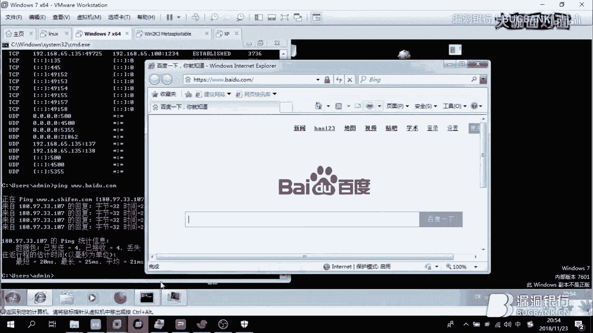

其实就是这一个主塞就是一个主塞。对你的mac做一个攻击，然后给你一个阻塞。然后呢，在公网里面，在自己的办公室网络里没有什么没用，因为它会有一个交换机，交换机的原理，它里面会有。最老的。最老是2K。

现在4K8K，然后在三层的，然后就很。就很多了是吧？就后它的一个内存或它的一个显存就很大了，它里面东西就很大，然后它就能存很多的麦克地址。你看要做个泛红，比如说我们对他做个MSF的OF这样MSC的OF。

这个操控攻击给他。然后我以前的玩法就是开10个MS的金，就是这种这种这种这种终端，开10个终端，然后不停的给他做泛红，然后一直把它那个东西它挤爆掉，挤满挤爆掉，挤爆完了以后，他就他就没有办法了，对吧？

他就只能把后面来了。比如说我把它整个整个全部挤爆，把交换机的一个内存全部挤爆挤完了以后，那么我后面怎么办？后面的数据会丢掉，那么我就把那个数据抓出来，然后放到我的网络里面，然后从我的网里面走出去。

又为可以保证他可以上网。然后呢，同时呢他上网的流量从我的电脑走出去，从我的网卡传出去的数据，我就可以从我的网卡里面把数据捞出来。主要有这样一个目的。就是大致的一个玩法是这样一个目的。

那么我们现在呃断完网以后，我们现在给他个ic，我们给他等于一的时候去欺骗他。说我们欺骗他，欺骗完了以后，你你的数据我就可以看到怎么怎么怎么做的呢？

就是我这个地方其实只用做一个只用做一个把它写进去写成一写上去。

艾的是法把写上去，然后我们看一下。我们看一下这个命令这个指引为一了，然后我们再来做一个同样的一个处理，就同样的一段操作。那么我这我这个时候做的时候，他其他就不会对它做断网，它只是做相当于转发。

什么意思呢？我说123。对吧他是能够收到结果的。我去骗他的时候，他是能拼通的。但他这个是拼通的过程，他是已经把数据通通过我的网口转发出去。那么我在对我自己的一个网卡的数据流量做一个监控或做一个提取。

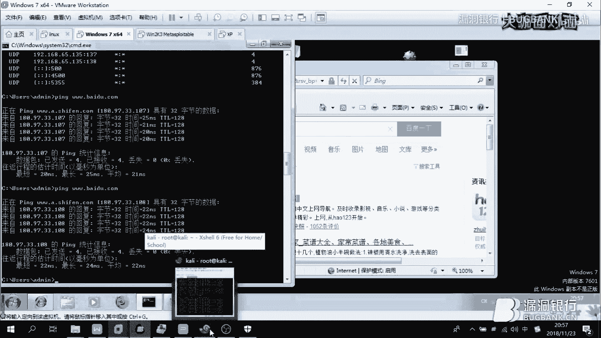

那么我就能做到什么就能做到看到你的流量是什么。你在你通过我的这里访问了什么，然后我就能够看到你。比如说你输入了一串什么对吧？账户密码啊，看了一些什么网站啊，对吧？访问那些图片啊都可以。

那我这我们这里先中断掉。呃，然后就讲到的就是。就这里。呃，图片截取图片截取的话，我们用到的就是这个用的。等一下。用到这个DR这个东西抓取网卡的图片。那么也就抓我自己的网卡。那么这个这个里面其实有个问题。

就是我多网卡的时候怎么玩？有些朋友会用到外置的网卡，会用的一些比较高端一些的外置网卡。那么我有很多个网卡，对不对？我接，比如说我接了一个局域网内，我把1台电脑的10台电脑全部黑掉之后。

让它全部做我的不同的ABCDEFG的很磁刻网卡传输数据数据。那么我要去抓这些网卡的数据的时候，怎么抓。那么我就说找到我的网卡的ID号。那么这时候其实是主要针对多网卡的情况。一般来说，电脑就一台网卡。

你就没有必要这么玩了，对吧？然后找到我王卡的I号。

对，然后这个时候你就能看到你的网卡号，你的你的你的这个地方的所有的东西连接那面没有连接的什么东西。其实我这里只有一块，它是虚出来的呃以太网啊，然后迅机的东西。然后如果说对外置网卡很多的专门做那种的。

他可能就会在这里会选网卡，会选ID号，通过你的ID餐，然后这个数据来得到我到底是用哪块网卡，我到底是取哪块网卡的数据。其实现在比如说我要取17这个网卡的数据。那么我我已经骗了他的数据以后。

我就可以从17这里面拿到我的想要的东西。这样子一个操作，这样子就是。

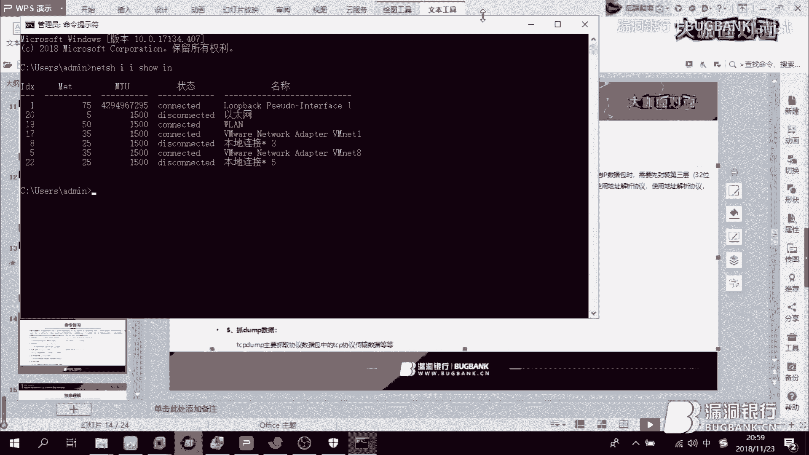

就是差不多的一个一个流程和一个操作，大致的。嗯，然后秀探和抓dump，然后抓那个HTTP的协议的一些数据，我就不演示了。因为差不多已经快9点了，我们后面还有很多东西要讲，免得就耽误大家时间这一块。

然后我们就不扩展去讲。嗯，这一块大家就是有兴趣的话，可以下来跟我讨论，我们可以一起讨论这个事情。就是对内网来说，这一段是最最危险的。嗯。然后这地方就是一些理解。AIRP的原理。

我们刚刚讲到AIRP的原理，对吧？AIRP三层四层对吧？三层是IP四层是macIP和m的理解，泛红的理解，然后防御手段OK那我们讲一下泛红。放火的话，其实我们听到最多的其实就是m克。

m克表的泛红就是我刚刚说到的一个mac克表，然后m克表里面现在大概的是就是比较low的一点，low的就是比较差一点的交换机是8K。然后三层啊那种的，你想去塞买三层交换机的这个表空间。几乎不可能。

你居能搞100台机去塞塞不满它，就它里面空间处理非常快。并且的话他比如说他2秒或者10秒，它会有个有个策略。

你一旦发现这个你你这个那个markac是一个是一个不用的mark克没有数据传输他立马就把它扔掉，非常快。然后它空间又比较大，所以你要给他不停的发数据的时候，你就压不爆它，压不爆它，你就不可能把它里面。

就是后面的数据丢掉。他主要想要的就是什么？就是把你的mark填满mark地址填满填满以后让它崩溃掉，崩溃掉以后，交换机以后不得转发广播数据，然后这个广播数据里面的报文信息就会被别人拿走。

一旦拿走之后就把它签到我自己网卡上来，签到我网卡上之后网卡传出去，我就能拿到我的我想要的你的数据。主要是你的数据我就能拿到了，是这样意思。泛红呢分很多种，然后SAMP的，然后TCP的UDP的。

EDP的话之前有。还有一个事情很出名的，就是UDP的原理的UDP豹纹这个东西呃叫做什么死亡之子。对，大家可以去有兴趣可以去看一下。UP的泛呃泛红这一块就是。呃，当当当年比较出名的一些事件。

然后mike的话就是大家用的最多的内网用的最多，基本上就m克。嗯，公网里面就不限了，对吧？什么都有。呃，第三点钓育网站。

嗯，当然还有一个就是忘了跟大家说，还有一个就是ARP。有个命令F杠A的命令。

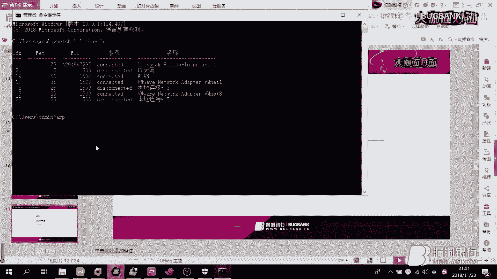

嗯，啥意思呢？就是说刚命令就是我看我自己的目前的局域网内所有的IP的地址，那么这个地方需要注意一个什么东西，就是注意一个接口。首先首先我们看到这东西，这好多好多好多东西，对吧？

什么什么什么这189659918910010100。不要管这些东西，千万不要管不要管这些东西。如果说你是用的呃无线和有线，它还会分。那我们不要管他，我们管他什么东西，我们管个动态，管这个类型。

我们只管类型。就是管这个动态这几个字。这个动态对吧？这个动态这个动态一我就不管了，动态一为为什么会是一，因为它会把我的这个IP然后传到我的讯机上去做一个透传，然后这个100对吧？

透传给他一个给他一个网关，01的一个网关，1910801的一个网关动态这不管。然后我们就看这个地方的，动态多的地方。这个断多的地方其实就说明了。呃，目前有哪些机器连在你的机上在？

当是这个连呢就是并不是指的数据的一个传输，它是连接，或者也不是指连接。但是你看1012128130135，这是我的四台虚拟机。这种生态虚拟器，然后IB都在这里了，对吧？它是一个动态的动态的说明它是什么？

他们是活跃的，活的静态的什么是实的，可以不用管的。所以基本上这么理解这样一个状态，然后需要关注的。比如说我在我在办公室突然发现哇，通过我的呃有线网有线，突然发现好多东西连过来啊。

可能我当时连我当时玩的时候学的时候，可能连了好多七八个八八九个。

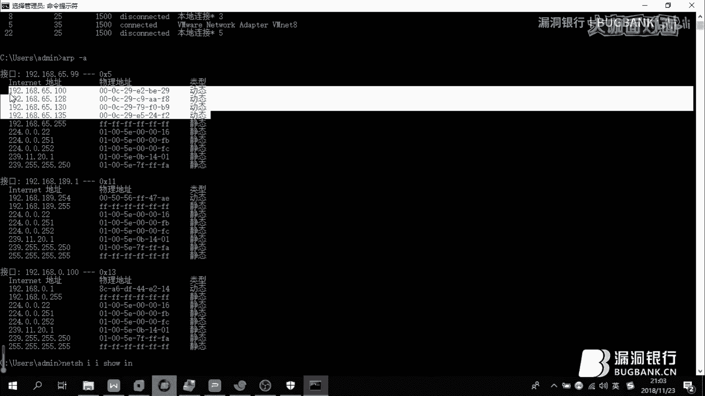

嗯，非常恐怖。然后我后来。

我后来把它一个个全部毙掉了，全部毙掉了，就是那那种那种。这种东西就很危险，对吧？你看我当时用的时候哇，抖咚等这么多全部都东，我都不认识。大家都跟我是一个网段，然后我我F拼了一下，有些有些端口都是活跃的。

但不一定是人在用，有打印机的，有什么这那的，你就把它闭掉，全部全部都全部都删掉，杠D把它D掉掉就可以了，delete掉。嗯，所以这样就是对自己在内网的一个安全性的一个防护。当看到这么多人连到自己的时候。

当你又不认识CIP的时候，就把它毙掉。

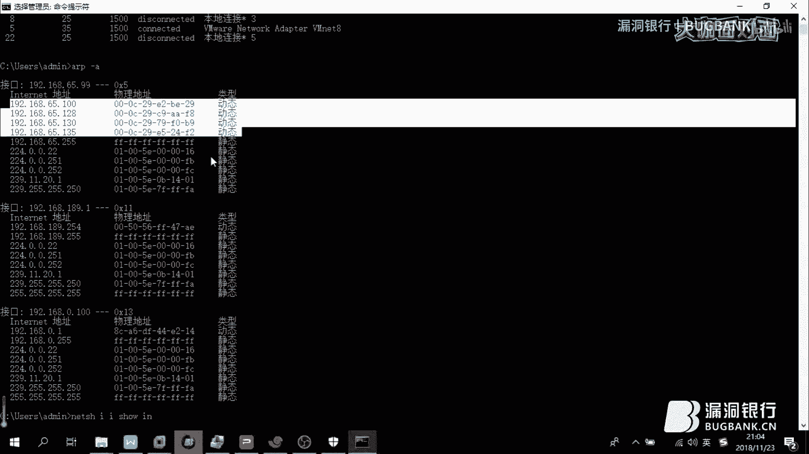

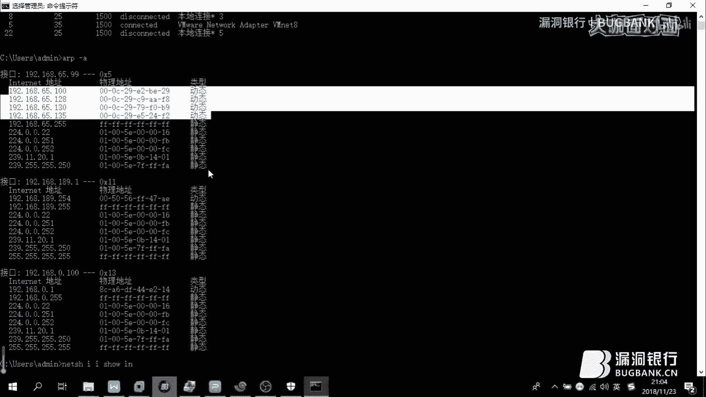

二话不说，一定要毙掉这东西嗯。然后电网站OK。然后调鱼网站这一块呢，就是为什么说也为什么说我们从NIRP一下跳调鱼网站上来？就是其实嗯并不是跳跃过来。就钓鱼网站它的一个危险性，它是在从我们刚开始取到的。

我们刚开始所有的演练，都是为了取得电脑的就是服务器的一个权限。服务器的一个就是它的一个最大权限或者它的一个数据。那么现在真到后来呃大量的网页出来，大量的wordb出来。

大家都开始都开始在W上去浏览器上去浏去冲浪啊去这种这种操作的时候，那么大家对服嗯就是网页的。就是也不较玩要wordb的呃数据就比较感兴趣了。那么这时候黑产就会盯上这些wordb是哎，哪个wordb。

比方说阿里巴巴的他的一些数据，比如之前些呃携程啊什么的，他们的一些数据泄露啊。然后是针对他们来把把服务器给他搞当掉，然后把数据抓出来多少亿多少亿的开放数据啊，然后拿去卖。就这种。所以说针对于针对于这样。

我们来做一个代网站样的一个演练和遐想，遐想什么的？就是我们到底后面我们应该大家是怎么做的，我们应该怎么防，那大家做的时候，其实很多种方式。比如说啊我们先演练吧，先演练一个demo。

然后我们再来跟大家说后面一个演练，就是后面可能出现的一些情况，包括我自己大致做了一些尝试O第一个就假冒电子邮件。嗯，然后登录啊、游戏啊等等，这当时它的一些危害性，写了这个危害性。然后我们来做一些演练。

然后做演练就是首先做一个demo，做demo的话，还是刚才那个想法，就是说我们先。在MSF这艘航母上，我们先去找到我们要的攻击机，也是我们的要的。比如说歼15，我们拿了歼15，对吧？

我们先拿今天事五来做一个演练。放在这里。断掉了吗？等一下啊。

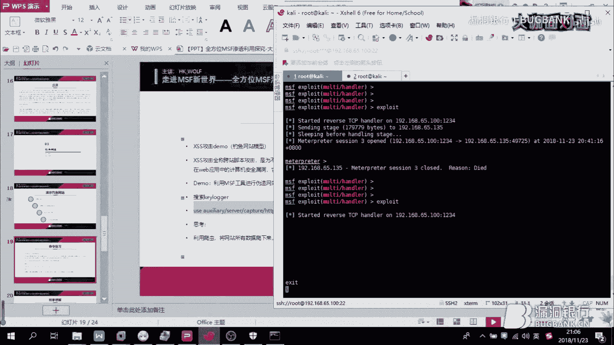

嗯，135。最台。

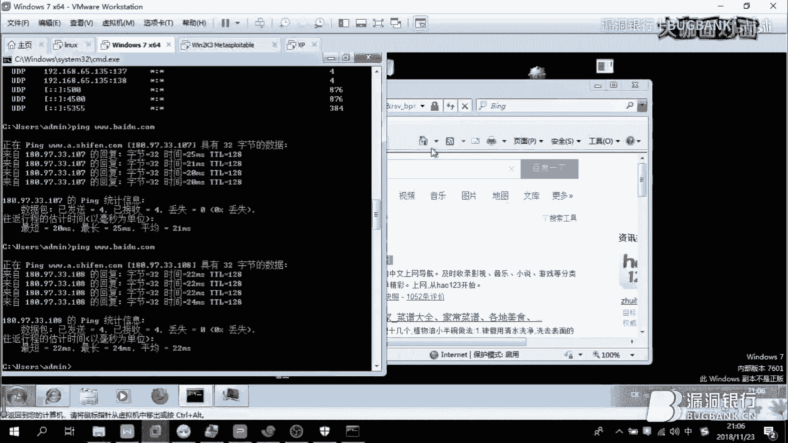

135的进程。已经去掉了呀。O可以了。可以了，然后我们用到了什么？我用到的是这样一个东西。我们用该是这样一个模块，这一个模块是干什么呢？他其实给我们了就是一个就是一个钓鱼网站的一个demo。

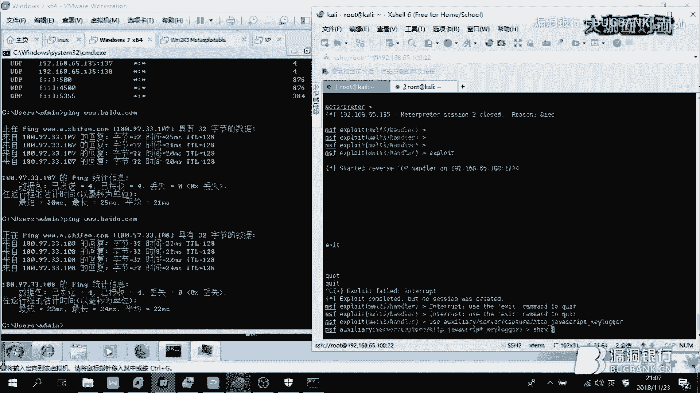

嗯，当然也不也不能完全是demo，因为我用到的是一个demo，它demo上面写的是force，对吧？他现在给我的是demo force，然后把demo跟它设置成te。然后这时候收成去的时候，TRUE。

嗯。哦，写错了，sep demoD。EMO。Q提2右E告诉他设置成谁等于QOK那设置成Q了之后呢，就是说我现在不用我自己的一个链接，不用我自己的个网页，我用他给我的一个默认网页去做这个事情。

那么这里面就有很多意思了，对吧？稍等，我把它全部设置完，然后我们一起看一下。S， RV H， O S T。ST大写的一定要就是大写的。然后这里呢我们就设置成192。168。6。100。嗯。

然后我们再来s它的一个端口，端口呢SRV。port PORT然后我们搞的常规一点，给个80都给他是吧，让你隐藏性大一点。🎼然后这个时候我们看我们先run一把，我们先不设置它下面的一个什么。

就是其他的选项，就SSL这是这是SL就是你用不用SL通道。然后呢，下面这个就是它的一个证书cut然后这个呢就是它最后的一个显示状态。我们先不看下面三个，这两个用到比较少，就非非常规的，非常规的。

然后这个呢可能用的多一些。然后我们看一下run一下，run生成一个东西以后，大家看到这个很奇怪，说哎这是什么鬼是吧？这后面是什么鬼，那么我们先看一下我们能不能访问，其实我们是可以访问的。我们复制一下。

我们复制一下，我们直接到我们的本地去做一个访问操作。嗯，火狐。诶。稍等换一个浏览器。换个浏览器。你看这时我们来次访问他。好慢好慢。刷新刷新出不来吧，对吧？然后我们来讲，我们再来试一遍。

我们这个时候设置一遍，它会有一个报错，看到没有？s that。然后我们再来设什么呢？设最后这个东西就是UIR的part。UR I。You are I， you are I。PH。

🎼PTH对我们设置成一斜杠。这是斜杠，我们再来看一下s绣的。어。Sure。Optice。嗯，目前就是这样一个状态。然后刚才那个爆出的原因可能是端口被占用，我理解是这样。

我理解是这样一个端口被占用的一个状态。它是在indiffer已经用掉了这样一click的，然后我们重新设一个端口。Sig S RV port。아。然后是什么呢？8080或者8081这样一个这样一个端口。

对吧？那我们再来看一下。他先得到一个状态以后，得到一个呃UI的pa了以后，我们再来run一下。我们绕，我们就发现一个问题，就他后面那一串不见了，对吧？他后面之前给我加了一串，我看到我都不想访问的东西。

我看了以后我就觉得那个很危险那种。然后哎这一串，但但是针对于这一串，我就觉得可以访问这个这个是可以访问的一个链接。如果一个朋友发给我的话，我可能真的会去访问这样一个东西。嗯，然后看就V开始访问。

OK那我们K落就来了。可以loaddemo的一个 form就来了。那这个时候我们来看它它其实已经连接上了。那看到没有？severeven start已经开始了。呃，那我这边输什么呢？我输123123。

嗯，ABCABCB啊，就这样。对吧，然后我们再来看一下我们这地方的一个记录。他其实就是把你的键盘监控了一下。就是你的键盘的一监控数据都在这里，就你。你的键盘所有的键盘的输入输出。啊。

当然没有不存在输错哈，就输入你下面的输入都在这里，先输到一，再输到2，再输个一，再输到2，就这样子。然后ASSACD等等等等。那么这个地方当然它只是个demo非常简单。大家看这个看到这个页面之后。

大家也知道这是个demo。那我们就来讲一下说哎我们非demo的时候，我们非demo的时候我们怎么做，对吧？我们做什么做邮件，那我们把整个126邮箱爬下来。然后做一个网页。

然后做成一个网页或做成1个API。做成一个做成个API或做成个网页之后，然后就挂在一个另外的个网页上做个钓鱼。然后你看到哎，比如说我现在看那个网页上这个A网页，然后这里有个邮箱登录，对吧？

给了我邮箱登录了一个入口，然后非常像126，行不行126邮箱登录，然后你就直接登上去了。不好意思，那你的邮箱的账号密码就都被别人截取了。那这是很危险，对吧？呃，然后我们遐想的东西是什么呢？就是说。

我们去到银行系列的。就是比方到到钱是什么叫到钱呢？就是呃官网。比如说我把BIC的官网仿了一个官网出来，那么我是怎么仿的呢？我用爬虫，我用python去写一个爬虫，把所有东西全部爬下来。是一个动态的爬。

什么意思呢？就是你有变动，我也会有变动，只是我比你慢2秒钟或者慢3秒钟。然后这样子一个爬虫的爬下来，把你所有的水用爬下来。然后你要去登录的时候，比方你叫IBS，那么我就IBAC2或者IBSC1。

很具有那种欺骗性的网页。那么你当时去访问，你可能没有注意到你就在上面去登录了你的银行卡号，你的身份证号，你的交易密码等等都会有。那么它会返回什么呢？它会返回给你的，也是一个正确的。

就你输一个错误密码上去，你也是登不上去的。为什么呢？因为我是通过接口实时去访问的。IBC的一个官网。往他那面去做数据。他会返回给值给我说你是正确的密码还是错误的密码，然后我再返回到我的页面。

反回给你就相当于说你说白了就是呃跟大家画一下。嗯。我还是习惯用我的画笔，等一下。嗯，跟大家换一下，就是什么意思呢？就是说嗯他中途会有一个什么。会有一个，比如说我这里我这里是一个用户是吧，是一个。🎼啊。

这好像不太好画，这是个用户，然后用户呢去连了什么，连到我的IBSC这是IBSC那么我在中途的时候，我会我跟他做个截断，我做个截断。然后你通过这个地方仿的ABSC的数据，和我我去往IBC去传数据。

然后再返回给你，然后再往往回给你是一样的，只是我中间这一段给截取掉，然后这次钓鱼的一个目的什么？就得到你的一个数据。得到你的账号密码。就这样一个原因，就相当于说你去访问的时候，其实。

也是在访问他的一个数据，但是只是通过我的页面访问出来，我就能得到你的一些东西。就你要你所输入的什么身份证号，你所输入的什么这那的号嗯，手机号、账户密码，甚至包括你取款密码，我都能识，我都能得到。

对以这钓鱼的危害性也很大，就以说这地方就是用爬虫，主要就是用爬虫。将数据爬下来，然后去XSS的，然后做一个正式调研完站。防防御方法其实就是你说。在运行你的那个就是IE的时候，你到底是走哪个。

你到底是走哪个，你就不要去走其他的一些代理去做那个登录，就直接去官网上登录就完了。这就目的性就因为官网上他毕竟呃请安全团队去做了这个事情，防牌呀等等的对吧？然后你这一方你就安全性会高很多。

那么这就次解释为什么会钓鱼，因为黑惨了，说白了，有些走歪面邪道的对吧？赚钱啊等等的。那么为什么会中招呢？就是因为你可能不清楚这个东西，然后你觉得长得都一样，页面一模一样。

你根本就不会关注那个就是就是那个那个那个链接，可能就这一点点区别，你可能看都看不出来，你不仔细看也看不出来。还有一种就是就是通过手机的短信推给你的那种链接。什么谁谁谁一个什么的链接让你访问。

你点进去啊1个QQ登录的页面出来了，一个微信登录页面出来了。你你只要一登，你基本上账户密码就泄露了。所以这种就很容易中招，就这种东西就不要去就不要去那个不要轻易的去打开这种链接。嗯。

然后防御手段就我刚刚说的那些东西，就是你怎么会中招，你想到我不是中招的一些就是我的防御手段。ok。那最后一个最后一个讲就讲1堆ABK1动ABK呢其实嗯获取手机的相机权限，然后它的访问思路也很简单嘛。

就其实用到的用到的命令的话，就是我们之前的那一段。呃，我就我就不做系统演示了，我大概跟大家讲原理，就是就是我们之前的一个命令。嗯。这个命令对。生成ABK的木马，其实就其实。

其实差不多了差不多就是后面的后缀改了。它原先的后缀是1个ESE后缀，然后你再改成APK的后缀，然后把后面的东西改掉就可以了。就中途的一些东西去掉。这样比如说我生成这个的话，我就没有做任何的加。

就是那种嗯混淆的混淆的意思，你比如说杠5对吧？加5次，我没有加我没有通过它这个模块加5次的混淆，我没有去加这个事情，那我就得到的是一个原态的一个APK那么这个原生态的APK它的一个过马呢。

呃识别率也很就是通过率很低，通过率非常低。然后我们对它会做什么操作。做什么操作呢？就做相当于呃我这里写到的有三类，加密加固和加混销。我们会做这三三类的一个操作，基本的方式是这样做。

就我们可能会对他做加密加固，加混淆之后，然后可以达到一个什么百分之百的过满。百分之百的过嘛，我这边其实已经做到了，就是嗯。演示的话就不演示了。因为已经差不多9点20了，后面可能还有12分钟。

我争取在12分钟讲完。嗯，这一块就是演示获取权限，然后ABK反编译和防疫思路。嗯，这块我这边嗯做了一个我做了一个嘛，做了一个已经。嗯，成熟了的。😔，也是回弹，也是通过回弹的metal去做的。

然后这个的话基本上可以做免杀了，这个基本上是百分之百免杀。你就是不管什么杀软件来都都都杀不出来。就是你不管比如我现在扫，我现在用金山扫。我怎么扫他都扫不出来。他会告诉我，这是一个安全的软件。就这种状态。

然后用很多我用了很多，就就是像我们世世界杀毒网上面去扫。我们基本上玩的话就是在安全里面会有一个世世界杀毒网在这里面去扫。然后基本上你可以百分之百的过。没有什么大问题。然后你看test。

我之前用的test嗯，免杀的时候基本上52%，看到没有在52%。这还是做过面杀，然后还是就比较比较过的比较低。嗯，对，然后差不多是这样。嗯，之后的话就说跟大家讲，就是移动互联那一块。呃。

这个这块秒杀的话，大家可能如果想有兴趣，下面就是去做就是。做捆绑不好做，做免纱好做做捆绑APK的捆绑是特别难的。APK的捆绑它怎么防。我想我讲一下怎么防，就你手机，你只针对安卓的手机哈。

安卓的手机千万不要轻易去root。😊，就是你的入的权限，千万不要轻易放开。你一旦放开以后，你装这些ABK它是不会任何提示的。

那么如果说你是一个捆绑的ABK一个你比如说一个马捆绑到一个正常的QQ的AK上去，那么捆绑完了以后，你就算是你能够通过嗯汇编把它做的非常的那个就是非常真实，一模一样的，看不出东西来。

但是你装的时候它一定会启动这个ABK。他启动了这个ABK之后。如果你没你有入你没有没有翻墙，没root，他就会一个提示。告诉你要不要装这个ABK，这是每一个安卓手机都会有的功能。这针对原主的退了。

所以千万不要轻易去翻墙，一旦你翻了墙，它就不会有一个它就不会有任何的显示，就是一个静默安装。那你一装它，你装QQ，你就默认把它装了。那么就掉了大，那你手机基本上就对吧？很危险了。

所以不要轻易的去去翻墙做这个事情。嗯，至于其他的方面，你要手动去装这个东西，那那当然就挡不住啊，对不对？所以这个东西是一个比较安卓，你只要不翻墙，安全性还是比较高的一个东西嗯。OK然后这一块的话。

我们基本上讲完讲完之后我们再回顾一下。我们回顾一下我们最开始的这个东西。就是下一个爆发点。

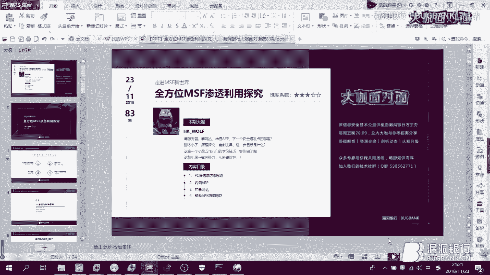

嗯，我这节课的目的其实主要想跟大家分享，就下一个爆发点，就是物联网物联网那一块有了IPV6，有了5G对吧？5G已经来了，然后IPV6已经来了。那么我们。

就是下一个嗯基本上我能想到的就是很快我们就会面临着IP，就是相当于。下一个黑惨很快就爆发下来，就可能就89年十年不到的就会出现这样一个事情。i6，然后5G5G也有了，然后这样也会带动什么呢？

就带动你比如说你家你家里的像现在智能电视、智能空调，我们家的空调、电视、洗衣机都可以连网，都可以连局用上去，包括微波炉，对吧？那么如果说如果说哈。我入侵了你的手机。然后呢，我不对你做任何操作，等你回家。

你连在自己家的wifi了。哦，我换一下啊，你比如一个人他，然后我把他的手机给给黑掉了。然，我不动这个操作，他回家他回他人家回家之后连了wifi。他连了wifi之后怎么办呢？但他们家的电脑呃电脑、电视。

然后微波炉、洗衣机、冰箱，所以都连着wifi装载。那么我就可以通过他的wifi渗透到哪个呢？渗到微波炉里面去，我可以控制它微波炉。其实这个是很好控制的，这个是很好控制的。就像你现在你自己家里面的电视。

你可以通过手机控制电视换台，这个很简单吧，对不对？你既然能够通过手机的那个APK来换台，那么我为什么不能通过你的我为什么不能通过就是跟你在一个局域网内，我为什么不能通过它来换台呢，对不对？

也是一样的原理，那么我只讲原理。那么这个时候我就能够通过我能升到你的APK，我升到你手机，通过这个wifi，然后来升至来管理电视，不光管你电视，我还管你微波炉？😊，那这个就危险大了，微波炉炸了怎么办。

对不对？我把温度试成1000度，直接就给以爆掉。这个东西危险性很大，这是危险度，然后空调可以让它开到50度，对吧？当然你说空调好像有限制，最高。那我们家你们家长期都是热的，一回家都是热热的不行那种状态。

对不对？这里面防御度就非常高。所以这这一块就是第一个防御防御思路。第一个什么呢？就是不要让你们家的电器过早的接到wifi里面去。就算它有这个功能，你也不要去接。我们家基本上除了电视，其他我都不接。

对吧你要控制电视无所谓呀，你换个台不对我没有影响。这个危险度不是那么大。第二个就是你需要对你的APBK对你手机这一块，你要去了解说哎，我手机中招了，我有哪些方法可以解招，对吧？

我我怎么才能知道自己中招了等等等等，这一块。然后这个这这个下一个安全点爆发的时候，我们能从里面做一些什么事情，就是我们作为白帽子，我们要做什么，对吧？我们的理念是什么？

我们会不会就说就是看着他爆发或者怎么样，或者说我们就做一个吃瓜群众怎么样，对吧？当然大家肯定不是吃瓜群众，肯定会想想一些东西，想一些事情。嗯，然后我这边基本上就讲完了。那感谢wof大咖的分享。嗯。

付享非常丰富，也很充实，小大都可以有所收获。那下面我们来到行场问答环节吧，大家可以现在在直播间里面进行交流提问。

呃，学习笔记可以分享可以分享没问题。然后扫码呃扫雷码怎么做的。第一个就是呃做一个捆绑，然后再做秒杀，就这两个东西。捆绑的话就是看怎么做，捆绑要做的好，还是那句话，汇编要做的好。

捆绑要做到要做的特别精致的话，你对汇编的理解非常深，才能做到，就是捆的别人看不出来。就有些图片就有一些比如说我们之前遇到过一些什么，就是图片的图片的一些木马，说哎JPG的图片木马怎么做的对吧？

其实是原理是通的。嗯，基本上就是你要对这块很熟。然后捆绑和夹壳用到的工具，捆绑和夹壳运到的工具的话。嗯，我跟大家分享一下。捆绑夹克。

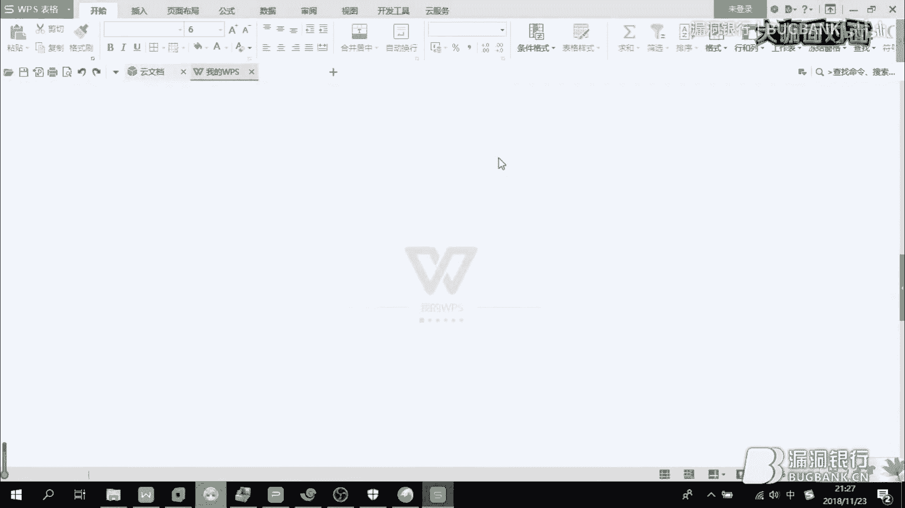

哦。直接在电脑上看吧，不然泄露我个人隐私啦。

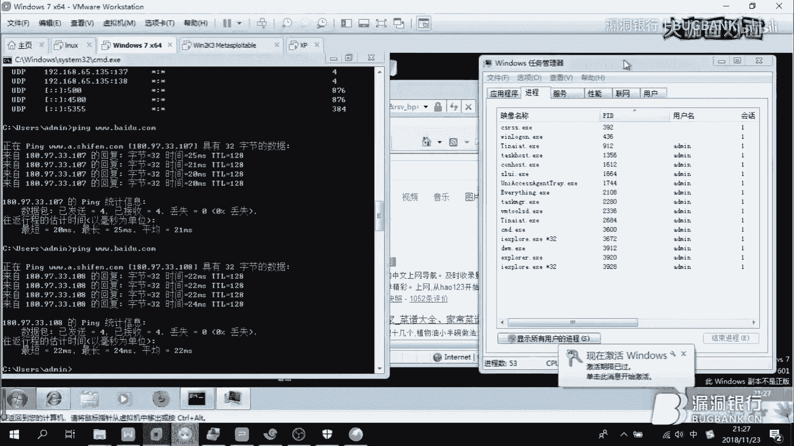

对，然后。捆绑夹壳用到的可能这个这个是做。夹壳的。然后这个加壳的加工具SP的一个port。但这个工具你下下来一定是带一些后门，我可以直白的告诉你是带后门的，千万不要在自己本地上运行，在虚拟上玩就可以了。

所以有很多版本，然后。加的可以不一样，就是它的后面也不同，乱七八糟的。然后我们只用它的工具，随便他加我也无所谓。然后捆绑的话基本上是用那个免费版的捆绑。就是EC免费版的捆绑来做的嗯。

其他的没什么。🎼内网时怎样确定和自己通网段的他的IP地址？内网的时候看自己通网段就用FP这个命令就可以了。有FPFP这个命令。嗯，SP命令的话呃，想学FP命其实很简单的。SP这个命令就完了。

没有写吗？啊，那我可能没写。FP命令其实很简单，就就一段。我记得我在PPT两天有展示过，稍等。内网这里的插通关的IPUSP或者用工具工具的话就特别多了。

m啊等等都可以做m工具扫描也可以用很多特别多的东西都可以用。

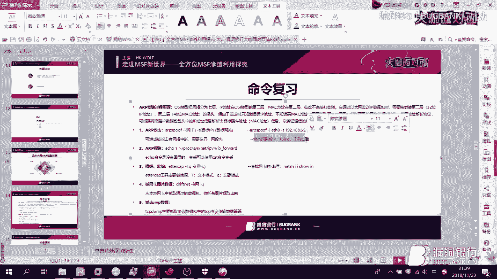

呃。为什么在局域网内无法查出有些存活的IP呢？呃，有些他会最就是你能你能查存活。比如说你对你对那个map的时候，你能查存活都能查，这个都没问题。但是有有些东西什么不是说查存活的端口。

不是查重IP是把端口隐藏掉。就是比如说你IP你对应的都要发1个80的端口，其实你看不到那个80。或者或者说发1个8081其实你看不到。然后你你去用那部去扫，其扫不出来这个东西。

他省不一的地方加密的需扣的思路。不依赖第三方加密包的话会比较麻烦。我一般都是用的依赖的，我一般我一般会比较懒，直接就inport了。对，然后。嗯，这个我可以下来我们可以去讨论，但我一般直接port。

很少去说不依赖。我想的是有有可用的，为什么不用呢？是这意思。ABK的加密和加固。加密和加固的区别什么？加固其实是和混销有异指同工的。什么意思呢？就我打加固包，就比如说我开发的时候做APK是吧。

我要打一个加固包，嗯，加固包是指什么意思呢？就是我原装的APK很容易就被别人反反变译了，嗯，演示一下吧，演示一下。

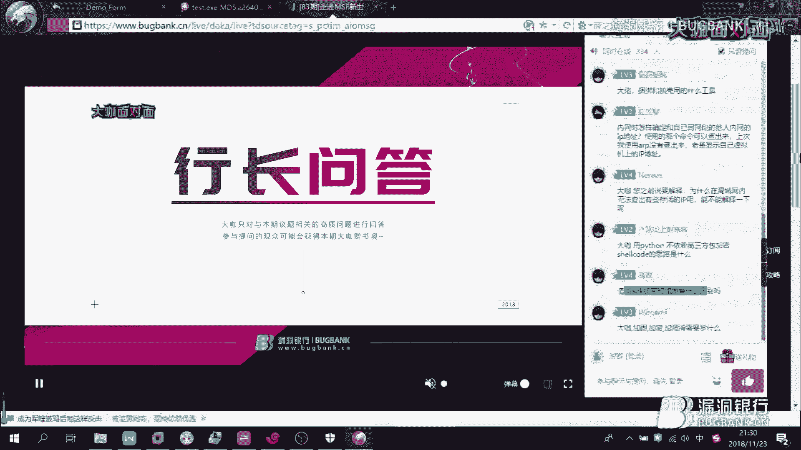

嗯，我之前。做了一个反编译的。叫安卓逆向。安卓逆向方便。我去报。这个针对的是哪个呢？就是我呃。就是用MSF生成的1个GAPK文件，就是那个java的后门。我把它反编译出来，这就是我刚刚说到的那个东西。

就是我没有做任何的。就是嗯加混淆就没有做任何加混淆的方式。在这在这里。在这里。就是我没有做任何的价混销，我没有去杠I这个命令，我没有去杠。然后我就直接做了。做完以后呢，我就想想着说，哎。

它到底里面写的是什么东西，MS里面到底写什么东西，然后你就把你就把它分析出来，然后这里面就有这些东西uncre函数。然后最主要的就是在卖里面。它的最主要的核心就在这个里面。呃。

大家可以就是有兴趣1个MSF大家可能都用过，卡里也很也都用过，然后生成一个，然后自己就反编译出来，看它里面到底是什么东西。为什么会ABCDEF对吧？它这是加固，它原装的加固加固其实它没有加什么东西。

他没有把它加密，也没有加什么东西都在看它的代码都在。🎼所以你就看这个东西的时候，你就知道说哎加固加密和加混淆到底什么意思。

嗯。加密的其实。很多都有都可以有网上的很多，像360啊都都有免费的加固我，给你大打加固包，打加密包都可以。加混校需要学什么？这个主要就是学嗯。java的反编译ABK。主要学这个。

因为你只有知道了前面的怎么做，你才能知道他怎么去怎么去加固，怎么去加密，怎么去加混淆。对，然后然后你再知道反编译是什么意思。然后针对每一个你最反编译词，你就基本上就了解了。呃，再往上翻一下。

再和怎么选再合怎么选，就是根据漏洞来的。目前已知漏洞的再荷再卡里面都有。卡里面可能是比较全一点的，就已子在和已知的已知的配load的基本上都有。扫到CVE度4计3模块。嗯，找到了CV设计它的模块的时候。

嗯，就是你你你想知道就是个对应关系。就比如说。比如说countryC。然后比如说你得到了这样一个呃CVE得到了一个漏洞。你知道模块的话，我想想啊。这个的话理论上是直接通过他的前缀来看，我来试一下。天。

SoMS。不是。嗯。然后。17-017的打机打机会重启。啊击会重启，那也就是针对你的漏洞会让它重启。这个避免的话很简单，比如说你你看你是怎么让它重启的，重启的命令很多。比如说你会发一串命令给他。

向本地重启下档下档杠I杠I后面加一个时间10秒，那么就是这样一个动作。然后你把它命令改掉，命令改掉之后，你可以改成60秒，它就会60秒等待60秒关机这样子。那现存的，如果这己要想。这个就很深了。

export要来写的话，嗯，你要来写，基本上就要把payload学的要写自己的payload。说白了，你只有了自己的payload，你才能去做exloode。对自己Pload的话，你要写就对很多原理。

很多漏洞需要有很深的了解，才能去写这些东西。呃，前端的话其实就就是就是自己去先去用，先用，用了之后用多了，你把这些漏洞全部用会了，然后你再去写，基本上就。也不叫手到擒来吧，至少你有很多思路可以去用。

可以去借鉴。假设我的模拟远程，甲方远程服务器如何MF。我模拟远程登录甲方服务。如何用MSF本地电脑和生服务，不是局域网，不是局域网的过程中，也就是说是公网。公网的话。

你一定要找到它对应的那个公网的IP地址。他公我的IP地址什么意思呢？就是说我比如说你在武汉啊，我在武汉，你在北京，那么我要怼你对吧？我要怼你的时候，我通过我的IP是A啊，怼你的IP是B的时候。

我一定要知道你那个IP真实的B地址才能去怼他。不然的话，你MS其实没用的，你一定要知道他的真实地址，真实地址其实很好获取，有很多方法发QQ。你发QQ，如果你没有做代理，我就能找到你真实地址，对吧？

抓个包，我把包一抓出来分析。哎，我从A传到B的时候，它通过了几层，最后传到你的时候，你的IP地址就出来了。通过发QQ号，不发发个QQ消息，或者发个微信消息。当然微信是用的UDPQQ的话。

有些东西也是用的UDP，但是有些东西是用TCP就看你怎么抓TCP容易一些，UDP难一些。😊，嗯。还没是讲如果变识想管的。有这个教程是有很多的。这个叫什MSF攻击模块怎么写很多的，建议你去谷歌一下。

谷歌很多，百度的话可能比较杂一点。嗯，学习笔记可以啊，OK好像没有了。哦，后面。APK怎么脱V呢？壳AP脱壳的话。VM壳不好磕不好脱，直接告诉你不是很好脱。这个脱壳的话就是你嗯要尝试很多次，不是很。

免杀工具一般用什么？秒杀工具的话，看个人看个人这个东西没有没有常态化的。嗯，想做免纱做的最好的，自己写汇编，然后去跳转，自己学ESP去跳。跳的话跳正常一点，然后就O。会变男学吗？会变难。

一个字告诉你很难。呃，但是学家很有意思。我这里。😊，汇编找一下汇编的话有1个叉86叉87的一个区别。嗯，这一块很容易被忽略掉。叉86X87。啊，这会编就在这里了。当然我这里只是一一小段汇编的东西。

从一寄存器，然后往下走。然后寄存器就是在汇编里面这东西。比如说我们看到E叉A，然后看到了ED叉看到了EC叉，但最用的最长的是什么？EP叉ESPESP在哪里哦，EB在这里。一笔就这样子的。

用到最多的就这个东西。就找到最多的东西，一般就跳，就通过他去跳。然后再什么加几加几加A加B加C加D就往回去跳等等等等的这个东西就。怎么说呢？嗯，就比较多，然后叉86和叉87的汇编指令大全，嗯。

到时候需要我可以发给大家。就这个东西百度上也可以找到，一般就在把这上整理了一下，然后把它复制下来吧。但我我现在你说你说我的绘编学的很好，我我不觉得我学的很好。

我绘编可能在所有的所有的功课里面是学的最烂的一门。会比。嗯，基本上没有了。嗯，好的。好，那因为大咖给大时间比较久了嘛，感觉也差不多了。大家如果后续还有问题的话，可以私下或者到群里面继续交流。

那下面我们进入到今晚的福利环节吧。我们要给大家送书。今晚的这书是wof大咖亲自挑选的渗透测试魔鬼训练营。这本书正好和今晚大咖所讲内容息息相关，参由漏洞银行采购游记。那下面请wof大咖来选出幸运观众吧。

wof，你可以嗯可以。啊，你自己看你想怎么选怎么选。红乘客同学你好，就你了。这么快就决定了吗？就决定选这位红尘客是吗？没事，我来帮你选一下，你看这边好像现在没有登录。好的，嗯，好，你的说要选他的理由吗？

呃，因为他问的就透传这个东西可能呃确实当时我也遇到过，就这一块我遇到过这个问题。然后也纠结了很久，这里面东西纠结了很久。😊，嗯，然后做VIP查的话，包括刚刚说的AIP杠A那个命令，查内网的有很多误差。

就比如说他我连了10个循，我连了两台交换机，两个交换机之间再来做循环的时候，再连上层的三层的时候，你这地方可能连六7个AIP就是一1点都。很正常的一个状态。但你怎么去判断这六七个里面到底有谁是假的。

谁是真的，就很难很难去做到。然后他提到这个问题的时候，我非常有感触，说哎，这个地方上次其实我也我也掉到坑里过这个东西。嗯嗯，好的，那恭喜这位直播间ID为红尘客的小伙伴，你将获得这门大咖证书。

请你根据直播间的提示，留下你的联系方式。我在直播后直接私聊我进行兑奖。好，那今晚直播要来到尾声啊，让我再一次一起感谢沃大咖的用心准备，带来一场精彩的技术直播分享。也为社群小伙伴们树立了一个很棒的榜样。

欢迎小伙伴也可以把大咖们的面当做一次个人学习的沉淀和展示舞台，不是年龄不为自利，欢迎你来主动找我报名，一同分享有价值的技术。然后呢如果大家想回顾本期内容的话，在下周我们会放出今天的录屏。

提前关注官网更新或社群通知。今后给大家多多关注wo大咖的个人动态。那我大咖其也在新手群和技术群里。😊。

那这里最后我们预告一下我们年底漏洞银行的年度直播，今年依然会有很多好看的节目，会有好玩的游戏，很好笑的内容都你来围观。而且我们还邀请到了几位深藏不入的行长来一展才艺。

大家可以在年底关注我们的漏洞银行2018线上庆典晚会，感谢大家今天的参与。那那个老样子。大家如果想继续关注直播呢，可以点页面底部加权链接，本直播间地址固定，大家可以收藏一下。😊，那大咖面对面。

周午8点见，我们下周再约吧。🎼Second can let me catch my breath。🎼Remind me。🎼ItF to hear your。🎼You are lips Sir。

🎼I can hear。🎼I as if we had a joy。一し？Every breath。

