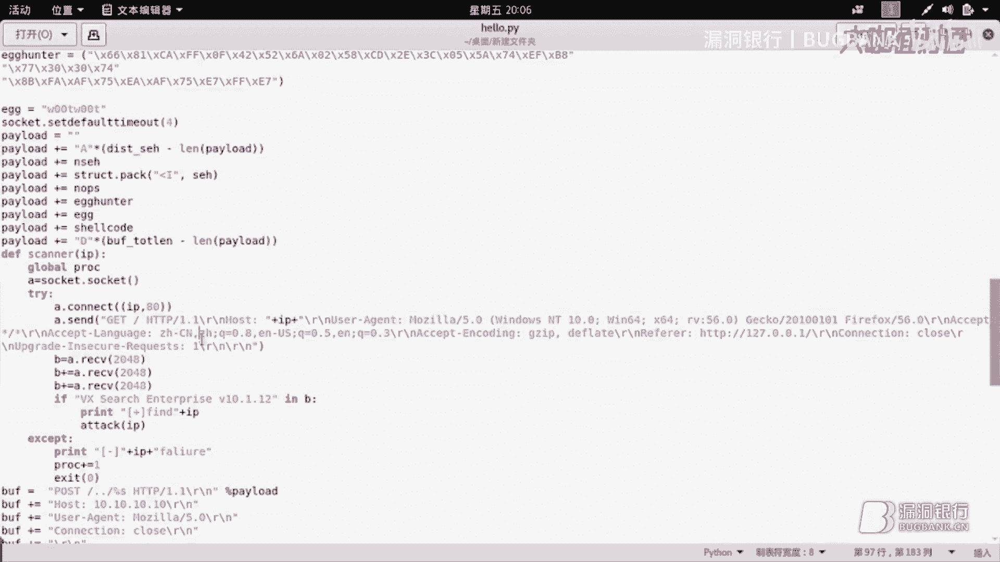
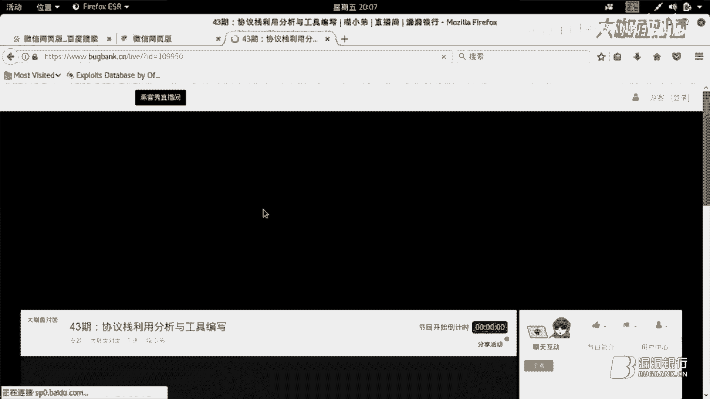
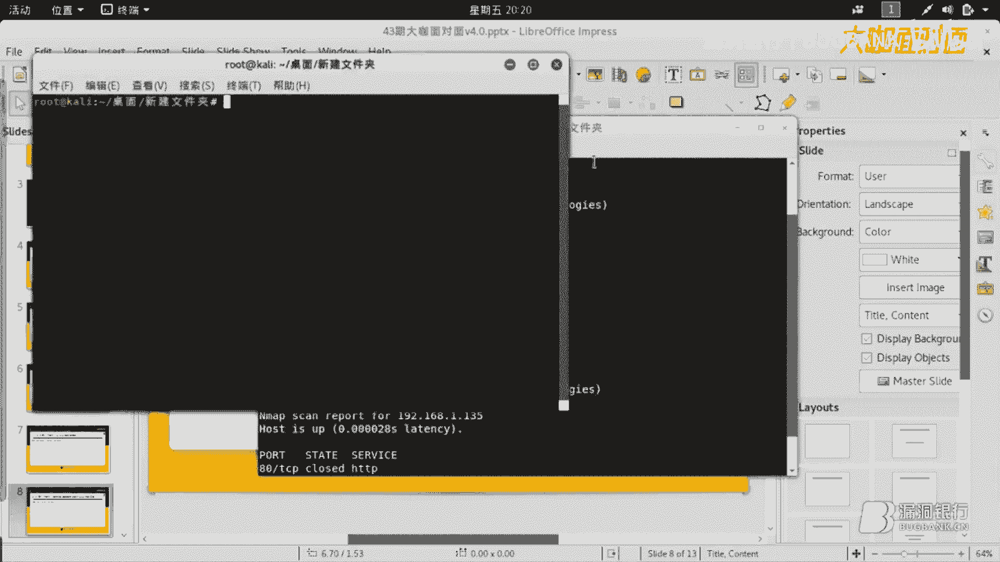
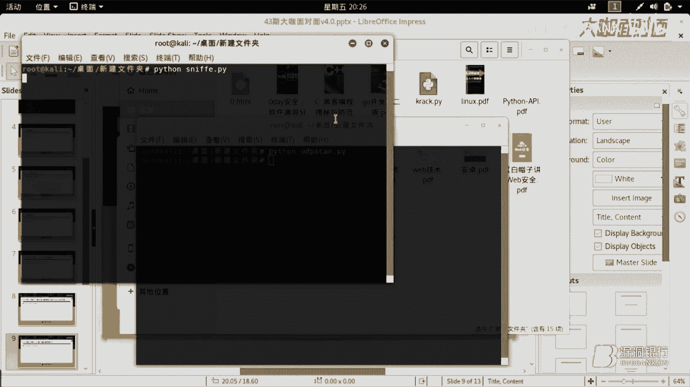
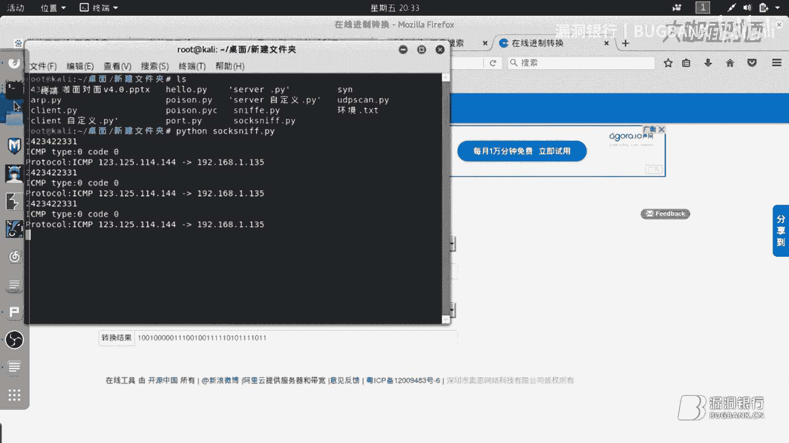
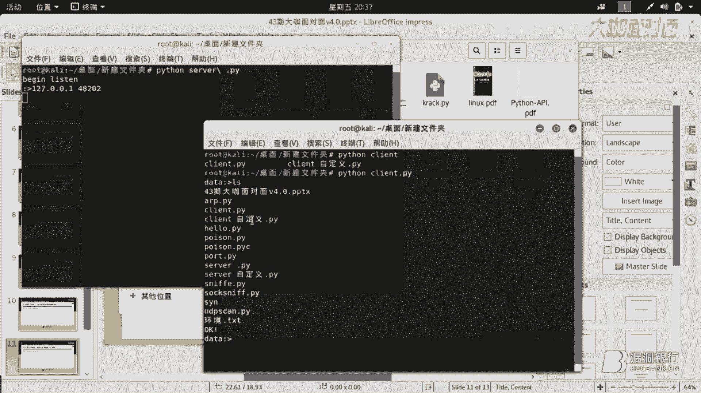

# 漏洞银行丨协议栈利用分析与工具编写—喵小弟丨咖面43期 - P1：【录屏】扒开协议栈的衣服为所欲为-协议栈利用分析与工具编写——大咖喵小弟 - 漏洞银行BUGBANK - BV16A411N756

。这还是。为知识而存，因技术而生。小伙伴们，大家晚上好，欢迎参加漏洞银行信息安全技术讲座。大咖面对面。今晚是咖面的第43期，我是主持人年念。

今晚嘉宾我们请到了大咖喵小弟带来主题为8开协议站的衣服为所欲为。协议站利用分析与工具编写的讲座。今晚大咖会给大家揭开协议站的神秘面纱。分析之后用来编写工具为我们所用。那本期直播分成三个环节。

首先是喵小弟的主题演讲，接着行长问答环节留时间给大家提问。最后是大咖赠书环节，会选出一位最认真听讲的观众送出一本thon绝技，运用thon成为顶级黑客。大家多多交流，多多提问吧。😊。

好，那今天有一点特殊情况，就是我们这边一会儿要换大咖那边来推流，所以需要大家稍后刷新一下页面。

好，那下面就有请大咖开始推流，并且进行今晚的讲。

大家好，我是喵小弟。是一个想要变强的信息安全爱好者，专注于开底下工具的编写、无线攻防、内网攻防和逆向。今天我们给大家一起讨论的是花开协议上的衣服为所欲为。为什么是扒开协议站的衣服为所欲为呢？

对于一个刚入坑的朋友来讲，协议站这个东西是一个比较抽象的概念。比如说什么TCP协议啦IP协议啦，UDP协议啦，还有什么SYN请求包啊，这些。如果不知道他们里面的原理是什么。

那么们就很难写出相应的利用工具来实现，比如端口扫描啦，比如说像word层的。利用工具的编写呀，就是握搏漏洞那一种。比如说像爬虫啦之类的。

所以我们今天要一起来分析一下怎么利用已知的这种协议来写出我们相应的工具，利用它。

首先我们会讲到的是。关于理论铺垫。首先我们就要讲到penson。thon里面的模块非常的多。网络上的模块非常的多，提供的大量的黑客模块，也就是可以方便我们直接利用，而不用去编写它的。

底层车轮这个时候是非常有效的，因为它可以大大的缩短我们编写代码的时间。所以我个人很推荐用潘son作为一门黑客语言，并且学习他。接着是计算机网络，计算机网络是我们今天协议站分不开的一个一门课。

计算机网络里面会讲到大量关于各个协议的一些IP一些。比如说像TCPIP他们之间的构成，还有他们之间相应的收发之间的协议，他们的同步原理。这本书里面包含的就是与法与以和同步，这本是需要看的。

接着第三个就是操作系统组成与原理。这本书在本本个脚本中利用到的是它的多线程与多进程，还有一些关于。内存还有shall这些信息，这一些怎么调用它底层的API什么的，这些全部都是跟操作系统组成原理有关的。

建议大家看一下。接着我们一起来看一下演戏内容。首先第一个演示内容是实战修改exloyDV。首先第一个内容是实战修改exlo DV。里面的一个脚本。这个脚本呢是我之前在那个。呃，稍等一下。

这个脚本呢是我之前在这里面下的嘛，它里面含有大量的渗透脚本。而我今天下的呢是一个专门针对于VX社区企业版的一个。利用工具它是远程缓冲区溢出。我们一起来看一下这个脚本。原脚本是没有扫描模块的。

而我给它添加上了一个扫描模块，让它产生能够批量化的一种功能。至于它是怎么实现的呢？可以看到这是我写的扫描函数。这一个scan名为scanner的函数，它接收一个以IP为参数的一个函。

它是作为接收IP的一个函数，并且。声明了一个A是socer。是一个基于TCP协议的一个ser，然后它会进行一次IP的连接，尝试着连接，并且进行模拟一下浏览器的一个功能，然后进行收发数据。

这里我们可能会好奇的就是。为什么要模拟浏览器？我们一起来看一下实战它的那一个靶机环境。

这边我从漏洞银行建了一台机子，然后实现就是用这台机子搭建了一个脆弱系统，也不是脆弱系统，是脆弱应用。哦，密码错误，不要紧，请稍等一下，我这边再输一次。呃，连接错误。密码应该是对的。啊，那如果说这一个。

环境出问题的话，那今天可能暂时没法和大家一起来实战的使用一下它了。但是我们可以讲一下它的原理，并且实战的来抓取一个网络的应用。首先我们打开浏览器A嗯，大看你这边是什么问题，就是密码输错了吗？

嗯，密码应该是对的，但是。那一台windows的机子是连不上了。我再尝试一下win懂。就是服务器的问题吗？嗯，那台密码是没错的吧，密码如果没有变动的话，难道是我密码记错了？你可以看一下我之前给你发的。

嗯，好的。要不再。再发一点可以先给他。好的，为什么。好的。好，那这一个的话。我们可以看到，因为HTTP的话，在实战中它是基于我们用socer，然后声明1个TCP的一个。实战的一个实例。

并且去连接他那个远程的服务器80端口，这是一个普通的HTTP。并且我们会发送一些包含手部信息的一些信息过去，然后它会返回一些页面上的源码的信息。这就是接收编程主要的原理，我们就不讲了。

主要就是讲一个思维，就是。怎么样进行模拟一个浏览器的收发操作？这边就是给出的概念，就是声明一个T基于TCP的一个实例，并且去连接远程服务器，发送头部信息，然后接收页面的信息。

那么页面信息里面我们就可以找到bener。也就是其标页面信息里面会返回关于这一个应用的。应用的信息的时候，我们就可以用正则或者用其他方式。比如说这边。正则的话就可以得到它里面的信息是否包含这一条。

从里面提取出来就可以。大概的认为他就是这个应用。然后我们就可以确定他就是受漏洞影响的版本。这边的话把基环境稍后我们会给大家实现。嗯，大概大概是这样，就是。服务区的信息我重新发你了一份，就是还是原来的。

然后可能是你那边IP出了问题，你尝试一下，换个IP试试看。哦，等一下哈试一下。

哦，可以了可以了。好，这边我们可以继续来实战演示一下。大家请看这就是那一个受到漏洞影响，漏洞版本影响的这个应用。我们把它给安装上去。可以看到这一边的话，它给出的是一些监听端口的配置信息。

我们直接采用默认就好。然后默认它是没有开启wordbword接口的，我们把这个wordb接口给开启啊。这个我之前配置文件应该在，所以这样子wordb接口就开启了，我们一起来试一下是否能成功的。

成功的访问到。可以看到这边就是一个受漏洞影响的应用，它的那个wordb接口端可以看到这上面就暴露了它这个应用的名称，还有它的版本版本号。我们就可以对他进行一次攻击。现在我们来运行一下这个hello脚本。

并且让它扫描。然后我们可以看到。他这个端口呢是啊他这个IP呢是4710，这个我们直接把一个范围给他。假如是89，然后结束的地方呢，我们就来一个。100也行。就可以看到它就会进行一次扫描。

最终发现所有这个端口没有办法成功连接上的，它都是关闭上的。而可以看到这个4710426。90。就是这一台这台机子他发现是开着的，并且成功的攻击了他。这就可以体现出一种先鉴定对方的服务是否开启。

然后再进行一次攻击，确定他这个服务是唯一的时候，那么我们的攻击就应该是成功的这是一种思想。我们一起来看一下，他这个应该对他这个已经状态已经断开连接了。我们的 coat已经发过去了。

这是成功的一个利用的例子。只不过它的里面这个s code的话，我们可以自己替换这个例子用的是他原来的那个例子。

这就是第一个例子。我们一起来看一下第二个例子。从ARP攻击的原理到脚本。这个实际上ARP的原理实际上就是基于一个数据链路层。在OSI开放互联7层的网络模型中有一个数据链路层。数据链路层和网络层之间。

它有1个ARP协议，它能够把IP跟mike就是能通过查询问1个IP它的make是多少来得到这个make。为什么说是要有这个make呢？这个物理地址。在内网里面真正能够标识出每一个。

每一个主机的唯一标识不应该是IP，而应该是make。也就是说，倘通一台机子，它的这一个make是确定的。那么它一个make可以占用多个IP比如说像虚拟机什么的。

它可以占用多个IP因为我们只需要对基于它make基于数据链路层以上的协议进行一次进行一下监听，并且筛选，让它能够实现分用跟复用就行了。这边我们来看一下ARP的这个脚本。我们可以看到这个ARP脚本。

首先这个是关于交互式的，就是写出来，就是为了能够从客户端得到一些从用户得到一些信息。然后它的真正的工作原理在另外一个脚本里，我们专注于另外一个工作原理，并且尝试着运行它。首先定义了一个函数。

而这个函数呢它会要求输入IP1m一这些这些是细节。但是实际上就是我们会发送一个响应包，就是ARP它是有询问跟回应的。这个时候我们只要模拟出一个回应包。

并且不停大量的以路由器的这个IP作为原IP也就是仿造路由器的IP这一个造一个虚假的这个包，然后不停的把我们的make发给受害者。那么受害者如果他在询问或者查询它的那个缓缓存过期了。

谁要重新重新获取新的的时候，那么就有可能被我们ARP缓存读化，或者说它有的有的机子，他接收到了以后，他就会直接把它加到。直接把它用来更新自己的ARP缓存表，这个时候我们就会以成功进行ARP攻击。

也就是ARP缓存图化。这边我们来开始演示一下。现在是已经打开了这个脚本。然后我们要尝试着要攻击内网中的一台机子，我们来找一下受害者啊。对于我这个内网的拓扑是我内网的路由器是192168。1。1。

而其他的机子就要通过扫描。好，我们这边找到一台苹果的设备，然后有了它的m跟IP。这个时候我们就可以试着把它给。说进来。而这一个思想就是我们接着会构造一个包，这个包会以这个路由器，也就是192168。1。

1作为原IP。然后把这一个受害者的这1个IP作为目标IP。然后make填写的是原来原make填写的是我们的make。把这个给，把这个给换掉。变成我们的make，然后发给目标。

这样子就可以成功造成一次ARP缓存毒化。这样看起来是没有问题，得到实战中去实现。只不过我们实现的这一个只是一个单向的欺骗。这个的话，如果通过ARP的协议，我们可以看一下他的协议站里都是些什么东西。

像这一个。

ARP这个。好。可以看到。这1个OP实际上是它的类型，它的类型如果唯一的时候是ARP请求，也就是询问ARP的询问一种询问。那么如果是二的时候呢，它就是一种应答，我们要把这1个ARP这个协议类。

我们要把它设为这个2，它的类型设为2。按照他这个走。然后就可以进行一次成功的欺骗。这个就是目标的IP地址。这一个是目标的make地址。这一个是make，是原原m地址，这个时候填我们的。

然后IP我们确是确是把它构造成路由器的。而这个时候目标主机如果收到了这样一个包以后，它会发现网络配置里面路由器的IP跟这个发送方原原IP是一致的。那么它就可以更新这1个ARP缓存。

把这一个加到ARP缓存表里。那我们就进行了一次成功的一个单向的欺骗。同理可得。如果我们用来欺骗路由器的话，我们给路由器发一个受害者的IP为原IP，然后发送目标IP是路由器的IP。

然后make地址换成我们的make地址。原mac地址是我们的，这样我们发过去以后，路由器就有可能会把我们当成受害者的IP。就会把我们当成受害者。这样子的话，在内网里面通信的时候。

我们就进行了一次双向的欺骗。我们来看一下第三个例子。第三个例子是关于。基本的扫描器的原理以及其中UDP扫描的实现。关于扫描器，后面我们还会有讲另外一个这边讲的扫描器的原理呢。

我们主讲的是TCP跟UDP它这个协议的实现的不同。像TCP，它是一个可靠连接的一个协议。也就是比如说常见的我们像比如说像浏览网页啊，比如说像玩游戏一些正常的一些游戏。

它都有可能用到TCP用到TCP的时候，它有一个三次握手。才能建立一个正常的连接。而这三次握手就说明了，如果对方的服务器是开着的，监听着这个端口的。那么当我们发送一个请求连接的这个SYN的包的时候。

他就应该回应1个SYNACK。

如果我们能够。

得到这个SYACK这个回应，那么我们就要返回1个SO就要返回1个ACK。至此三三步握手成功，我们就可以建立连接。而其中UDP恰好跟TCP相反。

对于UDP来讲。他如果成功的返回了一个包，那么很有可能目标端口就是没有开着的。因为对于UDP来讲，他不需要进行三次握手，他是有数据直接就发。那么如果他成功的发过去了，那么很有可能就不会有任何的回应。

假如说他没有发过去，那么就会回应一个目标端口不可达。我们来试一下。看能否抓到SYM包。这边能抓到ACK这个包43。这个是加密的。还有DNS请求。对于这一些。对于这些包的话，它都是基于这个原理。

我们一起来看一下这个脚本。这个脚本我们先跑一下，再看它里面的原理。没有报错，我们一起来看一下它里面的东西是什么。对于这一个来讲。上面的我们就不细不细究。我们这一个作为负债，也就是说。

从UDP协议的角度来讲，它会带着一个负债，并且向目标的IP跟目标的端口发送这一个负债的信息。直接发送，而这一个发送函数也就更是说明了它是每一个它声明了一个send作为1个UDP的一个对象实现。实力。

然后我们迭代生成一些IP。以这些为信息生成的IP，并且不停的尝试给他发送包含着这一个负载负载信息的一个UDP的数据包。每一个数据包里面都是都是负载里，都是IMthon。我们可以试着抓一下这个包。

看看能否抓到。刚刚我们是发送的对吧。我们已经成功的发送了。那么我们一起来抓一下这个UDP的包。这边包也是很多。TCP。UDP。这个电脑有点。有点卡哈，请请稍等一下。有点卡。😔，好，上面有UDP的包。

看到了。像UDP的包的话，它里面是不用建立连接的，所以它是直接发送出去。那么我们就可以尝试着，我们不用本地有任何的负载，我们只要声明出这样一个对象，并且不停的往目标的IP和端口便利发送。

关于UDP的数据包。那么如果成功的返回了数据。那么就说明它这个端口很有可能就是关着的。那么如果他没有成功的返回数据，那么他这个端口很有可能就是关闭的。不好意思，这边。这包有点问题哎。一闪而过，我看到了。

这个我们等一下再来抓包。原理我们是讲了的，等一下我们来实战一定的。看一下这个。UDP数据的抓取。除了用willsh的话，我们应该怎么样抓取这个UDP的数据呢？呃，今天这个例子的话，假设本机就是受害者。

那么我们要抓取的UDP的数据，在linux下面，它是只能抓ICNP的回应包，这个是它的限制。就是系统默认的时候是这么限制的。那么如果是windows的话，那么它默认是允许用户抓任何数据包的。

所以对于linux来讲特殊一点。演示脚本是。这个。这个是IP的这个嗯是这个。你们看一下。我们用scappy来尝试着分析它的。UDP层如果UDP层有的话，那我们就可以得到它里面的负载信息。

它会把里面的负载信息给输出。然后这个是监听来跑跑起来。我们就不用willsh抓了，我们用这个抓。那sh没有针对性的抓，刚刚的确也是显示出很麻烦。它会循环的抓包。然后我们让他来发送。

看一下哈，这边的网络环境没什么异常吧，你把vish。

这边就有抓到UDP的包，我们就来看一下。里面有IP层，有UDP层。这边是关于牛的。你再抓一次。网络开始变得很哦，这边总算出来了，可以看到用willsh的时候是挺繁琐的。

但是如果写出一个专门针对的一个应用，比如说我在里面再加一层，就是说一定要筛选出里面包含有这一句话的时候，那么我们就可以比willsh更快的从数据包里面找到这个数据包。当然。

如果如果willsh里的过滤器用的好的话，也是可以的。它就是刚刚我们实现的那1个UDP对于多个端对于单个端口，然后发送1个UDP的数据包，然后这边抓取。这就是UDP扫描的一个演示。

我们只需要对它返回的那个数据包。然后比如说端口不可达呀，这种包进行筛选，选到这种包的时候，提取出里面的目标端口不可达，是哪个端口不可达，并且把端口放入一个关闭者的端口这样一个列表里面。

那么其他的很有可能就是UDP是开着的端口开着UDP的端口。我们来看一下第五个例子。第五个例子讲的是ser实现流量的抓取分析。这个例子呢讲的是这个。我们先看一下它的大致结构，就是定义了一个结构体。

这个结构体呢它实现了IP爆头，也就是前20个字节，它的这个爆头的一个结构体的定义。它的好处就是这样在得到一些IP数据包的时候，可以把它的手部给把它的报头给IP爆头给提取出来。

并且按照它的每一个位有多少个字，多少个字节，把它按位，把它放到这里面来。那么我们就可以针对每一个成员变量，把它进行翻译成。比如说IPIPV4的话，我们就要把它IP给变成。int32位这种类型的数据。

然后我们就可以无符号int32位型类型的数据。这样我们就可以看到里面的数据是什么了。这边我们来演示一下。关于原理就不多说，因为这些原理的话都是那些书本可以看到，并且拿这些脚本回去可以是可以进行分析的。

这个表哥有建议，就只要我们。呃，演示给大家看就行。好，我们这边已经开始了监听。前面讲到对于ICNP的话，我们抓取用socer抓取数据包的时候，linux下是只能抓到返回的包的。所以我们只能尝试着。用聘。

聘一些机制。可以看到。这边呢我们聘的是百度，并且百度这个IP呢，这个服务器的一个其中一个服务器的IP呢成功给我们返回了一个应答。然后我们可以看到这边也有了应答。

应答的云IP呢就是百度这个IP它它这个服务器的IP而目标的这个IP呢就是我们这个IP实际上中间是做过一次转换的。就是我们用路由器上网的时候，原IP会换成路由器的外网IP跟百度啊。

当然这是路由器拥有外网IP的时候。它会跟百度进行交涉，然后互相收发数据。然后收发到了以后，收到了数据以后，他会把那个IP换掉，换成我们原一开始发送的时候，那个IP。这样子就可以进行把里面的数据。

然后原封不动的发给我们。可以可以看到这边是有一串字符字符的字符串的，里面是一些数据。当然这些数据单纯这样看是看不出什么东西的。那么它里面代表包含了什么呢？我们再来看一下刚刚的那个脚本。

可以看到哈这个脚本呢，我们是。把它前20个字节。把收到的那个前20个字节再计算出它的IP首部偏移以后。然后把它给提取出来，再放到我们上面这一个数据结构里。

然后解析出它里面的每一个单元里面存放的是什么数据。然后我尝试着把它进行了一次输出，这边是。可以看到这边是他会尝试着把原IP跟目标IP。通过这个方法，打包方法，实际上就是按照小端，然后int32呃。

按照log类型，也就是针对于这台应该是int32才无符号int32才对。然后他会把它用这一个方法把它转成这种类型的数据。无符号int32应该是这种类型的数据。因为在原原来的一篇文章里面。

他也曾经有过这样子一一个例子，只不过它的这个地方是错的，所以导致了抓取包的时候分析会出错。这里是要用无符号in32的。然后这一个函数可以把里面的数字啊转成IPV4的样子啊，就是点点点隔开的。

我们来尝试着看一下哈，上面那一个字符串，也就是这个。这个字符串它的来源就是这一句话，我们把原IP地址给输出出来了。我们可以通过这个例子来试一下，为什么它是小端弄类型，用它这个类型来转换成这个数据。

把这个转换成这个数据来看呢。静止转换。我们尝试着把这一个数据给转成二进制。可以看到哈，这边是二进制，其实实际上数一数的话应该是32位。因为是代表IP的话，就应该是4个字节，每个字节是8位。

所以就应该是483十2。我们提取出高位8高8位最高的8位。1234123。我们尝试口算一下。按照按照位权的话，这就是12。四八十六3十二6128。差不多好。这样子的话我们来猜一下，最终这一个原IP。

它的十进制表示代表的是原IP的123呢，还是代表144呢？这个就是证明了为什么要用小端的小端的方法。可以看到是144哈是这样子的。因为小端的小端的话，它就是。占数据高位的。

那么在内存中它就应该放的比较低。那么它这个输出的时候，它这个结构。是按照什么样的形式呢？就是它这个有点像反着来，一一开始的前8位代表了144，再往后的8位就是代表了114，再往后的8位是125。

最后8位，也就是最低的那8位代表就是123，它是这么解包的。所以我们在编写相应的网络应用的时候，要注意一下它是以什么字节序进行。传输的。传输的是什么字节序的数据？接着呢我们来看看下一个。

第六个例子讲的就是自定义应用层的CS模型。这个就是比较重要了。通常的CS模型是什么样的？我们已经写出了一个例子，大家看一下。通常的CS是一个客户端C跟1个S服务端server。C跟S。编程细节不讨论。

这边就是可以看到客户端连接到了服务端，并且发送数据，然后打输出了所有的返回。而服务端的实现就是监听80端口，然后。对接收到的请求进行一个。处理，然后传递给这个函数来处理。

这个函数呢就会把得到的这个命令给放到一个fk处一个子子禁程。而，这个子禁程会用shall执行那个我们发过来的这个数据，也就是说相当于一个远程可以得到shall的一个脚本。我们来尝试着跑一下它。

这是最常用的CS模型的一个应用。等一下我们才会看到怎么用自定义的CS。我们先开启的是服务端。已经看到服务端已经开始了监听。这个时候呢我们开的是客户端。看到这个客户端，我们。成功的连接上了。

这边是我特意让他输出的，就是连接方的IP跟连接方的IP地址。这边也有一个小小的隐含隐含的一个知识。实际上C跟S进行通信的时候，双方都有端口。只不过对于服务端来讲，它的端口是固定的。而对于客户端来讲。

它的端口有的是系统临时生成的。有的是要看，比如说像系统预留，系统预留的话就是0到123。这一个端口的话都是系统已经预留好的。比如80监听的一般都是HTTP的wordb服务。

比如说23SSH21FTP还有什么tenet这些还有FTP什么呃FTPnet这些端口，他们这些监听的都是什么样的服务？这些都是。系统已经预留好的。我们来试着输入一下数据，然后并且让服务端执行。

然后返回相应数据。可以看到我们这边发送的是LS，就是linux下，就是可以查看当前目录。成功的执行了。实际上也可以看到。

这个客户端里面本身没有任何一个关于调用sstem或者调用只进程执行shall的功能。它只是单纯的收发数据而已。那么也就是说，真正完成LS执行命义的是客户端。

这个脚本我们等一下啊这些脚本我们等一下都会发给大家，让大家一起一起思考一下。关于这个的话，就是CS模型的基础应用。有点类似于木马。好，我们把这个关掉了。

接着我们来看一下自定义应用层的CS模型会产生什么样的插出什么样的火花。首先我们打开的是一个。嗯，自定义的一个服务端，我们先运行吧。啊，地址已经在占用，这个我们刚刚关的时候没有没有给他关好。

那么过一会的时候。系统就会把它给回收。我们可以试一下哈这个。端口还在占用，我们先来看一下它里面的例子吧。好，看一下自定义服务端。前面我们讲到了客户端跟服务端之间是数据通信。我们用收er的话。

就可以省过三次握手，并且直接让他们两个成功通信。然后他会收发数据。那么这个时候我们就会想到，如何保证收发数据是确定是它有稳件性的。比如说我们可以给他进行加密啊什么的，但是怎么区分它的每一个数据。

数据位上应该是什么数据呢？就比如说像IP的协议，比如说前四位应该是偏移呢，还是说是IP协议IPV4的那决定是IP什么协议呢？比如说是V4还是V6呢，这些都是很重要的。所以说如果要免去自己打包。

我们可以提供使用它strict提供的方法，它有一个打包跟一个解包。打包呢就是按照它这个格式，可以把后面的数据，按照这个格式转化为一个字符串，也可以认为是字节流这种东西。

把它转换为类似字符串或者字节流的东西呢，我们把它付给B，然后我们把它发出去，然后接收数据。然后对于服务端来讲呢，他就会接收到这个数据，可以看到。下面是建立连接。然后这边呢是当连接来了以后。

我们就会尝试对它进行一个解包。也就是说可以看到这边的打包方式跟解包方式实际上是一样的。然后解包出来以后呢，把这一个字节流拿来解包出来呢，就是一个定值表。定值列表里包含的什么数据呢？

那就是我们当时发送的时候，里面的这个B存储的内容和200这个内容，他会把这个包他会把这个定值表给解出来。然后我们就可以判断他这一个定值表里面是不是200啊什么的。为什么要这样子操作呢？

是因为我们可以加上一些验证。比如说加密加密验证一下，加一个多的字段来验证一下是否这个包是没有经过修改的。或者说我们整个包就用加密的办法来传输，并且能够保证他这个包没有丢失。然后经过这样的处理。

不但有了文文。稳健性，而且还可以保证你的数据通信是比较隐蔽的。是如果你会一门比较好的加密算法的话，那么别人就比较难分析出你传输的通信的内容都是些什么。像一些游戏，还有一些自定义的协议的话。

他都是有由这些来构成的。就是他知道每一个位，比如说前八位放的是什么数据，后面多少位放的是什么数据？然后还有多少是加密的，或者说整个就是加密的。如果得到了这一些信息的话。

我们就可以写出一个专门的专门针对他这个协议站的一个分析工具。这里我们来试着跑起来。好，我们成功的让他给开始监听了。接着我们是客户端。这里的话就是。对于他这个空格的时候，他都是会是会给给自带的。

就是要加个杠了。这个命令是啥？好，我们来跑。这个单纯的连接是没有应用到我们自定义的协议站的，就是刚刚那一个。会添加状态字，也就是那个200。跟那个前面的那个命令的内容，我们现在试着发一个数据。可以看到。

LS命令发出去，但是还是成功的被执行了。他之所以能够成功的执行，那就说明他是成功的得到了里面的数据。然后这里有一点要注意的就是。我们定义的这一个结构是以低端的形式。我们客户端发送的是低端的形式打包的。

前面10个是字符串类型的，也就是应该说是串类型的。然后后面一个是int类型的，我们可以这样子看，那么解包就应该这么解。那么我们判断的一的时候，实际上它返回的定值表里面存放的一，刚好就是我们那个200。

而这个零存放的实际上是什么呢？是LS呢，还是LS，然后后面是8个杠0-0杠0呢。如果说要说杠X00也行。实际上里面存放的就是LS杠X00杠X00，也就是。字符串的结尾。这一个呢就是。

C语言C语言里面恰出一个字符串数组的时候，就有用到最后一个应该是放杠铃的。作为一个字符串的结束。汇编里也是可以用到的。这样就不用计算它的偏移地址，就不用计算它的偏移一个每一个字符串的大小。

然后我们可以看到。我尝试着把它进行了一次正则。这个的原因就是在于它里面这个杠叉00的话，penson这一个程序，它这一个函数。没办法说识别它这个杠叉00，所以我只好把它这个命令本体给提取出来。

也可以尝试着直接把它杠叉00给去掉，再放进来。这个是针对于函数的实现编程的实现，这个就不讲，不是重点。主要讲的就是关于协议怎么应用上的。刚刚这些都是。这是第六个例子。我们一起来看一下第七个例子。

最最最后一张也是比较重点的。实现简单的全连接端口扫描和SYN扫描验证。全连接端口实际上全连接端口扫描的话是比较容易懂的。全连接也就是真正的连接上。对于TCP协议来讲。

你要确定一个端口CS是成功的建立连接。那么应该是有什么样一个情况呢？对于我们调用ser来讲，如果你成功的进行了一次连上了，并且没有报错的话，那么我们就可以认为它是已经连接上了。这个是从编程的角度上来讲。

那么它如果成功连接上，实际上是进行了三次握手，也就是其中包含有。客户端向服务端。发一个请求。这边我们来看一下哈。sky，然后我们呢。输出一下TCP的协议站。好，可以看到。刚刚说的SYNACK什么的。

实际上在flag里面。这个flag里存储的信息就是包含了。比如说这是SOM标志位吗？这个是呃TCP的呃，是那个ACK的标志位吗什么的。我再试一下Vsh还能不能抓到抓到关于TCP的包。

能抓到一次完整完整的三次握手是几号的。我们来尝试着连接。公务员网。连接公务网原网以后，我们来看一下。好，上面我看到了。好。这个HTTP就弄到了。这是个ACK说明上面还有ACKSYN。还有ASYN。

这些是请求。像这一种颜色的数据，就是校验盒有问题的时候，它也是会提示的。好，像这个，比如说我们要看一下ACK它的这一个协议站。他这个分析的时候，我们就点开看一下它这一个最高的这一个TCP协议这一层。

这里面剩下基础可以看到的数据。刚刚讲的flag就在这里面。从这个标志位，我们可以看到，当你为SYN请求链接包的时候，这一个位应该是一。当你要reset的时候，这一位应该是一。而它ACK是之一的。

说明它这这就是一个应答包。一个单纯的ACK硬拿包。如果是SYNACK的话，那么就应该是这个之1，这个也是1。这样子既有SYN这一位是之1，又有ACK这一位也是之1。那么它这个数据就可以按未来算出来。

这里我们看到的是ACK的这一个位，应该是表示十6进制的10，也就是十进制的16。12。486嗯，这是16。也就是说，如果是SYACK的时候，12也就是16加2，那也应该是从16进制来讲，就是12。

对于十进制来讲，就应该是18。这个就是这样子。找不到一个完整的SYN的话。那我们可以自己用刚刚的那个道理来推算SY应该是多少呢？啊，这个是一个A啊，这是1个SKSY的SK。应该是多少呢？

也就是说这边全部是0。那么SYN按照道理来讲，这边是一，这边是2，未全展开，这边就应该是。2、也就是说flag应该是0叉002。这个就是代表一个SYN包。对于SYN在端口上的应用。

它是三车握手中的第一个数据请求同步的一个包。那么请求在请求链接，也是请求同步的时候哦，抓到了在这在请求可以看到这个就是二维码。那么在请求同步的时候呢，服务端要对它做出响应。而这个时候做出响应。

如果我们收到了响应，是不是就可以认为说它这个端口是开着的呢？这个就是每个平台，他们参照着协议文件。对协议站进行对网络的协议站进行了支持，只是支持的程度不一样。但是对于这种支持的话。

三次握手支持都是得按照协议书协议的书书明上来讲的。那么就应该是。都会回应。那么如果没有防火墙啊，包绿就是包绿防火墙啊或者什么其他手段的话，那么它都是会回应的。回应的话，我们就可以得到它这个端口是开着的。

也就是说给我们SYN造成了SYN扫描有有趁那个造成了可趁之机嘛。S one。那么SY扫描跟全链接的扫描的好处跟他们的劣势在哪里呢？我们先来试着跑起来，看看是否能够运行。我们再来一一说明。

关于端口扫描是port。是pos脚本。然后我们尝试着扫描什么呢？我们来扫描一个。比如说我要sh里面抓到的。我们这个弄的是80端口默认的时候，我看一下。我们打开看一下po里面。

因为默认我没有让它迭代生成生成多个端口，这个是迭代生成IP哦，端口都是80。那我们找1个HTTP的好，找到一个目标，我们让它大范围的扫描的时候也不要紧。就是全连接的。这个。

按照原样输入给他一个大的一个范围。看他是否能够成功的扫描出来。可以看到这个是什荡的出来了。假如说是把它夹在夹在普通的。机子里面。就是一整个范围里面，它可以继续扫出来吗？我来试一下。嗯。

看一下出了一个问题哈，我们来怎么样来手动把它给改啊。前面我们说到的。这边既然全部都报的时候，我们就可以看一下他报的这一行。banner抓取发送。这边是尝试的进行连接，假如没有连接上，就说明有问题。

然后把这一个调给他，然后他尝试的就是说会输出。也就是说如果他连接出现问题的时候，那么就会。报错就是直接这边就是直接让他退出。如果没有问题，他就是直接连接，并且发送一个。表示找到一个目标。

然后我们尝试着发送数据进行接收，看看是否能够获取到bener。这边是没有那个的哈，没问题。这边需要排查一下，我们使用SYN来排查一下是否真的按照他这个所说。我们找1个SYN的包作为一个样例。

刚刚我们看到SYN的包，它是一个标志位是为2。也就是说标志位是为2。那么我们用scappy来构造它。这个sk已经进来了，这是它的交互是吗。进来以后呢，我们定义一个变量，它的IP层呢是。

因为TCP它也是要有IP的包装的嘛。关于IP成立的数据呢，它的原IP是1921681。135。因为这个是字符串类型的。好，我们把这个按照他的关键字传舱给他。然后他的这个目标是什么呢？哦，对。

这个有个问题，就是我们应该是把那个对应的它的那个结构给打出来，然后我们再对着它写，这样子会比较方便。好，可以看到这是它的结构。然后我们按照它这个结构来写。好，然后这边是它的源端口啊。

是它的原IP原IP的话是这个HRC。然后这个是他的目标IP。我们把目标IP也给填上。这边采用的是123。点183。164。137。好。这里的话我们就构造了1个IP的包。但是。他这边有个flag哈。

flag的话我们看一下。这个是要注意的。IPV4协议。我们看一下是否默认是APV4协议呢。对，是四协议嘛哈。然后我们来看一下IP上的flag。他这边flag是02，对吧？我们把这个也设为02。

像他这一种里面的东西，实际上应该是表示说是关于TCP还是UDT。这边的话呢我是已经准备好了一个相应的胚漏，我们等一下可以拿出来看。这边我们是设为一。它设为02。然后我们把IP层给构造好了以后。

我们来看TCP层。TCP层的话就是。源端口我们就可以不用选，因为S给笔它默认就是可以把源端口啊目标端口这一个它会目标端口我们自己选源端口。如果我们不写的话，那么它就会自动跟系统申请。

尽量的把每一个数据合理化。我们来看一下。原端口是SRRC。我这边把它给打印出来会好一点。大家这样看的比较清楚。可看到。这里的话呢，它这个TCP它是有源端口跟目标端口。那我们把它源端口源端口不行。

我们直接目标端口。给他这个目标端口呢是80端口，就是一个尝试对它进行HTTP的1个SYM码。这个是它的序号，序号的话也可以不写，是让系统自动生成。好，flags这个就很重要。

这个校验盒的话也可以自动自动填补，我们不管。flakes的话，我们看一下。flex对于SY来讲，我们刚刚计算出来了是0叉002。好，我们进行了一个构造一个包，并且我们尝试着进行一次收发行为。等一下哈。

我这边一个东西。看下我给他一个六侧度。对对对，协议。刚忘忘了把这个给写上了。可以看到哈，这边是有一个协议，IP层的话，它有一个协议也是要填的，这个协议是0。我刚刚刚刚突然想到这边的协议呢要给它写成6。

写成6，也就是代表是TCP协议。他没有进行回应。没事，我们这边还找了一个其他的一个样机。这个是我之前抓到的一个。在TC在那个HTTP我在浏览的时候抓到的一个机子。这个是当时我把它给构造好的。

快记嘴那什么用。他没有回应，不要紧，我们找新的机子。好，我们找的是这台机子。我们尝试着向这1个IP发送一个数据，看看他会不会进行回应。啊，云端口是对的，有表IP。原IP是对的。

这个原IP要写的是自己在内网做的IP嘛？然后我们试着把它收发出去。然后对于今天有点卡哈，还等等着这一条。所以说这个就是代表回应，收到了回应。我们可以看一下，这个回应是一个也是基于TCP的一个回应。

它里面有IP层，有TCP层，并且它里面的pay漏，也就是它的负债，是杠X00，也是代表什么都没有嘛，就是那个这幅串的结尾那一种。它的flag是代表SASA实际上是SYN跟ACK这两个如果都是的话。

那么就是代表对我们SYN的一个肯定。Yeah。然后他这样子的话，回应了以后呢，我们就可以确定它这个端口是开着的。我们构造的这个包呢，它的这个目标端口是80。假如说我们是往它的81端口进行。

发1个SYN请求，这个时候会发生什么情况呢？或者其他的端口，比如说90啊什么的。我们构造好了以后去发送。就可以看到他这样子是抓不到警求的包。如果不是产生的包有畸形，那么就是对面有什么措施不回这个包。

这都是有可能的。但是对于通常的来讲，如果没有把SYN进行过滤的那一种端口的话，那么它就应该回应1个SYNACK也就是这样一个类型的一个包。只不过他回应了刚好这个他的原端口80等一下这。它这个原端口的话。

它这个HHTTP实际上是80了。所以说发送方它是80传过来的。我们这样子就可以证明说对于它开着的80，我们确定它是存在的。如果没有回应，那么要么就是他被防火墙被什么呃其他的策略给过滤了，要么。

就是其他的情况。但是如果或者是端口没有开，那如果他是回应了呢，那很有可能他就是成功的说明对方的这个端口是开着的。你们就可以扫出来。对于过过防火墙，还有1个DF标志位。这一个早期的话。

对一些防火墙是有用的。有些防火墙的话。他看到DF就是那个拆包的那个分片的时候，他就会把这个包给放行，我们就可以绕过它去扫描那个端口里面是什么东西，呃，是什么样的一个服务。这个服务跟前文呼应。

就是那个抓取banner，就是我们可以通过发数据跟收数据，然后通过它回应的这个数据得到它应用层里面包含着的。比如说版本啦，什么服务这些信息。而这些信息呢对于这个服务来讲，我们可以叫它服务指纹。

也就是banner。抓到这个指纹呢，我们在通过不同平台对这个网络协议站的不同支持。比如说像TOS。像这个。实际上应该用pin的，用P。如果他回复的话，那么它里面的这个信息是往往是包含了一些。

客户端的信息的。应该是包含一些服务服务器的信息的。我们来拼一下百度。然后我们再来拼一下。之前那一个漏洞银行的那一台打机。是这个ID。应该是开机的。有个印。对于这个来讲，它默认的这个title呢。

是不一样的。还有就是它这一个一开始的时候，初始化不同的操作系统，虽然说这些也能改，但是不同的操作系统有的会设64TOS那些有的会设64，有的会设128，有的会设255。比如像windows这一种。

设的一般都会比较大。像lininux一般就是64之类的。这边的话。他设的这一些呢，再加上包包含一些他对不同协议的支持程度，包含他的服务。我们就可以通过他跟一些已有的一些。数据库进行比对。

找出猜测出对方的操作系统的版本，以及它可能是什么样的一个内核。这个都是他那个协议不同，它的那个协议站不同的分析出来的。像N map里面就有一个很强大的数数据库。用金麦也可以。

Gm是Map的一个图形的一个外壳。它里面是有一个数据库的，它这个数据库就可以猜测出一台机子的一个操作系统是什么样的操作系统。我们来试着把这个服务器的这个把机。拿来猜测一下。对于我们刚刚已经连上了。

所以我们可以猜测出它是windows。那么对于他来讲，他就会收集它的服务指纹。首先他就是扫描它的端口，用全连接来扫描来实现它的端口。全连接前面也讲到了，假如成功的建立了连接。

那么全连接就代表了说对面的端口是开着的。如果没有连接上，要么就是被过滤了，要么就是对面的端口是关着的。那么不管是关着的还是过滤的，那我们就就可以暂时不用考虑它是开着的那一种常规的那种打开的那个端口。

比如说它的端口运行的什么服务呀，我们就可以通过它这个可能服务的版本呀，然后使用利用工具发送pay漏，发送需要 code去进行执行。好，这边进行了一个尝试。它会进行一次操作系统的鉴定。

猜测它是什么样的操作系统。好，我也看到。这是一台什么样的操作系统呢？它被认定被操被，你看这边有个准确性，这就是因为它是用数据库匹配的。

只能说很有可能是什么操作系统是windowswin server2008这个操作系统，然后是它的全部的端口。关闭的关闭的这个是开启的。然后现在我们再来看一下刚才的那个。全连接的脚本。通过这些知识。

我们试着一起来改动它。在知道了IP跟端口以后，声明1个IP跟端口，然后进行尝试连接。差一个。如果出现问题，直接就退出。没出现问题呢，我们就会输出它是一个开着的，并且发送数据。电热。那是没问题的呀。

然后我们给出一个，比如说。80的话，我们得去一个。服务器的一个地址，比如说像百度百度。最喜欢听百度。因为百度的话。国内没有谷歌，就只好用百度了。うじ。去百度。那刚刚是没有错的。

也就是说实际上看到那么多端口开着，我还以为哪边出错了，这边是没有错的。可以看到哈这边144是开着，这边我从144扫到145的时候，他发现了说144是开着的。而刚刚等待等待它超时了以后。

145是没有少数它开着的那就说明说嗯。这台机子它的80端口是开着的。假如说我们的脚本里面。全连接这个脚本里面，我们把它尝试着使用其他的端口。把这个其他的端口放进去，那么或者说是迭代。

然后循环递给这一个真正的扫描函数。那么我们就可以扫描出对方开放者的端口。这就是一个端口扫描器，简易的端口扫描器，只不过是可以根据自己的需要去把它添加数据库来识别操作系统，识别它的协议站什么的。

这里的话我们继续往下看。这个还还还没有讲到细，刚刚只讲了一个基础的原理。当然这个原理的话，因为太多了，所以我们只是讲一下原理，作为涉及到的一个扩展的知识。

就是我们刚刚可以看到我们每一个应用层都是可以自己自定义的。那么也就说明，实际上对于TCPIP来讲，只要我们抓到它的数据，按照它的未展开，那么就可以得到它里面所有的数据。

对于ser抓取流量来抓取这个流量来分析它的。流量的时候。他这个IP的这个爆头里面存放的信息，我们都是可以抓取到的。就是这个脚本。抓取到以后，我们把这个把这个抓取到的信息算出它的那个爆头的那个偏移量。

然后。拼一辆到他的。加个20，也就是说刚好是爆头就是20个字节，不算上它的可变部分。我们只要它的前面20个字节，那么。里面就完整的包含了这些信息。也就是。可以看到包含了这些信息。这就给我们一个启示。

就是所有的这些协议站上的东西的话，我们只要拿到它这个数据结构，我们只要把得到的这个类型的数据把它解包成这个样式样式就行了。对于怎么展展开的话，刚刚有个str。啊。

我们刚刚用到的这个str就是一个很好的很方便的一个工具，就不用我们自己去自定义了。几包。按照这个格式。而这个格式就是当初我们自定义的时候，我们没有，虽然没有自己写出这个协议协议站。

但是我们演示的实现了它。也就是说，实际上协议站它是两个成员。一个成员呢是代表是一个10个字节的一个字符串的，应该是字符。另外一个成员呢就是一个一个字节的一个int整形术。整形数据。

这样子我们在知道它这个结构类型的时候，并且包括它，并且知道它是以什么序发送的时候，我们就可以对这个类似于自节流的这一个流把它解包，这样子再把它那个成功的解开就可以了。所有的协议都是这么实现的。

然后我今天的演讲呢就到此结束，就是假如呢。小伙伴们可能会觉得说有点迷，因为我讲的这个东西到底是在讲什么？实际上我讲了这个东西的话。是跟潘thson，还有就是跟那个计算机网络结合相应用的。

对于操作性比较强，然后也是在某些地方是需要理论指导的。然后关于相关推荐的书籍，我等一下会嗯发给大家。对于这些东西的话，我是觉得作为一个黑客，应该是要掌握一下这些东西，并且还要最好是要精通一下。

这样子在什么样的协议出现问题的时候，我们就可以构造出自己想要的那种包，然后实现一次攻击。甚至是比如说像DDOS，我们就可以构造大量的其他的IP的其他原IP的一种垃圾数据包。

我们不停的把这个SYN请求的这个数据包发给服务器，而服务器假如会不停的往往这一些可能的这些原IP发发回1个SYNACK那么它就应该有一个等待队列，进行一个简单的一个等待。假如说他这个等待没有设置好的话。

那我们就有了可胜之机，可以对它进行1个DOS攻击。在放大到使用其他大量的机子一起进行攻击的时候，流量增大，那么就成了1个DDOS以及什么DNADNS放大攻击啊什么的。所有的一切。

只要给出一个协议的协议这样的一个说明，我们就可以参照相应的文件实现它写出来。一切就是这么来的。然后我今天的演讲就到此结束。嗯，但是我这边的话情况比较特殊，是linux等一下要换到windows，也就是。

嗯。漏洞银行那一边进行推流。那么希望小伙伴们能够不嫌麻烦，刷新一下界面。

然后我今天演讲的内容就到此结束。好，那小伙伴们就嘞我这边断牛了。

好嗯。好，那感谢喵喵小弟的精彩演讲。那听了本期演讲，你是不是了解了结议站的庐山真面目，编写工具起来更加得心应手了呢？那大家有议题相关问题都可以提出，大家开会继续大家解答，话不多说。

下面就开始我们的问题解答环节吧。😊，大家可以开一下我们的直播间，然后给大家进行呃问题解答。嗯，嗯有没有什么开源项目呢？嗯对于。对于我今天讲的这个协议站的这个东西，我觉得最神奇最好用。

也就是说程序稳健性比较好的情况下，就是py这个skypy这个裤子就已经实现的比较好了。对已知的协议，它的收发，包括各方面的解释都挺到位的。假如如果有需要的话，其实可以自己去写出一个类似的工具。

只不过可能还要考虑到一下稳健性。然后来看一下，在CS的例子中，客户端远程执行的命令是要经过。better处理后再发，还是直接发送过去。啊，是的，意思就是呃我的意思就是说。假如说你发送的这个数据。

是直接就是比如说是一个字符串，那其实也是这样子，所有的东西你转换成字符串发过去。那么对方应该要知道这个字符串代表着什么含义。比如说你直接就是发命令的。那么对方就应该是接收到这个命令以后。

并且拿去给子程序执行，需要执行，或者说是其他什么的。但是如果说他不是说那个按照固有的格式，只发命令，而是比如说发校验。比如说发加密的加密的那个命令，那么怎么样那得到它呢，就应该要知道他协议站多少位。

多少位是什么，这样子才可以把它给还原出他的庐山真面目，得到它里面的那个命令，然后我们还要考虑一下关于他这个命令里面是包含多少位，里面有各种的数据在里面。

我们应该怎么样筛选出其中有用的数据传递给相应的执行函数。然后他的这个意义意义你这个意义的话，类似的话就是刚刚讲的嗯pack跟它可以把一串数据按照每一个位，把它给转换成一种一整串字节流的方式。

也就是类似于可以认为是字符串吧。他把这种东西转化好了以后，直接发给远程的服务器，服务器接收到了以后，对它进行一个已知它的类型的一种解解包。解成功了以后，解除里面的数据，它就可以成功的去执行它。

然后潘森怎么时间包不去那HTT报的HTT包的收发呢？是这样的套对的，套机次的话就是ser基于TCP我们要说明的是一个基于TCP那种可连接的流的那种方式，其收到了那种那种连接上了服务器。

连接上了远程的服务器以后呢，我们就要发送包含有投信息，也就是比如说我们来实际实际来看一下的话，就是你打开浏览器以后，你设置包代理，然后你成功的抓到一个包的时候，你会看到里有些投信息。

比如说get post，然后还有什么是什么资源，然后什么那个，比如说那个代理是什么，然后。一列的信息这些信息你把它用ser直接发给远程的服务器。假如远程的服务器也是用HTTP协议进行通信的话。

那么他就应该回应你一个数据。那么这个数据你你把它解开看，应该不是应该而是必定必定就是那个包含HTTP源码包含了源码里的一些东西呃要关注的就是他那个co的时候，如果说你这个编码采用的是基于的时候。

你要他把这一个。接收到的数据作为自节楼字节流，你还要拿去解一下，解开，你才会得到里面的数据。这个是爬取。我在爬取一些页面的时候，是有是有真实的感受到里面是一些乱码。

其实不单单有可能是字符级的字符级编码的问题，还要考虑一下它是否是进行过了压缩，我们就要把它进行一个解压缩。然后你要实现那种这个刚刚实现的是收发，已经成功的实现的收发，连scappe都不用。

scappy是可以在那个比ser更低一层的，也就是数据链路层那一层它都可以进行工作。并并且scappy的好处就是它可以构造出各种协议的漏洞，各种机型包。这个是这样子。

还有就是UDP扫描如何判断端口是开放的啊，是这样的。对于UDP扫描来讲，如果没有进行过滤的话，那么正常的UDP扫描就是你发送1个UDP的数据包给目标主机。对于目标主机来讲，如果说他回应你了。

回应了IP端口不可达，那么就可以认为它是IP是他的那个端口实际上是关闭的。因为对于UDP和TCP的不同之处来讲，TCP是真正面对连接的。也就是说实际上你可以知道，一旦两个进行通信，那么它一定是连接着。

而UDP的话，只是简单的一个发送一封信而，你连发送方的是谁，你都不一定知道，所以要有其他手段来保证它的他的那个验证是否它是。我们想要的那一个发件人发的。就比如说像视频推流什么的，这也是UDP。

也就是说假如我们发送1个UDP的一个包给对方，如果对方回应了。回应了，比如说像端口不可达之类的。如果对方回应了，那么很有可能他端口就不是开着的。如果对方没回应，那么有可能对方的端口就是开着的。

这里说有可能就是还要考虑一下其他极端的情况，比如是像防火墙啊什么的。当然防火墙应该没有这么无聊，应该看是人家是怎么设置的。没有。😊，ARP攻击以后，如果转发局域网内机器发送过来流量是这样的，对于的话。

在那个网络那里面有一个IPUV4，然后有一个IPV4杠个for forward这个的话呢可以直接加我的QQ。然后我后面会给你详细的讲这个文件在哪，并且怎么把它给置为一这个只要你置为一了以后。

对于这个系统的内核来讲，它就会完成自自动的完成流量的转发工作，就可以实现ARP欺骗。然后对于一些客户端发送的流量，抓取后如何分析？对，这个时候就很重要了。因为我们知道可见字符包括1六进制处理程序。

我这边是有个小程序，是可以简单的处理十六进制的一些封包。就是比如说可见字符啊，不可见字符这些的。嗯，我可以分享出来。他这个数据我们抓取到了以后呢。把一些可见字符是可以看到的。但是如果他加密了。

我们是没办法的。除非说你知道他发的这是什么数据，比如说他具有什么层什么层，用scappy来抓的话就是。你抓取到这个数据，然后用还是low方法就是有什么层OK判断出它应该是基于比如说还是lowTCP。

那我们就可以大致判断它应该是基于TCP的。那么它有可能是基于TCP的SYN包或者。SYACK包或者ACK包。这些都是有可能的。所以说抓到后，你应该要能够分析出他是什么样的流流量才可以进行分析。

如果说我们没办法写出那样的工具，那我们可以借鉴一下人家家的车轮，比如说像sy，这个是一个挺好的。然后HTT包的开源项目，如果说是要像爬取爬虫的话，那个scrip就是SCR那个APYSCRAPY这个是有。

然后还有其他的一些爬虫，这些都是有的。然后如果是像HTTP的简单的一个收发操作的话，这个其实用ser就行了。HTTPS就是还需要一个加密的过程，然后连接的是43端口。这个的话就是要其他的分析情况了。

然后还有什么request，这个包也是呃这个模块也是很不错的。你们潘森的防火墙项目好想学习一下这个防火墙的这个项目的话，项目我还真没有。但是我只是知道说怎么去实现它，就是抓取流量进行分析。

然后要有个正则的规则，然后看似黑名单或是白名单。当然说一般都是黑名单，但是其实白名单会比较安全。然后你可以尝试着看看有没有逆向的大牛逆向一些著名的防火墙一些工具，把里面的那个正则的规则给搞出来。

然后我们就可以实现它这个规则。然后。给一个简单的防护墙程序。实际像n那一种也差不多那种路侵检测的IDS那些都是可以进行一个分析的。就好像说我怎么判断对方在扫描我呢？

如果对方把我主要的端口都全部都比如说全连接了一遍，或者说全部都发一遍SYN对于我普通的操作系统来讲，我肯定不知道这具有什么含义。对于我人来讲，我写出一个程序专门今听今听他这个数据包。

发现说他居然有发大量的SYN给我的各个端口，那我肯定知道他想对我SYN连接那个扫描我的端口呀。那我肯定就可以选择比如说在收到这个包的时候，我们就可以选择对他进行一个黑名单处理。

所有他的包都不予理睬什么的。然后一段时间这些都是可以的。中间人有没有涉及有这一方面的话，就是我今天讲的这个原理，不但涉涉及到了中间人还涉及到了。比比如说DOS攻击涉及到了网络的远程一远程执行。

就是远程缓冲区溢出执行这种漏洞的实现，只要是基于网络的。今天的这个协议，其实方法都是有讲到的。只要你知道它的协议在实现。比如说就是百度一下它这一个包是什么样的结构，并且知道它每个里面的字段是有什么含义。

这个时候我们就可以构造出相应的包来实现一个攻击。动技能就是包含这一块。那今天的问题的话，我看了小伙伴们的问题，我也都回答了。但是落讲对呃，问题大家大咖都已经回答了，而且提问的时间也差不多了。

那先感谢喵小小弟的耐心解答吧。然后我们先进入下面的福利环节，大咖赠书。然后刚刚认真听讲音乐提问的小伙伴都有机会获得赠书。那现在就有请喵小弟选出今晚最认真听讲的小伙伴，送上这本python绝技。

运用python成为顶级黑客。😊，然后我感觉。其实从提问这边就可以看出，其实大部分大部分小伙伴其实都是很厉害的。然后这些他们都是会的。所以我就觉得说如果说真的要送一本书的话。

我会想着说看看有没有刚入坑的小伙伴，这边可能有一个刚入坑的小伙伴，他是在问说有没有中间能攻击有没有涉及到这方面的知识。嗯，我就觉得这个小伙伴还是很坦诚的。然后我觉得。

这本书嗯送给这个花开自相依这个小伙这位小伙伴，然后希望这个小伙伴能够入坑了以后，能够。一起安安心心的走下去，然后热情。对，好好学习，天天向上，然后最好是成为大牛嗯。未来能成为一个大牛。花开自相依。

是这位小伙伴，对吧？嗯，那恭喜这位小伙伴获得pathon绝技，运用pathon成为顶级黑客一本。然后需要你在用户中心留下正确的生活信息。好，我们会尽快将书籍寄出。😊，那到这里。

本期打开面对面要和大家说再见啦，希望大家都能有所收获，感谢大咖的认真准备，也感谢小伙伴们的热情参与。那下周五晚同一时间，漏洞银行直播间，我们不见不散吧。😊，谢谢。好，嗯拜拜。😊。

拜拜拜拜，大家辛苦了。😔，Yeah。