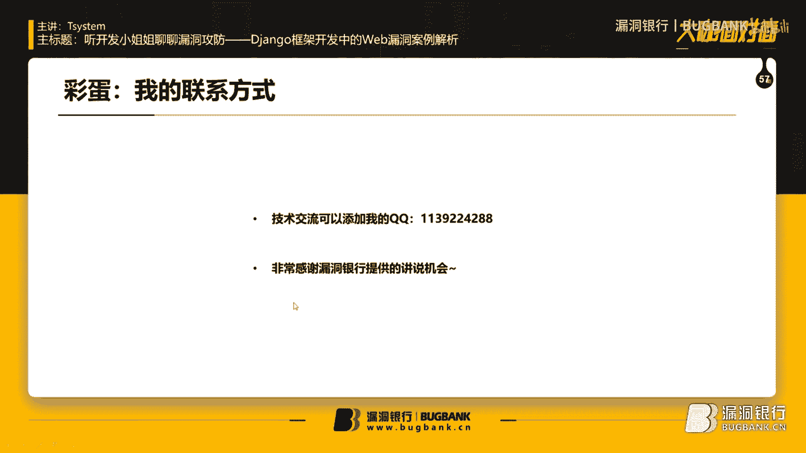
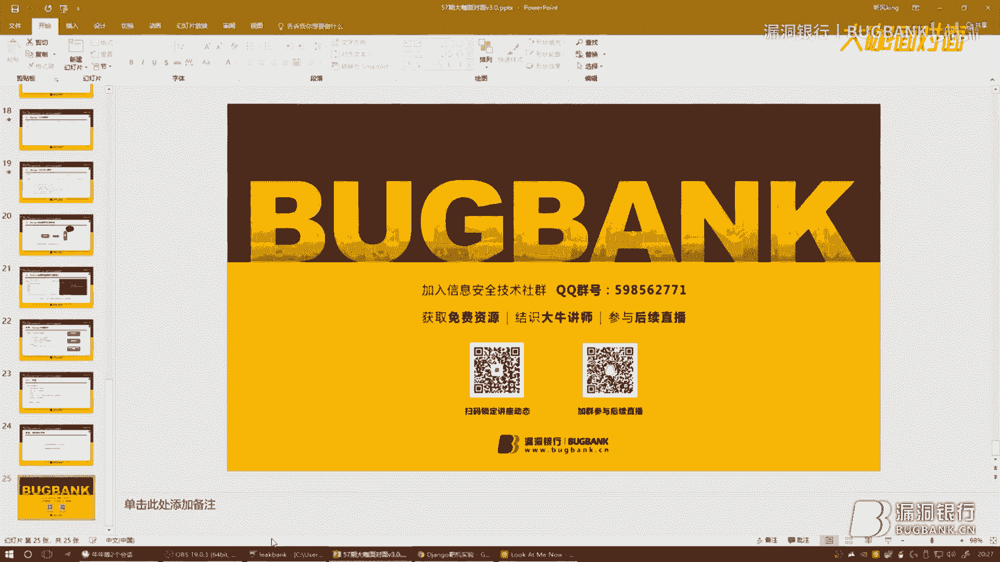
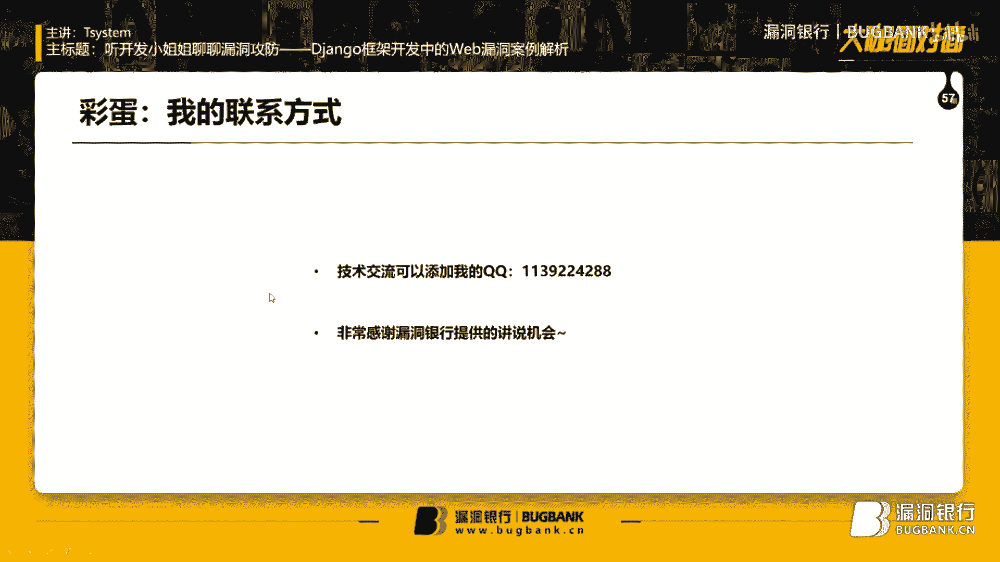
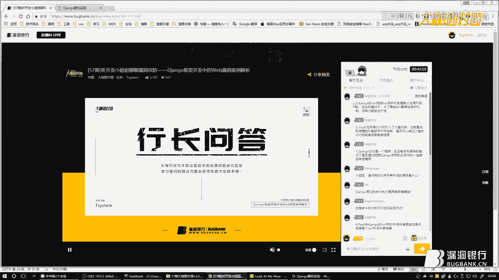
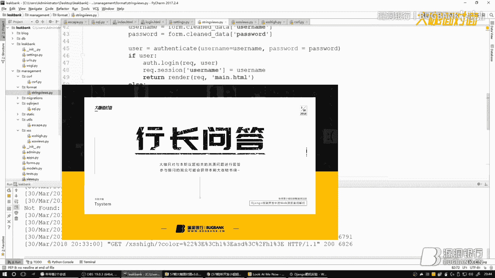
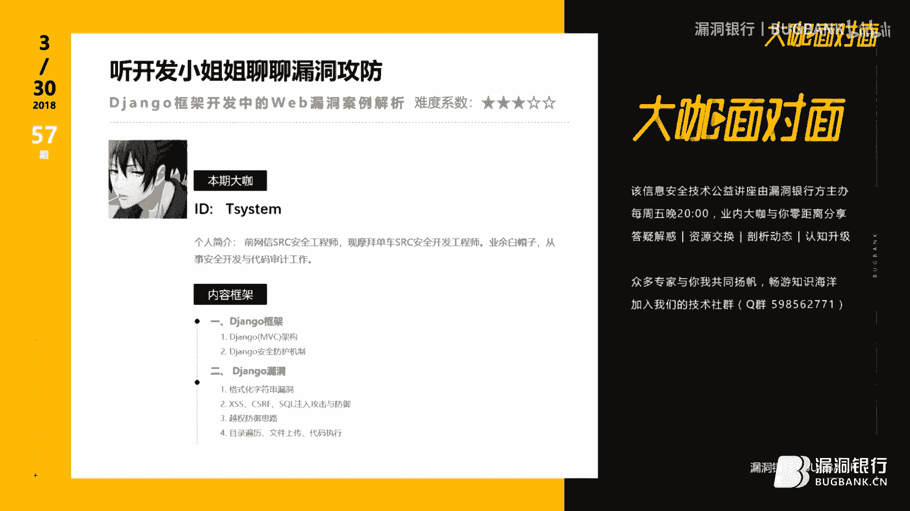
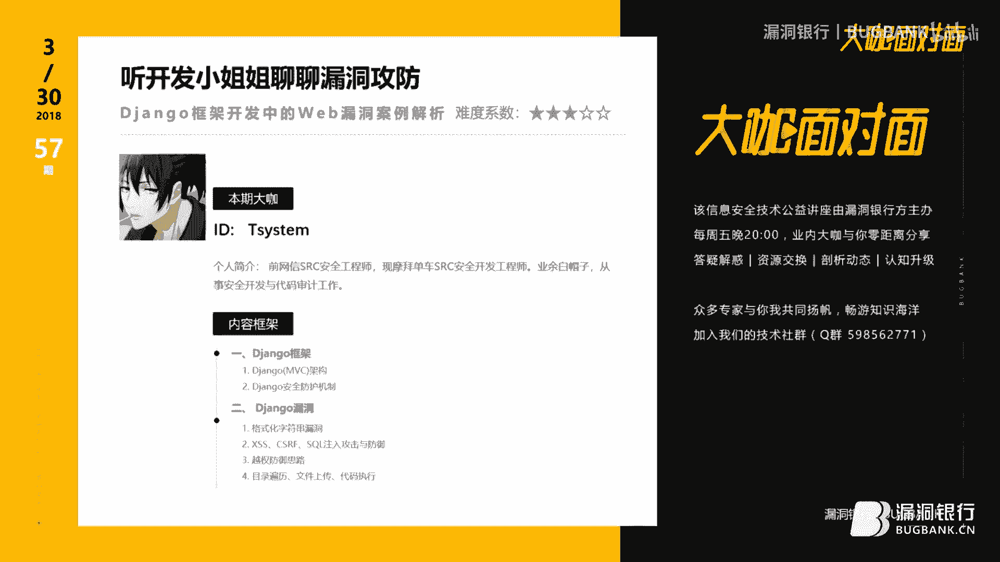

# 漏洞银行丨听开发小姐姐聊聊Django安全攻防丨咖面57期 - P1：57【录屏】听开发小姐姐聊聊漏洞攻防——Django框架开发中的Web漏洞案例解析大咖-57期大咖Tsystem_x264 - 漏洞银行BUGBANK - BV1Ft41187fC

Yeah。

现在庆幸宝报上了。😊，🎼害怕。

🎼妈妈受命啊。

为知识而存，因技术而生。小伙伴们，大家晚上好，欢迎参加漏洞银行信息安全技术讲座大咖面对面。今晚是看腻的57期，我是主持人年念。😊。

本期摩拜安全SRRC的开发小姐姐T systemstem给大伙带来技术分享。那本期的主题为听开发小姐姐聊聊漏洞攻防dngle框架开发中的外部漏洞案例解析。那在演讲过程当中。

小伙伴们有什么问题都可以随时提出。小姐姐会在演讲结束后的行上问答环节来解答。那今天晚上开面赠书环节，小姐姐还精心挑选了一本pathon黑客攻防入门。那期待幸运观众出现。话不多说。

下面有请大咖T system渗透攻防搞起来。嗯，大家好，非常开心这一期和大家一块分享得站go相关议题。首先我再次借我借我自我介绍一下，我是一名业余的白帽子。然后之前在网线SRC从安做安全工程师。

现在在摩拜单车SRC做安全开发工程师，主要从事的方向就是安全开发和代码审计。😊，那么今天呢主要向大家介绍一下在底站go开发过程中可能遇到的一些安全的问题。那么今天主要讲解的内容呃。

主要从两个方向呃主要讲解两个方向的内容吧。第一个是站在白帽子的角度，我们应该如何绕过得站沟现有的安全机制，然后进行漏漏洞利用，以及站在开发人员的角度，应该如何更加安全的开发我们的框架。

嗯，今天主要讲题是运呃djago框架开发中的一些web漏洞案例解析。我们来看一下今天我们的主要目录。嗯，第一大点我会从djugo的M讲解一下djugo的MVC框架。

然后再讲解一下djugo的安全防御机制有哪些。然后重点是第二点djugo我会铺一下在djugo中容易出现的一些漏洞，例如格式化字符串漏洞，或者是啊或者是叉SSSF。

还有一些ser的基础web漏洞的攻击与防御。嗯，第三点我会讲一下python和与月权漏洞的这个逻辑漏洞的完美利用。第四个最后一点我会讲一下目录便利漏洞的防御问题。嗯。

首先让我们看一下今天呃第一点得ju构的MVC架构。那么这个我会通过用户修改个人信息为例，然后来给大家讲解一下MVC架构是怎么运行的。那么可以看到在控制器的这一端。

用户输入了一个修改个人链个人信息的一个链接，然后给URL控制器。再通过URL控制器里面的URL匹配给对应的一些视图函数中的一些逻辑。那么通过这个逻辑中这个逻辑中呢。

会从呃会从前端传来的用户的session值取出token信息和后面的。服务器端的token进行比对。如果比对成功，那么就说明用户有相应的权限，再从model中取出数据。

取出的数据呢会返回给再次返回给视图，然后试图将这些数据渲染给模板的前端，然后从而体从而展示给前台的用户。嗯，这个就是底站go的呃MVC的一个设计。那么讲完djago的MVC设计。

我会简单的讲解一下我们应该如何快速的编写一个djago项目。我们可以看到，我们可以从呃通过PIP工具安装一下得站狗模块得站狗模块。呃，在安装完得站狗模块之后。

我们可以通过star project命令来启动一个li bank的一个项目。我们启动完link bank项目之后，呃，输入完这条指令之后。

我们会在右面的呃我们看到右面的一个简单的一个目录架构下面有一个sing点PY。这个文件中记录了呃python dejago项目的一些呃配置信息，例如secret key。

还有一些数据库的重要的配置信息都存放在这里面。那么第二第二第二步骤，我们应该通过djungle amin的这个管理工具下的start app命令来创建一个management的一个app。

在创建在启动完这条命令之后，我们可以看到右面的目录下会生成一个呃生成这如图所示的一个目录结构。我们主要看一下models点PY和views点PY。嗯。

这个views文件下呢主要是存放了一些我们处理后台逻辑的一些代码。models是用于数据库与我们后台的一些逻辑参数的一些映射关系。呃，可以看到这张图中呃，在我们做完之前的这两步操作之后。

我们需要将我们创建的应用management放到呃安装到我们现有的sings点PY的APapp中，我们就可以正常的应用呃底构项目就可以调用这个这个app了。最后一步，我们需要配置一下当前的数据库信息。

由于当前我编写的djago项目用的mysqcle数据库，所以。呃，配置的格式就如这个图上的配置结构。那么在做完上面这三步之后，我们通过呃run server指令来在8000端口启动我们的外部应用程序。

在这个应用程序启动之后，嗯，views会自动生成在底站构项目会生成两个比较重要的对象，一个HTP请求发送过来会生成一个请求的一个对象。HTP request的对象。在这个对象下面呢，有一些有一些属性。

嗯，如图我们可以看到med是一个存存存储的一个方法。例如我们前端是通过get方式或者po方式，put deleteelete等等。第二个参数是fe， feels代表着前端我们传来的一些文件。

第三个是cookie，我们的cookie用于存储我们的用户的一些信息，它的类型是字典类型的。那么相较于右边这两个user和呃user和sessions。

这个sessions这两个是通过djungo的中间件来开启的。如果中间件没有安装这两个应用的话，那么它是默认不能使用的。嗯，例如我们的djago项目想用sessions机制。

那么我们需要开启sessions这个中间件。嗯，在这里需要注意一下的是cook session这个机制是建立在cookie这个机制基础之上的。那么我们一旦启用了这个session的机制。

我们可以将呃将session存储到数据库啊，或者是缓存文件，以及呃存储到前台的cookie中。呃，在这里我不建议将sessions存储到cookie中。因为cookie可是相对不安全的。

被恶意可以被用恶意用户截取到。关于这个user， userer是在中间件开启之后，那么有一个isauation这个这个方法我们可以判断当前的用户是否是可以使用的。那么如果说不能使用的话。

那么它默认就是animous user。在底ja构项目创建呃过程中，我们使用HTP request对象来获取一个请求的话，我们需要自己创建一个响应的对象。在每一个view的函数中。

这个respon对象是必须创建的。那么这个这个下面有两个两个方法，可以向前端的模板去渲染我们的数据。rander的 render的那个功能还是很强大的，它可以向前台来渲染一些数组或者是字典。

然后字符串以及用户呃对象用户对象等等一些参数。redirect可以纯将我们的框架重定向到某一个我们想要固定的一些链接。哦，那么在简单的介绍了djago的工作原理，以及快速的制作我们的web应用程序之后。

我们先我们再来了解一下djago的安全防御机制。我主要会从6点来嗯铺开。下面我们第一点来重点介绍一下底站构下的格式化字符串漏洞。呃，对于djago格式化字符串漏洞的出现原因，我们可以看到。

在下面的代码中有一个form mate的代码。我们通过这个代码可以看到当前的代码将。前台传来的request对象下的user属性，然后格式化给了template这个字符串。那么我们是不是可以将可以将。

后面通过po的请求来获取到的email这个参数。是伪造成我们的配漏的呢，其实是可以的。我们可以输入类似于这样的参数，因为当前用户下当前的使用djugo框架的用户为user的用户。

这个用户下有一个password的属性，我们可以通过这个属性来获取从前台获取到当前用户的一些敏感的密码。呃，我们可以看到在我们输入user点password这个。payload的时候，我们就构造了。

如下的time play的这个字符串。然后这个字符串又经过。formm的个format的填充，所以就会在前台成功的显示出我们当前对象的一些密密码的一些敏感的信息。

那么我们之前通过user下的password属性获取到了当前用户的密码。那么我们是不是可同样可以通过当前用户下来获取到sttings配置文件下的一些敏感信息呢？其实这个是可以的。

因为djugle框架自带的一个app下叫addmin。我们可以通过它来过渡到sttings点 settings settingss点PY里面的配置。例如，我们构造如下的payload的。

那么user下有一个groups，这个groups是判断当前用户的这个所属的组。那么通过这个属性，我们可以。过渡到addmin下。

addmin下会有一个呃addmin下会有一个model modelel里面直接引入了当前we部框架的sttings的配置文件，就能够成功的引入到我们的secret key和dabb的敏感信息了。嗯。

我们可以看到最后我们输入这个payload的时候，我们就会看到如右图的攻击结果，成功的回显出来当前用户的账户名，以及还有那个密码的详细信息。之前我们讲解的迪jago格式化字符串漏洞。

是由于formmate函数formmate函数的格式化导致的。那么我们应该如何编写一个相对于比较安全的一个代码呢？我们可以看一下下面这个这个图。我们通过。呃，post。

然后获取到直接从前台获取到了一个email的一个参数，直接定向输入到value值里面，通过runnder来渲染给前台模板。那么就直接走到了djugle自带的tlate机制下，我们就受到了框架的保护。

所以这个代码是安全的。呃，讲解完djungo的格式化字符串漏洞后，我们来看一下djungo的叉SS的防护。我们可以看到修复前的代码是我们通过get方式来直接获取到了一个color值。

然后直接渲染给了前台模板。但是我们需要注意的是，前台模板直接用sfe来过来关闭了当前template模板的安全机制。那么这个代码就会出现XSS漏洞。还有一种方式可以。

过滤还有一种方式可以和safe是相同的作用。就是这个outto escape当时关闭的情况下，就会存在叉SS漏洞。那么我们还有几种情况是可能存在呃会跨过Djago的防护机制，存在XSS漏洞的。

我们如下面这四种情况。第一种情况的话就是我们通过前端的JS事件里面直接放取了我们需要引入的动态内容。这个时候建议大家需要建议大家在value这个动态内容后面用escape GS直接逃逸呃。

直接过滤一下边呃过滤转移。然后第二个就是我们使用了safe mark safe以及out escape的时候，就像刚才的上一张幻灯片上面的情况，就可能会出现叉SS漏洞。

第三种情况是出现dom型的类型的叉SS。针对于这种情况的话，我建议在呃建议再一次做一次GS encodecode编码。如果说从GS里面直接输出到了HTML中的内容，我们需要对HTML进行呃encode。

第四点是我们直接通过HTP response直接返回了动态的内容。如右图HHTP response下，我们直接将name这个参数。返回给了前端，这个时候是会出现XSS漏洞的。

那么针对于这几种容易出现叉SS漏洞的情况，我们应该如何修复呢？呃，建议大家使用CJI模块下的escape和函数来。来防护。嗯，如下面的代码是比较安全的。我们通过将用这个函数转移了color这个参数。

然后再渲染给前台的模板。那么对于CGI这个函数的使用是有以下几种情况需要我们注意一下的。例如。我们可以看一下这个图，当用户输入了一个带间括号。这样类型的payload的时候。

我们直接使用CJI escape就可以将呃建括号实体编码。但是我们输入简单的呃unload这种带双引号的。披load的时候，我们是没有办法进行转移的。但是我们将只有将第二个参数置为处的时候。

才可以将它转移。所以在使用CGI escape的时候，建议大家将第二个参数置为处。那么djugo针对于CSF的防护如下，我们第一个呃第一个防护的话，可以通过通过djugo下的中间件CSF的中间件。

那么这个中间件在我们在我们使用start project嗯来开启一个项目的时候，它是默认开启的状态。但是如果在你启动这个项目的时候，最好检查一下sing4点PY中这个中间件是否开启。

那么第二种方法是我们在每一个提交post表单的时候，需要同时提交CSF token，来确保和后端的CSF的taken一致。这个时候用户嗯才能允许进行当前的操作。第三种情况是。

这个这个情况是写在了当前HTP request的hider字段呃，头部请求请求头部。那么它是。他是在her字段中被定义的。那么针对于呃CSF防护。

之前我们是通过呃通之前我所编写的代码中是通过s选机制来防护的。呃，我来简单的介绍一下如何通过这个session的机制来呃防护我们的呃CSF这个漏洞。我们在用户呃用户提交每一个po的请求的时候。

我们在客户端将存储的s存储的呃session里面存储的这个token的字段取出，并且随着po的请求同时发送给后端，并且与后端存储的这个session里面的taken字段进行比较。如果不相同的时候。

我们就拒绝当前用户来进行操作。如果相同，我们才会允许。但是之前使用的session这个session的机制是存在弊端的。因为如果用户无论是他是否请求了发送了这个po的请求。

这个s sessionession的。值都会都会在服务端存储一份，那么就极大的影响了呃服务器的服务器端的性能。所以呃推荐大家使用cookie机制来预防CSF。这样就不会给服务器端造成太大的压力。

那么针对于CSF防护防护，在dejugo下，有几种写法可以进行进行防护。我简单的列举了几个。那么第一种呢，我们可以看到在后端后端的模板中，我们后端的views文件中。

我们通过呃jugo下的tlate模块引入的CSF这个函数。通过CSF这个函数，我们可以向前端构造一个呃发送一个CSF token给前端。那么前端接收到这个tken，然后通过阿贾克斯请求。

然后再次发送给后端进行校验。那么第二种是通过der头之前插插CF token这个字段来进行防御的。呃，在我们讲简单的讲解完CSF防御之后。

我们需要我们再来看一下cicle注入得粘狗关于circle注入的防护问题。我们看到第一个。这张狗的呃，这个是第一行是存在搜er主入的代码。djungle下的数据库查询模块。

这个exr的函数是默认允许当前的where参数去拼凑，使用原生的ser语句去进行查询。那么这就大大的降低了防护cicle植入的这个可能性。

用户可以恶意的拼接where尔等于后面的这个参数来进行socer注入。但是我们通所以说我们最好采取将。第二个参数。至第二个参数至为处的时候，然后我们我们传入通过通过下面这个方法。

我们传入这个参数可能就就会大大的减少了ser注入的产生。还有一种情况就是使用了底层的数据库API例如我们直接使用了呃ex这种方法。在使用的exutee的时候。

建议大家呃使用下面这个写法来传入我们需要执行的。呃，执行的语句中的参数问题，不要直接在socer中拼凑，然后呃执行。嗯，关于抵站构自身的防御机制，呃，以上几点是比较。典型的。那么我们通过以上几点的讲解。

我们可以注意到，一旦用户发送过来请求接呃发送给后端处理的时候，一定不要相信用户端传来的任何参数。我们需要对用户端传来的各种参数进行严格的校验以及过滤。那么。我们接下来看一下。

月权漏洞与pyython是如何完美的结合的？呃，下面这个左面这个图是我之前。遇到的得粘钩框架下有一个。呃，越权漏洞。他的cookie中铭文归铭文。标记了用户当前的ID。那么我尝试便利了当前用户的嗯。嗯。

便利用户的ID之后，会探测到其他用户的一些信息。那么。所以我觉所以我觉得如何预防这个玉权漏洞的产生，可能需要。呃，对前对前后台传给前台的这些参数进行严格的呃加密。并且是恶意用户不能拆解到的。嗯。

左面这个图是我针对发现的呃，当前用户的。ID可以便利的时候写的一个简单的python脚本。嗯，所以。在为了防御越权漏洞，我们一定要采用严格的认证管理和session管理。

千万不要用铭文传输我们用户的这个user IDD。到前台导致可以便利的这种情况发生。那么针对于Djago目录便利的这个漏洞，我们应该如何防御呢？我们先看一下什么情况会容易出现Djago的目录便利。呃。

大家可以看一下下面的这个代码。用户在前端传来了一个呃目录的一个路径。那么后端呢直接通过open函数直接打开了这个路径，并且读取当前路径这个文件返回给前端，这个时候就会很容易出现目录便利的。漏洞。

针对open函数没有进行open函数处理的参数，没有进行严格的校验。我们需要对pass函数里面pass参数里面进行严格的。定义，例如用户输入的类似于点点杠这样的特殊路径，是不允许输入的。

以及我们需要限定当前用户。可执行的目录到底是在哪里？通过上面这两种，我们可以编写一个简单的wa来防护我们的得粘构机制嗯被。呃。会存在目录便利这种漏洞的可能性。那么针对于得粘够。可能出现上述漏洞的。原因。

那么我做了以下几点的总结。呃，最我觉得最主要的一点就是一切用户的一切输入可都是不可靠的。例如呃每次用户发送了HTP请HTP请求过来，我们都是需要对一切的参一切参数都都要都需要进行严格的过滤以及校验。

并且在项目的逻辑逻辑代码处，尽量不要使用呃。系只可以执行系统命令的这些函数。第二个是严格。第三个就是我们需要严格的控制呃我们的访问权限，做一个比较严格的访问控制系统。呃。

第四个推荐大家使用呃使用加密后的一些信息来传输，不要在。不要使用铭文。嗯，下一个是推荐大家不要将呃站点的密码进行简单的加密之后进行存储，这样是可以被拆解到的。呃，针对于在。

得jagle框架上存在的一些文件上传的呃，地方，一定要进行严格的。校验，例如限制文件的上传大小以及文件的上传路径，还有限制文件上传路径。没有可执行的权限。呃，就会大大减少应用层出现DDdos的可能性。

嗯，我们在启用了djugo的中间件的时候，建议大家一定要严格的管控session过期时间。

哦。下面给大家看一下简单的。

操作一下刚刚出现的几种漏洞。这个是我之前。这个是我之前登录的一个靶机实验系统。先来讲解一下d张狗格式化字符串。哦，刚刚讲解了在dejago框架下使用当前web应用程序的用户是test用户。

那么我们构造如下的payload的。呃，使用当前用户下的password属性，我们点击提交，可以看到已经成功的将当前用户的。密码信息。获取到。呃，在输入呃。

我们我们刚才第二个讲的payload的是可以通过user对象过渡到addmin，然后再通过addmin来过渡到呃获取到我们当前的ss点PY下的一些配置文件。当前用户下的所属组。

可以过渡到model下的模块。获取到当前APP的config的信息。哦，我去到。😔，哦，做一个简单的检查。下。哦，应该是没有问题的。我们点击提交嗯，可以看到我们通过user下成功的过渡到了管理员，然后。

又获得到了seing点PY下的配置文件的信息。那么我再来讲解一下。Chize。哦，我们可以看到当前登录的用户。如果想让自己下面这个按钮变成红色，我们可以看到输入红色的话。

会赋予当前按钮标签一个红色的一个属性。那么他是说明他是在tyle这个CSS下存在的一个动态的引入的一个动态内容。那么可以将。当前的。我们可以将当前的按钮看一下。我们将style这个标签来。闭合。亲。😔。

点击提交。哦，可以看到成功的。将前面的。标签闭合了。那么。你在次输入一下后面的配漏的。有。哦，可以看到可以成功的触发叉SS漏洞。那么这个上面我们就使用了sfe机制。

然后成功的逃出了djago自带的模板转移。那么下面是我编写的使用CGI来淘CGI来过滤呃用户的输入。那么我来看一下修复后的会不会成功的触发当前的漏洞呢。有。嗯，可以点击提交。我看到按钮还是原来的样子。

所以说通过CGI来。过滤转移是非常安全的。哦，那么今天我的分享就到这里，感谢大家的聆听。呃，如果稍后呃想要跟我进行技术交流的话，可以加我的QQ啊，非常感谢漏洞银行给我本次的讲说机会。好。

感谢TC陈小姐的讲解。😊，那从开发角度了解渗透攻防，就好比是了解了老师的出题思路之后去答题，就是害怕不及格吗？怎么会呢？那下面就到我们行长问答环节，想要考满分的小伙伴记得抓紧时间提问了哟。

嗯，问题有点多，我先慢慢看一下。对对，一个一个来，不着急嗯。针对于。嗯呃针对于第二个问题的话，这是第几个就是。金甲在引入了沙河机制。我们是否可以绕过沙河执行代码？

其实它是呃因为得ja狗之前爆爆出过一个漏洞，在我记得是呃老版本的一个dja狗是可以成功的执行代码的。网上有这样的。案例。这张狗仅仅是一个框架，在没有目标。原代码是狗。那么我觉得使用了djago这个框架。

如何更安全的设计自己的可能就是在views里面的那些逻辑，可能需要做严格的一些，还是按照刚才说的，需要做严格的过滤，还有它的一些逻辑，到底有没有一些。呃，缺陷之类的。啊，问题格式化。呃。

刚刚针对于这个格式化字符串的问题呃。我刚才做出简单的解释了，就是例如呃print。或者是formm这种格式化。格式化的函数它。他可以造成这个漏洞。嗯，可以有那个EXEC可以或者是。

OS引入OS模块下的stem或者是。Oh。excuse feel这样的函数可以导致命令执行。那还是。针对于参数嗯我觉得这个呃针对于参数每一个就是前端传过来的一些参数进行追踪，然后去看他的那些呃逻辑啊。

到底是否是否正确吧。啊，扫描器的话可以。我觉得呃编写。之前编写扫描器的话，我并没有基于迪粘狗来开发。哦，密码找回这样的漏洞，其实是由于。他在那个密码找回的那个逻辑上，可能开发开发人员有一些逻辑缺陷。

这个需要针对于实例来讲解。是我哥。😔，针对于这个问题，我觉得还是。是。应该。当然呃，如果如果说你的业你的项目已经上线了，但是被检查出月权的话，呃，如果如果你要是修复呃，修复是还是肯定。肯定是需要。

需要运维配合的。建议还是避开业务高峰期。哦，我们讲到格式化字符串漏洞的时候，其实。呃，因为因为我们通过这种漏洞是不可能进行代码执行的，所以。可能只能探测一些敏感信息。那么探测敏感信息的时候，呃。

我们知道user下的那些属性，但是为了。为了能能读到setting这个这个配置文件，所以我们需要挖掘得jugle自带的应用中的一些路径，然后来进行敏感信息探测。

其实我觉得张狗自带就张狗这个框架自带的CSF和XSS保护机制已经是非常的完善了。呃，当然也可以自己通过自己单独开发1个API来呃来写自己的安全安全代码，这样然后制作一个安全的API接口，供别人使用吗？

Yes。哎，小姐姐，我感觉问题是不是也回答的差不多了？哦，对我感觉差不多了。好，那感谢T system小姐的解答。那接下来就到了我们的大咖赠书环节，究竟今晚谁能获得这本tson黑客攻防？😊。

入门呢，那下面就有请小姐姐选出本次的幸运观众吧。嗯，好，那我就从呃提问题的这些人里面选了。因为我觉得提问题比较积极嘛。好的。😊，好的。啊，我已经选出来了。K酱对吗？对，就是他。好嘞。

那恭喜这位K长获得这本。😊，python黑客攻防入门一本，那需要你在相应的区域留下正确的收货信息，我们会尽快将数籍寄出。

小姐姐开发和渗透角度双管齐下来解读djungo框架开发中的漏洞攻防，受益匪浅。那千万不要错过和小姐姐交流和切磋的机会。我们大咖天团招募即将启动。

心动不如行动，赶快来报名吧。那今天的开面到这里也就全部结束啦，再次感谢TC小姐的认真准备，也感谢小伙伴们的积极参与。大家面对面，周五8点见。那下周五恰逢清明假期，咱们再隔一周相见吧。😊，好。

🎼先让我们用热烈的掌声欢迎小姐姐Tsem。😊，🎼。🎼自带掌声。掌声。对。駅ひ？🎼来，小姐姐来介绍一下自己。😊，🎼大家好，嗯，其实特别开心这一期能和大家一块儿分享狗相关的议题。😊。

🎼我现在主要是从事安全开发的工作，之前在网信SRC从事安全工程师，现在在摩拜单车SRC做安全开发工程师。呃，现在主攻安全开发和代码审计。

嗯，唉。嗯，好，欢迎小姐姐。😊。

🎼哎你公司是不是小哥哥特别多？🎼其实小姐姐挺多的，尤其是漂亮的小姐姐挺多的。😊，🎼对对对，在这里打一波广告啊，因为希望学技术的漂亮的小姐姐能够多发声，然后多多露面。因为你们是最棒的。然后呢。

我们带康面对面的大门，常打开开放怀抱等你们好吗。😊，う。🎼你说的好。🎼嗯，刚刚看到有小伙伴说自己投了摩拜的简历嘛，所以呃有没有提前一点的什么公司介绍啊什么之类的，可以告诉就走。🎼呃。

是我觉得呃如果嗯其实来摩拜做就是呃从事工作的话，我觉得是对自己的。🎼就是职业生涯还是挺有帮助的，因为特别具有挑战力，而且公司的氛围特别好，都是大都是大牛。🎼所以而且还能晒飞。

🎼对，能学到很多不一样的知识，欢迎大家来。😊。

那小姐，你本身是学的什么专业？啊，本身学的是呃大学学的是网络工程专业。🎼网络工程专业。对。🎼为什么当时会选这个专业？😊，🎼说起来其实其实我是想学别的专业来着，但是这个是我报的第二个专业，第一个没读上。

所以第二个就成功录学了。🎼所以可以问一下第一个单心包的是什么？第一个其实特别想学数学与英文数学。不过幸好我现在庆幸我报上。😊，害怕。🎼妈妈救命啊。

🎼这里有一个斜霸。

