# 漏洞银行丨基于业务攻击场景的安全测试丨咖面76期 - P1：【录屏】基于业务攻击场景的安全测试-大咖小白-漏洞银行大咖面对面第76期 - 漏洞银行BUGBANK - BV14b411A7u8

为知识而存，因技术而生。小伴晚上好，欢迎参加第76期漏洞银行安全技术直播打卡面对面，我是主持人秋秋。😊，今晚我们请到的是来自物流快递行业的技术大咖小白，小白也是基靠安全团队的核心成员。

还有着丰富的外部安全研究经验，擅长挖掘业务逻辑、阅权等漏洞。今天是他直播首秀，大家给我们分享独家整理的业务攻具场景安全测试，相关技术经验，内容丰富精彩，小朋友不要错过哦。😊，在大咖演讲结束之后。

还会有很少问答环节。大家针对大咖所讲内容有疑问的话，可以登录直播间，在留言区直接提问。问答结束后，小白还有许多一名幸运观众赠与亲自挑选书籍安全测试指南。第四版。那只要参与互动就有机会拿到哦。😊，好啦。

介绍完毕。那下面就请小白大咖开始分享吧。大家好，我是本期大咖小白交割安全团队。现究冷某物流快列行业安全工程师致力于外部安全研究、向下挖掘业务逻辑、阅权等漏洞。爱好内网渗透，关注物流安全。

目前在甲方公司上班，平时也会在菜鸟小C挖掘一些其他物流快递行业的一些漏洞。本期我跟大家分享的是。基于业务攻击场品安全测试内容目录主要是7个部分。第一个部分是水平越传，第二个是本地验证绕过。

第三个是任意密码重置。第四个是叉xE越权便利，第五个是点netlog日子泄露。第六个是。客户端刷新验证码以及第七个的华东验证码 logo过。

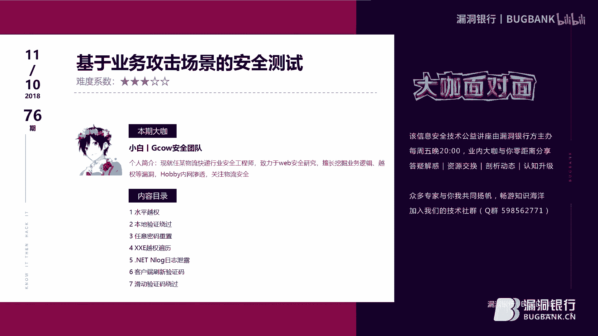

我把整个漏洞挖掘分成为2块。比如我们一些外部常见漏洞，Ewa检测的，如常见的是co叉SS上传SSF叉叉E漏洞。黑盒上难以发现的，如本地包含命令咨询等黑盒容易发现的业务。如挖夫无法检测的。像我们一般。

网站的一些注登录注册，如修改密码处，像一些用户认证，用户登录的。还有以及支付功能处更改客户端。还有第3块就是订单管理处，如用户权限、用户授权、如修改查询、删除取消等等。

以及我们的本地验证绕过中间插件录网洛格日兹泄露验证码缺陷。拿个华东验证码，每一个功能我将实力整级。这边我画了一个申通测试的一个图。

这图就是一个深度测试一个流程。比如我们第一步的寻找服务，然后谷歌搜索，然后以及子域名slight，还有我们那个子域名。爆破工具。然后以及我们一些。端口下的一些服务，如HDBB的卢非。HTTP的服务。

还有以及非外部的，比如21223389非非外部的那以及一些中间插件。这一期我们主要介绍的就是业务攻击快了，主要关注于。我们这些。哇夫无法检测了。已经天万福录已检测到了。业务攻资方面呢。

这是整个一个渗透车试图。水平越泉。我讲的第一个案例就是订单月传。一般我们漏洞挖掘时，我们一般只是把重点放在了3W和子域名，容易找到的资产系统，却忽略了很多第三方应用服务。有些用户量大了。如。

微信搜一搜以及支付宝的公生活公众号，以及QQ公众号，能帮助我们找到更多资产，挖掘到更多的漏洞。下面是。微信公众号某厂商API月权漏洞案例，一个漏洞的一个案例。比如我们打开微信，微信里面有搜一搜。

说说你要挖掘厂商的关键字，然后我们再抓取APP订单。就是我之前。截取了一个图片。然后从数据包我们可以看到ORDID是一个订单号，我们只需要替换指数的值。它主要就是他这个ID为和open IDD进行绑定。

然后就存在越场。当然这不是自己模糊测试的。还有APP小程序，也可以通过PC端浏览器进行验证。主要是我们这个。哇哇低压了1个ID号，它就是个订单号，后面是他这个值是没有加密过的。是数字性的。他如果没有。

和oppo IDD提行绑定的话，当然我们就可以测试一下，就是替换替换它那个数字。这边我使用是get help的。一个jetge工具里bet需一个命令，然后进行验证的。像一般我们测月船的时候。

你不需要加cookie。如果你没有加cookie就能。通过1CL，然后减D，就是我们一个跟这个pos的一个数据包。后面如果你没有加cookie的话，就说明能枚举到。能列出用户的信息化。

那可能就是存在越创了。像我这部就是没有加c克的。第二个案例也是比较简单的一个水平越权，用户个人信息阅权修改权站用户资料了。像很多网网站都提供注册功能。然后当你使用账号密码登录的时候。

它都会有一个修改个人资料的。那么我们可以利用这个功能。拿去做一些。做一些其他的一些事情。比如。我这个案例就是为了验证这个漏洞，我就注册了。两个账号。一个A账号，然后在A账号的添加收货地址。

因为他这个是物流的。像物流一般都有一个，让你添加一个的收货地址，然后进行下单的。然后我这边就。在他的修改处抓包获取到我们的A账号的个ID为1484，就是为A账号的同样的方法再获取到B账号的1485。

然后在A站账号的数据包我替换成B账号了。就是说我A账号的1484再替换成B账号的。如果能成功的话，那么B账号就替换成我们A账号的。这边就是。之前测试的时候就是截了一个一截了一张图。

然后我们这边有个修改功能，然后这边已有收货地址，然后进行修改成功的。用A站号修改成B账号的收货地址。像他这种ID就是数字的，比如123456789这样的数字。我们就可以对ID便利。

就可以把全站的收货地址改成我自己的收货地址，危害是比较大的。然后之所以能造成这个月权，因为他。本身就没有做好这个用酷权限的控制，那么此数。包含了真删改查，其他都是一样的。

我像我这边返回包返回到200是OK的。然后这边呢扣了个扣了个返回值是零，它就是成功的。然后这边是个ID，红色标记的是个ID，然后今天替换的。

下面再分享一个本地验证绕过的这是个某RSRC核心身份认证处可绕过短信验证码进行实名认证的。像我们正常流程，我们点击这块的功能之后，我们正常流程我们走一遍，使用自己的手机号码获取短信验证码。

那后再输入验证码。点击提交，然后进行抓包，然后获取返回包状态状态信息。像如果返回包的信息为f就是为假嘛，然后就直接改成为处，就把它改成为真，其他状态呢可以先提交正确的验证码，然后再抓取成功的返回包。

然后并记录下来，然后再并替换错误的验证码的状态就可以了。它这步主要就是没有来自于服务端的一个验证。前端，它只是通过简单的一些。参数进行判断的。然后这边直接把返伪包里面的fo改成为处就绕过了短信验证。

这边就是一个认认证手机的。这边输入手机号码，然后在随利输入一个短信验证码，然后把它返回包。返回的状态信息。把佛改成为 true。就是这边这边是一个返回包。然我们就成功的绕过了短信验证码。

然后进行下一步操作了。这边我再分享一个关于APP就是APP数据包进行加密的。像我们该如何来进行这块的测试呢？就是。到我们APP数据包。加密存在越窗这块该怎么测试啊？这边是一个手机的1个APP的小程序。

它里面也有个下单的功能。然后下下单完了之后，我们点击这个全部订单，然后通过。B我们可以是看到数据包进行加密处理过的。但是可以通过返回报的ID进行修改就可以阅传到任任意用户的订单信息。

这边就是修改ID它ID对面列对队列是个订单号，它订单号实际就是一个数字嘛，就是个数字，然后修改成任意一个数字就可以阅全到任意用户的一个订单信息。我们点击已点击到已完成的界面，然后点击全部订单。

此时就能获取到自己全部订单信息。因为之前自己已经。下好了三个订单，所以这边。抓包的时候也会抓到我下的三个订单号，可以看到这个数据包。是进行加密处理过的。数据包加密，然后点击标秀了request。

我们可以看到返回的数据包是解密的。因为他订单详情最终还是要展示给用户看的。它里面有个API的。一个open ID这样个链链接未做校验，然后就。导致了越床。此时的ORDID不只是一个订单。

不只是一个全部订单，里面有3个，就是我刚刚说所说的，我是。下了三个订单，然后我们只需要修改任意一个订单号。这就是个订单号，那个数字嘛，我们把它改成其他的。然后在放完包之后，我们点击第一个详情之后。

我们就可以看到可以就。通过这个数字啊，我们就可以阅权到其他用户的订单信息。这个是通过返回包进行修改的，因为他的他这边是。服务端进行就是pos的数据包是加密过的。然后我们这边就可以通过它返回的数据包。

然后对他那个ID的一个订单号，然后再进行修改，就可以变应到其他用户信息。当然问题不仅再全部订单，像已完成，已取消，只要有订单都可以阅权到别人的一个订单信息。这是我都打了打过马赛克了。然后漏洞反馈。

然后开发那边说已经修复了。在客户端就是我还是经还是操作上一步的操作，他们说已经修复了嘛，是？No后。这边模拟器返回的，它是提示你没有权限，你没有访问该数据的一个权限，说明他这个前端是客户端返回出来的。

然后我们看看比亚秀的了一个历史记录。那个解省一个返回数据包，可以看到任意用户。订单详细还是存在的，这个漏段还是存在的，他只是。只是修复了一个前端的这样的问题。并没有真实把这漏洞进行修复的。下面再讲一个。

雷一密码充值的一个案例。某种常产生，能用密码存值。看到这个页面是不是很熟悉啊？就是一般网站一个密码重置的正常的一个页面。那我们进入密密码重置的页面，重置一下136666的一个账号密码。同样的。

我们输随便输入一个任意那个验证码，然后进行抓包。他这边也是通过前端参数的一个一个判断。他返回包是这个状态信息，因为你的验证码输错了，你既然面验证码输错了，那返回包状态信息肯定。不是for。

肯定是肯定是为 for的，不是出就是for啊。他肯定就是个假的，因为你验证码输错了嘛，那肯定就是个for。然后修改返回包，把它微修改为东易处，这样我们就会就绕过了，然后可以进行下一步操作。然后重点来了。

那放包进入输入密码里一个页面，输入一个新密码的时候。此处再次验验证了一个验证码就是。你上一步操作完了之后，他第二步他还是对验证码这个字段。进行了一个再次一个验证。那么我们这不该怎么做嘛？

我们直接把这个daate code的一个字段，直接把它给删除了，就可以绕过了，就是这个。给头扣了一个字段，然后我们把这个这一串呢。加米加米国的。一个验证码把它给删除了，然后。再放包。

此时我们就把这个13666的1个用户的密码就把那个修修修改成功了，然后再登录登录到该网站。上面再讲一个叉叉E越床便利呢。某厂商叉叉E越权便利核心OA系统用户信息。它这个OA是一个开源的。

一个开源的1个OA。那我发现目标核心用系统存在一个所谓的个目录接口测试方方法。以上有7个WsD按一个接口可以使用。SOAP这个UI，然后或者使用AWVS以及火狐的WD插件进行测试。

它是漏洞出发点是在第四个。啊全M所谓的test的这这个接口这个。借口调运未授权，然后。导致我们可以阅传到核心OA系统的所有的用户信息。这边我们只需要配合一个支持这个WDR一个接口的一个工具。

然后当然我这边使用的BI。然后抓取到的，然后在某个接口处发现，只要变出变换此数的值，就可以获取到所有网站的个一个账号密码。这边就我直接就是通过便利到它这个传舱的一个一个词，然后进行进行一个替换。

然后把它改成为一和44。然后这边成功获取到了。某个用户的一个信息包含了手机号码，那网站的用户名和密码等等。一些敏感的一些信息。这个还是比较简单的这个案例。点netOlog个日子泄露。这时。

在众筹厂商发现某个众筹厂商的一个点net网站存在onlook日志严重泄露的一个案例，大概百分之七八十的。网站都存在这样的问题，就是该厂商的780%的网站都存在这个问题。n洞挖随意输入一个字符提示404。

老输入onlook一个目录，因为自己对onlook有所了解，所以一般习惯性会输输这样一个数字。然后他提示403禁止访问房屋被拒绝，说明该目录它是有的。但是一般的情况下，很多白猫看到瓷砖的信息。

大多数都会放弃看别的。但是往往返回。这个状态说明这个目录它是有的，主过是你没有找到对应的一个目录一个路径。我们也可以看到这样的目目录一个返回的信息，我们可以深挖掘一下，也能发现一个新大陆。

这边问一下李勇了。开了下的DIAB扫描了此目录。然后发现他确实确实有些目录它是存在的。但是他还是提示这个403禁止访问，房屋被拒绝。

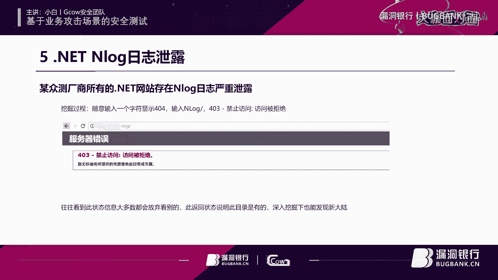

然后我通过了一番百度搜索，参考了C up使用look日志记录，就是一个作者写的这篇文章。然后我参考了该作者的文章，然后。到后面的时候，就发现发现他这个记事本上面它是有个时间戳的，就是有个时间。哦。

我在对比，然后参考该文章的。c up使用look日志记录，然后黑盒下对信息进行目录以及当前实间的一个格式进行拼接，进行一个拼接。然后成功列出onlook日志包含敏感信息的。这边你拼当前时间。

你直接按照他这个格式。比如他自他之前格式是2016年的-05-16。那么我们当前时间就可以按照它这个格式进行一个拼接，然后就可以了，就可以成功的列出这个Olook日志。但是比较很严重的。

涉及百分之七八十的一个点net，就是该企业的。百分之七八十都使用这点那台nlook日志的。上面再讲一个客户端刷新验证码。我们一般情况下就是你要挖掘这个验证码的问题的话，你可以直接直接抓包。

抓取他的数据包，或者你也可以直接查看他个HTML它的一个验证码，插入了1个HTM一个代码，你就可以看到它是通过什么进行请求的。这边我们可以看到它是通过一个音面集一个标签。

客户端通过验证码通过客户端的页面级标签请求刷新的。那么我们这一步就可以通过标系进行请求重放攻击。像这个验证码问题，我一般在SRC挖的也比较多的一个问题。下一般一般的长沙。

这验证码的问题也会给个一两百块吧。这验证码的问题大多数企业网站都出都会出现这样的问题。这边我画了图，我上面就写着我一个一般常见的验证码常见的三个问题。比如刚刚所讲的密码重置。就是一个去掉验证码的参数。

就是它验证码未生效，然后以及客户端刷新验证码，就是一米级进行请求的。一个标签请求的，然后已经没有失效，就没有限制。去美剧烟怎嘛？是我平常。挖漏洞的时候遇到最多的这就是这三个问题。

然后比较少的就是华都验证码那个绕过，我们正常输入验证码输入错误时，他返回的结果肯定就是验证码错误了。当然我们用户他是没有。

就是用户你正常输入时候，不管是输入正确还是错误。比如你输入账号密码。你无论输你输入错误，它也是提度提示错误。一旦输入正确，你同样的你可以也可以匹配成功。但是他这个。进行页面级标签进行就验证码。

通过这个客户端。immage标签请求刷新时，我们这可以使用B shot进行拦截，让它一直成功或者让它一直错误。这边就是通过B亚秀秀。就是拦截这个数据包，然后不让客户端刷新验证码，这样就可以进行重放暴力。

破解用户名和密码。此是攻击包返回的状态信息永远都是用户名密码错误。当然你这里你肯定要获取到一次正确的验证码。然后使用Bho的时候，让它永远网卡在这个用户名和密码错误。当然你的用户名密码一旦对了。

那就那就是成功了嘛。然后修复建议就是。服务端强制刷新验证码，限制用户名密码错误的次数，以及预防暴力破解。这就是平常挖路洞遇到比较多的一个案例。下面再讲一个华东验证码捞过来。

这也是本次业务攻击场景安全测试一个重点。某厂商的华都验证码绕过这个某华动验证码，就是该企业的一个某个网站功能，受这个华东验证码的一个保护。我们也可以看到这个。验证码1个JS的一个代码。

验证码初始组件初始化。其实。像这个GS的话，你抓的话，你你可以完全可以我这边系己肯定有点问题，不是火狐浏览器。像一般是那个谷歌浏览器的话，你这边。比如你刷新一下。老你这边就可以直接只只看这个解喜了。

只看GS的这个代码就可以了，或者你可以直接手动。

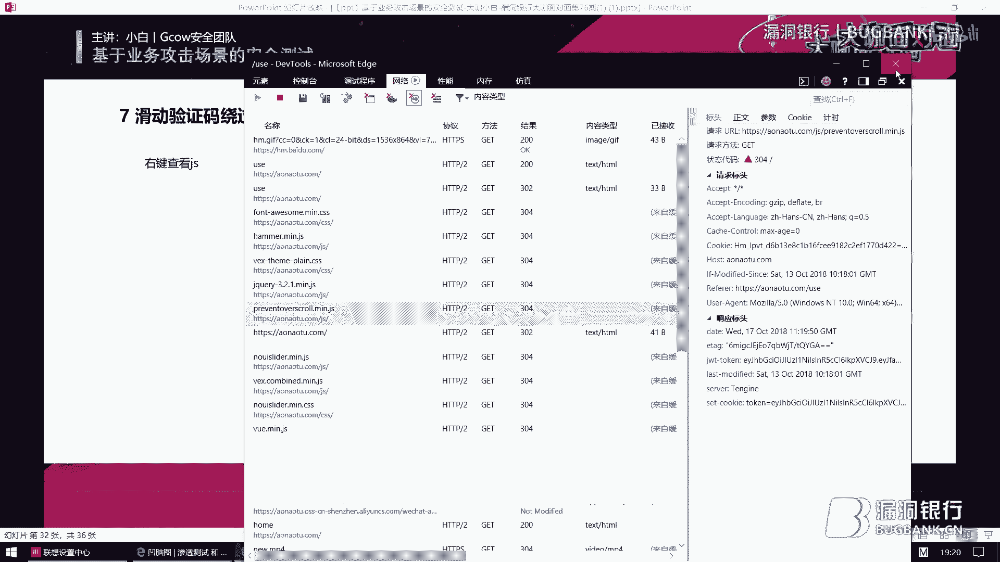

滑动的时候你就可以直接抓取到这个数据包，就是抓取到这个GS。解S的一个文件。我们可以看到这个ID。他是加密过的，就是一顿。就是网易的官网申请的一个验证码的ID，然后这一步就标刻了。

标刻就是输入要查询那个单号，然后re开那个IP。请就活取了个IPup不cor。授权码，就是每次。每次客户端的加密值都会变，你每请求一致。他这个阿 code的那个授权码那个值它都会变的。

然后我们看到这个postpost这样的。在那个链接。后面还跟着也包含了一进行中中国号扩起的一些参数。这个是就是我们需要我们自己构造的。然后通过这个GS代码，我我们就可以勾过到下一步。当滑动。拖动成功后。

他会请求做check。check了的一个标扣的这个链接，然后再次请求这个up code的这个链接，然后最后再获取到数据。所以我们直接构造请求。就相当于我们这个。手动滑动验证这个过程我们就直接不用做了。

我们直接做第二步操作。然后第一步请求页面获取动带的阿 code，这边同样的使用。借他的一个be小的一个命令CURL。然后获取这个动态的一个up code。然后第二步构造请求链接完成验证。

然后我们第二步就可以请求这个。才是开到一个标扣的，在那个链接直接请求他。我们可以看到刚刚我们这个加息的一个代码。就这一步这个链接我们可以直接清除到第第二步。请有底不来给链接。相当于我们第一步操作。

我们就。第一步的手动滑动的过程我就不用做了。然后过造链接。这个请求连接，让后完成颜则。这边就是构造一个参数。一个订单号标扣的一个订单号，拿个实践，然1个IP。然后up code的一个授权码，这个授权码。

是加密过的，每次请求都会进行变的。然后第三步我们就可以通过。这个链接。😔，直接获取到网站的一个数据。然后说指出说明是第二步和第三步的up code的值是由第一步进行获取的，就是我们第一步获取到的。

然后第二步进行请求一个构造。那第三步就可以通过这个阿 code这个字，然后直接请求它。就可以绕过这个滑动验证码了。然后总结，此漏洞是由于在GS进行滑动验证码成功后的操作。

当滑动验证码成功后的进行一系列的请求。当我们模拟滑动验证码成功后的请求就可以绕过了。滑动直接进行请求了，就直接操作它的。直接操作华动验证码后的请求。就可以绕过滑动，直接进行请求了。好了。

本期分享到此结束，谢谢大家观看。😊，那现在我们就进入到下一个问答环节吧。大家有没有批量挖掘漏洞的工具推荐一下。这个的话我一般都是很少用批量挖掘这个这个漏洞的，很少使用这个工具的，就是批量挖的很少。

你般手手工的会比较多一点。我吵。还有第二个问题，就是关于叉叉E那个漏洞，关于接口测试那块能详细的再测试一下方法吗？呃，这块我肯定刚刚没有讲清楚，其实这个。

确实。叉叉E这个漏洞是一个。某OA的就是一个开源的。并不是所有的这个接口都有这样的问题。他是一个开源厂商的。如果他升级了版本，或者他这边如果做了一定的限制之后，你是。你是没法复现的这个问题。

怎么拼接onlook，我看一下，因为我这边刚刚也讲过。

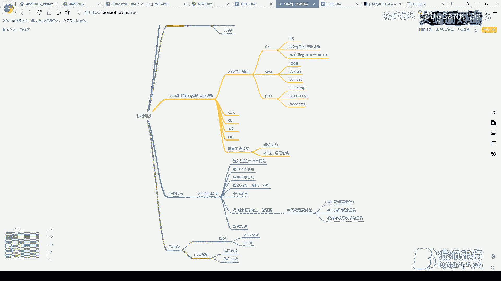

呃，平接on的日志是是这样的，我是使用开立的1个DIB的一个目录扫描。然后后前面是跟着一个的一个目录，然后在使用这个DIIB扫的时候过程中发现它这个目录它确实是存在的。但是你要进行拼接的话。

就是你要拼接到你自己的当前的一个时间。比如我刚刚所说的2018年的10月的11日。然后你一个目录。然后后面再跟着一个时间，时间的格式，你可以就是我这边也有有说到，就是参考。

参考一个作者一个C下普使用on可以一个日志记录的。就这一块。然后这个这个就是实间格式啊，2016年-05-16，然后你这边杠也是需要的。然后这边就可以完成一个拼接。然后。然后就可以访问到厂商的一个。

一个欧诺 look克欧诺克一个日志25元。B站的验证码分滑动验证码和变形的数字两次验证。请问大哈有什么闹过知识吧？其实是这样的。他这个验证码之所以可以绕过啊，还是主要是他们开发人员的一个问题。

因为我是分析了他这个GS。一个简石，一个代码。我就发现他这边是可以构造的。当然刚开始我是不知道他这个有没有漏洞的，我是自己先构造一下。然后如果能成功的话，那那就可以成功。当然我们这个GS。

他这边都代码成面，他已经已经有写到了。比如你要需要什么参数以及需要什么东西，他这边也有。还有以及。它后面更着一个tra的一个阿 code的一个这个链接，它这边。

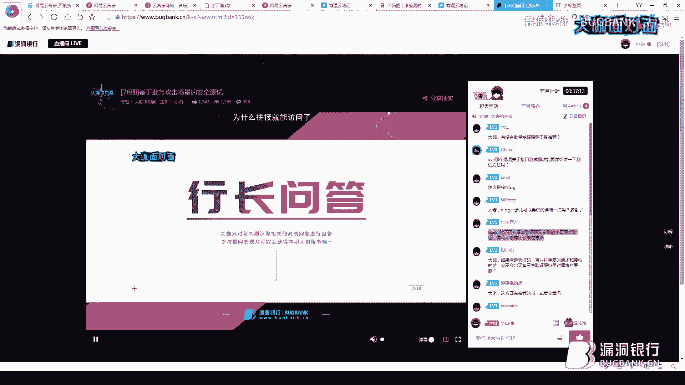

他这边都有，然后就可以构造一下。当然我相信不仅仅是这个厂商。

当然其他的产生可能也有，只是没有发现而已。

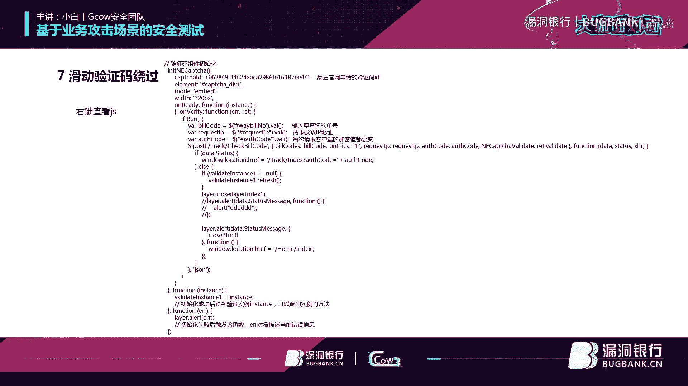

如果滑动验证码一直这样重复的请求和接受的话，会不会出现第三方？验证服务器对请求的一个屏蔽。对他这个验证码确实是需要第三方的。比如我刚刚所所讲的这个它就是一个亿盾官网的。你可以百度搜一下这个亿盾官网。

我这验证验证码就是一顿的。

其实跟这个厂商是跟这个易盾的。

是没有多大的关系的，主要就是他在调用这个验证码的过程中，这开发人员。

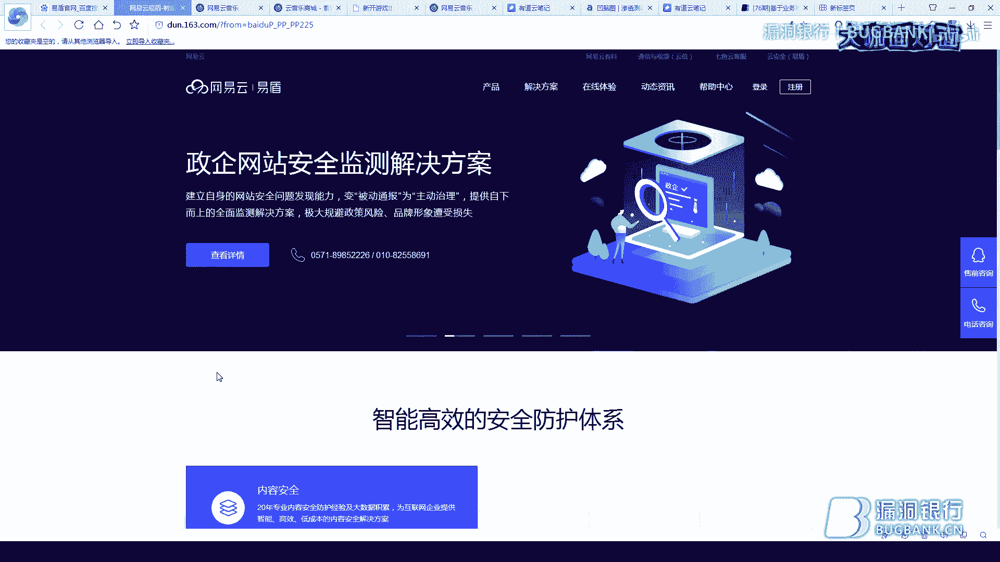

在写的过程中是出现了这个问题。其实跟他原本的一个一一吨，这个厂商是没有多大关系的。就是只是他在调用的过程中是出现了这样的问题。

有没有这方面有推荐的书吗？我跟秋就是推荐了一本就是。OWASP的安全测试测试的。嗯，这本书就好送出去。对，这本书里面写的很不错的。华东验证版可以绕过，那么那种选择数字，这个选择数字也可以绕呀。

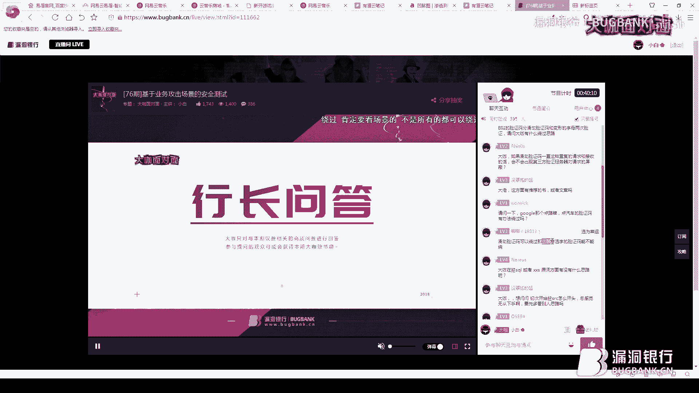

只要有漏洞，它都可他都可以漏的。比如我刚刚画的这个图。自己看就行了呀。如果你这个验证码它这个参数是失效的话，你就可以直接把这些参数给去掉。

如果你比如你刚刚所说的，刚刚那个有19833的这个观众所提到的这个所数字验证码能能搞过？

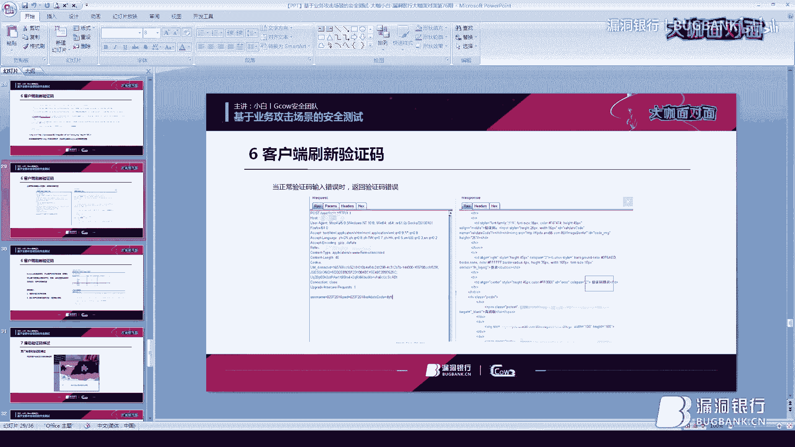

比如我像我刚刚所说的，就是这个。客户端如果他是客户端刷新验证码，应用硬密级标签请求的话，那么这个可以绕过了。大咖在挖是坑或者叉叉S漏的方面有什么思路？叉叉SW100多秒的叉SS吗？还是叉叉E。

现在一般挖这个书扣，石扣的话，我一般都会用一些比如标修的一些自带一些插件初步的验证。然后如果有漏洞的话，我就可能就会用手工测试一下。我页绩是本地验证，没有办法取得正确返回。返回包的特征也不明显。

这种有办法绕货吗？一般的话，我们之所以能绕过的话是。本地绕货我一般我们之所以能绕过的话，是通过修改的这个。这个状态值。如果你连这部都没有的话，有特征都没有的话，那么我估计。也很难。

但是你所说的特征不明显，应般就像我刚刚说的所刚刚所说的，你先获取一次正确的一个返回的一个状态码，先记录一下。即便它的特征不是很完全，你都可以模糊测试一下。

微信下有没有月权漏洞，和网页一样的？其实我在挖这些厂商挖的比较多的还是APP的APP月全是挖的最多了，还有一些逻辑漏洞。还有微信的一些小学小程序，其实都是大同小异。主要是抓包肯定就是有所差别。

可能我们需要在。我一般都是用那个。安卓模拟器。然后再导入个BR秀他这个证书，只要你能。只要你们正常抓包的话，一般跟网页上没多大的区别，还是一样的。滑动验证码查看GS以后还要做什么？

主要你就是看G室里面的一些参数啊，比如一些。就是提交的一些数据，你这个是你你是所要关心的。然后看一下这个。室里边看能不能自己能不能构造，能不能拼接一下。可以讲一下验证码爆破的几种方式吗？

一般就是无非就是四位数和6位数了。说。看他有没有限制或者有没有时效之类的。比较好识别的验证码工具，我推荐就是。PKAV的一个就是识别这个。验证码了。只要不是混淆的，一般都能识别。对，这个是的。

是标修的拦截的，获取铝块石的一个返回包进行修改数字和字母组合的变形验验证码怎么过？这个刚刚我已经讲过了。

你面集标签请求。验证码logo那你不是很明白是什么原理啊。

其实我看一下，我这看我。

我这边之前是有一个案例的。你可以看到这个，我看一下。这个这个就是一密执金请求的。这个是客户端刷新验证码进行页面及进行请求的。就这个一米几。然后后面跟着这个链接就是就是我们的一个验验证码。

如果你访问这个链接的话，它就是一个验证码。因为他这个。是客户端请求刷新的，不是服务端请求的。你既然你是客户端请求刷新一次的话。他是在客户端请求刷新的话。

你就可以直接用直接就可以拦截拦截这个成功的一个状态。就完全就可以OK了，它不是服务端请求的。

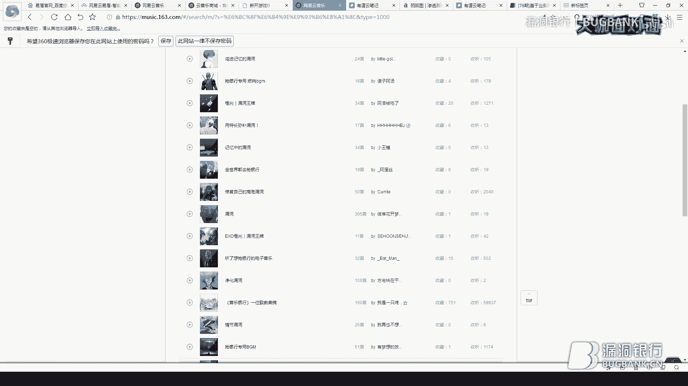

你有什么就是学习的经验可以分享下？呃，我可以学习经验，我一般都是多学多记，然后自己就是多看看一些类似一些文章，或者主要就是漏洞这块可能挖的也比较多。

嗯。对，像我有道云里面记了很多，就是比如一些比较好用的的一些比较好的一些文章，我都会自己做个笔记。

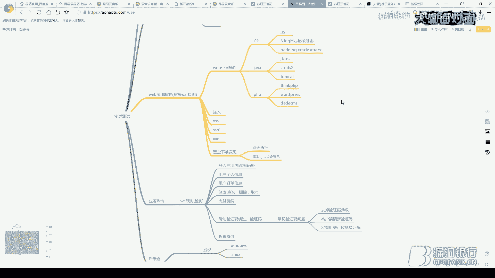

是这个。其实关于这个叉叉E的漏洞，其实大多数是因为有这个接口，然后你进行对这个接口进行模糊测试，或者才能发现这样的漏洞。所以是是是这样的。这边我看到有就是我们观众所提到的一个问题，就是修改返回包。

这个ORDR这个ID月球是因为客户端根据这个ID向服务端再次请求的数据嘛，然后返回这个ORDR的ID铭文数据包是做什么的？就像因为我之前。我刚讲的时候，我就说了，他数据包加密的过程中。

你要向服务端进行解密。解密完了之后，那数据才会返回到用户展示页面。因为你最终的数据你还是要展示给用户看的。他是会再次会请求的。然后进行解密的。服务端还是会暂时会返回的。亚秀的测过CSF我这个测过。

叉86SR。AM这个是默认的，一般我都使用默认的。好了，我回答的应该差不多了。好，那我们进入到下一个环节吧。我们后续还有一个福利环节，就是大咖证书环节。

今晚的证书复是小白大咖亲自挑选的安全测质指南第四版。就是刚刚问答时候提到一本书，那这本书详细的讲了版应用测试相关的技术和思想。那这一个文行出去采购。下面请小白来选信公众吧。我需1606吧，叫DY。

因为很多人很多白猫呃肯定在讲这个王月端跟这个微信上面有没有区别之类的，其实挖漏洞挖掘是没有区别的。还是跟网页版是一样的那恭喜这位叫DY的幸运观众。嗯，你将获得对应大咖证书。那好，今晚直播也来到尾声啊。

再次感谢大咖进行准备。那今晚小白大咖分享的几种业务场景测试方法。希望今后你都能了解并灵活运用。那想要回顾的话，我们下周五会放出今晚的录评。那敬请关注官网更新或群内的通知。

也非常感谢小白花精力去做直播分享，也解答很多问题。那后续可以多关注他和抵抗I全团队。😊。

那当然也感谢大家的踊跃参与。那大家如果也有意像小白大咖一样来直播分享的话，可以来主动找我报名。那加入大咖天团的话，更有机会获得更多福利优待。

好，那如果是想关注直播的话，可以点击页面底部加权链接。大家面对面就午8点见，我们下周再约啦。🎼How long has this been going on？🎼Oh you call on me。

baby。🎼好好。😊，🎼麦看诉谁。😊，🎼怎么你。🎼你的人。🎼阿 love。