# 漏洞银行丨如何优雅隐藏你的Webshell-Szrzvdny丨咖面67期 - P1：67期丨如何优雅隐藏你的Webshell-Szrzvdny - 漏洞银行BUGBANK - BV1ft411Z7ac

为知识而存，因技术而身，小伙伴们晚上好，欢迎参加第67期漏洞银行安全技术直播，打开面对面，我是主持秋秋。今天晚我们前来老朋友科拉实验室的一员默默。其实呢我有见过默默本尊，他是有一群特别好的老铁的人。

比如说呢刚提到了小睡的清璇，他虽说体型微胖，但却兴趣爱好广泛，对技术研究充满了热情，可以说是技术宅男拯救世界的典范。今晚呢他会我们分享如何优雅隐藏你的we shell这个主题。

优雅安全技术手法会在今晚一一揭晓。你想学会这个以柔克纲的技法吗？今晚一定要认真听听讲哦。在大咖演讲结束后，还会有互动问答环节，观众伙伴们可以在直播过程中将问题发在聊天区。

大咖幕我会在问答环节为大家一一解答。问答结束后，那默会选出一名幸运观众，于是书籍C primer plus video6版中文版。好啦，那下面就请默默大咖快今分享吧。😊，大家好啊，我是这次的打咖。

以前的ID叫做末视人性啊，现在改了个名字叫哇啊哇么这次分享的一个主题，如何优雅的隐藏你的we shell呃，在之前其实是叫做PHP by pass需 over那个隐藏你的we show。我稍微改了一下。

然后做一个自我介绍，就是我是一个有想法的胖子，然后就是喜欢研究一些那些看似很难，其实又很简单的东西。外博深度测试算是入门阶段吧，不能说很强，但也不会弱到哪里去。

然后对PAPP与python有一些啊就是学习啊，就是测光清旋的小弟啊，换两个睡他一次。好，这些。以后再说对吧？咱们开始这次的分享。其实咱们这次的分享分为四个大纲，就是怎么说呢？

就是优雅的bypas一句话呃，以及优雅的bypa大码，或者优雅的隐藏你的we show。所以就是对于我自己对by pass那种需的一种心得以及总结，就是自己是怎么去学习的bypa这样的一类的分享。

OK然后咱们讲第一个大纲。优雅的bypa一句话。首先这个这么一段是属于一个正常的一句话，对吧？众所周知的，那么它一句话的原理它是什么呢？对不对？它是什么？这个问题首先。咱们要确定一点，就是一句话。

它其实归根结底啊，它就是一个很简单的东西，它是属于代码执行函数以及参数接收来进行的一个代码执行。也就是说它其实一句话就是把你所需要传入的代码来进行一个代码执行啊，这么说，可能大家会容易理解一点。

其次就是它为什么可以管理外保，它怎么能管理呢？因为管理外保它其实PHP它是很灵活的，它是可以对本机的一些文件啊，又或者说是可以进行一些命令执行啊，这些操作的。也就是说咱们举个例子。

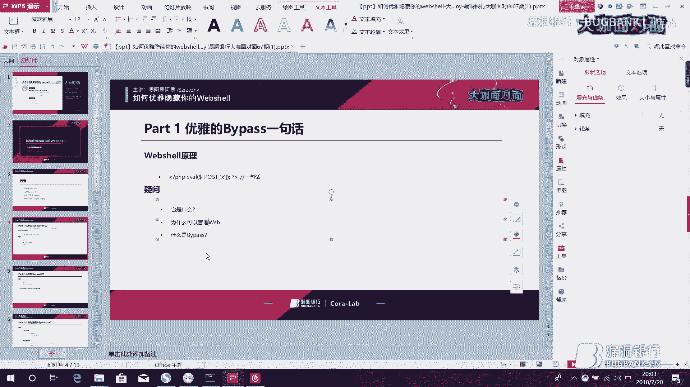

嗯，首先就是咱们先写一个最简单的一句话原型嘛。那么这里有一个代码执行的一个函数，对吧？然后再来一个参数接收，它这里可以是ge，也可以是pers，也可以是co，对吧？

当然你也可以用全行的就就是那种全接收的那个request，在我们这里可以用来做一个概括嘛，这里面这里面的值就是你所需要传的参，对吧？你总要给他一个参传参的地方嘛，然后我们访问一下这个1。

PO它这里提示一个错误X对吧？它这里意思就是说你这个X没有给他传参，我们这里传一下参就OK了。这里我们既然这里这里都已经说了代码执行代码执行函数，然后就是参数接收，也就是说我们这里需要传入什么呢？

也就是说我们需要执行的代码。例如我需要print就输出3个A，我们这里可以就直接输入print三个A，它这里就成功了就可以执行了，对吧？也就是说它这么print这么一个语法，它就已经执行成功了。

我们在这里。

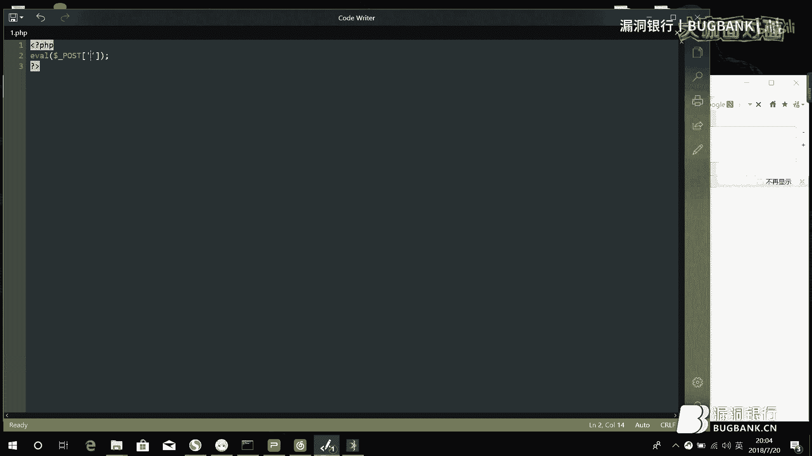

就是可以执行我们需要所需要的代码。例如我们需要一个命令执行，那么就输入stem这种函数，对吧？类似于system或者eva这些函数是有很多的。大家可以以后可以去P点net这种官网去看一下它的文档。

比如我们要输一个这里就回写了我当前卖的一个结果。当然很可能会有小伙伴问为什么我这边执行可以回显不行。有些站点上就不行。因为它是禁用掉了一些函数，咱们这里可以看P这里它会有个禁用函数的一个列表。

不过我这里没有禁用，它是为空的。然后咱们接下来说回归到咱们的话题里面，什么是bypa by pass不名思义就绕过的意思。对我来说就是我们需要绕过软对它或者对它的一些拦截查杀，咱们这里可以拿。

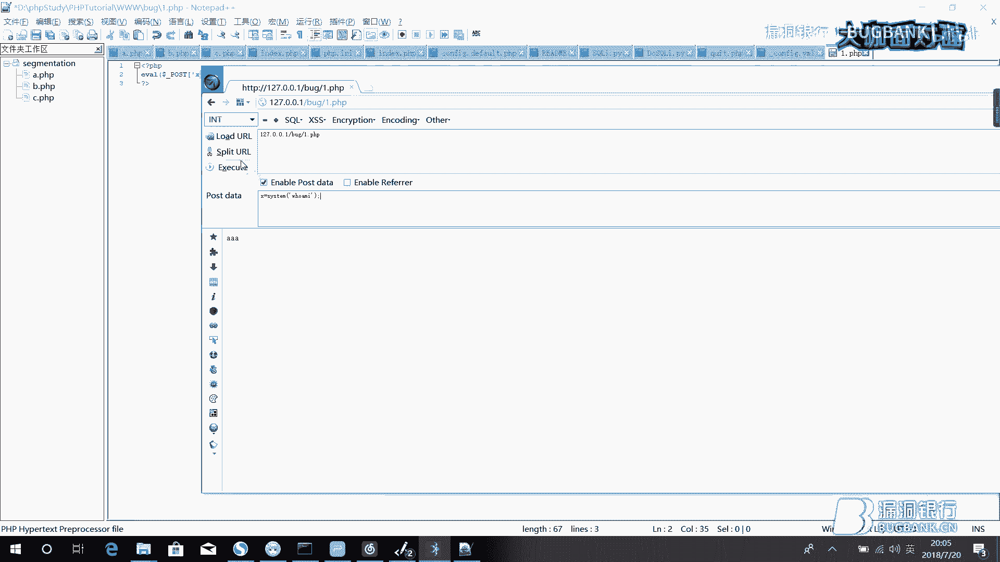

这种东西来做一个很简单的例子是呃我刚刚下没多久的一个我们这里可以自定义扫描嘛，然后选定一下我们的一个目录，有一个它马上就报错了，5级，对不对？va后门，也就是说他这里是直接被查杀掉的话。

那么我们肯定也就无法利用了。因为他都已经查杀了，那肯定也就没有这么一个va后门了，也就是说我们这里就不可以去持续留着，让我们去管理整个站点的外b，对吧？所以说我们这里需要去做一个bypass。

也就是说绕过它的查杀O然后我这里有一份就是我之前写好的一一个文章。我这里就是绕着他这个文章来讲，然后也就是说我在这里即将用它用我以前的思路，然后再做一些创新之类的。

OK首先我们看一下这个函数，它的顾名思义，它就它的上面就是返回字符串的一部分。咱们可以举个例子。例如copy过来，这一段就是可能这里有点小放大一点，这里就是从这么一段字符串里面。

也就是说从第零个开始往后截取一位，那么这里就是A，那么我们可以输出一下A，对吧？那么这里就是A，那么也就是说我之前说了代码执行函数嘛，对不对？我们其实怎么去pas它呢？就是我们不管怎么去拼接。

怎么去处理，我们只需要让它回到最开始的起点，就是代码执行函数和参数接收，也就是说我们只需要拼接出一个代码执行的一个函数，例如举个例子对吧？来进行来让它去执行代码，那么我们这里从这一段字符串里面去截取。

截取它这么一个那么一段字符串，对不对？我这里有写好的。

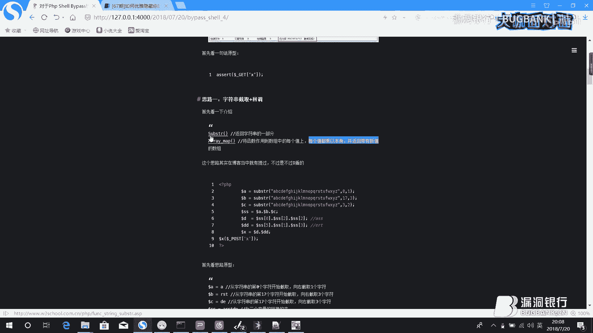

那这里就截取到了一些就是关于字符串，它把它大量的就是减少了就之前我们所丢的那么一些东西，但是它终究还是有一些多出来的。那么我们只需要处理，就是我们需要什么。

我们只需要ASSERT它这里还剩了一些什么ASTETDE那么我们只需要拼接，就是我们把它从里面再截取一下，就例如这样子。

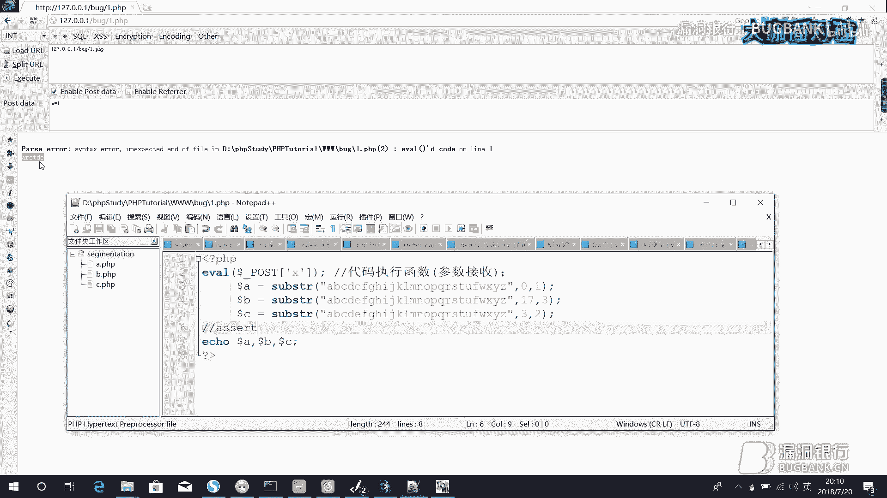

也就是说它原本这里是什么呢？这里就是反就是合在一起，就是有那么一些字符串，对吧？我们再从里面就是获取一些，例如零对不对？从第零个第一个是AA第二个是什么012S然后第二个S对不对？

ASS那么我们再再给他一个变量，就是我们再获取它结尾部分，第五个就是ASS一嘛，对不对？第五个，然后第一个就是第一个嘛，第O一然后再三就是T，然后我们再输出一下一口。

我们这里就得到了一个可以代码执行的一个函数，它现在是一个字符串阶段，也就是说我们其实可以给他再拼接一下，对不对？然后让他去进行一个代码执行。例如我们给他一个到了XXX等于到了D到了DD对吧？

然后我们再去执行它到了X，然后让他去给一个参数接收个X对吧？密码一个S传参O那他这里也就。

需要O那么我们这里已经复值了。如果我们不复值的话，它也就是说提示里们需要输入一些东西。那么我们输入假设输入一个呃sstem，对吧？一个这样子我们又可以成功的进行一个代码执行了。

也就是说它这里最后的拼接结果就是A然后一个一个参数接收这样子但是这样子它其实是不会去做一个太大的这么一个过查杀，它级别还是4它就是它提示内变量函数后门也就是说它这里它已经获取到这个结果。

就是它这里会返回一个对吧？也就是说我们需要在对它这里进行一个处理O不过这个里面我这里面有提过它是可以关但是关怎么说呢？现在其实是很少见的了，也就说关它是其实没有多大的意义。

所以说我们肯定要对进行一个绕过。那么它这里已经到了4级了，对吧？总比之前的5级要好的多。那么我们可以在它上面再。

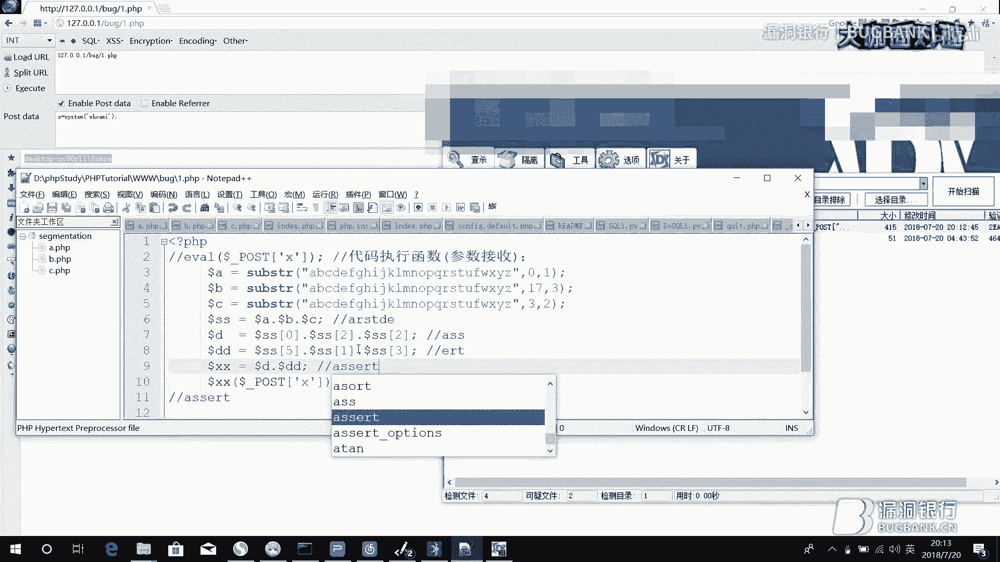

进行一个处理嘛，完完整整的绕过那么一个。这里我们可以提到一个，其实就很久之前就有出过的思路，就是函数回调，对吧？就是通过回调，然后让它进行一个代码执行，从而达到绕过这么一个效果，咱们可以建一个方式。

建立一个方法，然后咱们可以取立一个A，咱们这里可以直接return它，就是给它返回一个return它，咱们直接返回一个字符串sourcet，咱们这里可以给它返可以依口一下，看看这里就是一个st，对不对？

然后咱们再尝试去进给它一个执行，咱们先测试一下，它可不可以去进行一个代码执行。A，然后咱们一个参数接收。并不可以，为什么呢？因为它这个A它只是返回了一个字符串，它并没有去干到一个什么实际性的一个作用。

我们需要再处理一下，它这里是这样子，它其实实际并不慎行。咱们再不对，现出了一些梗，后任到了A这样子就可以了，他直接用A的方法的话，它是直接turn一个字符串，但是咱们给它复制到一个变量里面去的话。

咱们就可以这里是拼接一段字符串嘛，对吧？然后给它存入到变量当中去。然后这里就是返回一个字符串，让它存入到变量当中去，然后再用变量去执行这个，但是这样子它依旧是进行一个查杀的，但是只是查杀了两级。

咱们这里可以尝试一下，因为它这里有个关键字。但其实这种不重要，咱们可以试一下，咱们直接一个A到了A读这个注释的话，有时候也不知道为什么。

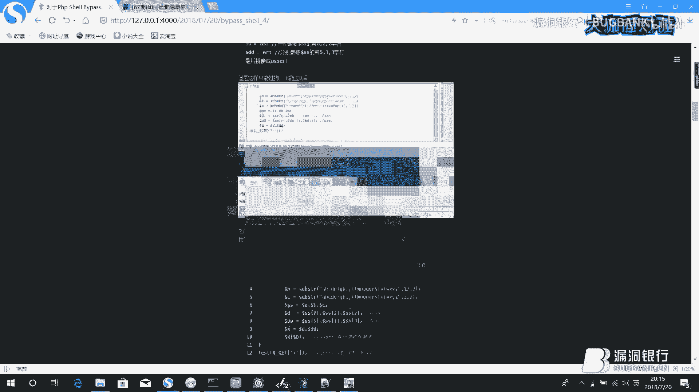

嗯，这样子可以了。然后咱们可以就是先尝试一下嘛，好吧，到了A等于A那怎么去过呢？咱们先试一下，我就是之前的一个思路，就是在它的那个执行里面再进行一次赋值。也就是说咱们看操作A到了A。

然后这里咱们可以呢定义一个新的变量，到了C吧，等于一到了。fit开是接受。Yeah。

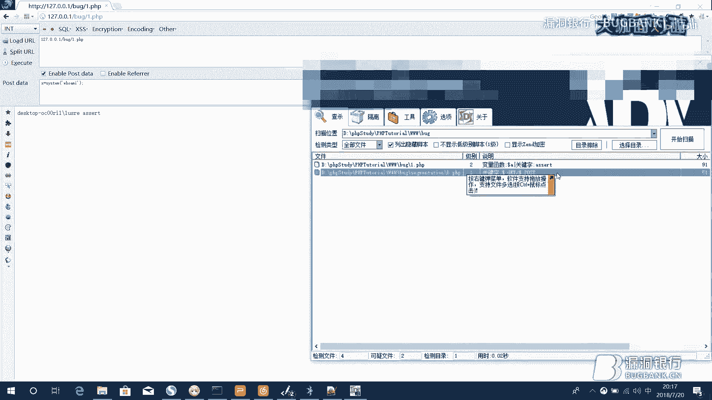

这样子依旧被杀了，不过问题不大，咱们可以通过很老的方法，就是函数回调，咱们直接走一个函数回调好了。这次其实这个东西本来不是这次的话题。

这里就是把它的这个方法存入到这个变量当中，然后再通过一个函数进行一个函数回调。但是我记得是不行了的。

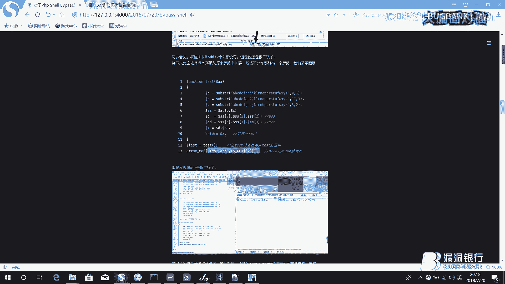

Re map。啊，这样子可以了，咱们看一下能不能执行了。可以了。扫也没有扫出来，然后咱们分析一下这里。这里就是它是一个把一个数组到了就是这个per的传参，然后以一个数组的形式存入到到了C里面去。

也就是变量C里面去，然后再用 map来进行一个函数回调。也就是说这里是一个assourcet，然后这里是一个传参。也就是说其实这里就是最后也就是说咱们可以理解为就是。啥子。然后一个。接受。

然后来进行一个。再怕。也就是说回到咱们最初的一个起点，就是它一个代码执行函数。然后来一个参数接收来进行一个代码。然后咱们接下来讲的第二个大纲。因为很多东西其实它都是万变不离其宗的。咱们举一个例子。

其实就差不多了。真正的东西其实得靠自己去一些研究。例如这里我可以推荐大家一个很好的一个办法。例如你想到一个思路就去做做不做的成，那是另另外一回事去不去做，那又是另外一回事。

也就是说例如我当时初学bypas的时候，我就想他这些能不能直接就是通过一些返回一些字符串，让第顿这些东西对这个函数不太这么的敏感，然后我就去找到了一个那个函数，然后就去对他一个返回。

然后当然其实这里面的思路其实大部分就是有有一些老司机带着我就是我之前有一个pas小分队。然后里面他们都是对我有一些分享。然后这次咱们讲的是一个优雅的bypas大码。嗯，他是什么，他跟一句话有什么区别。

大码怎么说呢？其实他就是一个外国管理端。他只不过就是例例如宝塔这种东西，对吧？它只不过没有了验证，没有了那么的复杂的东西，它可以去管你的外包管理的mysqcle，但PHP里面有mysql的一些连接操作。

对不对？它这里都把那些简便化了，也不需要去对它一些代码执行，它自己就会给你的一些代码执行，它跟一句话有什么区别，区别就在于一句话短小而精悍，大码能做的东西，小码一句话也能做，因为它是可以支持。

就是它直接执行代码的。嗯，大码他是直接就是已经把大码给你执行好，就是把代码块给你已经执行好了，返回给你的结果。这是一句话跟大码的区别。然后咱们要去打造一款就是过任意。

也就是说所有wa服加CDN的一款大码怎么去做呢？其实这个东西我以前就有分享过一篇文章，可能就是他可以去成功的去绕过一些。例如刚在弹幕里面看到了一些。这类的东西它可以过拦截，也可以过查杀。

也就是说大码它很多东西，它其实就算你本身绕过了，它里面执行的一些代码也是会被wauff拦截掉的。然后再从而查杀掉。但是我们做的这一款就不同，它是要去过一个所有的wauff以及CDN查杀，以及绕过拦截。

对吧？OK咱们先找一款大码，我这里有有纯的有。Pass。这款大码我不建议大家去下，因为我也不知道有没有后门，因为我也就拿来做一些本地的一些测试。那这里还没干啥呢，就已经被杀掉了。不过问题不大。

我先把东西退掉。嗯，咱们去访问一下这个1点PP。我这款大码有点问题。OK这就是咱们正常的一款大码。但是如果是在低顿查杀里面的话，它是直接就是爆掉多功能大码5G。那么我们去处理它，对不对？

我之前有提到过一些思路，咱们先把大码给去掉。然后咱们回到咱们这里，我这里提了有两两种思路去过这么一个大码的一些拦截。首先是一个咱们很常用的一个编码，贝斯664编码，但是直接走的贝斯664编码。

它是被查杀掉的。咱们可以看一下。

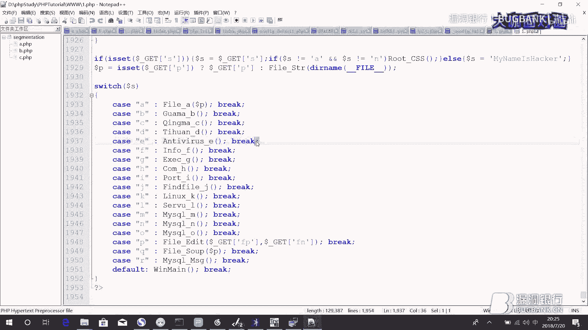

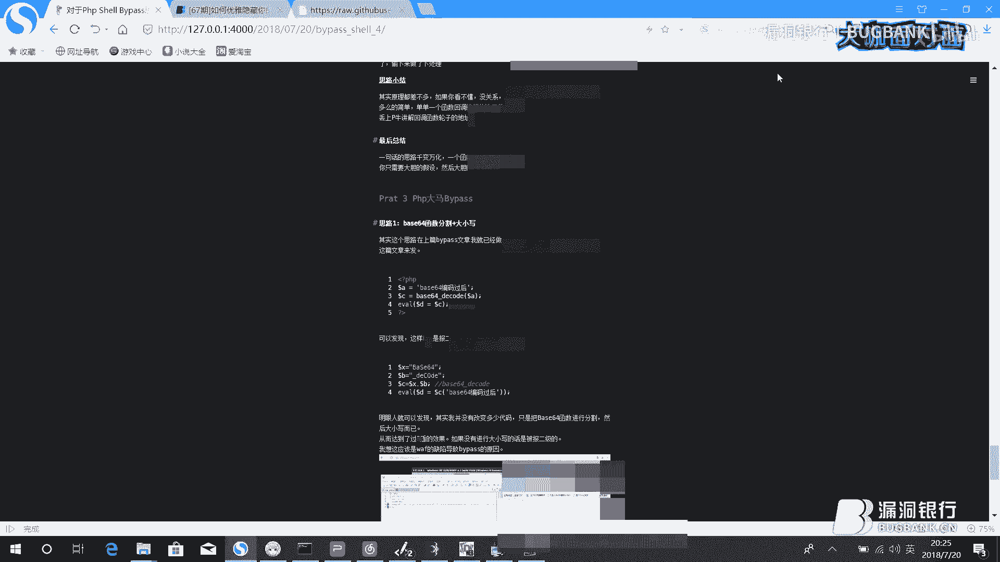

嗯，咱们去一个在线的一个bsase6加密的一个东西，把大码给它进行一个加密掉。这里我们要注意的一点就是它不需要有监控。编码。都我呢。嗯。OK这里就是一个贝斯64加密过的，然后咱们去解码它。

OK他这里哦e will。他这里提示的就是它这这里你用了贝斯664的一个解码函数，它这里也会提示就是可疑的email。也就是说它这里就算你没有这个email。

它也会提示你贝斯664解码的这个函数的这个加密。也就是说也就是说就算你这里面真的就不是一句话，也不是什么大码，它也会给你拦截掉，给你干掉。所以说我们这里可以采用一种方案，就是大小写加分割。

就是把这么一个贝斯64的函数给它分割出来。那。这里。

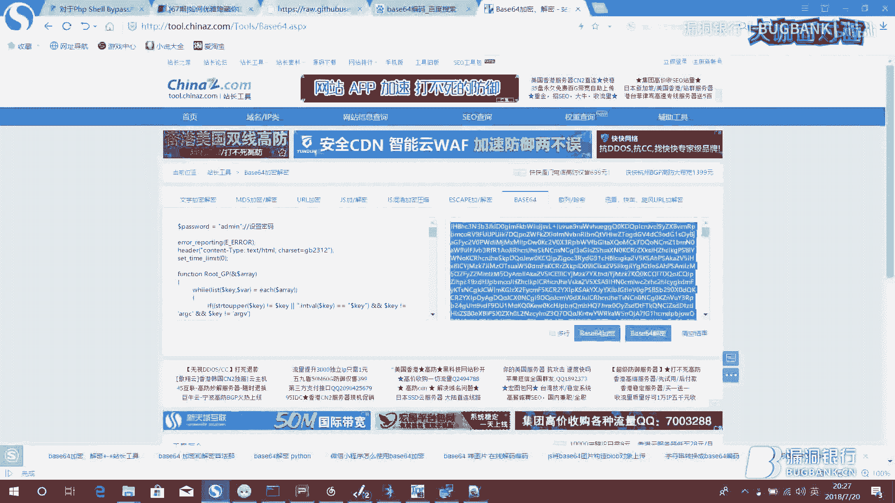

然后就这么一个例子，A464，然后咱们这里一个拼接，对吧？然后咱们在下面一个拼接出来，C等于得X。

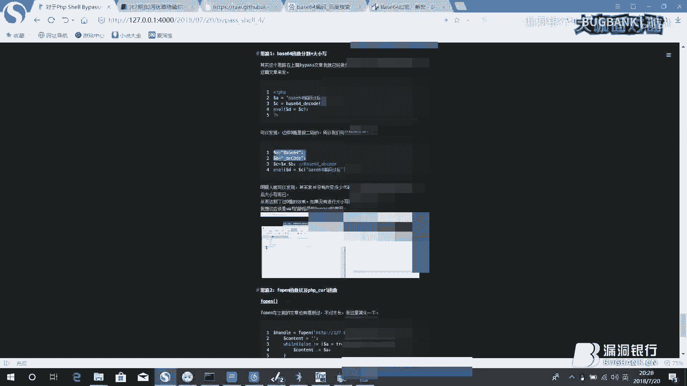

OK那么这样子就会出来一个贝斯64。code这么一个函数，对吧？咱们这里可以看一下。不好意思，没落叔楚。这也就是一个贝斯641扣的，因为它这里面其实对大小写的其实并不是很敏感。对于函数的大小写。

也就是说它是正常可以使用的。比如说咱们可以看一下。我这里有出现什么符号吗？第11行。真膀了靠。哦，这里咱们不需要去执行他了，不好意思。这里的代码块它是成功的，就是已经就是解出来了。

但是我总感觉好像少了点东西。这边就是一个B464的一个拼接，对不对？然后这边就是用eva去执行它。这里这个do了C也就变了C它就是一个贝464的一个解码函数，对吧？然后它就解码了过后。

就是解码这一段贝斯64编码过后的一个大码，然后在里面进行一个二次赋值，从而让它去进行一个绕过一个。然后同时是可以进行一个执行，对吧？OK然后咱们这里访问是可以成功的执行的，然后咱们查一下看一下。

咱们把它拖出来了。因为这样子的话，他会。很占用一些速度。OK然后他这里检测文件一对吧？然后但是他是没有进行一个。查沙的。然后咱们可以看一下这里面的代码，也就是说是我们刚刚的代码。

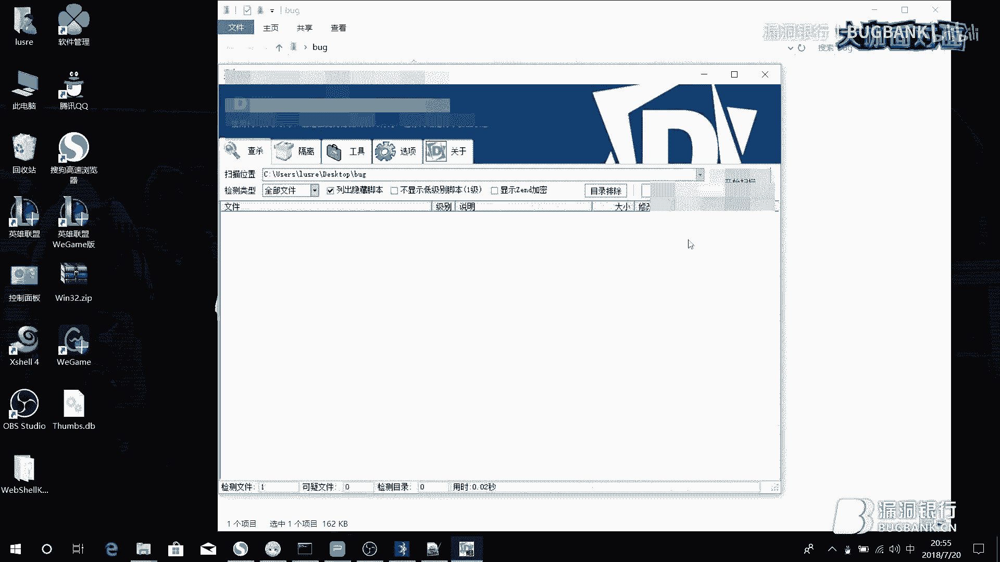

然后还有一种思这种思路，它其实是查杀其实已经过了，能过查杀了。但是检测的话，其实理论上来讲过不过，其实我也不是很清楚。因为我没有去尝试过，然后咱们可以让它去处理。

让他去达到过一个就是拦截跟wa就那种查杀。然后这里我当时是提到一个就是用一个F open，对吧？这个函数，它去远程获取那么一个T叉T那么一个tT文件，然后去把它存储到一个变量里面去。

然后再用一个去执行它，这种东西你们可能会说它是有一个需求的，就是它需要开启一个特定的一个东西。啊，但是在我自己的测试下，在起码在实战当中啊，我利用这种方式，我是从来没有碰到过关于不能使用的效果。

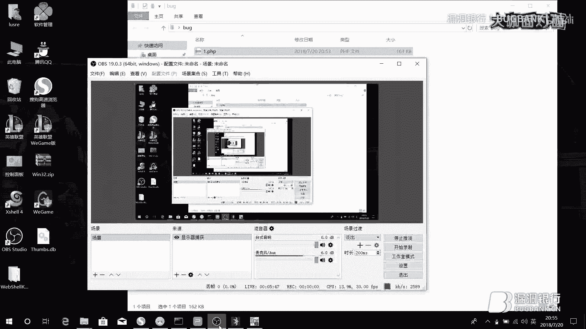

也在实战当中是成功的可以绕过阿里云知道创宇盾以及那个WTS和安全狗啊，360的也有绕过的。然后这里我们去给他就是去了解一下啊，咱们从代码层面上面去讲，就是它是怎样去做的。

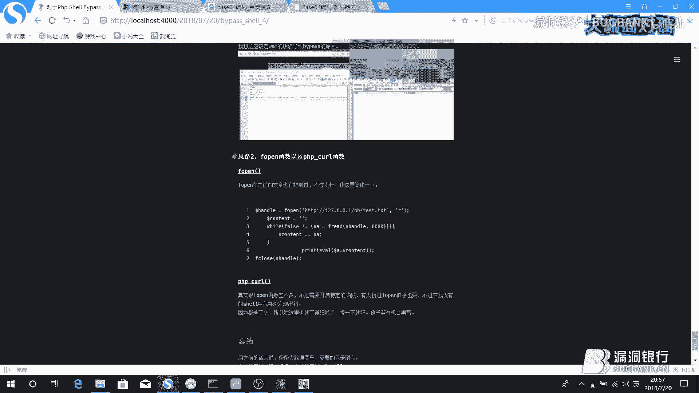

首先F open这个函数它是什么？它是去打开，对吧？咱们这就是去打开U2U2L，对不对？那么我们这里先创建一个tXT，对吧？在当前目录下。OK然后咱们去把我们的大码对吧？存储在。

这里面当然是监控号这种东西是不需要的。然后咱们在HTTP，因为它这里是可以用HTTP的，但是我这里是用ho对吧？也就是说本地的，但是这种是无关紧要的，你可以把这个就是换为你放后门的地址。

甚至你可以用Gup，但gup我没试过，这是一个朋友给我提了。首先然后这里建立一个变量，然后这里就用will去获取它。然后就请求它，然后就获取把它的值全部存储到这里面去，咱们可以print一下。

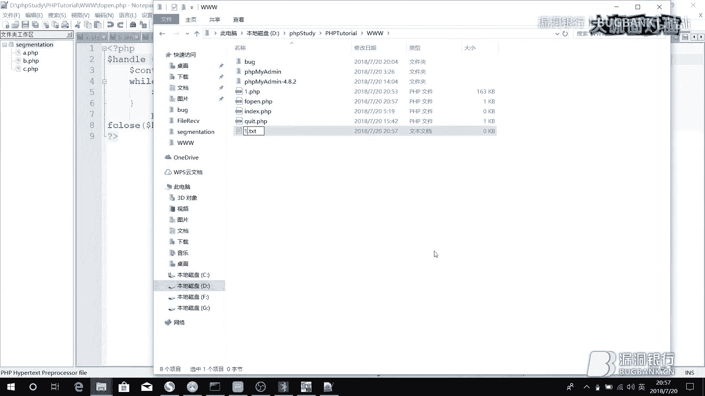

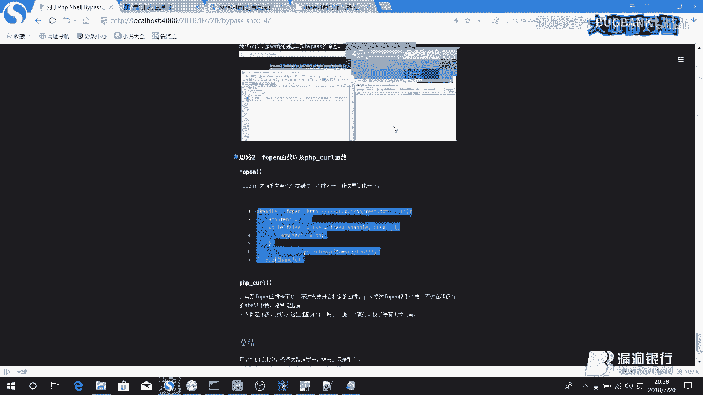

Pnt。咱们输出一下，就是其实可以发现他这里面的。其实是已经也就是说他就远程的就已经获取过来了。B思。OK他这样子就成功的就是已经把它里面的内容获取出来了。这里面有PH的代码，也有它已经小的就是前端。

对不对？咱们也就是说它是已经就是咱们可以变相的理解为它这个变量，就是我们的大码的代码。然后我们可以直接用eva去执行它这么一个大码eva去执行它。

然后让它成功就是把这么一个大码从远程获取那里面的那些代码块在这本地上面去执行它。OK咱们可以尝试一下。那这样子咱们就成功的就是进行一个代，把它的代码块执行成功了。也就是说他这就已经是个大码了，对吧？

可以正常的利用管理文件之类的啊。这里面咱们需要注意的点就是他这样子肯定是有一个查沙的。

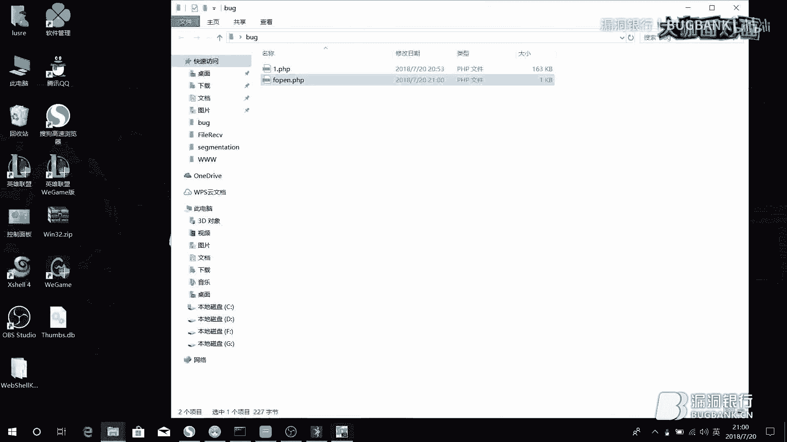

查沙的对吧？为什么？其实主要是在于它的这个规则，它规则有一个很严重的问题，就是什么问题，就是它会拦截掉eve这里面所有的带有就是所有的变量。也就说就算这里面你你啥都没有，就一个eil。

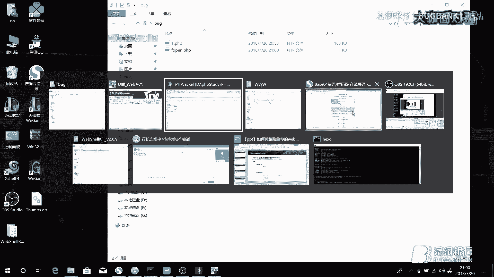

一个变量到了AAA对吧？他也是会给你报二级错啊，报4级。不好意思，也就是说这里面他就会给你报。这种属于误报，但这里面他可能是真实的报。那这种东西怎么过呢？我之前也说了，在里面的第二次复值，再一次复值。

可疑的一面。啊，已知后门。我也是。我也是可以的。可疑的预费。嗯嗯。这样子怎么去处理它呢？可以的EM。它里面的，因为它这里面有变量。所以说会被干掉。嗯，怎么去执行这个变量呢？我记得是。怎么做来着？

拼接eil这个其实没有用的，也就是说Sos它也不能用这个两虽然说都是代码执间的函数，但是它只有eil可以用。这里咱们其实可以另外一种方法玩，就是虽然说这个思路就是以前这以前我公开过了。

然后后面被加入就是已知后门了，咱们去处理。现在咱们就是以新的方式去处理这么一个后门嘛，对不对？咱们就算是一个临时的创新嘛，对不对？嗯，咱们之己上一波不是讲到了关于贝斯6欧斯的一个加密嘛。

关于一个贝斯6斯的加密。咱们把它代码块。加密了。咱们就其实不用加逼多，咱们就加密这么点。然后咱们再把这里。然后咱们再执行他，对吧？Cd。不想这么麻烦。哦，这里是位。哦，可以了。啊，对，这样就可以了。

可能很多人不理解为什么我要把原先的代码就是在这样子弄。那这样子跟第一个方法有什么区别啊？就是它的区别在于什么呢？就是它这里面小是其一，短小是其一。其次就是它这里面的代码块，它其实是不会被拦截。

就是拦截内容的。因为它是远程获取出来的。所以说他是不会被拦截内容的。其次就是怎么说呢？就是他我们这里，因为他这里是干掉这里面的这个email，我也不知道为什么。

他会突然间会是这样杀这样子不杀杀下面这个我也不知道，但这样子起码咱们过了，对不对？也就是说咱们已经成功执行了。也就是说我们大不了就是代码执行里面再包含一个代码执行吧，这是一个。youve包含一个eve。

这样子。差不多就是这么一个意思。然后这样子是可以成功的就是绕过一个。查杀的呃，我这里就是没有环境去重新去装一个对吧？之类的东西。按嗯你们可以用最简单的就是那做一个测试，用同一个思路。

就是你把一个大码过一个就是一个完整的大码进行一个编码加密过后，然后查杀没有被查杀了。那你会发现你其实你请求的时候，他会给你拦截掉。啊，就这样子，然后用第二个思路的话，他是不会被查杀的。

我记得我当时这里是有一些。

有一些截图的。

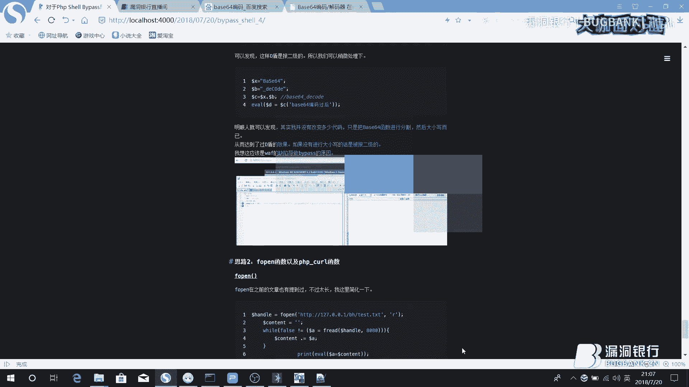

啊，不好意思，图没了。OK然后咱们讲下一个板块。第三个板块优雅的隐藏你的weer shield。首先咱们就是要对权权限这种东西要有一个一定的理解，就是你一个就是web shell的一个。

Quanxian。和一个服务器的一个权限，对吧？在外包需权限里面，你就如何去隐藏隐藏这么一个外外包需要呢？其实咱们可以去通过它的CMS啊，例如对吧？DD呀，对不对？其实DED它有一个方法。

就是他把它的eel重新进行一个封装里面进行封装，你可以调那个方法来用，对吧？不过这种东西，人家下也可以，要么就是一些其他的我这里用1个P埋的密啊，因为其他东西我最近不是很有时间去做一个审计。

也就是说去通读它的源码，因为没有通读的话，所以说很难去做到一个就是哪里可以调用，哪里不可以调用之类的东西。然后就是我们利用就是最近报出的CV201812613，对吧？我其实我们可以通过修改它的一些需求。

让它成为一个就是前台的一个文件包含，咱们举个例子，就是你前台有一个这个漏洞它是后台的文件包含嘛，对不对？我们让他达到前台的文件包含，并且让它的漏洞要求，没有这么的复杂，O咱们打开埋的面。

首先咱们看它的index。OK这里就是文件包含的一个地方。咱们其实它这个要求很复杂，对不对？但是我我们可以把它简便化，就是它这里是需要因为是用的语，就是你要需要满足所有的要求，他才会给你进到一扣的。

也就是说我们其实可以给它就是把它改一下。从它的语把它改为或或者。就改为或者。改成货。也就是说我们这里不需要过多的去了解它这里面有什么东西，咱们不需要了解，只知道我们需要满足一个要求就OK了。

例如咱们第一个要求。判断这个参数里面它的值是否为空，我们只需要随便传一个参，对吧？咱们就可以进到incode的这里面去。但是它你修改这里，它依旧是后台的，我们需要去更改它的第二个文件。

让它变成一个前台的。首先libs因为你拿到了一个外shop买scle的一个账号密码。咱们可以把它的账号密码写到它的配置里面去。这是买so狗的，它得有一个验证方式。当时正在打个记号。对。

在这里它这里有4种选择可以使用config HTTPcoiecoookie也就是说它获取一个coookie来进行一个验证。然后config它就是通过获取它这里面默认的一个配置，比如这里。

咱们就是把他的密码给填上，因为对于权限要求不是很高，他不一定要入的，你可以随便给他一个用户。也就是说你只需要你拿到了微博效果后，你可以去读取它的配置文件，得到他的一个密码，对吧？

一个myql的账号密码把它丢到这里面去，就OK了。然后你在这里把它改为一个fi。也就是说你这样子是可以不需要进行一个登录。然后就可以去获取一个。-408。哎，我用我之前的那个版本吧。

我之前那个版本是老版本，没有文件包含，但意思是这个意思。因为这个P埋 me这个版本。这个文这一堆文件，他是校长办公室里面A师傅，他给我的，他跟我说他有改过，然后我也不知道他改到哪，但是用法是一样的对吧？

因为他这里是个文件包含嘛，咱么文件包含，用我的那个版本，它是没有文件包含，但是他是打开文件。他不能跳，但是我们这里就是分享一下它的利用吧。它具体复现的话，可以小伙伴可以到时候自己去复现一下。

然后有不理解的可以跟我说一下。在这里我这边的是它是打开一个文件，它这里也是与用的同样的需求。不过它在4。8。3点版本里面，它是进行一个包含。我这里是打开这个文件。也就是说其实实际上它是没有多大意义。

但是在于4。8。3的版本里面，它是一个文件包含。文件包含里面可以用伪协议之类的进行一个代码执行，对吧？这东西，然后我这里我就拿这个举个例子嘛，因为我这里过一下验证，咱们就绕过验证就行了。

然后这里config一个de，就默认这里，然后他这里有个。他这里也就是说。这里咱们可以直接输入confi，对吧？然后咱们去访问它。这样子它就可以默认的进到里面来。

也就是说我们可以直接在这里面进行一个代码执行了。因为我们已经进到里面来了。但是如果你是coki的话，你需要输入一个账号密码。但是如果你是confi的话，就不需要。这能理解吗？

也就是说我们只我们只需要把它的验证稍微改一下，就是把它的co改为fi。但是如果咱们要为了避免管理员，就是很容易的去发现它，就是发现东西被改过了。咱们就是可以去给他加一个小小的一个验证。

咱们判断下咱们浏览器判断为它的us头为特定的。我之前在有出过一个题目就是判断他的HP的一个头，咱们可以在这里把它改为自己伪造一个头在这验证它，然后让他就是当如果不是头没有满足的话。

它的这里面就复值为如果他这里面满足为这个的话，他的复值就为对吧？也就是说因为这里我的我的这里面它是一个啊这是一个谷歌了。所以说我这里它是可以直接进来了。Can你。这是。点PP。哦，我知道了。没改好。

这样子就可以了。咱们可以输出一下。对吧。因为我这里刚刚可以有人看得见的话，我这里有个字符串，对不对？因为它这里面或许就是你这一段UZA头里面的值里面只要有这一段字符串，它就会把它复制为confi。

如果没有，他就给他复制为co。也就是说我这里是火狐浏览器，我那个UZA头里面有这个字符串，所以说我是可以直接进来的。但是用火狐的话，没有那个值，是不可以进来的。也就是说我根本就是不能登录。

但是如果我去掉这里这个验证，也就是说你这种东西验证是为了防止什么呢？防止管理员，他如果没有你特殊的密钥的话，当然他可以看源代码，不过这种东西不不是很重要，没有谁会莫名其妙的去无缘无故的去。

看一下这种东西，因为他没有感觉到不对劲，这其实没有什么好发现的，这里面也没有什么你所谓的那种一句话，也没有什么所谓的那码，就是有着本身的一种漏洞。但是这种东西你可以给他自己加，因为这种是针对4。8。3。

还有因为其实就是拿我之前的那个版本来说，你也可以给他改一下，就是改就行了。一样的，这样子就O了。然后咱们在这里咱们直接给他加一个关于文件包含的话，大家可能需要自己去找一下资料了。我这里就不多说了。

这不是我们之前的内容，我这里写了1个1点对吧？因为我说了，我这边是直接打开的，不是包含的。所以说我这里我就举个例子，打开了这个1。

稍等一下。

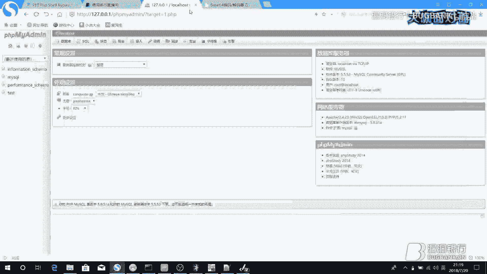

我知道了。

那这样子就可以成功的造成一个。假设造成一个成功的文件包含，因为我这个是老版本的，它没有文件包含，它只是打开这个文件。用新版本的话，它是可以造成一个文件包含。嗯，如果他有开起特定的东西的话。

你是可以成功的进行一个代码执行。然后其他东西跟之前的一其实差不多。你可以直接传一张图片过去包含它一样的。通过日志审查可以发现，那是其他的东西，好吧。其实很多站点，他的站长他没有你想象的这么机智。

但也没有你想象的这么辣这么这么这么逗逼。他可能不会去追究这种东西，但有时候他会恰恰有些站长他就会很纠结这种东西。好吧，然后咱们这是关于P训埋的密，就是一个留wesh的方法，对不对？思路不算很强。啊。

希望大家有点见谅，好吧。然后接下来是关于一些服务器的对吧？因为你拥有信有权限，你可能会有些就是已经提下来了。然后接下来就是关于拥有服务器权限的。首先咱们看这个APPRB对吧？

加S加H就是去把它文件做一个隐藏，让他在你的那个根目录下面是不可见的。后面的这些思路啊，我声明一下，就是这这些思路是我在一个杏安之路这个公众号上面是看到的思路啊，我这边只是做一个抛砖引玉分享一下。

其实本来我自己有些思路的。不过赖于环境问题崩了，然后我没有分享出来，后面的东西我可能会写文章公开出来了。他这个东西就是隐藏一个文件，咱们举个例子，就是这里有个index点PHP他去给它进行一个隐藏。

就是把它隐藏起来。

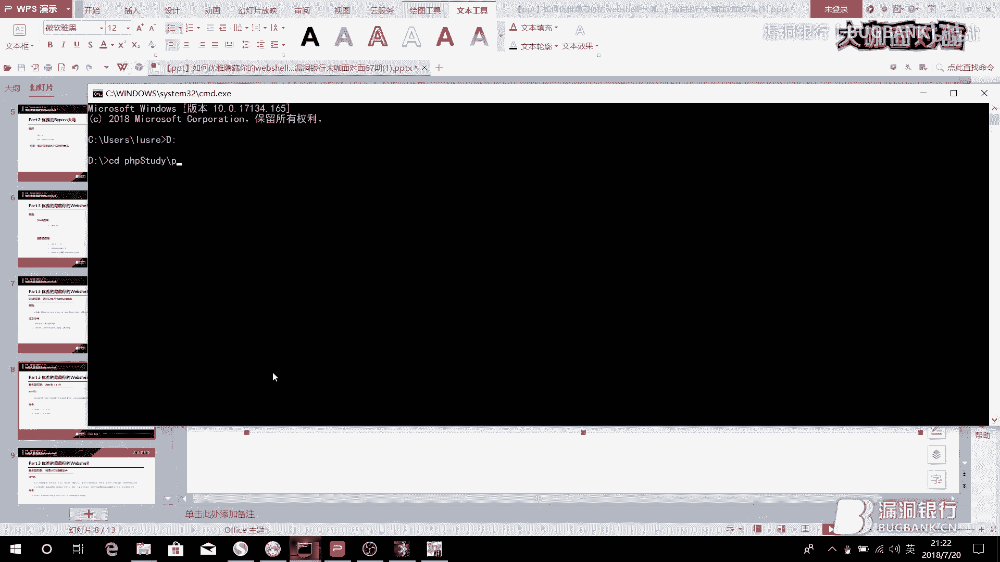

然后去隐藏那个文件，文件名就是index点PAPP。这样子这个文件没有了，其实这东西很简单，只需要就是去查看它，就是去给他就是查看这里有个隐藏，它这个。显示隐藏的文件。隐藏是隐藏起来的。

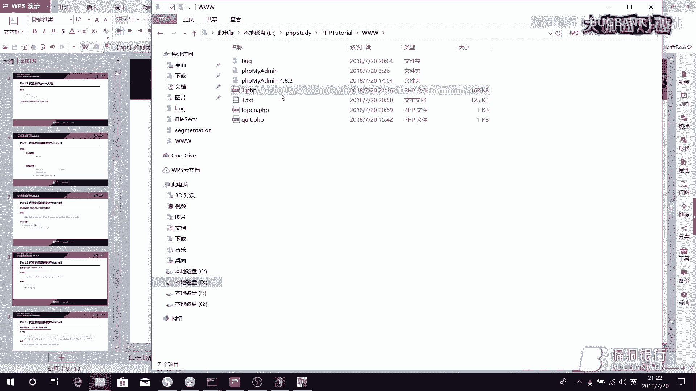

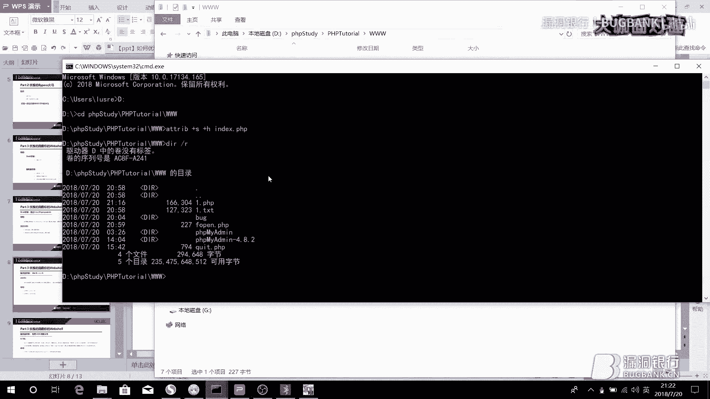

执行是还可以成功执行的，它作为了一个隐藏，就是把它在目录当中隐藏起来了。

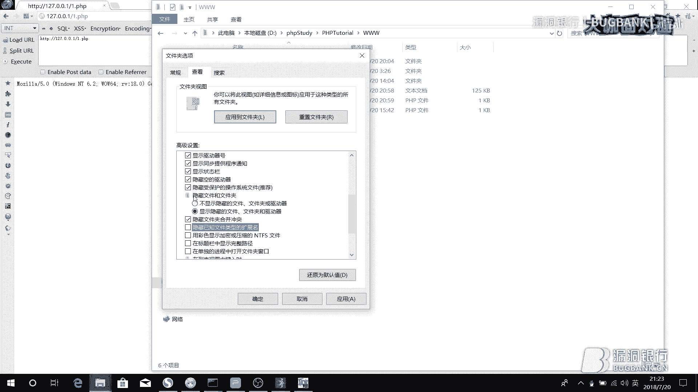

就是在你现在是不可见的了。然后其实就是用ADS隐藏文件，其实就是它是作为一个记主，就是咱们可以把它理解一个父子。首先有一个主文件，例如咱们这里有一个bug，对不对？在这里面咱们创建两个文件。

index点PHP这里是咱们可以把它理解为是一个副文件，咱们可以通过它，然后去隐藏一个就是子文件，就是把它的这个子文件就是。寄生在它的这个副文件里面上去，咱们例如可以这样子。

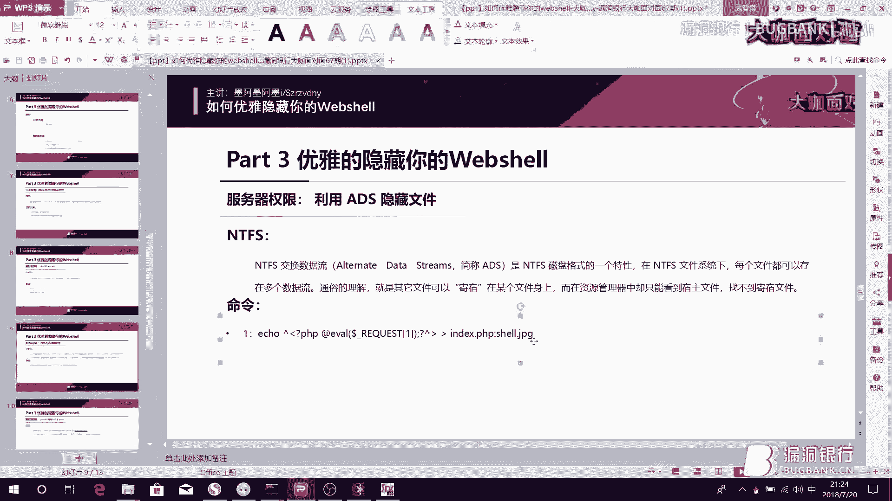

这样子是不可见的对吧？但是咱们可以看见DR杠R的话，咱们他是可以看见有这么一个文件。

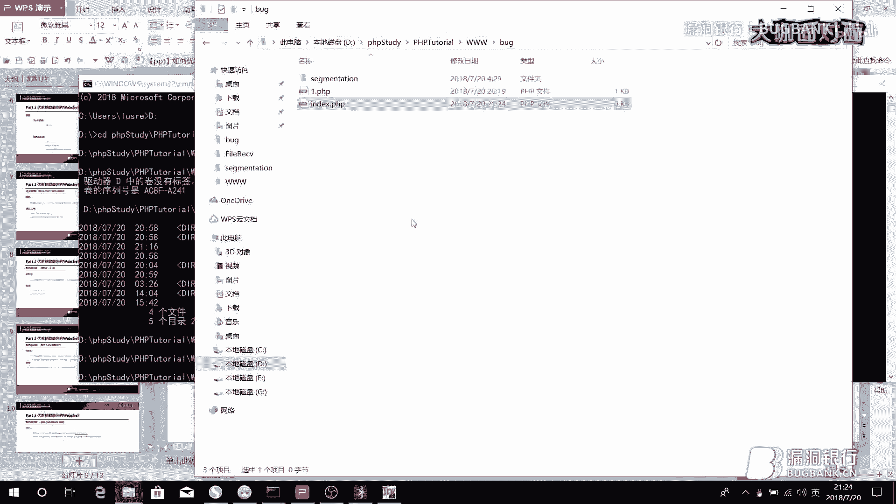

不好意思。为什么我重启一下？

权是问题了。他这里有一个index。

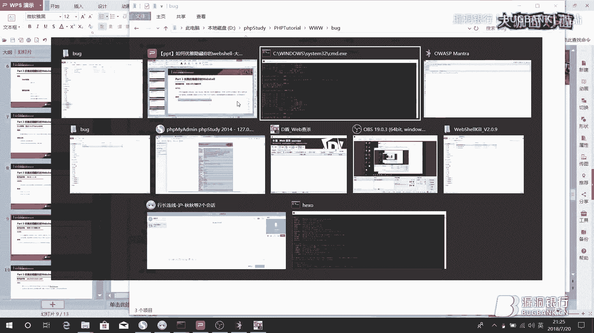

点PAPP，然后有个效，咱们可以用通过t。直接去编辑它，对不对？可以看一下。Notote。はい。都这个时间。咱们可以通过note pad去打开它，咱们可以看见它这里有有这么一个代码，对不对？

然后再通过一个文件包含，然后就可以了。也就是说咱们再可以通过结合之之前在CMS上面的1个PHP直接就是把它的值就是复为这个。

寄生的这么一个文件上面去就可以成功的进行一个打开，就这么一个一句话。那么这样子它是又不是很容易可以看到的。接下来就讲下一个思路，就是PHINI它里面有一个incode的paser，它是一个目录。

咱们其实可以通过e口给它输出一下。

可以看见它这里的默认，它的配置是这里DPHP in的。那么我们这里这种东西我们就是可以在PHPINI里面进行一个修改啊，我这里是一个呃。不好意思，PHP。5。2017对吧？那在这里PHPNI里面。

咱们可以搜一下。不好意思，打错了。En called pass passa。就这里它是可以进行一个指定的。咱们也就是说咱们可以把它指定到为一个外包目录，也可以去把它指定为一个其他目录。

然后再我们就可以假设我们这里有一个C盘嘛，C盘。然后指定一下就是PHP。MNC嘛对不对？O然后我们在这里D盘有1个PPHP。安岁。饿了，哎，这东西不可能绕过去，这东西也不存在的，对吧？只需要只要有想。

没有过不去的坎OK然后秋月表姐，我这边讲完了。感谢默文大咖的用心分享。那现在我们还是要到场就进入我们问答环节。大家如果有什么想问的默默呢可以在直播间聊天室里发出问题。那也请默默把他把。

一个直播键打开PPM me配置通过密码这东西就是配置。我这里有个文件啊，在它的label label有个label就是它的配置文件里面。

我这里打开一下。P买的密码对不对？它这个lelRARIES然后它这个config defeat，然后点PEP它这里面有一个就是你如这co，然后在下面大概在212行这里面，它有个us，这里是账号。

然后也就是说呢在和 passwordword的，这里是root。也就是说就是密码，这里它没有规定，你一定要设root，你只需要能连接到买so狗上面就可以了。

嗯，然后在大码执行的时候是否被拦截？通过AF openen的话，是可以不用被拦截的。也就是说你执行的时候，它在里面执行的代码块也不会被拦截。也就是说你在上面执行一个最简单的eil，也是可以不用被拦截的。

然后关于PP埋 me刚刚登录的时候，confi指的是啥？也就是说它这里指的是它的验证方式，它这里分为有4种方法，就是confiHTTP还有一个啊不会读，不好意思，还有一个co，对不对？默认它是走的co。

就是登录过后获取到的coconfi就是指的是他这里配置里面有两个有了你的账号密码，然后他就会默认的去获取这就是从。

这个变量里面去把这账号密码，然后拿去连接。也就是说你访问的时候就不需要去输入什么东西了，然后就可以直接获取了。文件属性修改隐藏了，怎么对这种进行防护，这种东西怎么说呢？有有有它是可以直接显示的。

你隐藏的，也再给它显示呗。嗯，这里我其实也不是很有了解。因为既然都有隐藏的命令，那肯定会有显示的命令，可以显示所有的文件，对吧？呃，是否可以使用ADS隐藏其他文件。进行理由可以啊。

你ADS你可以就是环环相扣嘛，你可以随意你藏嘛，反正就是速度嘛，对不对？啊，文件修改后会显示修改日期，然后可能会被查到啊，修改日期它是可以被更改的。

利用CMS特性真的是一个很好的思路阿帕奇直接登录一句话都没有站长真的很难参到查到很好的攻击手段。但是修改PHPNI这种东西还得提全，然后登录。服务器重新阿发齐吗？呃。

我记得啊就是有些权限它是可以直接修改PHPNI的。然后咱们用个最野蛮粗暴的方法，就直接给他打直接给他打死打重启，这种东西是最野蛮粗暴的。然后就是要么就是我记得在新安之路那边公众号上面。

它是还有一篇还有一个脚本，它是可以直接导让自己的app帕奇重启的。大家可以到时候再去搜一下新安之路的那个公众号去看一下好？然后在linux上面有没有隐藏的方法。

linux下面肯定有的装命令在windows上面有的话，linux上面肯定也是有的，请问啊有个人私发给我，就是嗯对于外检测有什么看法。怎么说呢？外它是其实是一个挺挺强大的一个外查杀工具，对吧？

它的查杀规则其实也是很全面很强大的。但是它设东西嘛，是工具嘛，终究不是人嘛，总会有误报的，对不对？咱们其实就可以抓这种误报的点来对这些然后其实像我之前就说的那个F open的那个函数，对不对？

它虽然说是被加入到已已知后门，对？这种东西理论上来说它是不可能直接就是查叉掉的，查杀掉F open这个函数的，永远不可能查杀掉了。因为很多东西都需要用的。所以说F open这个函数基本上是不会被查掉。

但是我之前的那个代码公开出来的，它直接就加到了规则库里面去，然后匹配一下，然后就出现了。那个椅这后门这种东西。有小伙伴说，之前遇到写PHP死循环。

写文件的 shell在link可以在在windows不行，一直没有解决。其实我感觉PGV死循环这种东西很缺德，我也我一直没有试过这种东西我也不是很理解，很了解。呃，但是这种东西据说反正解决方案是什么？

就是。干掉了，把它把阿发去重启一下，然后重新再写一个，可以尝试一下。嗯，好。问答就到这边吧，后续有问题可以到群里面再交流，或者再找大家讨论。嗯。

今晚的赠书是一本语言类的书籍籍叫Cpri plus第六版中文版。然后这本书呢也是被评价为畅销30余年的C语言，成编程入门教程。那你想获得它呢？请看大咖或者觉得听得认不认真呢？

下面就请大咖来告诉我谁是今晚新运观众吧。我感觉那个问我问我关于。我要不是检测有什么看法的那个很有意思，就那个叫什么燕子双。对，那请这位叫燕子双小伙伴，你可以在今天直播结束后加一下我QQ。

然后找我来兑讲好吗？再次感谢大咖今天的分享，准备的很充分也辛苦了。好，那今天大咖面对面就要和大家说再见了。再次感谢默陌大咖今天准备的内容。如果对你有帮助的话，不要忘记关注默么大咖今后的发展和动态。

当然来，感谢每一位小伙伴的踊跃参与。嗯，欢迎有精神小伙伴能够也来登台直播间整合现有知识，挑战直播演讲，促进共同进步。如果你也想了一展风采的话，可以扫描屏幕中间二维码进行报名。大咖面对面，周五8点见。

我们下周再约吧。😊。

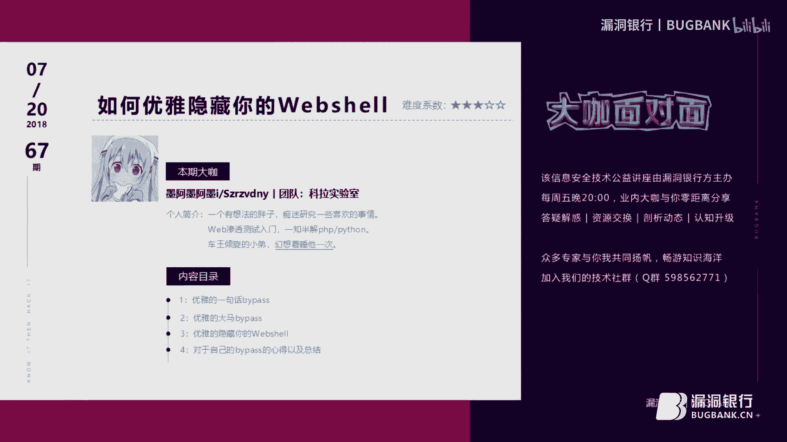

🎼しました？🎼And you regret it。🎼Because once you give。🎼You on the眼。🎼爱爱。🎼一个。Yeah。

