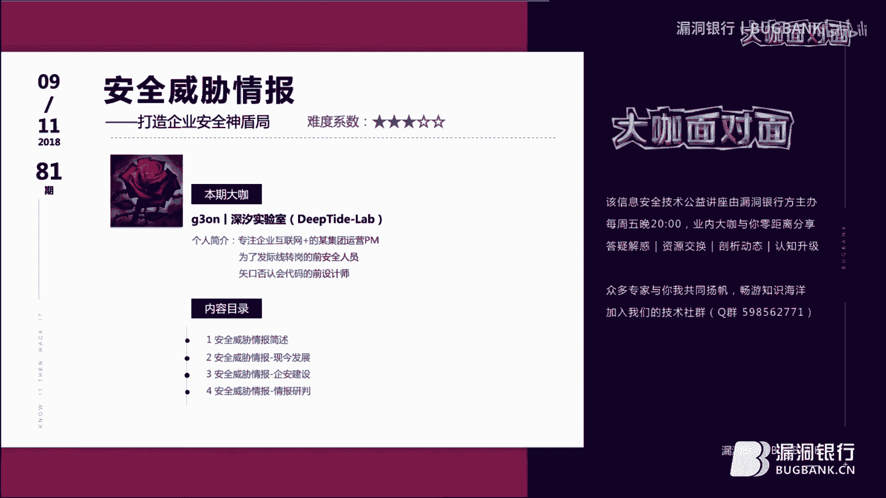
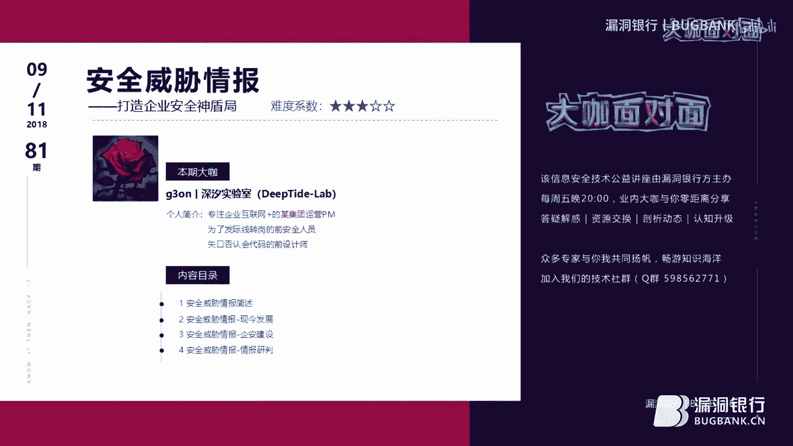

# 漏洞银行丨安全威胁情报-g3on丨咖面81期 - P1：【录屏】安全威胁情报_打造企业安全神盾局-大咖g3on-漏洞银行大咖面对面第81期 - 漏洞银行BUGBANK - BV1bt411m796

为知识而存，因技术而生。小伙伴们晚上好，欢迎登上第81期漏洞银行安全技术直播车大咖面对面。大家好，我是本车的新司机薄荷。也许小伙伴们都知道，再过两天的双十一是购物节和光棍节。

那在当时也就是10月10号发生了一件和安全圈相关的大事。不知道有没有小伙伴了解到呢？就在今年的10月10号，我国第一部关于网络安全的标准。网络安全威胁信息格式规范正式发布了这样一部威胁情报标准的发布。

也为众多的网络安全从业人员揭开了威胁情报的神秘面纱。再次将安全威胁情报这个话题，推上了安全圈的热点。今天我们的大咖吉恩就带来了安全威胁情报，打造企业安全神盾局，这样的一个议题分享。

来自信息实验室的吉恩大咖曾与网安有过多次合作经历，更要为大家分享一些不为人知的网络犯罪增肌手段。由他的。个人简介，我们可以看出，他是一个斜杠青年，做安全搞设计，携代码当运营，当然都要有一套喽。

如此多项潜能的他又对安全行业有着怎样独到的见解呢？让我们共同期待吧。那么在大咖演讲之后呢，还有行长问答环节。大家对大咖所讲的技术内容，有疑问的话，可以登录直播间在聊天区直接提问，问答结束后更有福利环节。

吉恩大咖会选择一名幸运观众。郑宇亲自挑选的书籍情报研究与分析入门。只要参与互动就有机会拿到哦。好了，介绍完毕，下面就有请吉恩大咖开始分享吧。hello，各位漏洞银行的小伙伴们，大家晚上好。

首先感谢漏洞银行提供这个与大家交流学习的平台。也感谢各位白帽子、黑客、安全从业人员和一些网络安全爱好者。在周五这个晚上抽出宝贵时间来倾听我的议题。在这里做一下简单的自我介绍。我叫建。

来自deept的实验室。目前在两家集团任职不同的岗位。主要负责集团信息化建设和产品运营。早期活跃在漏洞银行嗯补贴等漏洞安全平台。是漏洞盒子风之任团队的成员。呃，现在主要在。吐司潜水。

做简单的情报数据分析。偶尔跟实验室成员给某地区晚安提供技术支持。

啊，今天分享安全威胁情报这个议题呢啊源于今年1月份受邀参加第一届互联网安全责任峰会。啊，在大会中听一个大佬讲，威胁情报在企业中的应用，然后当时很有启发。啊，其实近些年来，随着各大安全峰会。

然后白帽子、黑客大会等等一系列信息安全交流大会。然后线下聚会或者沙龙被谈论的异常火热的一个术语，就是威胁情报。那么威胁情报到底是什么意思？啊，或者说他是一种什么概念或者机制。啊，他所具有什么功能？

然后通过今天的议题呃，带大家解开一些威胁情报的误区。这个是今天要讲的主要内容。呃，第一个安全威胁情报结束。主要讲安全威胁情报是什么，让大家有个清晰的了解。啊，形成一个主要大致的概念。第二个。

安全威胁情报的现今发展。让大家通过了解目前当下啊各种安全威胁情报收集平台，进一步深入了解呃安全威胁情报的一些基础核心内容。第3个讲一下安全威胁情报在企业中的种类应用。希望给企业安全人员有所启发。啊。

最后一个是附加的内容啊，情报研判。希望用情报研判的思维和手段来增加安全威胁情报收集分析的多样性。那么我们先从呃第一个内容讲起呃，安全威胁情报简述。在讲什么是安全威胁情报之前，我们要了解两个概念嗯。

第一个。什么是安全情报？啊。在这里我将安全情报啊分类介绍一下。啊，一般而言啊，安全情报可以分为。思类。我们可以从这四类中了解啊什么叫做安全情报。啊，第一类是。资产情报啊，第二类是事件情报。

第三个是漏洞情报。第四个也就是我们后面要讲的威胁情报。啊，我们对这四大类简单的举一些例子，然后方便大家去啊了解一下啊。第一个资产情报。那什么是？资产情报呢啊一般来说啊资产情报。可以理解为呃内部情报。

也就是基础数据情报。比如说他来自于你企业自身的呃数据。啊，比如说sock啊sim系统数据啊，还有类似于sowwins啊、日志啊啊告警啊。也就是说，资产情报主要用来确定几方信息资产的。啊。

第二类事件情报呢啊这个可能就是大家接触比较多的。譬如说啊onena cry病毒报道啊啊前不久啊某住房信息泄露事件啊。也就是说，事件情报是对于已经发生的安全事件的报道。第三个漏洞情报。

这个可能是尤其是是做呃外包渗透。测试的一些小伙伴们接触最多的。或者一或者说一些企业安全人员接触最多的。也就是漏洞情报。比如说一些CVE啊。恩哋啊。各种软硬件系统已知或者未知的漏洞啊。啊。

威胁情报啊威胁情报一般来源于啊两个。一个就是Oight，也就是公开的数据。还有一种就是未公开的数据。比如说来自于暗晚啊和嗯一些黑场啊，灰场的一些社区群和一些啊能拿到这些信息的地方。那么通过这。

四大类我们知道啊什么是安全情报。那么我们再了解第二个概念。什么是攻击猿画像？啊，可能大家对画像。这个词啊有点模糊。那我们举个简单的例子啊，譬如说啊大家都比较喜欢用一些搜索引擎，或者说你在呃。

某宝上购物啊，或者说在某个视频网站上去观看电影的时候。你主动去搜索一些呃电影的情节啊，或者说。这个词啊你在下方可以看到啊这个系呃系统或者说这个视频网站会在下面给你推荐类似的一些呃视频。或者说啊。

最近不就是呃过几天不就是双十一了吗？嗯，我们举双十一这个案例来更进一步了解什么是画像。譬如说这个用户。通过啊某宝搜索引擎。去查找一些商品。比如说啊他。查看兰蔻啊、香奈儿等产品。

这个时候啊某宝的后台就会主动或者被动的去收集这个用户的一些相关信息。他通过你购买啊这一类化妆品，他推测啊用户是男是女。然后通过你收件的地址和你购买的物品，它可以推测出你工资多少。然后推测出你现在。

居住在哪里？然后你去啊喜欢用这个。呃，搜索引擎就是某宝搜索引擎，去搜索一些什么呃潮流的衣服呀，嗯哪家品牌店，哪家网红店啊的东西的时候。他可以。呃，推测出你喜欢什么东西，也就是说啊。

搜索引擎对你在互联网上留下的种种数据。进行收集，然后进行分析。打你。生成一个画像，并且。在这个画像上面贴上了一系列的标签。这样的话，搜索引擎就会比较精准的对你这个用户进行分析和精准营销。

这就是说为什么各类APP啊，它会自动的给你推荐你的锁号。同样的啊。威胁员，也就是攻击员画像，也是这个道理。通过前面四大类。啊，你所收收集到的一些信息。你可以通过。这些信息你可以知道他这个。攻击的能力啊。

有多大？他这个攻击的源地址，或者说原目标，它可能的属地信息是哪里？然后通过他攻击的方式，你可以。嗯，推测出他的攻击习惯，然后将这个攻击生成攻击原画像。那么我们可以通过啊前面两个了解。

第一个啊安全情报是什么？第二个公击员画像。我们可以进一步去了解什么是安全威胁情报。这里有两个小对话。第一个来自于free buff的一个小伙伴讲的威胁情报，就是你社工信息库的对撞。

还有就是啊你抓取了一个木马活动。这个就是情报啊，第二个截取子。吐司的一个小伙伴讲了啊威胁情貌就是加N多的群。还有你企业还一些监控系统上面的数据。那么我们综合前面所讲的，加上这两个小伙伴讲的。

我们通过两个比较很出名的安全威胁情报组织给出的定义。比如说sins讲的安全威胁情报是针对安全威胁威胁者。还有一些危害指标用来评估应用的数据集。简单来说，他就是。啊，所有情报。进行收集。呃。

一个呃大数据库，或者说也就是一个大数据。而exside讲了说网络威胁情报是关于已经收集分析。呃，其动机的目的手段用来帮助所有安全。业务级别的或者说业务员工用来保护企业核心资产的知识。

简单来说就是说呃这个情报是已经经过收集分析处理过的，然后用来帮助你呃提高企业核心的呃核心安全的一个能力手段。那么其实我们总而言之来说，就是加上前面的公击员画像的分析啊啊安全情报的几大类别啊。

包括啊这两个组织的一些。啊，总结啊，其实我们可以。知道啊安全威胁情报其实就是。将已经分析过的啊威胁数据。加入到你们sims系统当中，用来提高你们企业的安全保障。那么这个就是。安全威胁情报。啊。

可能就是说呃从正面上来讲，安全威胁情报，一些小伙伴可能还是比较呃理解有点吃力。那么我们从安全威胁情报的误区反过来。来推推论什么叫做啊安全威胁情报。那么第一个比较常见的。呃。

安全威胁情报的误区就是第一个漏洞情报就是威胁情报。其实嗯或者这样说吧。85%的拥有。安全部门的企业。其实都喜欢加漏洞情报或者说事件情报。当做威胁情报。其实我们以往也将漏洞看作啊唯一的威胁信息安全的途径。

啊实际上威胁企业的有态多方面了啊，漏洞只是其中之一。比如说还有啊钓鱼邮件啊。员工的个人信息啊，还有他的密码习惯啊。因为目前许多漏洞并非直接来源于IT资产的漏洞。而是企业员工个人信息。

因为他通过一些社工手段。啊，就可以通过员工与企业相关的邮箱啊、OA啊、VPN账号啊就可以入侵，然后再入侵到企业服务器。嗯，漏洞情报其实是一个知己，是一个了解内部情况啊，排查内部问题的过程。

而威胁情报是知彼。为企业提供对方可能的攻击地址手段的提供一些啊对方攻击的方法的一些手段。他是主要用来提前帮助企业做好威胁反放的。而且通过前面安全情报啊四大类，我们可以看看得出来啊。

漏洞情报与威胁情报是平行关系啊，两者不存在从属关系，两者都属于安全情报。然后第二个误区就是呃威胁信息。等于威胁情报。其实从刚才那些简单的一些信息收集方面，我们可以知道现在互联网这么发达。

我们无论是从开放资源抓取，或者说从暗网上面获取信息都比较简单，而且有非常多大量的信息可以提供收集。但是威胁情报不仅仅是收集情报啊，或者说收集数据。它还包括了处理和分析啊，威胁情报啊主要的核心其实。

是在于情报分析。因为情报分析可以确保信息评估的精准度，还相关性，还有时效性和完整性。你是需要信息来产生情报。然而信息本身并不是情报，因为信息有时候会将嗯企业安全人员啊，或者说决策层啊指向一个错误的方向。

而情报就不是情报，他是已经经过处理和分析了，他可以协助你规划，并且提供一个正确的方向。这就是说啊其实威胁信息不等同于威胁情报。那么第三个也就是比较。嗯，最应该说是最常见的一个误区。

就是说威胁情报就是信息收集。因为我们前面讲了那么多，其实大家。嗯，最能。最或者说最能听懂的一个核心就是说啊威胁情报需要大量的数据。那么就是说啊威胁情报就是信息收集，其实并不是这样的。

因为信息收集只是你构成威胁情报的第一步。因为真正的威胁情报，除了呃分析出来过后，我们要去进行执行。因为一个威胁情报，我们没有对他进行嗯，或者说一个威胁情报没有可操作性的话。

那么这个情报就可能没有什么用处。或者说目前为止对于你企业没有什么用处。因为你这个情报没办法给你。企业带来一些业务利益。然后没办法给你的一些啊sim啊，或者说sock。提供。比较有利的一些帮助。

所以说你信息收集过来，收集了很多一大堆，无论是真或者是假。他们这些信息对你一点用处都没有。所以说通过这个几个误区，我们可以进一步加深什么是安全威胁情报。啊，那么我们接下来讲呃安全威胁情报的现金发展。

其实安全威胁情报啊，也或者说从大的方面来讲，安全情报最早应该是来源于美国，应该就是911事件过后。然后安全威险情报也就是美国一些比较知名的安全公司与国防呃国土安全局。达成了一些协议吧。

他们之间做了一些关于呃安全威胁情报的分享，然后制定了一系列的一些呃标准。因为情报它是一个很宽泛的概念，然后安全情报也是一样。而且。一些组织啊或者行业啊。

他们对安全情报或者说安全卫胁情报看法和决策都不一样。所以说呃安全情报是因人而异的，到目前为止，它没有一个统一的标准。但是为了方便形式，其实还是有有一些可以参照的规则。譬如说国外的s box啊。呃。

takes还有zara等一些规则。而我们国内呢也就是前不久呃，除了六一网络安全法之后，也就是今年10月10号，然后推出的第一部关于网络安全的标准，就是网络安全威胁信息格式规范。这是一部关于啊威胁情报。

呃，国内威胁情报标准的一个啊规则。啊。这是比较早的呃行业规则。其实我们在没有做这些规则之前。一些企业安全人员就说具备安全意识。还一些呃人员其实也在做着啊这些安全威胁情报收集的工作。比如说很常见的。就是。

啊，渗透到啊黑客啊诈骗犯的社区或者群里面。比如说我的话，我就在一些黑场啊，会场的群里面，还有一些什么，尤其是啊学外部渗透，一些小伙伴经常泡一些。泡在那个什么渗透测试群啊，叉叉叉。嗯。

网络就是叉叉叉黑客群啊，这这里面。还有一些呢就是说。在漏洞平台、漏洞库或者安全社区里面进行交流的。比如说呃大家在漏洞银行啊进行信息交流啊，或者去。看一些，比如说C8跟那些漏洞库啊，我们去观看最新的啊。

一些漏洞。还有的就是呃他们对一些漏洞进行针对性的研究。这是比较常见的。几种收集威胁情报的方法。那么呢，其实呃现在。信息数据比较繁杂，然后我们从中检索也比较困难，而且最主要就是。呃，互联网发展速度非常快。

我们有时候跟踪信息比较慢。其实呃最主要一点就是。一些企业对于建设呃威胁情报系统。可能就是说觉得安全情报。实施系统啊成本比较高，还有就是领导不太重视。那么我们就可以借助国内发展比较好的平台。

去跟踪或者获取。这些情报。譬如说国内比较出名的啊微步啊，360威胁情报中心啊，no sec大数据平台啊，还有啊。我比较喜欢的监控黑场，灰场的威胁猎人啊。

还有国外的啊IBM的X force ex change兆这个平台啊。因为这些平台啊呃有大量的专业的情报人员提供情报，他们这些情报都是经过分析的。然后这些平台通过大数据啊、机器学习啊。

配合人工的方式进行捕获关联、可视化这些信息，并且分析取证这些啊数据。所以说啊我们这些企业安全人员，尤其是。不具备呃，或者说没有相应匹配的安全威胁情报系统的人。

可以用这些平台去缩短你检测和响应所花费的时间。然后可以将这些平台提供的API呀呃扩展到你们当前的一些安全工具当中。这样的话可以帮助我们观察嗯或者说检查到那些我们观察不到的威胁细节。

那么我们通过了解安全威胁情报。是什么概念和知道我们一些常规的做法，还有一些比较著名的一些呃第三方安全平台的时候，我们要将。这些安全卫些情报。应用到你企业的安全建设当中去。

那么首先就是说你企业为什么需要威胁情报？因为最常见的就是啊威胁情报。他提供了培养公司整体网络风险感知的一个指南。也就是说他可以让你呃企业有个态势感知的程度。第二个就是威胁情报。

驱动公司安全建设方向和降低灾损危害。因为说威胁情报是一个知彼的呃手段，他可以提前。帮帮助你啊去预测你企业可能遭受到伤害。所以说我们可以用威胁情报提前降低。你如果一旦被攻击了。

你可以提前去降低你遭受到攻击的损害程度。第三个也就是说在。第一第二个的基础上，除了态势感知和提前防范之后，我们用威胁情报还可以进行反手反击。因为我们可以通过攻击猿画像进行溯源。这样的话，你威胁情报。

的效果不仅仅就是说啊我。人家是谁是什么人，用了什么手段攻击了我？然后而且我能通过。生成的公击员画像。去反追你。这才是威胁情报在企业中比较一个好的利用。那么说其实大家最关心的就是说啊我是做外包渗透的。

我是一个白帽子。我可能说啊我是一个普通的企业安全人员。我可能就是说因为公司不太重视啊情报这一块的工作。那么我也想成为这种情报员这种工作。那么我们。可以通过这几个方面。来提高。

或者说来转换自己在公司的一些职能。啊，第一个就是说啊情报员。拥有基本的保密意识和反射工能力。而且善用搜索引擎和社工技术来收集信息。因为其实。大部分情况下。我们作为情报员，最用到最多的就是社工技术。

因为它可以针对个人的常用密码结构，然后分析延伸，然后对这个个人邮箱的安全防护进行突破呀。等等。而且作为情报分析员或者说情报员。你首先具备反射工能力，这样的话。可以防止。

别的攻击者通过社交类欺骗啊等等手段。来施工你的信息。第二个就是可能用到一些技术，比如说热点制作啊，或者啊钓鱼啊，还有最常用的渗透入侵等技术手段去获取更高级的更具有敏感的一些信息。这个相信。啊。

大部分白帽子黑客或者企业安全人员都具备。这几个啊能力。那么你想成为情报员。你还要做的一个事情就是因为威胁情报它是一个它的核心就是情报分析。那么你。作为情报员的话，你就要从海量数据中。筛选分析真假数据。

然后去生成画像。你可以去使用一些基于买tago。等工具啊智能化，然后数据整合和分析。然后通过分析和统计识别出啊真假数据。然后最后一个可能就是说。呃，比较更高级一点的手段就是战术开发和战略规划。

因为你收集到收集并且分析得到可靠的，或者说是可操作的安全情报的时候。你要短时间内。啊，设计出完善的入侵方案，或者说是呃反入侵策略。这样的话才能作为一个啊高级一点的情报员。那么呃我们。

当你成为一个情报员的时候，我们就可以去啊利用你所学所知道的一些。技术手段去进行。安全情报的第一步信息收集分析啊，信息收集。第一个就是呃alite，也就是公开的数据。我们通过聚合分析法。

从情报圈啊威胁情报平台啊，还有一些共享威胁情报。进行数据的啊采集啊收集，然后采用聚合分析法去分析出可靠的啊或者说有用的情报。第二种就是啊未公开的情报，我们就深入暗网情报区啊。

或者说黑客啊、黑常会场一些社交社区群里面去。第三个就是说如果你精力不够的话。或者说啊。从第三方平台，我们就可以收集到前面两个信息的时候，大致的收集一些对你企业有用的信息的时候。

我们更着重于啊自己的也就是基础这情报。比如说你sim系统啊FICAC啊，还有一些。啊，日志管理器上面一些日志啊等等去收集这些啊威胁情报。也就是整体上来讲，我们从。自家的基础。也就是资产信息上面去收集。

从公开的。比如说呃漏洞事件啊，然后。呃，事件情报啊去收集，还有未公开的，也就是暗晚。然后。黑客黑场这块的从这三个方方向。就可以去收集到你想要的安全情报。那么我们对收集到的情报时候。

我们要必须对它进行一个画像。因为我们通过呃安全情报啊，我们去收集来过后进行分析过后，我们要对它进行贴上标签。因为情报有很多种，我们不可能将每一个情报都当做重要的情报。我们要对它进行呃级别的划分。

我们可以划分为啊。战略级的呀。就说很普通的一些情报。然后我们。再划分为运营级的。那么这个情报可以指导我们企业怎么去运营。还有一种就是最高级别的战术级情报。

一般企业可能会涉及得到的这种战术级情报一般可以上升到呃国家互联网安全的。他主要就是为了解决通过这些情报的。呃，分门别类级别的划分。我们主要就是去解决掉我们呃一些呃防护滞后啊，你响应迟缓啊，还有说啊。

这个情报。是正确的还是假的，产生一些误报这些情况。他整体上而言就是说威胁情报，它是一种知识和能力。他主要就是驱动你企业做更好的决策。那么当我们将这些情报进行分门别类的时候呢，我们就要将这些情报。

在企业中去具体的去应用。譬如说就是刚才讲了呃。战略级的，也就是说策略情报。他就是一些你企业网络安全人员。啊，针对一些啊。常见的危险，比如说s客注入啊，Ddos啊，外包应用程序攻击和网络钓鱼。

也就是基于用户的基于应用程序的一些威胁。然后我们。可以更好的去阻止这些恶意活动的袭击啊，然后提高响应速度的。第二类也就是行动情报。刚才讲的啊，战略级的。啊，可啊是运营起的。这个是需要呃。威胁情报分析师。

他来收集。对手的。就是说嗯已经。不单单是啊别人攻击了，可能是来自于你的竞争对手。类似于呃。呃，商业的那种。竞争的。这个时候需要威胁情报分析师来进行分析。然后收集到。对手的一些技术啊，还有战术。然后。

从而来改变你本身企业的运行环境。然后还有你们企业对威胁员行动的一些部署。这个是上升到运营层面的运营及情报。最后一个就是啊战术级情报战略级的可能就是说啊小到公司级别的，就是公司管理层的。

他可以呃看清这个威胁情报对公司造成的金融啊，还有运营啊，还有信誉的一些网络风险的影响。然后用来驱动呃更好的风险性前瞻决策。啊，上升到大的方面就是国家级的那种网络防护，这是战术级的。

可能说大部分是涉及不到的。然后我们通过呃一个。几个几家平台的案例来演示一下主流的一些。呃，情报收集分析平台。啊，第一个就是啊事件情报或者说啊。漏洞情报收集平台。其实大家在漏洞银行啊。

可以看到一些行展谍报啊，或者说其他的类似于啊。脉搏呀。啊，就没有。那么我们直接去看漏洞平台吧。譬如说呃red queen婚后这个。安全威胁情报系统。我们可以从这个。情报列表中可以看到啊最新的。啊。

安全情报。还有最新的漏洞情报。这个我们可以通过这两个方面。去收集一下，同时跟大家讲一下啊。安全威胁情报没有实时的数据。他的确啊需要数据，但是他这个数据并不是实时的。啊。

我们可以通过类似于啊red king这个平台，可以看到一些呃最新的一些安全情报和漏洞情报。然后。还有一个就是我比较喜欢的啊威胁猎人这个平台它主要提供黑场和灰场的。因为呃它是涉及到业务威胁情报的。

我相信在座的各位来自于企业的。一些安全人员最关心的就是业务安全了。那么他这个平台呢就提供了啊可以感知，或者说收集了一些啊黑产、灰产等涉及到业务的一些安全威险性吧啊，这里我就不登录了。

因为这里面有我们公司大量的一些。啊，数据。然后另外一个我比较。喜欢用的。就是微部。吓。微步这个系统呢。啊，我主。两个比较简单的那个案例。第一个就是啊。从正面上面。处。😔，啊。收集一个情报啊。

我们这里随便找了一家。域名。我们从正面去分析，首先看一下这个啊域名是不是危险域名。然后我们可以看到它的呃域名注册啊，它的子域啊有点类似于啊常见的信息收集。但是我们这里并不是要讲说它的一些常见的域名收集。

而是要讲说我们去监控这个域名，然后把它加入到监控中。呃，因为刚才的啊重新输入了这个域名过后，可能是刚加入到监控，然后导致了这个信息被重置了。啊，但是没关系，我们可以去看一下啊，当你加入这个域名过后。

加入这个域名监控过后，然后一旦这个域名发生一些变化的时候，它会这个平台会将这个监控信息发送到你的个人邮箱当中去啊，我们通过这个邮箱我们可以看到啊这个域名。在什么时间段？啊，进行了子域名的变更。

可以监控得到。然后同样的呢。啊，因为这个实验。啊，是被重置了过后的这是之前被监控下来的信息。就说这个同样这个域名，它这个IP与一个陌生的域名IP挤到了一起。这个时候我们可以通过啊数据监控啊。

通过这个平台。将这个域名。进行分析。看。这个域名是否同样啊是正常的域名。也就是说我们威胁情报收集是相关联的。如果说你威胁情报只是单纯的去收集一个单一的目标的时候，其实它并不能准确的反映整个啊。

事件的关联。我们可以通过啊微步这个平台将你自己的企业。的一些域名啊，或者说一些IP地址啊，加入到监控中，可以随时观看所有云你。可能说你这IP地址被别人强解析了呀。可以去监控这些事件。这样的话。

通过事件关联。你就可以知道你的企业环境到底发生了什么。这是一个从正面。啊，反应的例子。然后一个从侧面反应的例子呢，就是啊有一天我从我们的sck上面去检测到一个比较异常的IP。

然后我们将这个IP放入到呃微步当中进行了分析。然后分析的结果说它是一个钓鱼的。I p。同样的。如果说如果说它仅仅只是1个IP，是就说推测出来，它就是一个恶意的地址。那么首先第一反应就是说将它列入黑名单。

但是我们可以通过可视化。可以观看到他这个IP所相关的域名。啊，因为这个呃IP已经被加入到微步当中了去了，然后他已经被阻止了。所以说你暂时只能看到它的相关域名。同样我们可以通过这1个IP。所相关的域名。

我们也可以加入到黑名单当中去。而且呃因为他这个已经被。列入了黑名单，并且阻止了。所以说我们看不到其他的IP了。啊，因为它可以从1个I恶意IP可以关联到其他的类似的。啊。

恶意IP这样的话我们可以收集到的信息就更加全面。可以说通过这些相关联的IP和域名。收集到了过后，我们进行分析，他们全都是恶意的。这样的话可以加入到我我们的s或者说是呃ISAC，也就是信息共享与分享中心。

或者说呃sim系统当中去。这样的话可以避免缺漏掉哪一个恶意的地址。同时也可以提前的将这些恶意的地址域名啊进行拦截。这样的话可以降低你的啊企业的安全的反应的响应度。

这是通过这两个案例来讲解一下这个平台的应用。那么最后一个就是。啊，附加的内容，情报研判。那么什么是情报研判呢？其实情报研判是属于公安或者说晚安专门。论于。经济犯罪情报侦缉的手段。

因为他主要就是啊准确快速的定位这个经济犯罪的人的画像的。然后我们通过一个老图简单的去看一下。他的手段。啊，其实同样的也是公安系统或者说网安系统，他们有第三方，或者说就是呃国家。

安全机构给他们做了比较强大的呃大数据分析平台。他们可以通过微小的数据。啊，或者说遗漏的呃遗留的信息，他就可以很快速的定位啊这个人的画像是什么样子。就是说如果说我们普通的企业安全人员或者说。

企业不具备这种高效的快速的大数据升级系统的话，我们可以通过使用他们的一些方法。来呃进行情报收集工作。也就是说，在公安或者网安系统当中，他们用的这种手段叫做情报研判。比如说。当你去针对一个目标的时候。

我们可以通过啊我们了解到他的身份身份证号。那么我们可以通过啊身份类。这几类的方法啊，因为啊这个涉及到啊信息的啊侦测比较敏感。不适合在公开的一些啊渠道去讲解。所以说我只能通过简单的。一些举例方式。

来讲解一下情报研判的一些方法。嗯，我们可以通过啊身份证号，通过这些呃机构。去查。或者说你当你知道他的手机号的时候，我们也可以通过这些啊相关联的技术手段去呃完整的去。调查这个呃目标的所有相关信息。啊。

金融类的一般是用在一些啊商业的一些情报收集上面。啊，其实比较感兴趣的就是这个图像类的。因为之前在图司还是在哪个论坛，我有看到啊有个大佬的社工手段，就是通过一张图片，一张合影的那个图片。

他可以他通过以以图搜图啊，还有图片识别图片定位等等各种方法。去加呃那个与。车合影，但是那个人应该是打了马赛克。他通过那个那个人与车的合影，然后去搜索定位到那个地点，然后再通过那个地点。处。

更进一步的去调查到那个人的原来的真实面貌是什么样子的。他是通过这种一点点的信息去关联周围的所有的事件，然后去定位和准确去找出这个人是谁。然后这个呃方法呢有有这些都是啊。比较常见的互联网资源搜索方式。

然后这个老图我会分享出来给大家。啊，简单的。带大家过了一下情报研判。那么其实呃大家也可以清晰的看到，其实情报研判。他也就是。对一个目标。首先进行信息数据的梳理，从身份证号呀，然后还有一些遗留的相关信息。

那我们去收集这个数据，然后进行分析和梳理。然后采采用了呃聚合关联等分析方法，然后挖掘这些数据啊之间关联的规律，然后分析它周边之间的联系，然后生成了一个。啊，方案也就是说生成了一个呃。画像。啊。

讲这个情报研判呢，其实就是希惯通过情报研判这种啊思维或者方式。嘅。企业一些安全人员做一些公防思路上的转变。这才是呃讲附加内容情报研判的主要作用。然后希望大家呃。好好或者说仔细的看一下那个老图。

和去实际去去做一些应用，然后发掘一下啊情报研判给你带来了一些思路变化。然后最后就是通过这一次的分享，然后让大家去正确认识安全威胁情报是什么，然后去培养一下安全威胁情报的思想。其实说了这么多呢。

安全威胁情报。其实就是帮助你识别安全威胁，然后并且做出名字决定的一个知识，或者说能力。他可以啊有效的检测和缓解。那些对企业真正有害的威胁，同时啊建立起积极繁育已被后患的一个过程。然后就是很感谢啊大家。

观看。好，谢谢大家。😊，好的，感谢吉恩大咖的实力分享，相信小伙伴们也都有所收获吧。这次分享吉人大咖在准备的时候就和我们一起沟通，打磨了很多，他私下也是很认真的准备的台本，让我们再次感谢他的无私分享吧。

辛苦了吉恩。😊，嗯，那下面就让我们进入到行导问答环节吧，大家可以在直播间的聊天区进行提问啦。大咖会进行解答。问答环节预计持续10到15分钟，大家抓紧机会可以开始啦。那也请吉恩大咖打开直播间。

其实我感觉不太。😔，啊，比较有点紧张，讲这个。啊，内容。然后我觉得还是通过这个问题来更加详细的去讲一下吧，这样比较好一点。我来翻一下哪些。问题。啊，第一个问题就是说。资产收集有哪些技巧？

其实呢那个资产收集啊一般就是说呃可以通俗来说就是你内部的信息。然后它主要是来自于你一些企业的sck啊，还有sim数据。还有一些啊你公司的，比如说网站有啊网站日志啊，还有你们网络有网络日志啊。

我们可以从日志上。可以去收集，还有一些就是呃一些告警信息，这是资产收集的一些技巧。然后外部安全占安全威胁情包的比重是多少？A。这个怎么说呢？嗯，其实外部安全。跟安全威胁情报其实可以说是有点不太相关的。

아。像外部安全的话，其实大家在这里面做的最多的就是一些渗透。我们可以将呃它归纳为呃漏洞情报。和那个世界情报。呃，如果这样算的话，可以说外部安全。呃，占了安全威胁情报的两个部分。呃。

国外有这样啊国外有这样的平台的。像国外的IBM，它有个。X force exchange这个呃收集平台。嗯嗯。个人感觉的话呃，国外的话还是比较好一点的。对，因为其实在国内啊，就是在上一次参加一个呃。

应该是在今年年初。参加的那个。受邀参加的第一届呃互联网安全责任峰会的时候，当时大家有讲到说国外一些病毒公司。他们内部。就是说各大公司之间其实他们的病毒样本是相互交流的。所以说在国外的话。

他们嗯情报安全威胁情报更是相互分享的。在国内的话，其实。嗯，因为都是商人嘛。可能就是说他们的那些分享。嗯。比较。怎么说呢？就是呃不太愿意分享吧，应该是这样说，因为这个已经涉及到核心竞争力的问题了。

所以说国内与国外的呃平台相比较，我比较偏向于用国外的呃安全威胁情报平台进行收集。啊，这个。有这个问题叫收集一个企业的威胁情报，直接将这个企业的主账域名放到微博上面分析，对吗？然后上面威胁情报啊，首先是。

我今天举这个例子，从两个方面去演示的。第一个就是说把主域名直接放上去分析，这是你针对一个你要啊不应该说是攻击的目标，你想了解的目标，把它放在上面去进行分析。就是简单的啊类有点类似于啊漏扫。

🎼然后我们去发掘他的子域名啊，发去挖掘他的一些IP呀。然后把它放到监控上面去。因为有时候嗯。他这个。嗯，怎么说呢？这个目标啊。一开始的时候，你可能就是说通过漏扫啊，没有发现更多的价值。

但是如果你把它放到啊，譬如说刚才的微部上面去加入到监控。然后他下一次的域名和他的IP地址。呃，发生了变化的时候，你会第一时间收到消息，然后再一次去进行呃常规的渗透测试，这是侧面的。然后呃刚才一个没。

履利成功的反面的就是呃。那个有恶意的那个IP地址。然后放到上面去进行样本分析。然后通过这1个IP地址，你可以关联到所有跟他相关。呃，所发生的一些呃威胁情报。对，上面的威胁情报是其他人收集放放上去的啊。

对的，呃，这是一种收集的方式。就是别人共享的开源共享出来的威胁情报。啊，感觉。😔，安全。威胁情报过于庞大和复杂，如何制能的推？啊，其实这个问题也我觉得问的非常好。因为其实所有做安全威胁情报的时候。啊。

所有人面对的最头疼的问题就是你面对的一些数据实在是太复杂了。而且太多了，最主要的就是你不太清楚哪一个数据是真或者是假。那么你如何去分析呢？一般的话就是我们对这个数据分析的时候，我们可以从那个。叫做。😔。

看一下我们这边是怎么，我们一般呃拿到数据过后啊，就是从它的网络。首先从它的几个。常见的指标进行分析。第一个指标就是网络，它的IP地址啊，它的URL它的域名。然后第二个就是呃它的主机，就是刚才我们。啊。

一直没有实验成功的那个文件哈希啊，还有一些动态链接库啊，还有注册表啊。最后一个还有一个指标，就是呃电子邮件，就是发件人的邮箱啊，还有附件啊链接啊，因为它可能是一些钓鱼攻击。

还有安全威胁情报未来趋势的发展是什么？呃，就目前所来看的话，应该是以后。更偏向于呃机器学习吧，AI这一块的。因为现在啊所谓的安全威胁情报其实是基于大数据的。然后通过大数据挖掘威胁情报。

然后通过大数据分析。威胁情报。然后以后的话就是通过机器学习。啊，和AI这一块的提高呃安全威胁情报的分析能力。如何高效快速的收集到一个目标的威胁性吧。其实呃如何快速就是呃刚才讲的那种，你拿到一个目标后。

你首先。去分析一下他的呃相关的IP地址啊，他的域名。然后再通过。嗯，可能产生的哈希文件进行反查。这样的话是我认为比较高效的一种快速收集一个目标的呃威胁情报。呃，想问一下。

你很很多情报来源是从哪些地方获取？然后很多安全厂商是收费的。啊，其实。呃，如果说如果你们那个企业的话，不愿意自己去那个搭建密罐啊这一类的东西。就是说一般的话来说呃。比较具体一点，如果你不愿意花钱的话。

其实网上是有很多开源的一些。诶。威胁钱报收集的那些工具，我记得好像有个叫做。TI coulator。这个开源的项目是专门收集威胁情报的，也可以自己去搭建密罐密网来收集攻击数据。比如说一些IP啊、哈希啊。

然后域米啊，然后去呃分析。如果自己不会去搭建的话，那么你就对自己的一些呃资产，也就是自己已有的网络啊系统日志啊，然后对网络系统行为啊进行建模，然后去整理。这是。免费的。然后国外的免费的一些资源。

第一个就是。我觉得微部确实也算是比较半免费的。来说一下，针对情报分析有什么书籍，书籍就是这一次送的那个情报威胁分析的那个。room那本书。然后。安全威胁情报和数字取证有关系吗？对的。

安全威胁情报和数字取证是有关系的。因为你呃整个安全威胁情报，它整个过程是你收集完数据过后是要进行分析的。其中有些收集来的数据，就是经过电子取证的。所以说呃安全物业情报是和数字取证是有关系的。啊。

做安全威胁情报分析头发不会掉过来那，其实是会的。然后主要就是这样啊，他说黑客和情报员可以同时存在啊，其其实黑客和情报员啊是可以同时存在的。因为你在做外部渗透测试的时候，有个很重要的就是信息收集。

其实你当时收集的只是你要渗透的目标进行收集而已。当你转转成情报员的时候，你的那个目标要更大一点啊，不仅仅是攻击的目标进行收集，而是要收集对你企业产生威胁的一些信息。所以说嗯作为一个白帽子。呃。

黑客的话其实是可以很快转成那个情报员的。然后刚刚的那个漏洞平台是什么？啊，是微部，还有一个是呃。叫做数据。呃，数学的数，然后聚散的聚，也就是威胁猎人，他是专门用来监测黑产和灰产的，尤其是双十一快到了。

然后你做这个用数据，也就是威胁猎人挺有用的。然后还有一个就是。呃，no s那个大数据分析平台。还有一个是red queen，就是红后安全智能服务平台。这几个平台都可以做那个。安全威胁情报收袭收集的。

看看。啊，我一开始的时候是。做外部渗透的。那那时候是很早的时候。做外部神偷。然后也是那个洛盒子风之刃的那个成员。啊，对，就是那个rether queen。啊，好像没了，暂时没了。嗯，好的。

那看大家问的也差不多了，感谢吉恩大咖的解答。由于时间有限，大家如果后续还有问题，可以私下联系大咖，或者到群里继续交流。大咖的QQ号，我会稍后发在直播间里。那下面就到我们今晚的直播问答的福利环节了。

要送书喽。今晚的证书是由吉恩大咖亲自挑选的情报研究与分析入门。这本书是美国情报研究方法的红报书，以定量分析，突破传统纯理论分析实操工具和模型荟萃军事情报与国家安全分析入门的必备案头书。

将由漏洞银行出资采购。下面请吉恩大咖选出幸运观众吧。好的，我从那个。问题你面选吧，我来看一下，刚才那个有一个问问题的小伙伴。叫做那个。全盘数啊，这个名字。泉水的泉旁边的盘树木的水。

这个小伙伴之前就做过我们的一本书，他的运气很好，他又做了一次。直播间其他的小伙伴，你们要努力一下喽。全盘书好的，嗯，好的，为什么要送给他啊？其实他这个问题的话呃也把我问到了。好的。

看来下次大家如果难位到大卡，也可以拿到书。好的，恭喜直播间这位ID为全旁数的小伙伴，你将获得对应大咖的证书，请你根据直播间提示留下联系方式，或者在直播后私聊我兑奖哦。我把我的QQ稍微发一下。好。

那就到了今天直播的尾声了。再次感谢吉恩大咖的认真准备，希望大咖准备的内容能让你对网络安全威险，有一个新的认识，同时也意识到，这是和我们每一个身处安全行业小伙伴息息相关的事情。同样想回顾的话。

敬请关注官网更新或者群内通知，非常感谢吉恩大咖花精力准备的直播分享。希望大家以后今后也可以多多关注吉恩大咖的发展动态。当然也感谢所有观众小伙伴的认真听讲，大咖面对面是一个传播知识技术展现白毛风采的舞台。

不惧年龄不畏资利。如果你也希望和大咖一样登台分享，欢迎来主动找我报名哦。加入大咖天团更能参加年度大咖评选，即交网期大咖伙伴，获得更多漏洞银行的特别福利优待哦。

如果你想继续交流或者关注直播，可以点击页面底部的加群链接。大咖面对面，周午8点见，我们下周再约。下面是听歌环节，小伙伴们再见啦。🎼。🎼ち。🎼う。🎼I do just out。🎼그라 my어。

🎼Go in my car。 Its like a J。🎼All the way to you。🎼那か入ち。🎼誰れも？🎼Theわては可。😊，🎼不可能でし。😊，🎼よ사しめ。🎼Yeah。

🎼Have you done it for the rest。🎼say yes， A yes， because I need to know。

 never give your blessing until the day I died of a hug， my friend。🎼あ bitト。

🎼And don you know you me too。🎼Bes go。🎼我。🎼A and very that girl，🎼No matter what to say。 Maybe。🎼不一。

🎼Oh I you got to be so。