# 漏洞银行丨家用路由器漏洞挖掘入门-H4lo丨咖面102期 - P1：102期路由器_x264 - 漏洞银行BUGBANK - BV16J411T7eG

为知舌而存，因技术而生。各位小伙伴们，大家晚上好，欢迎参加第102期漏洞银行安全技术直播大咖面对面，我是今晚的主持人年念。今晚我们邀请到的大咖是来自新闻安全团队联合创始人hello大咖。

他带来的议题内容是家用路由器漏洞挖掘入门热衷于研究IOT安全技术的他。今晚要给大家分享家用路由器的挖掘思路，更有其命令执行漏洞利用的实战。今晚内容难度四性。但是知识技术丰富。

感兴趣的小伙伴们可要做好笔记，听到最后哦。同时，欢迎各位小伙伴们登录直播间，在聊天区进行交流互动。听讲过程中，如果有疑问的话，可以随时在聊天区提出，等大咖演讲完毕后。

会在行长问答环节集中解答小伙伴们的疑问。同时，今晚的听讲福利也将在演讲结束后给观众们送出。是由哈lo大咖亲自挑选的书籍。揭秘家用路由器零被漏洞挖掘技术。

那么下面就让我们有请hello大咖开始今天的分享吧。hello，大家好，那个我是自我介绍一下，我是新门安全团队的成员。然后我嗯我平时喜欢研究LOT技术，啊，首先非常感谢乐洞银行。嗯，给我这些机会。

能让我来分享给大家。😊。

然后我今天要讲的就是关于嗯家用路由器漏洞挖掘的这一块知识。然后这个也是一个入入门级级的知识啊，主要就是用来记录啊将自己嗯自己学习过的一些知识啊经验，然后一些坑给大家介绍一下。然后第一步我我们先讲一下。

就是关于嗯家用路由器漏洞挖掘的一个意义。然后家用路由器的话，大家嗯就是家里面的那些路由器嘛。然后还有一些像工业级的路由器，我这边就不讲了。然后家用路由器的话。

它的特点是嗯是我们接触的比较多的一个物联网设备。然后嗯这个它的设备的嗯固件都能很容易获得。然后我们如果有那些实体设备的话，我们就可以嗯把它拆解开，从嗯将里面的固件提取出来，然后进一步的嗯安全研究。

就是我在我看来吧，它其实可以作为挖掘其他智能硬件的一个基础。比如嗯我学会了挖路由器这些漏洞。然后我就可以嗯进一步的挖掘一些智能家居智能摄像头，还有一些比如像智能音箱啊，智能门锁的这些嗯LT设备。嗯。

第三个是当路由器的话，它其实有一个特点就是。他一般都会有一个web管理界面。嗯，比如大家连上在局域网嗯连上路由器，然后有一个局域网啊，那个里面有一个IP的话，是肯定是一个路由器的后台管理界面的IP嗯。

我们如果访问这个IP的话，它就是一个路由器后台管理的web界面。然后嗯在这个界面的话啊，只要我们登录上登录进去的时候，我们就可以进行一些功能管理之类的。所以这个外b层面的话，其实也存在着非常多的漏洞。

因为它呃路由器的话是将外b层面的一些数据处理到用一些CGI或者是一些比如像HPB脚本进行处理。然后他处理的话，它会放在后端的固件里面的一些二精制文件来处理。然后这时候如果处理不当的话。

就很容易导致一些比如最常见的命令执行一出，嗯，还有一些比比如像乐权之类的，直接都是外层面的漏洞。然后就比较适合外选手直接直接上手，就嗯不需要研究它的固件，可以做一个黑盒测试。

然后第二个是给大家介绍一下关于嗯路由器嗯漏洞挖掘需要掌握的一些呃知识吧。然后前面的话就主要讲一些关于硬件方面的知识。嗯，其实呃前也有小伙伴问我就是。嗯，UI1个路由器不需要会硬件？

然后其实这个嗯不是需要很多，因为硬件的话，我们只是用来一个用来做一个识别的那个就就行了。然后像我们主要关注的地方还是固件和web层面的那些漏洞。然后这边就大概介绍一下关于它的硬件组成嗯，比如。呃。

一般的路由器我们把它拆解开，就是右边这个图，这个是嗯比较简单的一个路由器。然后最最中间的这一块可以很容易看到它是就是一个路那个CPU。比如我们啊右下角这个就是一个flash。

flash的话就用来存放一些文件系统或者是一些配置文件。嗯，然后它像右边这三个口的话，这它就是一个网口，网口的话就是用来插网线的地方，这个就不用啰说。然后还有比比如像这两根，这两根就是那个天线。

然后最右下角它其实还有4个口，啊，这四个口的话其实是一个调试口。那这个调试口的话，它的作用就是用来嗯比如我路由器。故障的时候，我我可以用这个口来调试，然后就可以获取到一些信息。啊。

所以其实这个调试口的话，其实还是相对来说比较重要的。就是我们在嗯要分析一个路由器的。他的文件系统的话，我们可以用这个来辅助判断辅助调试。

所以在硬件层面就主要关注嗯fsh room和URT直take这些调试口。然后比如像这四个口的话，它就是1个UART口。然后fresh room的话主要就是一个八角的这个fresh room。

然后待会也会讲到。在每个组件都过一遍嘛，这边然后呃第一个是CPUCPU的话嗯，这个都不用说，大家都知道它就是一个路由器的一个嗯中心控制单元。然后再比如像一些片上系统的话，它其实也叫MCU。嗯。

这个在那个呃在那些青松式设备的话，它就都叫MCU。然后呃这些呃这些其实就是硬件的一些知识。然后搞硬件的那些小伙伴肯定比我更了解。然后路由器的CPU的话，它其实。你只要知道他是个CPU就行了。啊。

像型号的话嗯比较多的，像一些联发科、博通这些嗯大概知道有这个东西就行了。然后下一个下一个调试口，嗯，这个就相对重要一点调试口的话。然后最常见的是1个UART的条串口啊。

UART它的全称叫通用嗯异步收发器，它就是一个通讯协议，就是也是用在嗯那个嵌度设备上比较多。然后通过UART串口的话，它可以直接与。嗯，机器也就是PCPC机进行交货。然后通过呃我我把这四4个口。

它有分没有GMD，就是接地的TX那就是那个发送，然后IX是接收。嗯，还有一个是嗯VCC，那就是接电源的地方。那比如VCC的话，我们我们要把它引出来，都是会用一一些跳线。

一些呃杜半线来引出的那VCC的话通常就不接，因为它。因为如果我们在嗯机器就在把这个路由器通电之后，就用那个那个通电源适备器把它连上的时候，这个VCC通常是不接的。

然后这三个口这三个口分分别用杜半线把它连出来，连出来之后，我们把它插在这个这个叫做USB转DDL的一个一个小小的这个设备上。然后接上之后就啊接上之后，我们就把这这这个端插在PC机上，也就是右下角这个图。

然后这个时候我们就嗯打开一个嗯叫做seecure CRRT的工具。当然很多其他的工具也可以用来分析这个窗口信息。然后比如我我那个我把这个那个路由器重新开机，然后连上之后，它就会显示出一堆的这个调试信息。

然后这个调试信息的话。嗯，就可以从里面获取一些知识一些信息吧。然后比如像一些解压内核，然后呃就是输出一些linux版本的信息。然后或者是一些CPU的情况，或者是一些flashroom的情况。

它都都会在里面显示出来的，有助于我们分析这个路由器。啊，比如像嗯我这个图，这个图其实是别的地方找来的，然后比如像。我进入这个窗口之后，创进入这个窗口调试界面之后，嗯，我比如LS一下。

那其实我们发现它这个目录这些其实都是linux风格的。然后所以它这个路由器的话，就可以知道它是一个基于linux的操作系统的一个路由器。一个稳件系统吧，应该说。然后这个就是它的调试口。调试口的话呃。

比如它还有像jat，这里就不详细说明了。然后下一个是fresh room。然后这froom的话，它的作用啊其实也挺明显的，它就是用来存储信息的那存储的是什么呢？就是一些文件系统内核嗯Ubo啊。

或者是一些路由器的配置信息。那这个Ubo的话就是相当于那个电脑里面的那个就是相当于。你那个你机机址启动，就是要把内核加杂到内存去执行。那执行的那那些。啊，需要执行的那些脚本或者是呃不是也不能叫脚本。

就是一些命令的话就放在这里面。然后比如我们在做UART调试的时候，然后就是这上面的那个调试，然后就上面说的那个URT调试。然后在这里调试的话。

我们我们有时候会发现它里面有一些就是关于freshroom里面的分区信息。比如像下呃下面这个图呃，在下面在这个最下面它有一些地址的排布。那这些地址排布。

它其实就是一个我flash room里面的一一些分区情况。比如像呃我这个fion bank也，它就是有5个分区。5个分支的话，嗯，比如像第一个，第一个就是存放一些布置或者是一些配置信息。

然后像下面这些下面这几个其实都是一个相当于文件系统的东西。然后如像lininux的话，它。他存放的也是一也是一些呃打包的一些。嗯，像那些配置文件信息。

然后最主要的是一个这个呃root system就是跟文件系统。我们如果是知道这个地方是分文件系统，我就我们就可以把这个地址。嗯，从2200000到400000，把这个内存区段给他。如果有现成的工具。

可以把它导出来。导出来之后，它其实就是一个呃linux那个跟稳件系统。然后像下面这两个也是一个配置信息，这个就不不多讲。然后嗯还有一点是关于fshroom的时别。嗯，就是我们拆嗯随便拆开一个路由器。

它大多数都有这个fshroom。嗯，应该都有啊，就是说如果有的情况下，我们要怎么去识别这个flashroom，然后要怎么把它的这个flashroom里的名面的。呃，储存储的信息把它提取出来。

然后进行分析。嗯，第一个是这边有两个方法，第一个是。啊，行面上有厂商的首字节缩写，然后在变程器中找到厂商对应的那个型号即可。比如像我嗯这是一款路由器的里面的的一个嗯一个一个一个图。

然后你看它上面就有标的一些厂商的信息或者是嗯它的型号或者是一些一些存储存储的大小表示表示信写。比如像这边这个图的话，它是一个K去上升，然后它的型号是25L6406E。那这个时候我在这个编程器里啊。

编程器就是就是啊这应该是编程器软件，这边搞错，编程器是一种用来就是提取freshroom，专门用来提取freshroom里面的信息的一个一个工具。然后我们用这个编程器把这个里面的信息用编程器软件。

比如这右边这个把它啊检先检测出来，就呃先把它的这个型号，或者你也可以自己选择，然后点这个检测它就会检测到你是一个什么型号，什么产生什么型号的一个那个芯片。然后比如我这边有一个编程器软件，它这个。

啊变程器其实就长这样，然后你用那个freshction把它拆下来，或者是用一些工具，把那个8个一要印出来，然后放在这上面夹夹着来之后，你就在这边可以呃查找一些。嗯，查找那个freshroom的型号。

或是厂商的。认证。比如随便找一个，它下面这些就是它的下面的型支持，我是我这个编程器支持的一些一一个可以读取的一个型号。然后呃接着如果我读取到了之后，我就把这个点这个读出。

读出之后下面就会显示一些嗯已已经读出了那个frelashroom信息。然后这我拿到这个信息之后，我就可以。啊，对这个那个对这个固件里面的内容进行进进一步操作。一般标准的那种步骤就是用Bwork来识别。

识别完之后，如果有那个文件系统的话，就linux文件系统，那我那那我们就直接用Bwork把它提取出来。啊，冰墨壳大家应该都知道，这个是嗯大家如果做杂相题的话，嗯，经常用到这个工具。

这个工具其实呃最开始它嗯就是用于那个路由器。呃，固件分析的这个是国外的一个。搞路由器的一个大佬开发出来。然后如果我们呃。比如像我们这个时候如果有拿到这个信息的话，这个呃型号的信息我们就可以直接读出。

那我们如果没有呢，没有它，但是他一般都会有一些标识信息。嗯，比如像我们呃没有上面这个25L66406E的话，只有下面这些杂乱的信息。

那我们其实可以去用其他的一些方法来来找到这个flashroom的具体型号，比如这边可以在某宝上面寻找信息。嗯，比如我只可以直接搜搜索这个适应的。呃，信心。或者是如果嗯我找到一些嗯相关的话。

或者找不到相关的话，我们可以去嗯那些淘宝店铺。就比如有有些卖这种freshroom芯片的，我们可以就是咨询他。就是关于这些这个这个的信息，那有有些厂那个客户比较热心回答，他就会告诉你。

然后呃接下来就是说他的固件。嗯，固件的获取其实是路由器的漏洞挖掘的。我就对我来说，它其实应该是一个核心。就是我我不管我要。嗯，进行下一步漏洞挖掘是怎么样的？我第一步就要先找到他的估件。嗯，因为固件的话。

它存的是文件系统，文件系统的话就有一些，比如像一些二进制文件CGI文件嗯PHPSP的这些叫那个文件，我们就可以逆向分析它，分析它之后就可以找到一些漏洞。然后如果是在只只是在外部层面进行测试的话。

那其实只相当于只是一个纯纯黑盒的操作。那这边嗯。再简单说说几点，就是关于路由器固件的获取。比如比如下面第一点，第一点可以从官网技术支持处获取固件下载包然升级包。啊这个的话就是相当于你你比如。

我路由器想升级的话，那我这固件一般都会从路由器官网的厂商的官网去找。它有专门一个一个技术支持处可以下载你的固件。比如像那些DDTP link这些大厂的话，都会有这个这个支持固件下载的地方。

然后这是一个一种方法。然后第二种方法是可以通过本地OTA升级处抓包。呃，比如我呃某一个路由器，我在后台界面有有一个地方是支持嗯，就是那种。就是在线更新的啊，比如在这里有一个在线更新。

然后我用BORP把它做一个包，找一个包的话，那有可能。嗯，我发包之后，他就会把这个固件的。呃，二进制信息直接返作为返回包返回过来。然后这个时候我们就把这个返回包保存到本地。

那这个就是就相当于间接获取到它的固件，就最新版的固件。所以这个是一种思路。然后第三种的话就要就要通过路由器的froom获取。就上面这边说的，需要通过一个编程器，把这个8个引角引出来，使用这个编程器软件。

把将它里面的信息读取出来。但这种的话需要接触那个，只要你有实级的一个机制。如果没有的话，那只能通过像这这两种就从网上获取。然后下面呃还有9种关于获取固件的方法，就是相当于一个大审合。

就是在看学上面看学论坛上面也有一些关于这个的经验总结。这个是律门的一个大佬。在那个去年的看学峰会上分享过的一一个议题。然后感兴趣的嗯，大家可以自己嗯上去看看。然后固件的话嗯回提取方法也是。

它是一个啊几乎都是用冰work来来那个来提取，就自动提取。杠杠大ME的话，就是一个参数是指定递归提取，一个参数是指定解压。那一般用这两个命令的话，就可以把它呃固件里面所有信息。

所有那些分区什么文件系统都都帮你解压到本地。然后接下来介再介绍一个By box，然后By box这个是其实是一个相当于一个集成的工具嘛，它是一个集成了300多个参嗯最常见linux命令的工具的软件。

然后他其实就可以看作minux一些命令的集合。嗯，比如像下面这个图。我比如我我现在路由器下面有一个BG box，那我用LS一下，我在并在那个并文件并目录下我们可以看到一些信息。就是嗯比如像K命令。

然后CHMOD这个命令，它都是作为符号链接链接到BG box就这个二进制文件上，所以它这个其实就是一个工具的几合就把它看做。然后它就是采用在一些lininux内核的嵌度式设备上，比如像路由器摄像头。嗯。

之类的。然后如果是你要嗯。嗯，你要。你要如果是要用Q喵，就是要一个模拟软件呃来调试内核的话，它其实也可以装上这个。嗯，这个就是就是最最近刚接触到那个嗯CDF内核环境搭建，就有用到这个东西。

然后这边再讲一下关于啊mix和arM的汇编指令集。然后这两个指令集可同可以同时归为一类，它都是属于1个RSC的经典指令机。然后这个指令集的话就主要用在一些。啊，嵌龙兹设备LT设备上就一些小型设备上。

然后平时我们用的那些PC机都是叉86的。然后嗯他m的话，我这边就讲一个它miss的语法特点。然后m的话，它其实和叉86还差别挺大的。我这边就简单举举一些例子，比如比如像艾这个这个这个命令的话。

应该和叉86一样。那就是把A0寄存器加载到加一个一作为，然后存重新存储到A0寄存器中。然后比如像LALA就是嗯lo loud address就是读取加载一个。呃，地址。

那就我这里的话就是把0叉111000都存到我A0计算器里。那LW呢那那就是把读内存地址，就捞捞着捞 word，就是把0叉1000的内存地址里面的word值就四个字节读到A0计存器中。

SW就是stone就SORDORE那个就相相当于把A0计算器里面时，放到SPSP其实就是站计算器，站点计算器偏移为4的四个字节的地址数。然后还有像一些其他命令，比如像跳转命令，啊，这个是。

建LR就是跳转并链接，也就是。他第一步会跳转到T9计存器所指向存储的那个地址处，然后并把返回地址。再存储到我IA计存器里。I计存器其实就就是一个防做专门存放返回地址的一个计存器。

就叫做return这三个件，就返回地址。然后还有一个B命令。B命令的话，它其实。就是直接跳转，就无条件跳转，就没有存出防回地址这一个。然后这边就可以简单。呃，防防汇编一个那个mps的程序。

比如我现在用这个工具，这个工具就是一个。呃，就是这个就GIGIGHIDIDRA。就是那个今年3月份那个。NSA公布了一个返回人的工具。这个也是一个免费的。然后。

他的优点就是可以直接把这个mps的代码汇编代码翻译成。翻译成直间的可读的伪代码形式，就和那个叫什么，就和IDA1样，就可以放那个。呃，翻译成为代码，但是IDA不支持mux。所以这两个工具的话。

比如这两个工具可以辅相辅助一起。辅助起来用。然后比如这边简单讲一，随便找一段代码。啊，比如这这个。这个的话我现在是。我们先看着这个伪代码来对应它的汇编代码。比如我现在执行这个，那就是。

他如果要执行这个程序这个函数的话，他第一个参数是A0，把这个参数放在A0计算器里。然后第2个A2A2A1。然后A2A3这一直逆往下推。比如像我这边如果把这个A一复制进去。嗯，其实就是。就就这里。啊。

A0是A0先找A0嘛，A0就是这里这里它是从S0来的，S0就是上面的一个站绩站站地址。然后AE的话，他其实是在这里。他其实就就用ADDIUADDIU的话就是加载一个无符号类型的inter。

它其实对应的就是一个PHBC加I这个字上所对应的一个地址。它是一个inter型的地址，就地址就是inter型的。然后比如像我这个LW也是一个加载那个。word就读取这里面的四个字节到这里面。

好像这个就是跳场指令，就B一B开通都是跳长指令。然后LUI也LUI也是一个加载整形的一个指令。然后像MMOV这个就和那个玩的一样，其实就是MOV的意思。MVOVG那个指定。啊像之前基本的指令。

所以就这些啊，如果如果要做一个mps逆向的话，其实也也不难。就你只要记得这些寄存器的。一些用法，然后一些常见的指令，这个就够了。所以现在像很多CDF提供的话，其实都会考到这些ISP嗯。啊。

指令级的一些一个逆向。然后他有一些特点的话，其实还是需要注意。嗯，比如像他一个特点是计算器数量多，它有31个计算器，然后它返回地址就存放在I计I计算器里。那比如叉86的话，它是放在账上。

那这个有专门寄算器来放。然后还有对账的操作，只能靠指针来增减来实现，就没有站顶指证，没有呃EEBPEESP但是它只有1个EEESP。也是也就是说他只有一个站站点指针，它没有也没有这些指令。

只能通过指针的增减来实现。然后他还有一个流水线效应的话，就是说嗯我如果啊看这个图，我如果是有一个指令，我我比如我我执行到这些4031D8。我我接着要还要往下执行的话，因为我这个是站两个指令周期的。

就因为他这个是就是前上一步说的是他是先跳转到T9那个计准器存放的地址处，然后把那个返回地址返回给从此到I计准器里。所以这个他就经历了两步。但是我下面下面这个这条指令，它只有一步，就只有一个指令周。

上面有两个指令周。那我如果在IDA那GDB里面动调试的话，我如果运行到4031D8这个地址处的话，那我这单步的话，我就发现他就他就直接到31。意林这个地方。说明他这个流水线嗯流水性效应的话。

就因为它流水性效应，所以下一步也跟着执行了，所以就变成看起来像两句一起执行的那种效果。然后他的会宾指令都是4个字节对齐的，这个就是因为他一。我也不知道这个设计的目的是啥，但是。就特点就是这样的。

所以他的整个嗯。汇编代码看起来会比。嗯，那个茶牌又整齐，但是它占的同时占的空间也比较大。然后呃还有一个就是关于。路由器系统类型，这里的话。嗯，当路由器的话，系统类型啊几乎都是linux系统。

但是还有VXwork的系统。啊，VXwork系统的话，这个也是一个用在嵌动式设备或者是公控设备上的一个系统，也比较常见。然后呃大多数都是linuxux。用linux的话，它是就是相当于。

也比较比较方便嘛，就是固件。比如像钉钉 link，它那些固件的话啊，大多数都是相同的。他只要你如果要我把我要把这个固件移植到那个固件之当嗯中的话。他不是linux的，只要把其中那些。呃。

代码改一个改几个地方就移直过去了。然后提取的方法就是。给我提取一个那个用bework提取一个固件的话，他就会下面有一些信息。他他一般都是OS都是一个linux。然后就是linux也也更好分析。

比这种VX work嗯的系统好分析很多。然后呃比如像还有一些文件系统类型，这个也需要大概了解一下。嗯，最常见的是一个叫sFS的一个系统，它是一个只读的文件系统，就用来存放一些嗯。一些。呃，一些那些。

你些跟文件目录是比较方便，然后还有一些CPIO这个就是一个其实不能叫做文件系统，它其实就叫做一个压缩文档，也是用来把一些那个就是跟文件目录来进行打包的。你接FFS2的话，这个也也是和这个差不多。

然后这边就大概就是再介绍一下关于然反真环境搭建的这个这部分的知识。嗯，为什么要这个呢？因为嗯搞路由器的话，一般都不会拿实体路由器来来做来挖掘漏洞，一般都是搭反真环境嗯，把这个路由器的固件。

用相应的那些仿真软件。把它跑起来，跑起来之后，就相当于你模拟出来一一台路由器之后就可以在这个模拟环境下进行进行操作，进行漏洞挖掘。然后这里就大概。嗯，介绍一下必备的一些环境。

比如像Q喵嗯这个的这个这个虚拟号软件。这个就是也比较常见嘛，这个就用在模拟一些嗯模拟一些什么内核，或者是呃一些嵌入式设备的一些环境用的比较多。

然后IDAIDA就不用说IDA加这个GHIDRAA这个就是刚刚说的那个工具，然后还有一些GDB这个也不用说这个。都可以，你中间这个。可以用APAPP来下载。

然后这个的话也也这个的话就去ggithh上面找。原因都都特别多了，就针对于那个。嗯，密斯加工或者阿姆的。还有一些嗯比如像这个软件，这个就是用来自动化自动反真固件的一个那个那个工具。这个的话用的比较多。

因为它可以就执行几张命令就可以。自动反增出一个固件。但是我们用Q mail也可以仿真仿存固件。但Q mail的话还会比较麻烦，因为操作的话会比这个繁琐很多啊Bwork就不用说了，这个大家。

大家可以去给他们装装那个编译版本。嗯，用APP装的话，他有一些有一些嗯组件插件什么的，不怎么完善。一些IDA脚本的话，这个就是帮助我们辅助分析mps嗯的一些小工具。

然后像下面一些可选那个交叉编译环境的话，这个是一个可写环境。可选的对可选的。然后呃呃比如像mps或up的交叉环境的话，就这交叉环境其实就是我在886上可以编译mps的程序，就这个意思。

然后这个的话主要是用来做嵌数式开发会比较多。嗯，才需要这个工具才需要这个环境。但是要装的话，自己也可以呃存到网上的教程来装一遍。然后这边就啊给大家介绍一下这几款工具，它到底是。怎么装呢？

比如像第1个Qmail，Q mail的话，其实APP也可以装。但是这边推荐的话就装1个2。4的编译版本。因为这个编译版本的话，它。

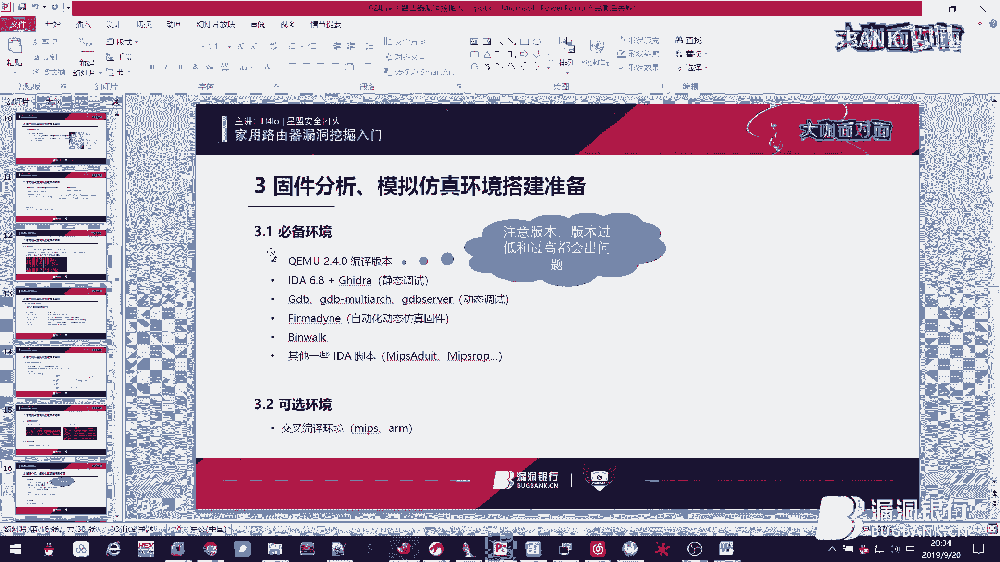

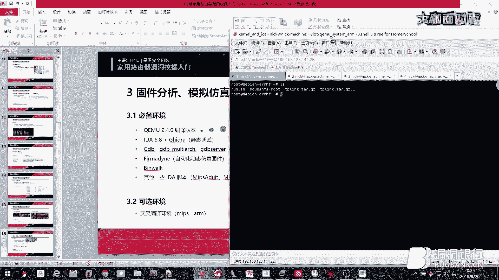

嗯，也是属于比较稳定的一个一个版本，就版本太高或者太低的话，这边都会可能出现问题。嗯，这个的话也没有为什么就是。

就自己踩过的坑，所以这边可以留意一下，大家。

然后比如我现在把这个。嗯，我现在已经把这个Q mail从官网上下载好了。现载好之后就把它解压出来，解压出来就是这个模糊。啊，在这个目录下的话，一般就是点cfi，然后。

点comfi就是生成配置的安安装安装安装脚本，然后用麦克安装安装之后就m克到就是。呃，呃，前面max是编译max然后是安装，就是把你的。应用程序安装到某些目录，但是这个目录你也可以自己指定。然其实他的。

我我们在坑这这里其实可以加一些参数。比如像我我加上一个按我的。呃也就是。我因为我这Q喵，它是支持很多种的那种嗯指令机，就是一些系统的模拟。那我现在我要研究路由器的话，主要就就用ar或者是mux就行。嗯。

比如像密的话，它会它会有两种，一种是。小端直节去的mps，一个是大端的mps。所以一般我们便宜的话，便宜三种就行了。然后这个的话就你加不加也行。然后make就直接嗯安装，然后下面就编译。

然后这个过程的话，就其实你如果加上这几个的话，它编译那个编译的过程的时间就会大大缩短。所以这边这边也应该也不会出现什么错误。

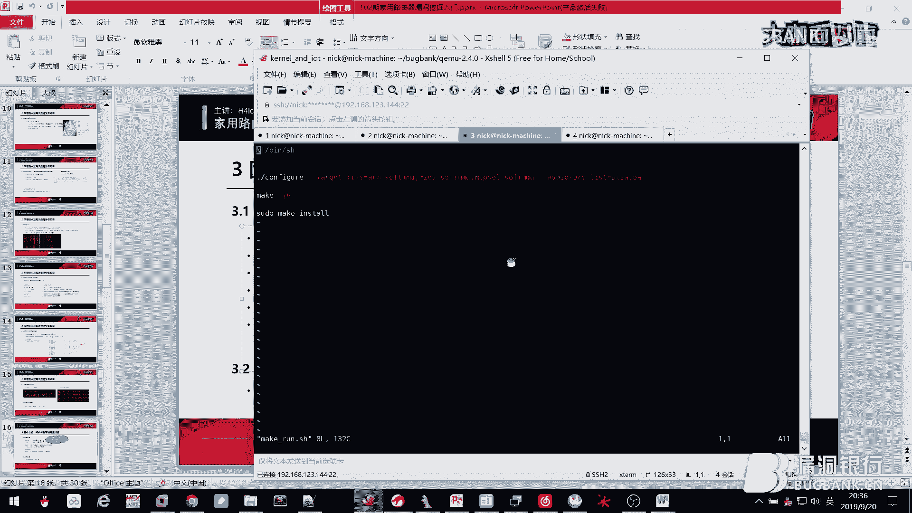

嗯，所以推荐还是推荐大家装2。4版吧。然后比如像I啊这个就不用讲。呃。所以。我如果呃装好的Q mail之后。指定完那个按照目录，就是在ins到这这个这里他会在并文件并目录下有一些生成的文件。

就像这些人都是我们兵役生成。然后像这个工具啊这个工具就需要。需要装一下，因为这个。呃，对我来说，你也是经常用吗？他就是。

一个gith上面一个开源的工具，然后把它给 clone下来之后嗯，再跟目录。首先要安装好那个嗯posscript的那个数据库。

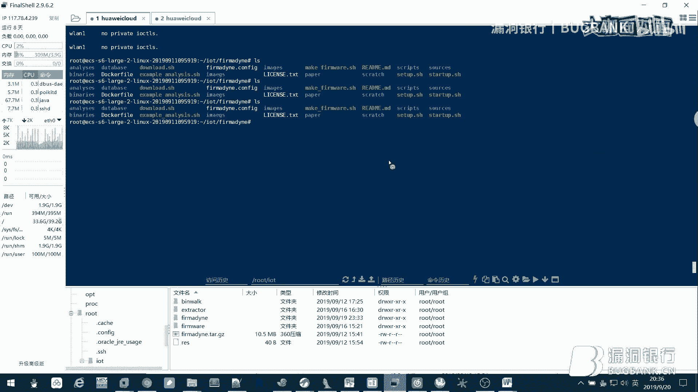

就想这个。你就要安装好这个数据库。然后其他就跟着其他就跟着他的签认这个步骤走就行了。

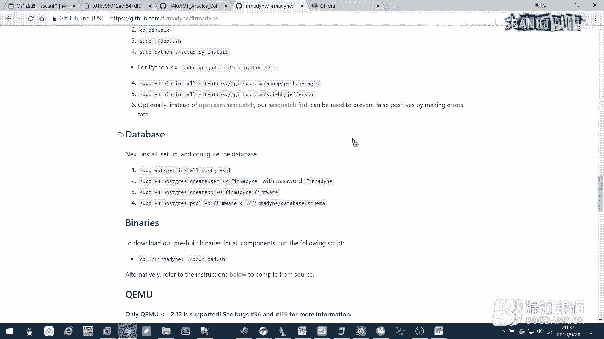

就在这个开源的一个项目里。然后之后我已经把它装好，装好之后，我们就要来使用。使用的话，它这个步骤也比较简单，因为它就是一个自动化的一个工具，相当于然后我这边。需要的一个一些步骤。

比如呃我第一步第一步就是把那个固件的。就是把固件。作为参数加加载进去，然后它这边就会相当于解压，把这固定解压成一个。加成一个镜像文件的格式。然后之后我下一步要要提取它的架构信息。架构信息的话。

这个其实它调还是调用了bework来识别。然后下面就是一个make image，就是把它的镜像文件。制作成文件系统。然后还有还有像这一部是inform network，它就是。这一步其实挺重要的。

它用来生成呃环仿真环境网卡信息。也就是啊我我现在我如果运行这一句，它就会生自动匹配，就是在那固件里面自动模拟起来，然后匹仿真出一个网卡网卡的配置信息。然后这个时候我们就可以用这个网卡这个IP去访问它。

然后第一步就是嗯把它的这个仿仿真环境运行起来。嗯这个就大概给大家演示一下运行起来是什么样的情况。然后我这边前面其实都已经执行完了，那我现在就直接执行最后一级就行了。

嗯比如我现在啊在这里他就是我我反正起来就是1个192。168。0。11个IP。然后在本地我就会生成它也会生成一个网卡，就是和他同同网段的1个IP。然后你如果是等他这边你那个已经反正起来。

然后LS下可以看到它是一个linux的系统。啊进太快了，又看不出来。他其实我这边模拟的是一个dlink。然后这边假如。他啊他已经应起起来，我这边就直接访。嗯，访问他。点0。1。

这时候就会出现他的一些一个登录界面。然后这边有一个信息是登 loging to。A rootuter routine。然后如果我要，因为我这个是在那个。VPS上搭了一个环境，这个是在本地我比较难搭起来。

但是如果是嗯你看我这个IP现在是一个和他同网段的1个IP那我现在如果要访问到他的192。16800。1，就在本地，那这个就需要用一个那个这个。我先SHH。然后就对。就是反弹一个端口到本地。之后我登录上。

你搞错。程序。然后之后我今天就登录上，然后那个9000端口是我本地就是映射出来的。接着我在本地就是加一个本地代理，这也就是1个1920168。0。1。然后9000端口的那个的的代理。

然后这时候我再访问192。168。0。1。

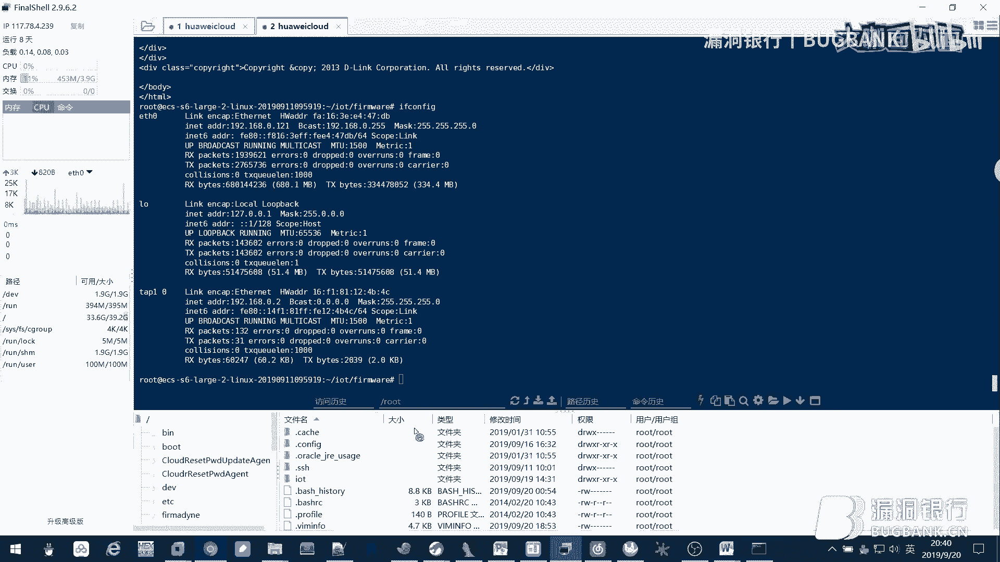

这个时候就其实就可以访问到它的dlink这这个这个路由器就是我们反模拟仿登起来的。我今默认是空明了。怎么进去的话，我们这个时候就相当于已经仿真起来了一个路由器。

然后下面你这个操作的话和你真实的路由器其实都是一样的。

所以这个工具的话还是不错的。然后接着再介绍一下关于路由器漏洞挖掘的这个特点。然后它的特点的话就是测试点比较全面。嗯，因为它的路由器的话，它有web界面，然后也有固件，固件的话就可以做来用来做二进制分析。

外b的话，就正常你外b测试逻辑就行了。然后还他还有一些关于协议层面下面的设计。比如像我呃某些路由器，它这个厂商有专门设计的一套协议。那这个协议的话就可以用来也也可以作为用来做漏洞挖掘的一个一个点。

然后还有它可以支持代码审计，就是。嗯，你把固件提取出来。解压出来，然后进入文件系统。然后在那个3W目录下就可以看到一些PHP或者是AP或者LUA的这些脚本，然后就做白鹤代码审计就行了。

所以这个也是一个可以嗯可以可以搞的一个点。然后他的特点是还有一些特点，比如像他需要接触到硬件，但前面也说了，这边硬件的话是。嗯，掌握一点点基本的那些硬件识别的知识就行了。然后还有一个拆换能力。

这个最好还是需要具备一点。因为如果是呃有时候你你要把这个freshroom从路由器里面拆下来，再变成机张读写的话，这个就是这个时候就需要这个拆的人就是。嗯，用热风机把它吹下来的这个能力。然后还有焊的话。

你要有把它重新焊回去的那一个能力。然后这边再举一些就是关于路由器嗯，常见漏洞点的一个举例。比如像外表层面的话，像这个叉SS其实是非常多的。然后。比如这边下面举个例子。呃，他这次其实是1个PHP的。

PHP的一个一个代码，它这边是获取接收获取到获取一个。啊，TRETRN这个get参数的。接收。如果有这个场所的话，他就直接把它输出到这个页面上。

那其实这里就是最简单的一个一个那个拆age构造的话就直接构造这个就行了。啊这个就不多说了，这个是很简单，它就没有任何防护的。然后还有比如像。月权。嗯，月权的话这个也是问题比较比较比较多。嗯。

月群的话就是就相当于我现在进入啊还没有进入路由器后台，我只进入到他。啊，登录界面。然后进入到登录界面的话，我如果访问他一些敏感文件。比如像我资源是访问到它的。路由器的配置文件，它就会把它直接回旋出来。

所以这个是没有做权限控制的，就是很容易出现这个问题。一般月行的话，这最常见的就是获取它的路由器配置进行。在路由器后台其实。嗯，也有经常也有一个功能，就叫导出路由器配置引行。其实就通过这个接口。

来进导致月群来就是达到这个月权漏动。因为他这边没有进行权限的验证，没有进行库级的验证。然后二经制层面的话，这里的话就最主要是一个命令执行和一个战役出的漏洞。嗯，命令执行的话这个。嗯，其实。那个数量最多。

因为它命执行的话，它大多数都是用C能函数来做嗯命令调用的。然后s的函度它这边是没有一般都没没进行过滤。嗯，这就导致我们如果能把一个可控的信息。常入这个C的函数里面去执行的话，那就它就导致一个逆子执行啊。

像右边这个例子啊这下面这个例子，它比如我是获嗯获取到它一个快str这个嗯变量值。它其实这个。这个就其实就是获取到我们URL的后面这问号在后面都不问的值。获取到之后，他会把它给死，然后给死之后。

他就会用springF把它拼接起来，拼接起来，他会就会把它传到账上。啊，传这上之后，他就直接直接把这他这个。嗯，账上的内容直接丢给C死人让他去执行。但是这边的话就很容易看出他没有验证。那我这边可只可控。

那他对应又没有验证，那我就可以拼接一个像这样的这样的格式。我把它拼接之后啊，比如拼接两个前面两个艾，后面两个艾，中间加一个输入的命令的那个要输入的命令。然后你给他之后。

他然后这个是从外b界面传过来的那我就从web界面把它加上这个想要执行的那个参数，然后他在路由器后台就会执行这个。那我现在如果是然后想要反弹一个端口，那就直接跟他一个tent或者是NC反弹回来。

然后这个就可以达到一个。跟他笑了的目的。然后还有一些战一出战一出的话，这个嗯也是属于比较常见的问题。最最经典的话最典最经典最典型的一个一种例子是一个。springF导致的战役处。嗯。

比如呃spF下面这个例子。他就是把用get ENV然后创入1个HTTP cookieook作为参数。其实这个就是获也是获取到HTDB的cookie，就是我们那个cook。嗯。

HTV投 cookieook面池。把它拼接到这账上SP加这个就是账上的一个偏移的地址。拼接之后，它其其实我们这个是可供的，然后它占大小有那个占大小有限。这个时候如果拼接程度过大的话。

它就是会产生一个战一图。专译出的话，这里利用和叉86有点不太一样。呃，感兴趣的小伙伴可以自己上网找一下一些相关的资料。然后还有一种情况，那个导致三意图是因为它循环频辑不当。

但这个的话就是一个那种程序员写代码写。手误了，就是你多多写一层情空，或者是你这个边界你考虑到它的大小也会才能战一出。然后还有一些一种协议层面的漏洞，比如协议层面的漏洞，像SMBUPMP的话。

这些重新协议嗯也是在路由器里面使用的比较多。像这种UPMP的话，就是一个嗯设备发行协议。呃，经常在路由器里面就用来寻找设备之类的，这个的话就很容易产生一些。啊，命令执行之类的东。

然后还有一些像嗯路由器产生的私有协议，比像下面这个下面这个是一个TPlink的一个嗯叫做TDDP的一个协议。它这个之前报过洞，也是因为产生产生了一个执行漏洞。然后待会我们下待会我们就是实战演示的话。

也是演示的这个漏洞的一个负现，就复现这个漏洞。然后这边还再介绍一些关于他裸辑漏洞挖掘的一些思路。啊，这其实也是我都是我自己总结出来的。可能也不够全面，就大家就大概看一下。然后比如像一个还有测试的话，嗯。

第一个是外部层面的测试。那这个大家都都知道，就是你些常规的测试吧。然后还有一些端口渗透，端口渗透的话第一个ten的团口或者是SHH的爆破。那这爆破的话嗯。可能那种像那种入口运问题也比较多。像端口的话。

就刚刚说的一些。嗯，私有那个路由器私有的端口或者是。一些比较嗯比较少见的那端孔，也都可以用NC连上去去看看它是到底是干嘛的。嗯，也许还跟你发现一些后门什么的。然后窗口调试这个窗口调试。啊，其实。

它的作用就是用来获取路由器的一个效。就是通过导示。可以直接拿到去，然后进一步你可以把这个就尝试能不能把这个文件技能导出。导出。如果可以导出之后，那我们就进行一些二进制层面的分析。

然后一些还有一些白盒测试，白合测试的话，这个就是一些你拿到你再拿到嗯固件之后的的那些嗯渗落思路。比像这个刚才也说了，就是审计逆向的话，就是另一些它的CGI脚本CG2进制的文件，或者是用来处理。

处理他还页递交过来的数据的一些二进制的文件。这主要还是关注他嗯这个二进制文件和外b交互的这个接口。嗯，就这个二性制文件，然后像一些嗯稍等密码包括这个也也也是可以尝试进行，可以这尝试一下进行。

然后获取他他的这个root密码时候，然后反过来你可以做一个窗口调试。如果是要登录的话。然后还有一些敏感信息收集，这个的话就是用一些自动化的工具来自动收集它。呃，路由器嗯文定系统里面的一些敏感信息。

这个有一些工具就是就这个这个在bHub也可以找到。然后下面就呃演示一下关于TPlinkSR206姓兵执行漏动的利用事上。嗯，这个的话就是。他其实这个漏洞点就基于上面说的这个它是一个路由器产生的私有协议。

他很容易产生一个命令执行的一个问题。然后这边测试的环境的话就是下面这些嗯，第一个是路由器固件的固件，它版本是1。0，嗯，这个是在4月份，它4月份出了一个版本，然后只有包熟动之后就就已经更新修复了。

然后优半图虚拟机，这个就用来嗯跑这个Q妙。然后BingworkBwork就是自己装的，然后Q等系统。这个的话就就需要用到它的s系统。它还有一个系统就是us系统，user系统就是用来跑单个程序。

C系统就可以用来跑整个模那个路由器，基般上就是用sea的那个模式。然后把这个整个路由器跑起来，然后它就是然后你再访问它，它其实就是一个完整的路由器那个系统。然后还有一个p tools。

就p tools只望用来写那个一大杯脚本。然后先看它漏洞点，它的漏洞点其实是位于一个。嗯，SSS杠F的这个地方。Now is scanF他的。那个叫做那功能就是把第一个参数啊用第二个格式化的。

那个形式解析到后面几个参数中。那后这边有2个万号，那我就。不要以他为解析两个两个。啊，两个值导致分别存放到后面两个那个参数进去。然后如果我现在把它截集到S进去，就是相当于第一个。

第一个它因为是以呃分隔弧为它的结尾。但是我默认程序。如果这边如果不输入混格服，那我输入一个。end或者是一个斜杠。那他这边其实S的值就变成可控了。而且唯11在我们待会会看到他这个其实也是一个可控的参数。

然后S可控之后，我们就在下面这个有一个一句是run xq。这个其实是我自己命名的一个一个一个函数。我他的作用就是执行一个命令系统系统命令。他就是把这个嗯系统命令要执行的系统命令的思上从入到这个函数中。

然后这个S是一个可控的，那我就可以相当于那我就相当于可以嗯拼接一些其他的命令，然后让他执行一些别的别别别的命令达到别一些那种的一些效果。然后这边嗯就呃把它加载到IDA里来。嗯，分析一下。

然后这个漏洞点它产生的地方就在这里。嗯，就刚刚说的杠F这里。他这个意思就是说你要他会解析以以这个。嗯，符号为结尾，然后解析到这两个参数之后，我都把它放到这个这里面去拼接。

然后这个他的原本的意思其实是说嗯DLTB杠JR前后面前面是一个呃文件名，后面是1个IP。就因为他这边S到。其时的话它其实在这里会拼接成一个文件名。但是我这边就是不输入一个符号，然后我输入一个这两个。

那我就相当于我这边就可以。嗯，绕过他。然后你看这个runex的这个低位这个函数的话，它其实最终就是执行的这个XXEVE。就说明我把参数传进来之后，他就用用BNSH直接执行。

这个就可以达到一个执行命令的效果。然后我们。因为我们知道他这个呃漏洞原因，还有一个就是因为他无恶意可控。无恶意的话，我们这边可以做一个回溯。回溯的话，这前就先直接回溯到最开始。最开始的地方，我们比如。

啊，在这里这里的话，它是从V10过来的。V10的话，它是又又是从A一过来的。A一的话，它其实是一个这个函数的参数。参数的话，那我就往前回溯，就这个函数然看看是在哪个地方调用，它它被调用了。

然后这边按一下X，就相当于我这边双击就进来这里。然后它的调用的地方其实在casts的0叉31这里。啊，这里的话它会因为我现在要关注的是第一它的这个参数传进来参数。那这个参数的话啊也缺接着回溯。嗯。

回收到这里。答其实这个也是一个啊这个函数的参数。那我这边接着接着回溯。到这里。嗯，这里我把它命名成成了一个handnda data的一个函数。然后这个的话，它常入我们关注它常用的常数是ser。

这也是我自己命名的。然后ser的话继续回缩，你在第一步在也是在这里，它还是一个那个参数。还是一个这个函数的参数，然后接着回溯。到这里就是一个也是这个我今命的一个soctract。然后。

他这个你看他是从哪来的，他其实。嗯，他这边是。定义了一个这个。这个结构体，然后。他会初始化这个s可的。socus然后他把其实有有一个地方是这里。你要重点的关注的是这里。

它其实是将S加就指针加00叉B01B，然后大小为0叉AFC9。啊这么大的一个缓冲区里面除了是一个receiveuff它其实这里就是。存放的就是你要接收的一个嗯bffer的存放的值。

因为我下我在下面会会那个会。初始化ser就这边他会把这个ser开启。嗯，然后再绑定一个端口，绑定端口的话是它就是1040端口。那这边我们可以啊模拟来。

运行一下，先把这个运把这个程序运行起来。然后运行的话就是用那个C的模式。我这边的话就已经我这边其实我已经进入了这个呃这个虚拟机。我在这个我我的目的就要在这个虚拟这个阿姆虚拟机里面跑这个跑这个城跑这个。

呃，就是就就这个路由器的这个这文件系统。然后其实这个文件系统。我之前就是用固件已经把它提取出来，就让bework把它提取出来。嗯，bework提取出来的命明就是bework杠，然后跟上这个固件的文件名。

之后这个提取时，你那运行完之后，它就会生成一个这个目录。这个目录就是一个啊，先先进来看看他这个。重换的是什么东西？你看他存放了像其他一些没有解析出来的一些呃一些文件。但这个我们都不关心。

我们关心的是叫这个scraFSroot这个这个目录。那后我们进入这个目录。啊，LS其实它就是一个inux的系统。然后刚说的，你可以关注一下3W目录的这些文件。然后现在它的漏洞点是在TDDP这个程序里。

那我们可以用这个命令来找一下他这个TDPTDP的。侮录在。就具里存犯的物。呃，筛这就是在优势并的这个目录下，它有一个这个文件。然后这个时候嗯就我知道他的文件是在这。

那我先第一步还是需要把那个嗯这个固件给抛起来。那跑起来后呢，就是我我在我把这个打包，我把这个目录打包下来，打包成1个DBlink嗯TAR杠JZ的这个。嗯，的这个这个压缩包，然后我要把这个。

文件这跟文件的目录传到这里面来。那我可以的使用的方法就是用配置感恩下建立一个那个服务HPP服务器。然后他就会钉停一个端孔，钉钉端孔的话，我在里面嗯。把它访就访问一下，把它这个呃压缩包下载下来就好。哦。

对，这边还要讲一下他这个嗯。网卡设置就是关于他这个呃虚拟机网卡设置的话，其实需要用到一个命令叫做。想用那一个命叫做。叫做TAUNTUNTCL啊。

这个命令的意思就是模拟我在本地就是在我现在的虚拟机里面模拟出1个TAP0的这个网卡。然后把他的就是U那个控制权给他。就给我自己，然后把他的KTAP0的IP设置成这个网站。所有成么这个网站之后。

我我我运行这个虚拟机的命令就是用Q喵 system arm来把它整个文件跑起来。那我这个杠M参数就是指定它的机器类型，这个就是一个开发版，然后什么内核初始化脚本设备。这个镜像。这个镜像。

然后一些场该有的场所，然后后面有一部是F if name等于TAP0。就是说我现在建立起来这个虚拟网卡。啊。我现在嗯然后我要模拟起来这个虚拟机。

我可以啊把这个TAP0作为和我模拟起来虚拟机进行通信的一个端口。所以这边。table的话就相当于你那个网桥模式，然后t0就是相当于我现在端口和他通讯端口就是这个。

因为我这边已经设置好了IP table它的啊不是IP confi它的那个。呃，具体的IP地址和网站。那这个时候我把这个命令运行起来之后，我就会生成，我就会运行，就是到这里这个呃虚拟机的界面。

你用这个也可以看到，它其实就是一个。ア。就是一个刚刚也是可以看到就是一个Vex的这个一个一个机器类型。然后现在要重庆的话，那我就配置这个。

然后是这样配置他的IIP confi和他在那个TAP0在同一网站上。那比如我现在配置机。点一，那我现在因为我这个我这个IP是。我现在的这个数主机的IP是。10。0。0。2，那我就可以定一下他。你。

那这时候其实可以拼了嘛，就说明我现在。呃，在Q妙心理集和宿度机是可以通信的那我现在就就用刚刚说的这个方法。嗯。把这个那个。跟文件系统把它传过来，就在这个这个目录上。那我现在要把它运营起来。

其实这边跟这个这些命用。

To可。就把它挂载挂载之后。先挂在两个地方。挂在两个地方之后的话。

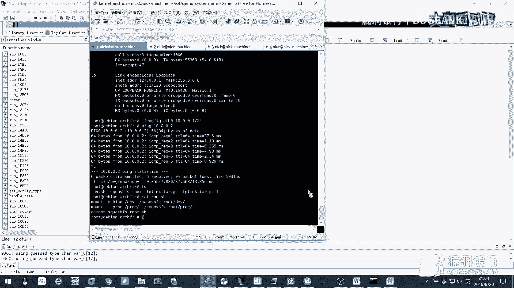

我就用那个。CHROT把它运行起来。然后这个我已经写成1个SH脚本，那我直接另行开装。运营起来它之后，它其实就是一个BBG box的一个一个命哈。然后这个时候我比如我现在要运行这个。

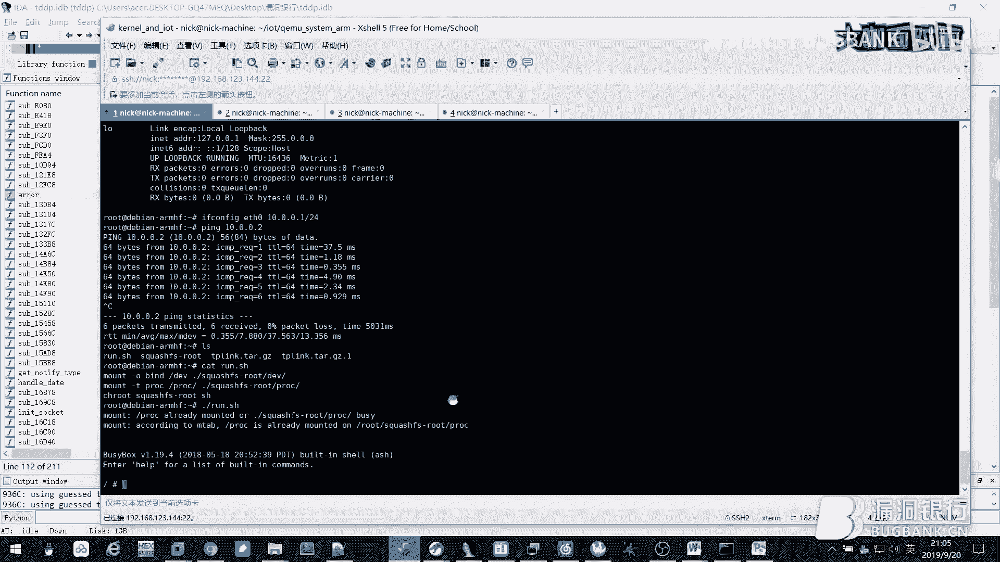

有漏洞程序，那其实就直接TDTP就行。

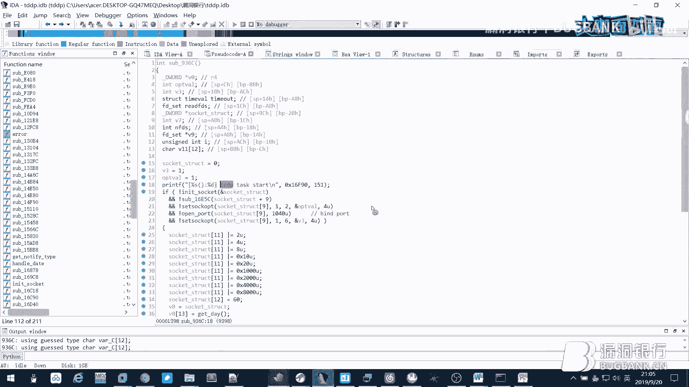

你看TDPTDDP它会做起一个呃TDP的服务。然后它这边就是显示的这句话。

然后他这边其实会绑定1个1040的端口啊，端口的话啊我们就可以用，比如我们要检测到它，检测到它的端口，然后就可以用。

A make来扫描，比为我现在am make。

咁。刚谢1040。杠SU啊，这个有SU就是就是指令他UDP扫描，这边要加一个速度。110118。001哦，不对。10。0。0。1。啊，这个时候我就可以扫描到它的这个地方是开放的。

就说明而且它是1个UDB的口啊，就说明它这个服务已经起来了。浮务起来之后，他这边就可以也可以检测到一些信息。

我先把它停去开。然后。你看他这个我们基刚才的分析啊，你那个问题的就是有漏洞的参数，就那个那个点是从这边传过来的，这个就是一个收克的收课的那个呃结报体。那后这边的话就是初始化的一个搜口的操作。

然后比如我现在进入这个。啊，有一个地方是需要重点关注，就是这个地方。receive from就相当于嗯我RDP现在这个端口是从。接收到的那个我现在不是要要呃今天的一个端口嘛，就叫易4G端口。

那我会把这个输入的接收的输入放在这里面。socus加啊B011B的这个这个地方，你如是。也就是我把我把这个接收的全部放在这里，发在这里的话啊重点之我们要重点关注这个片移加B01B的这个地方。

然后我们收到是这个收到的是存放在这里。接着我们把会把这个收cus。嗯，成诺到。传到这里。作为第一个传数传入到刚才那个get notify type。type type这里面。

然后他这边常出第一个过来就是一个serser的结构体。然后看这个地方，这个地方加B01B，其实就是我们接收，就是他程序接收输入的那个重放的地方。然后我们输输入的地方输入的内容就是在这里。

这个是我们所有的内容，它是放到A0里。诶点mi然后。A一这边其实也是一个收结构点，然后他这边是这个switch的话，会判断你A一啊，其实这边就是A一加上B01C，也就是我们B01B代表D0第一个质间。

那B01C就代表第二个质间。那我们现在他会把第二输入第二个字节用一个switch来判断。嗯，它的漏洞点是在0叉31这里。那我们要过到的就是那我们。比如我们现在要构造的那就是前面一个质检。

假如我现在是00，然后第二个字节是31。03031，这个我还不确定。第二个要过成省31才会进入到这个分支。然后进入之后，他这边传进来的，也也就之前这个收er是嗯这个这个结构体。

然后我们还是要记住他这个承办地址在BEB这个便宜。你进来之后进来这个场试的时候啊，他会把。啊，还是看这里吧，还是看输入的这个点。这个是哦无要也是我们所有的点。

然后V15也是我们所有人那个第一个字节存放的地方。V15VV20就是V21V2V15都是我们。嗯，我们自己传的。然后。如果我们要执行到这里，他就是会把V2一的值啊作为那个你要解析的那那那个内容。

嗯VE的话其实就是我们第一个输入的那个值。那这里的话，它这边会有一个ifel，它这边会把那个VE加个偏移。他这个可判断的依据是微1物。微实物的话也是第一个输务的。也是我们其实就这个地方，那这边就可以。

假如我先把它换成0131，然后这个时候它就会进入这个房子，它就会把V21加1个22。那加12的意思就是说加12的，它之后，他就会把这个。进行解析了。然后他的意思就是说嗯我向后偏移12个。嗯。

我今天胡略就骗成12个字己，然后。我我要一，比如现面是第13个，那我们那从这边开始输入，就是我北析的这个这个地方。然后这个时候我再输入在后面输入一些payout。嗯，然后根据这边解析解析。

然后他这边就会运行一个命令。然后我这边脚本的话已经写好了。

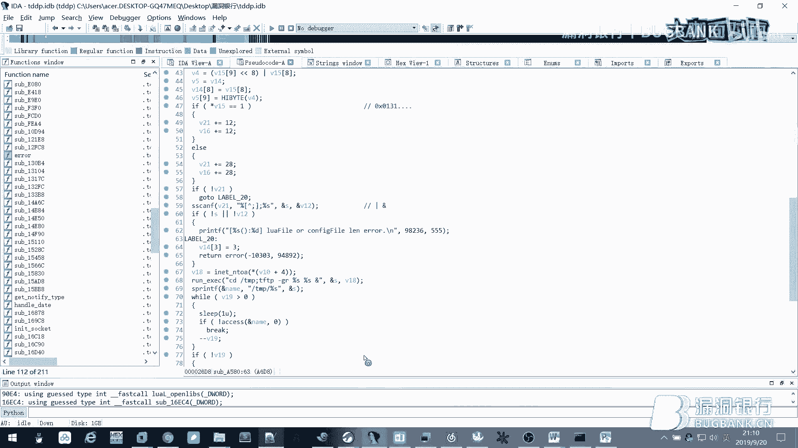

呃，是在。

本我们是写了一个配on脚本。就是调用了这个pointpoint兔这个模块。然后呃因为他是把我们。从U1040的这个端口输入的值。

重放到他的这bu也进去，然后我们需要过造的时候，就是要构造成这种类型。所以这E叉B的话大概就是这样。

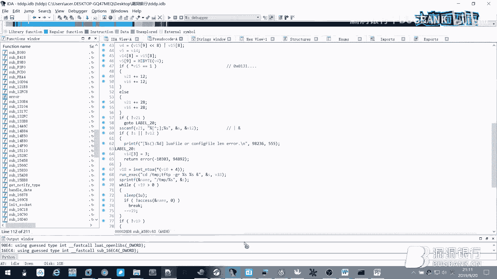

嗯，其实也很简单，他就是。嗯，把IP跟那个command传到这里行这IP就是。用来连接的作用，然后它连接的端口是1040。然后就是收cus时会把这个。嗯。

send so和receive socus都打开。然后接着配套的话就是。就是我们刚才说的，前面要要变成0叉01和0叉31，然后之后填充12位。填12位之后，现在这个就是我里面这这个VRE的值。

VE的值的话，我用com来做一个产数解析。解析之后，我就用stand two把它发动过去。因为这个是呃。

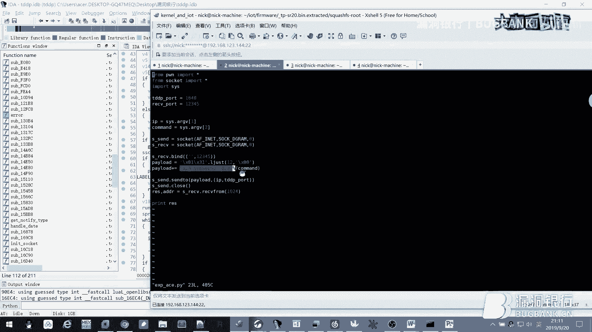

UDP的主要用s to这个函数。然后接着我就会接收它服务器运行执行之后一个回响。那这个可以实际来。嗯。来这个。你来这个演示一下这个执行。就我知道我现在他这个IP是。10。0。0。1。

然后我现在执行这个A片。10。0。0。0。1，我现在假设要执行一个。呃IP configure。行就这样。他就会连接到那个端口上。那我现在就在这边，其实。他在这里是。い。在这里是开启一个。

最开始就开启一个让你自己当那个服务。然后我远程命令执行就会执行这个IB confi。然后我要访弹的话，一般万字路由器里访弹它都是用要用到一个tent。就是他的意思是说。Tent的就是这样的。

不是tent。tenendten的话就在它远程开启一个ten服务，t服务。然后呃因为我这个。没有相应的那个。就是和他交会有一点问题，然后这边就没办法用tend，但是我可以用那个可以用NC。嗯。

他因为他这边自带的1个NC，那我可就可以用NC把命令从NC1这边啊相当于一个反反弹到我我我本地输主机这里。嗯，你看我现在如果是要执行一个TB。NCNC的话就是啊我要主动连接的IP。

那就也就是我设机的IP。216666大，我知道事前在。提前提前在这里开一个。你自己开一个。MVIP。4个6。然后这时候我如果。执行这个命令，然后啊运行这个配运行这个配准脚本，它就会运行这个命令。

就会通过把IPcon了结果，通过管道火嗯发送到我远程的这个状况。我这边是已经啊这边还没起来。TDBTDBPTDDP。然后这边一发送发送之后，你在这里就可以看到他这边其实已经执行了。然后你回来这里看。

其实我这边NC就已经获取到一个那个反弹的结果了。所以我就可以用这个来达到命命令执行的目的。所以这个就是他的这个漏洞点。

就就是因为他嗯我发送过日的这个UDP的那个数据，他没有进行过滤或者是。啊，就是没有进行过滤，把直接拼接到这个命令执行这个函数里。所以这个就是一个双是协议层面的上都懂。然后他的这个他因为他这个是1。

0版本，那他后面的版本修复的话，他就是把直接把这个switch里面那个0叉3那个块直也给他去除去掉。那也就是说他是把。嗯，他是把我这个这个判断这个分支直接给你去了。所以这种也是一个很简单粗暴的修复方法。

啊，所以这边前面内容就已经上讲完了。然后这边的话我还收集了一些关于LOT文章的整合。这个的话我是 from在g house。就这些。这个的话就相当于我之前学习的时候。嗯，在网上各种整合的一些一些文章吧。

一些文章，一些教程之类的。主要是那种路关于路由器。然后之后也会慢慢完善吧，大家感兴趣可以自己看。

然后这边再介绍一下我们团队呃，新萌安全团队成立于2018年呃，专注漏洞挖掘安全研究CDF竞赛之类的啊。最近我们这个团队的话打了1个CDF成绩也是可以的。然后所以感兴趣的那个小伙伴可以加一下这个群。

然后之后如果要进想要进团队了多了解一些信息的话，嗯，会经过一个审核。反正这个的话就嗯大家可以都加一下，感兴趣可以可以可以可以进来一起交流一下技术。然后这里我就讲完了，嗯，谢谢大家。嗯，好。嗯。

感谢hello大咖的精彩分享。😊，听完本期直播内容，相信大家一定收获到了许多有关于家用路由器挖掘的技术和小技巧了吧。那么如果还是存在疑问的话，接下来就让我们来到行长问答环节。

大咖会在此环节解答大家的疑问。小伙伴们有什么问题的话，现在可以赶紧在聊天区提出。在稍后的福利赠书环节，大咖会根据聊天区的交流情况选出一位幸运观众。所以大家抓紧机会提问。那么我们也请hello大咖。

现在打开直播间看一下观众的聊天页面。嗯，弹幕比较多的话，可以勾选聊天区的右上方只看提问来查看一下问题。那hello大咖现在可以开始解答问题了。那行，嗯，之些问题不是很多，那我就一个个回答吧。啊。

第一个问题怎么获取路由器的固件啊，刚刚就是也说过，那最基本的三种方法就是第一个通过其他官网直接下。然后第二个通过你路由器的这个升级界面去去去获取。

然后第三个就是让你要通过那个你设备里面那个flashro来提取这个固件。然后具体的提取那个。其实那其他的几种提取固件的方法，这里边。我跟。是在。

就是看学还是看学上面那那个文章，就这个。我这个可以发吗？

呃，发发哪一个好，你发吧，没事没事。可以可以可以啊，这个大家可以看看，然后。就是之前想用URD窗口的操作。啊，伯特利这边波特利的话，路由器里面在那个窗口调试里面可以看到，然后有的是看不到的。

所以这边你可以其实这波利率可以通过一个爆破来实现。嗯，这个爆破的话，用那个linux平台下面有一个工具，你这个工具具体我忘了叫什么。那个你可以上网找一下。然后怎么抓路由器出去的所有流量？嗯。

这个的话用那个。有了路由器的话，它会自带1个TCP动。但但是。怎么抓其他手有出去，这个我要下个应该可以吧，就开启那个混狼模式。没有连接到wifi要如何入侵，那你就破解他的wifi密码吧。这个还能怎么样？

啊这个的话有什么坑，这个要讲的，其实内容就很多了，这边的话时间也。没有多少，我大刚才就大概讲一下mux的一些一个基本m会编指定级一些基本知识。嗯这个的话还是要自己上网找资料啊。嗯。

这个的话实际上感觉也没那么好用嘛。嗯，就针对以前以前那些WEP协议的话会比较好用，现在的话应该不太好使。然后m什么利用，这个的话主要是战译出的利用。战译出的利用的话，它就是嗯有专门的一个利用方法。

这个的话呃网上资料很多，如果感兴趣可以。去安全科找一下我的文字。然我写了一些关于路由器的那个粘一储入用的。针对固定发子的工具。AFL嗯，好像有那个有一个叫。嗯，unicorn AFL这工具。

但这工具我也没用过它。这个的话。嗯，也是国外。之前刚刚开发出来。这个的话可能嗯。啊就是。不是很适配这个固定发。框架就是像当FFI嗯BBOOfa fast这些其实最好用的，我感觉还是嗯BO。

如由器的Lo动平台都有哪些？平台都有哪些？什么叫平台都有哪些？应该指定机吧，那指定机架构主要是mux和ar。然后是不是在号分析得到符号表的ID啊，对啊。

这个是其实更多是在那个VX works里面可以可以进行操作。但是linux的话嗯，有些linux那个二进制文件，他有有有时候他符号表是不给你的那就是就是没有符号表。

他有的时候嗯有有时候他的符号表会当存放在一个地方，你就可以用它登入。那有时候我那个我我曾经要发布的时候，它会用strs把这个符号表给去除啊，那你就没法回复这个东西。还有T一节这个没研究过这个。

我们比角洲团队大佬有有搞过，就关于4G的角色。路由器可以测进到过你啊，这个不太了解。你这个好像都可以吧，你什么都可以测新了。攻气路由器有什么影响？啊。

你想的话就是一般的话就获者ex个el或者ex个cel的话就可以。啊，你想干嘛就干嘛？你比如想进进进进一个江苏网络，那你也可以一样一样搞。就从哪种品牌呢？这种呃呃点某 link。某 link自己自己体会。

然后我问题没。你最好还是用那个用那个撬撬，就不是有专门的撬过吗？这个的话其实没办法。你比如像那个TTTBD个的话，它就是手那么紧。他就是不让你裁，你一般。拆开我感我猜那个TPlink也都是经常都是。

啊直接撬坏了。但是。😊，啊，提取一个啊，这个需要需要重点关注你这个。你提取固件你一定要把这个fsh吹下来，因为不吹下来的话，你如果用编程器上电之后，它会对这个有影响，对这个固件提就有影响。

你提取出来的固件就不是一个对的固件。所以这个另一个路由器，这个其实你只要把这个拆那个fresh拆下来，拆下来读就不会不会不会读出错误的固件，然后你再把把它刷回去也是一常正常的。

或者你把它这个flash推下来之后，把这个啊用编程器把它这个里面内容读出来之后，你再找一个flash新的frelash，你把它就找相同大小同的容量的。你把这个固件读出来的信息之后，那个重新写到另个新的。

相当于你留一个备份。之后你重新装回去，或者是刷坏的时候，你还有一个备份锁？所以这边一定要注意他要把它拆下来。有没有所独独有的攻击，独有的攻击。这个怎么说？这个不就是。啊，那些传统的工具嘛。

我要精制外表的那些。这个我倒没什么。嗯，学习挖掘路由器需要什么其他知识？这个的话，你如果是学外表的话，你可以直接从外那个外表层面就是后台那那个那个地方来来挖。如果你要挖固件固建二进制的话。

你就需要学一些嗯关于mps张一出或者是mps命令资金的这个。这些知识。那比如我刚刚附现的这个。有的命执金它其实挺简单的，就没有没有那个。你有涉及到别的一些二进制的知识。啊。

不是有没有涉及到你们高深的爱情知识。主要是你要会分析这个二进制程序，所以二进制分析基础需要一点。这边还有问题。嗯，你也可以把那个只看提问取消掉，然后看一下大家在。聊天区有没有提出什么新的提问。

然后你想回答一下也可以。个人联系方式是你你加那个团队吧，你加我嗯，你把那个刚刚你团队最后的那个QQ群的那个码放出来也可以，可能刚太快了，大家没有扫到，要怎么放。

啊，你刚刚那个PPT，我现在是可以看到吗？等一下啊，这边稍微有一些延迟，应该应该是有的。你把PPT摆出来的话，我有服务我有服务其实这个就是就是外部生透那一块知识。

这个和路由器的估计no洞挖其实没什么关系。

你主要是嗯你要分析你外了进去。嗯，从外边这个点进去，功能点进去到。固建二进制的路口是在哪？你找要找到这个路口。就是要找到他处理HTTB请求的地方。就比如像一些CGI的这个。嗯。

二进制文件或者是你专门处理ATDP请求的这这个二进制文件。还有像一些HTTPD这种守护技能的。然后那个那个文件是吧？你的固件不能模拟。不能模拟的话，那你就用Q mail system。

就像我们刚才的这种方法。就刚才用那种牺声。

呃，Q mail system把这个。把这个用CHROD把它的这个跟文件。供理系统作为工作。就像是就像这样，我退出来之后，就是我的Q妙的这个根目。

嗯，你说没事没事，我看小伙伴说呃，扫码入群还要回答问题，还要做题，这是什么硬核的词。😊，就是看他们的技术了是吧？就大家各各凭本事进群是吧？😊，我不知道。哦，好的。

这也许是打咖新闻安全团队的一个小考验的方式。大家加油哦，加油。😊，嗯。路由器挖掘的整体流程一般都是先测一个先测一个web服务。你比如我在web服务嗯，啊比如比如举个例子吧，就比如。我有一个输入款。

我输入一堆A，然后那嗯然后你发现服务崩溃了，就发现就可以知道他这边其实是一个战役书。像这种就是纯黑盒，那你就。呃，先具体的外边那些。嗯，叉SSCSF你测一遍，测一遍之后，你再测试里没有那种关于命令执行。

还有粘译出的这个点。啊，你如果想快速测的话，你可以用BORP那个那些那个子。啊，unicorn对那个工具要unicorn杠unicorn杠杠没。但这个我也没用过。我这样的一些呢，对这种事。嗯。

高高老汉也是一个路器里面比较用的比较多的一个思备。那非常感谢hello大咖的耐心解答。由于时间有限，大家如果后续还有问题的话，可以到技术群里继续交流。那么接下来就是今晚的福利放送环节。

hello大咖亲自挑选的书籍，揭秘家用路由器零被漏洞挖掘技术，即将要送出。究竟。这份幸运的礼物要落到哪位观众的头上呢？那么接下来我们有请。hello，大咖选出幸运观众吧。

看好看呃看看是哪个小可爱会被我选中呢。是哪个小可爱？hello拉卡什吗？空气幽默，然后你可以在你想要证书的关注边上。对对对，有个选为幸运。嗯，然后你给我报一下他的ID然后我们的运营小姐姐也帮忙记录一下。

嗯，行。😊，我看大家还有提出一些问题，大家可以之后继续到技术群里交流，或者哎hello，你可以把那个还是PPT的对等对，你还是放出来。行，就大家可能好嗯，扫码您已经选好了是吗？好小心。小心嗯哦。

好我刚刚有看到这个ID嗯。😊，好的，那让我们恭喜这位直播间ID为小新的小伙伴。将获得这一本解密家用路由器零类漏洞挖掘技术，需要你根据直播间的提示，在相应的区域留下正确的收货信息，或者在直播后私聊我兑奖。

我们会尽快把书给你寄出。那么那我们到这里直播就要结束了。

那hello，大咖还有没有什么想和大家说的？嗯。大家学习经过。我们到这里的话，今晚的直播就要结束了。🎼我们再次感谢hello大咖用心的准备和精彩的演讲，希望本期知识大家都能学有所得，有所启发。

如果想回顾本期直播视频的话，我们将在下周五发布录屏，敬请关注官网的更新或群里的录屏更新通知哦。那么今后大家也可以多多关注hello大咖和星萌安全团队，最后感谢所有观众伙伴们的守候。

还有对开面的支持和喜爱。如果你也想像大咖一样直播分享，欢迎找我报名。大咖面对面是一个展示白毛风采和传播技术的舞台，不具年龄不畏资历，只要你有才华敢分享，我们都欢迎。如果想进群交流的话。

可以在页面底部找到群号。本直播间地址固定，大家可以收藏到浏览器哦。那么最后。🎼啊，今晚的直播到这里就要结束啦，感谢各位小伙伴们的积极参与，大咖面对面，周五8点见，我们下次再约吧。下面是听歌时间。

小伙伴们早点休息。大家晚安。🎼洒都不。🎼老是。🎼パペリ littleが。Now we've lost did。🎼그成 time妈妈。

🎼A co smell of smuggle with skin as we fill lung， but a go every the night。

🎼Walk home many to me inside， finish some and another。🎼I spend money to a song at road。

🎼So we go And a perfect night。🎼Iし。🎼不ment。🎼My pretty little boy。🎼怎么办？

