# 漏洞银行丨工控安全渗透之路-剑思庭丨咖面95期 - P1：95期录屏-工控安全渗透之路 - 漏洞银行BUGBANK - BV1Ft41177cs

为知识而存，因技术而生。小伙伴们晚上好，欢迎大家来到漏洞银行hck show的直播间参加第95期大咖面对面。我是今晚的主持人fancy。

今晚进行直播分享的健字亭大咖是复旦大学软件工程硕士K控2018讲师公共安全研究员，主要研究方向为公共安全的渗透和防御。😊。

对工业控制协议S7neteathernetIPmodbuOPC等协议均有深度研究，同时开发了基于卡里的工业协议修探工具。今天的内容充实精彩，电视亭大咖还精心准备了实战演示，大家一定要听到最后哦。另外。

大家登录直播间后，可以在聊天区发言进行讨论互动。在听讲过程中，如果有任何疑问，都可以随时发言。在之后的行长问答环节中，电斯亭大咖会在线解答大家的问题。😊，认真听讲积极提问的小伙伴。

还有机会获得大咖赠书、集成架构中型系统。好啦，那下面我也不多废话了，就有请电视频大咖开始今天的直播分享吧，大家欢迎。😊，OK大家可以开始了。OK大家晚上好，我是健思婷啊。

这个呃现在呃个人是就职在一家美资的工业自动化厂商册啊，从事公共安全和防御。同时呢也在暗隐安全破小安全和美测安全里面承担公共安全的这个板块的这个研究员啊。

那也很有幸在2018年呢受到K抗就是黑哥的邀请来去分享了呃这个公控的这个远远控的一个基术啊。另外呢就是因为这个我算是公控老兵了吧啊。说起来。001年科毕业。啊，一直做公控，近5年是从事安全。

所以说大家可以看吧，就是纯属的是一个公控痨病，呃，不是原来从。安全这个圈子里面过来的，是从这个圈子里面转到这个安全里。那对一些工业协议啊，包括刚才这个fancy也讲了，S7啊。

internetmod bus OPC啊，有些研究。那同时呢也做了一个这个类的一些工具上的救算工具啊。那今天呢我主要是分嗯这议的小伙伴来去分享一下，就是空空安全上面这个渗透之路。

那这里面呢我特意抛了4颗星，这里面要解释一下啊，这个四个星并不是技术深度。是而是说它是一个门槛的一个。嗯，因为呃漆为贵嘛，就是呃。当你看不到它的时候，你接触不到的时候，即使太简单。这个对我们来讲。

它也是有门槛的。所以说呢今天呢我就是希望能够把公共安全的这个门槛从4个星放到三个星甚至两个。也希望大家能通过一次。这个分享能够认识到公共安全的一些重要性啊，一些脆弱性啊，包括它的一些环境啊是什么样子。

那我简单来说一说这个目录吧，我会讲几些内容啊。第一呢我会跟大家分享就是工业控制系统大概有哪些结构，它的使用场景是什么？第二呢就是。呃，常规的公控系统的厂商有问题啊，其中有一家厂商。

就是我现在控止的这家厂商。呃，还有呢是呃它的产品都是什么？另外呢就是。小伙伴们非常关心的公共系统的这个脆弱性啊，就是我们常说的啊漏洞。因为现在其实漏洞是在圈子里面尽量就不要去提了，更多的是脆弱性的分析。

那它到底有哪些会引起这个系统的不稳。呃，第四呢就是呃我们可以呃渗透的利用的哪些呃。要是成熟的工具，里面没有过多的需要你人为去开发的一些东西，都是很成熟很成熟的这样的。呃，拿来可以利用。

那第五点呢也是呃今天这次最主要的重中之重。就是我们在工业控制系统里面如何构建一个纵深防御的这个防御体系，这个也是非常关键的啊，大家都知道这个基础设施的安全是国家的安全。OK呃，毕页就没有什么了。

毕页其实就是一个我们的这个封面啊。呃，在这里面我要感谢一下啊，漏洞银行，感谢fancy啊。这个前前后后将经有一个多月的时间与我这个呃反复的沟通啊，完了去帮我打造这个PPT的模板，还有一些内容的筛选啊。

对我有很大的一些帮助，也同时感谢这个漏洞银行给我这次分享的这个机会。呃，OK那我们进入正题哈，那我们先来看一看工业控制系统啊，我们有哪些这个结构和场景啊。我们先说场景。呃。

这个控制系统即实是大家很少去接触的，为什么呢？就像我夫人这个第一次选择我和我这个结伴的时候，就说他说。还有自动化这个行业吗？说是的啊，我说但是他一定是在制造业。和我们这个就是我们普通的老百姓。

其实呃看到的机会比较少。我像其他的一些行业。那一定是一些有工厂。那今天呢我就是拿了一个啤酒厂来举一个例子。那我相信线上的小伙伴们多数应该都是男性啊，应该也都有啤酒的这样的一个一个爱好。

那大家有没有知道啤酒厂是什么样子吗？我相信可能至少有疑半的同学是没有经过啤酒厂的，不知道啤酒厂是什么样的。那啤酒厂和工业控制系统又有什么样的必然和和相关的关系呢？那我们来第一看看啊。

啤酒厂的一个工厂布局，也是一个农作版的工业控制系统的一个呃布局。这个是个浓缩，不是一个真实的。他现在看到的就是一个工厂啊，那他看到的这个呃上面的这个区就是有蓝色，有黄色，有土黄色的这个句。

就是所谓的啤酒生产的一个系统。那呃下面嗯会有呃控制室啊，也有监控这个呃总控制，还会有这个呃办公区啊，还会有一些生产的这个值班区域啊，那他这些由这些区域共同来组成一个啤酒厂。那在这个啤酒厂里面。

首先上我们现在说。酒是怎么生成的？啊。大看有一个叫做这个mixing这个单元了吧。那其实呢就是首先你不要发酵，对吧？公煮完了这个这个在罐子里要行呃发酵慢发热啊，那这些过程其实它是一个。化工的一个反应。

啊，添化工啊，脂糖啊、加热啊啊这些东西不是由一个化工的这个反应来去做。那生成完了这个我们叫做这个原浆这个啤酒的时候啊，进到这个formingforming什么意思呢？就是这个这个就类似于像呃我们桶中啊。

就是大家那么理解吧？就是把这个酒呃，调配好完了灌到这个瓶子里头。那最后到下面这个exing啊，大家可以看下这个。这个区。那这个区域就是包装区了，大家看有瓶装的，有精装的哈。那我们在这里面就是说举个例子。

就是如果是个瓶装的话，那往灌掉瓶之后呢，它会往呃12个瓶为一箱嘛，会打到这个箱子里头划了出货。大家看到这个区域的时候呢，是真正的这个铺货区。那整个的这样的一个生产是一个。这样的一个过程。那在这过程里面。

那我们自动化的这个设备，就是工业控制系统存在在哪个地方呢？啊，那我们来看一下。那，大家看到了，这就是一个总控室。那在总控室里面的话呢，它是由生产值班人员。这些值班人员呢他会坐在这个有玻璃透窗。

可以一眼能够看到生产线的这样的一个地方。这里面呢它会有呃若干台计算机。这些计算机并不是我们普通的计算啊，它不会开什么office啊，也不会开什么这个一些其他的应用啊。主要是来运行一些监控现场设备的状态。

在这里面可以在足不出户的情况下看到所有的生产。那大家看这个柜子。就是我们理解中的个。计算机服务器机柜啊，所有的服务器装在这个柜子里面的啊，这些计算机是干什么用的呢？是我们所谓的叫客户端啊。

这个是CS架构嘛，这个是serverplancllan呢是去看现场的这些所有的数据，它呢去处理所有的数据，存储所有的数据。这个柜子是干什么的？😡，这个柜子是我们的工业控制机柜啊。

工业控制机柜里面会有我们一会儿要谈到的标C啊，也的这个这可编程逻辑控制器啊，是由这个来组成的。它在这个控制室里面必然有这样的一个设备来完成现场的一些控制。同时大家可以看到它会有很多的大屏啊。

这些大屏呢来完成监控这个。生产的这个。数据你每个呃你每个班次你生产了多少瓶是吧？你的这个瓶的这个呃呃，比如说啤酒里面它有出样，有好的有坏的对吧？完了这个KPI的这些指标全部是在这里面去监控的啊。

呃来取消。以前最早的时候老的工人是没有这些的，完全都是手抄数据。那另外呢还有呢就是呃。现场设备大家可以看，这是一个就是灌装的这样的一个区域。那灌装的一个区域的呢，现场的工程师也是叫自动化的工程师。

会拿着自己的笔记本啊。在这个地方大家可以看到吗？这个地方也是有工业控制系统的。会在这儿去做现场的这个诊断和维修。当然如果没有故障的时候呢啊，他就不会去做这个。那这个就是产线上的设备。那大家看到了吗？

就是我在工厂就总控室里面有一套完整的控制系统。那每个产线上面还会有自己的控制系统。那这些是我们的这个被控制系统的这个使能的场景。那总体来说，工业控制系统，主要是来通过和机械啊，和工艺上面来配合。

减少原来人为要去干与的事情。比如说灌装吧，原来可能是一个人跟在那儿拿一个瓶装里去灌。那现在全部是机械的机械听命于谁呢？那它主要是听命于这个工业控制系统里面发出来的。啊。这个呢就是工业控制。

在一个工厂里面，它所处的位置不要始终的这样的一个场景。那其实有应该是在近期吧，很多的小伙伴曾经问过我，他说建总啊，他说你这个是不是IOT啊，就是这IOT安全。我所以说我昨天哎我今天应该发了个朋友圈。

我特意声明。公控安全和IOT安全是两个不同的场景。那大家可以看吗？这个是真正的公控安全。那IOT呢可能更多的是家一些小型的设备。一会儿我们讲到可变程控制器的时候，大家就会发现它用途定位是截然不同的啊。

OK那我们来看一下啊，那我们介绍了一个场景啊，就是一个啤酒厂。那那里面它是怎么样的一个生产，有哪些环节，这些环节里面会有自动化控制系统，这里面去充当这个角色。那真正的工业控制系统，它有哪几部来组成的呢？

传统意义上来讲，它是有四部分组成的。就它不少于四部分，它可能会更多啊，现在它不会少于首先第一部分传感器和执。这个什么意思呢？大家可以看啊，我拿。这个凹出来的这部分。首先。供电控制系统。

我要去代替你的真正的人的这个生产。需要有设备来去做执行，对吧？不能凭空靠意念，这个这个啤酒就自己就留到那个瓶子里头，肯定是不可能的。肯定会有一些传感器，所谓的传感器，我们举个例子啊，我们只举个例子。

大家有没有用过热的快啊，就是咱们在喝暖水瓶里面，咱们上大学的时候，应该在早期吧。就是十年前的这个大学生一般都会有啊，就是。Wei来。宿舍里面做个泡面是吧？完了把这个冷水瓶里面插上热的快。

那它呢其实就是执行器。那你一插电的时候，会把电能。我们成热闹啊。这个去加热，那同样这些设备就是。大家可以看到这个一块仪表。精确测量出来这个一个罐子里面，比如说啤酒那罐子里面到底有多少液味。

所谓的液味就是你到底有多少个液体。那这个呢大家看看这个呢是一个温度。难低那测量出候，你罐子里面到底现在温度是多少？那大家可以看这是什么呢？这是一个阀门。啊，这个阀门来去控制你。这个液有多少能够往外流。

有多少不能往外流。那这个呢是我们的一个电机，那这个电机呢它旋转起来呢，会往棍子里面去打这个液体。那停止的时候，这个大液体就爬液的这个行为就结束了。那大家可以看。

它通过这样的传感器和执行器来代替人为的这样行为。这个呢就是我们要工业控制系统里面的承感器和执行器。他呢在我们的层级里面呢，一般把它叫做零层啊。再往上面一提啊，大家可以看B级别。

这级别叫做可编程逻辑控制器和标C。那它是来干什么的？其实呢它就是一台工业的计算机啊，还有呢像我们接触的计算机，它有显示器键盘鼠标啊，他没有，它只有CPUIO那他接收的什么样的一个指令呢？

就是把我们传感器传送来的信号送给他在里面去做逻辑运算。那你要想执行的一步步的行为，通过它的计算之后，推送给执行机来去做。那它。工业生产理域看到啊。

这个呢就是我们经常所说的工业控制里面的这个最大的一个核心啊，这个LC那大家会发现。它和IOT本质的区别就是这么的IOT更多的是边源设备，我具备一个呃自己去执行啊，已经被控制好的一个任务。

但是这个交C不是这样的，交C是需要你人为要去编程的啊，把你的程序，你控制思想和写，要告诉给他，他才能按照这个逻辑去执行。他嗯他出场的时候，他不知道自己会接哪些传感器和经，自己是什么也不知道。

所以说呢这个是和IOT的这个对。呃，以及不正的区别啊。还有呢就是。下名称就是我们所谓的。工业网络和现场统计。然后我给划一下啊，这个呢就是我们的工业网络。这个呢一段。这一段。还有这些连线。啊。

不是这做现场总线。呃，最传统的机这个工业控制系统的时候呢，他们没有以太网的，他们都是通过一些呃比较另类的。比如说呃2S2322S485这些呃大家可能听上去非常枯燥的一种接线方式。

那他们都是原较原始的那种呃组建式的方式啊，一些特殊的一些这个交流和沟通方式来去让这个传感器啊，控制器啊，尚未去进行通讯。那随着呢近15年工业控制系统飞速发展去呃跟随IT技术的发展的时候呢。

大家可以看到工业以太网的这种流行加速推进的这工业系。发展，但是随之带来的。哦，安全问题啊，你原来想去接入这种网络，根本就无法接入啊，就是你想去了解它的协议，接不进去啊，你需要专用的网卡。

你需要在提前规划好的网络才能去做。你不可以说这个直接插上去就也插不上去啊。那但是在工业网络里面就不一样啊，这个以太网里面大家可以看到和传统的这个网络是一样的，你可以随意的监听啊，对吧？

完了就造成了这个我们讲啊工业控制系统这个危害的这个最主要的威胁来源。还有一点呢，就是我们说所说的最好最上面一层啊，就是工业计算机和监控软件。大家看到这一部分。那这个部分呢就是服务器。

就是刚才我所来看到那个黑色的柜子啊，那那个黑色的柜子就是放在地里边的。啊是吧来去承担一些swork上的工作。比如说嗯PC的通讯的通讯是由他来去做承接的啊，数据也是由他来下发的啊，这些是干什么呢？

是把你的这些数据页面上去做展现。啊，我要能看到这些数据执行到哪一步啊啊，一会儿呢我也会给大家去做一些。大家看一看这个软件用哪个来组成的。那基本上呢就是呃。物业控制系统呢概是有这个四部分啊。

但是呢如果大家呃之前有接触过公共系统的话，你会发现还会有上面一层有五层会有企业和对接层啊，也就说MES啊那些那些层嗯。那些层呢并不代表是必然要存在的啊。

这个我给大家今天画出来的是工业控制系统里面必须有的，它是不可以或缺的啊，是再往上面一走，可能是有的，也有可能是没有的。呃。那我们再来说一说啊，在工业控制系统里面，大体啊会分为两大类。

一个呢叫做过程自动化，一个叫做工厂。自动化的是什么呢？是比如说我们现在汽车呃用的汽油，那大家都知道汽油是怎么来的吗？汽油是由我们。采集的石油变化而成啊，那采集这个石油呢，是由我们三大的石油化工公司。

就是中石油、中石化、中海油三大石油。但现在也有中化啊，这中化集团也也是做石油，但是不是一个主流的三大石油公司会把。一层里的油原油看看来，黑色的。经过炼化提炼之后，形成下游的一些汽油啊。

还有一些氢化的一些化工产品啊，这个呢就是我们所说的传统的过程中啊，还有化工，比如大家。然会他用的塑料袋啊，这个大家都知道吧，就用的这个塑料，还有塑钢门窗，但这些塑料都是通过化工厂来去生产。呃。

另外呢还有就是医药啊，我相信这个大家应该都知道，你知道所有的画这个这个这个西药啊，都是通过画这个资料形成那冶金呢呃大家可能接触的就比较少。就是咱们用的什么钢铁呀、板材呀、汽车用的版型啊。

这些呢都是有冶金。哪个钢厂，比如什么宝钢啊、抛钢啊，完了什么鞍钢啊，对吧？一些坑厂来去生产那水处理呢呃还会分为两种，就是有污水处理和固水和净水处理。所谓的境内处理就控会处理，就是水。

嗯比如说呃这个南水北调啊，他把这个水引过来，通过沉淀加药制剂完了之后呢，为一个可饮用的水供到咱们的表区。大家喝的那个水，这个叫做供水。还有一种呢就是你们排出来的水，就是咱们的下水。他也会要去做处理啊。

因为他要把这些污水啊来净化，变成中水，做二次处理。那大家看到的这些都叫做过程自动化控制。大家会发现它有一个共同的目标，就是共同的特点。是连续的。中断的24小时是。咱们有一句图画哈，这个这个。

揭驴不歇末啊，或者是揭末不揭驴啊，就这个意思啊，是不停的一直在这运转。那在这里面它会用的控制系统呢是由ECS来组成一个集散控制系统。或者大星的PLC。啊，那集限控制系统和标C有哪些区别？

我就在这里多说了。其一就是太太公控的这个角度。如果大家对这个有感兴趣的话呢，可以这个会后直接咱们去聊一下它的这个。这些系统这个都是在2000点以上的这有主要点数就是。传感器和执行器等它加起来的通道。啊。

2000点至少2000点起。那还有一种呢叫做工厂自动化。工厂自动化呢，比如说汽车。港口烟草，那这些呢。主要是以标坠为主，和这备来捆绑。刚才大家看到那个啤酒是吧？啤酒是一个很综合的，又有过程化工的控制。

它又有这个这个工厂控制对吧？大家看到罐装包装，也就是工厂自动化。那他们呢呃一般的点数呢都会少于两00点，多数以单机为主。那这个呢其实就是。工业控制系统的一个大的一个呃场景上的一个区分。也希望小伙伴们。

比如说有人跟你讲啊，这个直油化工用到什么，你会跟他说啊，我知道这个曾经建工讲过，一般会用DCS或者大型PLC啊，就可以了。你能够理解。那像像汽车、港口、烟草这些呢，他会用的是工厂。这个工厂自动化。

会以这种单机PLC啊和设备捆绑为主。呃，小伙伴们能挑到这些，我。估计已经可以了啊。那我们来看一看哈。嗯，在业控制系统厂商啊，还有哪些厂商产品是什么？呃，总体来讲哈，工业控制系统其实。区分来讲，它。

主要分为三个。呃，风格是一欧美系啊，所谓的欧美系呢就是就是欧洲和和美洲那边的系列。还有呢就是日系和台系啊，他们是一种系列。还有一个呢就是国产的系列。那我今天给大家介绍的这两个厂商呢，一个是欧洲的。

一个是一个是德国的，一个是美国的，也是代表着最先进的自动化控制系统的厂商啊，这两家都是我曾经述职过的啊，不能说曾经啊有一家现在还在职，另外一家是我曾经入制啊，呃大家可以看啊。

呃这个呢就是呃西门子的工业控制系统，这个家族。那大家看到这现在这个三款呢，呃现在呃市面上卖的比较火的啊PLC。那大家看到这个最左侧的这张图片啊，这张图啊就是呃S7150啊。

现在这个西门子卖的这个比较火的这一款。它呢应该是近5年啊，西门子在推的一个新型架构啊，新的一个架构啊，呃里面会有最新的控制器，完了会有最新的这个IO啊。

大家看这个呢就是我们看到的CPU上面带有自己诊断的面板，这里面通过调整，可以看到呃呃诊断信息，同时呢这里面会自己带的一个呃外b server啊，如果大家有。左外部的同学啊可以去研究研究里面。会有一些。

些小的漏洞，那大家可以看到这一侧啊，就是我们所说的IO啊，那它呢会去连现场的一些传感器啊啊执行器啊，都是通过它接线出去的啊，那这个呢就是我们的150。那还有一个呢就是1200。

这个1500呢是用在于中大型系统上的那1200呢是用在小型系统。大家可以看它是个这个模块化的嘛，大家可以看到这个这个是它模块的，是一个箱体式的啊，大家可以看到对吧？那还有一个呢就是上一代的产品。

这个S7300和400。啊，大家可以看这是上一代的产品，应该是西门子的非常非常经典的产品。呃，在就是。公控的在网存活时间应该有将近。将解25年了吧，嗯，应该有25年了。

所以说可能无论做安全的小伙伴觉得还不可思议哈。这个像1个PC啊，一个软件的这个生命周期能够有扛到这么长的时间啊。这个确实控领域里面确实是生命周期很长啊，基本上都是以20年为。有一个计算载体吧啊。呃。

还有一个呢就是呃西门子呢，还有一个叫做winAC的控制系统。那这个系统呢是一个基于TC打造的一个系统啊。把一台PC机啊模拟成一台控制器啊，来完成一个呃连监控画面带控制一起的一这样的一个任务。

但是呢我们大家也都知道哈，在一个windows上的系统的稳定性和安全性远不如在这些PC里面啊运行的问题。所以说呢像VAC这种产品呢已经多数是用在这个高效严重啊啊，在这这个层面上比较多。

在实际应用的角度里面，在空厂的展这方面其实是很少会知到。那我们就简单刚才介绍了一下这个金门子的这个。新的这个控制系统啊，大家如果以后。比如说嗯碰到在现场里面看到这样的控制器这个是1500，哎。

这是1200，哎，这好像是30400啊，大家能说出来已经可以了。那我们来看一下呃，他呢。呃，我我刚才也曾经说过哈，就是IOD和。公控本质的区别就是它的使用环境是截然不同。大家会发现。嗯。

标C呢作为一个可编程控制器，它是一个程序的一个载体，它一定会要有一个编程的环境。像我们的计算机会去运行C语言啊一样，我们会有vistu这样子一个编程环境。那同样它也会有一个自己的编程环境。

那西门子呢这里面叫做TIA啊，这个叫做博图这个软件，那它上一代产品呢？叫type7啊，这个为什么叫这个名字，这个就不要问了啊，这个德国人就喜欢就是这样的啊，它的上一代叫啊，这样的一代代发展过来的。

那大家可以看哈，这个呢就是它的一个编程的一个界面。左侧呢是菜单数，右侧是你的设备，这边呢是你可选的文件你的硬件的组材在这里面完成你的逻辑在这里面完成啊，你的控制也在这里面完成。

一会我会给大家简单的贴到这个画面里，大家演示一下，大家会天身的体验一下啊，它是一个什么样的。啊，那天呢我我我贴出来这个就讲这个海报的时候，呃，我不知道大家有认不认识啊。凯文啊就是这个一个绘棍啊。

呃开玩笑啊，也是IOT的老炮了啊，这个跟我说也是以前曾经公布的安全的一个研究者。他说七星图实在是太变态了啊。他所谓的七星图是在我们POC里面去做的这个逻辑。一会会我会给大家去演示一下。

看看钉星图到底是什么东西啊。那另外呢就是我们除了完成控制，大家还记不记得在上面会有一层监控画面，我要去看一些数据。那这个软件呢叫做winCC啊，大家可以看到吗？

这个画面有点啊像我们平常用的什么visel这个画图，有一些像啊，它是它屏幕是，那它会把这个真正的现场的这个形状，在这里面绘出来。完了把数据连接上交C这个的时候，那你点击这个三角运行的时候。

就会真真实实的看到这个数据是在变化。这个变化源自于POC的一些数据。啊。那也是说上位句的监控是由他来完成。那还有一个软件呢叫做PLCC那这个软件是干什么呢？就是。嗯。当我们要去做一个项目的。

比如说我们要去做一个啤U厂，啤U厂其实还没有建成啊，一级都还没有打，这个也没有依赖。但是你可能就要需要前期的要去做一些程序的控制的模拟啊，那怎么办？我们没有硬件设备就不做了吗？

我知的它有其自己的模拟软件啊，大家可以看到这个这个S7条C。那它呢这个呃运行起来的时候呢，它可以模拟你的程序啊，才可以模拟你的IO的状态，你可以把程序下装到这里面。通过这个模拟来去验证你的。

交税的逻辑是不是正确的，能不能。准确的来完成工艺的要求啊，那这个呢是所有的素材软件里面，这个三个都是要必备的。就是一定是要有一个交C组态的软件，一定会有一个占位机监控的软件，另外还会有一个模拟的。

其他的可能他如果有机会去接触的话，西门子的。呃，软笨这个家族啊，就是他的这个我们这个component的这个家族大概有50多种啊，有web的，有把数据存到ODBC的啊，有各式各样的组件啊。

它会来帮助你把你的这个工业控制系统能打造成一个完善的一个东西。电视。其他的都可以不用，这个三个是必然在你项目当中需要设计啊，你怎么躲也是躲不开这三个的。呃，这个呢就是。呃，所使用的这个软件啊。

那另外呢呃大家来看一下啊，这个呢就是西门子所使用的这些。啊，在这里面个S7com。呃，它是一个私有协议，是一个非公开的。大家。外面去找，也只能找到0070的一些机器人员对这个协议的分析。

然后作为基本子视并不公开的那它的通讯端口呢是102啊，大家可以看用之眼呃，露出来一些信息啊。大家能看到啊，它是通过102端口来去做通讯的。呃，这个它也是一个单端口通讯啊。

就是说所有的行为都会over在这个102的端口上。但是呢我们我我们往上看啊。不如刚才我在这里面提到一点，我上面有一个外b。啊。那这上面的这个外部行为。也是102。

这个web是由它的80端口或者43端口来提供的，但是它。是来提供一些机器的展示啊，实实上里面你可以同意在这个外部页面里面要不要去控制默认的角度来讲，我们是不允许他控制。但比如说你去做了外部渗透。

拿到了控制权，他如果还允许你写，那你基本上这个PS就变成裸奔了，就随意控制。所以说在这个层面上是不会被控制的那。在这里面的话呢，如果你去搜索这个标C，你会发现开放端口可能有80，也有可能有43。

这是它所有的。都是102啊，是一个单端口通讯设备。所谓那个外国的。okK那我们接下来来介绍另外一家厂商，它是一个媒体啊啊它叫呃r automation。这个翻译成中国的名字来讲，叫做罗克维尔斯动画。啊。

那他是一家美资的呃，应该也是100多年的企业了啊，之前呢也是专业做这个钢丝厂商的。那它呢也是有同的这个大族产品啊，大家可以看。做的呢个contl logic啊这个控制系统。那大家可以看这一块膜这个地方。

就是这个电源。这个地方就是个CPU卡。这卡不是他的已太网卡，后面就是他IO卡。啊，是由这几部分组成的插槽式的方式啊，可以插多块CPU也可以插多块网卡，但是只能有一个电源，而且只能在左侧。

另外一种呢就是cont太log。通过名字大家能发现出来啊，这是一个柔性化的一个这个叫做这个控制系统。那它呢主要是用于通性控制系统。大家可以看是一个连CPU带电源一起连网卡全部集成的这样子。

后面就直接是IO啊，大家可以看。这个是有品质的区别。大家会发现大型控制系统黑白的这个卡件根的很低，而通行控制系统往往是多集成。另外还有一种呢叫做microlog啊，一个小型的系统。

那这个多数呢是重在于一个。表型设备上啊一般都是100点200点左右的。另外还有一个呢叫做糟财low这个啊，就是呃软件这个逻辑控制器和刚才大家看到那个VANAC西门子那个就是一一对应啊。

他也是来干这件事情。那今天呢我也是用了这两个产品，因为我实在是没有办法在这个PLC这个给大家来去做演示啊，也大家也看不到PLC上的一些状态啊。如果有机会，如果咱们我线下沙龙的时候呢。

我可以带一个啊给大家去看一下啊。但是现在这个这个线上的话，我只能采用咱们这种模拟器的形式。OK那我们来看一下啊，那它呢也是有啊这三个软件来组成。第一个呢就是我们的这非常软件啊我。

控制这系统变成了一个这个这个自QD500啊，这个RSRClogs500啊，这是这两个两个两个产品的名字吧，实际上其实都是获者相同的。大家可以看啊，在不同的这个逻辑里面会有不同的语言出现。大家可以看吗？

这个地方。不叫做梯形图平衡语言。他是一个为电工专业设计的一语。啊，在标C的初期啊，那呃应该算是1亿呃的。汽车舰上是第一个来应用的。那个时候。是没有自动化人员的，全都是天气人员。

那天气人员他会只能认到一个开关01。我如果大家上过。离散数学啊，咱们上过离散数学的时候，有只有通知表，对吧？呃，01与霍飞啊，通过这个呢来去来完成一个逻辑上的一个。控制。大家可以看这个呢就很像。

随着PLC的这个。有信息化的发展，大家可以会发现了吗？有这种语言。像C不是啊，它是类似于像class。语言啊，它呢有一种叫做这个IEC613-3这样的一个语言标准的体系，分别由梯形图，叫个ST语言。

还有这个叫做方tain blocklock功能块语言，还有这个SFC啊，叫做众控语言，这三个语言来组成的这样的一个。做语言体系是如果你是一个程序员出身和PLC程序，你可以采用这种方式。

如果你是一个电工电体人员，可以采用这种程序。如果你是一个公益人员，我化工人员啊，我是来完成这个设备控制的，我不需要懂一个太复杂的，你可以采用这两种编程方式，不可以啊。最后生成的。那个机器码是一样的啊。

都是会编缘啊。是由不同的语言来去组成的。呃，那另外的呢它还会有一个叫做factory talk viewSE这个也是监控画面啊，和刚才大家看到那个winCC的监控软件是一样的啊。

大家会发现这个主是来完成你。账位机和飘色机对接之后呈现的画面。这里面就仿佛你是一个画匠一样，你可以任意的绘制一个。呃，工艺的图，现场的一个流程图，完了连上一个点，让它自动变红变黄。随着变量的变化。

它会自己变化呃这个。非常的人性化的来描述出现场的。啊，这个就是它的价值。还有呢就是呃罗克维尔呢也是有他自己的呃模拟软件的这个imulation啊，那大家可以看哈，在这里面也会插入控制器。

插入这个这个这个这个魔件来完成这个一步步的这个。这个模拟，那你也会把程序啊下装到这里啊，来去完成一个没有硬件环境下的一个在线调试啊，这个都是来通过它来去完成。那我们来看看它的通讯号。

它的协议呢叫做EtherIP是一个公开的协议啊，也就是说大家如果有机会的话去。这样一个网站，这叫做ODVA这样的一个组织啊，上面会有EZIP呃详细的看的这个结议站的描述啊，虽然它是英文的，但是。

只能够看懂啊，那看它的采用的是双端口通讯啊，呃，一个首要端口呢就是44818这个端口呢是来完成所有的和西门子那个102端口是一样的。但是呢还有一个隐性的通讯哎，3个24个2就222。

它主要是用于什么通讯呢？是我如果是1个PC给另外1个PLC发信息，或者我是1个PC给HMI发一个message啊，是一个数据通讯，发一个message。message里可能是数据，有可能是文本啊。

如果是发这种消息的话，会走222这个。那但是呢在呃90%的这个通讯里面，都会是44818。所以说呢大家如果去做一些流量的分析啊，你可以去监控这个8法啊。OK那我刚才介绍了两个厂商啊。

也分别介绍他们的产品。那接下来呢我这个会讲一下在工业控制系统里面，他们都有哪些这个。有脆弱性啊，还有有几个层面。首先我们先来说。工业控制系统这种协议上的这个坠落性叫节议漏洞。呃。

因为工业控制系统它的这个产生啊，是由历史原因的。基本上是任何一个工业控制系统的呃，都是可以追溯到100年前，这个甚至就说。算是最年轻化的，也是在80年代初期。啊。都是比较原始的。

那个时候呢呃厂商的最主要的目标是能够在通讯协议里面承载。最大的信息量能够完成这个交互和这个控制。所以说呢在信息里面，他们基本上没有太多的去考虑安全。呃，随着这个以太网的信息的接入呢。

他们就只是把这个协议站从原来的物理介质。通到现在的这个R阶45的这种物理解。喷到这面之后呢，我们就会发现。大多数的工业协议上面是缺乏身份认证，就是谁接入进去没有人去判断，你不可以进来，都可以看到。

第二是工业控制系统里面使用的这个协议缺乏授权。就是我给谁去。No。反正。不会用。三是所有使用的工业协议缺乏加密保护。不是。多数就是铭文。啊，大家都知道allnet像这种协议是吧？

为什么后来被SSH取代了？是因为SSH你可以选择强加密，对吧？这个你即使是结，你即使拿到了流量，你也并不知道我要做什么。是在工业控制系统里面啊，迄今为止迄今为止。不是可以看到。了你的行为。

虽然里面只有0101，但是经过分析之后会发现。这个都是有功能码去退用的那你就能知道他的确切的行为。那我们来看一下左侧的是一个西门子S7的一个协议。大家来看啊。呃，这这这几部分我就不再说了，二层的是吧？

这个IP的协议协议站啊，三层的这个DCP加端口。那在这里面说。这个DPKT这是什么意思哈？这个是西门子里面独特的一种。呃，通讯方式吧，因为大家现在看啊就是现。现在很多以太网的同学都是呃四层了。

很少有7层了啊，大家可以看，就是从呃TCP往上面走，就直接就是你的应用层。是在西门子的这里面，他还用了这个这个绘画层和这个这个应用啊，这个TP这个TPKT呢就是标识着就是说呃我在这里面总共。

或的长度是多少？这里面有一个一一个规定。那这个COTP是干什么呢？是去做了一次握手。除了你TCPIP去做握手之外，在这里面自己就做了一次握手。如果。你做这次握手，直接发送S7common的数据的时候。

标C会采用拒绝方式。啊，它是采用了多次握手来建立这种可靠性的连接啊，那大家可以看这个图啊，一级级封装封装装到上面。那这个呢是呃西门子S7协议的一个这个基本组成。那我们来看一看哈呃。说什么？

这个呢是截取了一个呃西门子S7300的一个通讯啊，我们大家可以看啊TBKT呢是告诉你它有一个版本，一个长度，也就是说。包括他自己后面资长有多少。

那这个这个COIP呢是建立一个呃这个transport这个。通讯的一个握手。那么在这里面他又要建了一次通讯。S7通讯自己还要建了一次通讯。发起一次通时还可以看到这里面所有的信息你都可以看到。

没有任何的加密。那在建立通讯之后呢，他会标接会给他1个ACK的确认啊，就是告诉你我我这没有问题啊，我这边没有问题。再继续呢，就开始进行下一个行为。我真正要做的行为了啊，你除建立通讯之后，我就要去做。

比如说在这里面它可能是一个写值的一个操作，大家可以看到吗？是通过vier shark的分析，因为vier shark其实有会帮西门子的这个S7协议的这个分析分析的这个个包插件啊，他不是默认就会开的。

你会发现他会直接展开，就告诉你是一个写写了哪个地址啊，地址在哪些？大家可以看到了吗？位是哪个位。很清晰的。告诉你语法是什么，指令是什么，以及全部给你拉出来。😡，紧接着到水会给你一个确认。也写没下去啊。

大家会发现了吗？整个的这个S系的这个通讯。啊，没有任何的压值。啊，但是呢随着金门子1500和1200的V4版本的。他们现在已经把。APLC的action那个部分。加了一些加密，就是你无法再去做这个。

这个比如说上对PLC进行上传下载，这个是没有办法。但是对值我可以去改变这个数值还是没有去做任何的这个这个查密。这个其实我们也是无数次的去反馈过。但是呢厂商认为这个可能不是最关键的。他们认为最关键的。

他们可以他们认为可能是通过别的一些方式可以来去保护的。更多的是为了让你账位机去建立一个良好通讯去做的一个开放式的接口。那后面呢我们也会提出来针对这个事情，我们去防御。那我们再来看一看。

刚才我们看了在协议上的一些问题。那我们再来看一看基于。呃，我们叫做标C这个代码上的这种漏洞啊，也就是我们像以前比如说我们指Z啊，pyython啊java哈，都会碰到这个代码上的漏洞。那。

最主要的几种漏洞呢就是一计算逻逻辑漏洞啊，比如说。嗯，秃零了啊，都知道吧。你做了一个除陵。那这会报错的。举个例子，如果你把一个值除以一个呃常量0。这个基本上是不会出现的，因为写程序的人不会这么傻。

把那个被除数成是0。如果。被除数写成是一个变量，这个变量恰好是你外部可以控制的时候，你一旦送进指0。他所以就直接报错了，造成他物理上的这个。逻辑上的一个合换。其实PC本身没有什么。

只认为你出能是有为的一个。正常的一个计算，它就报停。像西门子的飘C，其实现在还是比较好，做了一个状态位的提示，把你这个错误忽略掉了。阿多住的比较C处里就会报错。还有比如说。开方里面是注数，对吧？还有。

做角度计算的时候，比如说单键的90度根本就没有。大如果学过数学都知道啊，这个角度根本就没有，那他也会报仇，对吧？那这个呢就是。再去做这个呃逻辑计算的时候，呃，如果大家去做代码审计的时候。

这个地方看看它有没有前后做所限制。如果没有做限制，一定让他去。不偿限制，否则外面一旦改过来，就会把这个PC给。第二种呢就是看门口的这个这个漏洞，什么意思呢？交C的执行啊，它是一个。单循环。嗯。没么意思？

他不会像。像我们的PC机。会切成很多的时间片，去让你去做。啊，他会做很多的任务可以进行，他不是在某一时刻只做一件事情。所以它是一个单任务。那大家可以看我测的这个。这什么意思呢？我的。

一个抽扫描出期默认是150毫秒。如果我这边代码写成了一个这样子。而这里面500我可能写成了50万。他会发现他一直在这里面跳。那你超过150秒还没有执行完。啊，这直接有报错。

所以说如果你写代码里面有amp的话，一定一定要注意这个数值是一个什么样的一个数值。你有没有做强保护？一旦被人篡改，超过了你的watchdog时间。直接就报停了，票费直接停掉。停掉完了之后。

现场的设备就后踢了吭框的动作了啊，该怎么样就怎么样了。如果那个的时候，现场有人在现场正在工作，很有可能造成起火。这个呃体溢出，还有威胁气体的泄露，都是有可能发生的。大家会发现空控引起的危险。

和IIT延起的背减的。呃，这个受重的层面是不一样的。还有一种呢就是呃我们最传统的就是这个缓冲机忆突。什么叫还证第一个例子。嗯，比说这个MW这个变量那，大家通过这个就是是M是一个中间区域。

W呢是一个word。理论来讲，它应该是3276D。如果你付一个大的。给到他。传统意义上是没有办法说的，但是它是可以，这个是指针的。如果他采用了指针，你付给了一个大的区域给他。也会报错。

还有一个呢就是呃标C里面所有的些N区域啊，数据区域啊都是被严格指定。比如说M是吧M区域从多少到多少，这个是你可用的。其他的是不可不可以用的。如果你用了1个MW3万。也会爆错，这也是一种缓冲级的艺术。

根本就没有这个区域。但是你生生的就写到这个区域。也会报错。大家能能理解了吧，它这个飘C逻辑主要是这三种天码级的会比较多一点。呃，那同样呢就是在我们说公益移太网里面啊，这个呃现场总线我就不说了。

因为现场总线嗯它都是一种非移太网。想去接入，想去做破坏是比较难的，而且呢它都是比较封闭的，相对呃安全度会比较高。并不是它的协议和介质安全，它只是说不被很好的接入。但是在以太网里面呢就不一样啊。

那我们要知道在一个自动化的这个这个控制系统里面，多数都是一个二层应。很少很少有路由应用啊，那现在呢我会看到在工厂里面已经有路由应用的可品，这个一定要得力于交C的这个下一代的发展应用软件的支持。

但在上一代，也就是大家现在看到的市场上的90%都是在20层上，也就是大家都是在一个广播域里面。那这个的时候，如果你对工业交换机。啊，去做一些攻击，它是无法防御的啊。

因为工业交换机其实和我们的常规交换机比起来，处理能力要偏弱，是它的这种可靠性啊和这个对温度，还有对电磁的抗干扰要强的很。那我在这里面提了一个，比如说麦克泛红，这个是我们是我们会经常用的。为什么呢？

因为交换机我们并不知道用户名密码要需要抓取流量，我们怎么去抓呢？是吧？那我们可能就直接采用麦克泛红啊，我相信大家不完全肯定这个都是需要的。一台交换机理论来讲，麦克地址表一般也就是4000条啊。

好一点的交换机达到8000条。所以说你如果打1万个麦克的这个随机的产生，肯定会能把对方的交换机通报。通报之后，这个计换机就变成一个hub。就是全端口转发这个时候，你可以看到所有的流量啊。

虽然它这个符合比较高，就在短时间内最有效能够抓到IP能够抓到所有的这个东西，这个都是可以的啊。另外呢就是还有这种ARP的中间人攻击啊，其实我就不多说了，这大家都这个凡是做这个安全圈类个的中间人攻击。

大家都会知道。那我唯一想说的呢就是。在传统的交C设备。像我们的。有很强的处理能力。大家刚才看到很多那个有条写，他们可能还都是在装合200兆赫这样子一个图频。比如说它的处理能力其实是很弱的。呃。

如果你拿ARP。去冲对方，让他ARP满掉，很有可能会把票给打死。就比如说我这个。一个C段对吧？完了随机麦克完了对应不同IP发给这个这个PC，很有可能啊。Right。还有呢就是环网。

这一个工业以财网里面特有的网络，和我们传统的网络里面都是双星型星型为主。把它乱性为主。但是在工业集产网里面，还还记得上一次那个西门子那个图吗？是一个环形网。环形网呢主要是为了保证链路上的容。

又保证这个出现会比较少。因为大家知道，如果你做双星型，你会有3倍4倍的这个网线的这个量。于工厂来讲，这个成本太高。而这种菊花链这种方式呢，他们认为是非常好。但是大家都知道，你旦形成环网之后。

播换机间会形成网络风暴。所以说在环网里面一定会有一个环网协议。去把一个通口阻挡，把它变成看似是一个环，把它变成一个烂是吧？来去用。那这个时候呢，依靠什么来去判断这个环网是正常正常的呢？

那就是坑这个也就也就所谓的这个金跳啊，他去在这个全往里面去发去找啊。如果有一个没有找到节点，那那个主节点就靠那个节点就认为。好，有一个交换机可能它立马会把原来阻挡的那个端口。开放掉。

那如果我们把一个恶意的比抗放进去。那这个播款机收到之后，会发现哎其中的好像有台交换机已经。撕掉了，我已经找不到这个了。那这个的时候就会把另外一个洞口打开。那打开的时候，其实实际上其实没有回掉。

那这时候就形成了一个网络风暴，大概应该只有5到20秒吧，整个网络就瘫掉了。还有呢就是微烂的这种跳准。所谓的微来创转公司呢是呃。工业移太网里面呢，因为嗯这个使用场景呢台数不足。但是呢呃通过单元呢。

他们会划分不同的微栏。所以说呢呃你一般接进去的时候呢，是没有办法访问到业务微栏。就是比如说这个单元的业务微栏，你访问不到的那怎么办呢？你会到一般会流出创客口。那你可以通过窗口口结账之后。

通过微栏跳转校转到这个业务上来去做这个流量的。这个攻击啊或者是。这个检查就可以。所以说微软跳转公司也是我们。在这个工艺采网里经常会用的。另外呢就是交换机外b。

这个自己的漏洞是现在这个交换机换联以太网交换机和我们的商关交换机呢呃不太一样。因为呢它主要是面向于工业自动化人员去用，那么没有很强的网络技术，他们也不会去学什么CCNA呀CCNP啊，这些东西都不会去学。

那他们更多的是拿过来打过打开一个外部网页来去做一个简单的配置画送在微烂完了输个管理IP啊，仅此而已。那在这种模式下呢，会起1个HTP的这样的一个漏，可能是比如说呃PHP的啊。

也有可能是这个这这个DJI的啊哪种方式可能都有的取决于厂商。但是。当交换机提供这种模式出来的时候，那对于我们的安全小伙伴来讲，那我们就很通车熟路了啊。这个无论你去做这个。这个XSS这种。跨战工地啊。

还是挖掘本身的这个外部漏漏洞啊，都是很易类的。对，其是在这方面，马商现在一直在弥补这方面的不足，尤其是国内的厂商。国内双机厂商在这方面真的是做的很差。你看西门子啊，还有斯曼啊，这些，其实他们在有可改。

那另外呢就是我们会碰到一些安全上的漏洞。什么意思呢？这个DC机上。那这上面我就不多说了啊，大家都是玩，如果玩内网的就没有。这个这个没有什么可说的啊，其实我想说的是工业环境里面啊。

大家可以看到要求防火墙必须要关闭，扎软必须要关啊。另外呢呃。这USB可以随意插入，因为它们没有太多的管理。呃，windows本身的漏洞呢，它也会暴露出来SMBRDP啊、AD啊DNS那这个右面这张图呢。

就是我从西门子网站上截取的一张就是他们执行问答的一张这个这个图，大家可以看哈，当一个用户提示出来说一个软件在安装的时候我会报错。那西门子官方的认证回答是说你一要注意软件的兼容性。

就是你这个软件在这个操作系统里面是不是兼容的，你要检查一下。第你有没有关闭啊，这个杀毒软件，你有没有关闭防火墙，这个是西门子要求的。所以说大家可以看，如果你在使用工业软件里面，你会发现他们真的很容易。

没有杀毒软件，防火墙也是关闭的啊，如果他们再把窗口做去任何任何限制的话啊，一台卡里应该可以啊渗透整个内网。但是好在好在什么呢？就工业以太网工业控制系统它都是。裂的它是一个和外界系统对接的啊。

但是呢现在有一个最大的危险。呃，工才提出来，中国制造2025就是提出两化融合，要求你的OT就是你的工业自动化控制系统和你的IT进行对接，形成无数据孤岛的这。当对接的时候，大家就会发现啊。

这个下面太脆弱了啊，所以说最近提术通保2。0里面有大量的工业控制系统。这个。指个指导来去方向嗯做这个。其实就是不上北京。也就多说了啊。另外呢就是。呃，组片软件是我们就把它当当成APP吧。对吧？

你APP呢，你可以做一些它会有一些告诉拒些服务的攻击啊，能去溢出的这个这个漏洞，还有comm组件的一个未授权的访问，还有circle数据库的这种服。现在都和我们传统哎，我们把它理解是一个。什么很特殊的。

它只是1个APP里面只要是拿码然会有存在这样的一个情况。不过呢他去接触这些软件接触的比较少而已。那这个右面这张图呢，是我给他列出来西门子VCC的一个com组成的这样的一个。这张图呢是什么呢？

是基分子在为了让自己的winCC的软件能够方便的去访问自己的这些com组件的时候，他把它封装出来接口。但是同时也是对外进行提供。那我后面也会去做一个演示，给大家看看com组件上在未授权的情况下，如何去。

普机他。还有呢就是呃。这个呢是物理上的一些问题了啊，大家可以看一下啊，工业控制系统的这个脆弱性的分析呃，物理安全漏动。什么意思？呃，它和我们传统的IC不太一样？那首先说他可以看到这个机柜嘛。

就是放我们PC的这样一个机柜。它所在地其实是在一个工厂里面，基本上是很少有人去管的。你你如果作为一个外访人员，可以轻松的走过去，拉开机柜，这里面去做任何工作。

旁边的操作工或者是工作人员看到你可能连管都不管。因为他也不知道你是供应商，服务商还是谁啊，所以说没有人去管，所以什么这个设备所在地毫无防护，虽然有这个门，但是钥匙一般都是插在上面，机柜也不上锁。

另外呢就是这网络的一些交换机，门口也不做加固。另外大家可以看我这个里面标了一个红圈是什么意思呢？就是这个是控制系统的一个开关，你这个开关的这个位置，可以随意控制啊，另外还有呢就是电路的。这个安全保障。

因为嗯为控这个工业控制系统里面，它是以电为最主要的一个供电来源。所以说呢。呃，如果有空间系统为喷路电源，那这个就很危险了。但那个电出现问题，会造成这个控制系统整个就下电。

还有呢就是接地接地我估计大家可能不太了解哈，因为安全伙伴不是做前器出身的。AD什么意思？大有没有大家知道咱们家里的那个。连孔为什么是三孔，下面会有一个接地孔防漏电，一旦有人铺电啊，它会报这个漏电保护器。

接让把这个电源贴掉。那这个接地系统也是这样的，任何一个呃这个保C它都会有接地。如果接地做的好的话。没有很好的做牢节地，我们只需要用一块摇表。摇表是一个一个。这个高电压啊是一个低电压高电流的这样一个设备。

对这一个集合。这个移动操作之后，直接就可以让这个飘退的供电直接被烧毁掉啊，这个是我们曾经做过破坏性实验。所以说经体非常非常重要。必需要把这个外界的干扰的电流快速的引导到大地里面，让它消化掉。

不允许让它返到我们的供电侧啊，这个呢。物理安全。OK那接下来呢我会给大家做一些呃这个渗透工具的上面的一些介绍。在这个介绍之前呢，我先把这个场景介绍一下啊，那我在这台机器上面开了4台虚机啊。

一台呢就是car里的一台公击的一台机器。呃，另外呢还有呢就是我们的一台编程的一台机器。另外呢还有一台是我们模仿西门子标配的机器。另外还有一台模仿roco的这个标配的一台机器。呃。

另外自己本地呢承担了一台就相当于承担了一个二层的交换机，应该是100这个10。1。1。36，就是我本地的这个IP那通过这样的一个场景呢，来去成。那我这边呢会一会儿会给大家去介绍一些。

就是我们如何去扫描这个呃嗯资产啊，也就我们叫做指纹扫描。我们通过Napp呢会去挂条本。我们传统一般都会会看端口嘛，哪个端口开哪个端口没带IP是活的。是我们如何知道这个标配的资产是什么？

比如说哪个厂商的是吧？啊，版本是什么啊，这些东西我们如何去知道呢？就可以通过挂c啊mc来去拿到的。那下面这个参考链接呢，也是就是我呃我搜集了一些呃市面上常用的这个工业协议啊。

他家以后可以用这个挂到工业协议这上面去扫这个设备。就能获得这个资产的这象学习。第二个呢，我会给大家演示一下这个这个野米啊这个二层的对网络层的。呃，如果大家有用过卡ly2017之前的这个版本。

大家应该能够知道哈，以三尼亚是一个全门对二层网络进行的攻击。2018应该是已经这个软件应该被卸载了，应该不含在这个。2大家可以安装一下啊。不准的安安装就可以了，我一会给大家就讲一下具体怎么。

那第个四个呢就是我给大家去讲一下这个这个S7协议层的一个工具。嗯，它有一个叫做nac7这样子的一个套件啊。大家可以看这个链接地址，这个呢是一个呃开源的，也是一个呃开源工具。

针对S7协议的一个呃测试的这样一个工具。但是大多数候是可以我们来做渗透去用的。另外呢就是MSF是这个maxpl啊，那他呢主要是来去做主机的这个攻击和后渗透的这个持续啊，那这个我就不掩示了。

大家对maxpl应该都比较熟了哈呃，那些方法大家都知道，不管是出码也好，还是漏洞啊。是可以有问题。呃，第五个呢我会给大家去演示一个开源的专业的公控的渗透框架啊，这个呢是由呃达的朱啊朱文哲啊来去呃开发的。

也是我也有也有参与的这个框架里面提供了协议和一些呃关键计算指标。那会儿呢也会给大家演示一下，用这个是一个专业的公控渗透框架，它里面包含了一些对常用的控制系统一些纰漏点在里面。OK那我接下来。

我来演示一下。大家看到了吗？这是这个四台机器啊。OK呃，那我们进来之前哈，那我们这个。😊，呃，我们先先扫一下啊。sorry，我这个他现在直接扫IP了，这个这个。

我们先样扫一下这个经存活的这个这个有哪些是存活的，我们要这个先扫一下。我们来看一下在这个内网里头，是不是刚才像我们所描述的，我们大家可以看到哈。有12这台机器，有36这台机器，有49这台机器。

有50这台机器，有39这台机啊，刚才嗯通过我那个demo的场景，我已经大家一一都给去介绍了。那我们来看一下，比如说我们挂一个呃，我们要要看一下那台机器呃，PC到底开放了哪些端口啊，就刚才我们这个。呃。

去扫描这个50的这台机器。50这台机器就是AB的那款软PC就是。A。有。那，就是这台机器，大家看到了吗？这个IP大会看到刚才是OK的。一只是10。121。50啊。OK我看到这个。那我们扫这50。

为什么我们要挂一个全端口呢？因为默认的map呢，它会扫这个这个端口呢，应该是这个1万以下。那但是呢我们要知道那个44818呢是在1万以上，说呢要选择原端口存。我们反发现这全端口扫描的时候。

我们就会看到呃有哪些端口会在上面去开放。大家这已经看到了哈，因为这是台PC嘛，所以说它上面开了很多很多端口，这个我们就不管了啊，最关键的是。我们看到了这里面开放了一个。4488TCP这个端口哎看到了吧？

就是这个AB的那个协议。在这个描述里面哎清晰的描述它是一个is niceIP2层。看到了吧？这个端口是开放的。这个的时候呢，我们只需要换上脚本。啊，大家可以看nap放屁把端口挂上44888，加上脚本。

这一字在IP完了这个侦测后面挂上这个IPD。OK这个时候我们已经就获得了呃这个指纹信息。那我们可以看到wonder呢是ra的这个这个这个。automation艾伦布拉德利啊，就是他的厂商。

完了它的产品呢是soft logics58003IP完了它的创口暗号是6啊，完了它的这个adaper啊，完了产品的代码是135，版本呢是16。4啊，设备的地址呢是这个10。1。1。50啊。

麦克地址是多少？那麦克地址是那个还那个虚拟PC的。所以说呢我们可以通过它来轻松的获取到了这个指纹信息。那大家我们可以看到这个可以轻松获取到。那如果未来啊就是你扫到这个有其他的设备都可以挂刚才我说的那个。

H下面那些脚本，你可以呃挨个试一下啊。如果你看到你那个端口，比如说44818就挂这个协议，如果看到有102就挂西门子的协议啊，都可以。那另外的话呢，我给大家这个简单的介绍一下这个这个y塞尼亚啊。

y塞尼亚这个这个呢是一个二层的这样一个空制工具。那它呢是有呃指定形式和页面形式。如果你挂一个大G，就是以一个页面的形式来提供出来。大家可以看到啊，这个这个就是它的这个攻击界面。它呢大家可以看哈。

它分很多种啊，一个呢CDPDSCP802。1Q802。1K2啊这个。这个EPHSRPLNP。这个SCBVDB。总体来讲，他企业全都是在二层。那CDT呢是什么呢？是斯科的发现协议。

就是如果下面是有斯科的协议，斯科的设备可以用CDP它会嗯发到所有这个思科的产品的信息。CP就不说了吧啊，802。1Q呢是你如果去做微烂的倒转攻击的时候，你可以利用802。1Q来去做攻击。802。

1叉呢就是你去做验证啊，802。1叉去做验证的时候用这个。TP呢是什么呢？是。一般交换器的端口呢就是在出厂的时候呢，会。开启这个TP是自动动态协商的这样的一个协议，动态协商协议。如果你这边起创口。

它那边就会起创口。如果你这边起access。只访问他也会写个ss。所以说在这个层面里面是为了大家非常要注意的。工业交换机里面一定要把这个APP关掉，否则。我可以直接把你某一个端口变成串口，直接打进去啊。

就是微栏的那种跳转可随意的放，这个是非常危险的。还有呢就是HSRPHSRP叫什么呢？是首跳网冠荣誉是在两台交换机它会虚拟出来一个。均匀的网关啊，这个网关呢会作为你下面这些PLC设备的网关啊。

你的如果你去做路由的话，他会去做这个网关这个设备。那这个HSRP呢，就是它会把你HSRP拔掉啊，会变成付给HSRP造成这个。网关找不到。SL呢是。斯科的一个。呃，就是80就是创的一个协议。

但现在有没有人在用了，都是在用802。1Q，所以说ISL。IQ呢是主要是用在呃传统的这个。云商的网络，所以说呢在公控网里面很少会看到哎MP啊，就是基于标签的这种呃转啊。SISTP这个是最多的。

STP是什么呢？是交换机里面默认会开启快速生成术协议，防止为了防止你去生环的一旦成环不就成了网络通道了吗？那它呢基本上是所有交换机都会具备的那我们多数攻击都是采用这种STP的这种。

那大家可以看目标IP目标麦克一定是你的。交换机的麦克地址啊，原麦克你就不用管了，你需要管这目目的麦克，你可以用呃任何的方法发到这个交换机的麦克啊，你这个呃用tthon也行啊。

用用用其他的方法都可以发到交换机的那个地板的麦克啊。完了这之后呢，你会选择一个。这个比如说hi完了这个是什么意思呢？会让你的。APDU跳什么意思呢？STP里面。呃，大家都是靠PDU来去判断的。

谁为跟桥啊，跟桥的时候他会自己阻塞端口，他来决定谁来阻塞端口。你如果选择了PPDU这个这个这个空桥。一会儿是他一会儿又是他，你就会发现这个网络会一直在震荡。那这个的时候起到了STP的一个有效的。

那比如举个例子，我们随便。每一个啊它就会动态的往外直接的一直在发这个不通的跟条，不是跟条是这个有可能都是虚拟的跟条再发出去啊，你开个看到有root IDD有proot IDD啊，那这些都是在动态的发生。

那在播换机里面。持续的震荡就是基本上就是空的状态了。嗯。呃，如果这个大家如果有明天参加看雪的，我我在那边会做了一个视频，就是针对这个野赛尼亚。针对工业控制系统的是强的。直接会造成这个DSS系统瘫痪啊。

有视频的，但是这个呢我就没看视频。给他介绍下这工具就行。OK那我们刚才看了是。这个两个呃攻击方式啊，另外的话呢我们再来。诶。再来看一下。啊，还有一个这样的一个空气工具。刚才我们不是说了吗？

再我们调一下啊。r7 night啊这个空气工具。这个工具工具呢是可以快速的啊连接到。西门子PC上面可以看到的版本，看到的数据。可以去恶意的篡改它的值，也都是可以的。我举个例子，我们现在应该是10。1。

49啊，这个是你的reck号，这是你的淘号。OK那那我们发现我们可以连接上了啊，连接到这个。

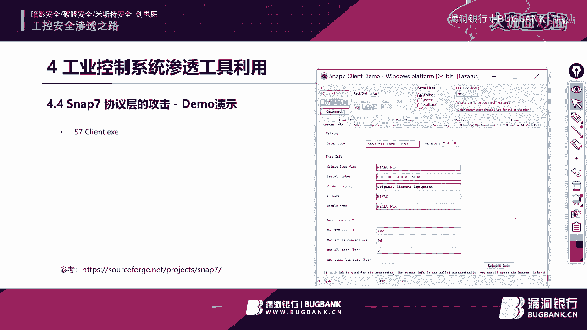

这个台机上。那我们来看一下这个这台仪器啊。嗯。还家可以看到吗？就不是这台机器啊，这台机器现在已经正在是运行着呢啊，大家看到了吧？

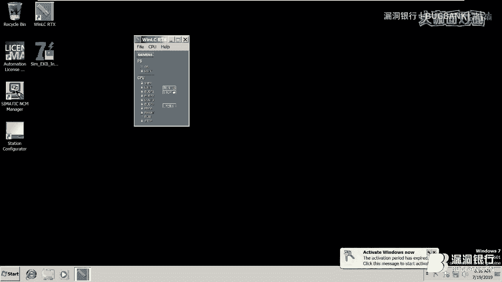

那我们是连到上面去了，我们会看到这里面所有的这些信息。并且呢我们可以在这里面去做任意的读点啊。这里面可以去做任意的读写这个数据大家可以看到吗？这些指令都是可以做任意的读写的啊。呃。

那这个呢工具呢就是你可以在这里面去改变数值啊，这都是可以的啊。这个呃地址是在这儿，大家可以机会的话可以去研究一下啊。

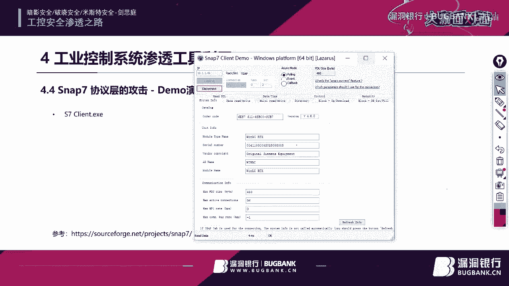

另外呢还有呢就是我们的。嗯。还有呢就是我们的刚才的ISF啊，就是我们的开源的。攻击框架。这个空气框架呢就。提供了很多种PC的一些遗漏在这里面。那我们我们先我们先测试一下啊，这个到底有多少K漏。啊。

大家可以看到哈。这里面嗯它有西门子S730400PLC的啊，有Q这个Q是一个实时的操作系统的。完了有施耐德的PLC啊，这个昆腾140的这款PC的控制有VX works的1个RPC的倒次功。啊。

还有那西门子的S71200，还有rockcor microcrologs1400啊。还有呢就是传统的这个ARP的这种pos工，还有这个SMP的这种这个这个停质上的工。那我们在今天这个演示里面呢。

我们就用西门子的这个。S7300400这个吧。Ps。它是可以自动补题的啊，就是让我们会更。方便一点，我们受一个op。那他第一按会让你输一个tt啊，大家会发现这个和MS这个maxpl很像啊。

这个但是它是用pyython去开发的，不是拿这个relic开发的呃，那它的这个这个框架呢是参考了这个root exploit去整体在上面做的一个这个。改变那我们来看一下啊，就是他get你要去设定一下。

比如说我们刚才那个。那个IP地址啊设定这个。这他改的应该是10。1。1。49。呃，那我们来看看执行命令啊，这个commond啊就是一呢是star pC就启动PLC二呢是stop pLC。

那现在呢是默认是要停止这台PLC啊，对吧？那我们来看一看。我们现在看一下CPC现在是在运行的是吧？😊，没问题。OK那我们这个的时候呢，我们。这个我们这边先。先收一下给大家收一下这个。

sop是不是我们已经写进去了？okK但我们看到已经都写进去了。那这个时候我们只要一起抄一个run。就会进行一个停止命令。那我们大家来看一看。啊，这个PC已经停止到了。我大家发现了吗？已经被停止掉。

是吧大家有没有发现你到？那这个的时候呢，我们在这个这个。这个s完了我们把它设成，我们它硬起来，对吧？注一下。大家看到了吗？这个PC改运行况。啊。那这个呢就是我们的一个呃这个披漏的一个风景演示啊。

那在这里面其实都已经定好了一些命令。包括刚才大家可以看一些呃这些披漏是是可以去用的啊，大家可以再学习啊，但是这个。

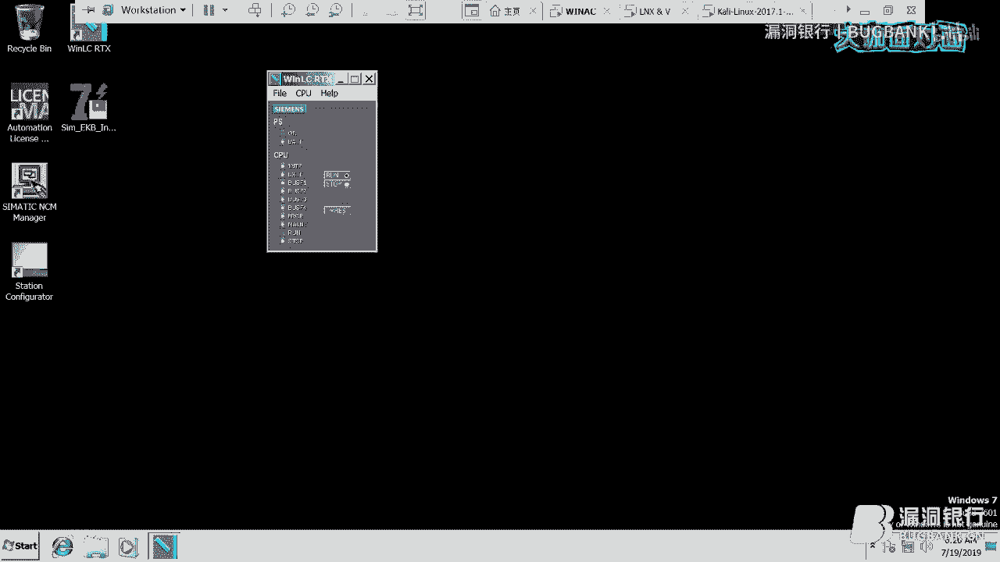

不要用在司法的这个翻业用堵上啊，这只是一个决定。O。呃，那在这里面的话呢，给大家讲了这么多。那最后呢我要给大家。

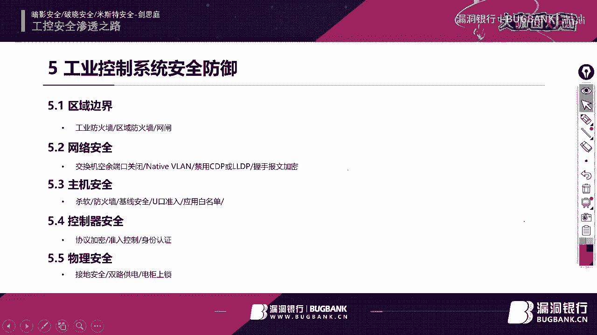

演示一下那PC是什么东西啊啊，我们来看一下。

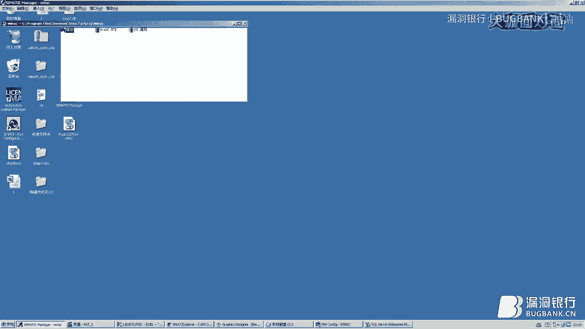

呃，那这个环境呢就是我们的。这个组态环境啊，那这个软件叫sematictic manager啊，就是 type7，不会让你创建一个项目。这个项目里面呢你去创建一个名字，这里面去做一个硬件组态。

我们还可以看一下这个硬件组态。是我们的PLC的组。大家可以看这里面我们会拖出来1个winLC的1个CPU拖出来一块以太网卡来做成么。大家可以看到这个这个版本了吗。和我们刚才外面读过来那个版本是一模一样。

那这个就是它对它的硬件配置，硬件配置完之后一定要选择下装。下装完之后呢。开始编写程序。啊，这个就是认程画面。啊，这个编程画面就是我们所谓的梯形图编程画面。大家会发现这个和我们啊用的写的程序好像截然不同。

是的是的，这个非常不同啊。这个是给电器人员做专业用的。那大家会发现这里面是有一条条的这样子来去空灯块。大家可以看这个名字哈，就能这个界面都是指令啊，你要往里面拖入哪个指令，这个都是可以往里去拖的。

拖进来就行。有例子啊，大家可以发现。看了吧，然后我一松手给拖上去啊。那大家看是个DB区域啊，DB区域在哪儿呢？啊，DB区域DB区域。这块里头OB这个个组，它是真正执行程序的BB就是数据区域啊。

就是你创建多少个DB块，这个是在PC里里面会给你定死的，那你就自己去创建吧，反正相当于我们画出来那个变量的那个呃区域是一样的。这里面模拟的是什么呢？是一个整形直向加。啊，那我们。看这个边两只哈。

里面是在赢，一直在跑着的，我们不管它。这里面的话呢就是。DB1的O一个字首字加上一个一付给自己，让自己循环加一下一条命令呢就判断你是不是等于DB2。如果DB2呢就会把这个零付给在上面。

我们在这里面可以有个监控。啊，大家会看到这数值是一直在加的。大有发现吗？我这是一直在家的。那加到100的时候会自动清零。再到100就是自动清理。嗯。但是大家有没有发现，其实这个程序是有就有bug的。

他会发现这个程序是有bug的。如他这上里面写的是等于100。如果在这个时候有人啊有人把你这个数值V一的数值恶意的调成101，大家想一下吧。永远不会等于100，它会跳一直涨到个一个字的最大32767。

那32767直接就溢出溢出完了之后呢，哦负的37锐计一直在循环回来，直至再等于到100的时候才会停。所以说那段时间。是不可控制的。如果举个例子，我们要求再循环100次，但是呃循环了这个32767次。

两倍的32767。那可能现场这个设备已经坏掉了。啊，所以说这段代码就是有问题的啊，我只是给大家列出来一下。那大家可以看到这个我是给大家列出一个这样的一个这个这这个行为哈。嗯。

🎼另外的话呢就是还有呢就是这个软件，这个软件呢叫做VCC软件，它是一个专门做画面监控的啊，这个左侧呢也是项目数，右侧呢就是你的比如说我要在这里面去建变量啊，这个变量呢是连接你下面标C的这个变量。

你可以在这里面去创建画画图啊，这个图因为我其实在这里面已经创建好。也创建了一个这样的会。那你在这里面呢？还有一些其他的要去做报警啊、历史记录啊，全局的脚本啊，还有一些用户的管理啊。

在这里面把它运行起来的时候，一行就会形成一个监控的界面这个前端显示。第一个变量我是给了一个本量01，就是非0记1啊。举个例子，我给个一有一回车敲进去了，给我给个十啊。关且不管用，还是一啊。

只能接受零或者一。下面这个变量呢是几电了，你比个35。5。啊，也可以是吧，有数值。来。也可以，没有问题。当家还有没有没有记得哦，我在那个攻击手册里面那个漏洞里面经提了一个叫做com。啊。这个软件其实是。

嗯。其实在这里面哈，它每一个运行的这个东西里面。哦。主标都是有脚本的。举个例子，它在这里面，我打开它的一个脚本啊，这个脚本是它一个真正去执行的一个事情啊。那我在这里面去调了一个脚本，有BBS啊。

只是一个这样的一个行为哈。大家可以看到吗？它会创建某个某个目标，这个可能不太明显。我们还有另外一个啊，我们还有一个写值的，这个是要我们要真正去做的。他的任何的一个东西都可以挂脚本。大家可以看啊。

在这个行为里面。有一个叫做HMIrun time，完了一个texax的一个属性。完了有一个方法叫做rightite写一个数值。那这个就是它的com。对象这个是就是它的属性，这个就是它的方法。

这个呢是用于给winCC自己内部去做一些动态的这个这个使用。举个例子。那我们现在写一个直进去哈。这个事件性set tag10。2，我们就给他1个10。2进去，对吧？他是让是为了让你干这个用的。

但是他没有去做很好的保护。那做很好的保护之后变成一个什么样的一个情况呢？我们大家来看一下，我这里面。

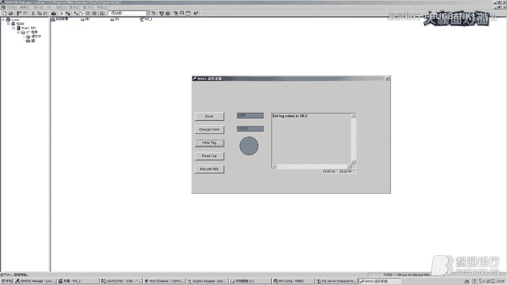

我在这里面做写了一段脚本。因为于com的这种攻击方法有很多，我就拿VBS来去做啊。嗯，我声明两个变量，第一个叫HMI变量。第二个是S变量啊，设定第一个变量呢，我创建了一个叫做CCHY卖run time。

啊，完了点儿。哎可以看到和这个局像一模一样，H产卖软坛。啊，这个对象直接com对象直接引到HMI上面，通过它再调用tag属性。而，我们刚才在这个变量表里的这个变量，大家还记得吗？变量2太。

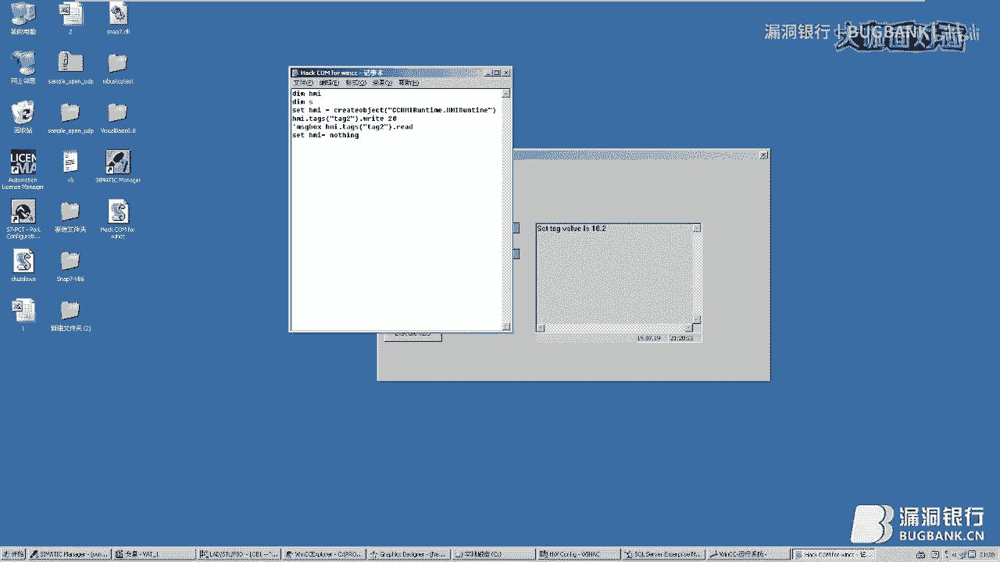

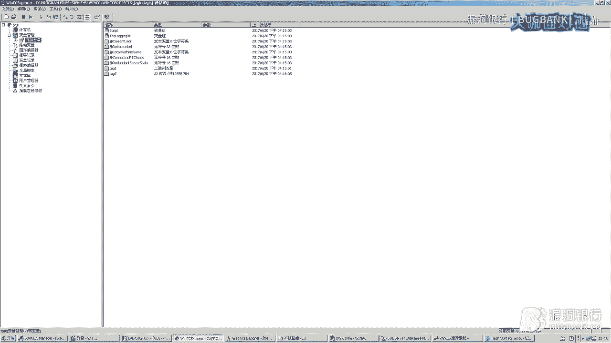

点出来这里面还。完了写写什么减20。完了再把最后把SHMI这个对象释放掉。是一个非常非常简单的AS轴。我们来看一下，我们如果一旦执行完之后，理论上来讲，这个地方就会变成20。哦O大家看到了吧。就是一个。

我没有在里面点任何东西，我没有再去做任何的工作。我只是在这里面装击了这个脚本。那这个脚本大家可以看，如果你放病毒，放杀毒软件，它也不会检测出来。因为它是一个很。很正规的一个执行的东西。

但是它可以扰乱你的工业生产啊。

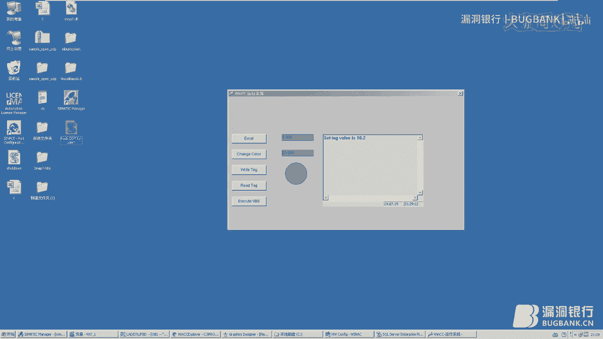

呃，这个winC呢是一个非常非常强大的啊，这个也自我介绍一下啊。当年我在西门子工作的时候，在德国西门子。只做开发。所以我这个有这个问题呢，也是因为。呃，还看到这个。大家会发现吗？

这里面它有1个C动作VBS动作。那VBS这部分的所有的代码呢是由我来去开发的。比如说真正的VBS脚本的引擎是我在西门子同时在我穆尼黑那边去做的。所以说在这里面我们我深知其实它有很多的问题。

包括这个comm封装完之后，在外部其实理论来讲，它应该有一个容器，只有自己内部容器的人才可以访问。但是并没有去做限制。没有做限制的时候，那外部容器也是可以去对它进行访问。那也是一个漏洞。

那我们曾能经也提交过。但是好像。有了反馈吧。O。那我刚才呢把这个攻击的这些东西呢给大家这个打了一下。那最后呢我说一下，最关键的一就是我们的防御啊。一呢就是边界防御啊，在传统的自动化领域里面。

天界的概定很模糊啊，基本上没有什么太多偏界。所以说呢在未来的工业控制系统里面，呃，如果大家要去做防御，一定要划清边界，哪些是零区域，哪些是一区域的，哪些是二区域的区域区域间要不要。这个工业防火墙。

那呃工业的这个区域与IT区域结合的时候，要不要放区域防火墙，甚至可能在一些特殊的行业里面，比如说现厂的行业里面，可能要具有三线网闸的存在。呢需要大家进行考虑。第二呢就是网络安全啊。

就是呃纯二层的就这种播放机的这种。如果不用端口一定要不容，要不然呢你就是在指令里把它炸掉，要不然呢就采用物理端口把它关上。另外呢还有就是本城微烂的设定啊，一定要记得改掉本城微烂。如果不改的话。

它默认是微烂一，那微烂一的话很容易被攻击进去。另外呢就是还有禁用CDP和LLDP这种发现协议，可以发现这个资产一定把它利用。另外的话呢就是过一些呃过手报文的这种发密啊，比如有起路由啊，起什么样的。

把这个报文一发密。在5G安全里面呢，这个尽量尽量啊安装沙软和防火墙啊，其实该软件并不是说不能安装，而是因为在传统的时候呢，工业厂商呢。不太愿意去研究到底哪些端口和哪些兼容性。因为杀软有很多种。

这个所以兼容性如何啊，他们懒得去测试，直接就co诉你把它全部关掉。在未来啊我们会看到所有的杀毒软胶和防火墙是必须要存在的。另外呢就是一线安排，这个非常非常重要啊，也是。

我我看到了有很多的这个工业控制系统，就是公安系统根本就不做任何机器安全，就直接就是上了去了。另外还有有优口的这种准路啊，就是USSB不能随意，它都知道阵网吧。就是因为因为呃它是一个格力的网络。

即使想从外网渗斗进去比较难，是U口是一个非常非常方便的途径。呃，另外呢还有就是应用白名单，一旦被感染之后呢，如果你启用应用白名单之后呢，那些呃恶意进程无非是挂到了一些特殊进程上面是可以起起来的。

这个普通的都是启启动启动不了的。另外呢还有就是咱们的控制器呃，尽量采用协议加密。比如说用户说这个我这个控制器人厂商就不支持加密，趁机口户加密，其实是可以采用终端进行IPs加密。大家能理解吧。

虽然厂商是不能加密，但是你可以在前端加上IP赛加密。另外呢就是入控制要启用，这里最好有身份认证，就是802。1叉啊。LC可能没有办法做身份证个认证了啊，但是有部分的POC现在已经支持了啊。

罗克尔的PLC可以支持了啊，但有如果是国产的那种，不支持身份验证怎么办？是把控制器的那个端口和交换机的端口作死啊，不允许他往下拔下来。如果你想想连交换，两连控制器只能接入交换机，交换机上面盖802。

1叉做。之后呢就是物理安全，就是接地一定要做好啊，一要双路供电前贵一定要上锁，去随意的人进行突出啊。OK那最后我这个我已经这个基本上也都讲完了啊，我刚才看了一下表啊，非常非常不好意思。

整整讲了一个半小时啊。超了半小时。那这个呃后面呢这是我个人的微信号啊，这个电视亭邮箱呢是电视亭艾Pmail完了gihub呢是电那个是GDhub杠电视亭。

完了呢也非常这次感谢啊暗影安全客体安全比斯特安全这个三个这个安全团队有我的这个支持。另外呢呃也敬请大家关注一个烟货满满的这个。社区呃。这个圈子社区在个圈子啊非常非常好，尤其是在内网和外网。

另外如果大家有这样一做公控安全的话呢，可以关注一个公众号，叫它限制公控。那它呢主要是以公控技术为主。但是在上面的话就会发现它有很多公共应用，通过这些公控应用来发现这个公控上的一些漏洞或者脆弱性。

另外呢最后呢这个也做给自己做个广告吧，敬请关注明天的看雪2019的安全峰会啊，那我在上面会有一个的一个主题。针对ECCS的一个脆弱性的一个分析啊，主要是一个实际的渗to化的一。

那这个另外这一侧呢是我的这个二维码。如果大家这个。讲这个私下交流这个技术呢也可以扫一下二维码。OK那我这个就说这么多啊，fancy。SC不好意思，是不是对了？嗯，没关系没关系，我来啦。好的。

非常感谢健思婷大咖的讲解，内容非常的详细生动，辛苦啦。那各位认真听讲的小伙伴们可能还会有一些疑问，想向大咖请教。那下面就进入我们的行长问答环节。大家可以继续在聊天区里发送问题。

健思婷大咖会选择高质量的问题来进行回答。进行互动问答，还有机会在稍后的福利赠书环节获得大咖送送出的书籍，集成架构中型系统。那现在就有请健思婷大咖来勾选一下聊天区上方的只看提问的选项来查看和解答问题吧。

O那我们来看一看公控方面从哪方面入手，比如协议和答是这样子的，从公控安全这个角度来讲，其实是分为这个协议安全啊。网络安全和固定安全。其实主要的是这几这个三个层面。😊，那呃固件安全其实是最核心的。

是呢要取决于你有没有二进制逆向，就包括我自己在固件固件安全里过。那我我我个人可能是偏重于网络安全和协议安全。所以说如果入手最快的话哈，入手最快的话应该是协议安全。但是呢呃不太好弄的是吧？

因为它这个构建的这个环境啊，得需要你有1个PLC啊，或者甚至说没有PLC也需要有这样的一个区机，让你来去实现你要看到这个比拿尔，你去抓包哈，否则你也不知道他做什么，对吧？

那这个荐大家可以从协议这个角度做公控安全必须有汇编基础呃，不需要不需要呃，你有pyython的基础，可以汇编没有绝对的关系。如果你做二年制逆向。需要普变的技术。为一般转为系统的具体路径。有呃。

大家可以关注。呃，关注那个不知道大家知不知道那个呃知道创宇有T学院，T学院里面有一个公共安全的这样子一。另外呢还有呢就是大家可以关注那个刚才我说那分子社区，未来呢它也会当公共靶场。呃。

据说是可以免费给大家提供的大化需要再搭建了。在上门。申请个账号就好。从甲方的角度有哪些防御的思路，防御设备个外部什么甲方的角度，我刚才提到了那个5个防御，说参照这个5个防御的这个角度去做。其实外b层面。

并不是依靠于你来去做防御的，更多你要从网络层面，因为外部是由厂商来去做。如果那部分厂商并没有做好，谁业也做不好。那请问共行网中的办公网是不是完全隔离的？嗯。90%不是完全隔离，是不是单向光闸能否合规？

这个取决于甲方的要求，在电气这个电厂领域里面都是单向网闸或者光闸隔离的。但是有一些呃其他的制造型企业也是有用防火墙。靠背防火墙双端防火墙按DMZ区域来去构建的，这个也是有的。

公共渗透的流程和模式什么样啊呃，念书是吧啊。这个共的渗透啊和我们传统的外部渗透有很大的区别哈。空控渗透多数呢会采用百度攻击啊，是百度攻击啊，这是但是没有办法直接接触到这个网络的。

所以说呢一般呢要结合社工去做啊，就是你冒充是的供应商啊进去啊，或者是通过外部的方方式感染用户的。这个这个移动办公电脑，因为多数他的移动办公电脑会去连接控制系统。这个数是从从这种这个路线进去的啊。

像那种从外部打透呃，跨到内往横向转下去。基本上现在来看这种机会比较少。是在。国外哈有很多，因为他们当时构建的时候，已经把两网融合在国内很难做到了。呃，有哪些书籍可以推荐？呃，说句实在话哈。

公控安全这些名里面书真的很少很少。呃，我我其实还是推荐大家刚才关注那那三个组织，那里面会有一些共的一些讨论。如果非要说书的话呢，有一本公控安全的呃黑盒大揭秘也还可以啊，可以推荐看一下。呃。

拿到安全区的采集服务器，后面就没思路了。你已经如果你已经拿到素材服务器了，拿到素材服务。其实你的一个目标已经完成了，因为是这样的。呃，你要看你的目标是什么，你到底是要破坏控屏还是拿到数据。

如果只是要拿到数据，你拿到素彩服务器的时候已经可以了。通过。助产服务器里数据区，不管是OPC的协议，还是于circle server的那些，可以直接连过端就端走。如果是对控制器进行攻击的话。

那你需要对协议进行理。因为素材很少具备往下写数据的这样的。对公共协议模糊测试出来的对应某一位嘛？如果有私有协合同易协议。是这样子的，呃，模糊测试并不是你完全模糊的，一定是基于你对协议熟悉之后。

你才能去做模糊测试。可以说我我在懂这个协议的情况下。首先你第一个要去把协议所有的全部。了解清楚，包括每一位市长对吧？范位啊，了解之后再那个去做，比如说达长恶意啊重复啊这些。

1C有没有PIE之类的溢出保护，有有有有有有。然后有的有的。风评公共项目。现实当中如果去做封便项目呃不会的。呃，渗透测试一定是客户会给你一个实验环境，它，完全模拟后才会让你做。

不会让你在真实的环境下去做渗透。因为你一旦。砸坏了PLC现场的这个出现这个整体的生场事故的。所以说做评保的时候，一般主要是这个脆弱性和采集会做一些，不会让你做测试。测试成如果有预环境和啤酒C这。

这样子在公控网里头，30%的是有预有预用过的，70%都是work group的。所以说呃你拿下有没有预，就要看它的这个环境。诶。如果有预环境的话，其实你比较轻松的是能够拿到这个呃内网的这个权限。

说你创建这个RDP的后门。进去啊，你可以做任何的这个这个远控，这个都可以的。但是。呃，风控的这个。这个渗头拿到桌面并不是我们的本质，一定拿到数据或者是你拿到了控制权。也就是说你一定要对。

开软件要有一个清晰的了解，你至少要会去了解它怎么去用。拿到桌面之后呢，你可以启动那个软件啊，去呃导出数据也好啊，还是去做一些呃呃。恶意的这个执行的行为啊，当然这个一定是在用户不权的情况下去做恶意行为啊。

要不然的话这个。LC硬件上是否会有调试的？呃，POC上面是有，就是不好意思，都已经被这个封装到里面了。你除非把POC拆下来，才可以有这种这种这个这个。路口啊或者邋他知道这来。

我看呢就是我看还有公共维护人员的培训啊，是这样子的。呃，做公共人员的这个人员生产的这种培训呢，主要是是要最好找一些公共安全专业做培训的这种。机构啊，比如说呃像。这个据我所知哈，会有一些，比如说像呃嗯。

卡啊，还有一些呃威诺特啊，他们一接会去做一些专业的这种公控的这种安全培训。去去了解一下。呃，怎么调试PC提取固件哦，这个呢是比较大的了啊。提取固件嗯，这有专业提取工具的啊。

每个厂商都有自己的提取这个件提取工具啊，完了你可以呃按照那个固件来去做这个分析啊，这个呢呃题目比较大。如果大家对这个比较感兴趣，可以私下加一下我好。去股东。呃，生产网完全未完全，那就是呃一定要做好边界。

边界的安全是你的首要的防范啊。完了呢就是还有呢就是你的呃。收换机叫端口安全。因为。其实从这个其他的网进到你里面，除了边界之外，更多的就是我们经常用的就是社工的这种方式啊，这个就是。模仿一个供应商啊。

接入到你内网里面，或者是你有wifi啊那。这上面会不会装操作系统，每个POC上面都有自己的操作系统。比如V works呃应用的很广。没错。是个我的手机来回。呃，一定是他会给你提供一个特试的环境。

不会让你去在生产环境上去做一个增度测试。与离散性的功行也有点了。首先我要说一下啊，油田和油井不属于离散性的公控，它这是属于过程性这个。统一的介入区。是不是应该建了一同边界技数据，这个不一样。

你要看你的这个边界的界定到底是是怎么划分的。这个是由于你划分。Wen。公控学到什么程度可以找到行驶证。这个我就方便说了，兄弟啊，这个这个圈子里。呃，公共安全应该现在说是人才比较紧缺啊，确实缺口比较大。

我不知道大家有没有关注韩校长曾经谈过一次这个这个这个缺口真的很大啊，而且我相信这个薪水应该。可试试会少啊。请问这个摄长设备是否有安全测试，有专业漏道会造成的？车检设备是否成熟？呃。

现场设备是否有必要做安全吗？嗯，呃我不知道大家看没看啊，空控灯板2。0里面提出了一些安全保护，但是呃不够完整。就是作为这种呃这个纵身性防御还不够完整。所以说像空控漏扫啊，包括温学检测啊。

这些东西都是应该具备的，有条件的情况下，但是往往的工业用户呢，这方面投资的意识并不是很长，一般都是碰到了事情之后才会有要求这个医院去增加。所以说呢。这以就看运气了，你碰到客户，有的人就来愿意用有。

据我了解，bos能力很多啊，是的是的是的，这个。我上次拿1个ARP打死很多的东西控制器啊，包括施耐德的啊，所以说确实很弱。它的弱其实源自于它的这个芯片这里面的能力啊，因为它不像咱们CPU处理强。

确实只是一个专有的这样的一个产品。会变和PC会变有什么区别啊，有一些区别令级的不同啊。双端SF啊，这个很简单啊，嗯，嗯你的P票C的出口内侧直接连一个。工业的路由器，你的上位机这一侧也加一个工业的路由器。

两端直接跑哎这个成输的IP赛就可以了。完了这个双端IP赛就可以啊。呃，之间他是可以达它达成透明模式。PLC与PC连接相连PLC怎么读？是这样子的，呃，它会有两种型呃型号，两种这个信号。

一呢就是4到2毫安，就是弱电的这种通过4到2毫安来读取你的一个百分比。另外呢就是还有一种唯一的判断，你是不。那一般呢就是0到24伏，零伏就是0，24伏就是一啊来读取这个状态。OK那我这个基本上。

我问完了吧。我这边嗯好的，一哥对应该是回答完了。嗯，好的好的，辛苦了辛苦了。那健思婷大咖每一个问题都很细致的进行了解答，真的辛苦了。然后呃可能大家还会有些问题可以私下再做交流。今天因为时间也有限。

我们的那个答疑环节就先到这边啦，非常感谢健思婷大咖耐心细致的解答。那接下来我们进入下一个环节，也就是大家最期待的赠书环节。本期证书是健思婷大咖精心挑选的集成架构中型系统。

大咖你能不能简单的说说为什么想要送这本书呢？呃，是这样子，如果大家去做空控安全的话呢，首先你要了解什么是空控系统。那那本书呢就是我们我厂商啊，就是我厂商特殊的一本通行控制系统的手册。

他呢是描详细的描述了这个这个空行控制系统如何使用呃有哪些功能啊，包括它的一些应用案例，通过这本书。😊，大家可以了解到这个针对这款产品啊呃了解到工业控制系统到底是一个怎么样的一个东西，上面写的非常细啊。

所以说呢我觉得是针对空控安全或者是想同事空控安全呃一个。比较呃偷懒的一种方式吧啊，就是快速的了解这个啊到底公控是一个什么东西。过过这本书就可以快速了解到。那上面其实是没有讲任何关于安全方面的东西。

如只是告诉你什么是公控啊？嗯，好的，谢谢金视屏大咖的解答？那大家听完大咖的解答，有没有觉得这本书是是一本真的是一本很好的书？大家是不是都已经心动了。那究竟谁会成为那个获得大咖唯一青睐的幸运儿呢。

下面就请大咖来选择一位幸运观众吧。金视亭大咖，请你在直播间里选择一位幸运观众，并将它设为幸运吧。好好，大家看一下。😊，你，可以看一下。OK我就整这个这。哎，我看我怎么连了？OK我已经写完了。😊。

选好了是吗？是谁能不能读一下他的ID呃，ERMEST3R。哦，这么复杂的ID对不起打扰了。好的，那让我我们就恭喜这位直播间ID为DRMEST3R的小伙伴，你将获得对应的大咖证书。请你根据直播间的提示。

留下你的联系方式，或者在直播后私聊我进行兑奖吧。好啦，呃亲爱的观众朋友们，今天的直播已经临近尾声啦，再次感谢健频大咖的用心准备和精彩演讲，一如既往的本期直播的录屏将会在下周五发布。本直播间地址固定。

喜欢观看咖面直播的小伙伴们可以收藏一下，另外也欢迎加入我们的技术社群，与广大志同道合的白帽小伙伴交流学习，共同成长。最后还是要感谢每一位观众伙伴的支持。如果你也想向大咖一样直播分享，欢迎找我报名。

大咖面对面是一个展示白帽风采和分享技术知识的舞台。这里不具年龄，不为自历，只要你有才华。😊。

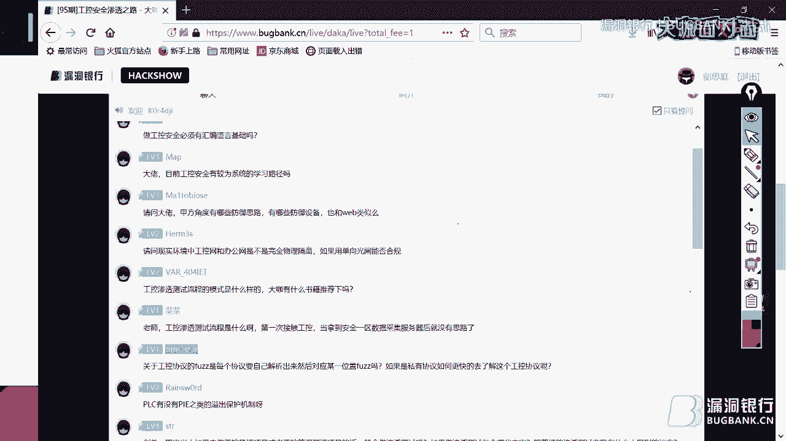

分享，我们都欢迎。好啦，大开面对面周五8点见，我们下周五再见吧。😊，电视频大咖，你来跟观众们道个别吧。哎，感谢各位小伙伴们啊，这个听了我一个半小时，也，非常非常辛苦。这个再此感谢大家。呃。

如果以后有谁来想去做这个公共安全的，可以加我的微信。完了咱们也做一个刚才有人提嘛，说跟一个公共渗透群，这也是可以的啊，这个也是可以问题啊。😊，在也非常反感谢fancy啊，这个这个我的这个支持啊。

包括这个一直陪了这么久啊。让非常感谢。没事，是应该的。嗯，没事。嗯，好的，那刚刚大咖说的那个公控渗透群，我们这边已经决定呃已经在准备拉一个微信群了。大家如果之后想进群的话，也可以先加一下我的微信。😊。

然后最后就是感谢大家今晚的陪伴，非常感谢每一位观众朋友对我们的支持和守候。最后跟大家说声再见吧，大家都早点休息，大咖今天也辛苦了，再次感谢。😊，哎嗯，大家拜拜，晚安哦。好了，大家再见。

大看你这边可以断一下推流了。好，谢谢。😊。

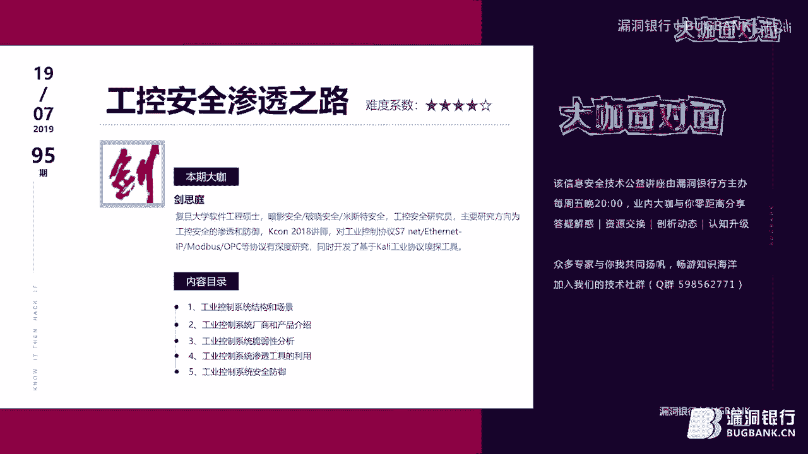

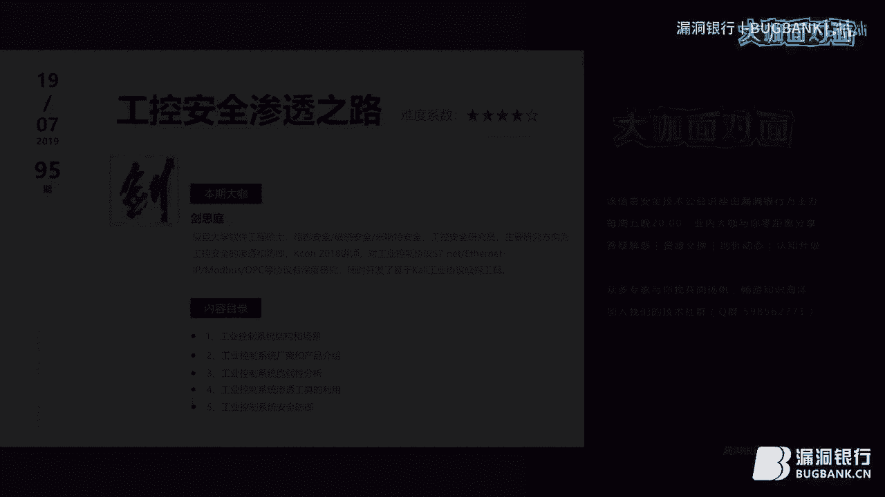

🎼I was doing just fine before I met you。 I drink too much， and that's an issue， but I'm okay。

🎼You tell your friends， it was nice to meet them。🎼るしで。🎼对 so。🎼幸福也。🎼压我更。🎼でした？No。

🎼pull be closer in the back seat of you over。🎼You cant afford by that tattoo on your shoulder。

Right off the corner of the mattress that you stole from your roommate back and forth。🎼Again all。

🎼Look good a and match you。🎼I left you I was。はい。🎼They never think what。🎼To soon that we beat。

🎼InTo son。🎼What break。🎼没哭诉。🎼担心。🎼You can for。🎼我也说。🎼我的谁。🎼的空。🎼却 that you slow。

🎼W me close to in the bank让 you over there。😊，🎼You can't afford like that tattoo on your shoulder。

 pull the shades right off the corner。🎼N that you stole from。🎼back in。🎼We never order。

