# 漏洞银行丨带你探索交换机的秘密-Angel丨咖面98期 - P1：98期录屏-带你探索交换机的秘密-Angel - 漏洞银行BUGBANK - BV1J4411R7Mm

为知识而存，因技术而生。小伙伴们晚上好，欢迎大家来到漏动银行ht show直播间，参加第98期大咖面对面。我是今晚的主持人fancy。😊，本月是webs safe团队直播月，整个8月。

每周都会由webs safe团队的核心成员给我们带来精彩的议题内容。那今晚将要直播分享的angroid大咖，有着6年信息安全研究经验，对新安一直都有一颗狂热的心。另外，N大咖还是一位硬件安全爱好者。

早在他面69期，就给我们带来过私人定制无线攻击硬件武器的议题。那今天它又带来了哪些新鲜有趣的技术干货呢？提前去透一下。今晚大咖精心准备了许多精彩的实战演示，感兴趣的小伙伴一定要认真听到最后哟。好啦。

下面就有请眼酒大咖开始今天的直播分享吧，大家欢迎。😊，嗯，好的。呃，大家好，我是抗面第98期主播安roid。今天呢给大家分享的议题呢是带你探索交换机的秘密，底层网络的分析与利用。

首先跟大家先介绍一下我自己呃，我是来自的web团队的核心成员，对于信息安全行业呢一直都有一颗狂热的心。这里为什么呃提到了信息安全呢？因为我认为信息安全呢也不仅仅是局限于就是搞战搞内网。

我认为信息安全呢可以覆盖到任何信息技术中的安全。😊，然后呢，我也是一个好奇心极强的人，什么东西呢？我都想试一试，搞一搞，喜欢对未知事物进行探索。啊，当然了，我也是一个硬件安全爱好者。

目前呢学习的方向呢是搞那个物联网嵌入式和无线电安全。呃，如果说有这方面经验的前辈呢可以带带我，毕竟我还是刚入坑。虽然说搞了好友的技术，但我依然是团队里最菜的成员。😊。

嗯，那我们现在就开始吧。首先呢介绍这个议题之前呢，有很多人问我，为什么要选择这个议题呢？路由交换到底有什么用？我也不是运维，我学它干嘛？面对这样的疑问呢，我做一下回应。

实际呢路由交换在内网渗透过程中有非常大的作用。因为在大很多大型企业内网里面内网呢都是有多个子网的，不仅仅局限于一个C类的地址段。很多人在内网渗透的过程中啊，可能在企业网的出口边缘进入到内网的边缘以后。

只把这个眼光呢瞄准到当前所在的一个网段，一顿操作猛如虎内网渗透完了，殊不知自己渗透的内网仅仅是一个呃企业内网的一个小小的一个区域。但是呢有路由交换接手的人呢，它就会想办法把交换机域搞了。

然后在交换机里面查看相应的路由表，然后根据相应的路由表呢以及微烂的信息以及对应的接口信息呢挥出整个网络的一个拓扑图。在。😊，一个一个的搞内网中的磁网。啊，这样呢在渗透的过程中呢。

就可以呃完全的掌握目标内网信息，并且实施相应的对策。其实呢我目前看到的企业基本都是呃呃网络的一个出口边缘做的非常好。什么防火墙，外不用防火墙入侵检测，入侵防御直接给你一条龙。实际上呢嗯边缘做的非常好。

呃，但是基本你去对应的企业，连他们个wifi，你就会发现哎呦这个交换机的密码怎么是默认密码AC的密码怎么也没有改啊，居然连监控的密码都是默认的，啊，可能经常去。酒店的同学们都知道吧。

然后废话不多说进入正题吧。首先来介绍一下目录啊，一共有4个小节。第一小节呢是交换机支持的基本协议的介绍。第二小节呢是底层网络协议设计存在的缺陷。第三小节呢是使用这个python呢来对这个交换机进行渗透。

第四小节呢是如何避免这种漏洞的产生。先给大家介绍一下什么是交换机呢？😊，什么是交换机呢？就是简单来说就是把网络中各个节点、客户端以及一些网络设备连接起来的一个工具。在交换机出现之前呢。

也有一个跟交换机类似的一个东西叫集烟器。集电器呢也是跟交换机一样，嗯，可以把网络的呃网络设备连接起来，而且这些网络设备呢也一样可以通过集电器来实延通信。

但是为什么现在咱们大家要用交换机呢给大家做一个小实验。😊。

首先呢我这边有一个案例啊，现在我们用的这个模拟器呢是一个路由交换模拟器，是华为公司的一个华为的一个模拟器。现在呢我们在这个模拟器上，中间的这个设设备呢就是交换机。

然后呢三台这三这三台设备呢就是我们正常的电脑。然，我们现在把他们它给启动起来。啊，现在已经成功的启动起来了。然后我们对这个交换机的二口和三口进行抓包。啊，我们来看一下这个交换机和集烟器到底有什么不同。

啊，这两个哪个是二口啊，哪个是。呃，哪个是二口，哪个是三口，呃，不重要啊，我们先来试一下就知道了。首先呢我们现在对的是交换机的这个二口和三口进行抓包。然后我们拿PC1来听一下这个PC2。

让PC1跟PC2进行一下通信。呃，一共发送了两个数据包啊，我们来看一下这个。

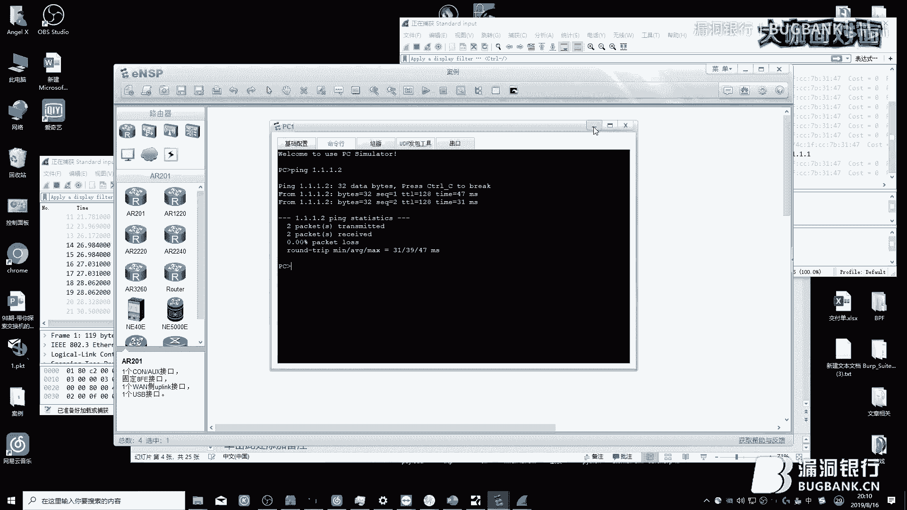

他的这个。数据包是在交文机中怎么传输的啊？首先呢。首先呢这个PCE呢会发送1个ARP的一个数据包。就是说呃。谁是1。1。1。2，我是1。1。1。1。然后呢，这个数据包呢。

它是它这个数据包呢是LRP的一个呃请求包。这个请求包呢在交换机里呢，它是广播的一个数据包。广播的数据包呢这个数据包呢交换机就会。把这个数据包在各个端口进行广播一次啊，然后呢。这个数据包发送完了以后，呃。

因为这个是广播数据包。然后呢，这个PCR呢，因为它是1。1。1。2，他收到这个消息以后呢，它会也会给这个交换机里发送一个应答包。应答包呢是这样的，就是说我是1。1。1。2。

我的卖地址是这个5454F4啊，这样这样这样经过1个ARP协议以后，两台两台PC就可以直接进行通信了。这就是他们通讯的数据。但是我们可以看到啊，在这个三口中。

三口中它只它只有一个LRP的一个广播的一个包，它没有它没有这个它它是没法看到他那个PC1与PC2之间进行通讯的啊，这个就是交换机交换机它的给两台设备呃两台设备之间通信呢，它的方法呢是转发。

就是说交换机呢。是那个是会把所有的所有人的这个麦A地址呃，给大家看一下吧，说了这么多。就是说交换机呢会把他们两个的卖地址记录下来。然后呢，一旦说有这个数据传输以后，交换机呢会根据这个卖地址表。

按照相应的这个端口进行转发啊，交换机现在已经记录下来了，就是说口一口一有1个0520的这一个设备。然后口2呢有1个这个54F4的设备啊，PC1与PC2进行通讯的时候呢。

交换机会把这个数据直接根据这个卖地址表转发给相应的端口啊，其他的端口也就是这个3口呃PC3呢是不会收到了。那我们可以再来这个拼一下这个PD3啊。我们会发现这个这个数据包也是一样的，是。

可以在这个口进呃抓呃抓包抓这个三口的时候，会发现这个包会在三口中出现，而不会在这个二口中出现。这二口是只会收到广播的一个数机包啊，但是极限器呢。集电器呢就不一样了，集件器呢它自身是不会形成卖地址表的。

给大家看一下，我现在放个集电器给大家看一下啊。嗯，然后把他们三个给连接起来。然后把这个节线器开启。嗯，我们把这个。Vsha给关掉，然后再开一下。啊，再对这个一口和二口进行一下抓包。

我们再拿这个PC1来拼一下这个PC2啊。我们会发现这个机。呃，这两个抓包里边，他们它它的这个它的这两个口P3也是可以接收到PC1与PT2呃通讯的这个数据包的啊，这个是为什么呢？

因为集集电器它自身是不会形成卖的地址表的，但集电器也可以使也可以使网络设备之间互相联通啊，交换机的工作原理呢是转发。我刚才已经跟大家说过了啊，但集电器的原理呢，就是广播啊，把收到的这个信号呢。

直接直接在进行放大，然后呢再发送给各个接口，这样呢就会导致一个问题。也就是说无论是谁只要插这个集电器了啊，就可以看到整个集电器设备之间的通讯，这是非常危险的。当然了，大家现在可以不用怕，因为这种东西。

这种集电器这种东西呢已经不存在了，已经被交换机所取替了啊。使用几使用几件器呢，就是说任何一个人只要插上就可以直就可以实现那个秀膛攻击啊。

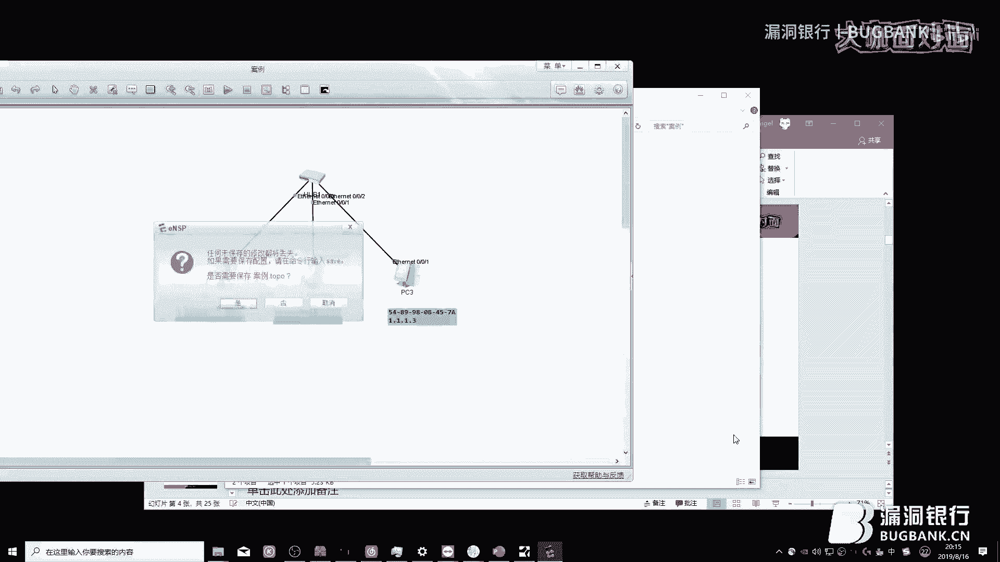

然后呢，给大家讲一下这个广播风暴啊，也就是交相机的环路的一个产生。这个是怎么回事呢？刚才我跟大家已经说过了，就是那个ARP的那个数据包，它是广，它是以广播形式发送到交相机各个端口的。啊。

如果说两台交换机要是这么连的话，两台交换机对连的话，而且有两条线跟两台交换机这么连的话，或者说把一根网线直接插到交换机上面，一根网线两个头直接插到这个交换机上面，这个交换机就会产生广播风暴。

这是为什么呢？呃咱们可以根据这个图来分析一下啊。首先呢呃交换机这么插是没有没有问题的。然后呢，PC1要是跟PC2进行通讯呢，PC1会发生一个广播的一个数据包，它从零口，它从一口进。😊，它从一口进以后呢。

它会广它会交换机呢会把这个数据包广播到各个端口啊。我们来分析一下，它首先它它会广播到了这个G0-2，然后PC2收到这个请求包以后，会给这个交换机放一个应答包。当然了，这个广播包的交换机里面是没有停止的。

因为它还会继续的广播到各个端口。所以说它会它也会在G0-3里面，也就是在这个三口里面。会继续广播。在这个三口里边广播呢，它会把这个数据包呢通过这个E口给到这个SW2上。

这个SW2这个交换机呢呃说到这个包也是也是广播包。因为呢呃SW2也会认为这个包是广播包呃。然后呢。这个SW2这个交换机呢也会执行呃一样的步骤。就除了这个G021这个口以后。

它会给其他端口再转发一遍这个广播包，它也会通过这个G022这个口继续的再传给这个SW1SW1说到这个广播包以呃以后，它又会呃除了这个接。除了这个024这个接口继续的广播给其他接口。

所以说它会它会这个这一个广播包，它就会无限的循环的无限循环的在这个交换两台交换机里产生。这样呢会继续的消耗这个呃交换机里的内存性能与CCPU性能。这两个交换机就一直转发这个转发它这个包玩的。呃。

也就相当于什么意思呢？就是两个镜两个镜子对着绕，然后中间呢有一个东西，然后这个东西呢会无限的循环下去。呃，出现这种出现这种问题以后，这实际呢实实际上来说呢，就是这个交换机就是无法正常通信了。嗯。

我们继续。呃，在这里呢呃第三点呢就是这个承书协议呃。生入协议的作用是什么呢？就是说这个呃消除消除活路，通过阻端冗余的链路来消除这个网络中可能存在的活路。然后呢，链路备份就是当活动的链路发生故障的时候。

可以激活备份链路，以及恢复这个网络的这个通讯。其实是什么意思呢？就是说为了保证这个可靠呢？设计出来一一种环网拓扑，又因为交换机的原理呢会产生那种环路问题。就像我刚才跟大家讲的那个那种广播风暴的问题。呃。

为了解决环路，而且要设计出这种环网的拓扑，所以说才有了这个生成数协议。生成数与协议的原理呢，就是说通过这个协议算法呃选举出一个阻塞端口，然后也就是说把这个端口的那个转发数据包功能关闭。

然后从而消除环路产生。啊，但是他可是他是可以接收上证书协议的。这是什么意思啊？就是说呃这个这三台交换机如果说开启生成书协议以后呃，他们根据那个呃生成书协议算法，经过选举。比如说SW3，它是跟交换机。

跟交换机以后，跟交换机。以后两个所有的端口呢称之为指令端口。嗯，什么叫指令端口呢？这个指令端口呢是负责与其相连的网段转发报文。然后呢，根交换机呢上面所有的端口呢都是指定端口。然后呢，这两台交换机。

它它它不是跟交换机了。然后不是非根交换机呢，它这个跟跟根交换机相连的这个端口呢，也就是说那个输出域备之后端口呢称之为根端口啊，跟端口呢，一台非根交换机上只能有一个端口。

而且也是那个非根交换机跟跟交换机之间最近的一个端口。呃，什么叫阻塞端口呢？就是说。如果说这个这个网要是这样，要是这么连的话，肯定会滑路了。但是生成入协议呢，可能会把这个这个端口给禁用掉啊，那当然了。

那如果说把要把这个端口禁用掉以后，那它当然不会滑路了。虽然说你线插着，但是它在逻辑上给你禁用了啊，阻塞端口呢就是把在逻辑上给你禁用了。然后它这个端口呢可以收那个STB协议这么设计这个网络它有什么好处呢？

就是说如果说这条这条线要真的断了。呃，生成树协议呢也会正常工作，会发现这条线断了，发现这条线线断了以后呢，它会根据生成树协议的算法呃重新生成这个拓布，它会把这个端口。

它会把这个就是禁用的这个阻塞端口直接打开PCE要想连到互联网，它就可以直接这么走了，它可以直接这么走了啊，生成协议是这样。😊，然后呢再给大家说一下这个DACP啊，DACP协议呢。

其实在生活中是非常常见的一个协议。我们大家用的那个手机为什么连上wifi以后，它是可以直接上网啊？那你没有配置IP地址啊，可能有些人都不考虑这些问题。但是实际我们还是要考虑一下的。

因为你这个网络中有DACP服务器啊，DACP服务器呢，它的目的是什么呢？就是说给你分配IP地址啊，你这个手机在没有IP地址的情况下，可以根据DACP呃协议来那个申请1个IP地址。😊，DACB协议呢。

也就跟这个图上面写的一样。就是说我广播一个数据包，就是说我的IP地址是什么？我我的卖地址是什么什么什么，我想请求I，我想请求IP地址。然后呢，这个。这个DACCP服务器息会收到这个消息。

收到这个消息以后呢，他就会告诉你你的IP地址应该是什么什么走网页码应该是什么什么网关，应该是什么什么什么。这时候呢你的手机就会直接用这个IP地址，直接用这个IP地址啊，呃是是应该是可以直接上网的。

然后再给大家讲一下这个微烂呃，微烂呢呃其实就是虚拟局域网。啊，Vlan的设计目的是什么呢？就是说在交换机物理设备有限的情况下呃，分分出多个逻辑的一个字网啊，是什么意思呢？就是说我就是说我只有两台交换机。

但是我想划分三个区域啊，也就是说这个我想让这个PC4和P7之间是互通的。然后PC5和PC8之间是互通的，PC6和PC9之间是互通的。但是呢我是我不想让P4和PC5和PC6，它们三个互通。

这时候呢我们就使用了这个vline呃，Vlan是那个干这个干这个用的。然后呢，进入到第二点呢，就是这个底层网络协议存在的一个缺陷。啊，首先给大家讲一下这个ARP欺骗攻击呃，ARP欺骗攻击啊。

它是它是怎么回事呢？啊，首先呢刚才做那个小实验，大家也也看到了LRP的LRP的那个协议是怎么回事呢？就是说呃P当PC1和PD2进行通讯的时候，之前他会发1个LRP协议，就是说呃我的IP地址是1。1。1。

1，我的麦地址是5A07。但是呢呃我在我在找1。1。1。2呃，呃1。1。1点R收到这个消息那个回答他一下。然后呢，这个请求包到交换机以后呃，交换机广播以后以后，PDR会收到这个消息。然后呢，他呢会。😊。

他呢会把会在这个交换金里呢再传一个应答包，就是说我是1。1。1点R，我的麦ag地址是5DA5啊。然后呢，这个PCE呢自然会有个AARP地址表。它这个ARP地址表是什么呢？

就是说呃能记录一些IP与麦地址的对应关系。啊，记住这个对应关系干什么？是为了就是更好的在那个数据链路上直接找到他啊。这时候呢P3就来了PC3呢就是P3怎么怎么进行攻击呢？它呃也在这个交换机里传数据。

他在交换机里传什么数据呢，传我是1。1。1。2，我的卖地址是0134，而且这个这个数据包呢，PCPC3会不断的向这个SWE里面发啊，当然了，如果说PC2要收到这个消息以后，PC2肯定会直接把这个包丢写。

因为他自己本身就是1。1。1。2。但是其他人呢就比如说PC1呢，PC1收到这个消息以后，因为PC1也不知道这个应答包的真假。所以说他会把这个应答包也给记录下来。他会根据应答包，然后呢。

也会把呃自身的这个卖地址表给更新。😊，PC1呢它会怎么更新呢？它会更新1。1。1。2，对应着这个0134。那这样呢，PC1如果说要是想访问1。1。1。2的话，会根据那个数据链路层的关系。

直接会直接会找到它啊，就是说它访问1。1。1。2。因为因为被LRP欺骗了以后，它会直接找到这台机器啊，这就是LRP欺骗攻具。然后呢，给大家讲一下这个微line的一个设计缺陷。啊。

微line呢设计缺陷一共有两种，一个是DTP协议工具和这个双标签跳跃工具。呃，先给大家讲一下什么叫这个双标圈跳跃攻给啊。呃，先说一下这个呃Vlan的这个数据，在交换机里是怎么传输的。

首先呢就是说交换机带微lan的这个接口称之为那个exad接口啊，然后呢中间的这条呢能传所有微lan的这个接口呢。😊，这这两个接口呢叫创客接口。至于数据呃这个这个比如说这个P3到PC5。

他们之间通过Vline是怎么传输呢？首先P3发送的数据肯定是正常数据。比如这个数据呃，它的内容是什么什么什么什么什么啊，我又不不比喻了，然后呢。到这个交换机里呢，交换机收到这个数据。

因为是Sad接口收到数据以后，而且这个Sad接口有微栏呢，交换机会把这个数据呢上面再打上一个标签啊，叫微烂1。然后呢，因为打上这个标签了以后，这个是创口接口，创客接口它是可以接收所有微栏的，所以说它会。

😊，他会把这个带微1的这个呃微1带的数据这个标签呢发送到这个交换机上。发送到这个交换机上以后呢，这个交换机收到了收到了这个呃带标签，而且带数据的东西呢，而且交换机会比对一下自己的自身的一个v的数据库。

发现自身有微10。所以说它呢这个交换机呢会把这个这个数据包呢，这前面这个微1这个标签一解开，解开以后再把这个数据通过这个呃再把正常数据呃，发送给PC5啊，PC3和PC5之间微烂就是这么通信的。😊，嗯。

但是这个微烂实际有有些人有有一种想法呢，就是这个微烂能不能跨能不能跨微烂进行攻击。就是说我这个PC3访问到这个PC4啊，我们这么说啊，其实其实还是可以的。

就是说这个双标签跳攻击和个TP协议攻击还是可以的我们就拿这个PC1举例来说，比如说PC1是要那个跨微，它的微蓝1微烂一，它它怎么办呢？首先咱们都我刚才都已经给大家介绍了，它这个数据。

它这个数据呢到这个交换机里面，它是会被打上一层标签，所以说呢PC1呢勾到了一个这种数据包啊，就比如这个这个是数据，然后呢我这个数据包上面呢，我加一个V蓝1，我加一个V蓝10。

然后呢我上面呢我再加一个我上面再打一个标签叫微烂一啊，这也呃当然了这个数据包呢，它又有两层微栏标签啊，因为这个的接口默认呢它是不接收任何那个数据包上面打上微烂标签的数据。😊，但是他呢会接收。

比如说他是围栏一，他会接收这个数据包上面带围栏一的标签呃，当然了，这个标签这这个数据包呢从这个PCE到这个交换机中，这个交换机会看到它这个上层标签是围栏一，会然后呢会把这个围栏一解掉，然后再进行转发。

转发的这个过程中呢，它只解掉一层标签，它上面还有一个围栏室的一个标签。这时候呢。😊，交换机会通过创客把这个v蓝1的v蓝1带数据的这一个标签转发给这个交换机。同时呢自己呢也会比对一下自身的一个数据库。

比对一下自身的数据库呢，发现这个这个数据还是带10的。所以说它这个所以说它这个数据还会走向10，而且这个PC3也就是说P3也能收到这个v蓝1的这个数据了。当然到这边也一样，就是说它这个带1这个数据包啊。

到这台交换机上以后，这台交换机会把这个10的这个标签给解掉，解掉以后来再继续发送到这个SI接口。所以说PC5也能收到这个v蓝1的消息。这个就是双标签跳跃攻击。😊，呃，但是这种攻击呢有一点啊有一个bug。

这个什么bug呢？就是说即使P3我收到这个消息以后，我正常我是应该做一个回应的P3。做回应以后，它这个数据包是正常的，数据包正常以后，到还是到这个交换机里面，它变成微lash1了。

它标准它它变成微lash10以后，它还会继续的转发一次。但是呢它这个接口就是说我这个攻击者这个接口是v蓝1，所以说它这个带微lash10标签的这个数据包PCE是无法收到的。这种攻击只能是单向了。然后呢。

就是这个DTP协议攻击。DTB也有公积金啊。它是什么意思呢？就是说交有些交换机啊，就比如说4科的交换机，它是为了让用户更方便一点，他们交换机和交换机之间有一个私有协议叫DTP协议。

DTP协议是什么意思呢？就是说两台交换机中间如果说用用一根线连起来以后，他们两个会自动的把这个把这个线把这个接口写成创创客接口呢，也就是这个这种就是所有未单能经过的接口。如果说是攻击者的话。

攻击者也也是可以发送这个DTP协议的，也是知道这个DTP协议数据包是怎么样的PTE呢就是这个攻击者呢可以就是发送一个DTP的一个数据包强制呢把这呃欺遍这个交换机把它自己本身的这个接口协上成创客接口协成创客接口以后。

他呃一旦协成创客接口，它这个接口和这个和这个创客接口，大家应该能看明白。就是说一旦要协成创客接口的，所有数据都可以从这个创开接口走到这个PTE所以说这个就是可以为所欲为了。

所以说这个攻击者就可以为所欲为了。😊，然后再给大家讲一下这个生成数生成数协议的一个设计缺陷。交换机出厂呢都会默认开启这个生成树协议啊，开启这个SCB生成树协议呢，每台交换机呢它会认为自己本身是这个根桥。

都会认为自己就是跟交换机啊，但是呢一个网络错误中只能有一个一个跟桥，所以说他们啊会互相发送1个BPDU的一个数据包，然后呢通过这个比对比对谁的桥ID最小啊，如果说交换机默认呃默认没配置的话。

桥ID都应该是相同的。如果那相同怎么办呢？呃，交换机背板是有个卖地址的，而且每台交换机是独一无二的，所以说他们可以比较这个卖地址，谁小谁就是根桥啊。😊。

这个攻击思路呢就是说可以自己构造一个这种BPDU的一个数据包啊，巧妙的我我非常巧妙的构造出一个最小的m克地址。而且这个数据包里呢也包含着一个最小的桥ID来实现呢对这个跟桥的抢夺。

从而实现这个生成数器面的攻击。也就是说我呃我现在我是我是PC我想对这个生成进行攻击。我现在往这个往这个交换机里面发送那个BPDD的一个数据包，我发送这个BDU的这个包里面呢，我构造出我我构造桥ID为0。

而且卖个地址我也是进行构造过的卖个地址我也设成最小。那这样呢这首先这个交换机会收到这个交换机收到以后呢，会把这个会认为它是跟交换机。

而且会把这个呃生成数这个信息呢在广播给其他的交换机广播给其他的交换机以后呢，这整个这个生成它就会直接乱掉，为什么呢？它会这首先呢如果说它是跟交换机呢，所有的所有这些交接口应该是指定端口吧，对吧？

而且是没有是没有阻塞端口跟端口的。但如果说一旦它要是它要是从这个。收到这种BCEU了，他会认为这种这个四口呢。是那个跟端口，然后这边呢有一个根端口啊，但是这边实际是没有跟端口的。然后呢。

他呢会把这个错误的消息告诉给其他的所有交换机。其他的所有交换机呢，根据这个错误的信息呢，再把再把所有的这些接口就是乱协商协商协商错了。所以说整个所以说这个生成树攻击会导致整个这个全网的这个拓普拓扑混乱。

这个混乱会造成什么呢？会导致就是说所有的交换机无法通信啊。如果说你你你要是在企业的话，这些交换机开启这个STTP协议。你像这个交换机里，只要是不断的发送这种ITP数据包。

你会发现整个这个企业就无法上网了。😊，然后给大家介绍一下这个DACP的一个DACP协议的设计权限。DACP一共有4种工具方法。呃，第一种呢叫DACPserv猫者攻击。它是什么呢？

就是说在网络中随意添加了一台DACCP服务器，它可以为客户端分配IP地址以及其他的一个网络参数。但如果说这个DACP服务器呢为用户分配的IP是错误的，而且还有其他的网络参数都是错误的。

那么将对这个网络造成非常大的伤害啊，然后呢第二点呢，就是这个DACP爆纹放红攻击啊。😊，这个是什么意思呢？就是说如果空袭者呢在短时间内向设备呢发送了大量的这种DHCP报告文。

这样呢会对设备的性能造成巨大的冲击，以至于这种交换机路由器这种设备呢无法正常工作。第三点呢就是说这个仿冒DACP报纹攻击啊，是什么意思呢？

就是说如果说攻击者呢要是要是冒充合法用户不断的向这个DHPserv呃，发送DACP的那个request的包文。来续度这个IP地址，会导致这些到期的这个IP地址无法正常回收。

以至于就是一些合法的用户无法无法获取正常的IP地址。而若供击者要要是仿冒合法用户的那个DACPrease报文呢呃发送给那个DACP server呢，这会导致DACP用户呢异常下线。

也就是说我我可以伪造任何任何一个局域网那设备，我可以向DACP。😊，服务器申请那个申请续度地址。然后呢。

我也可以就是伪造各种合法用户来把那个DACPDACP释放的一个包发送给DACPDACP收到这个释放广包以后，他会把你这个IP直接直接释放掉啊，这会导致用户的异常下线。啊，还有一种呢就是说就跟这个图一样。

就是说对于CPserv的一个服务的拒绝攻具啊，就是说当如果说有一个有大量的攻击者呢在恶意的申请IP地址。啊，或者说某一个攻击者在不断的改变DACP的那个叉ADDR的一个字段。

向DACPserv发送这个呃申请IP地址。这样这样呢会导致这个DACPserv中的这个IP地址呢快速的耗尽。就说我不断的骗这个DACP服务器啊，我要申请IP地址，我要申申请IPIP地址。

然后呢这样呢就会导致DACP把这些IP地址直接分分配给一个没有用的人啊，分配给分配给一个没有用的麦地址。当然如果说我我把我我要不断这么申请的话，DACP服务器总有一个地址耗尽的那一个阶段。

DACP服务器，如果说一旦要是。等所有的IP被分配完了以后，那么我再连到这个网络中，我是没法自动获取IP地址了。啊，我也不知道这个这个网络中这个IP地址是什么。啊。然后呢。

还有呢就是这个再给大家介绍一个就是那个交换机本身设计的一个缺陷，就是说可以降级交换机为集电器啊，也就是麦克地址泛红工机啊，交换机呢可以学习各个端口的麦克地址，并且产生这个麦克地址表啊，转发数据针也一样。

就是根据这个卖克地址转发的啊，交换机也没有规定这一个端口，可以学习多少个麦克地址。所以说这一个端口是可以。无线的学习麦克地址了。但是交换机它这个麦地址是是有限的。这个麦地址表是有限的，一共就那么大啊。

如果说这个交换机的这个麦地址被我一填满的话，这时候如果说要有新的设备加入的。新的设备插上这个交换机了啊，或者说这个根据这个麦地址老化时间，把其他的设备的这个麦地址，从自身的这个麦地址表里边可以清掉了。

这时候呢如果说卖地址被填满了以后呢，交换机就不会再根据这个麦地址做转发啊。这时候呢交换机为了保证这个网络通信呢，它会把这种数据包直接的像集验器一样，全端口广广播出去啊。

这样呢就是实现了一个攻击攻击的一个方法，就是把这个交换机直接降级成集验器。这样呢你就是攻击者在一个端口中抓包呢，也会抓到所有来自交换机任何端口数据包。😊，我们继续啊。

然后就是这个使用这个拍子呢来对这个交换机进行渗透测试。啊，先首先先给大家介绍一下这个skypy的这个模块啊，这skypy的模块，我认为它的真实设计目的呢，就是可以随心所欲的聊这个网络协议站啊。

你无论你就是说你多么不正常的数据包，你都可以通过这个模块来构造出来。而且它可以直接呃发送把这个数据包过造出来出来以后，直接发送到你的网卡上，发送到你的网卡上以后，这个这数据包如果说要是真是有用的话，呃。

其他的设备也会收到你这个数据包。嗯，现在就来进行实战环节。

呃，首先呢我们来就是简单的构造一个网络数据包，构造1个ARP的一个请求包，看看究竟会不会呃收到ARP的一个应答啊。

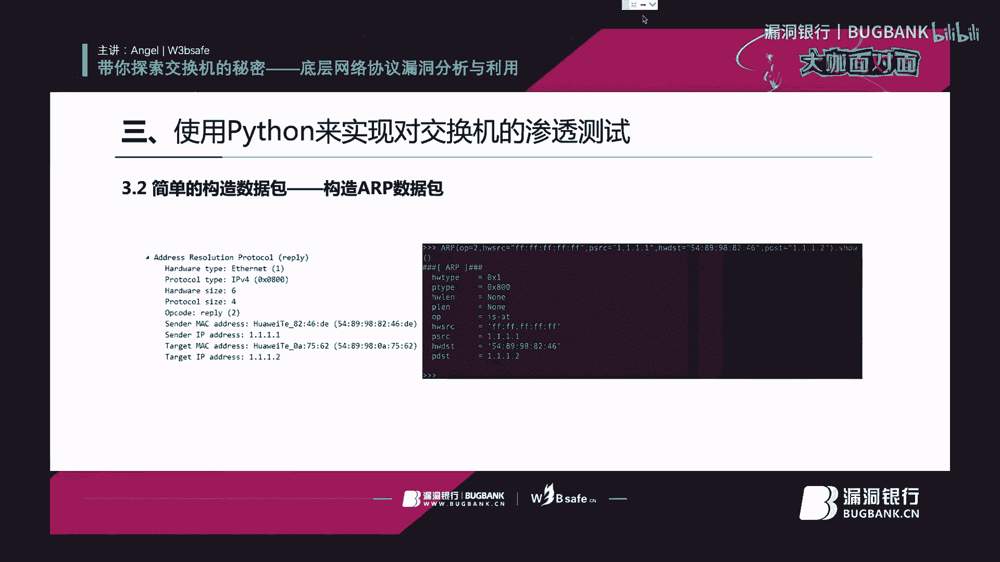

我们来把这个我们来把这个打开啊，我把这个图扑打开啊，然后把这个。设备都都给打开啊，打开以后我们添加一个云。这个云的目的是啥呢？就是说。呃，让我自身的这个系统。

自自身的这个系统和自身的系统这个网卡和这个虚拟机中的网卡呃进行了一个通讯。而且我可以把我自己呃我可以把我自己购造的数据包发送到这个模拟器里。我来试一下啊。来吧来来添加一下，添加完了好。然后呢。

我们把这个数据包。呃，我们我们把这个云放到这个里面。然后呢，我这个PC1和PC2和PC3，我们都我们都已经。嗯，设上卖的地址了啊。我们来随意的。将这呃怎么随意的，我们来那个啥吧，先抓抓一下这个二口吧。

抓一下二口。装下二口以后，我用PC1来拼一下这个PC2。1。1点1。2。啊，好了，我们现在发现这个呃我们现在发现这个就LRP这个味已经出来了啊。呃，也就是说也呃也呃也就是说那个。呃。

我们来看一下这个包啊，首先拿Vsha打开，一共这个包呢一共就有两个，一共就有两个东西，一个是这个ETH，还有一个这个ARP啊，我们现在。来打开这个。来打开这个。这个python这个IDE啊。

我们来新建一个新建一个python的脚本啊，叫ARP。啊，已经有LPN了叫LRPE啊。嗯，我们来导入这个模块。然后呢，我们来看一下这个这个ARP的这个。我们来看一下这个ETH啊ETHE2。ETHERE。

GG2。我们来看一下啊，来受一下运行。我运行下这个试试啊。我也不知道为什么。啊，这个是好使，那我们拿这个文件来呃来搞吧。首先我们来看来构造一个这个艾er的这个包运行。啊。这个ETH这个ETH。

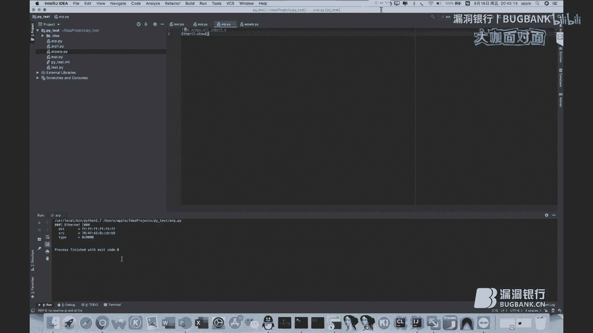

ET我们来对比一下，我们来对比一下这个。

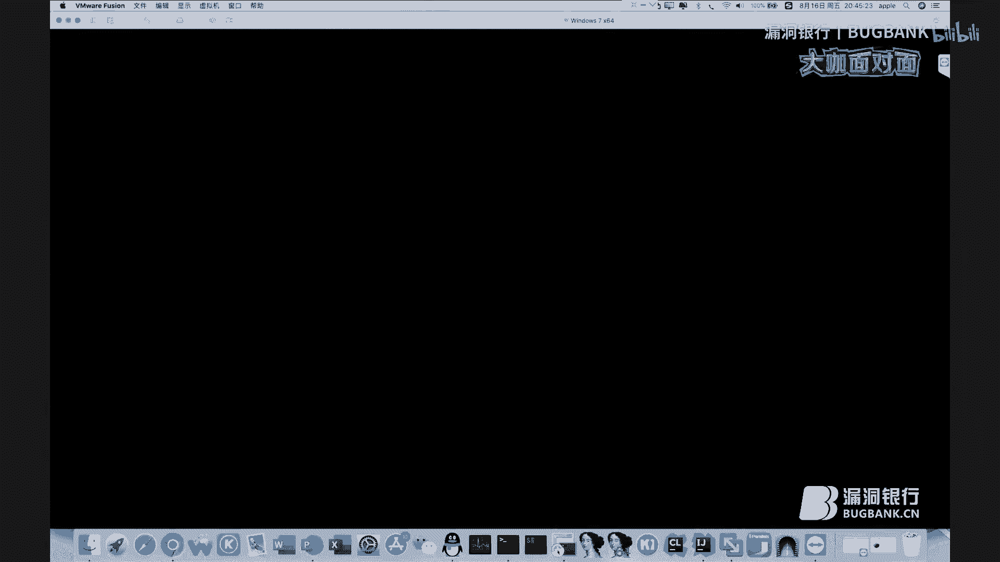

我来对比一下这个呃正常数据包的这个ETH啊，这个ETH呢，我们的这个LRP的数数据包呢一共是有。4个啊实际实际呢实际呢我们来比较关关注的是这个type啊。

type和这个s和这个DDDST就是这个就是就是呢我们要使用这个python呢，那这样吧这样。真闹心了。你们要构造一个跟它一模一样的一个数据包啊，我们首先来看一下这个。

DSTDST它DST它是呃它是一堆F代表广播，然后它的原地址呢是这个051E，然后t呢是ARP，然后我们可就可以直接在这里面写。啊。啊，这下面已经已经那个写过了啊，这下面已经已经显示了啊。

它实际就一共就三个，一个是DST，一个是SRC，一个是tab。那我们直接在这个里面直接写。DST等于。DST等于什么呢？等于对F对吧？来复制一下它的纸。粘体。啊。SRC呢。再来复制一下它的值。嗯。加上。

然后呢，这个tap呢。连串08008。00。0806。嗯，好了，这个这个现在现现在我们再瘦一下这个包啊。你再收一下这个包，我们会发现这个数据包已经跟已经跟这个已经跟这个veshop上的这个一样了。

然后呢，我们再来构造这个ARP。来添加一个变量。你再来看一下这个呃skypy模块里边，这个LRP协议的支持是如何啊？首先呢它也有他也是就是呃它也跟这个一样啊，就是HW呃HW type呃。

ETHH一没有问题。然后呢，这个P type呢0800也没有问题。然后呢，这个这两个是不用管啊，这个 over和这个pho不用管。然后呢，我们主要看这个OP codeOP code它是什么意思呢？

代表这个包是什么样的包呃，是请求包呢还是享用包呢？啊，所以说是因为这个是请求包，所以说我们这个。这个OP它默认就是就是请求包，谁是嘛，就是就是就是一。所以说OP我们也不用管。然后呢，最主要呢是这四个。

一个是呃发送的卖给地址，呃，还有一个呃一一个是目标的卖给地址，还有一个是呃。原地址有一个是原地址，还有一个是目的地址啊。所以说我们也一样的。把这些复制到。这个ARP的这个数据包里面。

我们来勾造一下这个ARP的这一个数据包。ACWSRC代表原地址。然后。PSRCPSRC代表IP的一个原地址。啊，然后呢这个目标的这个麦克地址啊是6个呃是6组F啊，代表广播。目的的卖给地址，还有目的的。

IP地址目的的IP地址是1。1。1。2啊。好了，这样这样呢我们的这个数据包呢就已经构造完了。然后呢，我们来创建一个叫packet变量，把这两个数据包连起来。嗯。ARPARP是小的ARP。啊，没有问题。

然后呢，我们用这个sendP这个函数呢，把这个数据包发送到这个虚拟机这个网卡中。我这个网卡叫VMnet8嗯，好了，我们来运行一下。呃。保存。来运行一下这个。这是第几行出破L3。高顶。等于UTF。28。

嗯，我知道了，因为这个因为这个逗号我打成打成那个中文的逗号了，那现在应该是没有问题。啊，现在顺着顺顺的一拍给来，就说明已经把这个包发送给这个虚拟机，这个已经发送给这个虚拟机这个网卡了。呃。

我们把这个关掉。然后呢，对这个云这个地方，也就是这个G02024进行抓包。啊，我们再来再来发送一次。

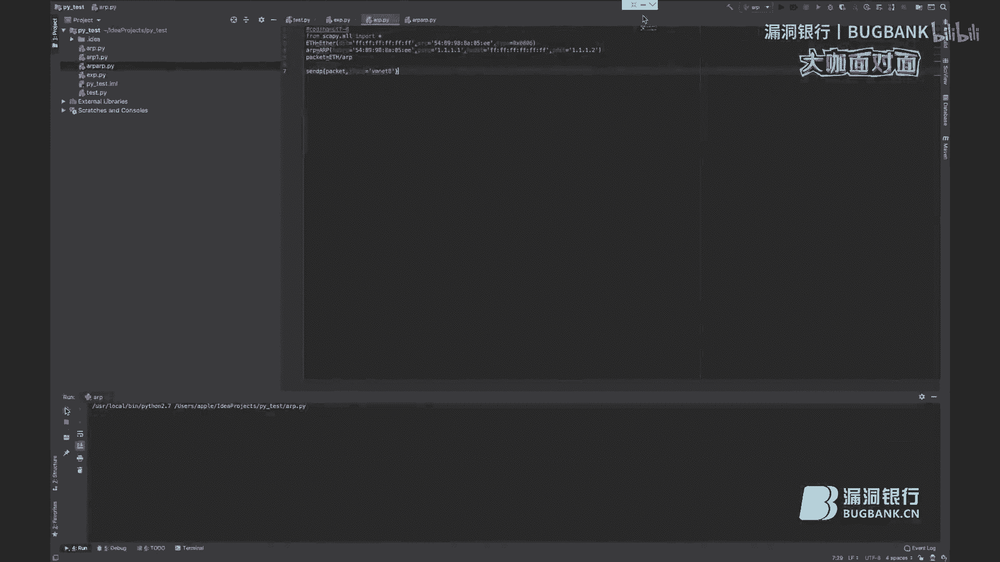

啊，我们会发发现这个这个包，也就是这个包已经发送过来了，已经发送过来以后呢。确实这是这个包它是一个好用的包，因为它发送了这个这个网卡里面，这个1。1。1。2也确实回应了1。1。1。

2的卖给地址是呃548998916215啊，也就说明这个包这个数据包构造的很成功啊，这也就是这个这这这个呢也就是简单的构造1个LRP的一个数据包。然后呢我们来调戏协议站。

然后根据LRP协议的设计缺陷呢来实现这个LRP的一个欺骗攻击。

啊，我们来这我们来这这样欺欺骗吧。我们首先怎么欺骗呢？我们是要伪造这个硬答包啊，现在呢。这个PC1来拼C拼一下PC2。2T。啊，因为这个因为为什么它能它能拼通呢？

因为这个LRP这个数据包他告诉他了这个1。1。1。2的这个卖地址，他的他他这个卖的地址是这个545489989166215，所以说他直接找到，所以说这个PC1，所以说他这个PC1直接找到他了。

那我我们现在伪造一个伪造一个数据包，我们把我们就是说嗯1。1。1。2的麦地址是随随意的一个卖地址，就是我给他一个错误地址。你现在再看看呃，然后我们再看看这个1。1。1。1和1。11。

2之间是否还能互相通信啊，我们就直接把这个卖地址呃，我们直接就是按照这个按照这个改就行了。首先我刚才说过了，他那个OP呢是代表这个LRP这个数据包的一个状态，OP1一呢是那个请求包OP2是硬答包。

所以说我在这里直接写1个OP等于2。然后呢，我们我们再给家看一下这个应答包啊，应答包它这个OP确实是R。然后呢，这个原地址呢是。这个。548998916215，这个原地址是什么呢？

也就是代表着这个人也就是说代表这个机械发的这个广播包啊，也就是明摆着告诉我1。1。1。2，这个原地址就是我自己。所以说这个原地址，我我我要随机的我要那个给他一个错误的卖地址啊，这个是HWSRC啊。

怎么给的错呢？这有1个98，我改成97才是错的了。啊。呃，当然，它这个上面还有ETHETH它的原地址也是也是跟这个地址一样。那我们。再来继续的把这个98改成97啊，改成97以后呢，它这个发送数据包呢。

我们再加一个参数，让它循环发送啊。也行。运行以后，它就是不断的在这个数据不断的在这个里面在这个。在这个交换机里面发送呃在这个交换机里面就是不断的再发送这个手机包。但是这硬条包我感觉构造的有点问题。啊。

1。1。1。2。啊，但是已经已经使用那个什么了。看一下啊。Also， in your。这样我们把这个交换机。关掉再打开。然后把这个。PCE的这个LRP地址表清理掉。嗯，这个现在现在它是没有这个。

现在他是没有。这个那个ARP的一个地址表的PCE和交换呃交换机都没有了。啊，我们现在还是依旧在发送，我们现在再来拼一下这个1。1。1。2。啊，会发现它已经不通了啊。

因为因为哦我们再看一下它本身的这个LRPD指标。我们看不见IP指标。大家看一下为什么呢？现在是G02024嗯。嗯，这个是没有问题的，就是1。1。1。1的这个。1。1。1。1的这个卖地址是这个。0511。

所以说这个PC1现在已经评不通这个1。1。1。2了。还可以。啊，我我我知道怎么回事了，因为我因为我我我的天。想把自己给绕进来，因为现在1。1。1。1的卖的地址是这个我现在硬桃包是1。1。1。1的。

卖的地址是是他那所以说我们应该用PC2来平它。会发现PC2平1。1。1。1不同了。啊，我们再给来看一下这个PC2的这1个ARP的地址表，我们会发现这个1。1。1。1的这个卖地址错的，是这个97啊。

我们把这个python的这个停一下。

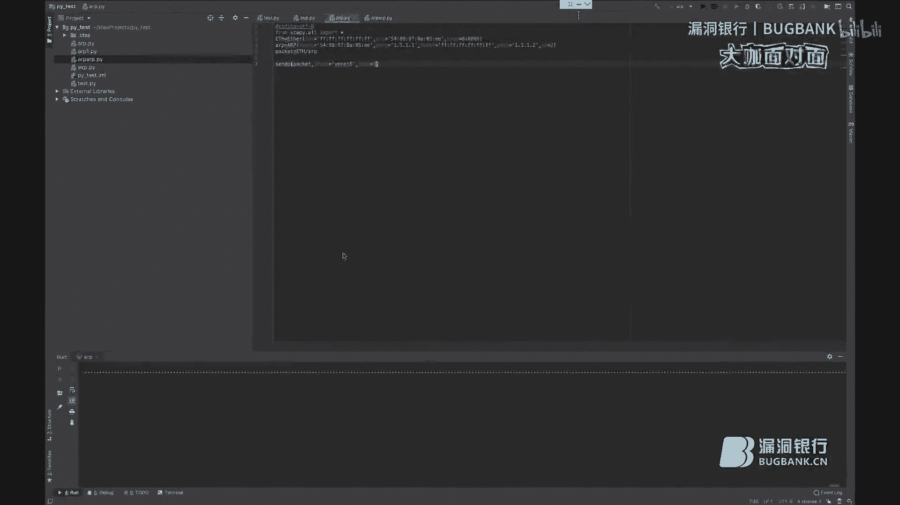

我们再来拼一下。还是不同。我们把这个LRP的地址表清掉，然后再来拼一下。会发现它已经通了，我们再来看一下它的ARP地址表，会发现他这个ARP地址表是正确的，是98，而不是刚才被我欺骗了97啊。

这是最简单的一个呃使用这个根据这个ARP协议来实现呢来实现这个ARP的欺骗攻击。然后呢，调剂协议战二呢就是。使用这个利用这个LRP协议来实现这个卖地址放红攻击。因为我因为我现在我现在再来试一下。

啊。再来试一下以后，我们来看一下交换机的买I地址表啊，这虽然说会给用户会给这个用户带来非常大的伤害，但是实际它不会给交换机带来。很大的伤害。我们发现这个交换机的这个麦地址表还是这几个啊。

我们现在呢就是说。要用这个LRP协议呢。把交换机的这个MI地址表占满啊。这怎么实现呢？我们把所有的这个卖地址。换成随机的卖地址。啊，然后继续的发送。

发送以后，我们来看一下这个数据包它是什么状态啊，我们可来看一下这个。我们会发现这个发送这书包实际是非常混乱的。呃，原地址是随机的，目的地是随机的啊。😊，呃，我们再来看一下这个交换机的买ID指标。

我发现这个交换机呢，这个麦D热软本是非常多的啊，我感觉它已经被充满了。但实际呢这交换机要是正常的交换机，它已经被它已经被降级了。但是因为这个是模拟器，呃，你降级以后。

它实际还是就是说呃两台设备之间是无法进行通讯的。呃，两台设备之间是呃是其实一旦降级以后，这个模拟器它实际就是说所有端口都不通了，不会像真实交换机一样，就是说会导致降级。

然后你抓包会抓到所有的呃来自所有的端口的一个数据波，这不会的。但是实际在应用中它是可以的啊。然，我们来继续，就是再来我们再来就是根据这个DACP呢来实现对DACP地址时的一个耗尽啊。

来，先停一下。把这个这个凑谱我们直接就给关了。然后呢然后呢我已经做了1个JCP的一个图图。把这个DCP的这个图步打开。我这个云一会儿我再连啊，这个云我一会儿再连啊。首先呢我们把这个交换机打开。嗯，好了。

这个交换机已经已经被打开了，已经被打开以后，我们看一下啊，看一下这个。呃，对，这个这三台PC这三台PC也要打开。嗯，好了，这个当然已经变绿了，它变绿了以后，他们都是有这个是DHP获取的啊。

这也是DHP获取的。这个不是DACB获取的。然后呢，我们对这个四口进行抓包，我们来看一下这个DACP协议是怎么样的。然后我们再来根据DACP协议，然后再构造出一个欺骗的一个包。

然后让这个DACP这个服务无法工作。好，我们来把它换成DSP。然后我们来静静的等待它获取到IP地址。嗯，好了，这已经已经已经获取出来IP地址了。然后我们来再来看一下这个。

大家看一下这个DACP的这一个包。那谈会的IP地址是多少？获取的是1。1。1。51。这是DACP定应的，这是DACP的一个信序。我们来根据这个包呢来构造出对DACP实现拒约服务攻击的一个包啊。

我们来看一下啊。首先呢它也是一个。Either。呃，他的。他的卖给地址呢是他自身的卖蚁地址，然后呢，目的地址呢是广播啊，我们要想实现DACCP的欺骗的攻击呢。

我们就得把自己的原地址改成随机的一个卖给地址。所以说。在执行这个包之呃，所以说呢我们来。这样。呃，这个艾这个地址呢。目的地址啊。DST。目的者我设置成。FFFF。FFFFFF。SF广播。然后呢。

原地址呢设置成这个随机的这个麦地址。然后呢。再来看一下这个再来看一下第二个这个这个包，这个呢是IP的一个包啊，这就是就是IP原地址，原地址是0。0。0。0，目的地址呢是0。呃。

目的目的呢是225252525。然后我们再来构造一下这个IP啊。嗯，没有问题啊。然后呢，我我们再来看啊，再来看这个包里面还有什么东西，还有个是UDP啊。有地P。呃，木易端口67，原端口68啊。

买咱来写个UDP。Sport等于。68。Dport。等于。路由器啊，没有问题。然后呢，这个ARP这个数据包先给它注释掉，没有用。然后呢。是不是就是电于CP了？DAC呃，当然你那使是呃你。

但是呢你还得还还是还是得加一个东西。就是在这个中间。要加一个。不头破。一个协议。CHADDR。あんと。Right。R点。查ID。等于。20DOM点20。Ps。对。他有。最后呢就是DHP。这个比较复杂。

对吧？DCP里面它要加什么呢？其实就是就是要加一个open呃，定义这个DACP是这个。Discover。一个小时。看一下啊，这个逗号应该是中文的逗号啊，英文的。我感觉应该是没有问题了。然后呢。

我们再来组建一下这个包ETH。白皮。有DP。不特破。DHCP。好了，这个包我们已经组建完了，然后呢我们再来发送发送到这个这个口上。我们这有一个有有问题啊。就是说。看一下。这个这这也还有问题。

我这个是啊我这个是写错了吗？我这个是写错了吗？确实写错了，这个不应该是FFFF，这应该是255点255。255。255，这样就应该没有问题了。DACP没有定义，我有定义了。DACP。哦，我知道了。

DACP等于DACP。这个DACB应该是大写。这个没有问题了，来运行。

啊，好了，现在现在已经发过去了。

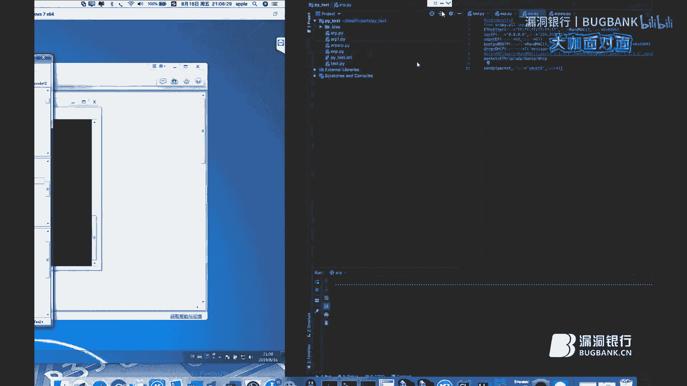

我们再来看一下这个交相机里的呃，现在发过去了，但是没有任何用。因为这个云它没有连到这个没有连到这个交相机上，我们把这个云连上。嗯，好了，我们再来看一下这个。并没有什么任何用。他这个数据包是没过来吗？

看一下。哎，广播的还是LRP。应来保存一下什么？啊，他这个type啊，对对了，呃，我差点忘了。

这个DACP协议的他这个typeap，它这个它这个type肯定不是0806，0806是代表着ARP，但它肯定不是。这是什么？把这个关掉啊。

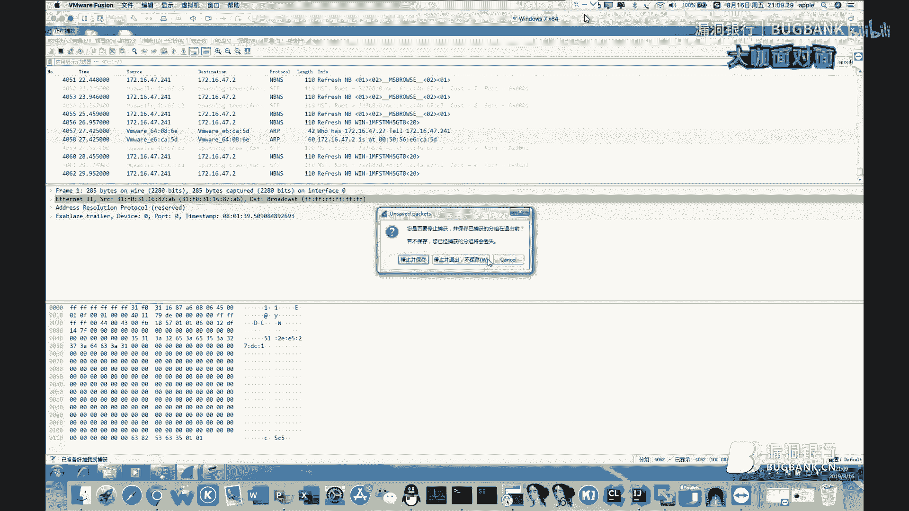

这个开锁。再看一下啊，这个这个呃ETH它是零称0呃08呃00800。所以说我们还要把这个0806改成0800。来继续来运行一下。

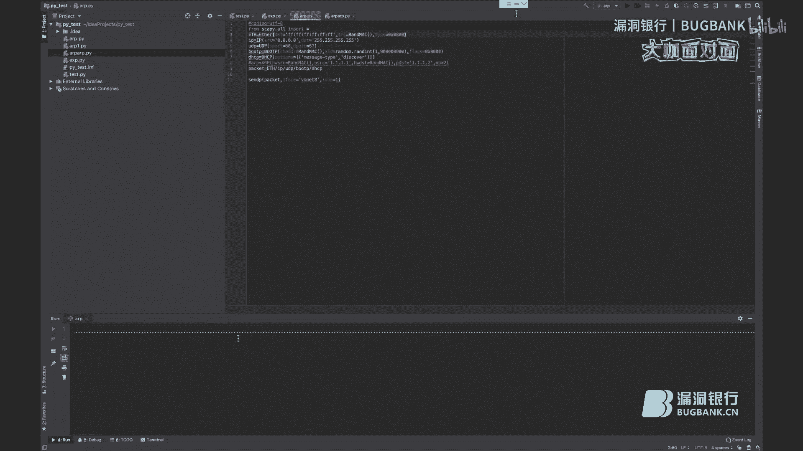

啊，现在就应该正常了。我们再来看一下这个IP铺，我们会发现它这个嗯。IP地址池已经被用满了啊，它这个IP地址池就是已经已经被用满了。我们。如何来确定它呃呃是确实用满了呢？我们先把这个变成静态。

然后再把它或变成IP呃DACP。

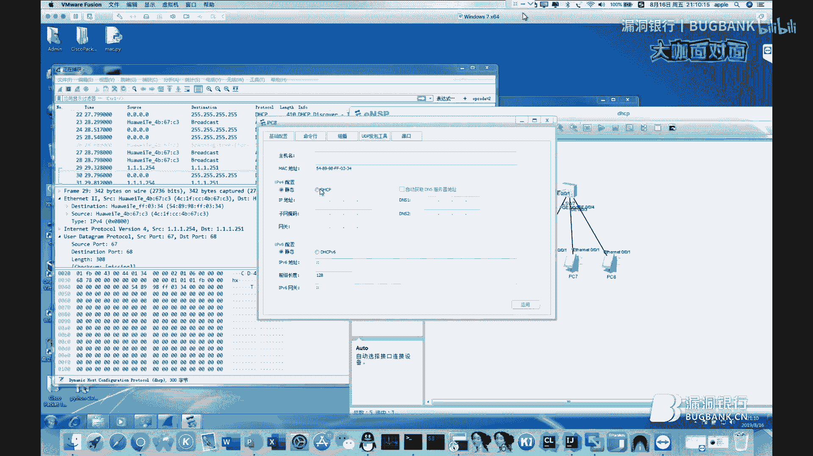

白皮。很这吧。那我们会发现这个PC8它是已经已经无法获取到IP地址啊，这样呢就会到呃这样这种呢这种呢就是已经构造出来一个呃数据包，呃，来不断的向网卡中发送。然后呢来实现对DACB服务器的一个拒绝攻击啊。

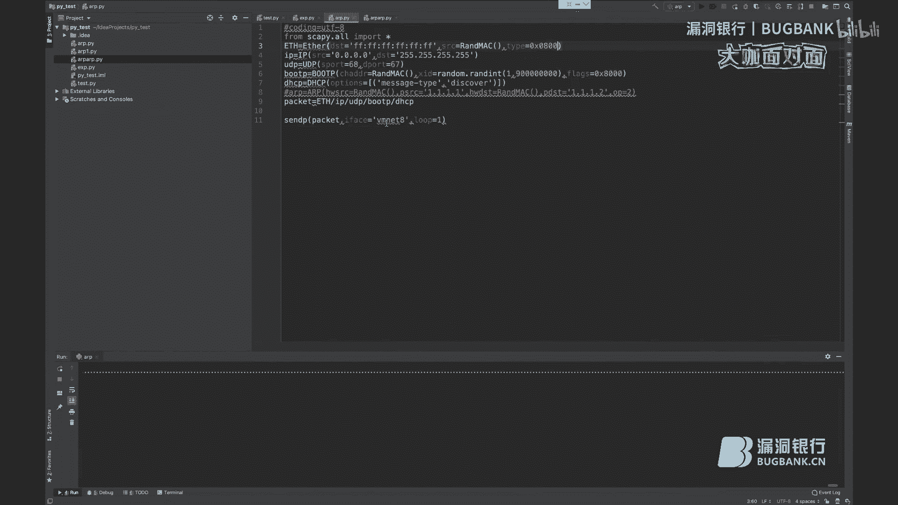

然后我们来继续。呃，调戏协议战4啊，使用这个使用这个根据这个STP协议呢来破坏这个生成树的呃，来破坏这个生成树，来实现这个火路攻给啊，生成树这个我也给大家准备好了。

然，我们把这个拓服都给打开啊，把所有的机器都打开。这个停下。啊，好了，现在这些所有的设备已经都已经启动呃，启启动完了。然后呢，我们来看一下，因为这个些设备开启以后，它默认的生收入协议是开启的啊。

这交换机就是说你只要插电以后，这些生诉入协议该厂上是默认给你开启的。然后我们来看一下生成数。哦，这个生成树它已经就是说已经已经根据这个算法过作好了。

它这个根呢它这个根桥呢是这个根桥的卖的地址呢是它这个根的卖地址呢是这个3D呃3DDC啊，我现在我就不找这个3DDCDC是谁了。然后呢我也不看这个结果状态了。我们来试我们先让这个PCE与PC2进行通信。

一直进行通信啊。呃，IP地址我已经配好了，PC2是1。1。呃1。1。1。2。难题。嗯，好了，现在现在他已经通了啊，现在他们两个之间也已经通了。啊。我们现在随意随意的在一个接口上抓一下包啊。

随意的在一个接础上抓个包。啊。这个接口。这个接口接口是他们传输数据的一个接口，但是不影响我们还是还是还是换一下吧。我们在这个这个接口上抓一下吧，在这个呃在这个。捂的这个接口要抓一下吧。

这个也口绝对特别干净。啊。也是有点不干净，但是我们可以凑合看看一下这个SCB协议啊。这STP协议呢。其实很简单啊，我刚才已经给大家讲过了，实际上的话你就呃欺你就欺骗一下他自自身的一个根前呃。

你把那个根桥的这个优先级调到最小，然后呢把。跟的这个卖的地址，我呃卖的地址呢。给一个错误的麦地址。然后呢，桥的卖地址呃，桥ID呢我也设置成最小呃，桥I桥的卖地址呢我也设置成一个错误的IP地址啊。

然后呢然后呢把这个包不断的向这个端口发整个然后呢整个生成树的一个拓普呢就被破坏掉了。呃。还是一样啊。我们把这些这些行给注释掉。没问题。然后呢。我们来仔细的分析一下这个包啊，它这有一个。802。

3看到了吗？它这个包和其他的数据包不一样，它这有1个IE802。3ETH啊，我们先把这个数据包构造出来。这个数这个数据包呢在这个。kypy里面呢。他的这个名叫do3。doote3。然后呢。

这个dos三里边有一个什么呢？长度长度我们不用管，就一个原地址和一个目的地址。这个目的地址是非常讲究的。它这个mike地址呢，0108C20000，这是一个保留的一个麦克地址。

这是微生成树专用的麦ike地址。所以说我们这个目的地址呢一定要写它的这个地址。啊。DST等于。诶。01。80A2。嗯。C2。0000。亮聊。然后呢。我们。再来看一下他这个他的这个原地址是多少啊。

他这个原地址是CC1FCC07。我们把这个也复制一下啊。复制一下以后，因为它的这个它这个生成数是先比较优先级，再比较卖的地址的大小，小者为优先。所以说我们还要用到这个这个地址啊。SRRC等于这个麦。

它是4C开头的，我把前面这个4C改成00，那么我的IP那么我的这个卖地址肯定是最小的，肯定是最小的一个卖地址。所以说这么构造是非常正确啊。然后呢。中间有1个LLC。呃。

逻辑链路控制这个这个东西只要我们只要加上就行了。第三。LC等于LC。我们把这个加上就行了。然后呢，还有呢就是这个双周协议，双周协议是STP。STP里面加什么呢？首先呢我们这个路otID。

就是这个跟ID我们要设置成0最小的。然后呢。跟的。麦地址root麦。等于什么呢？等于这个地址。然后呢。是我们要设置一个桥IDBRA。第7。求ID求ID我们也要设置成最小。然后呢，我们的瞧麦地址。

也要等于也要等于这个这个这个卖地址。然后呢，我们再设定一个变量，把它们三个连起来。这样吧这样吧这样吧。太太那个啥了。直接这么连起来也是可以的。我知道我知道为什么了，因为我这边少写了一个。

少写了一个卖地址。可能是因为这个这个原因吧。让来发放一下。还是不行。记得我昨天写了一个。这个肯定是好使的，我们直接用的直接用它吧。啊。反正都是一样的都是一样的。没行。把这个删掉这个删掉。运行。

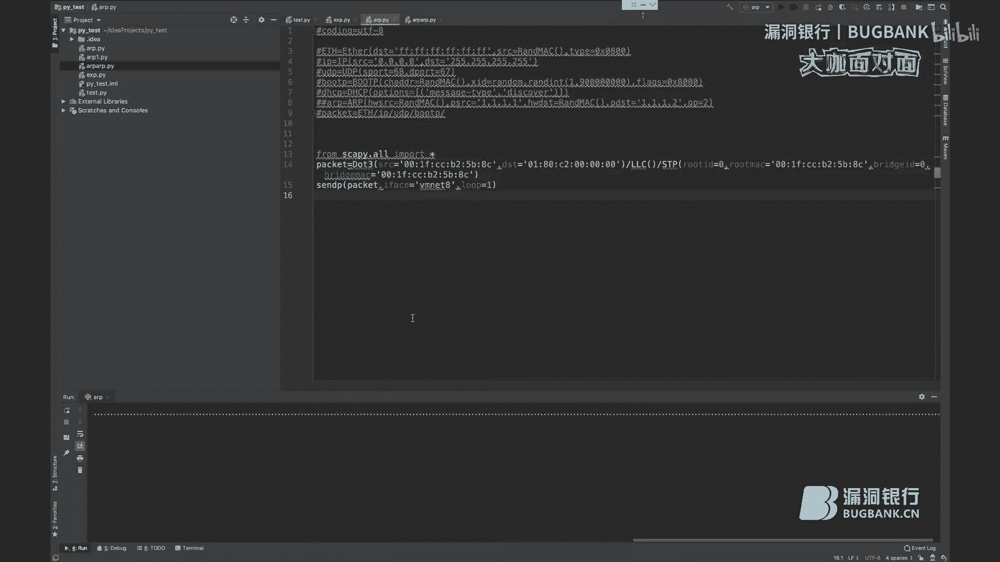

啊，现在已经发送过来了，发送过来以后，我们会发现他这个。他这个协议已经不断的在走了。然后我们再看一下这个。PC1与PC2之间的这个通电状态。因为这个是一直拼的啊，已经发到3330388个包了。呃，现在。

他们两个已经无法通信了，因为你。构造了这一个协议，它已经完成功的把这个生树的这个拓扑破坏掉了。我们再来看一下这个生树的一个状态啊。

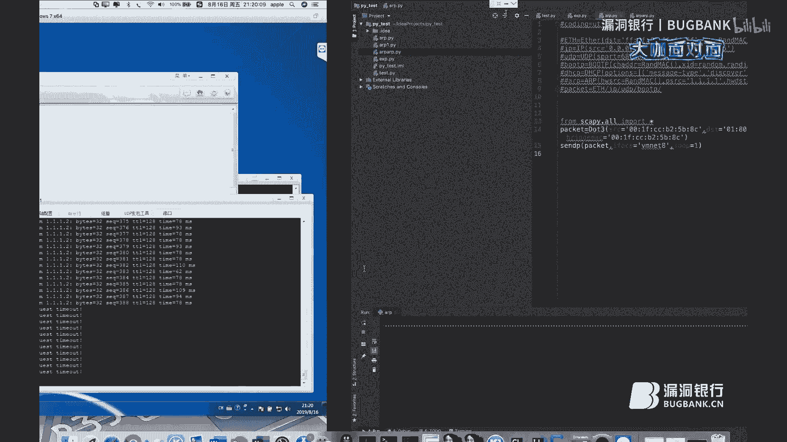

呃，停一下呃，把这个断掉。我们之前这个生成树状态啊，它的这个呃根的麦地址是这个3DDC啊，但是我们现在的这个卖地址呢就变成了这个。我自己构造了一个没呃，在这个网络中不存在的麦地址。

所以说这个又是成功的导致了这个生成树呢被欺骗，导致生成树欺骗呢，就会导致整个全网的这一个呃生成树的一个混乱。导致生生成树混乱呢，整个这两台电呃，整个这个如果说这就这就是两台电脑。

如果说这一个这个大网络里有非常非常多的一些网络设备连接的话，那么这些所有的这些它都应该不能正常通信啊。来停一下吧。

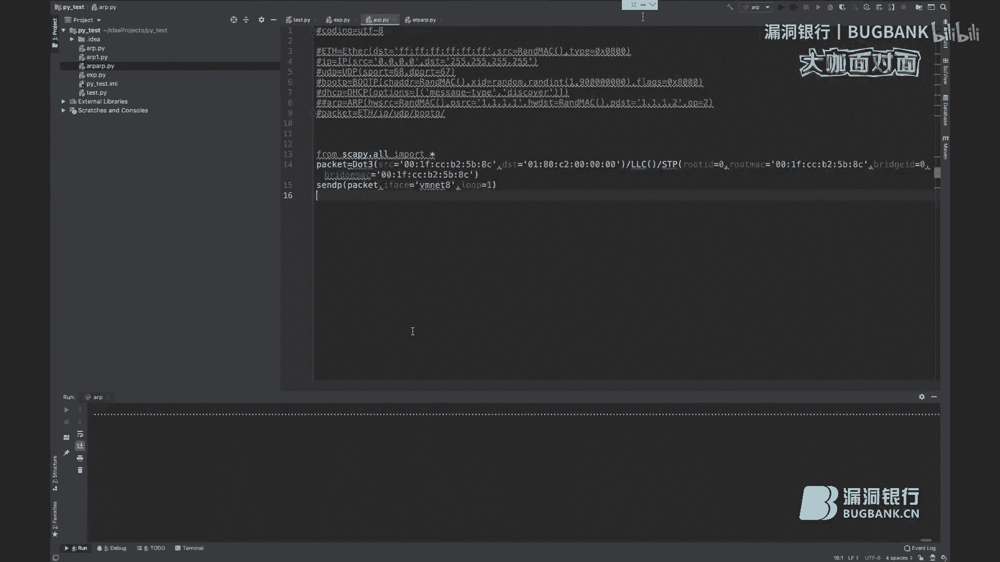

然后呢。我们开始讲一下这个如何避免这这这些漏洞的一个产生啊。首先呢如何避免这个交换机被这个麦地址泛红东击呢？首先呢咱可以就是说启用这个mac地址的这个呃学习的一个限制。

我们应该看这个如何避免这种ARP的这个攻击啊。

呃，首先呢我们可以配置这个LP这个表象的一个固化啊，如何如何配置呢？

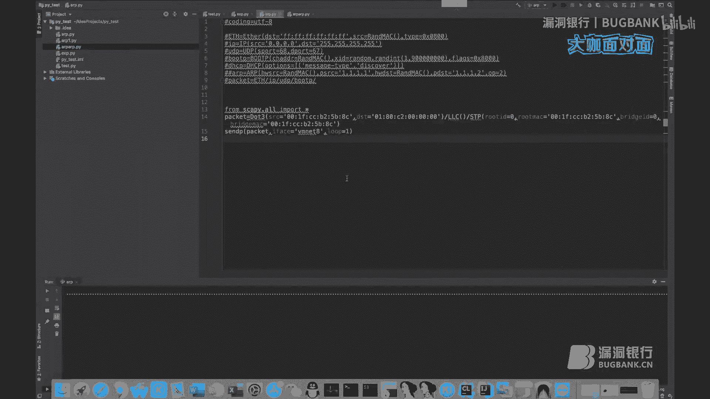

ARPANTI。Tax in。3的ACK来A。呃，这样呢就可以开启这种呃ARP的表象的一个固化。然后呢，我们可以配置这种LRP的一个呃防网关的冲突。然后呢，我们也可以配置一下这个LRP的优化应答呃。

包括这个LRP的报纹的合法性检查。然后呢配置这个LRP的表象的严格学习，然后呢配置DHCP触发LRP学习啊，这些功能呢在交换机上开启以后，基本这个交换机呢，它就是呃你就是没法通过ARP来攻击它了。

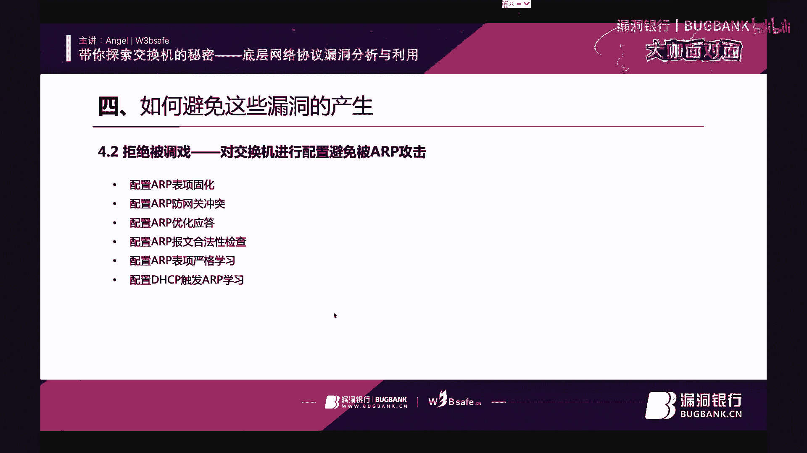

来试一下吧。呃，来告诉大家怎么开启。啊。SV。这样呢你开启这个呢，就相当于开启了这个LRP的一个防火完成图。然后呢。我们来配置一下这个LRP的这一个这个。优化的一个应答。

ARP。Speed test。啊，这样呢配置这配呃这个是呢配置LP的一个优化用的啊。然后呢我们再来配置这个LP的一个检查一下P这个合法性。啊，这样呢就可以配置这个LRP的一个。嗯。

检查的一个合法性啊呃豹纹的合法性的一个检查。然后呢，我们可以配置一下这个LRP的这个杨格严格学习。

啊，这个呃稍等一下啊，这个这个我先。这我先最小化一下。

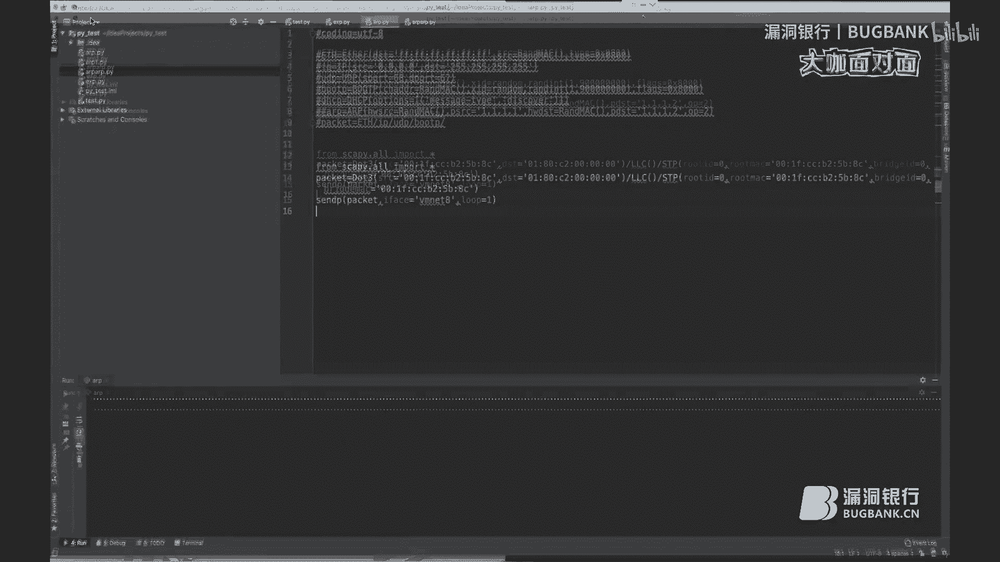

啊，这样呢就可以开启这个杨格学习的这个功能。然后呢就是可以配置这个就是LRP。和这个。DACP联动就是配着DACP来触发这个LRP的一个自动学习的一个功能。呵。呃。

这样呢你首先你得先把这个DACPnoing功能开呃开启。呃，我就一会儿一会儿我再给大家演示怎么开启这个功能啊。然后呢，就是说这个呃拒绝的调戏之二呢，就是说如何避免交换机遭受这种双树的一个攻击。

首先呢我们可以呃这个这个这个是需要一个一个交换机开的。呃，我也就是拿这一台交换机给大家做演示啊，就是说首先呢如何配置这个交换机的这个BPDU保护的一个功能啊。SCPPPDO。啊，这样呢就可以开启这个。

生树的1个PPDU的一个保护功能。然后呢，我们可以开启这个这个这个生树的1个TC的一个保护功能。啊，这样呢就可以开启这个双数1个TC的一个保护功能。然后呢。

我们再来这个呃配置一下这个端口的root保护功能啊。啊，这个这个这个其实这个交换机它是没法配置的。但实际呢它其他的其他的一些华为交换机呢是可以这样配置这个。呃。呃。

root保护功能呢那实际实际我感觉这个也可以。因为你要是给它给它定义成，你要把STP它的rootroot设置成主，它自己以它自己呢就会把自己强制的强制的把自己定义成呃定义成那个。

定义成那个交换机的一个主干。啊，还有呢就可以配置这个端口的一个环路保护功能。呃，端口的环路保护功能啊，所以说我所以所所以说这个嘛是我们得进入端口模式下才能配置这种环路保护功能。所以说我们先建一个端口。

然后呢。是这样式的，是这样的，这样呢就可以配置这个嗯它的一个环绕保护功能。然后呢拒绝被调戏呢，就是避免交换机遭受这个DACP攻击呃攻击呢，其实是可以开呃，其实是有4点可以开启的。

一个是是是说可以开启开启设备的这个DACPsnoping的一个功能。呃，然后呢还有呢就是可以那个对这个DACP这个爆纹的处理单人进行限速。然后呢，还有还有呢就可以仿这个配置。

防止这个仿冒DACP爆纹的功能。还有呢就是可以配置这个。呃，防止DACPserv的一个呃服务拒绝攻击啊，然后呢。我来给大家介绍1个DACP的安全的一个配配置案例啊。首先呢。

我们得把DACP功能正常要开启的。嗯。然后呢，我们要把这个DACPsnoping的功能开启了。啊，开启DACPs功能。然后呢，我们再需要需那个需要那个DACP服务器这样的接口呢。

我们要给它把DACPDACPno trust了，也就是说信任的功能开启。你比如说G025。G02025。DCP。Snoping。S smoking unable。然后开启了开启以后是。AA。呃。

设置设设置完这个enable呃，设呃，对，这个应该是设置enable以后，我们可以就直接给它设成tro。设置成tro是什么意思呢？

也就是说这个交换机呢它只允许在这呃DACP服务器只允许在这个G0-5之间出现。如果说其他的端口呢出现DACP的一些呃伪造DACP服务器的爆纹呢，其他端口会把这接接到的这种流量直接丢弃掉。

所以说这个是DACCPno屏的一个功能。呃。然后呢，就是可以开启这个DACPsnoping这个绑定的这个那个绑定的那个绑定那个双成接口的静态麦克地址表功能。这个怎么开启呢？就是ARPDACP。诶。

哎这就是可以开启这个呃DACPno屏绑定表生成接口的D那个静态m克地址的m克地址表的功能。然后呢。我们。呃，可以。我再想想啊，我们可以那个配置一下这个嗯。DACP豹纹处理单元最大的一个速率。啊。

就是说这个DACP你要是发送多了以后，对这个设备有影响呢，我们可以配置一下这个速率。DSDSCP用屏。呃，che。DCP。Right。Right。就是。嗯。默认应该是N应该enable一下。

然后再设置成90，呃，这个是没有问题的。呃。然后呢，我们也可以限制就是说一个接口呃，允许DVCP获取呃获取IP用户的一个最大的一个数量。啊。这个比如说要进进入到G。0-20-25接口中。然后呢。

DHCPnnoping。M user。2umb20啊，没有问题。然后呢。DSCP生么品。这个。直实CP。Aible。啊，开启这个功能。然后呢，就是可以呃开启一些就是丢细胞纹的一些告警的功能。

这个这个我就先不给大家做演示了，因为它是这个呃做一些报警的呃告警的功能。然后呢。呃，可以配呃，然后我再想想啊，应该应该就没有什么了。这样就是可以这样呢就是可以对DACCP攻击进行呃一一系列的一些防御。

发C比较记，我这边结束了。嗯，好的好的，我在。😊，那感谢祝大咖精彩的分享，内容非常充实生动，辛苦啦。😊，那认真听讲的小伙伴们可能还有一些疑问想向大咖请教。那下面就进入我们的行长问答环节。

大家可以继续在聊天区里发送问题。angroid大咖会选择一些高质量的问题来进行解答。那参与聊天互动，还有机会在稍后的福利环节中获得大咖证书。好。

那现在angel大咖你可以嗯勾选一下我们聊天区上方的只看提问的选项，来查看和解答大家的问题。

嗯，我看到了。首先第一个人问我DACP攻击呃，使用什么工具？其实最简单的我刚才已经给给呃已经做过演示了。DACP这个工具完全可以自己手写啊。呃，呃第二点呢就是说呃如何如何拿到交换机的权限呢。

还是说利用交换机的协议呃，权限来进行秀餐内网的数据呢？实际呃我之前我也讲过了，实际很多在很多企业里，它这个交换机的密码都是默认的啊，甚至有的这就是不设密码，最简单的瑞捷交换机，用户名密码呃。

用户名密码都是瑞捷，对吧？嗯。呃，这个呃这个小伙伴们嗯问了是呃总结一下攻击手法和防御手法吧。呃，攻击手法和防御手法刚才已经讲过了。然后就是说这个OSPF有成功利用呃成功利用的案例嘛。呃。

至于OSPF这个这个协呃这个路由协议啊，其实其实我我还真没有利用过这个OSPF的这个协议的一个漏洞。然后呢，田西提问呢是卖地址表多大啊，怎么快快速填满，怎么快速填满，我刚才也已经讲过了啊。呃，这个。

sty大神这个sty这个小伙伴们呃，问了一堆问题啊，一个一个解答。第一个是交换机使用STP协议以后，还有办法造成广播风暴吗？或者说在STB托扑被破坏以后，能够产生广播风暴吗？实际是可以的啊，为什么？

因为你这个托补破坏掉以后，你这个托补破坏掉以后，为什么不能产生过物风包啊？因为你这个已经不受你这个SCP协议，它已经不是呃最初最初那个算法得到的一个最初算法得到的一个生成数。

而是你而而是你这个生成数已经是。呃，非常非常不正确的一个生成数了。所以说非常有可能会产生我们红包。嗯。对于LRP的。呃，已有的一些防御手段呃，有什么新的攻击方法吗？这个我还没有深入研究啊。

这个我还真的没有深入研究。第三就是说VI双标签有最大的呃最大的一个。套节限制嘛，这个我不知道啊，然后呢，P44switch连接的这个。exces说我的面预前。预先设置吧，还是呃还是攻击者修改其为创客。

这个这什么意思？我没有我没有听懂呃，如果说你要是说的是我呃，是我那个。是我那个呃讲那个围栏跳跃攻击的时候，呃，这个是公益者通过1个DTP协议，把你这个IS呃把你这个默认的这个接口加上成创过的啊。

然后PC与。PC与创口之间的连连接会有问题吗？呃，其实我在做刚才的那个我呃刚才的那个实验的时候，我已经做已我已我已经我隐藏了一个点，就是说有一个围栏，也就是本周围栏。

如果说呃如果说他要是设置本周围栏的话，实际你的通讯是没有问题的。但是如果说想要创口以后，你你跟这个交换机之间的所有联系，必须得打一个标签啊，必须把数据打个标签。实际你打打标签。

这些你用也是可以完全实现的。然后对switch攻击是以破坏其功能性为主，还是以获取权限为主呃，我认为实际还是获取权限为主。今天我讲的今天我讲的这些问题呢都是以破坏性为主的。但是你实际在内网渗透。

包括在渗透的过程中，肯定会是以获取权限为主的。呃，switch的提悬难度大吗？提悬难度大吗？其实我目前看的交换机提全的方法一般都是。那个入口令啊，包括其他的一些什么三层遥换机，其他品牌的啊。

我我还是财如雪浅啊，我还是没有没有见过就是其他的那些三层摇换机。包括前一段时间我我朋友让我配一个呃别的牌子的一个3层遥换机。嗯，我看那个遥换机上面只能外边配置，然后呢，我就已经。呃，放弃了。然后呢。

就是说这个就本次分享内容，我有没有一些实际的项目，让我们更。呃，深入体验体验一下各种攻击效果呢。这什么意思啊？实际实际项目。这这这这句话我没有。没有没有听明白。呃。

这个这个是就是说那个使用的更偏爱python2。22还是pyython3，是个人习惯还是什么东西？呃，这个东西呢其实我感觉就是。呃，为什么用pyython2呢？呃，我pre，我就懒得加那两个括号啊。

包括还有一些什么呃库和类的问题啊，那那个我就。不多说了。然后呢，还有就是说这个。呃，交换机上的一些一些那个协议。都有对应的安全措施，以至于现在。呃，以至于现在的出厂出厂。就自带这些防护啊。

这这个首先呢我可以跟你说，一般这个种华为交换机，它自带的攻击防护都是没有的。为什么它为什么他出厂不设置这些攻击呃，攻攻击防御的。因为你这个网络数据包，你非常有可能就是用户拿这个交换机。

它就是做这种攻击实验用的啊，所以说所以说就是他们出厂自带都是没有这些防护的？除非说这些防护你得自己自己做配置。然后呢，就是说这个嗯。嗯，然后呢就是说这个呃为什么那个生成录协议有呢？

因为我感觉啊因为厂商会感觉如果说你要是把这个交换机就是呃就是直接拿过来直接用的话，要是呃呃防止就是说你插环路，所以说默认开启了一个生成入协议。然后呢，DDTP协议会有返回包，能实能实现双向通信吗？

这个DTP协议呢，它其实呢你就是通过一个协议把这个端口从这个额赛接口呃写上成一协上成了一个创口窗呃，创个接口。如果说一旦这个接口要是变成创过窗口的，当然可以创向通信。

而且你这个而且你这个创口接口是可以通向所有微栏的。然后呢，还有就是哪些协议还可以还还可以被利用，有没有总结过啊，其实有很有非常多的协议可以被利用。因为呃我也有我其实没有总结过，没有总结过这些。

但是我知道还有其他还有一些其他的协议呃都可以被利用啊。然后呢，就是说二层二层二层的攻击方向是劫持流量或者影响正常访问。那么劫持之后呃劫持之后的利用的。劫持如果说你这个你这个流量，其实不是劫持。

主要是主要是秀团。当然了，劫持也是劫持攻击也是呃比较。呃，容易实现，而且也是一个比较好的一个攻击思路。啊，截持截持之后的利用，那你就随便了，你可以修改它的这些什么呃修改它的包。

包括呃插入插入那个对于ATTP访问，你可以加入JS啊，还有什么什么东西什么东西。然后还有就是这个DTP协议的攻击会呃会会有返回包吗？能双向通信吗？这个问题会重新说一下吗？呃，DTP协议。攻击。

什么叫有没有返回包？这个跟返回包没有没有任何关系。就是说你使用DTP协议呃，交换机看到你这个DDDTP协议以后，呃，它会把你这个接口从exel接口写上成创造接口啊。啊，然后呢然后呢你这个接口呢。

你只要协上成创口接口以后，你就可以你就可以。你因为它是创口接口，创口接口，它是通所有微栏的。一旦你这个接口协上成创口接口以后，呃，你可以对这个交换机内的所有微栏进行进行访问啊，这就是可以跨。

这是可以跨微栏。那好了。嗯，好的，感谢你者大咖耐心的解答。大家还有什么别的问题吗？😊，嗯，anggel，你这边要不要就看看大家的发言。嗯，包括刚刚那个thecur题时期那个小伙伴，他说的第六点。

其实是想问问就是你之前有没有呃这方面的实战的经验，能够跟大家分享。就你刚刚说没有看懂的那个问题。实战的呃是我实战的经验其实就是嗯我刚才讲的这些这些东呃，我刚才讲的这些东西其实都是可以实战的。好的好的。

那大家还有什么其他的问题吗？那好，我看到我看到我看到这个人了，这个人问成协上人撞了，自己自己不就断了。😊，呃，斜阳声创开以后，为什么为什么自己会做呢？字也是不会断的。你想想，如果说两台4科的交换机。

它两个端口自动被嫌阳人撞开以后，自己为什么要要端呢？创口创口不是配置的吗？默认是XS。但是呢你这个但是呢你根据GTP协议是可以把XZ接口写上成创口接口的。嗯，好了。好的。那今天嗯确实在开业很辛苦。

然后我们时间也有限。我们今天的那个答疑环节就先到这边，如果大家还有问题的话，可以私下再做交流，再次感谢ang大咖非常耐心细致的解答。下面我们进入下一个环节吧，也就是大家最期待的赠书环节。

本期赠书是angroid大咖精心挑选的硬件安全攻防大揭秘，angroid大咖，你能简单的说说为什么想送这本书呢？因为因为这本书我有一我也有一本是那个310独角兽安全团队的一些大佬写的。

我感觉这个书写的非常好，所以说我就选这本。那么今晚谁会是那个最幸运的被选中的孩子呢？angroid大咖，请你在直播间里选择一位幸运观众，并将它视为幸运吧。😊，我看啊我喜欢这个说我帅的。哎，选不了啊。

选不了吗？选不了，要不你把他的你把他的ID说一下，我来选。呃，70292呃，79292。79292。看一下。所以呃是这个叫marcus的小伙伴吗？啊，对对对。好的好的。

那就恭喜这位直播间IP为mcus的小伙伴，你将获得对应的大咖证书，硬件安全攻防大揭秘。请你根据直播间提示，留下你的联系方式，或者在直播后私聊我们运营小姐姐进行兑讲。

好啦，那亲爱的观众伙伴们，今天的直播已经临近尾声了。最后angel大咖，你还有什么话想对我们直播间的小伙伴们说吗？呃，希望大家能努力学习。然后呢也希望大家就是说嗯。😊，好好好好弄，然后呢，每天都能挖到。

非常多的漏洞吧。很是好很接地气的祝福。那之后也希望大家呃继续关注和支持angroid大咖以及web团队。嗯，再次感谢angroid大咖的用心准备和精彩演讲，一如既往。本期直播的录屏会在下周五发布。

想回顾本期内容的小伙伴，请关注我们官网更新或群内通知。😊，本直播间地址固定，喜欢观看开面直播的小伙伴们可以收藏一下，也欢迎加入我们的技术社群，与广大志同道合的白帽小伙伴交流学习，共同成长。

最后还是要感谢每一位观众的支持。如果你也想像大咖一样直播分享，别犹豫，别顾虑，现在就来找我们报名吧。大咖面对面是一个展示白毛风采和分享技术知识的舞台。这里不具年龄，不畏自历。只要你有才华敢分享。

我们都欢迎。好啦，那咖面对面周五8点见，我们下周再见吧。anggel大咖，你来跟观众们道个别吧。呃，各位朋宝们再见。😊，好的，那感谢大家今晚的陪伴，大家拜拜，晚安啦。😊。

我So一般。🎼あなた。🎼好3輩。🎼I做 the place。🎼ゼロ年？🎼Because even。🎼They don't know。🎼色很温暖。🎼你的吻。🎼On这见 on。

🎼Make my pitchca。🎼だめ。🎼别束。🎼まりば。🎼甜你岁。🎼那么难。🎼The是。🎼Oh my我也。🎼我感。🎼灵魂带给那怕所以。🎼메가 세 대로 자리 내게 가 바。

🎼フでたらのわがれた면서 you行くの 왜け라고かけてや。🎼エロや。🎼髪のせでレホ捨てて。🎼的束。🎼모가ば。🎼一切。🎼那么慢。🎼エラのが。🎼。🎼谁问。🎼はい。

