# 漏洞银行丨常见提权方法与运维建议—Xenon丨咖面23期 - P1：23【录屏】常见提权方法与运维建议-大咖Xenon - 漏洞银行BUGBANK - BV11z4y117RZ

。是。う。

🎼嗯，大家好，我是来自风林安全团队的Zeno啊。然后这一次很荣幸的给大家就是讲解一下常见的提前方法与运维建议这一方面的相关知识点。首先呢嗯。在我们平常的渗透测试当中啊，举个比较通俗的例子来说吧。嗯。

一般的对于呃比较浅一点知识层面的人来说，他们说拿到一个web share之后，然后来进行提全，目的就是为了得到服务器权限。而我们做呃渗透测试这一方面，我们提全是为了进一步的扩展一下。

比如说来进行一个内网渗透之类的。因为我们得到它的服务器之后，就是可以就相当于整个的对它内网渗透，拿到预权限，能做更多的事，然后能得更多高的分更高的奖励。🤧嗯。首先呢就是说我们要探讨提权的话。

我们必须得走进它，走进它我们就必须得作为任何一件事。我们必须得了解它的一个大概的基础。然后首先呢我们来了解一下什么是提前哦，提前呢它顾名思义就是提高我们在我们提高我们在服务器中的权限。

就好比你在windows中呃，你一般的就是说网站的权限，它如果划分的话，你一般就是一个网站的权限或者一个user的权限。然后甚至登录的就是说来宾用户歌st的用户的权呃，歌s的用户的权限。

然后通过我们的提权之后，我们拥有了管理员的权限。我们就能登录它的远程桌面，然后的话我们就能够远程控制它的服务器，然后不也不能称之为控制吧，就有了它的服务服务器的权限，就是好比一台你的电脑。这台电脑。

然后你设置了密码。然后密码的话就是说你想进入这台电脑，要不然破解密码，要不然的话加个账户，要不然的话就是说呃猜对密码。我们其中最终的目的就是为了就是说进他的桌面来进行更多的操作。

拥有了这台管理windows的所有权限，提全呢就是我们在进行渗透测试中必须要了解的一项技能。比如我们在拥有一台，就是跟之前说过的，比如我们拥有一台服务器的web share。

然后想通过这台服务器进行内网申测的测试的时候，就不会提全，那么你只能得到一个web share的权限，对不对？然后我们在新手，我们在就是说基础的提全的话，我们必须得掌握好几个语句。首先就是个护。

然后这个是查询我们当前用户的权限。嗯，为了避免为了避免，就是说我们我就下说这么多。然后你们可能理解不了。那现在我就是说我们用一台就是微bshop的权限来进行访问一下，好吧，就是说我说一条命令。

然后我敲出来给你们看，然后执行完之后会显示什么，然后就是说通过这个来加深一点印象吧。

然后首先我们来到了一1个APX点net的大码这个界面，然后我们来就是说来试一下，就是说命令。好吧，就是说基础的命令。首先第一个命令我们来就是说查看当前的用户权限。

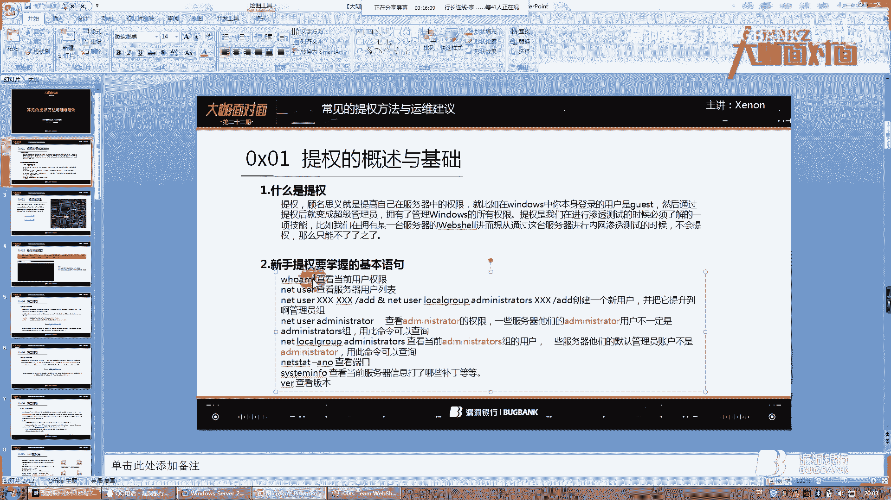

这个的话就是说是查看我们当前的用户权限。如果你这里的权限是系统权限的话，那么你一般情况下你是可以直接就是说执行netuser等后续的呃执行命令来就是说来进行增加用户连接服务器远程桌面的。

nerus就是查看当前服务器用户列表。

这块的话就是说在这个服务器的上面的所有的账户都已经就是说已经列举出来，但是并不包括影子账户和赫门账户等等。就比如说你在呃提权的时候，后面加个刀乐服务之后，这个账户的话是默认隐藏起来的。

但是的话在系统管理这用户组里面是可以看到的。我们可以通过一些方式来隐藏这些账户。一般的这种方式的话，一般都是来指的是入侵者。而我们是呃漏洞挖掘者。

所以的话我们就是说一般的没有必要去来隐藏自己的账户做隐蔽。

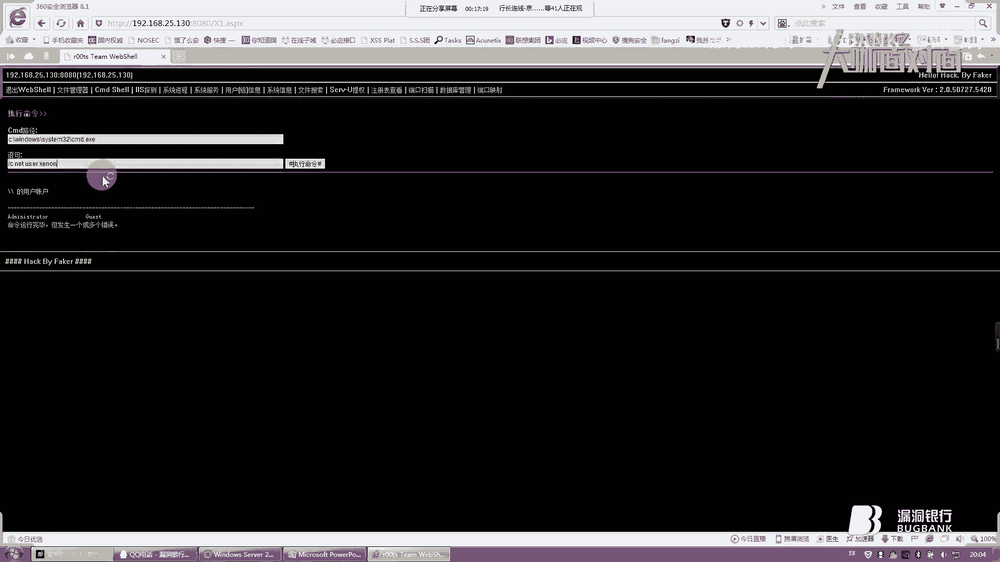

然后nettter user X XX，然后空格3个X，然后ADD，然后分隔符nettter userloc group，然后管理员权限组，然后3个X1个ADD这条命令呢主要就是说。主要就是怎么说呢？

这条命令就是我们新增一个用户，然后用户名，这个三个前面三个X代表用户名，后面3个X代表密码ADD代表就是说确认。然后nettter user loggan group，然后后面的管理员组。

然后这个三个X的话就是代表的是。代表的是用户名，要加到管理员组的用户名。这里的话就是创建一个新用户，并把他们提升到管理员组。然后为什么我在这里说一下这个nettter user。

然后一个管理员的用户名的默认管理员的用户名。我们在用执行这条命令的话，我们可以。

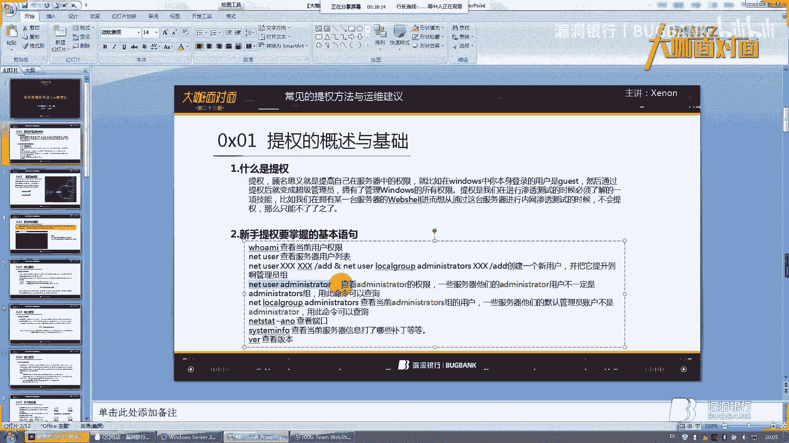

我们就是。我们可以看到他的这个用户的详细信息，包括用户名、全名等等等等。一直到最后，我们可以看到本地组成员。一般的情况下，在有的运维很比较机智的情况下，然后的话他们是呃会改掉这个默认的管理员组名的。

然后通过这条命令。我们我们可以看到就是说管理员属于哪个组，进而我们再执行呃netnet group这个命令的时候，再确定把自己提全的用户加到管理员组。如果他的这个组名改错了的话，那我们是加不进去了。

也就是说不管你怎么加加不到管理员组里面。

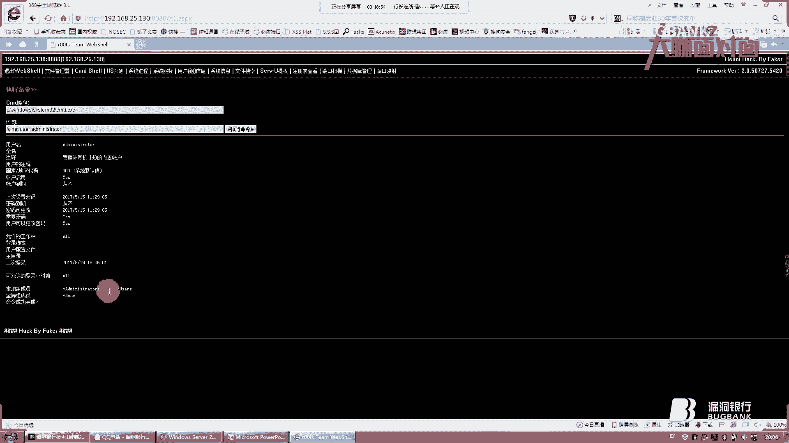

然后下一条命令是net log group，然后一个管理员组这一条命令呢主要就是说啊跟前面那一条命令的话，正好是相反的。为什么这么说啊？因为的话有的有的管理员的话，他就是说会。

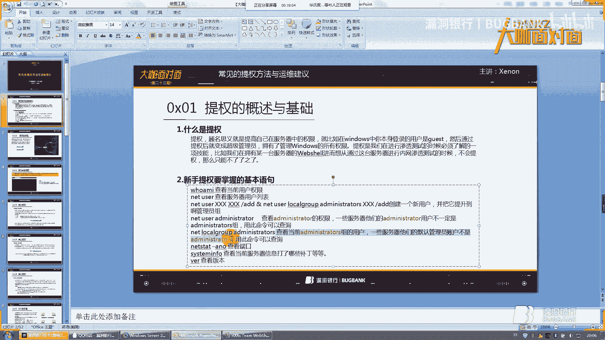

改掉默认的用户名。然后的话就是说我们可以通过这条名令来查看，就是说默认的组默就是说默认的管理员组里面就是说有哪些用户，还有就是说防止就是别人。已经之前已经提全过的人嘛，他就是说已经加到管理员组。

我们可以经过通过来这条命令来确定一下哪些用户名，他在哪些用户，他是属于管理员组的。然后的话有人就会说了，那你如果有的管理员就是说比较聪明一点的，他既改掉你的默认管理员名，也要改掉你的默认管理员组名的话。

那这样的话我们通过什么办法来开始，就是怎么来看呢，那这样的话，我们就是说如果只能因为我个人的话，我个人的经验这谈的话，就是说只能来点笨办法的。比如说这里是两个用户。

我们一般都都知道这个addmin是默认的。我们这我们一般都知道这个addmin是默认的管理员。如果的话他改成其他的的话，一般的啊就是说我们就会一个个的去尝试。比如说net user。呃。

这就然后这个来宾用户，他个来宾用户他不在管理员组里面。然后的话我们就是比如说如果他是在啊的命组里面，或者有其他的组的话，他可能就是说很有可能就是说在管理员组。

下一条命令就是查看端口在远程，就是比如说他本地开了什么服务。比如说14333306，比如说我把默认的myser3303306端口给改成了，改成了3。比如说嗯3360，然后3600之类的。

我们可以通过这一条命令来看一下它默认服务器开的是哪些端口。好吧，就还有一种情况，就是说防止管理员在那个3389端口被修改，或者就是说修改了其他的端口的时候，我们可以通过这一条命令来看。

然后来看一下它的远程端口具体是多少，或者就是说也可以来。

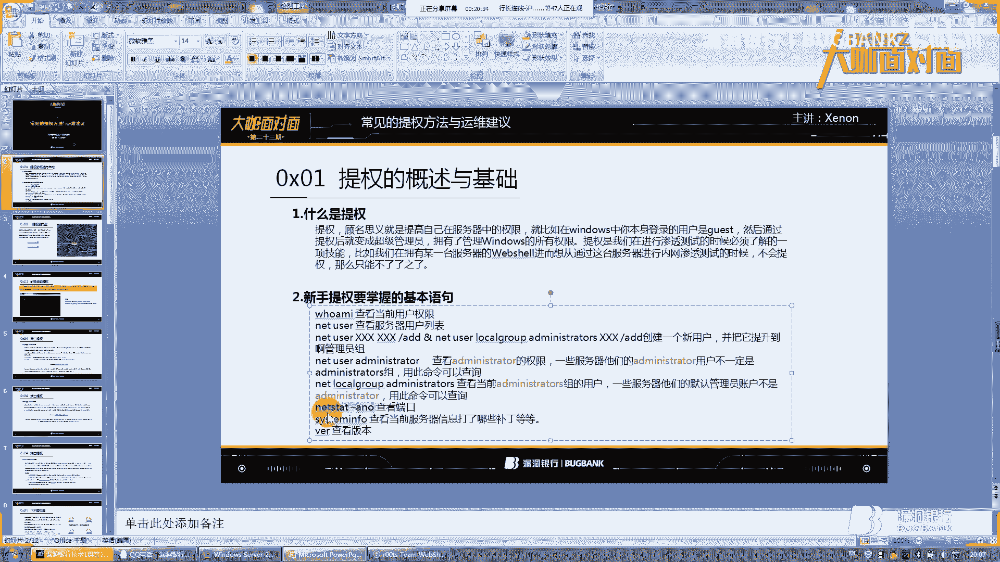

也可以就是说来确定一下就是。他到底有没有开3389服务之类的？

这一条下面一条命令的话，它是比较它就是比较呃常用的一点了。然后它这条命令主要就是看你服务器打了哪些补丁。一般的在我们用EXP这种就是说直接用EXP来提全的话。

我们是可以就是说通过这条命令来看你服务器上打了哪些补丁。然后通过这些补丁的话，我们可以就是说来。

就是找出相应的对应的漏洞，溢除漏洞，然后来通过它来提成的。后面一条的话呃是查看你的CMND版本之类的。然后一般情况下，我是就是说默认的就是来看他这个CMND能不能够回血。

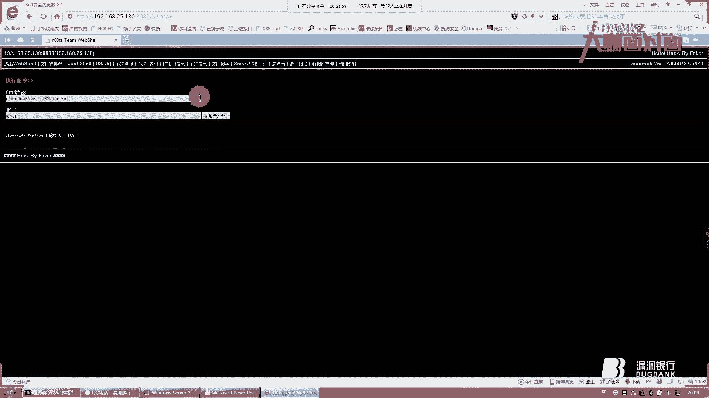

提前的类型啊，说完了我们基础之后，我们再说一下提权的类型。在提全的类型。嗯，在我看来，在windows上面的话，无非就是端口提全和EXP齐全。我们可以根据它开放的端口来知道它服务器上安装了哪些服务。

从而进行提权。如果就是说它的服务器补定信息中，我们得知了啊这个管理员可能有点疏忽，导致了某个对应的EXP。补丁没有打，然后我们就可以利用这个ESP来进行提权。

比如最近的方程就是这个方程式的那个linday漏洞。如果的话就是说及时的打好了补丁的话，那肯定能避免好。就是说很多的入境信息。关于提权这一方面，我给大家做了一张嗯大概的思维思维脑图吧。

然后的话就是说嗯做的不全的地方，还希望大家多多指正啊。

首先我们呃总的类型提成的类型，然后分类下来EXP提全服务器端口提全。我们看一下这个EXP提全这一块。EXP提全的话，它主要分为系统系统溢出漏洞。第三方软件的溢出漏洞哎。

🤧嗯。它主要分为系统的溢出漏洞，第三方软件的溢出漏洞，直接抓取密码。然后呃系统溢出漏洞有很多，然后在这里我们就剪几个比较。我们就捡几个比较呃有有就是说剪几个就是比比较呃之前比较滥用的一点吧，就是说。

比较集中一点嘛，首先是一个巴西烤肉，巴西烤肉它在呃之前0822003服务器没有停止服务之前，它是比较特别火的。一般的就是说你没打这个布丁，我能直接秒杀你之类的。

然后的话呃1405814058这一块的EXP呢，然后主要就是我们。在如果我记得没有错的话，它就是首个就是说通杀200真真正意义上通杀20082008RR这类系统的。之后，紧接着又爆出了呃15051。

然后包括最近的方程式之类的。然后第三方一出漏洞的话，据我所知的话，它是之前有个notote pad加加这个软件是有一个DIR截持的，然后这个搜狗拼音搜狗拼音的话，它就是说之前不是呃有个案例嘛。

利用搜狗拼音输入法来给我们提取嘛。然后直接抓取密码的话，这块就是呃有那个管理员权限的话，你可以直接get pass。然后PWPW这个直接抓取管理员的哈奇值，然后再来给他然后再直接去破解哈奇值。

然后还有一个就是呃一个外国的著名的抓取铭文密码的一个软件。服务器端口提全服务器端口提全的话，它主要有呃主要比较经典的有mys的3306端口sil server1433端口，s刚U的43958端口。

然后还有redist的6379端red它是命临执行。然后当然EEXP提全和服务器端口提全的话，还是比不过我们最致命的提全。比如说热口令。然后权限过大，你直接写入bet文件或者VPS文件。

还有敏感信息泄露。我比如说我把服务器的密码名文密码直接放在我的服务器桌面，或者就是说my circle等等的密码，直接放在服务器之桌面，在我们拥有we share的权限。

它权限没有设置好之后我们能直接访问它的桌面的情况下，我们就间接性的省去了之前所有的步骤，直接拿到它的密码，可以直接进入它的服务器。我若口令，我把服务器密码设置成123456，然后的话不用说你来提了吧。

然后的话我直接试一下ro口令就行了。然后的话。然后的话就是直接试一下入横令，包括一些什么抓机的人，他也可以直接给你就是说抓就是相当于批量破解的形式，能给你直接破出来。

所以给大家建议就是说服务器的密码最好难度要设的设，就是难度要要设的难一点吧。之后我们再来说说我们就是说因为我刚才之前说了那么多相当于理论的知识，我们就来看一看我们最简单的题全好吗？呃。

什么是所谓最简单的提权？是怎么什么是最简单的提权啊？所谓最简单的提权啊，在啊在提权的时候，如果作为一个就是说嗯提权者的角度来考虑的话，就是说什么EXP的不用利用，什么端口都不用利用。

就是说呃直接就是系统权限，一句就是一句命令就能直接给你执行上一切一句命令就只能给你直接给你提权上。这就是其实的话就是管理员的权限划分的错误问题。好吧。然后我们现在呢给大家做一个演示。

我们首先就比如说呃像这种的话，像这种命令的话，像我们直接啊我们直接看一下权限的命令。我们看一下权，我们看一下权限。然后的话在这个权限这里的话，如果就是一般都是ad命权限或者系统权限的话。

百分之不能说百分之百吧，有可能就是说有一些防护软件的拦截之类的。像之前我就遇到一个就是说嗯有个装了1个360全套的360杀毒，360安全卫士之类的主机位是什么东西都装了。然后的话就导致你是系统权限。

也很难就不不是说很难提下吧。就是说会遇到一些棘手的问题嘛。就比如说一般的就是ad命令权限，我们就可以直接一句话，就是直接一句命令就可以给他。

直接可以移去命令就可以。直接一句命令就可以给它提前上。像这样的话，我们两条命令执行完之后，它回显的是命令执行完成，命令成功完成。然后在这里的话，一般情况下我们就是肯定提上了。

但是呢也不防止就是说一些防护软件它给你就是说你刚提上，然后它就自动检测到你是就是非法行为，马上就给你就是说把专户删了。所以的话在这里的话我们用net，然后。空格用户名了，我们来查看一下是否真的加上用户。

并且把它加到管理员组了。好吧，在这一里，我们可以看到他这里的话就是说已经添加上这个用户了。但是的话就是说他就是也已经就是说加上管理员组了。如果他拦截了，你就是说去执行到管理员添加到管理员组的话。

那么的话他这里的话就只有一个us色的组成员，并不会有N定的这个组成员。

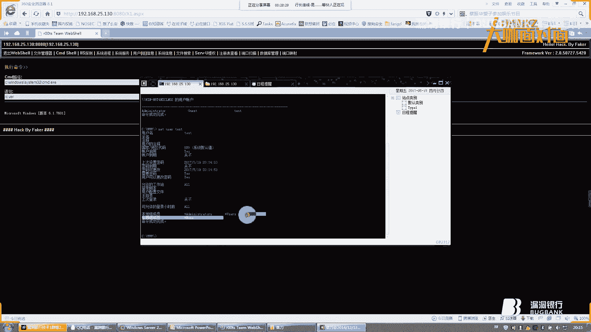

接下来我们讲一下端口提权。然后首先的话就是比较经典的my circleq3306端口。然后先解释一下3306这个端口的含义和定义啊。3306端口在我们做开发和生的测试的时候。

大家应该都会知道它和这个的话就是mysr的服务端口。然后嗯在这里我介绍一下开发330，就是开放3306端口的时候，在我们提权的时候会有哪些结径啊。首先就是说你们网站我们网站我们遇到的目标站里面。

它使用mysq数据库的时候，在没有占库分离的情转观一下，我们通过就是说配置文件得知到他们的链接的数据库有两种情况。第一种非root用户。第二种root用户。我们再通过网站的配置文件查看到。

哎它的这个这个网站，它呃数据库配置写的是ling host或者127。0。0。1的话，然后我们往下看，如果是非root用户，我们就可以通过一些市面上的呃POC啊。

或者就是一去来看一下它的尝试读取它的root密码。或者就是说找一些庞站来找一下他的root密码。还有一种方式就是说你权限够大的话，你就是说直接找到他的mys数据库放的地方。

然后下载它的默认数据库的那些文件，然后下载下来之后，我们就可以拼凑数。这个的话在之前的打卡有说过，我们在这不细说root用户在。在管理员对root没有降权的情况下。

我们可以就是说采取UTF提全和mof提权。在这个在这个莫夫提全的过程中啊，因为我自己亲自就是说实验狗莫夫提全，它在我在我的测试情况下，测试情况如下，m夫提全它在2003系统是可以提上去的。

但是在2008的系统上，它的莫f提全是。就是说提不上去的，就是说可能他执行了没有加上去，也可能他是说他根本就没有执行。在这里的话。

我PPT里PPT里给大家会准备了一个就是说faceroot查faceroot用户查询root密码的相关链接。到时候我我会将PPT分享出去。然后现在我们就看一下我们的入的提权。

究竟就是说我们通过3306端口究竟是怎么来提权呢？首先我们这就是一一款，就是说网上已经有的那种工具啊，个人觉得比较方便好用吧。然后我们输入我们的root密码。然后在这里我们就是说它这一块的话。

已经列出了我们这个函数要导出的目录，然后我们直接点导出就可以了。在这里我们会导出失败。为什么？因为我。因为我在我服务器上之前已经导出过了，然后的话在导出的时候，很多小伙伴都会遇到问题。在这里的话。

我就给大家讲解一下导出的话可能会常见一的遇到的问题怎么去解决啊。但你我们就说的通俗一点，不要没有必要去说那么官方笼统的话，就是说去说那些官方笼统的话，比如说导出失败，就是导出失败，导出成功。

就是导出成功，对不对？然后的话它在导出失败，一般呢会有哪几个点啊。首先它这一块的就是说利用这这个程序的话，它导出的话，它是不能自动创建目录的。在这里的话，在这里的话，我们就是可以直接。

用直接就是说如果你权限够大的话，我们可以在这条目录上面在这目录直接创建场景创建一个目录。如果它没有写全，这个程序没有写全，直接能够写到这个导出函数的话，我们也可以就是说尝试本地答一个环境啊。

然后成功导出之后把这个UDFDLL放到这个目录，然后直接略过导出这一步。然后直接就是创建函数。然后我们导出成功之后，我们在这里导出，因为我这里是导出过的，我们来查看一下用户。我们就可以直接执行。

我们可以执就可以直接执行这个通过mys circleql这一块的语句来执行命令。好了。然后比如说首先我们还是跟之前一样提全之前先看一下权限，权限不够大，你敲再座命令没用，对不对？我们看一下权限。

首先我们的权限是Lmin权限，这样的话我们就可以就是说接下来可以进行提权，我们直接。我们直接执行就是直接提醒执行提全语句就可以了。在这里我们执行好了。执接执行了一条语句，就是其实是一条语句。

但是因为有分隔符的关系，然后的话就是说系统会以两条语句来执行。但是的话我们省视一点，就省了两次回显两次执行。我们在点执行之后，它这里没有任何回血，但是的话没有任何回险，并不在强，我们就提前失败了。

为了保险一点的话，我们还是我们还是就是说。我们就是我们还是就是说用执行一下nettter要来确定一下它是否真的提全上了。我们可以看到他这个test二的用户已经在里面了。

然后我们再看一下这个test二的用户，他是不是就是说已经加到管理员组了，好吧。我们可以看到它已经在我们的管理员组里面了，只要抓住我们关键字眼，它已经在管理员组里面了，就代表了我们可以连接这台服务器。

然后用我们的test2的用户去登录它的远程桌面。然后后面的话就是莫夫提权。莫f提权的话，上次就是说那个呃上次有大咖分享过了，然后我也清测了，就是说在2008系统里就是说并不能够执行。

因为的话我这边的话我也自己就是。我这边的话就是也。也自己也就是说试过了，然后的话。它并不能够执行上的，它并不能够执行上的。然后的话所以的话这里我们就不再演示，在2003系统里可以是可以的。

然后我们接下来就是说讲一下怎么样去防护。因为的话嗯我们并不是以入侵为目的的。我们就是说在挖漏洞的时候，我们肯定要给人家提出一些防护策略嘛。然后我们的防护策略。

首先就是说给买circle的root用户进行降权处理。其次呢我们要严格的控制系统跟系统与数据库的相关的权限，以防网站被人家呃渗透进去之后，就是导致进一步的。被提全威写到数据安全。如果有条件的话。

可以使用一些账户分离、内网数据库等等方式。接下来我们讲一下端口提全的srel1433端口。1433端口呢，它是跟前面说的一样，它是sel是微软的一款数据库，它的数据库默认端口就是1433。

因为scusel数据库在安装的时候，一般的配置sar是系统权限。所以在我们知道了s密码之后，就可以利用呃XPMD share的函数来执行命令，直接就是就相当于直接就是系统权限执行的。有的管理员呢。

他并不会去给我们的萨价权。所以的话就导致了在提权过程中，我们得知了萨密码就可以等同我们直接得到得到了系统权限。然后这里提一点的话，就是说在呃sel2008这一款的话。

他就是说不知道是2005还是2008，他默认的是禁用了XPCMD share函数了。但是的话我们在知道了萨密码之后，我们还是可以通过命令来给他启用。我们现在给大家演示一下。

首先我们呃可以翻一下网站呢，就是说比如说我这网站的根目录写了一条，就是说关于呃sec他们的就是说配置文件，然后默认给的是s用户。然后的话这样的话就是说我们可以直接就是在这数据库管理这一方面的话。

可以利用它来提选。另外一方面的话就是说呃如果这里面给的不是s用户。在这里的话，我们可以利用IS探测这一方面的功能，包括一些翻目录的功能来翻到其他网站庞站的信息，说不定他给的就是呃S就是s用户。

然后我们通过数据库管理，我们来连接我们的sec数据库。好吧。然后我们首先可以看到我们已经连接成功了。然后它的这个系统的话就是sash，就是它的群它的用户就是sar。好吧，然后我们来尝试执行一下命令。

我们还是一样的老规矩，我们先执行一下护这个这个命令，我们来看一下就是是不是系统选习。没有出意外了，他并没有回写出我们想要的结果，命令没有成功和回写。他上面报错了。

他说阻止了对组件XPC many share。然后再这样的话，我们就直接就是说万事问百度嘛，然后我们就是说我们。

我们直接搜一下，就是XPXP semi share的启用，好吧，然后我们随便找一篇网上的案例有很多。然后这里就有讲解了吧，就是说。我们可以用一句话来启动它，然后我们直接把这一条语句。

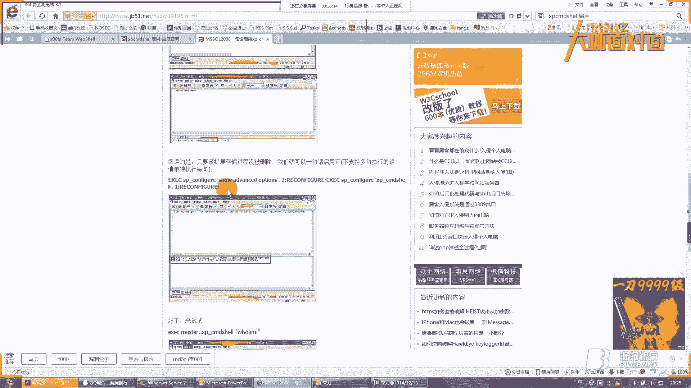

复制过来复制到这里面，然后我们直接执行一下，它没有任何回写，就是说不知道是成功还是失败。这时候我们再尝试一下，就是说执行一下命令我们就知道了。我们执行我们可以看到它是系统权限。它这里是系统缺陷。

说明就是说呃在安装它数据库的时候，他没有给做好权限划分，也没有对三用户进行降权处理。在这里的话，我们也就是可以为所欲为了。包括就是说结束一些进程啊什么的都是可以的。

我们也是一样我们来直添加一个用户试一下吧。因为我们毕竟我们在提全中添加好用户，然后进了他的服务器桌面，也就是说相当于提权中的，也就相当于是我们提全。到这一步，然后接下来就可以进去内网渗透之类的。

这里我们直接回选了命令指命令命令成功完成。在这里的话，我们就是说可以直接看一下test三的用户了，确认一下。我们可以看到他这里的用户已经加上去了。然后的话他这个本地组成员也已经在管理员组里面了。

我们就可以就是说通过这一块，通过这里来给大家做一些演示。哦不，说错了，错过这一块，可以直接就是说确定可以登录到他的远程桌面了，但是不能包括他已经安装了一些远程的防护软件。比如说一些防止你。

登录的那些软件啊，比如说绑定你的网卡麦克地址啊，或者就是说你登录上去之后，还要你验证一层密码，对不对？

然后接下来。我们再来讲一讲防护策略。首先你在安装ser的时候，我们要对其权限做好划分。在其次在我们用不到这个车pCMH share的空间的时候，我们要进入它，然后对可写可读的目录以及一定要掌控好。

因就防止就是说庞站被别人夸站了。然后网站呢不需要做用s用户这个用s用户来就是说执行，就是说数据库不要直接给s用户，或者就是说嗯做好站库分离。🤧嗯。然后接下来我们讲一下啊，C杠U的43958端口。

C杠U它的默认监听端口是43958。然后C杠U默认的管理员账号是log亚的后面这么多，然后把默认的密码是在这里。在本机就是说它上面因为这个一段话截自于百度。他说上面说是在本机才能连接到这个管理端口。

如果我们把这个端口转发到我们本机上，通过本机来连接，我们就是说目标站的端口，我们就可以就是说完全接管它的嗯C杠U怎么说呢？就相当于我们呃内网的服务器，我们用LCS来进行转发内网端口转发其实是一个道理。

然后的话我们在呃建立有完全账号的连接上去就可以为所欲为了。然后在转发的过程中，一般的我们在内网转发的过程中，我们并不需要有系统的权限，只要有执行EXEEXP的权限就可以了。

然后通俗的来理解的话是怎么理解。因为的话它这上面的说的话是让你转发之类的。太麻烦了。在我们呢现在一般的之前因为S呃C杠U这块的提型呢很火。所以在现在大部分的大码里面，它都已经集成了。

不管是你是AP还是AP点net的程序，它大部分都已经集成了，就是说。

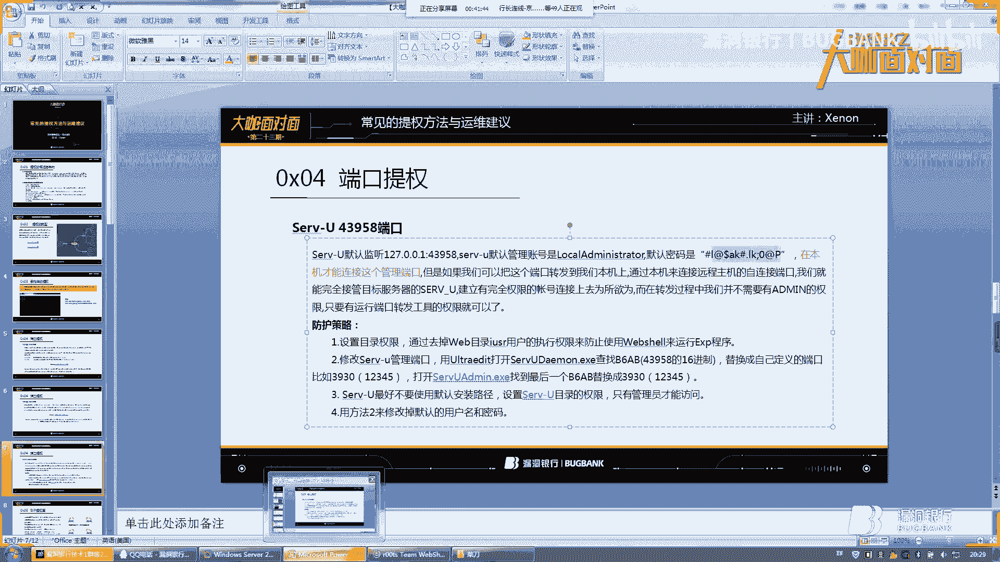

Cro杠U提全这一块的东西就直接是在它服务器上执行的。所以的话我们就没有必要再去做转发的这个步骤。然后的话另外这一方面的话，我们就是怎么说，就是说一些PP的木马的话，它也是上面也也已经带了这些功能。

所以的话呃现在就可以说嗯完全的可以不用去管这个转发这一块的东西了。然后的话因为我就是说C杠U这块的话，东西的话实在就是说比较就是说很简单，直接就是傻瓜式的执行命令就可以了。所以的话我本机我这边呃本。

所以我本机这边的就没有装这个zero杠U这一块的环境了。然后的话直接就是一般的默认密码就可以，我们就可以就是说对它进行执行命令执行一些netus什么的，默认的就是系统权限。

然后我们来说一下这块怎么防护吧。第一。

就是设置我们要目录的设置好我们的目录的权限。呃，通过去掉外部目录的Iuser用户来防止we部视要运行EXP程序。第二点的话就是说修改它要它的默认端口，我们用软件，然后查找这上面的16位，就是上查找它。

查找他的就是说16位加16位的字符，然后替换成自己的端口。然后我们。就可以就是说修改掉端口。第三个的话就是C杠1不要使用默认的安装路径，要设置好它目录的权限才能就是说只有管理员才能访问。

不能设置成Uusa或者2UI都能访问。然后的话最后的话就是说通过第二种方法来修改掉它的默认用户名和密码。呃，讲完了讲大致的端口提取，我们讲完了，我们现在就讲一下EXP提取，然后聊一下什么是EXP吧。

EXP的话，它其实就是说的通俗一点吧嗯。说的比我好的多的是我们说的通俗一点，它就是相当于披露出来一个溢除漏洞，通用的移除漏洞lin对漏洞。然后我们把它编译成通过POC编译成EXE可执行化程序。

就是说我们执行这个程序，就相当于直接利用了你这个漏洞，然后的话就可以做一些想做的事情。目前市面上的EXP当然有很多啊。

然后的话PR87烤肉11046110481405815051修复的方式呢也是非常简单的，只要咨询执询。就要及时的安装好对应的补丁，做好服务器相关目录的权限，做好可读可写、可执行目录的权限。

然后多看看安全自信，看看啊有没有爆出一些新漏洞啊，有没有就是说有没有有没有爆出一些新漏洞，有没有就是。说有一些预警什么的，我们关注好就行了。然后的话我们在这里我们就给大家讲一下，就是说相应的EXP提选。

首先我们执行执行命令之后，我们看一下对应服务器的。我们看一下服务器的补贴信息。

我们可以看到这个服务器它装了两个补丁。然后在这里的话就是说我们用一下就是工具吧。然后这个工具的话，也就是呃之前的大咖高斯 key他写的工具。然后我们呢我们来就是说。来使用一下它的这这一块的工具，然后。

来看一下它这个两个补丁对应的是不是我们的EXP。首先我们我们可以看到它这个。他这里的补丁在我们这里的补丁的话，我们有没有就是说相当于有没有我们这里。补0号对应的是不是我们的EXP。然后在这里的话。

我们可以看到我们的是958488。然后的话它这里就是说相当就是一个都没有。我们仔细看的同学可以就是说他一个都没有。在这样的话，就是说我们这么多EXP都是可以直接用的。但是就是说我们就挑一个最经典的嘛。

因为我之前也说过，在我的印象中，14058它是。

它还是就是说第一个通杀的嘛，我们来试一下这一个。好吧，我们就是说首先找一个可读可写可执行的目录，就比如说C3W吧，然后我们上传好我们的EXP。嗯。😊，它提示上传成功。

那么我们现在来利用这个EXP来执行命令。我们看一下当前的权限。它这里是没有回显的，为什么？因为它在这里没有回显的话，我们尝试着。我们尝试就比如说再放到上面去，然后杠C整个去掉，我们执行一下命令。

很多朋很多就是说很多同学，很多人他们在提全的时候都是呃CMDCMD的默认目录差面他们都是不动的。然后的话在语句这里，然后杠C也不去掉，然后直接就是说直接就是说这就是说。呃。

带上带上目录和EXP直接就是进行提全。但在这样的话，刚才没有回显，不知道可能是不是命令操作。很多情况下，在很多情况下，它都是直接就是说没有回显的情况下，我们就可以尝试一下。就是说把这个EXP的。

直接把EXP放到CMMD的目录，然后刚C去掉，然后的话不要加一号直接执行或者加单引号执行，可能会有意想不到的收获。这也是我刚才正准备要说的。我们可以看到现在我们的是系统权限，我们就直接来执行一下。

我们来执行添加用户的命令吧。它并没有回血，但是我们也不知道它具体有没有添加上。我们通过nettterus来看一下。我们可以看到test的4这个用户并没有执行上。那这样的话，我们应该怎么办呢？

我们可能是命令敲错了，我们分开敲来试一下。我们分开我们分开撬来试一下。我们可以看到分开敲它提示命令成功执行。然后的话我们现在就是说来。看一下它是不是真的添加上去了。我们可以看到它这里的话已经添加上去了。

但是的话还是user权限，这是为什么呢？因为的话我们刚才只执行了一条nettter user，并没有给它添加到管理员组。现在我们给它添加到管理员组来试一下。命令成功执行，我们再来看一下。

他已经成功的在管理员组里面了。他的已经成功的在管理员组里面了，然后这里的话肯定有了test一test2，test3test4。然后这个的话就是一款经典的。就是一个经典的一一塌批提型的案例。

然后的话我们要防护这一点的话，我们直接就是说打好对应的补丁就行了。在这里我们装上补丁，我们再来给大家试一下。

稍等，我重启一下虚拟机就可以了。然后我们就我们打好这个补丁之后，我们立马就是说待我重启了之后，我们看看利用这个EXP还能不能对它进行提权。

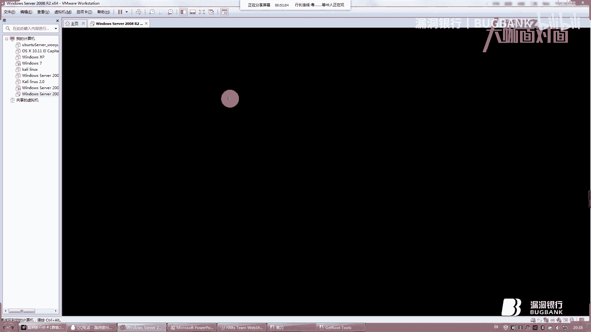

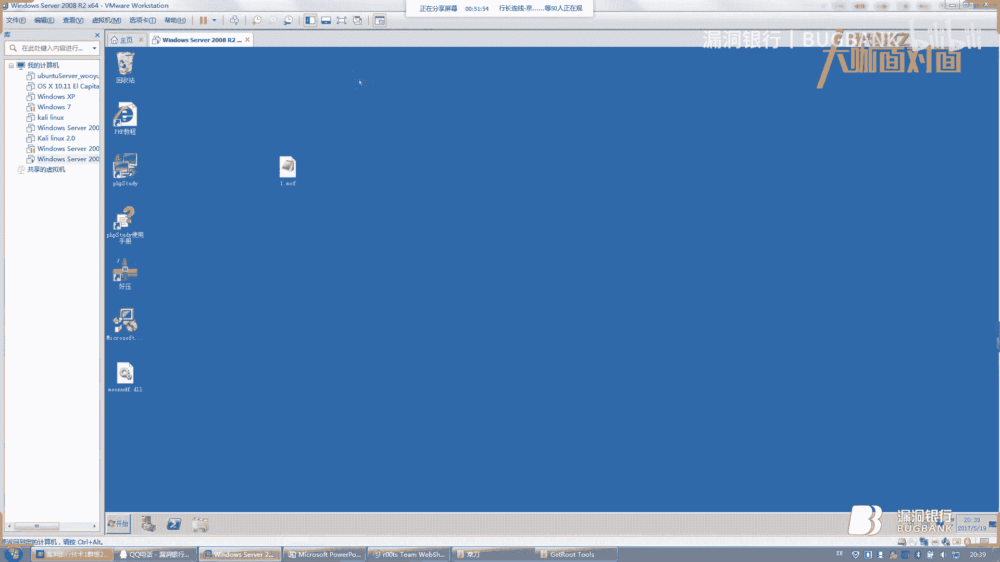

好，我们现在再来看一下，我们还能不能利用这个EXP来进行提全，好吧。

🤧嗯。

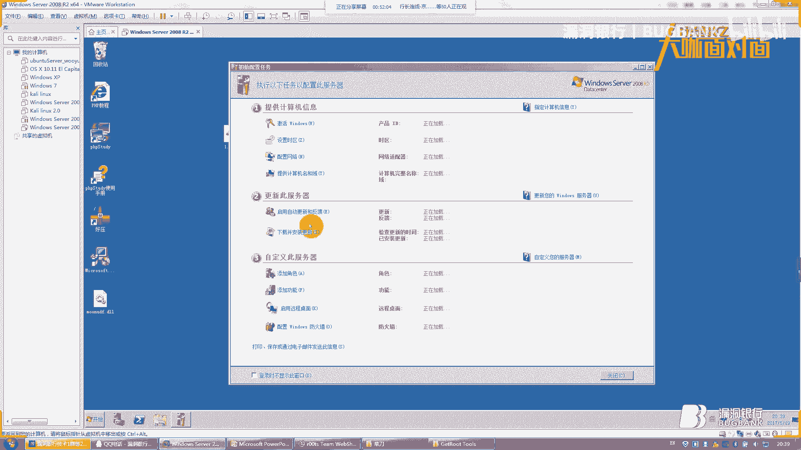

我们首先再来看一下它的补丁信息，看他我们的补丁有没有正确的绑上去。可以看到我们这里装了三个补丁，多了一个补丁是300003300000161这个补丁这个补丁对应的就是呃1MS14058的。

然后我们现在我们就是说来。我们来看一下权限，好吧，我们先看一下权限嘛，有权限了才能提全嘛，对吧？睡错了。我们已经看到现在的权限就已经是网站的目录，网站的权限，就是网站目录的权限了。

它就是相当于补丁已经被打好了。我们这时候再来执行netter要的话，它是提不上去的。他是没有办法提上去了，因为你权限都不够了，他怎么可能提得上去，对不对？我们可以看到已经没有回血了。

我们看那个要索看到有没有成成功的加上去，好吧。我们可以看到呃，刚才我加到这个用户的话，他已是已经没有加上去的，就说明我们这一块针对这个14058的印出漏洞，我们已经做好了补丁。

其实的话要防要就是要防止E叉EXP提选，我们做好补做好维护的话，就是呃及时的打上对应的漏洞补丁就可以了。

接下来我们来讲另外一种提权方式，就是说。注册票提醒。这个是加餐吧，可能也可以说是彩蛋嘛。之前我记得我在群里跟大家嗯提问过，我说在是系统权限的情况下，然后提不了权被安全软件拦截了怎么办？在这个时候的话。

就是说很多人的建议，并包括什么管理员克隆思路就出在这。在我们通过管理员，我们来通过注册表的方法来把gose的用户来给他。把gst的用户来就是说克隆一下，克克隆成admin账户的权限。

然后来进行提来达到目的的操作。首先的话我们给大家做一个演示。在这里的话是我导出的就是说admin用户的。注册表就是说我们直接把这个注册表给改成gsose的用户导进去，然后就能达到克克隆的目的。哦。

不好意思，我的P2P环境没有启动。

🤧嗯。那我就直接用我直接就是用就是说。我就直接来。用这个点代的大码来上传一下吧。公资不提交。

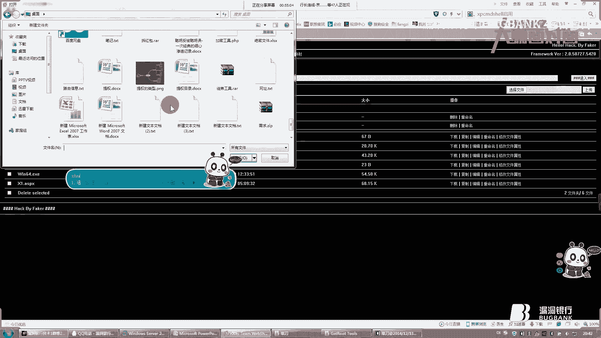

我们可以看到上传成功，然后我们给它改个名，防止运行出错。我们就叫1。R1G吧。

在这里的话，我们这块有相关的文章，就是之前我已经分享过了一次文章，主要的一点就是说。

主要的一点就是说在于我们的导出注册表。导出注册表的目录。然后的话之后就是说再就是说导入注册表。我们就是说说直接导出导入制作表，然后。我们就是说把这一块注册表默认导出的话，它是05个01F4。

它默认的是我们addmin用户。但是呢我们的各自的用户的话，他一般是呃默认的是0，就是说前面是5个0，后面是EF5，就相当于多一个字符节。这样的话我们直接改好，然后上传导入，我们来尝试一下。

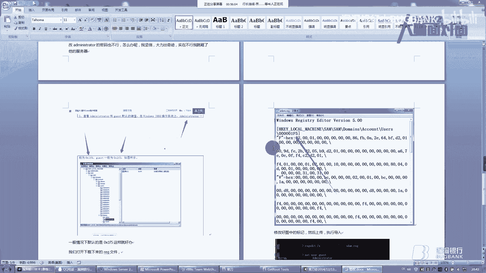

首先我们在这里面的话，它没有系统权限的用户。然后首先我们就是说肯定走不了。然后的话我们可以通过一些ESP啊，算了，我还是把我的PP环境启动起来。

🤧嗯。我们改革方位好吧。首先我们已经看到我们修改好的注册备号。🤧う。我们修改好的注册表已经就是说已经在里面了。然后的话我们直接就是说执行命令，就像这上面说的，我们执行命令，然后直接导入。

我们首先看一下权限。哦，这个是。我们看一下权限，我们来尝试导入。这里没有任何的回响。但是的话我们怎么能够来确定就是说已经正确的导入了呢？我们首先执行nettter user，它的用户并没有多。

然后的话我们执行nettter user杠GU呃叫空格GUEST。然后我们可以看到就是说它并没有就是说得到我们的就是说管理员没有到达我们的管理员组里面。

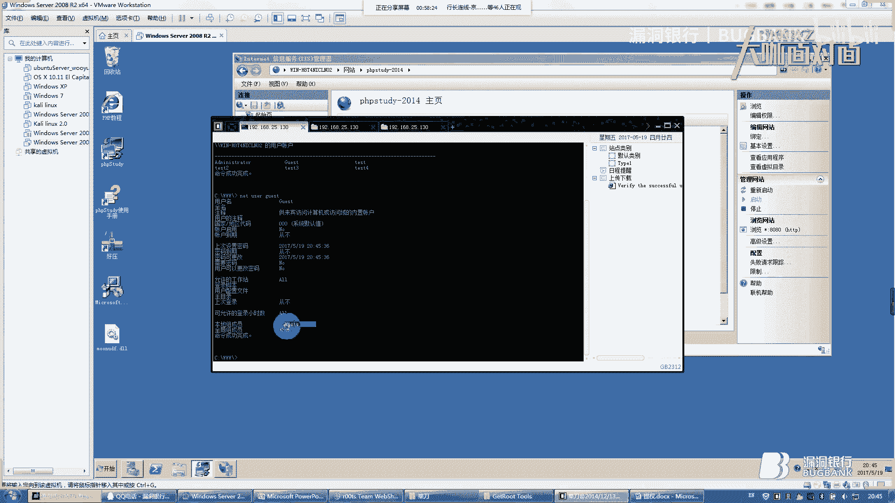

难道呃就是我们就首先在遇到问题的时候，我们就是说要想一下。是不是就是说我们是不是就是说已经成功的导入了之类的。但这样的话我们。

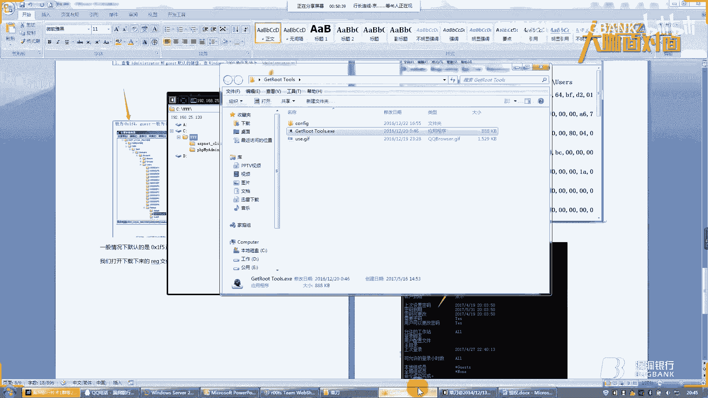

可能是因为不是系统学陷，然后我们现在我们用这个。上传1个EXP。上传1个EXP使它就是说到达系统权限，我们来再来尝试一下，看看能不能够正确的导入到注册表里面去。我们现在用15051。

我们可以看到上升成功。它已经成功溢出，并且是系统权限。那在这里面的话，我们直接执行命，我们直接执行命令来尝试一下。它并没有回显，我们再在这里面我们看一下。我们可以看到，我们现在就可以去确定一下问题。

之前我们执行换这个命令的时候，我们可以看到它并不是真正意义上的系统权限，它只是admin的权限，我们可以利用admin的权限来增加账户删除账户，加到管理员组都是可以的，没有被拦截，因为没有装防护软件。

然后的话我们之后我们再导入注册表的时候，可能可能是因为权限问题啊，然后导致我们没有成功的导入，然后我使用netus。然后各自的来宾用户的话，它还是呃各自的权限。好吧。

之后我们通过一些EXP一出达到系统权限之后。导到系统权限之后，我们再来导入这个我们再来导入这个就是说注册表，它是导入也是没有回显，也是没有溢出回显的。但是的话我们net user刚告诉了之后。

它是addmin，它已经账户名变成addmin，呃，也就代表了我们注册表成功的导入，我们成功的将addmin的这个用户克隆到我们的来宾用户上面了。并且它虽然这里用户组显示的是来宾用户组。

但是的话我们实际上我们已经就是说克隆到你的addmin账户了。但是的话我们这个默认因为克隆的话，它已经连带着你的密码。连带着你的密码，也就是说已经带着你的密码克隆过去了。

包括你现在来宾用户的密码都是我们addmin用户的密码，它并非它并非是我们的。就是说告诉的用户的密码，所以我们可以给告诉的用户再加个就是说改一个密码，直接neter yourself，然后告诉的用户。

然后比如说我们设置一个密码。这样的话我们就是说已经命令成功执行，我们的gsose用户的密码已经修改成我们想要的密码，并且他的用户已经是用gsose的用户名和密码来登录，以及。但是登录进去了。

它会显示是admin。我们来这里给大家做一下演示，好吧。

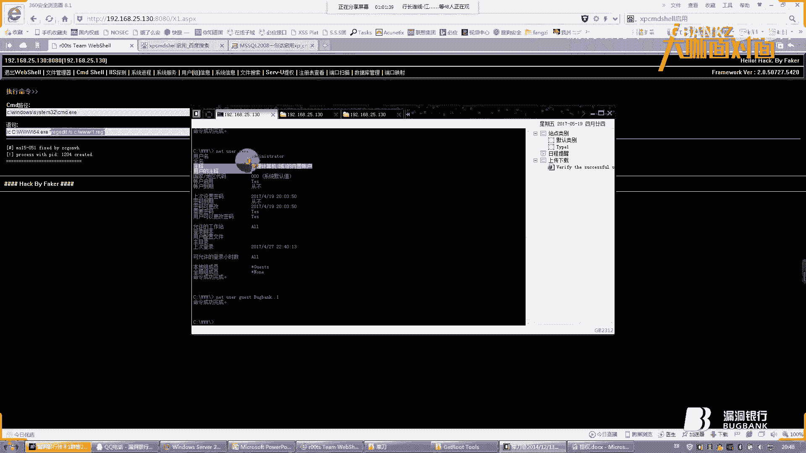

给大家证明一下。在这里我们首先可以看到，然后这里有两个ad命。但是的话有一个admin的话，它是。我们直接。我们换一个adB尝试一下。密码是。🤧嗯。我这里还是用了原来的密码。

我们这里我们用远程桌面来登录，好吧。

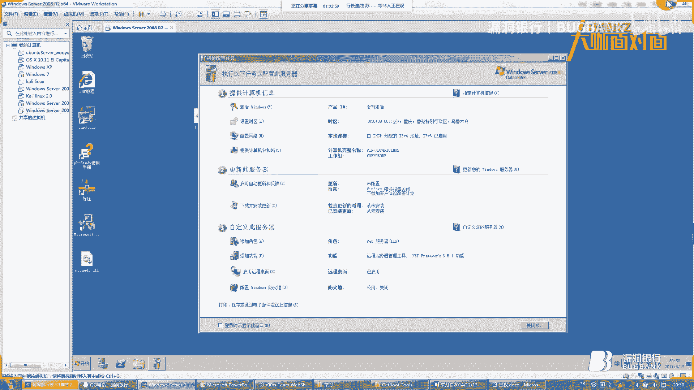

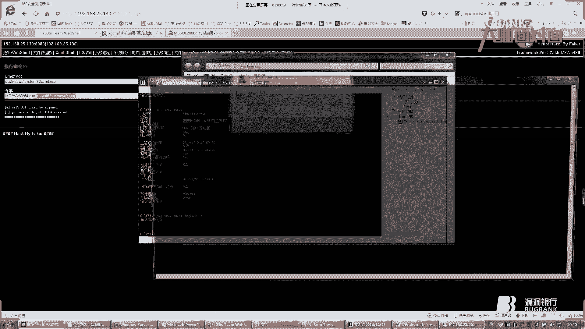

我们可以看到我们用gst的用户，包括我们现在之前修改的密码，可以成功的登录这台服务器。然后包括我们现在就是说查看我们的就是说登录的情况的话，都是因为我们如果用真正意义上的ghost的用户来登录的话。

它这里的用户显示的是gst。然后的话我们用呃用gst的登录，它现在显示的是addmin，也就代表着我们成功了，就是说我们成功的就是说已经把addmin的账户克隆到gsoset的用户这里面了。

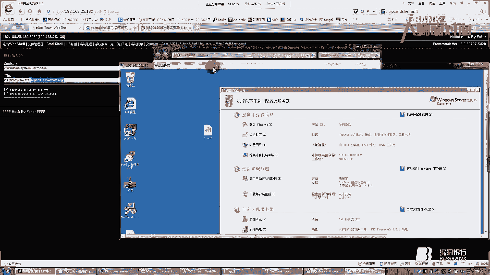

这就是我们就是说上次我遇到了一种，就是说是系统权限。但是由于防护软件拦截的问题，我们导致就是说直接。

我们就直接用这种方法来拿到权限的。

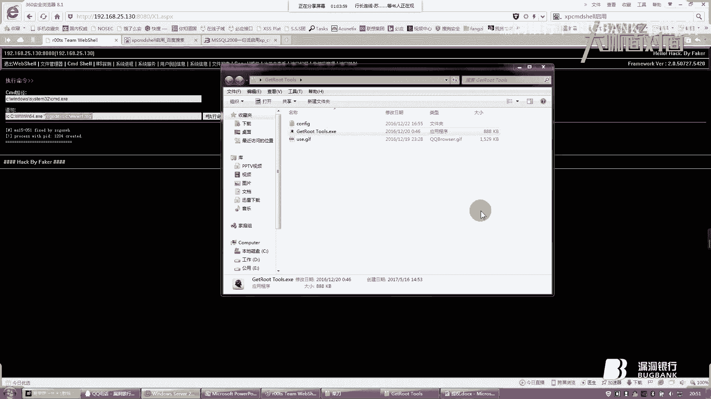

后面呢我们来接着来再再来就是说讲一下我们的常见问题。好吧。首先的话呃很多人啊很多人他就是首先跟我讲，他说呃你能帮我提个权吗？然后首先呢我在这里也就是声明一下啊，提全的话，你要是提的话，你要是。怎么说呢？

你请个师傅回来还不如学一点，就是说授人鱼不人射人胜人以鱼嘛，对不对？就是说我我给你一条鱼，还不如给你一根鱼竿，我与其就是说帮你提钱，我还宁愿多花点时间来这里普给大家普及一下知识。

然后买ser提全有什么需要注意的呢？然后买scle高版本导出UDF一般是在安装目录的这是LIB后面的哎夺不来的下面啊。然后如果我们权限扩大的话，可以创建这个目录。然后mo提全的话。

它我清测在2008的环境下失败。然后scle server的还权环提全有什么要注意的吗？就是说。呃，有可能在数据库配置不是s用户，我们AP大码里面有ISIS探测。

我们可以通过它包括翻目录来找一下同幅的配置文件。然后还有人问我，就是说一些简单的问题怎么来解决呢？然后其实的话很多人都说过一样的话，就是说在与其就是说自己去问人，还不如就是说。在百度上去寻找一些答案的。

如果百度上没有的，那我肯定会给你进行解答的，好吧。🎼后面呢就是说一波就是说比较硬的广告啊。首先的话就是我们的一夜我们一夜之安的这个乐洞演演练平台。好吧。

其次的话就是刚才给大家演示过的高st key他开发的一款工具，好吧。然后之后的话就是我的团队logo和我们一夜之安的logo。

然后的话嗯我也是给大家争取了一争取了一些一夜之安就是乐洞演练平台的这个注册码要就是注册邀请码。好吧，待会就是会跟就是说跟在赠书环钱一起给大家赠过去，好吧。然后提前的注意事项啊。

首先的话我们就是不要对厂商的业务造成影响，安全测试合理测试。然后第二个的话就是我们在遇到难题，遇到棘手的问题的时候，我们不要轻言放弃。然后第三点的话就是我们千万不要做违反中华人民共和国法律的事情。

第四点呢就是权限是死的人是活的。如果我们只要我们人是活的话，那方法就是随着我们脑子来灵活运用的。好吧，希望我就是这次的就是说给大家的分享，能给大家带来一定的帮助吧，好吧。

🤧嗯。关于方程式linday怎么来提全的话嗯。关于方程式lin内来怎么来提前的话，我们就是说。刚才我们已经其实我们已经讲过了。

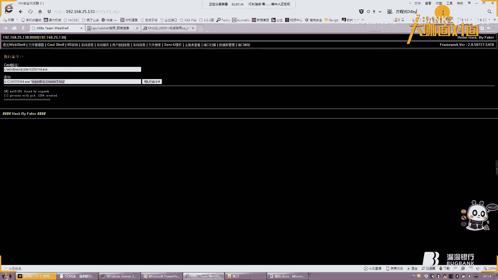

对不对？关于这一方面的话。你可以就是说给你一个链接，你自己去看一下嘛，好吧。

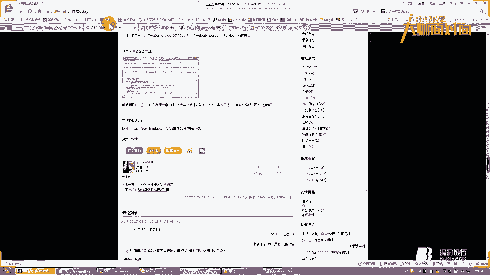

当萨贝降权的时候，呃，首先当萨贝降权的时候，我们在我遇到一个情况啊，当萨贝降权的时候，萨密码因为人性密码的通信。比如说我服务器。比如说我服务器的密码，我们被加到了。

比如说我们服务器密码设置的是8个 bank8个 bank，然后点点123，然后s密码就是说也是8个bu。点点123。当然我们遇到这种情况的话，你如果有sar被降权了，你sar密码。

你可以尝试用sar密码去登录一下windows服务器，有可能会有意外收获。但是的话就是说如果你sar被降权的话，你可以就是说尝尝试采取一些ESB齐权之类的。🤧嗯。

然后之前的话然然后这个问题的话就是说你上传了一堆EXP提不下一个境外，加不进呃管理员组只加到了uselL组里面。然后这个问题的话，首先你看一下你的服务器是2008还是2002008啊。

在有的EXP利用里面的话，它是怎么说呢？2008它有一个尿性，它是怎么地啊。他是说你密码太简单的话，他是不给你加的，默认的就是不给你加的。然后你加到了用户加不到组的话，你可以尝试我之前说过的方法。

看一下用户的管理员组是哪一个。然后的话再看一下你的权限是不是系统权限。然后注册表那篇文章的话叫什么名字？然后的话这里我做过亲分享了，然后在注册表这里的话就是。注册票这一篇我来找一下，好吧。3月份。

我搜一下。哦，这个可能是群文件自动清理的，到时候我呃我联系一下年念，然后重新再给大家分享一次，好吧。🤧嗯。然后注册表是不是可以用本地环境导出，然后再导出导入到服务器里面还是怎么样的？你可以用本地。

你可以用就是说注册表，可以用本地环境导出，然后再导入到服务器服务器里面，也可以直接在服务器上导出再导入到服务器里面。我这个注册表的话，就是说这个IEG文件的话。

主要就是上一次在体检的时候导出的保存在本地。然后我自己也尝试过，可以在其他机器上面导入，直接在可以在其他机器上导入，并且就是说是就是说呃也能够成功的克隆过来，这个的话是没有问题的。

跟本地环境呃呃可能跟环境纹理。因为的话我本机是WIN7的系统。然后这次呃做演练的把机和上次就是说做测试的呃网站的话，就是说深度测试的网站的话，它那边的话，两个是一个系统，可能跟系统有关系。

到时候你自己亲自测一下。好吧。如果有需要的话，待会我把这个注册表，就是说呃就是分享到群里嘛，好吧。🤧嗯。嗯，所以的话我当时是在2008的系统里面导出的，然后这次的这次的系统也正好是2008的。

所以的话可能因为我之我之前没有注意到这一块的细节，可能会有一些问题。然后的话大家可以到时候就是说自己去试验一下嘛。工具名的话，工具呃go kit那款工具对吧？

它这个工具名叫getget root toolsus。然后的话嗯这样的话待会待会我我不知道分享他的工具有合不合适。我待会问一下他他如果没有什么意见的话，那到时候我也可以一起给大家分享的。好吧。啊。

我们这一次呃这一次我讲的是呃主要是。呃，window提权至于你这块的呃MSF的话，它这一块的话，MSF这一块提权的话说的那个一点，它主要就是通过溢出，然后反弹回share，然后执行命令。

其实跟我们的其实我们最终的目的就都是一样，都是拿到系统权限来执行命令，对吧？OD2。0啊，然后这个浅项这个OD2。0，它是问的是逆向方面的。然后我这次讲的是提全啊。3389连不上内网环境。嗯。

3389连不上内网环境，你详细说一下你的问题好吧，然后安全口拦截命令所得死死的基本是无解了。我个人比较喜欢，直接就是说如果有sM级权限的话，就是说直接。直接就是说用CMD命令来比较好一点。

就比如说你NC反弹share到你本地和你NC反弹share到MSF的话，你会选择哪一个？一个是本地环境，直接是windows环境。另外一方面的话。

就直接还要进carlylinux或者其他的环境里面去执行。相对来说步骤会多一点。MSF确实比较厉害一天，对吧？然后的话MSF在某些方面确实比较。嗯，比较就是说好用一点吧。

然后但是的话可能就是说因为个人习惯的问题嘛，我更倾向于使用就windows在。在没有必要的情况下，我一般的都是不会使用MSF的。没有狗，就是内网环境，尝试开启3389无谷管理什么的都能添加。

这样的话就是嗯你可以开开不了3389，你试过哪些开3389的方法呢？注册票注册表开启。卡在360之类的杀毒的话，还有什么思路吗？哦，我之前遇到360杀毒的话，我是直接用。

我之前嗯我之前就是被360拦截了，然后就是直接用注册表提全的。然后现在的话就是说刚才那个小伙伴，他说3389。开条3389开不了的话，在这里的话我给你。看一下好吧。3389。我给你发了一款。

就是说我之前开3389用的工具，你可以尝试一下，看看用这个工具能不能给开启3389。lininux提全的话，它其实呃。有EXBT提项和端口齐全，一般的都是一般的都是这样。3389端口开着不允许连。

首先你可以去查看一下服务它的远程服务是不是真的使用3389端口。这么跟你说，或许你能更容易理解一点。比如说我的远程端口，我改成33899。然后的话我用其他的服务来占用着3389的端口，然后。

然后就是说呃我用其他的服务站着这个3389的端口，可以给你来来一点，就是说相当于混淆视听的感觉。你认为你以为我默认的是3339它的端口，其实我是33890的33899的端口，对不对？哎。

就像我们这个小伙伴说的，可能开了个假的3389，对。呃，防火墙防火墙可以设置不允许外联吗？这个是可以设置的。但是的话你要设置好规则，不然的话当芯啊就是说就是相当于当心的话就是说。

连你自己都连不上。但是的话你在提全的话，我们就是怎么说呢？我们在提全的话，我们有一个关闭防火墙的命令。但是的话我不知道我之前说实话，我自己。

我自己也没。也没尝试过使用，然后的话一般的还没遇到过，就是有防火墙，就是说。的情况，然后我们可以给你我可以给你一个。我可以给你一条命令，你来试一下。你可以用这个命令来试一下。嗯。😊，你这33889端口。

你给我截图的不是已经开了吗？然后你这是内网的，然后呃。然后小伙伴，你这是内网的，你要使用一下内网转发，用LSLCX这个工具来转发一下来看看。啊，word文档我待会会联系年年来分享的，您放心好了。对对对。

好。好的。😔，哎，那就这一位吧，因为他问问题的问到私聊，问到我家来了。就他吧。一共有一。一共有5个邀请码，然后的话嗯怎么说呢？我可能要违反一些群的规则，就是说有在听课的小伙伴。

他们就是说相当于冒个冒个泡的形式，然后我们来。就是说然后让我来随机抽几名吧，一共有5个邀请码，好吧。没人要吗？那我就直接艾特5个人，好吧，然后艾艾特5艾特5个人，然后5个人直接来私聊我好吧。

然后我直接发给你们。因为我直接丢群里的话，要不然直接丢群里，让他们去抢处吧。我看不到啊，真看不到。是把我刷卡了吗？不是啊我真的看不到，我就看到分享了1个GIT前卫指南。

那你那年年你私那那年年你私聊截几张图给我，然后我就选几个嘛，好吧。因为我这边实在没有，你看不到我屏幕吗，我实在没有看得到。实在看不到一。好的。哇。嗯。然后首先这个。44。首先这个四川的。

叫什么le time left time。哇哇。哦，好好好。好啊。好卡啊，刷的。好。这5个人来私聊我，我给你们邀请码，好吧，哇。32分。好了好了，不要刷屏了，再刷屏就违规了。て？没有。嗯。还有。

要想还要就是邀请码，因为我只争取到了5个。然后那边老大说，如果你还要想得到邀请码的话，就可以就是说关注一下治安小酒馆这个公众号。然后通过他们就是说官方会有活动赠送了，可以参加活动来获取邀请邀请码的。

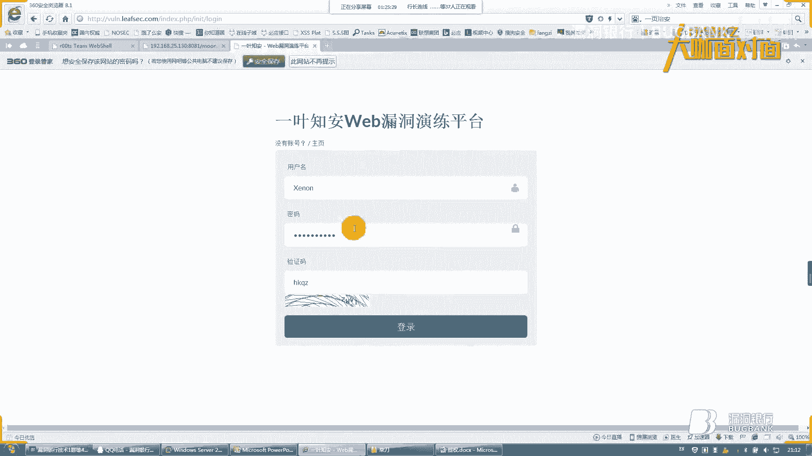

没。

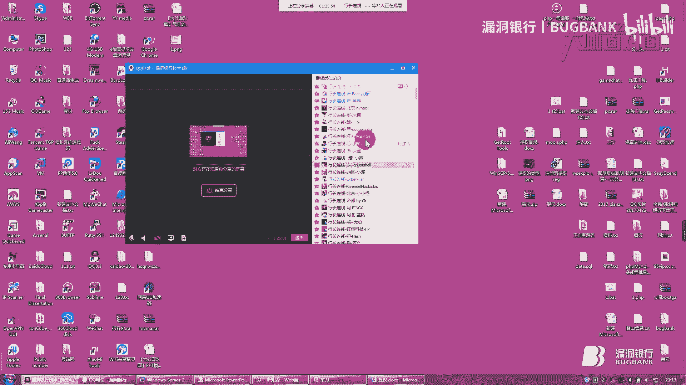

我感觉我做了一个错误的决定，扣一扣一扣啊，我要背播了。我分享啊，我今晚肯定分享啊。我分享。完了。我艾特的。

Yeah。

