# 漏洞银行丨揪出潜伏的源码泄露真凶XXE-XML实体注入危害解析丨咖面48期 - P1：48【录屏】揪出潜伏的源码泄露真凶XXE-XML实体注入危害解析——大咖六娃分享 - 漏洞银行BUGBANK - BV1Wb411y7Rt

Yeah。

Yeah。为知识而存，因技术而生。小伙伴们，大家晚上好，欢迎参加漏洞银行信息安全技术讲座。大咖面对面。今晚是咖面的48期，我是主持人年念。😊。

今晚我们请到了前途不可限量的克拉实验室成员大咖六娃带来主题为揪出潜伏的源马泄露真凶叉叉EXML实体注入危害解析的讲座。为什么蛰服几年之久，一招坐上2017年度OWSPtop ten的宝座？

那就在今晚星机boy叉叉E的小秘密即将被揭开。小伙伴们有什么问题可以随时提出。大咖会在行长问答环节为大家解答。大咖送出海环节，还会选出一位最认真听讲的观众，送出大咖挑选的代码审计。

企业及外代码安全架构一本。下面这让我们欢迎六娃开始今晚的讲座吧。😊，好，那我们就先来看一下。

我们今天先讲的内容是什么？嗯，首先我们会就是说呃讲一下我们的一个漏洞的成因。那么呃还有一些叉ML的基础，然后还有PPP协议。这些话就是呃我们就是为了后面的呃漏洞测试以及构造我们的配料的。

然后做了一个基础的铺垫。然后嗯就是我们后面的测试环境，嗯，一个环境的话是我们用的是PHP，然后是NG。然后呢，我们的系统是一个乌班兔。那么我们可能还是中间会呃使用一下我们的呃win10系统。

然后做一些其他的一个测试。然后就是说。嗯，我们就。呃，这个漏洞的话可能是比较老了，几年前就有了。那么也是今年就是很初奇的，就上了2017的就是OWSPtop10。呃，是说明我们这个漏洞的危害还是比较多。

也是比较呃呈现这种高危的。那么对于我们的这个。叉叉E嗯，我们也会叫到他叫到H就叉ML外部实体出入。那么这个叉ML嗯，它的话主要是用来做一些呃数据的处理。那么。呃，为什么会叫做外部实体注入？

那么就是当我们呃就是叉ML不就是呃这个啊对XML它会有一个呃就是可以引入一个外部实体，这是他的一个。呃，结构吧，它的结构里面有一个外，就是一个尸体。那么就是当我们的这个尸体被就是解析过之后。

没有再进行任何防护的时候，那么他会把我们的尸体就是带入进去，并且进行就是一种侏入猪入的一种形式，然后进行攻击。那么我们就可以构造一些配套的，然后进行一次注入呃。那么这些就是根据不同的一个目的就是。

构造一些不同的一些配套的。那么我们的这个叉叉异漏动呃，可以构造一些像就是读取任意文件。那么包括一些就是命令的执行，还有一些内网探测啊，还有一些就是简单的SSRF。呃，当然他可以做一些这个道士攻击。嗯。

那么我们就是下面的话，我们要讲一下，就是我们的一些基础的一些东西。呃，首先你要就是呃想要构造一个配套的，那么你肯定需要懂一些基础。那么我们的插面基础也是必须要了解的。呃，下面就是我这个PPT上就是嗯。

呃，写了就是我们用需要用到的这个叉ML基础的一一些呃就是一些东西吧。呃，也是就是这三条也是必必用必用的。我们需要就是必须要用到的。那么首先第一个是叉ML的一个声明。

就是说这个文件呃要声明这个是一个叉ML。那么我们需要就写一个呃叉MM，然后需要版本，然后后面是一个呃编码，这话主要是声明它是一个叉ML。然后我们后面会用到一个内部的TDD。这个TDD的TDTD呃。

这个话主要是。呃，也是他的一个呃，就是怎么说呢？是个叉L的一个。嗯。标准的一个东西吧。那么我们会需要它，然后呢，下面会是一个外部，就是外部实体。这个实体它本来就是我们也是也是我们的插门的一个标准的东西。

但是我们说嘛是外部实体。呃，我们需要引入外部实体来进行一个攻击。那么所说就是我们需要呃。呃，就是载入我们的这个外部实体这这个。呃，东西，然后。进行了这个让他解析我们的外部尸体，并进行我们的这个注入攻击。

嗯，那么我们就先来。呃，就是可呃用。代码说一下吧。呃，首先我们要就是过造一个配套的前提，是先，我们需要懂我们的这个。叉M2。那么我们首先刚说了，要先声明一个叉M一个声明，就是写一个叉M的声明。

然后当我们的插面说明完之后，我们要就是写一个内部的DTD。呃，说呃，我们的话就是先来。看一下DOCTYPE。然后这个话首先我们需要说明一个根元素，这个根元素名称的话，我们可以随便写呃。比如说我写个A。

那么然后呃后面的话是一个元素的一个声明。那么我们就先空着。哦，我用我用一个。对。嗯。那么这个地方我是先空着，然后我们说了，我们是要引入外部尸体。那么这个时候我们要呃写一个尸体的一个声明。

就是说我们要载入一个尸体。那么我们先看下我们的尸体。嗯。E嗯。T。嗯。这个时候我们要申明一个实体的一个名称。这个名称的话，我们叫做test了嘛，我们就随便写写一个test。

然后后面的话我们要引入的是一个外部实体。那么外部实体这个叉L它有一个规定，就是要要我们用1个SYS systemsem。然后后面跟上我们的是个UURI。或者是URL。

那么这是一个呃很简单的一个就是叉M的一个。DTD加上我们的这个呃实体。那么我们现在这是一个简单的一个呃构造是完了。但是我们要去注入册的话，我们要根据不同的一个环境。那么就是要勾造不同的一个配料的。

但是这个配料的的话，我们需要用的是一个协议。这个协议。

那么我们这个协议，因为我们是用的PVP嘛，那么所以我们要使用的是PP的协议。呃，我们这个PP协议呃，就是支持的有菲尔协议ATDPFTPPP后面等等的一长串。然后各种协议。那么我们就是说呃。

先要了解我们的协议能干什么，然后再通过我们的协议能否去就是执行我们的这个呃。这个叉RE攻击吧，然后呢。那么我们首先来看一下我们第一个就是fa协议。这个fa协议我们是要读取文件的。也就是我们所说的。呃。

就可能呃这话就是我们到了。我们的这个危害职业读取文件这一行。那么我们先了解一下我们的协议到底是怎么做的。

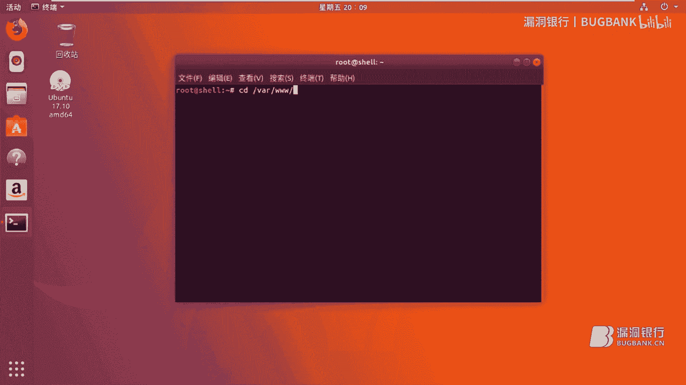

哦，我这里有一个就是一个写的1个PP。呃，很简单，他首先我就是传入一个cook，以ge方式传入一个c，然后就是inc一下，然后就是。包含一下我们的这个cook的一个内容。好。我们就是先来看一下。

那么酷呃，这是时我们比如说我们刚刚说到一个fa协议。呃，一个fa，然后一个冒号两两双斜杠。这个时候我们比如说跟上一个呃我们的路径是一个。VR。呃，首先下一个斜杠VAR。3WHTML。😔，然后。

1点T叉T。那么我们看一下我们的意见TID是不是这个。那么我们看我们的1个1。T例里面是share test。那么我们读取出来也是share test，说明我们是可以读取这个文件。

那么我们就利用了我们是这个fa协议，然后我们再去构造这个payload的。那么我们这里呃就是有个stem，后面跟上URI或者URL。那么这里的话我们需要写的是我们的PP协议。

那么根据我们刚才所就是用到的菲尔协议，那么我们去就是说。去勾造我们的这个配料的。这个时候我们的配料的其实已经勾造好了。那么我们就是说如何去呃，判定一个这个网站是否存在，就是我们所谓的。

所谓的这个叉M web实体注入。那么就是看他能不能就是解析我们的叉ML。这个时候我们随便定义了一个呃y name这个标签，那么中间夹夹杂了一个冷面。然后我们登录过之后。

我们发现它回显的会是一个addmin，然后说明我们的那个标签就已经被解析掉了，那么就会直接就是产生一个addmin，就是我们解析过后的只剩了中间这个字符串。

说明这个是会存在一个就是呃叉ML一个外部实体居入的一个地方。那么通过我们这个地方，我们可以去呃读取他的文件。那么就刚才我们所说的一个fa协议，我们这个时候。通过我们的插面一个呃基础内容。

包括我们的这个菲尔协议构造一个配套的，我们把它。就是说放到。我们可能存在这个叉ML的一个外部注入的外部实体注入的一个地方。呃，这个时候出错U啊UTD这里好像写错了。捐括号。VIP。笔盒。😔，USST验。

我这里嗯我看一下。产生了一个错误。🤧嗯。No。哦，我知道了，因因为我们后面要。哦，这点忘了说了这个话。呃，我们后面加上一个就是一个尸体，因为只有我们解析尸体的时候呃，才会执行我们的外部。

就是在解析我们的这个呃外部尸体。那么这个实体的名称要跟这个就是我们定义的实体名称，是就是里面的这个实体名称跟我们后面外面定义的一个。实体是一样的。那么我们实体就是有一个这个字符。呃。

我也不知道怎么去读这个字符。然后然后的话我们要跟上我们的test这话因为首先他会解析我们这个试题，接着话。就是呃执行到就是解析我们的这个外部实体，从而执行我们的这个fa协议。

这个时候他会就是说呃读取到我们的这个文件。呃，因为如果我们没有就是说呃加入我们的这个呃实体的名称，那么就会他他又解析不了，他可能就是无法去解析这个东西。那么这只是很简单去读取一个文件。

但是呢最后有一个呃弊端，就是说。嗯。比较鸡肋。因为它可能需要你获取到绝对路径。那么对于我们的呃linux的就是话linux系统。那么比如像stoS然后其他的这种操作系统，那么我们可能会呃比较熟悉一点。

它会哪个目录会存放一些其他什么东西。但是对于windows的话，那那么可能要瞎猜了，就是乱猜的。那我们可以向还要读取一些。呃，把这个改一下。呃。

像读取下面的一些passwordpasword这个里面一些东西，那么也是可以的。那么这些我们都是因为我们已经知道了linux的原目录架构。那么但是windows的话，它可能会放的就不一样。

那么要读取它的东西，可能就猜不到它到底在哪个目录下啊，这个是比较鸡肋的一个东西。那么这话就讲到了是我们的。这个呃漏洞了一个危害。第一个就是说呃任意文件的读取。但是呢。

这个读取就是用我们我们的菲尔协议去读取这个TRD还好。但是如果去读取我们的一些其他的，比如说PP。那么PP文件的话，就像学去读取是读取不了的。因为就是说我们PP前面会有一个监括号，一个问号。

因为这样去读取，它会把它当做就是说。呃，插门去去执执行。但是就是说呃你要是。那怎么说？因为我们啊前面看到我们前面有一个监控和一个问号。那么这个时候他是他可能会。嗯。

就是说我们PP同样的前面也会有一个这样的东西，所以说他会把它做到一个。插码去去执行。但是呢我们的PP文件它不能去执行这个东西，他要执行不了。那么所以就是如果直接用菲尔题读取，它会进行报错的。

那么这个时候我们还要去学习其他的协议。那么这个协议的话就是我们。就是我们的。呃，PPPP协议PP协议它有一个就是个。PP这个FILTR这个东西，它这个东西它是一个输出输出的输出流。那么还有一个输入流。

这个话我们就不说了那么多了，因为我们也是用舞蹈输入。输入的话，他因为是要input。然后这个input的话，他因为发现pos的数据可能会有些问题，不过呃也可以去。呃，试一下。

看能不能就是使用这个input协议。那么我们使用的这个这个FILTR这个输出的输出流。那么我们要使用它呃，就是去读取我们的PAAP文件。这样的话呃，就是说。呃，我们因为他的话。

我们可以再使用我们的B斯64，这样的话把我们的东西全部转化贝斯6。这样的话，我们的这个前面的监控号和问号都会被转化成B斯64，所以它不会被当做这个呃叉2去处理。嗯，这个因为呃太长了，我就不打了。

因为我们使用的就是一个协议，只要把我们的这个sstem后面的URL和URL改成我们的这个PPP协议，我们就可以构造一个新的配套的。那么我们的这个配套的呃。哦，我把它删一下。呃，同样的。

首先他会去解就是解析我们的这个叉ML，那么会解析我们的这个test。然后再次呢，他会执行里面的我们的PP协议他会解析到中间这一行第三行，那么他会。就是把我们这个PP协议当做执行的一部分。

那么这个他默认就是去呃，去解析，就是读取文件的时候，他读取的是我们的根目录下面的。呃，一个。他会默认读取我们这个根录下面的内容。那么比如说是index点KP。那么我这可以改成其他的哦，我先不改吧。

这样的话我们去读取的时候呃，可能会方便一点。因为我们不需要再这样我们绝对路径。呃，这个时候我忘了。我们看一下啊，首先看一下呃，这个时候他会显示出来的是呃，一长川的B464。我们这时候需要呃进行一个解码。

那么解码之后，我们呃看一下。这个时候会把我们那个呃主目录下的1个index点PPP内容全部给读取出来。呃，这个时候我们就可以获取到它它的index的就是呃全部文件。那么我们如果就是说。呃，呃。

也可以获获取它就是说其他的文件。但是的话这个也是可能会有点激累。因为你不知道他文件都到底都有什么一个文件。如果你知道它有什么文件的话，那么我们就可以全部把它给获取出来。

这这就实现了我们所谓的呃任意文件文件读取。那么读取啊，就是说读取出来之后，源码就是说我们也可以就是给它全部拖下来。这是一种呃比较危险的一个操作嘛。对于对那些呃。

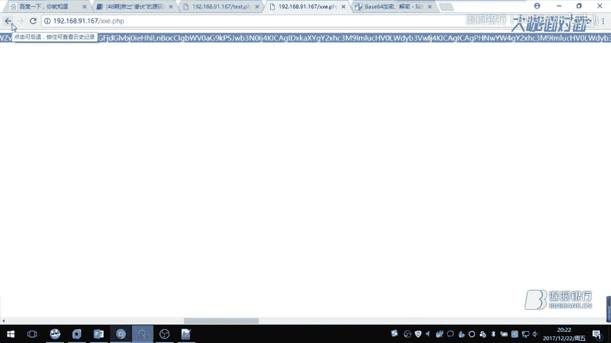

存在这种漏洞的人来说，可能是比较危险一个漏洞。呃。就好比啊我这个下面我应该啊我看一下应该其他的。

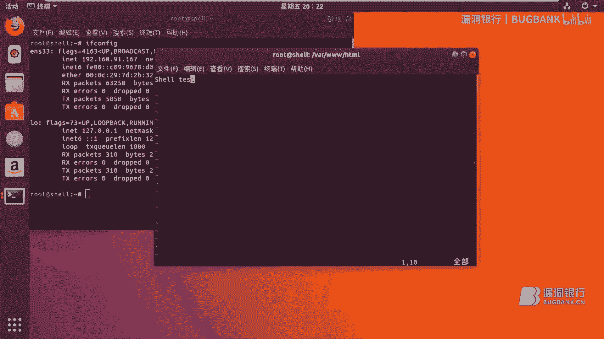

家里有一个。我再我们再读一个叉叉一点PP。那么同样的获取到的全部是贝斯64，然后我再解一下密。呃，这个时候我们的这个全部就是他所有的PP呃代码，我们全部都获取过来了。这也是我就是做一个环境的一个呃代码。

那首先我这话就是说呃传入一个始 name，然后把我们的始 name然后进行这个呃叉M这个函数去解析，然后解析过之后，然后再输出。那么这个函数的话是在PP5才有的。呃。

也就是说我我们这个漏洞也是有一定的局限性。那么因为我这个也是PPB环境嘛，那可能对于java来说，可能更简单一点，对吧？呃，那么这个文件读取就是说我们可以任意的就是读取它的所有的文件呃。

这个前提就是说你能知道它的文件它在哪呃，算是有个小鸡累啊。然后呢。呃，这个的话我们所说的是一个。就是我们的测试。第二个就是说内网探测。

那么包括一个就是说所谓的一个简单的SISSIF其实我们前面所用的一个呃PB协议呃，或者说我们用的fa协议。那么我们在读取文件的时候，呃，也算是一个很简单1个SSRF就是说去读取它的文件。

那么这句话我们呃可能要使用的是我们的这个HTTB协议。那么我们的呃用HTTP协议就是说去请求我们的本地本地的1个IP嘛，就是我所谓的127。0。0。1或者是local host。然后呢，这样的话。

我们再去请求我们下面的一个文件。那么这样的话就会。呃，或者是目录啊，就会呃可以很清晰的读取到这个文件。是否存在？或者说不存在，或者这个目录是否存在。那么还有端口也是一样的。

我们就是以我们的一个loc house的方式去请求这个端口。如果这个端口存在，那么它会给你显示一个打开的一个呃状态。那么如果不存在，它会会给你显示出一个关闭，那么有的可能会不会就是说嗯。嗯。

就是说没有响应信息的情况下，那么我们可以使用一些抓包软件啊，比如说babiecu就是抓下它的包，看它的一个服务器和响应，那么会是怎样的？嗯，那么还有呃像。呃，我们一般会去请求一些比较常见的端口呃。

像TCP这一些端口。那么还有一些我们可能会呃你你想如果1个URL后面加上一个。呃，3389呢，他会又怎样呢？呃，如果这样的话，最好是他的那个呃远程桌面协议IDP呢？嗯，我们来就是说先看一下，同样的。

根据我们上面一个框架，一个简单的配料的框架，就会去构造一个我们的一个所谓的配套的。那么我们找就是1个HTDP。那么就是发送个这些请求嘛，我们比如说像一个loc house呃，我简单点吧，我们就1270。

0。1吧。嗯，那么这个时候啊，我们比如说去探测他一个端口是否存在。那么我们后面值呃80，我们就是1个80，这肯定是存在的对吧？因为我们。能够访问我们的这个说明，他肯定是存在的。然后我登录之后。

这有会报很多错误啊，这个可能这个也不用管，这个是我环境的问题啊。这个时候我们可以看一下，找到错误。那么我们第四行报了一个错误，一个open个什么玩意儿，后面一大堆的。

那么他没报一些其他的可能是不存在或者关闭的这种东西。那么他报了op open，然后说明呃我们这个端口是一种打开的一种状态。那么可能说在经济环境中可能不会像这种报一大堆错误，那是呃应该是不存在的。

这个是环境的问题。那么。我们可以通过这种报错的一种方式会去得知到我们这个打开的状态。那么我们也可以通过一些抓包，我们去抓一下他的包。我啊我打一下叭波休的。呃，那么我们主要请求嗯，请求一下我们的。哎。

等一下。嗯，那么像33063306是买scle的一个端口嘛，就是默认的对吧？然后我们请求一下。呃，这个时候王洋就没错了啊，他没他没有响应信息呃，这个时候你可能哎，他到底开了没有呢？呃，自我感觉。

如果正程序正常情况下没有报错的情况下是极有可能开着的。不过正好我们要抓包，我们来看一下。😊。

啊，我用我换个浏览器吧。

那么我们放入我们刚才的一个。拍劳的。呃，3306。然后打开代理。哦，测试一下。就说他也很快的报了1个200，那么我们改一下我们的端口，我们改下3307，3307肯定是不存在的。那么他就是呃。报一个呃。

这个说又报错了，报错的话嗯，我们看一下报错内容。就是他报了一个呃呃这个怎么读来着？然后tto open。呃，这话可能他就不是打开的了。那么我们可以翻译一下它是什么什么个意思。未能打开呃。

就是说明没有打开这个端口，说明这个端口不存在。那么刚才我们呃，直接是3306的情况下，它是就是说没有报任何错误呃，这个也是极有可能是打开的状态。那么像这种直接报了个错误。那么说明它是呃就是说。嗯。

没有打开的。会会报一个未能打开之类的一样错误。但是可能每个浏览器的报的结果也是有可能会有点出入呃，但是意思大概都是一样的。呃，那么这是简单一个呃。其他端口的测试这样叫TCP端口测试。那么如果说。呃。

我这个是哦，看一下啊，我看的这个就是说我们开的是一个远程桌面协议呢。嗯。这个是哦我就就用我的这个。温许来做下测试好了。

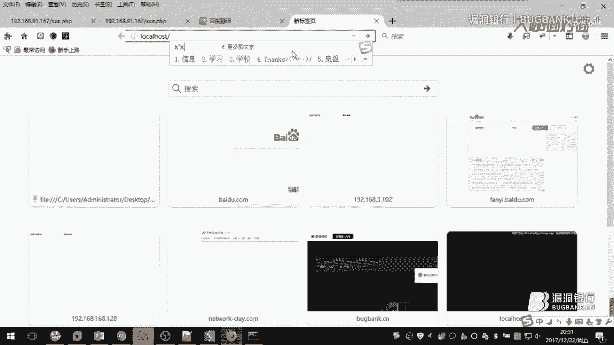

那首先我这里是没有开3389的。或者说我没有开启远程桌面协议。那个端孔。

呃，这里没有。那么这个时候。我们测试一下啊。嗯。338邮，那肯定肯定会报错啊，没有打开，对吧？肯定是没有的。这个时候他报错就不一样了，他首先都报了一个是呃没未能打开的。

然后后面又报了一个呃计算机机极拒绝无法连接。呃，这个时候他又报了一个这样的错误，呃，感觉跟其他前面报的是不一样的，对吧？呃，可能是因为他这个协议的问题啊。就是说他可能是。就是一个远程桌面协议的问题。

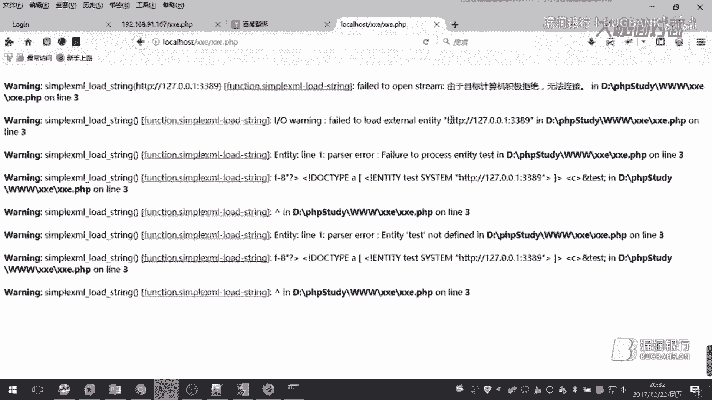

那么如果我打开了呢，他可能。

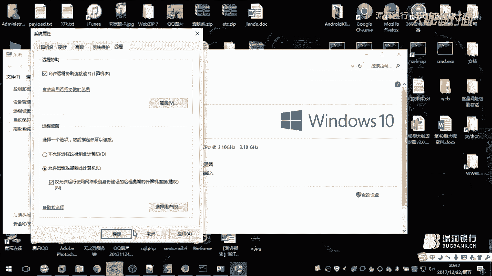

嗯。这个呃这个时候我应该是打开的啊。3389。这个时候我已经开启了的，然后呢。这时候我们再去呃。我们再去连接一次。3389TCP。UDP。😔。

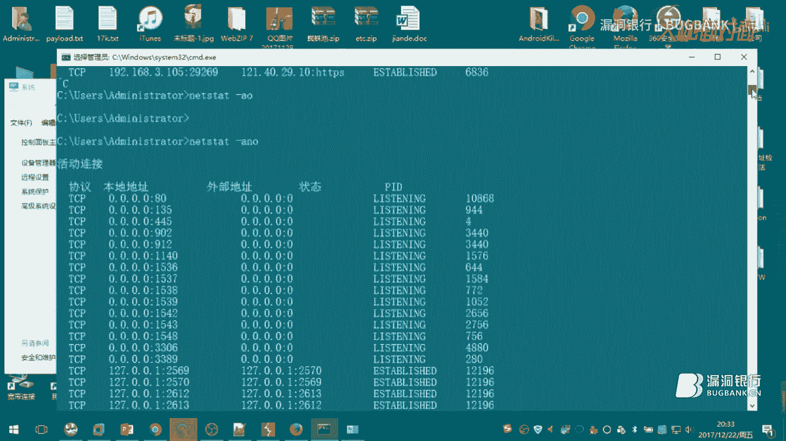

这个时候我们再去连接的时候，我们会发现。呃，拖位一直在转圈，不停的在转圈。嗯，他一但是他就是说。呃，一种一直去连接的一种状态。那么这个时候呃我们可以从此判断出他的338小是打开的呃。

这个也是因为他协议的就是他的一个。呃，338有协议的一个问题，就会一直去连接他，但是他就是连接不上去。因为他毕竟只是一个呃A。一种呃。HTB的方式去请求的，那么所以他肯定是也连接不上去的。嗯。

那么说明呃这种端口也是可以去请求测试的。嗯，那么这只是很简单一个端口去测试它呃，测它的是否开放了没有。那么我们还说了，我们呃刚才就是说嗯去请求特这个文件夹或者是文件。嗯，那么刚才我们看到的是就是说。

我们用的是菲尔协议以及PB协议。那么去请求他的文件。那么这时候我们如果用这个呃。就是说是HT就是HTP协议去请求一个呃文件或者一个文件夹。啊，当我把这个关闭之后，他就会直接报错，瞬间就就报了一个错误。

那么同样的我们修改一下我们的这个。退的，那么我们给他改成。嗯。下面有个一点T查T。然后呢，我就请求的时候，同样的他会去读取这个意点T加T。但是呢如果我们去。就是说。请求下面的。PP文件。最我请求不出来。

呃，但是也不能说他呃，但是就是说呃他他不能显示，但是呃也不能说它不能显示呃，也可能他怎么说呢呃。这样好了，我。这样你请求的话，他也会他会报错。这种报错可能跟我们刚才我们刚才请的是有差差异。

截接请求的差差异。那么这个时候我们请求的是index。他们我们看看到了一个报错，一个没报错。呃，这个时候就是说。我们直接去请求这个叉R异的时候。他不会报错，因为他确实已经执行了，但是他没有报错。

是因为他本身就没有错误。但是我们当时去请为什么去请求index的时候就包错了呢？因为我们去请求之后。我们把我们的。这个文件就是我们一个呃。怎么说，就是我抓包说吧，这个抓包说一点还是好一点的。哦。

先放着我们的配料的，我们去请求这个测查异的时候，他是不会报错的。因为它本身就没有什么错误。说明也说明一点，就是说。我这时候请求过去，他没有认报错，包括报了一个呃，状态码是200，说明这个文件是存在的。

如果是个不存在的文件。赔报44。对吧那因为我们是以我们的呃1270。0。1的方式，或者说我们是以look host的方式去请求他的，就是相当于1个SSIF的一个很简单一个呃。故。很很简单1个SSRF吧。

这样说比较好一点。😊，嗯。然后呢，我们当然去请求的是index。点P是P就是他主页文件。就说请求的时候呃，这时候也没也没错误啊，可能是刚才我们确实。啊，不对我我我我我改错了啊。现在有点尴尬了。这个时候。

嗯，有的。在这个时候会发送到叉叉E。这PDP他会交给他叉RE这个文件去处理。但他处理的时候。那么肯定就会报错了。这个错误报的是我们这个。函数的问题。那么他可能是因为我们请求的方式去不对。

那么会导致这个问题。那么当我们如。我们的文件就是说是主页文件，那么我们这里改。改成一个主页文件，那么它同样会报正确的，那么同样的。呃，这里会就是说。读取出来，并且执行我们的主页文件。

他也是用读取病去执行他。但他就是说不会把我们的原版给显示出来。那么获取原版的话，还是我通过要需要通过我们的PP协议去获取它。那么这个我们只用这个我们的这个HTP协议去测测什么。

就是测他的这个文件或者是文件夹是否是否存在。那么刚才我们测的就是一些文件。那么如果我们呃给它获制成文件夹呢？

呃，如果它是个文件夹，比如说我这里。哦，我下面应该有一个。

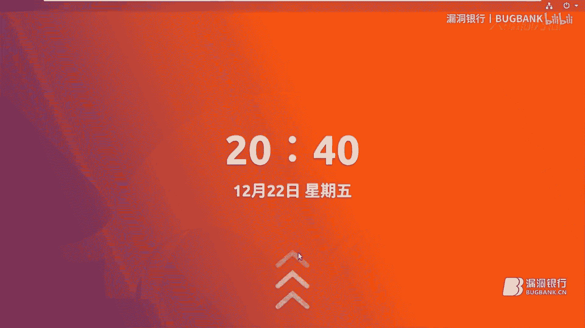

哦。

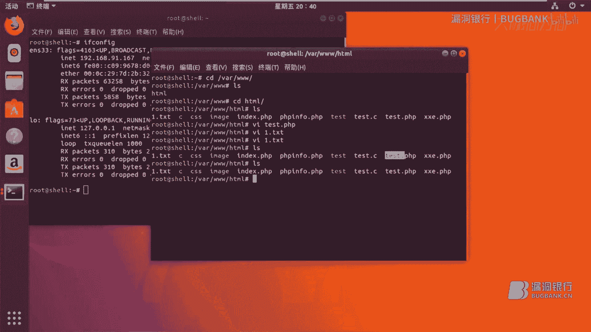

IMAE文件文件夹和1个CSS文件夹。那么如果我们去请求一个文件夹，CSS这个文件夹。呃，我们还是抓包来看一下。那么这时候退报额状态码为200，但是这时候他会报错呃，这个报错原因我们就不用说了。

因为我们去请求的文件件没请求什么东西，什么请求的问题呃，如果说。我这里呃我下面啊。CSS这个文件。那么可能啊呃。CCSS去请求。哦，等一下，这有点问题啊。20元CSS。127。0。0。1C。啊。

这个应该不能去HTV请求。虽然说我们这样去请求也是可以的，但是的话感觉也不是很好。因为呃我们都知道，如果报403的话，说明这个文件夹是存在的。如果报404的话，那肯定是不存在的。呃，这种方式嗯。

那么像这种贴是嗯看测的状态码来返回的一个结果，去看这个文件夹是否存在。嗯，那么如果我们用一个。faair协议应该会好一点。20。1。可能我们用菲协议的话，应该会比较好一点嗯。大概的话。呃。

也是通过账单码来去看他吧。嗯。那么就是403说明呃，文件夹存在404，那说明那是真的不存在了。那么去请求呃，同样的也二一样道理。如果去请求它下面的一个呃图片，那么跟我们请求做的是一样的。BG点GPG。

点GPG。呃，他就是报了呃很多错误，因为他就是可能没办法去读取这个图片。那么这个是候读图片，那么也是也算是我们嗯。我们可能就是CS就是SSIF里面的一个一个呃一个简单一个呃。攻击吧，那么。

我们HHTB不行的话，那么我们只能还是使用我们的1个PB协议。呃，因为。你使用fi尔协议是不行的。fi尔协议他连PPP文件读取不出来。那么更不用说去读一图片了。那么他这个叉面你读立出来的时候。

他这个图片图片的一种那种呃编码，那叉面更不认识他了，对不对？那么我们还要通过b64去读这个东西。那么我们呃根据我们这个前面的。我们的这个PP这种协议去读取这个东西。呃，这个协议还是还是挺不错的呃。

我们刚才读的是一个index点PP。那么我们去读下面这一个。呃。图片叫BG点GPG首先要跟上我们的一个的一个路径。因为因为你要去阳他的路径找他这个图片。哦，我们先来看一下。看下结果。Open。Im。

PG。ME。这个时候我们获取到还是同样的B464，那么还是需要解码。但是呃如果普通的解码，我们这种的话可以去网上找一些，或者自己写一个也可以。就是说通过解码，然后来就是说。

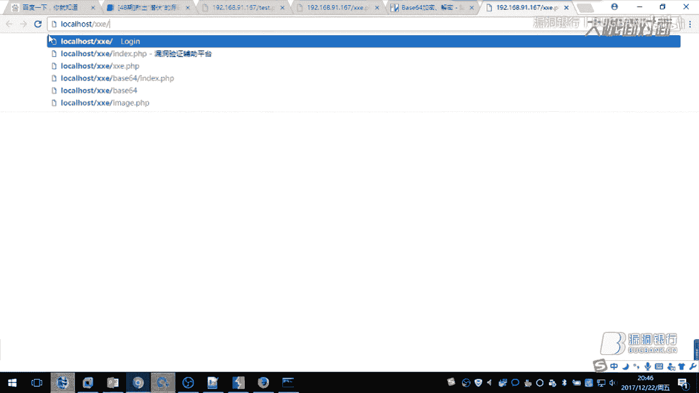

Oh。获取到图片的一个信息。那么解码之后，那么我们会获到一个这样的一个呃。图片就是说他下面那个图片。哦，因为我知上面也没什么图片。

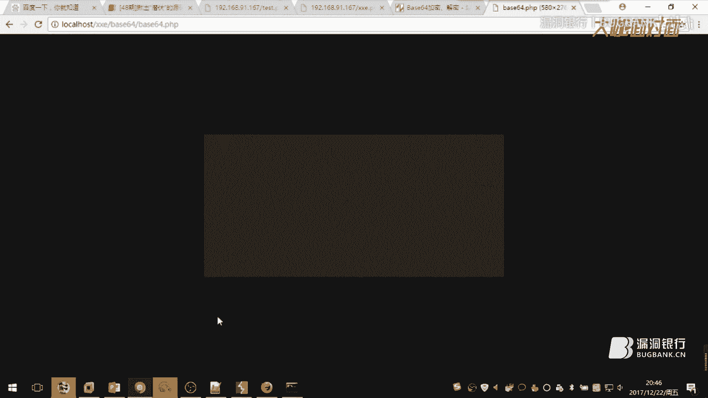

哦。想想啊，这里的话我有一个。那么比如说你要去找一些特征的一些东西，特征一些像呃指纹一些的一些图片，然后你要去获取它。那么可以判断出他的一些中间件呀或者一些其他的版本。嗯。我这里看有没有像。😔，呃。

比如说就这个吧，我这个图片。哦，这话我在嗯就在这上面演示吧。

嗯。

这样。那么这个图片的话是在一般PP买额的面积，然后下面有一个。这同样要跟上他的一个路径。我看一下。首先是。特别请求他下面的。😔，因为他首先是会请求哦，我再打开一个文件夹啊。路径复制一下。Yeah。

这个PP码的面下有一有一个叫做loing。Logo。这个图片。嗯，我先把这个。存下来。然后首先。那么我们读取的时候，特别默认的是读取呃主文件下面一个文件。那么首先我们要跳转到那个跳转到那个目录的话。

那么我们肯定要先跳到上一级。跳到摄像级，然后再进入。PP买啊等面呃，大概是这样子。哦，改一下也可以。跳到跳到上一个。目录上PP码等内。然后呢，我把这里改一下。改成一个这样的。然后呢，我把这个配load。

我们再测一下这个配load。哦，这个时候我们获取到了一个嗯。一个就是那个一个图标的一个贝斯64。那么同样的我在。解码一次。

这样的话我们就会读取到特会使用的这个PP码。对面，但是呢这个还是可能会有有也也是有点小激烈吧，也不能说太激烈了。

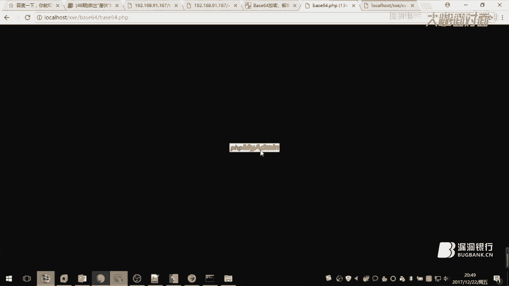

就还是要去呃，找他的一个路径，看的存不存在吗？然后呢，也算是一种。嗯。很粗糙的一种指纹识别吧。靠自己人。那么像这种就是说去执行这个文件呃，读取测测文件。包括呢我们像一些很简单的一些内网探测探测的端口。

然后利用HTPP，然后再去呃可以做一些简单的一些SSRF。嗯，像我们就是使用到些loc克号或者127。0。0。1。那么其实这些的话呃，都会有一点小积累。那么后面还有一个这个后面还有一个就是维后要说的话。

可能就有点那个什么了。计划是一个命令执行的一个呃漏洞。这个明令执行嗯。我们刚才前面有讲了一个协议，我们看一下这个协议。这个这个协议是个最后1个EXPECT协议。这个协议它主要用来干什么呢？我拉大一下。

这个协议他主要是来处理交互室的流，说白了就是就是交互室的一个东西。那么他主要是怎么去交互式呢？首先这话呃，不得不说一点，就是说这个协议呃。他有一个很奇葩的一个东西。

就是说这个PP他没有就是说他不自带的这个协议，就说他没有安装这个扩展，他自带的也没有。嗯，那么这个话是只能去手动编译安装。嗯。但是呢。这个还要。奇葩一点就是说。嗯，应该安装这个东西的可能是比较少。

那么在就是测试这个漏洞的时候，呃，能测到有有带就是带有这个HRBCT协议，就是扩展了这个PP环境。那是嗯。很幸运了。呃，策划需要首先个你需要安装1个TCL。

那么还有1个ERPECT这个时候你才能就是去安装这个PP扩展的HRPT这可能有点复杂，因为它编译安装起来也是很困难的。呃，比较复杂一点。那么就是首先linux上需要安装一个这样E叉BCC的一个扩展。

策划也是一种交互式的一个东西。那我可以利用他来就是呃输一些命执行一些命令啊什么的。当然这只是一个linux上的HRPCT。

那么我们还要安装我们的PP上面的HRPCT这个时候我们要去我们的一个呃PP里面去看。嗯与 for。呃，我我们找一下这个。ERPECT。那么就是这个扩展了呃，这个扩展需要自己手动去编译安装。

只能呃去PP官网可以下到。不过一般也呃。也很少人去用这个东西吧。嗯。那么它主要就是用来一个交互式的。那么当我们PPP有了它，那么我们可以进行一个就是说利用叉ML进行一个交互式。

那么如果是呃像java这一类的，可能就是有一种。呃，内置的一种一种包吧。然后就是不需要像这种便异安装啊，这种很麻烦。不过这种情况也是有利有弊嘛。就说当PP呃有了这个E叉BCD扩展。

那么我们就可以执行呃命令。如果没有，那么我们就执行不了命令，那么我们可能只能做一些呃，我们前面刚才说的一些呃任意文件读取。那么还有像内网探测的一些东西。嗯。那么其实这个。如果安装了这个呃扩展协议。

那么我们过道配料的也其实很简单。那么我们就利用这个协议ERP呃ECT。通过这个协议，我们去执行一些命令。呃，比如说1个ID。那么这个时候他也就是相当我们呃。执行了命令。但是呢我们会发现。哦。

他的1个UID呃是nobody。那么nobody它属于呃我们的3Wd这个用户组。那么这个3W是我们默认安装的PP的一个用户组。那么说面这个权限就很小的呃，可能你基本上干不了什么。呃，但是呢他有一个特点。

就是说。可以执行执行一些呃。我们就说了一些呃，比如说像E叉，就是我们可能用的一些这个提全的E叉RP啊之类的。那么比如像CC的就是C编译好了一些程序，那么我们看一下。

哦，我这里有一个编译好的C文件，那么呃还有个test。那么我们看一下啊。

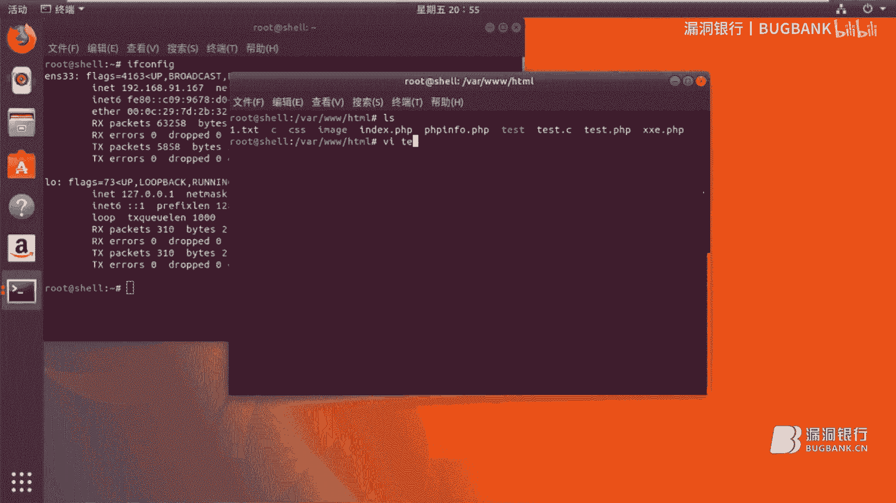

呃，就很简单的一个输出。呃，输出一个。bu个 bank卡，然后呢。我们看下去就是很简单去执行它。Test。那么就是。开始的。那么这个时候就会执行我们的呃编译好的C文件。呃，那么如果是E叉RP的话。

我们也可以这样去执行。然后嗯当然了，这个话可能就是说你需要上传好你的这个ERP。那么也有可能就是说。呃，再比较高深点，就是说我们可以用一些嗯去研究一下他的协议，然后再去。

比如说像其他的方式去攻击更另类的一种方式去呃探索我们的这个叉叉E。嗯，那么这个他就是说这个呃命令执行这一点可能有一个bug，就是bug就是说。我们的这个命令。不能带空格，这是一个更畸形的一个问题啊。

比较激烈啊。他不能带空格，如果你带了空格，他就会。嗯。进行一个报错。呃，这也是比较接业地方。所以说其实命令执行不执行呃。也是呃也不能说不重要啊，他但是他可以执行一些我们的就是呃已经生传好的HRP。

也就是说可以执行嗯一些其他东西。那么就是说买了就是说这几个危害结合到一起的时候呃，就说明我们可以做到做到一些就是呃更大的一些伤害，就是说漏洞啊危害啊。呃，当然如果只是单独的一个去做的话。

可能就是说危害嗯是很小的。那么还有一点就是说呃我们这个呃叉L这个。外部数据注入，我们因为我们一直演示这种pos的。那么当我们发动pos的时候。

我们的这个下面他会已经帮我们们就是帮我们直接就是URL呃编码好。那么如果你是呃get这种方式去传输的话，那么一定要注意，就是说一定要先UL编码过之后再去。不然的话，这个时候当他去执行的话，它会把我们的。

呃，这样来说吧嗯。那比如说他这个地方存在一个叉L，那么。我要把我的这个。放上去的时候呃，比如他是一个。get方式的。那么我们我们为什么呢？因为我们知道一个呃，有一个就是符号。

就是我们我们所说的这个实体符。在我们URL中，它是一个参数的分隔符。那么如果像呃一些。呃，URL等于111。那么那么最后有一个分割符嘛，对吧？一个参数的分隔符。那么这个参数的分割符。

那么如果我们直接把它给放上去，那么这会这也会导致呃它当他碰到这个符号的时候，会把前面当成一个参数。那么后面的又会当成一个参数呃，这样话我们的这个呃配套的也是执行不了的。

所以说ge方式的时候只能选URL编码编码过之后然后再放上去。这个时候才会执行。那么其实跟我们是一样的。我们po方式也是就是URL编码过之后呢，呃，只不过是呃它自动帮我们进进行了这个URL编码。呃。

那么对于呃不同的一个环境，那么它到一种防御的姿势也是不一样的。呃，像我们做的这个PPP环境，它主要是因为有一个叫做LIB叉M。这个东西测这个插这个插件呃，或者说呃就插件嘛，就是这个东西。呃。

版本较低的问题，当他的版本版本越高。版本也告退回就是说呃默认的情况下，他会禁用呃，就是禁止吧，不是禁用，禁止禁止解析。事情。默认去禁止解析事情，当他越高，他会禁止解析事情。呃，所以说他会有一个局限性。

那么。对于。呃，加玩的话这个话呃也不好说。我呃，我也没去搞过他。嗯，那么这话就是说呃就是可以升级呃，这个。版本这个LIB插标的版本，那么也可以就是说嗯通过代码的一些方式。然后去防御他。那么我觉得是呃。

圣地亚版本是最好的。嗯，那么大概的话今天呃分享的东西呃，也就到这里结束了。好，感谢你的精彩演讲。那听完讲座，你应该已经知道叉叉E到底是何方神事了吧。那听讲过程当中，如果还有什么问题，现在可以提出。

大咖会给予相应的解答。😊。

那下面就让我们进入小问节吧。小六，你可以看一下观众页面。直播间。嗯。对，然后可以看一下那个只看提问。好，我们期待大家的提问，现在还没有小伙伴。有问题，然后这边表哥也在。选。还有什问题？稍等一下。

你可以勾一下那个只看提问。记。呃，这边有小伙伴问，能用CURL协议下载文件吗？嗯。Fll gets。写一下。😔，啊，这个。啊，这个车。刚才刚才其实在说的时候，就已经说了呃，他俩有没有贿险的话。

我们可能要通过其他的方式去判断。那么呃我们可以使用一些判断它的。呃，一些那个呃就是服务的就是服务的那个响应。那么看到显像头。然后可以就是说嗯。通过他的响应的1个ATTP1个。HTB个响应吧。

就是服务器的HTP响应。那么再判断它是否就是说呃是。存在的或者说呃不存在的一些东西。那么。那是因为我们这个话，它是1个PPP支持的协议。那么CURL的话，他这个呃怎么说呢？他可能他不属于这个呃。

也不能说这个不符于这个范围吧。这话嗯也不好说。因为这话是官网上呃，也是写的一些他的知识的协议，可能只是说针对的呃，没那么多吧。有完，你可以看一下那个勾选一下那个只看提问。

因为我们会有表格把那个问题选到这个里面，会方便你的查看。嗯。哦，这些话呃，因为今天主要讲的是1个PP的一个脚本。那么对于java的话也是也有的。然后潘森其实也有，只不过呃就是说。嗯，看这个方向吧。嗯。

在实际中的话，去挖掘一个叉R异还是。嗯。可以就是说你测试一下呃，就是说一个查面标签能否去解析。如果他能去解析的话，那么我们就是可以去测一下我们构造一些配料的，去测试一下能否就是说呃。

其就是解析一下外部尸体，能否解析外部尸体。如果能够解析尸体，那么就是说呃是存在的。因为今天感觉大家的提问比较踊跃嘛。然后。呃，所以那个遛娃你可以选择一些。嗯，一来来回答，就是那些讲过的问题就可以忽略了。

就是大家可以去看我们的录屏。嗯嗯。Yes。太なな。嗯，windows和lininux其实呃叫这个话对什么样的环境才能构造出调上有环境。其实这个路漏漏洞的。嗯，男职业。嗯，如果用就是插码也能访问一个呃。

文件包含的一个一句话。然后呢，但是呃他他是呃，不会导致这个get share的呃，因为这个的话是跟我们的这个PP协议有关的。呃，当我们就只读的话，那么我们只会把它给读取出来。

那么如果当我们读到1个PP它的一个呃头，那那么建括号，它会就会把它当做一个叉ML去解析。那么但是呢我们的PP并不是叉ML呃，所以它就是说会进行一个报错，可能那么。呃。就是说我们只能想要读一套文件的话。

带有PAAP的文件。那么我们只能就是通过我们的PAAP那个协议呃，输出流输出流，然后去读取呃，含有PAAP的一个文件。呃，否则可能会进行一个报错。今天大家的提问非常的踊跃，第一次看到嗯这么多小伙伴提问。

嗯，但是呃因为时间有限嘛，所以。嗯。大概只能选择一部分的问题来回答。好，另娃，我刚刚看你是已经选好了，幸运观众是吗？嗯。对你是对点你是选好了是吧，不是手夸是吧，确认一下。嗯，对吧对嗯。好。

然后你看还有没有什么问题要解答。再给大家。呃，两三分钟的时间吧，好吗？Yeah。呃，想深入了解这个XMM的话嗯。就是说还要通过还是要学习一下那个ch面基础比较好一点。

然后其次呢就是说针对不同的环就是脚本。那么就是学习达到的这个协议。然后只有就是说基础前面的一些。会就是说基础啊，然后呢，还有这个呃一些脚本的协议。那么结合起来。就是可以去好好研究一下。哦，不是的，他他。

他们底系会收到。😔，呃，有有个小伙伴说他问了问题，然后没有回答他，刚刚已经解解释了一下，就是因为今天提问的人是很多嘛，然后我们觉得大咖之前的前面的内容也讲的比较详细了。然后如果有问题的话。

可以看我们之后出来的录屏，然后大咖在有限的时间里选一些问题来回。😊，这样嗯。有。Yes。嗯，叉RE的运营环境。🎼这个呃它不是仅基于1个HTB的它的话呃我这只是一个模拟的环念。

它主要呃是看不同的一个你的脚本。那么像java啊潘潘损呃PP呃，都是可以使用的。只不过呃HTB的话只是1个阿帕奇。他只是一个。充年件而已。有小伙伴问那个。分享课件的时候能顺便把源码打包一下吗？

就是给他他们自己测试一下啊，可以的。啊，行哦。那我觉得今晚的提问时间也差不多了。那感谢乐娃的耐心解答，下面就进我们的。😊，福利环节，然后大咖刚刚眼疾手快的选中了幸运观众。

呃，这位0X00。那恭喜你获得这本代码审计企业及we部代码安全架构，需要你在相应的区域留下正确的收货信息，我们会尽尽快将书籍寄出。那到这里，本期关于找出隐藏杀手叉叉E的大咖面对面，就要和大家说再见啦。

希望大家有所启发，学有所得。那下周四晚7点，洛动银行2017线上庆典晚会，给你想到的快乐时光，线上才艺爆效呈现，线下party实况转播，双旦同庆就在28号晚上7点，记得来嗨。

那再次感谢大咖遛娃的认真准备，也感谢小伙伴们的踊跃参与。那今天的大咖面对面到这里就结束啦，大家可以退一下直播间啦。😊。

Yeah。

