# 漏洞银行丨攻破Windows远程桌面协议-诸葛司机丨咖面82期 - P1：【录屏】攻破Windows远程桌面协议-大咖诸葛司机-漏洞银行大咖面对面第82期 - 漏洞银行BUGBANK - BV1tt411X7bE

为知识而存，因技术而生。小伴友晚上好，欢迎参加第82期漏洞银行安全技术直播大咖面对面，我主持人秋秋。那今晚我们请到的是来自侠影安全团队的诸葛司机做客直播间。

我也是第一次遇到一直要强调自己技术非常菜的大咖。但据我所知呢，侠影安全团队他们技术是非常厉害的，而且经常会拿一些圈内的比赛奖项。所以呢我们不可以小看大咖哦。😊。

今天他我们分享的主题为攻破windows远程桌面协议，会讲到如何抓包分析协议，协议中的漏洞，还有实战工具演示等。感兴趣的话，听到最后哦。那同样的，大咖演讲结束之后，还会有问答环节。

届时大家可以在直播间里面自由发言提问。问答结束后，大咖选择一名幸运观众赠与书籍IDApro权威指南第二版。这本书被大咖点名的频率也非常高哦，希望你有机会可以获得它。好。

那下面我们就请大咖诸葛斯基开始今验的分享吧。OK那我们开始讲吧。呃，自我介绍一下啊，我是诸葛司机啊，想安全的，反正我认。认识有60多个大佬吧，就我一个垃圾。

虽然大大佬一天到晚看着这个顾计杰这会在看着我直播，然后刷着屏说太强了太强了啊，不过我们都知道，其实我是最菜的。啊，那么今天我们主要是讲讲一下如何从协议的层面上来攻破。公棚windows的呃远程桌面。

Okay。那么看一下今天的目录，首先我们将抓包呃看一下。这个windowsRDP是如何实现的。呃，从协议的层面上分析一下包的构造，以及它的几种加密方式。然后我们看一下这个协议中潜在的漏洞。呃。

也就是今天的重点。然后呢呃就是开发攻击工具，然后就是对这个漏洞的一种实战，最后再进行我们的实战，看一下这个效果。但是今天有几个修改需要做，就是首先这个开发工具工具呃。然后。那么这个开发工具只好改成呃。

我们看一下。大概就是呃这个技术第一个第一个工具4S，我们看一下它是如何实行攻击方式的。造蚊子，今天我就带大家造蚊子了，大家有兴趣的话，私下自己再去造蚊子。我们今天就看一下大神是怎么写代码的就好了。

实战哎这个地方是最好玩的了。昨天在是呃测试在给大家测试的时候踩了一个坑。呃，就是因为我的count里自动升级了呃，里面的open Sel库的open Sel库也升级了。然后代码有些地方都不可以用了。

所以说我稍微研究了一下，发现win7对win7的攻击中是不行的。但是win7连接到win10这个攻击其实是可行的。这是因为在open Sel去年2016年呃，不是这是两年前的话。

两年前的2016年的更新呃，去掉了2RC4的加密方式。所以说在4S的一个加密库中呃。这使用呃使用RC4不再可行，因为它们删除掉了，但是win10呃win10可以接受除了2RC2RC4以外的降密方式。

win7则不行。所以win7连接到win10的连接其实是还是可以进行实战的。这个想要想要修复一下这个功能其实比较简单，但是这个就留给工具作者本身去做吧。咱们是菜机，咱们就用着玩玩好了。好，那么第一步呃。

如果要抓包分析，那么肯定是上one shark。呃，昨天我已经抓好了包了，那么我们去。打开咱们的玩设，然后我们看一下。

看一下包。这个地方顺便啊安利一下penice box。是一个集成了多种渗透工具，然后在win呃windows呃下面运行的。

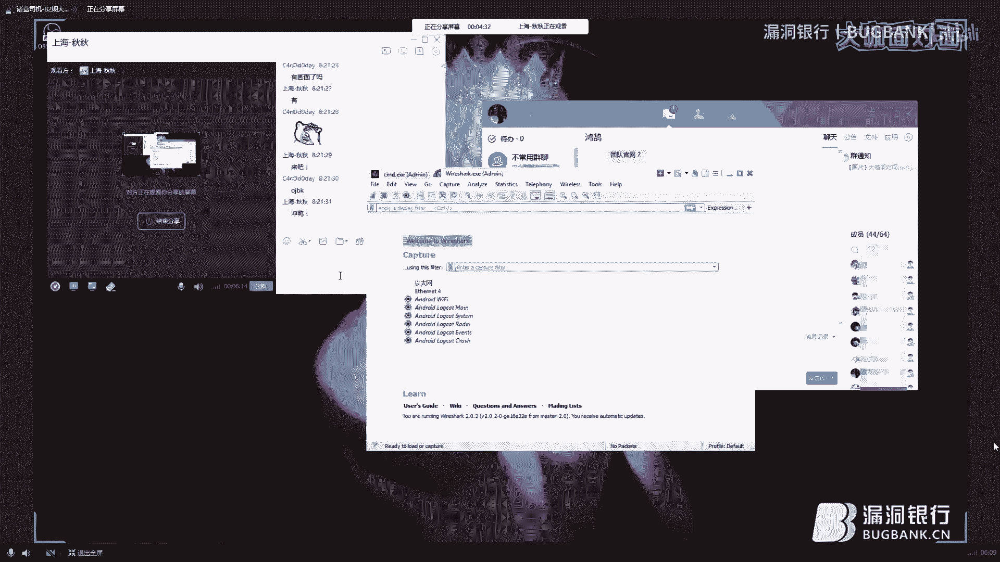

好，这个是我们的三蒲包，昨天又已经准备好了，给大家简单的看一看。那么我们可以看到在协议这个地方有TCPTPKT然后RDP我们要RDP当然就是remon desktoppro这个全程中面协议。

那么这个地方是客户端发给服务端的啊，就是。呃，告诉服务端呃，自己的一些信息，然后准备进行RDP握手，然后TCP流传输各种各种的信息。然后我们可以把这个地方拉到这里像我们可以看到这些信星。好。

在co data里面啊就是一些。呃，向服呃向客户端，向服务端呃呃声明自己是怎么样一个设备。比如说。比如说自己用的是什么键盘。序列号，当然这个我这个我是没有研究过。以及呃使用的是什么样的。显示。

不过最重要的其实不是在这个地方。在我们看来，我们作为攻击者要看的其实是这个包，这个cleient security data这个下面包含了我们的客户呃客户端连接上呃即将使用的加密方式。

这个地方写的是0B呃16进制12呃，我们就会以然后以及这个地方acttra呃X encryption method。这个地方是就是一个额外的额外的加密方式，0000应该是没有0B代表的是12。

这个12我们是什么？我们之后才会讲。再往下看就没有什么好看的。然后发送呃这个客户端发送连接之后呃，回复的当然就是服务端。然后服务端又回复了我们将使用一个什么样的什么样的连接，什么样的加密。

看下 record data。好，我们可以看到了。在这个地方呃，我们的已经解析出了客户端呃，是请求了什么样的一个加密方式。

那么standardRDP security就是标准的RDP也就是呃说白了就是没有任何没有任何保护。其他地方呃几乎就是没有什么太特别了。好，你可以看到这个地方，这个是服务器呃服务器的证书，证书长度呃。

服务器随机数长度，这个是我们的加密。而你看我们可以看到128位到214。高级加密呃，也不能说是高级加密，就是多层加密嘛。呃，然后这里是服务器的证输，服务器的随机数。那么接下来我们这个这些是什么作用？

我觉得大家如果知道SL是如何呃如何工作的，那么你们都应该知道这些是用来干什么的。那么SL的原理呃，是我觉得大家都应该知道。那我只简单再提一下，就是呃这个服务器和双方都使用也使用服务器的证书来进行加密。

然后在客户端将加密后的Cction key发给呃发给服务端，服务端再用自己的私钥解密，这样就可以保证双方双方加密的。一个安全性。但是一旦这个私钥被截取，或者是呃那么中间人攻击将会使现成为可能。

这个我们之后会再提一下。好，那么简单的协议我们先看完了，然后我们下往下走。这个地方我们也是刚刚做的分析一下。那么现在我讲一下呃，在这个RDB嗯嗯三种，一共有三种协议。首先呃就是标准。

我们刚刚已经看过了这个standardstandRTP，也就是没有没有几乎是没有任何加密的。那么加强DOS就是呃使用了SL的，使用了SL加密的RTP。

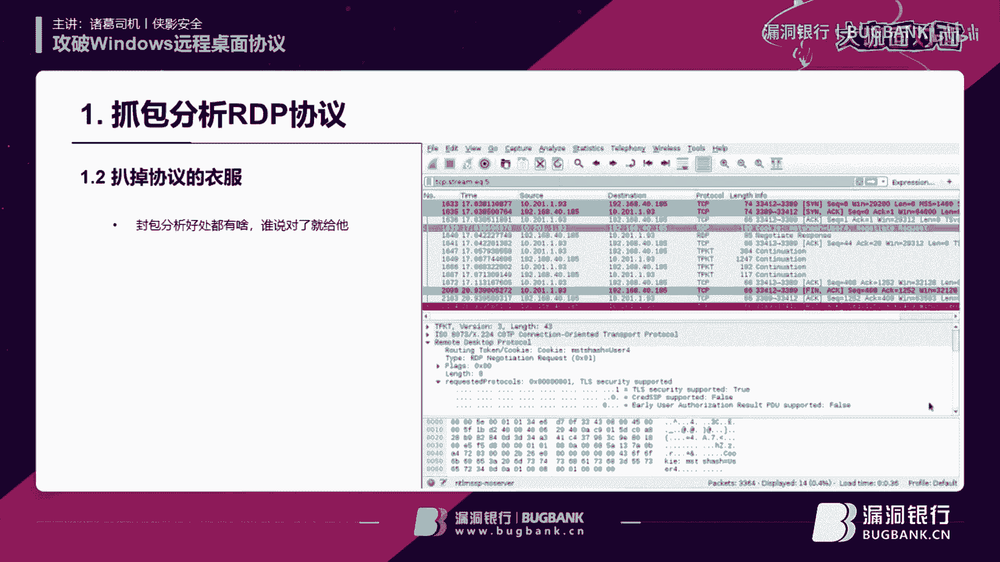

然后就是creedSB大家都比较熟悉。这个cB还是比较比较难的，这个有点过不去的话，大概就想个办法招供。那么SSL就是保证了双方的保密。然后包的基本构造我也讲了刚就是声明自己使用的是一个什么样的加密。

然后对自己将使用一个就是这三种协议中是有哪一种。那么在协议这个RDP握手的时候呃。在就是形成连接的最后一步之前，就是在TAL这个协议之前，我会再讲一讲，因为他们有一个额外的一个验证方式。

那么此协议中存在的缺陷。

这个协议呃我们都可以看出这个SL是非常重要的。那么SSL所依赖的都是一个公钥以及私钥。但是在这一部分的微软代码，我不知道它这个。不知道微软当时是是怎么想的，估计写代码，写这个部分的代码是印度猴子。

那么这个部分使用的公钥与私药，其实是固定的。也就是说所有的windows系统都是用的是同一个加密key呃，同一个加密私钥的公钥。那么等于说就是这个。等于说这个加密就是等于等于等于虚设。

随随便便就能随随便便就能解剖。那么。在standard里面，这些呃standard和TOS里面，这个呃所有的数据都是明文传输的。那么固定音乐我们也讲了，那么SSL就基本上是等于无形。

因为你可以随随便便的从windows的那个一个库里面解解压出这个呃windows所使用的这个公钥给私钥。其实你现在都不用了那个微软微软一看，哎呀，自己怎么这么垃圾，呃这个犯错已经无法挽回了。

他们自己都把公钥给公布出来了，自己自己知道自己闯了个大货壳还行。那么就像我们刚刚说的呃，这样这个密钥我们其实是可以获取的。那么不管那个不管服务端和客Q端之间用了多强的加密。

比如说40位啊、56啊、188位或者什么什么什么，这些其实都没有都没有任何用处的。因为我们已经有key，对吧？这样就完全没有，完全是没有用的。那么我们简单想一想这个如何攻击。

首先呃我们要拦截呃拦截这个在。呃，在内网中传输的这个RDP包，然后我们需要因为是一般来说都是使用的SSL进行加密的。那么我们需要呃简单的搭建一个呃用派送搭建一个简单的SSL代理。

但是也不能是就是直说的就是这种代理。我们还需要在SL里面进行一些呃呃小型的改包。那么。我们自己当然也是需要公钥的。那么在呃在我们收到从客户端发到服务端的第一个包的时候，我们在里面改掉呃。

把证书替换成我们自己的公钥替换成我呃公钥也是替换成我们自己的。那么这样在服务的服务端看来，我们还是客户端。在客户端看来，我们还是服务端。这样我们就能在神不知鬼不觉的情况下，呃，我们就可以看到呃。

我们就可以看到这个从服务端到达到达和客户端的这样一个流量。呃，而且是几乎是不可能被发现的。那么我们。接下来我们就看一下。呃，国外的大省是怎么看这个地方的？这样就是我刚刚跟大家讲过的。

这个国外有一个大神已经开发了呃。对于这个攻击方式的一个工具叫ss，这个是在get up上可以随便下载的。

好，这个是大神所处的。一个详细的详呃攻击方式详解。好的，那我们看到这个地方是大神给出了一个demo，这个是大神所写的这个SL代理呃部分的代码。那么我们看这个地方，就像我刚刚说的一样，这个。在标准的时候。

标准的1个RDPRRDP协议的时候是这样的。那么首先那个客户端告诉服务端自己使用的是标准的RDP呃，然后在在服务端同意，然后发送了自己的RSA公钥，然后以及他的服务端随机数。

然后这个然后这个公钥当然就是我们所所说的证书。然后这个证书也是呃签过名的。那么。那么这个客户端呃就是是用的同样的同样的验证方法验证一下这个证书的有效性。如果可以的话，如果就是验证通过。

那么就会使用服务端的这个公钥加密一下自己客户端的随机数，然后发回给这个服务端。然后服务端呢呃解压用它的私钥解压一下这个客户端的。呃，解密一下这个客户端的随机数。这个我们刚刚讲过。

这就是SL所谓的三不握手。这个SSL呃以此来实现双方的呃加密性。这样然后他们双方都有C选器呃，因为服务端是用的私钥解呃解呃解密的，那么就可以保证双方都是比较安全。但是呢。

但是呢这个地方可以看到大神指出在这个地方指出了这个漏洞。意是说这个这个密室其实是已经存在于windows里面的。然后这个地方也写出呃，windows其实现在已经这个微软已经公布了。

微软已经公布了这个这个也这个密月到网上。所以说不管你使用什么样的，不管你使用什么样的加密方式，那么都是可以都是可以解密的。这个加密室形同虚设。好，那我们继续看一下。这个地方是当然就是我们的解密。

然后这个地方在我们看的时候，这个因为是建立连接之后，服务器服务器呃客户端向服务器发送的这些包，我们都是可以监视的。然后其中我们就可以进行注入什么监视键盘输入啊，或者是直接直接获取。

虽然最重要的是直接获取这个呃我们的。身份。也就是账号。那么接下来我们看一下。

那个虚拟机，让我们来模拟一下正常的。正常的连接。没开完那我还行。尴噶。嗯。啊，在开机的时间，咱们就说会儿闲话吧。啊，这个我一般考ly是运行在我的时机上的。但是这一次为了演示。

我还是把镜像点开了个阿里li在虚拟机上，然后进行这么一个演示。当然就像我昨天说呃说过的这个。windows呃windows7连接到windows7的时候，他们只能使用RC4。

然但是我这个卡里版本弹新了啊，我给你们看一下。open S搜库里面的。加密器这些是这个指定是列出了所有当前呃LPSL支持的库。那么。那么我们搜索一下有没有我们所需要的RRC4。

你看呃gra是没有任何输出的，那么就代表说的是这个加密器里面没有没有我们所需要的。然而我这个pen test box的话呃。这个是2015年的版本，这个康利最新版的话是一个比较新的版本。对。

看来一有20也是2018的版本。那么。那么在这个2016年的一次openO更新，他们就去掉了RRC4加密加密组件。哦，这边可以看一下。你们可以看到是有输出的。

那么就代表RC4是还是存在于这个一个加密组件的。但是这个就不行了。然而呃这个ss想要运行的话，在ss里面有一段大码，是就是验证了服务端是是使用的什么？哎呀，这个这个虚拟机好像是没有保保存昨天的快照。

哎呦，好像还要。还有好像还要重新去网上下载一次啊。这个就尴尬了。没有保存快照呃，昨天晚上弄到三点过呃，脑脑子很昏。说着说着，突然咱家的猫啊在窗口暗中观察。嗯。O鸡巴K。哦。

那么这个winI7的虚拟机也开了。嗯。😊，什么鬼打不开文件浏览器吗？康里。😊，哎，不管了。那么这个Uus的主文件。那么我们看一下这个。在m这个地方，这个就是我昨天所说这个。错误所在。这个地方。

在SCO进行加密的时候，那么会在这个地方ser会使用RCHSHA。那么就像我刚刚所说，这个SO库已经是最新版了，那么这个地方就会出错。这个地方会导致他们使用就不使用ser。那么这个会导致的后果是什么？

就是win7呃与win7之间的连接无法被连呃无法被呃中间人攻击。因为这个win7和win7之间只支持RC4加密。呃，这个就很尴尬了。但是最新版的就是win7连到win10，呃，反而是可以不使用任何加密。

那么就使得这一次的实战进行变得可行。

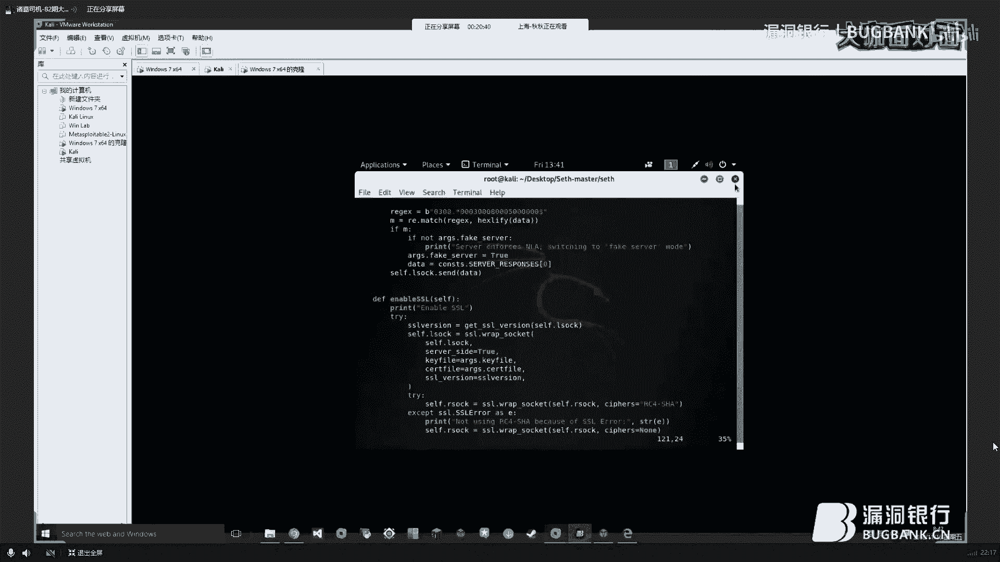

那话不多说，我们看一下这这两个呃连接。这两台虚拟机之间正常的连接会是怎么样一个怎么样一个样子。这个是129。Our box。好，那么输入我们DM的运法。也想到啊这个地方出现了这种错误。

就是说证书无法被验证这个这个错误是非常常见的。因为这个证书是必须要CA认证的，那么一般的企业企业之间的这些证书都是啊无法被验证的，因为我们都没有CA去颁发这么样一个证书，那么都会出现这个错误。

那么一般的网络管理员就会直接忽略这个错误，因为他们也知道自己的证书是不会是不来不来自于任何证书验证机构的。好，那么这样我们就连接上了。

好。那么这个地方我们已经说过了，在标准的2DP的话，那么协议自己就不攻自破了，这个完全丝毫的没有任何丝毫的没有任何这个加密所在，也没有任何安全所言。就是说我经常在说的这个地方，这这么低级一个错误。

就是说什么RSSRCRSZ呃公钥私钥居然是放在这个程序程序本身里面的这个这个玩意儿我觉得应该是什么编程新手才会犯的，才会犯的错误。这个微软微软会犯这种错误，实在是太让我惊讶。好。

那么我们看一下这个地方RDP。这个加强版呢就是使用了SL了。那么我们需要看到什么？呃，我们都知道这个在建立包的时候，这个服务器会用呃在呃不对。

客户端是会用服务端端发给他们的证书来加密一下自己的呃客户端随机数的。那么这个证书我们肯定是不能。使用原本的这个正常的服务端指书，我们需要自己做一个。不过。庆幸的是自自制一个。

其实在派送下驶先是非常简单的。那么接下来我们还需要弄一个脚本，就是改一下改一下这些RDP的包，呃，改几个数据呃。应该就可以了。那么最后一题嘛creedSP啊，这个是最难的一个攻击方式呃。

最难的一个加密加密协议。那么我们如何攻破呢？呃，这个就这个大家已经看到了，我们是不不会去攻破的啊就直接打扰咱们绕着吧。这样是因为在进行验证的时候。

我其实服务端呃服务端是无法确认这个domin controllertroller的。那么我们唯一所需要做的，就是说就是伪装成domincontrol，然后告诉这个服务端算了吧。

这个creSP好像是不能用的样子。那咱们就回归到这个回归到这个加强版的RDP呃是我觉得 something we already。就是说我这个地方我们已经攻破了。

那么如果cededSSP作为我们伪装成一个doincontroller，然后我们告诉我服务端和客户端，这个credSP暂时不可用，那么服务端就会呃客户端就会自动降低级别。

变成R呃加强版的RDP也就是SSL呃，基本形同虚设。呃，这个时候呃，这个cP其实就已经被人绕过了。但是如果我们使用这个攻击方式的话，那么。这个呃我们的服务器的数据会会被加密。

就是说在比如账号信息什么的呃，不同意前两个这两个在for传输据是用户信息的时候，他们是使用的明文传输。呃，但是这个地方呃是进行了加密的。

那么这个地方如果在前两个地方我们拦截下来可以拦截到呃明文的呃用户名称密码，这个地方我们只能拦截下hash，那么hash如何如何破解，大家应该都是知道的。

比如说我用的penice box下面就有japper这种hash破解工作呃工具或者hash也是可以的。那么这个就还是看你的运气，然后以及你的字典大小了。不过呢接下来我们还要呃说的一个就是大家都知道呃。

这个远程远程桌面所进行的动作都是通过这个TCP流传输的。那么如果我们建立了一个呃，如果我们建立中间人，那么我们其实是可以获得到用户的所有输入的。那么这个这个使用这个技术。

那么我们就可以获取截取到呃用户的键盘输入。那么呃如此一想，那么因为在creedSP呃降级到这个加强版的RDP之后，它会自动呃把我它会自动把用户带到这个windows的呃windows的这个登录登录页面。

那么登录的时候，用户就会输入它的用户名和密码。然而我们在中间却可以拦截到用户是按下了哪个键呃呃这样的。那么我们其实都可以直接不用去就是获取直接被拦截到的呃，insteadwe can呢。呃。

也获取到他们的键盘输入，然后就是说一个一个手动的猜出对方对面的一，其实也不是猜出，就是猜出就是复制粘贴而已。那么简单的我们就讲到现在呃讲到这里。那么我们看一下这个ss的源码，呃。

这个大神是如何实现我刚刚所呃阐述的这些攻击方式的。

大家还有问题吗？呵。MSF更新哎还是可以。penice box对对对对对，强烈爱例Pice box强烈强烈强烈强烈强烈强烈爱例penice box。嗯哼，对，就是HTT呃一样的HTBS。

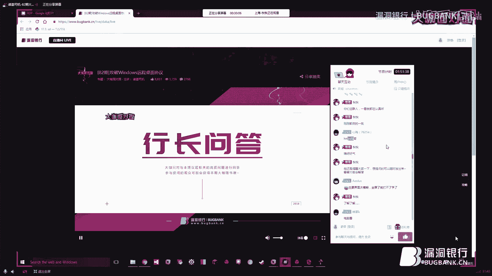

O。那么。

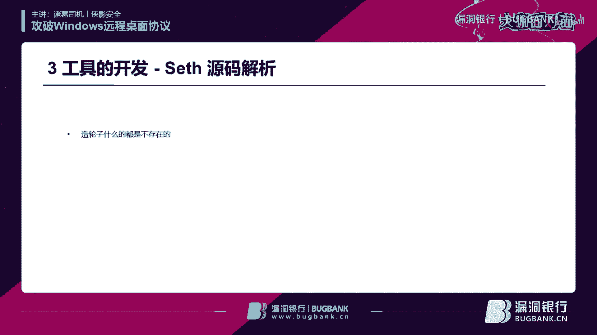

我简单的简单的回答几个问题吧，就是我刚刚看的看到的呃，首先就是有人问。什么penice box，那么penice box强烈案例是一个集成的工具。然后就是今天是会讲的，就是s工具，我们是肯定是会讲的。

那么为什么画面这么模糊。哎，是因为我的带宽太小了。我因为我住我在美国嘛，我住在荒郊以外，这个地方宽带都没有覆盖。那么我用的是那个我手机的运营手机的流量，但是因为我是无线流量套餐嘛，呃。

运营商肯定就说哎你这个给你无线流量，你肯定就不能全部分享给你的电脑呗，这样太太太不厚道了，对不对？然后服务，然后就在手机就是运营商是呃就是就是不准不准那个我们。不准我们手机是开启开启热点的。

但是这样怎么能难到机智的我们呢？所以说我就搞了个这个东西，这个是靠AP转发，转发电脑上所有流量到这个。这电脑上所有的流量到这个手机上john呃john therapper。这样就是。

jo the rippper是一个密码破解工具，是经常使用的。在卡ly和penice box里面都有带。s master是get up上的一个地址，啊，我马上给出。这个是sas所在的地方。

这个是s所在的代码。这次是开源的，但是要注意一下，这个是只能在。inex效运行。因为他是他这个中间人的原理是其实是用IP table转来转发流量的。She。し。哇，不会打字啊。嗯。

我刚刚还看到有人问我配置啊，我配置是几年前的喽呃。公击应用场景和公击能有吗？啊，这个我刚刚就讲了呀，呃没听懂吗？这个公击应用场景那么大概就是在我们在内网下。啊。我马上就要就会讲到实战的时候。

你们一看就懂了。攻击应用场景。就是比如说我们在呃学校里边，我们在网络上发现了一个就是发现了一个开启了3389的这个3389的一个呃服务器。然后客户端连接到这个服务器的，也是在内网的话。

那我们就可以应用这个攻击方式。攻击原理就是我刚刚所讲的，通过直接攻破这个协议，然后使得所有在这些呃敏感的信息，在SCOL中传输的这些信息全部变成明文。那么这个安全防护就形同虚设。怎么进行中年人攻击？

我刚刚也讲了，那么我们使用的是py送搭建一个呃克制版的这个SSL代理。嗯，我们在其中替换成了自己的证书，替换成了自己的蜜月啊，然后替换成了自己的一些请求。然后。然后在呃搭建了这个SSL攻击之后。

我们再写一段代码，就是解包一下这个解包解包代码用派送西其实是比较好写的。就是稍呃稍微比较难的，就是在这个啊加密加密解密模块这一翻。

不过我们是不需要不需要造轮子的这个ss的作者在这个ss底下都已经都已经写好了。啊，支持哪些版本吗？呃，这个不是爆破，这个不是爆破。诶。呃，RDP爆破就和3389爆破肉机是一个意思。

我们这个是RDP中间人，不这不是RDP爆破RDP中间人到目前为止，我我是在本地就是我这个windows10上面测试的，那么依然是可行的。那么所以说呃应该是支持到了支持到目前为止的所有windows版本。

当太老的，我觉得应该也是不行的。是啊，这个不仅不仅仅是劫持了，而是直接获取了对方的呃就是这个客户端连接上的所有身份信息。也就是说，只要只要客户端一进行连接。

那么我们就等于等同事直接获得了客户端这个管理员的身份，也就是说就是说只要有了这个账号信息。呃，这个servber端端，只要从来都就是没有改密码或者用户名，那么我随随时随地都可以直接控制。

然后呃我顺便演示一下这个。😊。

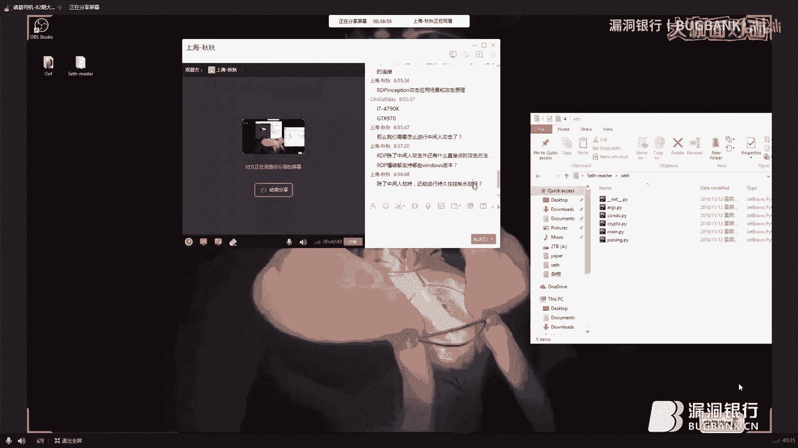

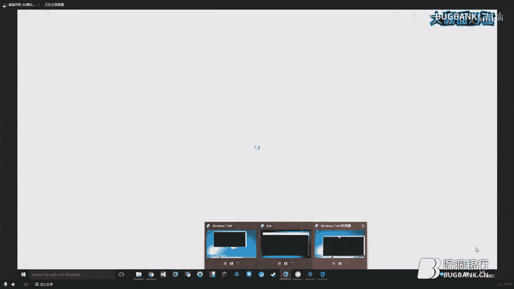

呃，这个地方。呃，回来一下啊，这个地方。呃，使用这个远程桌面连接，哎呀，点到点到wi上了，很烦。好，可以看到这个地方，在启动的时候，我们其实是可以启动这样一个程序的。

那么如果我们将这个如果我们将这个程序换成我们自己的，比如说什么我们猥琐一点shall点EXE。那么我们就可以直接碰呃直接碰到这个呃直接碰到这个我们的受害者就是服务端。那么整个服务端将会为我们所控。啊。

这个最严重的一点其实就是这个身份信息被我们获取之后，我们可以在整个内网进行横向渗透。也就是说呃。

所有就是这个用户可以登录到的机器，其实都是科别为我们所控的。因为毕竟他的用户名呃，他们他的这个用户已经是归我们所有了。对呃，这个RDP呃。这个咱们今天讲的这个攻击方式是只能在内网内网环境下使用的。

毕竟我们使用的是中间人，对吧？你也从来没看过什么外网的中间人，对不对？那么我们继续接下来的环节就是我们解释呃，解析一下这个ss是如何实现的。就是我们刚刚所说的这个攻击工具。

那么ss的入口是这个bash脚本。那么我们看一下。好。这个是usage，那么。这个地方呃是就是检测一下自己的依赖。这个我们先不看，我们往下看。好，这个地方这2个IP tables就是配置一下什么转发。

可，这个就是如何实现流量转发的。在所以说这也是为什么这个工具是必须进行在linux上的。因为毕竟你看我这个pen box是已经集合了80%的这个linux下的工具。

但是仍然没有整合到IP tables这种东西，这个是linux自带的这个防火墙。好，这个地方就是我们建立的这个。这个就是证书证书克隆。如果我们克隆失败了。

那么那么那么这个呃这个bash就会尝试自己给自己签一个名。那么一般来说都是可以直接这个克隆克隆我们的证书的。好，然后。在这一地方就是我们运行这个ss点PY，呃。

其实这个主要功能都是在python脚本下实现的。那么这个地方就是生成一下他们在这个s将使用的参数。那么我们往那边继续分析。哦，那个ma这个地方就是我们这说什么地方。

这个s命里面就是它的主主路。命路哎呀，这个在美国待太久，我中文有点退不了，大家见谅。那我们继续。闲话不多说，呃，我们可以看到这个地方就是它的了一个lo。从开始就是先调用这个地就是先调用这个地方。呃。

我们在这个地方看到，如果fake server呃，他们会创建一个就是假的呃，就是虚假的这个服务端。但是在win7连接到win10的时候，其实是我们实际上是不需要用在这个地方的。

除非我们是使用的是高级角密。哦，这个地方就是呃这个这一段代码就是写的我们在呃服务器和客户端之间协商呃，哪一该用哪一个协议的时候。

我们将就是我们很猥琐的将这个服务端的这个客户端发过去的请求给改成了最低限度了。然后在这个地方，如果呃服务端是强制使用NLO的话，我们就会使用这个假服务器假服务器。这个in give zone就是。

使用SSL加密。那么在这个地方我已经说过了RCA呃RC4呃SHA代码是出现了错误。在win7连接win7的时候，他们只支持这个RC4呃SHA。然而这个工具有一段时间没有更新了。

那么也没有跟上openSL这个这个库的速度。那么最新版的就是我刚刚所说的，在最新版的卡里里面这个其实呃实际上这个呃RC4这个加密器是已经是被删除了。

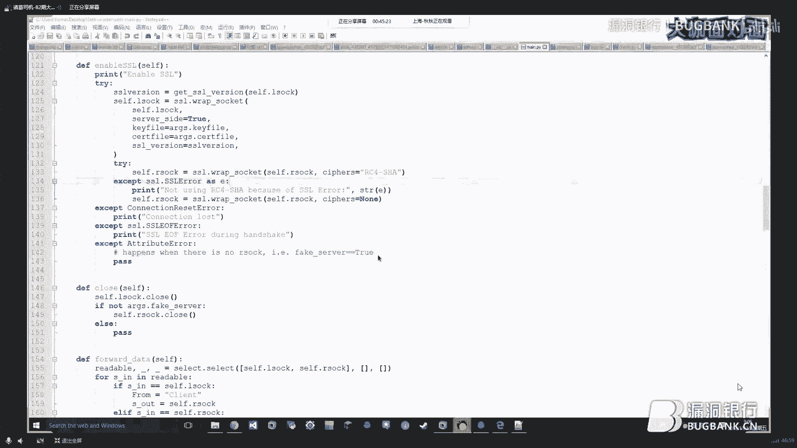

呃，具体的话，我待会可以找个网址给大家看一下。

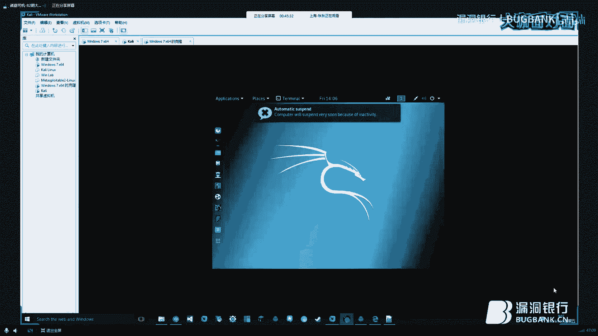

看这个地方，这个作者也是有注手，在windows7的时候使用AES加密是无法无法成功的，那么是只能使用2RC4。那么那么RC4在这个地在我们这个卡里版本又是不能使用的，所以就非常的尴尬。

pa这个地方作者是在他的文档里面专门提到了，虽然pyon是有SO库可以直接生成这种呃这种加密，但是呢呃使用open S库的话会快很多。所以说在这个地方它其实使用的是open S库。

GSL version啊，这个我也不用多说。好。那么就这些地方啊，这个是m。那我们接下来看其他地方。

Crypto。

那么这个地方可定就是我们写加密的地方，呃，这个是RC4加密。这个这个是为什么是让这样写的，我也不用多讲。呃，大家有兴趣的话，自己找网上找一下自己的文档看。这个RSRC4这个RSA的这个。

Key generate。就算成2C的G。你看我们在这边使用的是open SL。RRSA加密RSA解密，这个我也不用多说。咨询T啊，就是这个地方。这个RC4呃解密在这个地方其实我们都是没有用的。

看这个地方呃RC4是已经其实是已经在openS里面，是已经被删除了啊，这个地方是给自己的证书签名。そっこり？这个地方我也说了，priva key其实是windows是已经有了的。

windows自己已经公公布了，因为大家都已经知道这么一个攻击方法的存在了。好，那么这个地方。这个解密呃密码呃解密一些地方，这个解解除这个服务器端的这个challllege。

这个是在我们使用在我们使用creedSP的时候会用到。但是大多数时候我们是不需要不需要使用credSP的。然后这个地方就是解压出这个客户端的这个随机数。及这个地方啊，这个地方就是我们最重要的地方了。呃。

就是就是登录信息用户信息这个地方的代码实现了我们如何获得连接到这台机器的，连接到这台机器的这个用户的呃用户的信息，这个地方是非常重要的，也是我们这个最大的一个看点。这个地方是就是也压出呃。

这个客户端使用的是怎样的一个键盘。然后这个地方就是kiick translate，呃，会懂一点英文的都知道是什么意思了。这个地方就是从包里面解压处这个是哪一个哪一个按键被按下或者是放开。

这个地方嗯我们也知道这个在服务器发送给客户端的时候，发会发送一个证书，然后我们把它拦截下，换成自己的。这个地方poAP就是我们改一下RDP里面的一些包。这些这些都是就是稍微写的有点复杂。

因为它里面都是靠这个bit，就是每一个位来进行进行计算包的。那么呃这也看复杂了，脑脑袋也看的昏。那我们这里就不多仔细研究。如果想要自己开发这样的工具，造个轮子，那么你可以看一下这段代码。好。

在RDP代码下也改改出了一些地方。这个地方嗯改出。改出一定的就是包里面的一定的内容，也就是这个地方。好，grade这个地方也是比较也是一个比较重要的地方。

这个地方也是say fake fake request protocol。这个就是呃从最开始在呃客户端请求服务端请求一个请求一个协议的时候，我们就只要改掉，改成最低的这个最低的最低限度的这个加密。

那么服务端也会呃也会接受。这个地方就是这段代码如何降低我们的这个认证，降低认证级别。啊，接下来就是一些其他的代码了。

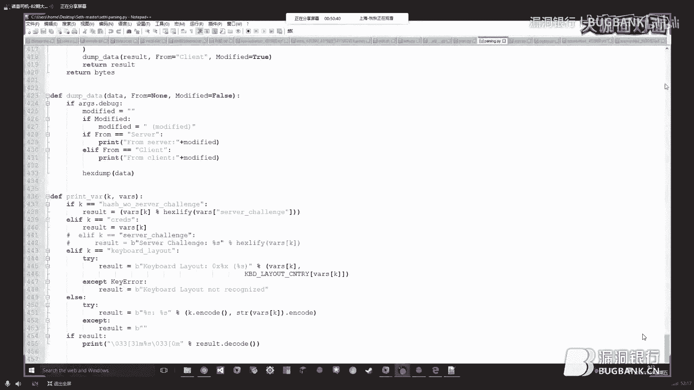

呃，能看懂派送都能看得懂。啊，art就是生成这些貂用自己的这己库这些这些这样的一个程序。么其他的东西我们暂时都不看了。那么我们是时候实战了啊，这个地方就是克隆一下这个。

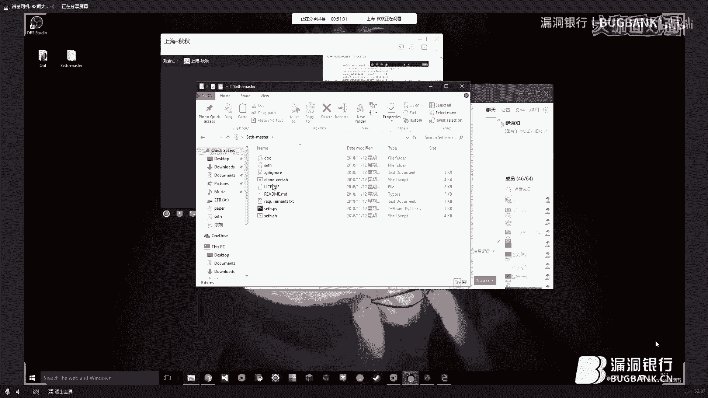

大龙恐龙呃证书所在的地。呃，咱们看一下卡里。아긴 기다리。哎呦，叫电会电会好，那么我们看一下。嗯。😊，哦。好，那么我们看一下这个s的参数。虽然我已经记住了，但是还是给大家演示一下。

而呃这个interface呃，我们的网卡呃，这个在我们在虚拟机中只有一个网卡，就是ET0呃，attackI就是我们本身的IP victim ID这个地方是就是。那不是不是服务端啊。

是这个就是连接客户端客户端的这一方。那么给台后台P就是我们的服务器。这个command这个后面其实是可以加呃，就是让它执行某一种，就是在连接成功之后呃进行一个command，呃。

就是比如说打开某个文件呀，打开什么程序啊，什么操作作都可以的。那么。那我们开始吧，首先我们再选SC去interfaceDTH0。他可IP也就是我们本身啊，我忘了记天了。好，我们是131。131呃。

我们的受害者ID，我们看一下这边是1228。228哎，然后我们作为主机，就是我自己我个人，哎，我好像还没有开哦。嗯，还是要。al一下。好，那么一就是我本人这个时机的IP了。那么我们enter。

那么我们可以看到这个地方s已经进行了中间攻击，在已经开始拦截了。从这个地址发送到我实机192。168。88。1呃，这个地址之间的流量包，并且指指间是就是就是这个SYN也就是我们2DP所使用的。

那么我们尝试一下。好，连接。我们可以看到。

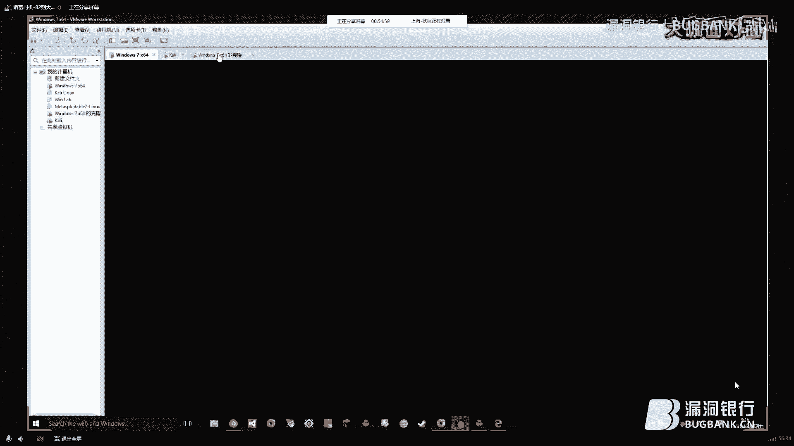

我们已经可以看到这边已经有有有有返回了。我们可以看到。m。说了什么错？

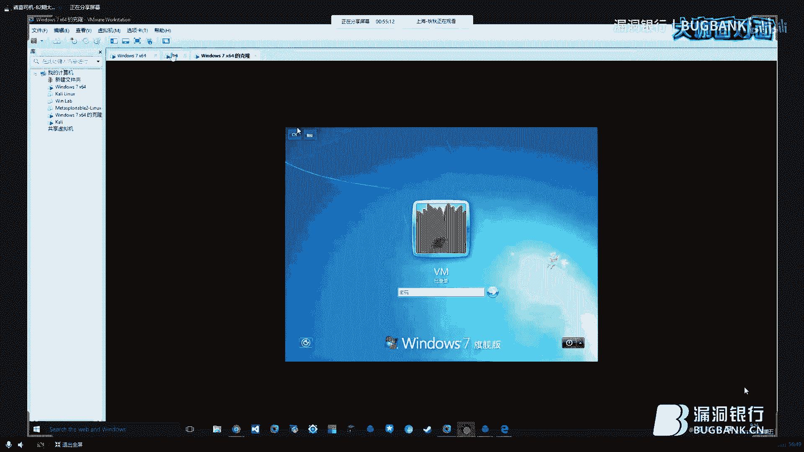

S。这个就很尴尬了呀。很像我的这个。啊，那我们看一下出了什么错。哦，可能是。这两个一3点没有开的原因。再看一段。哦这个。这个就很烦了哟。配置一下。这个应该是没有问题的呀。韩小红呢。那小点68。1。

那应该是可以呀。啊，可以了，应该是可以了。那我们再试一次啊。哦，可以了。你这个关机一下挂机吧。好，那么leting for new connection。那么我们test我的密码是change me。

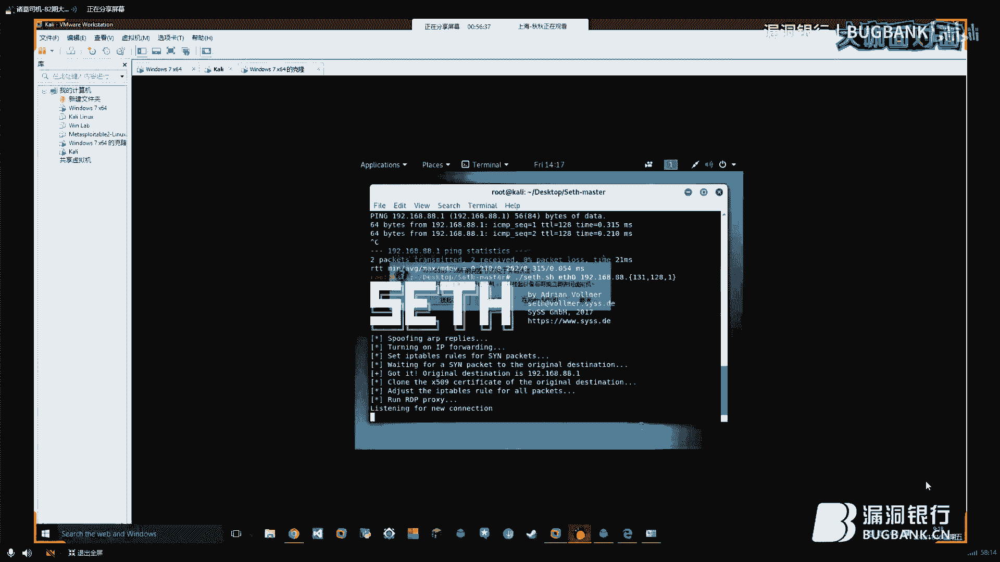

全居民OK确定你看这个地方其实出现了错误，是跟几乎是一模一样的啊。这个证书就是一个证书的证书的错误。那么一般来说是会被直接忽略。那么我们假装这个忽略了。好。

我们可以看到这边已经连上了test那这个账户因为连接是我实机，而我实机正在使用另外一个账户呃进行进行启动。那么这个时候我们就不能连接了。因为我一连接呢，我这个账户就会就会踢下去。

那么这个这个地方暂时不动，那么我们干什么？我们可以测试一下这个键盘logger，那我们试着写一下啊，嗯。我写一下什么好呢啊，秋秋。好。

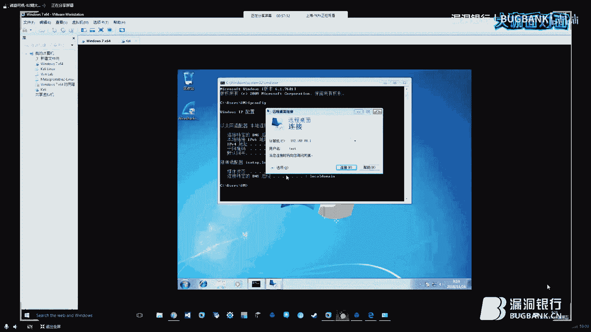

可以看到。可以看到我们这边获取的几个比较重要的信息。首先。test我们刚刚连接的用户名可以看到已经是被抓到了。change me。我们刚刚的密码也是被获取到了。可以看到这个工具所强大之处。

有了这两个东西，那我们随时随地都可以连接到这个受害呃，就是这个服务器了。接下来呃也可以看到我在这个就是我这个电脑上所使用的。所使用的这个。键盘就是这个PRC产的天体中文。那么我可以看到。

我按下了L shift，按下了Q，也就是大写的Q，空开了L shift。然后我们仔细一看，就可以看出我刚刚在按下了什么键呃，秋。9。はい。你哎舒服，是不是就很舒服了？对，是的。

阿里是作为中间人能在win7和win10之间呃作为录由。那么实战那基本的功能我就演示到这儿了。这个这个攻我们今天主要是演示这个攻击的一个原理。那么这样达到的效果大家已经看到了，其实是非常的恐怖的。

铭文的密码，然后所有键盘输入。然后我们同时这个ss还有一个功能，就是在呃开始这个攻击的时候呃，执行一条命令，或者是打开一个文件。那么通过呃进行呃进行那个操作。

那么可甚至可以直接开一个meter printer，那么呃两反弹连接到我们这个root。那么就是非常的简单啊。所以我们看到在这种攻击方式下，其实这种危害是非常的大的。

但是唯一的唯一的限制就是这种方式的限制，就是这必须是在呃两双方都是在局域网，并且我们必须要有能力获取到第一个从第一个包就开始拦截。那么只要达成这两个条件。那么此攻击方式就会有效。

然后达到一个非常大的破坏效果。对，就只需要呃只需要在局域网之间连接的两台主机的IP远程密码我们当然不知道了。我们作为攻击者，我们本来就不知道windows server所有版本都支持这个。

所有版本都支持这个这个攻击方式。但是你必须和就是在远程连接方和接触方是在同一个内网，这样才能连接到双方的包。实际上不知道对方远程密码，我们本来就不知道对方远程密码呀。我是在windows7。

我在下面我是假装就是受害者，我是假装我是一个正常连接到我的电脑的一个顾呃一个正常的用户。卡里是攻击者，我们是什么都不知道的。然而，当用户就是在在我们对我们进行了攻击之后，用户一旦点击这个连接。

并且忽略了这个证书错误的话，那么我们就可以直接获取到这个用户所使用的这个密码以及他的用户。所以说我们到这一步之前是从来都不知道用户的用户名或者是他的密码的。但是一旦用户就是建立了这个连接。

那么我们就可以直接获取到这个用户的连接用户的密码和用户名。呃，连呃点击设置，后面所有的操作都会被记录到linux上。啊。这个ss的工具的话是ss只支持录取呃，只支持记录你的那个呃键盘操作。

但是问他这个ss是支呃可以自你可以自己稍呃稍微改一下这段代码，就是改了代码了之后，你就可以记录鼠标操作之类的，这些是可以可以实现的对，所以说理论上说你的所有操作都可以是被记录在这个in上面的。

这个问题解决的时候，就是我给你们看了一下，就是在连接的时候。

会出现到。就会出现一个证书错误。你看就是这个证书错误的时候。这个时候我们需要仔细的仔细的看，或者说甚至是在CA去CA那边呃，搞一个搞一个所信呃信任过的信任过的这个证书。

或者说你就是在服务双方服务端直就是。呃，做一个就是双方服务端都能验证，就是你提前提前做好一个证书，就是双方都知道这个证书是真的，然后就只信任这个只信任这一个证书。如果这个证书一旦就是不对，无法验证。

那么就直接拒绝连接。那么这个问题就可以可很好的得到防止。可是在现实中就是很多企业都是会直接忽略掉这个问题，然后点是，然后就会导致这个攻击可行呢。

局域网里面你需要一个lininux。对啊，呃，这个其实就是你自己报台笔记本，然后你连到这个局域网里面就可以了呀。你笔记本上面运行卡里其实就可以了。对，是的是的是的。对，这个地方是对的。

除了补丁这个漏洞是没有补丁的。这个漏洞没有补丁。除了就是我刚刚所说的，就是做一个双方都可以信任的证书，然后并且让那个客户端和服务端配置只信任这个证书之外，这个呃这个漏洞没有任何任何的防止防止措施。是的。

就是中间人提前监控这两台服务器，然后等他们连接我们就可以了。可以进行多IP枚举，这个你可以用N map之类的进行网络枚举，然后就可以看一下。因为毕竟你那个服务器如果要连接的话。

那么肯定3489端口一般都是开着的。那么你就可以判断，那么这个服务器是可以用的。这个是很非常适合在实地，就是我比较擅长的这种渗头之中使用的。不知道连接的IP啊，那那也就是可以靠我们的就是秀探。

我们可以看就是在网络中有哪些就是正在呃ongoing traffic。就是我们可以看一下网络中有哪些正在进行的连接。我们第一次就是第一次秀探的时候，我们可以只看一下连接者和被连接者。

那么第二次那我们就近待，然后我们就运行这个中间人呃，中间人这个s密集的是会转发出了RDP以外制之外的所有流量。所以说在那个呃客户在受害端是看不出任何区别呢。但是一旦使用RDP那么s就会自动连接。

然后并且解包，然后进行这个攻击。对，在实地或者是内网渗透，你静待实机就可以使用这个攻击方式。这个攻击方式一旦成功，那么危害是非常的大的。呃。

就像就如我刚刚所说这个windows呃所有版本都是可以利用这个漏洞的。当然我刚啊我今天已经说过，windows7连接到windows7的时候，这个呃这个s有一个bug呃，这个这个我会联系作者呃。

合作一下，修复一下这个地方。

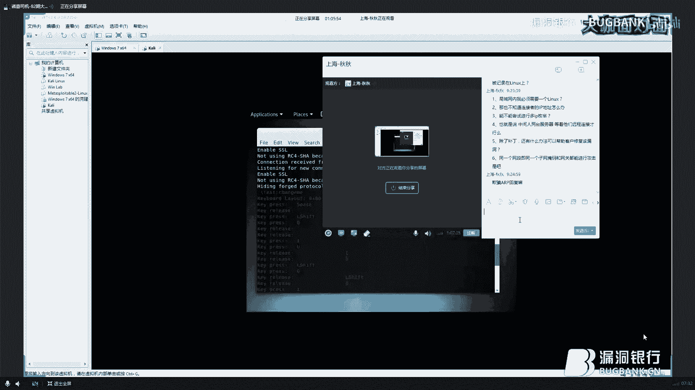

真这时候怎么不能包笔记本啊？就像我刚刚说的一样，我是擅长就是在实地实地渗头的。呃，比如说什么。

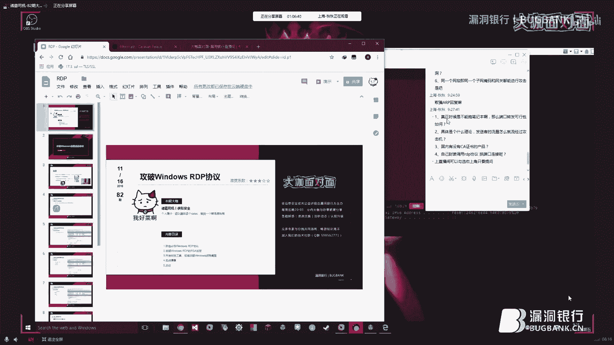

呃，比如说什么在咖啡馆里渗透啊，什么在学校里渗透啊，这些是我比较擅长的。端方端客转发这个我是不知道，我觉得应该是不可行的。这个中间人攻击的原理是不是这样的。

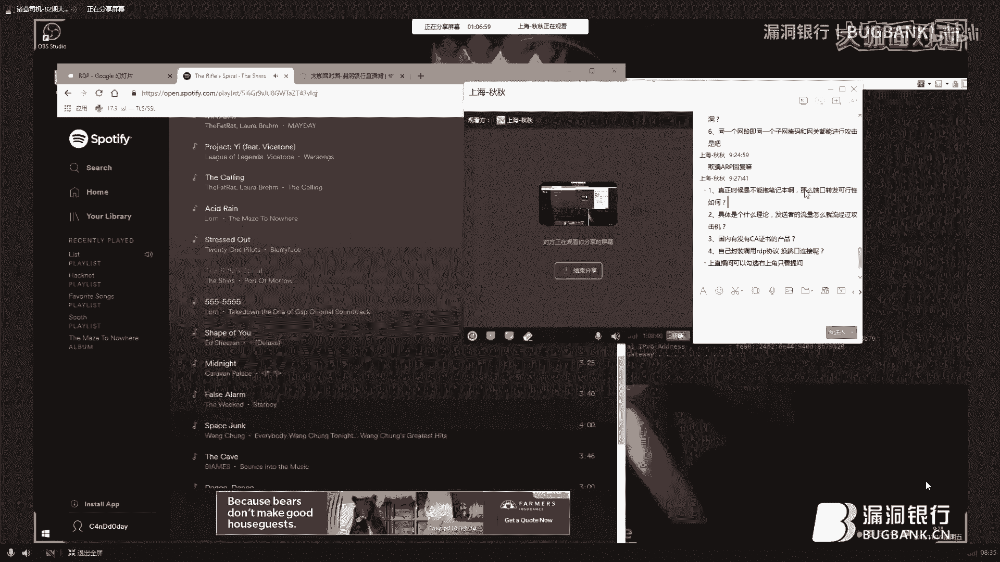

嗯，那这个真正时候肯定是可以包笔记本啊，我一般都是抱着我的笔记本，然后去实地进行精行渗透。嗯，什么理论，这个中间人工机呃理论你可以自己网上查一下呃。怎么就经经过流量公积机。

这个中间人的原理我这里就不讲了，这很简单的，可以自己百度一下。自己封装调用RDP呃，也是可以的。我觉得应该呃理论上来说应该是可以的。我自己没有测试过这个这次我也是最近才开始研究的。如果需要一起研究的话。

那我会很乐意呃和你一起研究一下这个地方。不在1个IP段的话，可能是应该是不行的，这个就比较惨了。这个不是一个网关的话，这个这个就有些惨。嗯，看一下。对，对，这个是一样的一样的原理。对对对对对。

一样的一样的。呃，这位同学很有灵性啊，已经听懂了。😊，嗯，对，这个是有灵性。哎，adam哎，我也是原来用的，我是挺喜欢那个就是打字的时候会给你一个camer下，这个我觉得是非常的非常的爽啊。啊，对对对。

V嘛编辑机是神呢？阿里开心的用backrack呃，backrack又太老了，这个这backrack都没有那个backack呃backrack是没有那个呃pythonpython3的。

这个s是必须进行在派thon3。😊，内网当然是可以连接3389啊。这个。3389肯定是不仅限于外网呀，内网在是很繁用的。在局域网中呃，这个3389端口仍然是比较泛用的一个端口。

那么在呃外网这个这个攻击方式是无法用的，因为这个是中间攻击，只限于是局域网。对，这个是是的。这个所有的版本都是支持的。呃，这个我刚刚已经讲过了，这个不用买设备，就是给双方都弄一个证书。对。

这个这个就是我最想最想弄的搞个基器就图书馆。如果open Sel和pyython version是够的话，那么应该是可以的。就是从内网啊就是这个攻具方式只能适用于内网。可以可以的。

只要只要把端口改一下就行了。这个其实我们都是没有监视呃，这个s瑟呃监视是不是仅限于端口的，它是仅限于连接，就是协议RDP协议。这个自己这个bug已经修好了，但是怎么说呢？只能在我这个电脑上用呃。

暂时我就不弄出来了。我呃过两天我给那个。呃，过两天我给作者发一个布吧，我看看他有没有时间给我弄一下。墨迹到我这个里面去。我一般都是么，我一般都是在实地进行进行研究的。对，这个这个是对的，手机便捷。对。

是的，我最近在打造一个就是手机和呃电脑交互进行一个移动式实地渗投的一个平台。到时候可以给你们看一下呃，ss是比较新，我觉得是sS是比较好。对你必须先进入你的客户的局域端，才能进使用这个方式进行渗透。对。

是可以这样的。从内往外往都可以不用证书啊，这个这个证书一般一般人都是没有，一般人都是没有证书的。这个不是，这个就是一个linux小技巧这个。就是用这个括号括起来的意思就是监听两个机器。

第一个机器就是我们的呃攻击者，就是没有进听，就是我们本身的IP呃，这个128是我们要监听的客户端，一是受害者服务端。整个网段的话，你可以多开几个呀。这个整个网段的话，你可以多开几个工具。

这个这个工具并不是那么智能。s呃这这里这个ca里里面呃是不自在的，你需要自己去get up去买去买一个。这个公呃很多公司都可以啊，很多公司呃，怎么说在至少是在国外是这样吧，呃。

靠社会工程学可以很很轻易的混入到公司的公司的内部，然后随便找个借口就进入到了公司的局域网，这个是是需要用社工的。当然我不知道这个在国内社工是不是算也是渗透的一环。不过在国外这个是算的。不用配置。

直接从那个get up上面抓下来就可以了。所并不是只针对RRC4的。呃是支持其他几个降密方式的啊，取消RRC4的原因好，也给你看一下。这个地方呃Oel官方写的就是为何取消为何取消这个2C4。

信息收集方面吗？啊，多借用google呃，这个google式大神器。然后不就是不要怕和呃和就是实地的人员交流吧。就是你可以跟比如说什么，比如说如果说我就想要渗透掉。

想要社工一下这个bg bank那么我肯定会找秋秋，因为秋秋比较nice呃，Q球比较友善，就从秋秋入手。然后就是靠一些信息呀，呃，比如说什么昨天我才在呃QQ当的这个开刀的猪，我获取到他的IT。

然后也搜查了一下位置。呃，大概就是在上海这个隐私隐私不透露，也有很多方式进行信息收收集的，你可以多开几个CCS一次只能进行一个呀。反向萨是没有办法。嗯。对，这个是只能是点对点的，点对面是不行这个。

这个反向sax是对对对，理论上来说是应该是没有办法了。不过你1个3389，你在你1个3389，你为什么会用反向sax？这个LRP防火墙是呃从来没见到过的。一般的企业都是没有什么呃都是没有的。

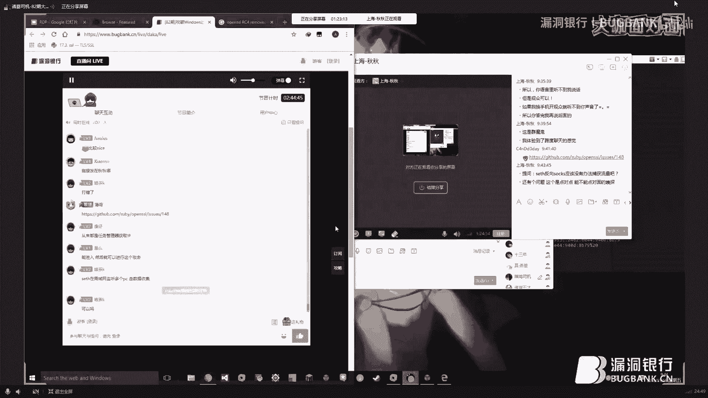

微软的这个RTB密是吗？哎，文档后面有寄到过。哦，这个样。A。

嗯，我把地址直接发给秋秋。

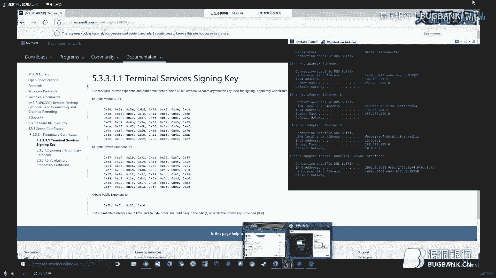

口交换机啊，但是既然你已经进入了内网环境了的话，你想要绕过这种东西啊，限制发包速率嘛。嗯。可以啊，内网直接扫3389是可以大幅度缩小的。这个一般你远程连接。呃，云程连接的话，你都可以直接。呃。

一般都是设设置在3389的，没有人改端口，至少大部分人是没有没有改过的。国外的韵文你还是别小看了，国外的各种不知道有一本书你有没有听说过没有高级渗透手册，好像也是教这样。

这些呃这些讲的就是如何在有防火墙。有防火墙的环境下呃，如何进行这种渗透，当然这个方式肯定是不可能在有ARP防火墙的这个。这个环境下用的。就像我刚刚说的一样，我这个方式只是心灵的就是。对。

这个密罐肯定是有了嘛。不过既然都已经有有胆量，直接进对面公司大楼里面去直接进行实地实地渗透了。那我觉得你应该密罐应该是肯定是有办法分辨的吧。

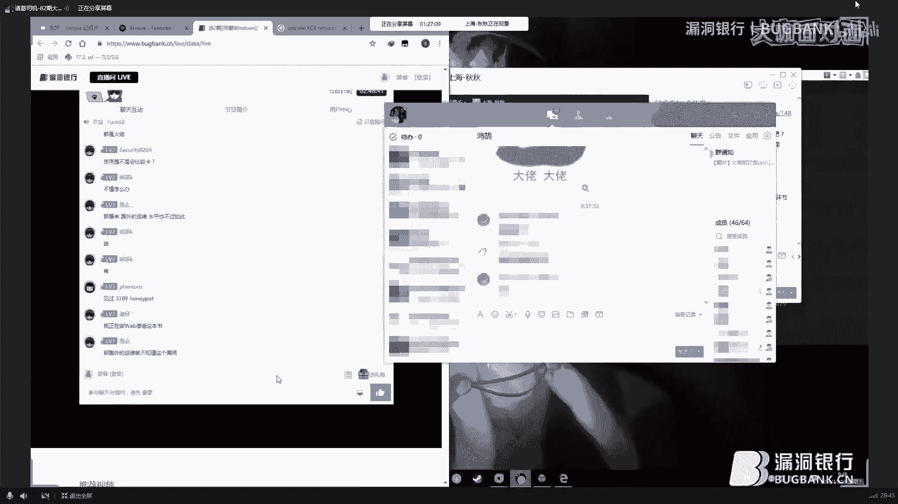

嗯，非常感谢今晚诸葛司机的分享。😊，嗯，以解很多问题，然后也内容讲的非常完整，就是我们要准备给大家送书了。今晚的证书是IDApro权威测试指南第二版。

这本书呢之前有介绍过是IDApro开发者亲自推荐立向工程师的必备手册。😊，那今天晚戏观众会是谁呢？我们可以让大咖来揭晓一下。好，为了表示我们是公平的，我给你们看一下，我是不是在让他哎在让他选那个。

谢谢观众，我在让大咖来那个选书，大咖还是因为带宽的问题，他不愿意接我的QQ语音。

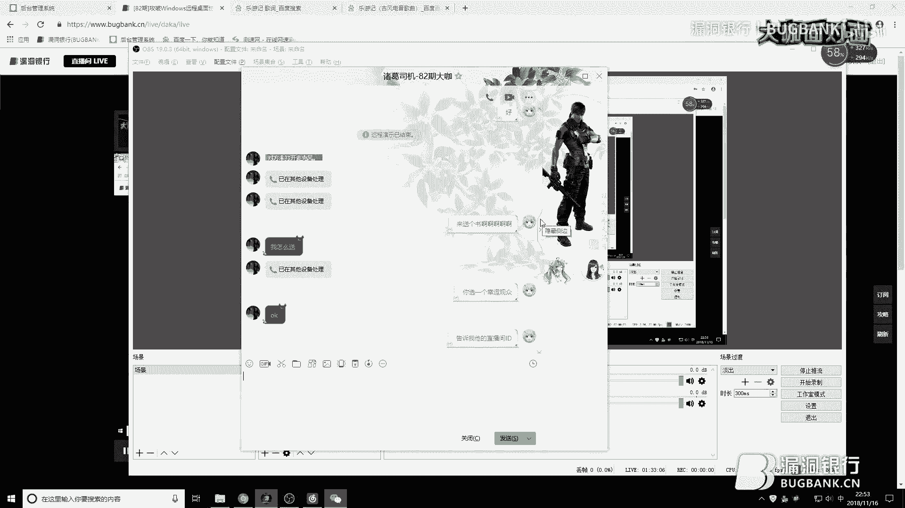

76757。好，看到这676757小伙伴。哇，这两个字我读过。🎼好，叫芷若，是叫芷若门心吗？那恭喜这位叫做芷若门心的小伙伴，你获得了今晚的这本大咖赠书嗯，IDApro权威指南第二版。

🎼那请你在今晚直播后直接联系我这边兑奖，或者通过直播间的提醒来留下你的联系方式。然后我们这边会呃跟你联系，然后问你要特殊地址，把礼物寄给你。好，那你没有拿到书条伙伴，不要遗憾，我们直播每周五都有。

大家可以到时再来那个。

围观吧，然后争取拿礼物。那今天再次感谢我们诸葛司机大咖的付出和准备。大卡人在美国，我们虽然沟通起来有时差有一点点坎坷，但我们今晚直播还是非常顺利的举办了，可以说还是一次非常有意义的一次直播。

那希望大家都可以收到这次来自嗯大洋彼岸的知识馈赠。😊，那朱葛司机呢也在我们的技术三群里面，欢迎大家和他多多交流，大家可以加他好友。那同时也请大家可以多多关注侠影安全的动态。😊。

🎼嗯，当然啦，我们也要感谢所有观众伙伴踊跃参与。那大咖应对面是一个传播知识技术，闪现白猫风采的舞台。如果你想像和大咖一样登台来分享，可以主动找我报名，加入漏洞银行大咖天团更参加年度大咖活动。

结交往期大咖伙伴，获得更多福利优待。那下面还有个事情就有一个特别的活动，想告诉大家，那漏洞银行我们其实是2016年正式对外运营。很多小伙伴都在问我说，我们什么时候可以和表姐面基，什么时候有线下的活动。

大家一催我这是催了两年多，现在都2018年年底了。😊。

那这一天究竟什么时候来呢？我要告诉你们，已经安排上了。在2019年，也就是明年，我们将在上海举办首届金帽子网络安全公益盛典。😊，那也是寄漏洞银行的呃十周年的一个庆典。我给你们看一下是啥啊。

这里十周年庆典。🎼大家可能会好奇为什么十周年？因为我们是2009年成立的团队，所以是创业十周年。所以明年金帽子盛典呢，会是我们对过去十年的作业展示，也会是我们对将来十年真诚起点。

我们想要这样一个大会来表彰所有默默守护这个网乱学时代的白帽子的。所以欢迎大家来关注我们这次线下大会。2019年诚要素有白帽子参与我们这次活动，到时记得一起来玩呀。我们再次感谢今晚来分享的诸葛司机打卡。

😊，好的，那今晚直播就先到这边结束啦，感谢大家的参与，小伙伴们再见，下周五再见喽。😊，これプやろ。🎼We come。🎼Noown， down， down down。

